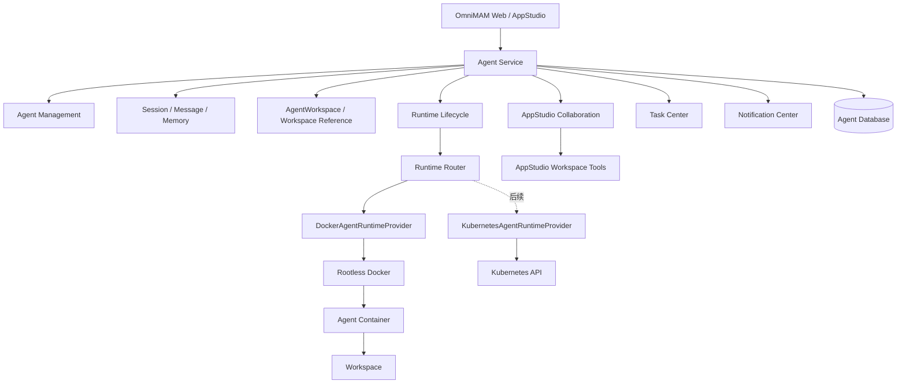
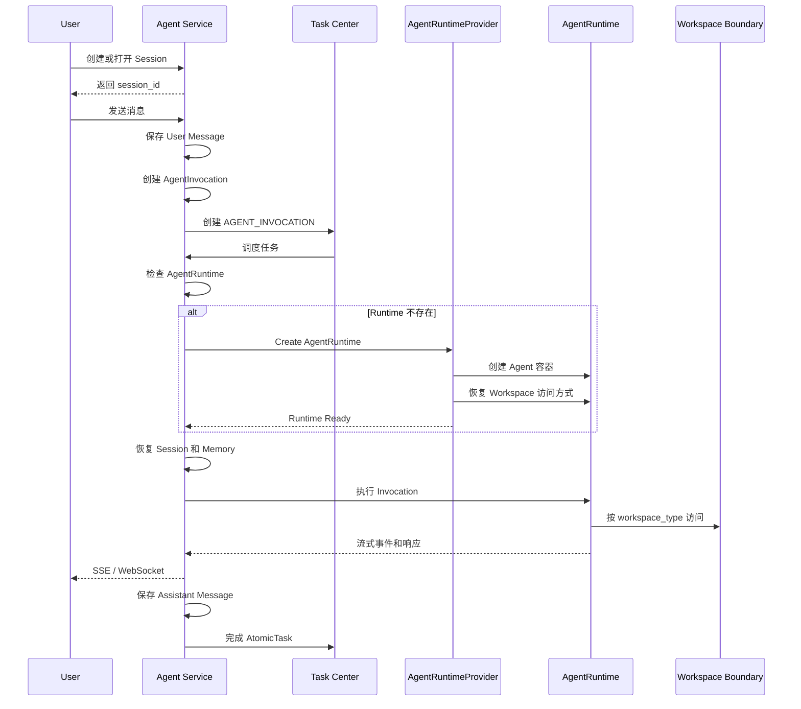

# OmniMAM Agent 功能设计

> 文档版本：v1.1-draft
> 文档状态：未 Release，不得作为正式实现依据
> 第一阶段 Agent Provider：Hermes、OpenCode
> 第一阶段 AgentRuntimeProvider：Rootless Docker
> 后续 AgentRuntimeProvider：Kubernetes
>
> 本文只定义 Agent 交互、会话、记忆、工作区引用和 AgentRuntime 产品语义。生成式 Web/BFF 应用的源码、构建、发布和运行事实见 `00_product/domains/appstudio/product-spec.md`。

---

## 1. 文档目的

本文定义 OmniMAM Agent 模块的完整设计，包括：

* Agent 持久化实体
* Platform Agent 与 Coding Agent
* 交互式 Session、Message、Invocation 和 Memory
* AgentWorkspace 创建、关联和生命周期
* Coding Agent 对 StudioWorkspace 的固定引用
* AgentRuntime 生命周期
* AgentRuntimeProvider 抽象
* Rootless Docker 运行方式
* Coding Agent 与 AppStudio 的受控协作
* Task Center 异步任务和周期维护
* Agent 可靠领域事件
* AgentRuntimeProvider 健康检查
* 状态对账和异常恢复
* 配额与安全边界

---

# 2. 第一阶段范围

## 2.1 Agent 类型

第一阶段支持：

```text
platform
coding
```

### Platform Agent

Platform Agent 用于调用 OmniMAM 平台能力，例如：

* 查询素材
* 调用平台应用
* 创建和查询任务
* 操作平台功能
* 执行内容分析
* 生成报告
* 保存工具调用产物
* 调用 OmniMAM MCP 或内部 API

### Coding Agent

Coding Agent 用于开发生成式应用，例如：

* 创建代码
* 修改代码
* 读取 AppStudio 管理的应用清单和蓝图
* 通过受控 Tool 提交 ChangeSet
* 请求 AppStudio 执行预览检查
* 读取 AppStudio 返回的构建诊断
* 根据诊断修复源码

Coding Agent 不拥有源码 Workspace、Build、Release 或生成应用 Runtime，也不能绕过 AppStudio 直接构建、发布或启动应用。

---

## 2.2 Agent Provider

第一阶段支持：

```text
hermes
opencode
```

Hermes 和 OpenCode 都运行在独立的 AgentRuntime 中。

Agent Service 通过 Agent Provider Adapter 屏蔽两者的：

* 启动参数
* 会话恢复方式
* 指令调用方式
* 工具调用协议
* 日志格式
* 事件格式
* 取消方式

---

## 2.3 交互方式

所有 Agent 都是持续存在的交互式 Agent。

系统不设计一次性 Agent，也不设计独立的一次性命令模式。

每次用户输入都属于一个 AgentSession，并形成一次 AgentInvocation。

```text
Agent
    ↓
AgentSession
    ↓
AgentInvocation
    ↓
AgentMessage
```

即使用户只发送一条消息，也使用正常 Session。

---

# 3. 核心设计原则

## 3.1 Agent 不等于容器

Agent 是持久化业务实体。

用户创建 Agent 时，不立即创建运行中的容器。

```text
创建 Agent
    ↓
准备或关联 Workspace
    ↓
Agent = READY
    ↓
等待用户创建 Session 并发送消息
```

只有真正执行 AgentInvocation 时，才按需创建 AgentRuntime。

---

## 3.2 移除独立 Runtime Manager

系统不再启动独立的 Agent Runtime Manager。

Agent Service 统一负责：

* AgentRuntimeProvider 选择
* AgentRuntime 生命周期编排
* Runtime 状态记录
* Runtime 健康检查
* Runtime 状态对账
* 空闲挂起和恢复
* AgentRuntimeProvider 切换
* Runtime 异常修复

但 Agent Service 的业务代码不能直接散落调用 Docker API 或 Kubernetes API。

底层环境操作统一通过：

```text
AgentRuntimeProvider
```

---

## 3.3 每个 Agent 只引用一个 Workspace

每个 Agent 通过：

```text
Agent.workspace_type
Agent.workspace_id
```

固定引用一个 Workspace。`workspace_type` 只允许：

```text
agent
    Platform Agent 使用 Agent 领域拥有的 AgentWorkspace

studio
    Coding Agent 使用 AppStudio 领域拥有的 StudioWorkspace
```

不支持：

* 一个 Agent 同时使用多个 Workspace
* Session 使用不同 Workspace
* Session 中途切换 Workspace
* 附加辅助 Workspace
* 多 Workspace 挂载模型

Agent 的所有 Session 和 Invocation 都继承同一个 Workspace 引用。Coding Agent 创建后不得切换到其他 StudioWorkspace；需要处理其他应用时必须创建新的 Coding Agent。

多个 Coding Agent 可以固定引用同一个 StudioWorkspace。它们不得直接并发写入存储，而是分别基于 `base_revision` 向 AppStudio 提交 ChangeSet，由 AppStudio 执行冲突检测。

---

## 3.4 Workspace 事实按类型归属

Platform Agent 使用的 `AgentWorkspace` 是 Agent 领域的独立持久化资源，可以在创建 Platform Agent 时自动创建，也可以引用用户已有且受权的 AgentWorkspace。

Coding Agent 使用的 `StudioWorkspace` 由 AppStudio 在创建 StudioApplication 时创建和管理。Agent Service 只保存稳定引用，并在创建 Agent、启动 Runtime 和执行 Invocation 前通过 AppStudio 校验可用性与授权。

AgentWorkspace 需要区分：

```text
created_by
谁执行了创建操作

owner
谁决定 Workspace 生命周期
```

Agent 删除时：

* Agent 拥有的 AgentWorkspace 可以随 Agent 删除；
* 用户或系统拥有的 AgentWorkspace 不得由 Agent 删除；
* StudioWorkspace 始终由 AppStudio 决定生命周期，Coding Agent 删除、停用、挂起或 Runtime 重建均不得改写它。

---

## 3.5 AgentRuntime 与 Studio Runtime 分离

```text
AgentRuntime
运行 Hermes 或 OpenCode

StudioRuntimeInstance
运行 AppStudio 发布的 Build Artifact
```

二者属于不同领域并具有独立生命周期。Agent Service 只管理 AgentRuntime；AppStudio 管理 Preview Runtime、StudioRelease 和 StudioRuntimeInstance。

AgentRuntime 被空闲回收或 Agent 被删除后，已发布的 StudioRuntimeInstance 可以继续运行。

---

# 4. 总体架构



---

# 5. Agent Service 职责

Agent Service 负责业务层决策。

## 5.1 Agent 管理

* 创建 Agent
* 查询 Agent
* 更新 Agent 配置
* 停用和启用 Agent
* 删除 Agent
* 管理 Agent 状态
* 管理 Agent Provider
* 管理 Agent 权限

## 5.2 Session 和 Memory

* 创建 Session
* 保存消息
* 创建 Invocation
* 保存 Session Summary
* 提取 Memory
* 恢复 Session 上下文
* 处理长会话压缩
* 管理跨轮次记忆

## 5.3 Workspace

* 创建和管理 AgentWorkspace
* 校验已有 AgentWorkspace
* 通过 AppStudio 校验 StudioWorkspace
* 将 Workspace 关联到 Agent
* 管理 AgentWorkspace 状态和容量
* 创建和恢复 AgentWorkspace Snapshot
* 根据 Workspace 类型与 Owner 决定是否删除

## 5.4 Runtime

* 判断是否需要启动 Runtime
* 选择 AgentRuntimeProvider
* 创建 AgentRuntime
* 启动、停止和删除 Runtime
* 空闲挂起
* Session 恢复
* Runtime 重建
* Runtime 状态对账
* Runtime 异常修复

## 5.5 AppStudio 协作

* 校验 Coding Agent 的 StudioWorkspace 引用与授权
* 为 AgentInvocation 获取短期 Workspace Tool 授权
* 通过 Tool 读取文件、应用清单、蓝图和当前 Revision
* 向 AppStudio 提交带 `base_revision` 的 ChangeSet
* 请求预览检查并读取构建诊断
* 保存 AppStudio 返回的稳定对象引用和操作摘要

Agent Service 不创建或拥有 StudioChangeSet、StudioSourceSnapshot、StudioBuild、Artifact、StudioRelease、Preview Runtime 或 StudioRuntimeInstance。

## 5.6 平台协作

* 创建 Task Center 任务
* 发布可靠 Agent 领域事件
* 保存审计记录
* 执行配额检查
* 管理周期维护任务

Notification Center 可以消费已登记的 Agent 领域事件并形成用户通知，但通知、已读状态和聚合规则不属于 Agent 领域。

---

# 6. Agent 实体

```text
Agent
- id
- user_id

- name
- description

- kind
  - platform
  - coding

- provider
  - hermes
  - opencode

- workspace_type
  - agent
  - studio

- workspace_id

- status
- status_reason
- disabled

- current_runtime_id

- runtime_profile_id
- preferred_runtime_provider

- provider_config
- system_prompt
- permission_profile_id

- last_started_at
- last_active_at
- last_suspended_at

- created_at
- updated_at
- deleted_at
```

约束：

```text
一个 Agent 必须通过 `workspace_type + workspace_id` 固定引用一个 Workspace。

Platform Agent 必须引用 AgentWorkspace；Coding Agent 必须引用 StudioWorkspace。

一个 Agent 同时最多存在一个活动 AgentRuntime。

一个 Agent 可以拥有多个 AgentSession。

一个 AgentSession 必须属于一个 Agent。
```

---

# 7. Agent 状态

Agent 状态属于业务状态，不等于 Runtime 状态。

```text
CREATING
正在初始化 Agent 或创建 Workspace

READY
Agent 已创建，尚未启动过 Runtime

STARTING
正在创建或恢复 AgentRuntime

RUNNING
当前存在正在执行的 AgentInvocation

IDLE
AgentRuntime 仍然存在，但当前没有 Invocation

SUSPENDED
AgentRuntime 已释放，Session、Memory 和 Workspace 保留

ERROR
Agent 初始化、恢复或运行失败

DISABLED
Agent 被用户或管理员停用

DELETING
Agent 正在删除
```

状态映射：

```text
Agent 正在删除
→ DELETING

Agent 被停用
→ DISABLED

Agent 初始化失败
→ ERROR

存在 RUNNING Invocation
→ RUNNING

Runtime 正在创建或启动
→ STARTING

Runtime 正常存在且无 Invocation
→ IDLE

不存在 Runtime，且 Agent 从未运行
→ READY

不存在 Runtime，且 Agent 曾运行
→ SUSPENDED
```

---

# 8. AgentSession

AgentSession 表示用户与 Agent 的一段持续对话。

```text
AgentSession
- id
- agent_id
- user_id

- title

- status
- status_reason

- provider_session_id
- current_runtime_id

- context_version
- summary

- last_message_at
- last_invocation_at
- last_compacted_at

- created_at
- updated_at
- closed_at
```

Session 不保存单独的 Workspace。

Workspace 通过以下关系获得：

```text
AgentSession.agent_id
    ↓
Agent.workspace_type + Agent.workspace_id
    ↓
AgentWorkspace 或 StudioWorkspace
```

---

## 8.1 Session 状态

```text
CREATING
正在初始化 Session

ACTIVE
Session 可以继续接收消息

PROCESSING
当前存在执行中的 Invocation

IDLE
当前没有执行任务

SUSPENDED
AgentRuntime 已释放，但 Session 可以恢复

CLOSED
Session 已关闭

ERROR
Session 上下文恢复失败
```

AgentRuntime 被删除不会删除 Session。

---

# 9. AgentInvocation

AgentInvocation 表示 Session 中的一轮用户交互。

```text
AgentInvocation
- id
- agent_id
- session_id
- runtime_id
- atomic_task_id

- sequence_no
- parent_invocation_id
- input_message_id

- status

- started_at
- heartbeat_at
- completed_at

- output_summary
- result

- error_code
- error_message

- created_at
- updated_at
```

状态：

```text
QUEUED
等待 Task Center 调度

WAITING_RUNTIME
等待 AgentRuntime 创建或恢复

RESTORING_CONTEXT
正在恢复 Session、Message 和 Memory

RUNNING
正在执行当前交互轮次

WAITING_USER
Agent 已返回需要用户补充的信息

SUCCEEDED
当前轮次执行成功

FAILED
当前轮次执行失败

CANCELED
当前轮次被取消

TIMEOUT
当前轮次执行超时

LOST
执行状态无法确认
```

当 Agent 需要用户补充信息时：

```text
当前 Invocation 返回确认或补充请求
    ↓
当前 Invocation 结束
    ↓
Session 保持 ACTIVE
    ↓
用户回复
    ↓
创建新的 Invocation
```

不让一个 AtomicTask 无限等待用户回复。需要用户补充时结束当前 Invocation 和 AtomicTask，用户回复后创建新的 Invocation 和 AtomicTask。

---

# 10. AgentMessage

```text
AgentMessage
- id
- session_id
- invocation_id

- role
  - user
  - assistant
  - system
  - tool

- message_type
  - text
  - tool_call
  - tool_result
  - code_diff
  - artifact
  - approval_request
  - error
  - status

- content
- structured_content

- sequence_no
- parent_message_id
- token_count

- created_at
```

原始消息是会话事实。

生成 Session Summary 后不能删除原始消息。

---

# 11. AgentMemory

AgentMemory 保存从会话中提取的可复用信息。

```text
AgentMemory
- id

- scope_type
  - session
  - agent

- scope_id

- memory_type
  - user_preference
  - project_fact
  - architecture_decision
  - environment_fact
  - unresolved_issue
  - workflow_state
  - summary

- key
- content
- structured_content

- source_session_id
- source_invocation_id
- source_message_ids

- confidence
- version

- status
  - active
  - superseded
  - deleted

- created_at
- updated_at
```

上下文恢复顺序：

```text
Agent System Prompt
    ↓
Agent Memory
    ↓
Session Summary
    ↓
最近消息
    ↓
Workspace 当前状态或权限裁剪的 Revision 摘要
    ↓
当前用户输入
```

不应在每次恢复时把全部历史消息发送给模型。

---

# 12. Workspace

## 12.1 AgentWorkspace 实体

`AgentWorkspace` 只服务 Platform Agent，保存用户授权输入、Agent 产物、下载文件、临时文件和可恢复的本地状态。

```text
AgentWorkspace
- id
- name
- description

- owner_type
  - agent
  - user
  - system

- owner_id
- created_by_type
- created_by_id

- status
  - CREATING
  - READY
  - MOUNTED
  - ERROR
  - DELETING
  - DELETED

- storage_type
  - local_directory
  - docker_volume
  - nfs
  - pvc

- storage_ref
- size_bytes
- current_snapshot_id
- created_at
- updated_at
- deleted_at
```

推荐目录：

```text
/workspace
├── inputs/
├── outputs/
├── artifacts/
├── downloads/
├── temp/
└── state/
```

AgentRuntime 可以将 AgentWorkspace 挂载到 `/workspace`。Agent Service 负责其容量、Snapshot、恢复和 Owner 校验。

---

## 12.2 StudioWorkspace 引用

`StudioWorkspace` 是 AppStudio 的源码编辑事实。Coding Agent 只保存其稳定 ID，不复制源码索引、Revision、ChangeSet、Snapshot 或存储位置。

Coding Agent 访问 StudioWorkspace 时必须满足：

* Agent 创建时已经固定 `workspace_type=studio` 和 `workspace_id`；
* 当前用户仍可访问对应 StudioApplication；
* StudioWorkspace 处于允许读取或修改的状态；
* AppStudio 为当前 AgentInvocation 签发了有界、短期的 Tool 授权；
* 写入操作必须通过带 `base_revision` 的 ChangeSet 完成。

Coding Agent 不直接挂载 AppStudio 数据目录。AgentRuntime 可以使用不构成业务 Workspace 的临时执行目录保存 Provider 进程文件，但该目录不得成为应用源码事实或绕过 AppStudio Tool。

---

## 12.3 唯一绑定规则

```text
Platform Agent
    → workspace_type = agent
    → AgentWorkspace

Coding Agent
    → workspace_type = studio
    → StudioWorkspace
```

不建立多 Workspace Binding。Session 和 Invocation 不保存可覆盖 Agent 绑定的 Workspace 字段，也不允许调用方在消息请求中指定其他 Workspace。

---

# 13. Workspace 创建与绑定流程

## 13.1 Platform Agent 自动创建 AgentWorkspace

```text
创建 Platform Agent
    ↓
Agent = CREATING
    ↓
Agent Service 创建 AgentWorkspace
    ↓
AgentWorkspace.owner_type = agent
AgentWorkspace.owner_id = agent.id
    ↓
Agent.workspace_type = agent
Agent.workspace_id = agent_workspace.id
    ↓
AgentWorkspace = READY
    ↓
Agent = READY
```

创建失败时 AgentWorkspace 与 Agent 进入可诊断的 ERROR 结果，不创建可执行 Session。

---

## 13.2 Platform Agent 使用已有 AgentWorkspace

Agent Service 必须检查 AgentWorkspace 存在、状态可用、当前用户有权使用，并保留原 Owner。Agent 删除时不得删除不属于自身的 AgentWorkspace。

---

## 13.3 Coding Agent 绑定 StudioWorkspace

创建 Coding Agent 时必须显式提供 AppStudio 已创建的 `studio_workspace_id`：

```text
AppStudio 创建或选择 StudioWorkspace
    ↓
校验当前用户和 Coding Agent 配置
    ↓
创建 Coding Agent
    ↓
Agent.workspace_type = studio
Agent.workspace_id = studio_workspace_id
    ↓
Agent = READY
```

未提供 StudioWorkspace、Workspace 不存在、已归档、不可访问或类型不匹配时，创建失败，不自动创建通用 Workspace 兜底。

---

# 14. Workspace 生命周期

## 14.1 AgentRuntime 删除

删除 AgentRuntime 只释放执行环境。Session、Memory 和 Workspace 引用保留，Agent 进入 SUSPENDED。Platform Agent 下次恢复时重新挂载原 AgentWorkspace；Coding Agent 下次恢复时重新获取 AppStudio Tool 授权。

## 14.2 Agent 删除

```text
Agent = DELETING
    ↓
停止当前 Invocation
    ↓
关闭 AgentSession
    ↓
停止并删除 AgentRuntime
    ↓
按 workspace_type 处理
```

`workspace_type=agent` 时，只有 `owner_type=agent` 且 `owner_id=当前 Agent` 的 AgentWorkspace 可以随 Agent 删除；否则仅移除引用。

`workspace_type=studio` 时，Agent Service 只能删除 Agent 自身，不得删除、归档、恢复或修改 StudioWorkspace，也不得影响其 ChangeSet、Snapshot、Build、Release 和 StudioRuntimeInstance。

---

# 15. AgentRuntimeProvider 抽象

## 15.1 产品职责

`AgentRuntimeProvider` 是 Agent Service 使用的系统注册组件，只负责 Hermes 或 OpenCode 执行环境的底层操作：

* 按受控 Runtime 规格创建、启动、停止和删除 AgentRuntime；
* 查询 Provider Runtime 状态和受管实例；
* 获取 Agent Provider 启动、恢复和取消所需的受控执行通道；
* 返回经过脱敏和权限校验的日志；
* 执行 Provider 健康检查；
* 使用稳定幂等键避免重复创建同一代 Runtime。

`AgentRuntimeProvider` 不决定 Agent 是否应该启动、Session 是否恢复、Workspace 生命周期、用户权限或 AppStudio 的构建和部署。业务决策由 Agent Service 作出，生成应用运行由 AppStudio 的 `StudioDeploymentProvider` 负责。

## 15.2 Runtime 规格语义

Agent Service 提交给 Provider 的规格只包含运行 Agent 所需的受控信息：Agent/Runtime 稳定 ID、Hermes 或 OpenCode 镜像与启动参数、资源上限、网络策略、短期凭证、Workspace 访问方式、标签和幂等键。

规格不得允许 Agent 指定任意宿主路径、基础设施 Socket、生产 Secret、AppStudio 存储位置或生成应用部署参数。

---

# 16. Provider Runtime 引用

底层 Docker Container ID 或 Kubernetes Workload UID 只作为 `AgentRuntime.provider_runtime_id` 保存。它不是独立的跨领域业务对象，也不得用于承载 Build、Test 或 Studio Application Runtime。

---

# 17. Runtime 状态

Runtime 生命周期状态：

```text
PENDING
等待资源或等待创建

CREATING
正在创建底层实例

STARTING
实例已经创建，内部服务正在启动

RUNNING
实例已经启动并通过就绪检测

SUSPENDING
正在准备释放实例

SUSPENDED
底层实例已释放，可以重建恢复

STOPPING
正在停止实例

FAILED
创建、启动或恢复失败

DELETING
正在删除

DELETED
实例已删除
```

运行忙闲状态独立保存：

```text
IDLE
BUSY
UNKNOWN
```

示例：

```text
state = RUNNING
activity_state = IDLE
```

表示 Runtime 正常存在，但当前没有 Invocation。

---

# 18. DockerAgentRuntimeProvider

第一阶段只实现：

```text
DockerAgentRuntimeProvider
```

DockerAgentRuntimeProvider 连接专用 Rootless Docker Daemon。

```text
Agent Service
    ↓
DockerAgentRuntimeProvider
    ↓
Rootless Docker Daemon
    ↓
Agent Container
```

不连接宿主机 Root Docker Socket。

---

## 18.1 Docker Provider 职责

* 创建 Container
* 启动 Container
* 停止 Container
* 删除 Container
* 创建受控 Network
* 挂载已授权的 AgentWorkspace
* 设置端口映射
* 设置 CPU 和内存限制
* 注入环境变量
* 获取日志
* 执行容器命令
* 查询容器状态
* 获取访问 Endpoint
* 查询受管容器
* 检查 Rootless Docker 健康状态

---

## 18.2 Rootless Docker 隔离

本 Provider 使用的基础设施 Rootless Docker 只管理 AgentRuntime。

Agent 容器不能访问基础设施 Rootless Docker Socket。

Coding Agent 不能借助 AgentRuntime 控制基础设施 Docker，也不能自行构建或启动 StudioApplication。预览、测试和正式构建必须请求 AppStudio 的受控能力。

---

# 19. KubernetesAgentRuntimeProvider

后续实现：

```text
KubernetesAgentRuntimeProvider
```

底层映射：

```text
AgentRuntime
→ Pod

AgentWorkspace
→ PVC 或共享存储
```

上层 Agent、Session、Task Center 和前端不感知底层差异。

---

# 20. AgentRuntimeProvider 选择

Agent Service 优先使用 Agent 已保存且当前可用的 `preferred_runtime_provider`；未指定时使用平台默认 AgentRuntimeProvider。用户不能提交未注册 Provider，也不能通过该选择影响 AppStudio 部署环境。

第一阶段配置：

```yaml
agent_runtime:
  default_provider: docker
```

后续切换到 Kubernetes：

```yaml
agent_runtime:
  default_provider: kubernetes
```

新建 Runtime 使用新的默认 Provider。

已有 Runtime 继续由原 Provider 管理。

---

# 21. AgentRuntimeProvider 切换

已有 Docker Runtime 不能直接转换为 Kubernetes Pod。

实际流程：

```text
停止接收新的 Invocation
    ↓
等待当前 Invocation 完成
    ↓
保存 Session Summary
    ↓
保存 Agent Memory
    ↓
确认 AgentWorkspace 已持久化，或 StudioWorkspace 引用仍有效
    ↓
停止旧 Runtime
    ↓
选择新的 AgentRuntimeProvider
    ↓
创建新 Runtime
    ↓
恢复同一个 Workspace 访问方式
    ↓
恢复 Session 和 Memory
    ↓
执行健康检查
    ↓
更新 Agent.current_runtime_id
    ↓
删除旧 Runtime
```

这是 Runtime 重建，不是热迁移。

新 Runtime 启动失败时，应保留或恢复旧 Runtime。

---

# 22. AgentRuntime

AgentRuntime 是 Agent 领域的运行实例事实。

```text
AgentRuntime
- id
- agent_id
- provider_runtime_id

- provider

- state
- activity_state

- workspace_type
- workspace_id

- image
- image_digest

- bootstrap_endpoint

- heartbeat_at
- ready_at
- idle_since
- stopped_at

- error_code
- error_message

- created_at
- updated_at
```

AgentRuntime 只运行：

```text
Hermes
或
OpenCode
```

---

# 23. Agent Provider Adapter

Agent Provider Adapter 负责将统一 Agent 语义转换为 Hermes 或 OpenCode 的协议操作，包括准备 Runtime 启动信息、恢复 Session 上下文、执行或取消 AgentInvocation、规范化流式事件和返回诊断结果。

第一阶段实现：

```text
HermesAgentAdapter
OpenCodeAgentAdapter
```

AgentRuntimeProvider 处理 Agent 执行环境。

Agent Provider Adapter 处理 Hermes/OpenCode 协议。

---

# 24. 用户交互流程



实时交互使用：

```text
SSE
或
WebSocket
```

Task Center 负责调度、重试、超时和最终状态。

Task Center 不负责承载完整实时输出流。

---

# 25. Coding Agent 与 AppStudio 协作

Coding Agent 对 StudioApplication 的修改必须直接复用 AgentSession 和 AgentInvocation，不建立第二套执行记录。

```text
用户在 AppStudio 提出修改要求
    ↓
AppStudio 选择固定绑定该 StudioWorkspace 的 Coding Agent
    ↓
Agent Service 创建或复用 AgentSession
    ↓
创建 AgentInvocation 和 AtomicTask
    ↓
AppStudio 为该 Invocation 签发 Workspace Tool 授权
    ↓
Coding Agent 读取文件、Manifest、Blueprint 和当前 Revision
    ↓
Coding Agent 提交带 base_revision 的 ChangeSet
    ↓
AppStudio 校验并应用 ChangeSet
    ↓
返回新的 Revision 或明确失败结果
```

Agent 只保存 Tool 调用结果和 `StudioChangeSet`、Revision、预览检查或 Build 诊断的稳定引用。源码、Revision 和状态事实始终由 AppStudio 返回。

---

# 26. Workspace Tool 产品动作

Coding Agent 可以在授权范围内执行以下产品动作：

* 列出、读取和搜索 StudioWorkspace 文件；
* 创建、修改或删除允许范围内的业务代码；
* 读取 `appstudio.json`、Blueprint 和允许公开的集成摘要；
* 提交带 `base_revision` 的 StudioChangeSet；
* 请求 AppStudio 执行预览检查；
* 读取预览、类型检查、测试或 Build 的诊断摘要。

Coding Agent 不得：

* 读取 AppStudio 存储位置或直接写入数据目录；
* 绕过 ChangeSet 修改文件；
* 修改受保护平台控制文件或依赖白名单；
* 读取真实生产 Secret；
* 创建 StudioSourceSnapshot、StudioBuild、Artifact、StudioRelease 或 StudioRuntimeInstance；
* 直接调用 StudioDeploymentProvider。

---

# 27. 失败与恢复语义

* StudioWorkspace 不存在、已归档、不可访问或与 Agent 固定绑定不一致时，当前 Invocation 失败，不能自动切换 Workspace。
* Tool 授权过期时，Agent Service 可在重新校验后为同一 Invocation 获取新授权，但不能扩大权限范围。
* `base_revision` 落后时，AppStudio 返回 Revision 冲突；Agent 必须重新读取最新事实并生成新 ChangeSet，不能覆盖提交。
* 受保护文件、危险代码、依赖白名单或变更大小校验失败时，ChangeSet 不应用，Workspace Revision 不递增。
* Preview、Build 或 Release 失败只作为 AppStudio 诊断返回，不改写 Agent、Session 或已成功 Invocation 的历史事实。
* AgentRuntime 丢失时可以重建并恢复 Session；已经提交成功的 ChangeSet 不得重复应用。

---

# 28. 空闲挂起与恢复

## 28.1 空闲挂起

```text
Agent = IDLE
AgentRuntime.state = RUNNING
AgentRuntime.activity_state = IDLE
    ↓
空闲时间超过阈值
    ↓
创建 AGENT_IDLE_RUNTIME_SUSPEND
    ↓
确认不存在运行中的 Invocation
    ↓
保存 Session Summary
    ↓
执行 Memory 提取
    ↓
Platform Agent 必要时创建 AgentWorkspace Snapshot
    ↓
停止并删除底层 Runtime
    ↓
AgentRuntime = SUSPENDED
    ↓
Agent = SUSPENDED
```

AgentWorkspace 数据或 StudioWorkspace 引用均不受影响。

---

## 28.2 自动恢复

```text
用户继续发送消息
    ↓
创建 AgentInvocation
    ↓
发现 AgentRuntime 不存在
    ↓
选择 AgentRuntimeProvider
    ↓
创建新 AgentRuntime
    ↓
恢复原 Workspace 访问方式
    ↓
恢复 Session Summary 和 Memory
    ↓
执行 Invocation
```

用户不需要先手动恢复 Runtime。

---

# 29. Task Center 任务

## 29.1 Agent 和 Session

```text
AGENT_INITIALIZE
初始化 Agent 和 Workspace

AGENT_INVOCATION
执行 Session 中的一轮交互

AGENT_SESSION_RESTORE
恢复 Session 上下文

AGENT_SESSION_COMPACT
压缩长会话

AGENT_SESSION_CLOSE
关闭 Session

AGENT_MEMORY_EXTRACT
提取 Memory

AGENT_MEMORY_RECONCILE
整理重复或冲突 Memory
```

---

## 29.2 AgentRuntime

```text
AGENT_RUNTIME_CREATE
AGENT_RUNTIME_START
AGENT_RUNTIME_SUSPEND
AGENT_RUNTIME_STOP
AGENT_RUNTIME_DELETE
AGENT_RUNTIME_REBUILD
AGENT_RUNTIME_HEALTH_CHECK
AGENT_RUNTIME_STATE_RECONCILE
AGENT_RUNTIME_FAILED_REPAIR
AGENT_IDLE_RUNTIME_SUSPEND
```

---

## 29.3 AgentWorkspace

```text
AGENT_WORKSPACE_CREATE
AGENT_WORKSPACE_DELETE
AGENT_WORKSPACE_SNAPSHOT
AGENT_WORKSPACE_RESTORE
AGENT_WORKSPACE_TEMP_CLEANUP
AGENT_WORKSPACE_QUOTA_RECONCILE
AGENT_WORKSPACE_HEALTH_CHECK
```

---

## 29.4 AgentRuntimeProvider

```text
AGENT_RUNTIME_PROVIDER_REPAIR
AGENT_RUNTIME_PROVIDER_ORPHAN_RESOURCE_CLEANUP
```

---

## 29.5 僵死 Invocation

```text
AGENT_ZOMBIE_INVOCATION_RECONCILE
```

检测：

* Invocation 长时间无心跳
* 对应 AtomicTask 或最新 TaskAttempt 已终止，但 Invocation 仍未终态
* AgentRuntime 已不存在
* Agent Provider 无对应执行
* Worker 已失联

处理：

```text
Runtime 仍在执行
→ 尝试重新接管

Runtime 已停止
→ Invocation = LOST 或 FAILED

AgentRuntimeProvider 状态未知
→ 暂不判定失败，等待状态对账
```

---

# 30. 周期维护

推荐周期：

| 任务                      |     周期 |
| ----------------------- | -----: |
| AgentRuntimeProvider 健康检查 |   30 秒 |
| AgentRuntime 健康检查       |   1 分钟 |
| 僵死 Invocation 检查        |   1 分钟 |
| Runtime 状态对账            |   5 分钟 |
| 空闲 AgentRuntime 回收      |   5 分钟 |
| 配额检查                    |   5 分钟 |
| 孤儿 Runtime 清理           |  10 分钟 |
| AgentWorkspace 临时文件清理    |   6 小时 |
| AgentWorkspace Snapshot | 每日或按配置 |

统一流程：

```text
周期调度器
    ↓
执行已注册 RECONCILE 巡检
    ↓
Agent Service Maintenance Worker
    ↓
调用 AgentRuntimeProvider 或 AgentWorkspace 模块
    ↓
更新轻量投影
    ↓
必要时创建带稳定幂等键的修复 AtomicTask
    ↓
发布可靠 Agent 领域事件
```

查询、探测、状态比较和轻量投影更新不得为每个对象创建 AtomicTask。只有耗时、需要重试或具有外部副作用的修复动作才物化为 AtomicTask。

---

# 31. AgentRuntimeProvider 健康检查

AgentRuntimeProvider 必须由 Task Center 的 RECONCILE TaskSchedule 周期主动检测。

不能只依赖 Provider 自己报告状态。

流程：

```text
周期调度器
    ↓
Agent Service Maintenance Worker
    ↓
调用 AgentRuntimeProvider 健康检查能力
    ↓
更新 Provider 状态
    ↓
写可靠状态事件
    ↓
必要时创建修复 AtomicTask
```

---

## 31.1 Docker Provider 检测内容

* Rootless Docker Daemon 是否可访问
* Docker API 是否可用
* Container 查询能力
* Container 创建能力
* Network 创建能力
* Workspace 挂载能力
* Port Mapping 能力
* 磁盘剩余空间
* Runtime 标签查询能力

---

## 31.2 Kubernetes Provider 检测内容

后续实现时检查：

* Kubernetes API 是否可访问
* 认证是否有效
* Pod 创建权限
* PVC 创建和挂载权限
* ResourceQuota
* 可调度节点

---

## 31.3 Provider 状态

```text
ACTIVE
Provider 运行正常

DEGRADED
部分能力不可用

UNAVAILABLE
Provider 无法访问

DISABLED
管理员停用
```

Provider 进入 `UNAVAILABLE`：

```text
停止创建新 AgentRuntime
    ↓
新的 Invocation 进入 WAITING_RUNTIME
    ↓
保留已有 Runtime 的最后状态
    ↓
不立即把全部 Agent 标记为 ERROR
    ↓
发布 Provider 不可用领域事件
```

Provider 恢复：

```text
Provider = ACTIVE
    ↓
执行 Provider 状态对账
    ↓
查询 Provider 中的实际 Runtime
    ↓
修复数据库状态
    ↓
重新调度 WAITING_RUNTIME 任务
```

---

# 32. AgentRuntime 状态对账

Agent Service 周期调用：

```text
AgentRuntimeProvider 查询受管 Runtime
```

与 AgentRuntime 事实进行比较。

```text
数据库有 Runtime，Provider 中不存在
→ Runtime 标记 FAILED 或 DELETED

Provider 有 Runtime，数据库中不存在
→ 标记为孤儿 Runtime

数据库和 Provider 都存在，但状态不同
→ 更新数据库投影

Agent 已 DISABLED，但 Runtime 仍存在
→ 创建 Runtime 删除 AtomicTask
```

所有受管 Runtime 必须带统一标签：

```text
omnimam.managed-by=agent-service
omnimam.runtime-id={runtime_id}
omnimam.agent-id={agent_id}
omnimam.workspace-id={workspace_id}
omnimam.provider-config-id={provider_config_id}
```

---

# 33. 可靠领域事件

Agent 领域在资源创建、状态变化和恢复结果持久化后写出可靠事件。事件名称、权限和 payload 由后续 S2 定义，本 S1 只固定以下事件类别：

* Agent 创建、就绪、挂起、停用、错误、恢复和删除；
* AgentInvocation 完成、失败和需要用户补充；
* AgentSession 恢复失败或进入错误；
* AgentRuntime 就绪、挂起、不健康、失败、恢复和重建失败；
* AgentRuntimeProvider 降级、不可用、恢复、容量不足和对账失败；
* AgentWorkspace 创建、错误、删除失败、Snapshot/恢复失败和配额超限。

事件必须携带稳定聚合 ID、单调 `resource_version`、当前用户或 Owner 摘要和必要的失败分类，不得包含消息正文、Secret、任意文件路径、Provider 原始响应或 StudioWorkspace 内容。

Notification Center 可以按自己的规则消费这些事件并形成聚合通知。Agent 领域不决定通知已读状态、离开页面判定、聚合窗口或投递渠道。

---

# 34. 并发控制

第一阶段保持以下不变量：

* 一个 Agent 同时最多执行一个写入型 AgentInvocation；
* 一个 Agent 同时最多存在一个活动 AgentRuntime；
* 同一个 AgentWorkspace 同时最多由一个 AgentRuntime 写入；
* 多个 Coding Agent 可以引用同一个 StudioWorkspace，但只能通过 AppStudio ChangeSet 提交写入；
* StudioWorkspace 并发以 `base_revision` 乐观校验为准，Agent Service 不建立第二套写锁或 Revision；
* AgentRuntime 创建、恢复和删除必须使用稳定幂等键，不能因 TaskAttempt 自动重试重复创建 Provider Runtime。

Task Center 和 WorkflowRuntime 的并发、重试与执行尝试由 task-center 事实源定义，Agent S1 不建立并行的占用或领取模型。

---

# 35. 配额管理

第一阶段支持每用户 Agent 数、活动 AgentRuntime 数、单个 AgentRuntime CPU/内存/PID/磁盘、AgentWorkspace 容量、单次 Invocation 时长和 Rootless Docker 受管 Agent 容器数限制。

StudioWorkspace 容量、Preview、Build、Release 和 StudioRuntimeInstance 配额由 AppStudio 定义，Agent 不复制这些配额事实。

超出 Agent 运行配额时，Agent 实体仍可存在；新的 Invocation 可以等待或失败，但不得仅因资源不足将 Agent 永久标记为 ERROR。

---

# 36. 安全边界

## 36.1 Rootless Docker

* 使用专用 Rootless Docker Daemon，不连接宿主机 Root Docker Socket；
* 禁止 privileged、任意宿主路径挂载和基础设施 Socket 注入；
* 设置 CPU、内存、PID、磁盘和受控网络限制；
* Agent Provider 镜像必须来自允许列表；
* 所有 Provider Runtime 生命周期动作写入安全审计。

## 36.2 Workspace

* AgentRuntimeProvider 只能挂载已登记且已授权的 AgentWorkspace；
* Agent 不能指定任意 `storage_ref`，删除 AgentWorkspace 必须校验 Owner；
* StudioWorkspace 不得直接挂载，所有源码访问必须经过 AppStudio Workspace Tool；
* Tool 授权必须绑定当前用户、Agent、Session、Invocation、StudioWorkspace、允许动作和有效期；
* Agent 删除、停用和 Provider 切换不得影响 AppStudio 所有的事实。

## 36.3 Secret

* Agent 运行 Secret 只能在受控 Runtime 边界短期注入；
* Secret 不写入 Workspace、AgentMessage、Memory、日志、ChangeSet 或诊断结果；
* Coding Agent 看不到 AppStudio 生产 Secret，只能读取权限裁剪后的引用摘要；
* Agent 不允许返回、打印或保存完整 Secret。

---

# 37. 产品动作

## 37.1 Agent

产品支持创建、查询、更新配置、停用、启用、挂起和删除 Agent。创建时必须选择 `platform` 或 `coding`、Hermes 或 OpenCode，以及允许的 AgentRuntimeProvider。

Platform Agent 可以引用已有 AgentWorkspace或由 Agent Service 自动创建。Coding Agent 必须提供已存在且有权访问的 StudioWorkspace，不提供时创建失败。

## 37.2 Session 和 Invocation

产品支持创建、查询和关闭 Session，向活动 Session 发送消息，查询 Invocation 状态与结果，以及取消仍可协作取消的 Invocation。每次消息创建新的 Invocation 和 AtomicTask。

## 37.3 AgentRuntime

产品支持查询当前 AgentRuntime、按权限显式启动/挂起/重建并读取脱敏日志。正常消息会自动恢复 Runtime，用户不需要预先启动。

## 37.4 AgentWorkspace 与 StudioWorkspace

Agent 领域只提供 AgentWorkspace 的创建、查询、删除、Snapshot 和恢复动作。Coding Agent 对 StudioWorkspace 的文件读取、ChangeSet、预览检查和诊断动作由 AppStudio 提供并授权。

精确 HTTP 路径、方法、DTO、错误码和权限码属于后续 S2，不在本 S1 固定。

---

# 38. 第一阶段实现范围

第一阶段实现：

* Platform Agent 与 Coding Agent；
* Hermes、OpenCode 和对应 Adapter；
* AgentSession、AgentInvocation、AgentMessage、AgentMemory、Session Summary 和流式响应；
* AgentWorkspace 生命周期，以及 Coding Agent 固定引用 StudioWorkspace；
* DockerAgentRuntimeProvider、Rootless Docker、AgentRuntime 健康检查、状态对账和孤儿资源清理；
* AgentRuntime 按需创建、空闲挂起、自动恢复和异常修复；
* AtomicTask 执行、RECONCILE 周期巡检和可靠 Agent 领域事件；
* AppStudio Workspace Tool 协作及 ChangeSet/Revision/诊断引用。

第一阶段不实现：

* KubernetesAgentRuntimeProvider；
* 运行中容器热迁移；
* 一个 Agent 使用多个 Workspace，或 Session/Invocation 切换 Workspace；
* Agent 直接管理 StudioWorkspace 存储、Git History、StudioBuild、Release 或生成应用 Runtime；
* 复杂 AgentRuntime 调度、跨 Provider 自动容灾或自动扩缩容。

---

# 39. 完整生命周期

## 39.1 创建 Agent

Platform Agent 选择已有 AgentWorkspace 或由 Agent Service 创建；Coding Agent 必须绑定 AppStudio 已创建且已授权的 StudioWorkspace。创建完成后 Agent 为 READY，但不立即创建 AgentRuntime。

## 39.2 用户交互

```text
用户创建或打开 Session
    ↓
发送消息并创建 AgentInvocation
    ↓
Task Center 创建和调度 AtomicTask
    ↓
必要时创建 AgentRuntime
    ↓
按 workspace_type 恢复 Workspace 访问方式
    ↓
恢复 Session 和 Memory
    ↓
执行 Hermes 或 OpenCode
    ↓
流式返回并保存消息和状态
```

## 39.3 Coding Agent 修改应用

Coding Agent 获取当前 Invocation 的 AppStudio Tool 授权，读取最新 Revision，提交 ChangeSet，并保存 AppStudio 返回的 Revision 或失败摘要。预览、Build、Release 和 Studio Runtime 均由 AppStudio继续处理。

## 39.4 空闲回收与恢复

空闲巡检在不存在运行中 Invocation 时保存 Session Summary 和 Memory；Platform Agent 可按策略创建 AgentWorkspace Snapshot。随后释放 AgentRuntime。再次收到消息时创建新 Runtime，并恢复原 AgentWorkspace 挂载或 StudioWorkspace Tool 授权。

## 39.5 删除 Agent

删除时停止 Invocation、关闭 Session 并删除 AgentRuntime。Agent 自有 AgentWorkspace 可按策略删除；其他 Owner 的 AgentWorkspace 只解除引用；StudioWorkspace 和全部 AppStudio 后续事实始终保留。

---

# 40. 最终职责边界

## Agent Service

拥有 Agent、Session、Invocation、Message、Memory、AgentWorkspace、Workspace 引用和 AgentRuntime，并负责调用 Task Center、AgentRuntimeProvider 与 AppStudio 受控 Tool。

## AgentRuntimeProvider

只负责 Hermes/OpenCode Agent 执行环境的创建、启动、停止、删除、状态查询、受控执行、脱敏日志和 Provider 健康检查，不负责 AppStudio Build 或部署。

## AppStudio

拥有 StudioApplication、StudioWorkspace、Revision、ChangeSet、Source Snapshot、Build、Artifact 引用、Release、Preview Runtime 和 StudioRuntimeInstance。Agent 只通过稳定 ID 和受控动作协作。

## Task Center

拥有 AtomicTask、TaskAttempt、TaskGroup、DAGTaskGroup、TaskSchedule 及其执行状态。AgentInvocation 保存 AtomicTask 引用和业务投影，不复制任务状态机。

## Notification Center

消费 Agent 可靠领域事件并独立维护通知、已读状态、偏好和聚合；Agent 不拥有通知收件箱事实。

---

# 41. S2 追溯锚点

本节只为后续实现契约提供稳定引用，不改变前述产品语义。规则与用户故事的完整含义仍以前文章节为准。

## 41.1 业务规则

| 编号 | 规则 | 主要来源章节 |
| --- | --- | --- |
| BR-AGENT-001 | Agent 是持久化业务实体；第一阶段只支持 `platform`、`coding` 以及 Hermes、OpenCode。 | 2、3.1、6 |
| BR-AGENT-002 | 每个 Agent 必须固定引用一个 Workspace；Platform Agent 引用 AgentWorkspace，Coding Agent 引用 StudioWorkspace，Session/Invocation 不得覆盖或切换。 | 3.3、3.4、12、13 |
| BR-AGENT-003 | AgentWorkspace 的创建、访问、删除、Snapshot 和恢复必须校验状态、Owner 与操作者；Agent 只能删除自己拥有的 Workspace。 | 12.1、13、14、36.2 |
| BR-AGENT-004 | 每次用户消息创建 AgentInvocation 和 AtomicTask；需要用户补充时结束当前轮次，不让任务无限等待。 | 8、9、24、29.1 |
| BR-AGENT-005 | 一个 Agent 同时最多有一个活动 Runtime 和一个写入型 Invocation；Runtime 生命周期动作必须幂等。 | 6、34 |
| BR-AGENT-006 | 原始 Message、Session Summary 与 AgentMemory 是可恢复会话事实；上下文按 System Prompt、Memory、Summary、最近消息、Workspace 摘要和当前输入恢复。 | 10、11 |
| BR-AGENT-007 | AgentRuntime 按需创建、可空闲挂起并可重建恢复；Runtime 状态与 Agent/Session 状态必须分离。 | 7、17、21、22、28 |
| BR-AGENT-008 | AgentRuntimeProvider 只执行受控 Hermes/OpenCode 环境操作；不得决定业务授权、Workspace 生命周期或 AppStudio 部署。 | 15、18、19、20、23、36 |
| BR-AGENT-009 | Coding Agent 只能使用绑定当前用户、Agent、Session、Invocation、StudioWorkspace、动作和有效期的 AppStudio Tool 授权，所有写入通过 ChangeSet。 | 5.5、12.2、25、26、27、36.2 |
| BR-AGENT-010 | AtomicTask、TaskAttempt、TaskGroup、调度、重试、取消和超时事实归 Task Center；Agent 只保存稳定引用与业务投影。 | 9、24、29、40 |
| BR-AGENT-011 | Agent 领域事件必须在事实持久化后可靠发布，携带聚合 ID 与单调资源版本，且不得包含消息正文、Secret、文件路径或 Provider 原始响应。 | 33、36.3 |
| BR-AGENT-012 | AgentRuntimeProvider 和 AgentRuntime 必须周期健康检查、状态对账并以稳定幂等键创建必要修复任务。 | 30、31、32 |
| BR-AGENT-013 | 配额限制运行资源和调用时长；资源不足不得把持久化 Agent 永久标记为 ERROR。 | 35 |
| BR-AGENT-014 | 删除、停用、挂起或重建 Agent/Runtime 不得改写 StudioWorkspace 及其 Build、Release 或 Runtime 事实。 | 3.5、14、27、39.5、40 |

## 41.2 用户故事

| 编号 | 用户故事 | 主要来源章节 |
| --- | --- | --- |
| US-AGENT-001 | 用户可以创建、查询、更新、停用、启用、挂起和删除自己有权管理的 Agent。 | 5.1、37.1、39.1、39.5 |
| US-AGENT-002 | 用户可以创建、查询和关闭 Session，发送消息形成 Invocation，查询结果并请求取消。 | 8、9、24、37.2、39.2 |
| US-AGENT-003 | 用户可以查看 Invocation 的状态、消息和权限裁剪的实时输出，而 Task Center 继续拥有执行状态。 | 9、10、24、29 |
| US-AGENT-004 | 用户可以查看当前 Runtime、显式启动、挂起或重建，并读取脱敏日志；正常消息可自动恢复 Runtime。 | 17、21、22、28、37.3 |
| US-AGENT-005 | 用户可以创建、查询、删除、快照和恢复有权管理的 AgentWorkspace。 | 12.1、13、14、37.4 |
| US-AGENT-006 | 用户可以创建固定绑定 StudioWorkspace 的 Coding Agent，使其通过 AppStudio Tool 读取源码、提交 ChangeSet 和获取诊断。 | 2.1、12.2、13.3、25、26、39.3 |
| US-AGENT-007 | 用户可以在长会话和 Runtime 重建后恢复 Session Summary、Message 与 Memory 上下文。 | 8、10、11、21、28 |
| US-AGENT-008 | 管理员可以查看 AgentRuntimeProvider 健康与容量状态，并触发受控对账或修复。 | 30、31、32 |
