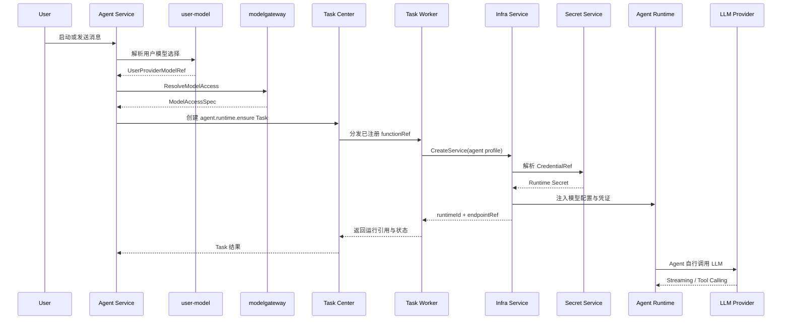
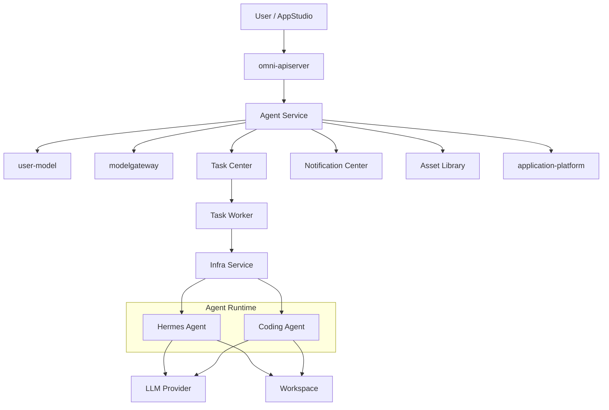
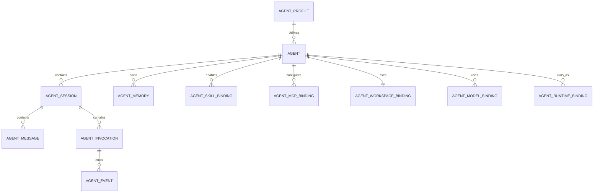
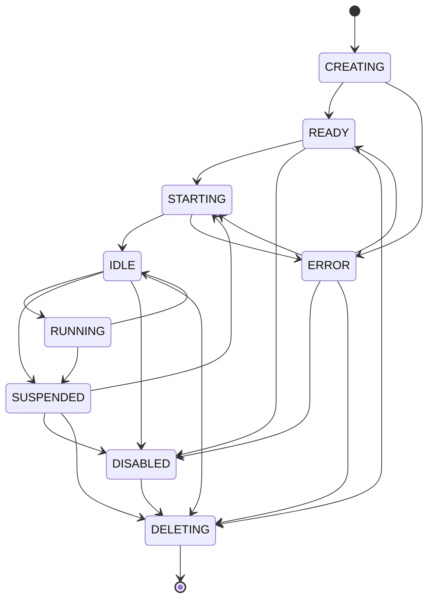
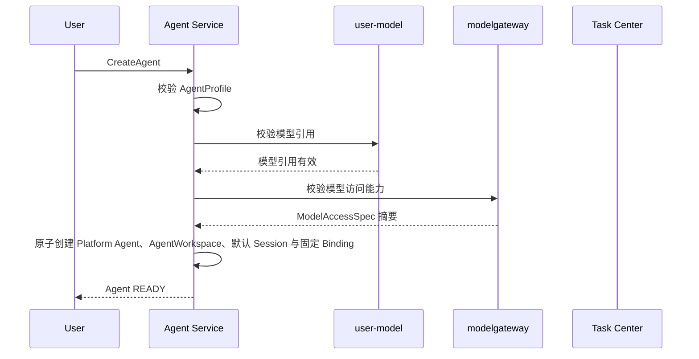
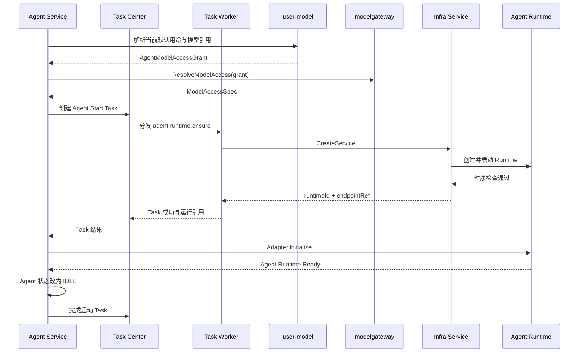
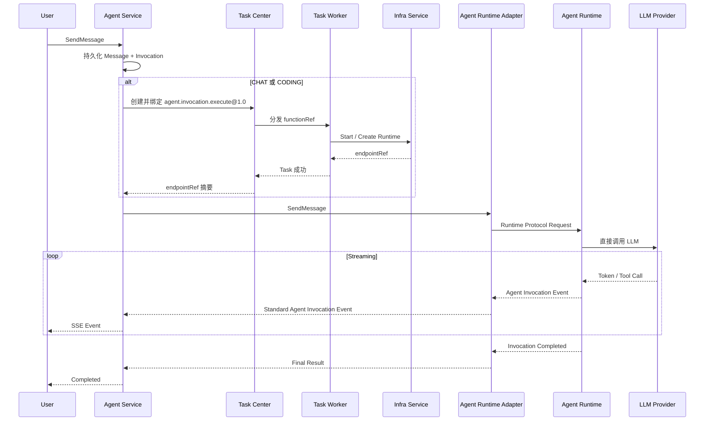
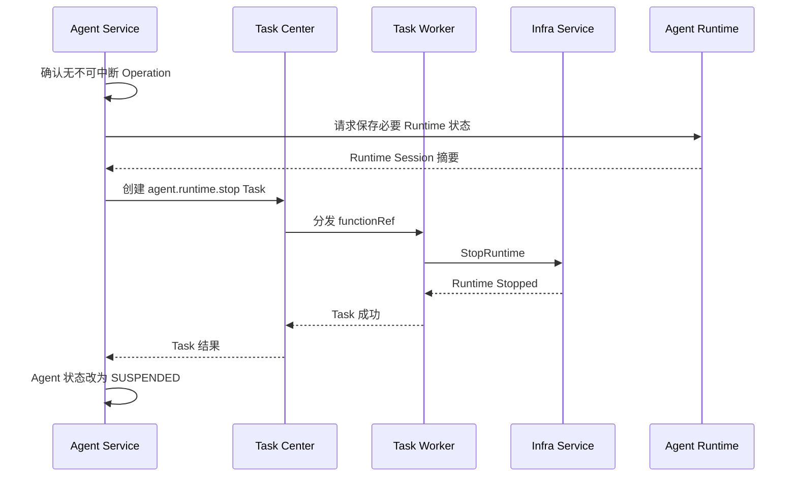
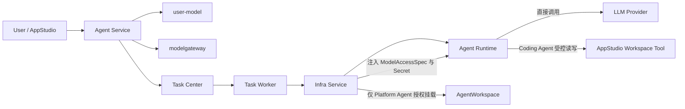

# OmniMAM Agent Service 功能设计文档

> 文档状态：S1 Released
> 文档版本：v1.1
> 正式基线：spec-v1.17.2
> 发布 commit：64435e32db213bf4483d057039036375ee545183
> 修订日期：2026-08-05
> 适用范围：Agent 定义、会话、记忆、Skills、工具权限、Workspace 绑定、模型绑定及 Runtime 生命周期编排

---

## 1. 文档目的

`Agent Service` 是 OmniMAM 中负责管理 AI Agent 业务生命周期的领域服务。

它用于统一管理：

* Hermes Agent。
* Coding Agent。
* 后续接入的其他交互式 Agent Runtime。
* Agent Session。
* Agent Memory。
* Agent Skills。
* MCP Server Binding。
* Agent 工具权限。
* Agent 与 Workspace 的绑定。
* Agent 使用的模型配置。
* Agent 与 Infra Runtime 的绑定。
* Agent 启动、挂起、恢复、停止和异常恢复。
* Agent Invocation、消息流和运行事件。

Agent Service 不直接管理 Docker、Kubernetes、GPU、容器、Pod、端口或运行节点。所有实际 Runtime 都由 Agent 创建 Task Center 任务，再由 `Task Worker -> Infra Adapter -> Infra Service` 创建和管理。Runtime READY 后，AgentRuntimeAdapter 可以使用 Agent 工作负载身份调用 Infrastructure 的受控只读 Endpoint resolve，再同步访问 Hermes/OpenCode；该地址不进入 Agent 持久化事实或公共 API。

---

# 2. 核心定位

Agent Service 负责回答：

* 用户创建了哪个 Agent。
* Agent 使用哪个 Agent Profile。
* Agent 使用哪个模型。
* Agent 可以访问哪些 Skills、MCP 和工具。
* Agent 关联哪个 Workspace。
* Agent 当前处于什么业务状态。
* 用户正在使用哪个 Session。
* Agent 的历史会话和记忆是什么。
* Agent 是否需要启动、挂起或恢复。
* 哪个 Infra Runtime 当前承载该 Agent。
* Agent 操作是否完成、失败或被取消。

Agent Service 不负责回答：

* Runtime 运行在 Docker 还是 Kubernetes。
* Runtime 运行在哪台机器。
* 使用哪个 GPU Device。
* 容器如何创建。
* Pod 如何调度。
* 端口如何分配。
* API Key 如何注入容器。
* Agent 如何实现内部 Agent Loop。
* Agent 如何调用 LLM SDK。
* LLM Provider 的具体协议如何实现。

---

# 3. 核心设计结论

## 3.1 Agent 是持久业务对象

Agent 不是一次性任务，也不等于某个 Runtime。

```text
Agent
├── AgentProfile
├── ModelBinding
├── 固定 WorkspaceBinding
├── SkillBindings
├── MCPBindings
├── Sessions
├── Memories
└── RuntimeBinding
```

Agent 可以在不同时间绑定不同 Infra Runtime。

```text
Agent
├── Runtime A：已停止
├── Runtime B：异常退出
└── Runtime C：当前运行
```

Runtime 被删除后，以下对象仍然保留：

* Agent。
* Session。
* Message。
* Memory。
* Workspace Binding。
* Skill Binding。
* Agent 配置。

---

## 3.2 Agent Service 不包含 Infrastructure Runtime Provider

以下组件属于 `Infra Service`：

```text
DockerRuntimeProvider
KubernetesRuntimeProvider
EdgeRuntimeProvider
LocalProcessRuntimeProvider
```

Agent Service 只向 Task Center 提交已注册的 Runtime 任务；Task Worker 再向 Infra Adapter 表达：

```text
启动 `agent.coding`
Platform Agent 挂载经授权的 AgentWorkspace
Coding Agent 配置 AppStudio Workspace Tool Endpoint，禁止挂载 StudioWorkspace
注入模型配置
注入 Skill 与 MCP 配置
分配指定资源
返回 Runtime Endpoint 摘要
```

Agent Service 不感知 Infra Service 最终采用哪种 Provider，也不直接调用 Infra Service 的运行或生命周期写操作。AgentRuntimeAdapter 对已绑定 Endpoint 的受控只读 resolve 是唯一例外。

---

## 3.3 Agent Runtime 自行访问 LLM

Hermes、OpenCode 或 Coding Agent Runtime 通常已经实现：

* LLM Client。
* Provider API 调用。
* Streaming。
* Tool Calling。
* Agent Loop。
* Prompt 管理。
* 上下文管理。
* Retry。
* 工具执行。

因此模型请求默认不经过 `modelgateway` 代理。

启动流程为：

1. Agent Service 根据 Agent 的 ModelBinding 确定模型引用。
2. `user-model` 解析用户私有模型选择。
3. `modelgateway` 将模型引用解析为 `ModelAccessSpec`。
4. Agent Service 将 `ModelAccessSpec`、Platform Agent 的授权挂载要求或 Coding Agent 的 Workspace Tool 配置写入 Agent Runtime Task。
5. Task Worker 的 Infra Adapter 调用 Infra Service；Infra Service 解析 CredentialRef 并注入 Runtime。
6. Agent Runtime 自行调用 LLM Provider。



---

## 3.4 Session 与 Runtime 生命周期分离

`AgentSession` 是用户对话和上下文对象，不属于容器。

Runtime 停止后：

* Session 不删除。
* Message 不删除。
* Memory 不删除。
* 用户可以恢复 Agent 后继续原 Session。

Agent Service 负责在 Runtime 恢复后，将必要的 Session 上下文同步给 Agent Runtime。

---

## 3.5 Workspace 类型、固定绑定与独立生命周期

每个 Agent 创建时必须固定一个 Workspace，后续 Session、Invocation、Runtime 重建和恢复均不得切换：

```text
kind=platform -> workspaceType=agent -> AgentWorkspace
kind=coding   -> workspaceType=studio -> StudioWorkspace
```

`AgentWorkspace` 是 Platform Agent 的持久化工作区，由 Agent Service 拥有。`StudioWorkspace` 是 AppStudio 的源码事实，必须在创建 Coding Agent 前存在，并由 AppStudio 校验当前主体是否有权绑定。

Workspace 是后端内部运行与持久化事实，不是用户侧资源。用户创建、查看或管理 Agent 时不得选择、输入、查看或切换 `workspaceType/workspaceId`：

* 用户通过 Agent 页面创建的 Agent 固定为 Platform Agent，由 Agent Service 自动创建并绑定 AgentWorkspace。
* Coding Agent 只能由 AppStudio 通过受控内部模块接口创建，用户不得在 Agent 页面独立创建。
* 用户侧 Agent 列表、详情、创建和编辑页面不展示 Workspace 类型、ID、Binding 或授权摘要。

多个 Coding Agent 可以引用同一个 StudioWorkspace，但这不授予 Runtime 直接挂载或修改 AppStudio 私有存储的权限。Coding Agent 只能使用与 Principal、Agent、Session、Invocation、StudioWorkspace、允许动作和过期时间绑定的短期 Workspace Tool 授权；所有写入必须由 AppStudio 形成带 `base_revision` 的原子 `StudioChangeSet`。

Agent 删除或 Runtime 删除时，不自动删除 AgentWorkspace 或 StudioWorkspace。需要更换 Workspace 时必须创建新的 Agent，不能修改既有 Agent 的固定绑定。

---

## 3.6 Task Center 不替代 Agent Session

Agent Service 为每轮交互创建持久化 `AgentInvocation`。所有 `CHAT` 和 `CODING` Invocation 都必须关联一个 `agent.invocation.execute@1.0` AtomicTask，由 Task Center 统一管理执行、重试、取消和超时。API Server 只持久化 Message/Invocation、创建并绑定 AtomicTask 和返回投影，不得启动进程内 goroutine 执行 Agent。

以下场景应使用 Task Center：

* Agent Runtime 启动。
* Agent Runtime 恢复。
* Agent Runtime 删除。
* 所有 CHAT/CODING 对话执行。
* 长时间 Coding Agent 操作。
* Agent 发起的复杂异步任务。
* 需要重试、取消、依赖或后台执行的工具操作。
* Agent 调用 Application Platform 的长任务。
* Agent 发起素材处理任务。

关系：

```text
AgentInvocation
    ├── CHAT / CODING：1 个 agent.invocation.execute@1.0 AtomicTask
    └── TOOL_OPERATION / BACKGROUND_OPERATION / Runtime 操作：1 个对应 AtomicTask
```

Invocation 只保存 `atomicTaskId` 和业务投影；`QUEUED` 可在同一提交链路中短暂处于尚未绑定状态，但进入 Worker 执行前必须绑定 AtomicTask。任务创建失败时 Invocation 必须进入可解释的失败终态，不能由 API Server 降级执行。TaskAttempt、重试次数、超时、取消终态和调度并发仍以 Task Center 为准。

---

# 4. 系统上下文



---

# 5. 与其他服务的职责边界

## 5.1 Infra Service

Infra Service 负责：

* 创建 Agent Runtime。
* 启动、停止和删除 Runtime。
* 分配 CPU、内存、GPU 和磁盘。
* 选择运行节点。
* 挂载 Workspace。
* 挂载 Skill Package。
* 注入配置和 Secret。
* 分配 Runtime Endpoint。
* 采集运行日志。
* 执行健康检查。
* Runtime 状态对账。

Agent Service 只保存：

```text
infraRuntimeId
endpointRef
runtimeProfileId
runtimeProfileRevision
runtimeHealth
```

不得保存：

```text
containerId
podName
nodeIP
hostPort
dockerNetwork
gpuDeviceId
volumeName
```

---

## 5.2 user-model

`user-model` 管理当前用户的：

```text
UserModelProvider
UserProviderModel
UserDefaultModel
```

Agent Service 通过可信用户上下文请求：

* 当前用户默认 Coding 模型。
* 当前用户默认 Chat 模型。
* 用户显式选择的 UserProviderModel。
* 模型启用状态。
* 模型所有权校验。

Agent Service 不直接读取用户 API Key。

---

## 5.3 modelgateway

`modelgateway` 将模型引用解析为：

```text
ModelAccessSpec
```

内容包括：

* ProviderType。
* Protocol。
* BaseURL。
* Remote Model ID。
* CredentialRef。
* Context Window。
* Streaming 支持。
* Tool Calling 支持。
* Vision 支持。
* Reasoning 支持。

`modelgateway` 默认不代理 Agent 的模型请求。

---

## 5.4 Task Center

Task Center 负责：

* 异步任务排队。
* TaskAttempt。
* 重试。
* 取消。
* 超时。
* 串行和并行。
* DAG 依赖。
* 用户可见任务进度。

Agent Service 负责：

* AgentInvocation。
* Session。
* Runtime 业务状态。
* 对话过程。
* Agent 操作结果。

Agent Service 可以创建 Task，并保存：

```text
taskId
taskAttemptId
```

但不能复制 Task Center 的任务状态机。

---

## 5.5 AppStudio

AppStudio 通过 Agent Service 使用 Coding Agent。

```text
AppStudio
    ↓
Agent Service
    ↓
Task Center
    ↓
Task Worker / Infra Adapter
    ↓
Infra Service
    ↓
Coding Agent Runtime
```

AppStudio 负责：

* StudioApplication。
* StudioWorkspace、Revision 和 ChangeSet。
* StudioPreviewRuntime。
* StudioBuild。
* StudioRelease。
* StudioRuntimeInstance。

Agent Service 负责：

* Coding Agent。
* Session。
* 模型绑定。
* Skills。
* Runtime 生命周期。
* Coding Agent 操作。

---

## 5.6 Application Platform

Agent 可以通过平台 API 调用已发布的：

```text
ApplicationVersion
```

长时间调用链：

```text
Agent Runtime
    ↓
Application Platform
    ↓
ApplicationRun
    ↓
Task Center
```

Agent Service 不直接执行 ApplicationVersion。

---

## 5.7 Asset Library

Agent 可以：

* 读取授权 Asset。
* 将 AssetReference 传给工具。
* 接收 ArtifactReference。
* 创建素材处理任务。

Agent Service 不管理 Blob、Representation 或物理文件路径。

---

## 5.8 Notification Center

以下事件应产生通知：

* Agent Runtime 启动失败。
* 长时间 AgentInvocation 完成。
* 长时间 AgentInvocation 失败。
* Agent Runtime 异常退出。
* Coding Agent 后台任务完成。
* Agent 需要用户处理或授权。

普通对话消息不产生系统通知。

---

# 6. Agent 类型与 AgentProfile

## 6.1 AgentProfile 定位

`AgentProfile` 是平台维护的 Agent 运行模板，用于描述：

* 使用哪个 RuntimeProfile。
* 使用哪个 AgentRuntimeAdapter。
* 支持哪些模型协议。
* 支持哪些 Skills。
* 支持哪些工具。
* 默认资源要求。
* Workspace 挂载方式。
* Session 恢复方式。
* 健康检查方式。
* Runtime 配置 Schema。

AgentProfile 不等于用户创建的 Agent。

---

## 6.2 S1 AgentProfile

S1 至少支持：

```text
agent.hermes
agent.coding
```

### agent.hermes

适用于：

* 通用交互式 Agent。
* 多工具调用。
* MCP 调用。
* 个人助手。
* 素材管理辅助。
* 平台操作辅助。

### agent.coding

适用于：

* AppStudio 应用开发。
* Workspace 代码修改。
* 代码生成。
* 测试。
* Build 错误修复。
* Preview 错误修复。
* Hotfix。

---

## 6.3 AgentProfile 示例

```yaml
id: agent.coding
revision: 1
displayName: Coding Agent

runtimeProfile:
  id: agent.coding
  revision: 1

runtimeAdapterType: opencode_compatible

modelRequirements:
  requiredCapabilities:
    - streaming
    - tool_calling
  recommendedPurpose: CODING

workspace:
  required: true
  mountPath: /workspace
  defaultReadOnly: false

resources:
  defaults:
    cpuCores: 4
    memoryMb: 8192
    diskMb: 20480
    gpuCount: 0

lifecycle:
  autoStartOnMessage: true
  suspendWhenIdle: true
  idleTimeoutSeconds: 1800

supportedBindings:
  - MODEL_ACCESS
  - WORKSPACE
  - SKILL_PACKAGE
  - MCP_CONFIG
  - PLATFORM_ENDPOINT
```

---

# 7. AgentRuntimeProvider 与 AgentRuntimeAdapter

## 7.1 定位

`AgentRuntimeProvider` 是 Agent 领域注册的业务运行提供者，S1 只允许 Hermes 和 OpenCode。它负责选择 AgentProfile、注册 Runtime 生命周期 functionRef、解释 Task 结果并维护 AgentRuntimeBinding，但不得直接创建容器或调用 Infra Service。

`AgentRuntimeAdapter` 是 Provider 内部的交互协议适配器，用于连接已经启动的 Runtime Endpoint。两者都不同于 Infrastructure 的 `RuntimeProvider`：

```text
AgentRuntimeProvider
    负责 Hermes/OpenCode 的业务生命周期和 Task 编排

AgentRuntimeAdapter
    负责与已启动的 Hermes/OpenCode Endpoint 交互

Infrastructure RuntimeProvider
    第一阶段只负责 Docker Job/Service
```

不同 Agent Runtime 可能提供不同的控制协议。

例如：

* Hermes API。
* OpenCode API。
* 自定义 Coding Agent API。
* 标准输入输出协议。

`AgentRuntimeAdapter` 位于 AgentRuntimeProvider 内部，用于屏蔽不同 Agent Runtime 的交互协议。

它与 Infra Service 的 RuntimeProvider 不同。

```text
RuntimeProvider
    负责如何启动 Runtime

AgentRuntimeAdapter
    负责如何与已启动的 Agent Runtime 交互
```

---

## 7.2 核心能力

AgentRuntimeAdapter 必须提供以下逻辑能力：

```text
校验 Agent、Session、Invocation 和 AgentRuntimeBinding
使用 Agent 工作负载身份解析已绑定的受控 Endpoint
使用短时解析结果与配置初始化 Runtime
创建或恢复 Runtime Session
发送 Agent Message 并返回标准 Agent Invocation Event Stream
取消 Runtime 中的 Invocation
读取 Runtime 健康与活动状态摘要
```

固定 Runtime Profile 的控制协议为：

* `agent.hermes` 使用 `/api/ws` 上的 newline-delimited JSON-RPC/WebSocket；会话、消息与取消分别映射 `session.create`、`prompt.submit`、`session.interrupt`，并把 `message.*`、`tool.*`、`error`、`session.info`、`status.update` 映射为标准事件。
* `agent.opencode` 使用 `POST /session` 创建会话、`POST /session/{sessionID}/message` 发送消息、`POST /session/{sessionID}/abort` 取消，并消费 `GET /event` SSE；健康检查使用 `GET /global/health`。

同一 Invocation/TaskAttempt 重放必须复用稳定 Runtime Session 和 Runtime Invocation 引用，不能重复提交已被 Runtime 接受的消息。协议 fixture 必须覆盖会话、消息、事件、取消和幂等；固定镜像协议验证失败时不得发布或启用对应 Profile。

具体编程语言接口和 DTO 由 S2 或实现定义。Adapter 返回的原始 Runtime 状态不能直接覆盖 AgentInvocation 或 AtomicTask 终态，必须由 Agent Service 按稳定引用和资源版本投影。

Endpoint 解析请求固定使用 `purpose=AGENT_RUNTIME_ADAPTER`，并携带 owner reference 与 Invocation/trace 审计关联 ID。Infrastructure 必须从工作负载身份确认调用服务，不信任请求声明；只有绑定的 Endpoint 为 READY、Runtime 为 RUNNING 且健康、owner 匹配且未撤销时才返回短时 `base_url`。Adapter 只能在内存中使用该地址，不得写入 Agent、Session、Invocation、RuntimeBinding、Task 结果、事件或日志。

---

## 7.3 Adapter 不负责

AgentRuntimeAdapter 不负责：

* 创建 Docker Container。
* 解析 Secret。
* 调度节点。
* 保存业务 Session。
* 保存长期 Memory。
* 处理用户权限。
* 创建 Task Center Task。

---

## 7.4 AgentRuntimeProvider 注册与状态

S1 只注册：

```text
agent.hermes
agent.opencode
```

Provider 至少公开 `ENABLED`、`DEGRADED`、`DISABLED` 可用性。创建 Agent 或启动 Runtime 时必须固定 Provider 与修订；Provider 后续升级不得改写历史 AgentRuntime。Provider 不可用时，新 Invocation 必须以稳定失败分类结束，已有 Session、Message、Memory 和 Workspace 不受影响。

Provider 的创建、恢复、停止和检查动作都必须映射为已注册的 Task Center `functionRef`，不能把任意镜像、命令或 Infra Provider 参数作为用户输入。

---

# 8. 核心领域对象



---

## 8.1 Agent

内部 canonical 字段：

```text
id
ownerUserId
name
description
kind
agentProfileId
agentProfileRevision
workspaceType
workspaceId
status
defaultSessionId
runtimePolicy
createdAt
updatedAt
lastActiveAt
deletedAt
```

`kind` 只允许 `platform` 或 `coding`。`workspaceType` 必须分别为 `agent` 或 `studio`，`workspaceId` 创建后不可变。AgentProfile 可以决定 Runtime 和工具能力，但不得改变 Agent 的业务类型或 Workspace 归属。

用户侧 Agent DTO 不返回 `workspaceType/workspaceId`。公共 Agent 管理接口只覆盖 Platform Agent；AppStudio 创建的 Coding Agent 由 AppStudio 页面和接口提供状态投影，不进入用户侧 Agent 创建、列表和详情流程。

---

## 8.2 AgentSession

字段：

```text
id
agentId
ownerUserId
title
status
runtimeSessionRef
createdAt
updatedAt
lastMessageAt
```

Session 状态：

```text
OPEN
CLOSED
ARCHIVED
```

Session 关闭后：

* 历史消息保留。
* Memory 保留。
* Runtime Session 可以被释放。
* 不再接受新消息。
* 已经进入运行态的 Invocation 不被隐式取消，仍按 AtomicTask 和 Runtime 最终结果完成。

---

## 8.3 AgentMessage

字段：

```text
id
sessionId
role
content
attachments
invocationId
createdAt
```

`role`：

```text
USER
ASSISTANT
SYSTEM
TOOL
```

附件只保存引用：

```text
AssetReference
ArtifactReference
WorkspaceFileReference
```

不得保存底层物理路径。

---

## 8.4 AgentInvocation

表示一次 Agent 交互或操作。

字段：

```text
id
agentId
sessionId
type
status
userMessageId
assistantMessageId
runtimeInvocationRef
atomicTaskId
startedAt
completedAt
failureCode
failureMessage
```

`QUEUED` Invocation 的 `atomicTaskId` 可在任务绑定事务完成前短暂为空；任何执行、取消或事件消费前必须已绑定。`CHAT` 与 `CODING` 均不得绕过 Task Center 直接执行。

`type`：

```text
CHAT
CODING
TOOL_OPERATION
BACKGROUND_OPERATION
```

状态：

```text
QUEUED
STARTING
RUNNING
WAITING_FOR_TOOL
WAITING_FOR_USER
SUCCEEDED
FAILED
CANCELING
CANCELED
```

---

## 8.5 AgentMemory

S1 中保存 Agent 可持续使用的记忆。

字段：

```text
id
agentId
sessionId
scope
type
content
sourceMessageId
createdAt
updatedAt
```

`scope`：

```text
AGENT
SESSION
```

`type`：

```text
FACT
PREFERENCE
SUMMARY
INSTRUCTION
CONTEXT
```

S1 不强制实现向量数据库或复杂自动检索系统。

---

## 8.6 AgentModelBinding

字段：

```text
id
agentId
name
sourceType
purpose
sourceRef
status
createdAt
updatedAt
```

`sourceType`：

```text
USER_DEFAULT_MODEL
USER_PROVIDER_MODEL
PLATFORM_MODEL
```

`purpose`：

```text
CHAT
CODING
VISION
EMBEDDING
```

S1 每个 Agent 至少有一个：

```text
primary-model
```

---

## 8.7 AgentWorkspaceBinding

字段：

```text
id
agentId
workspaceType
workspaceId
accessMode
authorizationSummary
createdAt
```

`accessMode`：

```text
READ_ONLY
READ_WRITE
```

Coding Agent 的固定 Workspace Binding 可以声明：

```text
READ_WRITE
```

每个 Agent 恰好一个 Binding。`accessMode` 表达业务授权上限，不等于 Infra 挂载权限；Coding Agent 即使为 `READ_WRITE`，也只能通过 AppStudio Workspace Tool 提交 ChangeSet，不能获得 StudioWorkspace 的可写文件系统挂载。

---

## 8.8 AgentRuntime（AgentRuntimeBinding）

字段：

```text
id
agentId
infraRuntimeId
endpointRef
runtimeProfileId
runtimeProfileRevision
runtimeSessionStrategy
status
createdAt
startedAt
stoppedAt
lastHealthAt
currentTaskId
currentOperation
```

状态：

```text
CREATING
STARTING
READY
RUNNING
STOPPING
STOPPED
FAILED
DELETED
```

AgentRuntimeBinding 是 Agent Service 对 Infra Runtime 的业务绑定，不复制容器信息。`currentTaskId/currentOperation` 标识当前生命周期操作；Task 终态回写必须同时匹配 binding、当前 Task 和操作类型。旧 Task 的乱序、重复或迟到结果只能记录审计，不得覆盖新操作投影。

---

# 9. Agent 状态模型

Agent 业务状态：

```text
CREATING
READY
STARTING
RUNNING
IDLE
SUSPENDED
ERROR
DISABLED
DELETING
```

---

## 9.1 状态说明

### CREATING

Agent 业务对象正在初始化。

可能执行：

* 校验 AgentProfile。
* 创建默认 Session。
* 创建或绑定 Workspace。
* 校验模型配置。
* 创建默认 Skill Binding。

### READY

Agent 配置完整，但当前没有运行中的 Runtime。

可以：

* 接收启动请求。
* 在 `autoStartOnMessage=true` 时自动启动。

### STARTING

Agent Service 已向 Task Center 提交 Runtime Task，Task Worker 正在请求 Infra Service 创建或启动 Runtime。

### RUNNING

Runtime 正常，并且存在活动中的 AgentInvocation。

### IDLE

Runtime 正常，但当前没有活动中的 AgentInvocation。

### SUSPENDED

Agent Runtime 已停止或释放，但 Agent、Session、Memory 和 Workspace 仍然保留。

发送消息时可以自动恢复。

### ERROR

Agent 当前无法正常使用。

例如：

* 模型配置失效。
* Runtime 启动失败。
* Workspace 不可访问。
* Agent Runtime 健康检查失败。

### DISABLED

Agent 被用户或管理员禁用。

禁止：

* 启动。
* 恢复。
* 接收新消息。

### DELETING

Agent 正在停止 Runtime 并删除业务对象。

Workspace 不随 Agent 自动删除。

删除没有 Runtime/Infra 引用的 Agent 时，服务在同一事务内写入 `deletedAt` 并使其从公共查询消失。存在 Runtime 或可恢复 Infra 引用时，Agent 进入 `DELETING` 并创建删除 Task；成功后以事务将 RuntimeBinding 置为 `DELETED`、写入 `deletedAt` 并发布删除事件。失败、超时或取消时 Agent 回到可重试 `ERROR`，保留 Runtime/Endpoint 引用供再次删除，不能伪装成已删除。

---

## 9.2 状态流转



Disable 必须保留 Agent、Session、Message、Memory、Workspace 和模型绑定，并停止活动 Runtime；Enable 固定回到 `READY`，不得自动创建 Runtime 或恢复旧 Runtime Session。

---

# 10. 创建 Agent

## 10.1 用户创建输入

```text
name
description
agentProfileId
modelBinding
skillBindings
mcpBindings
runtimePolicy
```

用户创建接口固定创建 Platform Agent，不接受 `kind`、`workspaceType` 或 `workspaceId`。Agent Service 必须在同一创建流程中自动创建并绑定 AgentWorkspace；Workspace 创建或绑定失败时整体失败，不得产生可用但未绑定的 Agent。

---

## 10.2 创建流程



创建 Agent 默认不强制立即创建 Runtime。

只有以下情况启动 Runtime：

* 用户显式启动。
* 用户发送第一条消息。
* AppStudio 启动 Coding Agent。
* 配置了自动预热策略。

## 10.3 AppStudio 内部创建 Coding Agent

AppStudio 创建 StudioApplication 时，通过非前端的 `CreateCodingAgentForStudio` 模块语义请求 Agent Service 创建 Coding Agent。该内部请求携带稳定的 StudioApplication、StudioWorkspace、Coding Agent generation 和授权上下文；Agent Service 校验调用方身份、Workspace 类型与授权后，原子创建 Coding Agent、默认 Session、固定 Workspace/Model Binding 和默认平台 MCP Binding。

该模块语义不得暴露为用户可调用的 HTTP 接口，不得允许前端传递或替换 StudioWorkspace ID。创建失败时不得留下没有固定 Workspace 的 Coding Agent；失败结果返回 AppStudio，由 AppStudio 按其创建恢复规则处理。

---

# 11. Runtime 启动

## 11.1 启动准备

Agent Service 在启动前解析：

* AgentProfile。
* RuntimeProfile。
* ModelBinding。
* 固定 WorkspaceBinding 与当前授权。
* SkillBindings。
* 当前启用且未删除的 MCPBindings 及其不可变 revision；按 Binding ID 稳定排序，最多 50 条，超过上限必须明确失败而不是截断。
* Tool Permissions。
* Platform Endpoint。
* Resource Requirement。
* Lifecycle Policy。

启动或恢复前必须找到与 Agent 类型用途匹配的 ACTIVE primary ModelBinding，并由 User Model 签发短期 Agent model access grant。缺失、无资格、过期或无法签发时返回既有 Agent 模型错误；在该校验成功前不得创建 RuntimeBinding、生命周期 AtomicTask 或 Infra Runtime。

---

## 11.2 Infra 请求

```json
{
  "requestId": "agent-start-agent-001-3",
  "runtimeProfile": {
    "id": "agent.coding",
    "revision": 1
  },
  "sourceBindings": [],
  "configurationBindings": [
    {
      "name": "primary-model",
      "type": "MODEL_ACCESS",
      "value": {
        "providerType": "openai_compatible",
        "protocol": "openai_chat_completions",
        "baseUrl": "https://llm.example.com/v1",
        "model": "qwen3-32b",
        "credentialRef": "secret://users/current/provider-001"
      }
    },
    {
      "name": "agent-config",
      "type": "PLAIN_CONFIG",
      "value": {
        "agentId": "agent-001",
        "profile": "agent.coding",
        "workspaceType": "studio",
        "workspaceId": "studio-workspace-001",
        "workspaceAccessMode": "appstudio-tool-only"
      }
    }
  ],
  "resources": {
    "cpuCores": 4,
    "memoryMb": 8192,
    "diskMb": 20480,
    "gpuCount": 0
  },
  "requestingService": "task-center",
  "owner": {
    "domain": "agent",
    "reference": "agent-runtime-binding-001"
  },
  "authorizationRef": "agent-runtime-grant://grant-001"
}
```

该示例为 Coding Agent，因此不得携带 StudioWorkspace 文件系统挂载。每个 MCP Binding revision 以 `MCP_SERVER_REF` configuration binding 和同一个 `authorizationRef` 交给 Infrastructure 解析；Task、Worker 和 Provider 不得直接读取 Agent 数据表。Workspace Tool 的短期授权在每个 Invocation 开始时单独签发；Platform Agent 才可以按固定 AgentWorkspace Binding 生成受控 `agent-workspace://...` 挂载引用。

Agent Service 不接收明文模型密钥。

---

## 11.3 启动流程



---

# 12. 消息与交互

## 12.1 发送消息

用户发送消息时：

1. 校验 Agent 和 Session 所有权。
2. 校验 Agent 是否禁用。
3. 创建 User Message。
4. 创建 AgentInvocation。
5. 创建并绑定 `agent.invocation.execute@1.0` AtomicTask；任务绑定失败则 Invocation 失败且不执行 Runtime 请求。
6. 如 Agent 为 READY 或 SUSPENDED，则通过关联 Task 启动或恢复 Runtime。
7. 确保 Runtime Session 已建立。
8. 为 Coding Agent 签发当前 Invocation 专用的短期 Workspace Tool 授权。
9. 校验 AgentRuntimeBinding 的 owner、Runtime 和 Endpoint 引用，调用 Infrastructure 受控只读 resolve。
10. 通过 AgentRuntimeAdapter 使用短时地址发送消息。
11. 接收 Agent Invocation Event Stream。
12. 将输出写入 Assistant Message。
13. 按 Task 结果和 Runtime 最终结果单调更新 AgentInvocation 状态。

---

## 12.2 消息流程



---

## 12.3 Agent Invocation Event

统一事件类型：

```text
invocation.started
message.delta
message.completed
tool.requested
tool.started
tool.progress
tool.completed
tool.failed
user.input_required
invocation.completed
invocation.failed
invocation.canceled
```

不同 Agent Runtime 的原始事件由 `AgentRuntimeAdapter` 转换为统一事件。

---

## 12.4 Streaming

S1 使用 SSE 返回 Agent 输出。

建议接口：

```text
GET /agents/{agentId}/operations/{invocationId}/events
```

SSE 只负责当前 AgentInvocation 的实时事件。

需要跨页面提示的完成和失败事件，交给 Notification Center 或用户级事件通道。

---

# 13. Runtime Session 恢复

Agent Service 保存自己的 `AgentSession`，Runtime 可以保存对应的：

```text
runtimeSessionRef
```

当 Runtime 被重新创建时：

1. 原 RuntimeSessionRef 失效。
2. Agent Service 创建新的 Runtime Session。
3. 将必要的 Session 摘要、最近消息和 Memory 同步给 Runtime。
4. 保存新的 RuntimeSessionRef。
5. 用户继续对话。

不要求 Runtime 自己成为 Session 唯一事实源。

恢复必须先对账当前 RuntimeBinding 与 Infrastructure 的现存 Runtime/Endpoint；仍健康且引用一致时复用，缺失、失败或已撤销时才通过 `agent.runtime.ensure` 重建。每次恢复都重新解析模型并签发新 grant，不复用已过期的 ModelAccessSpec 或凭证句柄；重建完成后必须创建新的 Runtime Session，并按 Agent Service 的 Session 摘要、最近消息和 Memory 恢复上下文。

---

# 14. Memory

## 14.1 Memory 所有权

Agent Service 是 Agent Memory 的业务事实源。

Agent Runtime 可以：

* 读取 Agent Service 提供的 Memory。
* 建议创建新的 Memory。
* 建议更新已有 Memory。

Agent Runtime 不应只把长期记忆保存在容器文件系统中。

---

## 14.2 Memory 写入方式

支持：

### 用户显式记忆

用户要求：

```text
记住这个偏好
```

Agent Service 创建 Memory。

### Agent 建议记忆

Agent Runtime 返回：

```text
memory.suggested
```

Agent Service 根据策略直接保存或要求用户确认。

### Session 摘要

Session 过长时，生成摘要并保存为：

```text
scope = SESSION
type = SUMMARY
```

---

## 14.3 S1 限制

S1 不实现：

* 自动知识图谱。
* 多层记忆网络。
* 复杂记忆衰减。
* 跨用户共享记忆。
* Agent 自行访问其他 Agent 的 Memory。

---

# 15. Skills

## 15.1 AgentSkillDefinition

Skill 是可注入 Agent Runtime 的受控能力包。

字段：

```text
id
name
description
version
supportedAgentProfiles
packageRef
configurationSchema
requiredPermissions
status
```

S1 中 Skill Definition 建议采用：

```text
builtin + directory
```

只读加载，不允许普通用户上传任意可执行 Skill。

---

## 15.2 AgentSkillBinding

字段：

```text
id
agentId
skillId
skillVersion
enabled
configuration
createdAt
updatedAt
```

Agent Service 负责：

* 校验 Skill 是否兼容 AgentProfile。
* 校验用户权限。
* 生成 Skill Runtime 配置。
* 将 Skill Package Ref 传给 Infra Service。
* 不直接挂载宿主机路径。

---

## 15.3 Skill 与 Runtime

```text
AgentSkillBinding
    ↓
Agent Service 解析
    ↓
Infra Service 挂载 Skill Package
    ↓
Agent Runtime 加载
```

Skill 不得直接获得：

* Docker Socket。
* 宿主机根目录。
* 未授权 Workspace。
* 明文平台 Secret。
* 任意网络访问权限。

---

# 16. MCP Server Binding

## 16.1 定位

Agent 可以通过 MCP 使用外部或平台工具。

Agent Service 管理：

* MCP Server 引用。
* 启用状态。
* 工具白名单。
* CredentialRef。
* 网络权限。
* Agent 级配置。

---

## 16.2 AgentMCPBinding

字段：

```text
id
agentId
name
serverType
endpointRef
credentialRef
allowedTools
configuration
enabled
resourceVersion
createdAt
updatedAt
deletedAt
```

`serverType`：

```text
PLATFORM
REMOTE
RUNTIME_LOCAL
```

同一 Agent 下活动 Binding 的 `name` 唯一。创建和每次更新必须在同一事务中写入当前态与一个不可变 `AgentMCPBindingRevision`；revision 使用更新后的 `resourceVersion`，保存 endpoint、工具白名单、非敏感配置和 `credentialRef`，但不得保存明文凭证。更新采用全量替换并校验 `resourceVersion`，凭证通过 `KEEP/SET/CLEAR` 显式处理。

删除是不可恢复、幂等的软删除。删除项不再出现在列表或后续 Runtime 配置中；删除前已经签发的未撤销 Runtime Grant 仍可解析其固定历史 revision。更新和删除不打断运行中的容器，只在下一次启动、恢复或显式重建时生效。

Runtime 启动任务入队前必须持久化 `AgentRuntimeGrant`，精确绑定 Agent、Coding Agent generation（如适用）、StudioApplication（如适用）、RuntimeBinding、请求、过期时间和本次允许解析的 Binding revisions。入队失败必须撤销；Task 自动重试复用同一个 Grant。Grant 过期、撤销、Runtime 不匹配或 revision 不在授权集合时立即拒绝解析。

---

## 16.3 Secret 处理

Agent Service 只保存：

```text
credentialRef
```

Infra Service 通过 `authorizationRef` 调用 Agent 提供的内部 resolver 解析不可变 revision，再由受信任 Secret/Identity resolver 解析实际凭证并在 Runtime 启动阶段注入。Infrastructure、Task Worker 和 Docker Adapter 禁止直接读取 Agent 数据表。

Agent Service API 不返回 `credentialRef` 或明文凭证；Task 参数、revision 快照、日志、审计、容器环境变量、命令参数和 `docker inspect` 可见字段均不得包含明文凭证。

---

# 17. 工具权限

Agent Service 必须维护 Agent 工具权限策略。

工具可以包括：

```text
workspace.read
workspace.write
workspace.execute_test
asset.read
asset.create
application.run
task.read
task.create
notification.read
mcp.invoke
network.outbound
```

默认原则：

* 最小权限。
* AgentProfile 提供默认权限。
* 用户只能在允许范围内收紧或启用。
* 高风险权限需要显式授权。
* Agent Runtime 不得绕过 Agent Service 权限直接访问平台内部服务。

---

# 18. Workspace

## 18.1 Workspace Binding

每个 Agent 只管理一个固定绑定：

```text
Platform Agent -> AgentWorkspaceBinding -> AgentWorkspace
Coding Agent   -> AgentWorkspaceBinding -> StudioWorkspace stable ID
```

AgentWorkspace 的业务生命周期归 Agent；StudioWorkspace 的源码、Revision、ChangeSet 和 Snapshot 全部归 AppStudio。两类 Workspace 的生命周期都不与 Agent Runtime 绑定。

---

## 18.2 Coding Agent

Coding Agent 的 Binding 可以授予源码写入能力上限：

```text
READ_WRITE
```

实际执行时只允许通过 AppStudio Workspace Tool：

* 按当前 Revision 读取文件。
* 提交带 `base_revision` 和幂等键的原子 ChangeSet。
* 创建、修改、移动或删除 ChangeSet 中明确列出的文件。
* 运行受控测试。
* 读取 Build 日志。
* 读取 Preview 日志。

每份 Tool 授权必须绑定 Principal、Agent、Session、Invocation、StudioWorkspace、允许动作和有效期；过期、越权、Workspace 不匹配或 Revision 冲突时必须拒绝，且不得部分应用 ChangeSet。

禁止：

* 访问其他 Workspace。
* 直接挂载 StudioWorkspace 或读取 AppStudio 私有存储。
* 绕过 ChangeSet 直接写文件。
* 直接修改生产 Runtime。
* 直接修改不可变 Release。
* 将 Secret 写入 Workspace。
* 操作 Docker Socket。

---

## 18.3 Agent 删除

删除 Agent 时：

* 停止并删除 Infra Runtime。
* 无 Runtime 引用时立即软删除 Agent。
* 有 Runtime 引用时创建受控删除 Task，成功后将 AgentRuntimeBinding 标记为 `DELETED` 并软删除 Agent。
* 删除 Task 失败、超时或取消时回到可重试 `ERROR`，保留 Infra 引用，不得清空绑定或发布 `agent.deleted`。
* 不自动删除外部 Workspace。
* 不自动删除 StudioSourceSnapshot。
* 不自动删除已发布 StudioApplication。

---

# 19. 挂起与恢复

## 19.1 挂起条件

支持：

* 用户主动挂起。
* Agent 空闲超过策略时间。
* 系统资源回收。
* AppStudio 项目暂时关闭。
* 管理员操作。

---

## 19.2 挂起流程



挂起后保留：

* Agent。
* Session。
* Message。
* Memory。
* Workspace。
* Skills。
* MCP Bindings。
* ModelBinding。

---

## 19.3 恢复流程

恢复时：

1. 重新解析 ModelBinding。
2. 重新签发短期 Agent model access grant 并解析 ModelAccessSpec；任何失败都不得先创建 Task 或 RuntimeBinding。
3. 创建恢复 AtomicTask，由 Task Worker 通过 Infra Adapter 创建或启动 Runtime。
4. 重新加载 AgentWorkspace 挂载，或为 StudioWorkspace 配置 AppStudio Workspace Tool，并加载 Skills。
5. 创建 Runtime Session。
6. 恢复 Session 摘要和 Memory。
7. Agent 状态变为 IDLE。

恢复复用 `agent.runtime.ensure`。提交前先对账现有运行引用；终态回写必须匹配 RuntimeBinding 的 `currentTaskId/currentOperation`，旧恢复任务不能覆盖更新的挂起、删除或再次恢复结果。

---

# 20. 异常恢复

## 20.1 Runtime 异常退出

Infra Service 上报：

```text
infra.runtime.failed
```

Agent Service：

1. 将 RuntimeBinding 标记为 FAILED。
2. 将 Agent 标记为 ERROR。
3. 检查恢复策略。
4. 根据策略创建恢复 Task。
5. 重新创建 Runtime。
6. 恢复 Session 和 Memory。
7. 恢复成功后将 Agent 状态改为 IDLE。
8. 多次失败后停止自动恢复。

---

## 20.2 恢复策略

```text
NONE
ON_FAILURE
ALWAYS
```

可配置：

```text
maximumRecoveryAttempts
recoveryBackoffSeconds
```

Task Center 负责恢复任务的重试和执行记录。

---

## 20.3 不可自动恢复的错误

以下错误不应无限自动恢复：

* ModelBinding 已失效。
* CredentialRef 无权限。
* Workspace 已删除。
* AgentProfile 已禁用。
* RuntimeProfile 不存在。
* 用户账户被禁用。
* Skill Package 不可用。

---

# 21. Task Center 集成

Agent Service 创建的任务类型：

```text
AGENT_CREATE
AGENT_START
AGENT_SUSPEND
AGENT_RESUME
AGENT_STOP
AGENT_DELETE
AGENT_RECOVER
AGENT_INVOCATION_EXECUTE
AGENT_LONG_OPERATION
AGENT_TOOL_OPERATION
```

Task Center 负责：

* 排队。
* 重试。
* 取消。
* 超时。
* TaskAttempt。
* 用户可见任务状态。

Agent Service 负责将 Task 结果投影到：

* Agent 状态。
* RuntimeBinding 状态。
* AgentInvocation 状态。

`agent.invocation.execute@1.0` 是 CHAT/CODING 的 canonical functionRef。Worker 负责解析绑定、确保 Runtime、调用 profile-specific adapter、单调投影标准事件并形成 Task 终态。Task Center 的 FAILED、TIMEOUT、CANCELED 以及 execution 丢失对账结果必须通知 Agent terminal observer；Agent 根据当前 Task 绑定投影 Invocation/Runtime 终态，不自行实现 watchdog。

---

# 22. Notification Center 集成

通知事件：

```text
agent.runtime.start_failed
agent.runtime.recovered
agent.runtime.recovery_failed
agent.invocation.completed
agent.invocation.failed
agent.input_required
agent.disabled
```

以下情况不生成通知：

* 每个 Token。
* 普通消息 Delta。
* 普通 Tool Progress。
* Agent 从 RUNNING 转为 IDLE。

---

# 23. 权限模型

## 23.1 用户所有权

以下对象必须校验当前用户：

```text
Agent
AgentSession
AgentMessage
AgentInvocation
AgentMemory
AgentModelBinding
AgentWorkspaceBinding
AgentSkillBinding
AgentMCPBinding
```

请求体中的 `ownerUserId` 不可信。

所有权必须从认证上下文解析。

---

## 23.2 服务身份

Agent Service 调用以下内部服务时使用服务身份：

```text
Task Center
user-model
modelgateway
Asset Library
Application Platform
Notification Center
```

Agent Service 不直接调用 Infra Service 的 Runtime 写接口；这些接口只接受 Task Worker 的受信身份，也不能直接暴露给前端。AgentRuntimeAdapter 可以用 Agent 工作负载身份调用只读 Endpoint resolve，但不得调用其他 Infra API，也不得向公共 Agent API、通知、SSE、Task 结果或日志传播解析地址。

---

## 23.3 Runtime 身份

Agent Runtime 使用 `AGENT_WORKLOAD` 类型的独立 Runtime Identity。用于平台 MCP 的 JWT 必须绑定 Agent、Coding Agent generation（如适用）、StudioApplication（如适用）、RuntimeBinding、Runtime Grant，固定 `aud=mcp`，且有效期不得超过 Runtime 和 Grant 生命周期。MCP Server 每次请求都重新校验 Grant 状态和对象范围。

它只获得：

* 当前 Agent 被授权的 Platform API。
* 当前 Workspace。
* 当前 Skill。
* 当前 MCP 配置。
* 当前模型凭证。
* 当前用户授权的数据范围。

Agent Runtime 不自动继承 Agent 创建者的全部平台权限。AppStudio 默认平台 Binding 的 workload 权限固定为允许工具所需的最小集合，并限制到当前租户、owner、StudioApplication、Agent generation 和 Runtime；不得获得管理员角色，也不得上传素材、取消运行或执行删除操作。

---

# 24. Secret 与模型凭证

## 24.1 基本规则

Agent Service：

* 不保存明文 API Key。
* 不读取明文 API Key。
* 不返回明文 API Key。
* 不将 API Key 写入 Session。
* 不将 API Key 写入 Message。
* 不将 API Key 写入 Workspace。
* 不将 API Key 写入 Agent 日志。

---

## 24.2 注入链路

```text
AgentModelBinding
    ↓
user-model 校验模型所有权
    ↓
modelgateway 生成 ModelAccessSpec
    ↓
Agent Service 创建 Agent Runtime Task
    ↓
Task Worker 的 Infra Adapter 提交受控 Infra 请求
    ↓
Infra Service 解析 CredentialRef
    ↓
Agent Runtime 获得运行期凭证
```

---

# 25. 日志与可观测性

## 25.1 Agent Service 日志

记录：

* Agent 状态变化。
* Session 操作。
* Runtime Binding。
* Adapter 调用状态。
* Operation 状态。
* 任务关联。
* 权限拒绝。
* 恢复行为。

不记录：

* 明文模型密钥。
* 完整用户 Prompt，除非属于业务消息存储。
* Secret 文件内容。
* Runtime 环境变量。

---

## 25.2 Runtime 日志

Runtime 原始日志由 Infra Service 管理。

Agent Service 保存：

```text
runtimeLogRef
```

并可以提供经过权限校验的日志查询入口。

---

## 25.3 指标

```text
agent_total
agent_running_total
agent_idle_total
agent_suspended_total
agent_error_total

agent_session_total
agent_invocation_running
agent_invocation_failed_total
agent_invocation_duration

agent_runtime_start_duration
agent_runtime_recovery_total
agent_runtime_recovery_failed_total

agent_message_total
agent_tool_call_total
```

---

## 25.4 Trace

调用链携带：

```text
traceId
userId
agentId
sessionId
invocationId
taskId
infraRuntimeId
```

---

# 26. 主要接口

以下为逻辑接口，不限定最终 HTTP 或 RPC 路径。

## 26.1 AgentProfile

```text
ListAgentProfiles
GetAgentProfile
ReloadAgentProfiles
```

S1 中 AgentProfile 为只读平台配置。

---

## 26.2 Agent

```text
CreateAgent
GetAgent
ListAgents
UpdateAgent
EnableAgent
DisableAgent
DeleteAgent
```

---

## 26.3 生命周期

```text
StartAgent
SuspendAgent
ResumeAgent
StopAgent
RecoverAgent
GetAgentRuntimeStatus
GetAgentRuntimeLogs
```

---

## 26.4 Session

```text
CreateAgentSession
GetAgentSession
ListAgentSessions
UpdateAgentSession
CloseAgentSession
ArchiveAgentSession
```

---

## 26.5 Message 与 Operation

```text
SendAgentMessage
GetAgentMessage
ListAgentMessages

GetAgentInvocation
ListAgentInvocations
CancelAgentInvocation
StreamAgentInvocationEvents
```

---

## 26.6 Memory

```text
CreateAgentMemory
GetAgentMemory
ListAgentMemories
UpdateAgentMemory
DeleteAgentMemory
```

---

## 26.7 ModelBinding

```text
GetAgentModelBindings
SetAgentModelBinding
DeleteAgentModelBinding
ValidateAgentModelBinding
```

---

## 26.8 内部 WorkspaceBinding

```text
CreateCodingAgentForStudio
```

固定 Workspace 只能由 Agent Service 在创建时建立并完成校验；不提供用户侧查询、绑定、解绑、重新校验或切换接口。`CreateCodingAgentForStudio` 仅供 AppStudio 受信模块调用。

---

## 26.9 Skills

```text
ListAgentSkillDefinitions
ListAgentSkillBindings
EnableAgentSkill
DisableAgentSkill
UpdateAgentSkillConfiguration
```

---

## 26.10 MCP

```text
ListAgentMCPBindings
CreateAgentMCPBinding
UpdateAgentMCPBinding
EnableAgentMCPBinding
DisableAgentMCPBinding
DeleteAgentMCPBinding
```

---

# 27. 内部接口

## 27.1 Task Center 结果与 Infra 事件处理

Agent Service 不直接接收 Infra Service 的创建请求或 Provider 回调。Infra 状态先由 Task Worker/Task Center 投影，Agent 只消费与自身 `AgentRuntimeBinding` 相关的任务结果和受控状态摘要。

```text
HandleRuntimeStarted
HandleRuntimeReady
HandleRuntimeHealthChanged
HandleRuntimeStopped
HandleRuntimeFailed
HandleRuntimeDeleted
```

---

## 27.2 Runtime Adapter

```text
InitializeRuntime
CreateRuntimeSession
SendRuntimeMessage
CancelRuntimeOperation
GetRuntimeAgentStatus
```

---

## 27.3 Model 解析

```text
ResolveAgentModelBinding
ValidateAgentModelCapabilities
IssueAgentModelAccessGrant
BuildModelAccessSpecFromGrant
```

---

# 28. 事件

## 28.1 Agent 业务事件

```text
agent.created
agent.updated
agent.enabled
agent.disabled
agent.deleting
agent.deleted

agent.starting
agent.started
agent.idle
agent.suspended
agent.resuming
agent.error
agent.recovered

agent.session.created
agent.session.closed
agent.session.archived

agent.invocation.started
agent.invocation.waiting_for_user
agent.invocation.completed
agent.invocation.failed
agent.invocation.canceled

agent.memory.created
agent.memory.updated
agent.memory.deleted

agent.workspace.bound
agent.workspace.unbound

agent.skill.enabled
agent.skill.disabled

agent.mcp.enabled
agent.mcp.disabled
```

---

## 28.2 不属于 Agent Service 的事件

以下属于 Infra Service：

```text
container.created
pod.scheduled
gpu.assigned
volume.mounted
runtime.provider.failed
```

以下属于 Task Center：

```text
task.queued
task.retrying
task.attempt.started
task.attempt.failed
```

Agent Service 只消费必要事件并更新自己的业务投影。

---

# 29. 标准错误码

## 29.1 Agent

```text
AGENT_NOT_FOUND
AGENT_ACCESS_DENIED
AGENT_DISABLED
AGENT_INVALID_STATE
AGENT_PROFILE_NOT_FOUND
AGENT_PROFILE_DISABLED
AGENT_PROFILE_REVISION_NOT_FOUND
```

---

## 29.2 Session 与 Operation

```text
AGENT_SESSION_NOT_FOUND
AGENT_SESSION_CLOSED
AGENT_INVOCATION_NOT_FOUND
AGENT_INVOCATION_ALREADY_COMPLETED
AGENT_INVOCATION_CANCEL_FAILED
AGENT_RUNTIME_SESSION_CREATE_FAILED
```

---

## 29.3 模型

```text
AGENT_MODEL_BINDING_NOT_FOUND
AGENT_MODEL_BINDING_INVALID
AGENT_MODEL_ACCESS_RESOLVE_FAILED
AGENT_MODEL_CAPABILITY_UNSUPPORTED
AGENT_MODEL_CREDENTIAL_UNAVAILABLE
```

---

## 29.4 Agent 初始化

```text
AGENT_INITIALIZATION_FAILED
```

Workspace 创建、类型、授权或固定绑定失败统一映射为用户可理解的 Agent 初始化失败。Workspace 细节只允许出现在内部诊断和受控模块错误中，不得进入公共 API、通知或 SSE 投影。

---

## 29.5 Runtime

```text
AGENT_RUNTIME_NOT_FOUND
AGENT_RUNTIME_CREATE_FAILED
AGENT_RUNTIME_START_FAILED
AGENT_RUNTIME_INITIALIZE_FAILED
AGENT_RUNTIME_UNHEALTHY
AGENT_RUNTIME_STOP_FAILED
AGENT_RUNTIME_RECOVERY_FAILED
```

---

## 29.6 Skills 与 MCP

```text
AGENT_SKILL_NOT_FOUND
AGENT_SKILL_NOT_SUPPORTED
AGENT_SKILL_PERMISSION_DENIED
AGENT_MCP_BINDING_INVALID
AGENT_MCP_BINDING_NAME_CONFLICT
AGENT_MCP_BINDING_VERSION_CONFLICT
AGENT_MCP_BINDING_REVISION_UNAVAILABLE
AGENT_MCP_TOOL_NOT_ALLOWED
AGENT_MCP_CREDENTIAL_UNAVAILABLE
```

---

# 30. 事实持久化边界

```text
AgentProfile 目录与可用性投影
Agent 与固定 Workspace 引用
AgentSession / AgentMessage / AgentInvocation
AgentMemory
Model / Skill / MCP Binding
AgentRuntimeBinding
可靠 Agent 事件
```

具体表、列、索引和外键由 S2 定义。AgentProfile 可以由内置目录加载，不要求数据库成为唯一事实源。

---

# 31. S1 实现范围

## 31.1 S1 必须实现

* AgentProfile。
* Hermes Agent。
* Coding Agent。
* Agent 创建、修改、启用、禁用和删除。
* Agent 状态机。
* Agent Session。
* Agent Message。
* AgentInvocation。
* SSE 流式输出。
* Agent Memory 基础能力。
* AgentModelBinding。
* `user-model` 集成。
* `modelgateway` ModelAccessSpec 解析。
* Infra Service Runtime 创建和停止。
* Secret 安全注入。
* AgentRuntimeProvider 与 AgentRuntimeAdapter。
* 固定 Workspace Binding。
* Platform AgentWorkspace。
* Coding Agent 通过短期 AppStudio Workspace Tool 授权提交 ChangeSet。
* Agent Skills。
* MCP Server Binding。
* 工具权限。
* Runtime 挂起和恢复。
* Runtime 异常恢复。
* Task Center 集成。
* Notification Center 集成。
* AppStudio Coding Agent 集成。
* 用户权限隔离。
* Runtime 日志引用。

---

## 31.2 S1 不实现

* 一次性 Agent 概念。
* 多 Agent 自动协作编排。
* Agent 自主创建其他 Agent。
* Agent Marketplace。
* 用户上传任意可执行 Skill。
* Agent 自动安装未知依赖。
* Agent 直接操作 Docker 或 Kubernetes。
* Agent 获取宿主机 Shell。
* Agent 直接读取明文 Secret。
* Agent 修改生产 Runtime。
* Agent 自动修改已发布 Release。
* Agent Service 自己实现 LLM Proxy。
* Agent Service 自己实现 Infra Runtime Provider。
* 跨用户共享 Agent Memory。
* 完整向量记忆系统。
* 无限制自主后台运行。
* 任意网络访问。

---

# 32. 强制架构规则

## R-AGENT-001

Agent 是持久业务对象，不等于 Infra Runtime。

## R-AGENT-002

Agent Session、Message 和 Memory 不得依赖 Runtime 生命周期保存。

## R-AGENT-003

Agent Service 不得直接操作 Docker、Kubernetes、宿主机、GPU 或 Edge Node Agent。

## R-AGENT-004

所有 Agent Runtime 必须由 Agent 创建 AtomicTask，并经 Task Worker、Infra Adapter 和 Infra Service 创建和管理。

## R-AGENT-005

Agent Runtime 自行完成 LLM 调用、Streaming、Tool Calling 和 Agent Loop。

## R-AGENT-006

`modelgateway` 默认只负责生成 ModelAccessSpec，不代理每次 Agent 模型请求。

## R-AGENT-007

Agent Service 不得读取或保存明文模型凭证。

## R-AGENT-008

模型 Credential 必须由 Infra Service 在 Runtime 启动阶段注入。

## R-AGENT-009

AgentRuntimeAdapter 只负责 Agent Runtime 交互协议及已绑定 Endpoint 的受控只读解析，不负责基础设施运行或 Runtime 生命周期写操作。

## R-AGENT-010

每个 Agent 必须固定一个与类型匹配的 Workspace；Session、Invocation 和 Runtime 不得切换。Workspace 生命周期独立于 Runtime 生命周期。

Coding Agent 不得直接挂载 StudioWorkspace；源码读写必须使用当前 Invocation 的短期 AppStudio Workspace Tool 授权，并通过带 `base_revision` 的原子 ChangeSet 完成。

## R-AGENT-011

删除 Agent 不得自动删除 AgentWorkspace、StudioWorkspace 或已发布 StudioApplication。

## R-AGENT-012

Agent Runtime 不得直接挂载 Docker Socket。

## R-AGENT-013

Agent Runtime 不得直接修改生产 Runtime 或不可变 Release。

## R-AGENT-014

CHAT、CODING、TOOL_OPERATION、BACKGROUND_OPERATION 及任何 Runtime 生命周期操作必须关联 AtomicTask，并由 Task Center 管理尝试、重试、取消和超时。

## R-AGENT-015

Asset、Artifact 和 ApplicationRun 必须通过对应领域服务访问。

## R-AGENT-016

Skills 和 MCP 工具必须经过显式 Binding 与权限控制。

## R-AGENT-017

用户身份必须从可信认证上下文解析，不得信任请求中的 userId。

## R-AGENT-018

Agent 状态与 Infra Runtime 状态必须分离。

## R-AGENT-019

Agent Service 必须支持 Runtime 异常后的状态对账和恢复。

## R-AGENT-020

所有 `CHAT` 和 `CODING` Invocation 必须使用 `agent.invocation.execute@1.0`；API Server 不得使用进程内 goroutine 或无 Task 降级路径执行 Agent。

## R-AGENT-021

AgentRuntimeAdapter 必须先校验 Agent、Session、Invocation 和 AgentRuntimeBinding，再以 Agent 工作负载身份解析 READY 的 Hermes/OpenCode Endpoint；解析地址只允许在当前同步调用内使用，不得持久化或传播到公共响应、事件、Task 结果和日志。

## R-AGENT-022

Agent 软删除、Runtime 生命周期和 Invocation 终态回写必须匹配当前 Task 引用并单调推进；迟到旧 Task 不得覆盖新操作，删除失败必须保留 Infra 引用并可重试。

## R-AGENT-023

Runtime 启动和恢复必须在创建 RuntimeBinding 或 AtomicTask 前完成 ACTIVE primary ModelBinding 资格校验和短期 grant 签发；Infrastructure 只能以服务身份解析 grant 并在启动时注入模型配置与凭证。

## R-AGENT-024

MCP Binding 更新必须以资源版本乐观控制并原子写不可变 revision；软删除不影响已签发 Grant 固定的历史 revision，但更新、删除和启停只影响下一次 Runtime 启动、恢复或显式重建。

## R-AGENT-025

Runtime MCP 配置只能由 Infrastructure 使用 `authorizationRef` 解析 Grant 允许的 Binding revisions；Worker、Infrastructure 和 Provider 不得读取 Agent 私表，敏感值不得进入 Task、持久化快照、日志或容器 inspect 可见字段。

## R-AGENT-026

OpenCode Coding Agent 的平台 MCP workload 身份必须绑定 Agent generation、Application、Runtime 和 Grant，固定 `aud=mcp` 并使用最小对象权限；Hermes MCP 注入不属于当前 release。

---

# 33. 最终职责总结

```text
Agent Service
    管理 Agent、Session、Invocation、Memory、AgentWorkspace、Skills、MCP、权限和业务生命周期

user-model
    决定当前用户可以使用哪个模型

modelgateway
    将模型引用解析为 ModelAccessSpec

Infra Service
    接收 Task Worker 的受控请求，创建 Agent Runtime，并注入允许的配置和 Secret

Agent Runtime
    执行 Agent Loop，并自行调用 LLM 和工具

Task Center
    管理复杂异步操作、重试、取消和依赖

AppStudio
    拥有 StudioWorkspace，并通过 Workspace Tool 接收 Coding Agent ChangeSet

Application Platform
    提供 Agent 可调用的 ApplicationVersion

Asset Library
    管理 Agent 使用和生成的 Asset 与 Artifact

Notification Center
    通知长时间操作完成、失败或需要用户处理
```

完整运行链路：



最终边界为：

> Agent Service 决定运行哪个 Agent、使用哪个模型、内部 Workspace 和工具；Task Center 统一承接运行任务；Task Worker 通过 Infra Adapter 调用 Infra Service；Infra Service 决定该 Agent Runtime 如何运行；Agent Runtime 自行完成模型调用和 Agent Loop。用户只管理 Agent，不感知内部 Workspace。

## 34. S2 追溯锚点

以下编号仅把本 S1 已有语义映射为可机器校验的 S2 追溯锚点，不新增业务能力：

- `US-AGENT-001`：用户可以管理持久化 Platform Agent、会话交互、记忆和受控 Runtime 生命周期，而无需选择或管理内部 Workspace；Coding Agent 由 AppStudio 创建和投影。
- `BR-AGENT-001`：Agent、Session、Memory、Workspace Binding、MCP Binding/Revision、Runtime Binding 和 Runtime Grant 的事实归属与生命周期必须遵守本 S1 第 3、7、8、9、11、12、13、16、18、19、20、21、23、24、28 节及 `R-AGENT-001..026`。

验收标准：

- `AC-AGENT-001-01`：用户创建 Agent 时请求不得包含 `kind/workspaceType/workspaceId`；系统固定创建 Platform Agent，并原子创建和绑定 AgentWorkspace，任一步失败均不得产生可用 Agent。
- `AC-AGENT-001-02`：Coding Agent 只能由 AppStudio 通过 `CreateCodingAgentForStudio` 内部语义创建；用户侧 Agent 页面和公共 API 不得创建 Coding Agent 或查询 Workspace Binding。
- `AC-AGENT-001-03`：Coding Agent 源码读写必须携带绑定 Principal、Agent、Session、Invocation、StudioWorkspace、动作和有效期的 Tool 授权；授权不匹配或过期时不得执行。
- `AC-AGENT-001-04`：Coding Agent 写入必须由 AppStudio 原子应用带 `base_revision` 的 ChangeSet；Revision 冲突时不自动覆盖、不隐式合并、不部分应用。
- `AC-AGENT-001-05`：CHAT/CODING 使用 `agent.invocation.execute@1.0`，TOOL_OPERATION、BACKGROUND_OPERATION 以及 Runtime 启停恢复也必须关联 AtomicTask；Agent 不复制 TaskAttempt、重试、超时或取消状态机。
- `AC-AGENT-001-06`：QUEUED Invocation 可在任务绑定前短暂为空，但执行前必须绑定 AtomicTask；创建失败进入明确失败终态，API Server 不得启动 goroutine 或降级直接执行。
- `AC-AGENT-001-13`：CHAT/CODING Task 统一使用 `agent.invocation.execute@1.0`，arguments 只包含 Agent/Session/Invocation/RuntimeBinding、类型、短期授权引用、预期资源版本和恢复游标；消息、owner、Workspace、Endpoint、模型凭证、用户密钥和 Provider 配置不得进入 Task。未绑定过 Task 的提交失败可复用同一 Invocation 重试；绑定后只接受当前 Task ID 和资源版本的单调投影。
- `AC-AGENT-001-07`：Runtime 删除、挂起或异常重建后，Agent、Session、Message、Memory 和内部固定 Workspace 引用保持不变。
- `AC-AGENT-001-08`：所有 Infra-backed 操作只能走 `Task Center -> Task Worker -> Infra Adapter -> Infra Service`；Agent 公共 API、通知、SSE 和用户日志不得暴露 Workspace ID、Provider 私有信息、宿主路径或明文 Secret。
- `AC-AGENT-001-09`：无 Runtime 的删除立即软删除；有 Runtime 的删除仅在删除 Task 成功后事务写 Runtime `DELETED` 和 Agent `deletedAt`，失败回到可重试 `ERROR` 并保留 Infra 引用。
- `AC-AGENT-001-10`：Disable 停止 Runtime 但保留业务数据，Enable 只回到 `READY`；Close Session 拒绝新消息但不取消已经运行的 Invocation。
- `AC-AGENT-001-11`：启动/恢复在创建 Task 或 RuntimeBinding 前校验 ACTIVE primary binding 并签发 grant；恢复先对账旧运行引用，重建 Runtime Session 后恢复 Session/Memory，旧 Task 结果不得乱序覆盖。
- `AC-AGENT-001-12`：Hermes 与 OpenCode 分别通过已验证的 JSON-RPC/WebSocket 和 REST/SSE 协议 fixture 覆盖会话、消息、事件、取消和幂等，任何固定镜像不通过时对应 Profile 不得发布。
- `AC-AGENT-001-14`：MCP Binding List/Create/PUT/Delete 必须执行 owner 隔离、活动名称唯一、`resource_version` 乐观锁、`KEEP/SET/CLEAR` 凭证语义、不可恢复幂等软删除和不可变 revision；所有响应隐藏凭证引用。
- `AC-AGENT-001-15`：Runtime ensure 只选择启用且未删除 Binding，按 ID 稳定排序并固定当前 revision；超过 50 条失败。入队前持久化精确 Grant，入队失败撤销，重试复用，过期、越权和 revision 不可用均拒绝解析。
- `AC-AGENT-001-16`：OpenCode MCP 配置只能由 Infrastructure resolver 在 Grant 授权下解析并安全写入 `/root/.config/opencode/opencode.json`；空 `allowed_tools` 拒绝全部工具，凭证不得出现在 Task、数据库明文、日志、API、环境变量、命令参数或 inspect 中。
