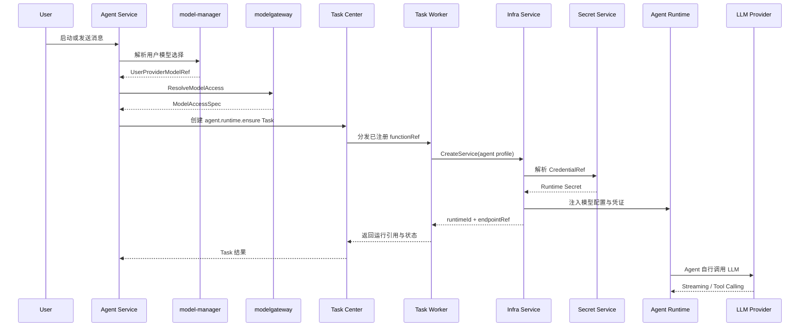
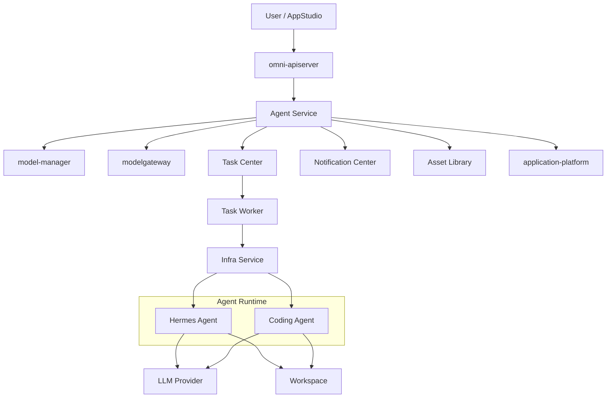
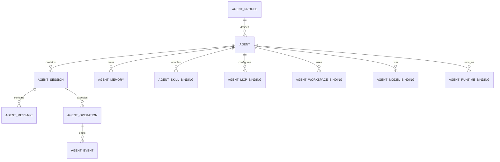
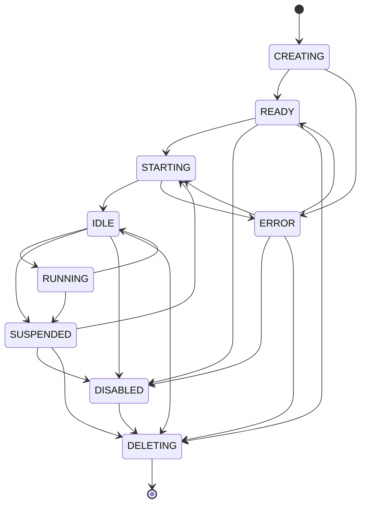
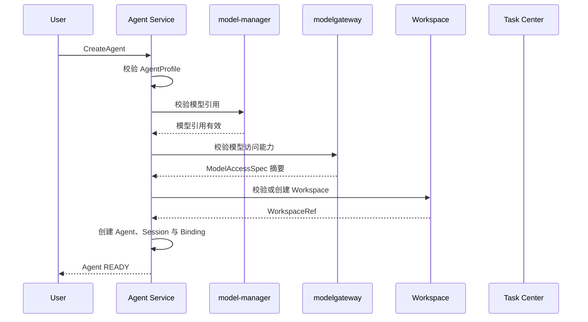
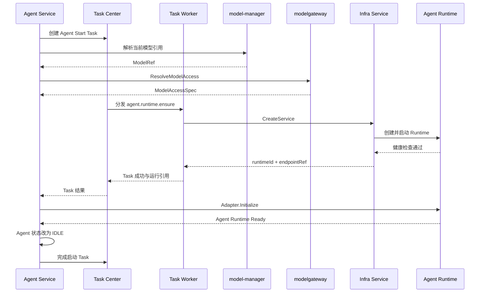
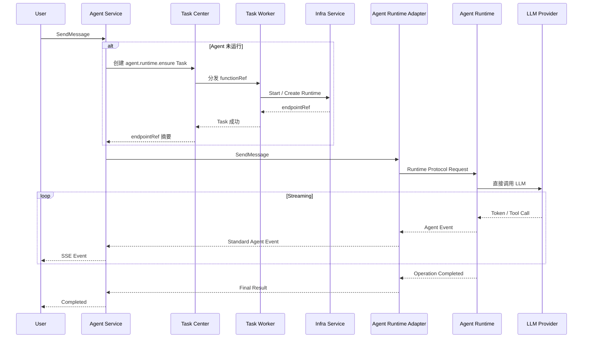
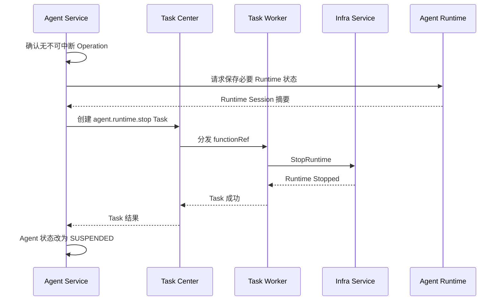
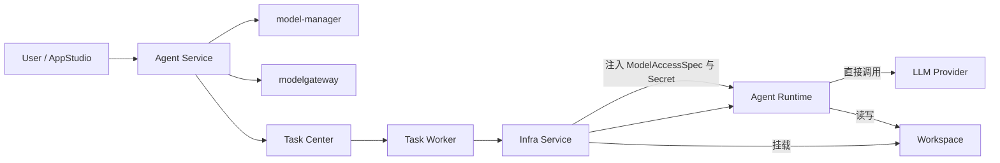

# OmniMAM Agent Service 功能设计文档

> 文档状态：S1 Draft
> 文档版本：v1.0
> 修订日期：2026-08-02
> 适用范围：Agent 定义、会话、记忆、Skills、工具权限、Workspace 绑定、模型绑定及 Runtime 生命周期编排

---

## 1. 文档目的

`Agent Service` 是 OmniMAM 中负责管理 AI Agent 业务生命周期的领域服务。

它用于统一管理：

* Hermes Agent。
* Coding Agent。
* 后续接入的其他交互式 Agent Runtime。
* Agent Session。
* Agent Memory。
* Agent Skills。
* MCP Server Binding。
* Agent 工具权限。
* Agent 与 Workspace 的绑定。
* Agent 使用的模型配置。
* Agent 与 Infra Runtime 的绑定。
* Agent 启动、挂起、恢复、停止和异常恢复。
* Agent 交互操作、消息流和运行事件。

Agent Service 不直接管理 Docker、Kubernetes、GPU、容器、Pod、端口或运行节点。所有实际 Runtime 都由 Agent 创建 Task Center 任务，再由 `Task Worker -> Infra Service` 创建和管理。

---

# 2. 核心定位

Agent Service 负责回答：

* 用户创建了哪个 Agent。
* Agent 使用哪个 Agent Profile。
* Agent 使用哪个模型。
* Agent 可以访问哪些 Skills、MCP 和工具。
* Agent 关联哪个 Workspace。
* Agent 当前处于什么业务状态。
* 用户正在使用哪个 Session。
* Agent 的历史会话和记忆是什么。
* Agent 是否需要启动、挂起或恢复。
* 哪个 Infra Runtime 当前承载该 Agent。
* Agent 操作是否完成、失败或被取消。

Agent Service 不负责回答：

* Runtime 运行在 Docker 还是 Kubernetes。
* Runtime 运行在哪台机器。
* 使用哪个 GPU Device。
* 容器如何创建。
* Pod 如何调度。
* 端口如何分配。
* API Key 如何注入容器。
* Agent 如何实现内部 Agent Loop。
* Agent 如何调用 LLM SDK。
* LLM Provider 的具体协议如何实现。

---

# 3. 核心设计结论

## 3.1 Agent 是持久业务对象

Agent 不是一次性任务，也不等于某个 Runtime。

```text
Agent
├── AgentProfile
├── ModelBinding
├── WorkspaceBinding
├── SkillBindings
├── MCPBindings
├── Sessions
├── Memories
└── RuntimeBinding
```

Agent 可以在不同时间绑定不同 Infra Runtime。

```text
Agent
├── Runtime A：已停止
├── Runtime B：异常退出
└── Runtime C：当前运行
```

Runtime 被删除后，以下对象仍然保留：

* Agent。
* Session。
* Message。
* Memory。
* Workspace Binding。
* Skill Binding。
* Agent 配置。

---

## 3.2 Agent Service 不包含 Runtime Provider

以下组件属于 `Infra Service`：

```text
DockerRuntimeProvider
KubernetesRuntimeProvider
EdgeRuntimeProvider
LocalProcessRuntimeProvider
```

Agent Service 只向 Task Center 提交已注册的 Runtime 任务；Task Worker 再向 Infra Adapter 表达：

```text
启动 `agent.coding`
挂载经授权的 AgentWorkspace 或 StudioWorkspace 引用
注入模型配置
注入 Skill 与 MCP 配置
分配指定资源
返回 Runtime Endpoint 摘要
```

Agent Service 不感知 Infra Service 最终采用哪种 Provider，也不直接调用 Infra Service。

---

## 3.3 Agent Runtime 自行访问 LLM

Hermes、OpenCode 或 Coding Agent Runtime 通常已经实现：

* LLM Client。
* Provider API 调用。
* Streaming。
* Tool Calling。
* Agent Loop。
* Prompt 管理。
* 上下文管理。
* Retry。
* 工具执行。

因此模型请求默认不经过 `modelgateway` 代理。

启动流程为：

1. Agent Service 根据 Agent 的 ModelBinding 确定模型引用。
2. `model-manager` 解析用户私有模型选择。
3. `modelgateway` 将模型引用解析为 `ModelAccessSpec`。
4. Agent Service 将 `ModelAccessSpec` 和授权挂载要求写入 Agent Runtime Task。
5. Task Worker 的 Infra Adapter 调用 Infra Service；Infra Service 解析 CredentialRef 并注入 Runtime。
6. Agent Runtime 自行调用 LLM Provider。



---

## 3.4 Session 与 Runtime 生命周期分离

`AgentSession` 是用户对话和上下文对象，不属于容器。

Runtime 停止后：

* Session 不删除。
* Message 不删除。
* Memory 不删除。
* 用户可以恢复 Agent 后继续原 Session。

Agent Service 负责在 Runtime 恢复后，将必要的 Session 上下文同步给 Agent Runtime。

---

## 3.5 Workspace 生命周期独立

Workspace 可以：

* 在创建 Agent 前已经存在。
* 由 AppStudio 创建。
* 由用户独立创建。
* 在创建 Agent 时请求创建。

Agent 删除或 Runtime 删除时，不自动删除 Workspace。

Agent Service 只拥有：

```text
AgentWorkspaceBinding
```

而不应将 Workspace 内容绑定到 Agent Runtime 生命周期。

---

## 3.6 Task Center 不替代 Agent Session

普通交互式消息由 Agent Service 管理，不要求每条消息都创建 Task Center Task。

以下场景应使用 Task Center：

* Agent Runtime 启动。
* Agent Runtime 恢复。
* Agent Runtime 删除。
* 长时间 Coding Agent 操作。
* Agent 发起的复杂异步任务。
* 需要重试、取消、依赖或后台执行的工具操作。
* Agent 调用 Application Platform 的长任务。
* Agent 发起素材处理任务。

关系：

```text
AgentOperation
    └── 0..1 Task Center Task
```

---

# 4. 系统上下文



---

# 5. 与其他服务的职责边界

## 5.1 Infra Service

Infra Service 负责：

* 创建 Agent Runtime。
* 启动、停止和删除 Runtime。
* 分配 CPU、内存、GPU 和磁盘。
* 选择运行节点。
* 挂载 Workspace。
* 挂载 Skill Package。
* 注入配置和 Secret。
* 分配 Runtime Endpoint。
* 采集运行日志。
* 执行健康检查。
* Runtime 状态对账。

Agent Service 只保存：

```text
infraRuntimeId
endpointRef
runtimeProfileId
runtimeProfileRevision
runtimeHealth
```

不得保存：

```text
containerId
podName
nodeIP
hostPort
dockerNetwork
gpuDeviceId
volumeName
```

---

## 5.2 model-manager

`model-manager` 管理当前用户的：

```text
UserModelProvider
UserProviderModel
UserDefaultModel
```

Agent Service 通过可信用户上下文请求：

* 当前用户默认 Coding 模型。
* 当前用户默认 Chat 模型。
* 用户显式选择的 UserProviderModel。
* 模型启用状态。
* 模型所有权校验。

Agent Service 不直接读取用户 API Key。

---

## 5.3 modelgateway

`modelgateway` 将模型引用解析为：

```text
ModelAccessSpec
```

内容包括：

* ProviderType。
* Protocol。
* BaseURL。
* Remote Model ID。
* CredentialRef。
* Context Window。
* Streaming 支持。
* Tool Calling 支持。
* Vision 支持。
* Reasoning 支持。

`modelgateway` 默认不代理 Agent 的模型请求。

---

## 5.4 Task Center

Task Center 负责：

* 异步任务排队。
* TaskAttempt。
* 重试。
* 取消。
* 超时。
* 串行和并行。
* DAG 依赖。
* 用户可见任务进度。

Agent Service 负责：

* AgentOperation。
* Session。
* Runtime 业务状态。
* 对话过程。
* Agent 操作结果。

Agent Service 可以创建 Task，并保存：

```text
taskId
taskAttemptId
```

但不能复制 Task Center 的任务状态机。

---

## 5.5 AppStudio

AppStudio 通过 Agent Service 使用 Coding Agent。

```text
AppStudio
    ↓
Agent Service
    ↓
Infra Service
    ↓
Coding Agent Runtime
```

AppStudio 负责：

* StudioProject。
* Workspace。
* Preview。
* Build。
* Release。
* StudioApp。

Agent Service 负责：

* Coding Agent。
* Session。
* 模型绑定。
* Skills。
* Runtime 生命周期。
* Coding Agent 操作。

---

## 5.6 Application Platform

Agent 可以通过平台 API 调用已发布的：

```text
ApplicationVersion
```

长时间调用链：

```text
Agent Runtime
    ↓
Application Platform
    ↓
ApplicationRun
    ↓
Task Center
```

Agent Service 不直接执行 ApplicationVersion。

---

## 5.7 Asset Library

Agent 可以：

* 读取授权 Asset。
* 将 AssetReference 传给工具。
* 接收 ArtifactReference。
* 创建素材处理任务。

Agent Service 不管理 Blob、Representation 或物理文件路径。

---

## 5.8 Notification Center

以下事件应产生通知：

* Agent Runtime 启动失败。
* 长时间 AgentOperation 完成。
* 长时间 AgentOperation 失败。
* Agent Runtime 异常退出。
* Coding Agent 后台任务完成。
* Agent 需要用户处理或授权。

普通对话消息不产生系统通知。

---

# 6. Agent 类型与 AgentProfile

## 6.1 AgentProfile 定位

`AgentProfile` 是平台维护的 Agent 运行模板，用于描述：

* 使用哪个 RuntimeProfile。
* 使用哪个 AgentRuntimeAdapter。
* 支持哪些模型协议。
* 支持哪些 Skills。
* 支持哪些工具。
* 默认资源要求。
* Workspace 挂载方式。
* Session 恢复方式。
* 健康检查方式。
* Runtime 配置 Schema。

AgentProfile 不等于用户创建的 Agent。

---

## 6.2 S1 AgentProfile

S1 至少支持：

```text
agent.hermes
agent.coding
```

### agent.hermes

适用于：

* 通用交互式 Agent。
* 多工具调用。
* MCP 调用。
* 个人助手。
* 素材管理辅助。
* 平台操作辅助。

### agent.coding

适用于：

* AppStudio 应用开发。
* Workspace 代码修改。
* 代码生成。
* 测试。
* Build 错误修复。
* Preview 错误修复。
* Hotfix。

---

## 6.3 AgentProfile 示例

```yaml
id: agent.coding
revision: 1
displayName: Coding Agent

runtimeProfile:
  id: agent.coding
  revision: 1

runtimeAdapterType: opencode_compatible

modelRequirements:
  requiredCapabilities:
    - streaming
    - tool_calling
  recommendedPurpose: CODING

workspace:
  required: true
  mountPath: /workspace
  defaultReadOnly: false

resources:
  defaults:
    cpuCores: 4
    memoryMb: 8192
    diskMb: 20480
    gpuCount: 0

lifecycle:
  autoStartOnMessage: true
  suspendWhenIdle: true
  idleTimeoutSeconds: 1800

supportedBindings:
  - MODEL_ACCESS
  - WORKSPACE
  - SKILL_PACKAGE
  - MCP_CONFIG
  - PLATFORM_ENDPOINT
```

---

# 7. AgentRuntimeAdapter

## 7.1 定位

不同 Agent Runtime 可能提供不同的控制协议。

例如：

* Hermes API。
* OpenCode API。
* 自定义 Coding Agent API。
* 标准输入输出协议。

`AgentRuntimeAdapter` 位于 Agent Service 内部，用于屏蔽不同 Agent Runtime 的交互协议。

它与 Infra Service 的 RuntimeProvider 不同。

```text
RuntimeProvider
    负责如何启动 Runtime

AgentRuntimeAdapter
    负责如何与已启动的 Agent Runtime 交互
```

---

## 7.2 核心接口

```go
type AgentRuntimeAdapter interface {
	Initialize(
		ctx context.Context,
		endpoint RuntimeEndpoint,
		config AgentRuntimeConfig,
	) error

	CreateRuntimeSession(
		ctx context.Context,
		endpoint RuntimeEndpoint,
		session AgentSessionContext,
	) (*RuntimeSessionRef, error)

	SendMessage(
		ctx context.Context,
		endpoint RuntimeEndpoint,
		runtimeSessionRef string,
		request AgentMessageRequest,
	) (AgentEventStream, error)

	CancelOperation(
		ctx context.Context,
		endpoint RuntimeEndpoint,
		operationRef string,
	) error

	GetRuntimeStatus(
		ctx context.Context,
		endpoint RuntimeEndpoint,
	) (*AgentRuntimeStatus, error)
}
```

---

## 7.3 Adapter 不负责

AgentRuntimeAdapter 不负责：

* 创建 Docker Container。
* 解析 Secret。
* 调度节点。
* 保存业务 Session。
* 保存长期 Memory。
* 处理用户权限。
* 创建 Task Center Task。

---

# 8. 核心领域对象



---

## 8.1 Agent

字段：

```text
id
ownerUserId
name
description
agentProfileId
agentProfileRevision
status
defaultSessionId
runtimePolicy
createdAt
updatedAt
lastActiveAt
```

---

## 8.2 AgentSession

字段：

```text
id
agentId
ownerUserId
title
status
runtimeSessionRef
createdAt
updatedAt
lastMessageAt
```

Session 状态：

```text
OPEN
CLOSED
ARCHIVED
```

Session 关闭后：

* 历史消息保留。
* Memory 保留。
* Runtime Session 可以被释放。
* 不再接受新消息。

---

## 8.3 AgentMessage

字段：

```text
id
sessionId
role
content
attachments
operationId
createdAt
```

`role`：

```text
USER
ASSISTANT
SYSTEM
TOOL
```

附件只保存引用：

```text
AssetReference
ArtifactReference
WorkspaceFileReference
```

不得保存底层物理路径。

---

## 8.4 AgentOperation

表示一次 Agent 交互或操作。

字段：

```text
id
agentId
sessionId
type
status
userMessageId
assistantMessageId
runtimeOperationRef
taskId
startedAt
completedAt
failureCode
failureMessage
```

`type`：

```text
CHAT
CODING
TOOL_OPERATION
BACKGROUND_OPERATION
```

状态：

```text
QUEUED
STARTING
RUNNING
WAITING_FOR_TOOL
WAITING_FOR_USER
SUCCEEDED
FAILED
CANCELING
CANCELED
```

---

## 8.5 AgentMemory

S1 中保存 Agent 可持续使用的记忆。

字段：

```text
id
agentId
sessionId
scope
type
content
sourceMessageId
createdAt
updatedAt
```

`scope`：

```text
AGENT
SESSION
```

`type`：

```text
FACT
PREFERENCE
SUMMARY
INSTRUCTION
CONTEXT
```

S1 不强制实现向量数据库或复杂自动检索系统。

---

## 8.6 AgentModelBinding

字段：

```text
id
agentId
name
sourceType
purpose
sourceRef
status
createdAt
updatedAt
```

`sourceType`：

```text
USER_DEFAULT_MODEL
USER_PROVIDER_MODEL
PLATFORM_MODEL
```

`purpose`：

```text
CHAT
CODING
VISION
EMBEDDING
```

S1 每个 Agent 至少有一个：

```text
primary-model
```

---

## 8.7 AgentWorkspaceBinding

字段：

```text
id
agentId
workspaceRef
accessMode
mountPath
isPrimary
createdAt
updatedAt
```

`accessMode`：

```text
READ_ONLY
READ_WRITE
```

Coding Agent 的主 Workspace 通常为：

```text
READ_WRITE
```

---

## 8.8 AgentRuntimeBinding

字段：

```text
id
agentId
infraRuntimeId
endpointRef
runtimeProfileId
runtimeProfileRevision
runtimeSessionStrategy
status
createdAt
startedAt
stoppedAt
lastHealthAt
```

状态：

```text
CREATING
STARTING
READY
RUNNING
STOPPING
STOPPED
FAILED
DELETED
```

AgentRuntimeBinding 是 Agent Service 对 Infra Runtime 的业务绑定，不复制容器信息。

---

# 9. Agent 状态模型

Agent 业务状态：

```text
CREATING
READY
STARTING
RUNNING
IDLE
SUSPENDED
ERROR
DISABLED
DELETING
```

---

## 9.1 状态说明

### CREATING

Agent 业务对象正在初始化。

可能执行：

* 校验 AgentProfile。
* 创建默认 Session。
* 创建或绑定 Workspace。
* 校验模型配置。
* 创建默认 Skill Binding。

### READY

Agent 配置完整，但当前没有运行中的 Runtime。

可以：

* 接收启动请求。
* 在 `autoStartOnMessage=true` 时自动启动。

### STARTING

Agent Service 已向 Task Center 提交 Runtime Task，Task Worker 正在请求 Infra Service 创建或启动 Runtime。

### RUNNING

Runtime 正常，并且存在活动中的 AgentOperation。

### IDLE

Runtime 正常，但当前没有活动中的 AgentOperation。

### SUSPENDED

Agent Runtime 已停止或释放，但 Agent、Session、Memory 和 Workspace 仍然保留。

发送消息时可以自动恢复。

### ERROR

Agent 当前无法正常使用。

例如：

* 模型配置失效。
* Runtime 启动失败。
* Workspace 不可访问。
* Agent Runtime 健康检查失败。

### DISABLED

Agent 被用户或管理员禁用。

禁止：

* 启动。
* 恢复。
* 接收新消息。

### DELETING

Agent 正在停止 Runtime 并删除业务对象。

Workspace 不随 Agent 自动删除。

---

## 9.2 状态流转



---

# 10. 创建 Agent

## 10.1 创建输入

```text
name
description
agentProfileId
modelBinding
workspaceBinding
skillBindings
mcpBindings
runtimePolicy
```

---

## 10.2 创建流程



创建 Agent 默认不强制立即创建 Runtime。

只有以下情况启动 Runtime：

* 用户显式启动。
* 用户发送第一条消息。
* AppStudio 启动 Coding Agent。
* 配置了自动预热策略。

---

# 11. Runtime 启动

## 11.1 启动准备

Agent Service 在启动前解析：

* AgentProfile。
* RuntimeProfile。
* ModelBinding。
* WorkspaceBinding。
* SkillBindings。
* MCPBindings。
* Tool Permissions。
* Platform Endpoint。
* Resource Requirement。
* Lifecycle Policy。

---

## 11.2 Infra 请求

```json
{
  "requestId": "agent-start-agent-001-3",
  "runtimeProfile": {
    "id": "agent.coding",
    "revision": 1
  },
  "workspaceBindings": [
    {
      "workspaceRef": "workspace://workspace-001",
      "targetPath": "/workspace",
      "readOnly": false
    }
  ],
  "configurationBindings": [
    {
      "name": "primary-model",
      "type": "MODEL_ACCESS",
      "value": {
        "providerType": "openai_compatible",
        "protocol": "openai_chat_completions",
        "baseUrl": "https://llm.example.com/v1",
        "model": "qwen3-32b",
        "credentialRef": "secret://users/current/provider-001"
      }
    },
    {
      "name": "agent-config",
      "type": "PLAIN_CONFIG",
      "value": {
        "agentId": "agent-001",
        "profile": "agent.coding"
      }
    }
  ],
  "resources": {
    "cpuCores": 4,
    "memoryMb": 8192,
    "diskMb": 20480,
    "gpuCount": 0
  },
  "owner": {
    "service": "agent-service",
    "reference": "agent-runtime-binding-001"
  }
}
```

Agent Service 不接收明文模型密钥。

---

## 11.3 启动流程



---

# 12. 消息与交互

## 12.1 发送消息

用户发送消息时：

1. 校验 Agent 和 Session 所有权。
2. 校验 Agent 是否禁用。
3. 创建 User Message。
4. 创建 AgentOperation。
5. 如 Agent 为 READY 或 SUSPENDED，则启动或恢复 Runtime。
6. 确保 Runtime Session 已建立。
7. 通过 AgentRuntimeAdapter 发送消息。
8. 接收 Agent Event Stream。
9. 将输出写入 Assistant Message。
10. 更新 AgentOperation 状态。

---

## 12.2 消息流程



---

## 12.3 Agent Event

统一事件类型：

```text
operation.started
message.delta
message.completed
tool.requested
tool.started
tool.progress
tool.completed
tool.failed
user.input_required
operation.completed
operation.failed
operation.canceled
```

不同 Agent Runtime 的原始事件由 `AgentRuntimeAdapter` 转换为统一事件。

---

## 12.4 Streaming

S1 使用 SSE 返回 Agent 输出。

建议接口：

```text
GET /agents/{agentId}/operations/{operationId}/events
```

SSE 只负责当前 AgentOperation 的实时事件。

需要跨页面提示的完成和失败事件，交给 Notification Center 或用户级事件通道。

---

# 13. Runtime Session 恢复

Agent Service 保存自己的 `AgentSession`，Runtime 可以保存对应的：

```text
runtimeSessionRef
```

当 Runtime 被重新创建时：

1. 原 RuntimeSessionRef 失效。
2. Agent Service 创建新的 Runtime Session。
3. 将必要的 Session 摘要、最近消息和 Memory 同步给 Runtime。
4. 保存新的 RuntimeSessionRef。
5. 用户继续对话。

不要求 Runtime 自己成为 Session 唯一事实源。

---

# 14. Memory

## 14.1 Memory 所有权

Agent Service 是 Agent Memory 的业务事实源。

Agent Runtime 可以：

* 读取 Agent Service 提供的 Memory。
* 建议创建新的 Memory。
* 建议更新已有 Memory。

Agent Runtime 不应只把长期记忆保存在容器文件系统中。

---

## 14.2 Memory 写入方式

支持：

### 用户显式记忆

用户要求：

```text
记住这个偏好
```

Agent Service 创建 Memory。

### Agent 建议记忆

Agent Runtime 返回：

```text
memory.suggested
```

Agent Service 根据策略直接保存或要求用户确认。

### Session 摘要

Session 过长时，生成摘要并保存为：

```text
scope = SESSION
type = SUMMARY
```

---

## 14.3 S1 限制

S1 不实现：

* 自动知识图谱。
* 多层记忆网络。
* 复杂记忆衰减。
* 跨用户共享记忆。
* Agent 自行访问其他 Agent 的 Memory。

---

# 15. Skills

## 15.1 AgentSkillDefinition

Skill 是可注入 Agent Runtime 的受控能力包。

字段：

```text
id
name
description
version
supportedAgentProfiles
packageRef
configurationSchema
requiredPermissions
status
```

S1 中 Skill Definition 建议采用：

```text
builtin + directory
```

只读加载，不允许普通用户上传任意可执行 Skill。

---

## 15.2 AgentSkillBinding

字段：

```text
id
agentId
skillId
skillVersion
enabled
configuration
createdAt
updatedAt
```

Agent Service 负责：

* 校验 Skill 是否兼容 AgentProfile。
* 校验用户权限。
* 生成 Skill Runtime 配置。
* 将 Skill Package Ref 传给 Infra Service。
* 不直接挂载宿主机路径。

---

## 15.3 Skill 与 Runtime

```text
AgentSkillBinding
    ↓
Agent Service 解析
    ↓
Infra Service 挂载 Skill Package
    ↓
Agent Runtime 加载
```

Skill 不得直接获得：

* Docker Socket。
* 宿主机根目录。
* 未授权 Workspace。
* 明文平台 Secret。
* 任意网络访问权限。

---

# 16. MCP Server Binding

## 16.1 定位

Agent 可以通过 MCP 使用外部或平台工具。

Agent Service 管理：

* MCP Server 引用。
* 启用状态。
* 工具白名单。
* CredentialRef。
* 网络权限。
* Agent 级配置。

---

## 16.2 AgentMCPBinding

字段：

```text
id
agentId
name
serverType
endpointRef
credentialRef
allowedTools
configuration
enabled
createdAt
updatedAt
```

`serverType`：

```text
PLATFORM
REMOTE
RUNTIME_LOCAL
```

---

## 16.3 Secret 处理

Agent Service 只保存：

```text
credentialRef
```

Infra Service 或受信任的连接层负责在 Runtime 启动阶段注入凭证。

Agent Service API 不返回明文凭证。

---

# 17. 工具权限

Agent Service 必须维护 Agent 工具权限策略。

工具可以包括：

```text
workspace.read
workspace.write
workspace.execute_test
asset.read
asset.create
application.run
task.read
task.create
notification.read
mcp.invoke
network.outbound
```

默认原则：

* 最小权限。
* AgentProfile 提供默认权限。
* 用户只能在允许范围内收紧或启用。
* 高风险权限需要显式授权。
* Agent Runtime 不得绕过 Agent Service 权限直接访问平台内部服务。

---

# 18. Workspace

## 18.1 Workspace Binding

Agent Service 只管理绑定关系：

```text
Agent
    ↓
AgentWorkspaceBinding
    ↓
WorkspaceRef
```

Workspace 实际存储和生命周期不与 Agent Runtime 绑定。

---

## 18.2 Coding Agent

Coding Agent 通常需要：

```text
READ_WRITE
```

允许：

* 创建文件。
* 修改代码。
* 删除文件。
* 运行受控测试。
* 读取 Build 日志。
* 读取 Preview 日志。

禁止：

* 访问其他 Workspace。
* 直接修改生产 Runtime。
* 直接修改不可变 Release。
* 将 Secret 写入 Workspace。
* 操作 Docker Socket。

---

## 18.3 Agent 删除

删除 Agent 时：

* 停止并删除 Infra Runtime。
* 删除 AgentRuntimeBinding。
* 删除 Agent 业务对象或进行软删除。
* 不自动删除外部 Workspace。
* 不自动删除 Workspace Snapshot。
* 不自动删除已发布 StudioApp。

---

# 19. 挂起与恢复

## 19.1 挂起条件

支持：

* 用户主动挂起。
* Agent 空闲超过策略时间。
* 系统资源回收。
* AppStudio 项目暂时关闭。
* 管理员操作。

---

## 19.2 挂起流程



挂起后保留：

* Agent。
* Session。
* Message。
* Memory。
* Workspace。
* Skills。
* MCP Bindings。
* ModelBinding。

---

## 19.3 恢复流程

恢复时：

1. 重新解析 ModelBinding。
2. 重新解析 CredentialRef。
3. 请求 Infra Service 创建或启动 Runtime。
4. 重新加载 Workspace 和 Skills。
5. 创建 Runtime Session。
6. 恢复 Session 摘要和 Memory。
7. Agent 状态变为 IDLE。

---

# 20. 异常恢复

## 20.1 Runtime 异常退出

Infra Service 上报：

```text
infra.runtime.failed
```

Agent Service：

1. 将 RuntimeBinding 标记为 FAILED。
2. 将 Agent 标记为 ERROR。
3. 检查恢复策略。
4. 根据策略创建恢复 Task。
5. 重新创建 Runtime。
6. 恢复 Session 和 Memory。
7. 恢复成功后将 Agent 状态改为 IDLE。
8. 多次失败后停止自动恢复。

---

## 20.2 恢复策略

```text
NONE
ON_FAILURE
ALWAYS
```

可配置：

```text
maximumRecoveryAttempts
recoveryBackoffSeconds
```

Task Center 负责恢复任务的重试和执行记录。

---

## 20.3 不可自动恢复的错误

以下错误不应无限自动恢复：

* ModelBinding 已失效。
* CredentialRef 无权限。
* Workspace 已删除。
* AgentProfile 已禁用。
* RuntimeProfile 不存在。
* 用户账户被禁用。
* Skill Package 不可用。

---

# 21. Task Center 集成

Agent Service 创建的任务类型：

```text
AGENT_CREATE
AGENT_START
AGENT_SUSPEND
AGENT_RESUME
AGENT_STOP
AGENT_DELETE
AGENT_RECOVER
AGENT_LONG_OPERATION
AGENT_TOOL_OPERATION
```

Task Center 负责：

* 排队。
* 重试。
* 取消。
* 超时。
* TaskAttempt。
* 用户可见任务状态。

Agent Service 负责将 Task 结果投影到：

* Agent 状态。
* RuntimeBinding 状态。
* AgentOperation 状态。

---

# 22. Notification Center 集成

通知事件：

```text
agent.runtime.start_failed
agent.runtime.recovered
agent.runtime.recovery_failed
agent.operation.completed
agent.operation.failed
agent.input_required
agent.disabled
```

以下情况不生成通知：

* 每个 Token。
* 普通消息 Delta。
* 普通 Tool Progress。
* Agent 从 RUNNING 转为 IDLE。

---

# 23. 权限模型

## 23.1 用户所有权

以下对象必须校验当前用户：

```text
Agent
AgentSession
AgentMessage
AgentOperation
AgentMemory
AgentModelBinding
AgentWorkspaceBinding
AgentSkillBinding
AgentMCPBinding
```

请求体中的 `ownerUserId` 不可信。

所有权必须从认证上下文解析。

---

## 23.2 服务身份

Agent Service 调用以下内部服务时使用服务身份：

```text
Infra Service
Task Center
model-manager
modelgateway
Asset Library
Application Platform
Notification Center
```

Infra Service 的 Runtime 创建接口不能直接暴露给前端。

---

## 23.3 Runtime 身份

Agent Runtime 使用独立 Runtime Identity。

它只获得：

* 当前 Agent 被授权的 Platform API。
* 当前 Workspace。
* 当前 Skill。
* 当前 MCP 配置。
* 当前模型凭证。
* 当前用户授权的数据范围。

Agent Runtime 不自动继承 Agent 创建者的全部平台权限。

---

# 24. Secret 与模型凭证

## 24.1 基本规则

Agent Service：

* 不保存明文 API Key。
* 不读取明文 API Key。
* 不返回明文 API Key。
* 不将 API Key 写入 Session。
* 不将 API Key 写入 Message。
* 不将 API Key 写入 Workspace。
* 不将 API Key 写入 Agent 日志。

---

## 24.2 注入链路

```text
AgentModelBinding
    ↓
model-manager 校验模型所有权
    ↓
modelgateway 生成 ModelAccessSpec
    ↓
Agent Service 创建 Agent Runtime Task
    ↓
Task Worker 的 Infra Adapter 提交受控 Infra 请求
    ↓
Infra Service 解析 CredentialRef
    ↓
Agent Runtime 获得运行期凭证
```

---

# 25. 日志与可观测性

## 25.1 Agent Service 日志

记录：

* Agent 状态变化。
* Session 操作。
* Runtime Binding。
* Adapter 调用状态。
* Operation 状态。
* 任务关联。
* 权限拒绝。
* 恢复行为。

不记录：

* 明文模型密钥。
* 完整用户 Prompt，除非属于业务消息存储。
* Secret 文件内容。
* Runtime 环境变量。

---

## 25.2 Runtime 日志

Runtime 原始日志由 Infra Service 管理。

Agent Service 保存：

```text
runtimeLogRef
```

并可以提供经过权限校验的日志查询入口。

---

## 25.3 指标

```text
agent_total
agent_running_total
agent_idle_total
agent_suspended_total
agent_error_total

agent_session_total
agent_operation_running
agent_operation_failed_total
agent_operation_duration

agent_runtime_start_duration
agent_runtime_recovery_total
agent_runtime_recovery_failed_total

agent_message_total
agent_tool_call_total
```

---

## 25.4 Trace

调用链携带：

```text
traceId
userId
agentId
sessionId
operationId
taskId
infraRuntimeId
```

---

# 26. 主要接口

以下为逻辑接口，不限定最终 HTTP 或 RPC 路径。

## 26.1 AgentProfile

```text
ListAgentProfiles
GetAgentProfile
ReloadAgentProfiles
```

S1 中 AgentProfile 为只读平台配置。

---

## 26.2 Agent

```text
CreateAgent
GetAgent
ListAgents
UpdateAgent
EnableAgent
DisableAgent
DeleteAgent
```

---

## 26.3 生命周期

```text
StartAgent
SuspendAgent
ResumeAgent
StopAgent
RecoverAgent
GetAgentRuntimeStatus
GetAgentRuntimeLogs
```

---

## 26.4 Session

```text
CreateAgentSession
GetAgentSession
ListAgentSessions
UpdateAgentSession
CloseAgentSession
ArchiveAgentSession
```

---

## 26.5 Message 与 Operation

```text
SendAgentMessage
GetAgentMessage
ListAgentMessages

GetAgentOperation
ListAgentOperations
CancelAgentOperation
StreamAgentOperationEvents
```

---

## 26.6 Memory

```text
CreateAgentMemory
GetAgentMemory
ListAgentMemories
UpdateAgentMemory
DeleteAgentMemory
```

---

## 26.7 ModelBinding

```text
GetAgentModelBindings
SetAgentModelBinding
DeleteAgentModelBinding
ValidateAgentModelBinding
```

---

## 26.8 WorkspaceBinding

```text
BindAgentWorkspace
UnbindAgentWorkspace
ListAgentWorkspaceBindings
SetPrimaryAgentWorkspace
```

---

## 26.9 Skills

```text
ListAgentSkillDefinitions
ListAgentSkillBindings
EnableAgentSkill
DisableAgentSkill
UpdateAgentSkillConfiguration
```

---

## 26.10 MCP

```text
ListAgentMCPBindings
CreateAgentMCPBinding
UpdateAgentMCPBinding
EnableAgentMCPBinding
DisableAgentMCPBinding
DeleteAgentMCPBinding
```

---

# 27. 内部接口

## 27.1 Task Center 结果与 Infra 事件处理

Agent Service 不直接接收 Infra Service 的创建请求或 Provider 回调。Infra 状态先由 Task Worker/Task Center 投影，Agent 只消费与自身 `AgentRuntimeBinding` 相关的任务结果和受控状态摘要。

```text
HandleRuntimeStarted
HandleRuntimeReady
HandleRuntimeHealthChanged
HandleRuntimeStopped
HandleRuntimeFailed
HandleRuntimeDeleted
```

---

## 27.2 Runtime Adapter

```text
InitializeRuntime
CreateRuntimeSession
SendRuntimeMessage
CancelRuntimeOperation
GetRuntimeAgentStatus
```

---

## 27.3 Model 解析

```text
ResolveAgentModelBinding
ValidateAgentModelCapabilities
BuildModelAccessSpec
```

---

# 28. 事件

## 28.1 Agent 业务事件

```text
agent.created
agent.updated
agent.enabled
agent.disabled
agent.deleting
agent.deleted

agent.starting
agent.started
agent.idle
agent.suspended
agent.resuming
agent.error
agent.recovered

agent.session.created
agent.session.closed
agent.session.archived

agent.operation.started
agent.operation.waiting_for_user
agent.operation.completed
agent.operation.failed
agent.operation.canceled

agent.memory.created
agent.memory.updated
agent.memory.deleted

agent.workspace.bound
agent.workspace.unbound

agent.skill.enabled
agent.skill.disabled

agent.mcp.enabled
agent.mcp.disabled
```

---

## 28.2 不属于 Agent Service 的事件

以下属于 Infra Service：

```text
container.created
pod.scheduled
gpu.assigned
volume.mounted
runtime.provider.failed
```

以下属于 Task Center：

```text
task.queued
task.retrying
task.attempt.started
task.attempt.failed
```

Agent Service 只消费必要事件并更新自己的业务投影。

---

# 29. 标准错误码

## 29.1 Agent

```text
AGENT_NOT_FOUND
AGENT_ACCESS_DENIED
AGENT_DISABLED
AGENT_INVALID_STATE
AGENT_PROFILE_NOT_FOUND
AGENT_PROFILE_DISABLED
AGENT_PROFILE_REVISION_NOT_FOUND
```

---

## 29.2 Session 与 Operation

```text
AGENT_SESSION_NOT_FOUND
AGENT_SESSION_CLOSED
AGENT_OPERATION_NOT_FOUND
AGENT_OPERATION_ALREADY_COMPLETED
AGENT_OPERATION_CANCEL_FAILED
AGENT_RUNTIME_SESSION_CREATE_FAILED
```

---

## 29.3 模型

```text
AGENT_MODEL_BINDING_NOT_FOUND
AGENT_MODEL_BINDING_INVALID
AGENT_MODEL_ACCESS_RESOLVE_FAILED
AGENT_MODEL_CAPABILITY_UNSUPPORTED
AGENT_MODEL_CREDENTIAL_UNAVAILABLE
```

---

## 29.4 Workspace

```text
AGENT_WORKSPACE_REQUIRED
AGENT_WORKSPACE_NOT_FOUND
AGENT_WORKSPACE_ACCESS_DENIED
AGENT_WORKSPACE_BIND_FAILED
AGENT_WORKSPACE_UNAVAILABLE
```

---

## 29.5 Runtime

```text
AGENT_RUNTIME_NOT_FOUND
AGENT_RUNTIME_CREATE_FAILED
AGENT_RUNTIME_START_FAILED
AGENT_RUNTIME_INITIALIZE_FAILED
AGENT_RUNTIME_UNHEALTHY
AGENT_RUNTIME_STOP_FAILED
AGENT_RUNTIME_RECOVERY_FAILED
```

---

## 29.6 Skills 与 MCP

```text
AGENT_SKILL_NOT_FOUND
AGENT_SKILL_NOT_SUPPORTED
AGENT_SKILL_PERMISSION_DENIED
AGENT_MCP_BINDING_INVALID
AGENT_MCP_TOOL_NOT_ALLOWED
AGENT_MCP_CREDENTIAL_UNAVAILABLE
```

---

# 30. 数据表建议

```text
agent_profiles
agents
agent_sessions
agent_messages
agent_operations
agent_operation_events

agent_memories
agent_model_bindings
agent_workspace_bindings
agent_skill_bindings
agent_mcp_bindings
agent_runtime_bindings
```

AgentProfile 可以由内置和目录加载，不一定需要数据库作为唯一事实源。

---

# 31. S1 实现范围

## 31.1 S1 必须实现

* AgentProfile。
* Hermes Agent。
* Coding Agent。
* Agent 创建、修改、启用、禁用和删除。
* Agent 状态机。
* Agent Session。
* Agent Message。
* AgentOperation。
* SSE 流式输出。
* Agent Memory 基础能力。
* AgentModelBinding。
* `model-manager` 集成。
* `modelgateway` ModelAccessSpec 解析。
* Infra Service Runtime 创建和停止。
* Secret 安全注入。
* AgentRuntimeAdapter。
* Workspace Binding。
* Coding Agent 读写 Workspace。
* Agent Skills。
* MCP Server Binding。
* 工具权限。
* Runtime 挂起和恢复。
* Runtime 异常恢复。
* Task Center 集成。
* Notification Center 集成。
* AppStudio Coding Agent 集成。
* 用户权限隔离。
* Runtime 日志引用。

---

## 31.2 S1 不实现

* 一次性 Agent 概念。
* 多 Agent 自动协作编排。
* Agent 自主创建其他 Agent。
* Agent Marketplace。
* 用户上传任意可执行 Skill。
* Agent 自动安装未知依赖。
* Agent 直接操作 Docker 或 Kubernetes。
* Agent 获取宿主机 Shell。
* Agent 直接读取明文 Secret。
* Agent 修改生产 Runtime。
* Agent 自动修改已发布 Release。
* Agent Service 自己实现 LLM Proxy。
* Agent Service 自己实现 Infra Runtime Provider。
* 跨用户共享 Agent Memory。
* 完整向量记忆系统。
* 无限制自主后台运行。
* 任意网络访问。

---

# 32. 强制架构规则

## R-AGENT-001

Agent 是持久业务对象，不等于 Infra Runtime。

## R-AGENT-002

Agent Session、Message 和 Memory 不得依赖 Runtime 生命周期保存。

## R-AGENT-003

Agent Service 不得直接操作 Docker、Kubernetes、宿主机、GPU 或 Edge Node Agent。

## R-AGENT-004

所有 Agent Runtime 必须通过 Infra Service 创建和管理。

## R-AGENT-005

Agent Runtime 自行完成 LLM 调用、Streaming、Tool Calling 和 Agent Loop。

## R-AGENT-006

`modelgateway` 默认只负责生成 ModelAccessSpec，不代理每次 Agent 模型请求。

## R-AGENT-007

Agent Service 不得读取或保存明文模型凭证。

## R-AGENT-008

模型 Credential 必须由 Infra Service 在 Runtime 启动阶段注入。

## R-AGENT-009

AgentRuntimeAdapter 只负责 Agent Runtime 交互协议，不负责基础设施运行。

## R-AGENT-010

Workspace 生命周期独立于 Agent 和 Runtime 生命周期。

## R-AGENT-011

删除 Agent 不得自动删除外部 Workspace 或已发布 StudioApp。

## R-AGENT-012

Agent Runtime 不得直接挂载 Docker Socket。

## R-AGENT-013

Agent Runtime 不得直接修改生产 Runtime 或不可变 Release。

## R-AGENT-014

复杂异步操作必须复用 Task Center。

## R-AGENT-015

Asset、Artifact 和 ApplicationRun 必须通过对应领域服务访问。

## R-AGENT-016

Skills 和 MCP 工具必须经过显式 Binding 与权限控制。

## R-AGENT-017

用户身份必须从可信认证上下文解析，不得信任请求中的 userId。

## R-AGENT-018

Agent 状态与 Infra Runtime 状态必须分离。

## R-AGENT-019

Agent Service 必须支持 Runtime 异常后的状态对账和恢复。

## R-AGENT-020

普通交互消息可以直接由 Agent Service 管理，不要求每条消息都创建 Task Center Task。

---

# 33. 最终职责总结

```text
Agent Service
    管理 Agent、Session、Memory、Skills、MCP、权限和业务生命周期

model-manager
    决定当前用户可以使用哪个模型

modelgateway
    将模型引用解析为 ModelAccessSpec

Infra Service
    创建 Agent Runtime，并注入 Workspace、配置和 Secret

Agent Runtime
    执行 Agent Loop，并自行调用 LLM 和工具

Task Center
    管理复杂异步操作、重试、取消和依赖

AppStudio
    使用 Coding Agent 开发和修改 StudioApp

Application Platform
    提供 Agent 可调用的 ApplicationVersion

Asset Library
    管理 Agent 使用和生成的 Asset 与 Artifact

Notification Center
    通知长时间操作完成、失败或需要用户处理
```

完整运行链路：



最终边界为：

> Agent Service 决定运行哪个 Agent、使用哪个模型、Workspace 和工具；Task Center 统一承接运行任务；Task Worker 通过 Infra Adapter 调用 Infra Service；Infra Service 决定该 Agent Runtime 如何运行；Agent Runtime 自行完成模型调用和 Agent Loop。
