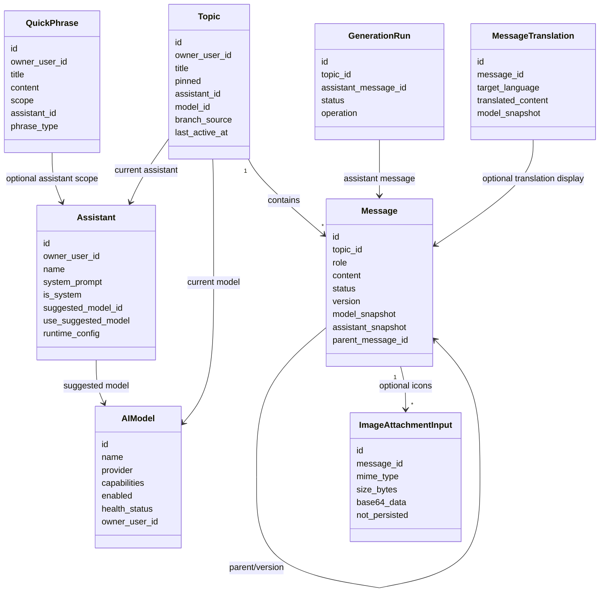
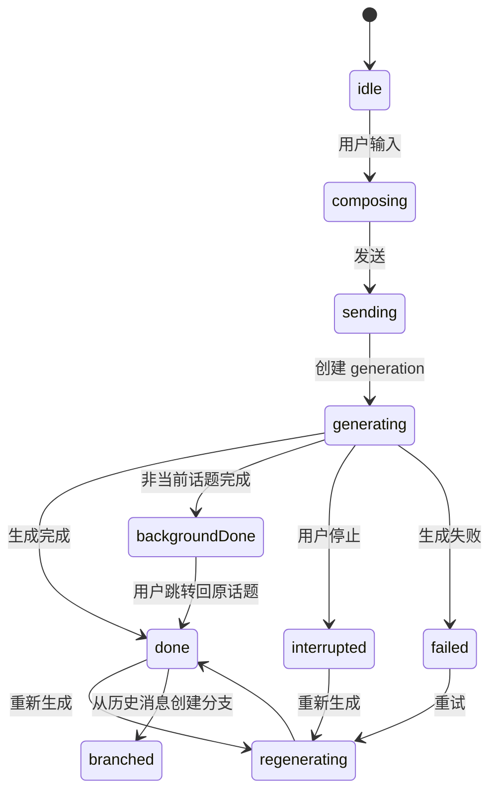
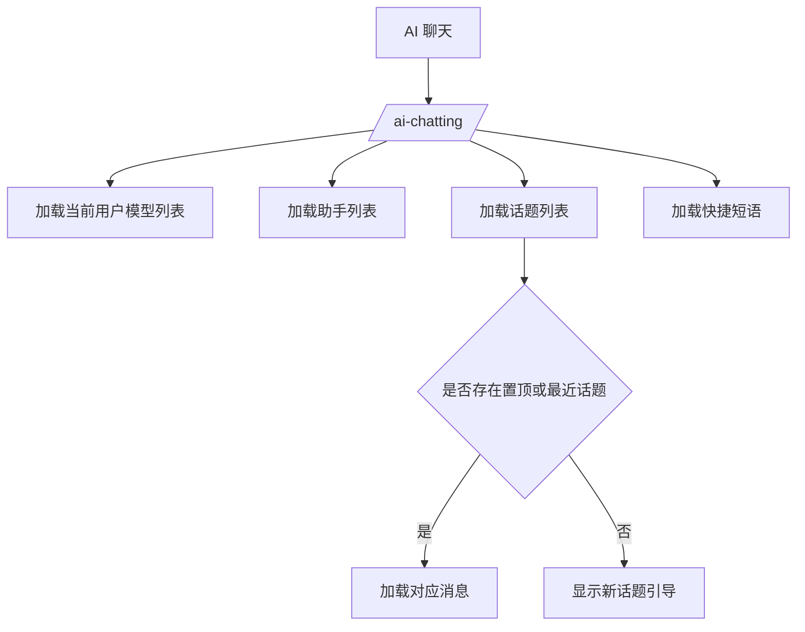
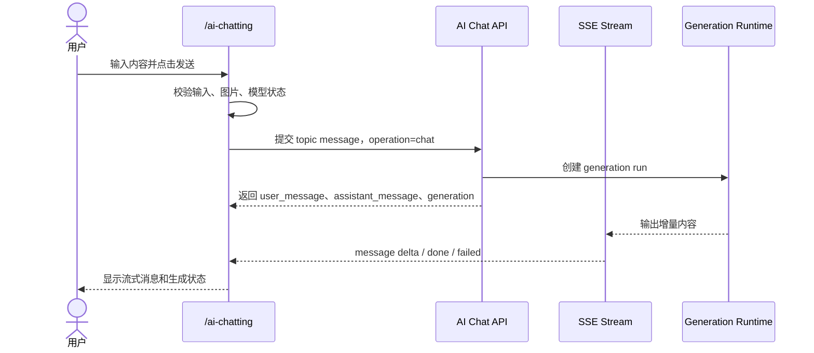
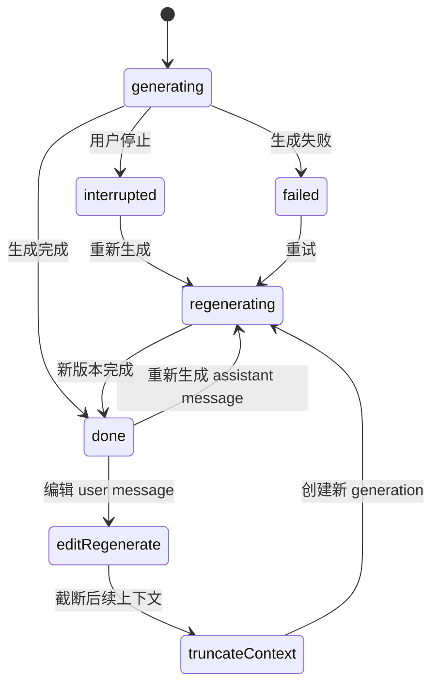
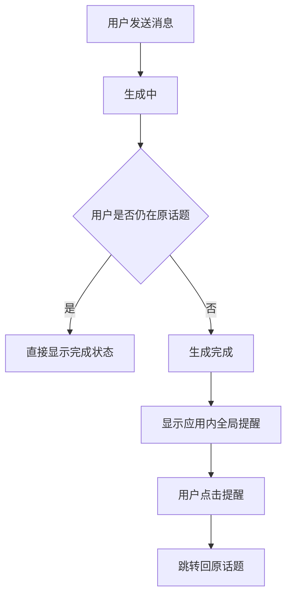
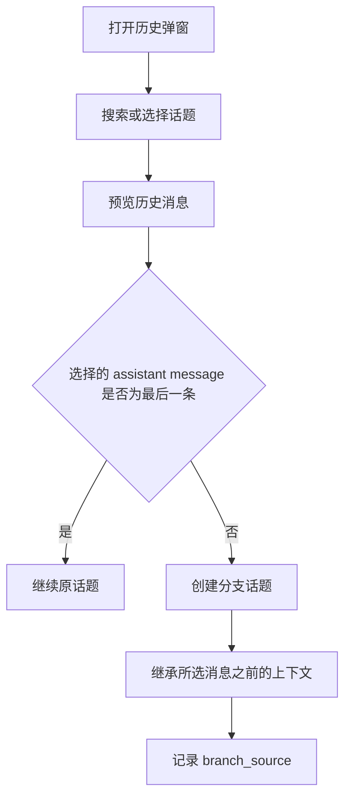
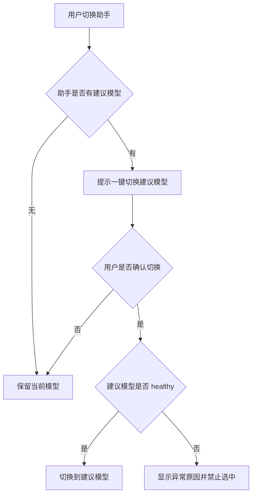
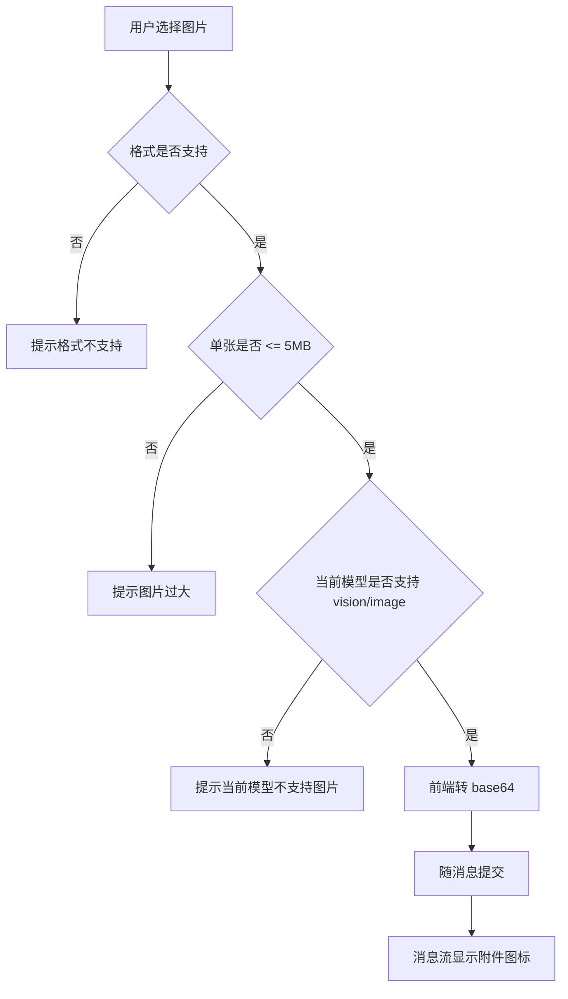
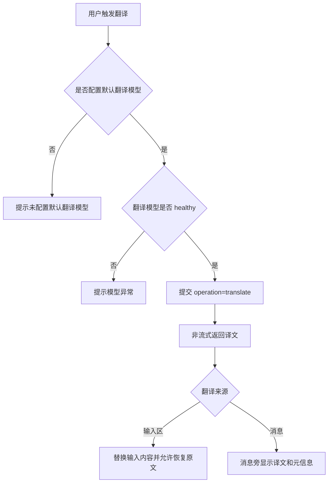

# AI 聊天产品规格
> 本文档是 S1 产品事实源，用于定义 AI 聊天特性的产品语义、领域模型、业务规则、用户故事和端呈现策略。
>
> 本文档中的 Mermaid 图用于辅助理解复杂流程、状态变化、角色可见性和交互时序。图与文字描述应被视为同一事实集合；若存在不一致，应修正文档后再进入实现。

---

## 1. 功能说明

在 OmniMAM 系统内提供一个面向工作流的 AI 聊天页面，让用户能够围绕资产、任务、代码说明、翻译和日常问答创建连续会话，并在同一界面中切换助手、模型、快捷短语和历史上下文。

本特性的核心价值是把用户个人模型、助手预设、对话历史、消息生成、分支续聊、快捷输入、图片附件和翻译辅助收敛到一个可追溯、可持久化、可接入后端契约的产品入口。


## 2. 核心数据模型

> 本节描述 S1 领域数据模型，仅表达产品语义和逻辑字段，不等同于接口 DTO、数据库 schema 或后端 ORM。

### 2.1 数据模型关系图



### 2.2 AIModel（用户可用模型摘要）

| 字段 | 类型 | 必填 | 说明 |
|------|------|------|------|
| id | string | 是 | 模型唯一标识 |
| name | string | 是 | 模型显示名称 |
| provider | string | 是 | 模型服务商 |
| capabilities | array of string | 是 | 能力标签，例如 `text`、`vision`、`image`、`translation` |
| enabled | boolean | 是 | 当前用户是否启用该模型 |
| healthStatus | enum: healthy, unhealthy | 是 | 模型健康状态 |
| unhealthyReason | string | 否 | unhealthy 时展示给用户的异常原因 |
| ownerUserId | string | 是 | 模型配置所属用户 |

### 2.3 Assistant（助手）

| 字段 | 类型 | 必填 | 说明 |
|------|------|------|------|
| id | string(uuid) | 是 | 唯一标识 |
| ownerUserId | string | 是 | 创建者用户 ID |
| name | string | 是 | 助手名称，同一用户下唯一 |
| systemPrompt | string | 否 | 系统提示词 |
| isSystem | boolean | 是 | 是否为系统助手 |
| suggestedModelId | string | 否 | 助手建议模型 ID |
| useSuggestedModel | boolean | 是 | 是否默认使用建议模型 |
| contextMessageCount | integer | 否 | 参与上下文的历史消息数量 |
| streamEnabled | boolean | 是 | 是否建议流式输出 |
| toolCallMode | enum: none, manual, auto | 否 | 工具调用方式；当前特性不交付 MCP 工具调用 |
| maxToolCallCount | integer | 否 | 最大工具调用次数；当前特性仅保留配置语义 |
| temperature | number | 否 | 默认 temperature |
| topP | number | 否 | 默认 top_p |
| maxTokens | integer | 否 | 默认最大输出 token |
| customParams | object | 否 | 自定义模型参数 |

### 2.4 Topic（话题）

| 字段 | 类型 | 必填 | 说明 |
|------|------|------|------|
| id | string(uuid) | 是 | 唯一标识 |
| ownerUserId | string | 是 | 话题所属用户 |
| title | string | 是 | 话题标题 |
| pinned | boolean | 是 | 是否置顶 |
| assistantId | string | 是 | 当前话题使用的助手 ID |
| modelId | string | 是 | 当前话题使用的模型 ID |
| branchSource | object | 否 | 分支来源，包含来源话题和来源消息 |
| lastActiveAt | string(date-time) | 是 | 最近活跃时间 |
| createdAt | string(date-time) | 是 | 创建时间 |
| updatedAt | string(date-time) | 是 | 更新时间 |

### 2.5 Message（消息）

| 字段 | 类型 | 必填 | 说明 |
|------|------|------|------|
| id | string(uuid) | 是 | 唯一标识 |
| topicId | string | 是 | 所属话题 ID |
| role | enum: user, assistant, system | 是 | 消息角色 |
| content | string | 是 | 消息正文，支持 Markdown |
| status | enum: queued, generating, done, interrupted, failed | 是 | 消息状态 |
| version | integer | 是 | 消息版本 |
| parentMessageId | string | 否 | 父消息 ID，用于版本、重生成或分支追溯 |
| modelSnapshot | object | 条件必填 | assistant message 必须记录当次模型快照 |
| assistantSnapshot | object | 条件必填 | assistant message 必须记录当次助手快照 |
| attachmentIcons | array | 否 | 附件图标展示语义，不展示媒体具体内容 |
| createdAt | string(date-time) | 是 | 创建时间 |
| updatedAt | string(date-time) | 是 | 更新时间 |

### 2.6 ImageAttachmentInput（图片附件输入）

| 字段 | 类型 | 必填 | 说明 |
|------|------|------|------|
| id | string(uuid) | 是 | 前端生成或请求内标识 |
| messageId | string | 否 | 关联消息 ID |
| mimeType | string | 是 | 图片 MIME 类型 |
| sizeBytes | integer | 是 | 图片大小 |
| base64Data | string | 是 | base64 图片数据 |
| notPersisted | boolean | 是 | 当前特性要求后端不持久化附件 |

### 2.7 GenerationRun（生成运行）

| 字段 | 类型 | 必填 | 说明 |
|------|------|------|------|
| id | string(uuid) | 是 | 生成运行 ID |
| topicId | string | 是 | 所属话题 ID |
| assistantMessageId | string | 是 | 本次生成对应的 assistant message |
| operation | enum: chat, translate | 是 | 操作类型 |
| status | enum: queued, generating, done, interrupted, failed | 是 | 生成状态 |
| startedAt | string(date-time) | 否 | 开始时间 |
| finishedAt | string(date-time) | 否 | 完成时间 |

### 2.8 QuickPhrase（快捷短语）

| 字段 | 类型 | 必填 | 说明 |
|------|------|------|------|
| id | string(uuid) | 是 | 唯一标识 |
| ownerUserId | string | 是 | 所属用户 |
| title | string | 是 | 快捷短语标题 |
| content | string | 是 | 快捷短语内容 |
| scope | enum: global, assistant | 是 | 作用域 |
| assistantId | string | 条件必填 | `scope=assistant` 时必填 |
| phraseType | enum: plain, prompt | 是 | 短语类型 |

### 2.9 MessageTranslation（消息翻译展示）

| 字段 | 类型 | 必填 | 说明 |
|------|------|------|------|
| id | string(uuid) | 是 | 唯一标识 |
| messageId | string | 是 | 被翻译的消息 ID |
| targetLanguage | string | 是 | 目标语言 |
| translatedContent | string | 是 | 翻译结果 |
| modelSnapshot | object | 是 | 翻译使用的模型快照 |
| createdAt | string(date-time) | 是 | 创建时间 |

---

## 3. 业务规则

### 3.1 规则列表

- **BR-AICHAT-01** `Topic` 是消息会话的组织单位，包含标题、置顶状态、当前助手、当前模型、分支来源和最近活跃时间。
- **BR-AICHAT-02** `Topic`、`Assistant`、`QuickPhrase` 和模型配置默认归属于当前用户个人数据边界，不在当前特性内共享给其他用户。
- **BR-AICHAT-03** `Message` 必须属于一个 `Topic`，角色至少包含 `user`、`assistant`、`system`。
- **BR-AICHAT-04** `Message.status` 至少覆盖 `queued`、`generating`、`done`、`interrupted`、`failed`。
- **BR-AICHAT-05** 每次 assistant response 必须保留 `model_snapshot` 与 `assistant_snapshot`。
- **BR-AICHAT-06** 重新生成必须保留版本语义，避免覆盖历史回复导致追溯断裂。
- **BR-AICHAT-07** 编辑 user message 后重生成必须截断后续上下文，避免新旧上下文混用；被截断或被替代的历史需要保留可追溯关系。
- **BR-AICHAT-08** 话题分支必须记录来源话题和来源消息，分支默认不继承置顶状态。
- **BR-AICHAT-09** 系统助手不可删除；系统助手名称不可由普通编辑修改。
- **BR-AICHAT-10** 助手名称需要在当前用户下保持唯一。
- **BR-AICHAT-11** 快捷短语作用域为 `global` 或 `assistant`；助手级短语只能在对应助手上下文中显示或筛选。
- **BR-AICHAT-12** 翻译能力依赖当前用户已启用的默认翻译模型；没有翻译模型时不得静默 fallback 到任意聊天模型。
- **BR-AICHAT-13** 默认翻译模型健康状态为 `unhealthy` 时，翻译入口需要提示模型异常并阻止翻译请求。
- **BR-AICHAT-14** 翻译和普通聊天复用同一 AI 对话能力，但用 `operation` 或等价参数区分；`operation=translate` 不使用 stream，`operation=chat` 必须支持 SSE stream。
- **BR-AICHAT-15** 图片附件能力依赖模型 capability：只有声明 `vision` 或 `image` 的模型才可支持图片附件。
- **BR-AICHAT-16** 当前选中模型健康状态为 `unhealthy` 时，发送、重新生成、编辑后重生成和图片附件发送均不得继续调用该模型。
- **BR-AICHAT-17** 图片附件当前只支持 base64 请求数据，不后端持久化、不做安全扫描、不展示媒体具体内容；消息列表仅显示附件图标。
- **BR-AICHAT-18** 图片附件仅支持 `jpg`、`jpeg`、`png`、`webp`、`bmp`，单张图片不得超过 5MB。
- **BR-AICHAT-19** 导出能力由前端组装，不创建后端导出任务，不产生导出审计要求。
- **BR-AICHAT-20** 后台完成提醒是应用内提醒，不依赖浏览器系统通知权限。
- **BR-AICHAT-21** 同一话题同一时间只允许一个 active generation，避免竞态写入消息流。
- **BR-AICHAT-22** 输入为空且没有图片附件时，不允许发送。
- **BR-AICHAT-23** 当前特性暂不引入 `ai_chat.read`、`ai_chat.write`、`ai_chat.manage` 等独立业务权限；访问依赖系统基础登录态和当前用户个人数据隔离。

### 3.2 状态与异常



异常场景：

- `empty_input`：输入为空且无图片附件时不发送。
- `unauthenticated`：用户未登录或登录态失效时不能进入个人 AI 聊天数据。
- `model_unavailable`：当前模型未启用、健康状态为 `unhealthy` 或 provider 不可用时，需要用户重新选择模型。
- `assistant_deleted`：当前助手被删除后回退到系统默认助手。
- `translation_model_missing`：默认翻译模型缺失时显示提示并保持原输入。
- `translation_model_unhealthy`：默认翻译模型健康状态为 `unhealthy` 时显示异常原因并保持原输入。
- `concurrent_generation`：同一话题已有运行中的 generation 时，新的发送或重生成请求应被拒绝。
- `branch_source_missing`：分支来源消息不存在时不能创建分支。
- `image_attachment_invalid`：图片格式不在 `jpg`、`jpeg`、`png`、`webp`、`bmp` 内，或单张图片超过 5MB 时不允许发送。
- `image_model_unsupported`：当前模型不具备 `vision` 或 `image` capability 时，不允许携带图片附件发送。
- `export_empty_topic`：当前话题不存在或无消息时不允许导出，或导出空会话需明确提示。

---

## 4. 用户故事

用户故事用于描述用户诉求、业务语义和关键流程。复杂流程可以使用 Mermaid 图辅助理解。

### US-AICHAT-01 进入 AI 聊天工作区

用户可以在登录态有效时从主导航进入 `/ai-chatting`，看到自己的 AI 聊天工作区，并自动加载模型、助手、话题、消息和快捷短语。

#### 业务说明

- 页面默认选中最近或置顶优先的话题，并加载对应消息。
- 如果加载失败，需要有错误提示和可恢复入口。
- 当前特性不引入独立业务权限，访问依赖系统基础登录态和当前用户个人数据隔离。

#### 可视化补充



### US-AICHAT-02 发送流式聊天消息

用户可以在输入区输入内容并发送消息，系统创建 user message、assistant message 和 generation run，助手回复通过 SSE 增量展示。

#### 业务说明

- 输入为空且没有图片附件时，不允许发送。
- 发送时使用当前助手、当前模型和可选 slash command。
- assistant message 必须记录当前模型和助手快照。
- 普通聊天生成必须使用 SSE 传输增量内容。
- 发送成功后清空输入区，并刷新话题最近活动时间。

#### 可视化补充



### US-AICHAT-03 停止、重新生成与编辑后重生成

用户可以停止当前生成、重新生成 assistant message，或编辑 user message 后截断后续上下文并重新生成。

#### 业务说明

- 当当前话题有运行中的 generation，用户可以停止生成；停止后 assistant message 进入 `interrupted` 状态。
- 用户可以对 assistant message 执行重新生成；新回复应保持版本关系或父消息关系。
- 用户可以编辑 user message 后重新生成；系统从被编辑的 user message 起截断其后的消息上下文，创建新的 generation，并保留原消息版本或父子关系供追溯。
- 同一话题同一时间只允许一个 active generation。

#### 可视化补充



### US-AICHAT-04 后台完成提醒

用户发送消息后，如果切换到其他页面、打开其他历史话题或当前不再停留在原话题，原话题生成完成时需要显示应用内全局提醒，并提供跳转回原话题的入口。

#### 业务说明

- 提醒内容需要说明原会话已完成，并提供跳转回原话题的入口。
- 提醒不依赖浏览器系统通知权限。
- 如果用户已经回到原话题并能直接看到完成状态，可不重复提示。
- 当前特性只要求生成完成触发全局提醒，不要求全局失败提醒。

#### 可视化补充



### US-AICHAT-05 历史、继续与分支

用户可以查看历史话题、按标题搜索历史、预览历史消息，并从历史消息继续原话题或创建分支话题。

#### 业务说明

- 历史弹窗支持按话题标题搜索，并将置顶和最近话题分组展示。
- 历史预览展示完整消息气泡，用户可以选择历史消息继续。
- 如果用户选择某话题最后一个 assistant message，则继续原话题。
- 如果用户选择非最后 assistant message，则创建新分支话题，分支继承被选消息之前的上下文，并记录 `branch_source`。

#### 可视化补充



### US-AICHAT-06 助手、模型与快捷短语

用户可以搜索、选择和管理助手，选择当前用户已启用且 healthy 的模型，并使用全局或助手级快捷短语插入输入区。

#### 业务说明

- 助手列表支持搜索和创建新助手。
- 系统助手受保护，不允许删除；非系统助手可以编辑和删除。
- 模型列表来自 `设置/模型管理` 中当前用户自己的已启用模型，支持按名称、服务商和 capability 过滤。
- 已启用但健康状态为 `unhealthy` 的模型仍可在列表中展示，但必须显示异常原因并禁止选中。
- 助手可以配置建议模型；用户切换助手时保留当前模型选择，并提示可一键切换到助手建议模型，用户手动选择优先。
- 快捷短语分为全局和助手级两类，可插入输入区。
- 快捷短语可以是普通短语或 prompt 类型。

#### 可视化补充



### US-AICHAT-07 斜杠命令

用户可以在输入区使用斜杠命令触发临时助手意图，例如 `/翻译`、`/总结`、`/解释代码`。

#### 业务说明

- 斜杠命令是本次输入的临时意图，不等同于切换助手。
- 斜杠命令应参与当前消息提交语义。
- 斜杠命令不得污染话题后续默认助手配置。

### US-AICHAT-08 图片附件输入

用户可以附加图片作为当前消息输入的一部分，当前特性仅支持 base64 传递和消息附件图标展示。

#### 业务说明

- 支持 `jpg`、`jpeg`、`png`、`webp`、`bmp`。
- 单张图片不得超过 5MB。
- 每条消息图片数量上限应在正式实现前明确。
- 当前特性不要求后端持久化附件、不做安全扫描、不展示图片预览或媒体具体内容。
- 图片附件能力依赖模型 capability，只有声明 `vision` 或 `image` 的模型才可发送图片附件。

#### 可视化补充



### US-AICHAT-09 翻译输入与消息

用户可以对输入区内容或消息内容执行翻译。翻译复用 AI 对话能力，通过 `operation=translate` 或等价参数区分，翻译请求不使用 SSE stream。

#### 业务说明

- 输入区翻译使用当前用户默认翻译模型，把输入内容切换为目标语言译文，并允许恢复原文。
- 消息翻译在消息旁显示译文结果和翻译元信息；再次触发可取消译文显示。
- 未配置默认翻译模型时，翻译入口给出明确提示，不触发生成。
- 默认翻译模型 unhealthy 时，翻译入口需要提示模型异常并阻止翻译请求。
- 翻译不得静默 fallback 到任意聊天模型。

#### 可视化补充



### US-AICHAT-10 导出当前对话

用户可以导出当前对话，导出由前端基于当前已加载消息和元信息组装。

#### 业务说明

- 导出前需要用户确认。
- 导出内容至少包含 `conversation.json` 和 `conversation.md`。
- 当前特性不要求后端导出 API，不要求后端导出任务，不要求导出审计事件。
- 当前话题不存在或无消息时不允许导出，或导出空会话需明确提示。

## 5. 功能适配矩阵

> 当前 S1 特性主要定义 Web 端 `/ai-chatting`。微信小程序、移动 App、浏览器插件暂不在当前特性交付，后续如需支持，应在各自特性切片中补充端策略。

| 功能 | Web | 微信小程序 | 移动 App | 浏览器插件 |
|------|-----|-----------|---------|------------|
| `/ai-chatting` 工作区 | ✅ | —（后续切片） | —（后续切片） | —（后续切片） |
| 助手选择 | ✅ | — | — | — |
| 助手创建/编辑/删除 | ✅ | — | — | — |
| 模型选择 | ✅ | — | — | — |
| unhealthy 模型展示与禁用 | ✅ | — | — | — |
| 话题历史列表 | ✅ | — | — | — |
| 历史标题搜索 | ✅ | — | — | — |
| 历史消息预览 | ✅ | — | — | — |
| 流式聊天 | ✅ | — | — | — |
| 停止生成 | ✅ | — | — | — |
| 重新生成 | ✅ | — | — | — |
| 编辑后截断重生成 | ✅ | — | — | — |
| 分支话题 | ✅ | — | — | — |
| 应用内后台完成提醒 | ✅ | — | — | — |
| 全局快捷短语 | ✅ | — | — | — |
| 助手级快捷短语 | ✅ | — | — | — |
| 斜杠命令 | ✅ | — | — | — |
| 图片附件输入 | ✅ | — | — | — |
| 输入区翻译 | ✅ | — | — | — |
| 消息翻译 | ✅ | — | — | — |
| 前端导出 | ✅ | — | — | — |

---

## 6. 各端呈现策略

### 6.1 Web

#### 6.1.1 页面结构

```mermaid
flowchart TD
  nav[主导航 / AI 聊天] --> page[/ai-chat]
  page --> topbar[Topbar: 助手、模型、话题标题、历史]
  page --> flow[Message Flow]
  page --> composer[Composer]

  topbar --> assistantPicker[选择助手 Dialog]
  topbar --> modelPicker[选择模型 Dialog]
  topbar --> historyDialog[对话历史 Dialog]
  topbar --> titleEdit[话题标题编辑]

  flow --> userMessage[User Message]
  flow --> assistantMessage[Assistant Message]
  assistantMessage --> regenerate[重新生成]
  userMessage --> editRegenerate[编辑后截断重生成]
  assistantMessage --> branch[继续 / 分支]
  assistantMessage --> stop[生成中停止]
  assistantMessage --> completionNotice[后台完成提醒]

  composer --> textarea[输入框]
  composer --> toolStrip[工具条]
  toolStrip --> newTopic[新话题]
  toolStrip --> quickPhrase[快捷短语]
  toolStrip --> translate[翻译]
  toolStrip --> imageAttachment[图片附件图标]
  toolStrip --> export[前端导出]
  textarea --> slash[斜杠命令菜单]
```

#### 6.1.2 Topbar

- 展示当前助手、当前模型、话题标题和历史入口。
- 助手选择使用 Dialog。
- 模型选择使用 Dialog，并展示模型名称、服务商、capability、健康状态。
- unhealthy 模型可以展示，但必须禁用选中，并展示异常原因。
- 话题标题可编辑。

#### 6.1.3 Message Flow

- 中央区域展示消息流。
- 用户消息和助手消息应有清晰区分。
- assistant message 支持流式渲染、停止、重新生成、继续、分支。
- 代码或 Markdown 内容应支持基本渲染。
- 图片附件只显示图标和基础元信息，不展示图片预览。
- 翻译结果显示在消息旁，并带翻译元信息。

#### 6.1.4 Composer

- 底部固定输入区，包含 textarea、发送按钮和工具条。
- 工具条包含新话题、快捷短语、翻译、图片附件和导出入口。
- 输入 `/` 时显示斜杠命令菜单。
- 输入为空且无图片附件时，发送按钮不可用或发送被拦截。

#### 6.1.5 历史弹窗

- 支持按标题搜索。
- 区分置顶和最近话题。
- 展示完整历史消息气泡预览。
- 选择最后一个 assistant message 时继续原话题。
- 选择非最后 assistant message 时创建分支话题。

#### 6.1.6 后台完成提醒

- 当用户不在原话题时，原话题生成完成后显示应用内全局提醒。
- 提醒提供跳转回原话题入口。
- 不依赖浏览器系统通知权限。

### 6.2 微信小程序

当前特性不定义微信小程序端呈现策略。

### 6.3 移动 App

当前特性不定义移动 App 端呈现策略。

### 6.4 浏览器插件

当前特性不定义浏览器插件端呈现策略。

