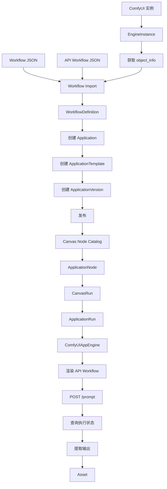

# ComfyUI 应用从工作流导入到画布运行的完整流程

## 1. 目标场景

本文以创建一个“ComfyUI 图像放大应用”为例。

已有一套 ComfyUI 工作流，其内部可能包含：

```text
LoadImage
→ 放大模型加载
→ 图像放大
→ 人脸修复
→ SaveImage
```

OmniMAM 要将它封装成一个业务应用，最终用户和画布只看到：

```text
输入图片
放大倍数
人脸修复开关
输出图片
```

终端用户不需要理解：

```text
ComfyUI 节点 ID
模型加载节点
节点连线
workflow JSON
API workflow JSON
模型文件名
输出文件路径
/prompt
/history
/view
```

---

# 2. 完整阶段

整个流程分为十个阶段：

```text
阶段一：创建 ComfyUI EngineInstance
阶段二：连接并获取 ComfyUI 实例信息
阶段三：上传工作流文件
阶段四：解析 API Workflow 和 object_info
阶段五：创建 Application
阶段六：在 Application 下创建 ApplicationTemplate
阶段七：基于 Template 创建 ApplicationVersion
阶段八：发布应用版本并加入画布目录
阶段九：画布创建并连接 ApplicationNode
阶段十：运行画布并调用 ComfyUI
```

完整链路：



---

# 3. ComfyUI 两种工作流文件

## 3.1 普通 Workflow JSON

普通 Workflow JSON 主要用于 ComfyUI 前端重新打开和渲染画布。

它通常包含：

* 节点位置；
* 节点尺寸；
* 节点标题；
* `widgets_values`；
* 连线；
* LiteGraph 画布信息；
* 分组和前端扩展数据。

示例：

```json
{
  "nodes": [
    {
      "id": 12,
      "type": "LoadImage",
      "pos": [100, 200],
      "widgets_values": [
        "example.png",
        "image"
      ]
    }
  ],
  "links": []
}
```

它适合：

* 在 OmniMAM 模板编辑器中展示节点图；
* 让用户勾选节点和参数；
* 显示节点名称和位置；
* 辅助理解工作流。

但 `widgets_values` 主要是按顺序保存的当前值，不能独立作为可靠的执行契约。

---

## 3.2 API Workflow JSON

API Workflow JSON 是发送给 ComfyUI `/prompt` 的执行格式。

ComfyUI 官方示例明确使用由前端导出的 API 格式，节点 ID 作为键，每个节点包含 `class_type` 和具名 `inputs`。

示例：

```json
{
  "12": {
    "class_type": "LoadImage",
    "inputs": {
      "image": "example.png"
    }
  },
  "21": {
    "class_type": "ImageScaleBy",
    "inputs": {
      "image": ["12", 0],
      "upscale_method": "lanczos",
      "scale_by": 2
    }
  },
  "30": {
    "class_type": "SaveImage",
    "inputs": {
      "images": ["21", 0],
      "filename_prefix": "OmniMAM"
    }
  }
}
```

它适合：

* 参数绑定；
* 参数覆盖；
* 工作流执行；
* 节点依赖分析；
* 输出节点识别。

---

## 3.3 第一版导入要求

第一版建议要求用户同时上传：

```text
workflow.json
api_workflow.json
```

其中：

```text
workflow.json
用于图形展示和节点选择

api_workflow.json
用于执行、字段绑定和运行时渲染
```

不建议第一版仅依赖普通 Workflow JSON 自动转换 API Workflow。

原因包括：

* 自定义节点可能修改前端序列化逻辑；
* `widgets_values` 和实际输入字段不一定能稳定对应；
* muted、bypass、虚拟节点和前端扩展可能影响转换；
* 某些参数仅存在于前端；
* 一些工作流包含 group node、primitive node 或 reroute 等特殊结构。

可以在后续增加转换能力，但转换结果必须要求用户验证。

---

# 4. 阶段一：创建 ComfyUI EngineInstance

## 4.1 EngineType

系统预置：

```yaml
code: comfyui
name: ComfyUI
app_engine_code: comfyui
provider_adapter_code: comfyui
```

代码层：

```go
type ComfyUIAppEngine interface {
    TestConnection(ctx context.Context, engine EngineInstance) error
    FetchObjectInfo(ctx context.Context, engine EngineInstance) (ObjectInfo, error)
    ValidateWorkflow(ctx context.Context, engine EngineInstance, workflow JSON) error
    UploadInput(ctx context.Context, engine EngineInstance, asset Asset) (RemoteFile, error)
    Submit(ctx context.Context, engine EngineInstance, workflow JSON) (ExecutionHandle, error)
    Poll(ctx context.Context, engine EngineInstance, handle ExecutionHandle) (ExecutionStatus, error)
    Cancel(ctx context.Context, engine EngineInstance, handle ExecutionHandle) error
    CollectOutputs(ctx context.Context, engine EngineInstance, handle ExecutionHandle) ([]Artifact, error)
}
```

---

## 4.2 创建 EngineInstance

接口：

```http
POST /api/v1/engines
```

请求：

```json
{
  "name": "本地 RTX 5090D ComfyUI",
  "engine_type": "comfyui",
  "base_url": "http://192.168.1.20:8188",
  "credential_id": null,
  "status": "enabled",
  "settings": {
    "request_timeout_seconds": 30,
    "execution_timeout_seconds": 1800,
    "max_concurrency": 1
  }
}
```

返回：

```json
{
  "id": "engine-comfyui-5090d",
  "status": "unverified"
}
```

数据库：

```sql
CREATE TABLE engine_instances (
    id                      UUID PRIMARY KEY,
    name                    VARCHAR(256) NOT NULL,
    engine_type             VARCHAR(64) NOT NULL,
    base_url                TEXT NOT NULL,
    credential_id           UUID,
    status                  VARCHAR(32) NOT NULL,
    settings                JSONB NOT NULL DEFAULT '{}',
    latest_capability_id    UUID,
    created_at              TIMESTAMPTZ NOT NULL,
    updated_at              TIMESTAMPTZ NOT NULL
);
```

---

# 5. 阶段二：连接并扫描 ComfyUI

## 5.1 测试连接

接口：

```http
POST /api/v1/engines/{engine_id}/test
```

后端可以调用：

```text
GET /system_stats
GET /object_info
```

ComfyUI 官方服务路由包括 `/system_stats`、`/object_info`、`/prompt`、`/history`、`/queue` 和 `/interrupt` 等接口。

响应：

```json
{
  "status": "success",
  "engine_version": "detected-version",
  "node_count": 286,
  "system": {
    "python_version": "3.13",
    "devices": [
      {
        "name": "NVIDIA GeForce RTX 5090 D"
      }
    ]
  }
}
```

测试成功后：

```text
EngineInstance.status = online
```

---

## 5.2 获取 object_info

接口：

```http
POST /api/v1/engines/{engine_id}/capabilities/sync
```

后端调用：

```http
GET {engine.base_url}/object_info
```

`/object_info` 用于获取当前实例可用节点及其输入输出规格。

返回概念结构：

```json
{
  "ImageScaleBy": {
    "input": {
      "required": {
        "image": [
          "IMAGE"
        ],
        "upscale_method": [
          [
            "nearest-exact",
            "bilinear",
            "area",
            "bicubic",
            "lanczos"
          ]
        ],
        "scale_by": [
          "FLOAT",
          {
            "default": 1,
            "min": 0.01,
            "max": 8,
            "step": 0.01
          }
        ]
      }
    },
    "output": [
      "IMAGE"
    ],
    "output_name": [
      "IMAGE"
    ],
    "name": "ImageScaleBy",
    "display_name": "Upscale Image By"
  }
}
```

---

## 5.3 保存 Engine 能力快照

数据库：

```sql
CREATE TABLE comfyui_capability_snapshots (
    id                      UUID PRIMARY KEY,
    engine_id               UUID NOT NULL REFERENCES engine_instances(id),
    comfyui_version         VARCHAR(128),
    node_count              INTEGER NOT NULL,
    object_info             JSONB NOT NULL,
    object_info_checksum    VARCHAR(128) NOT NULL,
    system_stats            JSONB,
    created_at              TIMESTAMPTZ NOT NULL
);
```

同步后更新：

```text
EngineInstance.latest_capability_id
```

能力快照不能只覆盖旧记录，应保留历史，以便判断：

* 节点是否被删除；
* 自定义节点是否升级；
* 参数范围是否改变；
* 下拉选项是否改变；
* 工作流依赖是否失效。

---

# 6. 阶段三：上传工作流

## 6.1 创建 Workflow Import

接口：

```http
POST /api/v1/comfyui-workflow-imports
```

使用 multipart 上传：

```text
engine_id
workflow.json
api_workflow.json
name
description
```

请求概念：

```text
engine_id = engine-comfyui-5090d
name = 图像放大工作流
workflow_file = workflow.json
api_workflow_file = api_workflow.json
```

返回：

```json
{
  "workflow_import_id": "workflow-import-001",
  "status": "uploaded"
}
```

---

## 6.2 工作流定义表

```sql
CREATE TABLE comfyui_workflow_definitions (
    id                          UUID PRIMARY KEY,
    name                        VARCHAR(256) NOT NULL,
    description                 TEXT,
    source_engine_id            UUID NOT NULL REFERENCES engine_instances(id),
    visual_workflow             JSONB,
    api_workflow                JSONB NOT NULL,
    workflow_checksum           VARCHAR(128) NOT NULL,
    object_info_snapshot_id     UUID NOT NULL,
    parse_status                VARCHAR(32) NOT NULL,
    validation_status           VARCHAR(32) NOT NULL,
    created_by                  UUID NOT NULL,
    created_at                  TIMESTAMPTZ NOT NULL,
    updated_at                  TIMESTAMPTZ NOT NULL
);
```

这里保存的是“可供创建模板的 ComfyUI 工作流定义”，还不是 ApplicationTemplate。

---

# 7. 阶段四：解析工作流

## 7.1 基础格式校验

后端首先校验 API Workflow：

```text
根对象必须为 object
每个键必须是节点 ID
每个节点必须包含 class_type
每个节点必须包含 inputs
节点连接必须引用存在的节点
输出索引必须为非负整数
```

示例错误：

```json
{
  "valid": false,
  "errors": [
    {
      "node_id": "21",
      "code": "WORKFLOW_REFERENCED_NODE_NOT_FOUND",
      "message": "输入 image 引用了不存在的节点 12。"
    }
  ]
}
```

---

## 7.2 对照 object_info 校验节点

对每一个 API Workflow 节点：

```text
读取 class_type
→ 在 object_info 中查找节点定义
→ 校验节点是否存在
→ 校验 required inputs
→ 校验当前值类型
→ 校验枚举值
→ 校验 min/max
```

示例：

```text
API Workflow:
class_type = ImageScaleBy
scale_by = 2

object_info:
scale_by 类型为 FLOAT
范围 0.01～8

结果：
合法
```

如果节点不存在：

```json
{
  "node_id": "21",
  "class_type": "CustomImageUpscaler",
  "status": "missing",
  "error_code": "COMFYUI_NODE_CLASS_NOT_FOUND"
}
```

---

## 7.3 区分参数输入和节点连接输入

API Workflow 中的输入分为两类。

### 字面值输入

```json
{
  "scale_by": 2,
  "upscale_method": "lanczos"
}
```

这类参数可以候选为应用输入。

### 节点连接输入

```json
{
  "image": ["12", 0]
}
```

这表示：

```text
当前节点的 image
来自节点 12 的第 0 个输出
```

这种输入默认不能直接暴露为普通表单字段。

如果希望把工作流外部图片传入节点 12，应暴露 `LoadImage.image`，或者定义特殊的工作流输入绑定。

---

## 7.4 生成节点解析结果

数据库：

```sql
CREATE TABLE comfyui_workflow_nodes (
    id                      UUID PRIMARY KEY,
    workflow_definition_id  UUID NOT NULL,
    node_id                 VARCHAR(128) NOT NULL,
    class_type              VARCHAR(256) NOT NULL,
    title                   VARCHAR(256),
    display_name            VARCHAR(256),
    position                JSONB,
    inputs                  JSONB NOT NULL,
    outputs                 JSONB,
    parse_status            VARCHAR(32) NOT NULL,
    created_at              TIMESTAMPTZ NOT NULL,
    UNIQUE(workflow_definition_id, node_id)
);
```

示例：

```json
{
  "node_id": "21",
  "class_type": "ImageScaleBy",
  "display_name": "Upscale Image By",
  "inputs": [
    {
      "name": "image",
      "source_type": "connection",
      "data_type": "IMAGE",
      "source_node_id": "12",
      "source_output_index": 0
    },
    {
      "name": "upscale_method",
      "source_type": "literal",
      "data_type": "enum",
      "current_value": "lanczos",
      "options": [
        "nearest-exact",
        "bilinear",
        "area",
        "bicubic",
        "lanczos"
      ]
    },
    {
      "name": "scale_by",
      "source_type": "literal",
      "data_type": "float",
      "current_value": 2,
      "minimum": 0.01,
      "maximum": 8,
      "step": 0.01
    }
  ]
}
```

---

## 7.5 参数候选识别

后端将输入分为：

```text
exposable
fixed_only
connection
hidden
unsupported
```

例如：

```json
{
  "node_id": "21",
  "input_name": "scale_by",
  "classification": "exposable"
}
```

```json
{
  "node_id": "21",
  "input_name": "image",
  "classification": "connection"
}
```

```json
{
  "node_id": "30",
  "input_name": "filename_prefix",
  "classification": "fixed_only"
}
```

---

## 7.6 前端 JS 自定义逻辑风险

`object_info` 反映节点后端声明的输入输出，不保证还原自定义节点的所有前端行为。

ComfyUI 允许 JavaScript 扩展操作节点对象和节点创建过程，因此一些自定义节点可能通过前端 JS 增加控件、修改交互或请求其他接口。

后端应标记以下风险：

```text
后端类型为 STRING，但前端看起来是复杂选择器
字段选项依赖另一个字段
字段选项通过自定义接口加载
节点包含无法识别的前端扩展
```

解析状态：

```text
fully_supported
partially_supported
manual_configuration_required
unsupported
```

不能因为无法还原 UI 就禁止执行；只要 API Workflow 有合法具体值，工作流仍可能可以运行。受影响的是自动生成应用参数，而不是一定不能执行。

---

# 8. 工作流验证接口

接口：

```http
POST /api/v1/comfyui-workflow-definitions/{workflow_id}/validate
```

后端执行：

```text
格式校验
→ 节点存在性校验
→ 必填输入校验
→ 参数类型校验
→ 参数范围校验
→ 资源文件校验
→ 输出节点校验
→ ComfyUI /prompt 预验证或测试运行
```

返回：

```json
{
  "valid": true,
  "node_summary": {
    "total": 8,
    "supported": 7,
    "manual_configuration_required": 1,
    "missing": 0
  },
  "warnings": [
    {
      "node_id": "25",
      "code": "CUSTOM_FRONTEND_LOGIC_NOT_DESCRIBED",
      "message": "该节点可能包含 object_info 无法表达的前端交互。"
    }
  ],
  "errors": []
}
```

---

# 9. 工作流解析页面

前端页面建议分为四个区域。

## 9.1 工作流画布

使用普通 Workflow JSON 渲染：

* 节点；
* 位置；
* 连线；
* 标题；
* 节点状态。

用户点击节点后查看参数。

---

## 9.2 节点参数面板

例如点击 `ImageScaleBy`：

```text
upscale_method
当前值：lanczos
类型：枚举
候选值：nearest-exact / bilinear / area / bicubic / lanczos
允许暴露：是

scale_by
当前值：2
类型：FLOAT
范围：0.01～8
允许暴露：是
```

---

## 9.3 输入和输出选择

用户选择应用输入：

```text
LoadImage.image
→ 应用输入 image

ImageScaleBy.scale_by
→ 应用输入 scale

FaceRestore.enabled
→ 应用输入 face_restore
```

用户选择应用输出：

```text
SaveImage.images
→ 应用输出 image
```

---

## 9.4 固定参数

未暴露字段保留 API Workflow 当前值：

```text
upscale_method = lanczos
model_name = RealESRGAN_x4plus.pth
filename_prefix = OmniMAM
```

这些成为模板固定参数。

---

# 10. 阶段五：创建 Application

完成工作流解析后，用户点击“创建应用”。

接口：

```http
POST /api/v1/applications
```

请求：

```json
{
  "name": "高质量图像放大",
  "description": "通过 ComfyUI 对图像进行高质量放大和可选人脸修复",
  "capability_code": "image.upscale",
  "visibility": "private",
  "canvas_enabled": true
}
```

返回：

```json
{
  "id": "app-image-upscale",
  "status": "draft"
}
```

此时只创建 Application 身份：

```text
这是什么应用
```

还没有创建执行模板和用户版本。

数据库：

```sql
CREATE TABLE applications (
    id                  UUID PRIMARY KEY,
    name                VARCHAR(256) NOT NULL,
    description         TEXT,
    capability_code     VARCHAR(128) NOT NULL,
    owner_id            UUID NOT NULL,
    visibility          VARCHAR(32) NOT NULL,
    canvas_enabled      BOOLEAN NOT NULL DEFAULT FALSE,
    status              VARCHAR(32) NOT NULL,
    default_version_id  UUID,
    created_at          TIMESTAMPTZ NOT NULL,
    updated_at          TIMESTAMPTZ NOT NULL
);
```

---

# 11. 阶段六：创建 ApplicationTemplate

## 11.1 获取模板创建 Schema

接口：

```http
POST /api/v1/applications/{application_id}/application-templates/resolve-authoring-schema
```

请求：

```json
{
  "template_type": "comfyui_workflow",
  "workflow_definition_id": "workflow-upscale-001",
  "engine_binding": {
    "mode": "fixed",
    "engine_id": "engine-comfyui-5090d"
  }
}
```

后端读取：

```text
Application.capability_code
WorkflowDefinition
WorkflowNode 解析结果
object_info 快照
Engine 当前能力
```

返回：

```json
{
  "workflow": {
    "id": "workflow-upscale-001",
    "name": "图像放大工作流",
    "validation_status": "valid"
  },
  "input_candidates": [
    {
      "binding_id": "12.image",
      "node_id": "12",
      "input_name": "image",
      "data_type": "asset.image",
      "suggested_application_name": "image",
      "binding_type": "comfyui_upload"
    },
    {
      "binding_id": "21.scale_by",
      "node_id": "21",
      "input_name": "scale_by",
      "data_type": "float",
      "current_value": 2,
      "minimum": 0.01,
      "maximum": 8,
      "suggested_application_name": "scale"
    }
  ],
  "output_candidates": [
    {
      "node_id": "30",
      "application_type": "asset.image",
      "suggested_application_name": "image"
    }
  ]
}
```

---

## 11.2 输入绑定类型

ComfyUI 模板至少需要支持四种绑定。

### direct

将应用参数直接写入节点输入：

```yaml
application_input: scale
target:
  node_id: "21"
  input_name: scale_by
binding_type: direct
```

---

### asset_upload

将 OmniMAM Asset 上传到 ComfyUI，再将返回文件名写入节点：

```yaml
application_input: image
binding_type: asset_upload
target:
  node_id: "12"
  input_name: image
```

运行时：

```text
asset://image-001
→ 上传到 ComfyUI input 目录
→ 得到 remote filename
→ 写入 LoadImage.image
```

---

### transform

将应用高级参数转换为一个或多个节点字段：

```yaml
application_input: quality
binding_type: transform
transform:
  type: enum_map
  mapping:
    fast:
      steps: 10
      cfg: 4
    quality:
      steps: 30
      cfg: 6
targets:
  steps:
    node_id: "18"
    input_name: steps
  cfg:
    node_id: "18"
    input_name: cfg
```

---

### fixed

固定工作流参数：

```yaml
binding_type: fixed
value: lanczos
target:
  node_id: "21"
  input_name: upscale_method
```

---

## 11.3 输出绑定类型

输出绑定可以包括：

```text
save_image
save_video
save_audio
history_output
custom_output
```

图像输出示例：

```yaml
application_output: image
type: asset.image
source:
  node_id: "30"
  output_kind: images
collection:
  type: comfyui_history
```

---

## 11.4 创建 Template

接口：

```http
POST /api/v1/applications/{application_id}/application-templates
```

请求：

```json
{
  "name": "本地 ComfyUI 图像放大模板",
  "template_type": "comfyui_workflow",
  "workflow_definition_id": "workflow-upscale-001",
  "engine_binding": {
    "mode": "fixed",
    "engine_id": "engine-comfyui-5090d"
  },
  "input_bindings": [
    {
      "application_input": "image",
      "binding_type": "asset_upload",
      "target": {
        "node_id": "12",
        "input_name": "image"
      }
    },
    {
      "application_input": "scale",
      "binding_type": "direct",
      "target": {
        "node_id": "21",
        "input_name": "scale_by"
      }
    }
  ],
  "fixed_bindings": [
    {
      "value": "lanczos",
      "target": {
        "node_id": "21",
        "input_name": "upscale_method"
      }
    },
    {
      "value": "OmniMAM",
      "target": {
        "node_id": "30",
        "input_name": "filename_prefix"
      }
    }
  ],
  "output_bindings": [
    {
      "application_output": "image",
      "type": "asset.image",
      "source": {
        "node_id": "30",
        "output_kind": "images"
      }
    }
  ]
}
```

返回：

```json
{
  "id": "template-comfyui-upscale-v1",
  "status": "draft"
}
```

---

## 11.5 Template 数据表

```sql
CREATE TABLE application_templates (
    id                          UUID PRIMARY KEY,
    application_id              UUID NOT NULL REFERENCES applications(id),
    name                        VARCHAR(256) NOT NULL,
    template_type               VARCHAR(64) NOT NULL,
    workflow_definition_id      UUID,
    engine_binding_mode         VARCHAR(32) NOT NULL,
    fixed_engine_id             UUID,
    engine_selector             JSONB,
    input_bindings              JSONB NOT NULL,
    fixed_bindings              JSONB NOT NULL,
    output_bindings             JSONB NOT NULL,
    workflow_snapshot           JSONB NOT NULL,
    object_info_snapshot_id     UUID,
    status                      VARCHAR(32) NOT NULL,
    created_at                  TIMESTAMPTZ NOT NULL,
    updated_at                  TIMESTAMPTZ NOT NULL
);
```

模板保存一份不可依赖外部可变对象的工作流执行快照：

```text
workflow_snapshot
```

不能只在运行时读取当前 WorkflowDefinition，否则用户编辑工作流后可能影响已经发布的应用版本。

---

# 12. Template 验证

接口：

```http
POST /api/v1/application-templates/{template_id}/validate
```

后端验证：

```text
Application capability 是否匹配
WorkflowDefinition 是否有效
Engine 是否在线
Engine 是否包含全部节点
输入绑定目标是否存在
固定值是否合法
输出节点是否存在
资源模型是否存在
工作流能否通过 /prompt 校验
```

返回：

```json
{
  "valid": true,
  "compatibility": {
    "engine_id": "engine-comfyui-5090d",
    "compatible": true
  },
  "warnings": [],
  "errors": []
}
```

---

## 12.1 节点兼容指纹

不能只检查节点名称。

建议为每个工作流依赖节点保存指纹：

```json
{
  "class_type": "ImageScaleBy",
  "required_inputs": {
    "image": "IMAGE",
    "upscale_method": "enum",
    "scale_by": "FLOAT"
  },
  "outputs": [
    "IMAGE"
  ]
}
```

计算：

```text
node_schema_checksum
```

运行前比较当前 Engine `/object_info`。

兼容性状态：

```text
compatible
compatible_with_changes
incompatible
missing
```

---

# 13. Template 测试运行

接口：

```http
POST /api/v1/application-templates/{template_id}/test-run
```

请求：

```json
{
  "inputs": {
    "image": "asset://test-image-001",
    "scale": 2
  }
}
```

后端执行完整流程：

```text
解析输入
→ 上传图片
→ 克隆 workflow_snapshot
→ 注入参数
→ POST /prompt
→ 等待完成
→ 读取 history
→ 下载输出
→ 返回测试结果
```

ComfyUI 的 `/prompt` 会验证请求并将工作流加入执行队列，成功时返回 `prompt_id`；官方示例可以通过 WebSocket等待执行完成，再从 `/history/{prompt_id}` 获取结果，通过 `/view` 获取生成文件。

测试响应：

```json
{
  "status": "succeeded",
  "duration_ms": 14320,
  "outputs": {
    "image": {
      "temporary_url": "/api/v1/temp-artifacts/test-output.png"
    }
  }
}
```

测试通过后：

```text
ApplicationTemplate.status = ready
```

---

# 14. 阶段七：创建 ApplicationVersion

现在才创建面向终端用户和画布的稳定版本。

接口：

```http
POST /api/v1/applications/{application_id}/versions
```

请求：

```json
{
  "version": "1.0.0",
  "name": "高质量图像放大 v1",
  "template_id": "template-comfyui-upscale-v1",
  "inputs": [
    {
      "name": "image",
      "label": "输入图片",
      "type": "asset.image",
      "required": true,
      "connectable": true,
      "literal_allowed": true,
      "ui": {
        "component": "asset-image-picker"
      }
    },
    {
      "name": "scale",
      "label": "放大倍数",
      "type": "number",
      "required": true,
      "connectable": false,
      "default": 2,
      "validation": {
        "minimum": 1,
        "maximum": 4,
        "step": 0.5
      },
      "ui": {
        "component": "slider"
      }
    }
  ],
  "outputs": [
    {
      "name": "image",
      "label": "放大图片",
      "type": "asset.image",
      "required": true
    }
  ]
}
```

注意：

```text
object_info 支持 scale_by 最大到 8
```

但 ApplicationVersion 可以进一步限制为：

```text
1～4
```

应用版本约束必须是模板和 Engine 能力的子集。

---

## 14.1 ApplicationVersion 数据表

```sql
CREATE TABLE application_versions (
    id                      UUID PRIMARY KEY,
    application_id          UUID NOT NULL REFERENCES applications(id),
    template_id             UUID NOT NULL REFERENCES application_templates(id),
    version                 VARCHAR(64) NOT NULL,
    name                    VARCHAR(256) NOT NULL,
    input_contract          JSONB NOT NULL,
    output_contract         JSONB NOT NULL,
    template_snapshot       JSONB NOT NULL,
    status                  VARCHAR(32) NOT NULL,
    published_at            TIMESTAMPTZ,
    created_at              TIMESTAMPTZ NOT NULL,
    updated_at              TIMESTAMPTZ NOT NULL,
    UNIQUE(application_id, version)
);
```

发布时应保存：

```text
template_snapshot
```

这样即使 Template 后续被修改，也不会影响已发布版本。

---

# 15. 预览应用表单

接口：

```http
POST /api/v1/application-versions/{version_id}/resolve-form
```

请求：

```json
{
  "values": {
    "scale": 2
  }
}
```

返回：

```json
{
  "fields": {
    "image": {
      "type": "asset.image",
      "required": true,
      "connectable": true,
      "literal_allowed": true,
      "ui": {
        "component": "asset-image-picker",
        "label": "输入图片"
      }
    },
    "scale": {
      "type": "number",
      "required": true,
      "value": 2,
      "minimum": 1,
      "maximum": 4,
      "step": 0.5,
      "ui": {
        "component": "slider",
        "label": "放大倍数"
      }
    }
  }
}
```

前端不读取 ComfyUI `/object_info`。

前端只消费 OmniMAM 返回的应用契约。

---

# 16. 发布 ApplicationVersion

接口：

```http
POST /api/v1/application-versions/{version_id}/publish
```

发布校验：

```text
Application 存在
Template 状态为 ready
ApplicationVersion 输入与 Template binding 一致
ApplicationVersion 输出与 Template output binding 一致
所有必填输入都有来源
至少存在一个兼容 Engine
测试运行通过
```

发布后：

```text
ApplicationVersion.status = published
Application.default_version_id = version_id
Application.status = published
```

发布版本不可直接修改。

---

# 17. 阶段八：加入画布节点目录

接口：

```http
GET /api/v1/canvas-node-catalog
```

查询条件：

```text
category=image_processing
capability=image.upscale
```

返回：

```json
{
  "items": [
    {
      "node_kind": "application",
      "application_id": "app-image-upscale",
      "application_version_id": "appver-image-upscale-v1",
      "name": "高质量图像放大",
      "inputs": [
        {
          "name": "image",
          "type": "asset.image",
          "connectable": true
        },
        {
          "name": "scale",
          "type": "number",
          "connectable": false
        }
      ],
      "outputs": [
        {
          "name": "image",
          "type": "asset.image"
        }
      ]
    }
  ]
}
```

目录只返回：

```text
Application.canvas_enabled = true
ApplicationVersion.status = published
```

---

# 18. 阶段九：在画布中创建 ApplicationNode

用户拖入“高质量图像放大”。

接口：

```http
POST /api/v1/canvases/{canvas_id}/nodes
```

请求：

```json
{
  "kind": "application",
  "application_version_id": "appver-image-upscale-v1",
  "position": {
    "x": 620,
    "y": 280
  },
  "literal_inputs": {
    "scale": 2
  }
}
```

返回：

```json
{
  "node_id": "canvas-node-upscale"
}
```

CanvasNode：

```sql
CREATE TABLE canvas_nodes (
    id                          UUID PRIMARY KEY,
    canvas_id                   UUID NOT NULL,
    node_kind                   VARCHAR(32) NOT NULL,
    application_version_id      UUID,
    position                    JSONB NOT NULL,
    literal_inputs              JSONB NOT NULL DEFAULT '{}',
    ui_state                    JSONB NOT NULL DEFAULT '{}',
    created_at                  TIMESTAMPTZ NOT NULL,
    updated_at                  TIMESTAMPTZ NOT NULL
);
```

---

# 19. 连接上游图片

例如：

```text
素材节点.image
→ 高质量图像放大.image
```

接口：

```http
POST /api/v1/canvases/{canvas_id}/edges
```

请求：

```json
{
  "source_node_id": "canvas-node-asset",
  "source_output": "image",
  "target_node_id": "canvas-node-upscale",
  "target_input": "image"
}
```

后端校验：

```text
source type = asset.image
target type = asset.image
→ compatible
```

保存：

```sql
CREATE TABLE canvas_edges (
    id                  UUID PRIMARY KEY,
    canvas_id           UUID NOT NULL,
    source_node_id      UUID NOT NULL,
    source_output       VARCHAR(128) NOT NULL,
    target_node_id      UUID NOT NULL,
    target_input        VARCHAR(128) NOT NULL,
    created_at          TIMESTAMPTZ NOT NULL
);
```

画布节点不保存：

```text
LoadImage node ID
ImageScaleBy node ID
SaveImage node ID
ComfyUI base URL
```

这些只存在于 ApplicationVersion 固定的模板快照中。

---

# 20. 画布节点参数编辑

用户点击节点：

```http
POST /api/v1/canvases/{canvas_id}/nodes/{node_id}/resolve-form
```

请求：

```json
{
  "values": {
    "scale": 2
  }
}
```

后端返回：

```json
{
  "fields": {
    "image": {
      "type": "asset.image",
      "connection_status": "connected",
      "literal_editable": false,
      "source": {
        "node_id": "canvas-node-asset",
        "output": "image"
      }
    },
    "scale": {
      "type": "number",
      "value": 2,
      "minimum": 1,
      "maximum": 4,
      "step": 0.5
    }
  }
}
```

这里的 Resolver 同时考虑：

```text
ApplicationVersion 输入契约
CanvasNode.literal_inputs
CanvasEdge 连接
当前 Engine 兼容性
```

---

# 21. 阶段十：运行画布

接口：

```http
POST /api/v1/canvases/{canvas_id}/runs
```

请求：

```json
{
  "inputs": {}
}
```

返回：

```json
{
  "canvas_run_id": "canvas-run-001",
  "task_group_id": "task-group-001",
  "status": "pending"
}
```

---

# 22. 编译画布

后端执行：

```text
读取 CanvasNode
→ 读取 CanvasEdge
→ 加载 ApplicationVersion
→ 校验输入输出类型
→ 检查必填字段
→ 检查环路
→ 编译 DAGFlowTask
```

例如：

```text
节点 A：读取素材
节点 B：高质量图像放大
节点 C：保存素材

B depends on A
C depends on B
```

---

# 23. 创建 CanvasNodeRun

```sql
CREATE TABLE canvas_node_runs (
    id                  UUID PRIMARY KEY,
    canvas_run_id       UUID NOT NULL,
    canvas_node_id      UUID NOT NULL,
    status              VARCHAR(32) NOT NULL,
    resolved_inputs     JSONB,
    outputs             JSONB,
    error_code          VARCHAR(128),
    error_message       TEXT,
    started_at          TIMESTAMPTZ,
    finished_at         TIMESTAMPTZ
);
```

---

# 24. 解析应用输入

从上游节点获得：

```json
{
  "image": {
    "asset_id": "asset-image-001",
    "type": "asset.image",
    "uri": "asset://asset-image-001"
  }
}
```

从 CanvasNode 字面值获得：

```json
{
  "scale": 2
}
```

最终输入：

```json
{
  "image": "asset://asset-image-001",
  "scale": 2
}
```

---

# 25. 创建 ApplicationRun

```sql
CREATE TABLE application_runs (
    id                          UUID PRIMARY KEY,
    application_version_id      UUID NOT NULL,
    canvas_run_id               UUID,
    canvas_node_run_id          UUID,
    selected_engine_id          UUID,
    status                      VARCHAR(32) NOT NULL,
    resolved_inputs             JSONB NOT NULL,
    rendered_request_snapshot   JSONB,
    provider_task_id            VARCHAR(256),
    normalized_outputs          JSONB,
    error_code                  VARCHAR(128),
    error_message               TEXT,
    created_at                  TIMESTAMPTZ NOT NULL,
    started_at                  TIMESTAMPTZ,
    finished_at                 TIMESTAMPTZ
);
```

示例：

```json
{
  "application_version_id": "appver-image-upscale-v1",
  "selected_engine_id": "engine-comfyui-5090d",
  "resolved_inputs": {
    "image": "asset://asset-image-001",
    "scale": 2
  }
}
```

---

# 26. 运行前兼容性检查

后端重新获取或读取当前 Engine 能力：

```text
当前 Engine 是否在线
ImageScaleBy 节点是否存在
LoadImage 节点是否存在
SaveImage 节点是否存在
scale_by 类型是否仍为 FLOAT
scale_by=2 是否仍合法
固定模型文件是否存在
输出节点是否仍兼容
```

如果节点版本发生变化：

```json
{
  "code": "ERR_COMFYUI_WORKFLOW_INCOMPATIBLE",
  "node_id": "21",
  "class_type": "ImageScaleBy",
  "message": "当前 ComfyUI 实例中的节点定义与模板发布时不兼容。"
}
```

---

# 27. 上传输入素材

ApplicationTemplate 指定：

```text
image
→ asset_upload
→ LoadImage.image
```

ComfyUIAppEngine 执行：

```text
读取 Asset
→ 下载或读取对象存储文件
→ 上传到目标 ComfyUI
→ 获取远程文件名
```

记录输入传输：

```json
{
  "application_input": "image",
  "asset_id": "asset-image-001",
  "remote_filename": "omnimam/run-001/input-image.png"
}
```

建议每次运行使用隔离路径：

```text
omnimam/{application_run_id}/
```

避免不同任务文件名冲突。

---

# 28. 渲染 API Workflow

首先深拷贝发布时固定的：

```text
ApplicationVersion.template_snapshot.api_workflow
```

原始节点：

```json
{
  "12": {
    "class_type": "LoadImage",
    "inputs": {
      "image": "example.png"
    }
  },
  "21": {
    "class_type": "ImageScaleBy",
    "inputs": {
      "image": ["12", 0],
      "upscale_method": "lanczos",
      "scale_by": 2
    }
  }
}
```

应用绑定后：

```json
{
  "12": {
    "class_type": "LoadImage",
    "inputs": {
      "image": "omnimam/run-001/input-image.png"
    }
  },
  "21": {
    "class_type": "ImageScaleBy",
    "inputs": {
      "image": ["12", 0],
      "upscale_method": "lanczos",
      "scale_by": 2
    }
  }
}
```

渲染过程：

```text
workflow_snapshot
→ 应用 fixed bindings
→ 应用 asset upload bindings
→ 应用 direct bindings
→ 应用 transform bindings
→ 最终 schema 校验
→ rendered API workflow
```

保存：

```text
ApplicationRun.rendered_request_snapshot
```

便于：

* 审计；
* 调试；
* 重试；
* 问题复现；
* 对比工作流变化。

---

# 29. 提交到 ComfyUI

请求：

```http
POST {engine.base_url}/prompt
```

请求体概念：

```json
{
  "prompt": {
    "12": {
      "class_type": "LoadImage",
      "inputs": {
        "image": "omnimam/run-001/input-image.png"
      }
    }
  },
  "client_id": "omnimam-worker-id"
}
```

ComfyUI 会校验工作流，并在成功时返回 `prompt_id`；失败时可能返回工作流错误和节点错误。

响应：

```json
{
  "prompt_id": "comfy-prompt-001",
  "number": 3
}
```

保存：

```text
ApplicationRun.provider_task_id = comfy-prompt-001
```

---

# 30. 任务中心关系

```text
CanvasRun
└── CanvasNodeRun
    └── ApplicationRun
        └── AtomicTask
            └── TaskAttempt
```

Worker 只负责领取 AtomicTask。

领取后：

```text
Worker
→ 根据 ApplicationTemplate.template_type
→ 选择 ComfyUIAppEngine
→ ComfyUIAppEngine 执行工作流
```

Worker 不理解节点参数映射。

参数映射属于 Template，执行协议属于 AppEngine。

---

# 31. 监听执行状态

可以使用：

```text
WebSocket 实时监听
或
轮询 /history/{prompt_id}
```

官方示例通过 WebSocket 接收执行状态，并在执行完成后读取 history。

归一化状态：

```text
PENDING
QUEUED
RUNNING
SUCCEEDED
FAILED
CANCELED
```

进度事件可以转换为：

```json
{
  "application_run_id": "run-001",
  "status": "running",
  "progress": 56,
  "current_node": {
    "node_id": "21",
    "display_name": "Upscale Image By"
  }
}
```

前端不必显示 ComfyUI 节点，也可以只显示：

```text
正在放大图片
```

---

# 32. 取消任务

接口：

```http
POST /api/v1/application-runs/{run_id}/cancel
```

后端：

```text
将 ApplicationRun 标记 canceling
→ 通知 TaskCenter
→ ComfyUIAppEngine 调用 interrupt 或队列管理接口
→ 更新最终状态
```

ComfyUI 提供 `/interrupt` 和队列管理相关路由。

需要注意：

```text
/interrupt 可能影响当前实例正在执行的任务
```

因此一个共享 ComfyUI Engine 上必须有明确的并发和任务所有权策略。

第一版建议：

```text
每个 ComfyUI Engine max_concurrency = 1
只允许 OmniMAM 管理该实例的队列
```

---

# 33. 收集输出

任务完成后请求：

```http
GET {engine.base_url}/history/{prompt_id}
```

从指定输出节点读取：

```text
node_id = 30
output_kind = images
```

概念响应：

```json
{
  "comfy-prompt-001": {
    "outputs": {
      "30": {
        "images": [
          {
            "filename": "OmniMAM_00001_.png",
            "subfolder": "",
            "type": "output"
          }
        ]
      }
    }
  }
}
```

然后通过：

```http
GET /view?filename=...&subfolder=...&type=output
```

下载文件。官方示例使用 `/history/{prompt_id}` 获取输出元数据，再使用 `/view` 下载图像。

---

# 34. 登记 Artifact 和 Asset

后端执行：

```text
下载输出
→ MIME 校验
→ checksum
→ 保存本地或 S3
→ 创建 Artifact
→ 创建或关联 Asset
```

Artifact：

```json
{
  "id": "artifact-output-001",
  "application_run_id": "run-001",
  "type": "image",
  "storage_uri": "s3://omnimam/assets/output.png",
  "checksum": "..."
}
```

Asset：

```json
{
  "id": "asset-output-001",
  "type": "asset.image",
  "source": {
    "application_run_id": "run-001",
    "canvas_run_id": "canvas-run-001",
    "canvas_node_id": "canvas-node-upscale"
  }
}
```

ApplicationRun 输出：

```json
{
  "outputs": {
    "image": {
      "asset_id": "asset-output-001",
      "type": "asset.image",
      "uri": "asset://asset-output-001"
    }
  }
}
```

下游画布节点消费该 Asset。

---

# 35. 工作流或 Engine 变化

## 35.1 Engine 新增节点

同步 `/object_info` 后生成新快照。

已有应用不受影响，除非模板使用动态继承节点能力。

---

## 35.2 节点被删除

系统扫描模板依赖：

```text
WorkflowDependency
→ class_type
→ 当前 Engine object_info
```

受影响模板：

```text
ready
→ incompatible
```

受影响版本：

```text
published
→ partially_unavailable
```

画布仍可打开，但运行时阻止提交。

---

## 35.3 节点参数范围扩大

例如：

```text
scale_by.max
4 → 8
```

如果 ApplicationVersion 限制为最大 4，则用户表单不自动变化。

如果字段策略为：

```text
inherit
```

则可以在新 Resolver 中出现更大范围。

但已发布版本是否自动继承，必须由产品策略明确。

第一版建议：

```text
已发布 ApplicationVersion 契约不自动扩大
创建新 ApplicationVersion 才开放新范围
```

这样画布行为稳定。

---

## 35.4 模型文件变化

例如模板固定：

```text
upscale_model = RealESRGAN_x4plus.pth
```

模型文件被删除后：

```text
Template compatibility = incompatible
```

运行时返回：

```json
{
  "code": "ERR_COMFYUI_RESOURCE_NOT_FOUND",
  "resource_type": "upscale_model",
  "resource_name": "RealESRGAN_x4plus.pth"
}
```

不能只依靠模板创建时的 object_info 快照。

---

# 36. 多 ComfyUI Engine 调度

第一版建议固定 Engine：

```yaml
engine_binding:
  mode: fixed
  engine_id: engine-comfyui-5090d
```

后续可以增加：

```yaml
engine_binding:
  mode: capability_match
  selector:
    engine_type: comfyui
    workflow_compatibility: required
    tags:
      - image-upscale
```

候选 Engine 必须满足：

```text
包含工作流全部 class_type
节点输入输出兼容
包含固定模型文件
支持所需自定义节点版本
满足 VRAM 和环境要求
当前在线
当前有容量
```

不能仅因为都是 ComfyUI 就认为可以互换。

---

# 37. 推荐依赖清单

模板创建时生成：

```json
{
  "node_dependencies": [
    {
      "class_type": "LoadImage",
      "schema_checksum": "..."
    },
    {
      "class_type": "ImageScaleBy",
      "schema_checksum": "..."
    },
    {
      "class_type": "SaveImage",
      "schema_checksum": "..."
    }
  ],
  "resource_dependencies": [
    {
      "type": "upscale_model",
      "name": "RealESRGAN_x4plus.pth",
      "required": true
    }
  ],
  "custom_node_dependencies": []
}
```

后续调度器根据依赖清单筛选 Engine。

---

# 38. 后端接口汇总

## Engine

```text
POST   /api/v1/engines
GET    /api/v1/engines/{engine_id}
POST   /api/v1/engines/{engine_id}/test
POST   /api/v1/engines/{engine_id}/capabilities/sync
GET    /api/v1/engines/{engine_id}/capabilities
```

## ComfyUI Workflow

```text
POST   /api/v1/comfyui-workflow-imports

GET    /api/v1/comfyui-workflow-definitions/{workflow_id}
DELETE /api/v1/comfyui-workflow-definitions/{workflow_id}

POST   /api/v1/comfyui-workflow-definitions/{workflow_id}/parse
POST   /api/v1/comfyui-workflow-definitions/{workflow_id}/validate

GET    /api/v1/comfyui-workflow-definitions/{workflow_id}/nodes
GET    /api/v1/comfyui-workflow-definitions/{workflow_id}/input-candidates
GET    /api/v1/comfyui-workflow-definitions/{workflow_id}/output-candidates
```

## Application

```text
POST   /api/v1/applications
GET    /api/v1/applications
GET    /api/v1/applications/{application_id}
PATCH  /api/v1/applications/{application_id}
```

## ApplicationTemplate

```text
POST   /api/v1/applications/{application_id}/application-templates/resolve-authoring-schema

POST   /api/v1/applications/{application_id}/application-templates
GET    /api/v1/applications/{application_id}/application-templates

GET    /api/v1/application-templates/{template_id}
PATCH  /api/v1/application-templates/{template_id}

POST   /api/v1/application-templates/{template_id}/validate
POST   /api/v1/application-templates/{template_id}/test-run
```

## ApplicationVersion

```text
POST   /api/v1/applications/{application_id}/versions
GET    /api/v1/applications/{application_id}/versions

GET    /api/v1/application-versions/{version_id}
POST   /api/v1/application-versions/{version_id}/resolve-form
POST   /api/v1/application-versions/{version_id}/validate
POST   /api/v1/application-versions/{version_id}/publish
POST   /api/v1/application-versions/{version_id}/deprecate
```

## ApplicationRun

```text
POST   /api/v1/application-runs
GET    /api/v1/application-runs/{run_id}
POST   /api/v1/application-runs/{run_id}/cancel
```

## Canvas

```text
GET    /api/v1/canvas-node-catalog

POST   /api/v1/canvases/{canvas_id}/nodes
PATCH  /api/v1/canvases/{canvas_id}/nodes/{node_id}
POST   /api/v1/canvases/{canvas_id}/nodes/{node_id}/resolve-form

POST   /api/v1/canvases/{canvas_id}/edges
DELETE /api/v1/canvases/{canvas_id}/edges/{edge_id}

POST   /api/v1/canvases/{canvas_id}/validate
POST   /api/v1/canvases/{canvas_id}/runs
GET    /api/v1/canvas-runs/{run_id}
POST   /api/v1/canvas-runs/{run_id}/cancel
```

---

# 39. 推荐页面流程

## 页面一：ComfyUI Engine 管理

用户：

```text
填写名称和地址
→ 测试连接
→ 同步 object_info
→ 查看节点和系统信息
```

---

## 页面二：导入工作流

用户：

```text
选择 Engine
→ 上传 workflow.json
→ 上传 api_workflow.json
→ 后端解析
→ 查看校验结果
```

---

## 页面三：工作流参数选择

用户：

```text
查看工作流节点图
→ 点击节点
→ 勾选应用输入
→ 选择应用输出
→ 设置固定参数
```

此阶段只产生工作流绑定草稿，不直接发布应用。

---

## 页面四：创建 Application

用户填写：

```text
应用名称
应用说明
能力分类
是否允许画布使用
可见范围
```

创建 Application。

---

## 页面五：创建 ApplicationTemplate

用户：

```text
选择已解析 WorkflowDefinition
→ 选择固定 Engine
→ 确认输入绑定
→ 确认固定参数
→ 确认输出绑定
→ 保存 Template
→ 验证
→ 测试运行
```

---

## 页面六：创建 ApplicationVersion

用户：

```text
选择 ready Template
→ 设置应用字段名称
→ 设置 UI 控件
→ 设置默认值
→ 设置画布连接能力
→ 设置业务层参数范围
→ 预览表单
→ 发布
```

---

## 页面七：画布

用户：

```text
打开节点目录
→ 拖入已发布应用
→ 连接图片输入
→ 设置放大倍数
→ 运行画布
```

---

# 40. 第一版开发范围

第一版建议实现：

```text
固定 ComfyUI Engine
同时上传 workflow.json 和 api_workflow.json
获取 object_info
解析标准节点参数
勾选直接输入参数
选择 LoadImage 输入
选择 SaveImage 输出
固定字段
创建 Application
创建一个 ApplicationTemplate
创建一个 ApplicationVersion
发布版本
画布 ApplicationNode
图片 Asset 输入
图片 Asset 输出
POST /prompt
轮询或 WebSocket
/history 输出提取
/view 文件下载
取消任务
```

第一版暂不实现：

```text
普通 Workflow 自动转换 API Workflow
自动执行自定义节点前端 JS
任意表达式转换
复杂动态级联控件
多 ComfyUI Engine 自动调度
工作流拆分到多个 GPU
在画布中暴露 ComfyUI 内部节点
自动修复失效工作流
```

---

# 41. 核心业务规则

## BR-COMFY-001

导入 ComfyUI 工作流时，第一版必须提供 API Workflow。

## BR-COMFY-002

普通 Workflow 仅用于画布展示，不作为最终执行事实源。

## BR-COMFY-003

API Workflow 是 ApplicationTemplate 的底层执行基础。

## BR-COMFY-004

`object_info` 用于识别节点字段、类型、枚举和范围，但不保证还原全部前端 JS 逻辑。

## BR-COMFY-005

WorkflowDefinition 不等于 ApplicationTemplate。

## BR-COMFY-006

必须先创建 Application，再在 Application 下创建 ApplicationTemplate。

## BR-COMFY-007

ApplicationTemplate 必须保存工作流执行快照。

## BR-COMFY-008

ApplicationVersion 必须引用具体 Template，并保存发布时模板快照。

## BR-COMFY-009

画布只能引用已发布的 ApplicationVersion。

## BR-COMFY-010

画布不得直接保存 ComfyUI 节点 ID 和字段映射。

## BR-COMFY-011

节点 ID 和字段映射只能存在于 ApplicationTemplate 内部。

## BR-COMFY-012

运行前必须重新检查 Engine 与工作流依赖兼容性。

## BR-COMFY-013

输入 Asset 必须先转换为目标 ComfyUI 可读取的输入文件。

## BR-COMFY-014

每次运行必须从模板快照深拷贝 API Workflow，不允许原地修改模板。

## BR-COMFY-015

渲染后的 API Workflow 必须作为 ApplicationRun 快照保存。

## BR-COMFY-016

输出必须通过 ApplicationTemplate 的输出绑定提取。

## BR-COMFY-017

ComfyUI 输出必须下载并登记为 OmniMAM Asset，不能只向下游传递临时 ComfyUI URL。

## BR-COMFY-018

节点、模型或自定义节点发生变化时，不能静默修改已发布版本行为。

## BR-COMFY-019

无法解析前端 JS 控件时，应标记为人工配置，而不是猜测候选值。

## BR-COMFY-020

Worker 只负责领取和推动任务，具体 ComfyUI 执行由 ComfyUIAppEngine 负责。

---

# 42. 最终完整链路

```text
管理员创建 ComfyUI Engine
    ↓
测试连接
    ↓
同步 object_info
    ↓
上传 workflow.json 和 api_workflow.json
    ↓
创建 WorkflowDefinition
    ↓
解析节点、参数、连接和输出
    ↓
用户勾选输入和输出
    ↓
创建 Application
    ↓
在 Application 下创建 ComfyUI ApplicationTemplate
    ↓
保存 API Workflow 快照和参数绑定
    ↓
验证 Template
    ↓
测试运行
    ↓
基于 Template 创建 ApplicationVersion
    ↓
定义业务输入输出和 UI
    ↓
发布 ApplicationVersion
    ↓
进入 Canvas Node Catalog
    ↓
用户拖入 ApplicationNode
    ↓
上游 Asset 连接到 image
    ↓
设置 scale
    ↓
创建 CanvasRun
    ↓
编译为 DAGFlowTask
    ↓
创建 CanvasNodeRun
    ↓
创建 ApplicationRun
    ↓
上传输入素材到 ComfyUI
    ↓
克隆 API Workflow 快照
    ↓
写入文件名和 scale
    ↓
POST /prompt
    ↓
WebSocket 或 history 跟踪
    ↓
读取输出节点
    ↓
通过 /view 下载文件
    ↓
登记 Artifact 和 Asset
    ↓
将 Asset 传递给下游画布节点
```

最终职责边界：

```text
WorkflowDefinition
回答：导入的 ComfyUI 工作流是什么

Application
回答：这是一个什么业务应用

ApplicationTemplate
回答：该应用如何通过 ComfyUI 工作流实现

ApplicationVersion
回答：这一版本向用户和画布暴露什么输入输出

ApplicationNode
回答：该应用在某个画布中如何配置和连接

ApplicationRun
回答：本次应用使用了什么输入并执行得怎样

ComfyUIAppEngine
回答：如何将应用运行转换成 ComfyUI 请求

Asset
回答：运行产生了什么可被后续节点消费的素材
```
