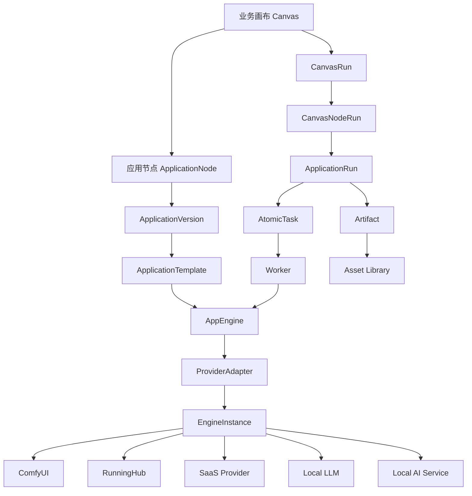
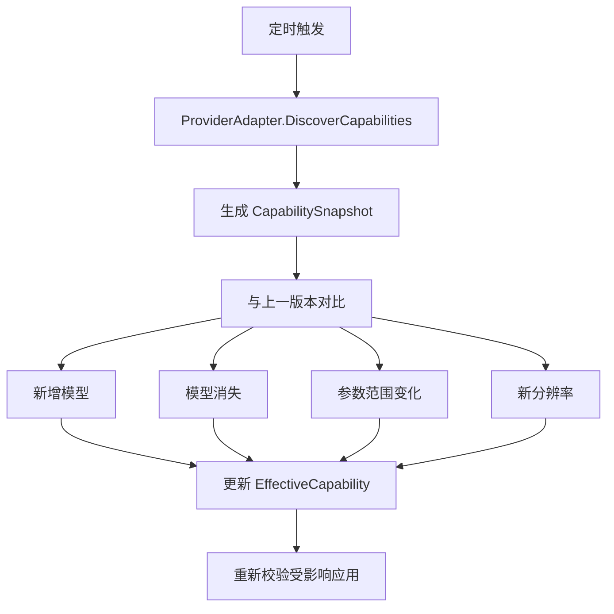
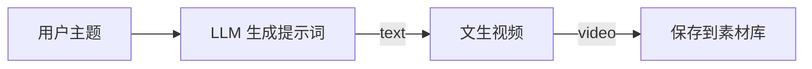
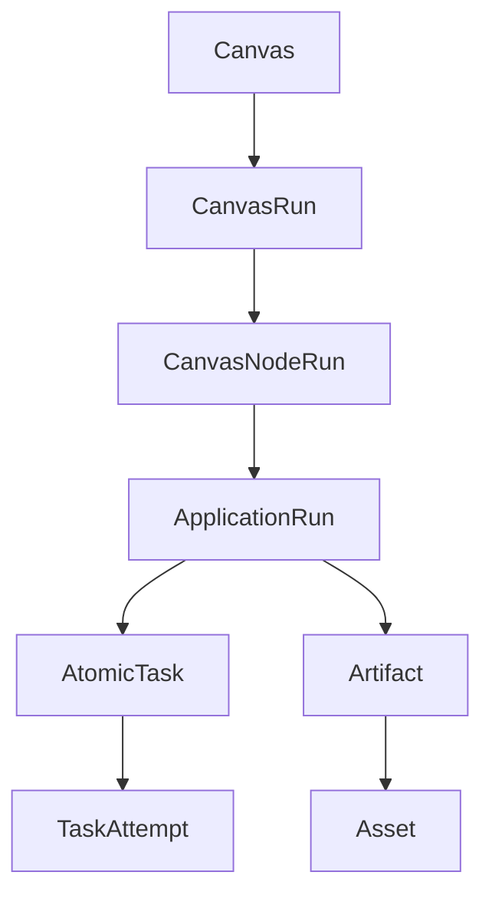

# OmniMAM 应用平台与画布能力编排设计

## 1. 文档目的

本文定义 OmniMAM 中以下模块之间的产品语义、职责边界和核心业务规则：

* 应用 `Application`
* 应用版本 `ApplicationVersion`
* 应用模板 `ApplicationTemplate`
* 能力定义 `CapabilityDefinition`
* 执行引擎类型 `EngineType`
* 执行引擎实例 `EngineInstance`
* 平台适配器 `ProviderAdapter`
* 应用执行器 `AppEngine`
* 平台能力注册表 `ProviderCapabilityRegistry`
* 运行时表单 `RuntimeFormSchema`
* 画布 `Canvas`
* 画布应用节点 `ApplicationNode`
* 画布运行 `CanvasRun`
* 应用运行 `ApplicationRun`
* 任务中心对象
* 素材与制品 `Asset / Artifact`

本文的主要目标是解决以下问题：

1. 如何将 ComfyUI 工作流、本地模型、SaaS 服务和 RunningHub 等异构能力统一封装成应用。
2. 如何让同一种应用支持不同平台、不同模型和不同参数范围。
3. 如何根据平台、模型和用户选择动态生成前端参数项。
4. 如何处理模型新增、模型下架、能力扩展和平台限制变化。
5. 如何让应用成为画布中的业务节点。
6. 如何让画布中的节点通过统一输入输出契约进行组合。
7. 如何将画布运行转换成应用运行和异步任务。
8. 如何避免画布直接依赖 ComfyUI 节点、供应商接口或模型内部参数。

---

# 2. 产品定位

## 2.1 应用平台定位

OmniMAM 应用平台用于将底层 AI 能力封装为业务用户和画布可以直接使用的应用。

底层能力可以来自：

* ComfyUI API Workflow
* 用户自建 ComfyUI 实例
* 本地 LLM
* 本地图像、视频、音频模型
* 第三方 SaaS API
* RunningHub 工作流
* 自建 GPU 推理服务
* OpenAI Compatible API
* 普通 HTTP 服务
* 未来新增的其他 AI 能力提供方

应用平台不要求上层用户理解：

* ComfyUI 节点拓扑
* checkpoint、VAE、CLIP、latent 等模型细节
* SaaS 原始接口结构
* 各平台鉴权和任务轮询流程
* 模型文件位置
* Worker 与 GPU 环境
* 第三方平台返回格式

应用平台向用户暴露的是稳定的业务能力，例如：

* 文生视频
* 图生视频
* 视频编辑
* 图像放大
* 图像重新打光
* 修改拍摄角度
* 图像描述
* 提示词生成
* 文本润色
* 文本转语音
* 视频抽帧
* 背景移除
* 人脸修复

---

## 2.2 画布定位

OmniMAM 画布不是 ComfyUI 的另一套节点编辑器。

画布是一个跨引擎、跨模型、跨平台的业务能力编排系统。

画布中组合的是业务能力节点，而不是底层技术节点。

不推荐直接在画布中暴露：

* CheckpointLoader
* CLIPTextEncode
* KSampler
* VAEDecode
* LoRALoader
* ControlNetApply
* ComfyUI 自定义节点
* SaaS 原始 HTTP 请求节点

推荐在画布中暴露：

* 生成视频
* 图像放大
* 修改视角
* 重新打光
* 图像理解
* 生成提示词
* 视频加字幕
* 语音合成
* 素材保存
* 条件分支
* 循环
* 并发
* 人工确认

---

## 2.3 核心架构原则

OmniMAM 应遵循以下原则：

> ComfyUI 工作流、RunningHub 工作流、本地模型和 SaaS 服务是应用能力的底层实现，不是画布工作流本身。

> 应用定义“提供什么业务能力”，画布定义“业务能力之间如何组合”。

> 前端负责“如何展示参数”，后端负责“当前允许展示哪些参数、哪些参数组合有效”。

> ProviderAdapter 维护平台调用协议，Capability Registry 维护动态能力事实，ApplicationTemplate 对能力进行裁剪和映射。

> 画布节点只引用 ApplicationVersion，不直接引用 ComfyUI 节点、模型 ID、供应商 endpoint 或 workflow node ID。

---

# 3. 总体分层架构



---

# 4. 核心领域对象

## 4.1 CapabilityDefinition

`CapabilityDefinition` 表示一个稳定的业务能力类别。

例如：

```yaml
id: video.text_to_video
name: 文生视频
category: video_generation
```

它定义的是业务语义，而不是某个平台的具体实现。

示例能力：

```text
video.text_to_video
video.image_to_video
video.video_edit
image.generate
image.upscale
image.relight
image.change_camera_angle
image.remove_background
image.describe
text.generate
text.rewrite
audio.text_to_speech
audio.speech_to_text
```

`CapabilityDefinition` 可以定义基础输入输出契约：

```yaml
capability: video.text_to_video

required_inputs:
  prompt:
    type: string

required_outputs:
  video:
    type: asset.video
```

能力定义只描述跨实现稳定的最小语义，不应包含某个供应商的完整参数。

---

## 4.2 Application

`Application` 表示一个面向业务用户和画布使用的应用。

例如：

```yaml
id: app_seedance_text_to_video
name: Seedance 文生视频
capability: video.text_to_video
```

Application 负责：

* 应用名称
* 应用说明
* 应用图标
* 业务能力分类
* 所有者
* 可见范围
* 当前发布版本
* 是否允许在画布中使用
* 是否允许终端用户直接运行
* 当前默认版本
* 生命周期状态

Application 本身不直接保存完整执行逻辑。
Application 表示一个长期存在的应用主体。
Application 不保存具体平台参数映射，也不保存最终用户表单。

---

## 4.3 ApplicationVersion

`ApplicationVersion` 表示一个已冻结的用户契约版本。

例如：

```text
Seedance 文生视频 v1.0.0
```

它定义：

* 对用户暴露哪些输入
* 每个输入叫什么
* 输入类型
* 是否必填
* 是否可连接画布上游节点
* 参数默认值
* UI 控件类型
* 输出参数
* 所引用的 ApplicationTemplate
* 发布状态
* 兼容的能力契约

ApplicationVersion 发布后不可直接修改。

示例：

```yaml
id: appver_text_to_video_v1
application_id: app_seedance_text_to_video
version: 1.0.0
status: published

inputs:
  prompt:
    type: string
    required: true
    connectable: true
    literal_allowed: true

  model:
    type: enum
    required: true
    connectable: false

  resolution:
    type: enum
    required: true

  duration:
    type: integer
    required: true

outputs:
  video:
    type: asset.video
```

画布必须引用具体的 ApplicationVersion，而不是只引用 Application。

---
### Application/ApplicationVersion/ApplicationTemplate 关系

```text
Application
    ├── ApplicationTemplate A
    ├── ApplicationTemplate B
    └── ApplicationVersion v1
            └── 引用 ApplicationTemplate A
```

例如：

```text
Application：Seedance 文生视频

Template A：
火山引擎
固定 Pro
最高 2K
最长 20 秒

Template B：
Seedance 官方
支持 Pro / Flash
最高 4K
最长 25 秒

Version 1.0.0：
引用 Template A
向用户暴露 prompt、resolution、duration

Version 2.0.0：
引用 Template B
向用户暴露 prompt、model、resolution、duration
```

同一个 Application 可以存在多个 Template，但每一个 ApplicationVersion 应明确引用一个具体 Template。

---

## 4.4 ApplicationTemplate

`ApplicationTemplate` 描述应用如何在某种底层平台上实现。
```text
通过火山引擎 Seedance Pro 执行文生视频
```

或者：

```text
通过 BytePlus Seedance 2.0 执行文生视频
```

模板负责：
* 使用哪个 Provider
* 使用哪个 operation
* 固定绑定哪个 Engine，或者如何选择 Engine
* 使用哪个模型
* 哪些底层字段固定
* 哪些底层字段允许暴露
* 应用输入如何映射到底层请求
* 底层输出如何映射为应用输出
* 模板能力约束


模板类型示例：

```text
comfyui_workflow
runninghub_workflow
saas_provider_operation
local_model
openai_compatible
generic_http
```

ApplicationTemplate 依附于 Application

### ComfyUI 模板示例

```yaml
template_type: comfyui_workflow

workflow:
  api_workflow: {}

bindings:
  - application_input: prompt
    target:
      node_id: "6"
      field_name: text

  - application_input: resolution
    transform:
      type: enum_map
    targets:
      - node_id: "12"
        field_name: width
      - node_id: "12"
        field_name: height

outputs:
  - application_output: video
    source:
      node_id: "92"
      output_type: video
```

### RunningHub 模板示例

```yaml
template_type: runninghub_workflow

workflow_id: "1904136902449209346"

bindings:
  - application_input: prompt
    target:
      node_id: "6"
      field_name: text

outputs:
  - application_output: video
    extraction:
      type: runninghub_task_output
```

### SaaS 模板示例

```yaml
template_type: saas_provider_operation

provider_operation: video.text_to_video

parameter_mapping:
  prompt: prompt
  model: model
  resolution: resolution
  duration: duration
```

模板不应保存：

* ComfyUI 实例 base URL
* SaaS API Key
* RunningHub API Key
* Engine 网络状态
* Worker 状态
* 当前 GPU 负载

这些属于 EngineInstance 或 Credential。

---

## 4.5 EngineType

`EngineType` 表示一类执行平台。

例如：

```text
comfyui
runninghub
volcengine_seedance
seedance_official
openai_compatible
local_llm
generic_http
```

EngineType 负责关联具体的 AppEngine 或 ProviderAdapter 实现。

示例：

```yaml
engine_type:
  code: comfyui
  app_engine: ComfyUIAppEngine
  provider_adapter: ComfyUIProviderAdapter
```

---

## 4.6 EngineInstance

`EngineInstance` 表示一个实际可调用的执行环境。

示例：

```yaml
id: comfyui-5090d-01
engine_type: comfyui
base_url: http://10.0.0.20:8188
credential_ref: null
status: online
region: local
```

或：

```yaml
id: volcengine-seedance-prod
engine_type: volcengine_seedance
base_url: https://ark.cn-beijing.volces.com
credential_ref: cred-volcengine-main
status: online
region: cn-beijing
```

EngineInstance 负责保存：

* base URL
* 认证凭证引用
* 地域
* 网络配置
* 代理
* 超时
* 并发限制
* 限流
* 当前状态
* 平台版本
* 当前能力快照
* 调度标签

原则：

> 连接到哪里由 EngineInstance 决定。

---

## 4.7 AppEngine

`AppEngine` 是执行某类应用模板的代码适配器。

它负责：

* 验证模板
* 渲染底层执行请求
* 提交任务
* 轮询任务
* 取消任务
* 收集输出
* 归一化错误
* 将输出登记成 Artifact 或 Asset

接口概念：

```go
type AppEngine interface {
    ValidateTemplate(
        ctx context.Context,
        template ApplicationTemplate,
    ) error

    Submit(
        ctx context.Context,
        engine EngineInstance,
        run ApplicationRun,
    ) (ExecutionHandle, error)

    Poll(
        ctx context.Context,
        engine EngineInstance,
        handle ExecutionHandle,
    ) (ExecutionStatus, error)

    Cancel(
        ctx context.Context,
        engine EngineInstance,
        handle ExecutionHandle,
    ) error

    CollectOutputs(
        ctx context.Context,
        engine EngineInstance,
        handle ExecutionHandle,
    ) ([]Artifact, error)
}
```

不同实现：

```text
ComfyUIAppEngine
RunningHubAppEngine
SeedanceAppEngine
LocalLLMAppEngine
OpenAICompatibleAppEngine
GenericHTTPAppEngine
```

原则：

> 如何调用某一类平台，由 AppEngine 和 ProviderAdapter 决定。

---

## 4.8 ProviderAdapter

`ProviderAdapter` 负责某个具体平台的协议转换。

它负责：

* 鉴权
* 请求参数转换
* 模型能力发现
* 文件上传
* 发起任务
* 查询进度
* 取消任务
* 下载结果
* 错误映射
* 平台状态转换

例如：

```text
SeedanceOfficialAdapter
VolcengineSeedanceAdapter
RunningHubAdapter
ComfyUIAdapter
FalAdapter
ReplicateAdapter
```

ProviderAdapter 中可以硬编码：

* API 路径
* 鉴权头格式
* 请求结构
* 响应结构
* 状态映射
* 文件上传方式
* 平台字段名转换

ProviderAdapter 中不应长期硬编码：

* 当前支持哪些模型
* 当前最大分辨率
* 当前最大时长
* 某个模型是否下架
* 某个账号是否支持某项能力

这些属于动态能力事实。

---

# 5. ComfyUI 工作流应用化

## 5.1 ComfyUI Workflow 的能力边界

ComfyUI API Workflow 可以提供：

* 当前使用的节点
* 节点当前输入值
* 节点连接关系
* 可执行工作流结构

`/object_info` 可以提供：

* 节点输入字段定义
* required、optional、hidden 参数
* 字段类型
* 默认值
* min、max、step
* 部分枚举候选项
* 节点输入输出类型

但二者不能保证还原：

* 前端 JS 动态控件
* 自定义选择器
* 级联下拉框逻辑
* 自定义控制台
* 第三方接口动态返回的选项
* 拖拽式三维控制器
* 时间轴
* 蒙版编辑器
* 文件浏览器
* 模型商城
* 复杂前端扩展逻辑

因此：

```text
API Workflow + object_info
=
标准底层参数识别
+
大多数基础表单生成
```

但不等于：

```text
完整恢复原始 ComfyUI 前端交互
```

---

## 5.2 ComfyUI 工作流不应直接成为画布

复杂 ComfyUI 工作流应封装为业务能力应用。

例如一个 ComfyUI 工作流内部可能包含：

```text
图片加载
→ 图像理解
→ 视角控制
→ 光照控制
→ 人脸修复
→ 图像放大
→ 保存图片
```

如果整体封装成一个应用，它只能作为粗粒度黑盒。

如果希望在 OmniMAM 画布中自由编排，应按可复用业务能力拆成：

```text
图像视角转换应用
光照重塑应用
人脸修复应用
图像放大应用
```

每个应用内部可以保留完整 ComfyUI 子工作流。

---

## 5.3 功能拆解原则

拆解单位不是 ComfyUI 技术节点，而是可独立复用的业务能力。

正确关系：

```text
ComfyUI 节点
= 技术执行原子

OmniMAM Application
= 业务能力原子

Canvas ApplicationNode
= 某个业务能力在画布中的实例
```

---

## 5.4 高级应用参数

底层 ComfyUI 节点可能只有：

```text
width
height
```

但应用可以向用户提供：

```text
aspect_ratio
resolution
```

然后通过模板转换成：

```text
aspect_ratio + resolution
→ width + height
```

应用参数应支持：

```text
DIRECT
FIXED_VALUE
ENUM_MAP
MULTI_TARGET_MAP
ASPECT_RATIO_TO_SIZE
BOOLEAN_SWITCH
CONDITIONAL
RANGE_SCALE
CONCAT
TEMPLATE_STRING
```

第一版不建议允许用户编写任意 JavaScript。

---

# 6. 动态能力注册表

## 6.1 为什么不能全部硬编码

平台能力会动态变化：

* 模型上架
* 模型下架
* 模型重命名
* 模型版本升级
* 4K 扩展到 8K
* 最大时长增加
* 某些区域开放新能力
* 某些账号套餐限制不同
* 灰度功能变化
* 平台临时关闭某项能力

因此，后端不应将能力事实全部写死在代码中。

推荐原则：

> 协议逻辑写代码，能力事实存数据。

---

## 6.2 ProviderCapabilityRegistry

系统应提供统一的能力注册表。

核心对象：

```text
Provider
EngineInstance
ProviderModel
ProviderOperation
CapabilityVariant
FieldConstraint
CapabilitySnapshot
CapabilityOverride
EffectiveCapability
```

示例：

```yaml
engine_id: seedance-official-prod
snapshot_version: "2026-07-12-001"

variants:
  - operation: text_to_video
    model: pro
    constraints:
      resolution:
        enum: [720p, 1080p, 2k, 4k]
      duration:
        enum: [5, 10, 15, 20, 25]

  - operation: text_to_video
    model: flash
    constraints:
      resolution:
        enum: [720p, 1080p]
      duration:
        enum: [5, 10]
```

---

## 6.3 能力来源

能力可以来自三种来源。

### 平台自动发现

平台提供模型和能力查询接口时，ProviderAdapter 定期同步。

```text
Provider API
→ DiscoverCapabilities
→ CapabilitySnapshot
```

### 适配器默认能力

平台没有完整发现接口时，适配器可以提供默认种子能力。

默认能力只用于初始化，不应成为唯一事实源。

### 管理员维护

管理员可以手工维护或修正能力。

例如：

```yaml
provider: volcengine
model: seedance-pro
operation: text_to_video

constraints:
  resolution:
    enum: [720p, 1080p, 2k]

  duration:
    minimum: 5
    maximum: 20
```

---

## 6.4 自动发现和管理员覆盖

能力应区分：

```text
DiscoveredCapability
平台自动发现能力

CapabilityOverride
管理员覆盖配置

EffectiveCapability
最终有效能力
```

公式：

```text
EffectiveCapability
=
DiscoveredCapability
+
CapabilityOverride
```

管理员可以：

* 禁用某个模型
* 禁用 8K
* 限制最大时长
* 补充平台未返回的能力
* 标记能力不稳定
* 临时禁止某个区域使用
* 覆盖错误的模型信息

---

## 6.5 模型生命周期

模型记录不能因为同步时消失就直接删除。

推荐状态：

```text
draft
active
deprecated
disabled
unavailable
retired
```

同步规则：

```text
本次发现存在
→ active

一次未发现
→ 保持原状态并记录异常

连续多次未发现
→ unavailable

管理员确认下架
→ retired
```

已发布应用和历史运行仍应保留对旧模型的解释能力。

---

## 6.6 能力同步任务

系统应支持 `CapabilitySyncTask`：



能力变化类型：

```text
MODEL_ADDED
MODEL_DEPRECATED
MODEL_UNAVAILABLE
MODEL_RETIRED
ENUM_VALUE_ADDED
ENUM_VALUE_REMOVED
RANGE_EXPANDED
RANGE_REDUCED
OPERATION_ADDED
OPERATION_REMOVED
```

---

# 7. 应用模板对能力的裁剪

## 7.1 能力事实与应用意图分离

ProviderCapability 表示：

> 当前平台真实支持什么。

ApplicationTemplateConstraint 表示：

> 这个应用允许用户使用什么。

应用模板只能裁剪平台能力，不能扩张平台能力。

公式：

```text
TemplateCapability
⊆
ProviderCapability
```

例如平台支持：

```text
Pro: 720p、1080p、2K、4K
Flash: 720p、1080p
```

应用可以裁剪为：

```text
Pro: 1080p、2K
Flash: 720p、1080p
```

但不能定义：

```text
Flash: 4K
```

---

## 7.2 参数选项策略

应用模板字段应支持以下策略。

### fixed

固定值，不允许终端用户修改。

```yaml
model:
  exposure: fixed
  value: pro
```

### allowlist

终端用户可以选择，但仅限模板白名单。

```yaml
resolution:
  exposure: selectable
  option_policy: allowlist
  values: [1080p, 2k]
```

### inherit

继承 Provider 当前能力。

```yaml
resolution:
  exposure: selectable
  option_policy: inherit
```

Provider 后续增加 8K 时，应用可以自动获得 8K。

### inherit_with_constraint

继承能力，但进行二次限制。

```yaml
resolution:
  exposure: selectable
  option_policy: inherit
  constraints:
    maximum_rank: 4k
```

### capability_query

根据能力标签动态获取候选值。

```yaml
model:
  option_policy: capability_query
  filter:
    operation: text_to_video
    lifecycle_status: active
    compatible_contract: video.text_to_video.v1
```

---

## 7.3 新模型自动加入风险

新模型不应仅因为名字包含 Seedance 就自动进入旧应用。

新模型必须满足兼容契约。

例如：

```yaml
compatibility_contract:
  id: video.text_to_video.v1

  required_inputs:
    - prompt

  required_outputs:
    - video

  required_fields:
    - model
    - resolution
    - duration
```

新模型声明：

```yaml
model:
  id: seedance-pro-v2
  compatible_contracts:
    - video.text_to_video.v1
```

只有满足契约的模型才可以自动成为旧应用候选。

---

# 8. 条件规则和能力变体

## 8.1 不使用大量前端 if/else

不推荐前端代码：

```ts
if (provider === "official" && model === "pro") {
  resolutions = ["720p", "1080p", "2k", "4k"];
}

if (provider === "volcengine" && model === "pro") {
  resolutions = ["720p", "1080p", "2k"];
}

if (provider === "official" && model === "flash") {
  resolutions = ["720p", "1080p"];
}
```

这种逻辑会导致：

* 平台新增需要发布前端
* 新模型上线需要改前端
* 模型下架需要改前端
* 规则分散
* 后端和前端逻辑不一致
* 产生大量无效参数组合

---

## 8.2 CapabilityVariant

应使用有效能力变体表达不同组合。

例如：

```yaml
variants:
  - dimensions:
      engine_type: seedance_official
      operation: text_to_video
      model: pro
    constraints:
      resolution:
        enum: [720p, 1080p, 2k, 4k]
      duration:
        enum: [5, 10, 15, 20, 25]

  - dimensions:
      engine_type: seedance_official
      operation: text_to_video
      model: flash
    constraints:
      resolution:
        enum: [720p, 1080p]
      duration:
        enum: [5, 10]

  - dimensions:
      engine_type: volcengine_seedance
      operation: text_to_video
      model: pro
    constraints:
      resolution:
        enum: [720p, 1080p, 2k]
      duration:
        enum: [5, 10, 15, 20]
```

没有对应变体即表示组合不支持。

例如：

```text
volcengine + flash
→ 不存在有效变体
→ 不支持
```

---

## 8.3 不能分别对字段求并集

错误做法：

```json
{
  "models": ["pro", "flash"],
  "resolutions": ["1080p", "4k"],
  "durations": [10, 25]
}
```

这可能产生不存在的组合：

```text
flash + 4k + 25秒
```

正确做法是保留有效组合：

```json
{
  "variants": [
    {
      "model": "pro",
      "resolutions": ["1080p", "4k"],
      "durations": [10, 25]
    },
    {
      "model": "flash",
      "resolutions": ["720p", "1080p"],
      "durations": [5, 10]
    }
  ]
}
```

---

## 8.4 约束传播

当用户选择某个字段时，系统过滤有效变体。

例如初始变体：

```text
官方 + Pro
官方 + Flash
火山 + Pro
```

用户选择：

```text
model = flash
```

剩余变体：

```text
官方 + Flash
```

系统重新计算：

```text
engine = 官方
resolution = 720p、1080p
duration = 5、10
```

---

## 8.5 字段失效策略

当用户切换模型导致原值失效时，字段应支持：

```text
reset
fallback
clamp
reject
```

### reset

清空原值。

```text
Pro + 4K
切换 Flash
→ resolution 清空
```

### fallback

自动选择一个合法值。

```text
4K
→ 自动改为 1080p
```

必须提示用户。

### clamp

数值超过新上限时自动收缩。

```text
duration = 20
切换到最大 10 秒模型
→ duration = 10
```

### reject

阻止变化。

```text
当前 4K 与 Flash 不兼容，请先修改分辨率。
```

第一版建议：

```text
枚举字段默认 reset
数值字段允许 clamp
关键素材输入使用 reject
```

---

# 9. RuntimeFormSchema

## 9.1 定义

`RuntimeFormSchema` 是后端根据当前应用、Engine、模型、模板和用户权限计算后，返回给前端的最终表单。

公式：

```text
RuntimeApplicationCapability
=
EffectiveProviderCapability
∩ ApplicationTemplateConstraint
∩ ApplicationVersionExposure
∩ UserEntitlement
∩ RuntimeEngineAvailability
```

---

## 9.2 示例

```json
{
  "schema_version": "1.0",
  "application_version_id": "appver_text_to_video_v1",
  "fields": [
    {
      "name": "prompt",
      "type": "string",
      "required": true,
      "connectable": true,
      "ui": {
        "component": "textarea",
        "label": "提示词"
      }
    },
    {
      "name": "model",
      "type": "string",
      "required": true,
      "ui": {
        "component": "select",
        "label": "模型"
      },
      "options": [
        {
          "value": "pro",
          "label": "Pro"
        },
        {
          "value": "flash",
          "label": "Flash"
        }
      ]
    },
    {
      "name": "resolution",
      "type": "string",
      "required": true,
      "dynamic": true,
      "depends_on": ["model"],
      "on_invalid": "reset",
      "ui": {
        "component": "select",
        "label": "分辨率"
      }
    },
    {
      "name": "duration",
      "type": "integer",
      "required": true,
      "dynamic": true,
      "depends_on": ["model", "resolution"],
      "on_invalid": "clamp",
      "ui": {
        "component": "select",
        "label": "时长"
      }
    }
  ]
}
```

---

## 9.3 前端职责

前端只负责：

* 渲染控件
* 根据 schema 展示字段
* 根据 options 展示选项
* 展示错误原因
* 展示失效字段提示
* 触发重新解析
* 处理基础声明式联动
* 提交当前值

前端不负责：

* 判断 Seedance 官方支持什么
* 判断火山引擎支持什么
* 判断 Pro 和 Flash 的差异
* 判断当前账号套餐
* 决定某模型是否下架
* 决定 8K 是否可用

---

## 9.4 Runtime Form Resolve API

建议接口：

```http
POST /api/v1/application-versions/{application_version_id}/resolve-form
```

请求：

```json
{
  "engine_id": "seedance-official-prod",
  "values": {
    "model": "flash"
  }
}
```

返回：

```json
{
  "fields": {
    "model": {
      "options": ["pro", "flash"],
      "value": "flash"
    },
    "resolution": {
      "options": ["720p", "1080p"],
      "value": null
    },
    "duration": {
      "options": [5, 10],
      "value": null
    }
  },
  "compatible_engines": [
    "seedance-official-prod"
  ],
  "changes": [
    {
      "field": "resolution",
      "reason": "VALUE_NOT_SUPPORTED_BY_SELECTED_MODEL"
    }
  ],
  "violations": []
}
```

---

# 10. 应用创建模式

## 10.1 固定 Engine 应用

应用固定绑定某个 Engine。

```yaml
engine_binding:
  mode: fixed
  engine_id: volcengine-seedance-prod
```

优点：

* 参数范围明确
* 创建模板时即可校验
* 前端不需要显示平台选择
* 运行时调度简单

例如火山引擎只支持 Pro：

```text
model 只能为 Pro
Flash 不允许进入模板
```

适合第一版。

---

## 10.2 多 Engine 能力匹配应用

应用可以由多个 Engine 执行。

```yaml
engine_binding:
  mode: capability_match
  selector:
    capability: video.text_to_video
```

候选 Engine：

```text
Seedance 官方
火山引擎
RunningHub
其他代理平台
```

运行时根据输入参数筛选兼容 Engine。

例如用户选择：

```text
Pro + 4K + 25 秒
```

只有官方 Seedance 能执行。

用户选择：

```text
Pro + 1080p + 10 秒
```

官方和火山引擎都能执行。

系统可以再根据：

* 价格
* 负载
* 地域
* 速度
* 用户偏好
* 可用额度
* 成功率

选择 Engine。

---

## 10.3 多 Engine 下的表单展示

多 Engine 模式下，前端可以采用两种语义。

### 显式选择 Engine

```text
选择平台
→ 选择模型
→ 选择分辨率
→ 选择时长
```

### 自动调度 Engine

用户只选择业务参数：

```text
模型
分辨率
时长
```

系统自动寻找至少一个可执行 Engine。

此时前端展示的不是字段级简单并集，而是所有有效能力变体的组合并集。

---

# 11. 应用与画布打通

## 11.1 画布节点引用应用版本

画布中创建的是 ApplicationNode。

```json
{
  "id": "canvas-node-27",
  "kind": "application",
  "application_version_id": "appver_text_to_video_v1",
  "position": {
    "x": 640,
    "y": 280
  },
  "literal_inputs": {
    "model": "pro",
    "resolution": "1080p",
    "duration": 10
  }
}
```

画布节点不保存：

* ComfyUI workflow node ID
* RunningHub workflow ID
* SaaS endpoint
* Provider API 参数名
* Engine base URL

这些只存在于 ApplicationTemplate 和 EngineInstance 中。

---

## 11.2 输入来源

应用节点的输入可以来自：

### 字面值

用户直接在节点面板填写。

```json
{
  "model": "pro",
  "resolution": "1080p",
  "duration": 10
}
```

### 上游连线

例如：

```text
LLM 生成提示词
→ 文生视频.prompt
```

### 画布运行输入

例如画布启动时由用户填写：

```text
CanvasInput.prompt
→ 文生视频.prompt
```

### 系统默认值

来自 ApplicationVersion。

输入解析优先级建议：

```text
上游连接值
> 画布运行输入
> 节点字面值
> ApplicationVersion 默认值
```

同一个字段只能有一个最终有效来源。

---

## 11.3 统一输入绑定结构

每个应用输入应支持：

```text
literal
connection
canvas_input
expression
```

第一版建议先支持：

```text
literal
connection
canvas_input
```

示例：

```json
{
  "inputs": {
    "prompt": {
      "mode": "connection",
      "source_node_id": "canvas-node-12",
      "source_output": "text"
    },
    "model": {
      "mode": "literal",
      "value": "pro"
    },
    "resolution": {
      "mode": "literal",
      "value": "1080p"
    }
  }
}
```

如果 CanvasEdge 是连线事实源，则节点中不重复保存连接信息。

推荐：

```text
CanvasNode
保存 literal 输入

CanvasEdge
保存 connection 输入
```

---

## 11.4 类型系统

画布连接必须基于类型兼容性，而不是字段名称。

例如：

```yaml
prompt:
  type: string

reference_image:
  type: asset.image

video:
  type: asset.video
```

允许：

```text
LLM.text → 文生视频.prompt
图片素材.image → 图生视频.image
文生视频.video → 视频编辑.video
```

不允许：

```text
视频.video → prompt
音频.audio → reference_image
```

需要转换时应插入转换节点：

```text
视频
→ 视频抽帧
→ 图像
→ 图生视频参考图
```

---

## 11.5 画布节点 UI

应用节点可显示：

```text
文生视频
────────────
提示词：已连接
模型：Pro
分辨率：1080p
时长：10 秒

输出：
video
```

点击节点后，前端请求 RuntimeFormSchema。

对于 `connectable: true` 的字段，UI 应支持：

* 直接填写
* 连接上游节点
* 切换输入来源
* 显示当前连接来源
* 显示连接类型
* 断开连接后恢复字面值

---

# 12. 文生视频应用完整示例

## 12.1 应用契约

```yaml
application:
  id: app_text_to_video
  capability: video.text_to_video

application_version:
  id: appver_text_to_video_v1

inputs:
  prompt:
    type: string
    required: true
    connectable: true

  model:
    type: enum
    required: true

  resolution:
    type: enum
    required: true

  duration:
    type: integer
    required: true

outputs:
  video:
    type: asset.video
```

---

## 12.2 画布结构



---

## 12.3 CanvasNode

```json
{
  "id": "canvas-node-video",
  "kind": "application",
  "application_version_id": "appver_text_to_video_v1",
  "literal_inputs": {
    "model": "pro",
    "resolution": "1080p",
    "duration": 10
  }
}
```

---

## 12.4 CanvasEdge

```json
{
  "id": "edge-prompt",
  "source_node_id": "canvas-node-llm",
  "source_output": "text",
  "target_node_id": "canvas-node-video",
  "target_input": "prompt"
}
```

---

## 12.5 运行时解析输入

LLM 节点输出：

```json
{
  "text": "一艘巨大的星际飞船穿越雨夜中的未来城市"
}
```

文生视频节点最终输入：

```json
{
  "prompt": "一艘巨大的星际飞船穿越雨夜中的未来城市",
  "model": "pro",
  "resolution": "1080p",
  "duration": 10
}
```

---

# 13. 画布执行链路

## 13.1 保存态和运行态分离

画布保存态：

```text
Canvas
CanvasNode
CanvasEdge
```

画布运行态：

```text
CanvasRun
CanvasNodeRun
ApplicationRun
AtomicTask
TaskAttempt
Artifact
```

同一个 Canvas 可以多次运行。

---

## 13.2 执行对象关系



---

## 13.3 编译过程

运行画布时：

```text
CanvasGraph
→ 验证节点
→ 验证连线
→ 验证类型
→ 验证必填输入
→ 验证无非法环
→ 编译为 DAGFlowTask
```

例如：

```text
Task A：LLM 生成提示词
Task B：文生视频
Task C：保存素材

B depends on A
C depends on B
```

---

## 13.4 CanvasNodeRun

每个节点运行生成一个 CanvasNodeRun。

```json
{
  "canvas_node_run_id": "cnr-001",
  "canvas_run_id": "cr-001",
  "canvas_node_id": "canvas-node-video",
  "status": "running"
}
```

---

## 13.5 ApplicationRun

应用节点运行时创建 ApplicationRun。

```json
{
  "application_run_id": "ar-001",
  "application_version_id": "appver_text_to_video_v1",
  "canvas_run_id": "cr-001",
  "canvas_node_run_id": "cnr-001",
  "resolved_inputs": {
    "prompt": "一艘巨大的星际飞船穿越雨夜中的未来城市",
    "model": "pro",
    "resolution": "1080p",
    "duration": 10
  }
}
```

---

## 13.6 Engine 选择

ApplicationRun 创建后：

```text
读取 ApplicationTemplate
→ 查询兼容 Engine
→ 过滤当前可用 Engine
→ 校验能力变体
→ 应用调度策略
→ 选择 EngineInstance
```

调度策略可以是：

```text
fixed
prefer_local
lowest_price
lowest_load
fastest
highest_success_rate
region_affinity
user_preference
```

---

## 13.7 AppEngine 执行

```text
ApplicationRun
→ AppTemplate
→ AppEngine
→ ProviderAdapter
→ EngineInstance
→ 远程或本地执行
```

AppEngine 负责把统一输入转换成具体平台参数。

例如统一输入：

```json
{
  "model": "pro",
  "resolution": "1080p",
  "duration": 10
}
```

可以转换为：

* Seedance 官方请求
* 火山引擎请求
* RunningHub nodeInfoList
* ComfyUI workflow 参数覆盖

---

## 13.8 输出登记

任务完成后：

```json
{
  "outputs": {
    "video": "artifact://video-output-001"
  }
}
```

制品保存后登记为 Asset：

```json
{
  "asset_id": "asset-video-001",
  "type": "video",
  "source": {
    "canvas_run_id": "cr-001",
    "application_run_id": "ar-001"
  }
}
```

下游节点接收：

```text
asset://asset-video-001
```

---

# 14. 应用版本和画布稳定性

## 14.1 画布固定版本

画布节点必须引用具体版本：

```json
{
  "application_version_id": "appver_text_to_video_v1"
}
```

不能只引用：

```json
{
  "application_id": "app_text_to_video"
}
```

否则应用发布新版本后，旧画布可能突然失效。

---

## 14.2 版本跟随策略

可以支持：

```text
PINNED
FOLLOW_LATEST_COMPATIBLE
```

第一版建议只支持：

```text
PINNED
```

---

## 14.3 应用升级检查

用户主动将节点从 v1 升级到 v2 时，系统必须检查：

* 输入字段是否仍存在
* 输出字段是否仍存在
* 字段类型是否兼容
* 原字面值是否合法
* 原连线是否兼容
* 必填字段是否新增
* 输出端口是否变化
* 当前 Engine 是否仍能执行

升级结果：

```text
可直接升级
需要用户补充参数
存在不兼容连线
无法升级
```

---

# 15. 三层校验

## 15.1 模板创建时

校验：

```text
模板约束是否超出 Engine 能力
字段绑定是否存在
底层目标参数是否存在
输出节点是否有效
固定值是否合法
```

---

## 15.2 表单解析时

校验：

```text
当前模型是否可用
当前分辨率是否可用
当前时长是否合法
字段是否必填
当前 Engine 是否兼容
用户是否有权限
```

---

## 15.3 应用提交时

后端必须重新校验，不信任前端。

```text
RuntimeFormSchema Resolve
→ ApplicationRun Validate
→ Engine Select
→ ProviderAdapter ValidateRequest
→ Submit
```

---

## 15.4 Provider 执行前

最后校验：

* 模型是否刚刚下架
* Engine 是否在线
* 账号是否有权限
* 区域是否支持
* 参数是否仍有效
* 用户额度是否足够

如果能力已变化，应返回：

```json
{
  "code": "ERR_PROVIDER_CAPABILITY_CHANGED",
  "field": "resolution",
  "value": "8k",
  "message": "当前模型已不再支持 8K 输出。"
}
```

并触发能力刷新。

---

# 16. 前端实现边界

前端应实现：

* Schema 驱动表单
* 基础类型控件
* select、number、boolean、textarea
* asset.image、asset.video、asset.audio
* connectable 字段
* 字面值和连线切换
* 动态字段刷新
* 不可用选项提示
* 字段失效处理
* 节点端口类型展示
* 节点输入输出连接
* 运行状态展示
* 错误展示
* 应用版本升级提示

前端不应实现：

* Seedance 官方能力表
* 火山引擎能力表
* Pro 和 Flash 的参数规则
* RunningHub 工作流内部节点映射
* ComfyUI 参数转换
* SaaS endpoint 选择
* Provider 鉴权
* Engine 调度
* 能力事实硬编码

---

# 17. 第一阶段建议范围

第一阶段建议实现以下能力。

## 应用平台

* Application
* ApplicationVersion
* ApplicationTemplate
* 固定 Engine 绑定
* ComfyUI 模板
* SaaS 模板
* RunningHub 模板
* 基础输入输出契约
* 基础参数绑定
* 基础输出提取

## 能力系统

* ProviderCapabilitySnapshot
* CapabilityVariant
* FieldConstraint
* 手工配置能力
* 管理员覆盖
* 模型生命周期
* RuntimeFormSchema
* resolve-form API

## 条件系统

支持：

```text
enum
minimum
maximum
min_items
max_items
required
visible
enabled
reset
clamp
```

不支持：

```text
任意 JavaScript
复杂表达式执行
用户自定义代码
通用规则语言
```

## 画布

* ApplicationNode
* CanvasEdge
* literal 输入
* connection 输入
* 基础类型检查
* DAG 执行
* CanvasRun
* CanvasNodeRun
* ApplicationRun
* 输出登记 Asset

## 执行

* 固定 Engine
* AppEngine
* ProviderAdapter
* 提交
* 轮询
* 取消
* 下载
* 输出归一化
* 错误归一化

---

# 18. 后续扩展方向

后续可以增加：

* 多 Engine 自动调度
* 成本优先调度
* 性能优先调度
* 用户套餐约束
* 动态价格显示
* Engine 能力自动同步
* 能力变化通知
* 应用受影响分析
* ApplicationVersion 自动兼容升级
* 前端本地约束传播
* 特殊应用 UI 组件
* 摄影机角度控制器
* 光照方向控制器
* 蒙版编辑器
* 时间轴
* 视频区域选择
* 复杂输出选择
* 人工确认节点
* 循环节点
* 并发节点
* 条件分支
* DAGFlowTask
* 长文件切片
* 多 GPU 工作流拆分
* 应用级缓存
* 制品复用
* 失败回退到其他 Engine

---

# 19. 核心业务规则汇总

## BR-001

画布应用节点必须引用已发布的 ApplicationVersion。

## BR-002

画布不得直接依赖 ComfyUI node ID、RunningHub workflow ID、SaaS endpoint 或 Engine URL。

## BR-003

ApplicationVersion 定义对画布稳定的输入输出契约。

## BR-004

ApplicationTemplate 定义应用参数到具体底层实现的映射。

## BR-005

EngineInstance 保存实例连接信息、凭证、地域、状态和能力快照。

## BR-006

AppEngine 和 ProviderAdapter 负责平台协议，不负责长期维护动态能力事实。

## BR-007

模型、分辨率、时长等动态能力必须进入 Capability Registry。

## BR-008

应用模板只能裁剪 Provider 能力，不允许扩张 Provider 能力。

## BR-009

前端不得硬编码平台、模型和参数组合规则。

## BR-010

RuntimeFormSchema 必须由后端根据当前有效能力计算。

## BR-011

能力组合必须以 CapabilityVariant 表达，禁止只对字段分别求并集。

## BR-012

字段变化后必须重新执行约束传播。

## BR-013

提交应用运行时，后端必须重新验证全部参数。

## BR-014

Provider 返回能力变化错误时，应触发能力刷新。

## BR-015

模型下架不得直接删除历史记录。

## BR-016

模型能力变化后，系统必须识别受影响的应用版本。

## BR-017

应用版本发布后应保持不可变。

## BR-018

画布运行和画布定义必须分离。

## BR-019

每次画布运行生成独立 CanvasRun。

## BR-020

每个应用节点运行生成 CanvasNodeRun 和 ApplicationRun。

## BR-021

画布连线必须进行输入输出类型校验。

## BR-022

需要类型转换时，应使用专门的转换应用节点。

## BR-023

同一个输入字段只能有一个最终有效输入来源。

## BR-024

应用节点输出必须以统一 Artifact 或 Asset 类型向下游传递。

## BR-025

复杂 ComfyUI 工作流应按可复用业务能力拆解，而不是按 ComfyUI 技术节点拆解。

---

# 20. 最终架构结论

OmniMAM 的核心结构应为：

```text
底层异构能力
ComfyUI / RunningHub / SaaS / Local Model
            ↓
ProviderAdapter + AppEngine
            ↓
ApplicationTemplate
            ↓
ApplicationVersion
            ↓
Canvas ApplicationNode
            ↓
Canvas 业务编排
            ↓
CanvasRun / ApplicationRun / Task
            ↓
Artifact / Asset
```

最终职责边界：

```text
CapabilityDefinition
定义业务能力语义

Application
定义可发布、可使用的应用

ApplicationVersion
定义稳定的输入输出契约

ApplicationTemplate
定义应用如何映射到底层实现

ProviderCapabilityRegistry
定义当前平台真实支持的能力

RuntimeFormSchema
定义前端当前实际可展示的参数

EngineInstance
定义实际执行环境

ProviderAdapter
定义供应商协议

AppEngine
定义如何执行应用模板

Canvas
定义应用节点之间如何组合

ApplicationRun
定义一次应用执行

Asset
定义节点之间传递的素材和制品
```

最核心原则：

> 应用屏蔽底层能力复杂性，画布通过应用组合业务流程，前端只消费后端解析后的动态契约。

> OmniMAM 不应把 ComfyUI 工作流直接搬到画布，而应把 ComfyUI、RunningHub、SaaS 和本地模型封装为稳定的业务应用，再由画布进行跨平台组合。
