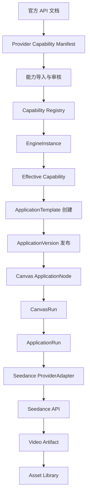

# Seedance 应用从能力接入到画布运行的完整实现流程

## 1. 目标场景

本文以创建一个“Seedance 视频生成应用”为例。

最终用户能够在 OmniMAM 画布中使用以下节点：

```text
Seedance 文生视频
Seedance 图生视频
Seedance 参考素材生视频
Seedance 首尾帧生视频
Seedance 视频编辑
```

用户在画布中看到的是业务参数，例如：

```text
提示词
模型
分辨率
时长
是否生成音频
参考图片
参考视频
```

用户不需要理解：

```text
供应商 API 地址
模型原始 ID
鉴权方式
文件上传协议
任务轮询接口
平台原始请求字段
平台原始错误码
```

---

# 2. 整体阶段

完整流程分为九个阶段：

```text
阶段 1：建立 Provider 与 EngineType
阶段 2：从官方文档整理原始能力
阶段 3：将能力导入 Capability Registry
阶段 4：创建实际 EngineInstance
阶段 5：验证账号实际能力
阶段 6：创建 Seedance 应用模板
阶段 7：发布 ApplicationVersion
阶段 8：画布引用 ApplicationVersion
阶段 9：执行 CanvasRun 和 ApplicationRun
```

完整链路：



---

# 3. 阶段一：建立 Provider 和 EngineType

## 3.1 Provider

Provider 表示能力供应方，例如：

```text
BytePlus ModelArk
火山方舟
RunningHub
Fal
其他平台代理
```

数据库表：

```sql
CREATE TABLE providers (
    id                  UUID PRIMARY KEY,
    code                VARCHAR(64) NOT NULL UNIQUE,
    name                VARCHAR(128) NOT NULL,
    provider_family     VARCHAR(64) NOT NULL,
    status              VARCHAR(32) NOT NULL,
    official_website    TEXT,
    documentation_url   TEXT,
    created_at          TIMESTAMPTZ NOT NULL,
    updated_at          TIMESTAMPTZ NOT NULL
);
```

示例数据：

```sql
INSERT INTO providers (
    id,
    code,
    name,
    provider_family,
    status
) VALUES (
    '...',
    'byteplus-modelark',
    'BytePlus ModelArk',
    'seedance',
    'active'
);
```

`provider_family` 用来表示它属于 Seedance 能力体系，但不同 Provider 仍然保持独立。

---

## 3.2 EngineType

EngineType 定义适配器类型：

```sql
CREATE TABLE engine_types (
    id                  UUID PRIMARY KEY,
    code                VARCHAR(64) NOT NULL UNIQUE,
    name                VARCHAR(128) NOT NULL,
    provider_id         UUID NOT NULL REFERENCES providers(id),
    adapter_code        VARCHAR(128) NOT NULL,
    status              VARCHAR(32) NOT NULL,
    created_at          TIMESTAMPTZ NOT NULL,
    updated_at          TIMESTAMPTZ NOT NULL
);
```

示例：

```text
code: byteplus-modelark-video
adapter_code: seedance_byteplus
```

代码层注册：

```go
type ProviderAdapter interface {
    Code() string

    DiscoverModels(
        ctx context.Context,
        engine EngineInstance,
    ) ([]DiscoveredModel, error)

    DiscoverCapabilities(
        ctx context.Context,
        engine EngineInstance,
    ) ([]CapabilityVariant, error)

    ValidateRequest(
        ctx context.Context,
        engine EngineInstance,
        req NormalizedApplicationRequest,
    ) error

    Submit(
        ctx context.Context,
        engine EngineInstance,
        req NormalizedApplicationRequest,
    ) (ProviderTaskHandle, error)

    Poll(
        ctx context.Context,
        engine EngineInstance,
        handle ProviderTaskHandle,
    ) (ProviderTaskStatus, error)

    Cancel(
        ctx context.Context,
        engine EngineInstance,
        handle ProviderTaskHandle,
    ) error

    CollectOutputs(
        ctx context.Context,
        engine EngineInstance,
        handle ProviderTaskHandle,
    ) ([]Artifact, error)
}
```

注册实现：

```go
registry.Register(
    "seedance_byteplus",
    NewBytePlusSeedanceAdapter(...),
)
```

这一阶段只完成“支持哪种平台协议”，还没有配置具体账号和 endpoint。

---

# 4. 阶段二：从官方文档整理 Seedance 能力

## 4.1 不直接让运行系统解析网页

第一版不要让生产后端自动爬取官方文档。

原因：

* 文档页面结构可能变化；
* 文档可能需要 JavaScript；
* 同一文档可能包含多个模型；
* 自然语言规则难以自动准确转换；
* 文档能力和账号实际能力可能不同；
* 自动解析错误会直接影响用户任务。

正确方式是：

```text
官方文档
→ 人工或开发人员整理
→ Provider Capability Manifest
→ 后端校验
→ 导入数据库
```

后期如果供应商提供稳定的模型或能力查询 API，再接入自动同步。

---

## 4.2 建立 Provider Capability Manifest

在代码仓库或 SSOT 中维护一个供应商能力清单，例如：

```text
providers/
└── byteplus-modelark/
    ├── provider.yaml
    ├── models.yaml
    ├── operations/
    │   ├── text-to-video.yaml
    │   ├── image-to-video.yaml
    │   ├── reference-to-video.yaml
    │   └── video-edit.yaml
    └── mappings/
        └── request-mapping.yaml
```

这个清单是平台适配器的初始化能力数据，而不是最终运行时硬编码。

---

## 4.3 模型清单

示例：

```yaml
provider: byteplus-modelark
source:
  type: official_documentation
  checked_at: "2026-07-13"
  documentation_revision: "2026-06-29"

models:
  - canonical_code: seedance-2
    provider_model_id: "${CONFIGURED_MODEL_ID}"
    display_name: Seedance 2.0
    family: seedance-2
    variant: standard
    lifecycle_status: active

  - canonical_code: seedance-2-fast
    provider_model_id: "${CONFIGURED_FAST_MODEL_ID}"
    display_name: Seedance 2.0 Fast
    family: seedance-2
    variant: fast
    lifecycle_status: active

  - canonical_code: seedance-2-mini
    provider_model_id: "${CONFIGURED_MINI_MODEL_ID}"
    display_name: Seedance 2.0 Mini
    family: seedance-2
    variant: mini
    lifecycle_status: active
```

注意：

```text
canonical_code
```

是 OmniMAM 内部稳定标识。

```text
provider_model_id
```

是供应商调用时实际使用的模型标识。

不要直接让画布保存 `provider_model_id`。

---

## 4.4 操作清单

文生视频：

```yaml
operation:
  code: video.text_to_video
  provider_operation: create_video_generation_task

required_inputs:
  - prompt

optional_inputs:
  - model
  - duration
  - resolution
  - aspect_ratio
  - generate_audio
  - seed

outputs:
  - video
```

图生视频：

```yaml
operation:
  code: video.image_to_video

required_inputs:
  - image

optional_inputs:
  - prompt
  - model
  - duration
  - resolution
  - generate_audio

outputs:
  - video
```

首尾帧生成：

```yaml
operation:
  code: video.first_last_frame_to_video

required_inputs:
  - first_frame
  - last_frame

optional_inputs:
  - prompt
  - model
  - duration
  - resolution

outputs:
  - video
```

参考素材生成：

```yaml
operation:
  code: video.reference_to_video

required_inputs:
  - reference_images

optional_inputs:
  - prompt
  - reference_video
  - reference_audio
  - model
  - duration

outputs:
  - video
```

官方文档当前说明 Seedance 2.0 系列支持多模态素材输入；参考图模式支持 1–9 张图片，首尾帧模式要求对应角色字段，视频输入仅 Seedance 2.0 系列支持。

---

## 4.5 能力变体

不能只写：

```yaml
models: [standard, fast]
resolutions: [720p, 1080p]
durations: [4, 5, 10, 15]
```

必须保留模型与操作之间的有效组合：

```yaml
variants:
  - dimensions:
      model: seedance-2
      operation: video.text_to_video

    constraints:
      prompt:
        type: string
        required: true
        max_length: 10000

      duration:
        type: integer
        enum: [-1, 4, 5, 6, 7, 8, 9, 10, 11, 12, 13, 14, 15]
        default: 5

      resolution:
        type: string
        enum: [720p, 1080p]

  - dimensions:
      model: seedance-2
      operation: video.reference_to_video

    constraints:
      reference_images:
        type: asset.image[]
        min_items: 1
        max_items: 9
        required: false

      reference_video:
        type: asset.video
        required: false

      reference_audio:
        type: asset.audio
        required: false

      duration:
        type: integer
        enum: [-1, 4, 5, 6, 7, 8, 9, 10, 11, 12, 13, 14, 15]
```

这里的分辨率只是示例。真正值必须来自该 Provider 最新文档、控制台或实际 API 验证。

---

# 5. 阶段三：能力清单导入数据库

## 5.1 为什么既保留 Manifest 又存数据库

Manifest 负责：

* 代码审查；
* 变更历史；
* 可重复导入；
* 环境初始化；
* SSOT 管理。

数据库负责：

* 运行时查询；
* 管理员覆盖；
* 不同 Engine 账号差异；
* 能力快照；
* 模型状态；
* 动态表单解析。

---

## 5.2 Provider 模型表

```sql
CREATE TABLE provider_models (
    id                      UUID PRIMARY KEY,
    provider_id             UUID NOT NULL REFERENCES providers(id),
    canonical_code          VARCHAR(128) NOT NULL,
    provider_model_id       VARCHAR(256),
    display_name            VARCHAR(256) NOT NULL,
    model_family            VARCHAR(128) NOT NULL,
    model_variant           VARCHAR(64),
    lifecycle_status        VARCHAR(32) NOT NULL,
    discovered_at           TIMESTAMPTZ,
    last_seen_at            TIMESTAMPTZ,
    deprecated_at           TIMESTAMPTZ,
    retired_at              TIMESTAMPTZ,
    replacement_model_id    UUID,
    metadata                JSONB NOT NULL DEFAULT '{}',
    created_at              TIMESTAMPTZ NOT NULL,
    updated_at              TIMESTAMPTZ NOT NULL,
    UNIQUE(provider_id, canonical_code)
);
```

---

## 5.3 Provider 操作表

```sql
CREATE TABLE provider_operations (
    id                      UUID PRIMARY KEY,
    provider_id             UUID NOT NULL REFERENCES providers(id),
    operation_code          VARCHAR(128) NOT NULL,
    provider_operation_code VARCHAR(256),
    display_name            VARCHAR(256) NOT NULL,
    status                  VARCHAR(32) NOT NULL,
    input_contract          JSONB NOT NULL,
    output_contract         JSONB NOT NULL,
    created_at              TIMESTAMPTZ NOT NULL,
    updated_at              TIMESTAMPTZ NOT NULL,
    UNIQUE(provider_id, operation_code)
);
```

例如：

```json
{
  "operation_code": "video.text_to_video",
  "input_contract": {
    "prompt": {
      "type": "string",
      "required": true
    }
  },
  "output_contract": {
    "video": {
      "type": "asset.video",
      "required": true
    }
  }
}
```

---

## 5.4 Capability Snapshot

每次导入或同步生成不可变快照：

```sql
CREATE TABLE capability_snapshots (
    id                  UUID PRIMARY KEY,
    provider_id         UUID NOT NULL REFERENCES providers(id),
    engine_instance_id  UUID,
    source_type         VARCHAR(32) NOT NULL,
    source_revision     VARCHAR(128),
    source_url          TEXT,
    snapshot_status     VARCHAR(32) NOT NULL,
    capability_data     JSONB NOT NULL,
    checksum            VARCHAR(128) NOT NULL,
    created_at          TIMESTAMPTZ NOT NULL
);
```

`source_type`：

```text
official_documentation
provider_api
manual
runtime_probe
```

---

## 5.5 Capability Variant 表

```sql
CREATE TABLE capability_variants (
    id                      UUID PRIMARY KEY,
    snapshot_id             UUID NOT NULL REFERENCES capability_snapshots(id),
    provider_id             UUID NOT NULL REFERENCES providers(id),
    engine_instance_id      UUID,
    model_id                UUID NOT NULL REFERENCES provider_models(id),
    operation_id            UUID NOT NULL REFERENCES provider_operations(id),
    status                  VARCHAR(32) NOT NULL,
    dimensions              JSONB NOT NULL,
    constraints             JSONB NOT NULL,
    created_at              TIMESTAMPTZ NOT NULL
);
```

示例：

```json
{
  "dimensions": {
    "model": "seedance-2",
    "operation": "video.reference_to_video"
  },
  "constraints": {
    "duration": {
      "type": "integer",
      "enum": [-1, 4, 5, 6, 7, 8, 9, 10, 11, 12, 13, 14, 15],
      "default": 5
    },
    "reference_images": {
      "type": "asset.image[]",
      "min_items": 1,
      "max_items": 9
    }
  }
}
```

---

## 5.6 导入接口

管理员调用：

```http
POST /api/v1/providers/{provider_id}/capability-imports
```

请求：

```json
{
  "source_type": "manifest",
  "manifest_version": "2026-07-13",
  "dry_run": true,
  "content": {
    "models": [],
    "operations": [],
    "variants": []
  }
}
```

`dry_run=true` 时返回差异：

```json
{
  "models_to_create": [
    "seedance-2-fast"
  ],
  "models_to_update": [],
  "models_missing_from_manifest": [],
  "variants_to_create": 4,
  "variants_to_remove": 0,
  "validation_errors": []
}
```

确认后：

```http
POST /api/v1/providers/{provider_id}/capability-imports
```

```json
{
  "source_type": "manifest",
  "manifest_version": "2026-07-13",
  "dry_run": false,
  "content": {}
}
```

导入事务：

```text
校验 Manifest
→ 创建 CapabilitySnapshot
→ upsert ProviderModel
→ upsert ProviderOperation
→ 创建 CapabilityVariant
→ 计算 EffectiveCapability
→ 发布能力变更事件
```

---

# 6. 阶段四：创建 EngineInstance

Provider 表示平台，EngineInstance 表示某个真实账号和调用环境。

管理员创建：

```http
POST /api/v1/engines
```

请求：

```json
{
  "name": "BytePlus Seedance Production",
  "engine_type": "byteplus-modelark-video",
  "base_url": "https://ark.ap-southeast.bytepluses.com",
  "credential_id": "cred-byteplus-main",
  "region": "ap-southeast-1",
  "capability_policy": "provider_default",
  "status": "enabled"
}
```

数据库表：

```sql
CREATE TABLE engine_instances (
    id                      UUID PRIMARY KEY,
    name                    VARCHAR(256) NOT NULL,
    engine_type_id          UUID NOT NULL REFERENCES engine_types(id),
    base_url                TEXT NOT NULL,
    credential_id           UUID,
    region                  VARCHAR(128),
    status                  VARCHAR(32) NOT NULL,
    capability_policy       VARCHAR(32) NOT NULL,
    latest_snapshot_id      UUID,
    settings                JSONB NOT NULL DEFAULT '{}',
    created_at              TIMESTAMPTZ NOT NULL,
    updated_at              TIMESTAMPTZ NOT NULL
);
```

EngineInstance 保存：

```text
调用地址
账号凭证
地域
超时
并发限制
代理配置
账号能力
健康状态
```

ApplicationTemplate 不保存 `base_url` 和 API Key。

---

# 7. 阶段五：验证实际账号能力

官方文档描述的是平台理论能力，但具体账号可能存在：

```text
模型未开通
地域未开放
套餐不支持
接口版本不同
模型 ID 不同
某能力处于灰度
```

因此 Engine 创建后必须执行连接和能力验证。

---

## 7.1 测试连接

```http
POST /api/v1/engines/{engine_id}/test
```

后端执行：

```text
校验 base URL
→ 验证 API Key
→ 请求轻量接口
→ 检查权限
→ 返回连接状态
```

响应：

```json
{
  "status": "success",
  "latency_ms": 132,
  "provider": "byteplus-modelark",
  "account_verified": true
}
```

---

## 7.2 同步能力

```http
POST /api/v1/engines/{engine_id}/capabilities/sync
```

后端流程：

```text
读取 Provider 默认 Capability
→ ProviderAdapter 查询可发现模型
→ 查询账号已开通 endpoint 或模型
→ 对能力执行实际探测
→ 生成 Engine CapabilitySnapshot
→ 计算 EffectiveCapability
```

若供应商不提供完整能力查询接口：

```text
Provider 默认能力
+
账号模型列表
+
管理员覆盖
+
运行验证结果
```

---

## 7.3 能力覆盖

管理员可以临时关闭 8K 或某模型：

```http
PATCH /api/v1/engines/{engine_id}/capability-overrides
```

```json
{
  "disabled_models": [
    "seedance-2-mini"
  ],
  "disabled_values": {
    "resolution": [
      "8k"
    ]
  },
  "constraint_overrides": {
    "duration": {
      "maximum": 10
    }
  },
  "reason": "当前账号高分辨率生成不稳定"
}
```

有效能力：

```text
Provider Capability
∩ Engine Account Capability
∩ Administrator Override
```

---

# 8. 后端向前端提供的能力管理接口

## 8.1 查询 Provider

```http
GET /api/v1/providers
```

返回：

```json
{
  "items": [
    {
      "id": "provider-byteplus",
      "code": "byteplus-modelark",
      "name": "BytePlus ModelArk",
      "status": "active"
    }
  ]
}
```

---

## 8.2 查询 Provider 模型

```http
GET /api/v1/providers/{provider_id}/models
```

参数：

```text
operation_code
lifecycle_status
page_num
page_size
```

返回：

```json
{
  "items": [
    {
      "id": "model-seedance-2",
      "canonical_code": "seedance-2",
      "display_name": "Seedance 2.0",
      "variant": "standard",
      "lifecycle_status": "active"
    }
  ]
}
```

---

## 8.3 查询 Engine 有效能力

```http
GET /api/v1/engines/{engine_id}/capabilities
```

返回：

```json
{
  "engine_id": "engine-byteplus-main",
  "snapshot_version": "2026-07-13-001",
  "operations": [
    {
      "code": "video.text_to_video",
      "models": [
        {
          "code": "seedance-2",
          "constraints": {
            "duration": {
              "enum": [-1, 4, 5, 6, 7, 8, 9, 10, 11, 12, 13, 14, 15]
            },
            "resolution": {
              "enum": ["720p", "1080p"]
            }
          }
        }
      ]
    }
  ]
}
```

这个接口主要供管理页面和模板创建页面使用。

---

## 8.4 查询某操作的模板创建 Schema

```http
POST /api/v1/engines/{engine_id}/operations/{operation_code}/resolve-template-schema
```

请求：

```json
{
  "current_values": {}
}
```

返回：

```json
{
  "operation": "video.text_to_video",
  "fields": [
    {
      "name": "model",
      "type": "string",
      "ui_component": "select",
      "options": [
        {
          "value": "seedance-2",
          "label": "Seedance 2.0"
        },
        {
          "value": "seedance-2-fast",
          "label": "Seedance 2.0 Fast"
        }
      ]
    },
    {
      "name": "duration",
      "type": "integer",
      "ui_component": "select",
      "dynamic": true,
      "depends_on": ["model"]
    }
  ]
}
```

这一步用于“创建应用模板”，不是终端用户运行应用。

---

# 9. 阶段六：创建 Seedance ApplicationTemplate

## 9.1 创建应用

```http
POST /api/v1/applications
```

请求：

```json
{
  "name": "Seedance 文生视频",
  "description": "根据文本提示词生成视频",
  "capability_code": "video.text_to_video",
  "visibility": "private",
  "canvas_enabled": true
}
```

返回：

```json
{
  "application_id": "app-seedance-t2v"
}
```

---

## 9.2 选择模板执行方式

第一版建议固定 Engine：

```json
{
  "engine_binding": {
    "mode": "fixed",
    "engine_id": "engine-byteplus-main"
  }
}
```

后期才增加：

```json
{
  "engine_binding": {
    "mode": "capability_match",
    "selector": {
      "capability": "video.text_to_video",
      "provider_family": "seedance"
    }
  }
}
```

---

## 9.3 获取模板可用字段

前端调用：

```http
POST /api/v1/application-templates/resolve-authoring-schema
```

请求：

```json
{
  "engine_binding": {
    "mode": "fixed",
    "engine_id": "engine-byteplus-main"
  },
  "operation_code": "video.text_to_video",
  "values": {}
}
```

返回：

```json
{
  "fields": [
    {
      "name": "prompt",
      "provider_field": "content.text",
      "type": "string",
      "required": true,
      "can_expose": true,
      "can_fix": false
    },
    {
      "name": "model",
      "provider_field": "model",
      "type": "enum",
      "can_expose": true,
      "can_fix": true,
      "options": [
        {
          "value": "seedance-2",
          "label": "Seedance 2.0"
        },
        {
          "value": "seedance-2-fast",
          "label": "Seedance 2.0 Fast"
        }
      ]
    },
    {
      "name": "duration",
      "provider_field": "duration",
      "type": "integer",
      "can_expose": true,
      "can_fix": true,
      "dynamic": true
    }
  ]
}
```

---

## 9.4 模板作者选择暴露参数

模板作者选择：

```text
prompt：暴露
model：暴露
duration：暴露
resolution：暴露
generate_audio：固定为 true
```

模板配置：

```json
{
  "operation_code": "video.text_to_video",
  "engine_binding": {
    "mode": "fixed",
    "engine_id": "engine-byteplus-main"
  },
  "fields": {
    "prompt": {
      "exposure": "selectable",
      "required": true
    },
    "model": {
      "exposure": "selectable",
      "option_policy": "allowlist",
      "allowed_values": [
        "seedance-2",
        "seedance-2-fast"
      ]
    },
    "duration": {
      "exposure": "selectable",
      "option_policy": "inherit"
    },
    "resolution": {
      "exposure": "selectable",
      "option_policy": "inherit"
    },
    "generate_audio": {
      "exposure": "fixed",
      "value": true
    }
  }
}
```

---

## 9.5 保存模板

```http
POST /api/v1/application-templates
```

请求：

```json
{
  "application_id": "app-seedance-t2v",
  "template_type": "saas_provider_operation",
  "provider_id": "provider-byteplus",
  "operation_code": "video.text_to_video",
  "engine_binding": {
    "mode": "fixed",
    "engine_id": "engine-byteplus-main"
  },
  "field_policies": {},
  "request_mapping": {
    "prompt": "content.text",
    "model": "model",
    "duration": "duration",
    "resolution": "resolution",
    "generate_audio": "generate_audio"
  },
  "output_mapping": {
    "video": "content.video_url"
  }
}
```

后端保存前必须验证：

```text
模板指定模型是否被 Engine 支持
模板字段是否存在
白名单是否为能力子集
固定值是否合法
输出映射是否有效
```

---

# 10. ApplicationTemplate 数据表

```sql
CREATE TABLE application_templates (
    id                      UUID PRIMARY KEY,
    application_id          UUID NOT NULL REFERENCES applications(id),
    template_type           VARCHAR(64) NOT NULL,
    provider_id             UUID REFERENCES providers(id),
    operation_id            UUID REFERENCES provider_operations(id),
    engine_binding_mode     VARCHAR(32) NOT NULL,
    fixed_engine_id         UUID REFERENCES engine_instances(id),
    engine_selector         JSONB,
    request_mapping         JSONB NOT NULL,
    output_mapping          JSONB NOT NULL,
    field_policies          JSONB NOT NULL,
    capability_snapshot_id  UUID REFERENCES capability_snapshots(id),
    status                  VARCHAR(32) NOT NULL,
    created_at              TIMESTAMPTZ NOT NULL,
    updated_at              TIMESTAMPTZ NOT NULL
);
```

模板保存的是：

```text
执行哪个 operation
允许使用哪些模型
暴露哪些字段
固定哪些字段
如何映射请求
如何提取输出
```

模板不保存：

```text
API Key
base URL
账号状态
任务运行状态
```

---

# 11. 阶段七：创建并发布 ApplicationVersion

## 11.1 创建应用版本

```http
POST /api/v1/applications/{application_id}/versions
```

请求：

```json
{
  "version": "1.0.0",
  "template_id": "template-seedance-t2v-v1",
  "inputs": [
    {
      "name": "prompt",
      "label": "提示词",
      "type": "string",
      "required": true,
      "connectable": true,
      "literal_allowed": true,
      "ui": {
        "component": "textarea"
      }
    },
    {
      "name": "model",
      "label": "模型",
      "type": "string",
      "required": true,
      "connectable": false,
      "ui": {
        "component": "select"
      }
    },
    {
      "name": "resolution",
      "label": "分辨率",
      "type": "string",
      "required": true,
      "connectable": false,
      "ui": {
        "component": "select"
      }
    },
    {
      "name": "duration",
      "label": "时长",
      "type": "integer",
      "required": true,
      "connectable": false,
      "ui": {
        "component": "select",
        "unit": "秒"
      }
    }
  ],
  "outputs": [
    {
      "name": "video",
      "label": "生成视频",
      "type": "asset.video",
      "required": true
    }
  ]
}
```

---

## 11.2 发布前预览 RuntimeForm

```http
POST /api/v1/application-versions/{version_id}/resolve-form
```

请求：

```json
{
  "values": {}
}
```

返回：

```json
{
  "fields": {
    "prompt": {
      "visible": true,
      "required": true,
      "value": null
    },
    "model": {
      "visible": true,
      "options": [
        {
          "value": "seedance-2",
          "label": "Seedance 2.0"
        },
        {
          "value": "seedance-2-fast",
          "label": "Seedance 2.0 Fast"
        }
      ],
      "value": "seedance-2"
    },
    "resolution": {
      "visible": true,
      "options": [
        "720p",
        "1080p"
      ]
    },
    "duration": {
      "visible": true,
      "options": [
        -1,
        4,
        5,
        6,
        7,
        8,
        9,
        10,
        11,
        12,
        13,
        14,
        15
      ],
      "value": 5
    }
  }
}
```

---

## 11.3 模型切换后的重新解析

用户将模型切换为 Fast：

```http
POST /api/v1/application-versions/{version_id}/resolve-form
```

```json
{
  "values": {
    "model": "seedance-2-fast",
    "resolution": "1080p",
    "duration": 15
  }
}
```

假设 Fast 只支持 720p 和最长 10 秒，后端返回：

```json
{
  "fields": {
    "model": {
      "value": "seedance-2-fast"
    },
    "resolution": {
      "options": [
        "720p"
      ],
      "value": null
    },
    "duration": {
      "options": [
        4,
        5,
        6,
        7,
        8,
        9,
        10
      ],
      "value": 10
    }
  },
  "changes": [
    {
      "field": "resolution",
      "action": "reset",
      "reason": "VALUE_NOT_SUPPORTED"
    },
    {
      "field": "duration",
      "action": "clamp",
      "old_value": 15,
      "new_value": 10
    }
  ]
}
```

前端不需要知道为什么 Fast 只能这样，它只显示后端结果。

---

## 11.4 发布版本

```http
POST /api/v1/application-versions/{version_id}/publish
```

发布后 ApplicationVersion 不允许直接修改。

任何输入契约、模板、输出契约变化都创建新版本。

---

# 12. 前端应用运行页面需要的接口

## 12.1 获取应用详情

```http
GET /api/v1/applications/{application_id}
```

---

## 12.2 获取应用版本

```http
GET /api/v1/application-versions/{version_id}
```

返回稳定契约：

```json
{
  "id": "appver-seedance-t2v-v1",
  "application_id": "app-seedance-t2v",
  "version": "1.0.0",
  "status": "published",
  "inputs": [],
  "outputs": []
}
```

---

## 12.3 解析运行时表单

```http
POST /api/v1/application-versions/{version_id}/resolve-form
```

这是前端动态表单的核心接口。

前端首次打开：

```json
{
  "values": {}
}
```

用户修改模型：

```json
{
  "values": {
    "model": "seedance-2-fast"
  }
}
```

用户修改分辨率：

```json
{
  "values": {
    "model": "seedance-2-fast",
    "resolution": "720p"
  }
}
```

后端每次返回完整有效状态，而不是仅返回变更字段。

---

## 12.4 直接运行应用

```http
POST /api/v1/application-runs
```

请求：

```json
{
  "application_version_id": "appver-seedance-t2v-v1",
  "inputs": {
    "prompt": "一艘飞船穿越雨夜中的未来城市",
    "model": "seedance-2",
    "resolution": "1080p",
    "duration": 10
  }
}
```

返回：

```json
{
  "application_run_id": "run-001",
  "task_id": "task-001",
  "status": "pending"
}
```

---

## 12.5 查询应用运行

```http
GET /api/v1/application-runs/{application_run_id}
```

返回：

```json
{
  "id": "run-001",
  "status": "running",
  "progress": 62,
  "selected_engine": {
    "id": "engine-byteplus-main",
    "name": "BytePlus Seedance Production"
  }
}
```

---

## 12.6 取消运行

```http
POST /api/v1/application-runs/{application_run_id}/cancel
```

---

# 13. 阶段八：应用进入画布

## 13.1 画布应用库接口

前端打开“添加节点”面板：

```http
GET /api/v1/canvas-node-catalog
```

参数：

```text
category=video_generation
capability=video.text_to_video
```

返回：

```json
{
  "items": [
    {
      "node_kind": "application",
      "application_id": "app-seedance-t2v",
      "application_version_id": "appver-seedance-t2v-v1",
      "name": "Seedance 文生视频",
      "inputs": [
        {
          "name": "prompt",
          "type": "string",
          "connectable": true
        },
        {
          "name": "model",
          "type": "string",
          "connectable": false
        }
      ],
      "outputs": [
        {
          "name": "video",
          "type": "asset.video"
        }
      ]
    }
  ]
}
```

---

## 13.2 创建 CanvasNode

用户将应用拖入画布：

```http
POST /api/v1/canvases/{canvas_id}/nodes
```

请求：

```json
{
  "kind": "application",
  "application_version_id": "appver-seedance-t2v-v1",
  "position": {
    "x": 500,
    "y": 240
  },
  "literal_inputs": {
    "model": "seedance-2",
    "resolution": "1080p",
    "duration": 10
  }
}
```

数据库：

```sql
CREATE TABLE canvas_nodes (
    id                          UUID PRIMARY KEY,
    canvas_id                   UUID NOT NULL,
    node_kind                   VARCHAR(32) NOT NULL,
    application_version_id      UUID,
    position                    JSONB NOT NULL,
    literal_inputs              JSONB NOT NULL DEFAULT '{}',
    ui_state                    JSONB NOT NULL DEFAULT '{}',
    created_at                  TIMESTAMPTZ NOT NULL,
    updated_at                  TIMESTAMPTZ NOT NULL
);
```

---

## 13.3 节点参数编辑

用户点击画布节点：

```http
POST /api/v1/canvases/{canvas_id}/nodes/{node_id}/resolve-form
```

请求：

```json
{
  "values": {
    "model": "seedance-2",
    "resolution": "1080p",
    "duration": 10
  }
}
```

后端内部实际调用 ApplicationVersion 的 Resolver，但增加画布上下文：

```text
哪些字段已经连接
哪些字段由 CanvasInput 提供
哪些字段仍允许字面值
```

响应：

```json
{
  "fields": {
    "prompt": {
      "connectable": true,
      "connection_status": "connected",
      "source": {
        "node_id": "llm-node-01",
        "output": "text"
      },
      "literal_editable": false
    },
    "model": {
      "connectable": false,
      "options": [
        "seedance-2",
        "seedance-2-fast"
      ]
    }
  }
}
```

---

## 13.4 连接 LLM 到 prompt

```text
LLM 节点.text
→ Seedance 文生视频.prompt
```

接口：

```http
POST /api/v1/canvases/{canvas_id}/edges
```

请求：

```json
{
  "source_node_id": "llm-node-01",
  "source_output": "text",
  "target_node_id": "seedance-node-01",
  "target_input": "prompt"
}
```

后端校验：

```text
source output type = string
target input type = string
→ 允许连接
```

CanvasEdge：

```sql
CREATE TABLE canvas_edges (
    id                  UUID PRIMARY KEY,
    canvas_id           UUID NOT NULL,
    source_node_id      UUID NOT NULL,
    source_output       VARCHAR(128) NOT NULL,
    target_node_id      UUID NOT NULL,
    target_input        VARCHAR(128) NOT NULL,
    created_at          TIMESTAMPTZ NOT NULL
);
```

---

# 14. 阶段九：运行画布

## 14.1 创建 CanvasRun

```http
POST /api/v1/canvases/{canvas_id}/runs
```

请求：

```json
{
  "inputs": {
    "topic": "未来城市雨夜"
  }
}
```

返回：

```json
{
  "canvas_run_id": "canvas-run-001",
  "task_group_id": "task-group-001",
  "status": "pending"
}
```

---

## 14.2 编译画布

后端执行：

```text
读取 CanvasNode
→ 读取 CanvasEdge
→ 加载每个 ApplicationVersion
→ 校验输入输出类型
→ 检查必填输入
→ 检查环路
→ 生成 DAGFlowTask
```

示例：

```text
节点 A：输入主题
节点 B：LLM 生成提示词
节点 C：Seedance 文生视频
节点 D：保存素材

依赖：
B depends on A
C depends on B
D depends on C
```

---

## 14.3 执行 LLM 节点

LLM 输出：

```json
{
  "text": "一艘巨大的银色飞船缓慢穿过雨夜中的未来城市..."
}
```

记录为 CanvasNodeRun 输出：

```json
{
  "canvas_node_id": "llm-node-01",
  "outputs": {
    "text": "一艘巨大的银色飞船缓慢穿过雨夜中的未来城市..."
  }
}
```

---

## 14.4 解析 Seedance 节点输入

从连接读取：

```text
prompt
=
LLM 节点输出 text
```

从节点字面值读取：

```text
model = seedance-2
resolution = 1080p
duration = 10
```

形成：

```json
{
  "prompt": "一艘巨大的银色飞船缓慢穿过雨夜中的未来城市...",
  "model": "seedance-2",
  "resolution": "1080p",
  "duration": 10
}
```

---

## 14.5 创建 ApplicationRun

```sql
CREATE TABLE application_runs (
    id                          UUID PRIMARY KEY,
    application_version_id      UUID NOT NULL,
    canvas_run_id               UUID,
    canvas_node_run_id          UUID,
    selected_engine_id          UUID,
    status                      VARCHAR(32) NOT NULL,
    resolved_inputs             JSONB NOT NULL,
    provider_request_snapshot   JSONB,
    provider_task_id            VARCHAR(256),
    normalized_outputs          JSONB,
    error_code                  VARCHAR(128),
    error_message               TEXT,
    created_at                  TIMESTAMPTZ NOT NULL,
    started_at                  TIMESTAMPTZ,
    finished_at                 TIMESTAMPTZ
);
```

---

## 14.6 运行时再次校验

即使前端已校验，后端仍执行：

```text
ApplicationVersion 输入校验
→ Template 约束校验
→ Engine EffectiveCapability 校验
→ ProviderAdapter ValidateRequest
```

例如：

```text
模型是否 active
模型是否支持 text_to_video
1080p 是否支持
10 秒是否支持
账号是否有权限
Engine 是否在线
```

---

## 14.7 转换为 Provider 请求

统一请求：

```json
{
  "operation": "video.text_to_video",
  "model": "seedance-2",
  "prompt": "一艘巨大的银色飞船...",
  "resolution": "1080p",
  "duration": 10,
  "generate_audio": true
}
```

ProviderAdapter 转换为平台请求：

```json
{
  "model": "<provider-model-id>",
  "content": [
    {
      "type": "text",
      "text": "一艘巨大的银色飞船..."
    }
  ],
  "duration": 10,
  "resolution": "1080p",
  "generate_audio": true
}
```

具体字段结构由最新官方 API 文档和 Adapter 实现决定，不暴露给 Application 和 Canvas。

---

## 14.8 提交异步任务

Seedance 视频生成采用异步任务模式，官方 API 提供创建、查询、列表以及取消或删除视频生成任务的接口。

ProviderAdapter：

```go
handle, err := adapter.Submit(ctx, engine, request)
```

返回：

```json
{
  "provider_task_id": "provider-task-123",
  "status": "queued"
}
```

任务中心关联：

```text
AtomicTask
→ ApplicationRun
→ provider_task_id
```

---

## 14.9 Worker 轮询

```text
queued
→ running
→ succeeded
```

或：

```text
queued
→ running
→ failed
```

Worker 周期调用：

```go
status, err := adapter.Poll(ctx, engine, handle)
```

归一化状态：

```text
PENDING
RUNNING
SUCCEEDED
FAILED
CANCELED
```

---

## 14.10 下载视频并登记 Asset

供应商返回：

```json
{
  "video_url": "https://provider.example/output/video.mp4",
  "duration": 10
}
```

后端执行：

```text
下载视频
→ 校验 MIME
→ 计算 checksum
→ 保存本地或 S3
→ 创建 Artifact
→ 登记 Asset
```

输出：

```json
{
  "video": {
    "asset_id": "asset-video-001",
    "type": "asset.video",
    "uri": "asset://asset-video-001"
  }
}
```

这个输出传递给下一个画布节点。

---

# 15. 模型上架和下架后的处理

## 15.1 新模型上线

能力同步发现：

```text
seedance-2-ultra
```

系统执行：

```text
创建 ProviderModel
→ 创建 CapabilityVariant
→ 生成新 CapabilitySnapshot
→ 更新 EffectiveCapability
→ 查找使用 inherit/capability_query 的模板
```

模板策略为：

```yaml
model:
  option_policy: allowlist
```

则新模型不会自动出现。

模板策略为：

```yaml
model:
  option_policy: capability_query
  compatible_contract: video.text_to_video.v1
```

且新模型兼容该契约，则可以自动出现。

---

## 15.2 新增 8K

若 Provider 新能力增加：

```text
resolution = 8k
```

模板使用：

```yaml
resolution:
  option_policy: inherit
```

则 RuntimeForm 自动出现 8K。

模板使用：

```yaml
resolution:
  option_policy: allowlist
  values: [720p, 1080p, 2k, 4k]
```

则不出现 8K。

模板使用：

```yaml
resolution:
  option_policy: inherit
  maximum_rank: 4k
```

也不出现 8K。

---

## 15.3 模型下架

模型不能直接删除。

状态变化：

```text
active
→ unavailable
→ retired
```

系统扫描受影响 ApplicationVersion：

```text
固定该模型的应用
→ unavailable

白名单包含该模型但仍有其他模型
→ partially_available

动态继承模型
→ 自动移除该模型
```

已存在画布节点引用旧版本时：

```text
画布仍能打开
节点显示能力不可用
运行时禁止提交
提示替换模型或升级应用版本
```

---

# 16. 推荐接口汇总

## Provider 与 Engine

```text
GET    /api/v1/providers
POST   /api/v1/providers/{provider_id}/capability-imports
GET    /api/v1/providers/{provider_id}/models
GET    /api/v1/providers/{provider_id}/operations

POST   /api/v1/engines
GET    /api/v1/engines/{engine_id}
POST   /api/v1/engines/{engine_id}/test
POST   /api/v1/engines/{engine_id}/capabilities/sync
GET    /api/v1/engines/{engine_id}/capabilities
PATCH  /api/v1/engines/{engine_id}/capability-overrides
```

## 模板

```text
POST   /api/v1/application-templates/resolve-authoring-schema
POST   /api/v1/application-templates
GET    /api/v1/application-templates/{template_id}
PATCH  /api/v1/application-templates/{template_id}
POST   /api/v1/application-templates/{template_id}/validate
```

## 应用

```text
POST   /api/v1/applications
GET    /api/v1/applications
GET    /api/v1/applications/{application_id}

POST   /api/v1/applications/{application_id}/versions
GET    /api/v1/application-versions/{version_id}
POST   /api/v1/application-versions/{version_id}/resolve-form
POST   /api/v1/application-versions/{version_id}/publish
```

## 直接运行

```text
POST   /api/v1/application-runs
GET    /api/v1/application-runs/{run_id}
POST   /api/v1/application-runs/{run_id}/cancel
```

## 画布

```text
GET    /api/v1/canvas-node-catalog

POST   /api/v1/canvases/{canvas_id}/nodes
PATCH  /api/v1/canvases/{canvas_id}/nodes/{node_id}
POST   /api/v1/canvases/{canvas_id}/nodes/{node_id}/resolve-form

POST   /api/v1/canvases/{canvas_id}/edges
DELETE /api/v1/canvases/{canvas_id}/edges/{edge_id}

POST   /api/v1/canvases/{canvas_id}/validate
POST   /api/v1/canvases/{canvas_id}/runs
GET    /api/v1/canvas-runs/{canvas_run_id}
POST   /api/v1/canvas-runs/{canvas_run_id}/cancel
```

---

# 17. 开发顺序

建议按照以下顺序实现，不要同时实现所有高级能力。

## 第一步：Provider 和 Engine

实现：

```text
Provider
EngineType
EngineInstance
Credential
Engine test
```

## 第二步：静态能力导入

实现：

```text
ProviderModel
ProviderOperation
CapabilitySnapshot
CapabilityVariant
Manifest Import
```

暂时不实现自动爬取文档。

## 第三步：固定 Engine 模板

实现：

```text
Application
ApplicationTemplate
固定 Engine
字段暴露
字段固定
字段白名单
```

## 第四步：RuntimeForm Resolver

实现：

```text
模型联动
枚举约束
范围约束
reset
clamp
后端校验
```

## 第五步：ApplicationVersion

实现：

```text
输入契约
输出契约
发布版本
版本不可变
```

## 第六步：独立运行应用

先打通：

```text
提交
轮询
取消
下载
保存 Asset
```

## 第七步：画布应用节点

实现：

```text
ApplicationNode
CanvasEdge
类型校验
literal input
connection input
```

## 第八步：CanvasRun

实现：

```text
CanvasGraph
DAGFlowTask
CanvasNodeRun
ApplicationRun
节点输出传递
```

## 第九步：动态能力同步

最后增加：

```text
能力发现
模型上下线
能力差异检测
管理员覆盖
受影响应用分析
```

---

# 18. 最小可用版本的明确边界

第一版只做：

```text
一个 Provider
一个 EngineInstance
固定 Engine 应用
文生视频
图生视频
模型选择
分辨率选择
时长选择
动态联动
异步任务
输出视频入素材库
画布节点连线
```

第一版不做：

```text
多个 Engine 自动调度
自动爬取官方文档
任意条件表达式
自动迁移应用版本
动态价格计算
跨 Provider 自动回退
复杂账号套餐推断
```

---

# 19. 最终完整链路

```text
开发人员阅读 Seedance 官方文档
    ↓
编写 Provider Capability Manifest
    ↓
管理员 dry-run 导入
    ↓
生成 ProviderModel / Operation / CapabilityVariant
    ↓
创建 Seedance EngineInstance
    ↓
测试连接并同步账号能力
    ↓
形成 EffectiveCapability
    ↓
创建 video.text_to_video Application
    ↓
基于 Engine 能力创建 ApplicationTemplate
    ↓
选择暴露 model / resolution / duration
    ↓
发布 ApplicationVersion
    ↓
应用进入 Canvas Node Catalog
    ↓
用户拖入 Seedance 文生视频节点
    ↓
LLM 输出连接到 prompt
    ↓
画布运行并编译为 DAGFlowTask
    ↓
创建 ApplicationRun
    ↓
ProviderAdapter 转换 Seedance 请求
    ↓
提交异步视频任务
    ↓
Worker 轮询
    ↓
下载生成视频
    ↓
登记为 Asset
    ↓
传递给下游画布节点
```

最终原则：

> 官方文档用于产生 Provider 能力基础数据，数据库保存运行时能力事实，模板从能力事实中裁剪参数，ApplicationVersion 向前端和画布提供稳定契约。

> 前端不理解 Seedance 平台规则，只调用 `resolve-form` 获取当前模型、分辨率和时长的有效组合。

> 画布不调用 Seedance 原始 API，只创建 ApplicationRun；AppEngine 和 ProviderAdapter 才负责真正调用 Seedance。
