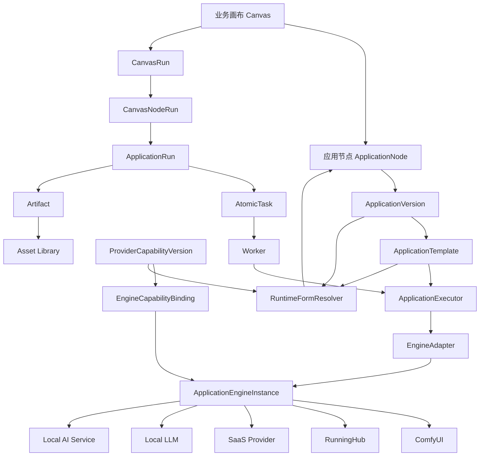
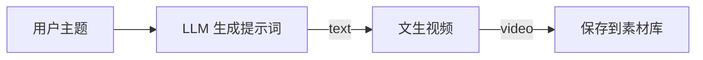
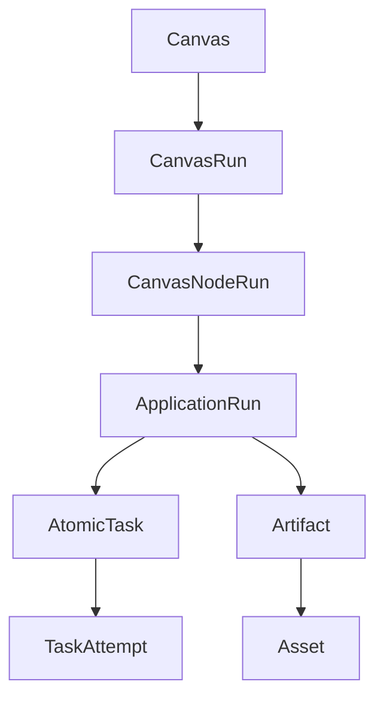

# OmniMAM 应用平台、能力注册与画布编排功能设计

## 1. 文档目的

本文定义 OmniMAM 中应用平台、能力注册、运行时动态表单、执行引擎、画布节点和异步任务中心之间的产品语义、职责边界及核心业务规则。

本文覆盖以下核心对象：

* 能力定义 `CapabilityDefinition`
* 引擎提供商能力 `ProviderCapability`
* 引擎提供商实例与能力绑定 `EngineCapabilityBinding`  
* 引擎提供商适配器 `EngineAdapter`
* 执行引擎类型 `ApplicationEngineType`
* 执行引擎实例 `ApplicationEngineInstance`
* 应用执行器 `ApplicationExecutor`
* 应用 `Application`
* 应用版本 `ApplicationVersion`
* 应用模板 `ApplicationTemplate`
* 运行时表单 `RuntimeFormSchema`
* 画布 `Canvas`
* 画布应用节点 `ApplicationNode`
* 画布运行 `CanvasRun`
* 画布节点运行 `CanvasNodeRun`
* 应用运行 `ApplicationRun`
* 异步任务中心
* 制品 `Artifact`
* 素材 `Asset`

本文重点解决以下问题：

1. 如何将 ComfyUI 工作流、本地模型、RunningHub 工作流和第三方 SaaS 服务封装成统一应用。
2. 如何通过管理员维护的能力模板描述不同平台、模型、操作和参数组合。
3. 如何处理同一个平台存在 Pro、Flash 等不同模型及其参数差异。
4. 如何根据当前模型、平台和应用约束动态生成前端表单。
5. 如何处理模型上架、下架、弃用、分辨率扩展和时长变化。
6. 如何让应用成为画布中的可连接业务节点。
7. 如何让应用节点通过统一输入输出契约组成业务工作流。
8. 如何将画布运行转换为 ApplicationRun 和任务中心中的异步任务。
9. 如何避免前端、画布和业务应用直接依赖供应商原始接口或 ComfyUI 内部节点。

---

# 2. 产品定位

## 2.1 应用平台定位

OmniMAM 应用平台用于将异构 AI 能力封装成业务用户和画布可以直接使用的应用。

底层能力可以来自：

* ComfyUI API Workflow
* 用户自建 ComfyUI 实例
* 本地 LLM
* 本地图像模型
* 本地视频模型
* 本地音频模型
* 第三方 SaaS API
* RunningHub 工作流
* 自建 GPU 推理服务
* OpenAI Compatible API
* 通用 HTTP 服务
* 未来接入的其他 AI 平台

应用平台屏蔽以下底层复杂性：

* ComfyUI 节点拓扑
* checkpoint、VAE、CLIP、latent 等模型细节
* 自定义节点及其内部参数
* SaaS 原始请求结构
* 平台鉴权
* 文件上传
* 异步任务轮询
* 回调处理
* 任务取消
* 结果下载
* Worker 和 GPU 环境
* 不同平台返回格式
* 不同平台错误码


应用平台向终端用户和画布暴露稳定的业务能力，例如：

```text
文生视频
图生视频
视频编辑
图像生成
图像编辑
图像放大
图像重新打光
修改拍摄角度
图像描述
提示词生成
文本润色
文本转语音
语音转文本
视频抽帧
背景移除
人脸修复
```
并将这些业务供：
Web 页面；
无限画布；
Agent；
自动化流程；
调用。

---

## 2.2 画布定位

OmniMAM 画布不是 ComfyUI 前端的重新实现。

画布是跨平台、跨引擎、跨模型的业务能力编排系统。

画布中组合的是业务能力节点，而不是底层技术节点。

不推荐直接在 OmniMAM 画布中暴露：

```text
CheckpointLoader
CLIPTextEncode
KSampler
VAEDecode
LoRALoader
ControlNetApply
ComfyUI 自定义节点
供应商原始 API 调用节点
```

推荐暴露：

```text
生成视频
图像放大
修改视角
重新打光
生成提示词
图像理解
视频加字幕
语音合成
素材保存
条件分支
循环
并发
人工确认
```

---

## 2.3 核心架构原则

### 原则一：底层工作流不是画布工作流

ComfyUI Workflow、RunningHub Workflow、本地模型和 SaaS API 是应用能力的底层实现，不是 OmniMAM 画布本身。

### 原则二：应用定义业务能力

应用定义：

* 需要哪些输入
* 输出哪些结果
* 用户能够配置哪些参数
* 参数之间有哪些约束
* 允许由哪些底层实现执行

### 原则三：画布定义能力组合

画布定义：

* 节点
* 连线
* 数据依赖
* 分支
* 循环
* 并发
* 人工确认
* 失败处理

### 原则四：前端不维护平台能力事实

前端负责：

> 参数如何展示。

后端负责：

> 当前允许展示哪些参数、哪些组合有效。


---

# 3. 总体架构



---

# 4. 核心领域对象
## 4.1 CapabilityDefinition
`CapabilityDefinition` 表示 OmniMAM 内部统一的业务能力分类。
它回答：
> 这个应用在业务上完成什么事情？

示例：

```yaml
id: image.text_to_image 
name: 文生图 

```

常见能力标识：

```text
video.text_to_video
video.image_to_video
video.video_edit
video.extend
video.interpolate

image.generate
image.edit
image.upscale
image.relight
image.change_camera_angle
image.remove_background
image.describe

text.generate
text.rewrite
text.translate
text.summarize

audio.text_to_speech
audio.speech_to_text
audio.voice_clone
```

主要用途:
* 应用分类；
* 应用市场筛选；
* 权限管理；
* 统计；
* 画布节点分类；
* 基础输入输出语义识别。

它由系统初始化数据提供。CapabilityDefinition只是能力定义不包含任何实现细节。
ApolicationEngineType会声明支持哪些CapabilityDefinition,并注册对应的OperationExecutor。

---

## 4.2 ApplicationEngineType

`ApplicationEngineType` 表示一类执行平台。比如Seedance、RunningHub、ComfyUI等。

支持EngineType：
```text
comfyui
runninghub
seedance_official
local_llm
openai_image 
openai_compatible 
runninghub 
generic_sync_http 
generic_async_http
```

ApplicationEngineType的结构通常为:
```
id: engine_type_volcengine_modelark
code: volcengine_modelark
name: 火山方舟 ModelArk
enabled: true
```

ApplicationEngineType通常会有一个EngineAdapter和多个该类型支持的能力的OperationExecutor。
ApplicationEngineType是服务器内置的。
服务器启动时必须要明确知道：
1. 支持哪些ApplicationEngineType
2. 每种类型使用哪些EngineAdapter
3. 每种类型支持哪些OperationExecutor
4. 每种类型支持哪些鉴权和配置字段

### 4.2.1 注册ApplicationEngineType
因此服务器启动时应注册所有支持的ApplicationEngineType。
注册示例：
```
registry.RegisterEngineType(
    "volcengine_modelark",
    EngineTypeRegistration{
        EngineAdapter: NewVolcengineModelArkAdapter(),
        OperationExecutors: map[string]OperationExecutor{
            "image.text_to_image": NewVolcengineImageGenerationExecutor(),
            "video.text_to_video": NewVolcengineTextToVideoExecutor(),
            "video.image_to_video": NewVolcengineImageToVideoExecutor(),
            "video.video_edit":     NewVolcengineVideoEditExecutor(),
        },
    },
)
```
ComfyUI 示例：
```
registry.RegisterEngineType(
    "comfyui",
    EngineTypeRegistration{
        EngineAdapter: NewComfyUIEngineAdapter(),
        OperationExecutors: map[string]OperationExecutor{
            "image.text_to_image":  NewComfyUIWorkflowExecutor(),
            "image.image_edit":     NewComfyUIWorkflowExecutor(),
            "image.upscale":        NewComfyUIWorkflowExecutor(),
            "video.text_to_video":  NewComfyUIWorkflowExecutor(),
            "video.image_to_video": NewComfyUIWorkflowExecutor(),
        },
    },
)
```
这里多个 ComfyUI CapabilityDefinition 可以复用同一个 Workflow OperationExecutor，因为它们最终都通过标准 ComfyUI Workflow 执行。

### 4.2.2 一致性校验
服务器启动时检查：
* ApplicationEngineType是否存在 EngineAdapter 
* ProviderCapability 中允许使用的 capability 否存在对应 OperationExecutor

代码注册缺失时，服务端应明确失败或将对应类型标记为不可用。

例如：
engine_type = volcengine_modelark
capability = video.text_to_video
但代码中未注册：
video.text_to_video OperationExecutor
则不能允许管理员启用相应 ProviderCapability。

---

## 4.3 ProviderCapability
`ProviderCapability` 表示某类平台提供的具体能力。
它回答：
> 某个 ApplicationEngineType / Provider 支持哪些模型、操作和参数。

比如Seedance用来描述Seedance 官方平台提供文生视频、图生视频、视频编辑能力，对应的模型列表是Pro和Flash,以及定义对应的参数约束。
如果有其他的Seedance模型的代理平台或者中转站，也应定义对应的ProviderCapability。
不为 ComfyUI 创建 ProviderCapability.

ProviderCapability由管理员负责导入，管理员需要根据Saas平台的文档去更新ProviderCapability。  

它描述：

* 当前支持哪些模型
* 当前支持哪些操作
* 每个模型支持哪些操作
* 每个有效组合支持哪些参数
* 参数范围
* 参数枚举
* 输入素材数量限制
* 输入素材类型
* 输出类型
* 模型生命周期
* 兼容的业务能力契约
* 能力信息来源说明

示例：

```yaml
id: seedance-official 
name: Seedance 官方能力 
application_engine_type_id: seedance
revision: 3 
enabled: true 
models: 
- id: pro 
    provider_model_id: seedance-2-pro 
    name: Pro 
    enabled: true 
- id: flash 
    provider_model_id: 
    seedance-2-flash 
    name: Flash 
    enabled: true 
operations: 
- id: text_to_video 
  capability_definition_id: video.text_to_video 
- id: image_to_video 
  capability_definition_id: video.image_to_video 

variants: 
- operation: text_to_video 
  model_id: pro 
  constraints: 
    resolution: 
      enum: [720p, 1080p, 2k, 4k] 
    duration: 
      enum: [5, 10, 15, 20, 25] 
- operation: text_to_video 
  model_id: flash 
  constraints: 
    resolution: 
      enum: [720p, 1080p] 
    duration: 
      minimum: 5 
      maximum: 15
```


保存ProviderCapability时，需要检测capability_definition对应的OperationExecutor是否存在。
如果不存在，应当提示: "该能力Definition对应的OperationExecutor不存在"
ProviderCapability 不能绕过代码执行能力。

---

## 4.34 ApplicationEngineInstance

`ApplicationEngineInstance` 表示某个平台的真实账号和调用环境. 比如“Seedance官方平台测试帐号”，“RunningHub平台生产环境帐号”，“ComfyUI-15.48”等。
`ApplicationEngineInstance` 需要指定`ApplicationEngineType`。服务端会根据ApplicationEngineType选择对应的EngineAdapter，周期性进行健康检测。
健康检测只验证：
地址可访问；
凭证基本有效；
平台基础服务可以响应。
管理员可以通过`EngineCapabilityBinding` 来绑定ProviderCapability到ApplicationEngineInstance。

```yaml
id: comfyui-5090d-01
application_engine_type_id: comfyui # ApplicationEngineInstanceType
base_url: http://10.0.0.20:8188
auth_type: none # 验证方式支持 none、api_key、bearer_token、ak_sk
api_key: 1234567890abcdef1234567890abcdef
enabled: true # 是否激活
health_status: online # 健康状态
last_health_check_time: 2023-08-01T12:00:00Z # 最后健康检查时间
```

SaaS 示例：

```yaml
id: volcengine-seedance-prod
application_engine_type_id: volcengine_seedance # ApplicationEngineInstanceType
base_url: https://example.volces.com
auth_type: api_key
api_key: 1234567890abcdef1234567890abcdef
status: online
enabled: true # 是否激活
health_status: online # 健康状态
last_health_check_time: 2023-08-01T12:00:00Z # 最后健康检查时间
region: cn-beijing # 区域
runtime:
    max_concurrency: 4
    request_timeout_seconds: 60 # 请求超时时间
    task_timeout_seconds: 1800 # 任务超时时间
```

ApplicationEngineInstance 保存：

* base URL
* 验证方式
* 网络配置
* 激活状态
* 健康状态
* 能力绑定

原则：

> 连接到哪里由 ApplicationEngineInstance 决定。


## 4.5 EngineAdapter

`EngineAdapter` 负责某类具体平台的协议转换，只负责平台级能力。比如火山引擎、RunningHub、ComfyUI、Seedance等。
这不是保存在数据库的数据，描述一套协议。

它负责：
* HTTP Client；
* 鉴权；
* Token；
* 签名；
* 通用 Header；
* Base URL 处理；
* 通用错误解析；
* 请求追踪；
* 文件上传公共逻辑；
* 平台级健康检测。
 
不负责：
* image.text_to_image
* video.image_to_video

例如：

```text
type EngineAdapter interface {

    HealthCheck(
        ctx context.Context,
        engine ApplicationEngineInstance,
    ) error


    UploadAsset(
        ctx context.Context,
        engine ApplicationEngineInstance,
        asset Asset,
    ) (ProviderAssetRef,error)


    GetOperationExecutor(
        operation string,
    ) (OperationExecutor,error)
}
```

EngineAdapter 中可以硬编码：

* API 路径
* HTTP 方法
* 鉴权方式
* 请求字段名
* 响应字段名
* 上传流程
* 任务轮询流程
* 状态映射
* 错误码映射

EngineAdapter 中不得硬编码：

* 当前有哪些模型
* 某模型是否 active
* 最大分辨率
* 最大时长
* 某个模型支持哪些操作
* 某个模型是否已经下架

这些必须通过管理员维护的 ProviderCapability 提供。

---

## 4.6 OperationExecutor
OperationExecutor定义：
> 一个具体业务能力操作在某个平台上的执行实现

比如seedance提供文生视频的能力，则OperationExecutor需要指导seedance平台的文生视频接口、请求体构造、响应体解析、任务状态查询、取消任务等。

OperationExecutor 负责：
* 操作参数校验；
* 具体 API 路径；
* 请求体构造；
* 同步或异步任务模式；
* 任务 ID 提取；
* 查询路径；
* 状态映射；
* 输出提取；
* 取消方式。

比如火山引擎支持image.text_to_image,video.image_to_video,audio.text_to_speech能力。
那么需要定义这三个的OperationExecutor,并且注册。
```
type VolcengineModelArkAdapter struct {
    operations map[string]OperationExecutor
}

func NewVolcengineAdapter(){
    return &VolcengineModelArkAdapter{
        operations: map[string]OperationExecutor{
            "image.text-to-image":
                NewImageGenerationExecutor(),
            "video.text-to-video":
                NewVideoGenerationExecutor(),
            "audio.text-to-speech":
                NewSpeechExecutor(),
        },
    }
}
```


其接口定义参考为
```
type OperationExecutor interface {
    Operation() string
    Validate(
        params map[string]interface{},
    ) error
    BuildRequest(
        params map[string]interface{},
    ) interface{}
    Submit(
        ctx context.Context,
        req interface{},
    )(ProviderTask,error)
    Query(
        ctx context.Context,
        taskID string,
    )(ProviderTaskStatus,error)
    Cancel(
        ctx context.Context,
        taskID string,
    ) error
    ExtractOutput(
        response interface{},
    )[]Artifact
}
```


## 4.7 EngineCapabilityBinding
`EngineCapabilityBinding` 将一个 ApplicationEngineInstance 绑定到一个 ProviderCapability。
用来表示：
> engine_volcengine_prod 使用 provider_capability_volcengine_ai 描述的能力。

例如：

```yaml
id: binding_volcengine_prod_ai
application_engine_instance_id: volcengine_account_a
provider_capability_id: provider_capability_volcengine_ai
enabled: true
```

同一个能力模板可以绑定多个兼容 ApplicationEngineInstance。

例如：

```text
Seedance 官方生产账号
Seedance 官方测试账号
Seedance 官方美国区域账号
```

EngineCapabilityBinding 可以进行进一步限制，但不得扩张能力。

例如能力模板支持 4K，但某个账号暂时只允许 2K：

```yaml
restrictions:
  disabled_values:
    resolution:
      - 4k

  max_constraints:
    duration: 20
```

最终有效能力：

```text
EngineEffectiveCapability
=
ProviderCapabilityVersion
∩ EngineCapabilityBinding.restrictions
```

### 4.5.1 绑定检验

创建绑定时服务端检查：
ApplicationEngine 是否存在。
ProviderCapability 是否存在。
两者是否属于相同 ApplicationEngineType。
对应 ProviderAdapter 是否已安装。
ProviderCapability 中每项 Operation 是否有 OperationExecutor。
限制是否只缩小能力。

不允许通过 EngineCapabilityBinding 增加 ProviderCapability 中不存在的模型或参数。

---

## 4.5 Application

`Application` 表示一个面向业务用户和画布的应用。用户基于模板创建具体的应用

示例：

```yaml
id: app_text_to_video
name: 文生视频
description: 使用 Seedance 模型生成视频 
enabled: true 
canvas_enabled: true
```

Application 负责：

* 应用名称
* 应用描述
* 应用分类
* 所有者
* 可见范围
* 当前发布版本
* 是否允许终端用户运行
* 是否允许画布使用
* 是否允许复制
* 是否允许创建预设

Application 不直接保存完整参数契约和底层执行配置。

---

## 4.6 ApplicationVersion

`ApplicationVersion` 是应用的不可变发布版本。

它定义：

* 业务输入字段
* 业务输出字段
* 参数默认值
* 参数 UI 提示
* 字段是否允许连线
* 字段是否允许直接填写
* 字段是否允许作为画布入口参数
* 应用模板版本
* 兼容契约

示例：

```yaml
id: appver_text_to_video_v1
application_id: app_text_to_video
version: 1.0.0
status: published
application_template_id: template_seedance_text_to_video
# 暴露参数
exposed_inputs:
  prompt:
    type: string
    label: 提示词
    required: true
    connectable: true
    literal_allowed: true

  model:
    type: enum
    required: true
    label: 模型
    connectable: false

  resolution:
    type: enum
    label: 分辨率
    required: true

  duration:
    type: integer
    label: 时长
    required: true
# 固定参数
fixed_parameters:
  watermark: false
outputs:
  video:
    type: asset.video
```

画布必须引用具体 ApplicationVersion。

---

## 4.7 ApplicationTemplate

`ApplicationTemplate` 是一个完整、可执行的底层能力模板。
它回答：
>底层能力是什么，完整参数有哪些，如何执行？

模板负责：

* 模板类型
* 工作流或远程资源标识
* 参数绑定
* 参数转换
* 固定参数
* 输出提取
* Engine 选择约束
* 能力模板约束

模板保存的是完整能力，不等于终端用户最终看到的应用。


模板创建时需要指定ProviderCapability和相应的CapabilityDefinition。

模板示例
```yaml
id: template_seedance_text_to_video
type: saas

provider_capability_id: provider_capability_volcengine_ai
capability_definition_id: video.text_to_video

parameters:
  prompt:
    type: string
    required: true

  model:
    type: enum
    required: true

  resolution:
    type: enum
    required: true

  duration:
    type: integer
    required: true

  watermark:
    type: boolean
# ApplicationTemplate 的参数映射针对 OperationExecutor 所理解的标准操作参数。
request_mapping:
  prompt:
    target: prompt

  model:
    target: model

  resolution:
    target: resolution

  duration:
    target: duration

  watermark:
    target: watermark
outputs:
  video:
    type: asset.video
    operation_output: video
```


ApplicationTemplate 不保存：

* API Key
* Engine base URL
* Worker 状态
* 当前负载
* GPU 信息
* Engine 网络配置


## 4.8 ApplicationExecutor

`ApplicationExecutor` 是执行应用模板的一个通用执行器.


它负责：

* 验证模板
* 渲染底层请求
* 提交任务
* 查询状态
* 取消任务
* 收集输出
* 归一化错误
* 登记 Artifact

接口概念：

```go
type ApplicationExecutor interface {
    ValidateTemplate(
        ctx context.Context,
        template ApplicationTemplate,
    ) error

    Submit(
        ctx context.Context,
        engine ApplicationEngineInstance,
        run ApplicationRun,
    ) (ExecutionHandle, error)

    Poll(
        ctx context.Context,
        engine ApplicationEngineInstance,
        handle ExecutionHandle,
    ) (ExecutionStatus, error)

    Cancel(
        ctx context.Context,
        engine ApplicationEngineInstance,
        handle ExecutionHandle,
    ) error

    CollectOutputs(
        ctx context.Context,
        engine ApplicationEngineInstance,
        handle ExecutionHandle,
    ) ([]Artifact, error)
}
```
实现一个DefaultApplicationExecutor,它根据 ApplicationEngineInstanceType 找到对应 EngineAdapter进行具体的执行。

---


# 5. ComfyUI 工作流应用化

## 5.1 API Workflow 和 object_info 的能力边界

ComfyUI API Workflow 可以提供：

* 当前节点
* 当前参数值
* 节点连接
* 可执行工作流结构

`/object_info` 可以提供：

* required 输入
* optional 输入
* hidden 输入
* 字段类型
* 默认值
* min
* max
* step
* 部分枚举候选值
* 节点输入输出类型

但二者不能保证还原：

* 前端 JS 动态控件
* 自定义选择器
* 级联下拉逻辑
* 自定义控制台
* 第三方接口返回的选项
* 摄影机方向控制器
* 光照控制器
* 时间轴
* 蒙版编辑器
* 文件浏览器
* 模型商城
* 复杂前端扩展

因此：

```text
API Workflow + object_info
=
标准底层参数识别
+
大部分基础表单生成
```

不等于：

```text
完整恢复 ComfyUI 原始前端交互
```

---

## 5.2 ComfyUI 工作流不直接成为业务画布

复杂工作流应按业务能力封装。

例如一个 ComfyUI 工作流内部包含：

```text
图像加载
→ 图像理解
→ 视角控制
→ 光照控制
→ 人脸修复
→ 图像放大
→ 保存图片
```

若整体封装，只能作为一个黑盒。

为了在画布中自由组合，应按业务能力拆成：

```text
图像视角转换应用
光照重塑应用
人脸修复应用
图像放大应用
```

每个应用内部仍然可以保留完整的 ComfyUI 子工作流。

---

## 5.3 功能拆解原则

```text
ComfyUI 节点
= 技术执行原子

OmniMAM Application
= 业务能力原子

Canvas ApplicationNode
= 业务能力在画布中的实例
```

不应把每一个 ComfyUI 技术节点直接转换成画布节点。

---

## 5.4 高级应用参数

底层 ComfyUI 节点可能只提供：

```text
width
height
```

应用可以提供：

```text
aspect_ratio
resolution
```

模板负责转换：

```text
aspect_ratio + resolution
→ width + height
```

支持的转换类型建议包括：

```text
DIRECT
FIXED_VALUE
ENUM_MAP
MULTI_TARGET_MAP
ASPECT_RATIO_TO_SIZE
BOOLEAN_SWITCH
CONDITIONAL
RANGE_SCALE
CONCAT
TEMPLATE_STRING
```

第一阶段不得支持任意 JavaScript。

---


# 6. 应用模板对能力的裁剪

## 6.1 平台能力和应用意图分离

ProviderCapabilityVersion 表示：

> 平台当前被管理员确认支持什么。

ApplicationTemplateConstraint 表示：

> 这个应用允许终端用户使用什么。

应用模板只能裁剪平台能力。

```text
ApplicationTemplateCapability
⊆
EngineEffectiveCapability
```

例如平台能力：

```text
Pro: 720p、1080p、2K、4K
Flash: 720p、1080p
```

应用可以裁剪为：

```text
Pro: 1080p、2K
Flash: 720p、1080p
```

应用不能扩张为：

```text
Flash: 4K
```

---

## 6.2 参数选项策略

### fixed

固定值。

```yaml
model:
  exposure: fixed
  value: pro
```

### allowlist

只允许白名单。

```yaml
resolution:
  exposure: selectable
  option_policy: allowlist
  values:
    - 1080p
    - 2k
```

### inherit

继承能力模板版本。

```yaml
resolution:
  exposure: selectable
  option_policy: inherit
```

如果 Engine 后续切换到包含 8K 的能力版本，应用可以获得 8K。

### inherit_with_constraint

继承，但继续限制。

```yaml
resolution:
  exposure: selectable
  option_policy: inherit
  constraints:
    maximum_rank: 4k
```

### capability_query

按兼容契约和标签选择模型。

```yaml
model:
  option_policy: capability_query
  filter:
    operation: text_to_video
    lifecycle_status: active
    compatible_contract: video.text_to_video.v1
```

---

# 7. 条件规则与能力变体

## 7.1 禁止前端硬编码供应商条件

不推荐：

```ts
if (provider === "official" && model === "pro") {
  resolutions = ["720p", "1080p", "2k", "4k"];
}

if (provider === "volcengine" && model === "pro") {
  resolutions = ["720p", "1080p", "2k"];
}
```

平台或模型变化不应要求修改前端。

---

## 7.2 使用 CapabilityVariant 表达有效组合

```yaml
variants:
  - dimensions:
      engine_type: seedance_official
      operation: text_to_video
      model: pro
    constraints:
      resolution:
        enum: [720p, 1080p, 2k, 4k]
      duration:
        enum: [5, 10, 15, 20, 25]

  - dimensions:
      engine_type: seedance_official
      operation: text_to_video
      model: flash
    constraints:
      resolution:
        enum: [720p, 1080p]
      duration:
        enum: [5, 10]

  - dimensions:
      engine_type: volcengine_seedance
      operation: text_to_video
      model: pro
    constraints:
      resolution:
        enum: [720p, 1080p, 2k]
      duration:
        enum: [5, 10, 15, 20]
```

不存在以下 Variant：

```text
volcengine + flash
```

即表示不支持。

---

## 7.3 禁止字段级简单并集

错误：

```json
{
  "models": ["pro", "flash"],
  "resolutions": ["1080p", "4k"],
  "durations": [10, 25]
}
```

这种结构会产生：

```text
flash + 4k + 25秒
```

正确：

```json
{
  "variants": [
    {
      "model": "pro",
      "resolutions": ["1080p", "4k"],
      "durations": [10, 25]
    },
    {
      "model": "flash",
      "resolutions": ["720p", "1080p"],
      "durations": [5, 10]
    }
  ]
}
```

---

## 7.4 约束传播

初始可用变体：

```text
官方 + Pro
官方 + Flash
火山 + Pro
```

用户选择：

```text
model = flash
```

剩余变体：

```text
官方 + Flash
```

重新计算：

```text
engine = 官方
resolution = 720p、1080p
duration = 5、10
```

---

## 7.5 字段失效策略

支持：

```text
reset
fallback
clamp
reject
```

### reset

原值无效时清空。

### fallback

自动切换到合法值。

### clamp

数值超过上限时压缩到最大值。

### reject

阻止当前修改。

第一阶段建议：

```text
枚举字段：reset
数值字段：clamp
关键素材输入：reject
```

---

# 8. RuntimeFormSchema

## 8.1 定义

RuntimeFormSchema 是后端根据当前上下文计算出应用版本的最终表单。

```text
RuntimeApplicationCapability
=
ProviderCapabilityVersion
∩ EngineCapabilityBinding
∩ ApplicationTemplateConstraint
∩ ApplicationVersionExposure
∩ UserEntitlement
∩ RuntimeEngineAvailability
```

---

## 8.2 示例
应用端打开应用时请求：
```
POST /api/v1/application-versions/{version_id}/resolve-form
```

请求：
```
{
  "values": {}
}
```

服务端读取
服务端读取：

ApplicationVersion
→ ApplicationTemplate
→ ProviderCapability
→ Engine 选择范围
→ EngineCapabilityBinding

```json
{
  "schema_version": "1.0",
  "application_version_id": "appver_text_to_video_v1",
  "fields": [
    {
      "name": "prompt",
      "type": "string",
      "required": true,
      "connectable": true,
      "ui": {
        "component": "textarea",
        "label": "提示词"
      }
    },
    {
      "name": "model",
      "type": "string",
      "required": true,
      "ui": {
        "component": "select",
        "label": "模型"
      },
      "options": [
        {
          "value": "pro",
          "label": "Pro"
        },
        {
          "value": "flash",
          "label": "Flash"
        }
      ]
    },
    {
      "name": "resolution",
      "type": "string",
      "required": true,
      "dynamic": true,
      "depends_on": ["model"],
      "on_invalid": "reset",
      "ui": {
        "component": "select",
        "label": "分辨率"
      }
    },
    {
      "name": "duration",
      "type": "integer",
      "required": true,
      "dynamic": true,
      "depends_on": ["model", "resolution"],
      "on_invalid": "clamp",
      "ui": {
        "component": "select",
        "label": "时长"
      }
    }
  ]
}
```

---

## 8.3 前端职责

前端负责：

* 渲染字段
* 渲染控件
* 显示 options
* 显示不可用原因
* 提交当前值
* 请求重新解析
* 显示字段重置和修正提示

前端不负责：

* 维护模型清单
* 维护平台能力
* 维护 Pro 和 Flash 的区别
* 判断 8K 是否可用
* 判断模型是否下架
* 判断火山引擎是否支持 Flash

---

## 8.4 Resolve Form API

```http
POST /api/v1/application-versions/{application_version_id}/resolve-form
```

请求：

```json
{
  "engine_id": "seedance-official-prod",
  "values": {
    "model": "flash"
  }
}
```

返回：

```json
{
  "fields": {
    "model": {
      "options": ["pro", "flash"],
      "value": "flash"
    },
    "resolution": {
      "options": ["720p", "1080p"],
      "value": null
    },
    "duration": {
      "options": [5, 10],
      "value": null
    }
  },
  "compatible_engines": [
    "seedance-official-prod"
  ],
  "changes": [
    {
      "field": "resolution",
      "reason": "VALUE_NOT_SUPPORTED_BY_SELECTED_MODEL"
    }
  ],
  "violations": []
}
```

---

# 9. 应用创建模式

## 9.1 固定 Engine

```yaml
engine_binding:
  mode: fixed
  engine_id: volcengine-seedance-prod
```

由于火山能力模板中只有 Pro：

```text
应用模板创建界面
→ model 只有 Pro
→ Flash 不允许选择
```

适合第一阶段。

---

## 10.2 多 Engine 能力匹配

```yaml
engine_binding:
  mode: capability_match
  selector:
    capability: video.text_to_video
```

候选引擎可能包括：

```text
Seedance 官方
火山引擎
RunningHub
其他平台代理
```

用户选择：

```text
Pro + 4K + 25 秒
```

可能只有官方 Engine 匹配。

用户选择：

```text
Pro + 1080p + 10 秒
```

可能多个 Engine 匹配。

系统再根据以下策略选择：

* 固定优先级
* 价格
* 负载
* 区域
* 成功率
* 用户偏好
* 额度

---

## 9.3 多 Engine 下的表单语义

可以采用：

### 显式平台选择

```text
选择平台
→ 选择模型
→ 选择分辨率
→ 选择时长
```

### 自动调度

用户只选择业务参数。

系统保证至少存在一个有效 CapabilityVariant。

---

# 10. 应用与画布打通

## 10.1 ApplicationNode 引用 ApplicationVersion

```json
{
  "id": "canvas-node-27",
  "kind": "application",
  "application_version_id": "appver_text_to_video_v1",
  "position": {
    "x": 640,
    "y": 280
  },
  "literal_inputs": {
    "model": "pro",
    "resolution": "1080p",
    "duration": 10
  }
}
```

画布节点不得保存：

* ComfyUI node ID
* RunningHub workflow ID
* SaaS endpoint
* Engine base URL
* 供应商原始参数名

---

## 10.2 输入来源

应用节点输入可以来自：

* literal
* connection
* canvas_input
* application default

优先级：

```text
上游连接值
> 画布运行输入
> 节点字面值
> ApplicationVersion 默认值
```

---

## 10.3 输入绑定

第一阶段支持：

```text
literal
connection
canvas_input
```

示例：

```json
{
  "inputs": {
    "prompt": {
      "mode": "connection",
      "source_node_id": "canvas-node-12",
      "source_output": "text"
    },
    "model": {
      "mode": "literal",
      "value": "pro"
    },
    "resolution": {
      "mode": "literal",
      "value": "1080p"
    }
  }
}
```

推荐：

```text
CanvasNode
保存 literal 输入

CanvasEdge
保存 connection 输入
```

---

## 11.4 类型系统

```yaml
prompt:
  type: string

reference_image:
  type: asset.image

video:
  type: asset.video
```

允许：

```text
LLM.text → 文生视频.prompt
图片素材.image → 图生视频.image
文生视频.video → 视频编辑.video
```

不允许：

```text
视频.video → prompt
音频.audio → reference_image
```

需要转换时应插入专门转换节点。

---

## 11.5 画布节点 UI

```text
文生视频
────────────
提示词：已连接
模型：Pro
分辨率：1080p
时长：10 秒

输出：
video
```

点击节点后，前端请求 RuntimeFormSchema。

---

# 12. 文生视频应用完整示例

## 12.1 应用契约

```yaml
application:
  id: app_text_to_video
  capability: video.text_to_video

application_version:
  id: appver_text_to_video_v1

inputs:
  prompt:
    type: string
    required: true
    connectable: true

  model:
    type: enum
    required: true

  resolution:
    type: enum
    required: true

  duration:
    type: integer
    required: true

outputs:
  video:
    type: asset.video
```

---

## 12.2 画布结构



---

## 12.3 CanvasNode

```json
{
  "id": "canvas-node-video",
  "kind": "application",
  "application_version_id": "appver_text_to_video_v1",
  "literal_inputs": {
    "model": "pro",
    "resolution": "1080p",
    "duration": 10
  }
}
```

---

## 12.4 CanvasEdge

```json
{
  "id": "edge-prompt",
  "source_node_id": "canvas-node-llm",
  "source_output": "text",
  "target_node_id": "canvas-node-video",
  "target_input": "prompt"
}
```

---

## 12.5 最终解析输入

```json
{
  "prompt": "一艘巨大的星际飞船穿越雨夜中的未来城市",
  "model": "pro",
  "resolution": "1080p",
  "duration": 10
}
```

---

# 13. 画布执行链路

## 13.1 保存态与运行态分离

保存态：

```text
Canvas
CanvasNode
CanvasEdge
```

运行态：

```text
CanvasRun
CanvasNodeRun
ApplicationRun
AtomicTask
TaskAttempt
Artifact
```

---

## 13.2 对象关系



---

## 13.3 画布编译

```text
CanvasGraph
→ 验证节点
→ 验证连线
→ 验证类型
→ 验证必填输入
→ 验证非法环
→ 编译为 DAGFlowTask
```

---

## 13.4 ApplicationRun

```json
{
  "application_run_id": "ar-001",
  "application_version_id": "appver_text_to_video_v1",
  "canvas_run_id": "cr-001",
  "canvas_node_run_id": "cnr-001",
  "resolved_inputs": {
    "prompt": "一艘巨大的星际飞船穿越雨夜中的未来城市",
    "model": "pro",
    "resolution": "1080p",
    "duration": 10
  }
}
```

---

## 13.5 Engine 选择

```text
ApplicationRun
→ 查询 EngineCapabilityBinding
→ 读取 ProviderCapabilityVersion
→ 过滤有效 CapabilityVariant
→ 应用 ApplicationTemplateConstraint
→ 选择 ApplicationEngineInstance
```

---

## 13.6 ApplicationExecutor 执行

```text
ApplicationRun
→ ApplicationTemplate
→ ApplicationExecutor
→ EngineAdapter
→ ApplicationEngineInstance
→ 平台任务
```

---

## 13.7 输出登记

```json
{
  "outputs": {
    "video": "artifact://video-output-001"
  }
}
```

转为资产：

```json
{
  "asset_id": "asset-video-001",
  "type": "video",
  "source": {
    "canvas_run_id": "cr-001",
    "application_run_id": "ar-001"
  }
}
```

---

# 14. 应用版本与画布稳定性

## 14.1 固定 ApplicationVersion

```json
{
  "application_version_id": "appver_text_to_video_v1"
}
```

不得只引用 Application。

---

## 14.2 版本策略

支持：

```text
PINNED
FOLLOW_LATEST_COMPATIBLE
```

第一阶段只实现：

```text
PINNED
```

---

## 14.3 升级检查

应用节点从 v1 升级到 v2 时，检查：

* 输入字段是否存在
* 输出字段是否存在
* 字段类型是否兼容
* 字面值是否合法
* 连线是否兼容
* 是否新增必填字段
* Engine 是否仍可执行

结果：

```text
可直接升级
需要补充参数
存在不兼容连线
无法升级
```

---

# 15. 校验体系

## 15.1 能力模板注册校验

校验：

* 模型是否存在
* Operation 是否存在
* Variant 是否重复
* 参数约束是否合法
* 默认值是否合法
* 输出是否兼容 CapabilityDefinition
* Adapter 是否支持字段
* 是否记录人工验证
* 是否提供来源

---

## 15.2 应用模板创建校验

校验：

* 模板能力是否超出 Engine 能力
* 是否引用 retired 模型
* 参数绑定是否存在
* 输出节点是否有效
* 固定值是否符合能力变体
* allowlist 是否属于能力集合

---

## 15.3 RuntimeForm 校验

校验：

* 当前模型是否 active
* 当前参数组合是否存在有效 Variant
* 当前 Engine 是否绑定有效能力版本
* 当前应用是否允许这些参数
* 用户是否有权限
* 字段是否必填

---

## 15.4 应用提交校验

后端必须重新校验，不信任前端。

```text
Resolve Form
→ Validate ApplicationRun
→ Select Engine
→ Validate CapabilityVariant
→ EngineAdapter ValidateRequest
→ Submit
```

---

## 15.5 平台返回能力不匹配

即使管理员维护的能力模板已经发布，第三方平台仍可能临时改变行为。

如果平台返回：

* 模型不存在
* 参数不支持
* 分辨率超限
* 模型已下架
* 当前账号无权限

系统应返回：

```json
{
  "code": "ERR_PROVIDER_CAPABILITY_MISMATCH",
  "field": "resolution",
  "value": "8k",
  "message": "当前平台拒绝该能力组合，请管理员检查能力模板。"
}
```

同时创建管理员待处理事项：

```text
CapabilityCorrectionRequired
```

系统不得自动修改能力模板。

---

# 16. 前端实现边界

前端应实现：

* Schema 驱动表单
* 文本输入
* 数字输入
* 枚举选择
* 布尔开关
* 图片素材选择
* 视频素材选择
* 音频素材选择
* connectable 字段
* 字面值和连线切换
* 动态字段刷新
* 字段失效提示
* 节点端口类型
* 节点运行状态
* 错误展示
* 应用版本升级提示

前端不得实现：

* Seedance 能力清单
* 火山引擎能力清单
* Pro 和 Flash 差异
* 4K、8K 支持判断
* 模型生命周期判断
* RunningHub 工作流参数映射
* ComfyUI 参数转换
* Provider 鉴权
* Engine 调度

---

