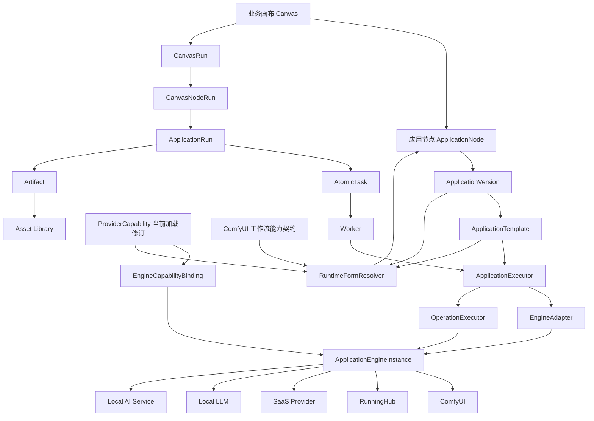
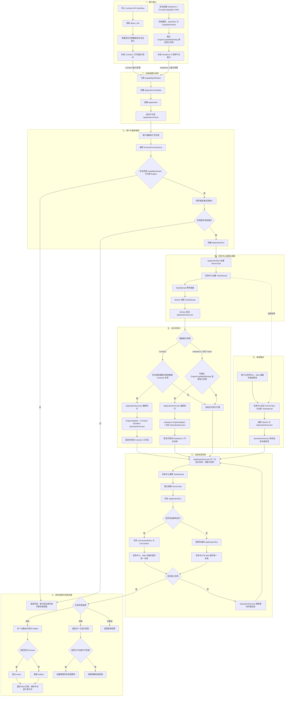
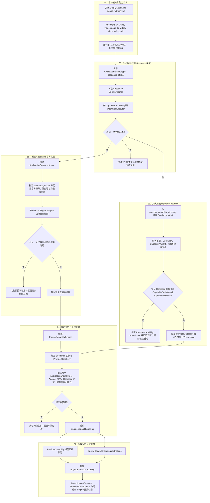
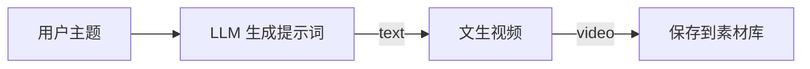
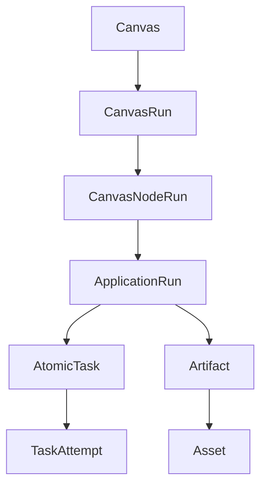

# OmniMAM 应用平台、能力注册与画布编排功能设计

> 文档状态：v0.8.0-draft
>
> 本次修订日期：2026-07-15
>
> 本版本以目录加载的只读 `ProviderCapability` 为平台能力事实源；管理员导入能力的旧方案已废弃。

> 当前实现范围：本版本覆盖应用平台、任务中心协作与 Artifact 登记；第 10～14 章保留画布产品设计事实，但 `workflow-canvas` S1/S2 补齐前属于 deferred 内容，不作为本版本实现、验收或 Release 依据。

## 1. 文档目的

本文定义 OmniMAM 中应用平台、能力注册、运行时动态表单、执行引擎、画布节点和异步任务中心之间的产品语义、职责边界及核心业务规则。

本文覆盖以下核心对象：

* 能力定义 `CapabilityDefinition`
* 引擎提供商能力 `ProviderCapability`
* 引擎实例与能力绑定 `EngineCapabilityBinding`
* 引擎适配器 `EngineAdapter`
* 执行引擎类型 `ApplicationEngineType`
* 执行引擎实例 `ApplicationEngineInstance`
* 应用执行器 `ApplicationExecutor`
* 应用 `Application`
* 应用版本 `ApplicationVersion`
* 应用模板 `ApplicationTemplate`
* 运行时表单 `RuntimeFormSchema`
* 画布 `Canvas`
* 画布应用节点 `ApplicationNode`
* 画布运行 `CanvasRun`
* 画布节点运行 `CanvasNodeRun`
* 应用运行 `ApplicationRun`
* 异步任务中心
* 制品 `Artifact`
* 素材 `Asset`

本文重点解决以下问题：

1. 如何将 ComfyUI 工作流、本地模型、RunningHub 工作流和第三方 SaaS 服务封装成统一应用。
2. 如何通过系统启动时加载的只读 `ProviderCapability` 描述不同平台、模型、操作和参数组合。
3. 如何处理同一个平台存在 Pro、Flash 等不同模型及其参数差异。
4. 如何根据当前模型、平台和应用约束动态生成前端表单。
5. 如何处理模型上架、下架、弃用、分辨率扩展和时长变化。
6. 如何让应用成为画布中的可连接业务节点。
7. 如何让应用节点通过统一输入输出契约组成业务工作流。
8. 如何将画布运行转换为 ApplicationRun 和任务中心中的异步任务。
9. 如何避免前端、画布和业务应用直接依赖供应商原始接口或 ComfyUI 内部节点。

---

## 2. 产品定位

### 2.1 应用平台定位

OmniMAM 应用平台用于将异构 AI 能力封装成业务用户和画布可以直接使用的应用。

底层能力可以来自：

* ComfyUI API Workflow
* 用户自建 ComfyUI 实例
* 本地 LLM
* 本地图像模型
* 本地视频模型
* 本地音频模型
* 第三方 SaaS API
* RunningHub 工作流
* 自建 GPU 推理服务
* OpenAI Compatible API
* 通用 HTTP 服务
* 未来接入的其他 AI 平台

应用平台屏蔽以下底层复杂性：

* ComfyUI 节点拓扑
* checkpoint、VAE、CLIP、latent 等模型细节
* 自定义节点及其内部参数
* SaaS 原始请求结构
* 平台鉴权
* 文件上传
* 异步任务轮询
* 回调处理
* 任务取消
* 结果下载
* Worker 和 GPU 环境
* 不同平台返回格式
* 不同平台失败结果格式


应用平台向终端用户和画布暴露稳定的业务能力，例如：

```text
文生视频
图生视频
视频编辑
图像生成
图像编辑
图像放大
图像重新打光
修改拍摄角度
图像描述
提示词生成
文本润色
文本转语音
语音转文本
视频抽帧
背景移除
人脸修复
```
这些业务能力可以供以下产品形态调用：

* Web 页面
* 无限画布
* Agent
* 自动化流程

---

### 2.2 画布定位

OmniMAM 画布不是 ComfyUI 前端的重新实现。

画布是跨平台、跨引擎、跨模型的业务能力编排系统。

画布中组合的是业务能力节点，而不是底层技术节点。

不推荐直接在 OmniMAM 画布中暴露：

```text
CheckpointLoader
CLIPTextEncode
KSampler
VAEDecode
LoRALoader
ControlNetApply
ComfyUI 自定义节点
供应商原始 API 调用节点
```

推荐暴露：

```text
生成视频
图像放大
修改视角
重新打光
生成提示词
图像理解
视频加字幕
语音合成
素材保存
条件分支
循环
并发
人工确认
```

---

### 2.3 核心架构原则

#### 原则一：底层工作流不是画布工作流

ComfyUI Workflow、RunningHub Workflow、本地模型和 SaaS API 是应用能力的底层实现，不是 OmniMAM 画布本身。

#### 原则二：应用定义业务能力

应用定义：

* 需要哪些输入
* 输出哪些结果
* 用户能够配置哪些参数
* 参数之间有哪些约束
* 允许由哪些底层实现执行

#### 原则三：画布定义能力组合

画布定义：

* 节点
* 连线
* 数据依赖
* 分支
* 循环
* 并发
* 人工确认
* 失败处理

#### 原则四：前端不维护平台能力事实

前端负责：

> 参数如何展示。

平台负责：

> 当前允许展示哪些参数、哪些组合有效。


---

## 3. 总体架构



### 3.1 ComfyUI 与 Seedance 2 应用完整使用链路

下图对照展示 ComfyUI 工作流应用与 Seedance 2 官方 SaaS 应用从能力接入、应用发布、用户或画布使用，到任务中心调度、外部平台执行、状态同步和结果登记的完整链路。两类应用共享统一的应用契约、任务运行和状态主干，但使用不同的能力来源、Engine 约束和外部执行方式。



`AtomicTask` 和当前 `TaskAttempt` 由任务中心负责调度与状态汇总，Worker 负责领取尝试并启动 `ApplicationExecutor`。非画布入口只同步 `ApplicationRun`，不创建 `CanvasNodeRun` 或 `CanvasRun`。本流程只定义状态、进度和取消联动，不定义失败后的自动重试或新建 `TaskAttempt` 规则。

---

## 4. 核心领域对象
### 4.1 CapabilityDefinition
`CapabilityDefinition` 表示 OmniMAM 内部统一的业务能力分类。
它回答：
> 这个应用在业务上完成什么事情？

示例：

```yaml
id: image.text_to_image 
name: 文生图 

```

常见能力标识：

```text
video.text_to_video
video.image_to_video
video.video_edit
video.extend
video.interpolate

image.generate
image.edit
image.upscale
image.relight
image.change_camera_angle
image.remove_background
image.describe

text.generate
text.rewrite
text.translate
text.summarize

audio.text_to_speech
audio.speech_to_text
audio.voice_clone
```

主要用途:
* 应用分类；
* 应用市场筛选；
* 权限管理；
* 统计；
* 画布节点分类；
* 基础输入输出语义识别。

它由系统初始化数据提供。`CapabilityDefinition` 只描述能力定义，不包含任何实现细节。
`ApplicationEngineType` 会声明支持哪些 `CapabilityDefinition`，并关联对应的 `OperationExecutor`。

---

### 4.2 ApplicationEngineType

`ApplicationEngineType` 表示一类执行平台。比如Seedance、RunningHub、ComfyUI等。

支持EngineType：
```text
comfyui
runninghub
seedance_official
local_llm
openai_image 
openai_compatible 
runninghub 
generic_sync_http 
generic_async_http
```

ApplicationEngineType的结构通常为:
```
id: engine_type_volcengine_modelark
code: volcengine_modelark
name: 火山方舟 ModelArk
enabled: true
```

一个 `ApplicationEngineType` 通常对应一个 `EngineAdapter`，并关联多个该类型支持的 `OperationExecutor`。
`ApplicationEngineType` 是平台内置的类型定义。平台启用一种引擎类型前，必须明确：

1. 支持哪些 `ApplicationEngineType`；
2. 每种类型使用哪个 `EngineAdapter`；
3. 每种类型支持哪些 `OperationExecutor`；
4. 每种类型支持哪些鉴权和配置字段。

这些内置事实由只读 Runtime Registry 提供。Registry 至少登记：

* `CapabilityDefinition`；
* `ApplicationEngineType`；
* `EngineAdapter`；
* `OperationExecutor`；
* EngineType 支持的鉴权结构；
* EngineType、Adapter、CapabilityDefinition 和 OperationExecutor 的映射。

ProviderCapability 中引用的 `application_engine_type_id` 和 `capability_definition_id` 必须能在同一 Registry 中解析。当前内置范围至少包含 `comfyui`、`byteplus_modelark`、`deepseek_official`，以及 `video.text_to_video`、`video.image_to_video`、`video.video_edit`、`text.chat_completion` 等相应能力定义。Registry 与 ProviderCapability 都是只读启动事实，不由管理员通过 API 修改。

#### 4.2.1 注册 ApplicationEngineType

平台启动时应加载所有受支持的 `ApplicationEngineType`，并建立引擎类型、适配器和操作执行器之间的关联。

火山方舟类型的声明式注册示例：

```yaml
application_engine_type: volcengine_modelark
engine_adapter: volcengine_modelark
operation_executors:
  image.text_to_image: volcengine_image_generation
  video.text_to_video: volcengine_text_to_video
  video.image_to_video: volcengine_image_to_video
  video.video_edit: volcengine_video_edit
```

ComfyUI 类型的声明式注册示例：

```yaml
application_engine_type: comfyui
engine_adapter: comfyui
operation_executors:
  image.text_to_image: comfyui_workflow
  image.image_edit: comfyui_workflow
  image.upscale: comfyui_workflow
  video.text_to_video: comfyui_workflow
  video.image_to_video: comfyui_workflow
```
这里多个 ComfyUI CapabilityDefinition 可以复用同一个 Workflow OperationExecutor，因为它们最终都通过标准 ComfyUI Workflow 执行。

#### 4.2.2 一致性校验
平台加载引擎类型时检查：

* `ApplicationEngineType` 是否存在 `EngineAdapter`；
* `ProviderCapability` 中允许使用的 capability 是否存在对应的 `OperationExecutor`。

关联缺失时，平台应明确加载失败，或将对应引擎类型及能力标记为不可用。

例如：
engine_type = volcengine_modelark
capability = video.text_to_video
但平台未关联 `video.text_to_video` 对应的 `OperationExecutor`，则不能允许管理员启用相应 `ProviderCapability`。

---

### 4.3 ProviderCapability
`ProviderCapability` 表示某类平台提供的具体能力，并通过 `revision` 标识其修订。
它回答：
> 某个 ApplicationEngineType / Provider 支持哪些模型、操作和参数。

例如 Seedance 用来描述 Seedance 官方平台提供的文生视频、图生视频、视频编辑能力，对应的模型列表为 Pro 和 Flash，并定义相应的参数约束。
如果有其他 Seedance 模型的代理平台或中转站，也应定义对应的 `ProviderCapability`。
不为 ComfyUI 创建 `ProviderCapability`。

`ProviderCapability` 由系统在启动时从只读 YAML 文件加载。文件是平台能力的唯一事实源，不同步为数据库资源，也不提供导入、创建、更新、启用、删除或热加载 API。管理员可以查看能力与加载诊断，但不能通过管理端修改能力内容。运行、绑定和模板解析所使用的“当前有效能力”，均指只读注册表中状态为 `available` 的当前加载修订。

系统使用单一配置项 `provider_capability_directory` 指定能力目录，默认值为 `./provider-capabilities`。加载器只读取目录第一层的 `.yaml` 或 `.yml` 普通文件，不递归扫描，不在多个目录之间执行覆盖。目录中的文件修改后必须重启服务才会生效。

每个文件按原子单元加载。YAML 语法、Schema、模型、Operation、Variant、来源、`ApplicationEngineType`、`EngineAdapter` 或 `OperationExecutor` 任一校验失败时，整个文件对应的 `ProviderCapability` 标记为 `unavailable`，不得只启用其中一部分。多个文件声明同一 `id` 时不选择覆盖者，所有冲突项均不可用并记录诊断。目录缺失或不可读时，服务仍然启动，但注册表状态为 `degraded`，且没有 ProviderCapability 可用于绑定、表单解析或运行。

ProviderCapability 运行状态统一为：

```text
available    文件启用且全部校验通过
disabled     文件显式设置 enabled: false
unavailable  文件加载、一致性或执行能力校验失败
```

`availability`、失败原因、加载时间和来源文件路径属于运行态诊断，不得写回 YAML。

它描述：

* 当前支持哪些模型
* 当前支持哪些操作
* 每个模型支持哪些操作
* 每个有效组合支持哪些参数
* 参数范围
* 参数枚举
* 输入素材数量限制
* 输入素材类型
* 输出类型
* 模型生命周期
* 兼容的业务能力契约
* 能力信息来源说明

示例：

```yaml
id: seedance-official
name: Seedance 官方能力
application_engine_type_id: seedance_official
revision: 3
enabled: true
models:
  - id: pro
    provider_model_id: seedance-2-pro
    name: Pro
    enabled: true
  - id: flash
    provider_model_id: seedance-2-flash
    name: Flash
    enabled: true
operations:
  - id: text_to_video
    capability_definition_id: video.text_to_video
  - id: image_to_video
    capability_definition_id: video.image_to_video

variants:
  - operation: text_to_video
    model_id: pro
    constraints:
      resolution:
        enum: [720p, 1080p, 2k, 4k]
      duration:
        enum: [5, 10, 15, 20, 25]
  - operation: text_to_video
    model_id: flash
    constraints:
      resolution:
        enum: [720p, 1080p]
      duration:
        minimum: 5
        maximum: 15
```


加载 `ProviderCapability` 时，需要检测 `capability_definition` 对应的 `OperationExecutor` 是否存在。
如果不存在，应将该能力标记为不可用，并提示：“该 `CapabilityDefinition` 对应的 `OperationExecutor` 不存在。”
`ProviderCapability` 不能绕过平台已经具备的执行能力。

---

### 4.4 ApplicationEngineInstance

`ApplicationEngineInstance` 表示某个平台的真实账号和调用环境，例如“Seedance 官方平台测试账号”“RunningHub 平台生产环境账号”“ComfyUI-15.48”等。
`ApplicationEngineInstance` 需要指定 `ApplicationEngineType`。平台根据 `ApplicationEngineType` 选择对应的 `EngineAdapter`，并周期性进行健康检测。
健康检测只验证：
地址可访问；
凭证基本有效；
平台基础服务可以响应。
管理员可以通过 `EngineCapabilityBinding` 将 `ProviderCapability` 绑定到 `ApplicationEngineInstance`。

```yaml
id: comfyui-5090d-01
application_engine_type_id: comfyui
base_url: http://10.0.0.20:8188
auth_type: none # 验证方式支持 none、api_key、bearer_token、ak_sk
api_key: 1234567890abcdef1234567890abcdef
enabled: true # 是否激活
health_status: online # 健康状态
last_health_check_time: 2023-08-01T12:00:00Z # 最后健康检查时间
```

SaaS 示例：

```yaml
id: volcengine-seedance-prod
application_engine_type_id: volcengine_seedance
base_url: https://example.volces.com
auth_type: api_key
api_key: 1234567890abcdef1234567890abcdef
status: online
enabled: true # 是否激活
health_status: online # 健康状态
last_health_check_time: 2023-08-01T12:00:00Z # 最后健康检查时间
region: cn-beijing # 区域
runtime:
    max_concurrency: 4
    request_timeout_seconds: 60 # 请求超时时间
    task_timeout_seconds: 1800 # 任务超时时间
```

ApplicationEngineInstance 保存：

* base URL
* 验证方式
* 网络配置
* 激活状态
* 健康状态
* 能力绑定

原则：

> 连接到哪里由 ApplicationEngineInstance 决定。


### 4.5 EngineAdapter

`EngineAdapter` 负责某类具体平台的协议转换，只负责平台级能力。比如火山引擎、RunningHub、ComfyUI、Seedance等。
它描述平台级交互职责，不是管理员维护的业务能力数据。

它负责：
* 建立与外部平台的连接；
* 处理鉴权、令牌和签名；
* 处理平台公共请求信息和服务地址；
* 解析平台公共失败结果；
* 关联请求追踪信息；
* 处理文件上传公共流程；
* 执行平台级健康检测。
 
不负责：
* image.text_to_image
* video.image_to_video

产品语义上的输入和结果为：

```text
健康检测：ApplicationEngineInstance → 健康状态或不可用原因
素材上传：ApplicationEngineInstance + Asset → 外部平台素材引用或上传失败原因
平台交互：ApplicationEngineInstance + 标准化操作请求 → 外部平台响应或公共失败原因
```

`EngineAdapter` 可以固化外部平台协议中稳定的技术约定：

* 外部平台操作入口
* 外部平台调用方式
* 鉴权方式
* 请求字段名
* 响应字段名
* 上传流程
* 任务轮询流程
* 状态映射
* 失败类型映射

`EngineAdapter` 不得固化管理员需要持续维护的能力事实：

* 当前有哪些模型
* 某模型是否 active
* 最大分辨率
* 最大时长
* 某个模型支持哪些操作
* 某个模型是否已经下架

这些必须通过系统从目录加载的 `ProviderCapability` 提供。

---

### 4.6 OperationExecutor
`OperationExecutor` 定义：
> 一个具体业务能力操作在某个平台上的执行实现

例如 Seedance 提供文生视频能力时，`OperationExecutor` 需要表达该平台如何接收标准文生视频参数、如何提交任务、如何解释任务状态、如何取消任务以及如何提取输出。

`OperationExecutor` 负责：
* 操作参数校验；
* 将标准操作参数转换为外部平台请求；
* 同步或异步任务模式；
* 任务 ID 提取；
* 任务状态查询；
* 状态映射；
* 输出提取；
* 取消方式。

例如火山引擎支持 `image.text_to_image`、`video.image_to_video`、`audio.text_to_speech` 时，需要为这三项能力关联对应的 `OperationExecutor`：

```yaml
application_engine_type: volcengine_modelark
operations:
  image.text_to_image: image_generation
  video.image_to_video: video_generation
  audio.text_to_speech: speech_generation
```

每个 `OperationExecutor` 对外保持一致的产品语义：

```text
校验：标准操作参数 → 合法或失败原因
提交：有效标准操作参数 → 外部平台任务引用或提交失败原因
查询：外部平台任务引用 → 归一化任务状态
取消：外部平台任务引用 → 取消结果
提取：外部平台完成结果 → Artifact 集合或结果解析失败原因
```


### 4.7 EngineCapabilityBinding
`EngineCapabilityBinding` 将一个 `ApplicationEngineInstance` 绑定到一个 `ProviderCapability`。
用来表示：
> engine_volcengine_prod 使用 provider_capability_volcengine_ai 描述的能力。

例如：

```yaml
id: binding_volcengine_prod_ai
application_engine_instance_id: volcengine_account_a
provider_capability_id: provider_capability_volcengine_ai
enabled: true
```

同一个 `ProviderCapability` 可以绑定多个兼容的 `ApplicationEngineInstance`。

例如：

```text
Seedance 官方生产账号
Seedance 官方测试账号
Seedance 官方美国区域账号
```

`EngineCapabilityBinding` 可以进行进一步限制，但不得扩张能力。

例如 `ProviderCapability` 支持 4K，但某个账号暂时只允许 2K：

```yaml
restrictions:
  disabled_values:
    resolution:
      - 4k

  max_constraints:
    duration: 20
```

最终有效能力：

```text
EngineEffectiveCapability
=
ProviderCapability 当前加载修订
∩ EngineCapabilityBinding.restrictions
```

#### 4.7.1 绑定检验

创建绑定时平台检查：
`ApplicationEngineInstance` 是否存在。
`ProviderCapability` 是否存在。
两者是否属于相同 `ApplicationEngineType`。
对应 `EngineAdapter` 是否可用。
`ProviderCapability` 中每项 Operation 是否有 `OperationExecutor`。
限制是否只缩小能力。

任一条件不满足时，绑定不得启用，并向管理员说明不兼容项或缺失能力。

不允许通过 `EngineCapabilityBinding` 增加 `ProviderCapability` 中不存在的模型或参数。

#### 4.7.2 Seedance 能力注册与实例绑定完整流程

下图展示 Seedance 业务能力从系统初始化、平台启动注册、目录加载平台能力，到创建官方实例并形成有效能力的完整链路。`CapabilityDefinition` 定义业务语义，`OperationExecutor` 提供对应操作的执行能力，`ProviderCapability` 只有在文件与执行依赖全部校验通过时才可用。



引擎类型注册成功后，加载 `ProviderCapability` 与创建 `ApplicationEngineInstance` 可以独立进行，但启用绑定必须同时具备状态为 `available` 的加载修订和健康可用的实例。注册失败时不会通过配置补足执行能力；能力校验失败时只将对应能力标记为不可用，不阻止服务启动；健康检测失败时实例不可用于绑定；绑定校验失败时不能形成 `EngineEffectiveCapability`。

---

### 4.8 Application

`Application` 表示一个面向业务用户和画布的应用。用户基于模板创建具体的应用

示例：

```yaml
id: app_text_to_video
name: 文生视频
description: 使用 Seedance 模型生成视频 
enabled: true 
canvas_enabled: true
```

Application 负责：

* 应用名称
* 应用描述
* 应用分类
* 所有者
* 可见范围
* 当前发布版本
* 是否允许终端用户运行
* 是否允许画布使用
* 是否允许复制
* 是否允许创建预设

逻辑字段统一为：

```yaml
capability_definition_id: video.text_to_video
visibility: private # private | global
run_enabled: true
canvas_enabled: true
copy_enabled: false
preset_enabled: false
```

普通用户创建 Application 时 `visibility` 默认为 `private`，只能管理本人私有 Application。只有管理员或超级管理员可以创建或修改 `global` Application。`run_enabled` 控制终端用户和 Open API 是否允许直接运行；其他开关分别控制画布引用、复制和预设创建，不得用 `enabled` 同时表达这些独立语义。

Application 不直接保存完整参数契约和底层执行配置。

---

### 4.9 ApplicationVersion

`ApplicationVersion` 是应用的不可变发布版本。

“不可变”指业务输入输出、默认值、字段暴露方式和模板引用在发布后不被原地修改。运行时有效选项仍按该版本声明的参数策略计算：`fixed` 和 `allowlist` 保持版本内约束，`inherit` 和 `inherit_with_constraint` 可以随能力来源的当前加载修订变化。

它定义：

* 业务输入字段
* 业务输出字段
* 参数默认值
* 参数 UI 提示
* 字段是否允许连线
* 字段是否允许直接填写
* 字段是否允许作为画布入口参数
* 引用的 `ApplicationTemplate`
* 兼容契约

示例：

```yaml
id: appver_text_to_video_v1
application_id: app_text_to_video
semantic_version: 1.0.0
status: published
application_template_version_id: templatever_seedance_text_to_video_v1
# 暴露参数
exposed_inputs:
  prompt:
    type: string
    label: 提示词
    required: true
    connectable: true
    literal_allowed: true

  model:
    type: enum
    required: true
    label: 模型
    connectable: false

  resolution:
    type: enum
    label: 分辨率
    required: true

  duration:
    type: integer
    label: 时长
    required: true
# 固定参数
fixed_parameters:
  watermark: false
outputs:
  video:
    type: asset.video
```

画布必须引用具体 ApplicationVersion。

公开版本号使用语义版本字符串，例如 `1.0.0`。同一 Application 下语义版本唯一，发布后不得修改版本号、模板版本引用、输入输出或参数策略。草稿完成校验后通过显式发布动作进入 `published`；发布失败时保留草稿和明确失败原因，不更新 Application 的当前发布版本。

---

### 4.10 ApplicationTemplate

`ApplicationTemplate` 是一个完整、可执行的底层能力模板。
它回答：
>底层能力是什么，完整参数有哪些，如何执行？

模板负责：

* 模板类型
* 工作流或远程资源标识
* 参数绑定
* 参数转换
* 固定参数
* 输出提取
* Engine 选择约束
* 能力来源约束

模板保存的是完整能力，不等于终端用户最终看到的应用。

`ApplicationTemplateVersion` 保存模板的不可变可执行契约。ApplicationTemplate 保存元数据和当前发布版本引用；创建模板时形成第一个 draft 版本，后续修改通过创建新版本完成。模板版本只有在能力来源、参数映射、输出提取、Engine 约束和 OperationExecutor 校验全部通过后才能发布。ApplicationVersion 必须引用已发布的 `ApplicationTemplateVersion`，不得只引用可变的 ApplicationTemplate。


模板创建时必须指定相应的 `CapabilityDefinition`，并根据底层能力来源建立可执行契约：

* SaaS、平台代理和其他目录清单平台，需要引用状态为 `available` 的 `ProviderCapability` 当前加载修订；
* ComfyUI 不创建 `ProviderCapability`，其能力契约来自导入的 API Workflow、`object_info`、管理员参数映射和模板约束；
* 两类模板都只能使用对应 `ApplicationEngineType` 已关联的 `OperationExecutor`，不能通过配置扩张平台实际执行能力。

模板能力来源统一使用联合模型：

```yaml
capability_source_type: provider_capability # provider_capability | comfyui_workflow
```

当类型为 `provider_capability` 时，模板版本必须固定 `provider_capability_id`、创建时 revision 和 `provider_operation_id`；运行时仍需重新验证当前加载修订。当类型为 `comfyui_workflow` 时，不得填写任何 ProviderCapability 字段，必须保存 `workflow_contract_revision` 以及由 API Workflow、`object_info`、人工映射和模板约束形成的工作流能力契约。

模板示例
```yaml
id: template_seedance_text_to_video
type: saas

provider_capability_id: provider_capability_volcengine_ai
capability_definition_id: video.text_to_video

parameters:
  prompt:
    type: string
    required: true

  model:
    type: enum
    required: true

  resolution:
    type: enum
    required: true

  duration:
    type: integer
    required: true

  watermark:
    type: boolean
# ApplicationTemplate 的参数映射针对 OperationExecutor 所理解的标准操作参数。
request_mapping:
  prompt:
    target: prompt

  model:
    target: model

  resolution:
    target: resolution

  duration:
    target: duration

  watermark:
    target: watermark
outputs:
  video:
    type: asset.video
    operation_output: video
```


ApplicationTemplate 不保存：

* API Key
* Engine base URL
* Worker 状态
* 当前负载
* GPU 信息
* Engine 网络配置


### 4.11 ApplicationExecutor

`ApplicationExecutor` 是执行应用模板的通用编排角色。


它负责：

* 验证模板与应用运行输入；
* 根据模板解析标准操作参数；
* 根据 `ApplicationEngineInstance` 的类型找到 `EngineAdapter` 和对应的 `OperationExecutor`；
* 编排任务提交、状态查询和取消；
* 收集并登记 `Artifact`；
* 将外部平台失败结果归一化为应用运行失败原因。

其产品语义为：

```text
ApplicationTemplate + ApplicationRun + ApplicationEngineInstance
→ 校验并解析标准操作参数
→ EngineAdapter 处理平台公共交互
→ OperationExecutor 执行具体业务操作
→ 归一化运行状态与失败原因
→ 登记 Artifact
```

`ApplicationExecutor` 不维护模型清单、平台参数范围或供应商生命周期；这些事实来自模板、`ProviderCapability` 当前加载修订或 ComfyUI 工作流能力契约。

ApplicationRun 创建 TaskRun 的顺序为：先固定并保存 ApplicationRun 执行快照，再以 ApplicationRun ID 和幂等键请求 task-center 创建 `application.execute` TaskRun，成功后绑定 `task_run_id`。创建失败时 ApplicationRun 保留为 `task_creation_failed`，不得伪造 TaskRun 状态；重试必须返回或绑定同一 TaskRun，不能重复创建执行。

ApplicationRun 的每个标准输出先形成不可变 `Artifact`。Artifact 至少保存运行发起用户、ApplicationRun、输出名、媒体类型、内容引用和登记状态；同一 `application_run_id + output_key` 只能形成一个 Artifact。

TaskRun 成功只表示执行完成，不表示素材登记成功。application-platform 使用 Artifact ID 作为幂等键请求 asset-library 登记 UserAsset：

* 首次登记成功时保存返回的 `asset_id`；
* 重复登记返回同一 UserAsset；
* 内容缺失、不可读取、所有者不一致或媒体信息非法时，Artifact 进入 `registration_failed` 并保存稳定错误码和失败详情；
* 登记失败不得回滚或改写 TaskRun 终态，可以由 application-platform 独立重试。

---


## 5. ComfyUI 工作流应用化

### 5.1 API Workflow 和 object_info 的能力边界

ComfyUI API Workflow 可以提供：

* 当前节点
* 当前参数值
* 节点连接
* 可执行工作流结构

`/object_info` 可以提供：

* required 输入
* optional 输入
* hidden 输入
* 字段类型
* 默认值
* min
* max
* step
* 部分枚举候选值
* 节点输入输出类型

但二者不能保证还原：

* 前端 JS 动态控件
* 自定义选择器
* 级联下拉逻辑
* 自定义控制台
* 第三方接口返回的选项
* 摄影机方向控制器
* 光照控制器
* 时间轴
* 蒙版编辑器
* 文件浏览器
* 模型商城
* 复杂前端扩展

因此：

```text
API Workflow + object_info
=
标准底层参数识别
+
大部分基础表单生成
```

不等于：

```text
完整恢复 ComfyUI 原始前端交互
```

---

### 5.2 ComfyUI 工作流不直接成为业务画布

复杂工作流应按业务能力封装。

例如一个 ComfyUI 工作流内部包含：

```text
图像加载
→ 图像理解
→ 视角控制
→ 光照控制
→ 人脸修复
→ 图像放大
→ 保存图片
```

若整体封装，只能作为一个黑盒。

为了在画布中自由组合，应按业务能力拆成：

```text
图像视角转换应用
光照重塑应用
人脸修复应用
图像放大应用
```

每个应用内部仍然可以保留完整的 ComfyUI 子工作流。

---

### 5.3 功能拆解原则

```text
ComfyUI 节点
= 技术执行原子

OmniMAM Application
= 业务能力原子

Canvas ApplicationNode
= 业务能力在画布中的实例
```

不应把每一个 ComfyUI 技术节点直接转换成画布节点。

---

### 5.4 高级应用参数

底层 ComfyUI 节点可能只提供：

```text
width
height
```

应用可以提供：

```text
aspect_ratio
resolution
```

模板负责转换：

```text
aspect_ratio + resolution
→ width + height
```

支持的转换类型建议包括：

```text
DIRECT
FIXED_VALUE
ENUM_MAP
MULTI_TARGET_MAP
ASPECT_RATIO_TO_SIZE
BOOLEAN_SWITCH
CONDITIONAL
RANGE_SCALE
CONCAT
TEMPLATE_STRING
```

第一阶段不得支持任意 JavaScript。

---

### 5.5 ComfyUI 应用化完整链路

ComfyUI 应用从工作流导入到运行的产品链路为：

```text
导入 API Workflow
→ 读取 object_info
→ 识别节点输入、输出和基础约束
→ 管理员补充无法自动恢复的参数映射与交互语义
→ 关联 CapabilityDefinition 和 ComfyUI OperationExecutor
→ 形成 ApplicationTemplate 的工作流能力契约
→ ApplicationVersion 裁剪并暴露业务参数
→ RuntimeFormSchema 合并工作流能力契约、模板约束和运行时 Engine 可用性
→ ApplicationRun 选择满足模板约束的 ApplicationEngineInstance
→ ApplicationExecutor 编排 EngineAdapter 和 OperationExecutor 执行
→ 输出登记为 Artifact，并可进一步转为 Asset
```

如果 `object_info` 不能提供自定义控件、级联选项或外部数据源，平台不得猜测这些语义，必须由管理员在模板中补充映射和约束。

存在以下任一情况时，ComfyUI 模板不得发布：

* API Workflow 的必填输入无法映射；
* 业务输入无法转换为工作流参数；
* 输出节点或输出提取规则无效；
* 对应 `CapabilityDefinition` 没有可用的 ComfyUI `OperationExecutor`。

运行时没有满足模板约束且健康可用的 ComfyUI 实例时，`ApplicationRun` 必须在提交工作流前失败，并说明当前无可执行引擎。

---


## 6. 应用模板对能力的裁剪

### 6.1 平台能力和应用意图分离

`CapabilitySource` 表示平台当前确认可执行的完整能力：SaaS 等平台来自状态为 `available` 的 `ProviderCapability` 当前加载修订，ComfyUI 来自工作流能力契约。

对于 `ProviderCapability`：

> 平台当前被管理员确认支持什么。

ApplicationTemplateConstraint 表示：

> 这个应用允许终端用户使用什么。

应用模板只能裁剪其能力来源，不得增加能力来源中不存在的模型、参数或组合。

```text
ApplicationTemplateCapability
⊆
CapabilitySource ∩ EngineRestrictions
```

对于 SaaS 等平台，`EngineRestrictions` 来自 `EngineCapabilityBinding.restrictions`；对于 ComfyUI，来自模板的 Engine 选择约束。

例如平台能力：

```text
Pro: 720p、1080p、2K、4K
Flash: 720p、1080p
```

应用可以裁剪为：

```text
Pro: 1080p、2K
Flash: 720p、1080p
```

应用不能扩张为：

```text
Flash: 4K
```

---

### 6.2 参数选项策略

#### fixed

固定值。

```yaml
model:
  exposure: fixed
  value: pro
```

#### allowlist

只允许白名单。

```yaml
resolution:
  exposure: selectable
  option_policy: allowlist
  values:
    - 1080p
    - 2k
```

#### inherit

继承能力来源的当前加载修订。

```yaml
resolution:
  exposure: selectable
  option_policy: inherit
```

如果 Engine 后续切换到包含 8K 的 `ProviderCapability` 修订，应用可以获得 8K。

#### inherit_with_constraint

继承，但继续限制。

```yaml
resolution:
  exposure: selectable
  option_policy: inherit
  constraints:
    maximum_rank: 4k
```

#### capability_query

按兼容契约和标签选择模型。

```yaml
model:
  option_policy: capability_query
  filter:
    operation: text_to_video
    lifecycle_status: active
    compatible_contract: video.text_to_video.v1
```

---

## 7. 条件规则与能力变体

### 7.1 禁止前端硬编码供应商条件

不推荐：

```ts
if (provider === "official" && model === "pro") {
  resolutions = ["720p", "1080p", "2k", "4k"];
}

if (provider === "volcengine" && model === "pro") {
  resolutions = ["720p", "1080p", "2k"];
}
```

平台或模型变化不应要求修改前端。

---

### 7.2 使用 CapabilityVariant 表达有效组合

```yaml
variants:
  - dimensions:
      engine_type: seedance_official
      operation: text_to_video
      model: pro
    constraints:
      resolution:
        enum: [720p, 1080p, 2k, 4k]
      duration:
        enum: [5, 10, 15, 20, 25]

  - dimensions:
      engine_type: seedance_official
      operation: text_to_video
      model: flash
    constraints:
      resolution:
        enum: [720p, 1080p]
      duration:
        enum: [5, 10]

  - dimensions:
      engine_type: volcengine_seedance
      operation: text_to_video
      model: pro
    constraints:
      resolution:
        enum: [720p, 1080p, 2k]
      duration:
        enum: [5, 10, 15, 20]
```

不存在以下 Variant：

```text
volcengine + flash
```

即表示不支持。

---

### 7.3 禁止字段级简单并集

错误：

```json
{
  "models": ["pro", "flash"],
  "resolutions": ["1080p", "4k"],
  "durations": [10, 25]
}
```

这种结构会产生：

```text
flash + 4k + 25秒
```

正确：

```json
{
  "variants": [
    {
      "model": "pro",
      "resolutions": ["1080p", "4k"],
      "durations": [10, 25]
    },
    {
      "model": "flash",
      "resolutions": ["720p", "1080p"],
      "durations": [5, 10]
    }
  ]
}
```

---

### 7.4 约束传播

初始可用变体：

```text
官方 + Pro
官方 + Flash
火山 + Pro
```

用户选择：

```text
model = flash
```

剩余变体：

```text
官方 + Flash
```

重新计算：

```text
engine = 官方
resolution = 720p、1080p
duration = 5、10
```

---

### 7.5 字段失效策略

支持：

```text
reset
fallback
clamp
reject
```

#### reset

原值无效时清空。

#### fallback

自动切换到合法值。

#### clamp

数值超过上限时压缩到最大值。

#### reject

阻止当前修改。

第一阶段建议：

```text
枚举字段：reset
数值字段：clamp
关键素材输入：reject
```

---

## 8. RuntimeFormSchema

### 8.1 定义

`RuntimeFormSchema` 是平台根据当前上下文计算出的应用版本最终表单。

```text
RuntimeApplicationCapability
=
CapabilitySource
∩ EngineRestrictions
∩ ApplicationTemplateConstraint
∩ ApplicationVersionExposure
∩ UserEntitlement
∩ RuntimeEngineAvailability
```

其中 `CapabilitySource` 根据模板类型确定：

* SaaS 等平台取状态为 `available` 的 `ProviderCapability` 当前加载修订，`EngineRestrictions` 取 `EngineCapabilityBinding.restrictions`；
* ComfyUI 取 API Workflow、`object_info`、管理员参数映射和模板约束共同形成的工作流能力契约，`EngineRestrictions` 取模板的 Engine 选择约束。

如果任一约束应用后不存在有效 `CapabilityVariant`，表单解析必须返回“当前没有可执行的能力组合”，不得生成可提交表单。

---

### 8.2 示例

应用端打开应用时发起表单解析。解析输入语义示例：

```
{
  "current_values": {}
}
```

平台读取：

ApplicationVersion
→ ApplicationTemplate
→ CapabilitySource
→ Engine 选择范围
→ EngineRestrictions

```json
{
  "schema_version": "1.0",
  "application_version_id": "appver_text_to_video_v1",
  "fields": [
    {
      "name": "prompt",
      "type": "string",
      "required": true,
      "connectable": true,
      "ui": {
        "component": "textarea",
        "label": "提示词"
      }
    },
    {
      "name": "model",
      "type": "string",
      "required": true,
      "ui": {
        "component": "select",
        "label": "模型"
      },
      "options": [
        {
          "value": "pro",
          "label": "Pro"
        },
        {
          "value": "flash",
          "label": "Flash"
        }
      ]
    },
    {
      "name": "resolution",
      "type": "string",
      "required": true,
      "dynamic": true,
      "depends_on": ["model"],
      "on_invalid": "reset",
      "ui": {
        "component": "select",
        "label": "分辨率"
      }
    },
    {
      "name": "duration",
      "type": "integer",
      "required": true,
      "dynamic": true,
      "depends_on": ["model", "resolution"],
      "on_invalid": "clamp",
      "ui": {
        "component": "select",
        "label": "时长"
      }
    }
  ]
}
```

---

### 8.3 前端职责

前端负责：

* 渲染字段
* 渲染控件
* 显示 options
* 显示不可用原因
* 提交当前值
* 请求重新解析
* 显示字段重置和修正提示

前端不负责：

* 维护模型清单
* 维护平台能力
* 维护 Pro 和 Flash 的区别
* 判断 8K 是否可用
* 判断模型是否下架
* 判断火山引擎是否支持 Flash

---

### 8.4 RuntimeFormSchema 解析语义

表单解析输入包含目标应用版本、可选的引擎选择和当前字段值。示例：

```json
{
  "application_version_id": "appver_text_to_video_v1",
  "engine_instance_id": "seedance-official-prod",
  "current_values": {
    "model": "flash"
  }
}
```

解析结果包含字段当前值与有效选项、兼容引擎、系统修正以及仍未解决的违规项。`fields` 在所有接口和示例中统一使用数组，每个字段以 `name` 作为稳定标识。示例：

```json
{
  "capability_source_type": "provider_capability",
  "fields": [
    {
      "name": "model",
      "options": ["pro", "flash"],
      "value": "flash"
    },
    {
      "name": "resolution",
      "options": ["720p", "1080p"],
      "value": null
    },
    {
      "name": "duration",
      "options": [5, 10],
      "value": null
    }
  ],
  "compatible_engine_instance_ids": [
    "seedance-official-prod"
  ],
  "changes": [
    {
      "field": "resolution",
      "reason": "VALUE_NOT_SUPPORTED_BY_SELECTED_MODEL"
    }
  ],
  "violations": []
}
```

当用户修改动态字段时，前端使用完整当前值重新请求解析。平台必须基于同一组能力约束重新计算，不依赖前端自行裁剪选项。

解析结果存在 `violations` 时不得提交运行；系统自动执行 `reset`、`fallback` 或 `clamp` 时，必须通过 `changes` 告知前端字段及原因。

对于 ComfyUI，返回 `capability_source_type = comfyui_workflow` 和工作流能力契约 revision，不返回也不要求 `provider_capability_id` 或 `provider_capability_revision`。对于目录平台，两项 ProviderCapability 快照字段必须同时返回。

---

## 9. 应用创建模式

### 9.1 固定 Engine

```yaml
engine_binding:
  mode: fixed
  engine_id: volcengine-seedance-prod
```

由于火山 `ProviderCapability` 中只有 Pro：

```text
应用模板创建界面
→ model 只有 Pro
→ Flash 不允许选择
```

适合第一阶段。

---

### 9.2 多 Engine 能力匹配

```yaml
engine_binding:
  mode: capability_match
  selector:
    capability: video.text_to_video
```

候选引擎可能包括：

```text
Seedance 官方
火山引擎
RunningHub
其他平台代理
```

用户选择：

```text
Pro + 4K + 25 秒
```

可能只有官方 Engine 匹配。

用户选择：

```text
Pro + 1080p + 10 秒
```

可能多个 Engine 匹配。

系统再根据以下策略选择：

* 固定优先级
* 价格
* 负载
* 区域
* 成功率
* 用户偏好
* 额度

---

### 9.3 多 Engine 下的表单语义

可以采用：

#### 显式平台选择

```text
选择平台
→ 选择模型
→ 选择分辨率
→ 选择时长
```

#### 自动调度

用户只选择业务参数。

系统保证至少存在一个有效 CapabilityVariant。

---

## 10. 应用与画布打通

> Deferred：本章至第 14 章保留已确认的画布产品设计，但本次不生成 workflow-canvas S2。相关 Canvas、Node、Edge、CanvasRun、CanvasNodeRun、升级检查和 DAG 编译内容不得作为当前实现或验收依据；当前 application-platform 只承诺已发布 ApplicationVersion 可被未来 workflow-canvas 引用。

### 10.1 ApplicationNode 引用 ApplicationVersion

```json
{
  "id": "canvas-node-27",
  "kind": "application",
  "application_version_id": "appver_text_to_video_v1",
  "position": {
    "x": 640,
    "y": 280
  },
  "literal_inputs": {
    "model": "pro",
    "resolution": "1080p",
    "duration": 10
  }
}
```

画布节点不得保存：

* ComfyUI node ID
* RunningHub workflow ID
* SaaS endpoint
* Engine base URL
* 供应商原始参数名

---

### 10.2 输入来源

应用节点输入可以来自：

* literal
* connection
* canvas_input
* application default

优先级：

```text
上游连接值
> 画布运行输入
> 节点字面值
> ApplicationVersion 默认值
```

---

### 10.3 输入绑定

第一阶段支持：

```text
literal
connection
canvas_input
```

示例：

```json
{
  "inputs": {
    "prompt": {
      "mode": "connection",
      "source_node_id": "canvas-node-12",
      "source_output": "text"
    },
    "model": {
      "mode": "literal",
      "value": "pro"
    },
    "resolution": {
      "mode": "literal",
      "value": "1080p"
    }
  }
}
```

推荐：

```text
CanvasNode
保存 literal 输入

CanvasEdge
保存 connection 输入
```

---

## 11. 画布节点类型与交互

### 11.1 类型系统

```yaml
prompt:
  type: string

reference_image:
  type: asset.image

video:
  type: asset.video
```

允许：

```text
LLM.text → 文生视频.prompt
图片素材.image → 图生视频.image
文生视频.video → 视频编辑.video
```

不允许：

```text
视频.video → prompt
音频.audio → reference_image
```

需要转换时应插入专门转换节点。

---

### 11.2 画布节点 UI

```text
文生视频
────────────
提示词：已连接
模型：Pro
分辨率：1080p
时长：10 秒

输出：
video
```

点击节点后，前端请求 RuntimeFormSchema。

---

## 12. 文生视频应用完整示例

### 12.1 应用契约

```yaml
application:
  id: app_text_to_video
  capability: video.text_to_video

application_version:
  id: appver_text_to_video_v1

inputs:
  prompt:
    type: string
    required: true
    connectable: true

  model:
    type: enum
    required: true

  resolution:
    type: enum
    required: true

  duration:
    type: integer
    required: true

outputs:
  video:
    type: asset.video
```

---

### 12.2 画布结构



---

### 12.3 CanvasNode

```json
{
  "id": "canvas-node-video",
  "kind": "application",
  "application_version_id": "appver_text_to_video_v1",
  "literal_inputs": {
    "model": "pro",
    "resolution": "1080p",
    "duration": 10
  }
}
```

---

### 12.4 CanvasEdge

```json
{
  "id": "edge-prompt",
  "source_node_id": "canvas-node-llm",
  "source_output": "text",
  "target_node_id": "canvas-node-video",
  "target_input": "prompt"
}
```

---

### 12.5 最终解析输入

```json
{
  "prompt": "一艘巨大的星际飞船穿越雨夜中的未来城市",
  "model": "pro",
  "resolution": "1080p",
  "duration": 10
}
```

---

## 13. 画布执行链路

### 13.1 保存态与运行态分离

保存态：

```text
Canvas
CanvasNode
CanvasEdge
```

运行态：

```text
CanvasRun
CanvasNodeRun
ApplicationRun
AtomicTask
TaskAttempt
Artifact
```

---

### 13.2 对象关系



---

### 13.3 画布编译

```text
CanvasGraph
→ 验证节点
→ 验证连线
→ 验证类型
→ 验证必填输入
→ 验证非法环
→ 编译为 DAGFlowTask
```

---

### 13.4 ApplicationRun

```json
{
  "application_run_id": "ar-001",
  "application_version_id": "appver_text_to_video_v1",
  "canvas_run_id": "cr-001",
  "canvas_node_run_id": "cnr-001",
  "resolved_inputs": {
    "prompt": "一艘巨大的星际飞船穿越雨夜中的未来城市",
    "model": "pro",
    "resolution": "1080p",
    "duration": 10
  }
}
```

非画布入口的 ApplicationRun 不包含 `canvas_run_id` 或 `canvas_node_run_id`。画布字段只在未来 workflow-canvas 契约完成后启用。

---

### 13.5 Engine 选择

```text
ApplicationRun
→ 读取 CapabilitySource
→ 解析 EngineRestrictions
→ 过滤有效 CapabilityVariant
→ 应用 ApplicationTemplateConstraint
→ 选择 ApplicationEngineInstance
```

对于 SaaS 等平台，`CapabilitySource` 为状态为 `available` 的 `ProviderCapability` 当前加载修订，并通过 `EngineCapabilityBinding` 找到候选实例。对于 ComfyUI，`CapabilitySource` 为工作流能力契约，并从满足模板 Engine 约束的 ComfyUI 实例中选择候选实例。

如果没有实例同时满足能力约束、启用状态和运行时可用性，`ApplicationRun` 必须在提交外部平台前失败，并说明当前无可执行引擎。

---

### 13.6 ApplicationExecutor 执行

```text
ApplicationRun
→ ApplicationTemplate
→ ApplicationExecutor
→ EngineAdapter + OperationExecutor
→ ApplicationEngineInstance
→ 平台任务
```

---

### 13.7 输出登记

```json
{
  "outputs": {
    "video": "artifact://video-output-001"
  }
}
```

转为资产：

```json
{
  "asset_id": "asset-video-001",
  "type": "video",
  "source": {
    "canvas_run_id": "cr-001",
    "application_run_id": "ar-001"
  }
}
```

---

## 14. 应用版本与画布稳定性

### 14.1 固定 ApplicationVersion

```json
{
  "application_version_id": "appver_text_to_video_v1"
}
```

不得只引用 Application。

固定 `ApplicationVersion` 不等于冻结 `ProviderCapability` 修订、Engine 健康状态或运行时可用性。运行时能力变化导致已保存字面值不再合法时，系统不得静默修改画布；应按字段失效策略给出修正建议，或将节点标记为当前不可执行。

---

### 14.2 版本策略

支持：

```text
PINNED
FOLLOW_LATEST_COMPATIBLE
```

第一阶段只实现：

```text
PINNED
```

---

### 14.3 升级检查

应用节点从 v1 升级到 v2 时，检查：

* 输入字段是否存在
* 输出字段是否存在
* 字段类型是否兼容
* 字面值是否合法
* 连线是否兼容
* 是否新增必填字段
* Engine 是否仍可执行

结果：

```text
可直接升级
需要补充参数
存在不兼容连线
无法升级
```

---

## 15. 校验体系

### 15.1 ProviderCapability 注册校验

启动加载时逐文件校验：

* YAML 语法、`schema_version` 和完整字段 Schema 是否有效
* 文件是否位于配置目录第一层且为普通 `.yaml` / `.yml` 文件
* `id` 是否与其他文件重复
* 模型是否存在
* Operation 是否存在
* Variant 是否重复
* 参数约束是否合法
* 默认值是否合法
* 输出是否兼容 CapabilityDefinition
* `OperationExecutor` 是否支持对应的标准操作参数
* 是否提供来源、来源更新时间和人工核验日期

如果对应 `ApplicationEngineType`、`EngineAdapter` 或 `OperationExecutor` 缺失，`ProviderCapability` 标记为 `unavailable` 并向管理员列出缺失项；其他有效文件继续加载，服务继续启动。加载结果不写入数据库，服务运行期间不自动重新加载。

---

### 15.2 应用模板创建校验

校验：

* 模板能力是否超出 Engine 能力
* 是否引用 retired 模型
* 参数绑定是否存在
* 输出节点是否有效
* 固定值是否符合能力变体
* allowlist 是否属于能力集合

对于 ComfyUI 模板，还必须校验 API Workflow、`object_info`、管理员参数映射和输出提取规则能否共同形成完整的工作流能力契约。任一必填输入无法映射或输出无法提取时，模板不得发布。

---

### 15.3 RuntimeForm 校验

校验：

* 当前模型是否 active
* 当前参数组合是否存在有效 Variant
* 当前能力来源是否有效
* 当前 Engine 是否满足绑定或模板约束
* 当前应用是否允许这些参数
* 用户是否有权限
* 字段是否必填

没有有效 `CapabilityVariant` 时，校验结果必须明确为“当前没有可执行的能力组合”；字段值失效时，按照字段配置执行 `reset`、`fallback`、`clamp` 或 `reject`，并返回变更原因。

---

### 15.4 应用提交校验

平台必须重新校验，不信任前端提交的选项范围和能力判断。

```text
解析 RuntimeFormSchema
→ 校验 ApplicationRun 输入
→ 选择 ApplicationEngineInstance
→ 校验 CapabilityVariant
→ OperationExecutor 校验标准操作参数
→ 提交外部平台
```

任一步失败都必须在调用外部平台前终止运行，并返回对应字段、当前值和可理解的失败原因；不得用自动切换模型或扩张能力范围的方式绕过校验。

---

### 15.5 平台返回能力不匹配

即使目录加载的 `ProviderCapability` 当前状态为 `available`，第三方平台仍可能临时改变行为。

如果平台返回：

* 模型不存在
* 参数不支持
* 分辨率超限
* 模型已下架
* 当前账号无权限

系统应返回可理解的产品失败结果：

```text
失败类型：平台能力不匹配
相关字段：resolution
当前值：8k
失败说明：当前平台拒绝该能力组合，请管理员检查 ProviderCapability。
```

同时创建管理员待处理事项：

```text
CapabilityCorrectionRequired
```

系统不得自动修改 `ProviderCapability`；维护人员核实平台文档和实际行为后，更新对应 YAML 的 `revision` 与来源信息，并通过重启加载新修订。

### 15.6 启动加载失败与运行隔离

ProviderCapability 加载失败属于能力级降级，不属于服务启动失败。加载器必须保留文件级结果，包括可解析的能力 ID、来源文件、稳定错误码、失败原因和加载时间。若 YAML 无法解析到能力 ID，则以来源文件作为诊断标识。

已存在的 `EngineCapabilityBinding` 不因能力加载失败而删除。能力为 `disabled` 或 `unavailable` 时，绑定不进入 `EngineEffectiveCapability`，RuntimeFormSchema 不暴露其模型和参数，运行提交在调用外部平台前失败。目录平台的 `ApplicationRun` 必须快照实际使用的 `provider_capability_id` 和 `provider_capability_revision`；ComfyUI 的 ApplicationRun 必须快照 `workflow_contract_revision` 和工作流能力契约，用于能力变化审计。

## 16. 本次修订的业务规则与验收

### 16.1 业务规则

1. `BR-AIAPP-130`：ProviderCapability YAML 是 SaaS 平台模型、Operation、Variant 和参数约束的唯一能力事实源，不得同步为管理员可写数据库资源。
2. `BR-AIAPP-131`：系统只从 `provider_capability_directory` 指向的单一目录第一层加载 `.yaml`、`.yml` 普通文件，默认目录为 `./provider-capabilities`，不递归、不覆盖、不热加载。
3. `BR-AIAPP-132`：每个文件必须原子校验；任一结构或语义校验失败时整个能力不可用，不允许部分注册。
4. `BR-AIAPP-133`：重复 ID 的所有文件均不可用，不允许通过加载顺序选择覆盖者。
5. `BR-AIAPP-134`：目录或文件加载失败不得阻止服务启动；目录级失败使注册表为 `degraded`，文件级失败只隔离对应能力。
6. `BR-AIAPP-135`：ProviderCapability 状态只有 `available`、`disabled`、`unavailable`；只有 `available` 可以形成有效绑定、表单选项和运行能力。
7. `BR-AIAPP-136`：管理员只能读取 ProviderCapability 和加载诊断，不得通过 API 导入、创建、更新、启用、删除或重新加载能力。
8. `BR-AIAPP-137`：EngineCapabilityBinding 引用稳定能力 ID；绑定创建、表单解析和运行提交必须重新验证当前注册表状态与修订。
9. `BR-AIAPP-138`：ApplicationRun 必须按能力来源快照 ProviderCapability ID/revision 或 ComfyUI workflow contract revision；能力变化不得改写历史运行快照。
10. `BR-AIAPP-139`：运行态 availability、失败原因、加载时间和来源文件不得写回 ProviderCapability YAML 或数据库。
11. `BR-AIAPP-140`：ApplicationEngineType 是系统内置类型；ApplicationEngineInstance 保存真实连接环境，创建、更新和健康检测不得改变类型已注册的执行能力。
12. `BR-AIAPP-141`：EngineCapabilityBinding 必须连接相同 ApplicationEngineType 的实例与能力，restrictions 只能缩小能力，不得新增模型、Operation 或参数值。
13. `BR-AIAPP-142`：ApplicationTemplate、ApplicationVersion 和 RuntimeFormSchema 必须从当前有效能力逐层裁剪；已发布版本不原地修改，运行时表单是临时解析结果。
14. `BR-AIAPP-143`：ApplicationRun 在调用任务中心前固定应用版本、模板版本、EngineInstance、能力来源 revision、输入和输出映射快照；TaskRun 是执行状态事实源。
15. `BR-AIAPP-144`：ComfyUI 模板能力来自 API Workflow、object_info、人工映射和模板约束，不创建 ProviderCapability，也不得借目录清单绕过工作流校验。
16. `BR-AIAPP-145`：模板、RuntimeFormSchema 和 ApplicationRun 必须使用 `provider_capability` 或 `comfyui_workflow` 联合能力来源；ComfyUI 分支不得要求 ProviderCapability 字段。
17. `BR-AIAPP-146`：RuntimeFormSchema 的 fields 统一为数组，并必须返回兼容 Engine、系统修正和未解决违规；存在 violations 时不得提交运行。
18. `BR-AIAPP-147`：ApplicationTemplateVersion 和 ApplicationVersion 通过显式校验与发布动作形成不可变版本；ApplicationVersion 使用同一应用内唯一的语义版本字符串并引用已发布模板版本。
19. `BR-AIAPP-148`：Application 必须独立保存能力分类、private/global 可见性和运行、画布、复制、预设开关；global 仅管理员可设置。
20. `BR-AIAPP-149`：ApplicationRun 先保存不可变快照，再以幂等方式创建并绑定 TaskRun；创建失败保留可恢复状态，不得伪造执行状态或重复创建 TaskRun。
21. `BR-AIAPP-150`：ApplicationRun 输出先形成 Artifact，再由 asset-library 幂等登记 UserAsset；登记失败独立记录且不得改变 TaskRun 终态。
22. `BR-AIAPP-151`：CapabilityDefinition、ApplicationEngineType、EngineAdapter、OperationExecutor 及映射由只读 Runtime Registry 提供，ProviderCapability 引用必须能在 Registry 中解析。
23. `BR-AIAPP-152`：第 10～14 章画布语义为 deferred 内容；workflow-canvas S1/S2 完成前不得作为本版本实现、验收或 Release 依据。

### 16.2 用户故事与验收标准

`US-AIAPP-039`：作为系统运维人员，我希望服务启动时自动加载目录中的平台能力文件，使平台能力可随交付物受控更新而不依赖管理员导入。

* `AC-AIAPP-039-01`：两个有效文件加载后均可通过只读目录查询，且没有能力写接口。
* `AC-AIAPP-039-02`：单个文件无效、ID 重复或执行器缺失时，服务仍启动，相关能力不可用于绑定或运行。
* `AC-AIAPP-039-03`：目录缺失或不可读时注册表返回 `degraded`，能力列表为空，管理员可查看目录级诊断。
* `AC-AIAPP-039-04`：修改文件后不自动生效，重启后才加载新 revision。
* `AC-AIAPP-039-05`：两个内置清单引用的 EngineType、CapabilityDefinition、Adapter 和 Executor 均能在只读 Runtime Registry 中解析；任一引用缺失时整文件不可用。

`US-AIAPP-040`：作为管理员，我希望查看 ProviderCapability 的可用状态和文件级失败原因，以便定位平台能力为何不能绑定或运行。

* `AC-AIAPP-040-01`：普通读取接口返回能力状态但不暴露内部文件路径和完整诊断。
* `AC-AIAPP-040-02`：只有管理员可以读取文件级加载结果、稳定错误码和失败详情。
* `AC-AIAPP-040-03`：不可用能力的既有绑定保留但不参与有效能力计算，历史运行快照保持不变。

`US-AIAPP-041`：作为管理员，我希望维护 ApplicationEngineInstance、健康状态和 EngineCapabilityBinding，使有效实例只能使用兼容且当前可用的平台能力。

* `AC-AIAPP-041-01`：创建绑定时验证 EngineType 一致、ProviderCapability available、OperationExecutor 完整且 restrictions 只缩小能力。
* `AC-AIAPP-041-02`：实例健康失败或能力不可用后，绑定保留但不能成为运行候选。

`US-AIAPP-042`：作为应用创建者，我希望从 ComfyUI 模板或 SaaS 能力创建并发布应用版本，使输入输出、参数策略和底层能力引用可被稳定复用。

* `AC-AIAPP-042-01`：ComfyUI 导入失败时不产生有效模板版本；SaaS 应用只能引用目录加载的能力。
* `AC-AIAPP-042-02`：已发布 ApplicationVersion 不被能力更新原地改写。
* `AC-AIAPP-042-03`：模板版本发布后才能被 ApplicationVersion 引用；同一 Application 不允许发布重复语义版本号。
* `AC-AIAPP-042-04`：普通用户创建的 Application 默认为 private，只有管理员可设置 global；运行、画布、复制和预设开关分别生效。

`US-AIAPP-043`：作为业务用户，我希望获得当前可执行的 RuntimeFormSchema 并提交 ApplicationRun，使系统在调用外部平台前完成能力、实例、权限和输入校验。

* `AC-AIAPP-043-01`：表单只包含有效 Variant 与应用约束交集中的字段和值。
* `AC-AIAPP-043-02`：运行创建后保存不可变能力与执行快照，并由 TaskRun 提供执行状态。
* `AC-AIAPP-043-03`：ComfyUI 表单和运行不要求 ProviderCapability 字段；目录平台必须固定实际使用的能力 ID 与 revision。
* `AC-AIAPP-043-04`：TaskRun 创建失败时 ApplicationRun 保留可恢复状态，使用相同幂等键重试不会创建重复 TaskRun。
* `AC-AIAPP-043-05`：TaskRun 成功输出形成 Artifact；重复登记返回同一 UserAsset，登记失败不改变 TaskRun 终态。

---

## 17. 前端实现边界

前端应实现：

* Schema 驱动表单
* 文本输入
* 数字输入
* 枚举选择
* 布尔开关
* 图片素材选择
* 视频素材选择
* 音频素材选择
* connectable 字段
* 字面值和连线切换
* 动态字段刷新
* 字段失效提示
* 节点端口类型
* 节点运行状态
* 错误展示
* 应用版本升级提示

前端不得实现：

* Seedance 能力清单
* 火山引擎能力清单
* Pro 和 Flash 差异
* 4K、8K 支持判断
* 模型生命周期判断
* RunningHub 工作流参数映射
* ComfyUI 参数转换
* Provider 鉴权
* Engine 调度

---
