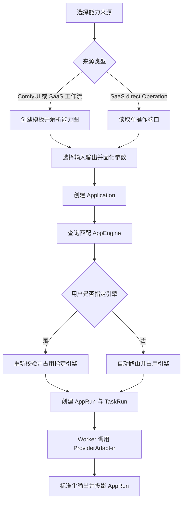
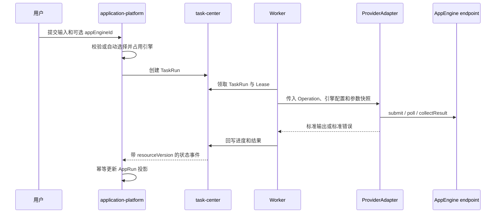

# AI 应用平台产品规格

## 文档信息

- 版本：v0.5.0-draft
- 最后更新：2026-07-10
- 作者：Codex
- domain_id：application-platform
- domain_code：AIAPP

## 0. 原型来源

本次调整不直接沉淀新的 S0 原型。本文档基于既有草稿重构第一阶段产品语义，覆盖平台适配器目录、工作流模板、应用输入输出裁剪、应用引擎、真实测试和异步运行。

后续阶段能力归档于 `00_product/domains/application-platform/plan-archive.md`，归档内容不作为当前实现、验收或发布依据。

## 1. 功能概述

应用平台把 ComfyUI 工作流和 SaaS 平台操作转换为用户可填写、可测试、可异步运行的应用。第一阶段运行链路为：

```text
ProviderAdapter / ProviderOperation 目录
  → 工作流或操作解析为统一节点端口
  → 创建 Application 并裁剪输入输出
  → 查询匹配 AppEngine
  → 用户指定或系统自动选择引擎
  → TaskRun 异步执行
  → 标准化输出投影
```

ComfyUI 与 SaaS 保留各自原生结构，只统一设计态 `CapabilityGraph`、输入端口和输出端口。SaaS 采用双路径：模型 API 和平台 AI App API 从 `ProviderOperation` 直接创建应用；ComfyUI 与 SaaS 工作流通过 `AppTemplate` 转换应用。

第一阶段不包含应用审核、上架、公共应用市场、Webhook、引擎基础设施供给、复杂成本调度或独立密钥治理。

## 2. 核心数据模型

本节只表达产品语义和逻辑字段，不等同于 OpenAPI DTO、SQL schema 或后端实现类型。

### ProviderAdapter（平台适配器）

| 字段 | 类型 | 必填 | 说明 |
| --- | --- | --- | --- |
| adapterKey | string | 是 | 系统注册的稳定适配器标识 |
| name | string | 是 | 适配器名称 |
| platformType | string | 是 | 平台类型，例如 comfyui、modelscope、runninghub、bytedance_seedance、openai |
| version | string | 是 | 适配器实现版本 |
| operationKeys | array | 是 | 当前适配器提供的操作标识 |
| enabled | boolean | 是 | 是否允许用于新建模板、应用和运行 |

ProviderAdapter 是系统受控的可执行代码注册项，不是用户可创建或上传的资源。适配器统一提供 `describeOperation`、`validatePayload`、`healthCheck`、`submit`、`poll`、`cancel`、`collectResult` 和 `normalizeError` 能力；具体支持情况由操作元数据声明。

### ProviderOperation（平台操作）

| 字段 | 类型 | 必填 | 说明 |
| --- | --- | --- | --- |
| adapterKey | string | 是 | 所属适配器 |
| operationKey | string | 是 | 适配器内稳定操作标识 |
| operationVersion | string | 是 | 操作契约版本 |
| name | string | 是 | 操作名称 |
| capabilityType | string | 是 | 能力类型，例如 image_generation、image_editing、video_generation |
| sourceMode | enum | 是 | direct 或 workflow |
| executionMode | enum | 是 | synchronous 或 asynchronous |
| inputSchema | object | 是 | 输入端口和约束定义 |
| outputSchema | object | 是 | 输出端口和约束定义 |
| progressSupported | boolean | 是 | 是否支持进度查询 |
| cancelSupported | boolean | 是 | 是否支持底层取消 |
| idempotencySupported | boolean | 是 | 是否支持向第三方传递幂等键 |

### CapabilityGraph（能力图）

| 字段 | 类型 | 必填 | 说明 |
| --- | --- | --- | --- |
| nodes | array | 是 | 能力节点列表 |
| edges | array | 是 | 节点端口间依赖关系 |
| graphVersion | string | 是 | 图结构版本 |
| unresolvedNodeCount | integer | 是 | 尚未识别端口元数据的节点数量 |

### CapabilityNode（能力节点）

| 字段 | 类型 | 必填 | 说明 |
| --- | --- | --- | --- |
| nodeKey | string | 是 | 图内稳定节点标识 |
| nodeType | string | 是 | 原始节点类型或平台操作类型 |
| name | string | 是 | 显示名称 |
| inputPorts | array | 是 | 输入端口 |
| outputPorts | array | 是 | 输出端口 |
| resolutionStatus | enum | 是 | resolved、partial、unresolved |
| rawReference | object | 否 | 指向原始工作流节点或平台操作的只读引用 |

### PortDefinition（端口定义）

| 字段 | 类型 | 必填 | 说明 |
| --- | --- | --- | --- |
| portKey | string | 是 | 节点内稳定端口标识 |
| nodeKey | string | 是 | 所属节点 |
| direction | enum | 是 | input 或 output |
| dataType | enum | 是 | text、number、boolean、enum、json、image、video、audio、file、model_ref、array |
| required | boolean | 是 | 输入是否必填；输出表示是否为成功结果必备 |
| cardinality | enum | 是 | single 或 multiple |
| mediaType | string | 否 | 媒体 MIME 类型或类型模式 |
| sourcePath | string | 是 | 原始工作流或平台响应中的路径 |
| semanticRole | string | 否 | prompt、mask、primary_output、thumbnail 等语义角色 |
| candidate | boolean | 是 | 是否为需要用户确认的候选端口 |

### AppTemplate（应用模板）

| 字段 | 类型 | 必填 | 说明 |
| --- | --- | --- | --- |
| id | string | 是 | 模板标识 |
| ownerUserId | string | 是 | 所属用户 |
| name | string | 是 | 同一用户下唯一名称 |
| description | string | 否 | 模板描述 |
| sourceKind | enum | 是 | comfyui_workflow 或 provider_workflow |
| adapterKey | string | 是 | 解析和执行该模板的适配器 |
| operationKey | string | 是 | 工作流执行操作 |
| operationVersion | string | 是 | 操作契约版本 |
| rawConfig | object | 是 | 原始工作流配置或引用 |
| capabilityGraph | CapabilityGraph | 是 | 解析后的节点和端口快照 |
| requiredNodeTypes | array | 是 | 运行所需节点类型 |
| requiredModelRefs | array | 是 | 运行所需模型引用 |
| referenceApplicationCount | integer | 是 | 引用应用数量 |
| createdAt | date-time | 是 | 创建时间 |
| updatedAt | date-time | 是 | 更新时间 |

### Application（应用）

| 字段 | 类型 | 必填 | 说明 |
| --- | --- | --- | --- |
| id | string | 是 | 应用标识 |
| ownerUserId | string | 是 | 所属用户 |
| name | string | 是 | 应用名称 |
| description | string | 否 | 应用描述 |
| sourceType | enum | 是 | template 或 provider_operation |
| templateId | string | 否 | sourceType=template 时必填 |
| adapterKey | string | 是 | 执行适配器 |
| operationKey | string | 是 | 执行操作 |
| operationVersion | string | 是 | 操作契约版本 |
| capabilityType | string | 是 | 应用能力类型 |
| inputMappings | array | 是 | 对用户开放的输入 |
| outputMappings | array | 是 | 对用户展示和持久化的输出 |
| fixedParameters | object | 是 | 固化的底层参数 |
| latestTestStatus | enum | 是 | untested、running、passed、failed |
| lastTestedAt | date-time | 否 | 最近测试完成时间 |
| latestTestFailureSummary | string | 否 | 最近测试失败摘要 |
| referenceRunCount | integer | 是 | 引用该应用的运行数量 |
| createdAt | date-time | 是 | 创建时间 |
| updatedAt | date-time | 是 | 更新时间 |

### InputMapping（输入映射）

| 字段 | 类型 | 必填 | 说明 |
| --- | --- | --- | --- |
| id | string | 是 | 映射标识 |
| applicationId | string | 是 | 所属应用 |
| inputKey | string | 是 | 应用表单字段标识，同一应用内唯一 |
| inputLabel | string | 是 | 显示名称 |
| sourcePortKey | string | 是 | 来源输入端口 |
| sourcePath | string | 是 | 底层参数路径 |
| dataType | string | 是 | 来自 PortDefinition |
| required | boolean | 是 | 是否必填 |
| defaultValue | any | 否 | 默认值 |
| sortOrder | integer | 是 | 展示顺序 |

### OutputMapping（输出映射）

| 字段 | 类型 | 必填 | 说明 |
| --- | --- | --- | --- |
| id | string | 是 | 映射标识 |
| applicationId | string | 是 | 所属应用 |
| outputKey | string | 是 | 应用输出标识，同一应用内唯一 |
| outputLabel | string | 是 | 显示名称 |
| sourcePortKey | string | 是 | 来源输出端口 |
| sourcePath | string | 是 | 底层结果路径 |
| dataType | string | 是 | 来自 PortDefinition |
| cardinality | enum | 是 | single 或 multiple |
| primary | boolean | 是 | 是否为主输出；同一应用最多一个 |
| materialization | enum | 是 | inline、reference 或 asset |
| sortOrder | integer | 是 | 展示顺序 |

### AppEngine（应用引擎）

| 字段 | 类型 | 必填 | 说明 |
| --- | --- | --- | --- |
| id | string | 是 | 引擎标识 |
| ownerUserId | string | 是 | 所属用户 |
| name | string | 是 | 引擎名称 |
| adapterKey | string | 是 | 该实例使用的适配器 |
| endpoint | string | 是 | 平台访问地址 |
| authType | enum | 是 | bearer_token、api_key、ak_sk、none |
| authConfig | object | 否 | 当前阶段按既有约定明文保存并向有权用户返回 |
| status | enum | 是 | active 或 disabled |
| healthStatus | enum | 是 | unknown、healthy、unhealthy |
| runtimeVersion | string | 否 | 平台或运行实例版本 |
| supportedOperations | array | 是 | 支持的 operationKey 与版本范围 |
| nodeTypes | array | 是 | ComfyUI 可用节点类型 |
| modelRefs | array | 是 | 可用模型引用 |
| priority | integer | 是 | 自动路由优先级，值越小越优先 |
| maxConcurrency | integer | 是 | 最大并发数 |
| currentInflight | integer | 是 | 当前占用并发数 |
| lastHealthCheckAt | date-time | 否 | 最近健康检查时间 |
| unhealthyReason | string | 否 | 不健康原因 |

### AppRun（应用运行）

| 字段 | 类型 | 必填 | 说明 |
| --- | --- | --- | --- |
| id | string | 是 | 应用运行标识 |
| ownerUserId | string | 是 | 发起用户 |
| applicationId | string | 是 | 应用引用 |
| taskRunId | string | 是 | TaskRun 引用 |
| runMode | enum | 是 | test 或 normal |
| requestedEngineId | string | 否 | 用户本次指定的引擎 |
| resolvedEngineId | string | 否 | 实际占用的引擎 |
| adapterKey | string | 是 | 执行适配器快照 |
| operationKey | string | 是 | 执行操作快照 |
| operationVersion | string | 是 | 操作版本快照 |
| inputSnapshot | object | 是 | 用户输入快照 |
| renderedPayloadSnapshot | object | 是 | 渲染后的底层参数快照 |
| outputMappingSnapshot | array | 是 | 输出映射快照 |
| taskStatusProjection | string | 是 | TaskRun 状态只读投影 |
| taskProgressProjection | object | 否 | TaskRun 进度只读投影 |
| taskResourceVersion | integer | 是 | 已投影的 TaskRun 资源版本 |
| outputValues | array | 是 | 标准化 ApplicationOutputValue 列表 |
| failureSummary | string | 否 | TaskRun 最近失败摘要投影 |
| createdAt | date-time | 是 | 创建时间 |
| updatedAt | date-time | 是 | 更新时间 |

### ApplicationOutputValue（标准输出值）

| 字段 | 类型 | 必填 | 说明 |
| --- | --- | --- | --- |
| outputKey | string | 是 | 对应 OutputMapping |
| dataType | string | 是 | 标准数据类型 |
| inlineValue | any | 否 | 小型内联结果 |
| assetId | string | 否 | 素材库引用 |
| storageUri | string | 否 | 存储引用 |
| externalUrl | string | 否 | 第三方结果引用 |
| mediaType | string | 否 | 媒体类型 |
| metadata | object | 是 | 尺寸、时长、平台摘要等非敏感元数据 |

## 3. 业务规则

### 3.1 适配器与操作目录

* **BR-AIAPP-001** ProviderAdapter 和 ProviderOperation 由系统注册并只读提供，用户不得上传或修改适配器执行代码。
* **BR-AIAPP-002** 每个 ProviderOperation 必须提供版本化输入输出 schema、能力类型和执行模式。
* **BR-AIAPP-003** Adapter 负责具体平台调用协议；AppEngine 只提供运行实例配置和状态。
* **BR-AIAPP-004** 禁用的 Adapter 或 Operation 不得用于新建模板、应用或运行，但历史快照必须保留。
* **BR-AIAPP-005** Operation 版本不兼容时不得创建运行，已有应用需要提示重新确认映射或升级操作版本。

### 3.2 模板与能力图

* **BR-AIAPP-006** AppTemplate 只支持 comfyui_workflow 和 provider_workflow；直接 SaaS 操作不得先创建全量参数模板。
* **BR-AIAPP-007** 模板创建时必须解析节点、边及输入输出端口，解析失败时不创建模板。
* **BR-AIAPP-008** ComfyUI 未知自定义节点可以保留拓扑，但端口标记为 partial 或 unresolved。
* **BR-AIAPP-009** 候选输出必须由用户确认后才能进入 OutputMapping；未解析端口不得用于应用映射。
* **BR-AIAPP-010** 模板创建阶段只进行静态解析和校验，不连接引擎执行真实运行。
* **BR-AIAPP-011** 模板内容、能力图、节点依赖和操作引用创建后不可修改，仅允许修改名称和描述。
* **BR-AIAPP-012** 模板被应用引用时禁止物理删除。

### 3.3 应用与输入输出映射

* **BR-AIAPP-013** Application 必须来自一个模板或一个 sourceMode=direct 的 ProviderOperation。
* **BR-AIAPP-014** template 来源应用继承模板的 Adapter、Operation、版本和能力依赖；provider_operation 来源应用直接继承操作定义。
* **BR-AIAPP-015** InputMapping 必须指向可用输入端口；OutputMapping 必须指向已确认输出端口。
* **BR-AIAPP-016** 同一应用内 inputKey 和 outputKey 分别唯一，且最多一个主输出。
* **BR-AIAPP-017** fixedParameters 不得同时覆盖已开放的输入路径。
* **BR-AIAPP-018** image、video、audio 和 file 等大型结果不得以内联正文写入 TaskRun 或 AppRun，只能使用 asset、storage 或 external 引用。
* **BR-AIAPP-019** 应用创建后可维护名称、描述、输入映射、输出映射和固化参数；应用不引入审核或发布状态。
* **BR-AIAPP-020** 已被 AppRun 引用的应用禁止物理删除，未被引用的应用可连同映射一起删除。

### 3.4 AppEngine 与可用引擎查询

* **BR-AIAPP-021** AppEngine 必须引用已注册 Adapter，并声明支持的 Operation、版本、节点类型、模型和并发能力。
* **BR-AIAPP-022** AppEngine 认证方式继续支持 bearer_token、api_key、ak_sk 和 none；当前阶段凭证明文保存和回显是已接受风险。
* **BR-AIAPP-023** 可用引擎查询按当前用户使用权限、active、healthy、Operation、版本、节点/模型依赖和剩余并发过滤。
* **BR-AIAPP-024** 没有匹配引擎时，可用引擎查询成功返回空列表，不返回业务错误。
* **BR-AIAPP-025** 可用引擎响应不得包含 authConfig。
* **BR-AIAPP-026** 普通用户只能使用自己有权访问的引擎；管理员的资源管理权限不自动授予使用其他用户凭证的权限。
* **BR-AIAPP-027** 可用引擎列表是即时快照，运行创建时必须重新校验并原子占用并发槽位。
* **BR-AIAPP-028** 未被 AppRun 引用的 AppEngine 可以删除；已被引用的引擎只能停用。

### 3.5 运行选择与路由

* **BR-AIAPP-029** 运行请求可以不指定 appEngineId，也可以指定可用引擎列表中的一个引擎。
* **BR-AIAPP-030** 未指定引擎时，Engine Router 按优先级、当前负载和稳定 ID 顺序自动选择候选引擎。
* **BR-AIAPP-031** 用户指定引擎视为本次运行强制选择；创建运行时该引擎已不可用则拒绝，不自动回退。
* **BR-AIAPP-032** 自动模式无可用引擎产生可重试 engine_unavailable；指定模式引擎不可用产生不可重试 selected_engine_unavailable。
* **BR-AIAPP-033** 引擎占用只属于本次 AppRun，不写回 Application；运行结束、提交前失败或取消后必须释放槽位。
* **BR-AIAPP-034** 测试运行与正式运行采用完全相同的参数渲染、引擎选择、Adapter 和输出标准化链路。
* **BR-AIAPP-035** 测试运行可能产生真实平台费用；测试结果不作为保存应用或正式运行的门禁。

### 3.6 TaskRun 与输出投影

* **BR-AIAPP-036** application-platform 创建 AppRun 后委托 task-center 创建 TaskRun；TaskRun 是执行状态唯一事实源。
* **BR-AIAPP-037** AppRun 不维护独立状态机，只按 taskRunId 和更大的 taskResourceVersion 接收状态、进度、结果和失败摘要投影。
* **BR-AIAPP-038** Worker 负责 Lease、心跳、重试和结果回写，并调用 ProviderAdapter；Worker 和 TaskRun 不解释平台请求协议。
* **BR-AIAPP-039** 异步 Adapter 提交成功后必须把 externalJobId 写入 TaskAttempt；重试前先恢复查询已有外部任务。
* **BR-AIAPP-040** 支持幂等键的平台必须使用 applicationRunId 或等价稳定键；不支持的平台必须记录重复提交风险。
* **BR-AIAPP-041** Adapter 必须把第三方结果转换为 ApplicationOutputValue，再由 OutputMapping 决定展示和素材化。

### 3.7 Seedance 2.0 与 GPT Image 2

* **BR-AIAPP-042** bytedance-seedance Adapter 提供 seedance-2.text-to-video、seedance-2.image-to-video 和 seedance-2.reference-to-video，能力类型均为 video_generation。
* **BR-AIAPP-043** Seedance 输入支持 prompt 及按操作约束使用的 image、video、audio 引用；输出主类型为 video，可包含音频、缩略图和媒体元数据。
* **BR-AIAPP-044** Seedance 按 submit、externalJobId、poll、collectResult 异步协议执行。
* **BR-AIAPP-045** openai Adapter 提供 gpt-image-2.generate 和 gpt-image-2.edit，能力类型分别为 image_generation 和 image_editing。
* **BR-AIAPP-046** GPT Image 2 输入支持文本提示和按操作约束使用的图像、mask；输出只映射为 image，不得标记为 video。

### 3.8 权限与归属

* **BR-AIAPP-047** 普通用户只能管理自己的模板、应用和引擎，并查看自己的 AppRun。
* **BR-AIAPP-048** 管理员和超级管理员可以管理全量模板、应用和引擎并查看全量 AppRun，但跨用户修改不得改变 ownerUserId。
* **BR-AIAPP-049** Adapter 和 Operation 目录对已登录用户只读；引擎认证配置只对有管理权限的用户返回。

## 4. 用户故事

### US-AIAPP-001 浏览平台能力目录

用户可以查看系统已启用的 Adapter 和 Operation，了解能力类型、输入输出端口、执行模式和版本。

### US-AIAPP-002 创建工作流模板

用户可以上传 ComfyUI 工作流或导入 SaaS 工作流。平台解析节点、边、输入输出端口及运行依赖；未知节点保留并提示需要兼容引擎补全。

### US-AIAPP-003 从模板创建应用

用户从工作流图选择开放输入和确认输出，配置固化参数后创建应用。

### US-AIAPP-004 从 SaaS 操作直接创建应用

用户从 direct ProviderOperation 选择开放参数、固化参数和输出映射后直接创建应用，不创建中间模板。

### US-AIAPP-005 维护应用输入输出

用户可以维护应用输入名称、默认值、顺序、固化参数、输出名称、主输出和素材化方式。

### US-AIAPP-006 管理应用引擎

用户可以维护自己的引擎 endpoint、认证、Adapter、能力、优先级、并发和健康状态；管理员可以管理全量资源但不自动获得凭证使用权。

### US-AIAPP-007 查询并选择匹配引擎

用户运行应用前可以查询当前可用引擎。没有匹配项时看到空列表；有匹配项时可以指定一个，也可以交由系统自动选择。

### US-AIAPP-008 测试应用

用户可以使用真实输入测试应用，选择引擎或自动路由，并查看与正式运行一致的输出和失败信息。

### US-AIAPP-009 正式运行应用

用户提交应用输入后，平台创建 AppRun 和 TaskRun。Worker 调用 Adapter，用户查看 TaskRun 状态投影和标准化输出。

### US-AIAPP-010 使用 Seedance 2.0

用户可以创建 Seedance 文生视频、图生视频或多模态参考视频应用，配置输入和视频输出，并通过异步任务查看结果。

### US-AIAPP-011 使用 GPT Image 2

用户可以创建 GPT Image 2 图像生成或编辑应用，配置提示词、参考图、可选 mask 和图像输出。

### US-AIAPP-012 管理员管理全量资源

管理员和超级管理员可以管理全量模板、应用和引擎并查看运行记录，且不得改变资源归属或越权使用他人凭证。

## 5. 角色能力矩阵

| 功能 | 普通用户 | 管理员 | 超级管理员 |
| --- | --- | --- | --- |
| 查看 Adapter/Operation | ✅ | ✅ | ✅ |
| 创建和维护自己的模板/应用 | ✅ | ✅ | ✅ |
| 管理全量模板/应用 | ❌ | ✅ | ✅ |
| 管理自己的 AppEngine | ✅ | ✅ | ✅ |
| 管理全量 AppEngine | ❌ | ✅ | ✅ |
| 查询自己可使用的匹配引擎 | ✅ | ✅ | ✅ |
| 指定可使用引擎运行 | ✅ | ✅ | ✅ |
| 自动路由运行 | ✅ | ✅ | ✅ |
| 查看自己的测试/正式运行 | ✅ | ✅ | ✅ |
| 查看全量运行 | ❌ | ✅ | ✅ |
| 上传 Adapter 执行代码 | ❌ | ❌ | ❌ |

## 6. 各端呈现策略

第一阶段在 Web Admin 提供完整能力，Mobile Web 和 Desktop Client 只读查看运行结果，不承担模板和引擎配置。

### 6.1 能力目录

按平台、能力类型和执行模式筛选 Adapter/Operation，展示版本、输入输出端口、进度和取消支持。Seedance 2.0 与 GPT Image 2 作为目录中的普通 Operation，不写死为独立页面。

### 6.2 模板与能力图

ComfyUI 展示完整节点依赖图；SaaS 工作流展示平台可提供的节点结构。输入、已确认输出、候选输出和未解析端口必须有清晰差异。未知自定义节点保留在图中，不静默丢弃。

### 6.3 应用配置

模板来源应用从图中选择输入输出；direct SaaS 应用从单操作节点选择参数。页面同时展示开放输入、固化参数、输出映射和主输出，不允许同一路径既开放又固化。

### 6.4 引擎选择与运行

运行页面先查询匹配引擎。列表为空时展示无可用引擎状态，但查询本身不是错误。用户可保持自动选择或指定列表中的引擎；提交时若指定引擎失效，提示重新选择或改为自动。

### 6.5 测试与结果

测试和正式运行使用同一表单与结果呈现，明确标识 test/normal。image、video、audio、text 和 json 按类型渲染；大型结果通过素材或引用预览。

### 6.6 核心流程

> ⚠️ 本图是对 US-AIAPP-002、US-AIAPP-003、US-AIAPP-004、US-AIAPP-007 和 US-AIAPP-009 的可视化补充；若与文字冲突，以文字为准，但二者应视为同一事实，冲突必须修正。



### 6.7 状态投影

> ⚠️ 本图是对 BR-AIAPP-036、BR-AIAPP-037 和 BR-AIAPP-039 的可视化补充；若与文字冲突，以文字为准，但二者应视为同一事实，冲突必须修正。



## 7. 验收标准

* **AC-AIAPP-001-01** 给定用户查看能力目录，系统应返回只读 Adapter/Operation 及输入输出 schema。
* **AC-AIAPP-002-01** 给定有效 ComfyUI 工作流，系统应生成节点、边和可识别端口。
* **AC-AIAPP-002-02** 给定工作流包含未知节点，系统应保留节点并标记未解析端口，不得静默删除。
* **AC-AIAPP-002-03** 给定候选输出未确认，系统应拒绝将其加入 OutputMapping。
* **AC-AIAPP-003-01** 给定工作流模板和有效输入输出选择，系统应创建 template 来源应用。
* **AC-AIAPP-004-01** 给定 direct SaaS Operation，系统应不创建模板而直接创建 provider_operation 来源应用。
* **AC-AIAPP-005-01** 给定输入路径同时开放并固化，系统应拒绝保存。
* **AC-AIAPP-005-02** 给定应用设置多个主输出，系统应拒绝保存。
* **AC-AIAPP-007-01** 给定存在匹配引擎，查询应只返回当前用户可使用、健康、兼容且有容量的引擎，并且不包含 authConfig。
* **AC-AIAPP-007-02** 给定没有匹配引擎，查询应成功返回空 items。
* **AC-AIAPP-007-03** 给定用户指定列表中的引擎且提交时仍可用，系统应占用该引擎创建运行。
* **AC-AIAPP-007-04** 给定指定引擎提交时失效，系统应拒绝运行且不自动回退。
* **AC-AIAPP-007-05** 给定用户未指定引擎，系统应按路由顺序自动选择并占用一个候选引擎。
* **AC-AIAPP-008-01** 给定应用测试请求，系统应使用与正式运行相同链路创建 runMode=test 的 AppRun 和 TaskRun。
* **AC-AIAPP-009-01** 给定 TaskRun 状态事件版本不大于 AppRun 已投影版本，系统应忽略该事件。
* **AC-AIAPP-009-02** 给定大型媒体结果，系统应只保存 assetId、storageUri 或 externalUrl。
* **AC-AIAPP-010-01** 给定 Seedance 文生视频输入，系统应提交异步任务、保存 externalJobId 并输出 video。
* **AC-AIAPP-010-02** 给定 Seedance 图生视频或参考视频输入不满足 Operation schema，系统应拒绝运行。
* **AC-AIAPP-010-03** 给定 Seedance Worker 重试且 externalJobId 存在，系统应先查询已有外部任务。
* **AC-AIAPP-011-01** 给定 GPT Image 2 generate 应用，系统应接受文本输入并输出 image 列表。
* **AC-AIAPP-011-02** 给定 GPT Image 2 edit 应用，系统应按 Operation schema 接受参考图和可选 mask。
* **AC-AIAPP-011-03** GPT Image 2 输出不得被标记为 video。
* **AC-AIAPP-012-01** 管理员跨用户管理资源时不得改变归属，也不得因管理权限使用他人凭证运行。

## 8. 非目标范围

```text
应用审核、上架与公共应用市场
Webhook 和外部结果通知
EngineClass、EngineClaim、EngineProvision
云主机创建、Worker 绑定和自动拉起 GPU 资源
复杂成本、区域、余额和配额调度
独立密钥模块、凭证加密、轮换和审计
用户上传 ProviderAdapter 执行代码
模板真实运行
```

## 9. 状态与异常

| 状态/异常 | 说明 |
| --- | --- |
| adapter_disabled | Adapter 或 Operation 已禁用 |
| operation_version_incompatible | Operation 版本与应用或引擎不兼容 |
| template_parse_failed | 模板无法解析 |
| port_unresolved | 映射端口尚未解析 |
| candidate_output_unconfirmed | 候选输出尚未确认 |
| input_mapping_invalid | 输入映射非法 |
| output_mapping_invalid | 输出映射非法 |
| fixed_parameter_conflicted | 同一路径同时开放并固化 |
| engine_unavailable | 自动模式没有可用引擎，可重试 |
| selected_engine_unavailable | 指定引擎不可用，不自动回退 |
| adapter_invocation_failed | Adapter 调用第三方平台失败 |
| external_task_recovery_failed | 已有外部任务无法恢复查询 |
| application_test_failed | 应用真实测试失败 |
| projection_version_stale | 收到过期 TaskRun 投影事件 |

## 10. 待确认问题

* 独立密钥模块进入后续阶段时，是作为新的 credential-management domain，还是 identity 的基础能力。
* 公共应用重新进入事实源时，是否沿用当前 Application，还是新增发布快照模型。
* EngineClass、EngineClaim、EngineProvision 后续是否拆分为独立基础设施领域。
