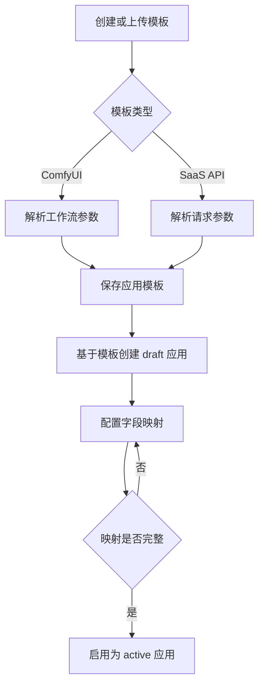
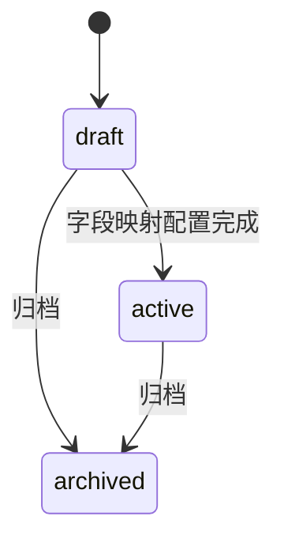
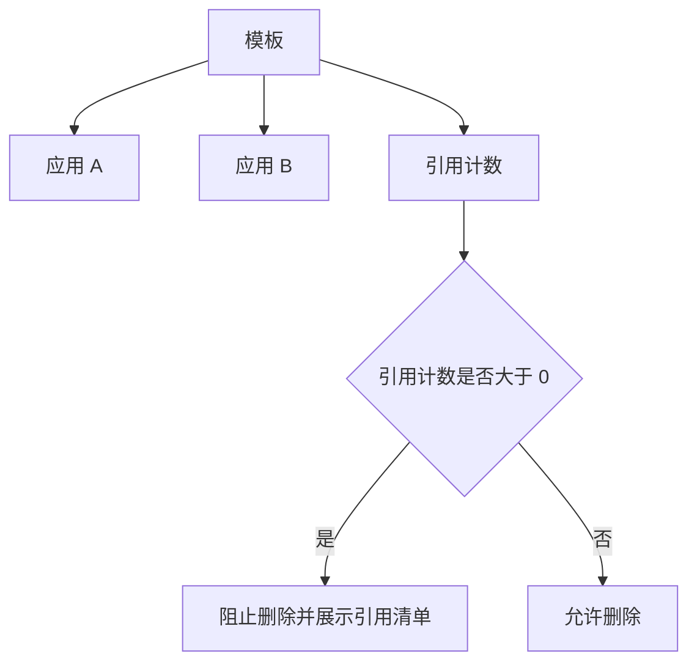

# AI 应用平台产品规格

## 文档信息

- 版本：v0.2.0-draft
- 最后更新：2026-07-06
- 作者：Codex
- domain_id：application-platform
- domain_code：AIAPP

## 0. 原型来源

本次收敛不直接沉淀新的 S0 原型。本文档基于既有 `application-platform` S1 草稿重写，将第一阶段事实源限定为模板管理、应用管理和参数映射。

已移出第一阶段的能力归档至：

```text
00_product/domains/application-platform/plan-archive.md
```

归档内容不作为第一阶段实现、验收或发布依据。

## 1. 功能概述

AI 应用平台第一阶段用于把 ComfyUI 工作流模板和 SaaS API 请求模板整理成可维护的应用配置。普通用户和系统管理员可以创建模板、维护模板元数据、基于模板创建应用、配置应用表单字段，并查看模板与应用之间的引用关系。

第一阶段的核心价值是：

```text
模板沉淀 → 参数映射 → 应用配置
```

第一阶段只回答应用如何被定义和管理，不定义应用如何被运行或交付。后续阶段能力以计划存档文件为准，不属于本阶段事实源。

## 2. 核心数据模型

本文档中的数据模型是 S1 领域模型，仅表达产品语义和逻辑字段，不等同于 OpenAPI DTO、SQL schema 或后端 ORM。

### AppTemplate（应用模板）

| 字段 | 类型 | 必填 | 说明 |
| --- | --- | --- | --- |
| id | string | 是 | 模板唯一标识 |
| ownerUserId | string | 是 | 模板所属用户 |
| name | string | 是 | 模板名称 |
| description | string | 否 | 模板描述 |
| kind | enum | 是 | 模板类型：comfyui、saas_api |
| config | object | 是 | 模板原始配置或请求配置 |
| parsedFields | array | 是 | 从模板中解析出的可映射参数 |
| referenceApplicationCount | integer | 是 | 当前引用该模板的应用数量 |
| status | enum | 是 | 模板状态：active、archived |
| createdAt | string(date-time) | 是 | 创建时间 |
| updatedAt | string(date-time) | 是 | 更新时间 |

#### config(kind=comfyui)

| 字段 | 类型 | 必填 | 说明 |
| --- | --- | --- | --- |
| raw | string | 是 | ComfyUI API 工作流 JSON 内容或引用 |

#### config(kind=saas_api)

| 字段 | 类型 | 必填 | 说明 |
| --- | --- | --- | --- |
| requestTemplate | object | 是 | SaaS API 请求模板 |
| resultExtractPath | string | 否 | 结果提取路径；第一阶段仅保存配置，不发起调用 |

### Application（应用）

| 字段 | 类型 | 必填 | 说明 |
| --- | --- | --- | --- |
| id | string | 是 | 应用唯一标识 |
| ownerUserId | string | 是 | 应用所属用户 |
| templateId | string | 是 | 关联模板 ID |
| name | string | 是 | 应用名称 |
| description | string | 否 | 应用描述 |
| kind | enum | 是 | 应用类型：comfyui、saas_api，继承自模板类型 |
| status | enum | 是 | 应用状态：draft、active、archived |
| fieldMappings | array | 是 | 应用表单字段到模板参数路径的映射 |
| createdAt | string(date-time) | 是 | 创建时间 |
| updatedAt | string(date-time) | 是 | 更新时间 |

### FieldMapping（字段映射）

| 字段 | 类型 | 必填 | 说明 |
| --- | --- | --- | --- |
| id | string | 是 | 字段映射唯一标识 |
| applicationId | string | 是 | 所属应用 |
| templateId | string | 是 | 所属模板 |
| fieldKey | string | 是 | 应用表单字段标识 |
| fieldLabel | string | 是 | 表单显示名称 |
| fieldType | string | 是 | 表单字段类型 |
| sourcePath | string | 是 | 底层模板参数路径 |
| defaultValue | any | 否 | 默认值 |
| required | boolean | 是 | 是否必填 |
| sortOrder | integer | 是 | 表单展示顺序 |

## 3. 业务规则

### 3.1 模板管理

* **BR-AIAPP-001** 模板是应用配置的来源，支持 `comfyui` 和 `saas_api` 两类。
* **BR-AIAPP-002** ComfyUI 模板保存工作流 JSON 内容或引用，并解析可映射参数。
* **BR-AIAPP-003** SaaS API 模板保存请求模板和结果提取路径，并解析可映射参数。
* **BR-AIAPP-004** 模板解析失败时，不得创建 active 模板。
* **BR-AIAPP-005** 模板被 active 或 draft 应用引用时，不允许物理删除。
* **BR-AIAPP-006** 模板可归档；归档模板不可再用于创建新应用，但不影响既有应用查看。

### 3.2 应用管理

* **BR-AIAPP-007** 应用必须基于一个模板创建，并继承模板类型。
* **BR-AIAPP-008** 应用创建时不复制底层模板原始配置，只保存模板引用和字段映射。
* **BR-AIAPP-009** 应用状态仅包括 `draft`、`active`、`archived`。
* **BR-AIAPP-010** draft 应用表示配置未完成或尚未启用。
* **BR-AIAPP-011** active 应用表示配置完成，可作为后续阶段能力的输入。
* **BR-AIAPP-012** archived 应用不可继续编辑字段映射，但可保留历史查看。

### 3.3 字段与参数映射

* **BR-AIAPP-013** 字段映射必须指向所属模板中存在的参数路径。
* **BR-AIAPP-014** 同一应用内 `fieldKey` 必须唯一。
* **BR-AIAPP-015** 字段映射需要保存显示名称、字段类型、默认值、必填标记和展示顺序。
* **BR-AIAPP-016** 修改已被应用引用的模板时，需要检查既有字段映射路径是否仍有效。
* **BR-AIAPP-017** 字段映射路径失效时，需要提示受影响应用数量和清单。

### 3.4 权限与可见性

* **BR-AIAPP-018** 普通用户只能管理自己的模板、应用和字段映射。
* **BR-AIAPP-019** 系统管理员可以查看和管理全部模板、应用和字段映射。
* **BR-AIAPP-020** 第一阶段不定义公共可见性；应用只在所属用户和系统管理员范围内可见。

## 4. 用户故事

### US-AIAPP-001 上传 ComfyUI 工作流模板

普通用户可以上传或登记 ComfyUI API 工作流 JSON。平台解析模板参数，展示可映射字段，并保存为应用模板。

### US-AIAPP-002 创建 SaaS API 模板

普通用户可以上传 OpenAPI / Swagger 描述文件，或手动填写 SaaS API 请求模板。平台解析请求结构，展示可映射字段，并保存结果提取路径配置。

### US-AIAPP-003 查看和维护模板

普通用户可以查看自己的模板列表和模板详情，修改模板名称、描述和可维护配置，并归档不再使用的模板。

### US-AIAPP-004 基于模板创建应用草稿

普通用户可以选择一个 active 模板创建 draft 应用，填写应用名称和描述，并进入字段映射配置。

### US-AIAPP-005 配置字段映射

普通用户可以选择模板参数路径，配置应用表单字段标识、显示名称、字段类型、默认值、必填标记和展示顺序。

### US-AIAPP-006 启用应用

普通用户完成必要字段映射后，可以将 draft 应用启用为 active 应用。

### US-AIAPP-007 归档应用

普通用户可以归档自己的应用。归档后应用保留查看能力，但不再允许继续编辑字段映射。

### US-AIAPP-008 查看模板引用关系

普通用户可以从模板侧查看引用该模板的应用数量和应用清单，也可以从应用侧查看底层模板。

### US-AIAPP-009 删除模板预检

普通用户删除模板前，平台检查引用关系。存在引用时阻止删除，并展示引用该模板的应用清单。

### US-AIAPP-010 修改模板兼容性预警

普通用户修改已被应用引用的模板时，平台检查字段映射路径。若路径失效，需要提示受影响应用并阻止无提示保存。

## 5. 功能适配矩阵

| 功能 | 普通用户 | 系统管理员 |
| --- | --- | --- |
| 上传 ComfyUI 模板 | ✅ | ✅ |
| 创建 SaaS API 模板 | ✅ | ✅ |
| 查看模板列表与详情 | 仅自己的 | ✅ |
| 维护模板元数据 | 仅自己的 | ✅ |
| 归档模板 | 仅自己的 | ✅ |
| 基于模板创建应用 | ✅ | ✅ |
| 配置字段映射 | 仅自己的 | ✅ |
| 启用应用 | 仅自己的 | ✅ |
| 归档应用 | 仅自己的 | ✅ |
| 查看模板引用关系 | 仅自己的 | ✅ |
| 删除模板预检 | 仅自己的 | ✅ |

## 6. 各端呈现策略

### 6.1 模板管理页面

模板管理页面面向普通用户和系统管理员。

页面需要支持：

```text
模板列表
模板类型筛选
模板名称搜索
上传 ComfyUI API 工作流 JSON
上传 OpenAPI / Swagger
手动填写 SaaS API 请求模板
展示解析出的参数字段
编辑模板名称和描述
归档模板
删除模板预检
查看引用关系
```

### 6.2 应用管理页面

应用管理页面面向普通用户和系统管理员。

页面需要支持：

```text
应用列表
应用状态筛选
应用名称搜索
基于模板创建应用草稿
编辑应用名称和描述
启用应用
归档应用
查看底层模板
```

### 6.3 字段映射配置页面

字段映射配置页面用于维护应用表单字段和底层模板参数之间的关系。

页面需要支持：

```text
模板参数列表
已映射字段列表
字段标识配置
字段显示名称配置
字段类型配置
默认值配置
必填标记配置
展示顺序配置
映射路径有效性提示
```

### 6.4 核心流程

> ⚠️ 本图是对 US-AIAPP-001、US-AIAPP-002、US-AIAPP-004、US-AIAPP-005 和 US-AIAPP-006 的可视化补充；若与文字冲突，以文字为准，但二者应视为同一事实，冲突必须修正。



### 6.5 应用状态

> ⚠️ 本图是对 BR-AIAPP-009、BR-AIAPP-010、BR-AIAPP-011 和 BR-AIAPP-012 的可视化补充；若与文字冲突，以文字为准，但二者应视为同一事实，冲突必须修正。



### 6.6 模板引用关系

> ⚠️ 本图是对 US-AIAPP-008、US-AIAPP-009 和 US-AIAPP-010 的可视化补充；若与文字冲突，以文字为准，但二者应视为同一事实，冲突必须修正。



## 7. 验收标准

* **AC-AIAPP-001-01** 给定用户上传有效 ComfyUI 工作流 JSON，当保存模板时，系统应创建 active 模板并展示解析出的可映射参数。
* **AC-AIAPP-001-02** 给定用户上传无效 ComfyUI 工作流 JSON，当保存模板时，系统应提示模板解析失败且不得创建 active 模板。
* **AC-AIAPP-002-01** 给定用户填写 SaaS API 请求模板，当保存模板时，系统应保存请求模板并展示可映射参数。
* **AC-AIAPP-004-01** 给定 active 模板存在，当用户基于模板创建应用时，系统应创建 draft 应用并关联该模板。
* **AC-AIAPP-005-01** 给定 draft 应用存在，当用户配置字段映射时，系统应校验映射路径来自所属模板。
* **AC-AIAPP-006-01** 给定 draft 应用的必需字段映射完整，当用户启用应用时，系统应将应用状态更新为 active。
* **AC-AIAPP-007-01** 给定应用已归档，当用户尝试编辑字段映射时，系统应阻止编辑并提示状态限制。
* **AC-AIAPP-009-01** 给定模板存在引用应用，当用户删除模板时，系统应阻止删除并展示引用应用清单。
* **AC-AIAPP-010-01** 给定模板修改会导致既有映射路径失效，当用户保存模板时，系统应提示受影响应用并阻止无提示保存。

## 8. 非目标范围

第一阶段不实现、不验收，也不作为 S2 契约来源的后续能力，统一归档在：

```text
00_product/domains/application-platform/plan-archive.md
```

## 9. 状态与异常

| 状态/异常 | 说明 |
| --- | --- |
| template_active | 模板可用于创建应用 |
| template_archived | 模板已归档，不可用于创建新应用 |
| template_parse_failed | 模板解析失败 |
| template_reference_blocked | 模板存在引用，禁止删除 |
| mapping_path_invalid | 字段映射路径失效 |
| app_draft | 应用为草稿状态 |
| app_active | 应用已启用 |
| app_archived | 应用已归档 |
| app_state_blocked | 应用当前状态不允许操作 |
| permission_denied | 当前用户缺少操作权限 |

## 10. 待确认问题

* 字段类型是否需要在第一阶段限定为固定枚举，还是允许用户输入自定义类型。
* SaaS API 模板的结果提取路径是否在第一阶段必填，还是仅作为后续能力预留配置。
* 模板修改导致映射路径失效时，是否允许用户确认后强制保存并保留失效映射。
