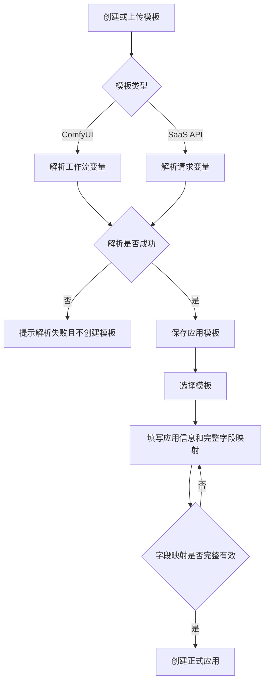
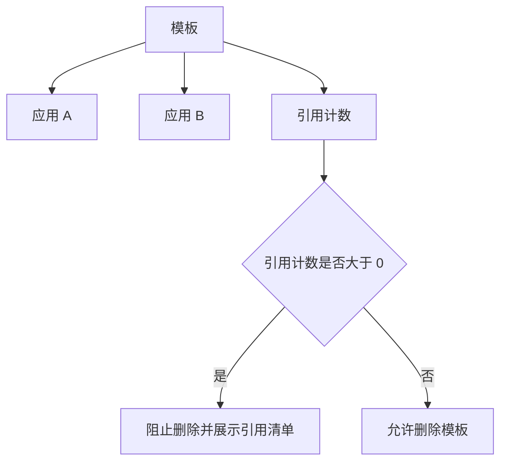
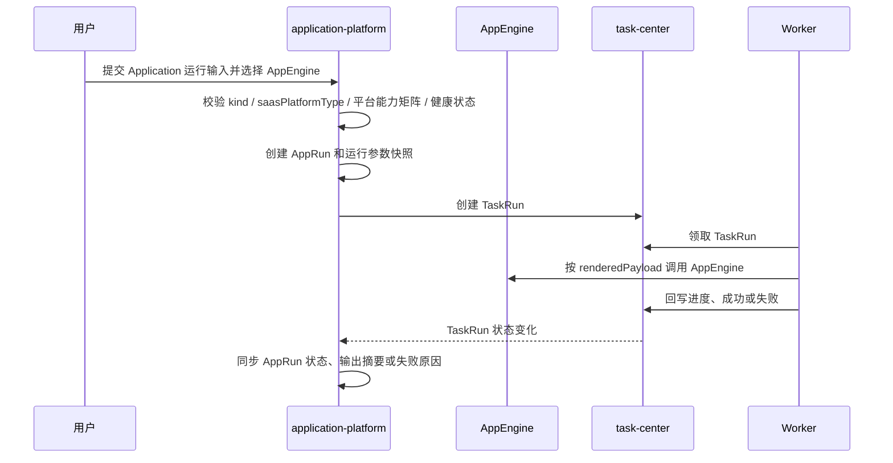

# AI 应用平台产品规格

## 文档信息

- 版本：v0.4.0-draft
- 最后更新：2026-07-09
- 作者：Codex
- domain_id：application-platform
- domain_code：AIAPP

## 0. 原型来源

本次调整不直接沉淀新的 S0 原型。本文档基于既有 `application-platform` S1 草稿继续收敛，将第一阶段事实源覆盖模板管理、应用管理、参数映射、应用引擎管理和应用运行。

已移出第一阶段的能力归档至：

```text
00_product/domains/application-platform/plan-archive.md
```

归档内容不作为第一阶段实现、验收或发布依据。

## 1. 功能概述

AI 应用平台第一阶段用于把 ComfyUI 工作流模板和 SaaS API 请求模板整理成可维护、可运行的应用配置，并允许用户维护自己运行应用所需的基础应用引擎信息。普通用户、管理员和超级管理员可以在各自权限范围内创建模板、维护模板元数据、基于模板创建正式应用、配置应用表单字段、维护自己的应用引擎、提交应用运行，并查看模板、应用、引擎和运行任务之间的关系。管理员和超级管理员还可以查看和管理普通用户的应用引擎与运行记录。

第一阶段的核心价值是：

```text
模板沉淀 → 参数映射 → 应用配置 → 引擎准备 → 应用运行任务
```

第一阶段回答应用如何被定义、管理、选择可用应用引擎并提交异步运行任务，不定义应用审核、上架、应用市场、订单或计费。应用运行通过 task-center 管理 TaskRun 生命周期，application-platform 负责应用运行语义、AppEngine 选择校验、运行参数快照、结果摘要和失败原因展示。公共应用本阶段仅作为权限范围说明，不展示业务入口，不提供公共应用创建、审核、上架、市场或下架能力。

## 2. 核心数据模型

本文档中的数据模型是 S1 领域模型，仅表达产品语义和逻辑字段，不等同于 OpenAPI DTO、SQL schema 或后端 ORM。

### AppTemplate（应用模板）

| 字段 | 类型 | 必填 | 说明 |
| --- | --- | --- | --- |
| id | string | 是 | 模板唯一标识 |
| ownerUserId | string | 是 | 模板所属用户 |
| name | string | 是 | 模板名称；同一 ownerUserId 下唯一 |
| description | string | 否 | 模板描述 |
| kind | enum | 是 | 模板类型：comfyui、saas_api |
| saasPlatformType | enum | 否 | 第三方 SaaS 平台类型；仅 kind=saas_api 时必填，例如 modelscope、custom_http |
| capabilityType | enum | 否 | 能力类型；仅 kind=saas_api 时必填，例如 image_generation、image_editing、video_generation |
| config | object | 是 | 模板原始配置或请求配置；创建后不可修改 |
| parsedFields | array | 是 | 创建模板时解析出的可映射变量；创建后不可修改 |
| referenceApplicationCount | integer | 是 | 当前引用该模板的应用数量 |
| createdAt | string(date-time) | 是 | 创建时间 |
| updatedAt | string(date-time) | 是 | 更新时间 |

#### config(kind=comfyui)

| 字段 | 类型 | 必填 | 说明 |
| --- | --- | --- | --- |
| raw | string | 是 | ComfyUI API 工作流 JSON 内容或引用 |

#### config(kind=saas_api)

| 字段 | 类型 | 必填 | 说明 |
| --- | --- | --- | --- |
| requestTemplate | object | 是 | SaaS API 请求模板；代表第三方平台某个接口参数的总和 |
| parameterSchema | object | 是 | 请求参数 schema，用于解析可映射变量和校验运行输入 |
| resultExtractPath | string | 否 | 结果提取路径；运行完成时用于从第三方响应中提取结果摘要或结果引用 |

ModelScope 生图模板是 `kind=saas_api` 的示例：`saasPlatformType=modelscope`、`capabilityType=image_generation`，模板保存 ModelScope 生图接口的参数集合。后续 z-image、klein 等具体应用可以引用同一个 ModelScope 生图模板，并通过字段映射和固化参数选择具体模型。不同平台的生图、视频、编辑接口差异由系统根据 `saasPlatformType` 和 `capabilityType` 的预置策略选择正确接口，不要求用户理解底层 API 差异。

### SaaSPlatformMetadata（SaaS 平台元数据）

| 字段 | 类型 | 必填 | 说明 |
| --- | --- | --- | --- |
| saasPlatformType | enum | 是 | SaaS 平台类型，例如 modelscope、custom_http |
| defaultEndpoint | string | 是 | 平台官方默认 endpoint；用户选择平台时自动填充 |
| allowEndpointOverride | boolean | 是 | 是否允许用户按实际部署修改 endpoint |
| capabilities | array | 是 | 系统预置的平台能力矩阵，包含支持的能力类型 |
| requiresCustomHttpConfig | boolean | 是 | 是否需要填写 customHttpConfig |

SaaS 平台元数据由系统预置并只读展示，不是用户可管理资源。平台能力矩阵用于模板创建、应用运行和 AppEngine 选择校验，不由用户自行填写或判断。

### ParsedField（模板解析变量）

| 字段 | 类型 | 必填 | 说明 |
| --- | --- | --- | --- |
| sourcePath | string | 是 | 底层模板参数路径 |
| fieldType | string | 是 | 由模板解析得到的变量类型 |
| required | boolean | 是 | 模板变量是否必填；由服务端解析后返回 |
| labelHint | string | 否 | 建议显示名称 |

### Application（应用）

| 字段 | 类型 | 必填 | 说明 |
| --- | --- | --- | --- |
| id | string | 是 | 应用唯一标识 |
| ownerUserId | string | 是 | 应用所属用户；管理员或超级管理员修改他人应用时不改变归属 |
| templateId | string | 是 | 关联模板 ID |
| name | string | 是 | 应用名称 |
| description | string | 否 | 应用描述 |
| kind | enum | 是 | 应用类型：comfyui、saas_api，继承自模板类型 |
| saasPlatformType | enum | 否 | 第三方 SaaS 平台类型；kind=saas_api 时继承自模板 |
| capabilityType | enum | 否 | 能力类型；kind=saas_api 时继承自模板 |
| fieldMappings | array | 是 | 应用表单字段到模板解析变量的映射 |
| fixedParameters | object | 否 | 应用从模板参数中固化下来的固定参数，例如固定模型标识为 z-image 或 klein |
| referenceRunCount | integer | 是 | 当前引用该应用的 AppRun 数量 |
| createdAt | string(date-time) | 是 | 创建时间 |
| updatedAt | string(date-time) | 是 | 更新时间 |

应用不维护业务状态字段。应用创建成功即为正式应用；删除后不再保留历史查看。

### FieldMapping（字段映射）

| 字段 | 类型 | 必填 | 说明 |
| --- | --- | --- | --- |
| id | string | 是 | 字段映射唯一标识 |
| applicationId | string | 是 | 所属应用 |
| templateId | string | 是 | 所属模板 |
| fieldKey | string | 是 | 应用表单字段标识 |
| fieldLabel | string | 是 | 表单显示名称 |
| fieldType | string | 是 | 字段类型，必须来自对应 ParsedField.fieldType |
| sourcePath | string | 是 | 底层模板参数路径，必须来自对应 ParsedField.sourcePath |
| defaultValue | any | 否 | 默认值 |
| required | boolean | 是 | 是否必填，来自对应 ParsedField.required，由服务端返回 |
| sortOrder | integer | 是 | 表单展示顺序 |

### AppEngine（应用引擎）

| 字段 | 类型 | 必填 | 说明 |
| --- | --- | --- | --- |
| id | string | 是 | 应用引擎唯一标识 |
| ownerUserId | string | 是 | 应用引擎所属用户 |
| name | string | 是 | 引擎名称 |
| engineType | enum | 是 | 引擎类型：comfyui、saas_api |
| saasPlatformType | enum | 否 | 第三方 SaaS 平台类型；engineType=saas_api 时必填，例如 modelscope、custom_http |
| endpoint | string | 是 | 引擎访问地址 |
| authType | enum | 是 | 认证方式：bearer_token、api_key、ak_sk、none |
| authConfig | object | 否 | 明文认证配置；前端仅做可见/不可见展示控制 |
| customHttpConfig | object | 否 | 自定义 HTTP 配置；仅 saasPlatformType=custom_http 时生效 |
| status | enum | 是 | 引擎状态：active、disabled |
| healthStatus | enum | 是 | 健康状态：unknown、healthy、unhealthy |
| referenceRunCount | integer | 是 | 当前引用该引擎的 AppRun 数量 |
| lastHealthCheckAt | string(date-time) | 否 | 最近一次健康检查时间 |
| unhealthyReason | string | 否 | 不健康原因 |
| createdAt | string(date-time) | 是 | 创建时间 |
| updatedAt | string(date-time) | 是 | 更新时间 |

### CustomHttpConfig（自定义 HTTP 配置）

| 字段 | 类型 | 必填 | 说明 |
| --- | --- | --- | --- |
| apiPath | string | 是 | 自定义 HTTP 平台的 API 路径，运行和健康检测时与 endpoint 组合使用 |
| method | string | 否 | 自定义 HTTP 调用方法；未填写时由系统默认值决定 |
| headers | object | 否 | 自定义 HTTP 附加请求头；不得保存认证凭证，认证凭证统一放在 authConfig |
| healthCheckPath | string | 否 | 自定义 HTTP 健康检测路径；未填写时使用 apiPath 或系统默认探测方式 |

### HealthCheckResult（健康检测结果）

| 字段 | 类型 | 必填 | 说明 |
| --- | --- | --- | --- |
| healthStatus | enum | 是 | 检测结果：healthy、unhealthy、unknown |
| checkedAt | string(date-time) | 是 | 检测完成时间 |
| unhealthyReason | string | 否 | 不健康原因 |
| latencyMs | integer | 否 | 检测耗时 |
| rawSummary | object | 否 | 第三方平台响应摘要；不得保存大型响应正文或敏感凭证 |

### AppRun（应用运行）

| 字段 | 类型 | 必填 | 说明 |
| --- | --- | --- | --- |
| id | string | 是 | 应用运行唯一标识 |
| ownerUserId | string | 是 | 运行发起用户 |
| applicationId | string | 是 | 被运行的应用 ID |
| appTemplateId | string | 是 | 运行时应用引用的模板 ID 快照 |
| appEngineId | string | 是 | 本次运行选择的应用引擎 ID |
| taskRunId | string | 是 | task-center 中对应的 TaskRun ID |
| kind | enum | 是 | 本次运行的应用类型，来自 Application.kind |
| saasPlatformType | enum | 否 | SaaS 平台类型；kind=saas_api 时来自 Application |
| capabilityType | enum | 否 | 能力类型；kind=saas_api 时来自 Application |
| inputSnapshot | object | 是 | 用户提交的运行输入快照 |
| renderedPayloadSnapshot | object | 是 | 根据模板、字段映射和固化参数渲染后的运行参数快照 |
| status | enum | 是 | 运行状态：pending、running、success、failed、canceled、timeout |
| outputSummary | object | 否 | 运行输出摘要或结果引用；大型文件必须使用素材或外部引用 |
| failureReason | string | 否 | 运行失败、取消或超时原因 |
| createdAt | string(date-time) | 是 | 创建时间 |
| updatedAt | string(date-time) | 是 | 更新时间 |

## 3. 业务规则

### 3.1 模板管理

* **BR-AIAPP-001** 模板是应用配置的来源，`kind` 支持 `comfyui` 和 `saas_api` 两类，原有 `kind` 不废弃、不重命名。
* **BR-AIAPP-002** ComfyUI 模板保存工作流 JSON 内容或引用，并在创建模板时解析可映射变量。
* **BR-AIAPP-003** SaaS API 模板保存第三方平台某类能力的请求参数模板、参数 schema 和结果提取路径，并在创建模板时解析可映射变量；平台 API 路径、调用方法和底层接口选择由系统预置策略负责，模板不保存操作契约。
* **BR-AIAPP-004** 模板解析失败时，不得创建模板。
* **BR-AIAPP-005** 同一用户下模板名称必须唯一，不同用户可以使用相同模板名称。
* **BR-AIAPP-006** 模板创建后，模板类型、模板内容和解析变量不可修改。
* **BR-AIAPP-007** 模板创建后仅允许修改名称和描述。
* **BR-AIAPP-008** 模板被应用引用时，不允许物理删除；由于 AppRun 会保留应用和模板历史引用，因此存在运行历史的模板也必须通过应用引用保护避免断链。
* **BR-AIAPP-009** 模板不维护生命周期状态，也不存在恢复、启用或停用模板的操作。
* **BR-AIAPP-038** 用户可以从模板列表点击模板进入模板详情。
* **BR-AIAPP-039** ComfyUI 模板详情需要基于 API JSON 渲染只读节点依赖图。
* **BR-AIAPP-040** ComfyUI 节点依赖图仅用于查看模板结构，不执行工作流、不编辑模板内容、不还原 ComfyUI 原画布坐标；API JSON 缺少坐标时使用自动布局。
* **BR-AIAPP-041** SaaS API 模板详情需要展示只读请求配置、结果提取配置和解析变量。
* **BR-AIAPP-042** 当模板 `kind=saas_api` 时，必须填写 `saasPlatformType` 和 `capabilityType`；当模板 `kind=comfyui` 时，不使用 SaaS 平台类型和 SaaS 能力类型参与运行匹配。
* **BR-AIAPP-043** AppTemplate 不保存、不暴露平台操作契约或操作标识；平台 API 路径、调用方法、取消支持、进度支持和具体底层接口选择由系统预置平台策略负责。
* **BR-AIAPP-044** ModelScope 生图模板是 SaaS API 模板示例，不代表平台只支持 ModelScope；后续其他 SaaS 平台可以使用相同 `kind=saas_api` 规则扩展。
* **BR-AIAPP-063** SaaS 平台的官方默认 endpoint 和能力矩阵由系统预置并只读提供；用户选择 SaaS 平台时自动填充默认 endpoint，但允许用户按实际部署修改 endpoint。
* **BR-AIAPP-064** 不同 SaaS 平台、不同能力类型或模板类型对应的生图、视频、编辑等底层接口差异由系统根据 `saasPlatformType` 和 `capabilityType` 选择正确调用方式，用户不需要判断平台接口差异。

### 3.2 应用管理

* **BR-AIAPP-010** 应用必须基于一个已存在模板创建，并继承模板类型。
* **BR-AIAPP-045** 当应用基于 SaaS API 模板创建时，必须继承模板的 `saasPlatformType` 和 `capabilityType`。
* **BR-AIAPP-065** 用户可以从模板详情页将模板转换成正式应用；转换时必须填写应用名称、描述、完整字段映射和可选固化参数，转换结果与通过应用创建入口基于同一模板创建应用的结果一致。
* **BR-AIAPP-046** 应用可以从模板参数中固化部分参数；固化参数与用户运行输入共同渲染为最终运行参数快照。ModelScope z-image 应用和 ModelScope klein 应用可以引用同一个 ModelScope 生图模板，但固化不同模型参数。
* **BR-AIAPP-011** 应用创建时不复制底层模板原始配置，只保存模板引用和字段映射。
* **BR-AIAPP-012** 应用创建成功即为正式应用，不存在创建后的状态流转。
* **BR-AIAPP-013** 创建应用时必须提交完整字段映射；完整字段映射指用户选择作为应用可填充字段的每一项都必须完成映射配置。
* **BR-AIAPP-014** 应用可以在创建后继续维护名称、描述和字段映射，但始终是正式应用。
* **BR-AIAPP-015** 未被 AppRun 引用的应用可以被有权用户删除；删除应用会删除应用及其字段映射，并更新模板引用关系；删除后不保留应用历史查看。
* **BR-AIAPP-061** 已被 AppRun 引用的 Application 不允许物理删除，避免 AppRun 的 `applicationId`、`appTemplateId` 和运行参数快照历史链路断开。

### 3.3 字段与参数映射

* **BR-AIAPP-016** 字段映射必须指向所属模板解析变量中存在的参数路径。
* **BR-AIAPP-017** 同一应用内 `fieldKey` 必须唯一。
* **BR-AIAPP-018** 字段映射需要保存显示名称、字段类型、默认值、必填标记和展示顺序。
* **BR-AIAPP-019** `fieldType` 必须来自模板解析变量，用户不得自定义不在解析结果中的字段类型。
* **BR-AIAPP-020** 模板内容不可修改，因此字段映射兼容性只受重新创建模板或应用重新选择映射影响；既有模板不通过修改内容产生路径失效。

### 3.4 权限与可见性

* **BR-AIAPP-021** 普通用户 `REGULAR_USER` 只能查看和管理自己的模板、应用和字段映射。
* **BR-AIAPP-022** 管理员 `ADMIN` 可以查看和管理全部用户的模板、应用和字段映射。
* **BR-AIAPP-023** 超级管理员 `SUPER_ADMIN` 可以查看和管理全部用户的模板、应用和字段映射。
* **BR-AIAPP-024** 管理员或超级管理员修改他人应用时，不改变应用的 `ownerUserId`。
* **BR-AIAPP-025** 每个用户创建的模板和应用都属于创建者自己；本阶段不支持管理员或超级管理员代其他用户创建资源。
* **BR-AIAPP-026** 普通用户只能读取和操作自己的应用；公共应用是例外的可读权限范围，但本阶段不展示公共应用业务入口。
* **BR-AIAPP-027** 公共应用本阶段仅作为权限范围说明，不提供公共应用创建、审核、上架、市场或下架能力。

### 3.5 应用引擎

* **BR-AIAPP-028** 应用引擎用于承载应用运行所需的 ComfyUI 或 SaaS API 调用能力；AppEngine 本身只管理基础信息、平台访问配置和健康状态，应用运行结果由 AppRun 保存输出摘要或结果引用。
* **BR-AIAPP-029** 普通用户、管理员和超级管理员都可以创建、查看、停用和维护自己的应用引擎。
* **BR-AIAPP-030** 管理员和超级管理员可以查看和管理普通用户的应用引擎；跨用户维护时不得改变应用引擎的 `ownerUserId`。
* **BR-AIAPP-031** 应用引擎认证方式支持 `bearer_token`、`api_key`、`ak_sk` 和 `none`；需要凭证的认证方式必须保存明文凭证。
* **BR-AIAPP-032** 应用引擎凭证明文可以返回给有权用户；前端默认隐藏敏感字段，并提供可见/不可见切换。
* **BR-AIAPP-033** task-center 负责定期创建应用引擎健康检测任务，监听范围只包含未停用的应用引擎。
* **BR-AIAPP-034** 应用引擎健康检测需要连接应用引擎对应平台；当应用引擎配置了明文凭证时，健康检测必须携带对应凭证；非 `custom_http` SaaS 平台的健康检测方式由后端按平台预置策略实现，用户不填写健康检测配置。
* **BR-AIAPP-035** 应用引擎需要展示健康状态；健康检查失败时必须保留不健康原因，且不健康或已停用引擎不得被标记为可用。
* **BR-AIAPP-036** Application 与 AppEngine 独立管理；创建或更新 Application 时不指定应用引擎，也不保存 Application 与 AppEngine 的绑定关系。
* **BR-AIAPP-037** 运行 Application 时，必须选择当前用户可访问、未停用、健康且 `engineType` 与 Application `kind` 相同的应用引擎。
* **BR-AIAPP-047** 当 Application.kind 为 `saas_api` 时，运行所选 AppEngine 必须具有相同 `saasPlatformType`，并且该 SaaS 平台预置能力矩阵必须支持 Application 的 `capabilityType`。
* **BR-AIAPP-048** 当 AppEngine.engineType 为 `saas_api` 时，必须填写 `saasPlatformType`；当 engineType 为 `comfyui` 时，不使用 SaaS 平台类型参与运行匹配。
* **BR-AIAPP-049** AppEngine 健康状态为 `unknown`、`unhealthy` 或状态为 `disabled` 时，不得用于创建新的 Application 运行。
* **BR-AIAPP-055** 未被 AppRun 引用的 AppEngine 可以被有权用户删除；删除后不再出现在 AppEngine 列表和运行选择中。
* **BR-AIAPP-056** 已被 AppRun 引用的 AppEngine 不允许物理删除，只能停用；系统必须保留 AppRun 与 AppEngine 的历史引用关系用于排查。
* **BR-AIAPP-057** 已保存 AppEngine 健康检测通过 `appEngineId` 定位引擎，读取已保存的访问地址、认证方式、明文认证配置和 `customHttpConfig`，并在检测后写回健康状态、最近检测时间和不健康原因。
* **BR-AIAPP-058** 临时 AppEngine 健康检测用于创建或编辑引擎前验证连接参数，必须直接提交 `engineType`、`endpoint`、`authType` 和认证方式所需的 `authConfig`；该检测只返回 HealthCheckResult，不创建 AppEngine，不保存 endpoint、authConfig 或 customHttpConfig，也不写回任何已保存 AppEngine。
* **BR-AIAPP-059** 当临时健康检测的 `saasPlatformType=custom_http` 时，必须提交包含 `apiPath` 的 `customHttpConfig`；非 `custom_http` SaaS 平台不得提交用户自定义健康检测配置。缺少必需连接参数、认证配置不匹配或自定义 HTTP 配置非法时必须拒绝检测。
* **BR-AIAPP-060** 只有已保存 AppEngine 的健康状态变化才产生 `app_engine_health_changed` 事件；临时健康检测不产生健康状态变更事件。

### 3.6 应用运行

* **BR-AIAPP-050** Application 运行由 application-platform 创建 AppRun，并委托 task-center 创建 TaskRun；task-center 负责 TaskRun 生命周期，application-platform 负责 AppRun 语义和结果展示。
* **BR-AIAPP-051** 创建 AppRun 时必须保存用户输入快照和渲染后的运行参数快照；运行开始后，不得因 Application、AppTemplate 或 AppEngine 后续修改而改变既有 AppRun 快照。
* **BR-AIAPP-052** TaskRun.input 必须包含 application_id、application_run_id、app_template_id、app_engine_id、kind、saas_platform_type、capability_type 和 rendered_payload 等小型结构化上下文；大型图片、视频、音频结果不得直接写入 TaskRun 或 AppRun。
* **BR-AIAPP-053** TaskRun 状态变化后，application-platform 需要将 AppRun 状态同步为 pending、running、success、failed、canceled 或 timeout，并保留输出摘要或失败原因。
* **BR-AIAPP-054** 普通用户只能运行自己可访问的 Application，并只能查看自己的 AppRun；管理员和超级管理员可以查看全量 AppRun，但不得改变运行发起用户归属。
* **BR-AIAPP-062** 第一阶段 application-platform 不提供 AppRun 取消或重试入口；如需取消或重试运行，应通过 task-center 既有 TaskRun 能力表达，并由 AppRun 状态同步展示最终结果。

## 4. 用户故事

### US-AIAPP-001 上传 ComfyUI 工作流模板

普通用户可以上传或登记 ComfyUI API 工作流 JSON。平台创建模板前解析模板变量；解析成功时保存为应用模板，解析失败时提示失败并不创建模板。

### US-AIAPP-002 创建 SaaS API 模板

普通用户可以上传 OpenAPI / Swagger 描述文件，或手动填写 SaaS API 请求模板。平台创建模板前解析请求结构；解析成功时保存模板和结果提取路径配置，解析失败时提示失败并不创建模板。

### US-AIAPP-003 查看和维护模板

普通用户可以查看自己的模板列表，点击模板进入模板详情，并修改模板名称和描述。模板类型、模板内容和解析变量创建后不可修改。

ComfyUI 模板详情展示基于 API JSON 渲染的只读节点依赖图。节点图只用于查看模板结构，不执行工作流、不编辑模板内容、不还原 ComfyUI 原画布坐标；当 API JSON 缺少坐标时，页面使用自动布局展示节点依赖关系。

SaaS API 模板详情展示只读请求配置、结果提取配置和解析变量。

`kind=saas_api` 的模板详情还需要展示第三方平台类型、能力类型和系统预置平台能力信息。ModelScope 生图模板可以作为平台化 SaaS API 模板示例，但页面不得将 ModelScope 写死为唯一平台。

### US-AIAPP-004 创建正式应用

普通用户可以从模板详情页将模板转换成应用，也可以在应用创建入口选择一个模板，填写应用名称、描述、完整字段映射和可选固化参数，创建正式应用。完整字段映射指用户选择作为应用可填充字段的每一项都完成映射配置。创建成功后应用即存在，无需额外状态切换。

### US-AIAPP-005 维护字段映射

普通用户可以在自己的应用中维护字段映射。字段映射只能选择模板解析变量中的路径和字段类型，同一应用内字段标识必须唯一。

### US-AIAPP-006 删除应用

普通用户可以删除自己未被 AppRun 引用的应用。删除应用会同时删除字段映射并减少模板引用关系；删除后不保留应用历史查看。若应用已存在 AppRun，系统阻止物理删除，并提示该应用存在运行历史。

### US-AIAPP-007 查看模板引用关系

普通用户可以从模板侧查看引用该模板的应用数量和应用清单，也可以从应用侧查看底层模板。

### US-AIAPP-008 删除模板预检

普通用户删除模板前，平台检查引用关系。存在引用时阻止删除，并展示引用该模板的应用清单。

### US-AIAPP-009 管理员查看和维护全量资源

管理员和超级管理员可以查看和维护全部用户的模板、应用和字段映射。普通用户只能读取和操作自己的应用，公共应用是例外的可读权限范围，但本阶段不展示公共应用业务入口。每个用户创建的资源属于创建者自己；管理员或超级管理员修改他人应用时，不改变应用归属。

### US-AIAPP-010 管理应用引擎

普通用户、管理员和超级管理员可以查看自己的应用引擎列表、创建应用引擎、维护引擎名称、类型、平台类型、访问地址、认证方式、明文认证配置和自定义 HTTP 配置，停用不再可用的引擎，并删除未被 AppRun 引用的引擎。管理员和超级管理员还可以查看和管理普通用户的应用引擎。

### US-AIAPP-011 查看应用引擎健康状态

用户可以查看自己应用引擎的健康状态、最近健康检查时间和不健康原因。管理员和超级管理员可以查看全部用户应用引擎的健康状态。task-center 定期触发未停用应用引擎的健康检测任务，检测时由 application-platform 连接对应平台并携带明文凭证；非 `custom_http` SaaS 平台使用后端预置健康检测方式。

用户也可以在创建或编辑 AppEngine 前直接提交 endpoint、认证方式和认证配置执行临时连接检测；`custom_http` 平台还需要提交包含 `apiPath` 的自定义 HTTP 配置。临时检测只返回检测结果，不保存凭证、不创建 AppEngine，也不改变任何已保存 AppEngine 的健康状态。

### US-AIAPP-012 创建 SaaS API 平台化模板和应用

普通用户可以创建 `kind=saas_api` 的模板，并选择第三方平台类型和能力类型。系统基于预置 SaaS 平台元数据提供官方默认 endpoint 和平台能力矩阵；平台创建模板前解析第三方接口参数，保存完整请求模板、参数 schema 和结果提取规则。用户可以基于该模板创建具体应用，并固化部分参数。例如，用户基于 ModelScope 生图模板分别创建 z-image 应用和 klein 应用。

### US-AIAPP-013 运行 Application

普通用户可以选择自己的 Application，填写运行输入，并选择一个可访问、未停用、健康且类型匹配的 AppEngine 后提交运行。系统创建 AppRun，渲染运行参数快照，并通过 task-center 创建 TaskRun。用户可以查看 AppRun 状态、输出摘要和失败原因。管理员和超级管理员可以查看全量 AppRun。

## 5. 角色能力矩阵

| 功能 | 普通用户 REGULAR_USER | 管理员 ADMIN | 超级管理员 SUPER_ADMIN |
| --- | --- | --- | --- |
| 创建 ComfyUI 模板 | ✅ 仅自己的 | ✅ | ✅ |
| 创建 SaaS API 模板 | ✅ 仅自己的 | ✅ | ✅ |
| 查看模板列表与详情 | ✅ 仅自己的 | ✅ 全部用户 | ✅ 全部用户 |
| 修改模板名称和描述 | ✅ 仅自己的 | ✅ 全部用户 | ✅ 全部用户 |
| 修改模板内容和解析变量 | ❌ | ❌ | ❌ |
| 删除模板预检和删除无引用模板 | ✅ 仅自己的 | ✅ 全部用户 | ✅ 全部用户 |
| 创建正式应用 | ✅ 归属自己 | ✅ 归属自己 | ✅ 归属自己 |
| 查看应用列表与详情 | ✅ 自己的应用；公共应用为可读权限范围但本阶段无入口 | ✅ 全部用户；公共应用为可读权限范围但本阶段无入口 | ✅ 全部用户；公共应用为可读权限范围但本阶段无入口 |
| 修改应用名称、描述和字段映射 | ✅ 仅自己的 | ✅ 全部用户且不改变归属 | ✅ 全部用户且不改变归属 |
| 删除应用 | ✅ 仅自己的 | ✅ 全部用户 | ✅ 全部用户 |
| 查看模板引用关系 | ✅ 仅自己的 | ✅ 全部用户 | ✅ 全部用户 |
| 查看应用引擎 | ✅ 仅自己的 | ✅ 全部用户 | ✅ 全部用户 |
| 创建和维护应用引擎 | ✅ 仅自己的 | ✅ 全部用户且不改变归属 | ✅ 全部用户且不改变归属 |
| 删除未被运行引用的应用引擎 | ✅ 仅自己的 | ✅ 全部用户 | ✅ 全部用户 |
| 查看应用引擎健康状态 | ✅ 仅自己的 | ✅ 全部用户 | ✅ 全部用户 |
| 运行应用 | ✅ 仅自己可访问的应用和引擎 | ✅ 仅自己可访问的应用和引擎 | ✅ 仅自己可访问的应用和引擎 |
| 查看应用运行记录 | ✅ 仅自己的 | ✅ 全部用户 | ✅ 全部用户 |

## 6. 各端呈现策略

### 6.1 模板管理页面

模板管理页面面向普通用户、管理员和超级管理员。

页面需要支持：

```text
模板列表
模板类型筛选
模板名称搜索
点击模板进入模板详情
上传 ComfyUI API 工作流 JSON
上传 OpenAPI / Swagger
手动填写 SaaS API 请求模板
展示解析出的变量
ComfyUI 模板详情只读节点依赖图
SaaS API 模板详情只读配置与解析变量
SaaS API 平台类型、能力类型和系统预置平台能力信息
系统预置的 SaaS 平台默认 endpoint 和能力矩阵
从模板详情页转换成应用
编辑模板名称和描述
删除模板预检
查看引用关系
```

模板详情需要明确展示：模板内容和解析变量创建后不可修改。

ComfyUI 模板详情的节点依赖图只表达 API JSON 中的节点和依赖结构。该图不提供执行、编辑模板内容或还原 ComfyUI 原画布坐标能力；当 API JSON 缺少节点坐标时，使用自动布局。

### 6.2 应用管理页面

应用管理页面面向普通用户、管理员和超级管理员。

页面需要支持：

```text
应用列表
应用名称搜索
基于模板创建正式应用
创建应用时配置完整字段映射
编辑应用名称和描述
维护字段映射
删除应用
查看底层模板
运行应用
查看运行记录入口
```

管理员和超级管理员查看全量资源时，需要保留并展示原始 `ownerUserId` 或等价归属信息。

### 6.3 字段映射配置页面

字段映射配置页面用于维护应用表单字段和底层模板解析变量之间的关系。

页面需要支持：

```text
模板解析变量列表
已映射字段列表
字段标识配置
字段显示名称配置
字段类型只读展示
默认值配置
必填标记只读展示
展示顺序配置
映射路径有效性提示
```

### 6.4 应用引擎管理页面

应用引擎管理页面面向普通用户、管理员和超级管理员。

页面需要支持：

```text
应用引擎列表
引擎类型筛选
引擎健康状态筛选
创建应用引擎
选择 SaaS 平台并自动填充官方默认 endpoint
编辑引擎名称、访问地址、认证方式、明文认证配置和自定义 HTTP 配置
凭证明文可见/不可见切换
停用应用引擎
删除未被 AppRun 引用的应用引擎
查看最近健康检查时间和不健康原因
查看 SaaS 平台类型和系统预置能力矩阵
使用已保存 AppEngine 触发健康检测
使用临时 endpoint 和认证配置触发连接检测
```

普通用户只能维护自己的应用引擎。管理员和超级管理员查看全量应用引擎时，需要保留并展示原始 `ownerUserId` 或等价归属信息。

### 6.5 应用运行页面

应用运行页面面向普通用户、管理员和超级管理员。

页面需要支持：

```text
选择 Application
展示 Application 继承的模板类型、SaaS 平台类型和能力类型
填写运行输入
选择匹配的 AppEngine
展示 AppEngine 健康状态和不可用原因
提交运行
查看 AppRun 状态、TaskRun 关联、输出摘要和失败原因
```

当 Application.kind 为 `saas_api` 时，AppEngine 选择列表只展示同 `engineType=saas_api`、同 `saasPlatformType`、平台预置能力矩阵支持对应 `capabilityType` 且健康可用的引擎。不可用引擎可以展示为只读提示，但不得用于提交运行。

### 6.6 核心流程

> ⚠️ 本图是对 US-AIAPP-001、US-AIAPP-002 和 US-AIAPP-004 的可视化补充；若与文字冲突，以文字为准，但二者应视为同一事实，冲突必须修正。



### 6.7 模板引用关系

> ⚠️ 本图是对 US-AIAPP-007 和 US-AIAPP-008 的可视化补充；若与文字冲突，以文字为准，但二者应视为同一事实，冲突必须修正。



### 6.8 应用运行链路

> ⚠️ 本图是对 US-AIAPP-013 的可视化补充；若与文字冲突，以文字为准，但二者应视为同一事实，冲突必须修正。



## 7. 验收标准

* **AC-AIAPP-001-01** 给定用户上传有效 ComfyUI 工作流 JSON，当保存模板时，系统应创建模板并展示解析出的变量。
* **AC-AIAPP-001-02** 给定用户上传无效 ComfyUI 工作流 JSON，当保存模板时，系统应提示模板解析失败且不创建模板。
* **AC-AIAPP-002-01** 给定用户填写有效 SaaS API 请求模板，当保存模板时，系统应保存模板并展示解析出的变量。
* **AC-AIAPP-002-02** 给定用户填写无法解析的 SaaS API 请求模板，当保存模板时，系统应提示模板解析失败且不创建模板。
* **AC-AIAPP-003-01** 给定模板已创建，当用户修改模板名称或描述时，系统应保存修改。
* **AC-AIAPP-003-02** 给定模板已创建，当用户尝试修改模板类型、模板内容或解析变量时，系统应拒绝并提示模板内容不可修改。
* **AC-AIAPP-003-03** 给定同一用户下已存在同名模板，当用户再次创建或改名为相同名称时，系统应拒绝并提示模板名重复。
* **AC-AIAPP-003-04** 给定模板列表存在模板，当用户点击模板时，系统应进入模板详情并展示模板基础信息和解析变量。
* **AC-AIAPP-003-05** 给定 ComfyUI 模板包含 API JSON，当用户查看模板详情时，系统应展示只读节点依赖图，且不提供执行工作流或编辑模板内容的入口。
* **AC-AIAPP-003-06** 给定 ComfyUI API JSON 缺少节点坐标，当用户查看节点依赖图时，系统应使用自动布局展示节点依赖关系。
* **AC-AIAPP-003-07** 给定 SaaS API 模板已创建，当用户查看模板详情时，系统应展示只读请求配置、结果提取配置和解析变量。
* **AC-AIAPP-004-01** 给定模板存在，当用户提交应用名称、描述和用户已选择可填字段的完整映射时，系统应创建正式应用并关联该模板。
* **AC-AIAPP-004-02** 给定应用创建请求中用户已选择可填字段缺少映射配置，当用户创建应用时，系统应拒绝并提示字段映射不完整。
* **AC-AIAPP-004-03** 给定应用创建请求中的字段类型不来自模板解析变量，当用户创建应用时，系统应拒绝并提示字段类型非法。
* **AC-AIAPP-004-04** 给定用户在模板详情页选择转换成应用，当用户提交应用名称、描述、完整字段映射和可选固化参数时，系统应创建与该模板关联的正式应用。
* **AC-AIAPP-005-01** 给定应用存在，当用户维护字段映射时，系统应校验映射路径和字段类型来自所属模板解析变量。
* **AC-AIAPP-006-01** 给定普通用户删除自己的应用，当删除成功时，系统应删除应用和字段映射，并更新模板引用关系。
* **AC-AIAPP-006-02** 给定管理员或超级管理员删除任意用户应用，当删除成功时，系统应删除应用和字段映射，并更新模板引用关系。
* **AC-AIAPP-006-03** 给定普通用户尝试删除他人非公共应用，当执行删除时，系统应拒绝并提示权限不足。
* **AC-AIAPP-006-04** 给定应用已被 AppRun 引用，当有权用户删除该应用时，系统应拒绝删除并提示该应用存在运行引用。
* **AC-AIAPP-006-05** 给定应用未被任何 AppRun 引用，当有权用户删除该应用时，系统应删除成功，并且该应用不再出现在应用列表和运行入口中。
* **AC-AIAPP-007-01** 给定模板存在引用应用，当用户查看模板引用关系时，系统应展示引用应用数量和应用清单。
* **AC-AIAPP-008-01** 给定模板存在引用应用，当用户删除模板时，系统应阻止删除并展示引用应用清单。
* **AC-AIAPP-009-01** 给定管理员或超级管理员查看应用列表，系统应展示全部用户应用；公共应用仅作为权限范围说明，不展示业务入口。
* **AC-AIAPP-009-02** 给定管理员或超级管理员修改他人应用，当保存成功时，应用归属不应改变。
* **AC-AIAPP-009-03** 给定管理员或超级管理员创建模板或应用，当创建成功时，资源归属应为创建者自己。
* **AC-AIAPP-010-01** 给定普通用户创建自己的应用引擎，当提交名称、类型、访问地址、认证方式和明文认证配置时，系统应创建应用引擎并展示在自己的引擎列表。
* **AC-AIAPP-010-02** 给定管理员或超级管理员查看应用引擎列表，系统应展示全部用户应用引擎并保留归属信息。
* **AC-AIAPP-010-03** 给定有权用户查看或编辑应用引擎凭证，当切换凭证可见状态时，前端应显示或隐藏明文凭证，但不改变后端保存的明文事实。
* **AC-AIAPP-010-04** 给定 AppEngine 未被任何 AppRun 引用，当有权用户删除该引擎时，系统应删除成功，并且该引擎不再出现在引擎列表和运行选择中。
* **AC-AIAPP-010-05** 给定 AppEngine 已被 AppRun 引用，当有权用户删除该引擎时，系统应拒绝删除并提示该引擎存在运行引用，可改为停用。
* **AC-AIAPP-011-01** 给定未停用应用引擎健康检查失败，当用户查看引擎详情时，系统应展示 unhealthy 状态、最近检查时间和不健康原因。
* **AC-AIAPP-011-02** 给定应用引擎为 unhealthy 或 disabled，当用户查看引擎列表或详情时，系统应明确展示其不可用状态。
* **AC-AIAPP-011-03** 给定 task-center 定期触发应用引擎健康检测任务，当应用引擎配置了明文凭证时，application-platform 应携带对应凭证连接平台并写回健康状态。
* **AC-AIAPP-011-04** 给定有权用户使用 `appEngineId` 触发已保存 AppEngine 健康检测，当检测完成时，系统应写回该引擎的健康状态、最近检测时间和不健康原因。
* **AC-AIAPP-011-05** 给定用户直接提交 endpoint、认证方式和认证配置执行临时健康检测，当检测完成时，系统应返回健康检测结果，但不得创建 AppEngine、保存凭证或改变任何已保存 AppEngine 的健康状态。
* **AC-AIAPP-011-06** 给定临时健康检测缺少 endpoint，或认证配置缺失、与 authType 不匹配，当用户提交检测时，系统应拒绝检测并提示认证配置非法或连接参数非法。
* **AC-AIAPP-011-07** 给定用户为 `custom_http` 平台执行临时健康检测，当未提交包含 `apiPath` 的自定义 HTTP 配置时，系统应拒绝检测并提示自定义 HTTP 配置非法。
* **AC-AIAPP-011-08** 给定用户为非 `custom_http` SaaS 平台执行健康检测，当用户提交自定义健康检测配置时，系统应忽略或拒绝该配置，并按平台预置健康检测方式执行。
* **AC-AIAPP-012-01** 给定用户创建 `kind=saas_api` 模板，当未填写第三方平台类型或能力类型时，系统应拒绝创建并提示 SaaS 平台配置不完整。
* **AC-AIAPP-012-02** 给定 ModelScope 生图模板创建成功，当用户基于该模板创建 z-image 应用和 klein 应用时，两个应用应继承同一 SaaS 平台类型和能力类型，并可以保存不同固化参数。
* **AC-AIAPP-012-03** 给定用户选择 SaaS 平台创建模板或 AppEngine，当平台存在官方默认 endpoint 时，系统应自动填充 endpoint，且允许用户按实际部署修改。
* **AC-AIAPP-012-04** 给定用户选择 SaaS 平台和能力类型，当平台预置能力矩阵不支持该能力时，系统应拒绝创建模板并提示平台能力不支持。
* **AC-AIAPP-013-01** 给定 Application.kind 与所选 AppEngine.engineType 不一致，当用户提交运行时，系统应拒绝并提示应用引擎类型不匹配。
* **AC-AIAPP-013-02** 给定 SaaS Application 的 `saasPlatformType` 与所选 SaaS AppEngine 不一致，当用户提交运行时，系统应拒绝并提示 SaaS 平台不匹配。
* **AC-AIAPP-013-03** 给定 SaaS 平台预置能力矩阵不支持 Application 的 `capabilityType`，当用户提交运行时，系统应拒绝并提示平台能力不支持。
* **AC-AIAPP-013-04** 给定 AppEngine 为 disabled、unknown 或 unhealthy，当用户提交运行时，系统应拒绝并提示引擎不可用。
* **AC-AIAPP-013-05** 给定用户选择匹配且健康的 AppEngine，当用户提交运行时，系统应创建 AppRun、保存运行参数快照，并通过 task-center 创建 TaskRun。
* **AC-AIAPP-013-06** 给定 TaskRun 状态变化，当用户查看 AppRun 时，系统应展示同步后的运行状态、输出摘要或失败原因。

## 8. 非目标范围

第一阶段不实现、不验收，也不作为 S2 契约来源的后续能力，统一归档在：

```text
00_product/domains/application-platform/plan-archive.md
```

本阶段不提供：

```text
应用生命周期切换流程
应用审核
应用上架
公共应用创建或运营
应用市场
订单、Webhook、外部结果回调
模板外的 SaaS API 凭证托管与调度
应用市场中的公共运行入口
application-platform 内的 AppRun 取消和重试入口
```

## 9. 状态与异常

| 状态/异常 | 说明 |
| --- | --- |
| template_parse_failed | 模板解析失败，不能创建模板 |
| template_name_duplicated | 同一用户下模板名称重复 |
| template_content_immutable | 模板类型、内容或解析变量创建后不可修改 |
| template_reference_blocked | 模板存在引用，禁止删除 |
| mapping_path_invalid | 字段映射路径不在模板解析变量中 |
| field_type_invalid | 字段类型不来自模板解析变量 |
| field_mapping_incomplete | 创建应用或维护映射时缺少必需变量映射 |
| permission_denied | 当前用户缺少操作权限 |
| engine_unhealthy | 应用引擎健康检查失败或不可用 |
| engine_auth_config_invalid | 应用引擎认证配置不完整或与认证方式不匹配 |
| engine_type_mismatched | 应用运行时选择的应用引擎类型与应用类型不一致 |
| application_reference_blocked | 应用存在 AppRun 引用，禁止物理删除 |
| app_engine_reference_blocked | 应用引擎存在 AppRun 引用，禁止物理删除 |
| custom_http_config_invalid | 自定义 HTTP 配置缺失或非法 |
| saas_platform_metadata_unsupported | SaaS 平台元数据不存在或不支持所选能力 |
| saas_platform_mismatched | SaaS Application 与 AppEngine 的第三方平台类型不一致 |
| app_engine_capability_unsupported | SaaS 平台预置能力矩阵不支持 Application 所需能力 |
| application_run_create_failed | AppRun 或对应 TaskRun 创建失败 |
| application_run_not_visible | 应用运行不存在或当前用户不可见 |

## 10. 待确认问题

* 公共应用重新进入正式事实源时，是否沿用当前应用模型，还是单独建立公共应用发布模型。
* EngineClass、EngineClaim、EngineProvision 后续进入 S1/S2 时，是否拆分为独立基础设施领域，还是继续归属 application-platform。
