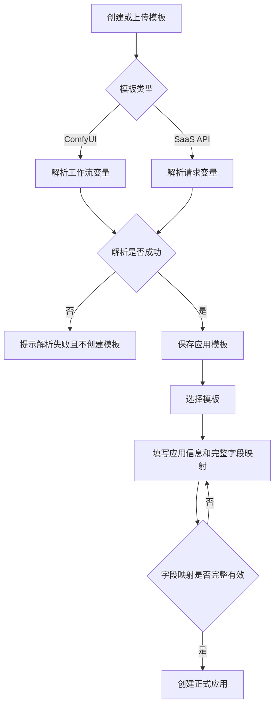
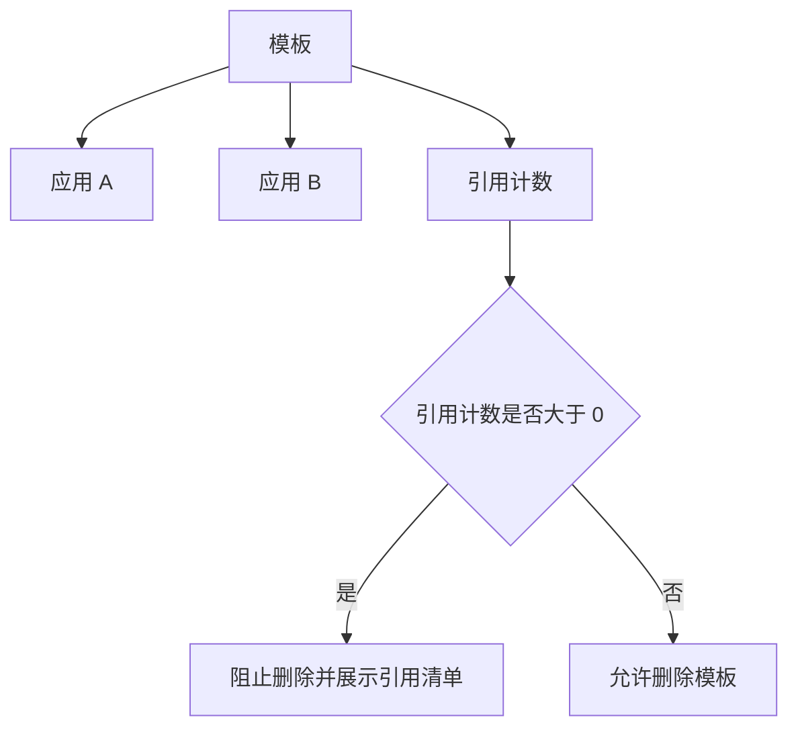

# AI 应用平台产品规格

## 文档信息

- 版本：v0.3.0-draft
- 最后更新：2026-07-08
- 作者：Codex
- domain_id：application-platform
- domain_code：AIAPP

## 0. 原型来源

本次调整不直接沉淀新的 S0 原型。本文档基于既有 `application-platform` S1 草稿继续收敛，将第一阶段事实源覆盖模板管理、应用管理、参数映射和应用引擎管理。

已移出第一阶段的能力归档至：

```text
00_product/domains/application-platform/plan-archive.md
```

归档内容不作为第一阶段实现、验收或发布依据。

## 1. 功能概述

AI 应用平台第一阶段用于把 ComfyUI 工作流模板和 SaaS API 请求模板整理成可维护的应用配置，并允许用户维护自己运行应用所需的基础应用引擎信息。普通用户、管理员和超级管理员可以在各自权限范围内创建模板、维护模板元数据、基于模板创建正式应用、配置应用表单字段、维护自己的应用引擎，并查看模板与应用之间的引用关系。管理员和超级管理员还可以查看和管理普通用户的应用引擎。

第一阶段的核心价值是：

```text
模板沉淀 → 参数映射 → 应用配置 → 引擎准备
```

第一阶段回答应用如何被定义、管理以及如何维护可用应用引擎，不定义最终应用执行结果、交付、审核、上架或进入应用市场。公共应用本阶段仅作为权限范围说明，不展示业务入口，不提供公共应用创建、审核、上架、市场或下架能力。

## 2. 核心数据模型

本文档中的数据模型是 S1 领域模型，仅表达产品语义和逻辑字段，不等同于 OpenAPI DTO、SQL schema 或后端 ORM。

### AppTemplate（应用模板）

| 字段 | 类型 | 必填 | 说明 |
| --- | --- | --- | --- |
| id | string | 是 | 模板唯一标识 |
| ownerUserId | string | 是 | 模板所属用户 |
| name | string | 是 | 模板名称；同一 ownerUserId 下唯一 |
| description | string | 否 | 模板描述 |
| kind | enum | 是 | 模板类型：comfyui、saas_api |
| config | object | 是 | 模板原始配置或请求配置；创建后不可修改 |
| parsedFields | array | 是 | 创建模板时解析出的可映射变量；创建后不可修改 |
| referenceApplicationCount | integer | 是 | 当前引用该模板的应用数量 |
| createdAt | string(date-time) | 是 | 创建时间 |
| updatedAt | string(date-time) | 是 | 更新时间 |

#### config(kind=comfyui)

| 字段 | 类型 | 必填 | 说明 |
| --- | --- | --- | --- |
| raw | string | 是 | ComfyUI API 工作流 JSON 内容或引用 |

#### config(kind=saas_api)

| 字段 | 类型 | 必填 | 说明 |
| --- | --- | --- | --- |
| requestTemplate | object | 是 | SaaS API 请求模板 |
| resultExtractPath | string | 否 | 结果提取路径；第一阶段仅保存配置，不发起调用 |

### ParsedField（模板解析变量）

| 字段 | 类型 | 必填 | 说明 |
| --- | --- | --- | --- |
| sourcePath | string | 是 | 底层模板参数路径 |
| fieldType | string | 是 | 由模板解析得到的变量类型 |
| required | boolean | 是 | 模板变量是否必填；由服务端解析后返回 |
| labelHint | string | 否 | 建议显示名称 |

### Application（应用）

| 字段 | 类型 | 必填 | 说明 |
| --- | --- | --- | --- |
| id | string | 是 | 应用唯一标识 |
| ownerUserId | string | 是 | 应用所属用户；管理员或超级管理员修改他人应用时不改变归属 |
| templateId | string | 是 | 关联模板 ID |
| name | string | 是 | 应用名称 |
| description | string | 否 | 应用描述 |
| kind | enum | 是 | 应用类型：comfyui、saas_api，继承自模板类型 |
| fieldMappings | array | 是 | 应用表单字段到模板解析变量的映射 |
| createdAt | string(date-time) | 是 | 创建时间 |
| updatedAt | string(date-time) | 是 | 更新时间 |

应用不维护业务状态字段。应用创建成功即为正式应用；删除后不再保留历史查看。

### FieldMapping（字段映射）

| 字段 | 类型 | 必填 | 说明 |
| --- | --- | --- | --- |
| id | string | 是 | 字段映射唯一标识 |
| applicationId | string | 是 | 所属应用 |
| templateId | string | 是 | 所属模板 |
| fieldKey | string | 是 | 应用表单字段标识 |
| fieldLabel | string | 是 | 表单显示名称 |
| fieldType | string | 是 | 字段类型，必须来自对应 ParsedField.fieldType |
| sourcePath | string | 是 | 底层模板参数路径，必须来自对应 ParsedField.sourcePath |
| defaultValue | any | 否 | 默认值 |
| required | boolean | 是 | 是否必填，来自对应 ParsedField.required，由服务端返回 |
| sortOrder | integer | 是 | 表单展示顺序 |

### AppEngine（应用引擎）

| 字段 | 类型 | 必填 | 说明 |
| --- | --- | --- | --- |
| id | string | 是 | 应用引擎唯一标识 |
| ownerUserId | string | 是 | 应用引擎所属用户 |
| name | string | 是 | 引擎名称 |
| engineType | enum | 是 | 引擎类型：comfyui、saas_api |
| endpoint | string | 是 | 引擎访问地址 |
| authType | enum | 是 | 认证方式：bearer_token、api_key、ak_sk、none |
| authConfig | object | 否 | 明文认证配置；前端仅做可见/不可见展示控制 |
| status | enum | 是 | 引擎状态：active、disabled |
| healthStatus | enum | 是 | 健康状态：unknown、healthy、unhealthy |
| capabilityTags | array | 否 | 引擎能力标签，例如 GPU、image、video、api_call |
| lastHealthCheckAt | string(date-time) | 否 | 最近一次健康检查时间 |
| unhealthyReason | string | 否 | 不健康原因 |
| createdAt | string(date-time) | 是 | 创建时间 |
| updatedAt | string(date-time) | 是 | 更新时间 |

## 3. 业务规则

### 3.1 模板管理

* **BR-AIAPP-001** 模板是应用配置的来源，支持 `comfyui` 和 `saas_api` 两类。
* **BR-AIAPP-002** ComfyUI 模板保存工作流 JSON 内容或引用，并在创建模板时解析可映射变量。
* **BR-AIAPP-003** SaaS API 模板保存请求模板和结果提取路径，并在创建模板时解析可映射变量。
* **BR-AIAPP-004** 模板解析失败时，不得创建模板。
* **BR-AIAPP-005** 同一用户下模板名称必须唯一，不同用户可以使用相同模板名称。
* **BR-AIAPP-006** 模板创建后，模板类型、模板内容和解析变量不可修改。
* **BR-AIAPP-007** 模板创建后仅允许修改名称和描述。
* **BR-AIAPP-008** 模板被应用引用时，不允许物理删除。
* **BR-AIAPP-009** 模板不维护生命周期状态，也不存在恢复、启用或停用模板的操作。
* **BR-AIAPP-038** 用户可以从模板列表点击模板进入模板详情。
* **BR-AIAPP-039** ComfyUI 模板详情需要基于 API JSON 渲染只读节点依赖图。
* **BR-AIAPP-040** ComfyUI 节点依赖图仅用于查看模板结构，不执行工作流、不编辑模板内容、不还原 ComfyUI 原画布坐标；API JSON 缺少坐标时使用自动布局。
* **BR-AIAPP-041** SaaS API 模板详情需要展示只读请求配置、结果提取配置和解析变量。

### 3.2 应用管理

* **BR-AIAPP-010** 应用必须基于一个已存在模板创建，并继承模板类型。
* **BR-AIAPP-011** 应用创建时不复制底层模板原始配置，只保存模板引用和字段映射。
* **BR-AIAPP-012** 应用创建成功即为正式应用，不存在创建后的状态流转。
* **BR-AIAPP-013** 创建应用时必须提交完整字段映射；完整字段映射指用户选择作为应用可填充字段的每一项都必须完成映射配置。
* **BR-AIAPP-014** 应用可以在创建后继续维护名称、描述和字段映射，但始终是正式应用。
* **BR-AIAPP-015** 删除应用会删除应用及其字段映射，并更新模板引用关系；删除后不保留历史查看。

### 3.3 字段与参数映射

* **BR-AIAPP-016** 字段映射必须指向所属模板解析变量中存在的参数路径。
* **BR-AIAPP-017** 同一应用内 `fieldKey` 必须唯一。
* **BR-AIAPP-018** 字段映射需要保存显示名称、字段类型、默认值、必填标记和展示顺序。
* **BR-AIAPP-019** `fieldType` 必须来自模板解析变量，用户不得自定义不在解析结果中的字段类型。
* **BR-AIAPP-020** 模板内容不可修改，因此字段映射兼容性只受重新创建模板或应用重新选择映射影响；既有模板不通过修改内容产生路径失效。

### 3.4 权限与可见性

* **BR-AIAPP-021** 普通用户 `REGULAR_USER` 只能查看和管理自己的模板、应用和字段映射。
* **BR-AIAPP-022** 管理员 `ADMIN` 可以查看和管理全部用户的模板、应用和字段映射。
* **BR-AIAPP-023** 超级管理员 `SUPER_ADMIN` 可以查看和管理全部用户的模板、应用和字段映射。
* **BR-AIAPP-024** 管理员或超级管理员修改他人应用时，不改变应用的 `ownerUserId`。
* **BR-AIAPP-025** 每个用户创建的模板和应用都属于创建者自己；本阶段不支持管理员或超级管理员代其他用户创建资源。
* **BR-AIAPP-026** 普通用户只能读取和操作自己的应用；公共应用是例外的可读权限范围，但本阶段不展示公共应用业务入口。
* **BR-AIAPP-027** 公共应用本阶段仅作为权限范围说明，不提供公共应用创建、审核、上架、市场或下架能力。

### 3.5 应用引擎

* **BR-AIAPP-028** 应用引擎用于承载应用后续运行所需的 ComfyUI 或 SaaS API 调用能力；本阶段只管理应用引擎基础信息和健康状态，不定义应用执行结果。
* **BR-AIAPP-029** 普通用户、管理员和超级管理员都可以创建、查看、停用和维护自己的应用引擎。
* **BR-AIAPP-030** 管理员和超级管理员可以查看和管理普通用户的应用引擎；跨用户维护时不得改变应用引擎的 `ownerUserId`。
* **BR-AIAPP-031** 应用引擎认证方式支持 `bearer_token`、`api_key`、`ak_sk` 和 `none`；需要凭证的认证方式必须保存明文凭证。
* **BR-AIAPP-032** 应用引擎凭证明文可以返回给有权用户；前端默认隐藏敏感字段，并提供可见/不可见切换。
* **BR-AIAPP-033** task-center 负责定期创建应用引擎健康检测任务，监听范围只包含未停用的应用引擎。
* **BR-AIAPP-034** 应用引擎健康检测需要连接应用引擎对应平台；当应用引擎配置了明文凭证时，健康检测必须携带对应凭证。
* **BR-AIAPP-035** 应用引擎需要展示健康状态；健康检查失败时必须保留不健康原因，且不健康或已停用引擎不得被标记为可用。
* **BR-AIAPP-036** Application 与 AppEngine 独立管理；创建或更新 Application 时不指定应用引擎，也不保存 Application 与 AppEngine 的绑定关系。
* **BR-AIAPP-037** 后续真正运行 Application 时，必须选择当前用户可访问、未停用、健康且 `engineType` 与 Application `kind` 相同的应用引擎。

## 4. 用户故事

### US-AIAPP-001 上传 ComfyUI 工作流模板

普通用户可以上传或登记 ComfyUI API 工作流 JSON。平台创建模板前解析模板变量；解析成功时保存为应用模板，解析失败时提示失败并不创建模板。

### US-AIAPP-002 创建 SaaS API 模板

普通用户可以上传 OpenAPI / Swagger 描述文件，或手动填写 SaaS API 请求模板。平台创建模板前解析请求结构；解析成功时保存模板和结果提取路径配置，解析失败时提示失败并不创建模板。

### US-AIAPP-003 查看和维护模板

普通用户可以查看自己的模板列表，点击模板进入模板详情，并修改模板名称和描述。模板类型、模板内容和解析变量创建后不可修改。

ComfyUI 模板详情展示基于 API JSON 渲染的只读节点依赖图。节点图只用于查看模板结构，不执行工作流、不编辑模板内容、不还原 ComfyUI 原画布坐标；当 API JSON 缺少坐标时，页面使用自动布局展示节点依赖关系。

SaaS API 模板详情展示只读请求配置、结果提取配置和解析变量。

### US-AIAPP-004 创建正式应用

普通用户可以选择一个模板，填写应用名称、描述和完整字段映射，创建正式应用。完整字段映射指用户选择作为应用可填充字段的每一项都完成映射配置。创建成功后应用即存在，无需额外状态切换。

### US-AIAPP-005 维护字段映射

普通用户可以在自己的应用中维护字段映射。字段映射只能选择模板解析变量中的路径和字段类型，同一应用内字段标识必须唯一。

### US-AIAPP-006 删除应用

普通用户可以删除自己的应用。删除应用会同时删除字段映射并减少模板引用关系；删除后不保留历史查看。

### US-AIAPP-007 查看模板引用关系

普通用户可以从模板侧查看引用该模板的应用数量和应用清单，也可以从应用侧查看底层模板。

### US-AIAPP-008 删除模板预检

普通用户删除模板前，平台检查引用关系。存在引用时阻止删除，并展示引用该模板的应用清单。

### US-AIAPP-009 管理员查看和维护全量资源

管理员和超级管理员可以查看和维护全部用户的模板、应用和字段映射。普通用户只能读取和操作自己的应用，公共应用是例外的可读权限范围，但本阶段不展示公共应用业务入口。每个用户创建的资源属于创建者自己；管理员或超级管理员修改他人应用时，不改变应用归属。

### US-AIAPP-010 管理应用引擎

普通用户、管理员和超级管理员可以查看自己的应用引擎列表、创建应用引擎、维护引擎名称、类型、访问地址、认证方式、明文认证配置和能力标签，并停用不再可用的引擎。管理员和超级管理员还可以查看和管理普通用户的应用引擎。

### US-AIAPP-011 查看应用引擎健康状态

用户可以查看自己应用引擎的健康状态、最近健康检查时间和不健康原因。管理员和超级管理员可以查看全部用户应用引擎的健康状态。task-center 定期触发未停用应用引擎的健康检测任务，检测时由 application-platform 连接对应平台并携带明文凭证。

## 5. 角色能力矩阵

| 功能 | 普通用户 REGULAR_USER | 管理员 ADMIN | 超级管理员 SUPER_ADMIN |
| --- | --- | --- | --- |
| 创建 ComfyUI 模板 | ✅ 仅自己的 | ✅ | ✅ |
| 创建 SaaS API 模板 | ✅ 仅自己的 | ✅ | ✅ |
| 查看模板列表与详情 | ✅ 仅自己的 | ✅ 全部用户 | ✅ 全部用户 |
| 修改模板名称和描述 | ✅ 仅自己的 | ✅ 全部用户 | ✅ 全部用户 |
| 修改模板内容和解析变量 | ❌ | ❌ | ❌ |
| 删除模板预检和删除无引用模板 | ✅ 仅自己的 | ✅ 全部用户 | ✅ 全部用户 |
| 创建正式应用 | ✅ 归属自己 | ✅ 归属自己 | ✅ 归属自己 |
| 查看应用列表与详情 | ✅ 自己的应用；公共应用为可读权限范围但本阶段无入口 | ✅ 全部用户；公共应用为可读权限范围但本阶段无入口 | ✅ 全部用户；公共应用为可读权限范围但本阶段无入口 |
| 修改应用名称、描述和字段映射 | ✅ 仅自己的 | ✅ 全部用户且不改变归属 | ✅ 全部用户且不改变归属 |
| 删除应用 | ✅ 仅自己的 | ✅ 全部用户 | ✅ 全部用户 |
| 查看模板引用关系 | ✅ 仅自己的 | ✅ 全部用户 | ✅ 全部用户 |
| 查看应用引擎 | ✅ 仅自己的 | ✅ 全部用户 | ✅ 全部用户 |
| 创建和维护应用引擎 | ✅ 仅自己的 | ✅ 全部用户且不改变归属 | ✅ 全部用户且不改变归属 |
| 查看应用引擎健康状态 | ✅ 仅自己的 | ✅ 全部用户 | ✅ 全部用户 |

## 6. 各端呈现策略

### 6.1 模板管理页面

模板管理页面面向普通用户、管理员和超级管理员。

页面需要支持：

```text
模板列表
模板类型筛选
模板名称搜索
点击模板进入模板详情
上传 ComfyUI API 工作流 JSON
上传 OpenAPI / Swagger
手动填写 SaaS API 请求模板
展示解析出的变量
ComfyUI 模板详情只读节点依赖图
SaaS API 模板详情只读配置与解析变量
编辑模板名称和描述
删除模板预检
查看引用关系
```

模板详情需要明确展示：模板内容和解析变量创建后不可修改。

ComfyUI 模板详情的节点依赖图只表达 API JSON 中的节点和依赖结构。该图不提供执行、编辑模板内容或还原 ComfyUI 原画布坐标能力；当 API JSON 缺少节点坐标时，使用自动布局。

### 6.2 应用管理页面

应用管理页面面向普通用户、管理员和超级管理员。

页面需要支持：

```text
应用列表
应用名称搜索
基于模板创建正式应用
创建应用时配置完整字段映射
编辑应用名称和描述
维护字段映射
删除应用
查看底层模板
```

管理员和超级管理员查看全量资源时，需要保留并展示原始 `ownerUserId` 或等价归属信息。

### 6.3 字段映射配置页面

字段映射配置页面用于维护应用表单字段和底层模板解析变量之间的关系。

页面需要支持：

```text
模板解析变量列表
已映射字段列表
字段标识配置
字段显示名称配置
字段类型只读展示
默认值配置
必填标记只读展示
展示顺序配置
映射路径有效性提示
```

### 6.4 应用引擎管理页面

应用引擎管理页面面向普通用户、管理员和超级管理员。

页面需要支持：

```text
应用引擎列表
引擎类型筛选
引擎健康状态筛选
创建应用引擎
编辑引擎名称、访问地址、认证方式、明文认证配置和能力标签
凭证明文可见/不可见切换
停用应用引擎
查看最近健康检查时间和不健康原因
```

普通用户只能维护自己的应用引擎。管理员和超级管理员查看全量应用引擎时，需要保留并展示原始 `ownerUserId` 或等价归属信息。

### 6.5 核心流程

> ⚠️ 本图是对 US-AIAPP-001、US-AIAPP-002 和 US-AIAPP-004 的可视化补充；若与文字冲突，以文字为准，但二者应视为同一事实，冲突必须修正。



### 6.6 模板引用关系

> ⚠️ 本图是对 US-AIAPP-007 和 US-AIAPP-008 的可视化补充；若与文字冲突，以文字为准，但二者应视为同一事实，冲突必须修正。



## 7. 验收标准

* **AC-AIAPP-001-01** 给定用户上传有效 ComfyUI 工作流 JSON，当保存模板时，系统应创建模板并展示解析出的变量。
* **AC-AIAPP-001-02** 给定用户上传无效 ComfyUI 工作流 JSON，当保存模板时，系统应提示模板解析失败且不创建模板。
* **AC-AIAPP-002-01** 给定用户填写有效 SaaS API 请求模板，当保存模板时，系统应保存模板并展示解析出的变量。
* **AC-AIAPP-002-02** 给定用户填写无法解析的 SaaS API 请求模板，当保存模板时，系统应提示模板解析失败且不创建模板。
* **AC-AIAPP-003-01** 给定模板已创建，当用户修改模板名称或描述时，系统应保存修改。
* **AC-AIAPP-003-02** 给定模板已创建，当用户尝试修改模板类型、模板内容或解析变量时，系统应拒绝并提示模板内容不可修改。
* **AC-AIAPP-003-03** 给定同一用户下已存在同名模板，当用户再次创建或改名为相同名称时，系统应拒绝并提示模板名重复。
* **AC-AIAPP-003-04** 给定模板列表存在模板，当用户点击模板时，系统应进入模板详情并展示模板基础信息和解析变量。
* **AC-AIAPP-003-05** 给定 ComfyUI 模板包含 API JSON，当用户查看模板详情时，系统应展示只读节点依赖图，且不提供执行工作流或编辑模板内容的入口。
* **AC-AIAPP-003-06** 给定 ComfyUI API JSON 缺少节点坐标，当用户查看节点依赖图时，系统应使用自动布局展示节点依赖关系。
* **AC-AIAPP-003-07** 给定 SaaS API 模板已创建，当用户查看模板详情时，系统应展示只读请求配置、结果提取配置和解析变量。
* **AC-AIAPP-004-01** 给定模板存在，当用户提交应用名称、描述和用户已选择可填字段的完整映射时，系统应创建正式应用并关联该模板。
* **AC-AIAPP-004-02** 给定应用创建请求中用户已选择可填字段缺少映射配置，当用户创建应用时，系统应拒绝并提示字段映射不完整。
* **AC-AIAPP-004-03** 给定应用创建请求中的字段类型不来自模板解析变量，当用户创建应用时，系统应拒绝并提示字段类型非法。
* **AC-AIAPP-005-01** 给定应用存在，当用户维护字段映射时，系统应校验映射路径和字段类型来自所属模板解析变量。
* **AC-AIAPP-006-01** 给定普通用户删除自己的应用，当删除成功时，系统应删除应用和字段映射，并更新模板引用关系。
* **AC-AIAPP-006-02** 给定管理员或超级管理员删除任意用户应用，当删除成功时，系统应删除应用和字段映射，并更新模板引用关系。
* **AC-AIAPP-006-03** 给定普通用户尝试删除他人非公共应用，当执行删除时，系统应拒绝并提示权限不足。
* **AC-AIAPP-007-01** 给定模板存在引用应用，当用户查看模板引用关系时，系统应展示引用应用数量和应用清单。
* **AC-AIAPP-008-01** 给定模板存在引用应用，当用户删除模板时，系统应阻止删除并展示引用应用清单。
* **AC-AIAPP-009-01** 给定管理员或超级管理员查看应用列表，系统应展示全部用户应用；公共应用仅作为权限范围说明，不展示业务入口。
* **AC-AIAPP-009-02** 给定管理员或超级管理员修改他人应用，当保存成功时，应用归属不应改变。
* **AC-AIAPP-009-03** 给定管理员或超级管理员创建模板或应用，当创建成功时，资源归属应为创建者自己。
* **AC-AIAPP-010-01** 给定普通用户创建自己的应用引擎，当提交名称、类型、访问地址、认证方式和明文认证配置时，系统应创建应用引擎并展示在自己的引擎列表。
* **AC-AIAPP-010-02** 给定管理员或超级管理员查看应用引擎列表，系统应展示全部用户应用引擎并保留归属信息。
* **AC-AIAPP-010-03** 给定有权用户查看或编辑应用引擎凭证，当切换凭证可见状态时，前端应显示或隐藏明文凭证，但不改变后端保存的明文事实。
* **AC-AIAPP-011-01** 给定未停用应用引擎健康检查失败，当用户查看引擎详情时，系统应展示 unhealthy 状态、最近检查时间和不健康原因。
* **AC-AIAPP-011-02** 给定应用引擎为 unhealthy 或 disabled，当用户查看引擎列表或详情时，系统应明确展示其不可用状态。
* **AC-AIAPP-011-03** 给定 task-center 定期触发应用引擎健康检测任务，当应用引擎配置了明文凭证时，application-platform 应携带对应凭证连接平台并写回健康状态。

## 8. 非目标范围

第一阶段不实现、不验收，也不作为 S2 契约来源的后续能力，统一归档在：

```text
00_product/domains/application-platform/plan-archive.md
```

本阶段不提供：

```text
应用生命周期切换流程
应用审核
应用上架
公共应用创建或运营
应用市场
任务、订单、Webhook、结果回调
模板外的 SaaS API 凭证托管与调度
应用运行接口
```

## 9. 状态与异常

| 状态/异常 | 说明 |
| --- | --- |
| template_parse_failed | 模板解析失败，不能创建模板 |
| template_name_duplicated | 同一用户下模板名称重复 |
| template_content_immutable | 模板类型、内容或解析变量创建后不可修改 |
| template_reference_blocked | 模板存在引用，禁止删除 |
| mapping_path_invalid | 字段映射路径不在模板解析变量中 |
| field_type_invalid | 字段类型不来自模板解析变量 |
| field_mapping_incomplete | 创建应用或维护映射时缺少必需变量映射 |
| permission_denied | 当前用户缺少操作权限 |
| engine_unhealthy | 应用引擎健康检查失败或不可用 |
| engine_auth_config_invalid | 应用引擎认证配置不完整或与认证方式不匹配 |
| engine_type_mismatched | 应用运行时选择的应用引擎类型与应用类型不一致 |

## 10. 待确认问题

* 公共应用重新进入正式事实源时，是否沿用当前应用模型，还是单独建立公共应用发布模型。
* EngineClass、EngineClaim、EngineProvision 后续进入 S1/S2 时，是否拆分为独立基础设施领域，还是继续归属 application-platform。
