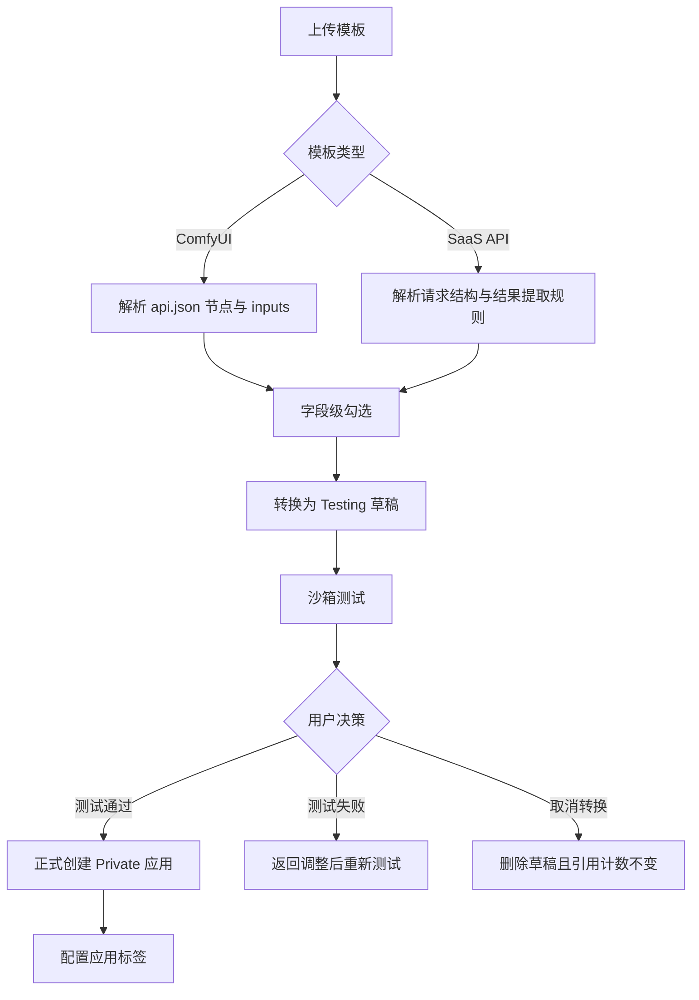
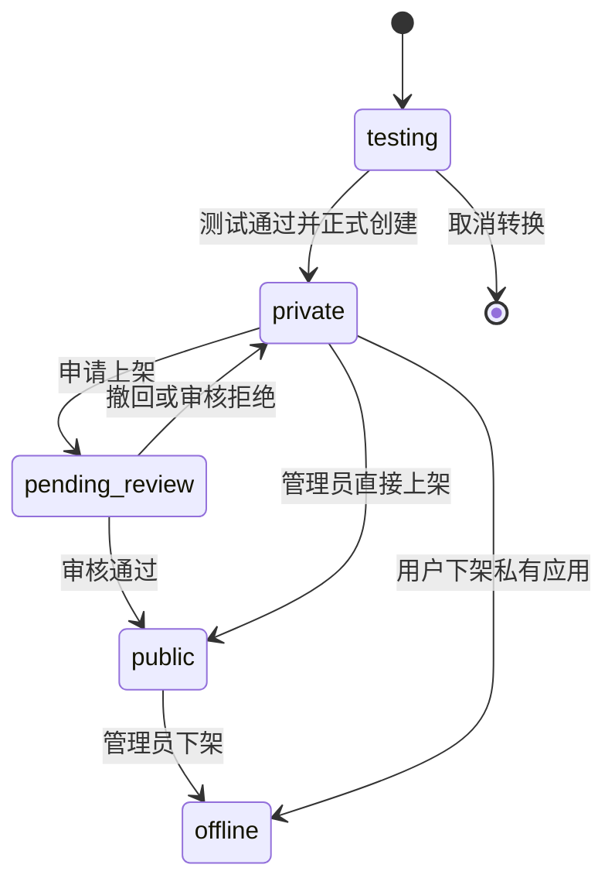
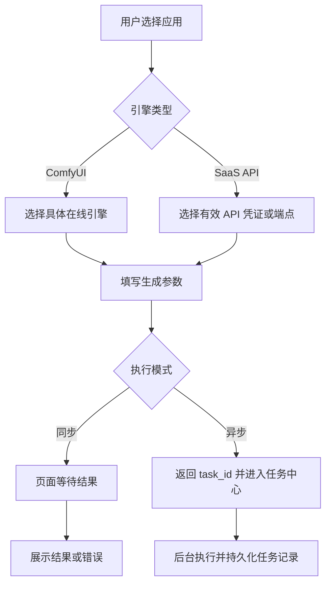
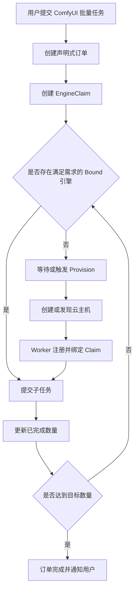
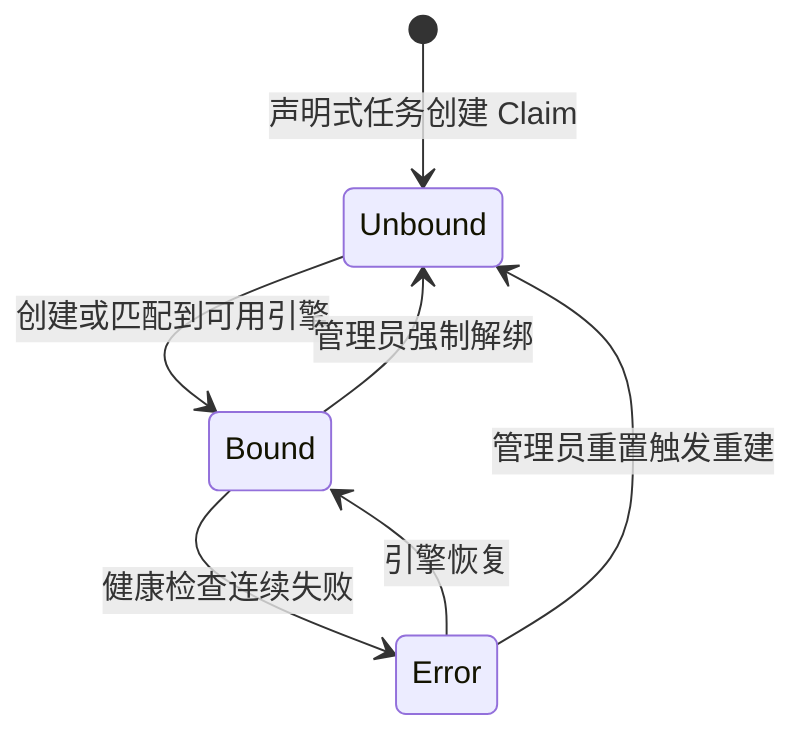
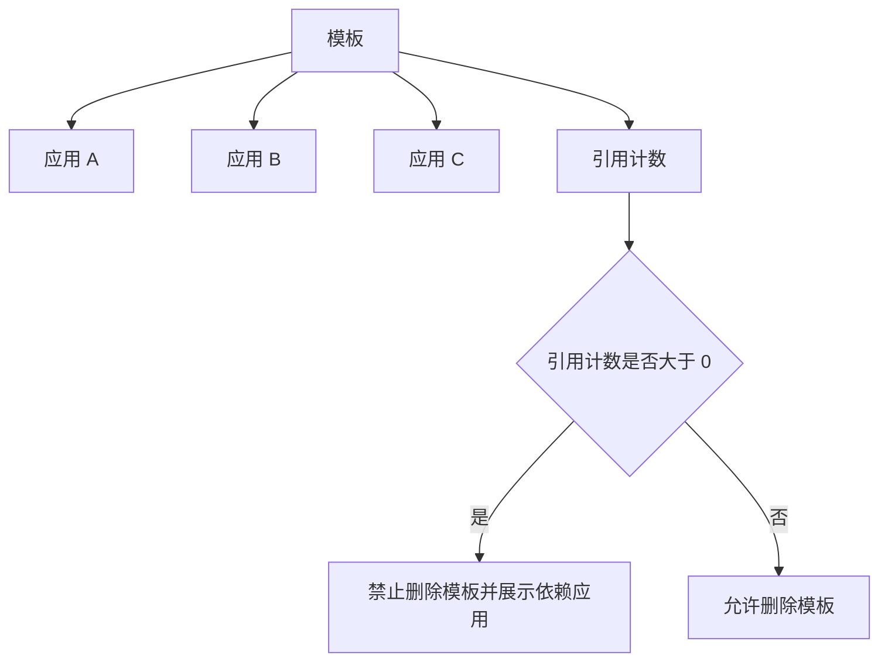
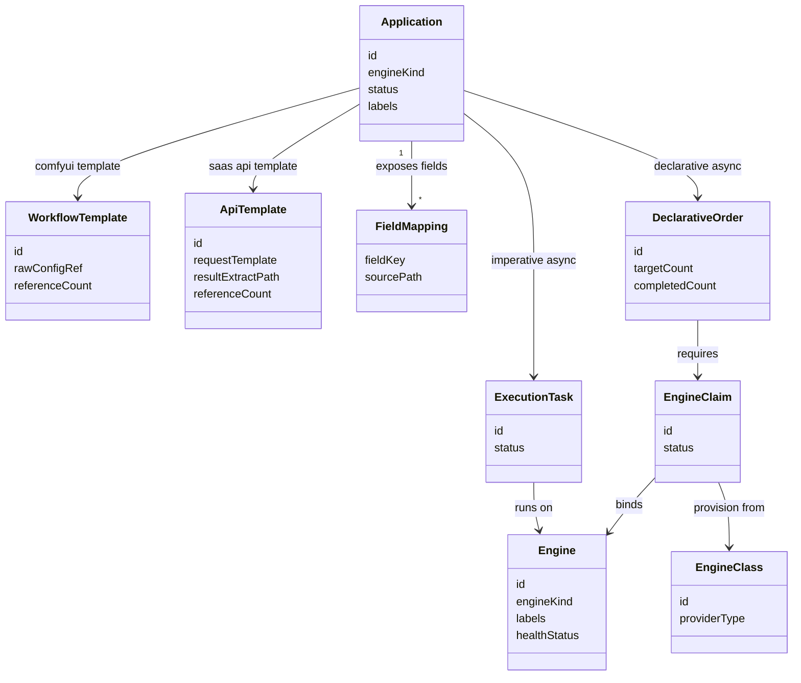

# AI 应用平台
> 本文档是 S1 产品事实源，用于定义 AI 聊天特性的产品语义、领域模型、业务规则、用户故事和端呈现策略。
>
> 本文档中的 Mermaid 图用于辅助理解复杂流程、状态变化、角色可见性和交互时序。图与文字描述应被视为同一事实集合；若存在不一致，应修正文档后再进入实现。

## 1. 功能说明

AI 应用平台与执行编排用于连接 AI 计算能力和业务用户。平台将 ComfyUI 工作流、自建 GPU 集群、第三方 SaaS API 等底层能力抽象为业务用户可以直接使用的 Web 表单式应用。

应用的本质是：

```text
输入参数 → 计算执行 → 输出结果
```

应用创建者可以基于 ComfyUI 工作流模板或 SaaS API 模板勾选字段、生成应用、测试应用、配置标签、发布应用。业务使用者可以在公共市场或自己的私有应用中填写表单并执行生成。平台管理员负责审核公共应用、治理标签、管理执行引擎、维护资源规格和处理基础设施编排。

平台支持两类执行引擎：

```text
ComfyUI：自建托管计算型引擎，支持命令式执行和声明式执行。
SaaS API：第三方托管 API 型引擎，仅支持命令式执行。
```

平台支持两种执行策略：

```text
命令式执行：指定目标立即执行，失败即停。
声明式执行：描述资源需求，平台持续协调直至完成，仅适用于 ComfyUI。
```

平台支持两种执行模式：

```text
同步执行：页面等待结果返回，不生成任务记录。
异步执行：立即返回，后台运行，生成持久化任务或订单记录。
```

平台通过字段级映射、引用计数、应用生命周期、标签系统、资源请求与推荐、任务记录、结果持久化、Webhook 和基础设施编排能力，支撑从应用创建到执行交付的完整链路。


## 2. 核心数据模型

本文档中的数据模型是 S1 领域模型，仅表达产品语义和逻辑字段，不等同于 OpenAPI DTO、SQL schema 或后端 ORM。

### Engine（执行引擎）

| 字段           | 类型                | 必填 | 说明                                          |
| ------------ | ----------------- | -- | ------------------------------------------- |
| id           | string            | 是  | 引擎唯一标识                                      |
| name         | string            | 是  | 引擎名称                                        |
| engineKind   | enum              | 是  | 引擎类型：comfyui、saas_api                       |
| status       | enum              | 是  | 状态：online、offline、unavailable、error         |
| labels       | object            | 否  | 引擎标签，例如 vram_gb、cuda_version、rate_limit_qps |
| healthStatus | enum              | 是  | 健康状态：unknown、healthy、unhealthy              |
| healthReason | string            | 否  | 健康异常原因                                      |
| boundClaimId | string            | 否  | 绑定的 EngineClaim ID，仅 ComfyUI 弹性场景使用         |
| createdAt    | string(date-time) | 是  | 创建时间                                        |
| updatedAt    | string(date-time) | 是  | 更新时间                                        |

### WorkflowTemplate（ComfyUI 工作流模板）

| 字段              | 类型                | 必填 | 说明                        |
| --------------- | ----------------- | -- | ------------------------- |
| id              | string            | 是  | 模板唯一标识                    |
| ownerUserId     | string            | 是  | 模板创建者                     |
| name            | string            | 是  | 模板名称                      |
| engineKind      | enum              | 是  | 固定为 comfyui               |
| sourceFileName  | string            | 是  | 上传的 api.json 文件名          |
| rawConfigRef    | string            | 是  | 原始工作流配置引用                 |
| parsedNodeGraph | object            | 否  | 解析后的节点拓扑和字段信息             |
| referenceCount  | integer           | 是  | 被应用引用的数量                  |
| status          | enum              | 是  | 状态：active、invalid、deleted |
| createdAt       | string(date-time) | 是  | 创建时间                      |
| updatedAt       | string(date-time) | 是  | 更新时间                      |

### ApiTemplate（SaaS API 模板）

| 字段                | 类型                | 必填 | 说明                        |
| ----------------- | ----------------- | -- | ------------------------- |
| id                | string            | 是  | API 模板唯一标识                |
| ownerUserId       | string            | 是  | 模板创建者                     |
| name              | string            | 是  | 模板名称                      |
| engineKind        | enum              | 是  | 固定为 saas_api              |
| apiSpecRef        | string            | 否  | OpenAPI / Swagger 描述引用    |
| requestTemplate   | object            | 是  | 请求模板结构                    |
| resultExtractPath | string            | 是  | 结果提取路径                    |
| referenceCount    | integer           | 是  | 被应用引用的数量                  |
| status            | enum              | 是  | 状态：active、invalid、deleted |
| createdAt         | string(date-time) | 是  | 创建时间                      |
| updatedAt         | string(date-time) | 是  | 更新时间                      |

### FieldMapping（字段映射）

| 字段            | 类型      | 必填 | 说明        |
| ------------- | ------- | -- | --------- |
| id            | string  | 是  | 字段映射唯一标识  |
| applicationId | string  | 是  | 所属应用      |
| templateId    | string  | 是  | 所属模板      |
| fieldKey      | string  | 是  | 应用表单字段标识  |
| fieldLabel    | string  | 是  | 表单显示名称    |
| fieldType     | string  | 是  | 表单字段类型    |
| sourcePath    | string  | 是  | 底层模板参数路径  |
| defaultValue  | any     | 否  | 默认值       |
| hidden        | boolean | 是  | 是否隐藏给业务用户 |
| required      | boolean | 是  | 是否必填      |
| sortOrder     | integer | 否  | 表单展示顺序    |

### Application（应用）

| 字段                 | 类型                | 必填 | 说明                                            |
| ------------------ | ----------------- | -- | --------------------------------------------- |
| id                 | string            | 是  | 应用唯一标识                                        |
| ownerUserId        | string            | 是  | 应用创建者                                         |
| name               | string            | 是  | 应用名称                                          |
| description        | string            | 否  | 应用描述                                          |
| engineKind         | enum              | 是  | comfyui 或 saas_api                            |
| templateId         | string            | 是  | 关联模板 ID                                       |
| status             | enum              | 是  | testing、private、pending_review、public、offline |
| labels             | object            | 是  | 应用标签                                          |
| fieldMappings      | array             | 是  | 应用表单字段映射                                      |
| requestSpec        | object            | 否  | ComfyUI 最低资源请求                                |
| recommendationSpec | object            | 否  | ComfyUI 推荐资源规格                                |
| webhookUrl         | string            | 否  | 异步任务回调地址                                      |
| createdAt          | string(date-time) | 是  | 创建时间                                          |
| updatedAt          | string(date-time) | 是  | 更新时间                                          |

### ApplicationReview（应用审核）

| 字段                       | 类型                | 必填 | 说明                                  |
| ------------------------ | ----------------- | -- | ----------------------------------- |
| id                       | string            | 是  | 审核记录唯一标识                            |
| applicationId            | string            | 是  | 被审核应用                               |
| applicantUserId          | string            | 是  | 申请人                                 |
| reviewerUserId           | string            | 否  | 审核人                                 |
| status                   | enum              | 是  | pending、approved、rejected、withdrawn |
| submitReason             | string            | 否  | 上架说明                                |
| rejectReason             | string            | 否  | 拒绝原因                                |
| lockedRequestSpec        | object            | 否  | 审核通过后锁定的最低资源配置                      |
| lockedRecommendationSpec | object            | 否  | 审核通过后锁定的推荐资源配置                      |
| createdAt                | string(date-time) | 是  | 创建时间                                |
| updatedAt                | string(date-time) | 是  | 更新时间                                |

### ApplicationLabel（应用标签）

| 字段            | 类型     | 必填 | 说明                                |
| ------------- | ------ | -- | --------------------------------- |
| applicationId | string | 是  | 应用 ID                             |
| key           | string | 是  | 标签键                               |
| value         | string | 是  | 标签值                               |
| source        | enum   | 是  | 来源：system、user、admin              |
| status        | enum   | 是  | 状态：active、pending_review、rejected |

### LabelDictionary（标签字典）

| 字段          | 类型              | 必填 | 说明                    |
| ----------- | --------------- | -- | --------------------- |
| key         | string          | 是  | 标签键                   |
| values      | array of string | 否  | 预定义可选值                |
| required    | boolean         | 是  | 是否必填                  |
| managedBy   | enum            | 是  | 管理方：system、admin、user |
| description | string          | 否  | 说明                    |

### ExecutionRequest（执行请求）

| 字段               | 类型                | 必填 | 说明                          |
| ---------------- | ----------------- | -- | --------------------------- |
| id               | string            | 是  | 执行请求唯一标识                    |
| applicationId    | string            | 是  | 应用 ID                       |
| requesterUserId  | string            | 是  | 提交用户                        |
| strategy         | enum              | 是  | 执行策略：imperative、declarative |
| mode             | enum              | 是  | 执行模式：sync、async             |
| engineKind       | enum              | 是  | 引擎类型                        |
| selectedEngineId | string            | 否  | 命令式执行指定引擎                   |
| inputValues      | object            | 是  | 用户输入参数                      |
| targetCount      | integer           | 否  | 声明式批量目标数量                   |
| status           | enum              | 是  | 执行状态                        |
| createdAt        | string(date-time) | 是  | 创建时间                        |
| updatedAt        | string(date-time) | 是  | 更新时间                        |

### ExecutionTask（一次性任务）

| 字段                 | 类型                | 必填 | 说明                                         |
| ------------------ | ----------------- | -- | ------------------------------------------ |
| id                 | string            | 是  | 任务唯一标识                                     |
| executionRequestId | string            | 是  | 执行请求 ID                                    |
| applicationId      | string            | 是  | 应用 ID                                      |
| engineId           | string            | 否  | 实际执行引擎                                     |
| status             | enum              | 是  | pending、running、succeeded、failed、cancelled |
| resultAssets       | array             | 否  | 结果资产                                       |
| failureReason      | string            | 否  | 失败原因                                       |
| retryCount         | integer           | 是  | 重试次数                                       |
| createdAt          | string(date-time) | 是  | 创建时间                                       |
| updatedAt          | string(date-time) | 是  | 更新时间                                       |

### DeclarativeOrder（声明式订单）

| 字段              | 类型                | 必填 | 说明                                         |
| --------------- | ----------------- | -- | ------------------------------------------ |
| id              | string            | 是  | 声明式订单唯一标识                                  |
| applicationId   | string            | 是  | 应用 ID                                      |
| requesterUserId | string            | 是  | 提交用户                                       |
| targetCount     | integer           | 是  | 目标生成数量                                     |
| completedCount  | integer           | 是  | 已完成数量                                      |
| failedCount     | integer           | 是  | 失败数量                                       |
| status          | enum              | 是  | pending、running、completed、failed、cancelled |
| engineClaimId   | string            | 否  | 资源声明 ID                                    |
| createdAt       | string(date-time) | 是  | 创建时间                                       |
| updatedAt       | string(date-time) | 是  | 更新时间                                       |

### ResultAsset（结果资产）

| 字段            | 类型                | 必填 | 说明         |
| ------------- | ----------------- | -- | ---------- |
| id            | string            | 是  | 结果资产唯一标识   |
| ownerUserId   | string            | 是  | 所属用户       |
| taskId        | string            | 否  | 来源任务       |
| orderId       | string            | 否  | 来源订单       |
| applicationId | string            | 是  | 来源应用       |
| objectPath    | string            | 是  | 对象存储路径     |
| temporaryUrl  | string            | 否  | 带时效的临时访问链接 |
| mediaType     | string            | 是  | 媒体类型       |
| createdAt     | string(date-time) | 是  | 创建时间       |

### EngineClass（基础设施模板）

| 字段              | 类型                | 必填 | 说明                                         |
| --------------- | ----------------- | -- | ------------------------------------------ |
| id              | string            | 是  | EngineClass 唯一标识                           |
| name            | string            | 是  | 模板名称                                       |
| providerType    | enum              | 是  | Aliyun、AWS、TencentCloud、Local-Hypervisor 等 |
| credentialRef   | string            | 是  | 加密存储的云厂商凭证引用                               |
| region          | string            | 否  | 地域                                         |
| networkConfig   | object            | 否  | VPC、安全组、交换机等网络参数                           |
| instanceOptions | array             | 否  | 可选实例规格                                     |
| imageRef        | string            | 是  | 预置镜像地址字符串                                  |
| status          | enum              | 是  | active、disabled、invalid                    |
| createdAt       | string(date-time) | 是  | 创建时间                                       |
| updatedAt       | string(date-time) | 是  | 更新时间                                       |

### EngineClaim（资源需求声明）

| 字段              | 类型                | 必填 | 说明                  |
| --------------- | ----------------- | -- | ------------------- |
| id              | string            | 是  | EngineClaim 唯一标识    |
| requesterUserId | string            | 是  | 触发用户                |
| applicationId   | string            | 是  | 来源应用                |
| orderId         | string            | 是  | 来源声明式订单             |
| engineClassId   | string            | 否  | 选中的基础设施模板           |
| requirements    | object            | 是  | 资源需求，例如显存、CUDA、环境标签 |
| status          | enum              | 是  | Unbound、Bound、Error |
| boundEngineId   | string            | 否  | 绑定后的引擎              |
| boundInstanceId | string            | 否  | 云实例 ID              |
| boundAddress    | string            | 否  | 云主机或 Worker 地址      |
| errorReason     | string            | 否  | 异常原因                |
| createdAt       | string(date-time) | 是  | 创建时间                |
| updatedAt       | string(date-time) | 是  | 更新时间                |

### EngineProvision（供给记录）

| 字段            | 类型                | 必填 | 说明                            |
| ------------- | ----------------- | -- | ----------------------------- |
| id            | string            | 是  | 供给记录唯一标识                      |
| engineClaimId | string            | 是  | 对应 EngineClaim                |
| engineClassId | string            | 是  | 使用的 EngineClass               |
| status        | enum              | 是  | pending、creating、bound、failed |
| failureReason | string            | 否  | 失败原因                          |
| createdAt     | string(date-time) | 是  | 创建时间                          |
| updatedAt     | string(date-time) | 是  | 更新时间                          |

### SaaSCredential（SaaS API 凭证）

| 字段            | 类型                | 必填 | 说明                                       |
| ------------- | ----------------- | -- | ---------------------------------------- |
| id            | string            | 是  | 凭证唯一标识                                   |
| name          | string            | 是  | 凭证名称                                     |
| apiBaseUrl    | string            | 是  | API 基础地址                                 |
| authType      | enum              | 是  | Bearer Token、API Key、AK-SK               |
| credentialRef | string            | 是  | 加密存储的凭证引用                                |
| quotaLimit    | integer           | 否  | 日调用上限                                    |
| rateLimitQps  | number            | 否  | QPS 限制                                   |
| costEstimate  | string            | 否  | 单次调用费用估算                                 |
| status        | enum              | 是  | valid、expired、quota_exceeded、unavailable |
| healthReason  | string            | 否  | 异常原因                                     |
| createdAt     | string(date-time) | 是  | 创建时间                                     |
| updatedAt     | string(date-time) | 是  | 更新时间                                     |

### WebhookDelivery（Webhook 通知）

| 字段            | 类型                | 必填 | 说明                       |
| ------------- | ----------------- | -- | ------------------------ |
| id            | string            | 是  | Webhook 投递记录             |
| taskId        | string            | 否  | 关联任务                     |
| orderId       | string            | 否  | 关联订单                     |
| webhookUrl    | string            | 是  | 回调地址                     |
| status        | enum              | 是  | pending、succeeded、failed |
| retryCount    | integer           | 是  | 重试次数                     |
| failureReason | string            | 否  | 失败原因                     |
| createdAt     | string(date-time) | 是  | 创建时间                     |
| updatedAt     | string(date-time) | 是  | 更新时间                     |

---

## 4. 业务规则

### 4.1 应用与模板

* **BR-AIAPP-APP-01** 应用是基于模板创建的业务实体，包含表单字段、标签、执行配置和生命周期状态。
* **BR-AIAPP-APP-02** ComfyUI 应用基于 WorkflowTemplate 创建。
* **BR-AIAPP-APP-03** SaaS API 应用基于 ApiTemplate 创建。
* **BR-AIAPP-APP-04** 应用创建时不复制底层原始配置，只保存模板外键和字段映射。
* **BR-AIAPP-APP-05** 字段映射必须指向底层模板中的具体参数路径。
* **BR-AIAPP-APP-06** 模板引用计数用于保护模板安全删除。
* **BR-AIAPP-APP-07** 应用草稿处于 testing 状态时，不增加模板引用计数。
* **BR-AIAPP-APP-08** 用户确认测试通过并正式创建应用后，模板引用计数增加。
* **BR-AIAPP-APP-09** 取消转换需要彻底删除 testing 草稿，且不得影响模板引用计数。
* **BR-AIAPP-APP-10** 模板引用计数大于 0 时禁止删除模板。
* **BR-AIAPP-APP-11** 修改已被应用引用的模板时，需要检查字段映射路径是否仍有效。
* **BR-AIAPP-APP-12** 字段映射路径失效时，需要提示受影响应用数量和风险。

### 4.2 ComfyUI 工作流模板

* **BR-AIAPP-TPL-01** 用户可以上传 ComfyUI api.json 文件作为工作流模板。
* **BR-AIAPP-TPL-02** 平台解析成功后，需要展示节点拓扑和节点 inputs 字段。
* **BR-AIAPP-TPL-03** 用户通过字段级勾选决定哪些参数暴露到应用表单。
* **BR-AIAPP-TPL-04** 勾选字段时，节点图中应显示标记，帮助用户理解字段来源。
* **BR-AIAPP-TPL-05** ComfyUI 模板可显示资源分析提示，例如模型类型和显存建议。
* **BR-AIAPP-TPL-06** ComfyUI 模板适用于自建托管计算型引擎。

### 4.3 SaaS API 模板

* **BR-AIAPP-API-01** 用户可以上传 OpenAPI / Swagger 描述文件或手动填写请求模板。
* **BR-AIAPP-API-02** 平台需要解析请求体结构，并展示可配置参数。
* **BR-AIAPP-API-03** 用户可以勾选需要暴露给最终用户的参数。
* **BR-AIAPP-API-04** 固定参数可以设为隐藏默认值。
* **BR-AIAPP-API-05** SaaS API 模板必须配置结果提取路径。
* **BR-AIAPP-API-06** 结果提取路径用于从 API 返回 JSON 中提取图片地址或结果数据。
* **BR-AIAPP-API-07** SaaS API 模板适用于第三方托管 API 型引擎。

### 4.4 应用测试与转换

* **BR-AIAPP-TEST-01** 用户勾选字段后，可以转换为应用草稿。
* **BR-AIAPP-TEST-02** 应用草稿进入 testing 状态。
* **BR-AIAPP-TEST-03** testing 草稿用于沙箱测试，不应被视为正式上线应用。
* **BR-AIAPP-TEST-04** 测试任务需要派发到沙箱环境执行。
* **BR-AIAPP-TEST-05** ComfyUI 沙箱测试前可以进行资源预检。
* **BR-AIAPP-TEST-06** 沙箱资源低于标注需求时，需要提示用户风险，但允许用户强行测试或取消调整。
* **BR-AIAPP-TEST-07** SaaS API 沙箱测试前需要验证 API 凭证有效性和余额。
* **BR-AIAPP-TEST-08** 测试通过后，用户可以正式创建私有应用。
* **BR-AIAPP-TEST-09** 测试失败后，用户可以返回调整字段映射或配置后重新测试。
* **BR-AIAPP-TEST-10** 用户放弃转换时，草稿应被删除且无副作用。

### 4.5 应用生命周期

* **BR-AIAPP-LIFE-01** 应用状态包括 testing、private、pending_review、public、offline。
* **BR-AIAPP-LIFE-02** testing 应用是测试中草稿。
* **BR-AIAPP-LIFE-03** private 应用仅创建者可用。
* **BR-AIAPP-LIFE-04** pending_review 应用处于公共市场上架审核中。
* **BR-AIAPP-LIFE-05** public 应用已进入公共市场。
* **BR-AIAPP-LIFE-06** offline 应用已下架。
* **BR-AIAPP-LIFE-07** 普通用户申请公共上架前，应用必须是 private 状态。
* **BR-AIAPP-LIFE-08** 普通用户申请公共上架前，应用必须配置 function 标签。
* **BR-AIAPP-LIFE-09** 审核期间应用对创建者仍可用，但不对外公开。
* **BR-AIAPP-LIFE-10** 用户可以撤回上架申请，应用回到 private 状态。
* **BR-AIAPP-LIFE-11** 管理员通过审核后，应用进入 public 状态。
* **BR-AIAPP-LIFE-12** 管理员拒绝审核后，应用回到 private 状态，并记录拒绝原因。
* **BR-AIAPP-LIFE-13** 管理员可以直接上架自己创建或管理的应用。
* **BR-AIAPP-LIFE-14** 管理员直接上架必须有明确上架动作和操作日志。
* **BR-AIAPP-LIFE-15** 管理员可以下架公共应用。
* **BR-AIAPP-LIFE-16** 用户只能下架自己的私有应用。

### 4.6 应用标签

* **BR-AIAPP-LABEL-01** 应用通过键值对标签描述功能、场景、引擎类型和下游适配信息。
* **BR-AIAPP-LABEL-02** function 是应用核心功能标签。
* **BR-AIAPP-LABEL-03** function 标签必填。
* **BR-AIAPP-LABEL-04** engine_kind 是系统自动标签，取值为 comfyui 或 saas_api。
* **BR-AIAPP-LABEL-05** scene 标签用于描述业务场景。
* **BR-AIAPP-LABEL-06** remote 标签用于描述适配的下游平台。
* **BR-AIAPP-LABEL-07** quality_level 标签由管理员审核时补打或修正。
* **BR-AIAPP-LABEL-08** 私有应用可以由创建者修改标签。
* **BR-AIAPP-LABEL-09** 应用进入审核或上架后，标签修改需要管理员审批或管理员修正。
* **BR-AIAPP-LABEL-10** 用户提交的自定义标签值需要经过标签治理。
* **BR-AIAPP-LABEL-11** 应用市场支持多标签交集筛选。
* **BR-AIAPP-LABEL-12** 下游系统可以通过标签条件发现公共应用。

### 4.7 引擎与健康状态

* **BR-AIAPP-ENGINE-01** 引擎类型通过 engine_kind 区分。
* **BR-AIAPP-ENGINE-02** ComfyUI 是托管计算型引擎。
* **BR-AIAPP-ENGINE-03** SaaS API 是托管 API 型引擎。
* **BR-AIAPP-ENGINE-04** ComfyUI 调度核心依据包括资源标签、空闲槽位和健康状态。
* **BR-AIAPP-ENGINE-05** SaaS API 调度核心依据包括凭证状态、余额、QPS 和健康状态。
* **BR-AIAPP-ENGINE-06** 控制器持续探测 Bound 状态引擎健康状况。
* **BR-AIAPP-ENGINE-07** ComfyUI 健康检查通过服务端健康接口判断。
* **BR-AIAPP-ENGINE-08** SaaS API 健康检查通过认证测试、余额和凭证有效性判断。
* **BR-AIAPP-ENGINE-09** 引擎健康检查失败时，不得继续调度到该引擎。
* **BR-AIAPP-ENGINE-10** 引擎恢复响应后，可以恢复为可调度状态。

### 4.8 执行策略与执行模式

* **BR-AIAPP-EXEC-01** 执行策略包括 imperative 和 declarative。
* **BR-AIAPP-EXEC-02** 执行模式包括 sync 和 async。
* **BR-AIAPP-EXEC-03** 命令式执行适用于 ComfyUI 和 SaaS API。
* **BR-AIAPP-EXEC-04** 声明式执行仅适用于 ComfyUI。
* **BR-AIAPP-EXEC-05** SaaS API 不支持声明式执行。
* **BR-AIAPP-EXEC-06** 声明式执行仅支持异步模式。
* **BR-AIAPP-EXEC-07** 同步执行不生成任务记录。
* **BR-AIAPP-EXEC-08** 异步执行需要生成持久化任务或订单记录。
* **BR-AIAPP-EXEC-09** 同步执行结果仍需要持久化保存，避免结果丢失。
* **BR-AIAPP-EXEC-10** 异步执行结果通过任务中心、订单详情或 Webhook 获取。
* **BR-AIAPP-EXEC-11** 命令式执行不会触发 Provision。
* **BR-AIAPP-EXEC-12** 命令式执行指定资源不可用时，应直接失败或提示用户重新选择。
* **BR-AIAPP-EXEC-13** ComfyUI 命令式任务 Worker 崩溃时，任务失败，不自动迁移现场。
* **BR-AIAPP-EXEC-14** SaaS API 命令式调用失败可以按重试策略重试，仍失败则标记失败。
* **BR-AIAPP-EXEC-15** 声明式执行以目标数量为最终完成条件。
* **BR-AIAPP-EXEC-16** 声明式订单在引擎异常时可以等待恢复、重新绑定或将子任务重新入队。
* **BR-AIAPP-EXEC-17** 单个子任务失败不应直接导致整体声明式订单失败，除非超过整体失败策略。

### 4.9 资源请求与推荐

* **BR-AIAPP-RESOURCE-01** Request 表示应用正常运行的最低资源门槛。
* **BR-AIAPP-RESOURCE-02** Recommendation 表示应用获得较好性能的推荐资源规格。
* **BR-AIAPP-RESOURCE-03** Request 和 Recommendation 仅适用于 ComfyUI 应用。
* **BR-AIAPP-RESOURCE-04** SaaS API 应用不涉及硬件资源规格。
* **BR-AIAPP-RESOURCE-05** 应用创建者可以自发填写 Request 和 Recommendation。
* **BR-AIAPP-RESOURCE-06** 创建者填写的资源值不强制拦截，但审核时需要验证。
* **BR-AIAPP-RESOURCE-07** 管理员可以在审核时覆写 Request 和 Recommendation。
* **BR-AIAPP-RESOURCE-08** 应用审核通过后，Request 和 Recommendation 被锁定为应用元数据。
* **BR-AIAPP-RESOURCE-09** 集群空闲时，调度可以优先按 Recommendation 匹配。
* **BR-AIAPP-RESOURCE-10** 集群繁忙时，调度可以按 Request 匹配。
* **BR-AIAPP-RESOURCE-11** 引擎资源低于 Request 时，不得分配。
* **BR-AIAPP-RESOURCE-12** 异步任务详情需要展示实际匹配引擎规格和采用策略。

### 4.10 基础设施编排

* **BR-AIAPP-INFRA-01** EngineClass 是基础设施模板，只记录云厂商参数，不直接产生资源。
* **BR-AIAPP-INFRA-02** EngineClaim 是资源需求声明，包含 Unbound、Bound、Error 状态。
* **BR-AIAPP-INFRA-03** EngineProvision 是供给插件动作记录，负责创建或发现云主机并绑定 Claim。
* **BR-AIAPP-INFRA-04** EngineClass 由管理员维护。
* **BR-AIAPP-INFRA-05** EngineClass 中的镜像地址仅作为字符串记录，平台不负责构建、打包或检测镜像内容。
* **BR-AIAPP-INFRA-06** 声明式 ComfyUI 任务提交时可以自动创建 EngineClaim。
* **BR-AIAPP-INFRA-07** 命令式任务不创建 EngineClaim。
* **BR-AIAPP-INFRA-08** Claim 初始状态为 Unbound。
* **BR-AIAPP-INFRA-09** 控制器成功创建或匹配引擎后，将 Claim 更新为 Bound。
* **BR-AIAPP-INFRA-10** Bound 引擎健康检查连续失败后，Claim 更新为 Error。
* **BR-AIAPP-INFRA-11** 管理员可以手动将 Error 重置为 Unbound 触发重建。
* **BR-AIAPP-INFRA-12** 管理员可以手动将 Bound 强制解绑为 Unbound。
* **BR-AIAPP-INFRA-13** Provision 创建失败时，需要记录失败原因并通知管理员。
* **BR-AIAPP-INFRA-14** 平台需要通过最大并发创建数等机制控制云主机创建风险。

### 4.11 SaaS API 凭证

* **BR-AIAPP-SAAS-01** SaaS API 引擎凭证由管理员维护。
* **BR-AIAPP-SAAS-02** 凭证内容需要加密存储。
* **BR-AIAPP-SAAS-03** SaaS API 凭证需要周期性检测有效性和余额。
* **BR-AIAPP-SAAS-04** 凭证过期、无效或余额不足时，该 SaaS API 引擎不可调度。
* **BR-AIAPP-SAAS-05** SaaS API 调用需要遵守 QPS 限制。
* **BR-AIAPP-SAAS-06** QPS 触顶时，异步任务应排队等待下一个时间窗口。
* **BR-AIAPP-SAAS-07** SaaS API 余额低于阈值时，需要通知管理员。
* **BR-AIAPP-SAAS-08** SaaS API 失败重试不应改变其不支持声明式执行的事实。

### 4.12 结果持久化与 Webhook

* **BR-AIAPP-RESULT-01** Worker 执行完成后，生成图片必须上传至对象存储持久化保存。
* **BR-AIAPP-RESULT-02** 同步执行结果也需要持久化。
* **BR-AIAPP-RESULT-03** 任务记录中保存的访问链接可以是带时效的临时签名 URL。
* **BR-AIAPP-RESULT-04** 异步命令式任务成功或失败时可以触发 Webhook。
* **BR-AIAPP-RESULT-05** 声明式订单完成时可以触发 Webhook。
* **BR-AIAPP-RESULT-06** 同步执行不触发 Webhook。
* **BR-AIAPP-RESULT-07** Webhook 投递失败时可以按指数退避重试。
* **BR-AIAPP-RESULT-08** Webhook 最终失败只标记通知异常，不影响结果资产存储。

### 4.13 权限与可见性

* **BR-AIAPP-PERM-01** 普通用户可以创建、编辑、删除和执行自己的私有应用。
* **BR-AIAPP-PERM-02** 普通用户可以查看和执行公共应用。
* **BR-AIAPP-PERM-03** 普通用户只能删除无引用的自有模板。
* **BR-AIAPP-PERM-04** 管理员可以审核、发布、下架和治理公共应用。
* **BR-AIAPP-PERM-05** 管理员删除模板时同样必须遵守引用计数保护。
* **BR-AIAPP-PERM-06** 公共应用下架后，应立即从公共市场移除。
* **BR-AIAPP-PERM-07** 应用审核、上架、下架、资源覆写和标签治理需要记录操作日志。

---

## 5. 用户故事

### US-AIAPP-01 上传 ComfyUI 工作流模板

应用创建者可以上传 ComfyUI api.json 文件。平台解析成功后展示节点拓扑图和节点 inputs 字段列表，用户可以逐字段勾选需要暴露到应用表单的参数。

### US-AIAPP-02 创建 SaaS API 模板

应用创建者可以上传 OpenAPI / Swagger 描述文件，或手动填写请求模板。平台解析请求体结构后展示可配置参数，用户选择暴露字段并配置结果提取路径。

### US-AIAPP-03 字段级映射

应用创建者可以将表单字段映射到底层模板参数路径。平台只保存模板外键和字段路径映射，不复制原始工作流或 API 模板内容。

### US-AIAPP-04 转换为应用草稿

应用创建者完成字段勾选后，可以转换为 testing 状态的应用草稿。草稿用于沙箱测试，不增加模板引用计数。

### US-AIAPP-05 沙箱测试应用

应用创建者可以在沙箱中测试应用。测试过程中展示进度和生成结果。ComfyUI 应用可以进行资源预检，SaaS API 应用需要验证凭证和余额。

### US-AIAPP-06 正式创建私有应用

应用测试通过后，应用创建者可以正式创建 private 应用。正式创建后，模板引用计数增加，应用进入标签配置步骤。

### US-AIAPP-07 取消转换

应用创建者可以放弃 testing 草稿。取消转换会删除草稿，不产生正式应用，不增加模板引用计数。

### US-AIAPP-08 申请上架公共市场

普通用户可以将 private 应用申请上架公共市场。应用需要配置 function 标签。提交后应用进入 pending_review 状态。

### US-AIAPP-09 撤回上架申请

应用创建者可以在审核期间撤回申请。撤回后应用回到 private 状态。

### US-AIAPP-10 管理员审核应用

管理员可以查看待审核应用的字段映射、表单样式、标签、资源配置和测试结果，并决定通过或拒绝。

### US-AIAPP-11 管理员临时测试应用

管理员在审核时可以临时执行应用测试。该测试不进入普通任务历史，不消耗用户配额。

### US-AIAPP-12 管理员验证资源配置

管理员可以验证 ComfyUI 应用的 Request 和 Recommendation 是否合理，并可覆写资源配置。审核通过后资源配置锁定。

### US-AIAPP-13 管理员直接上架应用

管理员可以通过上传、勾选、测试后直接上架公共市场。该操作不经过 pending_review，但必须明确执行上架动作并记录日志。

### US-AIAPP-14 下架应用

管理员可以下架公共应用。用户可以下架自己的私有应用。下架后应用进入 offline 状态。

### US-AIAPP-15 配置应用标签

应用创建者可以为应用配置 function、scene、remote 等标签。管理员可以补打 quality_level，并治理自定义标签值。

### US-AIAPP-16 标签筛选应用

业务使用者可以在应用市场通过标签筛选公共应用。外部系统也可以通过标签条件发现公共应用。

### US-AIAPP-17 命令式同步执行

业务使用者可以选择命令式同步执行。页面等待结果返回，结果直接展示，不生成任务记录，但结果需要持久化保存。

### US-AIAPP-18 命令式异步执行

业务使用者可以选择命令式异步执行。系统立即返回 task_id，后台执行任务，用户在任务中心查看结果或失败日志。

### US-AIAPP-19 ComfyUI 声明式异步执行

业务使用者可以提交 ComfyUI 声明式批量任务。用户描述资源需求和目标数量，平台自动协调资源、分发子任务并持续执行直到完成。

### US-AIAPP-20 SaaS API 命令式执行

业务使用者可以执行 SaaS API 应用。平台选择有效凭证和 API 端点，遵守 QPS 和配额限制后发起调用。

### US-AIAPP-21 查看任务中心

业务使用者可以在任务中心查看异步命令式任务和声明式订单的进度、结果、失败原因和实际匹配的引擎规格。

### US-AIAPP-22 配置 Webhook

应用创建者可以配置异步任务回调地址。异步任务成功、失败或声明式订单完成时，平台向回调地址投递结果通知。

### US-AIAPP-23 查看模板引用关系

应用创建者可以从模板侧查看哪些应用引用了该模板，也可以从应用侧跳转查看底层模板。

### US-AIAPP-24 删除模板预检

用户删除模板时，平台检查引用计数。引用计数大于 0 时阻止删除，并展示引用该模板的应用数量和清单。

### US-AIAPP-25 修改模板兼容性预警

用户修改已被应用引用的模板时，平台检查字段映射路径。若路径失效，需要警告可能影响的应用。

### US-AIAPP-26 管理 EngineClass

管理员可以维护 EngineClass，记录云厂商凭证、地域、网络、实例规格和镜像地址。EngineClass 本身不创建资源。

### US-AIAPP-27 触发 EngineClaim

ComfyUI 声明式任务提交时，系统可以自动创建 EngineClaim。Claim 表达资源需求，并由控制器调和到可用引擎。

### US-AIAPP-28 管理 EngineClaim 状态

管理员可以查看 EngineClaim 的 Unbound、Bound、Error 状态，并在必要时手动重置或强制解绑。

### US-AIAPP-29 Provision 创建资源

当没有满足 Claim 的 Worker 时，Provision 控制器可以根据 EngineClass 创建或发现云主机，并将其绑定到 Claim。

### US-AIAPP-30 管理 SaaS API 凭证

管理员可以创建 SaaS API 凭证，配置基础地址、认证方式、调用上限、费用估算和健康检测。凭证不可用时，该 API 引擎不可调度。

---

## 6. 页面与核心流程

### 6.1 应用创建流程



### 6.2 应用生命周期



### 6.3 执行策略与模式矩阵

| 引擎类型     | 执行策略 | 执行模式 | 支持 | 说明                |
| -------- | ---- | ---- | -- | ----------------- |
| ComfyUI  | 命令式  | 同步   | ✅  | 指定引擎，等待结果，不生成任务记录 |
| ComfyUI  | 命令式  | 异步   | ✅  | 指定引擎，立即返回 task_id |
| ComfyUI  | 声明式  | 同步   | ❌  | 声明式任务必须异步         |
| ComfyUI  | 声明式  | 异步   | ✅  | 提交意图，自动保障，持续协调    |
| SaaS API | 命令式  | 同步   | ✅  | 直接调用 API，等待结果     |
| SaaS API | 命令式  | 异步   | ✅  | 提交调用，返回 task_id   |
| SaaS API | 声明式  | 同步   | ❌  | SaaS API 无基础设施控制权 |
| SaaS API | 声明式  | 异步   | ❌  | SaaS API 不支持声明式   |

### 6.4 命令式执行流程



### 6.5 声明式执行流程



### 6.6 EngineClaim 状态机



### 6.7 模板引用关系



### 6.8 业务概念关系



---

## 7. 功能适配矩阵

| 功能               | 应用创建者 | 业务使用者 | 平台管理员 | 外部系统 |
| ---------------- | ----- | ----- | ----- | ---- |
| 上传 ComfyUI 模板    | ✅     | ❌     | ✅     | ❌    |
| 创建 SaaS API 模板   | ✅     | ❌     | ✅     | ❌    |
| 字段级勾选            | ✅     | ❌     | ✅     | ❌    |
| 转换为应用草稿          | ✅     | ❌     | ✅     | ❌    |
| 沙箱测试             | ✅     | ❌     | ✅     | ❌    |
| 正式创建私有应用         | ✅     | ❌     | ✅     | ❌    |
| 申请公共上架           | ✅     | ❌     | ✅     | ❌    |
| 审核公共应用           | ❌     | ❌     | ✅     | ❌    |
| 管理员直接上架          | ❌     | ❌     | ✅     | ❌    |
| 标签配置             | ✅     | ❌     | ✅     | ❌    |
| 标签治理             | ❌     | ❌     | ✅     | ❌    |
| 浏览公共市场           | ✅     | ✅     | ✅     | ✅    |
| 执行公共应用           | ✅     | ✅     | ✅     | ✅    |
| 执行私有应用           | ✅     | 仅自己的  | ✅     | ❌    |
| 命令式同步执行          | ✅     | ✅     | ✅     | ✅    |
| 命令式异步执行          | ✅     | ✅     | ✅     | ✅    |
| 声明式 ComfyUI 异步执行 | ✅     | ✅     | ✅     | ✅    |
| SaaS API 声明式执行   | ❌     | ❌     | ❌     | ❌    |
| 查看任务中心           | ✅     | ✅     | ✅     | 通过回调 |
| 管理 EngineClass   | ❌     | ❌     | ✅     | ❌    |
| 管理 EngineClaim   | ❌     | ❌     | ✅     | ❌    |
| 管理 SaaS API 凭证   | ❌     | ❌     | ✅     | ❌    |
| 查看模板引用关系         | ✅     | ❌     | ✅     | ❌    |

---

## 8. 系统呈现策略

### 8.1 应用创建页面

应用创建页面面向应用创建者和管理员。

页面需要支持：

```text
上传 ComfyUI api.json
上传 OpenAPI / Swagger
手动填写 SaaS API 请求模板
解析模板结构
展示节点拓扑或请求字段结构
逐字段勾选
搜索字段
全选 / 取消字段
配置结果提取路径
转换为应用草稿
```

ComfyUI 工作流模板展示：

```text
左侧节点拓扑图
右侧节点属性面板
节点 inputs 字段列表
字段勾选状态
节点勾选标记
资源分析提示
```

SaaS API 模板展示：

```text
请求体结构
可配置参数列表
隐藏默认值
结果提取路径
凭证测试提示
```

### 8.2 应用测试页面

应用测试页面用于验证 testing 草稿。

页面需要展示：

```text
应用表单预览
沙箱测试按钮
实时进度
测试结果图
失败原因
返回调整入口
测试通过正式创建入口
取消转换入口
```

ComfyUI 沙箱资源不足时，需要弹窗提示：

```text
当前沙箱资源低于标注需求
允许强行测试
允许取消调整
```

SaaS API 测试前需要提示凭证状态和余额状态。

### 8.3 应用详情页

应用详情页面向创建者、业务使用者和管理员。

页面需要展示：

```text
应用名称
应用描述
应用状态
引擎类型
应用标签
表单字段
执行策略
执行模式
资源规格
最近任务
结果展示
Webhook 配置
底层模板入口
```

ComfyUI 应用需要展示：

```text
自建集群型标识
engine_kind=comfyui
命令式执行入口
声明式执行入口
Request / Recommendation
可用引擎列表
```

SaaS API 应用需要展示：

```text
API 调用型标识
engine_kind=saas_api
命令式执行入口
第三方服务提示
不支持声明式执行提示
```

### 8.4 应用市场

应用市场面向业务使用者和外部发现。

页面需要支持：

```text
公共应用列表
标签筛选栏
多标签 AND 过滤
应用卡片
引擎类型标识
质量等级标识
执行入口
```

应用卡片需要展示：

```text
应用名称
功能标签
场景标签
引擎类型
质量等级
创建者或来源
执行按钮
```

### 8.5 管理员审核页面

管理员审核页面需要展示：

```text
待审核应用列表
应用详情
字段映射
表单样式
应用标签
资源配置
沙箱临时测试
SaaS API 凭证状态
审核通过
审核拒绝
资源覆写
标签修正
```

审核拒绝时必须填写理由。

审核通过时，公共应用规格锁定。

### 8.6 任务中心

任务中心需要展示异步任务和声明式订单。

异步命令式任务展示：

```text
task_id
应用名称
执行状态
执行引擎
提交时间
完成时间
失败日志
结果资产
```

声明式订单展示：

```text
订单 ID
目标数量
已完成数量
失败数量
协调状态
EngineClaim 状态
实际匹配引擎规格
采用调度策略
结果资产列表
```

### 8.7 引擎管理页面

引擎管理页面面向管理员。

页面需要支持：

```text
ComfyUI 引擎列表
SaaS API 引擎列表
健康状态
标签信息
在线状态
不可调度原因
EngineClass 管理
EngineClaim 管理
Provision 记录
SaaS API 凭证管理
```

### 8.8 模板依赖视图

模板详情页需要提供“查看引用关系”。

应用详情页需要提供“查看底层模板”。

引用关系视图展示：

```text
引用该模板的应用清单
应用名称
创建者
当前状态
engine_kind
映射路径有效性
删除阻断原因
```

删除模板时，如果引用计数大于 0，需要在弹窗中嵌入依赖视图。

---

## 9. 状态与异常

| 状态/异常                         | 说明                        |
| ----------------------------- | ------------------------- |
| template_parse_failed         | 模板解析失败                    |
| template_reference_blocked    | 模板存在引用，禁止删除               |
| mapping_path_invalid          | 字段映射路径失效                  |
| app_testing                   | 应用处于测试中草稿状态               |
| app_private                   | 应用为私有已上线状态                |
| app_pending_review            | 应用正在审核中                   |
| app_public                    | 应用已公共上架                   |
| app_offline                   | 应用已下架                     |
| app_review_rejected           | 应用审核被拒绝                   |
| label_function_missing        | 应用缺少必填 function 标签        |
| label_custom_pending          | 自定义标签值等待治理                |
| sandbox_resource_insufficient | 沙箱资源低于应用标注需求              |
| saas_credential_invalid       | SaaS API 凭证无效             |
| saas_quota_exceeded           | SaaS API 余额或配额不足          |
| saas_rate_limited             | SaaS API QPS 达到限制         |
| engine_unavailable            | 指定引擎不可用                   |
| engine_health_unhealthy       | 引擎健康检查失败                  |
| engine_claim_unbound          | EngineClaim 未绑定可用引擎       |
| engine_claim_error            | EngineClaim 绑定引擎异常        |
| provision_failed              | EngineProvision 创建或发现资源失败 |
| imperative_task_failed        | 命令式任务失败                   |
| declarative_order_failed      | 声明式订单失败                   |
| declarative_sync_unsupported  | 声明式执行不支持同步                |
| saas_declarative_unsupported  | SaaS API 不支持声明式执行         |
| result_persist_failed         | 结果持久化失败                   |
| webhook_delivery_failed       | Webhook 投递失败              |
| request_below_minimum         | 引擎资源低于 Request，禁止分配       |
| public_app_offline            | 公共应用已下架                   |
| permission_denied             | 当前用户缺少操作权限                |

---

## 10. 待确认问题

* Request / Recommendation 是否只包含显存，还是需要包含 CUDA、PyTorch、插件版本、模型文件等复合约束。
* 声明式订单失败阈值如何定义，例如失败子任务超过多少比例后整体失败。
* 同步执行结果持久化后是否自动登记到用户素材库。
* 公共应用执行产生的结果归属调用用户，还是归属应用创建者。
* SaaS API 凭证是否只允许管理员配置，还是允许应用创建者提交自己的凭证。
* 外部系统通过标签发现应用时，是否只允许发现 public 应用。
* 管理员直接上架是否需要强制执行一次沙箱测试。
* 模板修改时，如果用户强制保存导致应用映射失效，是否自动将受影响应用下架。
* Webhook 是否需要支持签名密钥。
* 声明式任务自动创建云主机时，是否需要用户确认预算或管理员预设配额。
