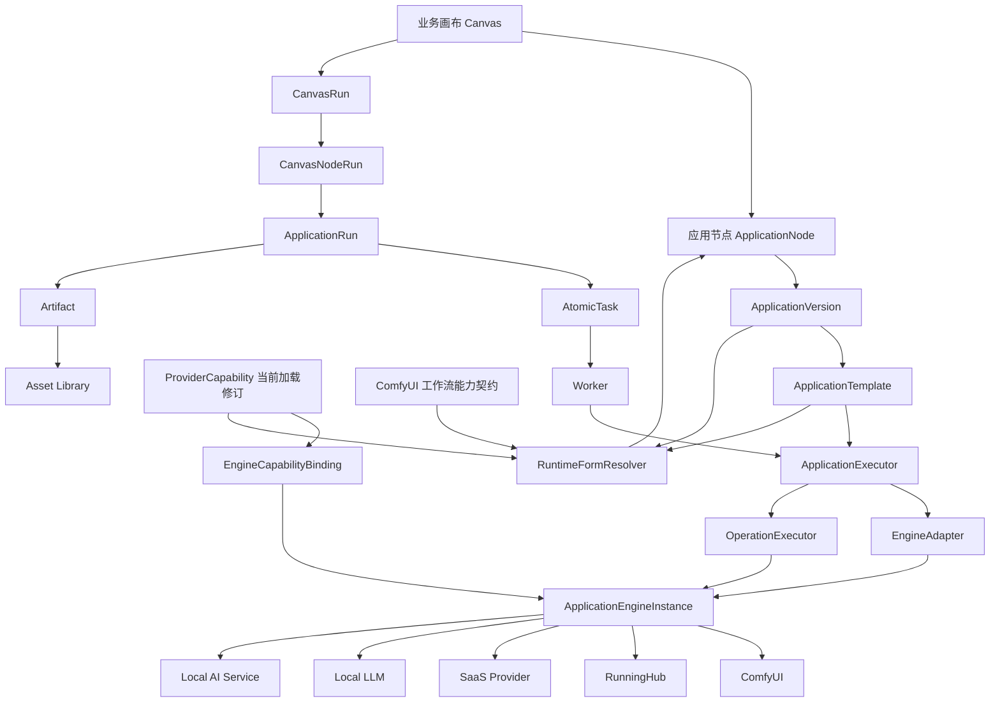
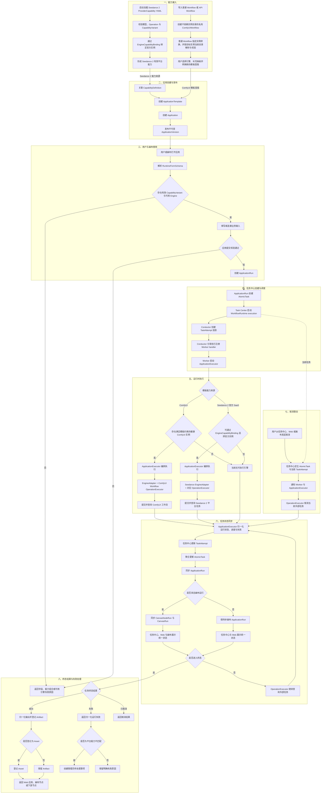
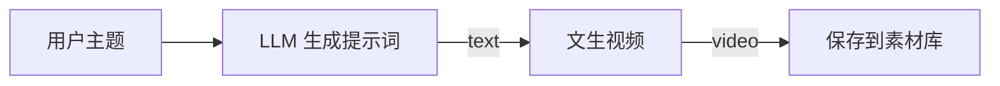
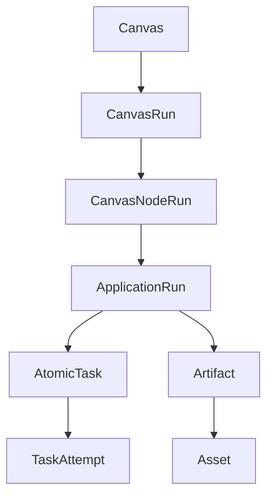

# OmniMAM 应用平台与画布编排功能设计

> 文档状态：v1.2.0
>
> 本次修订日期：2026-07-19
>
> Gateway 核心事实已迁移到 `modelgateway`；本领域继续通过只读 `ProviderCapability`、Engine 与 OperationExecutor 契约封装应用，不改变既有应用行为。

> 当前实现范围：本版本覆盖应用平台、任务中心协作与 Artifact 引用交付；第 10～14 章的画布协作语义由 workflow-canvas S1/S2 共同约束，画布事实和编译实现归 workflow-canvas 所有。Artifact 事实、处理、Representation 和登记归 asset-library。

## 1. 文档目的

本文定义 OmniMAM 中应用平台、运行时动态表单、画布节点和异步任务中心之间的产品语义、职责边界及核心业务规则，并定义其消费 Model Gateway 的方式。

本文覆盖以下核心对象：

* ComfyUI 工作流 `ComfyUIWorkflow`
* ComfyUI 工作流兼容性校验 `ComfyUIWorkflowValidation`
* 应用执行器 `ApplicationExecutor`
* 应用 `Application`
* 应用版本 `ApplicationVersion`
* 应用模板 `ApplicationTemplate`
* 运行时表单 `RuntimeFormSchema`
* 画布 `Canvas`
* 画布应用节点 `ApplicationNode`
* 画布运行 `CanvasRun`
* 画布节点运行 `CanvasNodeRun`
* 应用运行 `ApplicationRun`
* 异步任务中心
* 制品 `Artifact`
* 素材 `Asset`

本文重点解决以下问题：

1. 如何将 ComfyUI 工作流、本地模型、RunningHub 工作流和第三方 SaaS 服务封装成统一应用。
2. 如何通过系统启动时加载的只读 `ProviderCapability` 描述不同平台、模型、操作和参数组合。
3. 如何处理同一个平台存在 Pro、Flash 等不同模型及其参数差异。
4. 如何根据当前模型、平台和应用约束动态生成前端表单。
5. 如何处理模型上架、下架、弃用、分辨率扩展和时长变化。
6. 如何让应用成为画布中的可连接业务节点。
7. 如何让应用节点通过统一输入输出契约组成业务工作流。
8. 如何将画布运行转换为 ApplicationRun 和任务中心中的异步任务。
9. 如何避免前端、画布和业务应用直接依赖供应商原始接口或 ComfyUI 内部节点。

`CapabilityDefinition`、`ProviderCapability`、`ApplicationEngineType`、`ApplicationEngineInstance`、`EngineCapabilityBinding`、`EngineAdapter` 与 `OperationExecutor` 的正式产品事实见 `00_product/domains/modelgateway/product-spec.md`。

---

## 2. 产品定位

### 2.1 应用平台定位

OmniMAM 应用平台用于将异构 AI 能力封装成业务用户和画布可以直接使用的应用。

底层能力可以来自：

* ComfyUI API Workflow
* 用户自建 ComfyUI 实例
* 本地 LLM
* 本地图像模型
* 本地视频模型
* 本地音频模型
* 第三方 SaaS API
* RunningHub 工作流
* 自建 GPU 推理服务
* OpenAI Compatible API
* 通用 HTTP 服务
* 未来接入的其他 AI 平台

应用平台屏蔽以下底层复杂性：

* ComfyUI 节点拓扑
* checkpoint、VAE、CLIP、latent 等模型细节
* 自定义节点及其内部参数
* SaaS 原始请求结构
* 平台鉴权
* 文件上传
* 异步任务轮询
* 回调处理
* 任务取消
* 结果下载
* Worker 和 GPU 环境
* 不同平台返回格式
* 不同平台失败结果格式


应用平台向终端用户和画布暴露稳定的业务能力，例如：

```text
文生视频
图生视频
视频编辑
图像生成
图像编辑
图像放大
图像重新打光
修改拍摄角度
图像描述
提示词生成
文本润色
文本转语音
语音转文本
视频抽帧
背景移除
人脸修复
```
这些业务能力可以供以下产品形态调用：

* Web 页面
* 无限画布
* Agent
* 自动化流程

---

### 2.2 画布定位

OmniMAM 画布不是 ComfyUI 前端的重新实现。

画布是跨平台、跨引擎、跨模型的业务能力编排系统。

画布中组合的是业务能力节点，而不是底层技术节点。

不推荐直接在 OmniMAM 画布中暴露：

```text
CheckpointLoader
CLIPTextEncode
KSampler
VAEDecode
LoRALoader
ControlNetApply
ComfyUI 自定义节点
供应商原始 API 调用节点
```

推荐暴露：

```text
生成视频
图像放大
修改视角
重新打光
生成提示词
图像理解
视频加字幕
语音合成
素材保存
条件分支
循环
并发
人工确认
```

---

### 2.3 核心架构原则

#### 原则一：底层工作流不是画布工作流

ComfyUI Workflow、RunningHub Workflow、本地模型和 SaaS API 是应用能力的底层实现，不是 OmniMAM 画布本身。

#### 原则二：应用定义业务能力

应用定义：

* 需要哪些输入
* 输出哪些结果
* 用户能够配置哪些参数
* 参数之间有哪些约束
* 允许由哪些底层实现执行

#### 原则三：画布定义能力组合

画布定义：

* 节点
* 连线
* 数据依赖
* 分支
* 循环
* 并发
* 人工确认
* 失败处理

#### 原则四：前端不维护平台能力事实

前端负责：

> 参数如何展示。

平台负责：

> 当前允许展示哪些参数、哪些组合有效。


---

## 3. 总体架构


```mermaid
graph TD
    A[业务画布 Canvas] --> B[应用节点 ApplicationNode]
    B --> C[ApplicationVersion]
    C --> D[ApplicationTemplate]
    D --> E[ApplicationExecutor]
    E --> F[EngineAdapter]
    E --> X[OperationExecutor]
    F --> G[ApplicationEngineInstance]
    X --> G

    H[ProviderCapability 当前加载修订] --> I[EngineCapabilityBinding]
    I --> G
    H --> J[RuntimeFormResolver]
    S[ComfyUI 工作流能力契约] --> J
    C --> J
    D --> J
    J --> B

    G --> K1[ComfyUI]
    G --> K2[RunningHub]
    G --> K3[SaaS Provider]
    G --> K4[Local LLM]
    G --> K5[Local AI Service]

    A --> L[CanvasRun]
    L --> M[CanvasNodeRun]
    M --> N[ApplicationRun]
    N --> O[AtomicTask]
    O --> P[Worker]
    P --> E

    N --> Q[Artifact]
    Q --> R[Asset Library]
```

### 3.1 ComfyUI 与 Seedance 2 应用完整使用链路

下图对照展示 ComfyUI 工作流应用与 Seedance 2 官方 SaaS 应用从能力接入、应用发布、用户或画布使用，到任务中心调度、外部平台执行、状态同步和结果登记的完整链路。两类应用共享统一的应用契约、任务运行和状态主干，但使用不同的能力来源、Engine 约束和外部执行方式。


```mermaid
flowchart TD
    subgraph ONBOARD["一、能力接入"]
        direction LR

        C1["导入普通 Workflow 或 API Workflow"] --> C2["创建不依赖实例目录的私有 ComfyUIWorkflow"]
        C2 --> C3["普通 Workflow 指定实例转换，并按目标实例当前目录解析与校验"]
        C3 --> C4["用户选择引擎、补充映射并转换新的模板首版"]

        S1["启动加载 Seedance 2 ProviderCapability YAML"] --> S2["校验模型、Operation 与 CapabilityVariant"]
        S2 --> S3["通过 EngineCapabilityBinding 绑定官方实例"]
        S3 --> S4["形成 Seedance 2 有效平台能力"]
    end

    subgraph PUBLISH["二、应用创建与发布"]
        direction LR

        P1["关联 CapabilityDefinition"] --> P2["创建 ApplicationTemplate"]
        P2 --> P3["创建 Application"]
        P3 --> P4["发布不可变 ApplicationVersion"]
    end

    C4 -->|"ComfyUI 模板首版"| P2
    S4 -->|"Seedance 2 能力来源"| P1

    subgraph USE["三、用户与画布使用"]
        direction LR

        U1["用户或画布打开应用"] --> U2["解析 RuntimeFormSchema"]
        U2 --> U3{"存在有效 CapabilityVariant 与可用 Engine"}
        U3 -->|"是"| U4["填写或连接业务输入"]
        U4 --> U5{"应用提交校验通过"}
        U5 -->|"是"| U6["创建 ApplicationRun"]
    end

    P4 --> U1

    subgraph TASK["四、任务中心创建与调度"]
        direction LR

        T1["ApplicationRun 创建 AtomicTask"] --> T2["Task Center 启动 WorkflowRuntime execution"]
        T2 --> T3["Conductor 创建 TaskAttempt 投影"]
        T3 --> T4["Conductor 分发给已注册 Worker handler"]
        T4 --> T5["Worker 启动 ApplicationExecutor"]
    end

    U6 --> T1

    subgraph EXECUTE["五、运行时执行"]
        direction TB

        R1{"模板能力来源"}

        R1 -->|"ComfyUI"| C5{"存在满足模板约束的健康 ComfyUI 实例"}
        C5 -->|"是"| C6["ApplicationExecutor 编排执行"]
        C6 --> C7["EngineAdapter + ComfyUI Workflow OperationExecutor"]
        C7 --> C8["提交并查询 ComfyUI 工作流"]

        R1 -->|"Seedance 2 官方 SaaS"| S5{"可通过 EngineCapabilityBinding 选择官方实例"}
        S5 -->|"是"| S6["ApplicationExecutor 编排执行"]
        S6 --> S7["Seedance EngineAdapter + 对应 OperationExecutor"]
        S7 --> S8["提交并查询 Seedance 2 平台任务"]

        C5 -->|"否"| E1["当前无可执行引擎"]
        S5 -->|"否"| E1
    end

    T5 --> R1

    subgraph STATUS["六、任务状态同步"]
        direction TB

        ST1["ApplicationExecutor 归一化运行状态、进度与失败"]
        ST1 --> ST2["任务中心更新 TaskAttempt"]
        ST2 --> ST3["聚合更新 AtomicTask"]
        ST3 --> ST4["同步 ApplicationRun"]
        ST4 --> ST5{"是否来自画布运行"}
        ST5 -->|"是"| ST6["同步 CanvasNodeRun 与 CanvasRun"]
        ST5 -->|"否"| ST7["保持非画布 ApplicationRun"]
        ST6 --> ST8["任务中心、Web 与画布展示统一状态"]
        ST7 --> ST9["任务中心与 Web 展示统一状态"]
        ST8 --> ST10{"是否进入终态"}
        ST9 --> ST10
        ST10 -->|"否"| ST11["OperationExecutor 继续查询外部任务"]
        ST11 --> ST1
    end

    C8 --> ST1
    S8 --> ST1
    E1 --> ST1

    subgraph CANCEL["七、取消联动"]
        direction LR

        K1["用户从任务中心、Web 或画布发起取消"] --> K2["任务中心定位 AtomicTask 与当前 TaskAttempt"]
        K2 --> K3["通知 Worker 与 ApplicationExecutor"]
        K3 --> K4["OperationExecutor 取消当前外部任务"]
    end

    T2 -.->|"当前任务"| K2
    K4 --> ST1

    subgraph RESULT["八、终态结果与失败处理"]
        direction LR

        F1["返回字段、能力组合或可用引擎失败原因"]
        R2{"任务终态结果"}
        R2 -->|"成功"| O1["归一化输出并登记 Artifact"]
        O1 --> O2{"是否登记为 Asset"}
        O2 -->|"是"| O3["登记 Asset"]
        O2 -->|"否"| O4["保留 Artifact"]
        O3 --> O5["返回 Web 应用、画布节点或下游节点"]
        O4 --> O5

        R2 -->|"失败"| F2["返回归一化运行失败"]
        F2 --> F3{"是否为平台能力不匹配"}
        F3 -->|"是"| F4["创建管理员待处理事项"]
        F3 -->|"否"| F5["保留明确失败原因"]
        R2 -->|"已取消"| F6["返回取消结果"]
    end

    U3 -->|"否"| F1
    U5 -->|"否"| F1
    ST10 -->|"是"| R2
```

`AtomicTask` 和 `TaskAttempt` 由任务中心投影，Conductor 负责调度、自动重试与 Worker 分发，Worker handler 启动 `ApplicationExecutor`。非画布入口只同步 `ApplicationRun`，不创建 `CanvasNodeRun` 或 `CanvasRun`。

---

## 4. Application Platform 核心领域对象

CapabilityDefinition、ApplicationEngineType、ProviderCapability、ApplicationEngineInstance、EngineAdapter、OperationExecutor 与 EngineCapabilityBinding 的产品事实已迁移到 `modelgateway`。本领域通过稳定 ID、只读投影和受控模块边界消费这些事实，不复制能力目录、Engine 配置、Binding 或执行器注册。

### 4.8 Application

`Application` 表示一个面向业务用户和画布的应用。用户基于模板创建具体的应用

示例：

```yaml
id: app_text_to_video
name: 文生视频
description: 使用 Seedance 模型生成视频 
enabled: true 
canvas_enabled: true
```

Application 负责：

* 应用名称
* 应用描述
* 应用分类
* 所有者
* 可见范围
* 当前发布版本
* 是否允许终端用户运行
* 是否允许画布使用
* 是否允许复制
* 是否允许创建预设

逻辑字段统一为：

```yaml
capability_definition_id: video.text_to_video
visibility: private # private | global
run_enabled: true
canvas_enabled: true
copy_enabled: false
preset_enabled: false
```

普通用户创建 Application 时 `visibility` 默认为 `private`，只能管理本人私有 Application。只有拥有显式 `aiapp.application.manage_global` 权限的管理员或超级管理员可以创建或修改 `global` Application；不得仅按角色名绕过权限码校验。`run_enabled` 控制终端用户和 Open API 是否允许直接运行；其他开关分别控制画布引用、复制和预设创建，不得用 `enabled` 同时表达这些独立语义。

Application 不直接保存完整参数契约和底层执行配置。

---

### 4.9 ApplicationVersion

`ApplicationVersion` 是应用的不可变发布版本。

“不可变”指业务输入输出、默认值、字段暴露方式和模板引用在发布后不被原地修改。运行时有效选项仍按该版本声明的参数策略计算：`fixed` 和 `allowlist` 保持版本内约束，`inherit` 和 `inherit_with_constraint` 可以随能力来源的当前加载修订变化。

它定义：

* 业务输入字段
* 业务输出字段
* 参数默认值
* 参数 UI 提示
* 字段是否允许连线
* 字段是否允许直接填写
* 字段是否允许作为画布入口参数
* 引用的 `ApplicationTemplate`
* 兼容契约

示例：

```yaml
id: appver_text_to_video_v1
application_id: app_text_to_video
semantic_version: 1.0.0
status: published
application_template_version_id: templatever_seedance_text_to_video_v1
# 暴露参数
exposed_inputs:
  prompt:
    type: string
    label: 提示词
    required: true
    connectable: true
    literal_allowed: true

  model:
    type: enum
    required: true
    label: 模型
    connectable: false

  resolution:
    type: enum
    label: 分辨率
    required: true

  duration:
    type: integer
    label: 时长
    required: true
# 固定参数
fixed_parameters:
  watermark: false
outputs:
  video:
    type: asset.video
```

画布必须引用具体 ApplicationVersion。

公开版本号使用语义版本字符串，例如 `1.0.0`。同一 Application 下语义版本唯一，发布后不得修改版本号、模板版本引用、输入输出或参数策略。草稿完成校验后通过显式发布动作进入 `published`；发布失败时保留草稿和明确失败原因，不更新 Application 的当前发布版本。

---

### 4.10 ApplicationTemplate

`ApplicationTemplate` 是一个完整、可执行的底层能力模板。
它回答：
>底层能力是什么，完整参数有哪些，如何执行？

模板负责：

* 模板类型
* 工作流或远程资源标识
* 参数绑定
* 参数转换
* 固定参数
* 输出提取
* Engine 选择约束
* 能力来源约束

模板保存的是完整能力，不等于终端用户最终看到的应用。

`ApplicationTemplateVersion` 保存模板的不可变可执行契约。ApplicationTemplate 保存元数据和当前发布版本引用；创建模板时形成第一个 draft 版本，后续修改通过创建新版本完成。模板版本只有在能力来源、参数映射、输出提取、Engine 约束和 OperationExecutor 校验全部通过后才能发布。ApplicationVersion 必须引用已发布的 `ApplicationTemplateVersion`，不得只引用可变的 ApplicationTemplate。


模板创建时必须指定相应的 `CapabilityDefinition`，并根据底层能力来源建立可执行契约：

* SaaS、平台代理和其他目录清单平台，需要引用状态为 `available` 的 `ProviderCapability` 当前加载修订；
* ComfyUI 不创建 `ProviderCapability`；API Workflow 必须先导入为当前用户私有的 `ComfyUIWorkflow`，达到 API ready 后选择一个当前可用实例实时校验，并可多次转换为彼此独立的 `ApplicationTemplate` 及首个 draft `ApplicationTemplateVersion`；
* 两类模板都只能使用对应 `ApplicationEngineType` 已关联的 `OperationExecutor`，不能通过配置扩张平台实际执行能力。

模板能力来源统一使用联合模型：

```yaml
capability_source_type: provider_capability # provider_capability | comfyui_workflow
```

当类型为 `provider_capability` 时，模板版本必须固定 `provider_capability_id`、创建时 revision 和 `provider_operation_id`；运行时仍需重新验证当前加载修订。当类型为 `comfyui_workflow` 时，不得填写任何 ProviderCapability 字段。首个模板版本必须由 `ComfyUIWorkflow` 转换动作创建，保存服务端根据 API Workflow 与模板契约计算的 `workflow_contract_revision`，并深拷贝 API Workflow、人工映射和模板约束。模板版本不得保存 `object_info` 正文、checksum 或由某次目录解析出的依赖快照；发布、表单解析和运行必须使用候选 EngineInstance 当前目录重新校验。

模板示例
```yaml
id: template_seedance_text_to_video
type: saas

provider_capability_id: provider_capability_volcengine_ai
capability_definition_id: video.text_to_video

parameters:
  prompt:
    type: string
    required: true

  model:
    type: enum
    required: true

  resolution:
    type: enum
    required: true

  duration:
    type: integer
    required: true

  watermark:
    type: boolean
# ApplicationTemplate 的参数映射针对 OperationExecutor 所理解的标准操作参数。
request_mapping:
  prompt:
    target: prompt

  model:
    target: model

  resolution:
    target: resolution

  duration:
    target: duration

  watermark:
    target: watermark
outputs:
  video:
    type: asset.video
    operation_output: video
```


ApplicationTemplate 不保存：

* API Key
* Engine base URL
* Worker 状态
* 当前负载
* GPU 信息
* Engine 网络配置


### 4.11 ApplicationExecutor

`ApplicationExecutor` 是执行应用模板的通用编排角色。


它负责：

* 验证模板与应用运行输入；
* 根据模板解析标准操作参数；
* 根据 `ApplicationEngineInstance` 的类型找到 `EngineAdapter` 和对应的 `OperationExecutor`；
* 编排任务提交、状态查询和取消；
* 将标准输出通过受控内容入口交付 asset-library，并保存返回的 `Artifact` 引用；
* 将外部平台失败结果归一化为应用运行失败原因。

其产品语义为：

```text
ApplicationTemplate + ApplicationRun + ApplicationEngineInstance
→ 校验并解析标准操作参数
→ EngineAdapter 处理平台公共交互
→ OperationExecutor 执行具体业务操作
→ 归一化运行状态与失败原因
→ asset-library 创建并处理 Artifact
```

`ApplicationExecutor` 不维护模型清单、平台参数范围或供应商生命周期；这些事实来自模板、`ProviderCapability` 当前加载修订或 ComfyUI 工作流能力契约。

独立运行创建 AtomicTask 的顺序为：先固定并保存 ApplicationRun 执行快照，再以 ApplicationRun ID 和幂等键请求 task-center 创建 `application-platform.run` AtomicTask，成功后绑定 `atomic_task_id`。创建失败时 ApplicationRun 保留为 `task_creation_failed`，不得伪造 AtomicTask 状态；重试必须返回或绑定同一 AtomicTask，不能重复创建执行。

Canvas Application 节点使用另一条受控入口：Workflow Canvas 只在 DAG 中创建一个 `application-platform.run` AtomicTask，不提前创建输入不完整的 ApplicationRun。该 AtomicTask 进入 Worker 且 Conductor 已解析全部上游映射后，Application Platform 必须在调用 Provider 前以 `canvas_run_id + execution_key` 为稳定来源键幂等创建 ApplicationRun，固定最终输入、当前可执行 Engine/runtime 和来源快照，并把 ApplicationRun 绑定到这个已经存在的 AtomicTask。自动重试、Worker 重启或绑定窗口恢复只能返回并修复同一 ApplicationRun/AtomicTask 关系，禁止创建第二个 AtomicTask。

`application-platform.run` 是内部可执行 functionRef 的唯一规范名称；历史文档中的 `application.execute` 只表示逻辑动作，不得继续注册或编译为运行时任务名。

ApplicationVersion 只有同时满足发布、调用方可见、`canvas_enabled=true`、`run_enabled=true`、输入输出 schema 可转换为 NodeDefinition 端口且当前至少存在一个可执行 Engine/runtime 时，才可被新 Canvas 草稿发现、发布或启动。Application Platform 通过消费方接口返回权限裁剪后的版本契约；Workflow Canvas 不得直接读取 Application Platform 私有表。

ApplicationVersion 发布必须与可靠 `application_version_published` 事件原子提交。Workflow Canvas 消费该事件幂等登记不可变应用节点定义；应用可见性、`canvas_enabled`、`run_enabled` 或运行能力变化仍在目录读取、发布和启动边界实时复核，事件或缓存不得替代 Application Platform 事实查询。

ApplicationRun 的 Artifact 引用变化通过可靠事件携带 `atomic_task_id + output_key + sequence + artifact_resource_version`。Workflow Canvas 以任务绑定和输出端口为边界单调投影，只有满足端口可用条件的 Artifact 才把输出槽位推进为 READY。

ApplicationRun 的每个标准输出通过 asset-library 形成 Artifact。ApplicationPlatform 保存不可变的输出声明和 `application_run_id + output_key + sequence -> artifact_id` 映射，不保存 Artifact 内容、处理状态或登记状态事实。同一输出键和序号重复交付必须命中同一 Artifact。

Artifact 处理状态归 asset-library 所有：

```text
created → transferring → processing → ready
                                      └→ failed
created | transferring | processing | ready | failed → deleted
```

* `created`：已保存 Artifact 身份与 producer 关联，受控内容可暂时为空。
* `transferring`：正在将外部或 Worker 结果转移到 OmniMAM 可控存储。
* `processing`：正在校验、提取媒体信息、生成预览/缩略图、转码或执行安全检测。
* `ready`：必需处理完成且 `content_ref` 可用，可查看、下载、引用并登记 UserAsset。
* `failed`：传输或处理失败，必须保存稳定错误码、受控失败摘要和可重试性。
* `deleted`：Artifact 已按所属领域保留规则变为不可见；不得级联删除已登记 UserAsset。V1 不提供用户主动删除 Artifact API。

`preview_ready` 是处理阶段中的独立事实，可在 `processing` 期间发生，不代表 Artifact 已进入 `ready`。ApplicationPlatform 只消费该只读投影；预览和缩略图不保存长期公开 URL。

AtomicTask 成功只表示执行完成，不表示素材登记成功。用户动作或 ApplicationVersion 的 save policy 使用 Artifact ID 请求 asset-library 登记 Asset：

* 首次登记成功时保存返回的 `asset_id`；
* 重复登记返回同一 UserAsset；
* 内容缺失、不可读取、所有者不一致或媒体信息非法时，asset-library 将 Artifact 的 `registration_status` 更新为 `failed` 并保存稳定错误结果；
* 登记失败不得回滚或改写 AtomicTask 终态，可以使用同一 Artifact 幂等重试。

Artifact 处理与登记是两个独立维度。只有 `processing_status=ready` 才能请求登记；登记状态为 `pending | registered | failed`。这些事实、`resource_version` 和 outbox 均由 asset-library 维护。ApplicationRun 只按 `artifact_id + resource_version` 保存可重建的只读输出投影。

ApplicationExecutor 仍负责 Provider 提交、轮询、鉴权、下载和标准输出解析。它只能向 asset-library 推送字节流、受控上传会话或可信存储引用，不得传递 Provider 凭证、任意 URL、私网地址或原始响应。

---


## 5. ComfyUI 工作流应用化

### 5.1 API Workflow 和 object_info 的能力边界

ComfyUI API Workflow 可以提供：

* 当前节点
* 当前参数值
* 节点连接
* 可执行工作流结构

`/object_info` 可以提供：

* required 输入
* optional 输入
* hidden 输入
* 字段类型
* 默认值
* min
* max
* step
* 部分枚举候选值
* 节点输入输出类型

但二者不能保证还原：

* 前端 JS 动态控件
* 自定义选择器
* 级联下拉逻辑
* 自定义控制台
* 第三方接口返回的选项
* 摄影机方向控制器
* 光照控制器
* 时间轴
* 蒙版编辑器
* 文件浏览器
* 模型商城
* 复杂前端扩展

因此：

```text
API Workflow + object_info
=
标准底层参数识别
+
大部分基础表单生成
```

不等于：

```text
完整恢复 ComfyUI 原始前端交互
```

---

### 5.2 ComfyUI 工作流不直接成为业务画布

复杂工作流应按业务能力封装。

例如一个 ComfyUI 工作流内部包含：

```text
图像加载
→ 图像理解
→ 视角控制
→ 光照控制
→ 人脸修复
→ 图像放大
→ 保存图片
```

若整体封装，只能作为一个黑盒。

为了在画布中自由组合，应按业务能力拆成：

```text
图像视角转换应用
光照重塑应用
人脸修复应用
图像放大应用
```

每个应用内部仍然可以保留完整的 ComfyUI 子工作流。

---

### 5.3 功能拆解原则

```text
ComfyUI 节点
= 技术执行原子

OmniMAM Application
= 业务能力原子

Canvas ApplicationNode
= 业务能力在画布中的实例
```

不应把每一个 ComfyUI 技术节点直接转换成画布节点。

---

### 5.4 高级应用参数

底层 ComfyUI 节点可能只提供：

```text
width
height
```

应用可以提供：

```text
aspect_ratio
resolution
```

模板负责转换：

```text
aspect_ratio + resolution
→ width + height
```

支持的转换类型建议包括：

```text
DIRECT
FIXED_VALUE
ENUM_MAP
MULTI_TARGET_MAP
ASPECT_RATIO_TO_SIZE
BOOLEAN_SWITCH
CONDITIONAL
RANGE_SCALE
CONCAT
TEMPLATE_STRING
```

第一阶段不得支持任意 JavaScript。

---

### 5.5 ComfyUI 应用化完整链路

ComfyUI 应用从工作流导入到运行的产品链路为：

```text
导入普通 Workflow 或 API Workflow
→ 创建当前用户私有且不带版本树的 ComfyUIWorkflow
→ 普通 Workflow 显式选择 ComfyUI EngineInstance 并转换为 API Workflow
→ 按目标实例当前目录识别节点、连接、输入输出候选、基础约束和运行依赖
→ 对指定 ComfyUI EngineInstance 创建不可变兼容性校验记录
→ 用户补充无法自动恢复的参数映射与交互语义
→ 关联 CapabilityDefinition 和 ComfyUI OperationExecutor
→ 每次转换创建新的 ApplicationTemplate 和首个 draft ApplicationTemplateVersion
→ ApplicationVersion 裁剪并暴露业务参数
→ RuntimeFormSchema 合并 API Workflow、模板约束、目标实例当前目录和运行时 Engine 可用性
→ ApplicationRun 选择满足模板约束的 ApplicationEngineInstance
→ 提交前按所选实例当前目录重新校验
→ ApplicationExecutor 编排 EngineAdapter 和 OperationExecutor 执行
→ 输出登记为 Artifact，并可进一步转为 Asset
```

如果 `object_info` 不能提供自定义控件、级联选项或外部数据源，平台不得猜测这些语义，必须由工作流所有者或代管管理员在转换时补充映射和约束。

存在以下任一情况时，ComfyUI 模板不得发布：

* API Workflow 的必填输入无法映射；
* 业务输入无法转换为工作流参数；
* 输出节点或输出提取规则无效；
* 对应 `CapabilityDefinition` 没有可用的 ComfyUI `OperationExecutor`。

运行时没有满足模板约束且健康可用的 ComfyUI 实例时，`ApplicationRun` 必须在提交工作流前失败，并说明当前无可执行引擎。

---

### 5.6 EngineInstance 当前 object_info

ComfyUI EngineInstance 的当前 `object_info` 由 `modelgateway` 维护。本领域的解析、普通 Workflow 转换、兼容性校验、模板发布、RuntimeFormSchema 与运行通过稳定 `engine_instance_id` 读取当前事实，并继续执行既有 freshness、可见性与执行资格校验；任何工作流、校验、模板或运行对象都不得复制目录正文或 checksum。

---

### 5.7 ComfyUIWorkflow 资源与导入

`ComfyUIWorkflow` 是从 ComfyUI 导入、可供解析和转换的私有候选源，不等于 `ApplicationTemplate`，也不维护独立版本树。每次重新导入都创建新的工作流资源，不覆盖旧资源；相同 API Workflow checksum 只产生重复内容提示，不能阻止创建独立记录。

API Workflow checksum 使用 RFC 8785 JSON Canonicalization Scheme 生成 UTF-8 规范字节后计算 SHA-256，统一表示为 `sha256:<64 位小写十六进制>`。重复提示只比较当前所有者名下的工作流，不能泄露其他用户是否导入相同内容。`workflow_contract_revision` 使用相同算法覆盖模板版本中的 API Workflow 与模板契约，但不得包含 `object_info` 或由某次目录解析出的依赖结果。

导入接受单个普通 Workflow 或 API Workflow，不选择或保存来源 `ApplicationEngineInstance`，也不读取 `object_info`。服务端只校验文件安全、来源顶层结构和 API Workflow 节点必须具备 `class_type` 与 `inputs` 的基础结构；普通 Workflow 导入后保持 `pending`，API Workflow 导入后直接为 `ready`。客户端不得提交 `object_info` 作为能力事实。

应用创建者可以只读查询允许用于普通 Workflow 转换、解析和校验的 EngineInstance 标识、名称、类型、启用状态和健康状态，但不得读取鉴权配置、内部凭证或修改实例。实例创建、配置、健康检测和删除仍仅由管理员负责。

导入以原子方式完成：文件安全解析、来源类型识别和基础结构校验任一步失败时，不产生 `ComfyUIWorkflow`。导入不得因没有可用 EngineInstance 或 `object_info` 而失败。

节点、输入候选、输出候选和依赖查询保留为工作流派生接口。每次请求必须指定一个可见的 ComfyUI EngineInstance，并使用该实例当前、未过期目录即时解析：

* 节点 ID、`class_type`、`inputs` 和节点引用；
* 字面量输入、连接输入和隐藏输入；
* 输入候选、输出候选及其类型和约束；
* 模型、LoRA、自定义节点及其他运行依赖；
* `fully_supported`、`partially_supported`、`manual_configuration_required`、`unsupported` 解析状态和诊断。

候选输入分为 `exposable`、`fixed_only`、`connection`、`hidden`、`unsupported`。节点、候选项和依赖是请求时计算结果，不是可独立编辑或持久化的业务资源；切换 EngineInstance 后必须重新查询。

工作流始终属于一个用户，不存在 global 工作流，也不允许跨用户共享或转换。普通用户只能访问本人工作流；管理员和超级管理员只有同时拥有具体操作权限与显式 `aiapp.comfyui_workflow.manage_all` 时才可代管任意用户工作流，所有代管读取和操作必须同时记录操作者与资源所有者。

导入后源文件和来源类型不可修改；普通 Workflow 只有显式转换成功时才新增不可变 API Workflow 执行事实。名称和描述可通过资源版本并发控制修改。工作流不提供归档、恢复或 lifecycle 状态；已经发布的归档/恢复接口废弃且不得继续作为新实现依据。

---

### 5.8 ComfyUIWorkflowValidation 兼容性校验

`ComfyUIWorkflowValidation` 表示工作流对某个目标 ComfyUI EngineInstance 当前目录的一次不可变兼容性检查。校验读取该实例当前、未过期的 `object_info`，只保存状态、节点与依赖摘要、错误、警告和校验时间，不保存目录正文或 checksum。读取失败时保存 `failed` 记录和稳定失败诊断。所有结果都不覆盖历史，也不向 `/prompt` 提交工作流。

校验必须确认目标实例类型为 `comfyui`，并检查：

* 节点类型是否存在；
* 必填输入、字段类型、枚举、范围和连接是否兼容；
* 模型、LoRA、自定义节点等依赖是否满足；
* 输出节点与候选输出是否仍可解析；
* 当前目录是否足以执行 API Workflow 和模板映射。

校验结果包含目标实例、可用时的 ComfyUI 版本、节点和依赖摘要、错误、警告及校验时间。只有当前目录可用且没有阻断错误的结果为 `compatible`。历史 compatible 只用于独立诊断和比较，不作为转换请求输入，也不能替代转换、发布或运行时对当前目录的重新校验。

工作流成功转换后仍可对其他实例重新校验，但后续结果只用于诊断和运行兼容性评估，不得修改已生成的模板版本或 `workflow_contract_revision`。

---

### 5.9 转换为新的 ApplicationTemplate

只有 API Workflow 已 ready 的工作流可以转换；来源既可以是直接导入的 API Workflow，也可以是已经完成 Visual-to-API 转换的普通 Workflow。转换必须显式选择一个 ComfyUI EngineInstance，并提供该实例 `operation_executors` 支持的 `CapabilityDefinition`、模板元数据、暴露输入、固定参数、参数转换、输出提取和 Engine 选择约束。服务端必须在事务内使用所选实例当前目录实时校验，不要求用户选择或复用历史兼容性校验记录。

转换在一个原子事务中：

```text
重新验证工作流、所选实例当前目录与模板契约
→ 校验映射、输出和 ComfyUI OperationExecutor
→ 创建 ApplicationTemplate
→ 创建 version=1、status=draft 的 ApplicationTemplateVersion
→ 深拷贝 API Workflow 与模板契约
→ 服务端计算 workflow_contract_revision
→ 固定工作流到模板及首版模板版本的转换关系
```

任一步失败时不得产生模板或模板版本，也不得标记工作流已转换。转换使用用户提供的幂等键：相同工作流、所有者和幂等键重试必须返回原结果；同一工作流成功转换后使用其他幂等键再次转换必须失败。

每次转换都创建新的模板及其首个 draft 版本，不能追加到既有模板；同一 API-ready 工作流可以使用不同幂等键重复转换。相同 owner、工作流和幂等键重试返回首次结果，同一 owner 在其他工作流复用该键必须失败。源内容始终只读；模板的后续调整、发布和演进全部通过 `ApplicationTemplateVersion` 机制完成。模板版本保存 API Workflow 和模板契约，但其当前可执行性始终取决于候选 EngineInstance 当前目录；转换所选实例只用于即时校验，不自动写入模板 Engine 选择约束。

现有通用模板创建能力只直接创建 `provider_capability` 来源模板。ComfyUI 首版模板不得绕过工作流转换链路直接携带原始 Workflow 创建，也不得在任何模板创建或版本接口提交 `object_info`。

---

### 5.10 Workflow/API Workflow 双来源与试运行

工作流导入支持单个普通 Workflow JSON 或 API Workflow JSON。服务端根据顶层结构识别 `visual_workflow` 与 `api_workflow`，不接受客户端声明覆盖检测结果。旧的 API Workflow 加可选普通 Workflow 双文件请求只用于兼容既有客户端。

`visual_workflow` 来源保存原始画布，初始 `api_conversion_status=pending`；导入阶段不得调用图解析器或读取任何实例目录。只有用户显式执行转换并指定一个类型为 `comfyui`、已启用、状态为 `online` 且当前目录未过期的 EngineInstance 后，服务端才使用该目录调用开源 ComfyUI 图解析器，保存生成的 API Workflow 并进入 `ready`。`api_workflow` 来源导入后直接为 `ready`，不得显示 Workflow 转 API 操作。源文件、来源类型和来源 checksum 导入后不可修改；转换所用实例不保存到工作流。

API Workflow ready 后，工作流所有者可以选择任意当前启用且健康、当前目录未过期的 ComfyUI EngineInstance 进行试运行。用户可以选择需要覆盖的字面量输入参数和需要收集临时预览的输出候选；输出候选沿用 ComfyUI 应用模板的 `node_id + output_index` 身份，至少选择一项。只有目标实例当前 `object_info` 将节点声明为 `output_node=true` 时，该节点的端口候选才可标记 `extractable=true`；试运行进一步只接受可形成图片或文本预览的候选。服务端在创建任务前读取目标实例当前目录完成兼容性、输入参数和输出候选校验，并生成不可变运行快照；试运行不得保存 `object_info` 正文或 checksum。不兼容、目录不可用、参数越界、输出候选失效或 API 尚未 ready 时不创建任务。

每次试运行创建一个 `ComfyUIWorkflowTestRun` 和一个三节点 DAGTaskGroup：

```text
comfyui.submit -> comfyui.poll -> comfyui.collect_preview
```

每条 `ComfyUIWorkflowTestRun` 必须保存本次实际使用的 EngineInstance 非敏感快照、服务端校验后的输入参数覆盖快照和输出候选选择快照。实例后续改名、停用或健康状态变化不得改写历史运行展示；列表默认只返回实例快照、参数覆盖数量和运行状态，输入参数值、输出选择、任务步骤和输出等复杂数据仅在请求完整详情时返回。

用户可以从历史试运行详情发起“使用此配置再次运行”。该动作只把历史实例 ID、输入参数覆盖快照和输出候选选择快照带入新的试运行确认流程；服务端必须按当前实例可用性、当前 `object_info`、参数约束和输出候选重新校验，并使用新的幂等键创建独立 `ComfyUIWorkflowTestRun`，不得修改、恢复或直接复用历史任务。历史输入或输出选择已经失效时，客户端必须阻止提交，直到用户移除或修正失效项。

`poll` 每次查询 `/history` 与 `/queue` 后通过 WorkflowRuntime 延迟回调释放 Worker，并投影 queued/running、queue position 和 prompt ID。submit 重试必须优先恢复同一 test run 已存在的 prompt ID，并使用稳定 correlation ID 查询 queue/history，不能重复提交。

试运行只保存所选输出候选所属节点产生的图片、文本等轻量描述。`collect_preview` 必须先将不可变输出选择按 `node_id` 归并，再忽略 ComfyUI history 中未选择节点的结果；同一节点选择多个端口不得重复收集。媒体正文不写入 Artifact 或 Asset；预览请求必须按服务端生成的 output ID，经所选 EngineAdapter 代理读取，不能接受客户端提供的 filename、路径、URL 或凭证。ComfyUI 清理输出后允许返回预览不可用，历史任务和输出描述仍保留。

前端在用户具有工作流转换与应用管理权限且工作流 API ready 时始终展示 ComfyUIWorkflow 转 ApplicationTemplate 入口。前端必须通过资源选择器选择目标 ComfyUI 实例，并从该 EngineType `operation_executors` 的 key 构造能力下拉选项；显示名称由服务端返回的 `zh-CN`、`en-US` 名称数组提供，不允许手工输入能力 ID。最终可转换性由服务端按目标实例当前目录重新校验。

---


## 6. 应用模板对能力的裁剪

### 6.1 平台能力和应用意图分离

`CapabilitySource` 表示平台当前确认可执行的完整能力：SaaS 等平台来自状态为 `available` 的 `ProviderCapability` 当前加载修订，ComfyUI 来自工作流能力契约。

对于 `ProviderCapability`：

> 平台当前被管理员确认支持什么。

ApplicationTemplateConstraint 表示：

> 这个应用允许终端用户使用什么。

应用模板只能裁剪其能力来源，不得增加能力来源中不存在的模型、参数或组合。

```text
ApplicationTemplateCapability
⊆
CapabilitySource ∩ EngineRestrictions
```

对于 SaaS 等平台，`EngineRestrictions` 来自 `EngineCapabilityBinding.restrictions`；对于 ComfyUI，来自模板的 Engine 选择约束。

例如平台能力：

```text
Pro: 720p、1080p、2K、4K
Flash: 720p、1080p
```

应用可以裁剪为：

```text
Pro: 1080p、2K
Flash: 720p、1080p
```

应用不能扩张为：

```text
Flash: 4K
```

---

### 6.2 参数选项策略

#### fixed

固定值。

```yaml
model:
  exposure: fixed
  value: pro
```

#### allowlist

只允许白名单。

```yaml
resolution:
  exposure: selectable
  option_policy: allowlist
  values:
    - 1080p
    - 2k
```

#### inherit

继承能力来源的当前加载修订。

```yaml
resolution:
  exposure: selectable
  option_policy: inherit
```

如果 Engine 后续切换到包含 8K 的 `ProviderCapability` 修订，应用可以获得 8K。

#### inherit_with_constraint

继承，但继续限制。

```yaml
resolution:
  exposure: selectable
  option_policy: inherit
  constraints:
    maximum_rank: 4k
```

#### capability_query

按兼容契约和标签选择模型。

```yaml
model:
  option_policy: capability_query
  filter:
    operation: text_to_video
    lifecycle_status: active
    compatible_contract: video.text_to_video.v1
```

---

## 7. 条件规则与能力变体

### 7.1 禁止前端硬编码供应商条件

不推荐：

```ts
if (provider === "official" && model === "pro") {
  resolutions = ["720p", "1080p", "2k", "4k"];
}

if (provider === "volcengine" && model === "pro") {
  resolutions = ["720p", "1080p", "2k"];
}
```

平台或模型变化不应要求修改前端。

---

### 7.2 使用 CapabilityVariant 表达有效组合

```yaml
variants:
  - dimensions:
      engine_type: seedance_official
      operation: text_to_video
      model: pro
    constraints:
      resolution:
        enum: [720p, 1080p, 2k, 4k]
      duration:
        enum: [5, 10, 15, 20, 25]

  - dimensions:
      engine_type: seedance_official
      operation: text_to_video
      model: flash
    constraints:
      resolution:
        enum: [720p, 1080p]
      duration:
        enum: [5, 10]

  - dimensions:
      engine_type: volcengine_seedance
      operation: text_to_video
      model: pro
    constraints:
      resolution:
        enum: [720p, 1080p, 2k]
      duration:
        enum: [5, 10, 15, 20]
```

不存在以下 Variant：

```text
volcengine + flash
```

即表示不支持。

---

### 7.3 禁止字段级简单并集

错误：

```json
{
  "models": ["pro", "flash"],
  "resolutions": ["1080p", "4k"],
  "durations": [10, 25]
}
```

这种结构会产生：

```text
flash + 4k + 25秒
```

正确：

```json
{
  "variants": [
    {
      "model": "pro",
      "resolutions": ["1080p", "4k"],
      "durations": [10, 25]
    },
    {
      "model": "flash",
      "resolutions": ["720p", "1080p"],
      "durations": [5, 10]
    }
  ]
}
```

---

### 7.4 约束传播

初始可用变体：

```text
官方 + Pro
官方 + Flash
火山 + Pro
```

用户选择：

```text
model = flash
```

剩余变体：

```text
官方 + Flash
```

重新计算：

```text
engine = 官方
resolution = 720p、1080p
duration = 5、10
```

---

### 7.5 字段失效策略

支持：

```text
reset
fallback
clamp
reject
```

#### reset

原值无效时清空。

#### fallback

自动切换到合法值。

#### clamp

数值超过上限时压缩到最大值。

#### reject

阻止当前修改。

第一阶段建议：

```text
枚举字段：reset
数值字段：clamp
关键素材输入：reject
```

---

## 8. RuntimeFormSchema

### 8.1 定义

`RuntimeFormSchema` 是平台根据当前上下文计算出的应用版本最终表单。

```text
RuntimeApplicationCapability
=
CapabilitySource
∩ EngineRestrictions
∩ ApplicationTemplateConstraint
∩ ApplicationVersionExposure
∩ UserEntitlement
∩ RuntimeEngineAvailability
```

其中 `CapabilitySource` 根据模板类型确定：

* SaaS 等平台取状态为 `available` 的 `ProviderCapability` 当前加载修订，`EngineRestrictions` 取 `EngineCapabilityBinding.restrictions`；
* ComfyUI 取 API Workflow、管理员参数映射、模板约束和候选 EngineInstance 当前 `object_info` 共同形成实时工作流能力契约，`EngineRestrictions` 取模板的 Engine 选择约束。

如果任一约束应用后不存在有效 `CapabilityVariant`，表单解析必须返回“当前没有可执行的能力组合”，不得生成可提交表单。

---

### 8.2 示例

应用端打开应用时发起表单解析。解析输入语义示例：

```
{
  "current_values": {}
}
```

平台读取：

ApplicationVersion
→ ApplicationTemplate
→ CapabilitySource
→ Engine 选择范围
→ EngineRestrictions

```json
{
  "schema_version": "1.0",
  "application_version_id": "appver_text_to_video_v1",
  "fields": [
    {
      "name": "prompt",
      "type": "string",
      "required": true,
      "connectable": true,
      "ui": {
        "component": "textarea",
        "label": "提示词"
      }
    },
    {
      "name": "model",
      "type": "string",
      "required": true,
      "ui": {
        "component": "select",
        "label": "模型"
      },
      "options": [
        {
          "value": "pro",
          "label": "Pro"
        },
        {
          "value": "flash",
          "label": "Flash"
        }
      ]
    },
    {
      "name": "resolution",
      "type": "string",
      "required": true,
      "dynamic": true,
      "depends_on": ["model"],
      "on_invalid": "reset",
      "ui": {
        "component": "select",
        "label": "分辨率"
      }
    },
    {
      "name": "duration",
      "type": "integer",
      "required": true,
      "dynamic": true,
      "depends_on": ["model", "resolution"],
      "on_invalid": "clamp",
      "ui": {
        "component": "select",
        "label": "时长"
      }
    }
  ]
}
```

---

### 8.3 前端职责

前端负责：

* 渲染字段
* 渲染控件
* 显示 options
* 显示不可用原因
* 提交当前值
* 请求重新解析
* 显示字段重置和修正提示

前端不负责：

* 维护模型清单
* 维护平台能力
* 维护 Pro 和 Flash 的区别
* 判断 8K 是否可用
* 判断模型是否下架
* 判断火山引擎是否支持 Flash

---

### 8.4 RuntimeFormSchema 解析语义

表单解析输入包含目标应用版本、可选的引擎选择和当前字段值。示例：

```json
{
  "application_version_id": "appver_text_to_video_v1",
  "engine_instance_id": "seedance-official-prod",
  "current_values": {
    "model": "flash"
  }
}
```

解析结果包含字段当前值与有效选项、兼容引擎、系统修正以及仍未解决的违规项。`fields` 在所有接口和示例中统一使用数组，每个字段以 `name` 作为稳定标识。示例：

```json
{
  "capability_source_type": "provider_capability",
  "fields": [
    {
      "name": "model",
      "options": ["pro", "flash"],
      "value": "flash"
    },
    {
      "name": "resolution",
      "options": ["720p", "1080p"],
      "value": null
    },
    {
      "name": "duration",
      "options": [5, 10],
      "value": null
    }
  ],
  "compatible_engine_instance_ids": [
    "seedance-official-prod"
  ],
  "changes": [
    {
      "field": "resolution",
      "reason": "VALUE_NOT_SUPPORTED_BY_SELECTED_MODEL"
    }
  ],
  "violations": []
}
```

当用户修改动态字段时，前端使用完整当前值重新请求解析。平台必须基于同一组能力约束重新计算，不依赖前端自行裁剪选项。

解析结果存在 `violations` 时不得提交运行；系统自动执行 `reset`、`fallback` 或 `clamp` 时，必须通过 `changes` 告知前端字段及原因。

对于 ComfyUI，返回 `capability_source_type = comfyui_workflow` 和工作流能力契约 revision，不返回也不要求 `provider_capability_id` 或 `provider_capability_revision`。对于目录平台，两项 ProviderCapability 快照字段必须同时返回。

---

## 9. 应用创建模式

### 9.1 固定 Engine

```yaml
engine_binding:
  mode: fixed
  engine_id: volcengine-seedance-prod
```

由于火山 `ProviderCapability` 中只有 Pro：

```text
应用模板创建界面
→ model 只有 Pro
→ Flash 不允许选择
```

适合第一阶段。

---

### 9.2 多 Engine 能力匹配

```yaml
engine_binding:
  mode: capability_match
  selector:
    capability: video.text_to_video
```

候选引擎可能包括：

```text
Seedance 官方
火山引擎
RunningHub
其他平台代理
```

用户选择：

```text
Pro + 4K + 25 秒
```

可能只有官方 Engine 匹配。

用户选择：

```text
Pro + 1080p + 10 秒
```

可能多个 Engine 匹配。

系统再根据以下策略选择：

* 固定优先级
* 价格
* 负载
* 区域
* 成功率
* 用户偏好
* 额度

---

### 9.3 多 Engine 下的表单语义

可以采用：

#### 显式平台选择

```text
选择平台
→ 选择模型
→ 选择分辨率
→ 选择时长
```

#### 自动调度

用户只选择业务参数。

系统保证至少存在一个有效 CapabilityVariant。

---

## 10. 应用与画布打通

> 本章至第 14 章描述 application-platform 与 workflow-canvas 的协作视图。Canvas、CanvasVersion、CanvasRun、CanvasNodeRun 和 DAG 编译的正式事实以 workflow-canvas S1/S2 为准；application-platform 只拥有 ApplicationVersion、ApplicationRun 及其 Artifact 引用映射，Artifact 事实归 asset-library。

### 10.1 ApplicationNode 引用 ApplicationVersion

```json
{
  "id": "canvas-node-27",
  "kind": "application",
  "application_version_id": "appver_text_to_video_v1",
  "position": {
    "x": 640,
    "y": 280
  },
  "literal_inputs": {
    "model": "pro",
    "resolution": "1080p",
    "duration": 10
  }
}
```

画布节点不得保存：

* ComfyUI node ID
* RunningHub workflow ID
* SaaS endpoint
* Engine base URL
* 供应商原始参数名

---

### 10.2 输入来源

应用节点输入可以来自：

* literal
* connection
* canvas_input
* application default

优先级：

```text
上游连接值
> 画布运行输入
> 节点字面值
> ApplicationVersion 默认值
```

---

### 10.3 输入绑定

第一阶段支持：

```text
literal
connection
canvas_input
```

示例：

```json
{
  "inputs": {
    "prompt": {
      "mode": "connection",
      "source_node_id": "canvas-node-12",
      "source_output": "text"
    },
    "model": {
      "mode": "literal",
      "value": "pro"
    },
    "resolution": {
      "mode": "literal",
      "value": "1080p"
    }
  }
}
```

推荐：

```text
CanvasNode
保存 literal 输入

CanvasEdge
保存 connection 输入
```

---

## 11. 画布节点类型与交互

### 11.1 类型系统

```yaml
prompt:
  type: string

reference_image:
  type: asset.image

video:
  type: asset.video
```

允许：

```text
LLM.text → 文生视频.prompt
图片素材.image → 图生视频.image
文生视频.video → 视频编辑.video
```

不允许：

```text
视频.video → prompt
音频.audio → reference_image
```

需要转换时应插入专门转换节点。

---

### 11.2 画布节点 UI

```text
文生视频
────────────
提示词：已连接
模型：Pro
分辨率：1080p
时长：10 秒

输出：
video
```

点击节点后，前端请求 RuntimeFormSchema。

---

## 12. 文生视频应用完整示例

### 12.1 应用契约

```yaml
application:
  id: app_text_to_video
  capability: video.text_to_video

application_version:
  id: appver_text_to_video_v1

inputs:
  prompt:
    type: string
    required: true
    connectable: true

  model:
    type: enum
    required: true

  resolution:
    type: enum
    required: true

  duration:
    type: integer
    required: true

outputs:
  video:
    type: asset.video
```

---

### 12.2 画布结构


```mermaid
graph LR
    A[用户主题] --> B[LLM 生成提示词]
    B -->|text| C[文生视频]
    C -->|video| D[保存到素材库]
```

---

### 12.3 CanvasNode

```json
{
  "id": "canvas-node-video",
  "kind": "application",
  "application_version_id": "appver_text_to_video_v1",
  "literal_inputs": {
    "model": "pro",
    "resolution": "1080p",
    "duration": 10
  }
}
```

---

### 12.4 CanvasEdge

```json
{
  "id": "edge-prompt",
  "source_node_id": "canvas-node-llm",
  "source_output": "text",
  "target_node_id": "canvas-node-video",
  "target_input": "prompt"
}
```

---

### 12.5 最终解析输入

```json
{
  "prompt": "一艘巨大的星际飞船穿越雨夜中的未来城市",
  "model": "pro",
  "resolution": "1080p",
  "duration": 10
}
```

---

## 13. 画布执行链路

### 13.1 保存态与运行态分离

保存态：

```text
Canvas
CanvasNode
CanvasEdge
```

运行态：

```text
CanvasRun
CanvasNodeRun
ApplicationRun
AtomicTask
TaskAttempt
Artifact
```

---

### 13.2 对象关系


```mermaid
graph TD
    A[Canvas] --> B[CanvasRun]
    B --> C[CanvasNodeRun]
    C --> D[ApplicationRun]
    D --> E[AtomicTask]
    E --> F[TaskAttempt]
    D --> G[Artifact]
    G --> H[Asset]
```

---

### 13.3 画布编译

```text
CanvasGraph
→ 验证节点
→ 验证连线
→ 验证类型
→ 验证必填输入
→ 验证非法环
→ 编译为 DAGTaskGroup
```

---

### 13.4 ApplicationRun

```json
{
  "application_run_id": "ar-001",
  "application_version_id": "appver_text_to_video_v1",
  "canvas_run_id": "cr-001",
  "canvas_node_run_id": "cnr-001",
  "resolved_inputs": {
    "prompt": "一艘巨大的星际飞船穿越雨夜中的未来城市",
    "model": "pro",
    "resolution": "1080p",
    "duration": 10
  }
}
```

非画布入口的 ApplicationRun 不包含 `canvas_run_id` 或 `canvas_node_run_id`。画布入口由 workflow-canvas 保存 CanvasNodeRun 到 ApplicationRun/AtomicTask 的关联。

---

### 13.5 Engine 选择

```text
ApplicationRun
→ 读取 CapabilitySource
→ 解析 EngineRestrictions
→ 过滤有效 CapabilityVariant
→ 应用 ApplicationTemplateConstraint
→ 选择 ApplicationEngineInstance
```

对于 SaaS 等平台，`CapabilitySource` 为状态为 `available` 的 `ProviderCapability` 当前加载修订，并通过 `EngineCapabilityBinding` 找到候选实例。对于 ComfyUI，`CapabilitySource` 为工作流能力契约，并从满足模板 Engine 约束的 ComfyUI 实例中选择候选实例。

如果没有实例同时满足能力约束、启用状态和运行时可用性，`ApplicationRun` 必须在提交外部平台前失败，并说明当前无可执行引擎。

---

### 13.6 ApplicationExecutor 执行

```text
ApplicationRun
→ ApplicationTemplate
→ ApplicationExecutor
→ EngineAdapter + OperationExecutor
→ ApplicationEngineInstance
→ 平台任务
```

---

### 13.7 输出登记

```json
{
  "outputs": {
    "video": "artifact://video-output-001"
  }
}
```

转为资产：

```json
{
  "asset_id": "asset-video-001",
  "type": "video",
  "source": {
    "canvas_run_id": "cr-001",
    "application_run_id": "ar-001"
  }
}
```

---

## 14. 应用版本与画布稳定性

### 14.1 固定 ApplicationVersion

```json
{
  "application_version_id": "appver_text_to_video_v1"
}
```

不得只引用 Application。

固定 `ApplicationVersion` 不等于冻结 `ProviderCapability` 修订、Engine 健康状态或运行时可用性。运行时能力变化导致已保存字面值不再合法时，系统不得静默修改画布；应按字段失效策略给出修正建议，或将节点标记为当前不可执行。

---

### 14.2 版本策略

支持：

```text
PINNED
FOLLOW_LATEST_COMPATIBLE
```

第一阶段只实现：

```text
PINNED
```

---

### 14.3 升级检查

应用节点从 v1 升级到 v2 时，检查：

* 输入字段是否存在
* 输出字段是否存在
* 字段类型是否兼容
* 字面值是否合法
* 连线是否兼容
* 是否新增必填字段
* Engine 是否仍可执行

结果：

```text
可直接升级
需要补充参数
存在不兼容连线
无法升级
```

---

## 15. 校验体系

### 15.2 应用模板创建校验

校验：

* 模板能力是否超出 Engine 能力
* 是否引用 retired 模型
* 参数绑定是否存在
* 输出节点是否有效
* 固定值是否符合能力变体
* allowlist 是否属于能力集合

对于 ComfyUI 模板，还必须使用候选 EngineInstance 当前 `object_info` 校验 API Workflow、工作流所有者或代管管理员提供的参数映射和输出提取规则能否共同形成完整的工作流能力契约。任一必填输入无法映射或输出无法提取时，模板不得发布；校验过程不得把目录正文写入模板版本。

ComfyUI 首个模板版本只能由 API-ready 的 `ComfyUIWorkflow` 通过转换动作创建。转换必须直接指定一个当前可用的 ComfyUI EngineInstance，并在同一事务内按该实例当前目录重新校验、创建新的模板和首个 draft 模板版本；不读取历史 compatible 记录，也不保存单次转换关系到工作流。后续模板版本不再读取或修改源工作流，但发布和运行仍校验候选实例当前目录。

---

### 15.3 RuntimeForm 校验

校验：

* 当前模型是否 active
* 当前参数组合是否存在有效 Variant
* 当前能力来源是否有效
* 当前 Engine 是否满足绑定或模板约束
* 当前应用是否允许这些参数
* 用户是否有权限
* 字段是否必填

没有有效 `CapabilityVariant` 时，校验结果必须明确为“当前没有可执行的能力组合”；字段值失效时，按照字段配置执行 `reset`、`fallback`、`clamp` 或 `reject`，并返回变更原因。

---

### 15.4 应用提交校验

平台必须重新校验，不信任前端提交的选项范围和能力判断。

```text
解析 RuntimeFormSchema
→ 校验 ApplicationRun 输入
→ 选择 ApplicationEngineInstance
→ 校验 CapabilityVariant
→ OperationExecutor 校验标准操作参数
→ 提交外部平台
```

任一步失败都必须在调用外部平台前终止运行，并返回对应字段、当前值和可理解的失败原因；不得用自动切换模型或扩张能力范围的方式绕过校验。

---

### 15.5 平台返回能力不匹配

即使目录加载的 `ProviderCapability` 当前状态为 `available`，第三方平台仍可能临时改变行为。

如果平台返回：

* 模型不存在
* 参数不支持
* 分辨率超限
* 模型已下架
* 当前账号无权限

系统应返回可理解的产品失败结果：

```text
失败类型：平台能力不匹配
相关字段：resolution
当前值：8k
失败说明：当前平台拒绝该能力组合，请管理员检查 ProviderCapability。
```

同时创建管理员待处理事项：

```text
CapabilityCorrectionRequired
```

系统不得自动修改 `ProviderCapability`；维护人员核实平台文档和实际行为后，更新对应 YAML 的 `revision` 与来源信息，并通过重启加载新修订。

## 16. 本次修订的业务规则与验收

### 16.1 业务规则

9. `BR-AIAPP-138`：ApplicationRun 必须按能力来源快照 ProviderCapability ID/revision 或 ComfyUI workflow contract revision；能力变化不得改写历史运行快照。
13. `BR-AIAPP-142`：ApplicationTemplate、ApplicationVersion 和 RuntimeFormSchema 必须从当前有效能力逐层裁剪；已发布版本不原地修改，运行时表单是临时解析结果。
14. `BR-AIAPP-143`：ApplicationRun 在调用任务中心前固定应用版本、模板版本、EngineInstance、能力来源 revision、输入和输出映射快照；AtomicTask 是执行状态事实源。
15. `BR-AIAPP-144`：ComfyUI 模板能力来自 API Workflow、候选 EngineInstance 当前 object_info、人工映射和模板约束；`comfyui-workflow-runtime` 只用于实例系统绑定，不得作为 Provider 模板来源或绕过工作流校验。
16. `BR-AIAPP-145`：模板、RuntimeFormSchema 和 ApplicationRun 必须使用 `provider_capability` 或 `comfyui_workflow` 联合能力来源；ComfyUI 分支不得要求 ProviderCapability 字段。
17. `BR-AIAPP-146`：RuntimeFormSchema 的 fields 统一为数组，并必须返回兼容 Engine、系统修正和未解决违规；存在 violations 时不得提交运行。
18. `BR-AIAPP-147`：ApplicationTemplateVersion 和 ApplicationVersion 通过显式校验与发布动作形成不可变版本；ApplicationVersion 使用同一应用内唯一的语义版本字符串并引用已发布模板版本。
19. `BR-AIAPP-148`：Application 必须独立保存能力分类、private/global 可见性和运行、画布、复制、预设开关；global 仅拥有 `aiapp.application.manage_global` 的管理员可设置，不得仅按角色名授权。
20. `BR-AIAPP-149`：ApplicationRun 先保存不可变快照，再以幂等方式创建并绑定 AtomicTask；创建失败保留可恢复状态，不得伪造执行状态或重复创建 AtomicTask。
21. `BR-AIAPP-150`：ApplicationRun 输出通过 asset-library 幂等形成 Artifact 并可登记为 Asset；登记失败独立记录且不得改变 AtomicTask 终态。
23. `BR-AIAPP-152`：ApplicationNode 固定引用已发布 ApplicationVersion；Canvas、运行视图和 DAG 编译归 workflow-canvas 所有，application-platform 不复制其版本或执行状态。
24. `BR-AIAPP-153`：ComfyUI API Workflow 必须先导入为当前用户私有且不带版本树的 ComfyUIWorkflow；普通 Workflow 可选且仅用于展示，每次重新导入都创建独立资源；checksum 使用 RFC 8785 规范化 JSON 的 SHA-256 且重复提示仅限 owner 范围。
25. `BR-AIAPP-154`（deprecated，由 `BR-AIAPP-169`、`BR-AIAPP-171` 替代）：旧规则要求导入时把来源实例 object_info 快照保存到工作流。
26. `BR-AIAPP-155`（deprecated，由 `BR-AIAPP-171` 替代）：旧规则定义工作流归档和恢复生命周期。
27. `BR-AIAPP-156`：工作流不存在 global 或跨用户共享语义；普通用户只能访问本人资源，管理员代管必须同时拥有具体操作权限与 `aiapp.comfyui_workflow.manage_all`，并记录操作者与所有者。
28. `BR-AIAPP-157`（deprecated，由 `BR-AIAPP-172` 替代）：旧规则要求每次校验直接读取上游 object_info 并保存独立快照。
29. `BR-AIAPP-158`（deprecated，由 `BR-AIAPP-191` 替代）：旧规则把 active 生命周期和历史 compatible 记录作为转换权威条件。
30. `BR-AIAPP-159`（deprecated，由 `BR-AIAPP-190`、`BR-AIAPP-192` 替代）：旧规则限制一个工作流最多成功转换一次并在工作流上固定单一转换关系。
31. `BR-AIAPP-160`：转换使用工作流所有者范围内的幂等键；相同键重试返回原结果，成功转换后其他键不得再次转换同一工作流。
32. `BR-AIAPP-161`（deprecated，由 `BR-AIAPP-174` 替代）：旧规则要求模板版本深拷贝 object_info、依赖并把它们纳入 workflow_contract_revision。
35. `BR-AIAPP-164`：单文件导入必须由服务端识别 visual_workflow 或 api_workflow；来源类型、源文件和 source checksum 导入后不可修改，旧双文件请求只作为兼容入口。
36. `BR-AIAPP-165`：visual_workflow 只有显式转换成功后才保存 API Workflow 并进入 ready；api_workflow 导入即 ready，转换失败不得留下部分 API 内容。
37. `BR-AIAPP-166`：WorkflowTestRun 必须在任意健康 ComfyUI 实例上先完成即时兼容性校验，再以幂等方式创建 submit、poll、collect_preview 三节点 DAGTaskGroup。
38. `BR-AIAPP-167`：试运行输入参数只能覆盖 object_info 允许的标准字面量输入；连接、hidden、敏感字段、未知字段和越界值必须拒绝。输出参数必须引用目标实例当前目录中 `output_node=true`、`extractable=true` 且可形成图片或文本预览的 `node_id + output_index` 候选，至少选择一项，普通中间节点、未知或重复候选必须拒绝。
39. `BR-AIAPP-168`：试运行只保存所选输出候选所属节点的轻量输出描述；collect_preview 按输出选择快照中的 node_id 过滤并去重，不登记 Artifact/Asset。预览按服务端 output ID 代理读取，不接受任意上游路径或 URL。
42. `BR-AIAPP-171`（deprecated，由 `BR-AIAPP-186` 替代）：旧规则要求工作流保存来源实例，并把导入与该实例当前目录绑定。
43. `BR-AIAPP-172`：兼容性校验读取目标实例当前目录，只保存 immutable 状态、摘要、诊断和时间，不保存 object_info 正文或 checksum；历史结果只表达校验当时事实，不是后续转换、发布或运行的当前兼容性证明。
44. `BR-AIAPP-173`（deprecated，由 `BR-AIAPP-191` 替代）：旧规则要求模板转换先选择历史 compatible 校验，再按其对应实例当前目录重新校验。
45. `BR-AIAPP-174`：ComfyUI TemplateVersion 只固定 API Workflow、人工映射和模板约束；workflow_contract_revision 只覆盖 API Workflow 与模板契约，不包含 object_info 或派生依赖。模板发布、RuntimeFormSchema 和每次运行必须重新验证候选实例当前目录。
47. `BR-AIAPP-176`（deprecated，由 `BR-AIAPP-187` 替代）：旧规则把导入也绑定到 object_info 可用性。
48. `BR-AIAPP-177`（deprecated，由 `BR-AIAPP-181` 替代）：旧规则将 Artifact 处理状态事实归 application-platform。
49. `BR-AIAPP-178`（deprecated，由 `BR-AIAPP-182` 替代）：旧规则将 Artifact 身份和内容字段保存在 application-platform。
50. `BR-AIAPP-179`（deprecated，由 `BR-AIAPP-183` 替代）：旧规则由 application-platform 维护 Artifact preview 投影事实。
51. `BR-AIAPP-180`（deprecated，由 `BR-AIAPP-184` 替代）：旧规则由 application-platform 写 Artifact 生命周期 outbox。
52. `BR-AIAPP-181`：ApplicationPlatform 只拥有 ApplicationRun 输出声明和 Artifact 引用投影；Artifact 身份、内容、处理、登记、保留和事件事实归 asset-library。
53. `BR-AIAPP-182`：ApplicationRun 使用 `application_run_id + output_key + sequence` 稳定映射 Artifact；重复交付必须命中同一 Artifact，自动 TaskAttempt 重试不得产生重复制品。
54. `BR-AIAPP-183`：ApplicationExecutor 负责 Provider 协议和下载，只能向 asset-library 交付字节流、受控上传会话或可信存储引用，不得交付凭证、任意 URL、私网地址或原始响应。
55. `BR-AIAPP-184`：ApplicationRun 按 Artifact resource_version 保存可重建只读投影；Artifact 处理、登记或可选派生失败不反向改写已终态 AtomicTask。
56. `BR-AIAPP-185`：ApplicationRun 创建与详情响应保留 application、application version、template version、ProviderCapability、engine 和 AtomicTask ID，并同时返回权限裁剪的一跳可读摘要。应用平台同域关系优先使用运行创建时保存的非敏感快照，AtomicTask 摘要通过 Task Center 受控只读能力获取；关联缺失时父运行仍返回，摘要不得包含凭证、object_info 正文、任务参数或输出。ApplicationRun 内嵌的 Artifact 引用本身必须包含输出名、媒体类型、处理/登记状态和 Asset 导航 ID，前端不得为每个 Artifact 再调用详情接口。
57. `BR-AIAPP-186`：ComfyUIWorkflow 导入不接收或保存 EngineInstance，也不读取 object_info；visual_workflow 只保存源画布并进入 pending，api_workflow 完成基础节点结构校验后直接进入 ready。nodes、input-candidates、output-candidates、dependencies 仍必须接收目标实例并按其当前目录即时派生，不持久化解析缓存；只有 `object_info.output_node=true` 的节点端口可标记 extractable。
58. `BR-AIAPP-187`：visual_workflow 显式转换必须指定一个类型为 comfyui、enabled 且 online 的 EngineInstance，并使用其当前未过期 object_info 调用图解析器和校验生成的 API Workflow；失败不得保存部分 API 内容，所用实例不持久化到工作流。目录缺失或超过 48 小时不得用于解析、转换、校验、模板发布、RuntimeFormSchema 或运行，但不影响导入。
61. `BR-AIAPP-190`：任何 `api_conversion_status=ready` 的 ComfyUIWorkflow 都可以转换为新的 ApplicationTemplate；每次转换创建独立模板和首个 draft 版本，工作流不保存 converted 状态或单一模板引用。
62. `BR-AIAPP-191`：模板转换必须直接选择 ComfyUI EngineInstance，并使用其当前未过期 object_info 实时校验；历史 WorkflowValidation 不作为请求输入，所选实例只用于本次校验，不自动限制模板运行范围。
63. `BR-AIAPP-192`：同一工作流允许使用不同幂等键多次转换；同一 owner、工作流和幂等键返回首次结果，同一 owner 跨工作流复用该键必须失败，任一失败不得留下部分模板或版本。
65. `BR-AIAPP-194`：Application 详情必须提供按 Application 范围分页读取的持久化 ApplicationRun 历史，默认按 `created_at desc` 排序并遵循 private/global 与 owner 可见性；AtomicTask 终态持久化后，Application Platform 必须按递增 `task_resource_version` 单调、幂等投影状态、输出和失败摘要，成功输出幂等形成 ApplicationArtifact 引用，页面导航或刷新不得丢失运行记录。

### 16.2 用户故事与验收标准

`US-AIAPP-042`：作为应用创建者，我希望从 ComfyUI 模板或 SaaS 能力创建并发布应用版本，使输入输出、参数策略和底层能力引用可被稳定复用。

* `AC-AIAPP-042-01`：ComfyUI 导入失败时不产生有效模板版本；SaaS 应用只能引用目录加载的能力。
* `AC-AIAPP-042-02`：已发布 ApplicationVersion 不被能力更新原地改写。
* `AC-AIAPP-042-03`：模板版本发布后才能被 ApplicationVersion 引用；同一 Application 不允许发布重复语义版本号。
* `AC-AIAPP-042-04`：普通用户创建的 Application 默认为 private，只有管理员可设置 global；运行、画布、复制和预设开关分别生效。

`US-AIAPP-043`：作为业务用户，我希望获得当前可执行的 RuntimeFormSchema 并提交 ApplicationRun，使系统在调用外部平台前完成能力、实例、权限和输入校验。

* `AC-AIAPP-043-01`：表单只包含有效 Variant 与应用约束交集中的字段和值。
* `AC-AIAPP-043-02`：运行创建后保存不可变能力与执行快照，并由 AtomicTask 提供执行状态。
* `AC-AIAPP-043-03`：ComfyUI 表单和运行不要求 ProviderCapability 字段；目录平台必须固定实际使用的能力 ID 与 revision。
* `AC-AIAPP-043-04`：AtomicTask 创建失败时 ApplicationRun 保留可恢复状态，使用相同幂等键重试不会创建重复 AtomicTask。
* `AC-AIAPP-043-05`：AtomicTask 成功输出形成 Artifact；重复登记返回同一 UserAsset，登记失败不改变 AtomicTask 终态。
* `AC-AIAPP-043-06`：应用详情可以分页读取当前应用的持久化运行历史，默认最新运行在前；无权访问其他用户 private Application 的用户不能通过列表发现其运行。
* `AC-AIAPP-043-07`：AtomicTask 终态及标准输出持久化后，ApplicationRun 最终投影为相同终态并展示对应 Artifact；重复或乱序完成通知不得回退状态、重复创建引用或覆盖较新的投影。

`US-AIAPP-044`：作为应用创建者，我希望导入和管理自己的 ComfyUI 工作流，使平台能稳定解析节点、输入输出候选和运行依赖，而不要求我在导入时立即创建模板。

* `AC-AIAPP-044-01`：仅提供合法普通 Workflow 或 API Workflow 即可成功导入，不要求选择 EngineInstance，也不读取 object_info。
* `AC-AIAPP-044-02`：文件非法、来源类型无法识别或 API Workflow 节点缺少基础结构时不产生工作流资源；实例或目录不可用不影响导入。
* `AC-AIAPP-044-03`：相同 checksum 可重复导入为不同资源并返回重复提示；既有内容不能覆盖，只能重新导入。
* `AC-AIAPP-044-04`：普通用户无法读取他人工作流；管理员可代管且审计记录同时包含操作者和所有者。
* `AC-AIAPP-044-05`（deprecated）：旧验收定义工作流归档和恢复；当前版本不提供这两个动作。
* `AC-AIAPP-044-06`：应用创建者可查询可选 ComfyUI 实例的无凭证基础信息，但不能读取认证配置或修改实例。
* `AC-AIAPP-044-07`：nodes、input-candidates、output-candidates 和 dependencies 查询必须指定可见 ComfyUI EngineInstance；切换实例后重新计算，工作流记录不保存这些解析缓存。
* `AC-AIAPP-044-08`：工作流列表和详情不返回 lifecycle_status、archived_at、object_info_snapshot 或 object_info_checksum，也不存在 archive/restore API。

`US-AIAPP-045`：作为应用创建者，我希望对工作流在不同 ComfyUI 实例上的兼容性进行独立校验，以便在转换前识别节点、参数和依赖问题，并在转换后继续诊断。

* `AC-AIAPP-045-01`（deprecated）：旧验收要求校验保存目标实例 object_info 快照。
* `AC-AIAPP-045-02`：不同实例的缺失节点、字段变化、依赖错误和警告可以分别查询。
* `AC-AIAPP-045-03`（deprecated）：旧验收以首版模板 object_info 快照为稳定执行事实。
* `AC-AIAPP-045-04`：每次校验读取目标实例当前目录，只保存结果、摘要、诊断和时间；Validation 列表及详情均不返回 object_info 正文或 checksum。
* `AC-AIAPP-045-05`：目录刷新后历史 compatible 仍可查看，但转换、发布和运行必须重新校验当前目录，不能直接复用历史结论。

`US-AIAPP-046`：作为应用创建者，我希望为 API-ready 的 ComfyUI 工作流选择目标引擎并按需多次创建独立应用模板首版，使不同应用方案分别进入模板版本机制。

* `AC-AIAPP-046-01`（deprecated）：旧验收依赖 active 生命周期和历史 compatible 作为转换权威条件。
* `AC-AIAPP-046-02`：每次转换成功同时产生新的 ApplicationTemplate 和 version=1 的 draft ApplicationTemplateVersion；失败不产生部分结果，工作流不保存单一转换关系。
* `AC-AIAPP-046-03`：相同 owner、工作流和幂等键重试返回相同模板；不同幂等键可以从同一工作流创建多个独立模板，跨工作流复用同一 owner 的幂等键失败。
* `AC-AIAPP-046-04`（deprecated）：旧验收的执行事实包含 object_info 与依赖快照。
* `AC-AIAPP-046-05`：通用模板创建入口不能直接携带 ComfyUI Workflow 绕过转换链路。
* `AC-AIAPP-046-06`：转换直接选择目标 ComfyUI EngineInstance，并在事务内读取该实例当前目录重新校验；目录 stale 或当前不兼容时不产生模板，历史 compatible 记录不作为转换输入。
* `AC-AIAPP-046-07`：首版模板只深拷贝 API Workflow 与模板契约，revision 不覆盖 object_info 或派生依赖，模板及后续版本接口均不接受 object_info。
* `AC-AIAPP-046-08`：转换界面的能力值来自所选 EngineType `operation_executors` key，中文和英文界面分别展示服务端同序返回的 `zh-CN`、`en-US` 名称，不提供自由文本输入。

`US-AIAPP-047`：作为应用创建者，我希望用一个 JSON 文件导入普通 Workflow 或 API Workflow，并在详情中查看和按需转换 API。

* `AC-AIAPP-047-01`：两种合法来源均可自动识别并在导入弹窗显示只读图；非法或模糊结构被拒绝。
* `AC-AIAPP-047-02`：普通 Workflow 转换成功后同时保留原画布和 API 画布；API 来源不显示转换动作。
* `AC-AIAPP-047-03`：转换并发、失败和重试不会产生不同 API 快照或部分更新。
* `AC-AIAPP-047-04`：普通 Workflow 转换必须显式选择类型为 comfyui、enabled、online 且目录未过期的实例；转换失败保持 pending，成功后不在工作流保存所选实例。

`US-AIAPP-048`：作为工作流所有者，我希望在任意健康 ComfyUI 实例上试运行 API Workflow，并查看任务步骤、队列和临时结果。

* `AC-AIAPP-048-01`：运行前即时兼容校验、输入参数校验或输出候选校验失败时不创建 DAG；输出候选至少选择一项。
* `AC-AIAPP-048-02`：submit、poll、collect_preview 作为独立 AtomicTask 可查询、取消和恢复，poll 等待不占用 Worker。
* `AC-AIAPP-048-03`：页面显示当前步骤、prompt ID、队列位置、失败节点和临时预览；预览不进入素材库。
* `AC-AIAPP-048-04`：历史列表显示运行实例快照和输入参数覆盖数量；详情显示实例快照、输入参数覆盖项、输出候选选择快照、默认参数说明、三个任务步骤、错误和输出。
* `AC-AIAPP-048-05`：用户可将历史输入与输出配置回填到新试运行弹窗；实例、输入参数或输出候选失效时必须重新选择、移除或修正，确认后使用新幂等键创建独立任务。

`US-AIAPP-050`：作为应用运行用户，我希望 ApplicationRun 能关联 asset-library 持有的 Artifact，并可靠展示其传输、处理、预览就绪、可用性和 Asset 登记结果。

* `AC-AIAPP-050-01`：Artifact 从 `created` 单调进入 `transferring/processing/ready`，失败进入 `failed`，已处理较新版本时不接受较旧更新。
* `AC-AIAPP-050-02`：预览就绪可在 `processing` 阶段发生，但不使 Artifact 提前进入 `ready`。
* `AC-AIAPP-050-03`：只有 `ready` Artifact 可登记；处理与登记失败分别保存稳定错误结果，不修改已终态 AtomicTask。
* `AC-AIAPP-050-04`：asset-library 每次 Artifact 事实变更都产生可幂等投影的 outbox 事件；ApplicationRun 只更新只读引用投影，重复投递不导致状态回退或重复 Asset。
* `AC-AIAPP-050-05`：ApplicationExecutor 不向 asset-library 传递 Provider 凭证、任意 URL、私网地址或原始响应。

---

## 17. 前端实现边界

前端应实现：

* Schema 驱动表单
* 文本输入
* 数字输入
* 枚举选择
* 布尔开关
* 图片素材选择
* 视频素材选择
* 音频素材选择
* connectable 字段
* 字面值和连线切换
* 动态字段刷新
* 字段失效提示
* 节点端口类型
* 节点运行状态
* 错误展示
* 应用版本升级提示

前端不得实现：

* Seedance 能力清单
* 火山引擎能力清单
* Pro 和 Flash 差异
* 4K、8K 支持判断
* 模型生命周期判断
* RunningHub 工作流参数映射
* ComfyUI 参数转换
* Provider 鉴权
* Engine 调度

---
