# OmniMAM AppStudio 功能设计文档

> 文档状态：S1 Draft
> 文档版本：v1.2
> 修订日期：2026-08-03
> 适用范围：StudioApplication 创建、Coding Agent 开发、源码版本、预览、构建、发布与运行管理
>
> 本文中的 `StudioApplication` 指 AppStudio 生成的独立应用，不等同于 `application-platform.Application`。

---

## 1. 文档目的

AppStudio 用于通过自然语言对话和 Coding Agent，完成独立应用的创建、开发、预览、构建、发布和运行。

AppStudio 生成的应用可以：

1. 完全独立运行。
2. 直接调用用户私有 LLM 或平台模型服务。
3. 调用现有 `application-platform.ApplicationVersion`。
4. 复用 Task Center 执行复杂异步任务。
5. 复用 Asset Library 管理素材和生成制品。
6. 复用 OmniMAM 用户身份、通知和权限体系。
7. 第一阶段运行在 Infrastructure 提供的单机 Docker Runtime 上。

Kubernetes、Edge、Local Process、多节点和跨 Provider 运行属于后续版本，不是当前 S1 能力。AppStudio 不直接操作容器、Pod、GPU、端口、节点或宿主机进程。所有实际 Runtime 操作都先创建 Task Center 任务，再由 `Task Worker -> Infra Adapter -> Infra Service` 创建和管理。

---

# 2. 核心设计结论

## 2.1 StudioApplication 与 Application Platform 分离

OmniMAM 中存在两种不同类型的应用。

### application-platform.Application

定位：

> 将标准能力、参数表单和执行绑定包装为可供 Workflow Canvas 使用的能力节点。

典型用途：

* 文生图。
* 图像放大。
* 视频生成。
* 文本生成。
* ComfyUI Workflow 封装。
* SaaS 能力封装。
* Canvas 节点引用。

核心对象：

```text
Application
ApplicationVersion
ApplicationRun
```

### appstudio.StudioApplication

定位：

> 由 Coding Agent 开发、具有独立源码谱系、Release、RuntimeInstance 和访问入口的完整应用。

典型用途：

* 独立 Web 应用。
* 定制素材工具。
* AI 对话应用。
* 专用内容生成工作台。
* 面向特定业务流程的轻量应用。
* 调用 OmniMAM 能力的定制界面。

两者不能合并：

```text
application-platform.Application
    能力包装对象，主要供 Canvas 和平台能力调用

appstudio.StudioApplication
    独立可部署应用，具有源码谱系、Release 和 RuntimeInstance
```

StudioApplication 可以调用 Application Platform，但不存在强绑定。

---

## 2.2 Coding Agent 由 Agent Service 管理

AppStudio 不直接管理 Coding Agent Runtime。

正确调用关系：

```text
AppStudio
    ↓ 创建或恢复 Coding Agent
Agent Service
    ↓ 解析 AgentProfile、模型、内部 Workspace、Skills、MCP
Task Center
    ↓ 分发已注册 functionRef
Task Worker
    ↓ 通过 Infra Adapter
Infra Service
    ↓ 创建 Agent Runtime
Coding Agent Runtime
    ↓ 直接调用 LLM Provider
    ↓ 使用 AppStudio Workspace Tool 提交 ChangeSet
```

AppStudio 只保存：

```text
当前 codingAgentId
当前 codingSessionId
codingAgentGeneration
ChangeSet 审计中的 agentInvocationId
```

不保存：

```text
infraRuntimeId
containerId
podName
hostPort
模型凭证
```

其中 `infraRuntimeId` 由 Agent Service 通过 `AgentRuntimeBinding` 管理。

---

## 2.3 Agent Runtime 自行访问 LLM

Coding Agent、Hermes、OpenCode 等 Runtime 通常已经实现：

* LLM Client。
* Streaming。
* Tool Calling。
* Agent Loop。
* Prompt 管理。
* 上下文管理。
* Retry。
* 工具调用。

因此模型请求默认不经过 `modelgateway` 转发。

启动前：

```text
Agent Service
    ↓
user-model
    决定当前用户使用哪个模型
    ↓
modelgateway
    解析为 ModelAccessSpec
    ↓
Infra Service
    注入 Endpoint、Model 和 Credential
```

运行时：

```text
Coding Agent Runtime
    ↓ 直接调用
LLM Provider
```

`modelgateway` 默认只是模型访问配置控制面，不是模型请求代理。

---

## 2.4 所有实际运行统一通过 Infra Service

以下当前操作均通过 Task Center 和 Infra Service：

* Coding Agent Runtime。
* AppStudio Preview Runtime。
* Build Job。
* Test Job。
* StudioApplication Runtime。
* FFmpeg Job。
* Python 图像处理 Job。
* 外部素材下载 Job。
* 平台模型 Runtime。

上层服务不得直接操作：

```text
Docker
Kubernetes
Pod
Container
GPU Device
Host Port
Node IP
Volume
宿主机目录
Edge Node Agent
```

Infra Service 在第一阶段只提供：

```text
DockerRuntimeProvider
```

其他 Provider 只能作为后续版本规划，不得进入当前 AppStudio 请求、RuntimeProfile 或验收范围。

---

## 2.5 Preview、Build 和 Production 分离

AppStudio 存在三种运行环境。

### Coding Agent Runtime

用途：

* 生成和修改代码。
* 执行受控开发命令。
* 运行测试。
* 分析 Build 或 Preview 错误。

归属：

```text
Agent Service → Task Center → Task Worker → Infra Adapter → Infra Service
```

### Preview Runtime

用途：

* 运行应用当前源码 Revision 中的开发代码。
* 提供临时访问地址。
* 支持重启或热更新。

归属：

```text
AppStudio → Task Center → Task Worker → Infra Adapter → Infra Service
```

### Production Runtime

用途：

* 运行不可变 StudioRelease。
* 提供正式访问 Endpoint。
* 支持启动、停止、升级和回滚。

归属：

```text
AppStudio → StudioDeploymentProvider → Task Center → Task Worker → Infra Adapter → Infra Service
```

三者必须隔离。

---

## 2.6 StudioDeploymentProvider 只负责发布态

`StudioDeploymentProvider` 是 AppStudio 内部注册的发布业务组件，不是独立事实领域。它负责：

* StudioRelease 部署。
* StudioRuntimeInstance。
* 期望运行状态。
* 记录 Task Center 返回的 Endpoint 摘要。
* 升级。
* 回滚。
* 实例重建。
* 发布健康状态。

StudioApplication、StudioRelease、StudioRuntimeInstance 和当前入口事实仍由 AppStudio 拥有。StudioDeploymentProvider 不保存第二套业务状态，也不直接调用 Infra；它只创建或更新 Production 任务，并消费 Task Center 的结果。它也不负责：

* Coding Agent。
* Workspace。
* Preview。
* Build。
* 测试。
* FFmpeg。
* Python Job。
* 模型选择。

---

# 3. 系统上下文

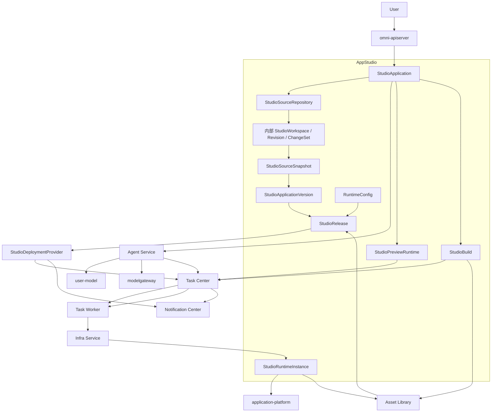

---

# 4. 领域职责

## 4.1 AppStudio

AppStudio 负责：

* StudioApplication 与 StudioApplicationVersion。
* StudioSourceRepository。
* 内部 StudioWorkspace、SourceFile、Revision 和 StudioChangeSet。
* StudioSourceSnapshot。
* StudioPreviewRuntime。
* StudioBuild。
* StudioRelease。
* RuntimeConfig、StudioRelease 和 StudioRuntimeInstance。
* 发布、升级和回滚入口。
* 源码、构建和发布活动记录。
* 页面和用户交互。

AppStudio 不负责：

* Coding Agent Runtime 生命周期。
* Agent Session 和 Memory。
* Agent Skills 和 MCP。
* LLM Provider 协议。
* API Key 存储。
* Docker 或 Kubernetes 操作。
* GPU 调度。
* Task Center 内部执行。
* Application Platform 能力定义。

---

## 4.2 Agent Service

Agent Service 负责：

* Coding Agent。
* AgentProfile。
* AgentSession。
* AgentMessage。
* AgentInvocation。
* AgentMemory。
* AgentModelBinding。
* Agent 的内部固定 StudioWorkspace 引用。
* AgentSkillBinding。
* AgentMCPBinding。
* AgentRuntimeBinding。
* Agent 启动、挂起、恢复和异常恢复。

AppStudio 通过 Agent Service 使用 Coding Agent。

```text
StudioApplication
    ↓
固定绑定 StudioWorkspace 的 Coding Agent
    ↓
AppStudio Workspace Tool
```

AppStudio 不直接调用 Coding Agent Runtime Endpoint。

---

## 4.3 Source Repository 与 StudioWorkspace

AppStudio 拥有逻辑源码仓库、内部默认 StudioWorkspace、文件索引、单调 Revision、StudioChangeSet 和不可变 StudioSourceSnapshot。底层存储 Provider 只实现存取，不形成第二个 Workspace 事实领域。用户语义只使用“源码”“代码版本”和“Revision”，不以 Workspace 作为导航层。

Workspace 生命周期独立于：

* Coding Agent。
* Agent Runtime。
* Preview Runtime。
* Build Runtime。
* StudioApplication Runtime。

规则：

* AgentWorkspace 由 Infra 按 Agent 的有效授权挂载。
* Coding Agent 访问 StudioWorkspace 只能通过 AppStudio Workspace Tool 和受控授权；Agent/Infra 不得直接读取 AppStudio 私有存储。
* 所有源码写入必须提交 `base_revision`、幂等键和完整操作集合；只在当前 Revision 等于 `base_revision` 时原子应用并生成下一个 Revision。
* Revision 冲突、路径越权、操作无效或安全校验失败时，整个 ChangeSet 拒绝，不自动覆盖、不隐式合并、不部分应用。
* Preview Runtime 只能挂载启动时授权的当前源码 Revision；源代码默认只读，临时写入使用隔离临时卷。
* Build 只能只读挂载固定 StudioSourceSnapshot，不得读取持续变化的 Workspace。
* Production Runtime 只能只读挂载固定 Artifact digest，禁止挂载可写 Workspace、Revision 或 Snapshot。
* Agent 删除不自动删除 Workspace。
* StudioApplication 发布不改变 Workspace 内容。

---

## 4.4 Infra Service

Infra Service 负责：

* 创建 Job 和 Service。
* 选择运行节点。
* 分配 CPU、内存、GPU 和磁盘。
* 解析 RuntimeProfile。
* 挂载 Workspace。
* 挂载 StudioSourceSnapshot。
* 挂载 Artifact。
* 注入配置和 Secret。
* 分配 Endpoint。
* 健康检查。
* 日志采集。
* 退出码。
* 超时和清理。
* Runtime 状态对账。

AppStudio 只持有：

```text
atomicTaskId
infraRuntimeId
endpointRef
runtimeStatusSummary
```

AppStudio 不保存 Provider 专属信息。

---

## 4.5 user-model

`user-model` 管理当前用户私有模型：

```text
UserModelProvider
UserProviderModel
UserDefaultModel
```

AppStudio 不直接读取用户 API Key。

Coding Agent 模型由 Agent Service 根据：

```text
USER_DEFAULT_MODEL
USER_PROVIDER_MODEL
PLATFORM_MODEL
```

进行解析。

---

## 4.6 modelgateway

`modelgateway` 将模型引用标准化为：

```text
ModelAccessSpec
```

包含：

```text
providerType
protocol
baseUrl
model
credentialRef
contextWindow
capabilities
```

Infra Service 根据 `credentialRef` 注入凭证。

Coding Agent Runtime 或 StudioApplication Runtime 自行调用模型服务。

---

## 4.7 Task Center

Task Center 负责：

* 异步任务。
* TaskAttempt。
* 排队。
* 重试。
* 取消。
* 超时。
* 并行和依赖。
* 用户可见任务状态。

AppStudio 中以下操作进入 Task Center：

```text
APPSTUDIO_PREVIEW_START
APPSTUDIO_PREVIEW_STOP
APPSTUDIO_BUILD
APPSTUDIO_TEST
APPSTUDIO_RELEASE_CREATE
APPSTUDIO_DEPLOY
APPSTUDIO_UPDATE_DEPLOYMENT
APPSTUDIO_ROLLBACK
APPSTUDIO_DELETE
```

以上任务均由 Task Center 分发给 Task Worker；AppStudio、StudioDeploymentProvider 和 Agent Service 不直接调用 Infra Service。Task Worker 的 Infra Adapter 才能把业务授权引用转换为 Infra 请求。

Coding Agent 的启动和长操作任务由 Agent Service 创建。

---

## 4.8 StudioDeploymentProvider

StudioDeploymentProvider 负责：

* StudioRelease 的长期运行。
* StudioRuntimeInstance。
* 实例期望状态。
* Release 切换。
* 回滚。
* Endpoint。
* 健康策略。

AppStudio 只保存自身 StudioRuntimeInstance 及 Task Center/Task Worker 返回的稳定引用和摘要：

```text
infraRuntimeId
endpointRef
healthStatus
```

---

## 4.9 Application Platform

StudioApplication 可以调用已发布：

```text
ApplicationVersion
```

调用链：

```text
StudioApplication Runtime
    ↓
Application Platform API
    ↓
ApplicationRun
    ↓
Task Center
```

StudioApplication 不读取应用引擎、能力绑定或 Provider 内部配置。

---

## 4.10 Asset Library

StudioApplication 可以：

* 选择 Asset。
* 上传素材。
* 读取预览。
* 使用 AssetReference。
* 接收 ArtifactReference。
* 将输出登记为 Asset。

StudioApplication 不直接操作 Blob 物理路径。

---

# 5. 核心领域对象

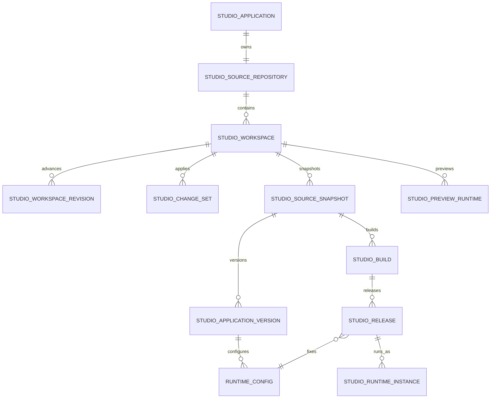

---

## 5.1 StudioApplication

内部 canonical 字段：

```text
id
ownerUserId
name
description
status
defaultWorkspaceId
currentVersionId
codingAgentId
codingSessionId
codingAgentGeneration
createdAt
updatedAt
lastActivityAt
```

`defaultWorkspaceId` 仅用于后端内部绑定；StudioApplication 公共 DTO、页面和导航不返回 Workspace ID。

状态：

```text
CREATING
READY
ARCHIVED
ERROR
```

StudioApplication 状态只表示应用身份是否可编辑和可管理，不承载 Preview、Build、Release 或 Runtime 的活动状态。同一应用可以同时存在 Preview、Build 和健康的 Production Runtime，各自状态由对应对象拥有。

---

## 5.2 StudioSourceRepository

表示 StudioApplication 的逻辑源码仓库身份。它不暴露 Git、对象存储或文件系统 Provider 私有配置。

字段：

```text
id
studioApplicationId
defaultWorkspaceId（内部默认源码上下文）
status
createdAt
updatedAt
```

状态：

```text
CREATING
READY
ARCHIVED
ERROR
```

AppStudio 不创建第二套 Conversation。AgentSession、AgentMessage、AgentInvocation 和 Memory 全部归 Agent Service；StudioApplication 内部保存当前 `codingAgentId/codingSessionId/codingAgentGeneration`，并只在 ChangeSet 审计上下文中保存稳定的 Agent、Session 和 Invocation ID。这些内部 ID 不得投影 Workspace，也不得让公共 Agent API 暴露 Coding Agent。

---

## 5.3 内部 StudioWorkspace

字段：

```text
id
studioApplicationId
repositoryId
currentRevision
status
createdAt
updatedAt
```

每个 StudioApplication 由后端自动创建唯一默认 StudioWorkspace。当前 S1 不支持多人实时协作，但允许多个 Coding Agent 固定引用同一 Workspace；所有写入仍按 Revision 串行提交。用户只看到应用级源码状态，不创建、选择或切换 Workspace。

---

## 5.4 StudioWorkspaceRevision 与 StudioChangeSet

`StudioWorkspaceRevision` 是内部源码上下文每次成功原子变更后的单调版本；公共投影称为应用 `source_revision`：

```text
workspaceId
revision
changeSetId
contentDigest
createdAt
```

`StudioChangeSet` 表示一次完整源码写入，公共接口通过 `studio_application_id` 寻址内部 Workspace：

```text
id
workspaceId
baseRevision
targetRevision
idempotencyKey
operations
agentId
agentSessionId
agentInvocationId
status
failureReason
createdAt
```

`operations` 只允许受控的 `CREATE`、`UPDATE`、`DELETE`、`MOVE`。提交时必须校验 Workspace、Tool 授权、路径、内容大小、安全限制和 `baseRevision`。只有全部校验通过才一次性应用并生成 `targetRevision=baseRevision+1`；任一项失败都不得修改 Workspace。

---

## 5.5 StudioSourceSnapshot

内部 canonical 字段：

```text
id
workspaceId
revision
contentDigest
manifestDigest
status
reason
createdBy
createdAt
```

创建 Snapshot 的场景：

* Build 前。
* Release 前。
* Hotfix 前。
* 用户主动保存版本点。
* 大范围 Agent 修改前。

Snapshot 创建后不可变。Build 必须引用状态为 `READY` 的固定 Snapshot，不允许直接读取持续变化的 Workspace；Snapshot 失败或 digest 不完整时不得创建 Build。

---

## 5.6 StudioPreviewRuntime

字段：

```text
id
studioApplicationId
workspaceId
workspaceRevision
atomicTaskId
infraRuntimeId
runtimeProfileId
runtimeProfileRevision
endpointRef
status
expiresAt
createdAt
updatedAt
```

状态：

```text
PENDING
RUNNING
STOPPED
FAILED
EXPIRED
```

StudioPreviewRuntime 是 AppStudio 对 Infra Runtime 的业务投影。公共 Preview DTO 使用 `studioApplicationId/sourceRevision`，不返回内部 Workspace ID。

---

## 5.7 StudioBuild

字段：

```text
id
ownerUserId
name
studioApplicationId
sourceSnapshotId
atomicTaskId
infraJobId
status
runtimeProfileId
runtimeProfileRevision
artifactId
artifactDigest
validationResult
logsRef
createdAt
completedAt
```

状态：

```text
PENDING
RUNNING
SUCCEEDED
FAILED
CANCELED
```

`ownerUserId` 是 StudioBuild 的 canonical 所属用户事实，创建后不可变，并作为 StudioBuild Bundle Artifact 的 owner 来源；Asset Library 不从 Task Worker、管理员角色或 Build 协作者推断 owner。

`PREPARING/INSTALLING/BUILDING/VALIDATING` 可以作为 Task 进度阶段展示，但不是 AppStudio 自有状态机。StudioBuild 只有在 AtomicTask 成功、Asset Library 中 Artifact 已完成且其 digest 与 Build 返回值一致后才能进入 `SUCCEEDED`；Task 成功不能单独推断 Build 成功。

---

## 5.8 StudioApplicationVersion

字段：

```text
id
studioApplicationId
version
sourceSnapshotId
status
publishedAt
```

状态：

```text
DRAFT
PUBLISHED
RETIRED
```

Version 固定一个 StudioSourceSnapshot。发布后不可变，后续源码 Revision 和 Snapshot 不得改写历史 Version。

---

## 5.9 RuntimeConfig

字段：

```text
id
studioApplicationVersionId
environment
publicConfig
secretReferences
integrationReferences
validationStatus
resourceVersion
```

RuntimeConfig 只保存公开配置和 `secret://`、`integration://` 引用，不保存明文 Secret。更新采用整体替换并校验 `resourceVersion`；Release 创建时固定一个已校验的 RuntimeConfig 引用，后续配置更新不得改写历史 Release。

---

## 5.10 StudioRelease

字段：

```text
id
studioApplicationId
studioBuildId
studioApplicationVersionId
environment
runtimeConfigId
artifactId
artifactDigest
status
runtimeInstanceId
createdBy
createdAt
```

状态：

```text
PENDING
DEPLOYING
READY
FAILED
SUPERSEDED
```

Release 创建后，Build、Version、RuntimeConfig、Artifact ID 和 digest 均不可变。说明性 `releaseNotes` 可以作为独立元数据修改，但不属于不可变运行契约。

---

## 5.11 StudioRuntimeInstance

字段：

```text
id
studioReleaseId
atomicTaskId
infraRuntimeId
endpointRef
healthStatus
status
isCurrent
createdAt
updatedAt
```

状态：

```text
CREATING
READY
DEGRADED
STOPPED
FAILED
```

StudioRuntimeInstance 是 AppStudio 对一个具体发布运行实例的业务事实。每个 StudioApplication/Environment 最多一个 `isCurrent=true` 实例。新实例只有通过 Release 固定的健康检查并进入 `READY/HEALTHY` 后才能原子切换当前入口；创建、部署或健康检查失败不得停止、覆盖或改写旧健康实例。

---

# 6. StudioApplication 创建

## 6.1 创建输入

```text
name
description
initialRequirement
applicationType
initialAssets
backendRequired
codingAgentProfile
codingModelSelection
idempotencyKey
```

创建结果：

```text
StudioApplication
StudioSourceRepository
内部默认 StudioWorkspace(revision=0)
Coding Agent
AgentSession
首次 CODING AgentInvocation
```

其中源码对象归 AppStudio；Coding Agent 和 AgentSession 由 Agent Service 创建。`CreateStudioApplication` 不接受 Workspace 输入；AppStudio 创建唯一默认 StudioWorkspace 后，通过内部 `CreateCodingAgentForStudio` 请求 Agent Service 固定绑定 Coding Agent。前端不得调用或替换该内部 Workspace 引用。

---

## 6.2 应用类型

S1 支持：

```text
STATIC_WEB
WEB_WITH_LIGHT_BACKEND
```

不支持：

```text
任意语言后端
用户自定义操作系统
用户自定义 Dockerfile
桌面原生应用
移动原生应用
```

---

## 6.3 创建流程

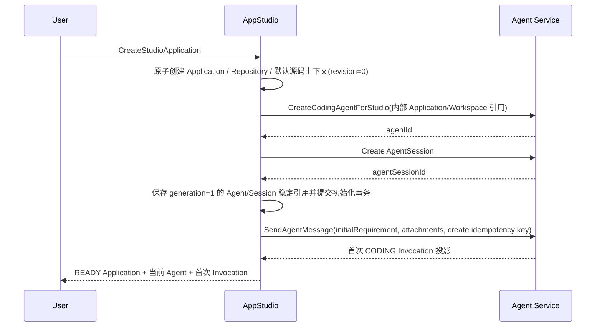

Application、Repository、默认源码上下文 revision 0、Coding Agent、默认 Session、WorkspaceBinding 和选定的 ACTIVE primary ModelBinding 必须作为一个初始化事务提交。初始化失败时不得产生可用项目；同一 owner 与创建幂等键重试不得重复创建任何初始化对象。初始化成功后 Application 进入 `READY`，再以创建幂等键派生的稳定消息/Invocation 幂等键持久化初始需求并提交首次 CODING Invocation。首次 Invocation 的 Task 提交失败不得删除或降级已 READY 的项目；该 Invocation 以 `ERR_AGENT_INVOCATION_TASK_UNAVAILABLE` 标记 `FAILED`，同一创建幂等键只能复用同一 Message/Invocation 重试 Task 提交，不得重复创建项目、Agent、Session、Binding 或 Invocation。

创建时不要求 Runtime 已经 READY，但初始需求会自动触发首次 Invocation 的 Task 驱动 Runtime gating。`codingModelSelection` 必须由用户明确选择并形成 Coding 用途的 ACTIVE primary ModelBinding，不得回退到用户默认模型或其他隐式模型。

---

# 7. Coding Agent 开发

## 7.1 发送开发指令

AppStudio 先按应用 owner 解析当前 generation 的内部 Agent/Session，再向 Agent Service 提交：

```text
agentId
agentSessionId
instruction
attachments
studioApplicationContext
idempotencyKey
```

用户通过应用级接口查看 Agent 状态、发送消息、查询 Invocation/事件、取消、挂起、恢复和替换。响应可以返回稳定 Agent/Session/Invocation ID 供诊断与导航，但不得返回 Workspace、Runtime Endpoint、模型凭证或 Infra 引用。

附件可以包含：

```text
AssetReference
ArtifactReference
SourceFileReference
BuildLogReference
PreviewLogReference
```

---

## 7.2 开发流程

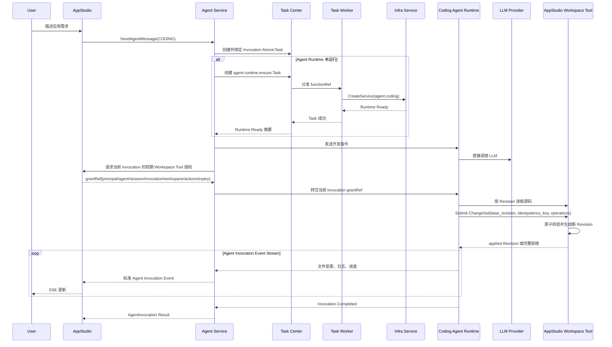

---

## 7.3 AppStudio 保存的信息

AppStudio 保存源码事实和审计引用：

```text
StudioChangeSet
baseRevision / targetRevision
agentId / agentSessionId / agentInvocationId
operations 摘要
validationSummary
```

详细 Agent 消息和事件归 Agent Service 所有。

应用级 Invocation 投影必须聚合其审计关联的全部 `APPLIED` StudioChangeSet：`resultingChangeSetId` 取最大 `targetRevision` 对应的最后一个 ChangeSet，`resultingSourceRevision` 取最大的 `targetRevision`；没有已应用 ChangeSet 时二者为空。用户选择历史 Invocation 恢复时，把该 `resultingSourceRevision` 传给既有 source restore API；AppStudio 以当前 Revision 为 `baseRevision` 创建新的 Restore ChangeSet 和新 Revision，不改写 Session、Message、Invocation、原 ChangeSet 或历史 Revision。后续 Coding Agent 在相同当前 Session 和新当前 Revision 上继续工作。

## 7.5 挂起、恢复与替换

挂起和恢复只代理到当前 generation 的 Coding Agent，并继承 Agent 的 Task、模型校验和 Session 恢复语义。替换必须创建新的 Coding Agent 和默认 Session，成功后原子递增 `codingAgentGeneration` 并切换当前引用；旧 Agent、Session、Invocation、Message、Memory 与 ChangeSet 审计历史保留且不改写。创建新 Agent 失败时继续保留旧引用，不能留下指向半创建 Agent 的 generation。

---

## 7.4 Coding Agent 权限

默认允许：

* 通过短期 Source Tool 授权读取当前 Revision。
* 提交带 `base_revision` 和幂等键的原子 ChangeSet。
* 在 ChangeSet 内创建、修改、移动和删除受权文件。
* 执行受控开发命令。
* 执行测试。
* 读取 Build 日志。
* 读取 Preview 日志。
* 调用允许的 MCP 和 Skills。
* 调用配置的 LLM。

禁止：

* 操作 Docker Socket。
* 操作 Kubernetes API。
* 获取宿主机 Shell。
* 访问其他用户的应用源码。
* 直接挂载 StudioWorkspace 或读取 AppStudio 私有存储。
* 绕过 ChangeSet 写文件、自动覆盖 Revision 冲突或部分应用操作。
* 读取明文 Secret。
* 修改不可变 Release。
* 修改生产 Runtime。
* 绕过 Infra Service 启动服务。

---

# 8. 技术栈约束

## 8.1 前端

S1 固定：

```text
React 18
TypeScript
Vite
```

可使用：

* OmniMAM UI Components。
* HTTP Client。
* SSE Client。
* Asset Selector。
* Task Status Components。
* User Context Client。
* Application Platform Client。

---

## 8.2 轻量后端

S1 固定：

```text
Node.js
TypeScript
Lightweight HTTP Service
```

适合：

* 聚合前端请求。
* 调用 OmniMAM API。
* 保存少量应用配置。
* 调用 LLM Provider。
* 接收任务状态。
* 实现轻量业务逻辑。

禁止重复实现：

* Task Center。
* Application Platform。
* Asset Library。
* Notification Center。
* 用户认证系统。
* Agent Service。
* 容器管理。
* GPU 调度。

---

## 8.3 RuntimeProfile

S1 建议提供：

```text
appstudio.preview.static-web
appstudio.preview.web-backend

appstudio.build.static-web
appstudio.build.web-backend

studioapp.runtime.static-web
studioapp.runtime.web-backend
```

Coding Agent 使用：

```text
agent.coding
```

RuntimeProfile 的具体镜像、命令和 Provider 实现归 Infra Service 所有。

---

# 9. Preview

## 9.1 定位

Preview 用于运行启动时授权的当前源码 Revision，不直接跟随后续未授权变更。

特点：

* 临时 Service。
* 挂载启动时固定的源码 Revision。
* 支持重启。
* 重启或显式切换 Revision 时创建新的 Preview Task，不隐式跟随后续源码变化。
* 不创建 Release。
* 不作为正式生产服务。
* 删除 Preview 不影响应用源码。
* 可以通过 IP 加端口访问。

---

## 9.2 Preview 流程

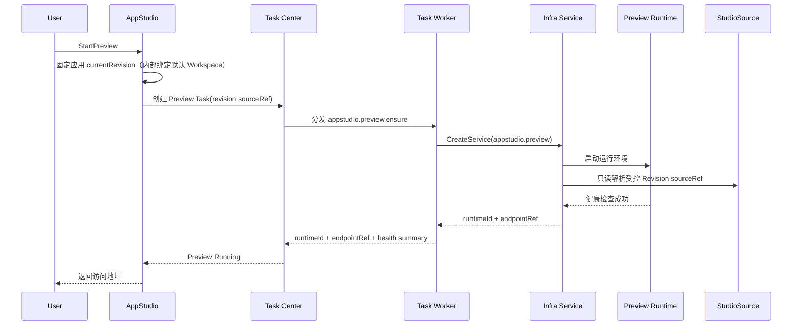

---

## 9.3 Preview 与 Agent 的关系

Coding Agent 可以读取 Preview 日志，但不直接控制 Preview Runtime。

正确链路：

```text
Coding Agent
    ↓ 请求 AppStudio 工具
AppStudio
    ↓
Task Center
    ↓
Task Worker / Infra Adapter
    ↓
Infra Service
```

禁止 Coding Agent 直接调用 Infra Service。

---

## 9.4 Preview 访问地址

第一阶段：

```text
http://<host-ip>:<allocated-port>
```

AppStudio 保存受控 `endpointRef` 和权限裁剪后的 Endpoint 摘要，而非将 Host Port 作为业务主键。Preview 默认只能由当前受权用户访问；不得因为分配了 Host Port 就自动成为公开 Endpoint。

---

# 10. Build

## 10.1 Build 输入

```text
studioApplicationId
sourceSnapshotId
studioApplicationVersionId
runtimeProfileId
runtimeProfileRevision
buildConfig
dependencyLock
```

`studioApplicationVersionId` 可以在探索性 Build 中为空；用于 Release 的 Build 必须绑定一个固定相同 Snapshot 的 StudioApplicationVersion。

---

## 10.2 Build 输出

```text
buildId
status
artifactId
artifactDigest
validationResult
logsRef
sourceSnapshotId
```

发布物统一引用 Asset Library 的：

```text
Artifact ID + immutable digest
```

AppStudio 不关心其底层是：

```text
OCI Image
Static Bundle
Archive
```

---

## 10.3 Build 流程

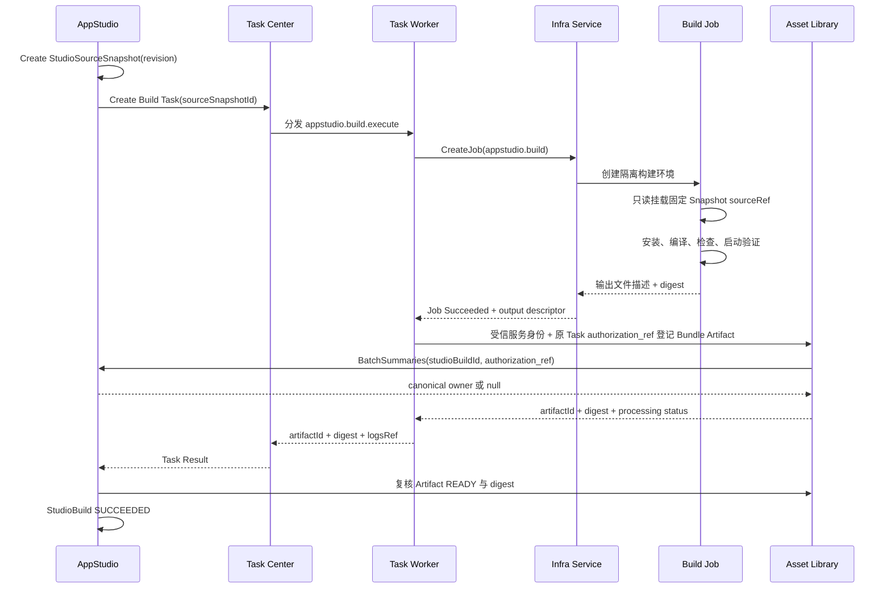

---

## 10.4 最低构建门禁

必须执行：

1. Lock File 检查。
2. 依赖安装。
3. TypeScript 编译。
4. 静态检查。
5. 前端构建。
6. 后端启动检查。
7. `/health` 检查。
8. 应用入口检查。
9. 禁止明文 Secret 检查。
10. Release Artifact 完整性检查。

Build 失败不得创建 Release。AtomicTask 成功但 Artifact 未完成、登记失败或 digest 不一致时，StudioBuild 仍不能进入 `SUCCEEDED`。

Bundle Artifact 固定声明 `producer_type=studio_build`、`producer_id=StudioBuild.id` 和 `producer_idempotency_key=studio-build:<studio_build_id>:bundle`。同一 StudioBuild 的自动 TaskAttempt 重试复用该 key；新的逻辑 Build 必须创建新的 StudioBuild ID。Task Worker 必须携带受信服务身份和原 Build Task 的 `authorization_ref`，Asset Library 通过 AppStudio 投影解析 `StudioBuild.owner_user_id`，不得读取 AppStudio 私表或接受 Worker 自报 owner。

---

## 10.5 依赖规则

* 必须存在 Lock File。
* 不允许 Build 时自动升级主要版本。
* 不允许执行未知远程安装脚本。
* 依赖安装必须在隔离 Runtime 中完成。
* Production Runtime 不执行动态依赖安装。
* Release 中的依赖必须固定。

---

# 11. Release

## 11.1 创建流程

```text
StudioSourceSnapshot
    ↓
StudioBuild
    ↓
Artifact READY + digest verified
    ↓
StudioApplicationVersion + RuntimeConfig
    ↓
StudioRelease
```

---

## 11.2 不可变内容

Release 创建后禁止修改：

* 源代码。
* 依赖。
* Artifact。
* Artifact Digest。
* StudioApplicationVersion。
* RuntimeConfig 引用。
* Environment。

允许单独修改：

```text
releaseNotes
```

---

# 12. 发布与 StudioRuntimeInstance

## 12.1 发布流程

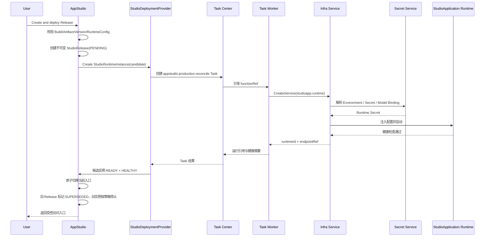

部署、升级和回滚都先创建候选 Release/RuntimeInstance。候选实例未健康前不得修改当前入口或停止旧健康实例；失败时新 Release 标记 `FAILED`，旧 Release 和入口保持不变。

---

## 12.2 ModelBinding

StudioApplicationVersion 定义 ModelBinding 需求，RuntimeConfig 保存实际绑定引用，StudioRelease 固定该 RuntimeConfig。

支持：

```text
USER_DEFAULT_MODEL
USER_PROVIDER_MODEL
PLATFORM_MODEL
NONE
```

示例：

```json
{
  "name": "primary-llm",
  "sourceType": "USER_DEFAULT_MODEL",
  "purpose": "CHAT",
  "required": true
}
```

部署时：

```text
ModelBinding
    ↓
user-model 校验模型
    ↓
modelgateway 生成 ModelAccessSpec
    ↓
Infra Service 注入 Runtime
```

StudioApplication Runtime 自行调用模型。

---

## 12.3 用户私有模型限制

当 StudioApplication 使用用户私有模型时：

* 必须具有当前用户授权上下文。
* user-model 校验模型所有权。
* 不允许客户端传入任意 userId。
* 不向 StudioApplication 前端返回 CredentialRef。
* Infra Service 仅向 Runtime 注入运行期凭证。
* Runtime 日志必须脱敏。

需要说明：

> 如果 StudioApplication 面向多个用户，不能在 RuntimeInstance 启动时永久注入应用创建者的用户私有模型凭证。

多用户 StudioApplication 应采用以下方式之一：

1. 由每个用户提供运行时授权。
2. 使用平台模型。
3. 后续使用受控 Gateway Proxy。

S1 中使用用户私有模型的 StudioApplication 默认仅支持应用所有者私有使用。

---

# 13. StudioApplication 调用 Application Platform

StudioApplication 可以调用已发布的 `ApplicationVersion`。

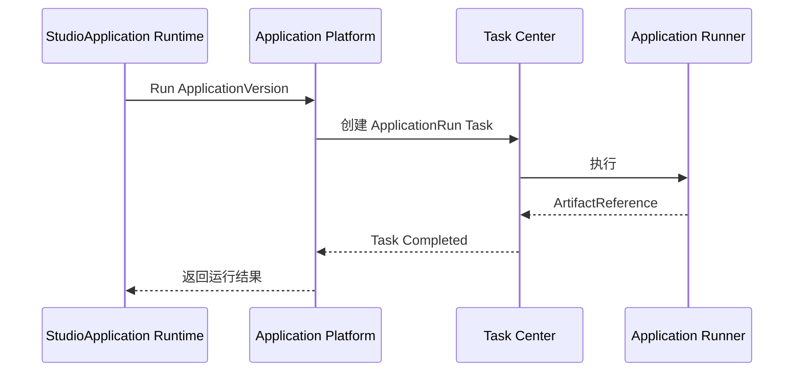

要求：

* 只能引用已发布 ApplicationVersion。
* 必须经过权限校验。
* 长任务必须通过 Task Center。
* StudioApplication 不得直接读取底层 Engine 配置。

---

# 14. StudioApplication 调用素材能力

## 14.1 输入

StudioApplication 可以使用：

```text
AssetReference
ArtifactReference
```

作为：

* 模型输入。
* ApplicationRun 输入。
* FFmpeg 输入。
* Python 图像处理输入。

---

## 14.2 输出

输出流程：

```text
Runtime Output
    ↓
Task Worker 提交 Asset Library
    ↓
Artifact READY
    ↓
可选登记为 Asset
```

StudioApplication 不直接写入 Blob 物理路径。

---

## 14.3 素材处理

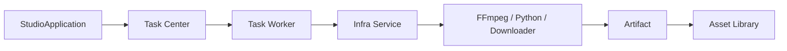

---

# 15. Hotfix 与回滚

## 15.1 Hotfix

禁止修改生产 Runtime。

正确流程：

```text
当前 Release
    ↓
从目标 StudioSourceSnapshot 恢复为新的源码 Revision 或 ChangeSet
    ↓
Coding Agent 修改
    ↓
Preview
    ↓
Build
    ↓
新 Release
    ↓
创建新 StudioRelease 和候选 StudioRuntimeInstance
```

---

## 15.2 回滚

回滚不修改或重新激活旧 Release，而是基于目标历史 Release 的不可变 Version、Artifact ID/digest 和兼容 RuntimeConfig 创建一条新的 StudioRelease：

```text
Release 5
    ↓ rollback
Release 6 (content copied from Release 3)
```

新 RuntimeInstance 健康后才切换入口，因此回滚同样保留完整审计顺序，并遵守与普通升级相同的失败保护。

禁止：

* 修改当前容器文件。
* 将 Workspace 挂载到 Production Runtime。
* 在生产 Runtime 中执行 Git 回退。
* 修改旧 Release。

---

# 16. Agent 与 StudioApplication 生命周期

## 16.1 StudioApplication 归档

StudioApplication 归档时：

* 停止 Preview。
* 可以挂起 Coding Agent。
* 保留 Repository、Workspace、Revision、ChangeSet 和 Snapshot。
* 保留 Build 和 Release。
* 不自动停止已发布 StudioApplication。

---

## 16.2 StudioApplication 删除

S1 建议软删除。

删除 StudioApplication 时：

* 默认软删除或归档应用身份及其源码入口。
* 可以请求 Agent Service 删除默认 Coding Agent，但 Agent 删除失败不得改写源码历史。
* Repository、Workspace、Revision、ChangeSet、Snapshot、Version、Build 和 Release 按保留策略继续存在，不做隐式级联硬删除。
* 不自动停止仍对外服务的健康 StudioRuntimeInstance；必须先显式停止或确认解除入口。

---

## 16.3 Coding Agent 删除

Coding Agent 删除规则归 Agent Service。

AppStudio 只解除默认 Agent 稳定引用；不得删除或改写 AgentSession/Invocation，也不得因 Agent 删除而改写源码、Build、Release 或 RuntimeInstance。

---

# 17. 权限模型

## 17.1 应用所有权

以下对象必须校验当前用户：

```text
StudioApplication
StudioSourceRepository
StudioWorkspace
StudioWorkspaceRevision
StudioChangeSet
StudioSourceSnapshot
StudioApplicationVersion
StudioPreviewRuntime
StudioBuild
RuntimeConfig
StudioRelease
StudioRuntimeInstance
```

用户身份必须来自认证上下文。

Workspace Tool 授权不得仅凭 `agentId`。每次授权必须同时绑定 Principal、Agent、Session、Invocation、Workspace、动作集合和有效期；AppStudio 每次读写都重新校验，且 Agent Runtime Identity 不自动继承应用所有者权限。

`appstudio.build.manage` 允许 owner、`authorized_editor` 和 `system_admin` 在各自授权范围内查看 StudioBuild，包括受控 Build 摘要投影；服务身份还必须携带原任务 `authorization_ref` 并按委托用户重新执行相同可见性校验，不能仅凭服务身份绕过用户权限。StudioBuild 可见性不授予其 Artifact 权限：`authorized_editor`、`system_admin` 或其他协作者若不是 `StudioBuild.owner_user_id` 对应的 Artifact owner，仍不能读取该 Artifact。

---

## 17.2 Service Identity

StudioApplication Runtime 使用独立 Service Identity。

区分：

### 应用身份

用于：

* 获取应用配置。
* 健康检查。
* 调用应用允许的平台接口。
* 写入应用自身数据。

### 当前用户身份

用于：

* 访问用户 Asset。
* 使用用户私有模型。
* 查询用户任务。
* 创建 ApplicationRun。

应用身份不能自动继承应用创建者的全部权限。

---

## 17.3 Preview 身份

Preview Runtime 只能访问：

* 当前应用启动时固定的源码 Revision。
* 当前应用开发配置。
* 当前用户显式授权的模型或素材。
* 开发环境专用 Secret。

Preview 不得自动使用生产 Secret。

---

# 18. Secret 与配置

## 18.1 Environment Schema

StudioApplicationVersion 定义配置需求 Schema，RuntimeConfig 保存实际 Binding 引用，Release 只固定 RuntimeConfig ID：

```json
{
  "fields": [
    {
      "name": "OMNIMAM_API_BASE_URL",
      "type": "string",
      "required": true,
      "source": "PLATFORM"
    },
    {
      "name": "APP_MODE",
      "type": "string",
      "required": true,
      "defaultValue": "production"
    }
  ]
}
```

RuntimeConfig 更新必须整体替换并校验 `resourceVersion`。已创建 Release 不受后续 RuntimeConfig 更新影响。

---

## 18.2 Secret 规则

禁止：

* Secret 写入应用源码。
* Secret 写入代码。
* Secret 写入 Build Artifact。
* Secret 写入 Release。
* Secret 返回前端。
* Secret 写入 Agent Message。
* Secret 写入 Build 日志。

Secret 只通过：

```text
SecretRef
```

传递，由 Infra Service 在 Runtime 启动阶段注入。

---

# 19. 页面设计

## 19.1 AppStudio 首页

展示：

* 我的应用。
* 最近编辑。
* 最近发布。
* 正在运行的 StudioApplication。
* Build 失败应用。
* Preview 中的应用。
* 快速创建入口。

---

## 19.2 应用工作台

建议布局：

```text
左侧：文件树、页面结构、应用资源
中间：Preview
右侧：Coding Agent 对话
底部：Task、Preview、Build、Runtime 状态
```

主要操作：

* 描述需求。
* 查看 AgentInvocation。
* 查看代码变更。
* 查看 Diff。
* 启动或刷新 Preview。
* 查看 Preview 日志。
* 创建 Snapshot。
* 创建 Build。
* 创建 Release。
* 发布。
* 回滚。

---

## 19.3 Agent 面板

展示：

* Coding Agent 状态。
* 当前 AgentInvocation。
* 模型选择。
* Session。
* 最近修改摘要。
* Skills。
* MCP。
* 挂起和恢复。

Agent 面板不渲染 Workspace 名称、类型、ID 或绑定状态，也不提供相关跳转、选择或编辑入口。

---

## 19.4 Build 页面

展示：

* Snapshot。
* Task 状态。
* 编译日志。
* 验证结果。
* 依赖信息。
* Artifact Digest。
* 错误列表。
* “交给 Coding Agent 修复”入口。

---

## 19.5 Release 页面

展示：

* Release 版本。
* 来源 Snapshot。
* Build。
* Artifact Digest。
* StudioApplicationVersion。
* RuntimeConfig 摘要。
* 发布说明。
* 关联 StudioRuntimeInstance。

---

## 19.6 StudioApplication 页面

展示：

* 应用信息。
* 当前 Release。
* 访问地址。
* StudioRuntimeInstance 状态和健康。
* ModelBindings。
* Environment Bindings。
* 启动和停止。
* 更新 Release。
* 回滚。
* 日志。
* 任务。
* 通知。

---

# 20. 主要接口

以下为逻辑接口，不限定 HTTP 或 RPC 路径。

## 20.1 StudioApplication

```text
CreateStudioApplication
GetStudioApplication
ListStudioApplications
UpdateStudioApplication
ArchiveStudioApplication
DeleteStudioApplication
```

---

## 20.2 Agent 协作

```text
SendStudioMessage
GetStudioAgentStatus
GetStudioAgentInvocation
ListStudioAgentInvocations
StreamStudioAgentInvocationEvents
CancelStudioAgentInvocation
SuspendStudioAgent
ResumeStudioAgent
ReplaceStudioAgent
```

实际 Agent 操作转交 Agent Service。

---

## 20.3 源码与 Revision

```text
ListSourceFiles
GetSourceFile
ApplyStudioChangeSet
ListSourceRevisions
CreateStudioSourceSnapshot
GetStudioSourceSnapshot
ListStudioSourceSnapshots
RestoreSourceRevisionAsChangeSet
GetSourceDiff
```

---

## 20.4 Preview

```text
StartPreview
RestartPreview
StopPreview
GetPreview
GetPreviewStatus
GetPreviewLogs
```

---

## 20.5 Build

```text
CreateBuild
GetBuild
ListBuilds
CancelBuild
RetryBuild
GetBuildLogs
```

---

## 20.6 Release

```text
CreateStudioApplicationVersion
GetStudioApplicationVersion
ListStudioApplicationVersions
GetRuntimeConfig
ReplaceRuntimeConfig
CreateRelease
GetRelease
ListReleases
UpdateReleaseNotes
```

---

## 20.7 Artifact 与构建结果

```text
GetBuildArtifactSummary
RetryArtifactRegistration
POST /api/v1/studio-builds/batch-summaries
```

`POST /api/v1/studio-builds/batch-summaries` 使用 `appstudio.build.manage`，为 Asset Library 提供受控的一跳 producer 投影。请求为 `items: [{id}]`，每次 1 至 200 项；响应使用 `total/items` 并严格保持请求顺序。每个响应项原样返回请求 `id` 和 nullable `studio_build`；投影仅包含 `id`、`owner_user_id`、`name`、`status`，不得包含 Task 参数、`authorization_ref`、诊断、日志、Artifact ID/digest、源码或 Snapshot 信息。

普通 Artifact 列表与详情使用当前调用者身份读取该投影；Task Worker 创建 Artifact 时使用受信服务身份并传递原 Build Task 的 `authorization_ref`，AppStudio 以委托用户执行 `appstudio.build.manage` 校验。StudioBuild 不存在或对该用户不可见时统一返回 `studio_build=null`，不得泄露原因差异；AppStudio 不因调用方是服务身份而跳过用户权限。

---

## 20.8 StudioRuntimeInstance

```text
DeployRelease
GetStudioRuntimeInstance
ListStudioRuntimeInstances
StopStudioRuntimeInstance
RollbackRelease
GetStudioRuntimeLogs
```

---

# 21. 事件

## 21.1 AppStudio 业务事件

```text
appstudio.application.created
appstudio.application.updated
appstudio.application.archived

appstudio.agent.bound
appstudio.agent.invocation.completed
appstudio.agent.invocation.failed

appstudio.changeset.applied
appstudio.changeset.rejected
appstudio.snapshot.created
appstudio.version.published

appstudio.preview.starting
appstudio.preview.running
appstudio.preview.stopped
appstudio.preview.failed

appstudio.build.started
appstudio.build.succeeded
appstudio.build.failed
appstudio.build.canceled

appstudio.release.created

appstudio.runtime.created
appstudio.runtime.ready
appstudio.runtime.degraded
appstudio.runtime.failed
appstudio.release.rolled_back
```

---

## 21.2 非 AppStudio 事件

以下属于 Agent Service：

```text
agent.started
agent.suspended
agent.invocation.started
agent.runtime.failed
```

以下属于 Infra Service：

```text
infra.runtime.created
infra.runtime.started
infra.runtime.failed
infra.runtime.deleted
```

以下属于 Task Center：

```text
task.queued
task.retrying
task.completed
task.failed
```

AppStudio 只消费必要事件并更新业务投影。

---

# 22. 错误处理

## 22.1 Coding Agent 错误

可能原因：

* AgentProfile 不可用。
* Coding 模型失效。
* CredentialRef 不可用。
* 应用源码或 Revision 不可访问。
* Agent Runtime 启动失败。
* AgentInvocation 失败。

处理：

* 保留内部源码上下文。
* 保留 Repository、源码 Revision、ChangeSet 和 Snapshot。
* 允许更换模型。
* 允许恢复或替换 Coding Agent。

---

## 22.2 Preview 错误

可能原因：

* 依赖安装失败。
* 启动命令失败。
* 健康检查失败。
* 端口未监听。
* 环境配置缺失。
* 应用源码内容无效。

Preview 失败不修改应用源码。

---

## 22.3 Build 错误

可能原因：

* Lock File 缺失。
* 编译失败。
* 静态检查失败。
* 测试失败。
* 启动验证失败。
* Artifact 保存失败。

Build 失败不得创建 Release。

AtomicTask 成功但 Artifact 登记失败、Artifact 未 READY 或 digest 不一致时，Build 必须保持失败或等待可恢复状态，不能伪装为成功。

---

## 22.4 StudioRuntimeInstance 错误

可能原因：

* Release Artifact 不可用。
* Environment Binding 缺失。
* ModelBinding 失效。
* Secret 无权限。
* Runtime 创建失败。
* 健康检查失败。
* Endpoint 创建失败。
* 资源不足。

升级失败时不得破坏旧的健康实例。

---

# 23. 标准错误码

## 23.1 StudioApplication

```text
APPSTUDIO_APPLICATION_NOT_FOUND
APPSTUDIO_APPLICATION_ACCESS_DENIED
APPSTUDIO_APPLICATION_INVALID_STATE
APPSTUDIO_APPLICATION_ARCHIVED
```

## 23.2 Agent

```text
APPSTUDIO_AGENT_NOT_BOUND
APPSTUDIO_AGENT_UNAVAILABLE
APPSTUDIO_AGENT_INVOCATION_FAILED
APPSTUDIO_AGENT_MODEL_INVALID
```

## 23.3 Source/Revision

```text
APPSTUDIO_SOURCE_NOT_FOUND
APPSTUDIO_SOURCE_ACCESS_DENIED
APPSTUDIO_SOURCE_REVISION_CONFLICT
APPSTUDIO_CHANGESET_INVALID
APPSTUDIO_CHANGESET_NOT_ATOMIC
APPSTUDIO_SOURCE_ACCESS_INVALID
APPSTUDIO_SOURCE_SNAPSHOT_FAILED
APPSTUDIO_SOURCE_SNAPSHOT_NOT_FOUND
```

## 23.4 Preview

```text
APPSTUDIO_PREVIEW_ALREADY_RUNNING
APPSTUDIO_PREVIEW_NOT_FOUND
APPSTUDIO_PREVIEW_START_FAILED
APPSTUDIO_PREVIEW_HEALTH_FAILED
APPSTUDIO_PREVIEW_STOP_FAILED
```

## 23.5 Build

```text
APPSTUDIO_BUILD_NOT_FOUND
APPSTUDIO_BUILD_ALREADY_RUNNING
APPSTUDIO_BUILD_FAILED
APPSTUDIO_BUILD_CANCELED
APPSTUDIO_BUILD_VALIDATION_FAILED
APPSTUDIO_BUILD_ARTIFACT_NOT_READY
APPSTUDIO_BUILD_ARTIFACT_DIGEST_MISMATCH
```

## 23.6 Release

```text
APPSTUDIO_RELEASE_NOT_FOUND
APPSTUDIO_RELEASE_ALREADY_EXISTS
APPSTUDIO_RELEASE_BUILD_INVALID
APPSTUDIO_RELEASE_IMMUTABLE
```

## 23.7 StudioRuntimeInstance

```text
APPSTUDIO_RUNTIME_NOT_FOUND
APPSTUDIO_RUNTIME_CREATE_FAILED
APPSTUDIO_RUNTIME_HEALTH_FAILED
APPSTUDIO_RUNTIME_CUTOVER_FAILED
APPSTUDIO_ROLLBACK_FAILED
APPSTUDIO_RUNTIME_MODEL_BINDING_INVALID
APPSTUDIO_RUNTIME_ENVIRONMENT_INVALID
```

---

# 24. 事实持久化边界

```text
StudioApplication / StudioApplicationVersion
StudioSourceRepository / StudioWorkspace / SourceFile
StudioWorkspaceRevision / StudioChangeSet / StudioSourceSnapshot
StudioPreviewRuntime / StudioBuild
RuntimeConfig / StudioRelease / StudioRuntimeInstance
可靠 AppStudio 事件
```

具体表、列、索引和外键由 S2 定义。

不应在 AppStudio 数据库中复制：

```text
agent_sessions
agent_messages
agent_memories
infra_runtimes
task_attempts
asset_blobs
```

这些数据由对应领域服务拥有。

---

# 25. S1 实现范围

## 25.1 S1 必须实现

* StudioApplication。
* StudioSourceRepository 与 StudioWorkspace。
* Workspace Revision 与原子 StudioChangeSet。
* StudioSourceSnapshot。
* StudioApplicationVersion。
* Agent Service Coding Agent 集成。
* AgentInvocation 事件展示。
* 短期 Workspace Tool 授权。
* StudioPreviewRuntime。
* StudioBuild。
* Build Gate。
* RuntimeConfig。
* 不可变 StudioRelease。
* StudioRuntimeInstance 与健康切换。
* Task Center 集成。
* Infra Service 集成。
* StudioDeploymentProvider 集成。
* Asset Library 集成。
* Application Platform 调用。
* 用户模型和平台模型 Binding。
* Secret 安全注入。
* 第一阶段受控 IP 加端口 Endpoint。
* Hotfix。
* Release 回滚。
* 用户权限隔离。
* Notification Center 集成。

---

## 25.2 S1 不实现

* AppStudio 直接管理 Agent Runtime。
* AppStudio 自己实现 Agent Session。
* AppStudio 自己实现 LLM Client。
* modelgateway 强制代理所有模型请求。
* 多人实时协作。
* 完整在线 IDE。
* 任意技术栈。
* 用户自定义 Dockerfile。
* 用户自定义 RuntimeProfile。
* Kubernetes 专属参数。
* 自定义域名。
* 自动扩缩容。
* 灰度发布。
* 蓝绿发布。
* 多区域部署。
* 完整 Git 托管。
* Agent 直接修改生产 Runtime。
* Agent 修改不可变 Release。
* StudioApplication 与 Application 自动转换。
* 用户上传任意可执行 Build 插件。
* 任意动态 Shell 执行。

---

# 26. 强制架构规则

## R-STUDIO-001

`StudioApplication` 与 `application-platform.Application` 是不同领域对象。

## R-STUDIO-002

AppStudio 不得直接创建或管理 Coding Agent Runtime。

## R-STUDIO-003

Coding Agent、Session、Memory、Skills 和 MCP 归 Agent Service 管理。

## R-STUDIO-004

所有实际运行必须通过 `Task Center -> Task Worker -> Infra Adapter -> Infra Service`。

## R-STUDIO-005

AppStudio 不得直接操作 Docker、Kubernetes、宿主机、GPU 或 Edge Node Agent。

## R-STUDIO-006

Coding Agent Runtime 自行完成 LLM 调用和 Agent Loop。

## R-STUDIO-007

`modelgateway` 默认只负责生成 ModelAccessSpec，不代理每次模型请求。

## R-STUDIO-008

模型凭证必须由 Infra Service 在 Runtime 启动阶段注入。

## R-STUDIO-009

Coding Agent Runtime、Preview Runtime 和 Production Runtime 必须隔离。

## R-STUDIO-010

AppStudio 拥有 StudioWorkspace、Revision、ChangeSet 和 Snapshot；其生命周期独立于 Coding Agent 和 Runtime。所有写入必须带 `base_revision` 和幂等键并原子应用。

## R-STUDIO-011

Build 必须读取固定 StudioSourceSnapshot。

## R-STUDIO-012

Production Runtime 禁止挂载可写 Workspace。

## R-STUDIO-013

StudioRelease 固定 Build、Version、RuntimeConfig、Environment、Artifact ID 和 digest，创建后不可变。

## R-STUDIO-014

Hotfix 必须生成新 Build 和新 Release。

## R-STUDIO-015

回滚必须基于目标历史 Release 的不可变内容创建新 Release 和候选 RuntimeInstance，不得修改或重新激活旧 Release。

## R-STUDIO-016

StudioDeploymentProvider 是 AppStudio 内部注册组件，只负责发布态 Task 编排和结果投影，不拥有第二套 Release/RuntimeInstance 状态。

## R-STUDIO-017

复杂异步任务必须复用 Task Center。

## R-STUDIO-018

素材和制品必须复用 Asset Library；StudioBuild 是受信 Artifact producer，其 Bundle 固定使用 `producer_id=StudioBuild.id`、`studio-build:<studio_build_id>:bundle` 和 `StudioBuild.owner_user_id`。同一 Build 的自动 TaskAttempt 重试必须复用同一 Artifact，新逻辑 Build 必须创建新 ID。AppStudio 通过受控批量投影提供 owner 与一跳摘要且禁止 Asset Library 读取私表；Build 可见性不继承 Artifact 权限。StudioBuild 只有在 Task 成功、Artifact READY 且 digest 一致后才能成功。

## R-STUDIO-019

StudioApplication 调用平台能力时只能引用已发布 ApplicationVersion。

## R-STUDIO-020

AppStudio 不得复制 Agent Service、Infra Service 或 Task Center 的领域数据。

## R-STUDIO-021

使用用户私有模型的 StudioApplication，S1 默认仅支持应用所有者私有运行。

## R-STUDIO-022

用户身份必须从认证上下文解析，不得信任请求中的 userId。

## R-STUDIO-023

Preview、Build、Production 及其他 Infra-backed 操作必须先创建 Task Center 任务，由 Task Worker 通过 Infra Adapter 调用 Infra Service；AppStudio、StudioDeploymentProvider 和 Agent Service 不得直接调用 Infra Service。

## R-STUDIO-024

Preview 只能只读挂载启动时固定的 Workspace Revision；Build 只能只读挂载固定 StudioSourceSnapshot；Production 只能只读使用固定 Artifact digest，禁止可写 Workspace、Revision 或 Snapshot。

---

# 27. 最终职责总结

```text
AppStudio
    管理 StudioApplication、源码谱系、Preview、Build、RuntimeConfig、Release 和 RuntimeInstance

Agent Service
    管理 Coding Agent、Session、Memory、Skills、MCP、模型绑定和 Runtime Binding

user-model
    决定用户可以使用哪个模型

modelgateway
    将模型引用解析为 ModelAccessSpec

Infra Service
    接收 Task Worker 的受控请求，创建实际 Runtime，并注入 Workspace、配置和 Secret

Coding Agent Runtime
    自行调用 LLM，执行 Agent Loop，并通过 AppStudio Workspace Tool 提交 ChangeSet

Task Center
    管理异步任务、重试、取消、依赖和进度

StudioDeploymentProvider
    作为 AppStudio 内部组件编排 StudioRelease 的部署、升级和回滚

Application Platform
    提供 StudioApplication 可调用的 ApplicationVersion

Asset Library
    管理 StudioApplication 使用和生成的 Asset 与 Artifact

Notification Center
    通知 Build、发布和后台操作结果
```

完整开发链路：

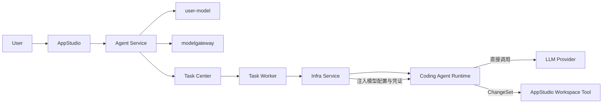

完整发布链路：

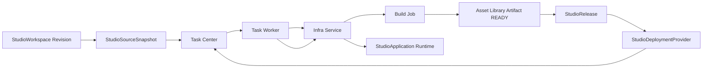

最终边界为：

> AppStudio 管理应用开发和发布业务；Agent Service 管理 Coding Agent；Infra Service 管理实际运行；Coding Agent 与 StudioApplication Runtime 自行调用模型。

## 28. S2 追溯锚点

以下编号仅把本 S1 已有语义映射为可机器校验的 S2 追溯锚点，不新增业务能力：

- `US-APPSTUDIO-001`：用户可以管理 StudioApplication 的源码、Revision、Snapshot、Build、Preview、Release 和 Runtime；Workspace 仅是后端内部事实。
- `BR-APPSTUDIO-001`：StudioApplication、Coding Agent 投影、源码谱系、构建发布事实和实际运行的边界必须遵守本 S1 第 2、3、5、6、7、9、10、11、12、15、16、17、18、20、21、22、26 节及 `R-STUDIO-001..024`。

验收标准：

- `AC-APPSTUDIO-001-01`：`CreateStudioApplication` 不接受 Workspace 输入；后端必须按 owner/创建幂等键原子创建 Application、Repository、唯一默认源码上下文 revision 0、固定绑定的 Coding Agent/Session/WorkspaceBinding 和用户显式选择的 ACTIVE primary Coding ModelBinding。初始化失败不得产生 READY 项目；初始化成功后自动创建首条 Message/CODING Invocation，Task 提交失败只令首次 Invocation 失败并允许同键复用重试，不删除 READY 项目或重复初始化对象。
- `AC-APPSTUDIO-001-02`：所有源码写入必须提交 `base_revision`、幂等键和完整操作集合；Revision 冲突、越权或校验失败时不覆盖、不隐式合并、不部分应用。
- `AC-APPSTUDIO-001-03`：Coding Agent 每次源码访问都必须使用绑定 Principal、Agent、Session、Invocation、内部 Workspace、动作和有效期的短期 Tool 授权；用户侧不接触 Workspace 字段。
- `AC-APPSTUDIO-001-04`：Preview 固定启动时的应用源码 Revision，后续源码变化不会隐式改变正在运行的 Preview。
- `AC-APPSTUDIO-001-05`：Build 只读取 `READY` 的 StudioSourceSnapshot；源码上下文的后续 Revision 不影响进行中或历史 Build。
- `AC-APPSTUDIO-001-06`：StudioBuild Bundle 必须以 `StudioBuild.id`、`studio-build:<studio_build_id>:bundle` 和 `StudioBuild.owner_user_id` 幂等登记；同一 Build 的自动 Attempt 命中同一 Artifact，新逻辑 Build 使用新 ID；AtomicTask 成功但 Artifact 未 READY、登记失败或 digest 不一致时，StudioBuild 不得进入 `SUCCEEDED`。
- `AC-APPSTUDIO-001-07`：StudioRelease 必须固定 Build、Version、RuntimeConfig、Environment、Artifact ID 和 digest，后续可变配置不得改写历史 Release。
- `AC-APPSTUDIO-001-08`：新 RuntimeInstance 只有健康后才能切换当前入口；部署或健康检查失败时旧健康实例和入口保持不变。
- `AC-APPSTUDIO-001-09`：回滚创建新的 StudioRelease 和 RuntimeInstance，并复用目标历史内容；旧 Release 不被修改或重新激活。
- `AC-APPSTUDIO-001-10`：Preview、Build、发布、升级和回滚只能走 Task Center、Task Worker、Infra Adapter 和 Infra Service，AppStudio 与 StudioDeploymentProvider 不得直接调用 Infra；Build Worker 创建 Artifact 时必须携带受信服务身份和原任务 `authorization_ref`，AppStudio 批量摘要按委托用户或当前调用者校验并仅返回 `id/owner_user_id/name/status`，不可见项统一为 null，服务身份、Build 协作者和管理员角色均不得绕过 Artifact owner 权限。
- `AC-APPSTUDIO-001-11`：Production 只读使用固定 Artifact digest，携带内部 Workspace、Revision 或 Snapshot 挂载的请求必须拒绝；公共 API 不接受 Workspace ID。
- `AC-APPSTUDIO-001-12`：第一阶段只允许 Infrastructure 的单机 Docker 能力；Kubernetes、Edge、Local Process、多节点和跨 Provider 参数必须保持禁用。
- `AC-APPSTUDIO-001-13`：应用级 Agent API 可返回稳定 Agent/Session/Invocation ID，但不得返回 Workspace；状态、消息、Invocation 查询/事件/取消、挂起和恢复始终代理当前 generation，Coding Agent 不进入公共 `/api/v1/agents`。
- `AC-APPSTUDIO-001-14`：替换 Coding Agent 创建新 Agent/Session 并原子递增 generation；旧 Agent 历史保留，新建失败时旧引用保持当前且不改写源码、Build、Release 或 RuntimeInstance。
- `AC-APPSTUDIO-001-15`：应用级 Invocation 投影以关联的 APPLIED ChangeSet 最大 `target_revision` 作为 `resulting_source_revision`；恢复该阶段必须调用既有 source restore API 创建新的 Restore ChangeSet/Revision，且保留 Session、Message、Invocation、原 ChangeSet 和 Revision 历史。
