# OmniMAM AppStudio 功能设计文档

> 文档状态：S1 Draft
> 文档版本：v1.2
> 修订日期：2026-08-02
> 适用范围：AppStudio 项目创建、Coding Agent 开发、预览、构建、发布与运行管理
>
> 本文中的 `StudioApp` 指 AppStudio 生成的独立应用，不等同于 `application-platform.Application`。

---

## 1. 文档目的

AppStudio 用于通过自然语言对话和 Coding Agent，完成独立应用的创建、开发、预览、构建、发布和运行。

AppStudio 生成的应用可以：

1. 完全独立运行。
2. 直接调用用户私有 LLM 或平台模型服务。
3. 调用现有 `application-platform.ApplicationVersion`。
4. 复用 Task Center 执行复杂异步任务。
5. 复用 Asset Library 管理素材和生成制品。
6. 复用 OmniMAM 用户身份、通知和权限体系。
7. 运行在 Docker、Kubernetes、Edge 或其他 Infra Provider 上。

AppStudio 不直接操作容器、Pod、GPU、端口、节点或宿主机进程。所有实际 Runtime 操作都先创建 Task Center 任务，再由 `Task Worker -> Infra Service` 创建和管理。

---

# 2. 核心设计结论

## 2.1 StudioApp 与 Application Platform 分离

OmniMAM 中存在两种不同类型的应用。

### application-platform.Application

定位：

> 将标准能力、参数表单和执行绑定包装为可供 Workflow Canvas 使用的能力节点。

典型用途：

* 文生图。
* 图像放大。
* 视频生成。
* 文本生成。
* ComfyUI Workflow 封装。
* SaaS 能力封装。
* Canvas 节点引用。

核心对象：

```text
Application
ApplicationVersion
ApplicationRun
```

### appstudio.StudioApp

定位：

> 由 Coding Agent 开发、具有独立代码、Release、Deployment 和访问入口的完整应用。

典型用途：

* 独立 Web 应用。
* 定制素材工具。
* AI 对话应用。
* 专用内容生成工作台。
* 面向特定业务流程的轻量应用。
* 调用 OmniMAM 能力的定制界面。

两者不能合并：

```text
application-platform.Application
    能力包装对象，主要供 Canvas 和平台能力调用

appstudio.StudioApp
    独立可部署应用，具有代码、Release 和 Deployment
```

StudioApp 可以调用 Application Platform，但不存在强绑定。

---

## 2.2 Coding Agent 由 Agent Service 管理

AppStudio 不直接管理 Coding Agent Runtime。

正确调用关系：

```text
AppStudio
    ↓ 创建或恢复 Coding Agent
Agent Service
    ↓ 解析 AgentProfile、模型、Workspace、Skills、MCP
Task Center
    ↓ 分发已注册 functionRef
Task Worker
    ↓ 通过 Infra Adapter
Infra Service
    ↓ 创建 Agent Runtime
Coding Agent Runtime
    ↓ 直接调用 LLM Provider
    ↓ 修改 Workspace
```

AppStudio 只保存：

```text
agentId
agentSessionId
agentOperationId
```

不保存：

```text
infraRuntimeId
containerId
podName
hostPort
模型凭证
```

其中 `infraRuntimeId` 由 Agent Service 通过 `AgentRuntimeBinding` 管理。

---

## 2.3 Agent Runtime 自行访问 LLM

Coding Agent、Hermes、OpenCode 等 Runtime 通常已经实现：

* LLM Client。
* Streaming。
* Tool Calling。
* Agent Loop。
* Prompt 管理。
* 上下文管理。
* Retry。
* 工具调用。

因此模型请求默认不经过 `modelgateway` 转发。

启动前：

```text
Agent Service
    ↓
model-manager
    决定当前用户使用哪个模型
    ↓
modelgateway
    解析为 ModelAccessSpec
    ↓
Infra Service
    注入 Endpoint、Model 和 Credential
```

运行时：

```text
Coding Agent Runtime
    ↓ 直接调用
LLM Provider
```

`modelgateway` 默认只是模型访问配置控制面，不是模型请求代理。

---

## 2.4 所有实际运行统一通过 Infra Service

以下操作均通过 Infra Service：

* Coding Agent Runtime。
* AppStudio Preview Runtime。
* Build Job。
* Test Job。
* StudioApp Runtime。
* FFmpeg Job。
* Python 图像处理 Job。
* 外部素材下载 Job。
* 平台模型 Runtime。
* Edge Runtime。

上层服务不得直接操作：

```text
Docker
Kubernetes
Pod
Container
GPU Device
Host Port
Node IP
Volume
宿主机目录
Edge Node Agent
```

Infra Service 统一屏蔽：

```text
DockerRuntimeProvider
KubernetesRuntimeProvider
EdgeRuntimeProvider
LocalProcessRuntimeProvider
```

---

## 2.5 Preview、Build 和 Production 分离

AppStudio 存在三种运行环境。

### Coding Agent Runtime

用途：

* 生成和修改代码。
* 执行受控开发命令。
* 运行测试。
* 分析 Build 或 Preview 错误。

归属：

```text
Agent Service → Task Center → Task Worker → Infra Service
```

### Preview Runtime

用途：

* 运行当前 Workspace 中的开发代码。
* 提供临时访问地址。
* 支持重启或热更新。

归属：

```text
AppStudio → Task Center → Task Worker → Infra Service
```

### Production Runtime

用途：

* 运行不可变 StudioAppRelease。
* 提供正式访问 Endpoint。
* 支持启动、停止、升级和回滚。

归属：

```text
AppStudio → Deploy Service → Task Center → Task Worker → Infra Service
```

三者必须隔离。

---

## 2.6 Deploy Service 只负责发布态

Deploy Service 负责：

* StudioAppRelease 部署。
* StudioDeployment。
* 期望运行状态。
* 记录 Task Center 返回的 Endpoint 摘要。
* 升级。
* 回滚。
* 实例重建。
* 发布健康状态。

Deploy Service 不负责直接调用 Infra；它只创建或更新 Production 任务，并消费 Task Center 的结果。它也不负责：

* Coding Agent。
* Workspace。
* Preview。
* Build。
* 测试。
* FFmpeg。
* Python Job。
* 模型选择。

---

# 3. 系统上下文

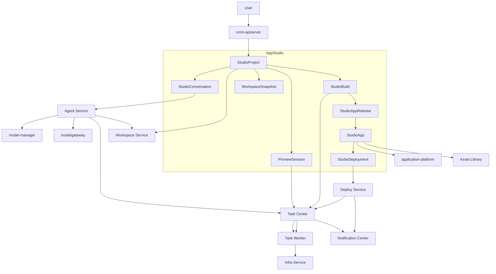

---

# 4. 领域职责

## 4.1 AppStudio

AppStudio 负责：

* StudioProject。
* StudioConversation 与 Agent 会话关联。
* Workspace 关联。
* WorkspaceSnapshot。
* PreviewSession。
* StudioBuild。
* StudioAppRelease。
* StudioApp。
* StudioDeployment 业务投影。
* 发布、升级和回滚入口。
* 项目活动记录。
* 页面和用户交互。

AppStudio 不负责：

* Coding Agent Runtime 生命周期。
* Agent Session 和 Memory。
* Agent Skills 和 MCP。
* LLM Provider 协议。
* API Key 存储。
* Docker 或 Kubernetes 操作。
* GPU 调度。
* Task Center 内部执行。
* Application Platform 能力定义。

---

## 4.2 Agent Service

Agent Service 负责：

* Coding Agent。
* AgentProfile。
* AgentSession。
* AgentMessage。
* AgentOperation。
* AgentMemory。
* AgentModelBinding。
* AgentWorkspaceBinding。
* AgentSkillBinding。
* AgentMCPBinding。
* AgentRuntimeBinding。
* Agent 启动、挂起、恢复和异常恢复。

AppStudio 通过 Agent Service 使用 Coding Agent。

```text
StudioProject
    ↓
Coding Agent
    ↓
Workspace
```

AppStudio 不直接调用 Coding Agent Runtime Endpoint。

---

## 4.3 Workspace Service

Workspace 负责开发期间的代码和配置存储。

Workspace 生命周期独立于：

* Coding Agent。
* Agent Runtime。
* Preview Runtime。
* Build Runtime。
* StudioApp Runtime。

规则：

* AgentWorkspace 由 Infra 按 Agent 的有效授权挂载。
* Coding Agent 访问 StudioWorkspace 只能通过 AppStudio Workspace Tool 和受控授权；Agent/Infra 不得直接读取 AppStudio 私有存储。
* Preview Runtime 只能挂载启动时授权的当前 Workspace Revision；源代码默认只读，临时写入使用隔离临时卷。
* Build 只能只读挂载固定 Workspace Snapshot，不得读取持续变化的 Workspace。
* Production Runtime 只能只读挂载固定 Artifact digest，禁止挂载可写 Workspace、Revision 或 Snapshot。
* Agent 删除不自动删除 Workspace。
* StudioApp 发布不改变 Workspace 内容。

---

## 4.4 Infra Service

Infra Service 负责：

* 创建 Job 和 Service。
* 选择运行节点。
* 分配 CPU、内存、GPU 和磁盘。
* 解析 RuntimeProfile。
* 挂载 Workspace。
* 挂载 WorkspaceSnapshot。
* 挂载 Artifact。
* 注入配置和 Secret。
* 分配 Endpoint。
* 健康检查。
* 日志采集。
* 退出码。
* 超时和清理。
* Runtime 状态对账。

AppStudio 只持有：

```text
previewRuntimeId
buildInfraJobId
endpointRef
runtimeStatusSummary
```

AppStudio 不保存 Provider 专属信息。

---

## 4.5 model-manager

`model-manager` 管理当前用户私有模型：

```text
UserModelProvider
UserProviderModel
UserDefaultModel
```

AppStudio 不直接读取用户 API Key。

Coding Agent 模型由 Agent Service 根据：

```text
USER_DEFAULT_MODEL
USER_PROVIDER_MODEL
PLATFORM_MODEL
```

进行解析。

---

## 4.6 modelgateway

`modelgateway` 将模型引用标准化为：

```text
ModelAccessSpec
```

包含：

```text
providerType
protocol
baseUrl
model
credentialRef
contextWindow
capabilities
```

Infra Service 根据 `credentialRef` 注入凭证。

Coding Agent Runtime 或 StudioApp Runtime 自行调用模型服务。

---

## 4.7 Task Center

Task Center 负责：

* 异步任务。
* TaskAttempt。
* 排队。
* 重试。
* 取消。
* 超时。
* 并行和依赖。
* 用户可见任务状态。

AppStudio 中以下操作进入 Task Center：

```text
APPSTUDIO_PREVIEW_START
APPSTUDIO_PREVIEW_STOP
APPSTUDIO_BUILD
APPSTUDIO_TEST
APPSTUDIO_RELEASE_CREATE
APPSTUDIO_DEPLOY
APPSTUDIO_UPDATE_DEPLOYMENT
APPSTUDIO_ROLLBACK
APPSTUDIO_DELETE
```

以上任务均由 Task Center 分发给 Task Worker；AppStudio、Deploy Service 和 Agent Service 不直接调用 Infra Service。Task Worker 的 Infra Adapter 才能把业务授权引用转换为 Infra 请求。

Coding Agent 的启动和长操作任务由 Agent Service 创建。

---

## 4.8 Deploy Service

Deploy Service 负责：

* StudioAppRelease 的长期运行。
* StudioDeployment。
* 实例期望状态。
* Release 切换。
* 回滚。
* Endpoint。
* 健康策略。

AppStudio 保存 Task Center/Task Worker 返回的：

```text
deploymentId
infraRuntimeId
endpointRef
actualState
healthStatus
```

---

## 4.9 Application Platform

StudioApp 可以调用已发布：

```text
ApplicationVersion
```

调用链：

```text
StudioApp Runtime
    ↓
Application Platform API
    ↓
ApplicationRun
    ↓
Task Center
```

StudioApp 不读取应用引擎、能力绑定或 Provider 内部配置。

---

## 4.10 Asset Library

StudioApp 可以：

* 选择 Asset。
* 上传素材。
* 读取预览。
* 使用 AssetReference。
* 接收 ArtifactReference。
* 将输出登记为 Asset。

StudioApp 不直接操作 Blob 物理路径。

---

# 5. 核心领域对象

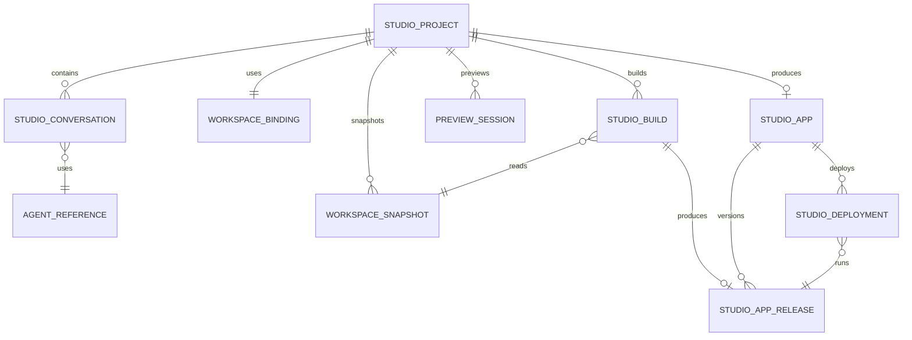

---

## 5.1 StudioProject

字段：

```text
id
ownerUserId
name
description
status
workspaceRef
primaryConversationId
studioAppId
createdAt
updatedAt
lastActivityAt
```

状态：

```text
DRAFT
GENERATING
EDITING
PREVIEWING
BUILDING
READY_TO_RELEASE
RELEASED
ARCHIVED
ERROR
```

项目状态只表示 AppStudio 业务状态，不表示 Infra Runtime 状态。

---

## 5.2 StudioConversation

用于关联 AppStudio 对话界面和 Agent Service Session。

字段：

```text
id
projectId
agentId
agentSessionId
title
status
createdAt
updatedAt
```

状态：

```text
OPEN
CLOSED
ARCHIVED
```

实际消息、AgentOperation 和 Memory 归 Agent Service 所有。

AppStudio 可保存项目活动摘要，但不复制 Agent Message 数据。

---

## 5.3 WorkspaceBinding

字段：

```text
id
projectId
workspaceRef
accessMode
isPrimary
createdAt
updatedAt
```

默认：

```text
accessMode = READ_WRITE
```

---

## 5.4 WorkspaceSnapshot

字段：

```text
id
projectId
workspaceRef
snapshotRef
contentDigest
reason
createdBy
createdAt
```

创建 Snapshot 的场景：

* Build 前。
* Release 前。
* Hotfix 前。
* 用户主动保存版本点。
* 大范围 Agent 修改前。

Build 必须引用固定 Snapshot，不允许直接读取持续变化的 Workspace。

---

## 5.5 PreviewSession

字段：

```text
id
projectId
workspaceRef
taskId
infraRuntimeId
runtimeProfileId
runtimeProfileRevision
endpointRef
status
expiresAt
createdAt
updatedAt
```

状态：

```text
CREATING
STARTING
RUNNING
STOPPING
STOPPED
ERROR
EXPIRED
```

PreviewSession 是 AppStudio 对 Infra Runtime 的业务投影。

---

## 5.6 StudioBuild

字段：

```text
id
projectId
snapshotId
taskId
infraJobId
status
runtimeProfileId
runtimeProfileRevision
releaseArtifactRef
artifactDigest
validationResult
logsRef
createdAt
completedAt
```

状态：

```text
QUEUED
PREPARING
INSTALLING
BUILDING
VALIDATING
SUCCEEDED
FAILED
CANCELED
```

---

## 5.7 StudioAppRelease

字段：

```text
id
studioAppId
version
buildId
snapshotId
releaseArtifactRef
artifactDigest
runtimeProfileId
runtimeProfileRevision
entrypoint
environmentSchema
modelBindingSchema
healthCheck
resourceRequirement
createdBy
createdAt
releaseNotes
```

Release 创建后不可变。

---

## 5.8 StudioApp

字段：

```text
id
ownerUserId
projectId
name
description
iconArtifactRef
visibility
status
currentReleaseId
createdAt
updatedAt
```

S1 可见性：

```text
PRIVATE
```

状态：

```text
DRAFT
ACTIVE
DISABLED
ARCHIVED
```

---

## 5.9 StudioDeployment

字段：

```text
id
studioAppId
releaseId
deployServiceDeploymentId
desiredState
actualState
endpointRef
healthStatus
environmentBinding
modelBindings
createdAt
updatedAt
```

状态：

```text
CREATING
STARTING
RUNNING
DEGRADED
STOPPING
STOPPED
UPDATING
ERROR
DELETING
```

---

# 6. 项目创建

## 6.1 创建输入

```text
name
description
initialRequirement
applicationType
initialAssets
backendRequired
codingAgentProfile
codingModelSelection
```

创建结果：

```text
StudioProject
WorkspaceBinding
StudioConversation
Coding Agent
AgentSession
```

其中 Coding Agent 和 AgentSession 由 Agent Service 创建。

---

## 6.2 应用类型

S1 支持：

```text
STATIC_WEB
WEB_WITH_LIGHT_BACKEND
```

不支持：

```text
任意语言后端
用户自定义操作系统
用户自定义 Dockerfile
桌面原生应用
移动原生应用
```

---

## 6.3 创建流程

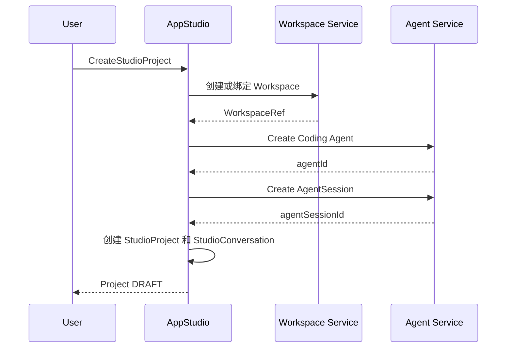

创建项目时默认不强制立即启动 Agent Runtime。

---

# 7. Coding Agent 开发

## 7.1 发送开发指令

AppStudio 向 Agent Service 提交：

```text
agentId
agentSessionId
instruction
attachments
projectContext
```

附件可以包含：

```text
AssetReference
ArtifactReference
WorkspaceFileReference
BuildLogReference
PreviewLogReference
```

---

## 7.2 开发流程

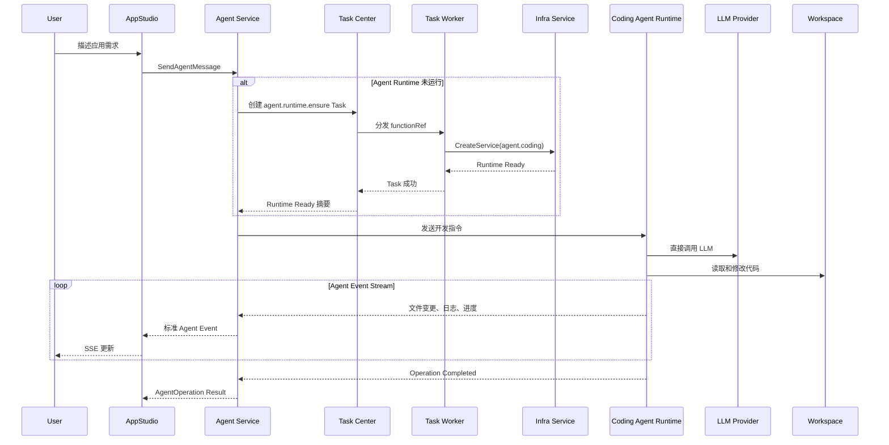

---

## 7.3 AppStudio 保存的信息

AppStudio 保存：

```text
agentOperationId
changeSummary
changedFiles
validationSummary
createdAt
```

详细 Agent 消息和事件归 Agent Service 所有。

---

## 7.4 Coding Agent 权限

默认允许：

* 读取 Workspace。
* 修改 Workspace。
* 创建和删除文件。
* 执行受控开发命令。
* 执行测试。
* 读取 Build 日志。
* 读取 Preview 日志。
* 调用允许的 MCP 和 Skills。
* 调用配置的 LLM。

禁止：

* 操作 Docker Socket。
* 操作 Kubernetes API。
* 获取宿主机 Shell。
* 访问其他用户 Workspace。
* 读取明文 Secret。
* 修改不可变 Release。
* 修改生产 Runtime。
* 绕过 Infra Service 启动服务。

---

# 8. 技术栈约束

## 8.1 前端

S1 固定：

```text
React 18
TypeScript
Vite
```

可使用：

* OmniMAM UI Components。
* HTTP Client。
* SSE Client。
* Asset Selector。
* Task Status Components。
* User Context Client。
* Application Platform Client。

---

## 8.2 轻量后端

S1 固定：

```text
Node.js
TypeScript
Lightweight HTTP Service
```

适合：

* 聚合前端请求。
* 调用 OmniMAM API。
* 保存少量应用配置。
* 调用 LLM Provider。
* 接收任务状态。
* 实现轻量业务逻辑。

禁止重复实现：

* Task Center。
* Application Platform。
* Asset Library。
* Notification Center。
* 用户认证系统。
* Agent Service。
* 容器管理。
* GPU 调度。

---

## 8.3 RuntimeProfile

S1 建议提供：

```text
appstudio.preview.static-web
appstudio.preview.web-backend

appstudio.build.static-web
appstudio.build.web-backend

studioapp.runtime.static-web
studioapp.runtime.web-backend
```

Coding Agent 使用：

```text
agent.coding
```

RuntimeProfile 的具体镜像、命令和 Provider 实现归 Infra Service 所有。

---

# 9. Preview

## 9.1 定位

Preview 用于运行启动时授权的当前 Workspace Revision，不直接跟随后续未授权变更。

特点：

* 临时 Service。
* 挂载当前 Workspace Revision。
* 支持重启。
* 可支持热更新。
* 不创建 Release。
* 不作为正式生产服务。
* 删除 Preview 不影响 Workspace。
* 可以通过 IP 加端口访问。

---

## 9.2 Preview 流程

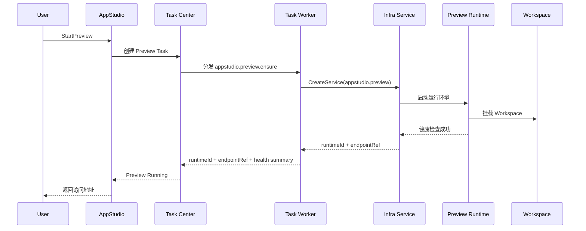

---

## 9.3 Preview 与 Agent 的关系

Coding Agent 可以读取 Preview 日志，但不直接控制 Preview Runtime。

正确链路：

```text
Coding Agent
    ↓ 请求 AppStudio 工具
AppStudio
    ↓
Task Center
    ↓
Infra Service
```

禁止 Coding Agent 直接调用 Infra Service。

---

## 9.4 Preview 访问地址

第一阶段：

```text
http://<host-ip>:<allocated-port>
```

AppStudio 保存 `endpointRef`，而非将 Host Port 作为业务主键。

---

# 10. Build

## 10.1 Build 输入

```text
projectId
workspaceSnapshotId
runtimeProfileId
runtimeProfileRevision
buildConfig
dependencyLock
environmentSchema
modelBindingSchema
```

---

## 10.2 Build 输出

```text
buildId
status
releaseArtifactRef
artifactDigest
validationResult
logsRef
sourceSnapshotId
```

发布物统一抽象为：

```text
ReleaseArtifactRef
```

AppStudio 不关心其底层是：

```text
OCI Image
Static Bundle
Archive
```

---

## 10.3 Build 流程

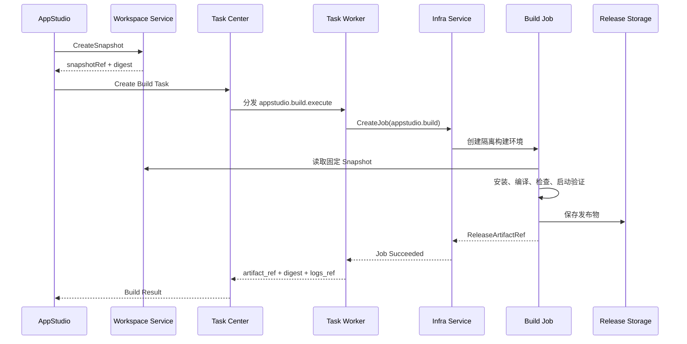

---

## 10.4 最低构建门禁

必须执行：

1. Lock File 检查。
2. 依赖安装。
3. TypeScript 编译。
4. 静态检查。
5. 前端构建。
6. 后端启动检查。
7. `/health` 检查。
8. 应用入口检查。
9. 禁止明文 Secret 检查。
10. Release Artifact 完整性检查。

Build 失败不得创建 Release。

---

## 10.5 依赖规则

* 必须存在 Lock File。
* 不允许 Build 时自动升级主要版本。
* 不允许执行未知远程安装脚本。
* 依赖安装必须在隔离 Runtime 中完成。
* Production Runtime 不执行动态依赖安装。
* Release 中的依赖必须固定。

---

# 11. Release

## 11.1 创建流程

```text
WorkspaceSnapshot
    ↓
StudioBuild
    ↓
ReleaseArtifactRef
    ↓
StudioAppRelease
```

---

## 11.2 不可变内容

Release 创建后禁止修改：

* 源代码。
* 依赖。
* Artifact。
* Artifact Digest。
* RuntimeProfile。
* Entrypoint。
* Environment Schema。
* ModelBinding Schema。
* Health Check。
* Resource Requirement。

允许单独修改：

```text
releaseNotes
```

---

# 12. 发布与 Deployment

## 12.1 发布流程

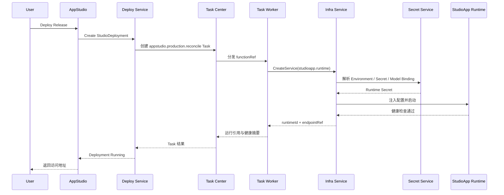

---

## 12.2 ModelBinding

StudioAppRelease 保存 `ModelBindingSchema`，Deployment 保存实际绑定。

支持：

```text
USER_DEFAULT_MODEL
USER_PROVIDER_MODEL
PLATFORM_MODEL
NONE
```

示例：

```json
{
  "name": "primary-llm",
  "sourceType": "USER_DEFAULT_MODEL",
  "purpose": "CHAT",
  "required": true
}
```

部署时：

```text
ModelBinding
    ↓
model-manager 校验模型
    ↓
modelgateway 生成 ModelAccessSpec
    ↓
Infra Service 注入 Runtime
```

StudioApp Runtime 自行调用模型。

---

## 12.3 用户私有模型限制

当 StudioApp 使用用户私有模型时：

* 必须具有当前用户授权上下文。
* model-manager 校验模型所有权。
* 不允许客户端传入任意 userId。
* 不向 StudioApp 前端返回 CredentialRef。
* Infra Service 仅向 Runtime 注入运行期凭证。
* Runtime 日志必须脱敏。

需要说明：

> 如果 StudioApp 面向多个用户，不能在 Deployment 启动时永久注入应用创建者的用户私有模型凭证。

多用户 StudioApp 应采用以下方式之一：

1. 由每个用户提供运行时授权。
2. 使用平台模型。
3. 后续使用受控 Gateway Proxy。

S1 中使用用户私有模型的 StudioApp 默认仅支持应用所有者私有使用。

---

# 13. StudioApp 调用 Application Platform

StudioApp 可以调用已发布的 `ApplicationVersion`。

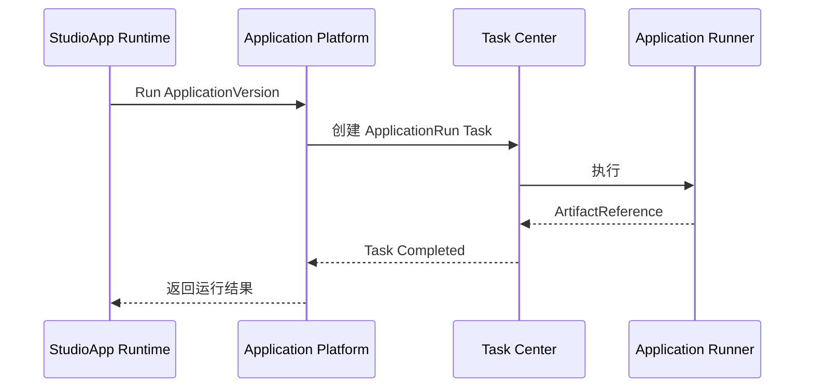

要求：

* 只能引用已发布 ApplicationVersion。
* 必须经过权限校验。
* 长任务必须通过 Task Center。
* StudioApp 不得直接读取底层 Engine 配置。

---

# 14. StudioApp 调用素材能力

## 14.1 输入

StudioApp 可以使用：

```text
AssetReference
ArtifactReference
```

作为：

* 模型输入。
* ApplicationRun 输入。
* FFmpeg 输入。
* Python 图像处理输入。

---

## 14.2 输出

输出流程：

```text
Runtime Output
    ↓
Artifact
    ↓
可选登记为 Asset
```

StudioApp 不直接写入 Blob 物理路径。

---

## 14.3 素材处理

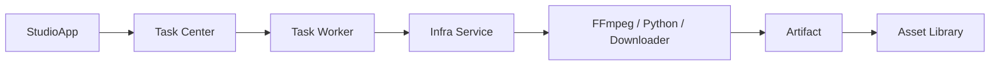

---

# 15. Hotfix 与回滚

## 15.1 Hotfix

禁止修改生产 Runtime。

正确流程：

```text
当前 Release
    ↓
创建 Hotfix Snapshot 或 Workspace 分支
    ↓
Coding Agent 修改
    ↓
Preview
    ↓
Build
    ↓
新 Release
    ↓
更新 Deployment
```

---

## 15.2 回滚

回滚表示重新部署旧 Release：

```text
Release 5
    ↓ rollback
Release 3
```

禁止：

* 修改当前容器文件。
* 将 Workspace 挂载到 Production Runtime。
* 在生产 Runtime 中执行 Git 回退。
* 修改旧 Release。

---

# 16. Agent 与项目生命周期

## 16.1 项目归档

项目归档时：

* 停止 Preview。
* 可以挂起 Coding Agent。
* 保留 Workspace。
* 保留 Snapshot。
* 保留 Build 和 Release。
* 不自动停止已发布 StudioApp。

---

## 16.2 项目删除

S1 建议软删除。

删除项目时：

* 删除或归档 StudioConversation 关联。
* 请求 Agent Service 删除 Coding Agent。
* 不自动删除外部 Workspace，除非用户显式选择。
* 不自动删除 StudioApp。
* 不自动删除 Release。
* 不自动删除 Deployment。

---

## 16.3 Coding Agent 删除

Coding Agent 删除规则归 Agent Service。

AppStudio 只解除项目关联。

---

# 17. 权限模型

## 17.1 项目所有权

以下对象必须校验当前用户：

```text
StudioProject
StudioConversation
WorkspaceBinding
WorkspaceSnapshot
PreviewSession
StudioBuild
StudioAppRelease
StudioApp
StudioDeployment
```

用户身份必须来自认证上下文。

---

## 17.2 Service Identity

StudioApp Runtime 使用独立 Service Identity。

区分：

### 应用身份

用于：

* 获取应用配置。
* 健康检查。
* 调用应用允许的平台接口。
* 写入应用自身数据。

### 当前用户身份

用于：

* 访问用户 Asset。
* 使用用户私有模型。
* 查询用户任务。
* 创建 ApplicationRun。

应用身份不能自动继承应用创建者的全部权限。

---

## 17.3 Preview 身份

Preview Runtime 只能访问：

* 当前项目启动时授权的 Workspace Revision。
* 当前项目开发配置。
* 当前用户显式授权的模型或素材。
* 开发环境专用 Secret。

Preview 不得自动使用生产 Secret。

---

# 18. Secret 与配置

## 18.1 Environment Schema

Release 只保存 Schema：

```json
{
  "fields": [
    {
      "name": "OMNIMAM_API_BASE_URL",
      "type": "string",
      "required": true,
      "source": "PLATFORM"
    },
    {
      "name": "APP_MODE",
      "type": "string",
      "required": true,
      "defaultValue": "production"
    }
  ]
}
```

Deployment 保存实际 Binding。

---

## 18.2 Secret 规则

禁止：

* Secret 写入 Workspace。
* Secret 写入代码。
* Secret 写入 Build Artifact。
* Secret 写入 Release。
* Secret 返回前端。
* Secret 写入 Agent Message。
* Secret 写入 Build 日志。

Secret 只通过：

```text
SecretRef
```

传递，由 Infra Service 在 Runtime 启动阶段注入。

---

# 19. 页面设计

## 19.1 AppStudio 首页

展示：

* 我的项目。
* 最近编辑。
* 最近发布。
* 正在运行的 StudioApp。
* Build 失败项目。
* Preview 中的项目。
* 快速创建入口。

---

## 19.2 项目工作台

建议布局：

```text
左侧：文件树、页面结构、项目资源
中间：Preview
右侧：Coding Agent 对话
底部：Task、Preview、Build、Runtime 状态
```

主要操作：

* 描述需求。
* 查看 AgentOperation。
* 查看代码变更。
* 查看 Diff。
* 启动或刷新 Preview。
* 查看 Preview 日志。
* 创建 Snapshot。
* 创建 Build。
* 创建 Release。
* 发布。
* 回滚。

---

## 19.3 Agent 面板

展示：

* Coding Agent 状态。
* 当前 AgentOperation。
* 模型选择。
* Session。
* 最近修改摘要。
* Skills。
* MCP。
* 挂起和恢复。

Agent 详细配置跳转 Agent Service 页面管理。

---

## 19.4 Build 页面

展示：

* Snapshot。
* Task 状态。
* 编译日志。
* 验证结果。
* 依赖信息。
* Artifact Digest。
* 错误列表。
* “交给 Coding Agent 修复”入口。

---

## 19.5 Release 页面

展示：

* Release 版本。
* 来源 Snapshot。
* Build。
* Artifact Digest。
* RuntimeProfile。
* Environment Schema。
* ModelBinding Schema。
* Health Check。
* 发布说明。
* 关联 Deployment。

---

## 19.6 StudioApp 页面

展示：

* 应用信息。
* 当前 Release。
* 访问地址。
* Deployment 状态。
* ModelBindings。
* Environment Bindings。
* 启动和停止。
* 更新 Release。
* 回滚。
* 日志。
* 任务。
* 通知。

---

# 20. 主要接口

以下为逻辑接口，不限定 HTTP 或 RPC 路径。

## 20.1 Project

```text
CreateStudioProject
GetStudioProject
ListStudioProjects
UpdateStudioProject
CloneStudioProject
ArchiveStudioProject
DeleteStudioProject
```

---

## 20.2 Conversation 与 Agent

```text
CreateStudioConversation
GetStudioConversation
SendStudioMessage
GetStudioAgentStatus
SuspendStudioAgent
ResumeStudioAgent
ReplaceStudioAgent
```

实际 Agent 操作转交 Agent Service。

---

## 20.3 Workspace

```text
GetProjectWorkspace
BindProjectWorkspace
UnbindProjectWorkspace
CreateWorkspaceSnapshot
GetWorkspaceSnapshot
ListWorkspaceSnapshots
RestoreWorkspaceSnapshot
GetWorkspaceDiff
```

---

## 20.4 Preview

```text
StartPreview
RestartPreview
StopPreview
GetPreview
GetPreviewStatus
GetPreviewLogs
```

---

## 20.5 Build

```text
CreateBuild
GetBuild
ListBuilds
CancelBuild
RetryBuild
GetBuildLogs
```

---

## 20.6 Release

```text
CreateRelease
GetRelease
ListReleases
UpdateReleaseNotes
```

---

## 20.7 StudioApp

```text
CreateStudioApp
GetStudioApp
ListStudioApps
UpdateStudioAppMetadata
DisableStudioApp
EnableStudioApp
ArchiveStudioApp
```

---

## 20.8 Deployment

```text
DeployRelease
GetDeployment
ListDeployments
StartDeployment
StopDeployment
UpdateDeploymentRelease
RollbackDeployment
DeleteDeployment
GetDeploymentLogs
UpdateEnvironmentBindings
UpdateModelBindings
```

---

# 21. 事件

## 21.1 AppStudio 业务事件

```text
appstudio.project.created
appstudio.project.updated
appstudio.project.archived

appstudio.agent.bound
appstudio.agent.operation.completed
appstudio.agent.operation.failed

appstudio.snapshot.created
appstudio.snapshot.restored

appstudio.preview.starting
appstudio.preview.running
appstudio.preview.stopped
appstudio.preview.failed

appstudio.build.started
appstudio.build.succeeded
appstudio.build.failed
appstudio.build.canceled

appstudio.release.created

appstudio.deployment.created
appstudio.deployment.running
appstudio.deployment.degraded
appstudio.deployment.failed
appstudio.deployment.rolled_back
```

---

## 21.2 非 AppStudio 事件

以下属于 Agent Service：

```text
agent.started
agent.suspended
agent.operation.started
agent.runtime.failed
```

以下属于 Infra Service：

```text
infra.runtime.created
infra.runtime.started
infra.runtime.failed
infra.runtime.deleted
```

以下属于 Task Center：

```text
task.queued
task.retrying
task.completed
task.failed
```

AppStudio 只消费必要事件并更新业务投影。

---

# 22. 错误处理

## 22.1 Coding Agent 错误

可能原因：

* AgentProfile 不可用。
* Coding 模型失效。
* CredentialRef 不可用。
* Workspace 不可访问。
* Agent Runtime 启动失败。
* AgentOperation 失败。

处理：

* 保留 Workspace。
* 保留 StudioConversation。
* 保留 Snapshot。
* 允许更换模型。
* 允许恢复或替换 Coding Agent。

---

## 22.2 Preview 错误

可能原因：

* 依赖安装失败。
* 启动命令失败。
* 健康检查失败。
* 端口未监听。
* 环境配置缺失。
* Workspace 内容无效。

Preview 失败不修改 Workspace。

---

## 22.3 Build 错误

可能原因：

* Lock File 缺失。
* 编译失败。
* 静态检查失败。
* 测试失败。
* 启动验证失败。
* Artifact 保存失败。

Build 失败不得创建 Release。

---

## 22.4 Deployment 错误

可能原因：

* Release Artifact 不可用。
* Environment Binding 缺失。
* ModelBinding 失效。
* Secret 无权限。
* Runtime 创建失败。
* 健康检查失败。
* Endpoint 创建失败。
* 资源不足。

升级失败时不得破坏旧的健康实例。

---

# 23. 标准错误码

## 23.1 Project

```text
APPSTUDIO_PROJECT_NOT_FOUND
APPSTUDIO_PROJECT_ACCESS_DENIED
APPSTUDIO_PROJECT_INVALID_STATE
APPSTUDIO_PROJECT_ARCHIVED
```

## 23.2 Agent

```text
APPSTUDIO_AGENT_NOT_BOUND
APPSTUDIO_AGENT_UNAVAILABLE
APPSTUDIO_AGENT_OPERATION_FAILED
APPSTUDIO_AGENT_MODEL_INVALID
```

## 23.3 Workspace

```text
APPSTUDIO_WORKSPACE_NOT_FOUND
APPSTUDIO_WORKSPACE_ACCESS_DENIED
APPSTUDIO_WORKSPACE_SNAPSHOT_FAILED
APPSTUDIO_WORKSPACE_SNAPSHOT_NOT_FOUND
```

## 23.4 Preview

```text
APPSTUDIO_PREVIEW_ALREADY_RUNNING
APPSTUDIO_PREVIEW_NOT_FOUND
APPSTUDIO_PREVIEW_START_FAILED
APPSTUDIO_PREVIEW_HEALTH_FAILED
APPSTUDIO_PREVIEW_STOP_FAILED
```

## 23.5 Build

```text
APPSTUDIO_BUILD_NOT_FOUND
APPSTUDIO_BUILD_ALREADY_RUNNING
APPSTUDIO_BUILD_FAILED
APPSTUDIO_BUILD_CANCELED
APPSTUDIO_BUILD_VALIDATION_FAILED
```

## 23.6 Release

```text
APPSTUDIO_RELEASE_NOT_FOUND
APPSTUDIO_RELEASE_ALREADY_EXISTS
APPSTUDIO_RELEASE_BUILD_INVALID
APPSTUDIO_RELEASE_IMMUTABLE
```

## 23.7 Deployment

```text
APPSTUDIO_DEPLOYMENT_NOT_FOUND
APPSTUDIO_DEPLOYMENT_CREATE_FAILED
APPSTUDIO_DEPLOYMENT_UPDATE_FAILED
APPSTUDIO_DEPLOYMENT_ROLLBACK_FAILED
APPSTUDIO_DEPLOYMENT_MODEL_BINDING_INVALID
APPSTUDIO_DEPLOYMENT_ENVIRONMENT_INVALID
```

---

# 24. 数据表建议

```text
studio_projects
studio_conversations
studio_workspace_bindings
studio_workspace_snapshots

studio_preview_sessions
studio_builds
studio_build_validations

studio_apps
studio_app_releases
studio_deployments
studio_deployment_model_bindings
studio_deployment_environment_bindings

studio_activity_events
```

不应在 AppStudio 数据库中复制：

```text
agent_sessions
agent_messages
agent_memories
infra_runtimes
task_attempts
asset_blobs
```

这些数据由对应领域服务拥有。

---

# 25. S1 实现范围

## 25.1 S1 必须实现

* StudioProject。
* StudioConversation。
* Workspace Binding。
* WorkspaceSnapshot。
* Agent Service Coding Agent 集成。
* AgentOperation 事件展示。
* PreviewSession。
* StudioBuild。
* Build Gate。
* 不可变 StudioAppRelease。
* StudioApp。
* StudioDeployment。
* Task Center 集成。
* Infra Service 集成。
* Deploy Service 集成。
* Asset Library 集成。
* Application Platform 调用。
* 用户模型和平台模型 Binding。
* Secret 安全注入。
* IP 加端口访问。
* Hotfix。
* Release 回滚。
* 用户权限隔离。
* Notification Center 集成。

---

## 25.2 S1 不实现

* AppStudio 直接管理 Agent Runtime。
* AppStudio 自己实现 Agent Session。
* AppStudio 自己实现 LLM Client。
* modelgateway 强制代理所有模型请求。
* 多人实时协作。
* 完整在线 IDE。
* 任意技术栈。
* 用户自定义 Dockerfile。
* 用户自定义 RuntimeProfile。
* Kubernetes 专属参数。
* 自定义域名。
* 自动扩缩容。
* 灰度发布。
* 蓝绿发布。
* 多区域部署。
* 完整 Git 托管。
* Agent 直接修改生产 Runtime。
* Agent 修改不可变 Release。
* StudioApp 与 Application 自动转换。
* 用户上传任意可执行 Build 插件。
* 任意动态 Shell 执行。

---

# 26. 强制架构规则

## R-STUDIO-001

`StudioApp` 与 `application-platform.Application` 是不同领域对象。

## R-STUDIO-002

AppStudio 不得直接创建或管理 Coding Agent Runtime。

## R-STUDIO-003

Coding Agent、Session、Memory、Skills 和 MCP 归 Agent Service 管理。

## R-STUDIO-004

所有实际运行必须通过 Infra Service。

## R-STUDIO-005

AppStudio 不得直接操作 Docker、Kubernetes、宿主机、GPU 或 Edge Node Agent。

## R-STUDIO-006

Coding Agent Runtime 自行完成 LLM 调用和 Agent Loop。

## R-STUDIO-007

`modelgateway` 默认只负责生成 ModelAccessSpec，不代理每次模型请求。

## R-STUDIO-008

模型凭证必须由 Infra Service 在 Runtime 启动阶段注入。

## R-STUDIO-009

Coding Agent Runtime、Preview Runtime 和 Production Runtime 必须隔离。

## R-STUDIO-010

Workspace 生命周期独立于 Coding Agent 和 Runtime。

## R-STUDIO-011

Build 必须读取固定 WorkspaceSnapshot。

## R-STUDIO-012

Production Runtime 禁止挂载可写 Workspace。

## R-STUDIO-013

StudioAppRelease 创建后不可变。

## R-STUDIO-014

Hotfix 必须生成新 Build 和新 Release。

## R-STUDIO-015

回滚必须重新部署旧 Release。

## R-STUDIO-016

Deploy Service 只负责发布态长期运行。

## R-STUDIO-017

复杂异步任务必须复用 Task Center。

## R-STUDIO-018

素材和制品必须复用 Asset Library。

## R-STUDIO-019

StudioApp 调用平台能力时只能引用已发布 ApplicationVersion。

## R-STUDIO-020

AppStudio 不得复制 Agent Service、Infra Service 或 Task Center 的领域数据。

## R-STUDIO-021

使用用户私有模型的 StudioApp，S1 默认仅支持应用所有者私有运行。

## R-STUDIO-022

用户身份必须从认证上下文解析，不得信任请求中的 userId。

## R-STUDIO-023

Preview、Build、Production 及其他 Infra-backed 操作必须先创建 Task Center 任务，由 Task Worker 通过 Infra Adapter 调用 Infra Service；AppStudio、Deploy Service 和 Agent Service 不得直接调用 Infra Service。

## R-STUDIO-024

Preview 只能挂载当前 Workspace Revision；Build 只能只读挂载固定 Workspace Snapshot；Production 只能只读使用固定 Artifact digest，禁止可写 Workspace、Revision 或 Snapshot。

---

# 27. 最终职责总结

```text
AppStudio
    管理项目、Workspace 引用、Preview、Build、Release、StudioApp 和 Deployment

Agent Service
    管理 Coding Agent、Session、Memory、Skills、MCP、模型绑定和 Runtime Binding

model-manager
    决定用户可以使用哪个模型

modelgateway
    将模型引用解析为 ModelAccessSpec

Infra Service
    接收 Task Worker 的受控请求，创建实际 Runtime，并注入 Workspace、配置和 Secret

Coding Agent Runtime
    自行调用 LLM，执行 Agent Loop 并修改 Workspace

Task Center
    管理异步任务、重试、取消、依赖和进度

Deploy Service
    管理 StudioAppRelease 的长期部署、升级和回滚，并通过 Task Center 触发实际运行操作

Application Platform
    提供 StudioApp 可调用的 ApplicationVersion

Asset Library
    管理 StudioApp 使用和生成的 Asset 与 Artifact

Notification Center
    通知 Build、发布和后台操作结果
```

完整开发链路：

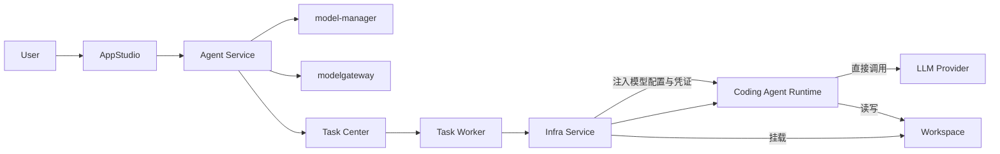

完整发布链路：

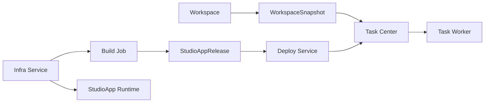

最终边界为：

> AppStudio 管理应用开发和发布业务；Agent Service 管理 Coding Agent；Infra Service 管理实际运行；Coding Agent 与 StudioApp Runtime 自行调用模型。
