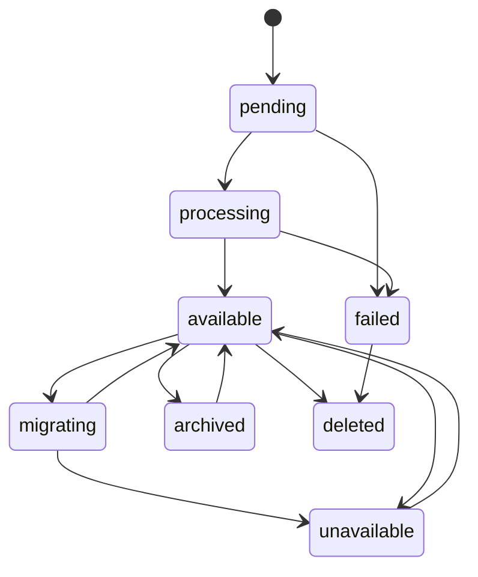
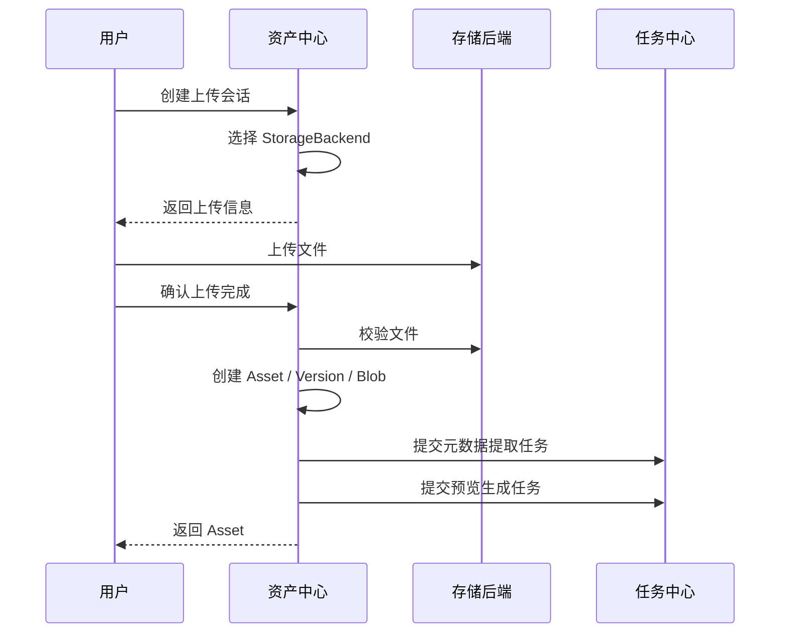
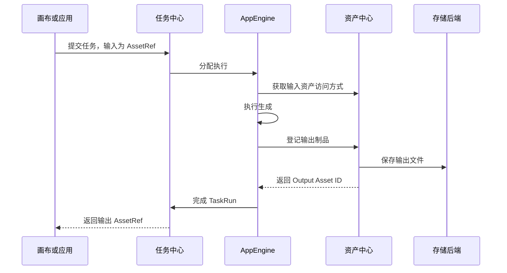
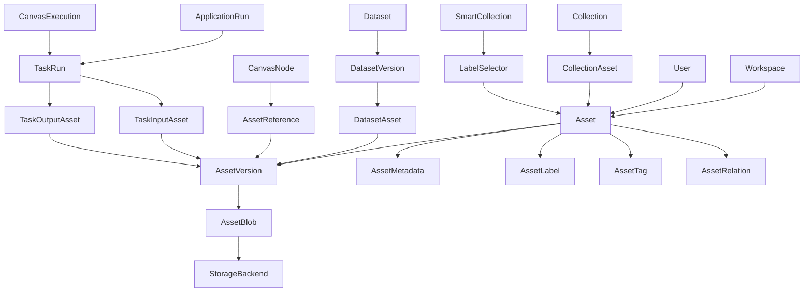

# OmniMAM 统一资产管理系统设计

## 1. 产品定位

资产管理系统用于统一管理平台中的全部数字内容，包括：

* 图片
* 视频
* 音频
* 普通文本
* 文档
* 3D 模型文件
* 提示词
* 提示词模板
* 未来新增的其他数字资产类型

系统对上层业务提供统一的逻辑资产模型，使用户在素材库、无限画布、应用中心和任务中心中看到的是同一种“资产”。

资产的物理文件可以分布在不同存储介质中，例如：

* 当前服务器本地硬盘
* 用户挂载目录
* NAS 或 NFS
* S3 兼容对象存储
* 云厂商对象存储
* 未来支持的远程媒体服务

物理存储位置不影响用户对资产的浏览、筛选、分组、引用和使用。

核心原则：

```text
物理存储可以分散，逻辑资产必须统一。
```

---

# 2. 系统目标

## 2.1 统一资产抽象

所有内容都统一抽象为 `Asset`。

无论资产来源于：

* 用户上传
* 本地目录扫描
* S3 同步
* AI 任务生成
* 画布节点生成
* 应用执行结果
* 外部系统导入

上层业务都通过统一的资产接口进行访问。

## 2.2 多格式支持

每种资产类型可以包含多种文件格式。

例如：

| 资产类型  | 典型格式                                |
| ----- | ----------------------------------- |
| 图片    | PNG、JPEG、WebP、GIF、TIFF、BMP、SVG、AVIF |
| 视频    | MP4、MOV、MKV、WebM、AVI、MPEG           |
| 音频    | MP3、WAV、FLAC、AAC、OGG、M4A            |
| 文本    | TXT、Markdown、JSON、YAML、HTML、CSV     |
| 文档    | PDF、DOCX、PPTX、XLSX                  |
| 3D 模型 | GLB、GLTF、FBX、OBJ、STL、USD、USDZ、BLEND |
| 提示词   | 结构化文本记录，不一定存在独立文件                   |
| 提示词模板 | 带变量定义和渲染规则的结构化记录                    |

格式支持不应通过前端硬编码控制。

后端通过资产类型定义或格式注册表维护：

* MIME Type
* 文件扩展名
* 资产类型
* 是否支持预览
* 是否支持生成缩略图
* 是否支持提取元数据
* 是否支持转码
* 是否支持全文索引
* 是否支持 AI 分析

## 2.3 统一逻辑平面

系统中的所有资产在逻辑上位于同一个资产空间。

用户可以在一个资产浏览器中：

* 浏览图片、视频、音频和文本
* 搜索提示词和提示词模板
* 根据标签跨类型筛选资产
* 将不同类型的资产加入同一个集合
* 将资产拖入画布
* 查看任务生成的制品
* 查看某个资产的来源和衍生关系

资产在物理上可以存储在不同的位置，但逻辑查询不应要求用户关心具体存储介质。

## 2.4 可插拔存储

资产系统应支持多种存储后端。

新增存储类型时，不应修改资产领域的核心逻辑。

存储系统负责：

* 写入文件
* 读取文件
* 删除文件
* 生成访问地址
* 分片上传
* 检查文件是否存在
* 获取文件大小
* 计算或校验哈希
* 必要时生成临时签名地址

资产系统负责：

* 资产语义
* 元数据
* 标签
* 权限
* 关系
* 来源
* 生命周期
* 版本
* 业务引用

---

# 3. 领域边界

资产管理系统负责：

* 资产注册
* 文件管理
* 元数据管理
* 标签管理
* 集合与逻辑分组
* 资产搜索
* 资产引用
* 资产版本
* 资产派生关系
* 资产预览信息
* 资产与画布、任务、应用之间的关联

资产管理系统不负责：

* 实际执行 AI 推理
* 调度 Worker
* 编排复杂任务
* 执行 ComfyUI 工作流
* 执行 SaaS API 调用
* 画布节点调度
* 专业视频剪辑
* 专业 3D 编辑

这些功能由任务中心、应用中心、执行引擎或画布系统负责。

---

# 4. 核心领域模型

## 4.1 Asset

`Asset` 是用户可见的逻辑资产。

一个 Asset 表示一个具有业务意义的内容对象，例如：

* 一张图片
* 一段视频
* 一篇小说
* 一条图像生成提示词
* 一个提示词模板
* 一个 3D 模型
* 一次生成任务的最终视频
* 一次生成任务的中间帧

建议核心字段：

| 字段                 | 说明     |
| ------------------ | ------ |
| asset_id           | 资产唯一标识 |
| asset_type         | 资产类型   |
| name               | 资产名称   |
| description        | 资产描述   |
| status             | 资产状态   |
| owner_id           | 所有者    |
| workspace_id       | 所属工作空间 |
| current_version_id | 当前版本   |
| source_type        | 资产来源   |
| source_ref         | 来源对象引用 |
| created_at         | 创建时间   |
| updated_at         | 更新时间   |
| deleted_at         | 软删除时间  |

`Asset` 不直接保存文件路径。

文件路径、对象存储 Key、Bucket 等信息属于物理文件层。

## 4.2 AssetType

资产类型定义资产的业务类别。

初始支持：

```text
image
video
audio
text
document
model_3d
prompt
prompt_template
archive
other
```

其中：

* `text` 表示普通文本内容。
* `document` 表示 PDF、Word、表格等文档型文件。
* `prompt` 表示可直接使用的提示词。
* `prompt_template` 表示带变量和渲染规则的提示词模板。
* `model_3d` 表示 3D 模型资产。
* `archive` 表示压缩包或资产包。
* `other` 用于尚未注册的类型。

资产类型与文件格式不是同一个概念。

例如：

```text
asset_type = image
format = image/png
```

## 4.3 AssetVersion

资产可以拥有多个版本。

例如：

* 图片经过修复形成新版本
* 视频被重新编码
* 文本被修改
* 提示词被优化
* 3D 模型被重新导出
* 用户替换了源文件

`Asset` 表示逻辑对象，`AssetVersion` 表示该对象某个时间点的具体内容。

建议字段：

| 字段           | 说明         |
| ------------ | ---------- |
| version_id   | 版本唯一标识     |
| asset_id     | 所属资产       |
| version_no   | 版本号        |
| content_type | 具体内容格式     |
| blob_id      | 对应物理文件，可为空 |
| text_content | 内联文本，可为空   |
| metadata     | 当前版本元数据    |
| created_by   | 创建者        |
| created_at   | 创建时间       |

文本、提示词和提示词模板可以直接将结构化内容保存在版本记录中，不强制创建物理文件。

## 4.4 AssetBlob

`AssetBlob` 表示真实存储的二进制对象。

它不具有完整业务语义，只描述一个物理内容对象。

建议字段：

| 字段                | 说明      |
| ----------------- | ------- |
| blob_id           | 二进制对象标识 |
| storage_id        | 存储后端    |
| object_key        | 存储定位信息  |
| original_filename | 原始文件名   |
| mime_type         | MIME 类型 |
| extension         | 扩展名     |
| size_bytes        | 文件大小    |
| checksum          | 内容哈希    |
| checksum_type     | 哈希算法    |
| storage_status    | 存储状态    |
| created_at        | 创建时间    |

多个资产版本可以引用同一个 Blob，实现内容去重。

例如：

```text
Asset A Version 1 ─┐
                   ├── AssetBlob X
Asset B Version 1 ─┘
```

是否允许跨用户共享同一 Blob，应由权限和安全策略控制。

## 4.5 StorageBackend

`StorageBackend` 表示一个已配置的物理存储介质。

存储类型初始支持：

```text
local
mounted_directory
s3
s3_compatible
nfs
```

建议字段：

| 字段            | 说明      |
| ------------- | ------- |
| storage_id    | 存储标识    |
| storage_type  | 存储类型    |
| name          | 显示名称    |
| config_ref    | 加密配置引用  |
| base_path     | 基础路径或前缀 |
| read_only     | 是否只读    |
| enabled       | 是否启用    |
| priority      | 默认选择优先级 |
| health_status | 健康状态    |
| created_at    | 创建时间    |

敏感凭证不能直接保存在资产记录中。

例如：

* S3 Access Key
* Secret Key
* Session Token
* 云存储凭证

应存入凭证中心或密钥管理系统，`StorageBackend` 只保存凭证引用。

---

# 5. 资产内容模型

## 5.1 文件型资产

文件型资产通过以下关系管理：

```text
Asset
  └── AssetVersion
        └── AssetBlob
              └── StorageBackend
```

例如一张 PNG 图片：

```text
Asset
- type: image
- name: 城市夜景

AssetVersion
- version_no: 1
- content_type: image/png

AssetBlob
- object_key: assets/2026/07/xxx.png
- size_bytes: 4234234

StorageBackend
- type: s3
- name: 主对象存储
```

## 5.2 内联文本型资产

普通文本、提示词和提示词模板可以不创建 Blob。

例如：

```text
Asset
- type: prompt

AssetVersion
- text_content: 一座未来主义城市……
```

当文本内容较大，或者需要保留原始文件时，也可以同时保存 Blob。

## 5.3 提示词资产

提示词不是普通文本的简单别名。

提示词需要支持额外语义，例如：

| 字段               | 说明                  |
| ---------------- | ------------------- |
| prompt_mode      | 文生图、图像编辑、视频生成、TTS 等 |
| positive_prompt  | 正向提示词               |
| negative_prompt  | 负向提示词               |
| language         | 语言                  |
| target_models    | 适用模型                |
| style_hints      | 风格提示                |
| parameters       | 推荐参数                |
| safety_level     | 安全分类                |
| source_asset_ids | 参考资产                |

一条提示词仍然属于 Asset，只是拥有提示词专用扩展数据。

## 5.4 提示词模板

提示词模板需要支持变量。

例如：

```text
一位 {{gender}} 站在 {{scene}} 中，
穿着 {{clothing}}，
画面采用 {{style}} 风格。
```

模板变量定义：

```json
{
  "gender": {
    "type": "enum",
    "options": ["女性", "男性"],
    "required": true
  },
  "scene": {
    "type": "string",
    "required": true
  },
  "clothing": {
    "type": "string",
    "required": false
  },
  "style": {
    "type": "asset_reference",
    "asset_type": "prompt",
    "required": false
  }
}
```

提示词模板应支持：

* 字符串变量
* 数字变量
* 布尔变量
* 枚举变量
* 多选变量
* 资产引用变量
* 标签选择变量
* 条件块
* 默认值
* 变量校验
* 模板预览
* 渲染结果保存为新提示词资产

提示词模板本身是资产。

模板渲染后的结果也可以登记为新的提示词资产。

---

# 6. 元数据体系

## 6.1 通用元数据

所有资产都可以拥有：

* 文件大小
* MIME Type
* 创建时间
* 更新时间
* 原始文件名
* 内容哈希
* 来源
* 所有者
* 语言
* 描述
* 宽度
* 高度
* 时长
* 编码格式
* 帧率
* 采样率
* 通道数
* 颜色空间
* 页数
* 3D 顶点数
* 3D 面数
* 生成模型
* 生成参数

## 6.2 类型专属元数据

不同资产类型具有不同元数据。

### 图片

* width
* height
* aspect_ratio
* color_space
* bit_depth
* has_alpha
* orientation
* exif

### 视频

* width
* height
* duration
* fps
* video_codec
* audio_codec
* bitrate
* frame_count

### 音频

* duration
* sample_rate
* channels
* codec
* bitrate
* loudness

### 文档

* page_count
* author
* title
* language
* text_extract_status

### 3D 模型

* mesh_count
* vertex_count
* polygon_count
* material_count
* texture_count
* animation_count
* bounding_box
* unit
* coordinate_system

### 提示词

* prompt_mode
* target_models
* language
* style
* recommended_parameters

## 6.3 元数据来源

元数据必须记录来源，避免系统提取结果、AI 推断结果和用户填写内容混为一谈。

元数据来源包括：

```text
user
file_parser
ai_analysis
task_output
external_system
system
```

例如：

```json
{
  "key": "scene",
  "value": "forest",
  "source": "ai_analysis",
  "confidence": 0.91
}
```

---

# 7. 标签体系设计

系统采用三层混合标签体系：

```text
Label Selector + Tags + AI Labels
```

三者用途不同，不应合并成一个字段。

## 7.1 Label

`Label` 是有结构、可治理的标签定义。

例如：

```text
media.type = image
content.subject = animal
content.subject.animal = cat
visual.style = anime
visual.scene = forest
project.stage = final
usage.purpose = lora_training
```

Label 具有：

* 固定 Key
* 可选值范围
* 值类型
* 层级关系
* 校验规则
* 是否允许多选
* 是否系统管理
* 是否允许用户扩展

## 7.2 Label Selector

Label Selector 是结构化筛选表达式。

它不是单个标签，而是一套可组合的查询条件。

例如：

```text
content.subject = animal
AND visual.style IN (anime, illustration)
AND media.width >= 1024
AND project.stage != rejected
```

建议支持的操作符：

```text
=
!=
IN
NOT_IN
EXISTS
NOT_EXISTS
>
>=
<
<=
CONTAINS
PREFIX
```

支持逻辑关系：

```text
AND
OR
NOT
```

Label Selector 用于：

* 资产搜索
* 智能集合
* 画布节点动态选材
* 任务批量输入
* 训练数据集筛选
* 应用输入约束
* 自动归档规则
* 自动工作流触发

## 7.3 Tags

`Tags` 是用户自由输入的弱结构标签。

例如：

```text
赛博朋克
人物参考
待审核
客户A
新海诚感
适合封面
```

Tag 的特点：

* 创建成本低
* 不要求预先定义
* 不要求 Key-Value
* 适合快速标记
* 可以跨类型使用
* 可以转换为正式 Label

Tags 不适合作为核心业务规则的唯一依据。

例如，任务执行条件不应仅依赖用户随意输入的 Tag。

## 7.4 AI Labels

AI 分析得到的标签应单独记录。

例如：

```text
subject = dog
scene = outdoor
style = realistic
dominant_color = blue
contains_text = false
```

AI 标签需要包含：

* 标签 Key
* 标签值
* 模型名称
* 模型版本
* 置信度
* 分析时间
* 分析任务 ID
* 是否经过人工确认

AI Label 可以处于以下状态：

```text
suggested
accepted
rejected
superseded
```

只有被接受的 AI 标签才能参与严格业务规则。

## 7.5 混合查询规则

用户可以同时使用：

* Label Selector
* Tags
* 文件元数据
* 全文搜索
* 资产关系
* 来源条件
* 创建时间

例如：

```text
Label Selector:
  visual.style = anime
  content.subject = character

Tags:
  包含 “候选角色”

Metadata:
  width >= 2048

Source:
  task_id = xxx
```

---

# 8. 逻辑分组体系

资产的物理目录不承担主要组织职责。

系统应提供逻辑分组。

## 8.1 Collection

`Collection` 是用户手动维护的资产集合。

一个集合中可以同时包含：

* 图片
* 视频
* 音频
* 文本
* 提示词
* 提示词模板
* 3D 模型

例如：

```text
短片项目 A
├── 剧本
├── 分镜图片
├── 角色参考图
├── 背景音乐
├── 配音音频
├── 视频片段
└── 最终视频
```

Collection 只是逻辑引用，不移动物理文件。

一个资产可以属于多个 Collection。

## 8.2 Smart Collection

`SmartCollection` 由 Label Selector 动态计算。

例如：

```text
所有标签为 animal=cat，
宽度大于 1024，
且未被标记为 rejected 的图片。
```

Smart Collection 不直接保存固定资产列表，而是保存查询规则。

当资产标签发生变化时，集合结果自动变化。

## 8.3 Dataset

`Dataset` 是带业务约束的特殊资产集合。

适用于：

* LoRA 训练集
* TTS 训练集
* 图像分类数据集
* OCR 数据集
* 视频剪辑素材集
* 提示词评测集

Dataset 在 Collection 的基础上增加：

* 数据用途
* 样本角色
* 训练集、验证集、测试集划分
* 数据版本
* 冻结快照
* 质量检查状态
* 标注完成度

Smart Collection 可以持续变化，而 Dataset Version 应支持冻结快照，保证训练可复现。

---

# 9. 资产关系模型

资产之间需要支持通用关系。

`AssetRelation` 示例：

```text
derived_from
generated_from
edited_from
thumbnail_of
preview_of
transcoded_from
audio_of
subtitle_of
cover_of
reference_of
variant_of
part_of
contains
prompt_for
output_of
input_of
```

建议字段：

| 字段              | 说明     |
| --------------- | ------ |
| relation_id     | 关系标识   |
| source_asset_id | 源资产    |
| target_asset_id | 目标资产   |
| relation_type   | 关系类型   |
| metadata        | 关系附加信息 |
| created_at      | 创建时间   |

例如：

```text
原始图片
  └── edited_from
        修复图片
          └── generated_from
                图生视频
```

资产关系需要支持追溯完整生成链路。

---

# 10. 资产来源

所有资产必须记录来源。

建议 `source_type` 支持：

```text
upload
directory_scan
storage_import
task_output
canvas_output
application_output
api_import
external_sync
manual_text
template_render
asset_copy
```

来源引用示例：

```json
{
  "source_type": "task_output",
  "source_ref": {
    "task_id": "task_xxx",
    "task_run_id": "run_xxx",
    "output_name": "final_video"
  }
}
```

来源信息不可只写入自由文本字段。

它需要可查询、可追踪、可用于故障分析。

---

# 11. 与任务中心对接

## 11.1 总体原则

任务中心负责执行，资产中心负责登记输入和输出。

```text
资产中心提供输入
       ↓
任务中心执行任务
       ↓
任务中心产生制品
       ↓
资产中心登记制品
```

任务中心不能长期保存业务制品的唯一副本。

任务临时目录只用于执行过程。

最终需要保留的结果必须登记到资产中心。

## 11.2 任务输入

任务输入不应直接依赖本地文件路径。

推荐使用资产引用：

```json
{
  "input_image": {
    "asset_id": "asset_xxx",
    "version_id": "version_xxx"
  }
}
```

任务执行前，由任务执行环境解析资产引用，并获取：

* 本地临时路径
* 内网访问 URL
* S3 签名 URL
* 流式读取接口

具体获取方式由 StorageBackend 和执行环境决定。

## 11.3 任务输出声明

任务定义应声明输出槽位。

例如：

```json
{
  "outputs": [
    {
      "name": "final_video",
      "asset_type": "video",
      "required": true,
      "register_as_asset": true
    },
    {
      "name": "preview_image",
      "asset_type": "image",
      "required": false,
      "register_as_asset": true
    },
    {
      "name": "execution_log",
      "asset_type": "text",
      "required": false,
      "register_as_asset": false
    }
  ]
}
```

## 11.4 输出登记流程

任务完成时：

1. Worker 或 AppEngine 生成文件。
2. 文件进入临时输出区。
3. 计算哈希并识别 MIME Type。
4. 按存储策略写入 StorageBackend。
5. 创建 AssetBlob。
6. 创建 Asset。
7. 创建 AssetVersion。
8. 建立输入资产与输出资产关系。
9. 将输出 Asset ID 写回 TaskRun。
10. 发布资产创建事件。

## 11.5 中间制品

任务输出分为：

```text
temporary
intermediate
final
```

### temporary

只在任务执行期间存在，不进入资产中心。

### intermediate

可选登记。

例如：

* 视频生成中间帧
* 音频分片
* 图片放大前的结果
* ComfyUI 中间节点结果

是否登记由任务输出策略决定。

### final

必须登记为资产，除非任务明确声明结果无需保存。

## 11.6 失败任务的制品

任务失败时，已经生成的部分制品可以根据策略：

```text
discard
retain_as_intermediate
retain_for_debug
```

调试制品必须设置过期时间，避免长期占用存储。

## 11.7 与 TaskRun 的关系

建议 TaskRun 保存：

```text
input_asset_refs
output_asset_refs
intermediate_asset_refs
```

但 TaskRun 只保存引用。

资产的完整元数据和物理存储信息仍由资产中心管理。

---

# 12. 与无限画布对接

## 12.1 画布不直接拥有资产

画布节点不应复制资产数据。

画布只保存资产引用。

```text
CanvasNode
  └── AssetReference
        ├── asset_id
        └── version_id
```

## 12.2 资产拖入画布

用户将资产拖入画布时：

1. 画布创建对应类型节点。
2. 节点保存 Asset ID。
3. 前端通过资产预览接口获取缩略图或预览信息。
4. 节点展示资产名称、类型、预览和关键元数据。

不同资产类型可以映射到不同节点：

| 资产类型            | 默认画布节点             |
| --------------- | ------------------ |
| image           | ImageAssetNode     |
| video           | VideoAssetNode     |
| audio           | AudioAssetNode     |
| text            | TextAssetNode      |
| document        | DocumentAssetNode  |
| model_3d        | Model3DAssetNode   |
| prompt          | PromptAssetNode    |
| prompt_template | PromptTemplateNode |

## 12.3 画布生成新资产

画布中的执行节点生成结果后：

1. 画布向任务中心提交执行请求。
2. 任务中心执行。
3. 输出登记到资产中心。
4. 任务中心返回 Asset ID。
5. 画布创建或更新输出资产节点。
6. 建立画布节点、任务和资产之间的来源关系。

## 12.4 画布中间制品

画布允许用户决定某个节点输出是否持久化。

节点输出策略：

```text
ephemeral
persist_on_success
always_persist
manual_persist
```

### ephemeral

仅在当前执行链路中使用，不进入资产中心。

### persist_on_success

任务成功后登记资产。

### always_persist

无论后续节点是否成功，都登记当前节点输出。

### manual_persist

先作为临时制品展示，用户点击“保存到资产库”后登记。

## 12.5 资产更新与画布引用

画布引用资产时需要明确版本策略。

支持：

```text
fixed_version
follow_latest
```

### fixed_version

固定引用某个 AssetVersion。

适合：

* 可复现工作流
* 历史项目
* 训练数据集
* 已发布画布

### follow_latest

始终使用资产的当前版本。

适合：

* 草稿画布
* 动态素材
* 频繁更新的提示词模板

画布保存或发布时，建议将关键输入转换为固定版本引用。

---

# 13. 与应用中心对接

应用的输入参数可以声明为资产类型。

例如：

```json
{
  "name": "reference_image",
  "type": "asset",
  "asset_types": ["image"],
  "multiple": false,
  "selector": {
    "labels": {
      "content.rating": ["general"]
    }
  }
}
```

应用输入可以支持：

* 上传新资产
* 从资产库选择
* 使用画布节点资产
* 使用前一个任务输出
* 通过 Label Selector 动态选取

应用输出应通过任务中心登记到资产中心。

应用不直接维护自己的文件系统。

---

# 14. 存储策略

## 14.1 存储选择

新资产写入哪个 StorageBackend，可以由存储策略决定。

策略条件包括：

* 工作空间
* 用户
* 资产类型
* 文件大小
* 存储容量
* 成本
* 访问频率
* 数据安全级别
* 是否需要 GPU 本地高速访问

例如：

```text
小于 10 MB 的图片 → 本地高速存储
大于 1 GB 的视频 → S3
训练数据集 → NAS
临时任务输出 → 临时本地存储
最终制品 → S3
```

## 14.2 分层存储

同一个资产版本可以存在多个物理副本。

例如：

```text
主副本：S3
缓存副本：GPU Worker 本地 SSD
归档副本：低频对象存储
```

应区分：

* authoritative copy
* replica
* cache

缓存删除不能导致资产丢失。

## 14.3 存储迁移

资产从本地磁盘迁移到 S3 时：

* Asset ID 不变
* AssetVersion ID 不变
* 上层引用不变
* 仅 Blob 的存储定位发生变化
* 迁移期间资产应保持可读，或者明确进入迁移状态

## 14.4 去重

系统可以根据内容哈希进行去重。

需要区分：

### 物理去重

多个资产引用同一个 AssetBlob。

### 逻辑去重

检测到相同内容时，提示用户使用已有资产。

逻辑资产不应因文件内容相同而自动合并。

同一张图片可能属于不同项目，并具有不同名称、标签和权限。

---

# 15. 预览与派生文件

很多格式无法直接在浏览器中预览。

系统需要支持预览派生物。

例如：

| 原始资产   | 预览资产          |
| ------ | ------------- |
| 高分辨率图片 | 缩略图           |
| 视频     | 封面、低码率预览视频    |
| 音频     | 波形图           |
| PDF    | 页面缩略图         |
| 3D 模型  | 渲染预览图、Web GLB |
| 文本     | 摘要            |
| 提示词模板  | 渲染示例          |

预览文件可以作为：

* 独立 Asset
* 特殊 AssetVersion 附件
* AssetDerivative

推荐使用 `AssetDerivative` 表示不具有独立业务意义的派生物。

例如：

```text
thumbnail
proxy_video
waveform
poster
text_extract
preview_3d
```

---

# 16. 搜索能力

统一资产搜索应支持：

* 名称搜索
* 描述搜索
* 全文搜索
* Tag 搜索
* Label Selector
* 资产类型
* MIME Type
* 文件扩展名
* 创建时间
* 更新时间
* 文件大小
* 图片宽高
* 视频时长
* 音频时长
* 来源任务
* 来源画布
* 来源应用
* 所属 Collection
* 所属 Dataset
* 资产关系
* 所有者
* 工作空间
* 存储位置
* AI 标签和置信度

搜索结果必须跨存储后端工作。

用户不需要分别进入“本地文件”“S3 文件”等页面进行查询。

---

# 17. 状态模型

资产状态建议包括：

```text
pending
processing
available
unavailable
migrating
archived
deleted
failed
```

## 17.1 pending

资产记录已创建，但物理内容尚未完成写入。

## 17.2 processing

正在执行元数据提取、转码、缩略图生成或 AI 分析。

## 17.3 available

资产可正常读取和使用。

## 17.4 unavailable

物理文件暂时不可访问，例如存储离线。

## 17.5 migrating

资产正在不同存储之间迁移。

## 17.6 archived

资产已归档，可能需要恢复后使用。

## 17.7 deleted

资产被逻辑删除。

## 17.8 failed

资产导入、上传或处理失败。

状态机示意：



若图示与文字规则冲突，以文字规则为准。

---

# 18. 事件模型

资产中心需要发布领域事件，用于画布、任务中心、索引服务和 AI 分析服务异步响应。

建议事件：

```text
asset.created
asset.version.created
asset.updated
asset.deleted
asset.restored
asset.available
asset.unavailable
asset.metadata.updated
asset.labels.updated
asset.tags.updated
asset.relation.created
asset.preview.requested
asset.preview.generated
asset.analysis.requested
asset.analysis.completed
asset.storage.migration.started
asset.storage.migration.completed
```

例如：

```text
asset.created
    ├── 元数据提取任务
    ├── 缩略图生成任务
    ├── 全文索引任务
    ├── AI 标签分析任务
    └── 画布通知
```

这些后处理任务应通过任务中心执行，而不是在上传接口中同步完成。

---

# 19. 核心业务流程

## 19.1 用户上传文件



## 19.2 本地目录导入

```text
配置目录型 StorageBackend
        ↓
扫描文件
        ↓
识别新增、变化、删除
        ↓
创建或更新 Blob
        ↓
创建 Asset
        ↓
提取元数据
        ↓
生成预览
        ↓
建立逻辑资产索引
```

导入不等于移动文件。

目录型存储可以配置为：

```text
managed
referenced
```

### managed

资产中心可以移动、改名和删除物理文件。

### referenced

资产中心只引用现有文件，不主动修改原目录。

## 19.3 任务生成资产



## 19.4 画布保存节点输出

```text
画布节点执行完成
        ↓
节点获得临时输出
        ↓
根据节点持久化策略判断
        ↓
登记到资产中心
        ↓
创建输出资产节点
        ↓
建立 input_of / output_of / generated_from 关系
```

---

# 20. 权限模型

资产权限至少包括：

```text
owner
editor
viewer
consumer
```

## 20.1 owner

可以：

* 查看
* 修改
* 删除
* 移动
* 分享
* 管理权限
* 创建新版本

## 20.2 editor

可以：

* 查看
* 修改元数据
* 添加标签
* 创建新版本
* 添加到集合

## 20.3 viewer

可以查看和下载。

## 20.4 consumer

只能作为应用、画布或任务输入使用，未必允许直接下载原文件。

资产权限与存储权限必须隔离。

用户不能因为获得了 S3 URL，就绕过资产中心的权限控制长期访问文件。

私有资产访问应使用：

* 短期签名 URL
* 后端代理
* 临时访问令牌

---

# 21. 删除和生命周期

## 21.1 逻辑删除

删除 Asset 时，先进行逻辑删除。

逻辑删除后：

* 默认搜索不可见
* 画布现有引用显示“资产已删除”
* 历史任务记录保留 Asset ID
* 在保留期内允许恢复

## 21.2 物理删除

物理 Blob 只有在满足以下条件后才能删除：

* 没有任何 AssetVersion 引用
* 不处于保留期
* 不受审计或归档策略保护
* 不属于数据集冻结版本
* 不存在未完成任务引用

## 21.3 引用保护

当资产被以下对象引用时：

* 已发布画布
* Dataset Version
* 已发布应用
* 历史任务结果
* 项目归档

删除操作应：

* 阻止删除
* 或仅逻辑删除
* 或要求用户显式确认破坏性影响

不得静默破坏已有引用。

---

# 22. 推荐的服务边界

## 22.1 Asset Service

负责：

* Asset
* AssetVersion
* 元数据
* 标签
* Tags
* 关系
* 集合
* 搜索

## 22.2 Blob Service

负责：

* Blob 注册
* 上传会话
* 下载访问
* 哈希
* 去重
* 副本
* Blob 生命周期

## 22.3 Storage Service

负责：

* StorageBackend
* 物理读写
* S3 签名
* 本地路径访问
* 存储健康检查
* 存储迁移

## 22.4 Asset Processing Service

通过任务中心执行：

* 元数据提取
* 缩略图生成
* 转码
* 文本提取
* AI 标签
* 内容审核
* 3D 预览生成

这些可以先部署在同一后端中，但领域职责应保持分离。

---

# 23. 推荐接口分组

所有接口遵循 `/api/v1` 前缀。

## 23.1 资产接口

```text
GET    /api/v1/assets
POST   /api/v1/assets
GET    /api/v1/assets/{asset_id}
PATCH  /api/v1/assets/{asset_id}
DELETE /api/v1/assets/{asset_id}

POST   /api/v1/assets/{asset_id}/restore
POST   /api/v1/assets/{asset_id}/copy
POST   /api/v1/assets/{asset_id}/move
POST   /api/v1/assets/{asset_id}/analyze
```

## 23.2 版本接口

```text
GET  /api/v1/assets/{asset_id}/versions
POST /api/v1/assets/{asset_id}/versions
GET  /api/v1/assets/{asset_id}/versions/{version_id}
POST /api/v1/assets/{asset_id}/versions/{version_id}/activate
```

## 23.3 上传接口

```text
POST /api/v1/asset-uploads
GET  /api/v1/asset-uploads/{upload_id}
POST /api/v1/asset-uploads/{upload_id}/complete
POST /api/v1/asset-uploads/{upload_id}/abort
```

## 23.4 标签接口

```text
GET    /api/v1/labels
POST   /api/v1/labels
PATCH  /api/v1/labels/{label_id}
DELETE /api/v1/labels/{label_id}

POST   /api/v1/assets/{asset_id}/labels
DELETE /api/v1/assets/{asset_id}/labels/{label_value_id}

POST   /api/v1/assets/{asset_id}/tags
DELETE /api/v1/assets/{asset_id}/tags/{tag}
```

## 23.5 集合接口

```text
GET    /api/v1/collections
POST   /api/v1/collections
GET    /api/v1/collections/{collection_id}
PATCH  /api/v1/collections/{collection_id}
DELETE /api/v1/collections/{collection_id}

POST   /api/v1/collections/{collection_id}/assets
DELETE /api/v1/collections/{collection_id}/assets/{asset_id}
```

## 23.6 存储接口

```text
GET    /api/v1/storage-backends
POST   /api/v1/storage-backends
GET    /api/v1/storage-backends/{storage_id}
PATCH  /api/v1/storage-backends/{storage_id}
DELETE /api/v1/storage-backends/{storage_id}

POST   /api/v1/storage-backends/{storage_id}/test
POST   /api/v1/storage-backends/{storage_id}/scan
```

## 23.7 资产引用解析接口

供任务中心和画布使用：

```text
POST /api/v1/asset-access/resolve
```

请求：

```json
{
  "asset_id": "asset_xxx",
  "version_id": "version_xxx",
  "purpose": "task_input",
  "consumer": {
    "type": "task_run",
    "id": "run_xxx"
  }
}
```

返回：

```json
{
  "access_type": "signed_url",
  "url": "...",
  "expires_at": "...",
  "mime_type": "image/png",
  "checksum": "..."
}
```

---

# 24. 核心业务规则

## 24.1 统一引用规则

上层系统引用资产时，必须使用：

```text
asset_id
version_id
```

不得将以下内容作为稳定业务引用：

* 本地绝对路径
* S3 Object Key
* 临时 URL
* 文件名
* 缩略图 URL

## 24.2 存储隔离规则

Asset 不感知具体存储协议。

业务模块不得直接读取 S3 配置或拼接本地路径。

## 24.3 输出登记规则

任务中心、画布和应用中心产生的持久化结果必须登记为 Asset。

不得仅在 TaskRun 中保存文件路径。

## 24.4 版本规则

修改资产内容时，应创建新版本。

修改以下信息不需要创建新版本：

* 名称
* 描述
* Tags
* Labels
* 所属 Collection

修改以下信息必须创建新版本：

* 二进制内容
* 文本正文
* 提示词正文
* 提示词模板正文
* 3D 模型文件

## 24.5 标签规则

* 结构化业务判断优先使用 Label。
* 用户临时分类可以使用 Tag。
* AI 自动识别结果必须保留模型和置信度。
* 未经确认的 AI Label 不得作为严格权限或执行条件。
* Label Selector 必须由后端解析和验证，不能由前端直接拼接数据库查询。

## 24.6 删除规则

删除资产不能直接破坏画布、任务、数据集和已发布应用中的历史引用。

## 24.7 可复现规则

任务运行和已发布画布默认固定 AssetVersion。

不能只引用“最新版本”，否则历史任务无法复现。

## 24.8 临时文件规则

任务临时文件不自动成为资产。

只有符合输出持久化策略的制品才登记为资产。

## 24.9 多存储规则

同一个工作空间可以配置多个 StorageBackend。

存储后端选择由策略决定，不由前端业务页面硬编码。

## 24.10 格式扩展规则

新增文件格式时，应通过格式注册表扩展。

不应修改所有资产上传、搜索和展示流程。

---

# 25. 领域关系总图



若图示与文字规则冲突，以文字规则为准。

---

# 26. 第一阶段实施范围

第一阶段建议只实现最核心闭环。

## 26.1 必须实现

* Asset
* AssetVersion
* AssetBlob
* StorageBackend
* 本地存储
* S3 兼容存储
* 图片、视频、音频、文本、提示词、提示词模板
* 基础元数据
* Tags
* 基础结构化 Labels
* Collection
* 资产上传
* 资产浏览
* 资产搜索
* 资产下载
* 资产拖入画布
* 画布输出登记资产
* 任务输入引用资产
* 任务输出登记资产
* 基础缩略图
* 软删除和恢复
* 来源追踪

## 26.2 可延后实现

* 完整 AI 自动标签
* 复杂 Label Selector UI
* 3D 在线交互预览
* 多副本和分层存储
* 自动冷热迁移
* 跨区域复制
* Dataset 冻结版本
* 内容去重提示
* 自动转码
* 资产审批
* 复杂版权管理
* 资产市场
* 外部云盘同步

---

# 27. 第一阶段最小闭环

第一阶段最小业务闭环应为：

```text
用户上传资产
    ↓
系统保存到本地或 S3
    ↓
创建统一 Asset
    ↓
提取基础元数据和缩略图
    ↓
用户添加 Tags 和 Labels
    ↓
用户从统一资产库中搜索
    ↓
用户将资产拖入画布
    ↓
画布提交任务中心执行
    ↓
任务生成新文件
    ↓
新文件登记为 Asset
    ↓
画布显示输出资产
    ↓
用户可再次将输出资产用于后续任务
```

这条闭环是资产中心、无限画布和任务中心真正打通的验收标准。

---

# 28. 验收标准

系统至少满足以下条件，才可认为统一资产管理基础能力完成：

1. 用户可以在同一个资产页面查看图片、视频、音频、文本和提示词。
2. 用户不需要知道资产存储在本地还是 S3。
3. 同一个资产列表可以跨存储后端搜索。
4. 用户可以通过 Tags 和结构化 Labels 筛选资产。
5. 用户可以把不同类型的资产加入同一个 Collection。
6. 用户可以将资产拖入画布。
7. 画布节点保存 Asset ID，而不是文件路径。
8. 任务中心可以将 AssetVersion 作为任务输入。
9. 任务输出可以自动登记为新 Asset。
10. 可以从输出资产追踪到来源任务和输入资产。
11. 资产物理迁移后，画布和历史任务中的引用仍然有效。
12. 删除物理缓存不会删除逻辑资产的主副本。
13. 提示词和提示词模板作为正式资产参与搜索、标签、集合和画布使用。
14. 历史任务固定引用具体 AssetVersion，可以重复执行。
15. 一个资产可以同时属于多个逻辑集合，而无需复制物理文件。
