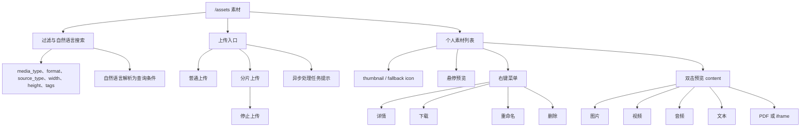
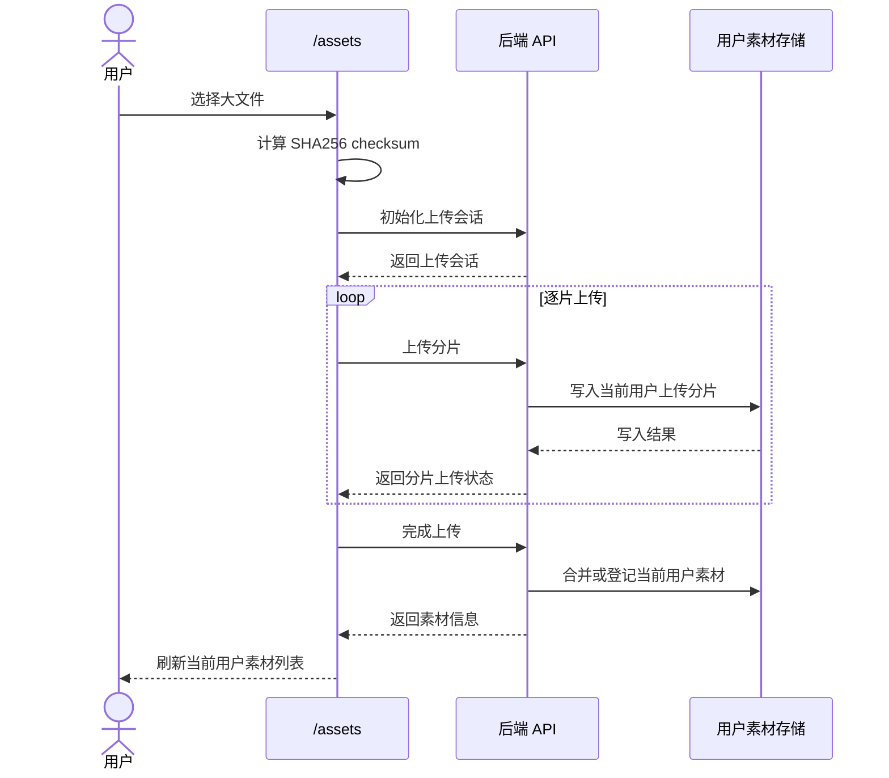
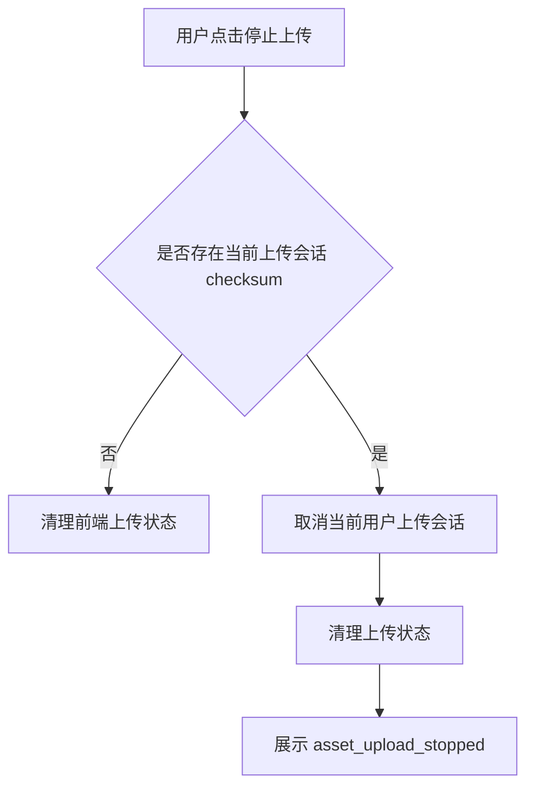
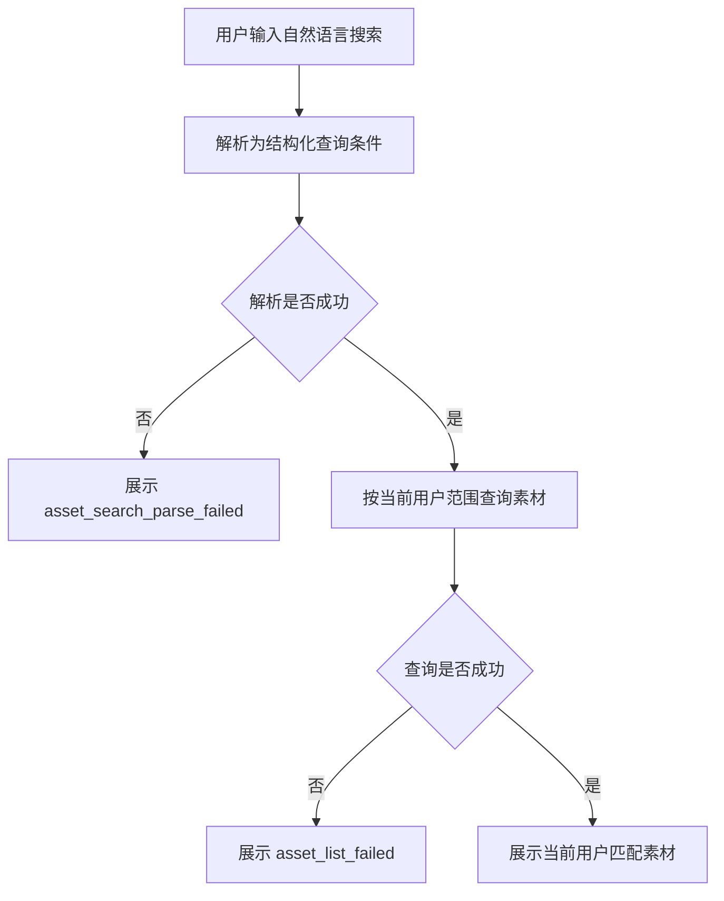
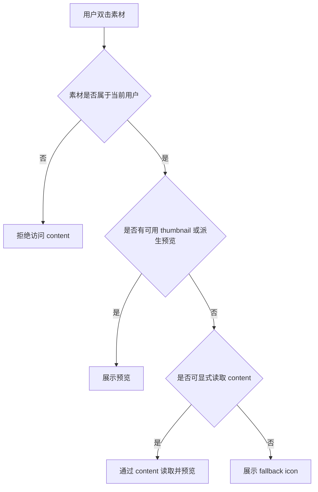
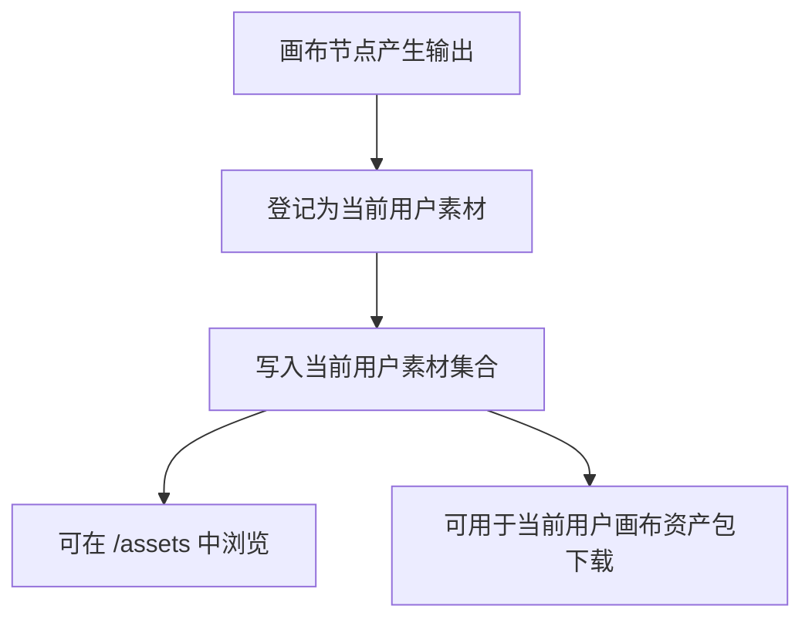

# 用户素材管理产品规格
> 本文档是 S1 产品事实源，用于定义 AI 聊天特性的产品语义、领域模型、业务规则、用户故事和端呈现策略。
>
> 本文档中的 Mermaid 图用于辅助理解复杂流程、状态变化、角色可见性和交互时序。图与文字描述应被视为同一事实集合；若存在不一致，应修正文档后再进入实现。

---
## 1. 功能说明

用户素材管理用于维护当前用户个人范围内的素材资产。用户可以上传、浏览、过滤、预览、下载、重命名和删除自己的素材，也可以将画布节点输出登记为自己的素材资产。

本功能的核心事实是：素材资产属于当前用户个人范围，不是平台级共享素材库。一个用户的素材、上传会话、缩略图、原始内容和画布输出资产不得被其他用户读取、复用、修改或删除。


页面需要支持个人素材列表、素材过滤、自然语言搜索、普通上传、分片上传、上传停止、素材详情、素材预览、素材下载、素材重命名、素材删除和画布输出资产登记。

---

## 2. Mermaid 可视化说明

本文档中的 Mermaid 图用于辅助理解页面结构、用户故事、状态变化和业务流程。

```text
Mermaid 图是对对应文字描述的可视化补充。
若图与文字描述冲突，以文字描述为准。
但二者应被视为同一事实，冲突需修正，不能长期并存。
```

实现阶段可以参考 Mermaid 图快速理解流程，但不能只看图实现。实现仍必须以本文档中的文字描述、业务规则和用户故事为准。

---

## 3. 核心数据模型

本文档中的数据模型是 S1 领域模型，仅表达产品语义和逻辑字段，不等同于 OpenAPI DTO、SQL schema 或后端 ORM。

### UserAsset（用户素材）

| 字段              | 类型                | 必填 | 说明                                       |
| --------------- | ----------------- | -- | ---------------------------------------- |
| id              | string            | 是  | 当前用户范围内的素材唯一标识                           |
| ownerUserId     | string            | 是  | 素材所属用户 ID                                |
| displayName     | string            | 是  | 素材显示名称                                   |
| originalName    | string            | 否  | 原始文件名                                    |
| mediaType       | enum              | 是  | 媒体类型，例如 image、video、audio、text、pdf、other |
| format          | string            | 否  | 文件格式或扩展名                                 |
| sizeBytes       | integer           | 是  | 文件大小                                     |
| width           | integer           | 否  | 图片或视频宽度                                  |
| height          | integer           | 否  | 图片或视频高度                                  |
| durationSeconds | number            | 否  | 音频或视频时长                                  |
| sourceType      | enum              | 是  | 来源类型，例如 upload、canvas_output             |
| objectPath      | string            | 是  | 当前用户素材内容的对象路径或存储引用                       |
| thumbnailStatus | enum              | 是  | 缩略图状态：none、pending、ready、failed          |
| previewStatus   | enum              | 否  | 派生预览状态：none、pending、ready、failed         |
| sha256          | string            | 否  | 原始内容 SHA256 checksum                     |
| tags            | array of string   | 否  | 用户设置的素材标签                                |
| createdAt       | string(date-time) | 是  | 创建时间                                     |
| updatedAt       | string(date-time) | 是  | 更新时间                                     |

### UserAssetUploadSession（用户素材上传会话）

| 字段             | 类型                | 必填 | 说明                                                    |
| -------------- | ----------------- | -- | ----------------------------------------------------- |
| id             | string            | 是  | 上传会话唯一标识                                              |
| ownerUserId    | string            | 是  | 上传会话所属用户 ID                                           |
| checksum       | string            | 是  | 文件 SHA256 checksum                                    |
| fileName       | string            | 是  | 上传文件名                                                 |
| sizeBytes      | integer           | 是  | 文件大小                                                  |
| chunkSizeBytes | integer           | 否  | 分片大小                                                  |
| uploadedParts  | array of integer  | 否  | 已上传分片序号                                               |
| status         | enum              | 是  | 上传状态：initialized、uploading、completed、cancelled、failed |
| tags           | array of string   | 否  | 上传时设置的标签                                              |
| createdAt      | string(date-time) | 是  | 创建时间                                                  |
| updatedAt      | string(date-time) | 是  | 更新时间                                                  |

### UserAssetPreview（用户素材预览）

| 字段            | 类型                | 必填 | 说明                                             |
| ------------- | ----------------- | -- | ---------------------------------------------- |
| assetId       | string            | 是  | 关联素材 ID                                        |
| ownerUserId   | string            | 是  | 所属用户 ID                                        |
| thumbnailPath | string            | 否  | 缩略图路径或引用                                       |
| previewPath   | string            | 否  | 派生预览路径或引用                                      |
| previewType   | enum              | 否  | 预览类型：image、video、audio、text、pdf、embed、fallback |
| status        | enum              | 是  | 预览状态：none、pending、ready、failed                 |
| reason        | string            | 否  | 预览失败原因                                         |
| updatedAt     | string(date-time) | 是  | 更新时间                                           |

### UserAssetProcessingTask（用户素材处理任务）

| 字段          | 类型                | 必填 | 说明                                       |
| ----------- | ----------------- | -- | ---------------------------------------- |
| id          | string            | 是  | 任务唯一标识                                   |
| ownerUserId | string            | 是  | 所属用户 ID                                  |
| assetId     | string            | 是  | 关联素材 ID                                  |
| taskType    | enum              | 是  | 任务类型，例如 thumbnail、preview_derivative     |
| status      | enum              | 是  | 任务状态：pending、processing、completed、failed |
| reason      | string            | 否  | 失败原因                                     |
| createdAt   | string(date-time) | 是  | 创建时间                                     |
| updatedAt   | string(date-time) | 是  | 更新时间                                     |

### CanvasAssetOutput（画布输出资产）

| 字段          | 类型                | 必填 | 说明          |
| ----------- | ----------------- | -- | ----------- |
| id          | string            | 是  | 画布输出资产标识    |
| ownerUserId | string            | 是  | 所属用户 ID     |
| canvasId    | string            | 是  | 来源画布 ID     |
| nodeId      | string            | 是  | 来源节点 ID     |
| assetId     | string            | 是  | 登记后的用户素材 ID |
| createdAt   | string(date-time) | 是  | 创建时间        |

---

## 4. 业务规则

* **BR-USER-ASSET-01** 访问 `/assets` 依赖系统基础登录态。
* **BR-USER-ASSET-02** 素材、上传会话、缩略图、派生预览、原始内容和画布输出资产均属于当前用户个人范围。
* **BR-USER-ASSET-03** 用户只能读取、上传、修改、下载和删除自己的素材。
* **BR-USER-ASSET-04** 一个用户的素材不得被其他用户读取、复用、修改、下载或删除。
* **BR-USER-ASSET-05** 素材列表只展示当前用户自己的素材。
* **BR-USER-ASSET-06** 列表展示素材名称、大小、创建时间、媒体类型、尺寸、时长、格式、来源、标签和 thumbnail 状态等 metadata。
* **BR-USER-ASSET-07** 列表不直接渲染原始 heavy asset；图片、视频、音频、PDF、文本等预览需要通过 thumbnail、派生预览或显式 content 读取。
* **BR-USER-ASSET-08** 精确过滤支持 media_type、format、source_type、width、height、tags。
* **BR-USER-ASSET-09** 自然语言搜索需要先解析为结构化查询，再按当前用户范围查询素材。
* **BR-USER-ASSET-10** 自然语言解析失败或查询失败时展示错误，不能返回其他用户素材作为 fallback。
* **BR-USER-ASSET-11** 用户可以一次选择多个文件上传。
* **BR-USER-ASSET-12** 上传标签用逗号分隔，并写入当前用户上传的素材。
* **BR-USER-ASSET-13** 小文件使用普通上传。
* **BR-USER-ASSET-14** 超过阈值的文件使用分片上传。
* **BR-USER-ASSET-15** 分片上传流程包括计算 SHA256 checksum、初始化上传会话、逐片上传、完成上传。
* **BR-USER-ASSET-16** 用户可停止进行中的分片上传。
* **BR-USER-ASSET-17** 停止上传时，如果存在当前上传会话 checksum，需要取消当前用户自己的上传会话，并清理上传状态。
* **BR-USER-ASSET-18** 上传完成后需要刷新当前用户素材列表。
* **BR-USER-ASSET-19** 上传完成后可创建异步处理任务，例如缩略图或派生预览处理任务。
* **BR-USER-ASSET-20** 素材详情展示当前素材 metadata、对象路径、preview 状态和 SHA256 checksum。
* **BR-USER-ASSET-21** 预览图片、视频、音频、文本和 PDF 时，必须通过当前用户有权访问的 content endpoint 或等价内容读取能力。
* **BR-USER-ASSET-22** 下载只能下载当前用户自己的素材原始内容。
* **BR-USER-ASSET-23** 列表、悬停、预览和下载都不得绕过当前用户所有权校验。
* **BR-USER-ASSET-24** 重命名只修改当前用户自己的素材显示名。
* **BR-USER-ASSET-25** 删除需要用户确认，只删除当前用户自己的素材。
* **BR-USER-ASSET-26** 删除后刷新当前用户素材列表。
* **BR-USER-ASSET-27** 视频和 GIF 可在前端抽帧生成悬停预览；已有服务端 thumbnail 时优先使用服务端 thumbnail。
* **BR-USER-ASSET-28** thumbnail 或前端抽帧失败时使用占位图标，不阻塞列表浏览。
* **BR-USER-ASSET-29** 画布节点输出可注册为当前用户素材。
* **BR-USER-ASSET-30** 画布资产包下载只包含当前用户有权访问的素材。
* **BR-USER-ASSET-31** 画布输出资产不进入平台共享素材库。
* **BR-USER-ASSET-32** canWrite=false 时，页面可展示当前用户已有素材，但禁用上传、重命名、删除等写操作。
* **BR-USER-ASSET-33** 用户级素材管理不引入 platform.manage 或平台管理员共享素材语义。
* **BR-USER-ASSET-34** 禁用菜单项，例如素材分享、复制文件、移动文件、全选，不应作为正式可用能力展示给用户。

---

## 5. 用户故事

### US-USER-ASSET-01 查看个人素材列表

用户可以进入 `/assets` 查看自己的素材列表。

列表展示当前用户自己的素材，并展示名称、大小、创建时间、媒体类型、尺寸、时长、格式、来源、标签和 thumbnail 状态等 metadata。

### US-USER-ASSET-02 空素材列表

当当前用户没有素材时，页面显示明确空状态，引导用户上传素材。

### US-USER-ASSET-03 素材精确过滤

用户可以按 media_type、format、source_type、width、height 和 tags 过滤自己的素材。

过滤结果只返回当前用户自己的素材。

### US-USER-ASSET-04 自然语言搜索素材

用户可以输入自然语言搜索文本，由系统解析为结构化素材查询条件后返回当前用户自己的匹配素材。

如果解析失败或查询失败，需要展示错误，不允许返回其他用户素材作为 fallback。

### US-USER-ASSET-05 多文件上传

用户可以一次选择多个文件上传，并为上传素材设置标签。

上传标签用逗号分隔，并写入当前用户上传的素材。

### US-USER-ASSET-06 普通上传

小文件使用普通上传。上传成功后素材进入当前用户素材集合，并刷新素材列表。

### US-USER-ASSET-07 分片上传

超过阈值的文件使用分片上传。

分片上传流程包括计算 SHA256 checksum、初始化上传会话、逐片上传、完成上传。

### US-USER-ASSET-08 停止分片上传

用户可以停止进行中的分片上传。

停止上传时，如果存在当前上传会话 checksum，需要取消当前用户自己的上传会话，并清理上传状态。

### US-USER-ASSET-09 上传后异步处理

上传完成后，系统可以创建异步任务处理缩略图或派生预览。

异步处理任务不阻塞用户继续浏览素材列表。

### US-USER-ASSET-10 查看素材详情

用户可以查看自己的素材详情。

详情弹窗展示显示名、大小、类型、修改时间、来源、对象路径、preview 状态和 SHA256 checksum。

### US-USER-ASSET-11 素材悬停预览

用户在素材列表中悬停素材时，可以看到 thumbnail、前端抽帧预览或 fallback icon。

视频和 GIF 可在前端抽帧生成悬停预览；已有服务端 thumbnail 时优先使用服务端 thumbnail。

### US-USER-ASSET-12 双击预览素材内容

用户可以双击素材预览自己的图片、视频、音频、文本、PDF 或其他可嵌入内容。

预览必须通过当前用户有权访问的 content endpoint 或等价内容读取能力。

### US-USER-ASSET-13 下载素材

用户可以下载自己的素材原始内容。

下载不得绕过当前用户所有权校验。

### US-USER-ASSET-14 重命名素材

用户可以重命名自己的素材。

重命名只修改当前用户自己的素材显示名。

### US-USER-ASSET-15 删除素材

用户可以删除自己的素材。

删除必须经过用户确认，只删除当前用户自己的素材，并在删除后刷新素材列表。

### US-USER-ASSET-16 登记画布输出资产

画布节点输出可以注册为当前用户素材。

登记后的画布输出资产只进入当前用户素材集合，不进入平台共享素材库。

### US-USER-ASSET-17 下载画布资产包

用户可以下载当前用户范围内的画布资产包。

画布资产包只能包含当前用户有权访问的素材。

### US-USER-ASSET-18 只读状态下查看素材

当 canWrite=false 时，用户可以查看当前用户已有素材，但上传、重命名、删除等写操作需要禁用。

---

## 6. 页面结构



---

## 7. 关键流程图

### 7.1 分片上传流程



### 7.2 停止分片上传



### 7.3 自然语言搜索



### 7.4 素材预览



### 7.5 画布输出登记



---

## 8. 功能适配矩阵

| 功能                  | Web |
| ------------------- | --- |
| 查看个人素材列表            | ✅   |
| 空列表提示               | ✅   |
| 按 metadata 精确过滤     | ✅   |
| 自然语言搜索素材            | ✅   |
| 多文件上传               | ✅   |
| 普通上传                | ✅   |
| 分片上传                | ✅   |
| 停止分片上传              | ✅   |
| 上传后刷新列表             | ✅   |
| 上传后异步处理提示           | ✅   |
| 查看素材详情              | ✅   |
| 悬停预览                | ✅   |
| 双击预览                | ✅   |
| 下载素材                | ✅   |
| 重命名素材               | ✅   |
| 删除素材                | ✅   |
| 登记画布输出资产            | ✅   |
| 下载画布资产包             | ✅   |
| canWrite=false 只读展示 | ✅   |

---

## 9. Web 端呈现策略

### 9.1 页面入口

页面入口为 `/assets`，通过主应用导航或素材入口进入。

页面主区域包含：

```text
过滤与自然语言搜索
上传入口
个人素材列表
素材详情弹窗
素材预览区域或预览弹窗
右键菜单
```

### 9.2 素材列表

素材列表只展示当前用户自己的素材。

每个素材条目展示：

```text
素材名称
文件大小
创建时间
媒体类型
尺寸
时长
格式
来源
标签
thumbnail 状态
thumbnail 或默认文件图标
```

列表不直接渲染原始 heavy asset。

图片、视频、音频、PDF、文本等预览需要通过 thumbnail、派生预览或显式 content 读取。

### 9.3 空状态

当素材列表为空时，展示明确空状态，并引导用户上传素材。

### 9.4 搜索与过滤

页面提供精确过滤和自然语言搜索。

精确过滤支持：

```text
media_type
format
source_type
width
height
tags
```

自然语言搜索需要先解析为结构化查询条件，再按当前用户范围查询素材。

解析失败或查询失败时展示错误，不执行不受控查询，不返回其他用户素材作为 fallback。

### 9.5 上传入口

用户可以一次选择多个文件上传。

上传时可以设置标签，标签使用逗号分隔。

小文件使用普通上传。

大文件使用分片上传。分片上传需要展示上传进度，并允许用户停止上传。

停止上传后需要清理当前用户自己的上传会话和前端上传状态。

### 9.6 上传后处理提示

上传完成后可以创建异步处理任务，例如：

```text
缩略图生成
派生预览生成
```

异步处理任务不阻塞用户浏览素材列表。

页面可以展示处理状态或提示用户稍后刷新预览。

### 9.7 素材详情

用户可以通过右键菜单或详情入口查看素材详情。

详情展示：

```text
显示名
大小
媒体类型
格式
修改时间
来源
对象路径
preview 状态
SHA256 checksum
标签
```

### 9.8 素材预览

用户可以预览自己的图片、视频、音频、文本、PDF 或其他可嵌入内容。

预览要求：

```text
必须通过当前用户有权访问的 content endpoint 或等价内容读取能力
不得绕过当前用户所有权校验
thumbnail 或前端抽帧失败时使用占位图标
```

视频和 GIF 可在前端抽帧生成悬停预览。已有服务端 thumbnail 时优先使用服务端 thumbnail。

### 9.9 右键菜单

素材右键菜单包含：

```text
详情
下载
重命名
删除
```

不应展示或启用以下正式能力：

```text
分享
复制文件
移动文件
全选
跨用户复用
```

### 9.10 下载

用户可以下载自己的素材原始内容。

下载只能下载当前用户自己的素材，不得绕过所有权校验。

### 9.11 重命名与删除

重命名只修改当前用户自己的素材显示名。

删除必须经过确认，只删除当前用户自己的素材。删除后刷新当前用户素材列表。

### 9.12 画布输出资产

画布节点输出可以登记为当前用户素材。

登记后的画布输出资产：

```text
进入当前用户素材集合
可在 /assets 中浏览
可包含在当前用户画布资产包下载中
不进入平台共享素材库
```

### 9.13 只读状态

当 canWrite=false 时，页面可以展示当前用户已有素材，但以下操作需要禁用：

```text
上传
停止上传
重命名
删除
登记画布输出资产
```

下载是否可用取决于当前用户是否仍具备读取当前素材内容的能力。

---

## 10. 状态与异常

| 状态/异常                     | 说明                               |
| ------------------------- | -------------------------------- |
| asset_list_failed         | 列表或过滤查询失败时展示错误                   |
| asset_search_parse_failed | 自然语言解析失败时展示错误，不执行不受控查询           |
| asset_upload_failed       | 普通上传或分片上传失败时展示错误                 |
| asset_upload_stopped      | 用户停止上传时清理上传状态，并取消当前用户上传会话        |
| asset_not_found           | 素材不存在或不属于当前用户时给出业务错误             |
| asset_content_forbidden   | 当前用户无权访问 content 或 thumbnail 时拒绝 |
| asset_preview_unavailable | thumbnail 或前端抽帧失败时使用占位图标，不阻塞列表浏览 |
| asset_delete_confirmed    | 删除必须经过确认                         |

---


