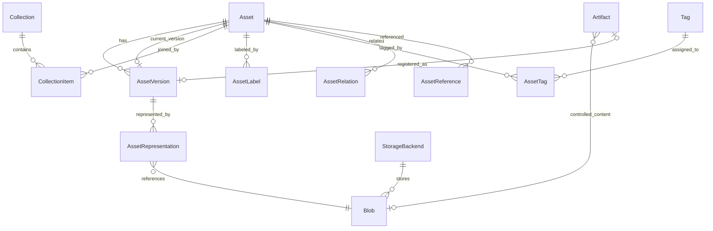
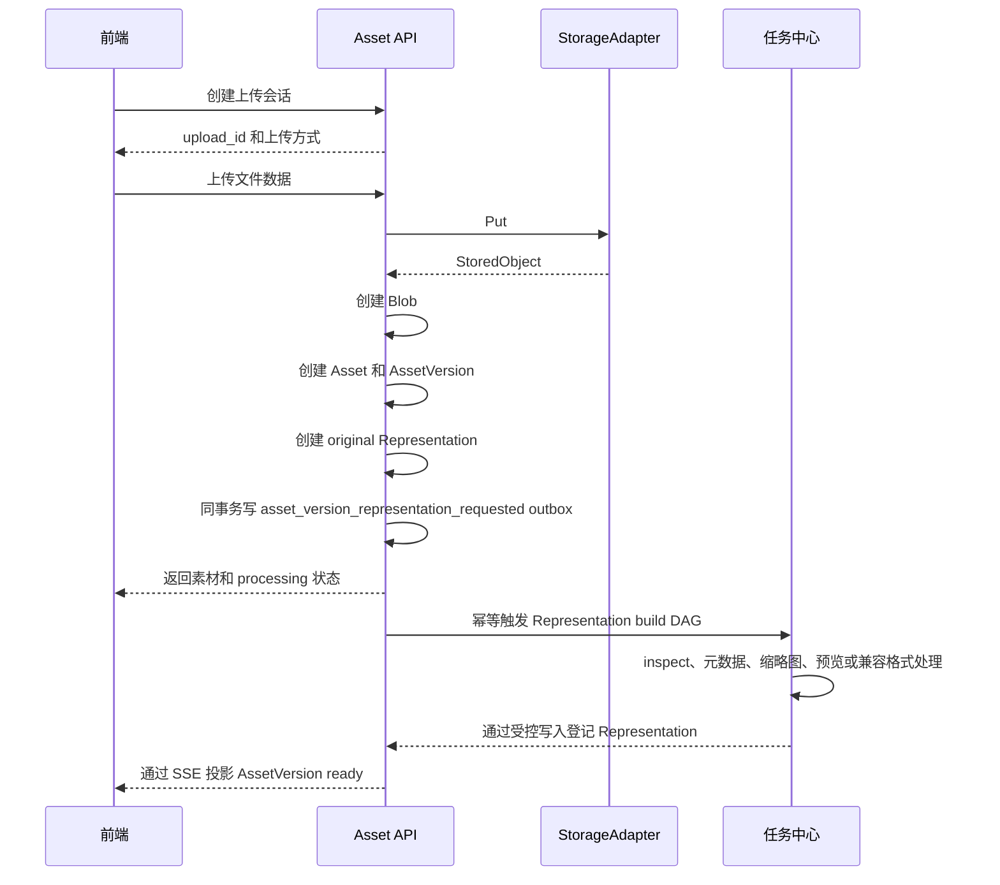

# OmniMAM 素材管理产品规格

```yaml
document_name: product-spec.md
domain_id: asset-library
domain_name: 素材管理
product: OmniMAM
version: 0.2.0-draft
status: Draft
updated_at: 2026-07-20
```

---

## 1. 文档目的

本文档定义 OmniMAM 素材管理领域的产品能力、核心对象、业务规则、存储抽象、接口语义，以及与应用中心、画布和任务中心之间的协作方式。

本文中的“素材”包括：

* 图片。
* 视频。
* 音频。
* 文本。
* 文档。
* 3D 模型文件。
* 提示词。
* 提示词模板。
* 其他需要被画布或应用引用的文件型内容。

第一阶段目标是建立一套稳定、可追踪、可复用的素材管理基础，不在第一阶段实现完整数字资产管理系统的全部高级能力。

---

## 2. 产品目标

素材管理需要解决以下问题：

1. 统一管理不同媒体类型的素材。
2. 将业务素材与物理文件分离。
3. 支持素材历史版本。
4. 支持素材分类、标签和逻辑分组。
5. 统一接收和管理应用运行、画布运行和 AtomicTask 产生的制品。
6. 让画布、应用和任务稳定引用具体素材版本。
7. 追踪素材的生成来源和使用位置。
8. 支持本地磁盘存储。
9. 预留 S3、MinIO 等存储后端适配能力。
10. 为后续智能标签、语义检索和 Agent 自动整理提供稳定基础。

---

## 3. 非目标

第一阶段不实现以下能力：

* 租户。
* 工作区。
* 每个素材独立配置的复杂 ACL。
* 素材市场。
* 外部公开分享。
* S3 存储实现。
* MinIO 存储实现。
* 多存储副本。
* 存储自动分层。
* 跨存储后端迁移。
* AI 自动打标。
* AI 自动分类。
* 向量检索。
* 以图搜图。
* 视频镜头自动分析。
* 音频自动转录。
* 文档自动理解。
* Agent 自动整理素材。
* Agent 自动创建 Collection。
* Agent 自动为画布选择素材。

上述能力统一作为后续阶段实现。

---

# 4. 核心语义

## 4.1 Asset

`Asset` 表示一个可以被独立管理、搜索、分类、引用和复用的业务素材。

例如：

```text
女主角正面参考图
第一幕视频片段
第一章剧本
夜景环境音
角色肖像提示词
女主角 3D 模型
```

Asset 是素材的业务身份，不等于某个文件路径。

一个 Asset 不应该被设计成一组相关素材的集合。

例如以下内容应该是多个 Asset：

```text
第一幕视频
第一幕字幕
第一幕配音
第一幕剧本
第一幕分镜图
```

它们可以通过关系进行关联，但不应该全部放入一个 Asset 内部。

---

## 4.2 AssetVersion

`AssetVersion` 表示同一个 Asset 的一个不可变内容版本。

例如：

```text
Asset：女主角正面参考图

├── v1：首次生成
├── v2：修复手部
└── v3：调整服装颜色
```

AssetVersion 用于：

* 保留历史内容。
* 支持版本回退。
* 保证画布运行可复现。
* 记录素材的生成来源。
* 固定应用或画布使用的具体内容。

Asset 通过 `current_version_id` 指向当前默认版本。

---

## 4.3 AssetRepresentation

`AssetRepresentation` 表示一个 AssetVersion 的某种技术表现形式。

它解决的是：

> 同一份素材内容应当如何存储、预览、播放或展示。

例如同一段视频的：

```text
原始视频
浏览器兼容播放视频
素材列表缩略图
```

可以属于同一个 AssetVersion 的不同 AssetRepresentation。

但是以下内容不属于视频的 Representation：

```text
字幕
剧本
独立音轨
深度视频
遮罩视频
```

这些内容具有独立业务价值，应创建新的 Asset。

---

## 4.4 Blob

`Blob` 表示实际存储的二进制内容。

Blob 负责记录：

* 文件实际位于哪个存储后端。
* 对象键或相对路径。
* 文件大小。
* MIME 类型。
* 内容摘要。
* 文件是否可用。

Blob 不负责表达：

* 文件叫什么素材。
* 文件是缩略图还是原始视频。
* 文件属于哪个项目。
* 文件被哪个画布使用。

这些业务语义由 Asset、AssetVersion 和 AssetRepresentation 表达。

---

## 4.5 StorageBackend

`StorageBackend` 表示一个物理存储后端配置。

第一阶段只实现：

```text
local
```

后续阶段可以实现：

```text
s3
minio
oss
cos
azure_blob
```

第一阶段虽然只实现本地存储，但业务代码必须通过统一存储适配接口访问文件，不得直接依赖本地磁盘路径。

---

## 4.6 Artifact

`Artifact` 表示应用、画布或 AtomicTask 产生、尚未登记为正式素材的执行制品。

例如：

* 生图任务产生的图片。
* 视频生成任务产生的视频。
* LLM 产生的文本。
* 音频生成任务产生的音频。
* 图像放大任务产生的图片。

Artifact 不等于 Asset。

Artifact 可以是临时结果，也可以被登记为 Asset。Artifact 的身份、受控内容引用、处理状态、保留策略和登记结果由 asset-library 维护；Task Center 只保存 Artifact 引用，ApplicationPlatform 只保存 ApplicationRun 输出到 Artifact 的映射。

---

## 4.7 Collection

`Collection` 表示多个 Asset 的逻辑集合。

例如：

```text
Collection：第一集制作素材

├── 第一集剧本
├── 女主角参考图
├── 街道场景图
├── 女主角配音
├── 背景音乐
├── 第一集字幕
└── 第一集成片
```

Collection 不对应物理目录。

一个 Asset 可以同时属于多个 Collection。

---

# 5. 核心对象关系



最简语义为：

```text
Asset
= 这是什么素材

AssetVersion
= 这个素材的哪个版本

AssetRepresentation
= 这个版本如何存储、播放或展示

Blob
= 真正的文件内容

StorageBackend
= 文件实际存放在哪里

Collection
= 哪些素材被组织到一起
```

---

# 6. 产品不变量

以下规则不得被实现破坏。

1. Asset 必须是可以独立管理和使用的素材。
2. Asset 不得被当作相关文件的小型集合。
3. AssetVersion 只表示同一素材的内容历史。
4. AssetRepresentation 只表示同一内容的技术表现形式。
5. 可独立搜索、编辑、标记或作为画布输入的内容应创建独立 Asset。
6. Collection 才负责组织多个 Asset。
7. AssetVersion 的原始内容不可覆盖。
8. 修改原始内容必须创建新的 AssetVersion。
9. 缩略图不创建独立 Asset。
10. 浏览器兼容转码文件不创建独立 Asset。
11. 字幕、音轨、剧本、遮罩和深度图原则上应创建独立 Asset。
12. 画布和应用不得保存本地文件路径。
13. 画布和应用不得保存永久下载 URL。
14. 正式运行必须记录解析后的 AssetVersion。
15. Artifact 不自动等同于 Asset。
16. 任务状态以 Task Center 的 AtomicTask 为事实源，TaskAttempt 只表示一次自动执行尝试。
17. 删除 Asset 不等于立即删除 Blob。
18. 第一阶段业务代码不得直接调用本地文件系统。
19. 第一阶段必须通过 StorageAdapter 使用本地存储。
20. 后续 S3 和 MinIO 实现不得改变 Asset、AssetVersion 和 AssetRepresentation 的业务结构。

---

# 7. 素材类型

第一阶段支持以下 Asset 类型：

```text
image
video
audio
text
document
model_3d
prompt
prompt_template
other
```

---

# 8. 第一阶段 AssetRepresentation 类型

第一阶段只支持正常上传、展示、预览和运行所必需的 Representation 类型。

统一支持以下类型：

```text
original
canonical
thumbnail
preview
playback
package
manifest
```

不是每个素材类型都支持全部类型。

---

## 8.1 original

表示用户上传或任务生成的原始文件。

适用于：

* 图片。
* 视频。
* 音频。
* 文档。
* 3D 模型。
* 其他文件型素材。

文件型素材的每个 AssetVersion 至少需要一个 `original`，但以下情况例外：

* 纯文本内容直接存储在 AssetVersion.content。
* Prompt 直接存储在 AssetVersion.content。
* PromptTemplate 直接存储在 AssetVersion.content。

---

## 8.2 canonical

表示系统内部使用的标准内容形式。

第一阶段主要用于：

* text。
* prompt。
* prompt_template。

Canonical 可以直接存放在 `AssetVersion.content` 中，不一定对应 Blob。

例如：

```json
{
  "format": "plain_text",
  "text": "深夜，女人独自坐在沙发上。"
}
```

或：

```json
{
  "positive_prompt": "cinematic portrait...",
  "negative_prompt": "low quality...",
  "prompt_type": "image_generation",
  "language": "en"
}
```

第一阶段不要求把图片、视频或音频统一转为 canonical 文件。

---

## 8.3 thumbnail

表示素材列表、素材选择器和详情页使用的小尺寸静态缩略图。

第一阶段适用于：

* image。
* video。
* document。
* model_3d。

缩略图不是独立素材。

第一阶段建议统一生成 WebP 或 JPEG。

对于不支持生成缩略图的素材，可以使用系统内置类型图标，不要求创建 thumbnail Representation。

---

## 8.4 preview

表示用户在浏览器中查看素材时使用的预览形式。

第一阶段适用于：

* document。
* model_3d。
* 原始格式无法由浏览器直接显示的图片。

示例：

```text
DOCX → PDF 或首页图片预览
BLEND → 静态渲染图片
TIFF → 浏览器兼容图片
```

对于浏览器可以直接显示的 JPG、PNG、WebP，原始文件可以直接承担预览职责，不强制生成 preview。

第一阶段不为视频单独生成 preview，视频使用 playback。

---

## 8.5 playback

表示浏览器或普通终端可以直接播放的媒体文件。

第一阶段适用于：

* video。
* audio。

如果 original 已经满足浏览器播放要求，可以：

* 不额外创建 playback；
* 或创建一个引用同一 Blob 的 playback Representation。

如果 original 不兼容浏览器，可以通过任务中心生成 playback 文件。

第一阶段每个视频或音频版本最多维护一个主 playback，不实现多清晰度播放集合。

---

## 8.6 package

表示由多个相关物理文件共同组成的一个技术素材包。

第一阶段主要用于多文件 3D 素材。

例如：

```text
model.obj
model.mtl
textures/body.png
textures/clothes.png
```

这些文件共同组成一个 3D 模型，不是多个业务 Asset。

第一阶段推荐将多文件素材打包成 ZIP 或 TAR，并由一个 Blob 保存完整包。

不在第一阶段实现复杂的 RepresentationComponent 文件树。

---

## 8.7 manifest

表示复合文件包的内容清单。

第一阶段主要与 package 配合使用。

示例：

```json
{
  "format": "obj-package",
  "entry_file": "model.obj",
  "files": [
    {
      "path": "model.obj",
      "role": "model"
    },
    {
      "path": "model.mtl",
      "role": "material"
    },
    {
      "path": "textures/body.png",
      "role": "texture"
    }
  ]
}
```

Manifest 可以：

* 直接存储在 AssetRepresentation.metadata。
* 或作为 JSON Blob 保存。

第一阶段优先存储在 metadata 中。

---

# 9. 各素材类型的 Representation

## 9.1 图片

第一阶段支持：

```text
original
thumbnail
preview
```

### 必需规则

* `original`：必需。
* `thumbnail`：建议自动生成。
* `preview`：仅在原始格式不适合浏览器展示时生成。

示例：

```text
Asset：城市夜景原画
└── AssetVersion v1
    ├── original
    │   └── city-night.tiff
    ├── preview
    │   └── city-night.webp
    └── thumbnail
        └── city-night-512.webp
```

如果原始文件是浏览器兼容的 PNG：

```text
Asset：角色参考图
└── AssetVersion v1
    ├── original
    │   └── character.png
    └── thumbnail
        └── character-512.webp
```

### 应创建独立 Asset 的图片内容

以下内容不属于原图的 Representation：

* 遮罩图。
* 深度图。
* 法线图。
* 姿态图。
* 边缘图。
* 分割图。
* 去背景后的图。
* 风格化图片。
* 放大后的最终图片。

这些内容应创建新的 image Asset，并通过 AssetRelation 关联。

---

## 9.2 视频

第一阶段支持：

```text
original
playback
thumbnail
```

### 必需规则

* `original`：必需。
* `playback`：原始视频无法在浏览器正常播放时生成。
* `thumbnail`：建议自动生成。

示例：

```text
Asset：第一幕视频
└── AssetVersion v1
    ├── original
    │   └── scene-01-prores.mov
    ├── playback
    │   └── scene-01-h264.mp4
    └── thumbnail
        └── scene-01-512.webp
```

第一阶段不生成：

* 多清晰度播放文件。
* 编辑代理文件。
* 中间母版。
* 动态预览。
* Storyboard Sheet。
* 多张关键帧预览。
* 独立 poster 类型。

视频缩略图可以同时承担播放器初始封面。

### 应创建独立 Asset 的视频相关内容

以下内容不属于视频 Representation：

* 字幕。
* 转录文本。
* 独立音轨。
* 背景音乐。
* 配音。
* 剧本。
* 深度视频。
* Alpha 视频。
* 遮罩视频。
* 摄像机轨迹。
* 光流数据。
* 提取后可独立使用的关键帧。

---

## 9.3 音频

第一阶段支持：

```text
original
playback
```

### 必需规则

* `original`：必需。
* `playback`：原始音频无法在浏览器播放时生成。

示例：

```text
Asset：女主角对白
└── AssetVersion v1
    ├── original
    │   └── dialogue-96k.wav
    └── playback
        └── dialogue.mp3
```

第一阶段不生成：

* 波形文件。
* 频谱图。
* 试听片段。
* 多码率播放版本。
* 音频代理文件。

前端需要展示波形时，可以在后续阶段增加 `waveform` Representation。

### 应创建独立 Asset 的音频相关内容

以下内容不属于 Representation：

* 音频转录文本。
* 字幕。
* 分离后的人声。
* 分离后的背景音乐。
* 翻译配音。
* 变声后的音频。
* 降噪后被用户视为新成果的音频。

---

## 9.4 文本

第一阶段支持：

```text
canonical
original
```

### 必需规则

系统创建的文本优先使用：

```text
canonical
```

内容存储在：

```text
AssetVersion.content
```

用户上传 TXT 或 Markdown 文件时可以保留：

```text
original
```

示例：

```text
Asset：第一章剧本
└── AssetVersion v1
    ├── canonical
    │   └── AssetVersion.content
    └── original
        └── chapter-01.md
```

第一阶段不生成：

* HTML 渲染版。
* PDF 渲染版。
* 文本摘要。
* 翻译结果。
* 多种导出文件。

内容发生改写、翻译、摘要或裁剪时，根据业务语义创建：

* 同一 Asset 的新版本；
* 或新的 text Asset。

---

## 9.5 文档

第一阶段支持：

```text
original
preview
thumbnail
```

### 必需规则

* `original`：必需。
* `preview`：文档格式无法直接在线展示时生成。
* `thumbnail`：能够生成时建议生成。

示例：

```text
Asset：产品需求文档
└── AssetVersion v1
    ├── original
    │   └── product-spec.docx
    ├── preview
    │   └── product-spec.pdf
    └── thumbnail
        └── product-spec-first-page.webp
```

第一阶段不生成：

* HTML 版本。
* 每页图片。
* 文本提取 Asset。
* 多种导出格式。
* 文档语义索引。

用于搜索的文本提取结果属于内部索引数据，不作为普通 AssetRepresentation 暴露。

---

## 9.6 3D 模型

第一阶段支持：

```text
original
package
manifest
preview
thumbnail
```

### 单文件 3D 格式

例如 GLB、BLEND：

```text
Asset：女主角 3D 模型
└── AssetVersion v1
    ├── original
    │   └── character.glb
    ├── preview
    │   └── character-preview.png
    └── thumbnail
        └── character-thumbnail.webp
```

### 多文件 3D 格式

例如 OBJ、MTL 和贴图：

```text
Asset：建筑模型
└── AssetVersion v1
    ├── package
    │   └── building-model.zip
    ├── manifest
    │   └── AssetRepresentation.metadata
    ├── preview
    │   └── building-preview.png
    └── thumbnail
        └── building-thumbnail.webp
```

第一阶段不实现：

* 自动 GLB 转换。
* Web 优化模型。
* Draco 压缩。
* LOD。
* 低面代理模型。
* 转台视频。
* 线框预览。
* 复合文件逐文件存储。
* 可复用材质系统。
* 独立动作和骨骼管理。

独立动作、材质、HDRI、摄像机数据等后续可以建模为独立 Asset。

---

## 9.7 Prompt

第一阶段支持：

```text
canonical
```

内容存储在 `AssetVersion.content`：

```json
{
  "positive_prompt": "cinematic portrait...",
  "negative_prompt": "low quality...",
  "language": "en",
  "prompt_type": "image_generation"
}
```

第一阶段不生成：

* TXT 导出文件。
* JSON 导出文件。
* 模型专用变体。
* 自动翻译版本。
* 自动扩写版本。

---

## 9.8 PromptTemplate

第一阶段支持：

```text
canonical
```

内容示例：

```json
{
  "template": "A cinematic portrait of {{character}} in {{scene}}",
  "variables": [
    {
      "name": "character",
      "type": "string",
      "required": true
    },
    {
      "name": "scene",
      "type": "string",
      "required": true
    }
  ]
}
```

第一阶段不生成：

* YAML 导出。
* Markdown 导出。
* 模板预览文件。
* 自动变量推断。
* 自动变量填充。

---

# 10. 后续阶段 Representation 类型

以下 Representation 类型不在第一阶段实现。

## 10.1 图片

```text
web_optimized
tiles
```

用途包括：

* 浏览器优化图。
* 超大图片分块浏览。
* 多级缩放。

## 10.2 视频

```text
proxy
mezzanine
poster
animated_preview
storyboard_sheet
```

用途包括：

* 剪辑代理。
* 高质量中间母版。
* 独立播放器海报。
* 动态预览。
* 多帧故事板。

## 10.3 音频

```text
waveform
spectrogram
preview
proxy
```

用途包括：

* 波形显示。
* 频谱显示。
* 试听片段。
* 低码率代理。

## 10.4 文本和文档

```text
rendered
web_view
export
page_image
```

用途包括：

* HTML 渲染。
* PDF 渲染。
* 多格式导出。
* 文档逐页图片。

## 10.5 3D 模型

```text
canonical
web_view
proxy
lod
wireframe_preview
turntable_preview
```

用途包括：

* 标准化 GLB。
* 浏览器优化模型。
* 低面代理。
* 多级细节。
* 线框预览。
* 转台视频。

---

# 11. Asset 与 Artifact

## 11.1 Artifact 创建

受信任的 ApplicationExecutor、画布执行器或 AtomicTask Worker 在输出端口产生文件或结构化结果时，通过 asset-library 创建 Artifact。调用方负责外部 Provider 协议、轮询、鉴权和下载，不得把 Provider 凭证、任意 URL、私网地址或原始响应交给 asset-library。

调用方只能通过受控字节流、上传会话或 asset-library 可验证的可信存储引用交付内容。Task Center 不创建 Artifact 业务事实，只保存 Artifact ID 等小型结果引用。

Artifact 至少记录：

```text
id
artifact_type
owner_user_id
producer_type
producer_id
producer_idempotency_key
atomic_task_id
task_attempt_id
application_run_id
canvas_run_id
node_run_id
node_id
output_key
sequence
blob_id
content
metadata
processing_status
registration_status
save_policy
asset_id
asset_version_id
resource_version
expires_at
created_at
updated_at
```

不适用字段允许为空。

同一逻辑输出使用稳定 producer key 幂等创建。任务输出的默认逻辑键为：

```text
atomic_task_id + output_key + sequence
```

同一个 AtomicTask 的自动 TaskAttempt 重试复用同一键；手动重试会创建新的 AtomicTask，因此可以形成新的 Artifact。

Artifact 受控内容完成上传时，asset-library 在同一事务写 `artifact_content_completed` outbox。Task Center 按以下幂等键创建 `asset-library.artifact.process` AtomicTask：

```text
artifact-process:<artifact_id>:<processing_profile_version>
```

该任务负责内容校验、媒体信息提取、可选临时预览和安全检查，并通过 asset-library 受控写入更新 Artifact；任务只返回 `artifact_id` 等小型引用。必需处理成功后 Artifact 进入 `ready`，失败进入 `failed`。

---

## 11.2 Artifact 保存策略

支持：

```text
transient
manual_save
auto_save
```

### transient

只作为临时运行结果。

### manual_save

用户手动保存到素材库。

### auto_save

节点或应用配置为自动保存最终输出。

`save_policy` 只表达调用方的登记意图，不是 Artifact 状态。Artifact 的两个独立状态维度为：

```text
processing_status:
  created -> transferring -> processing -> ready | failed -> deleted

registration_status:
  pending -> registered | failed
```

`preview_ready` 是 processing 期间的独立事实，不代表 Artifact 已 ready。只有 `processing_status=ready` 才能登记为 Asset；登记失败不修改 AtomicTask 终态。

---

## 11.3 Artifact 保存为 Asset

Artifact 可以：

1. 创建新的 Asset。
2. 追加为已有 Asset 的新版本。

```http
POST /api/v1/artifacts/{artifact_id}/register
```

创建新素材：

```json
{
  "mode": "create_asset",
  "name": "女主角参考图",
  "asset_type": "image",
  "collection_ids": [
    "collection-001"
  ],
  "tags": [
    "角色参考"
  ],
  "labels": {
    "character.name": "alice"
  }
}
```

登记必须在一个 asset-library 事务中完成：

1. 校验 Artifact owner、ready 状态、内容可读性和媒体信息。
2. 创建或命中当前用户的 Asset。
3. 创建 AssetVersion，并复用 Artifact Blob 创建 `original` AssetRepresentation，不复制二进制内容。
4. 更新 Artifact 的 `registration_status`、`asset_id`、`asset_version_id` 和 `resource_version`。
5. 写入 Artifact 登记事件和 `asset_version_representation_requested` outbox。

同一 Artifact 重复登记必须返回同一 Asset/AssetVersion。不同 owner、内容或登记目标使用同一 Artifact ID 时返回幂等冲突。

---

## 11.4 AssetRepresentation 首次生成任务

`original` 在登记事务中同步创建。纯文本、Prompt 和 PromptTemplate 的 canonical 内容可以同步写入 AssetVersion。thumbnail、preview、playback 和 manifest 等派生 Representation 通过 Task Center 异步生成。

```text
asset_version_representation_requested
  -> asset-library.representation.build DAGTaskGroup
  -> asset-library.representation.inspect
  -> asset-library.representation.thumbnail.generate
  -> asset-library.representation.preview.generate
  -> asset-library.representation.playback.generate
  -> asset-library.representation.manifest.generate
  -> asset-library.representation.finalize
```

asset-library 根据媒体类型、当前 Representation policy 和 `profile_version` 决定实际节点；不需要的节点不创建。多个派生节点在 inspect 成功后可以并行执行，finalize 在所有已创建节点终态后汇总。

DAG 幂等键为：

```text
asset-representations:<asset_version_id>:<profile_version>
```

每个生成节点以 `representation_type + profile` 作为稳定 childKey。Worker 通过 asset-library 受控写入能力幂等登记 Blob 和 AssetRepresentation，向 Task Center 只返回 `asset_version_id`、`representation_id` 和 `blob_id` 等小型引用。

必需 original 或 metadata 校验失败时 AssetVersion 进入 `failed`；可选 thumbnail、preview 或 playback 失败时进入 `ready_with_warnings`；所有必需项成功后进入 `ready`。

---

## 11.5 缺失 Representation 周期补全

事件驱动生成是主链路。Task Center 还必须维护唯一 SYSTEM RECONCILE 计划作为修复兜底：

```text
systemKey: asset-library.representation-backfill
reconcileRef: asset-library.representation-backfill
executionMode: RECONCILE
default cron: 0 30 3 * * *
timezone: UTC
overlapPolicy: SKIP
```

巡检器按稳定 `asset_version_id` checkpoint 分块扫描，使用当前 policy/profile 计算 expected Representation 集合，只为以下缺口创建修复动作：

* 缺少必需或建议生成的 Representation。
* 已失败且仍可重试的 Representation。
* Blob missing/corrupted 且 original/canonical 仍可用于重建。
* policy/profile 升级后缺少新 profile。

每个缺失项创建独立 AtomicTask：

```text
functionRef: asset-library.representation.generate
idempotency_key: asset-representation:<asset_version_id>:<representation_type>:<profile_version>
```

健康 AssetVersion 不创建任务；同一缺失项只允许一个非终态修复任务。删除中的 Asset、transient Artifact 和源内容不可恢复的条目不创建任务；不可恢复条目标记稳定 `irreparable` 原因。巡检必须限制单轮扫描数、修复动作数和并发，并使用失败退避防止无限重建。

巡检摘要至少包含：

```text
scanned
missing
actions_created
deferred
irreparable
repaired
```

checkpoint 只在完整分块完成后推进。修复成功后重新计算 AssetVersion 状态，`ready_with_warnings` 可以提升为 `ready`。

追加新版本：

```json
{
  "mode": "append_version",
  "asset_id": "asset-001",
  "version_note": "修复手部后的版本"
}
```

---

# 12. AssetVersion 规则

## 12.1 创建新版本

以下情况创建新 AssetVersion：

* 替换了素材原始内容。
* 修正了同一图片。
* 修改了同一文本。
* 修改了同一提示词。
* 修改了同一文档。
* 用户明确把 Artifact 追加到已有 Asset。

## 12.2 创建新 Asset

以下情况创建独立 Asset：

* 图片生成视频。
* 视频提取音频。
* 小说改编成剧本。
* 图片生成深度图。
* 图片生成遮罩。
* 视频生成字幕。
* 视频生成转录文本。
* 角色图生成姿态图。
* 原始图片生成风格化作品。

## 12.3 版本不可变

AssetVersion 创建后，不允许修改：

* 原始 Blob。
* canonical 内容。
* 版本号。
* 创建来源。
* 创建时间。

允许补充：

* thumbnail。
* preview。
* playback。
* package manifest。
* 技术元数据。
* 处理错误。
* 处理记录。

---

# 13. Collection

## 13.1 Collection 语义

Collection 是多个 Asset 的逻辑集合。

Collection 不：

* 创建文件副本。
* 修改素材存储位置。
* 改变 Asset 所有权。
* 自动固定具体版本。

## 13.2 Collection 层级

支持父子层级。

```text
项目 A
├── 角色
│   ├── 女主角
│   └── 男主角
├── 场景
├── 音频
└── 成片
```

第一阶段建议最大深度为 8。

## 13.3 CollectionItem

```text
CollectionItem
├── id
├── collection_id
├── asset_id
├── pinned_version_id
├── role
├── sort_order
├── metadata
├── created_by
└── created_at
```

`pinned_version_id` 可为空：

* 为空：显示 Asset 当前版本。
* 非空：固定指定 AssetVersion。

---

# 14. Label 和 Tag

## 14.1 Label

Label 是结构化键值标签。

示例：

```text
media.type=image
visual.style=anime
character.name=alice
quality.level=approved
project.code=demo-001
```

字段：

```text
AssetLabel
├── id
├── asset_id
├── key
├── value
├── source
├── locked
├── created_by
├── created_at
└── updated_at
```

第一阶段 `source` 支持：

```text
user
system
import
```

不包含 AI 或 Agent 来源。

## 14.2 Tag

Tag 是用户自由输入的描述标签。

例如：

```text
夜景
女主角
候选素材
需要修复
镜头感好
```

## 14.3 三者区别

```text
Label
= 结构化事实

Tag
= 自由描述

Collection
= 素材分组
```

---

# 15. 素材关系

## 15.1 AssetRelation

AssetRelation 用于表达独立 Asset 之间的业务关系。

```text
AssetRelation
├── id
├── source_asset_id
├── source_version_id
├── relation_type
├── target_asset_id
├── target_version_id
├── atomic_task_id
├── task_attempt_id
├── application_run_id
├── canvas_run_id
├── metadata
└── created_at
```

第一阶段支持：

```text
derived_from
generated_from
edited_from
upscaled_from
extracted_from
converted_from
uses_reference
paired_with
caption_of
audio_of
subtitle_of
transcript_of
```

示例：

```text
字幕 subtitle_of 视频
音频 extracted_from 视频
深度图 generated_from 原图
放大图 upscaled_from 原图
视频 uses_reference 角色参考图
```

---

# 16. 画布和应用引用

画布节点不得保存：

```text
/data/assets/image.png
https://storage.example.com/file.png
```

节点保存：

```json
{
  "asset_id": "asset-001",
  "version_policy": "pinned",
  "asset_version_id": "asset-version-003"
}
```

支持：

```text
latest
pinned
```

## 16.1 latest

运行时解析 Asset 当前版本。

## 16.2 pinned

固定使用指定 AssetVersion。

## 16.3 运行记录

无论使用哪种策略，AtomicTask 或所属运行投影都必须记录：

```json
{
  "asset_id": "asset-001",
  "version_policy": "latest",
  "resolved_asset_version_id": "asset-version-005",
  "atomic_task_id": "atomic-task-001",
  "blob_sha256": "sha256-value"
}
```

---

# 17. 数据模型

## 17.1 Asset

```text
Asset
├── id: UUID
├── owner_user_id: UUID
├── asset_type: VARCHAR
├── name: VARCHAR
├── description: TEXT
├── status: VARCHAR
├── current_version_id: UUID
├── cover_representation_id: UUID
├── visibility: VARCHAR
├── created_by: UUID
├── created_at: TIMESTAMPTZ
├── updated_at: TIMESTAMPTZ
└── deleted_at: TIMESTAMPTZ
```

第一阶段 visibility：

```text
private
```

---

## 17.2 AssetVersion

```text
AssetVersion
├── id: UUID
├── asset_id: UUID
├── version_no: INTEGER
├── status: VARCHAR
├── source_type: VARCHAR
├── source_ref_id: UUID
├── content: JSONB
├── metadata: JSONB
├── version_note: TEXT
├── processing_error: JSONB
├── created_by: UUID
└── created_at: TIMESTAMPTZ
```

`source_type`：

```text
upload
artifact
asset_edit
asset_conversion
external_import
```

---

## 17.3 AssetRepresentation

```text
AssetRepresentation
├── id: UUID
├── asset_version_id: UUID
├── representation_type: VARCHAR
├── profile: VARCHAR
├── blob_id: UUID
├── format: VARCHAR
├── mime_type: VARCHAR
├── is_primary: BOOLEAN
├── metadata: JSONB
├── generation_source: VARCHAR
└── created_at: TIMESTAMPTZ
```

`generation_source`：

```text
upload
task_output
generated
converted
rendered
```

对于 canonical 内容直接存储在 AssetVersion.content 的情况，允许不存在 Blob 和 AssetRepresentation 数据行。

## 17.4 唯一约束

建议：

```text
UNIQUE (
  asset_version_id,
  representation_type,
  profile
)
```

同一个版本原则上只允许一个主 original：

```text
asset_version_id + representation_type=original + is_primary=true
```

---

## 17.5 Blob

```text
Blob
├── id: UUID
├── storage_backend_id: UUID
├── object_key: VARCHAR
├── sha256: VARCHAR
├── size_bytes: BIGINT
├── mime_type: VARCHAR
├── state: VARCHAR
├── created_at: TIMESTAMPTZ
└── deleted_at: TIMESTAMPTZ
```

---

## 17.6 StorageBackend

```text
StorageBackend
├── id: UUID
├── name: VARCHAR
├── backend_type: VARCHAR
├── config_ref: VARCHAR
├── status: VARCHAR
├── priority: INTEGER
├── created_at: TIMESTAMPTZ
└── updated_at: TIMESTAMPTZ
```

第一阶段只有：

```text
backend_type=local
```

S3 和 MinIO 可以预先作为枚举保留，但不得在第一阶段界面中创建或启用。

---

# 18. 存储适配层

## 18.1 设计原则

素材领域不得直接依赖：

* `os.Open`。
* `os.WriteFile`。
* 本地绝对路径。
* S3 SDK。
* MinIO SDK。

所有存储操作必须通过 `StorageAdapter`。

## 18.2 StorageAdapter 接口

建议后端定义类似接口：

```go
type StorageAdapter interface {
    Put(
        ctx context.Context,
        request PutObjectRequest,
    ) (*StoredObject, error)

    Open(
        ctx context.Context,
        objectKey string,
    ) (io.ReadCloser, error)

    Stat(
        ctx context.Context,
        objectKey string,
    ) (*ObjectInfo, error)

    Delete(
        ctx context.Context,
        objectKey string,
    ) error

    Exists(
        ctx context.Context,
        objectKey string,
    ) (bool, error)

    CreateAccessURL(
        ctx context.Context,
        request AccessURLRequest,
    ) (*AccessURL, error)
}
```

建议请求结构：

```go
type PutObjectRequest struct {
    ObjectKey  string
    Reader     io.Reader
    Size       int64
    MIMEType   string
    SHA256     string
}

type StoredObject struct {
    ObjectKey  string
    Size       int64
    MIMEType   string
    SHA256     string
}

type AccessURLRequest struct {
    ObjectKey  string
    Operation  string
    ExpiresIn  time.Duration
}
```

## 18.3 LocalStorageAdapter

第一阶段实现：

```text
LocalStorageAdapter
```

职责：

* 将 object_key 映射到本地根目录。
* 防止路径穿越。
* 创建必要目录。
* 使用临时文件完成原子写入。
* 校验文件大小和 SHA-256。
* 提供 API 代理访问地址。
* 删除无引用文件。

本地存储配置示例：

```yaml
storage:
  default_backend: local-main

  backends:
    - id: local-main
      type: local
      root_path: /var/lib/omnimam/assets
```

业务数据库只保存：

```text
storage_backend_id=local-main
object_key=blobs/8f/8f74ab...
```

不得保存：

```text
/var/lib/omnimam/assets/blobs/8f/8f74ab...
```

## 18.4 S3StorageAdapter

后续阶段实现：

```text
S3StorageAdapter
```

其实现应遵守同一个 StorageAdapter 接口。

后续可以增加：

* 分片上传。
* Presigned URL。
* Bucket 配置。
* Endpoint 配置。
* Region 配置。
* Path Style 配置。
* 服务端加密。
* 对象版本。
* 生命周期策略。

## 18.5 MinIOStorageAdapter

后续阶段实现：

```text
MinIOStorageAdapter
```

MinIO 可以复用 S3 协议实现，也可以使用独立 Adapter。

无论采用哪种实现方式，都不得改变上层 Asset、AssetVersion、AssetRepresentation 和 Blob 结构。

---

# 19. 上传流程



第一阶段上传经过 Asset API，不实现客户端直接上传 S3 或 MinIO。

---

# 20. 素材处理

素材处理复用任务中心。

## 20.1 图片

```text
calculate-checksum
validate-image
extract-image-metadata
generate-thumbnail
generate-preview-if-needed
```

## 20.2 视频

```text
calculate-checksum
validate-video
extract-video-metadata
generate-thumbnail
generate-playback-if-needed
```

## 20.3 音频

```text
calculate-checksum
validate-audio
extract-audio-metadata
generate-playback-if-needed
```

## 20.4 文档

```text
calculate-checksum
validate-document
extract-document-metadata
generate-preview
generate-thumbnail
```

## 20.5 3D 模型

```text
calculate-checksum
validate-3d-file-or-package
extract-3d-metadata
generate-preview-if-supported
generate-thumbnail-if-supported
```

预览处理失败不应导致原始素材不可使用。

---

# 21. 状态

## 21.1 Asset

```text
active
archived
deleted
```

## 21.2 AssetVersion

```text
uploading
processing
ready
ready_with_warnings
failed
```

## 21.3 Blob

```text
pending
available
corrupted
missing
deleting
deleted
```

## 21.4 Artifact 状态

```text
processing_status:
  created
  transferring
  processing
  ready
  failed
  deleted

registration_status:
  pending
  registered
  failed
```

临时保留由 `save_policy=transient` 和 `expires_at` 表达，不引入 `promoting/promoted` 业务状态。

---

# 22. 搜索与筛选

第一阶段使用 PostgreSQL。

支持搜索：

* Asset 名称。
* Asset 描述。
* Tag。
* Label。
* 文件名。
* 文本内容。
* Prompt 内容。
* PromptTemplate 内容。

支持筛选：

* asset_type。
* status。
* collection_id。
* created_at。
* updated_at。
* 文件格式。
* MIME 类型。
* 文件大小。
* 图片宽高。
* 视频时长。
* 音频时长。
* Label。
* Tag。
* 来源类型。

后续阶段再增加：

* Elasticsearch。
* pgvector。
* 图片语义搜索。
* 文本语义搜索。
* 以图搜图。
* 自然语言查询。
* Agent 素材选择。

---

# 23. API

统一前缀：

```text
/api/v1
```

## 23.1 Asset

```http
POST   /api/v1/assets
GET    /api/v1/assets
GET    /api/v1/assets/{asset_id}
PATCH  /api/v1/assets/{asset_id}
DELETE /api/v1/assets/{asset_id}
POST   /api/v1/assets/{asset_id}/restore
DELETE /api/v1/assets/{asset_id}/permanent
```

## 23.2 AssetVersion

```http
GET  /api/v1/assets/{asset_id}/versions
POST /api/v1/assets/{asset_id}/versions
GET  /api/v1/asset-versions/{version_id}
POST /api/v1/assets/{asset_id}/versions/{version_id}/set-current
```

## 23.3 上传

```http
POST   /api/v1/asset-uploads
POST   /api/v1/asset-uploads/{upload_id}/content
POST   /api/v1/asset-uploads/{upload_id}/complete
DELETE /api/v1/asset-uploads/{upload_id}
```

后续 S3 或 MinIO 阶段可以增加：

```http
POST /api/v1/asset-uploads/{upload_id}/parts
POST /api/v1/asset-uploads/{upload_id}/presign
```

第一阶段不实现。

## 23.4 Representation

```http
GET /api/v1/asset-representations/{representation_id}
GET /api/v1/asset-representations/{representation_id}/content
GET /api/v1/asset-representations/{representation_id}/access-url
```

## 23.5 Collection

```http
POST   /api/v1/collections
GET    /api/v1/collections
GET    /api/v1/collections/{collection_id}
PATCH  /api/v1/collections/{collection_id}
DELETE /api/v1/collections/{collection_id}
```

```http
POST   /api/v1/collections/{collection_id}/items
PATCH  /api/v1/collections/{collection_id}/items/{item_id}
DELETE /api/v1/collections/{collection_id}/items/{item_id}
```

## 23.6 Label 和 Tag

```http
PUT    /api/v1/assets/{asset_id}/labels
DELETE /api/v1/assets/{asset_id}/labels/{label_id}

POST   /api/v1/assets/{asset_id}/tags
DELETE /api/v1/assets/{asset_id}/tags/{tag_id}
```

## 23.7 Artifact

```http
POST /api/v1/artifacts
GET  /api/v1/artifacts
GET  /api/v1/artifacts/{artifact_id}
POST /api/v1/artifacts/{artifact_id}/content
POST /api/v1/artifacts/{artifact_id}/complete
POST /api/v1/artifacts/{artifact_id}/register
DELETE /api/v1/artifacts/{artifact_id}
```

## 23.8 来源和引用

```http
GET /api/v1/assets/{asset_id}/relations
GET /api/v1/assets/{asset_id}/lineage
GET /api/v1/assets/{asset_id}/references
GET /api/v1/assets/{asset_id}/usages
```

---

# 24. SSE 事件

第一阶段素材处理通过 SSE 通知前端。

## 24.1 artifact.ready

```text
event: artifact.ready
```

```json
{
  "artifact_id": "artifact-101",
  "atomic_task_id": "atomic-task-001",
  "node_run_id": "node-run-008",
  "node_id": "generate-image-1",
  "output_port": "images",
  "sequence": 0,
  "artifact_type": "image",
  "persistence_state": "transient"
}
```

## 24.2 artifact.registration_succeeded

```text
event: artifact.registration_succeeded
```

```json
{
  "artifact_id": "artifact-101",
  "asset_id": "asset-501",
  "asset_version_id": "asset-version-501-1"
}
```

## 24.3 artifact.registration_failed

```text
event: artifact.registration_failed
```

## 24.4 asset_version.processing_started

```text
event: asset_version.processing_started
```

## 24.5 asset_version.processing_progressed

```text
event: asset_version.processing_progressed
```

## 24.6 asset_version.ready

```text
event: asset_version.ready
```

## 24.7 asset_version.ready_with_warnings

```text
event: asset_version.ready_with_warnings
```

## 24.8 asset_version.processing_failed

```text
event: asset_version.processing_failed
```

Artifact 和 AssetVersion 事件都必须使用统一事件信封、聚合 `resource_version` 和当前用户路由。Task Center 同时发布 AtomicTask 事件，但前端不得以 AtomicTask 成功直接推断 Artifact 或 AssetVersion ready；不同聚合之间不保证严格顺序。

---

# 25. 删除与回收站

删除 Asset 时：

1. 将状态设为 deleted。
2. 设置 deleted_at。
3. 从正常素材列表隐藏。
4. 保留 AssetVersion。
5. 保留 AssetRepresentation。
6. 保留 Blob。
7. 保留来源关系和引用关系。

永久删除前必须检查：

* 是否被画布引用。
* 是否被应用版本引用。
* 是否被 AtomicTask、ApplicationRun 或 CanvasRun 引用。
* 是否被 Collection 固定版本引用。
* 是否被其他 AssetRelation 引用。
* Blob 是否仍被其他 Representation 或 Artifact 使用。

只有 Blob 不再被任何对象引用时，才可以物理删除。

---

# 26. 前端功能

## 26.1 素材库首页

支持：

* 网格视图。
* 列表视图。
* 类型筛选。
* Collection 筛选。
* Label 筛选。
* Tag 筛选。
* 来源筛选。
* 创建时间筛选。
* 批量上传。
* 批量加入 Collection。
* 批量设置 Label。
* 批量添加 Tag。
* 批量归档。
* 批量删除。

## 26.2 素材详情

标签页：

```text
概览
版本
来源关系
使用位置
技术信息
处理记录
```

## 26.3 任务制品区

每个 Artifact 支持：

* 预览。
* 下载。
* 保存为新 Asset。
* 追加为已有 AssetVersion。
* 加入 Collection。
* 作为画布输入。
* 查看来源任务和节点。
* 删除临时结果。

## 26.4 画布素材选择器

支持：

* 按名称搜索。
* 按素材类型过滤。
* 按 Collection 过滤。
* 按 Label 过滤。
* 按 Tag 过滤。
* 选择当前版本。
* 固定历史版本。

---

# 27. 第一阶段范围

第一阶段实现：

1. Asset。
2. AssetVersion。
3. AssetRepresentation。
4. Blob。
5. StorageBackend。
6. StorageAdapter 接口。
7. LocalStorageAdapter。
8. 图片素材。
9. 视频素材。
10. 音频素材。
11. 文本素材。
12. 文档素材。
13. 3D 模型素材。
14. Prompt。
15. PromptTemplate。
16. 本地文件上传。
17. 批量上传。
18. 基础元数据提取。
19. 必要缩略图生成。
20. 必要预览文件生成。
21. 必要播放兼容文件生成。
22. 3D 多文件 package。
23. package manifest。
24. Collection。
25. Label。
26. Tag。
27. PostgreSQL 基础搜索。
28. Artifact 受控上传、处理和临时保留。
29. Artifact 手动或自动登记。
30. Artifact 创建新 Asset 或追加为新版本。
31. AssetRelation。
32. AssetReference。
33. latest 和 pinned 引用。
34. 来源链。
35. 使用位置。
36. 回收站。
37. Blob 引用检查。
38. Artifact 与 AssetVersion SSE 进度通知。
39. 与任务中心 Representation build DAG 和 backfill RECONCILE 集成。

---

# 28. 后续阶段范围

后续阶段实现：

## 28.1 存储

* S3StorageAdapter。
* MinIOStorageAdapter。
* 客户端直传。
* Presigned URL。
* 分片上传。
* 跨存储迁移。
* 多副本。
* 冷热分层。
* 生命周期管理。

## 28.2 Representation

* 图片 Web 优化。
* 超大图分块。
* 视频多清晰度播放。
* 视频代理文件。
* 视频中间母版。
* 动态预览。
* Storyboard Sheet。
* 音频波形。
* 音频频谱。
* 文档 HTML 渲染。
* 文档逐页图片。
* 文本和 Prompt 多格式导出。
* 3D GLB 标准化。
* 3D Web 优化。
* 3D LOD。
* 3D 转台预览。
* 3D 线框预览。
* 复合 RepresentationComponent。

## 28.3 智能能力

* AI 自动标签。
* AI 自动分类。
* 图片向量。
* 文本向量。
* 以图搜图。
* 自然语言检索。
* 视频镜头识别。
* 音频自动转录。
* 文档内容理解。

## 28.4 Agent

* 自动创建 Collection。
* 自动整理项目素材。
* 自动推荐 Label 和 Tag。
* 自动查找角色参考图。
* 自动为画布选择输入素材。
* 自动建立素材来源关系。
* 自动识别重复素材。
* 自动推荐归档和清理。

---

# 29. 第一阶段验收标准

## 29.1 上传

* 用户可以上传支持的素材文件。
* 上传内容通过 LocalStorageAdapter 写入本地存储。
* 业务代码不直接依赖绝对路径。
* 上传完成后创建 Asset、AssetVersion、Blob 和 original Representation。
* 文本和 Prompt 可以使用 canonical 内容创建。

## 29.2 Representation

* 图片能够生成 thumbnail。
* 不兼容浏览器的图片能够生成 preview。
* 视频能够在必要时生成 playback。
* 视频能够生成 thumbnail。
* 音频能够在必要时生成 playback。
* 文档能够生成 preview 和 thumbnail。
* 3D 模型能够保留 original 或 package。
* package 能够记录 manifest。
* 非必要 Representation 不在第一阶段生成。

## 29.3 版本

* 修改素材内容会创建新 AssetVersion。
* 历史版本可查看。
* 历史版本不会被覆盖。
* Asset 可以切换 current_version_id。
* 正式运行记录具体 AssetVersion。

## 29.4 Artifact

* 受信任的 ApplicationExecutor、画布执行器或 AtomicTask Worker 可以幂等创建 Artifact。
* Artifact 可以保持临时状态。
* Artifact 可以保存为新 Asset。
* Artifact 可以追加为已有 Asset 的新版本。
* 保存后保留 AtomicTask、TaskAttempt、ApplicationRun、CanvasRun 和节点来源。
* Artifact 受控内容不包含 Provider 凭证、任意 URL 或原始响应。
* Artifact 登记后同步创建 original Representation，并异步补齐需要的派生 Representation。

## 29.5 Collection 和标签

* Asset 可以加入多个 Collection。
* Collection 删除不删除 Asset。
* 用户可以维护 Label。
* 用户可以维护 Tag。
* 用户可以批量加入 Collection、设置 Label 和 Tag。

## 29.6 画布和应用

* 画布节点引用 Asset，而不是路径。
* 节点支持 latest 和 pinned。
* AtomicTask 或所属运行投影记录 resolved_asset_version_id。
* 素材详情能够查看使用位置。

## 29.7 删除

* Asset 可以移入回收站。
* Asset 可以恢复。
* 永久删除前执行引用检查。
* Blob 仍被引用时不会物理删除。

## 29.8 存储扩展性

* 所有文件访问经过 StorageAdapter。
* LocalStorageAdapter 可以独立替换。
* StorageBackend 数据模型不绑定本地磁盘字段。
* 后续增加 S3 或 MinIO 不需要修改 Asset 领域模型。

---

# 30. 稳定业务规则编号

以下编号来自已发布的用户素材 S1，继续保持稳定。新模型中的 `Asset` 即当前用户范围内的 UserAsset。

1. `BR-USER-ASSET-01`：访问 `/assets` 依赖系统基础登录态。
2. `BR-USER-ASSET-02`：素材、上传会话、派生内容和运行输出均属于当前用户个人范围。
3. `BR-USER-ASSET-03`：用户只能读取、上传、修改、下载和删除自己的素材。
4. `BR-USER-ASSET-04`：一个用户的素材不得被其他用户读取、复用、修改、下载或删除。
5. `BR-USER-ASSET-05`：素材列表只展示当前用户自己的素材。
6. `BR-USER-ASSET-06`：列表展示名称、大小、时间、媒体类型、尺寸、格式、来源、标签和处理状态等 metadata。
7. `BR-USER-ASSET-07`：列表不直接渲染原始大型内容，预览使用受控 Representation 或显式内容读取。
8. `BR-USER-ASSET-08`：精确过滤支持 media_type、format、source_type、尺寸、labels 和 tags。
9. `BR-USER-ASSET-09`：自然语言搜索优先解析为统一选择器或结构化条件，并限制在当前用户范围。
10. `BR-USER-ASSET-10`：只有明确无结构化意图时才能关键词降级；解析或查询异常不得执行不受控查询。
11. `BR-USER-ASSET-11`：用户可以一次选择多个文件上传。
12. `BR-USER-ASSET-12`：上传时可以设置 Labels 和 Tags。
13. `BR-USER-ASSET-13`：小文件使用普通上传。
14. `BR-USER-ASSET-14`：超过阈值的文件使用分片上传。
15. `BR-USER-ASSET-15`：分片上传包含 checksum、初始化、逐片上传和完成阶段。
16. `BR-USER-ASSET-16`：用户可停止进行中的分片上传。
17. `BR-USER-ASSET-17`：停止上传时取消当前用户会话并清理临时状态。
18. `BR-USER-ASSET-18`：上传完成后刷新当前用户素材列表。
19. `BR-USER-ASSET-19`：上传或版本登记事务必须写 Representation 请求 outbox；重复事件不得创建重复任务，派生失败不回滚原始内容。
20. `BR-USER-ASSET-20`：素材详情展示 metadata、版本、Representation、处理状态和 SHA256。
21. `BR-USER-ASSET-21`：预览必须通过当前用户有权访问的内容读取能力。
22. `BR-USER-ASSET-22`：下载只能读取当前用户自己的素材内容。
23. `BR-USER-ASSET-23`：列表、预览和下载均不得绕过所有权校验。
24. `BR-USER-ASSET-24`：重命名只修改当前用户自己的素材名称。
25. `BR-USER-ASSET-25`：删除需要用户确认，只删除当前用户自己的素材。
26. `BR-USER-ASSET-26`：删除后刷新当前用户素材列表。
27. `BR-USER-ASSET-27`：已有服务端 thumbnail 时优先使用服务端 thumbnail。
28. `BR-USER-ASSET-28`：可选 thumbnail/preview 失败时使用占位，不阻塞素材浏览。
29. `BR-USER-ASSET-29`：画布节点输出可登记为当前用户素材。
30. `BR-USER-ASSET-30`：画布资产包只包含当前用户有权访问的素材。
31. `BR-USER-ASSET-31`：画布输出不进入平台共享素材库。
32. `BR-USER-ASSET-32`：canWrite=false 时只读展示并禁用写操作。
33. `BR-USER-ASSET-33`：第一阶段不引入平台管理员共享素材语义。
34. `BR-USER-ASSET-34`：未实现的分享、复制和移动能力不得显示为可用。
35. `BR-USER-ASSET-35`：Labels/Tags 保持已发布的 trim、长度、保留字符、大小写、去重和数量上限规则。
36. `BR-USER-ASSET-36`：用户可维护 Labels/Tags，并区分 manual 与 auto 来源。
37. `BR-USER-ASSET-37`：统一选择器支持 Label、Tag、分组、AND/OR、括号和已发布复杂度上限。
38. `BR-USER-ASSET-38`：Labels/Tags 输入支持当前用户数据和系统推荐值补全。
39. `BR-USER-ASSET-39`：过滤 UI 可以构建和编辑统一选择器。
40. `BR-USER-ASSET-40`：批量 Labels/Tags 逐项提交，单项失败不回滚其他项。
41. `BR-USER-ASSET-41`：上传前计算原始内容 SHA256，不新增同义 shasum 字段。
42. `BR-USER-ASSET-42`：相同 SHA256 命中可见既有素材时可跳过二进制上传。
43. `BR-USER-ASSET-43`：周期任务为缺失 SHA256 的历史素材补算 checksum，失败不影响可见性。
44. `BR-USER-ASSET-44`：素材列表支持三种视图，偏好只在本地记忆。
45. `BR-USER-ASSET-45`：列表视图使用可排序表格展示 metadata。
46. `BR-USER-ASSET-46`：小图标视图用于快速视觉扫描。
47. `BR-USER-ASSET-47`：大图标视图展示更多视觉内容和 metadata。
48. `BR-USER-ASSET-48`：三种视图只改变呈现，不改变查询和批量能力。
49. `BR-USER-ASSET-49`：素材分组属于当前用户，不跨用户共享。
50. `BR-USER-ASSET-50`：删除分组不删除素材。
51. `BR-USER-ASSET-51`：素材与分组是多对多关系，移除关联不删除素材。
52. `BR-USER-ASSET-52`：分组条件可以与 Labels/Tags 统一组合查询。
53. `BR-USER-ASSET-53`：分组内默认按加入时间排序，并支持手动排序。
54. `BR-USER-ASSET-54`：重复加入同一分组是幂等操作。
55. `BR-USER-ASSET-55`：同一用户范围内分组名 trim 后唯一。
56. `BR-USER-ASSET-56`：素材详情可以添加或移除分组关联。
57. `BR-USER-ASSET-57`：引用摘要只用于提示，不是强一致权限或依赖图事实源。
58. `BR-USER-ASSET-58`：外部领域可以最终一致地维护素材引用摘要。
59. `BR-USER-ASSET-59`（deprecated，由 `BR-USER-ASSET-64`、`BR-USER-ASSET-65` 替代）：旧规则将 Artifact 定义为 application-platform 持有的待登记输出。
60. `BR-USER-ASSET-60`（deprecated，由 `BR-USER-ASSET-66` 替代）：旧规则只允许 ApplicationRun 发起用户成为 Artifact 登记 owner。
61. `BR-USER-ASSET-61`（deprecated，由 `BR-USER-ASSET-67` 替代）：旧规则只定义同一 Artifact 的 UserAsset 登记幂等。
62. `BR-USER-ASSET-62`（deprecated，由 `BR-USER-ASSET-68` 替代）：旧规则要求登记失败由 application-platform Artifact 保存。
63. `BR-USER-ASSET-63`（deprecated，由 `BR-USER-ASSET-64` 替代）：旧规则将 Artifact 状态事实归 application-platform。
64. `BR-USER-ASSET-64`：asset-library 是 Artifact 身份、受控内容、处理、保留、登记状态和事件的唯一事实源；ApplicationPlatform、画布和 Task Center 只保存引用或只读投影。
65. `BR-USER-ASSET-65`：Artifact 处理状态与登记状态独立；只有 ready Artifact 可登记，登记失败不得修改 AtomicTask 终态。
66. `BR-USER-ASSET-66`：Artifact owner 来自受信 producer 对应的当前用户或 AtomicTask 创建用户，不得归属 Worker、EngineInstance、管理员或其他用户。
67. `BR-USER-ASSET-67`：Artifact producer key、登记和 Representation 写入均必须幂等；自动 TaskAttempt 重试不得创建重复逻辑制品。
68. `BR-USER-ASSET-68`：Artifact 内容必须通过受控上传交付，不得保存 Provider 凭证、任意 URL、私网地址或原始响应。
69. `BR-USER-ASSET-69`：Artifact 登记事务复用 Blob 创建 original Representation，并写可靠 Representation 请求 outbox。
70. `BR-USER-ASSET-70`：asset-library 根据媒体类型、policy 和 profile version 决定 expected Representation；Task Center 不发明媒体处理策略。
71. `BR-USER-ASSET-71`：首次派生使用幂等 DAGTaskGroup，生成节点使用稳定 childKey，Task Center 只保存小型结果引用。
72. `BR-USER-ASSET-72`：必需派生失败使 AssetVersion failed，可选派生失败使其 ready_with_warnings，必需项完成使其 ready。
73. `BR-USER-ASSET-73`：系统必须维护唯一 `asset-library.representation-backfill` SYSTEM RECONCILE 计划，健康项不物化任务。
74. `BR-USER-ASSET-74`：backfill 按稳定 checkpoint 分块扫描 expected set，只为缺失、可重试或可重建项创建幂等 AtomicTask。
75. `BR-USER-ASSET-75`：不可恢复条目标记稳定原因，巡检使用 action 上限、退避和最大重试防止无限重建。
76. `BR-USER-ASSET-76`：Artifact 和 AssetVersion 状态变化递增 resource_version 并同事务写 outbox；不同聚合不保证严格顺序。
77. `BR-USER-ASSET-77`：素材 UI 以 AssetVersion 事实和事件判断 ready，不得以 AtomicTask 成功直接推断。
78. `BR-USER-ASSET-78`：transient Artifact 不生成 AssetRepresentation；临时预览必须作为 Artifact preview 独立表达。
79. `BR-USER-ASSET-79`：Artifact 内容完成事务必须可靠触发幂等 `asset-library.artifact.process` AtomicTask；Task Center 不直接读写 Artifact 内容或状态。
80. `BR-USER-ASSET-80`：素材列表与详情必须保留稳定关系 ID，并同时返回当前用户可见的一跳可读摘要：UserAsset 当前版本、Artifact producer/任务/运行/登记素材、Collection 父级与固定版本、AssetRelation 两端素材均不得要求客户端逐 ID 补查；列表使用同域批量查询或目标领域受控批量投影，关联缺失或不可见时只省略摘要。

# 31. 稳定用户故事编号

| 编号 | 用户故事 |
| --- | --- |
| `US-USER-ASSET-01` | 查看个人素材列表 |
| `US-USER-ASSET-02` | 查看空素材列表 |
| `US-USER-ASSET-03` | 按精确条件过滤素材 |
| `US-USER-ASSET-04` | 使用自然语言搜索素材 |
| `US-USER-ASSET-05` | 多文件上传 |
| `US-USER-ASSET-06` | 普通上传 |
| `US-USER-ASSET-07` | 分片上传 |
| `US-USER-ASSET-08` | 停止分片上传 |
| `US-USER-ASSET-09` | 上传后异步处理且不阻塞浏览 |
| `US-USER-ASSET-10` | 查看素材详情 |
| `US-USER-ASSET-11` | 素材悬停预览 |
| `US-USER-ASSET-12` | 双击预览素材内容 |
| `US-USER-ASSET-13` | 下载自己的素材 |
| `US-USER-ASSET-14` | 重命名自己的素材 |
| `US-USER-ASSET-15` | 删除自己的素材 |
| `US-USER-ASSET-16` | 登记画布输出素材 |
| `US-USER-ASSET-17` | 下载有权访问的画布资产包 |
| `US-USER-ASSET-18` | 只读状态查看素材 |
| `US-USER-ASSET-19` | 维护自由键值 Labels |
| `US-USER-ASSET-20` | 使用统一选择器搜索 |
| `US-USER-ASSET-21` | 使用标签智能补全 |
| `US-USER-ASSET-22` | 使用可视化过滤构造器 |
| `US-USER-ASSET-23` | 批量打标并查看逐项结果 |
| `US-USER-ASSET-24` | 使用 OR 组合查询 |
| `US-USER-ASSET-25` | 修正自动标签 |
| `US-USER-ASSET-26` | 为图片添加描述分类 |
| `US-USER-ASSET-27` | 按自由 Tag 过滤 |
| `US-USER-ASSET-28` | 混合 Label、Tag 和排除条件查询 |
| `US-USER-ASSET-29` | 管理大量描述 Tags |
| `US-USER-ASSET-30` | 获取系统推荐 Tags |
| `US-USER-ASSET-31` | 重复上传返回已有素材 |
| `US-USER-ASSET-32` | 周期补算缺失 SHA256 |
| `US-USER-ASSET-33` | 切换列表视图模式 |
| `US-USER-ASSET-34` | 创建与管理分组 |
| `US-USER-ASSET-35` | 将素材加入分组 |
| `US-USER-ASSET-36` | 按分组浏览素材 |
| `US-USER-ASSET-37` | 从分组移除素材 |
| `US-USER-ASSET-38` | 分组与标签组合筛选 |
| `US-USER-ASSET-39` | 在素材详情管理分组 |
| `US-USER-ASSET-40` | 查看素材引用摘要 |
| `US-USER-ASSET-41` | 将应用运行输出登记为当前用户素材 |

## US-USER-ASSET-42 管理任务制品

作为运行发起用户，我希望应用、画布或 AtomicTask 产生的多个 Artifact 能够独立上传、查看、处理和过期，并保持与来源运行的追溯关系。

- Artifact 使用稳定 producer key 幂等创建。
- 自动重试不创建重复制品，手动重试可以形成新制品。
- 任何制品访问都限制在 owner 范围，内容交付不暴露 Provider 凭证或任意 URL。

## US-USER-ASSET-43 自动生成素材表现形式

作为素材用户，我希望 Artifact 登记为 AssetVersion 后自动生成适用的 thumbnail、preview、playback 或 manifest，并能区分完整成功和带警告可用。

- original 在登记事务中复用 Blob 创建。
- 派生任务按媒体策略组成幂等 DAG，重复事件不产生重复 Representation。
- 必需项和可选项按业务规则汇总 AssetVersion 状态。

## US-USER-ASSET-44 自动补全缺失表现形式

作为系统管理员，我希望系统周期扫描缺失或损坏的 AssetRepresentation，只为可修复缺口创建任务，并可查看巡检摘要。

- SYSTEM RECONCILE 使用稳定 checkpoint、禁止重叠并限制每轮扫描和修复动作。
- 健康素材不创建任务，不可恢复项不会无限重试。
- 修复成功后 AssetVersion 可以从 ready_with_warnings 提升为 ready。

## US-USER-ASSET-45 实时查看制品和素材处理

作为素材用户，我希望 Artifact 与 AssetVersion 状态实时更新，同时任务事件和素材事实乱序到达时页面仍保持正确。

- Artifact 与 AssetVersion 分别按 resource_version 幂等投影。
- 页面不通过 AtomicTask 成功推断素材 ready。

## US-USER-ASSET-46 自动处理上传制品

作为运行发起用户，我希望 Artifact 完成受控上传后自动校验、提取媒体信息并进入 ready 或 failed，使制品可以安全预览和登记。

- 重复 complete 事件返回同一处理 AtomicTask。
- Artifact 处理任务只返回引用，不向 Task Center 写入媒体正文。
- Artifact 状态由 asset-library 按 resource_version 单调更新。
