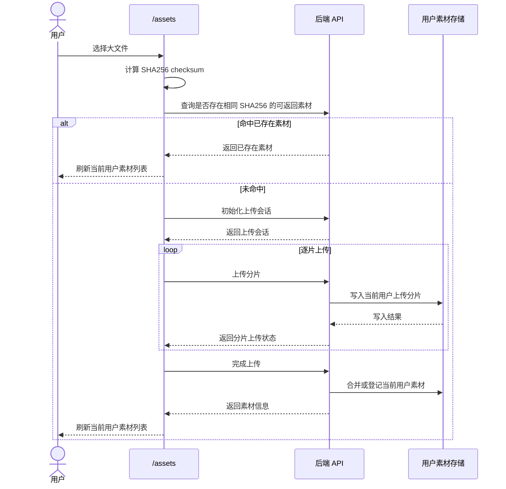
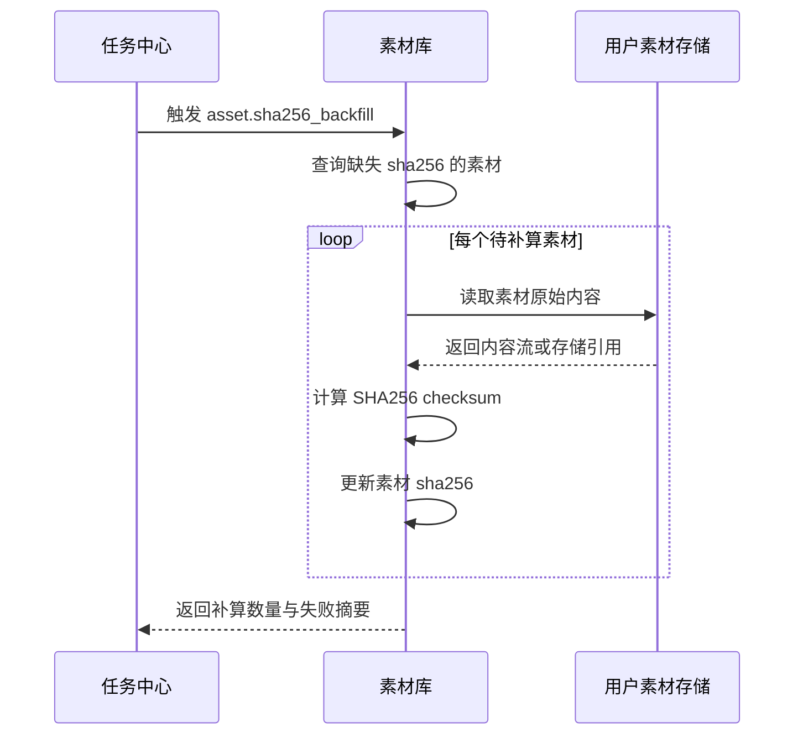
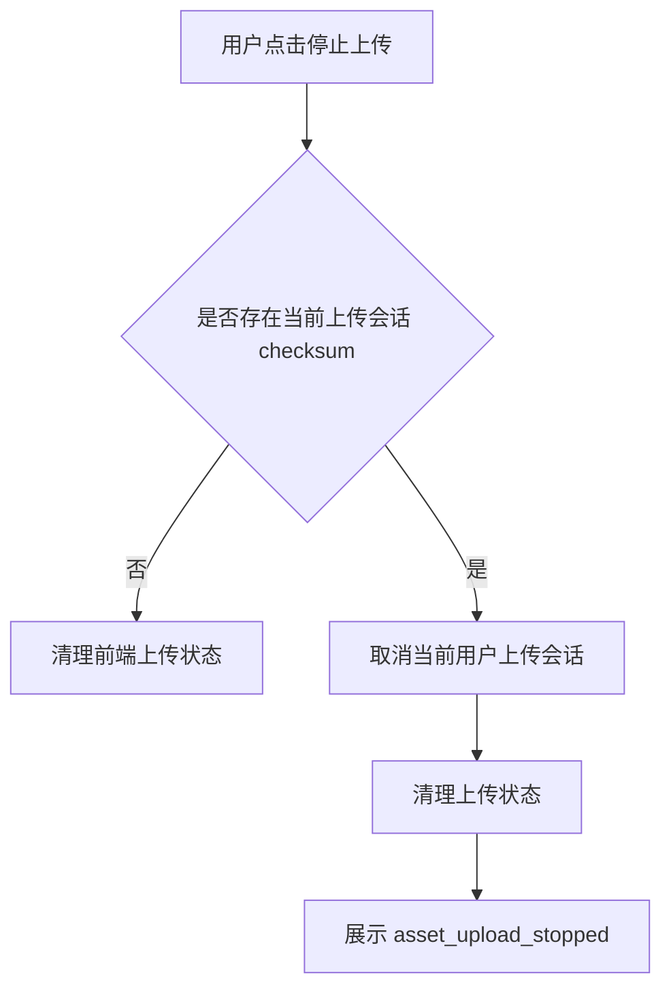
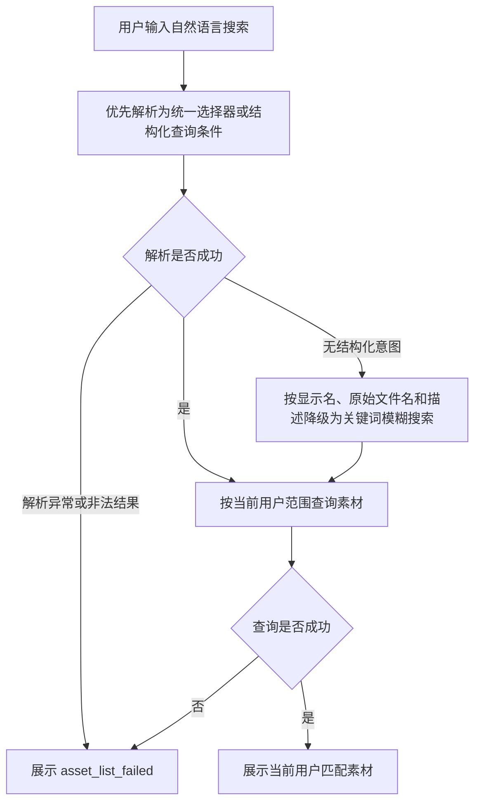
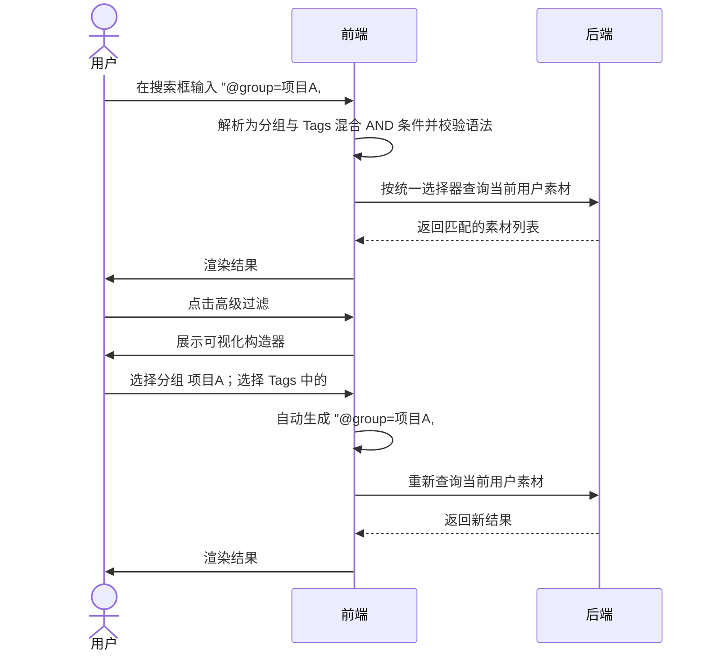
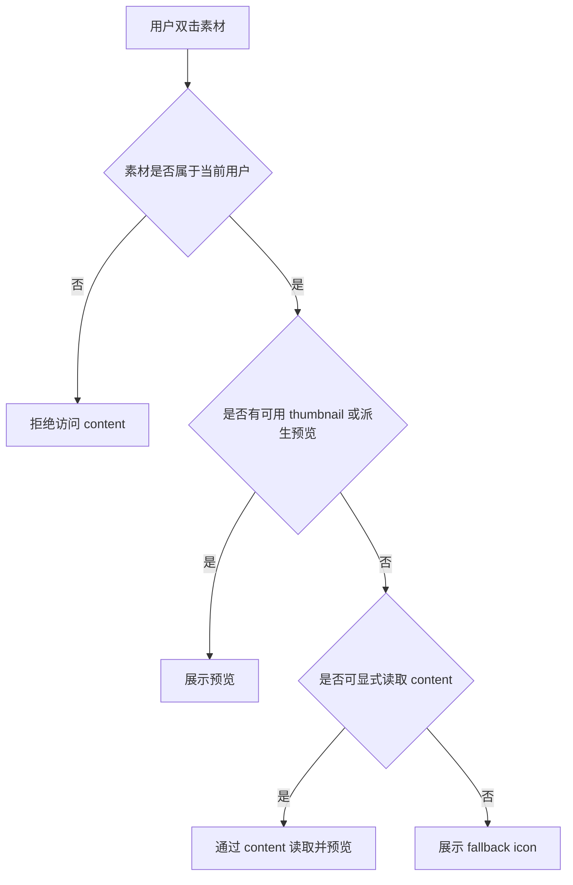
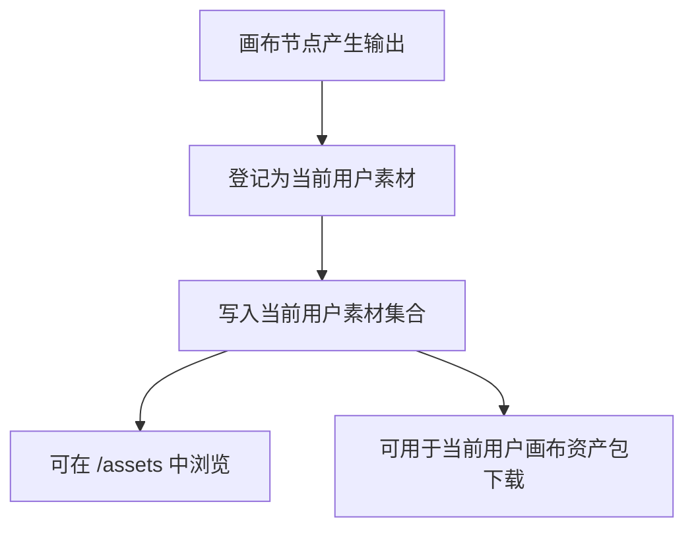
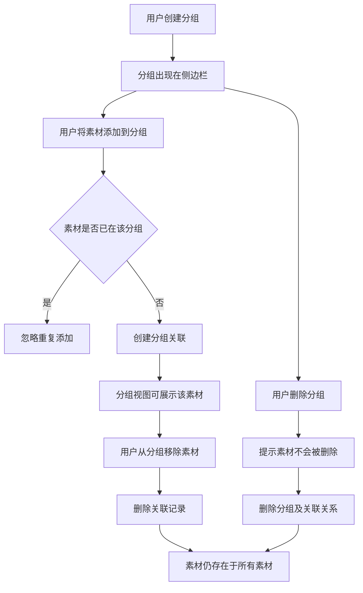

# 用户素材管理产品规格
> 本文档是 S1 产品事实源，用于定义 AI 聊天特性的产品语义、领域模型、业务规则、用户故事和端呈现策略。
>
> 本文档中的 Mermaid 图用于辅助理解复杂流程、状态变化、角色可见性和交互时序。图与文字描述应被视为同一事实集合；若存在不一致，应修正文档后再进入实现。

---
## 1. 功能说明

用户素材管理用于维护当前用户个人范围内的素材资产。用户可以上传、浏览、过滤、预览、下载、重命名和删除自己的素材，也可以将画布节点输出登记为自己的素材资产。

本功能的核心事实是：素材资产属于当前用户个人范围，不是平台级共享素材库。一个用户的素材、上传会话、缩略图、原始内容和画布输出资产不得被其他用户读取、复用、修改或删除。


页面需要支持个人素材列表、素材过滤、自然语言搜索、普通上传、分片上传、上传停止、素材详情、素材预览、素材下载、素材重命名、素材删除和画布输出资产登记。

---

## 2. Mermaid 可视化说明

本文档中的 Mermaid 图用于辅助理解页面结构、用户故事、状态变化和业务流程。

```text
Mermaid 图是对对应文字描述的可视化补充。
若图与文字描述冲突，以文字描述为准。
但二者应被视为同一事实，冲突需修正，不能长期并存。
```

实现阶段可以参考 Mermaid 图快速理解流程，但不能只看图实现。实现仍必须以本文档中的文字描述、业务规则和用户故事为准。

---

## 3. 核心数据模型

本文档中的数据模型是 S1 领域模型，仅表达产品语义和逻辑字段，不等同于 OpenAPI DTO、SQL schema 或后端 ORM。

### UserAsset（用户素材）

| 字段              | 类型                | 必填 | 说明                                       |
| --------------- | ----------------- | -- | ---------------------------------------- |
| id              | string            | 是  | 当前用户范围内的素材唯一标识                           |
| ownerUserId     | string            | 是  | 素材所属用户 ID                                |
| displayName     | string            | 是  | 素材显示名称                                   |
| originalName    | string            | 否  | 原始文件名                                    |
| mediaType       | enum              | 是  | 媒体类型，例如 image、video、audio、text、pdf、other |
| format          | string            | 否  | 文件格式或扩展名                                 |
| sizeBytes       | integer           | 是  | 文件大小                                     |
| width           | integer           | 否  | 图片或视频宽度                                  |
| height          | integer           | 否  | 图片或视频高度                                  |
| durationSeconds | number            | 否  | 音频或视频时长                                  |
| sourceType      | enum              | 是  | 来源类型，例如 upload、canvas_output             |
| objectPath      | string            | 是  | 当前用户素材内容的对象路径或存储引用                       |
| thumbnailStatus | enum              | 是  | 缩略图状态：none、pending、ready、failed          |
| previewStatus   | enum              | 否  | 派生预览状态：none、pending、ready、failed         |
| sha256          | string            | 否  | 原始内容 SHA256 checksum                     |
| referenceCount  | integer           | 否  | 轻量引用计数，用于提示当前素材被多少外部对象引用             |
| referenceSources | array of object  | 否  | 轻量引用来源摘要，例如来自 canvas 的引用统计             |
| labels          | map[string]string | 否  | 结构化键值对属性标签，如 `media=image`、`style=anime`、`project=mybot` |
| tags            | array of string   | 否  | 自由分类标签，如 `人物`、`汽车`、`双人`，去重且无序 |
| labelSources    | map[string, enum] | 否  | 与 labels key 对应的来源：manual、auto |
| tagSources      | map[string, enum] | 否  | 与 tags 值对应的来源：manual、auto |
| createdAt       | string(date-time) | 是  | 创建时间                                     |
| updatedAt       | string(date-time) | 是  | 更新时间                                     |

### UserAssetUploadSession（用户素材上传会话）

| 字段             | 类型                | 必填 | 说明                                                    |
| -------------- | ----------------- | -- | ----------------------------------------------------- |
| id             | string            | 是  | 上传会话唯一标识                                              |
| ownerUserId    | string            | 是  | 上传会话所属用户 ID                                           |
| checksum       | string            | 是  | 文件 SHA256 checksum                                    |
| fileName       | string            | 是  | 上传文件名                                                 |
| sizeBytes      | integer           | 是  | 文件大小                                                  |
| chunkSizeBytes | integer           | 否  | 分片大小                                                  |
| uploadedParts  | array of integer  | 否  | 已上传分片序号                                               |
| status         | enum              | 是  | 上传状态：initialized、uploading、completed、cancelled、failed |
| labels         | map[string]string | 否  | 上传时设置的结构化键值对属性标签                                      |
| tags           | array of string   | 否  | 上传时设置的自由分类标签，去重且无序                                    |
| createdAt      | string(date-time) | 是  | 创建时间                                                  |
| updatedAt      | string(date-time) | 是  | 更新时间                                                  |

### AssetGroup（素材分组）

| 字段          | 类型                | 必填 | 说明                         |
| ----------- | ----------------- | -- | -------------------------- |
| id          | string            | 是  | 当前用户范围内的分组唯一标识            |
| ownerUserId | string            | 是  | 分组所属用户 ID                  |
| name        | string            | 是  | 分组名称，同一用户范围内 trim 后唯一     |
| color       | string            | 否  | 分组颜色标记，用于与标签颜色体系区分       |
| sortOrder   | integer           | 否  | 分组在侧边栏中的排序值               |
| assetCount  | integer           | 否  | 当前分组关联素材数量，用于列表展示         |
| createdAt   | string(date-time) | 是  | 创建时间                       |
| updatedAt   | string(date-time) | 是  | 更新时间                       |

### AssetGroupMembership（素材分组关联）

| 字段          | 类型                | 必填 | 说明                         |
| ----------- | ----------------- | -- | -------------------------- |
| id          | string            | 是  | 分组关联唯一标识                   |
| ownerUserId | string            | 是  | 所属用户 ID                    |
| groupId     | string            | 是  | 关联分组 ID                    |
| assetId     | string            | 是  | 关联素材 ID                    |
| joinedAt    | string(date-time) | 是  | 素材加入该分组的时间                 |
| sortOrder   | integer           | 否  | 素材在该分组内的手动排序值              |
| createdAt   | string(date-time) | 是  | 创建时间                       |
| updatedAt   | string(date-time) | 是  | 更新时间                       |

### UserAssetPreview（用户素材预览）

| 字段            | 类型                | 必填 | 说明                                             |
| ------------- | ----------------- | -- | ---------------------------------------------- |
| assetId       | string            | 是  | 关联素材 ID                                        |
| ownerUserId   | string            | 是  | 所属用户 ID                                        |
| thumbnailPath | string            | 否  | 缩略图路径或引用                                       |
| previewPath   | string            | 否  | 派生预览路径或引用                                      |
| previewType   | enum              | 否  | 预览类型：image、video、audio、text、pdf、embed、fallback |
| status        | enum              | 是  | 预览状态：none、pending、ready、failed                 |
| reason        | string            | 否  | 预览失败原因                                         |
| updatedAt     | string(date-time) | 是  | 更新时间                                           |

### Labels 与 Tags 使用边界

Labels 用于可枚举、可结构化查询的属性，例如：

```text
media=image
style=anime
dimension=portrait
project=mybot
```

Tags 用于大量描述性分类，例如：

```text
人物
汽车
飞机
双人
提示词
```

同一素材可以同时拥有 Labels 和 Tags。例如一张动漫竖屏图片可以有 `style=anime`、`dimension=portrait`，同时拥有 `人物`、`汽车` 两个 Tags。

### 系统推荐标签

系统提供推荐 Labels 键值和推荐 Tags，用于自动补全、自动打标、自动建议和过滤面板提示。推荐内容不限制用户创建自定义 Labels 或 Tags。

推荐 Labels：

| 键        | 常用值示例                                | 自动提取 |
| --------- | ------------------------------------- | ---- |
| media     | image、video、audio、text、pdf、other  | 是，根据媒体类型自动设置 |
| format    | jpg、png、mp4、json、yaml、txt         | 是，根据扩展名自动设置 |
| style     | anime、realistic、3d、sketch           | 可选 AI 提取 |
| dimension | portrait、landscape、square            | 是，按宽高比计算 |
| duration  | short、medium、long                    | 是，按时长分类 |
| source    | upload、canvas                         | 是，根据素材来源自动设置 |

推荐 Tags：

| 类型 | 示例 |
| --- | --- |
| 图像类 | 人物、动物、汽车、飞机、建筑、食物、风景、双人、多人 |
| 文本类 | 提示词、模板、小说、对话、配置 |
| 通用 | 重要、待处理、已归档 |

自动标签与来源策略：

```text
上传或画布输出登记完成后，系统自动添加 media、format、source、dimension、duration 等可计算 Labels。
系统可以基于内容识别自动建议 Tags，例如 建筑、夜晚。
自动生成或自动建议的 Labels/Tags 在产品语义上标记为 source: auto。
用户手动添加的 Labels/Tags 在产品语义上标记为 source: manual。
用户可以在素材详情或列表中修改、删除任何 Labels/Tags，包括自动生成内容。
系统保留在后续编辑或校验时自动修复关键 Labels 的能力，例如 media，以降低素材 metadata 不一致风险。
当用户手动修正自动 Labels 或 Tags 后，系统不应在无明确原因时覆盖用户修正结果。
```

### UserAssetProcessingTask（用户素材处理任务）

| 字段          | 类型                | 必填 | 说明                                       |
| ----------- | ----------------- | -- | ---------------------------------------- |
| id          | string            | 是  | 任务唯一标识                                   |
| ownerUserId | string            | 是  | 所属用户 ID                                  |
| assetId     | string            | 是  | 关联素材 ID                                  |
| taskType    | enum              | 是  | 任务类型，例如 thumbnail、preview_derivative、sha256_backfill |
| status      | enum              | 是  | 任务状态：pending、processing、completed、failed |
| reason      | string            | 否  | 失败原因                                     |
| createdAt   | string(date-time) | 是  | 创建时间                                     |
| updatedAt   | string(date-time) | 是  | 更新时间                                     |

### CanvasAssetOutput（画布输出资产）

| 字段          | 类型                | 必填 | 说明          |
| ----------- | ----------------- | -- | ----------- |
| id          | string            | 是  | 画布输出资产标识    |
| ownerUserId | string            | 是  | 所属用户 ID     |
| canvasId    | string            | 是  | 来源画布 ID     |
| nodeId      | string            | 是  | 来源节点 ID     |
| assetId     | string            | 是  | 登记后的用户素材 ID |
| createdAt   | string(date-time) | 是  | 创建时间        |

---

## 4. 业务规则

* **BR-USER-ASSET-01** 访问 `/assets` 依赖系统基础登录态。
* **BR-USER-ASSET-02** 素材、上传会话、缩略图、派生预览、原始内容和画布输出资产均属于当前用户个人范围。
* **BR-USER-ASSET-03** 用户只能读取、上传、修改、下载和删除自己的素材。
* **BR-USER-ASSET-04** 一个用户的素材不得被其他用户读取、复用、修改、下载或删除。
* **BR-USER-ASSET-05** 素材列表只展示当前用户自己的素材。
* **BR-USER-ASSET-06** 列表展示素材名称、大小、创建时间、媒体类型、尺寸、时长、格式、来源、标签和 thumbnail 状态等 metadata。
* **BR-USER-ASSET-07** 列表不直接渲染原始 heavy asset；图片、视频、音频、PDF、文本等预览需要通过 thumbnail、派生预览或显式 content 读取。
* **BR-USER-ASSET-08** 精确过滤支持 media_type、format、source_type、width、height、labels 和 tags；标签过滤使用统一选择器表达式。
* **BR-USER-ASSET-09** 自然语言搜索需要优先解析为统一选择器或其他结构化查询，再按当前用户范围查询素材。
* **BR-USER-ASSET-10** 自然语言被明确判定为无结构化意图时，可以降级为对素材显示名、原始文件名和描述的关键词模糊搜索；解析服务超时或异常、解析结果生成非法选择器、无法降级或查询执行失败时展示错误，不执行不受控查询，也不能返回其他用户素材作为 fallback。
* **BR-USER-ASSET-11** 用户可以一次选择多个文件上传。
* **BR-USER-ASSET-12** 上传时可设置 labels 键值对和 tags 自由分类，并写入当前用户上传的素材。
* **BR-USER-ASSET-13** 小文件使用普通上传。
* **BR-USER-ASSET-14** 超过阈值的文件使用分片上传。
* **BR-USER-ASSET-15** 分片上传流程包括计算 SHA256 checksum、初始化上传会话、逐片上传、完成上传。
* **BR-USER-ASSET-16** 用户可停止进行中的分片上传。
* **BR-USER-ASSET-17** 停止上传时，如果存在当前上传会话 checksum，需要取消当前用户自己的上传会话，并清理上传状态。
* **BR-USER-ASSET-18** 上传完成后需要刷新当前用户素材列表。
* **BR-USER-ASSET-19** 上传完成后可创建异步处理任务，例如缩略图或派生预览处理任务。
* **BR-USER-ASSET-20** 素材详情展示当前素材 metadata、对象路径、preview 状态和 SHA256 checksum。
* **BR-USER-ASSET-21** 预览图片、视频、音频、文本和 PDF 时，必须通过当前用户有权访问的 content endpoint 或等价内容读取能力。
* **BR-USER-ASSET-22** 下载只能下载当前用户自己的素材原始内容。
* **BR-USER-ASSET-23** 列表、悬停、预览和下载都不得绕过当前用户所有权校验。
* **BR-USER-ASSET-24** 重命名只修改当前用户自己的素材显示名。
* **BR-USER-ASSET-25** 删除需要用户确认，只删除当前用户自己的素材。
* **BR-USER-ASSET-26** 删除后刷新当前用户素材列表。
* **BR-USER-ASSET-27** 视频和 GIF 可在前端抽帧生成悬停预览；已有服务端 thumbnail 时优先使用服务端 thumbnail。
* **BR-USER-ASSET-28** thumbnail 或前端抽帧失败时使用占位图标，不阻塞列表浏览。
* **BR-USER-ASSET-29** 画布节点输出可注册为当前用户素材。
* **BR-USER-ASSET-30** 画布资产包下载只包含当前用户有权访问的素材。
* **BR-USER-ASSET-31** 画布输出资产不进入平台共享素材库。
* **BR-USER-ASSET-32** canWrite=false 时，页面可展示当前用户已有素材，但禁用上传、重命名、删除等写操作。
* **BR-USER-ASSET-33** 用户级素材管理不引入 platform.manage 或平台管理员共享素材语义。
* **BR-USER-ASSET-34** 禁用菜单项，例如素材分享、复制文件、移动文件、全选，不应作为正式可用能力展示给用户。
* **BR-USER-ASSET-35** Labels 与 Tags 是两类独立标签。Labels 以 `key=value` 键值对形式存储，键名和值 trim 后分别限制为 1-63 和 0-63 个 Unicode code point；键名不得包含空白、控制字符或选择器保留字符 `,;()=!"#@`。Tags trim 后限制为 1-64 个 Unicode code point。Label key/value 与 Tag 均区分大小写，不做大小写折叠；同一 Label key 后写覆盖前写，Tags 按 trim 后原文去重且无序。每个素材最多 20 个 Labels 和 30 个 Tags。
* **BR-USER-ASSET-36** 用户可添加、修改或删除 Labels，也可添加或删除 Tags。自动生成或自动建议的 Labels/Tags 在产品语义上标记为 `source: auto`，用户手动添加或覆盖的标记为 `source: manual`；用户删除自动内容时需要提示删除可能影响过滤准确性。
* **BR-USER-ASSET-37** 素材列表支持统一选择器查询。Labels 支持 `key=value`、`key!=value`、`key`、`!key`、`key in (v1, v2)`、`key notin (v1, v2)`；Tags 支持 `#tag` 表示拥有指定 Tag，`#-tag` 表示不拥有指定 Tag；分组使用保留谓词 `@group=<分组名>`，因此 `group` 仍可作为普通 Label key。Labels、Tags 和分组条件同级，`,` 表示 AND，`;` 表示 OR，AND 优先于 OR，括号可以覆盖优先级。空 Label value 只使用 `key=""`；包含空白或保留字符的 value、Tag 和分组名使用 JSON 风格双引号及转义。选择器最多嵌套 8 层、包含 100 个谓词，单个 `in/notin` 最多包含 100 个非空值。
* **BR-USER-ASSET-38** Labels 输入时提示当前用户已使用的键、系统推荐键、当前键下已使用的值和系统推荐值；Tags 输入时提示当前用户已使用的 Tags 和系统推荐 Tags。用户可直接输入任意新 Labels 或 Tags。
* **BR-USER-ASSET-39** 过滤 UI 提供可视化控件快速构建统一选择器，并允许直接输入表达式。过滤面板区分“属性 Labels”和“分类 Tags”两个子面板，视觉上明确区分，但可以混合构建查询表达式。
* **BR-USER-ASSET-40** 用户可选中多个素材批量添加或覆盖 Labels，也可批量添加或删除 Tags。批量写入的 Labels/Tags 标记为 `source: manual`，Label 同 key 覆盖、Tag 添加和删除均为幂等操作。批量操作仍必须限制在当前用户自己的素材范围内，并逐项返回成功或失败；单个素材失败不影响其他合法素材提交。
* **BR-USER-ASSET-41** 素材上传前需要计算原始内容 SHA256 checksum。本仓库内提到的 shasum 均按现有 `sha256` 语义表达，不新增独立 shasum 字段。
* **BR-USER-ASSET-42** 上传前如果命中可返回的已存在素材且 `sha256` 相同，系统跳过二进制上传并返回该已存在素材；`sha256` 为空的素材不参与重复命中判断。
* **BR-USER-ASSET-43** 系统需要通过 `sha256_backfill` 内部处理任务，为历史或异常情况下缺失 `sha256` 的素材补算 SHA256 checksum 并更新素材 metadata。补算失败不影响素材继续可见，但需要记录失败原因或处理状态。
* **BR-USER-ASSET-44** 用户可在素材列表页切换三种视图：列表视图、小图标视图、大图标视图。视图偏好仅在本地记忆，不同设备独立，不跨端同步。
* **BR-USER-ASSET-45** 列表视图以表格形式展示素材，每行展示缩略图、名称、大小、类型、日期、标签摘要等信息，并支持列排序，适合快速浏览 metadata 和批量操作。
* **BR-USER-ASSET-46** 小图标视图以固定尺寸方形缩略图网格展示素材，下方展示名称和少量标签，适合快速视觉扫描。
* **BR-USER-ASSET-47** 大图标视图以较大缩略图卡片展示素材，卡片内可展示更多信息，例如完整标签列表、尺寸、时长等，适合仔细查看图片、视频等视觉内容。
* **BR-USER-ASSET-48** 三种视图下，过滤、搜索、排序、多选、拖拽上传等操作能力保持一致，仅呈现形式不同。
* **BR-USER-ASSET-49** 素材分组完全属于当前用户，不可被其他用户访问或共享。
* **BR-USER-ASSET-50** 用户可以创建、重命名、删除分组，也可以调整分组排序。删除分组时，系统提示“仅删除分组，素材不会被删除”，确认后仅删除分组及关联关系，素材保留。
* **BR-USER-ASSET-51** 素材可以关联到任意多个分组。从某个分组中移除素材时，仅删除关联记录，素材本身不受影响。
* **BR-USER-ASSET-52** 素材列表页支持按分组筛选。用户选择一个分组后，列表仅展示该分组下的素材；统一选择器支持 `@group=<分组名>`，并可与 Labels/Tags 混合查询，例如 `@group=项目A, #人物`。
* **BR-USER-ASSET-53** 分组内素材默认按加入时间倒序展示；用户可手动拖拽调整排序，手动排序写入分组关联关系的排序字段。
* **BR-USER-ASSET-54** 将素材添加到分组时，如果该素材已在该分组中，则忽略重复添加。
* **BR-USER-ASSET-55** 分组名称支持自动补全；创建新分组即时生效。同一用户范围内分组名称按 trim 后唯一。
* **BR-USER-ASSET-56** 素材详情页展示当前素材已关联的所有分组，并允许在详情页快速添加或移除分组关联。
* **BR-USER-ASSET-57** 素材可以维护轻量引用摘要，包括 `referenceCount` 和 `referenceSources`。该摘要用于列表、卡片和详情的引用提示，不作为强一致权限判断或完整依赖图事实源。
* **BR-USER-ASSET-58** 画布等外部模块可以通过回调或等价协作方式维护素材引用摘要。引用摘要允许最终一致；当引用数量大于 0 时，前端可在素材卡片上展示角标，例如“被 2 个画布引用”。

---

## 5. 用户故事

### US-USER-ASSET-01 查看个人素材列表

用户可以进入 `/assets` 查看自己的素材列表。

列表展示当前用户自己的素材，并展示名称、大小、创建时间、媒体类型、尺寸、时长、格式、来源、标签和 thumbnail 状态等 metadata。

### US-USER-ASSET-02 空素材列表

当当前用户没有素材时，页面显示明确空状态，引导用户上传素材。

### US-USER-ASSET-03 素材精确过滤

用户可以按 media_type、format、source_type、width、height、labels 和 tags 过滤自己的素材。

标签过滤使用统一选择器表达式，例如 `media=image, style!=anime`、`#人物` 或 `media=image, #人物`。

过滤结果只返回当前用户自己的素材。

### US-USER-ASSET-04 自然语言搜索素材

用户可以输入自然语言搜索文本，由系统优先解析为统一选择器或其他结构化素材查询条件后返回当前用户自己的匹配素材。

如果自然语言被明确判定为无结构化意图，可以降级为对素材显示名、原始文件名和描述的关键词模糊搜索，但仍必须限制在当前用户自己的素材范围内。

如果解析服务超时或异常、生成非法选择器或查询失败，需要展示错误，不允许执行不受控查询，也不允许返回其他用户素材作为 fallback。

### US-USER-ASSET-05 多文件上传

用户可以一次选择多个文件上传，并为上传素材设置 labels 键值对和 tags 自由分类。

上传时设置的 labels 和 tags 写入当前用户上传的素材，并可与系统自动标签共同存在。

### US-USER-ASSET-06 普通上传

小文件使用普通上传。上传前系统先计算 SHA256 checksum；上传成功后素材进入当前用户素材集合，并刷新素材列表。

### US-USER-ASSET-07 分片上传

超过阈值的文件使用分片上传。

分片上传流程包括计算 SHA256 checksum、初始化上传会话、逐片上传、完成上传。

### US-USER-ASSET-08 停止分片上传

用户可以停止进行中的分片上传。

停止上传时，如果存在当前上传会话 checksum，需要取消当前用户自己的上传会话，并清理上传状态。

### US-USER-ASSET-09 上传后异步处理

上传完成后，系统可以创建异步任务处理缩略图或派生预览。

异步处理任务不阻塞用户继续浏览素材列表。

### US-USER-ASSET-10 查看素材详情

用户可以查看自己的素材详情。

详情弹窗展示显示名、大小、类型、修改时间、来源、对象路径、preview 状态和 SHA256 checksum。

### US-USER-ASSET-11 素材悬停预览

用户在素材列表中悬停素材时，可以看到 thumbnail、前端抽帧预览或 fallback icon。

视频和 GIF 可在前端抽帧生成悬停预览；已有服务端 thumbnail 时优先使用服务端 thumbnail。

### US-USER-ASSET-12 双击预览素材内容

用户可以双击素材预览自己的图片、视频、音频、文本、PDF 或其他可嵌入内容。

预览必须通过当前用户有权访问的 content endpoint 或等价内容读取能力。

### US-USER-ASSET-13 下载素材

用户可以下载自己的素材原始内容。

下载不得绕过当前用户所有权校验。

### US-USER-ASSET-14 重命名素材

用户可以重命名自己的素材。

重命名只修改当前用户自己的素材显示名。

### US-USER-ASSET-15 删除素材

用户可以删除自己的素材。

删除必须经过用户确认，只删除当前用户自己的素材，并在删除后刷新素材列表。

### US-USER-ASSET-16 登记画布输出资产

画布节点输出可以注册为当前用户素材。

登记后的画布输出资产只进入当前用户素材集合，不进入平台共享素材库。

### US-USER-ASSET-17 下载画布资产包

用户可以下载当前用户范围内的画布资产包。

画布资产包只能包含当前用户有权访问的素材。

### US-USER-ASSET-18 只读状态下查看素材

当 canWrite=false 时，用户可以查看当前用户已有素材，但上传、重命名、删除等写操作需要禁用。

### US-USER-ASSET-19 自由键值标签

用户在素材详情页的“属性”区域输入 `project=mybot` 并回车后，Label 立即保存到当前用户自己的素材上，无需预先定义标签键或标签值。

### US-USER-ASSET-20 统一选择器搜索

用户在搜索框输入 `media=image, style!=anime` 后，列表实时过滤出当前用户自己的非动漫风格图片；输入 `#人物` 后，列表实时过滤出拥有“人物”Tag 的素材。

用户输入 `@group=项目A` 时按分组筛选；输入 `group=项目A` 时查询名为 `group` 的普通 Label，不产生歧义。

### US-USER-ASSET-21 智能补全创建

用户准备添加 Label 时输入 `fram`，系统提示当前用户已使用的键和系统推荐键，例如 `format`、`frame_count`。用户选择 `frame_count` 后可手动输入值 `high`。用户准备添加 Tag 时输入 `人`，系统提示当前用户已使用的 Tags 和系统推荐 Tags。

### US-USER-ASSET-22 可视化过滤构造器

用户打开高级过滤面板，在“属性”子面板勾选 `media=image`，再在“分类”子面板选择 `#人物`，页面自动生成统一选择器表达式并展示当前用户自己的匹配素材。

### US-USER-ASSET-23 批量打标

用户勾选多个提示词素材，选择批量打标，输入 Label `usage=prompt` 或 Tag `提示词` 后，所有选中且属于当前用户的素材增加或覆盖对应标签。若部分素材不存在或不可写，其他合法素材仍然提交，页面逐项展示成功或失败结果。

### US-USER-ASSET-24 OR 组合查询

用户想查看所有图片或视频素材时，输入 `media=image; media=video`，列表返回当前用户自己的两类素材。用户也可以输入 `#人物; #动物` 查看拥有任一 Tag 的素材。

### US-USER-ASSET-25 自动标签修正

系统因扩展名缺失将某个图片素材标记为 `media=other` 时，用户可手动改为 `media=image`。系统自动建议 `建筑`、`夜晚` 等 Tags 后，用户可采纳或忽略。用户修正或忽略后，系统不应在无明确原因时覆盖该结果。

### US-USER-ASSET-26 为图片添加描述分类

用户上传一张包含人物和汽车的图片，在“分类”输入框中输入 `人物,汽车` 并确认后，素材即被打上 `人物` 和 `汽车` 两个 Tags。

### US-USER-ASSET-27 按自由标签过滤

用户在搜索框输入 `#人物`，列表仅显示当前用户自己的、被打上 `人物` Tag 的素材。

### US-USER-ASSET-28 混合条件查询

用户输入 `media=image, #人物, #-汽车`，列表返回当前用户自己的所有“有人物但没有汽车”的图片。

### US-USER-ASSET-29 大量描述标签的管理

用户为一张复杂图片依次添加 `人物`、`汽车`、`飞机`、`双人`、`风景` 等多个 Tags，每个 Tag 以彩色块展示，并可单独删除。

### US-USER-ASSET-30 系统自动建议描述标签

上传图片后，系统基于内容识别自动建议 Tags，例如 `建筑`、`夜晚`。用户可一键采纳建议，也可忽略建议。

### US-USER-ASSET-31 重复素材上传返回已有素材

用户选择上传素材后，系统先计算 SHA256 checksum。如果命中可返回的已存在素材且 `sha256` 相同，系统不再上传二进制内容，而是直接返回已存在素材并刷新列表。

### US-USER-ASSET-32 补算缺失 SHA256

系统周期性触发 `sha256_backfill` 内部处理任务，扫描缺失 `sha256` 的素材，读取素材内容并计算 SHA256 checksum，成功后更新素材 metadata。

### US-USER-ASSET-33 视图模式切换

用户可以在素材列表页顶部工具栏点击视图切换按钮，在列表视图、小图标视图和大图标视图之间实时切换。用户偏好会在本地记住，下次访问同一设备时保持。

### US-USER-ASSET-34 创建与管理分组

用户点击侧边栏“分组”区域的新建分组入口，输入名称并可选颜色后，分组出现在列表中。分组支持重命名、删除和排序；删除时需要确认“素材不会被删除”。

### US-USER-ASSET-35 将素材加入分组

用户在素材列表或详情中选择一个或多个素材，点击“添加到分组”，在已有分组列表中搜索、选择或新建分组，确认后素材与分组建立关联。同一个素材可以同时加入多个分组。

### US-USER-ASSET-36 按分组浏览素材

用户点击侧边栏某个分组名称后，主视图区仅显示属于该分组的素材。分组名称高亮；用户再次点击“所有素材”可返回总览。

### US-USER-ASSET-37 从分组中移除素材

用户在分组视图中选中素材并点击“从分组移除”，确认后仅删除该素材与当前分组的关联，素材仍存在于“所有素材”中。

### US-USER-ASSET-38 分组与标签组合筛选

用户在分组 A 下继续使用搜索栏输入 `#人物`，列表显示分组 A 中同时包含 `人物` Tag 的素材。用户也可以直接输入 `@group=项目A, #人物` 获得相同筛选语义。

### US-USER-ASSET-39 素材详情中的分组管理

用户打开素材详情弹窗，底部展示“所属分组”区块，以分组标记形式列出当前素材已关联的所有分组，并提供添加到分组和移除分组入口。

### US-USER-ASSET-40 素材引用角标提示

用户浏览素材卡片时，如果某个素材被画布引用，卡片上展示轻量角标，例如“被 2 个画布引用”。用户打开详情时，可以看到引用来源摘要。

---

## 6. 页面结构

```mermaid
flowchart TD
  entry["/assets 素材"] --> toolbar["过滤与自然语言搜索"]
  entry --> sidebar["分组侧边栏"]
  entry --> upload["上传入口"]
  entry --> list["个人素材列表"]

  toolbar --> viewMode["视图切换器：列表 / 小图标 / 大图标"]
  toolbar --> selector["统一选择器表达式"]
  toolbar --> filters["media_type、format、source_type、width、height、labels、tags、group"]
  toolbar --> builder["高级过滤构造器"]
  toolbar --> parse["自然语言优先解析为结构化查询"]

  sidebar --> allAssets["所有素材"]
  sidebar --> groups["用户自定义分组"]
  groups --> groupFilter["按分组筛选"]
  groups --> groupManage["新建 / 重命名 / 删除 / 排序"]

  upload --> simple["普通上传"]
  upload --> chunk["分片上传"]
  upload --> shaCheck["上传前计算 SHA256"]
  shaCheck --> duplicate["重复命中返回已有素材"]
  chunk --> stop["停止上传"]
  upload --> labelTagInput["上传 labels / tags"]
  upload --> tasks["异步处理任务提示"]
  tasks --> shaBackfill["sha256_backfill 补算任务"]

  list --> thumb["thumbnail / fallback icon"]
  list --> labelView["Labels 属性展示"]
  list --> tagView["Tags 分类展示"]
  list --> groupView["所属分组展示"]
  list --> referenceBadge["引用角标提示"]
  list --> hover["悬停预览"]
  list --> context["右键菜单"]
  context --> info["详情"]
  context --> download["下载"]
  context --> rename["重命名"]
  context --> delete["删除"]
  context --> addGroup["添加到分组"]
  context --> removeGroup["从分组移除"]
  list --> preview["双击预览 content"]

  preview --> image["图片"]
  preview --> video["视频"]
  preview --> audio["音频"]
  preview --> text["文本"]
  preview --> embed["PDF 或 iframe"]
```



---

## 7. 关键流程图

### 7.1 分片上传流程



### 7.2 SHA256 补算任务

> ⚠️ 本图是对 US-USER-ASSET-32 和 BR-USER-ASSET-43 的可视化补充；若与文字冲突，以文字为准，但二者应视为同一事实，冲突必须修正。



### 7.3 停止分片上传



### 7.4 自然语言搜索



### 7.5 统一选择器搜索与过滤构造器

> ⚠️ 本图是对 US-USER-ASSET-20、US-USER-ASSET-22 和 BR-USER-ASSET-37、BR-USER-ASSET-39 的可视化补充；若与文字冲突，以文字为准，但二者应视为同一事实，冲突必须修正。



### 7.6 素材预览



### 7.7 画布输出登记



### 7.8 分组管理与关联

> ⚠️ 本图是对 US-USER-ASSET-34、US-USER-ASSET-35、US-USER-ASSET-37 和 BR-USER-ASSET-50、BR-USER-ASSET-51 的可视化补充；若与文字冲突，以文字为准，但二者应视为同一事实，冲突必须修正。



---

## 8. 功能适配矩阵

| 功能                  | Web |
| ------------------- | --- |
| 查看个人素材列表            | ✅   |
| 空列表提示               | ✅   |
| 三视图切换               | ✅   |
| 按 metadata 精确过滤     | ✅   |
| 统一选择器搜索             | ✅   |
| 按分组筛选               | ✅   |
| 分组与标签组合筛选           | ✅   |
| 标签智能补全              | ✅   |
| 可视化过滤构造器            | ✅   |
| 标签批量应用              | ✅   |
| 创建与管理分组             | ✅   |
| 素材加入多个分组            | ✅   |
| 从分组移除素材             | ✅   |
| 素材引用角标提示            | ✅   |
| Tags 自由分类             | ✅   |
| 系统自动建议 Tags          | ✅   |
| 自然语言搜索素材            | ✅   |
| 多文件上传               | ✅   |
| SHA256 重复上传返回已有素材  | ✅   |
| 普通上传                | ✅   |
| 分片上传                | ✅   |
| 缺失 SHA256 后台补算       | ✅   |
| 停止分片上传              | ✅   |
| 上传后刷新列表             | ✅   |
| 上传后异步处理提示           | ✅   |
| 查看素材详情              | ✅   |
| 悬停预览                | ✅   |
| 双击预览                | ✅   |
| 下载素材                | ✅   |
| 重命名素材               | ✅   |
| 删除素材                | ✅   |
| 登记画布输出资产            | ✅   |
| 下载画布资产包             | ✅   |
| canWrite=false 只读展示 | ✅   |

---

## 9. Web 端呈现策略

### 9.1 页面入口

页面入口为 `/assets`，通过主应用导航或素材入口进入。

页面主区域包含：

```text
过滤与自然语言搜索
统一选择器搜索栏
高级过滤面板
视图切换器
分组侧边栏
上传入口
个人素材列表
素材详情弹窗
素材预览区域或预览弹窗
右键菜单
```

### 9.2 素材列表

素材列表只展示当前用户自己的素材。

素材列表支持三种视图模式：

```text
列表视图：表格形式，每行展示缩略图、名称、大小、类型、日期、标签摘要等，支持列排序
小图标视图：固定尺寸方形缩略图网格，下方显示名称和少量标签
大图标视图：较大缩略图卡片，可展示完整标签列表、尺寸、时长等更多信息
```

视图切换器位于素材列表上方工具栏右侧，使用列表、小网格、大网格图标表达三种模式，当前选中态高亮。视图偏好只在本地记忆，不跨设备同步。

每个素材条目展示：

```text
素材名称
文件大小
创建时间
媒体类型
尺寸
时长
格式
来源
labels
tags
所属分组摘要
引用角标
thumbnail 状态
thumbnail 或默认文件图标
```

列表不直接渲染原始 heavy asset。

图片、视频、音频、PDF、文本等预览需要通过 thumbnail、派生预览或显式 content 读取。

### 9.3 空状态

当素材列表为空时，展示明确空状态，并引导用户上传素材。

### 9.4 搜索与过滤

页面提供精确过滤、统一选择器搜索、自然语言搜索和高级过滤面板。

精确过滤支持：

```text
media_type
format
source_type
width
height
labels
tags
group
```

统一选择器搜索栏支持用户直接输入表达式，例如：

```text
media=image
media=image, style=anime
media=image; media=video
style in (anime, realistic)
format notin (jpg, png)
#人物
#-汽车
media=image, #人物, #-汽车
#人物; #动物
@group=项目A
@group=项目A, #人物
group=项目A
```

搜索栏需要对表达式错误进行高亮或提示，并提供语法帮助入口。

自然语言搜索需要优先解析为统一选择器或其他结构化查询条件，再按当前用户范围查询素材。明确判定为无结构化意图时，可以降级为对显示名、原始文件名和描述的关键词模糊搜索。例如“包含人物的动漫图片”可解析为 `#人物, style=anime`。

解析服务超时或异常、生成非法选择器或查询执行失败时展示错误，不执行不受控查询，不返回其他用户素材作为 fallback。

高级过滤面板提供简易模式和表达式模式：

```text
简易模式使用下拉、勾选等控件构造统一选择器
表达式模式允许直接输入统一选择器
简易模式与表达式模式需要保持表达式同步
属性子面板展示 Labels 条件，例如 media、style、dimension
分类子面板展示 Tags 条件，例如 #人物、#汽车、#提示词
分组子面板展示用户分组条件，例如 @group=项目A
当前选中 media=image 时，优先展示 style、dimension 等图片相关 Labels 和图像类 Tags
当前选中 media=text 时，优先展示 format 等文本相关 Labels 和文本类 Tags
```

当选中某个分组时，页面显示面包屑：

```text
所有素材 > 分组名称
```

用户点击“所有素材”可返回总览。

### 9.5 分组侧边栏

页面左侧提供可折叠分组侧边栏。

侧边栏包含：

```text
所有素材
用户自定义分组列表
新建分组入口
分组素材数量
分组颜色标记
```

分组支持拖拽排序。分组颜色使用名称前的颜色圆点展示，并与 Labels/Tags 的颜色体系区分。

用户可以通过以下方式将素材加入分组：

```text
拖拽素材卡片到侧边栏分组条目
右键菜单选择添加到分组
多选后使用工具栏添加到分组
素材详情中添加到分组
```

### 9.6 标签展示与编辑

素材卡片和素材详情区分展示 Labels 与 Tags。

Labels 以 `key: value` 格式展示，例如：

```text
media: image
style: anime
project: my-ai-chat
```

Tags 以前面带 `#` 的彩色圆角块展示，例如：

```text
#人物
#汽车
#双人
```

自动生成或自动建议的 Labels/Tags 使用不同样式提示；如果需要表达来源，可在呈现语义中标记为 `source: auto` 或 `source: manual`。用户手动添加的 Labels/Tags 可直接删除。

详情标签编辑区分两个区域：

```text
属性区域为键值对表格编辑，每行一个 Label
分类区域为 Tags 输入器，支持回车或逗号分隔添加
分类区域支持批量粘贴多个 Tags
输入 Label 键时补全当前用户已使用的键和系统推荐键
选择 Label 键后补全该键下当前用户已使用的值和系统推荐值
输入 Tag 时补全当前用户已使用的 Tags 和系统推荐 Tags
点击 Labels 或 Tags 的删除入口删除单项
删除 source: auto 的 Labels 或 Tags 时提示可能影响过滤准确性
```

用户可以直接输入任意新 Labels 或 Tags，新建标签无需管理员预先定义。

### 9.7 上传入口

用户可以一次选择多个文件上传。

上传时可以设置 labels 键值对和 tags 自由分类。

上传前需要计算 SHA256 checksum。若命中可返回的已存在素材且 `sha256` 相同，页面不再继续上传二进制内容，直接使用返回的已存在素材刷新列表。

小文件使用普通上传。

大文件使用分片上传。分片上传需要展示上传进度，并允许用户停止上传。

停止上传后需要清理当前用户自己的上传会话和前端上传状态。

### 9.8 上传后处理提示

上传完成后可以创建异步处理任务，例如：

```text
缩略图生成
派生预览生成
缺失 SHA256 补算
```

异步处理任务不阻塞用户浏览素材列表。

页面可以展示处理状态或提示用户稍后刷新预览。

### 9.9 素材详情

用户可以通过右键菜单或详情入口查看素材详情。

详情展示：

```text
显示名
大小
媒体类型
格式
修改时间
来源
对象路径
preview 状态
SHA256 checksum
labels
tags
所属分组
引用来源摘要
```

详情中的“所属分组”区块以分组标记形式列出当前素材已关联分组，每个分组可移除，并提供添加到分组入口。

详情中的引用来源摘要用于展示当前素材被哪些来源引用，例如被几个画布引用。该摘要只做提示，不替代引用方自己的事实源。

### 9.10 素材预览

用户可以预览自己的图片、视频、音频、文本、PDF 或其他可嵌入内容。

预览要求：

```text
必须通过当前用户有权访问的 content endpoint 或等价内容读取能力
不得绕过当前用户所有权校验
thumbnail 或前端抽帧失败时使用占位图标
```

视频和 GIF 可在前端抽帧生成悬停预览。已有服务端 thumbnail 时优先使用服务端 thumbnail。

### 9.11 右键菜单

素材右键菜单包含：

```text
详情
下载
重命名
删除
添加到分组
从分组移除
```

不应展示或启用以下正式能力：

```text
分享
复制文件
移动文件
全选
跨用户复用
```

### 9.12 标签批量应用

用户可以在素材列表中选择多个素材，为选中素材批量添加或覆盖 Labels，也可以批量添加或删除 Tags。

批量标签操作必须遵守当前用户素材范围；不属于当前用户或当前用户不可写的素材不得被修改。批量操作逐项返回成功或失败，单项失败不回滚其他合法素材的标签变更。

### 9.13 分组管理

用户可以创建、重命名、删除和排序自己的分组。

删除分组前必须展示确认提示：

```text
仅删除分组，素材不会被删除
```

确认后仅删除分组及分组关联关系，素材仍保留在“所有素材”中。

### 9.14 下载

用户可以下载自己的素材原始内容。

下载只能下载当前用户自己的素材，不得绕过所有权校验。

### 9.15 重命名与删除

重命名只修改当前用户自己的素材显示名。

删除必须经过确认，只删除当前用户自己的素材。删除后刷新当前用户素材列表。

### 9.16 画布输出资产

画布节点输出可以登记为当前用户素材。

登记后的画布输出资产：

```text
进入当前用户素材集合
可在 /assets 中浏览
可包含在当前用户画布资产包下载中
不进入平台共享素材库
```

### 9.17 只读状态

当 canWrite=false 时，页面可以展示当前用户已有素材，但以下操作需要禁用：

```text
上传
停止上传
重命名
删除
登记画布输出资产
标签新增、修改、删除和批量应用
分组创建、重命名、删除、排序和分组关联变更
```

下载是否可用取决于当前用户是否仍具备读取当前素材内容的能力。

---

## 10. 状态与异常

| 状态/异常                     | 说明                               |
| ------------------------- | -------------------------------- |
| asset_list_failed         | 列表或过滤查询失败时展示错误                   |
| asset_search_parse_failed | 自然语言无法形成合法结构化条件或生成非法选择器时展示错误，不执行关键词降级或不受控查询 |
| asset_search_dependency_failed | 自然语言解析依赖超时、异常或不可用时展示错误，不执行关键词降级或不受控查询 |
| asset_selector_invalid | 统一选择器表达式语法错误时展示错误高亮或提示 |
| asset_selector_too_complex | 统一选择器超过嵌套、谓词或集合值限制时提示用户简化条件 |
| asset_label_invalid | Label key/value 不满足 trim、长度或字符约束时拒绝写入 |
| asset_tag_invalid | Tag 不满足 trim、长度或去重约束时拒绝写入 |
| asset_label_limit_exceeded | 标签变更后 Labels 超过 20 个时拒绝该素材的变更 |
| asset_tag_limit_exceeded | 标签变更后 Tags 超过 30 个时拒绝该素材的变更 |
| asset_batch_label_request_invalid | 批量请求为空、素材 ID 重复或 Tag 添加/删除集合冲突时拒绝整个请求 |
| asset_not_found_or_not_writable | 批量项对应素材不存在、不属于当前用户、已删除或不可写时仅标记该项失败 |
| asset_upload_failed       | 普通上传或分片上传失败时展示错误                 |
| asset_upload_stopped      | 用户停止上传时清理上传状态，并取消当前用户上传会话        |
| asset_upload_duplicate    | 上传前 SHA256 命中已存在素材，跳过上传并返回已有素材   |
| asset_sha256_backfill_failed | 缺失 SHA256 补算失败，记录失败原因但不影响素材可见性 |
| asset_not_found           | 素材不存在或不属于当前用户时给出业务错误             |
| asset_content_forbidden   | 当前用户无权访问 content 或 thumbnail 时拒绝 |
| asset_preview_unavailable | thumbnail 或前端抽帧失败时使用占位图标，不阻塞列表浏览 |
| asset_delete_confirmed    | 删除必须经过确认                         |

---
