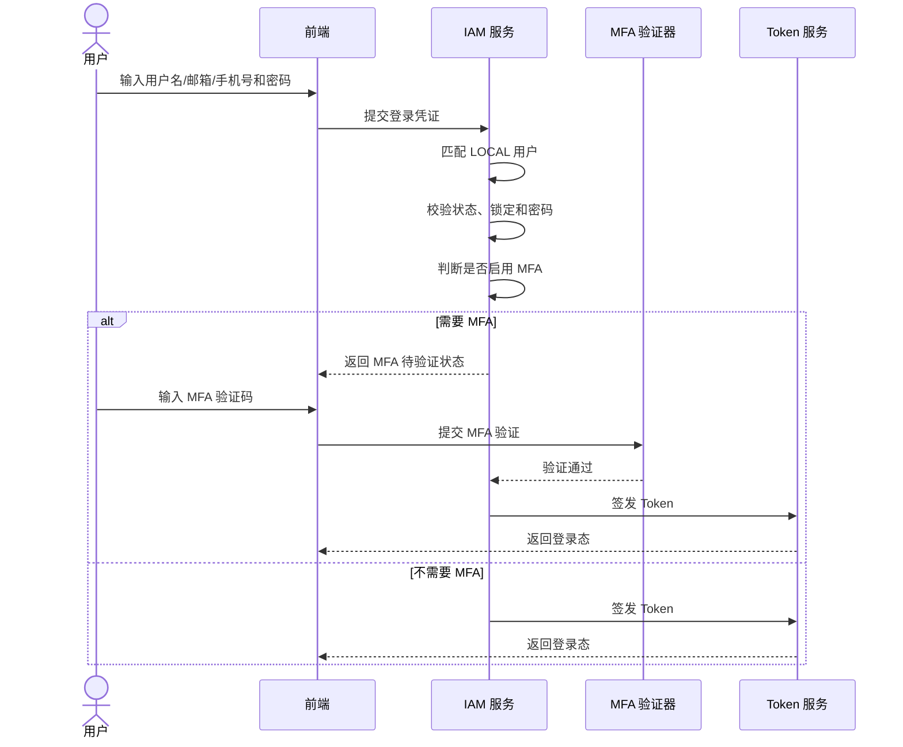
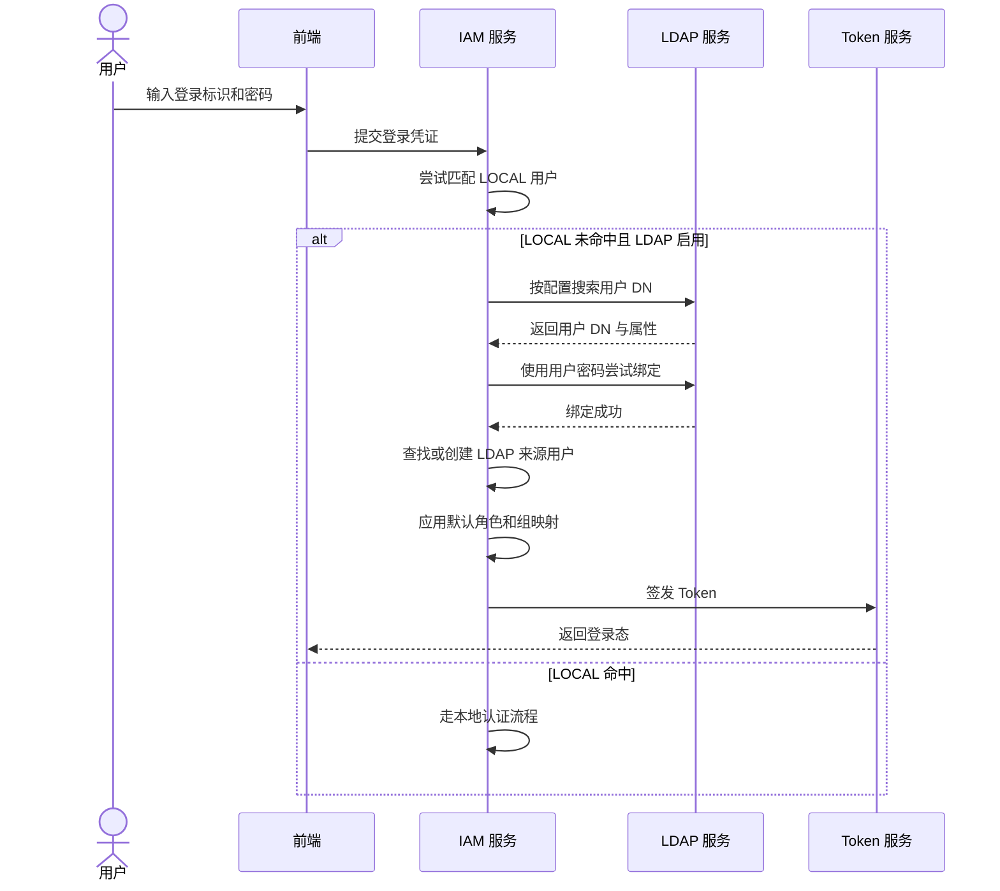
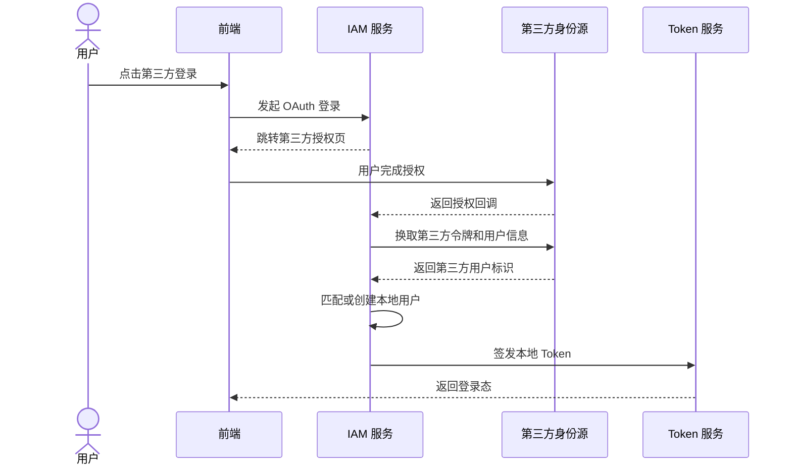
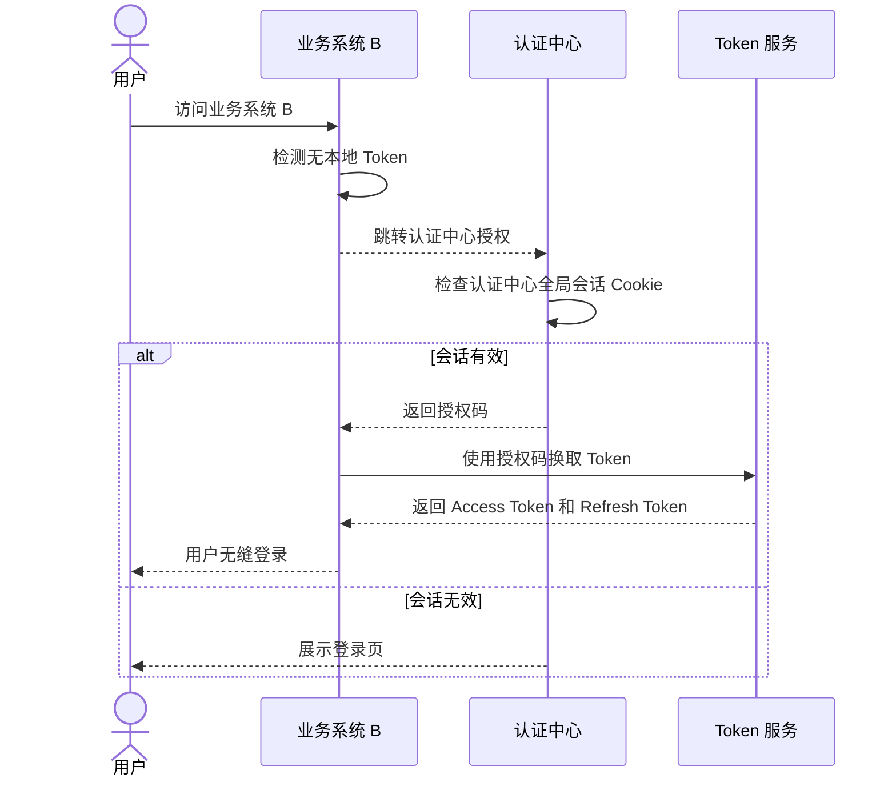
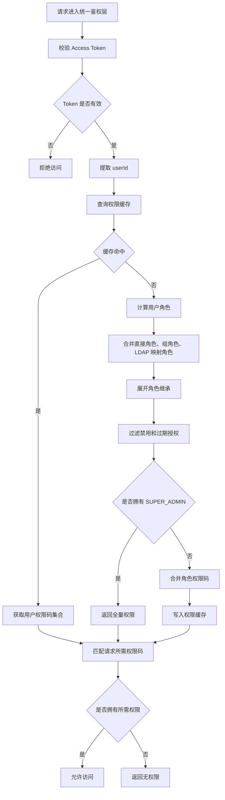
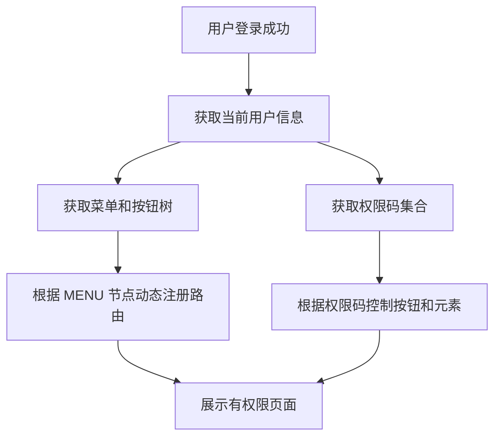
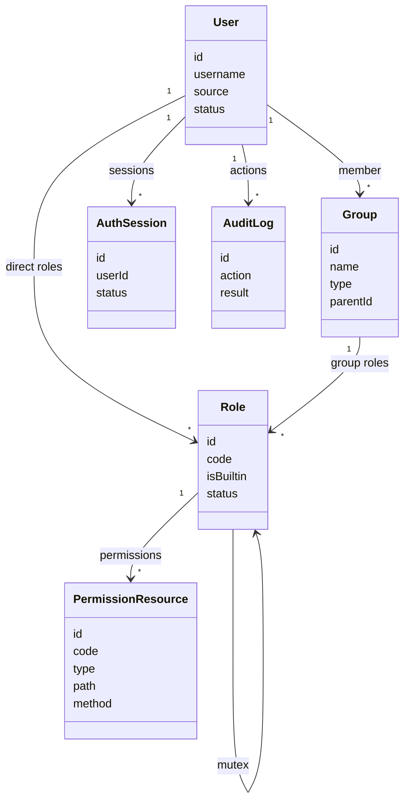

# 统一身份认证与访问控制产品规格
> 本文档是 S1 产品事实源，用于定义 AI 聊天特性的产品语义、领域模型、业务规则、用户故事和端呈现策略。
>
> 本文档中的 Mermaid 图用于辅助理解复杂流程、状态变化、角色可见性和交互时序。图与文字描述应被视为同一事实集合；若存在不一致，应修正文档后再进入实现。

## 1. 功能说明

统一身份认证与访问控制用于为 OmniMAM 及其后续生态系统提供统一的用户身份管理、登录认证、Token 会话、动态 RBAC 权限控制、前后端权限解耦、SSO 单点登录、用户注册、MFA 多因子认证、LDAP / OAuth2 / OIDC 外部身份接入和安全审计能力。

本功能的核心事实是：身份认证与访问控制是全系统的基础能力。所有业务系统不应自行实现独立登录、角色判断、权限硬编码或跨系统会话逻辑，而应统一依赖 IAM 提供的身份、Token、权限码、菜单资源和授权判定能力。

IAM 的主要使用对象包括：

```text
普通用户
系统管理员
业务系统前端
业务系统后端 API
认证中心
外部身份源
```

IAM 需要支持：

```text
用户名 / 邮箱 / 手机号登录
用户自助注册
邮箱验证
密码认证
MFA 多因子认证
OAuth2 / OIDC 登录
LDAP 登录
JWT Access Token
Refresh Token
SSO 全局会话
动态 RBAC 权限
菜单 / 按钮 / API 资源控制
用户组
角色继承
互斥角色
权限缓存刷新
审计日志
系统初始化内置管理员和默认角色
```

---


## 2. 核心数据模型

本文档中的数据模型是 S1 领域模型，仅表达产品语义和逻辑字段，不等同于 OpenAPI DTO、SQL schema 或后端 ORM。

### User（用户）

| 字段             | 类型                | 必填 | 说明                                     |
| -------------- | ----------------- | -- | -------------------------------------- |
| id             | string            | 是  | 用户全局唯一标识                               |
| username       | string            | 是  | 登录用户名；本地用户范围内唯一                        |
| displayName    | string            | 是  | 显示名称                                   |
| alias          | string            | 否  | 用户别名或个性化昵称，不作为登录凭证                     |
| email          | string            | 否  | 邮箱；需要全局唯一，可作为登录凭证                      |
| phone          | string            | 否  | 手机号；需要全局唯一，可作为登录凭证                     |
| passwordHash   | string            | 否  | 本地用户密码哈希；LDAP / OAuth 用户可以为空           |
| status         | enum              | 是  | 用户状态：ACTIVE、DISABLED、LOCKED、UNVERIFIED |
| lockoutEnd     | string(date-time) | 否  | 锁定截止时间                                 |
| failedCount    | integer           | 是  | 连续登录失败次数                               |
| mfaEnabled     | boolean           | 是  | 是否启用多因子认证                              |
| mfaMethods     | array of string   | 否  | 允许的 MFA 方式：TOTP、SMS、EMAIL              |
| oauthProviders | array of object   | 否  | 绑定的第三方账号                               |
| ldapDn         | string            | 否  | LDAP 用户 DN                             |
| ldapServerId   | string            | 否  | 关联 LDAP 服务器配置                          |
| source         | enum              | 是  | 用户来源：LOCAL、LDAP、OAUTH                  |
| extAttrs       | object            | 否  | 扩展属性，例如部门、职级、岗位                        |
| createdAt      | string(date-time) | 是  | 创建时间                                   |
| updatedAt      | string(date-time) | 是  | 更新时间                                   |

### Group（用户组）

| 字段          | 类型                | 必填 | 说明                 |
| ----------- | ----------------- | -- | ------------------ |
| id          | string            | 是  | 用户组唯一标识            |
| name        | string            | 是  | 组名，支持层级路径          |
| description | string            | 否  | 描述                 |
| parentId    | string            | 否  | 父组 ID              |
| type        | enum              | 是  | 组类型：STATIC、DYNAMIC |
| rule        | string            | 否  | 动态组规则表达式           |
| status      | enum              | 是  | 状态：ACTIVE、DISABLED |
| createdAt   | string(date-time) | 是  | 创建时间               |
| updatedAt   | string(date-time) | 是  | 更新时间               |

### GroupMember（用户组成员）

| 字段        | 类型                | 必填 | 说明                            |
| --------- | ----------------- | -- | ----------------------------- |
| groupId   | string            | 是  | 用户组 ID                        |
| userId    | string            | 是  | 用户 ID                         |
| source    | enum              | 是  | 成员来源：MANUAL、DYNAMIC、LDAP_SYNC |
| createdAt | string(date-time) | 是  | 创建时间                          |

### Role（角色）

| 字段          | 类型                | 必填 | 说明                 |
| ----------- | ----------------- | -- | ------------------ |
| id          | string            | 是  | 角色唯一标识             |
| code        | string            | 是  | 角色标识               |
| name        | string            | 是  | 角色显示名称             |
| description | string            | 否  | 角色描述               |
| isBuiltin   | boolean           | 是  | 是否内置角色             |
| status      | enum              | 是  | 状态：ACTIVE、DISABLED |
| createdAt   | string(date-time) | 是  | 创建时间               |
| updatedAt   | string(date-time) | 是  | 更新时间               |

### UserRoleGrant（用户角色授权）

| 字段            | 类型                | 必填 | 说明                         |
| ------------- | ----------------- | -- | -------------------------- |
| userId        | string            | 是  | 用户 ID                      |
| roleId        | string            | 是  | 角色 ID                      |
| grantType     | enum              | 是  | 授权来源：DIRECT、GROUP、LDAP_MAP |
| effectiveFrom | string(date-time) | 否  | 生效开始时间                     |
| effectiveTo   | string(date-time) | 否  | 生效结束时间                     |
| createdAt     | string(date-time) | 是  | 创建时间                       |

### GroupRoleGrant（用户组角色授权）

| 字段        | 类型                | 必填 | 说明     |
| --------- | ----------------- | -- | ------ |
| groupId   | string            | 是  | 用户组 ID |
| roleId    | string            | 是  | 角色 ID  |
| createdAt | string(date-time) | 是  | 创建时间   |

### RoleInheritance（角色继承）

| 字段           | 类型                | 必填 | 说明     |
| ------------ | ----------------- | -- | ------ |
| roleId       | string            | 是  | 子角色 ID |
| parentRoleId | string            | 是  | 父角色 ID |
| createdAt    | string(date-time) | 是  | 创建时间   |

### RoleMutex（互斥角色）

| 字段          | 类型                | 必填 | 说明         |
| ----------- | ----------------- | -- | ---------- |
| roleId      | string            | 是  | 角色 ID      |
| mutexRoleId | string            | 是  | 与其互斥的角色 ID |
| createdAt   | string(date-time) | 是  | 创建时间       |

### PermissionResource（权限资源）

| 字段        | 类型                | 必填 | 说明                                |
| --------- | ----------------- | -- | --------------------------------- |
| id        | string            | 是  | 资源唯一标识                            |
| code      | string            | 是  | 权限标识码，例如 user:create、order:export |
| name      | string            | 是  | 资源名称                              |
| type      | enum              | 是  | 资源类型：MENU、BUTTON、API              |
| parentId  | string            | 否  | 父资源 ID                            |
| path      | string            | 否  | 菜单路径或 API 路径模式                    |
| method    | string            | 否  | API 方法                            |
| icon      | string            | 否  | 菜单图标                              |
| sortOrder | integer           | 否  | 排序                                |
| status    | enum              | 是  | 状态：ACTIVE、DISABLED                |
| createdAt | string(date-time) | 是  | 创建时间                              |
| updatedAt | string(date-time) | 是  | 更新时间                              |

### RolePermissionGrant（角色权限授权）

| 字段             | 类型                | 必填 | 说明    |
| -------------- | ----------------- | -- | ----- |
| roleId         | string            | 是  | 角色 ID |
| permissionCode | string            | 是  | 权限标识码 |
| createdAt      | string(date-time) | 是  | 创建时间  |

### AuthSession（认证中心会话）

| 字段         | 类型                | 必填 | 说明                          |
| ---------- | ----------------- | -- | --------------------------- |
| id         | string            | 是  | 会话唯一标识                      |
| userId     | string            | 是  | 用户 ID                       |
| clientId   | string            | 否  | 来源客户端                       |
| deviceInfo | string            | 否  | 设备信息                        |
| ipAddress  | string            | 否  | 登录 IP                       |
| userAgent  | string            | 否  | 浏览器或客户端信息                   |
| status     | enum              | 是  | 会话状态：ACTIVE、REVOKED、EXPIRED |
| createdAt  | string(date-time) | 是  | 创建时间                        |
| expiresAt  | string(date-time) | 是  | 过期时间                        |

### TokenCredential（Token 凭据）

| 字段             | 类型                | 必填 | 说明                        |
| -------------- | ----------------- | -- | ------------------------- |
| accessTokenJti | string            | 是  | Access Token 唯一标识         |
| refreshTokenId | string            | 是  | Refresh Token 标识          |
| userId         | string            | 是  | 用户 ID                     |
| clientId       | string            | 否  | 客户端 ID                    |
| deviceInfo     | string            | 否  | 绑定设备信息                    |
| status         | enum              | 是  | 状态：ACTIVE、REVOKED、EXPIRED |
| issuedAt       | string(date-time) | 是  | 签发时间                      |
| expiresAt      | string(date-time) | 是  | 过期时间                      |

### OAuthProviderBinding（OAuth 账号绑定）

| 字段        | 类型                | 必填 | 说明               |
| --------- | ----------------- | -- | ---------------- |
| userId    | string            | 是  | 本地用户 ID          |
| provider  | string            | 是  | OAuth / OIDC 提供方 |
| subjectId | string            | 是  | 第三方用户唯一标识        |
| email     | string            | 否  | 第三方返回邮箱          |
| createdAt | string(date-time) | 是  | 绑定时间             |

### LdapServerConfig（LDAP 服务器配置）

| 字段               | 类型                | 必填 | 说明                 |
| ---------------- | ----------------- | -- | ------------------ |
| id               | string            | 是  | LDAP 配置唯一标识        |
| name             | string            | 是  | LDAP 源名称           |
| url              | string            | 是  | LDAP 服务地址          |
| baseDn           | string            | 是  | Base DN            |
| bindUser         | string            | 否  | 绑定用户               |
| searchFilter     | string            | 是  | 用户搜索过滤条件           |
| attributeMapping | object            | 是  | LDAP 属性到用户字段的映射    |
| status           | enum              | 是  | 状态：ACTIVE、DISABLED |
| createdAt        | string(date-time) | 是  | 创建时间               |
| updatedAt        | string(date-time) | 是  | 更新时间               |

### AuditLog（审计日志）

| 字段          | 类型                | 必填 | 说明                  |
| ----------- | ----------------- | -- | ------------------- |
| id          | string            | 是  | 审计日志唯一标识            |
| actorUserId | string            | 否  | 操作人用户 ID            |
| action      | string            | 是  | 操作类型                |
| targetType  | string            | 否  | 操作对象类型              |
| targetId    | string            | 否  | 操作对象 ID             |
| result      | enum              | 是  | 操作结果：SUCCESS、FAILED |
| ipAddress   | string            | 否  | 操作来源 IP             |
| userAgent   | string            | 否  | 操作来源客户端             |
| detail      | object            | 否  | 详情                  |
| createdAt   | string(date-time) | 是  | 记录时间                |

---

## 4. 业务规则

### 4.1 用户与身份来源

* **BR-IAM-USER-01** 用户是 IAM 的身份主体，所有登录、授权、审计和资源访问都必须关联到用户。
* **BR-IAM-USER-02** 用户来源包括 LOCAL、LDAP、OAUTH。
* **BR-IAM-USER-03** LOCAL 用户必须拥有本地唯一的 username。
* **BR-IAM-USER-04** LDAP / OAUTH 用户的 username 可以与 LOCAL 用户重复，但系统必须通过用户来源和身份绑定区分。
* **BR-IAM-USER-05** email 需要全局唯一。
* **BR-IAM-USER-06** phone 需要全局唯一。
* **BR-IAM-USER-07** LOCAL 用户必须具备密码哈希。
* **BR-IAM-USER-08** LDAP / OAUTH 用户可以没有本地密码。
* **BR-IAM-USER-09** 用户状态为 ACTIVE 时才允许正常登录。
* **BR-IAM-USER-10** 用户状态为 UNVERIFIED 时禁止登录。
* **BR-IAM-USER-11** 用户状态为 DISABLED 或 LOCKED 时禁止登录。
* **BR-IAM-USER-12** alias 是用户个性化别名，不作为登录凭证。

### 4.2 用户注册

* **BR-IAM-REGISTER-01** 系统支持用户使用唯一邮箱自助注册。
* **BR-IAM-REGISTER-02** 注册时需要校验用户名格式、密码强度和 email 唯一性。
* **BR-IAM-REGISTER-03** 注册成功后创建 LOCAL 用户。
* **BR-IAM-REGISTER-04** 新注册用户初始状态为 UNVERIFIED。
* **BR-IAM-REGISTER-05** 系统需要发送邮箱验证链接。
* **BR-IAM-REGISTER-06** 邮箱验证链接需要有有效期。
* **BR-IAM-REGISTER-07** 邮箱验证通过后，用户状态变为 ACTIVE。
* **BR-IAM-REGISTER-08** 新注册用户自动获得 REGULAR_USER 角色。
* **BR-IAM-REGISTER-09** 系统可以配置是否需要管理员审批后才能激活用户。

### 4.3 登录认证

* **BR-IAM-AUTH-01** 用户可以使用用户名、邮箱或手机号作为登录标识。
* **BR-IAM-AUTH-02** 登录时优先匹配 LOCAL 用户。
* **BR-IAM-AUTH-03** LOCAL 用户未匹配且启用 LDAP 时，可以进入 LDAP 认证流程。
* **BR-IAM-AUTH-04** LOCAL 用户使用 bcrypt 或等价安全哈希方式校验密码。
* **BR-IAM-AUTH-05** 连续登录失败达到限制后，用户进入临时锁定状态。
* **BR-IAM-AUTH-06** 锁定期内禁止登录。
* **BR-IAM-AUTH-07** 用户启用 MFA 时，密码验证通过后不得直接签发正式登录态，需要进入 MFA 验证。
* **BR-IAM-AUTH-08** 用户未启用 MFA 时，凭证验证通过后可以签发登录 Token。
* **BR-IAM-AUTH-09** 登录、登录失败、MFA 验证、Token 刷新、登出都需要记录审计日志。

### 4.4 MFA 多因子认证

* **BR-IAM-MFA-01** MFA 支持 TOTP、SMS、EMAIL。
* **BR-IAM-MFA-02** 用户可以绑定 TOTP。
* **BR-IAM-MFA-03** 用户可以使用短信或邮件验证码完成二次验证。
* **BR-IAM-MFA-04** 登录过程中如用户启用 MFA，需要先返回 MFA 待验证状态。
* **BR-IAM-MFA-05** MFA 验证通过后才可签发正式 Access Token 和 Refresh Token。
* **BR-IAM-MFA-06** 系统可以支持可信设备，在有效期内免除重复二次验证。
* **BR-IAM-MFA-07** 系统可以按角色强制启用 MFA。

### 4.5 OAuth2 / OIDC 登录

* **BR-IAM-OAUTH-01** 系统支持作为 OAuth2 / OIDC 客户端接入第三方身份源。
* **BR-IAM-OAUTH-02** 第三方登录成功后，系统需要获取第三方用户唯一标识。
* **BR-IAM-OAUTH-03** 系统优先通过 provider + subjectId 匹配已绑定用户。
* **BR-IAM-OAUTH-04** 无绑定用户时，可以根据可信邮箱规则匹配或创建用户。
* **BR-IAM-OAUTH-05** 新建 OAuth 用户自动获得 REGULAR_USER 角色。
* **BR-IAM-OAUTH-06** OAuth2 流程必须校验 state，防止 CSRF。
* **BR-IAM-OAUTH-07** OAuth2 流程必须严格校验 redirect URI。

### 4.6 LDAP 认证

* **BR-IAM-LDAP-01** 系统可以配置多个 LDAP 源。
* **BR-IAM-LDAP-02** LDAP 配置包含服务地址、Base DN、绑定用户、搜索过滤条件和属性映射。
* **BR-IAM-LDAP-03** LOCAL 用户未匹配时，可以按配置进入 LDAP 用户搜索和绑定认证。
* **BR-IAM-LDAP-04** LDAP 认证成功后，系统需要在本地查找或创建 LDAP 来源用户。
* **BR-IAM-LDAP-05** LDAP 新用户默认获得 REGULAR_USER 角色。
* **BR-IAM-LDAP-06** LDAP 组可以映射到 IAM 用户组。
* **BR-IAM-LDAP-07** LDAP 组映射后的用户可以通过用户组继承角色。

### 4.7 Token 与会话

* **BR-IAM-TOKEN-01** 业务系统 API 使用 JWT Bearer Token 访问。
* **BR-IAM-TOKEN-02** Access Token 采用短有效期。
* **BR-IAM-TOKEN-03** Access Token 不应暴露权限码集合。
* **BR-IAM-TOKEN-04** Access Token 载荷只表达身份、签发方、过期时间、Token ID、客户端等必要认证信息。
* **BR-IAM-TOKEN-05** Refresh Token 是可撤销的长期凭据。
* **BR-IAM-TOKEN-06** Refresh Token 需要绑定设备信息。
* **BR-IAM-TOKEN-07** Access Token 过期后，前端可以使用 Refresh Token 换取新的 Access Token。
* **BR-IAM-TOKEN-08** 用户登出时，需要撤销 Refresh Token。
* **BR-IAM-TOKEN-09** 用户登出时，需要使当前 Access Token 的 jti 在剩余有效期内不可再使用。
* **BR-IAM-TOKEN-10** 全局单点注销需要撤销该用户所有有效 Refresh Token。
* **BR-IAM-TOKEN-11** 认证中心可以通过自身域下的 HttpOnly、Secure、SameSite=Lax Cookie 维持全局会话。
* **BR-IAM-TOKEN-12** 业务系统不应依赖认证中心 Cookie 访问业务 API。

### 4.8 RBAC 权限

* **BR-IAM-RBAC-01** 权限控制以角色为核心。
* **BR-IAM-RBAC-02** 权限粒度覆盖菜单、按钮和 API。
* **BR-IAM-RBAC-03** 所有受控资源都必须使用唯一权限码标识。
* **BR-IAM-RBAC-04** 前端只通过权限码和菜单树控制界面展示。
* **BR-IAM-RBAC-05** 后端通过权限码保护 API。
* **BR-IAM-RBAC-06** 前端不得写死角色判断。
* **BR-IAM-RBAC-07** 后端业务代码不得写死用户角色判断。
* **BR-IAM-RBAC-08** 角色可以继承其他角色权限。
* **BR-IAM-RBAC-09** 角色可以设置互斥关系。
* **BR-IAM-RBAC-10** 互斥角色不得同时分配给同一用户。
* **BR-IAM-RBAC-11** 用户可以直接获得角色。
* **BR-IAM-RBAC-12** 用户可以通过用户组获得角色。
* **BR-IAM-RBAC-13** 用户可以通过 LDAP 组映射获得角色。
* **BR-IAM-RBAC-14** 角色授权可以有生效时间和失效时间。
* **BR-IAM-RBAC-15** 用户组支持静态成员和动态规则成员。
* **BR-IAM-RBAC-16** 用户组层级禁止循环引用。
* **BR-IAM-RBAC-17** 动态组成员由系统根据规则自动计算。
* **BR-IAM-RBAC-18** 权限变更、用户角色变化、用户组关系变化后，需要刷新受影响用户的权限缓存。
* **BR-IAM-RBAC-19** SUPER_ADMIN 是内置系统管理员角色。
* **BR-IAM-RBAC-20** REGULAR_USER 是内置普通用户角色。
* **BR-IAM-RBAC-21** SUPER_ADMIN 用户拥有全量权限。
* **BR-IAM-RBAC-22** SUPER_ADMIN 不依赖普通角色权限绑定表判断权限。
* **BR-IAM-RBAC-23** 内置角色不可删除。
* **BR-IAM-RBAC-24** 内置角色 code 不可修改。

### 4.9 前后端权限解耦

* **BR-IAM-FE-01** 前端初始化后需要获取当前用户权限码集合。
* **BR-IAM-FE-02** 前端初始化后需要获取经过过滤的菜单和按钮树。
* **BR-IAM-FE-03** 前端根据菜单资源动态注册路由。
* **BR-IAM-FE-04** 用户无权限的页面不应出现在前端路由表中。
* **BR-IAM-FE-05** 按钮、表格列和操作入口需要通过权限码控制展示。
* **BR-IAM-FE-06** 前端隐藏无权限功能只负责体验，不代表安全边界。
* **BR-IAM-FE-07** 所有 API 仍必须由后端统一鉴权层判断权限。

### 4.10 SSO 单点登录

* **BR-IAM-SSO-01** 认证中心负责维护全局登录态。
* **BR-IAM-SSO-02** 业务系统检测到无有效 Token 时，可以跳转认证中心发起授权登录。
* **BR-IAM-SSO-03** 用户已在认证中心登录时，访问其他业务系统应可无缝完成登录跳转。
* **BR-IAM-SSO-04** 业务系统通过授权码换取本系统可使用的 Token。
* **BR-IAM-SSO-05** 局部登出只撤销当前业务系统或当前设备相关凭据。
* **BR-IAM-SSO-06** 全局登出需要清除认证中心会话，并撤销用户所有有效 Refresh Token。
* **BR-IAM-SSO-07** 全局登出可以通知业务系统清除本地前端 Token 状态。

### 4.11 安全与审计

* **BR-IAM-SEC-01** 密码必须使用安全哈希算法存储。
* **BR-IAM-SEC-02** 密码需要进行复杂度校验。
* **BR-IAM-SEC-03** 系统可以维护历史密码策略。
* **BR-IAM-SEC-04** 连续失败登录需要触发锁定。
* **BR-IAM-SEC-05** 可集成图形验证码或其他登录保护能力。
* **BR-IAM-SEC-06** OAuth2 客户端密钥需要加密存储。
* **BR-IAM-SEC-07** 所有需要保护的业务 API 必须经过统一鉴权层。
* **BR-IAM-SEC-08** 登录、登出、Token 刷新、权限变更、管理员操作需要记录审计日志。
* **BR-IAM-SEC-09** 权限授予应遵循最小权限原则。
* **BR-IAM-SEC-10** 系统应支持定期权限审查。

### 4.12 系统初始化

* **BR-IAM-INIT-01** 系统首次启动时自动创建 SUPER_ADMIN 角色。
* **BR-IAM-INIT-02** 系统首次启动时自动创建 REGULAR_USER 角色。
* **BR-IAM-INIT-03** 内置角色不可删除。
* **BR-IAM-INIT-04** 系统首次启动时自动创建初始管理员账户。
* **BR-IAM-INIT-05** 初始管理员账户直接绑定 SUPER_ADMIN 角色。
* **BR-IAM-INIT-06** 初始管理员首次登录后需要强制修改密码和邮箱。

---

## 5. 用户故事

### US-IAM-01 用户注册

用户可以使用用户名、密码、邮箱和可选别名注册账号。

注册后用户进入邮箱未验证状态。用户完成邮箱验证后，账号可以变为可登录状态。新注册用户自动获得普通用户角色。

### US-IAM-02 邮箱验证

用户注册后可以通过邮箱验证链接验证邮箱。

验证链接需要有有效期。验证成功后，本地用户状态从 UNVERIFIED 变更为 ACTIVE。

### US-IAM-03 用户密码登录

用户可以使用用户名、邮箱或手机号登录。

系统优先匹配本地用户。本地用户存在时，系统校验本地密码。用户状态异常、锁定或邮箱未验证时，不允许登录。

### US-IAM-04 登录失败保护

用户连续登录失败达到限制时，账号进入临时锁定状态。

锁定期间用户不能继续登录。系统需要记录失败原因和审计日志。

### US-IAM-05 MFA 登录验证

启用 MFA 的用户在密码验证通过后，需要完成二次验证。

用户可以使用 TOTP、短信或邮件验证码完成 MFA。验证通过后，系统签发正式 Token。

### US-IAM-06 可信设备

用户完成 MFA 时，可以选择信任当前设备。

可信设备在有效期内可以减少重复 MFA 验证。

### US-IAM-07 OAuth2 / OIDC 登录

用户可以使用外部 OAuth2 / OIDC 身份源登录。

系统通过第三方 provider 和 subjectId 匹配账号。没有绑定账号时，系统可以根据可信邮箱规则匹配或创建用户。

### US-IAM-08 LDAP 登录

用户可以使用 LDAP 账号登录。

当本地用户未匹配且 LDAP 启用时，系统通过 LDAP 搜索用户并尝试绑定认证。认证成功后，系统在本地查找或创建 LDAP 来源用户。

### US-IAM-09 Token 刷新

用户 Access Token 过期后，可以通过 Refresh Token 获取新的 Access Token。

Refresh Token 需要可撤销，并与设备信息绑定。

### US-IAM-10 局部登出

用户可以从当前设备或当前业务系统登出。

登出后，当前 Refresh Token 失效，当前 Access Token 在剩余有效期内不可继续使用。

### US-IAM-11 全局单点登录

用户在认证中心登录后，访问其他业务系统时，可以通过 SSO 授权跳转无缝登录。

业务系统不直接读取认证中心 Cookie，而是通过标准授权流程换取 Token。

### US-IAM-12 全局单点注销

用户可以触发全局注销。

全局注销清除认证中心会话，并撤销该用户所有有效 Refresh Token。业务系统前端需要清除本地 Token 状态。

### US-IAM-13 查看当前用户信息

登录用户可以查看自己的基础信息，包括用户名、显示名称、别名、邮箱、手机号、用户来源和账号状态。

### US-IAM-14 获取当前用户权限码

登录用户可以获取自己的权限码集合。

前端使用权限码控制按钮、操作入口和局部 UI 展示。

### US-IAM-15 获取当前用户菜单树

登录用户可以获取经过权限过滤的菜单和按钮树。

前端根据菜单树动态注册路由，并隐藏无权限页面。

### US-IAM-16 用户管理

系统管理员可以创建、查看、编辑、禁用、锁定或删除用户。

用户管理操作需要记录审计日志。

### US-IAM-17 分配用户角色

系统管理员可以为用户分配角色，并可以设置角色授权的生效时间和失效时间。

管理员不能给同一用户分配互斥角色。

### US-IAM-18 用户组管理

系统管理员可以创建和维护用户组。

用户组支持层级结构、静态成员和动态规则成员。系统需要防止用户组层级循环引用。

### US-IAM-19 用户组角色授权

系统管理员可以为用户组分配角色。

用户属于该组后，可以继承组角色。动态组成员由系统根据规则自动计算。

### US-IAM-20 角色管理

系统管理员可以创建、编辑、禁用和删除非内置角色。

内置角色不可删除，内置角色 code 不可修改。

### US-IAM-21 角色继承

系统管理员可以配置角色继承关系。

子角色自动继承父角色拥有的权限码。

### US-IAM-22 互斥角色

系统管理员可以配置互斥角色。

互斥角色不能同时分配给同一用户。

### US-IAM-23 权限资源管理

系统管理员可以管理菜单、按钮和 API 类型的权限资源。

每个受控资源使用唯一权限码标识。

### US-IAM-24 角色权限分配

系统管理员可以为普通角色分配权限码。

系统管理员角色 SUPER_ADMIN 拥有全量权限，不依赖普通角色权限绑定。

### US-IAM-25 LDAP 配置管理

系统管理员可以配置 LDAP 服务器、搜索规则、属性映射和组映射规则。

系统管理员可以测试 LDAP 连接，并可以触发 LDAP 用户或组同步。

### US-IAM-26 OAuth Provider 管理

系统管理员可以配置 OAuth2 / OIDC 登录提供方。

配置内容包括 provider 标识、客户端信息、回调规则、可信邮箱匹配规则和启用状态。

### US-IAM-27 动态权限控制

前端使用当前用户权限码和菜单树动态控制路由、菜单、按钮、表格列和操作入口。

后端统一鉴权层根据请求资源匹配权限码，并判断当前用户是否拥有该权限。

### US-IAM-28 权限缓存刷新

当角色权限、用户角色、用户组成员、用户组角色或角色继承关系变化时，系统需要刷新受影响用户的权限缓存。

### US-IAM-29 审计日志

系统记录登录、登出、Token 刷新、MFA 验证、权限变更、用户管理、角色管理、资源管理和管理员操作。

管理员可以查询审计日志用于安全追踪。

### US-IAM-30 系统初始化

系统首次启动时自动创建内置角色和初始管理员账户。

初始管理员首次登录后需要修改密码和邮箱。

---

## 6. 关键流程图

### 6.1 本地登录与 MFA 流程



### 6.2 LDAP 登录流程



### 6.3 OAuth2 / OIDC 登录流程



### 6.4 SSO 自动登录流程



### 6.5 权限计算流程



### 6.6 前端动态权限流程



### 6.7 角色关系



---

## 7. 功能适配矩阵

| 功能               | 认证中心 | IAM 管理后台 | 业务系统前端   | 业务系统后端   |
| ---------------- | ---- | -------- | -------- | -------- |
| 用户注册             | ✅    | ❌        | 可跳转      | ❌        |
| 邮箱验证             | ✅    | ❌        | 可跳转      | ❌        |
| 用户登录             | ✅    | ❌        | 可跳转      | ❌        |
| MFA 验证           | ✅    | 可配置      | 可跳转      | ❌        |
| OAuth2 / OIDC 登录 | ✅    | 可配置      | 可跳转      | ❌        |
| LDAP 登录          | ✅    | 可配置      | ❌        | ❌        |
| Token 签发         | ✅    | ❌        | 消费 Token | 校验 Token |
| Token 刷新         | ✅    | ❌        | 调用刷新     | 校验结果     |
| 局部登出             | ✅    | ❌        | 触发登出     | 可吊销      |
| 全局单点注销           | ✅    | 可查看      | 清除本地状态   | 可接收吊销结果  |
| 当前用户信息           | ✅    | ✅        | ✅        | ✅        |
| 当前用户权限码          | ✅    | ✅        | ✅        | ✅        |
| 当前用户菜单树          | ✅    | ✅        | ✅        | ❌        |
| 用户管理             | ❌    | ✅        | ❌        | 执行权限校验   |
| 用户组管理            | ❌    | ✅        | ❌        | 执行权限校验   |
| 角色管理             | ❌    | ✅        | ❌        | 执行权限校验   |
| 权限资源管理           | ❌    | ✅        | ❌        | 执行权限校验   |
| 动态路由             | ❌    | ✅        | ✅        | ❌        |
| 按钮级控制            | ❌    | ✅        | ✅        | ❌        |
| API 动态鉴权         | ❌    | ❌        | ❌        | ✅        |
| 审计日志             | ✅    | ✅        | ❌        | ✅        |

---

## 8. 系统呈现策略

### 8.1 认证中心

认证中心负责登录、注册、邮箱验证、MFA 验证、OAuth 登录跳转、SSO 会话和登出。

认证中心页面需要提供：

```text
登录表单
注册表单
邮箱验证结果页
MFA 验证页
OAuth 登录跳转页
登出结果页
SSO 自动授权过渡页
```

登录表单支持：

```text
用户名
邮箱
手机号
密码
```

用户状态异常时需要展示明确提示，例如：

```text
账号未验证
账号已禁用
账号已锁定
密码错误
需要 MFA 验证
```

### 8.2 IAM 管理后台

IAM 管理后台用于管理员维护用户、用户组、角色、权限资源、LDAP 配置、OAuth Provider 配置和审计日志。

管理后台主要区域包括：

```text
用户管理
用户组管理
角色管理
权限资源管理
LDAP 配置
OAuth Provider 配置
审计日志
```

管理员操作必须受权限码控制。

内置角色需要在界面中明确标识，并禁用删除和 code 修改。

### 8.3 业务系统前端

业务系统前端只消费 IAM 提供的身份和权限结果。

业务系统前端需要：

```text
保存和携带 Access Token
在 Token 过期时触发刷新
登录态失效时跳转认证中心
获取当前用户信息
获取当前用户权限码集合
获取当前用户菜单和按钮树
根据菜单树动态注册路由
根据权限码控制按钮和操作入口
```

业务系统前端不得：

```text
硬编码角色判断
把隐藏按钮当作安全边界
直接读取认证中心 Cookie
自行维护独立登录态
```

### 8.4 业务系统后端

业务系统后端 API 只接受 Bearer Token。

业务系统后端需要：

```text
校验 Access Token
检查 Token 是否撤销
从 Token 提取用户身份
匹配请求所需权限码
计算或读取当前用户权限码集合
判断权限
记录安全审计
```

业务系统后端不得：

```text
信任前端隐藏逻辑
绕过统一鉴权层
在业务代码中硬编码角色判断
在 Token 中读取权限码作为最终授权依据
```

---

## 9. 状态与异常

| 状态/异常                       | 说明                         |
| --------------------------- | -------------------------- |
| unauthenticated             | 用户未登录或登录态无效                |
| invalid_credentials         | 登录凭证错误                     |
| account_unverified          | 用户邮箱未验证，禁止登录               |
| account_disabled            | 用户已禁用                      |
| account_locked              | 用户因失败次数过多被锁定               |
| mfa_required                | 用户需要完成 MFA 验证              |
| mfa_invalid                 | MFA 验证码无效                  |
| mfa_expired                 | MFA 临时令牌或验证码已过期            |
| token_expired               | Access Token 已过期           |
| token_revoked               | Token 已被撤销                 |
| refresh_token_invalid       | Refresh Token 无效、过期或与设备不匹配 |
| permission_denied           | 当前用户缺少所需权限                 |
| resource_permission_missing | 请求资源未配置权限码或权限资源不可用         |
| role_builtin_protected      | 内置角色禁止删除或修改 code           |
| role_mutex_conflict         | 用户被分配了互斥角色                 |
| role_inheritance_cycle      | 角色继承关系存在循环                 |
| group_cycle_detected        | 用户组层级存在循环                  |
| dynamic_group_rule_invalid  | 动态组规则无效                    |
| oauth_state_invalid         | OAuth2 state 校验失败          |
| oauth_provider_failed       | 第三方 OAuth Provider 登录失败    |
| ldap_connection_failed      | LDAP 连接失败                  |
| ldap_auth_failed            | LDAP 认证失败                  |
| email_already_exists        | 邮箱已被使用                     |
| username_already_exists     | 本地用户名已被使用                  |
| phone_already_exists        | 手机号已被使用                    |
| password_policy_failed      | 密码不符合安全策略                  |
| audit_write_failed          | 审计日志写入失败                   |

