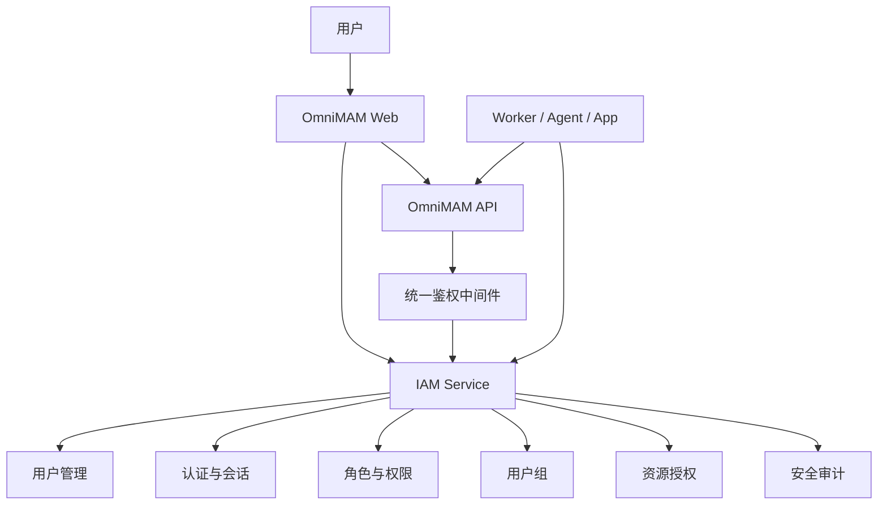
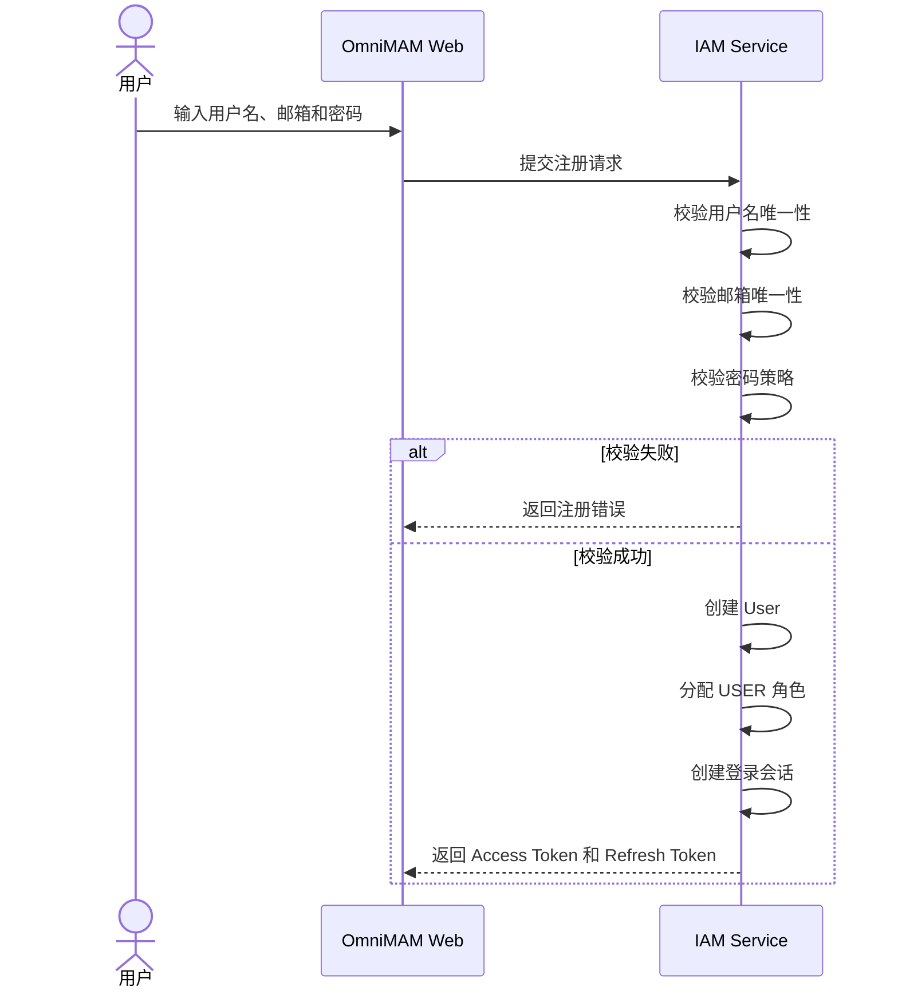
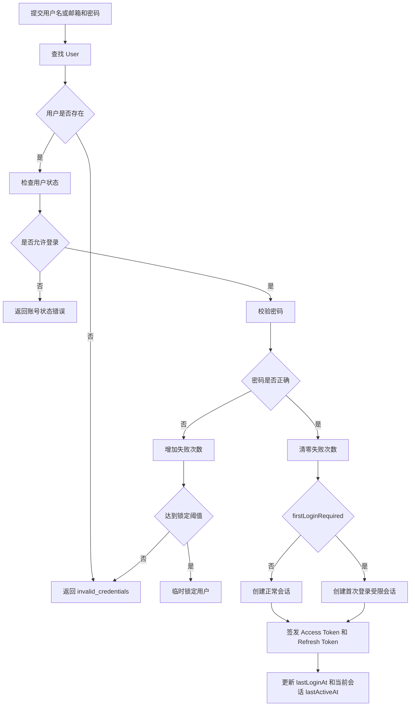
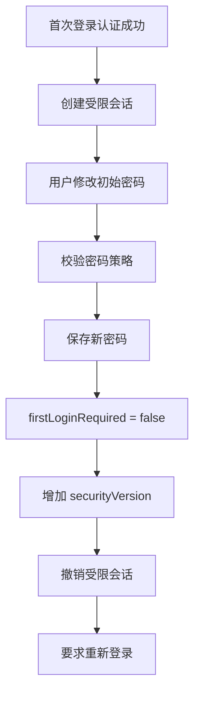
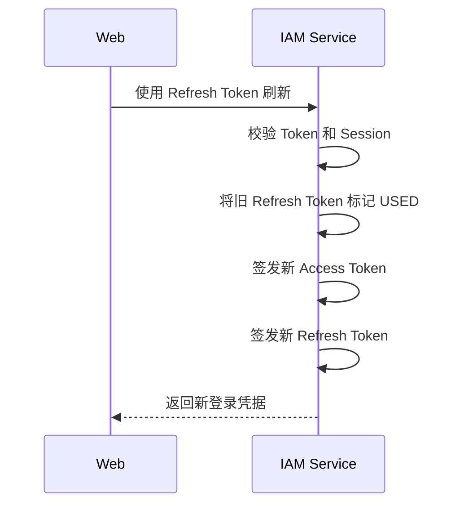
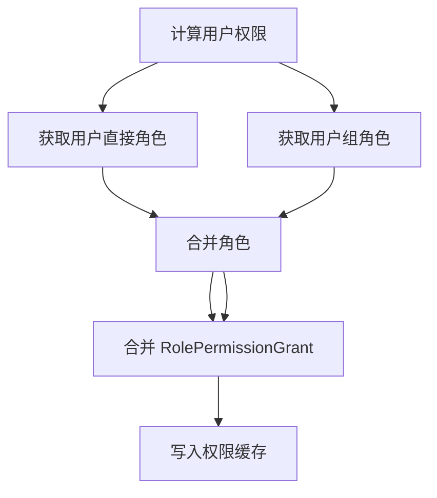
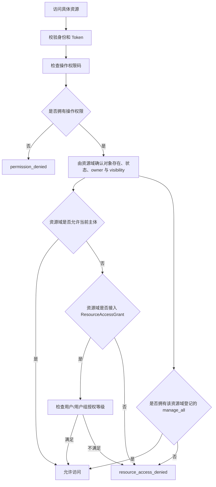
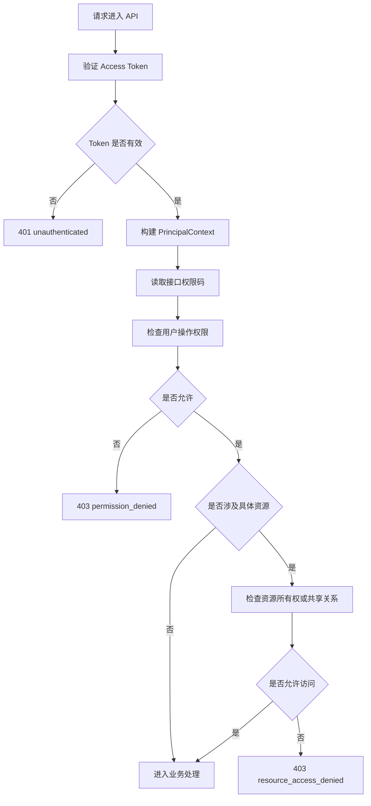
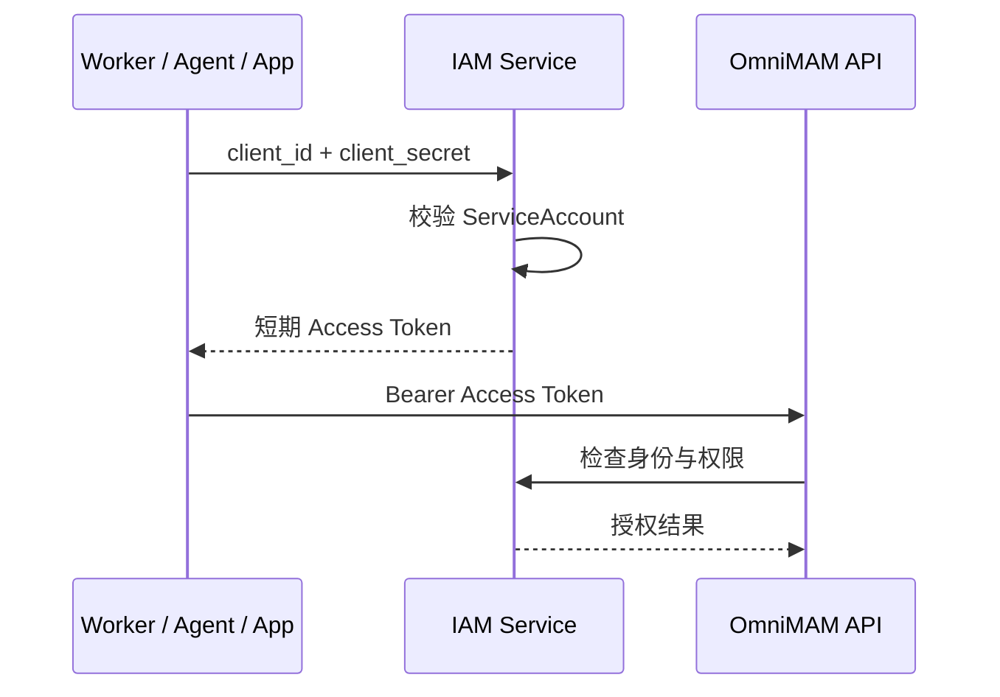
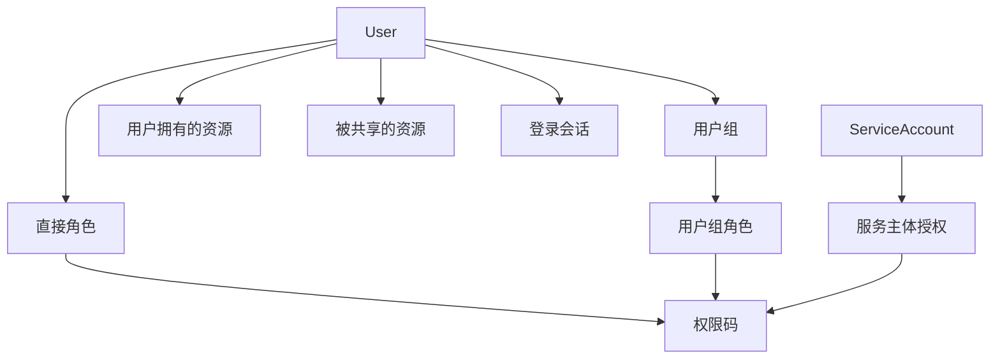

# OmniMAM 身份认证与访问控制功能设计

> 文档状态：v2.0-draft
> 适用阶段：非企业版
> 用户模型：平台统一用户
> 资源模型：资源域定义所有权、可见性与可选共享
> 当前不包含：企业、租户、LDAP、SSO、OIDC、MFA、PAT

---

## 1. 文档目的

本文档定义 OmniMAM 非企业版本的身份认证与访问控制能力，包括：

* 用户注册与登录；
* 用户账号管理；
* Access Token 与 Refresh Token；
* 登录会话管理；
* 平台角色与权限码；
* 用户组；
* 跨领域主体与资源授权基础；
* Service Account；
* 前后端统一鉴权；
* 向平台管理提交认证与授权审计上下文；
* 系统初始化。

本版本不引入企业、租户或组织隔离。

所有用户直接属于 OmniMAM 平台。

---

## 2. 核心设计结论

## 2.1 单一用户体系

系统只有一个用户主体：

```text
User
```

不存在：

```text
企业用户
普通用户
租户用户
TenantMember
TenantRole
TenantInvitation
```

所有注册用户均可登录 OmniMAM。

用户之间的区别由角色、权限和资源授权决定，不通过用户类型区分。

---

## 2.2 资源授权由资源域与 Identity 协作

多数用户创建的业务资源以用户作为 owner，例如：

```text
Asset
Canvas
Application
Agent
Workspace
Task
```

但资源是否具有 owner、`createdBy`、`visibility`、项目/命名空间或协作成员，以及这些字段如何影响生命周期，必须由资源所属 domain 的 S1 定义。Identity 不要求所有资源使用同一套字段，也不拥有 Asset、Application、Task、Canvas、Agent 或 Workspace 的状态。

跨域协作统一遵循以下原则：

```text
资源域从已验证的 PrincipalContext 注入 owner_user_id / created_by，而不是信任请求体；
owner_user_id 表示业务资源所有权，created_by 表示本次创建主体，二者可以不同；
资源域拥有 visibility、project、namespace 和协作规则；
只有资源域声明支持共享时，才使用 Identity 的 ResourceAccessGrant；
资源域不得读取 Identity 私有表来推导资源状态。
```

例如，asset-library 首期按当前用户 owner 范围隔离；application-platform、workflow-canvas、agent 和 appstudio 由各自 S1 定义 owner、visibility 或 collaborator 规则。Identity 提供授权结果和审计上下文，但不把这些 domain 统一改写成共享资源模型。

---

## 2.3 权限采用两层判断

一次业务访问必须同时满足：

```text
操作权限
+
资源访问权限
```

例如用户执行某个资源域的编辑动作：

```text
拥有目标 domain 登记的编辑权限码
并且
满足该 domain 定义的 owner、visibility 或协作授权规则
```

RBAC 只判断“能否执行这一类操作”。

资源授权判断“能否访问这一个具体对象”，但具体对象是否存在、是否可见、是否已发布或已删除，仍由资源域确认。

---

## 2.4 权限定义由系统注册

权限码属于产品和后端接口契约。

权限定义由 OmniMAM 各模块注册，管理员只能将已有权限分配给角色，不能随意创建权限码。

示例：

```text
user.read
user.manage

asset.create
asset.read
asset.update
asset.delete
asset.share
asset.manage_all

canvas.create
canvas.read
canvas.edit
canvas.execute
canvas.delete
canvas.share
canvas.manage_all

application.read
application.run
application.manage

agent.read
agent.use
agent.manage

task.read
task.cancel
task.manage_all
```

---

各 domain 的 `ordinary_user`、`business_developer`、`system_admin` 等 subject 只是权限合同中的策略分类，不是业务代码可以直接判断的 Identity 角色名。业务 API 必须请求具体权限码，并由 Identity 根据主体的有效角色/用户组授权返回结果。

## 2.5 Token 不保存完整权限

Access Token 只表达身份和凭据状态。

不在 Token 中保存：

```text
完整角色列表
完整权限列表
菜单树
资源共享关系
```

角色或权限变更后，不需要等待旧 Token 过期。

---

## 3. 当前功能范围

## 3.1 当前阶段支持

```text
普通用户自主注册
管理员创建用户
用户名或邮箱登录
本地密码认证
登录失败锁定
首次登录引导
修改密码
个人资料维护
Access Token
Refresh Token
Refresh Token 轮换
登录会话管理
角色
权限码
静态用户组
用户直接角色
用户组角色
资源授权基础（由资源域选择接入）
权限缓存
服务账号
统一 API 鉴权
安全审计
系统初始化
```

## 3.2 当前阶段不支持

```text
企业
租户
TenantMember
LDAP
OAuth2 / OIDC 登录
MFA
可信设备
邮箱验证
忘记密码邮件
动态用户组
角色继承
互斥角色
复杂 ABAC
跨实例身份同步
Personal Access Token（PAT）
```

---

## 4. 系统组成


```mermaid
flowchart TB
    U["用户"] --> FE["OmniMAM Web"]

    FE --> IAM["IAM Service"]
    FE --> API["OmniMAM API"]

    IAM --> USER["用户管理"]
    IAM --> AUTH["认证与会话"]
    IAM --> ROLE["角色与权限"]
    IAM --> GROUP["用户组"]
    IAM --> GRANT["资源授权"]
    IAM --> AUDIT["安全审计"]

    API --> AUTHZ["统一鉴权中间件"]
    AUTHZ --> IAM

    WORKER["Worker / Agent / App"] --> IAM
    WORKER --> API
```

IAM Service 是以下数据的事实源：

```text
用户
密码凭据
会话
Token
角色
权限
用户组
资源授权
服务账号
安全审计
```

业务资源本身仍由各业务模块管理。

---

## 5. 核心数据模型

## 5.1 User

| 字段                   | 类型       | 说明                                     |
| -------------------- | -------- | -------------------------------------- |
| id                   | string   | 用户全局唯一标识                               |
| username             | string   | 用户名，全局唯一                               |
| normalizedUsername   | string   | 标准化用户名                                 |
| displayName          | string   | 显示名称                                   |
| alias                | string   | 用户别名                                   |
| email                | string   | 邮箱，全局唯一                                |
| normalizedEmail      | string   | 标准化邮箱                                  |
| phone                | string   | 手机号，可选                                 |
| passwordHash         | string   | Argon2id PHC 格式的不可逆密码哈希，不是明文或可逆密文       |
| status               | enum     | ACTIVE、PENDING、DISABLED、LOCKED、DELETED |
| firstLoginRequired   | boolean  | 是否需要首次登录引导                             |
| failedLoginCount     | integer  | 连续登录失败次数                               |
| lockedUntil          | datetime | 临时锁定截止时间                               |
| securityVersion      | integer  | 凭据安全版本                                 |
| authorizationVersion | integer  | 权限缓存版本                                 |
| passwordChangedAt    | datetime | 密码修改时间                                 |
| lastLoginAt          | datetime | 最后登录成功时间                               |
| online               | boolean  | 根据有效会话和最近活动时间派生的在线状态；仅当前用户和受权管理员可见       |
| createdBy            | string   | 创建人                                    |
| createdAt            | datetime | 创建时间                                   |
| updatedAt            | datetime | 更新时间                                   |

状态说明：

```text
ACTIVE
允许正常登录和使用系统

PENDING
等待管理员审批

DISABLED
管理员禁用

LOCKED
登录失败触发临时锁定

DELETED
逻辑删除
```

当前阶段所有用户均使用本地密码，不单独拆分外部登录身份模型。

### 5.1.1 密码凭据安全

用户密码采用 Argon2id 进行不可逆哈希，当前基线参数为：

```text
algorithm: Argon2id
version: 19
memory: 65536 KiB
iterations: 3
parallelism: 1
output: 32 bytes
salt: 每个密码凭据独立生成的密码学安全随机值，至少 16 bytes
```

`passwordHash` 保存完整 PHC 字符串，其中包含算法、参数、salt 和哈希结果。系统不得保存用户密码明文，也不得使用可逆加密代替密码哈希。密码哈希、明文密码和密码确认值不得出现在 API 响应、事件、审计日志或跨 domain 摘要中。

用户注册、管理员设置初始密码、首次登录修改密码和普通密码修改均必须按当前密码策略生成新的 Argon2id 哈希。用户成功登录时，如果已存哈希参数低于当前策略，系统应在密码校验成功后按当前策略重新哈希并替换旧值；重新哈希失败时不得降低为明文或可逆密文存储。

当前 `ARGON2ID_V1` 算法和参数由产品版本固定，管理员只能调整密码复杂度、登录失败保护和在线窗口等策略，不能通过认证配置切换算法或降低哈希参数。

修改密码会递增 `securityVersion`，并使原有会话和 Token 失效。管理员不能读取原密码或现有密码哈希。

## 5.1.2 SystemAuthConfig（事实源迁移至 platform-management）

系统认证配置由 `platform-management` 管理，Identity 只读取其当前生效版本，用于约束本地注册、密码和登录保护。当前产品语义至少包括：

```text
registrationMode: OPEN | ADMIN_APPROVAL
passwordPolicy
passwordHashPolicy: ARGON2ID_V1
loginFailurePolicy
onlinePresenceWindowSeconds: 300
accessTokenLifetime
refreshTokenLifetime
updatedAt
```

配置只能通过 `platform-management` 的受保护管理能力修改；认证流程和后端授权使用同一份生效配置。Identity 不创建或修改 `SystemAuthConfig` 私有表，不提供认证配置管理 API。

---

## 5.2 Role

| 字段          | 类型       | 说明              |
| ----------- | -------- | --------------- |
| id          | string   | 角色 ID           |
| code        | string   | 稳定角色编码          |
| name        | string   | 显示名称            |
| description | string   | 描述              |
| builtin     | boolean  | 是否为内置角色         |
| status      | enum     | ACTIVE、DISABLED |
| createdAt   | datetime | 创建时间            |
| updatedAt   | datetime | 更新时间            |

当前内置角色：

```text
SUPER_ADMIN
ADMIN
USER
```

角色只是权限集合，不表达组织等级。

业务代码不得通过角色名称直接判断权限。

---

## 5.3 PermissionDefinition

| 字段          | 类型     | 说明                         |
| ----------- | ------ | -------------------------- |
| code        | string | 全局唯一权限码                    |
| domain      | string | 所属业务领域                     |
| resource    | string | 资源类型                       |
| action      | string | 操作类型                       |
| name        | string | 显示名称                       |
| description | string | 描述                         |
| riskLevel   | enum   | NORMAL、SENSITIVE、DANGEROUS |
| status      | enum   | ACTIVE、DEPRECATED          |

权限码推荐格式：

```text
<domain>.<resource>.<action>
```

例如：

```text
iam.user.read
iam.user.manage
iam.role.manage

asset.asset.create
asset.asset.read
asset.asset.update
asset.asset.delete
asset.asset.share
asset.asset.manage_all
```

权限定义只读，不允许管理员新增任意权限码。

---

## 5.4 RolePermissionGrant

```text
roleId
permissionCode
createdBy
createdAt
```

表示某个角色拥有某个权限。

---

## 5.5 UserRoleGrant

| 字段            | 说明    |
| ------------- | ----- |
| userId        | 用户 ID |
| roleId        | 角色 ID |
| effectiveFrom | 生效时间  |
| effectiveTo   | 失效时间  |
| createdBy     | 授权人   |
| createdAt     | 创建时间  |

---

## 5.6 Group

用户组用于批量分配角色和资源访问权限。

| 字段          | 说明              |
| ----------- | --------------- |
| id          | 用户组 ID          |
| code        | 稳定编码            |
| name        | 名称              |
| description | 描述              |
| status      | ACTIVE、DISABLED |
| createdBy   | 创建人             |
| createdAt   | 创建时间            |
| updatedAt   | 更新时间            |

当前只支持静态用户组。

---

## 5.7 GroupMember

```text
groupId
userId
createdBy
createdAt
```

唯一约束：

```sql
UNIQUE (group_id, user_id)
```

---

## 5.8 GroupRoleGrant

```text
groupId
roleId
createdBy
createdAt
```

用户有效角色来源包括：

```text
用户直接角色
+
用户所在组的角色
```

---

## 5.9 ResourceAccessGrant

表示资源域选择接入共享能力后，由 Identity 保存的用户或用户组授权关系。它不是跨领域资源目录，也不能单独证明 `resourceType/resourceId` 存在或可见。

| 字段           | 说明                   |
| ------------ | -------------------- |
| resourceType | 资源类型                 |
| resourceId   | 资源 ID                |
| subjectType  | USER、GROUP           |
| subjectId    | 用户或用户组 ID            |
| accessLevel  | VIEW、USE、EDIT、MANAGE |
| grantedBy    | 授权人                  |
| expiresAt    | 可选失效时间               |
| createdAt    | 创建时间                 |

访问等级：

```text
VIEW
查看资源

USE
运行或使用资源

EDIT
修改资源

MANAGE
修改资源、共享和删除资源
```

等级关系：

```text
MANAGE > EDIT > USE > VIEW
```

不同资源可以只支持其中部分等级。

资源域必须声明可用等级、默认可见性、owner 转移规则和删除/归档后的授权行为。未声明接入 ResourceAccessGrant 的资源域不得依赖本对象获得访问权。

---

## 5.10 AuthSession

| 字段           | 说明                     |
| ------------ | ---------------------- |
| id           | 会话 ID                  |
| userId       | 用户 ID                  |
| clientId     | 客户端 ID                 |
| deviceInfo   | 设备信息                   |
| ipAddress    | 来源 IP                  |
| userAgent    | User-Agent             |
| status       | ACTIVE、REVOKED、EXPIRED |
| createdAt    | 创建时间                   |
| lastActiveAt | 最后活动时间                 |
| expiresAt    | 到期时间                   |

---

## 5.11 RefreshToken

| 字段        | 说明                          |
| --------- | --------------------------- |
| id        | Refresh Token ID            |
| sessionId | 所属会话                        |
| tokenHash | Token 哈希                    |
| parentId  | 上一个 Refresh Token           |
| status    | ACTIVE、USED、REVOKED、EXPIRED |
| issuedAt  | 签发时间                        |
| expiresAt | 到期时间                        |

Refresh Token 明文不保存到数据库。

---

## 5.12 PersonalAccessToken（延期）

PAT 不是当前版本可用的认证方式。本节只保留未来设计边界，不能作为 CLI、本地 Agent、MCP Client 或自动化脚本的当前接入依据。MCP v1 必须使用当前用户的 Identity JWT，并在每次请求重新执行授权。

| 字段                 | 说明                     |
| ------------------ | ---------------------- |
| id                 | PAT ID                 |
| userId             | 所属用户                   |
| name               | 用户定义名称                 |
| tokenHash          | Token 哈希               |
| prefix             | 展示前缀                   |
| allowedPermissions | 允许的权限上限                |
| status             | ACTIVE、REVOKED、EXPIRED |
| expiresAt          | 到期时间                   |
| lastUsedAt         | 最后使用时间                 |
| createdAt          | 创建时间                   |

PAT 的最终权限：

```text
用户当前有效权限
∩
PAT 允许权限
```

用户失去权限后，PAT 不能继续保留该权限。

PAT 的创建、交换、轮换和撤销 API 不属于当前版本，也不得在其他 domain 的 S1/S2 中声明为已支持能力。

---

## 5.13 ServiceAccount

供受控 Worker、Agent Runtime、AppStudio 构建/部署组件或其他内部自动化组件访问平台。ServiceAccount 是服务主体，不是普通用户，也不自动继承某个用户的资源所有权。

| 字段                   | 说明                                       |
| -------------------- | ---------------------------------------- |
| id                   | 服务账号 ID                                  |
| code                 | 稳定编码                                     |
| name                 | 名称                                       |
| ownerType            | SYSTEM、WORKER、AGENT、APPLICATION、EXTERNAL |
| ownerId              | 关联对象 ID                                  |
| status               | ACTIVE、DISABLED                          |
| securityVersion      | 凭据版本                                     |
| authorizationVersion | 权限版本                                     |
| createdBy            | 创建人                                      |
| createdAt            | 创建时间                                     |

服务账号通过独立凭据换取短期 Access Token。

服务账号不能使用普通用户登录接口。

服务账号的权限由 Identity 计算；当服务主体代表用户执行用户发起的操作时，调用链必须同时传递不可伪造的委托用户上下文，由目标 domain 记录 `principal_id` 与 `actor_user_id`。没有委托用户时，服务账号只能执行其被授予的系统或服务权限。

---

## 6. 用户注册

## 6.1 自主注册流程


```mermaid
sequenceDiagram
    actor U as 用户
    participant FE as OmniMAM Web
    participant IAM as IAM Service

    U->>FE: 输入用户名、邮箱和密码
    FE->>IAM: 提交注册请求

    IAM->>IAM: 校验用户名唯一性
    IAM->>IAM: 校验邮箱唯一性
    IAM->>IAM: 校验密码策略

    alt 校验失败
        IAM-->>FE: 返回注册错误
    else 校验成功
        IAM->>IAM: 创建 User
        IAM->>IAM: 分配 USER 角色
        IAM->>IAM: 创建登录会话
        IAM-->>FE: 返回 Access Token 和 Refresh Token
    end
```

注册成功后：

```text
User.status = ACTIVE
firstLoginRequired = false
```

如果系统启用注册审批：

```text
User.status = PENDING
```

审批通过后才能登录。

---

## 6.2 管理员创建用户

管理员创建用户时：

1. 输入用户名、邮箱、显示名称；
2. 系统生成一次性初始密码；
3. 创建用户；
4. 设置 `firstLoginRequired=true`；
5. 分配默认 `USER` 角色；
6. 用户首次登录后必须修改密码。

管理员不能查看用户后续密码。

---

## 7. 用户登录


```mermaid
flowchart TD
    A["提交用户名或邮箱和密码"] --> B["查找 User"]
    B --> C{"用户是否存在"}

    C -->|否| D["返回 invalid_credentials"]
    C -->|是| E["检查用户状态"]

    E --> F{"是否允许登录"}
    F -->|否| G["返回账号状态错误"]
    F -->|是| H["校验密码"]

    H --> I{"密码是否正确"}
    I -->|否| J["增加失败次数"]
    J --> K{"达到锁定阈值"}
    K -->|是| L["临时锁定用户"]
    K -->|否| D

    I -->|是| M["清零失败次数"]

    M --> N{"firstLoginRequired"}
    N -->|是| O["创建首次登录受限会话"]
    N -->|否| P["创建正常会话"]

    P --> Q["签发 Access Token 和 Refresh Token"]
    O --> Q
    Q --> R["更新 lastLoginAt 和当前会话 lastActiveAt"]
```

登录失败统一返回：

```text
用户名或密码错误
```

不得向未认证用户暴露用户名是否存在。

---

## 8. 首次登录

首次登录受限会话只允许：

```text
读取密码策略
修改密码
修改邮箱和个人信息
退出登录
```

完成流程：


```mermaid
flowchart TD
    A["首次登录认证成功"] --> B["创建受限会话"]
    B --> C["用户修改初始密码"]
    C --> D["校验密码策略"]
    D --> E["保存新密码"]
    E --> F["firstLoginRequired = false"]
    F --> G["增加 securityVersion"]
    G --> H["撤销受限会话"]
    H --> I["要求重新登录"]
```

---

## 9. Token 与会话

## 9.1 Access Token

Access Token 使用 JWT。

推荐载荷：

```json
{
  "iss": "omnimam-iam",
  "sub": "principal-id",
  "subject_type": "USER",
  "aud": "omnimam-api",
  "sid": "session-id",
  "client_id": "omnimam-web",
  "jti": "token-id",
  "security_version": 3,
  "iat": 0,
  "exp": 0
}
```

用户 Access Token 的 `subject_type` 为 `USER`；服务主体换取的 Access Token 使用 `SERVICE_ACCOUNT`，不创建用户 AuthSession。Access Token 不包含权限码。

---

## 9.2 Token 保存

浏览器端建议：

```text
Access Token
保存在前端内存

Refresh Token
保存在 HttpOnly、Secure Cookie
```

Refresh Token 不允许被 JavaScript 直接读取。

---

## 9.3 Refresh Token 轮换


```mermaid
sequenceDiagram
    participant FE as Web
    participant IAM as IAM Service

    FE->>IAM: 使用 Refresh Token 刷新
    IAM->>IAM: 校验 Token 和 Session
    IAM->>IAM: 将旧 Refresh Token 标记 USED
    IAM->>IAM: 签发新 Access Token
    IAM->>IAM: 签发新 Refresh Token
    IAM-->>FE: 返回新登录凭据
```

旧 Refresh Token 被再次使用时：

```text
撤销整个 AuthSession
撤销该会话所有 Refresh Token
记录 refresh_token_reused 审计
要求用户重新登录
```

---

## 9.4 登出

当前设备登出：

```text
撤销当前 AuthSession
撤销当前会话 Refresh Token
使当前 Access Token jti 在剩余有效期内失效
```

全部设备登出：

```text
撤销用户全部 AuthSession
撤销全部 Refresh Token
增加 User.securityVersion
```

---

## 9.5 修改密码

用户修改密码必须输入：

```text
原密码
新密码
确认新密码
```

修改成功后：

```text
增加 User.securityVersion
撤销全部 Session
撤销全部 Refresh Token
强制重新登录
```

---

## 9.6 用户在线状态

用户在线状态不是 `User.status` 的新状态，而是基于认证会话实时派生的布尔值。默认在线窗口为 `300` 秒，由 `SystemAuthConfig.onlinePresenceWindowSeconds` 配置。

在判断时，用户满足以下条件才算在线：

```text
User.status = ACTIVE
且存在 AuthSession：
  AuthSession.status = ACTIVE
  AuthSession.expiresAt > 当前时间
  AuthSession.lastActiveAt >= 当前时间 - onlinePresenceWindowSeconds
```

被撤销、过期或所属用户已禁用的会话不参与判断。一个用户拥有多个设备时，只要任一有效会话满足条件即为在线；所有有效会话都超出在线窗口后即为离线。在线状态不改变 `User.status`，也不代表用户正在执行具体业务操作。

登录成功创建会话、Refresh Token 成功轮换以及当前会话的 presence heartbeat 都会更新该会话的 `lastActiveAt`。客户端应在会话有效期间调用 `POST /api/v1/iam/auth/presence/heartbeat` 维持在线状态；心跳只更新当前会话，不会延长 Token 或会话的 `expiresAt`。

当前用户可以查看自己的在线状态；具有用户管理权限的管理员可以查看其管理范围内用户的在线状态。资源共享用户目录和普通用户搜索结果不得返回其他用户的在线状态。在线状态是短暂派生信息，不写入跨 domain 事件，也不作为资源授权、任务执行或用户状态变更的依据。

---

## 10. 角色与权限计算

## 10.1 有效角色

```text
用户直接角色
+
用户组角色
```

计算时过滤：

```text
禁用角色
未生效授权
已过期授权
禁用用户组
```

## 10.2 有效权限


```mermaid
flowchart TD
    A["计算用户权限"] --> B["获取用户直接角色"]
    A --> C["获取用户组角色"]

    B --> D["合并角色"]
    C --> D

    D --> E["过滤无效角色"]
    D --> E["合并 RolePermissionGrant"]
    E --> F["写入权限缓存"]
```

`SUPER_ADMIN` 的全量管理能力必须通过已登记的权限定义表达，不能成为绕过授权的隐式分支。任何主体仍然不能绕过：

```text
用户状态检查
Token 和 Session 检查
安全审计
最后一个超级管理员保护
```

---

## 11. 权限缓存

权限缓存键：

```text
authz:user:{userId}:{authorizationVersion}
```

以下变化增加 `User.authorizationVersion`：

```text
用户角色变化
用户组成员变化
用户组角色变化
角色权限变化
角色被禁用
```

旧缓存自然失效。

不要求扫描删除全部旧缓存键。

---

## 12. 资源所有权与共享

## 12.1 资源所有权

资源域向 Identity 授权检查提供其自己的 owner、visibility 和资源状态摘要。平台通用约定是：

```text
owner_user_id（资源域支持用户所有权时）
created_by（资源域需要记录创建主体时）
```

Identity 不替资源域决定 owner 是否天然拥有 `MANAGE`；资源域必须在自身 S1 中定义默认 owner 能力。资源域也必须拒绝客户端直接指定其他用户为 owner。

---

## 12.2 资源访问判断


```mermaid
flowchart TD
    A["访问具体资源"] --> B["校验身份和 Token"]
    B --> C["检查操作权限码"]

    C --> D{"是否拥有操作权限"}
    D -->|否| E["permission_denied"]

    D -->|是| F["由资源域确认对象存在、状态、owner 与 visibility"]
    F --> G{"资源域是否允许当前主体"}
    G -->|是| H["允许访问"]
    G -->|否| I{"资源域是否接入 ResourceAccessGrant"}
    I -->|是| J["检查用户/用户组授权等级"]
    J -->|满足| H
    J -->|不满足| K["resource_access_denied"]
    I -->|否| K
    F --> L{"是否拥有该资源域登记的 manage_all"}
    L -->|是| H
    L -->|否| K
```

---

## 12.3 资源共享

对于已声明接入共享的资源域，资源所有者或具有资源域 `MANAGE` 能力的用户可以：

```text
共享给指定用户
共享给用户组
修改共享等级
设置共享过期时间
撤销共享
```

共享时只能选择平台内已经存在的用户或用户组。

普通用户搜索能力只用于明确的资源共享场景，并应限制返回字段：

```text
userId
displayName
username
avatar
```

不得返回：

```text
邮箱
手机号
角色
登录状态
安全信息
私有资源
```

平台也可以通过精确用户名输入代替全量用户目录。

共享授权只解决主体到资源的授权关系；资源域仍负责检查资源状态、visibility、版本和业务动作是否允许。管理员代管或跨 owner 操作必须同时记录操作主体与资源 owner。

---

## 12.4 全量管理权限

管理员跨 owner 访问全部同类资源时，必须拥有资源域登记的显式权限：

```text
asset.asset.manage_all
canvas.canvas.manage_all
application.application.manage_all
agent.agent.manage_all
```

不能仅因为角色名是 `ADMIN` 就自动访问全部用户资源。

---

## 13. API 鉴权

受保护 API 必须显式声明权限码。

例如：

```text
POST /api/assets
permission: asset.asset.create

GET /api/assets/{id}
permission: asset.asset.read
resource-check: VIEW

PUT /api/assets/{id}
permission: asset.asset.update
resource-check: EDIT

DELETE /api/assets/{id}
permission: asset.asset.delete
resource-check: MANAGE
```

完整流程：


```mermaid
flowchart TD
    A["请求进入 API"] --> B["验证 Access Token"]
    B --> C{"Token 是否有效"}

    C -->|否| D["401 unauthenticated"]
    C -->|是| E["构建 PrincipalContext"]

    E --> F["读取接口权限码"]
    F --> G["检查用户操作权限"]

    G --> H{"是否允许"}
    H -->|否| I["403 permission_denied"]

    H -->|是| J{"是否涉及具体资源"}
    J -->|否| K["进入业务处理"]

    J -->|是| L["检查资源所有权或共享关系"]
    L --> M{"是否允许访问"}
    M -->|否| N["403 resource_access_denied"]
    M -->|是| K
```

后端禁止：

```text
if role == "ADMIN"
if username == "admin"
信任前端 ownerUserId
只验证 JWT 签名
使用前端隐藏作为安全边界
```

### 13.1 跨 domain PrincipalContext

所有业务 domain 只消费受 Identity 验证后的主体与授权结果，不直接查询 IAM 私有表。逻辑上的 `PrincipalContext` 至少表达：

```text
principal_type: USER | SERVICE_ACCOUNT
principal_id: 当前认证主体 ID
actor_user_id: 可选；服务主体代表用户执行操作时的委托用户 ID
auth_session_id: 用户会话 ID；服务主体可为空
credential_version: 用于撤销和安全版本校验
permission_snapshot: 当前请求的权限判定结果，不是 Token 内的完整权限列表
```

跨域规则：

1. 业务资源的 `owner_user_id`、`created_by`、`visibility`、`project` 和 `namespace` 由资源 domain 维护；调用者不能通过请求体覆盖。
2. `principal_id` 用于识别实际认证主体；`actor_user_id` 只在存在受控委托时出现，不能由客户端任意提交。
3. 业务 domain 可以把 `principal_id` 解析为一跳 owner/collaborator 摘要，但不能递归展开用户、角色或完整权限。
4. service-to-service 调用使用 ServiceAccount；用户发起的异步任务、Agent、AppStudio 或 MCP 操作必须保留原始用户授权语义，不得用一个全局服务账号替代用户授权。
5. sse、notification-center 等投影只接收已裁剪的主体/资源事件，不从 Identity 或业务私表拼装新的业务事实。

---

## 14. 用户管理

管理员可以：

```text
查看用户列表
创建用户
修改用户基础资料
禁用用户
恢复用户
解除临时锁定
分配角色
加入或移出用户组
逻辑删除用户
```

管理员不能：

```text
查看用户密码
获取用户完整 Token
直接修改用户密码为已知值
删除审计记录
```

---

## 14.1 禁用用户

禁用用户后：

```text
User.status = DISABLED
增加 securityVersion
撤销全部 Session
撤销全部 Refresh Token
禁用相关服务账号由业务策略决定
```

用户拥有的资源继续保留。

---

## 14.2 删除用户

默认优先禁用用户，不直接删除。

逻辑删除前必须检查：

```text
用户拥有的资产
用户拥有的画布
用户拥有的应用
用户拥有的 Agent
未完成任务
服务账号
有效共享关系
```

存在资源时应先完成：

```text
资源转移
或
资源清理
```

删除规则：

```text
用户不能删除自己
不能删除最后一个有效 SUPER_ADMIN
不能级联删除业务资源
不能删除审计记录
```

---

## 15. Service Account

## 15.1 使用场景

```text
Task Worker
Notification Worker
Agent Runtime
AppStudio Build / Deployment
外部自动化程序
```

## 15.2 服务账号认证


```mermaid
sequenceDiagram
    participant C as Worker / Agent / App
    participant IAM as IAM Service
    participant API as OmniMAM API

    C->>IAM: client_id + client_secret
    IAM->>IAM: 校验 ServiceAccount
    IAM-->>C: 短期 Access Token

    C->>API: Bearer Access Token
    API->>IAM: 检查身份与权限
    IAM-->>API: 授权结果
```

服务账号不使用 Refresh Token。

Access Token 过期后重新交换。

## 15.3 安全要求

```text
不同运行实体使用不同服务账号
密钥只显示一次
数据库只保存密钥哈希
支持凭据轮换
支持立即撤销
服务账号默认最小权限
```

不得让所有 Worker 或 Agent 共用一个全权限账号。

---

## 16. PAT

当前版本不提供 PAT。未来如需支持，用户才可以创建 PAT 用于：

```text
CLI
本地 Agent
自动化脚本
```

创建时必须设置：

```text
名称
权限上限
到期时间
```

PAT 明文只显示一次。

用户可以查看：

```text
名称
前缀
创建时间
到期时间
最后使用时间
状态
```

用户不能再次查看完整 PAT。

当前版本不得提供 PAT 管理页面或 `/api/pats` 接口；MCP Client 使用当前用户的 Identity JWT。

---

## 17. 系统初始化

系统首次启动时创建：

```text
SUPER_ADMIN
ADMIN
USER
```

以及一个初始化管理员。

初始化管理员规则：

1. 用户名可以默认为 `admin`；
2. 用户名本身不产生特殊权限；
3. 初始密码不得固定写死为 `admin`；
4. 通过部署环境变量、安装向导或随机值提供一次性密码；
5. 初始密码只展示一次；
6. `firstLoginRequired=true`；
7. 首次登录必须修改密码；
8. 系统始终至少保留一个有效 SUPER_ADMIN；
9. 所有操作必须记录审计。

---

## 18. 前端页面

## 18.1 认证页面

```text
登录
注册
首次登录引导
修改密码
个人资料
登录会话
登出结果
```

## 18.2 管理页面

```text
用户管理
用户组管理
角色管理
角色权限分配
权限目录
服务账号管理
认证策略
安全审计
```

## 18.3 资源共享页面

资源详情中提供：

```text
当前所有者
共享用户
共享用户组
访问等级
过期时间
撤销共享
```

---

## 19. 主要接口

## 19.1 认证

```text
POST /api/v1/iam/auth/register
POST /api/v1/iam/auth/login
POST /api/v1/iam/auth/refresh
POST /api/v1/iam/auth/logout
POST /api/v1/iam/auth/logout-all
POST /api/v1/iam/auth/change-password
POST /api/v1/iam/auth/presence/heartbeat
GET  /api/v1/iam/auth/me
PUT  /api/v1/iam/auth/me
GET  /api/v1/iam/auth/sessions
DELETE /api/v1/iam/auth/sessions/{id}
```

## 19.2 用户管理

```text
GET    /api/v1/iam/admin/users
POST   /api/v1/iam/admin/users
GET    /api/v1/iam/admin/users/{id}
PUT    /api/v1/iam/admin/users/{id}
POST   /api/v1/iam/admin/users/{id}/disable
POST   /api/v1/iam/admin/users/{id}/enable
POST   /api/v1/iam/admin/users/{id}/unlock
DELETE /api/v1/iam/admin/users/{id}
```

## 19.3 角色和用户组

```text
GET  /api/v1/iam/admin/roles
POST /api/v1/iam/admin/roles
PUT  /api/v1/iam/admin/roles/{id}
PUT  /api/v1/iam/admin/roles/{id}/permissions

GET  /api/v1/iam/admin/groups
POST /api/v1/iam/admin/groups
PUT  /api/v1/iam/admin/groups/{id}
PUT  /api/v1/iam/admin/groups/{id}/members
PUT  /api/v1/iam/admin/groups/{id}/roles
```

## 19.4 资源授权（仅供接入的资源域使用）

```text
GET    /api/v1/iam/resources/{type}/{id}/grants
POST   /api/v1/iam/resources/{type}/{id}/grants
PUT    /api/v1/iam/resources/{type}/{id}/grants/{grant_id}
DELETE /api/v1/iam/resources/{type}/{id}/grants/{grant_id}
```

---

## 20. 错误码

| 错误码                              | 说明                   |
| -------------------------------- | -------------------- |
| unauthenticated                  | 未登录或登录态无效            |
| invalid_credentials              | 用户名或密码错误             |
| account_pending                  | 账号等待审批               |
| account_disabled                 | 账号已禁用                |
| account_locked                   | 账号已锁定                |
| first_login_required             | 必须完成首次登录             |
| token_expired                    | Access Token 已过期     |
| token_revoked                    | Token 或会话已撤销         |
| refresh_token_invalid            | Refresh Token 无效     |
| refresh_token_reused             | 检测到 Refresh Token 重用 |
| password_policy_failed           | 密码不符合安全策略            |
| old_password_invalid             | 原密码错误                |
| username_already_exists          | 用户名已存在               |
| email_already_exists             | 邮箱已存在                |
| permission_denied                | 缺少操作权限               |
| resource_access_denied           | 无权访问资源               |
| resource_permission_missing      | API 未配置权限            |
| role_builtin_protected           | 内置角色禁止修改             |
| last_super_admin_protected       | 禁止删除最后一个超级管理员        |
| self_delete_forbidden            | 用户不能删除自己             |
| user_delete_blocked_by_resources | 用户仍拥有业务资源            |
| service_account_disabled         | 服务账号已禁用              |
| credential_expired               | 凭据已过期                |
| credential_revoked               | 凭据已撤销                |

---

## 21. 平台审计协作

以下 Identity 行为必须向 `platform-management` 提交脱敏审计记录：

```text
用户注册
登录成功
登录失败
账号锁定
Token 刷新
Refresh Token 重用
登出
全部设备登出
修改密码
用户创建
用户禁用和恢复
用户删除
角色分配
角色权限修改
用户组成员变化
资源共享
资源共享撤销
资源所有权转移
 服务账号创建和禁用
服务账号凭据轮换
权限拒绝
```

Identity 提交的审计上下文至少包含：

```text
principalType
principalId
actorUserId
action
targetType
targetId
ownerUserId
result
reason
requestId
traceId
ipAddress
userAgent
detail
createdAt
```

平台管理负责 AuditLog 的持久化、查询、脱敏和可靠事件。Identity 不拥有审计表或审计查询 API；平台审计写入失败时，登录、密码、Token、授权、服务账号和跨 owner 等敏感操作必须 fail closed。

审计上下文不得包含：

```text
密码
完整 Access Token
完整 Refresh Token
完整 client_secret
```

---

## 22. 验收标准

## 22.1 注册与登录

* 用户可使用用户名、邮箱和密码注册；
* 用户名和邮箱全局唯一；
* 注册用户自动获得 USER 角色；
* 登录失败达到阈值后触发临时锁定；
* 只有正式会话创建成功后才更新最后登录时间；登录成功同时更新当前会话最后活动时间。
* 用户密码只以当前 Argon2id 策略生成的 PHC 哈希保存，密码明文和可逆密文不得持久化。

## 22.2 Token

* Access Token 不包含完整权限；
* Refresh Token 每次使用后轮换；
* 旧 Refresh Token 重复使用时撤销整个会话；
* 用户被禁用后旧 Token 不可继续访问；
* 修改密码后所有旧会话失效；当前版本不存在可继续使用的 PAT。
* 用户在线状态由有效会话和最近活动时间派生，不把 `online` 写入 `User.status`；默认在线窗口为 300 秒。
* presence heartbeat 只更新当前会话的 `lastActiveAt`，不延长 Token 或会话过期时间。

## 22.3 权限

* 后端 API 使用权限码鉴权；
* 业务代码不通过角色名称判断权限；
* 权限变更后无需等待 Token 过期即可生效；
* 内置角色不可删除；
* 系统始终保留至少一个有效 SUPER_ADMIN。

## 22.4 资源隔离

* 资源域明确支持用户所有权时，资源 owner 只能来自认证上下文；
* 具有资源操作权限但不满足资源域可见性或授权关系时，请求被拒绝；
* 只有资源域声明接入共享时，资源所有者才可以创建共享授权；
* 撤销共享后，用户立即失去新的访问能力；
* 管理员访问全部资源必须具备显式 `manage_all` 权限。

## 22.5 服务账号

* Worker、Agent 和应用运行环境不使用用户密码；
* 不同运行主体使用独立服务账号；
* 服务凭据只显示一次；
* 服务账号禁用后已有 Token 失效；
* 服务账号权限遵守最小权限原则。

---

## 23. 当前版本最终模型


```mermaid
flowchart TB
    USER["User"]

    USER --> ROLE["直接角色"]
    USER --> GROUP["用户组"]
    GROUP --> GROUP_ROLE["用户组角色"]

    ROLE --> PERMISSION["权限码"]
    GROUP_ROLE --> PERMISSION

    USER --> OWNED["用户拥有的资源"]
    USER --> SHARED["被共享的资源"]

    USER --> SESSION["登录会话"]
    SERVICE["ServiceAccount"] --> SERVICE_ROLE["服务主体授权"]
    SERVICE_ROLE --> PERMISSION
```

核心规则：

```text
所有用户属于同一个 OmniMAM 平台。

用户通过角色获得操作权限。

资源域定义 owner、created_by、visibility 和资源状态；需要共享时通过 ResourceAccessGrant 接入 Identity。

平台管理员访问全部资源也必须拥有显式 manage_all 权限。

业务 domain 通过 PrincipalContext 消费用户或服务主体；系统当前不包含企业、租户、LDAP、OIDC、MFA 和 PAT。
```

---

## 24. S2 追溯锚点

以下编号是本 S1 对 Identity S2 的稳定追溯入口。编号只表达当前产品语义，不代表 API、Schema 或实现细节已经发布。

### 24.1 业务规则

| 编号 | 业务规则 | 相关章节 |
| --- | --- | --- |
| `BR-IAM-001` | 平台使用统一 User 主体；用户名全局唯一且不可修改，邮箱可作为登录标识且必须唯一。 | 2.1、5.1、6、22.1 |
| `BR-IAM-002` | 用户可自主注册或由管理员创建；注册用户获得 USER 角色，管理员创建用户必须触发首次登录引导。 | 3.1、6、17、22.1 |
| `BR-IAM-003` | 登录必须检查账号状态和密码；失败达到策略阈值后临时锁定，未认证请求不得暴露用户是否存在。 | 5.1、7、20、22.1 |
| `BR-IAM-004` | 首次登录受限会话只能完成密码/个人信息引导和退出，完成密码修改后必须重新登录。 | 8、22.1 |
| `BR-IAM-005` | Access Token 表达主体和凭据状态，不携带完整权限、角色、菜单或资源共享关系；权限变更不得依赖 Token 自然过期。 | 2.5、9、10、22.2 |
| `BR-IAM-006` | Refresh Token 必须轮换；重用旧 Refresh Token 时撤销整个 AuthSession 和该会话凭据并记录审计。 | 5.11、9.3、21、22.2 |
| `BR-IAM-007` | 当前登出、全局登出、密码修改、用户禁用必须撤销相应会话和凭据；旧凭据不得继续访问。 | 9.4、9.5、14.1、22.2 |
| `BR-IAM-008` | 有效角色只来自用户直接角色和静态用户组角色，并过滤禁用、未生效或过期授权；当前不支持角色继承和互斥。 | 3.2、5.2、5.6-5.8、10 |
| `BR-IAM-009` | 权限定义由各模块登记，Identity 只允许管理员分配已登记权限；后端必须按权限码判定，不得硬编码角色名称。 | 2.4、10、13、22.3 |
| `BR-IAM-010` | PrincipalContext 区分 USER 与 SERVICE_ACCOUNT，并可携带受控 `actor_user_id`；客户端不得伪造委托用户。 | 5.13、13.1、15、23 |
| `BR-IAM-011` | 资源 domain 拥有 owner、created_by、visibility、project、namespace 和资源状态；owner 不得由客户端直接指定。 | 2.2、12.1、13.1、22.4 |
| `BR-IAM-012` | ResourceAccessGrant 只对声明接入共享的资源 domain 生效；Identity 不凭该记录证明资源存在、可见或状态有效。 | 5.9、12.2-12.3、19.4、22.4 |
| `BR-IAM-013` | 跨 owner 管理必须拥有目标 domain 登记的显式 manage_all 权限，并记录 principal、actor、owner、目标和结果。 | 12.3-12.4、13.1、21、22.4 |
| `BR-IAM-014` | ServiceAccount 只能通过独立短期凭据访问受控服务边界，不使用普通用户登录或 Refresh Token，并遵守最小权限、轮换和撤销。 | 5.13、15、22.5 |
| `BR-IAM-015` | 登录、凭据、授权变化、权限拒绝、服务主体和跨 owner 操作必须向 platform-management 写入脱敏 AuditLog；审计不得包含密码、完整 Token 或 Secret。 | 13.1、15、21、22.5 |
| `BR-IAM-016` | SystemAuthConfig 由 platform-management 持有，统一约束注册模式、密码、登录失败保护、在线窗口和 Token 生命周期；Identity 只能消费当前生效配置。 | 5.1.2、9.6、17、18.2 |
| `BR-IAM-017` | 删除用户前必须处理其资源、未完成任务、服务账号和共享关系；不得级联删除业务事实或最后一个有效 SUPER_ADMIN。 | 14.2、17、21、22.3 |
| `BR-IAM-018` | 当前版本不提供企业/租户、LDAP/SSO、OAuth2/OIDC、MFA、可信设备、动态组、复杂 ABAC 和 PAT。 | 文档头部、3.2、5.12、16、23 |
| `BR-IAM-019` | 其他 domain 只通过 PrincipalContext、受控授权结果、稳定 ID、一跳摘要、不可变快照或可靠事件协作，不读取 Identity 私有表。 | 2.2、12、13.1、23 |
| `BR-IAM-020` | Identity API 使用 `/api/v1/iam` 和 HTTP 200 业务结果；业务错误通过稳定 code/value 表达，业务资源不可见不得用 404 泄露存在性。 | 19、20、24.2 |
| `BR-IAM-021` | 用户密码使用 Argon2id 不可逆哈希并以包含参数、salt 和结果的 PHC 字符串保存；登录或改密时按当前策略升级哈希，绝不保存明文或可逆密文。 | 5.1、7、9.5、17、22.1、22.2 |
| `BR-IAM-022` | 用户在线状态由 ACTIVE 用户的有效 AuthSession 和最近 `lastActiveAt` 派生；默认窗口为 300 秒，多设备任一会话在线即在线，撤销或过期会话不参与判断。 | 5.1、5.10、9.6、22.2、22.4 |

### 24.2 用户故事

| 编号 | 用户故事 | 相关章节 |
| --- | --- | --- |
| `US-IAM-001` | 作为用户，我可以使用用户名或邮箱注册、登录并获得可撤销的会话凭据。 | 6、7、9、22.1 |
| `US-IAM-002` | 作为管理员，我可以创建、查询、更新、禁用、恢复、解锁和删除用户，但不能读取用户密码或完整 Token。 | 6.2、14、17、22.1 |
| `US-IAM-003` | 作为首次登录用户，我可以完成密码和个人信息引导，完成后重新登录进入正常系统。 | 8、22.1 |
| `US-IAM-004` | 作为用户，我可以查看和撤销当前登录会话，并使用 Refresh Token 安全刷新登录凭据。 | 9.3-9.4、18.1、19.1、22.2 |
| `US-IAM-005` | 作为管理员，我可以管理角色、权限分配、静态用户组及用户组成员关系。 | 5.2-5.8、10、18.2、19.3 |
| `US-IAM-006` | 作为业务 domain，我可以请求当前主体的权限判定，并获得经过资源 domain 规则裁剪的访问结果。 | 2.3、10、12、13.1 |
| `US-IAM-007` | 作为接入共享的资源 owner，我可以向用户或用户组授予、修改、过期和撤销资源访问等级。 | 5.9、12.3、19.4、22.4 |
| `US-IAM-008` | 作为受控 Worker、Agent Runtime 或 AppStudio 组件，我可以使用独立 ServiceAccount 获取短期凭据访问被授权的服务边界。 | 5.13、15、22.5 |
| `US-IAM-009` | 作为安全管理员，我可以通过 platform-management 查询登录、凭据、授权变化、权限拒绝和服务主体行为的脱敏审计记录。 | 13、18.2、21 |
| `US-IAM-010` | 作为系统管理员，我可以通过 platform-management 维护注册、密码、登录保护、在线窗口和 Token 生命周期配置。 | 5.1.2、9.6、17、18.2 |
| `US-IAM-011` | 作为用户发起的 Agent、AppStudio、Task 或 MCP 操作，我希望保留原始用户授权语义，并能在服务主体审计中识别委托用户。 | 13.1、15、23 |
| `US-IAM-012` | 作为调用方，我希望不可见资源、无权资源和无效主体返回不泄露存在性的稳定业务错误。 | 7、12.2、13、20、22.4 |
| `US-IAM-013` | 作为用户或受权管理员，我可以查看当前用户管理范围内的在线状态，而普通资源共享目录不会泄露在线信息。 | 9.6、18.1、19.1、22.2 |
| `US-IAM-014` | 作为已认证客户端，我可以通过当前会话的 presence heartbeat 更新最近活动时间，维持准确的在线状态。 | 9.6、19.1、22.2 |
