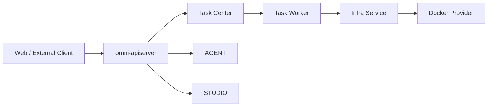
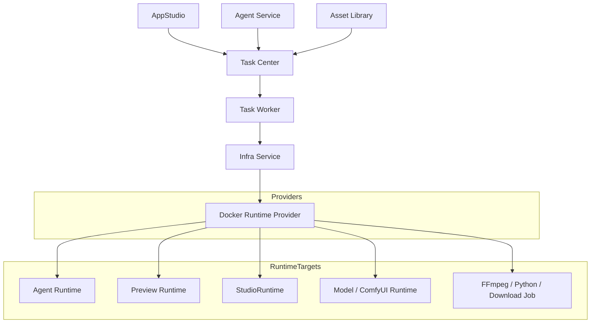
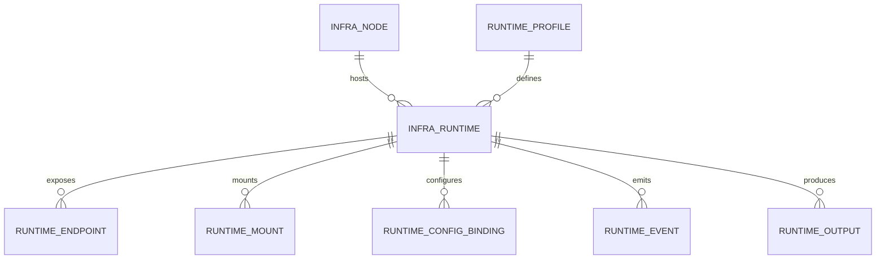
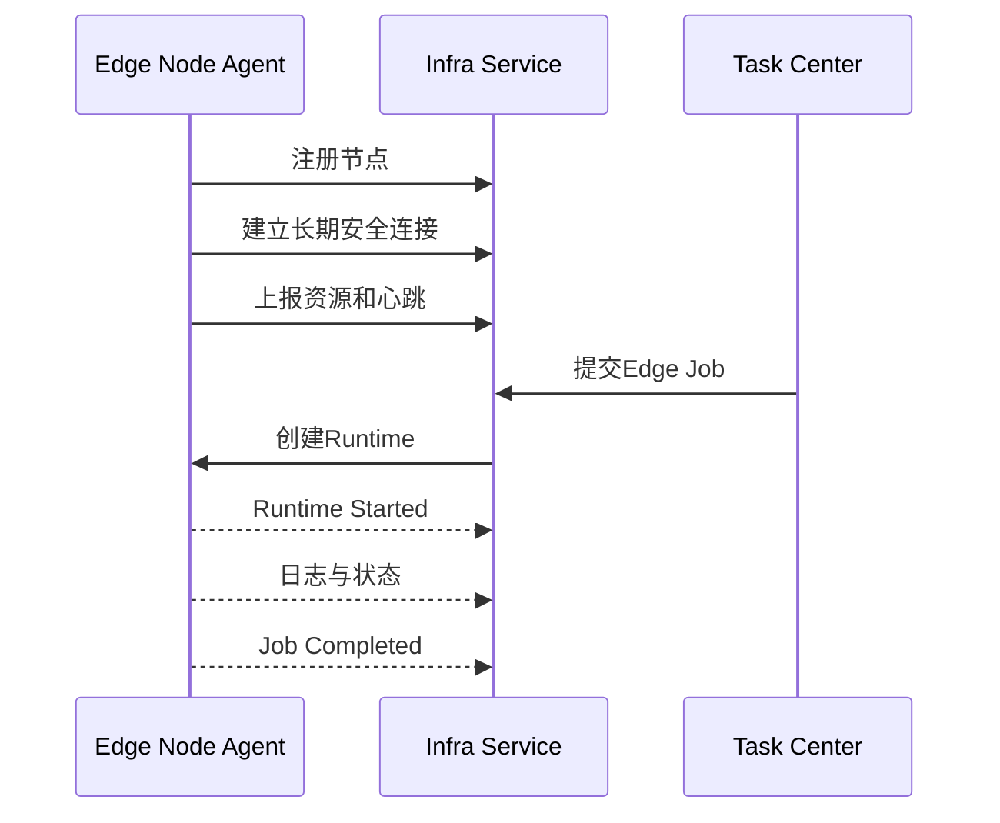
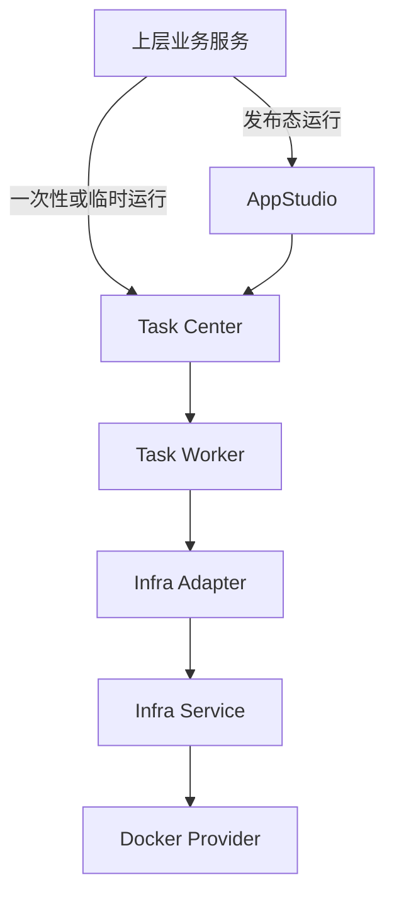

# OmniMAM Infra Service 功能设计文档

> 文档状态：S1 Released
> 文档版本：v1.2
> 正式基线：spec-v1.17.2
> 发布 commit：64435e32db213bf4483d057039036375ee545183
> 修订日期：2026-08-05
> 适用范围：第一阶段单机 Docker 计算节点、Job、Service、资源、网络、挂载与运行凭证管理

本次发布将 Infra Service 收敛为第一阶段的 Docker 运行层：

* 当前版本只实现 `DockerRuntimeProvider` 和受控的单机 Docker 节点。
* 当前版本保留 Job/Service、RuntimeProfile、资源、挂载、Secret、Endpoint、日志、超时、幂等和 Docker 对账语义。
* Kubernetes、Edge、Local Process、多节点调度和 Edge Node Agent 迁移到下一版本规划，不属于本版实现范围。
* Endpoint 解析与 RuntimeOutput 字节交付修订已由 `spec-v1.17.2` 发布，可按该版本 implementation gate 作为正式实现依据。

---

## 1. 文档目的

`Infra Service` 是 OmniMAM 的统一基础设施执行层。

所有涉及以下操作的上层服务，都必须通过 Infra Service：

* 启动 Hermes Agent。
* 启动 Coding Agent。
* 启动 AppStudio Preview。
* 构建 AppStudio 应用。
* 运行 Coding Agent 发布的 StudioApplication。
* 启动 ComfyUI、模型推理服务或其他常驻服务。
* 执行 FFmpeg。
* 执行 Python 图像处理程序。
* 下载外部素材。
* 执行压缩、解压、扫描、转码、抽帧等工具任务。
* 在平台的受控 Docker 节点执行任务。
* 分配 CPU、内存、GPU、磁盘、端口和网络资源。

Infra Service 在本阶段屏蔽 Docker 容器、网络、Volume 和资源限制的实现差异。上层服务只描述执行要求，不关心任务实际运行在：

* Docker。
* 单机 CPU 节点。
* 单机 GPU 节点。

Kubernetes、Local Process、远程计算节点和用户 Edge 节点属于下一版本规划。

---

## 2. 核心定位

Infra Service 的核心职责是：

> 将上层提交的标准化运行要求转换为实际可执行的基础设施运行单元，并管理其完整运行生命周期。

Infra Service 回答以下问题：

* 在哪里运行。
* 使用什么运行环境。
* 分配哪些资源。
* 如何挂载输入和工作目录。
* 如何注入配置和凭证。
* 如何启动、停止和清理。
* 如何暴露 Endpoint。
* 如何采集日志和运行状态。
* 如何屏蔽 Docker 容器、网络、Volume 和资源限制等实现差异。

Infra Service 不回答：

* 为什么执行这个任务。
* 任务之间有什么业务依赖。
* 应用属于哪个业务领域。
* Agent 如何进行对话。
* 模型请求如何组织。
* ApplicationVersion 如何执行。
* Artifact 是否应该成为 Asset。
* Deployment 应该升级到哪个 Release。

---

## 3. 强制架构原则

### 3.1 统一运行入口

任何上层服务不得直接操作：

* Docker Engine。
* 宿主机进程。
* GPU 设备。
* Host Port。
* Volume。
* 运行节点文件系统。

所有实际执行必须经过 Infra Service。

### 3.2 上层只描述要求

上层服务只能提交：

* 运行模式。
* RuntimeProfile。
* 输入和输出。
* CPU、内存、GPU、磁盘要求。
* 网络要求。
* Workspace 或 Artifact 挂载要求。
* 配置绑定。
* Secret 引用。
* 运行位置约束。
* 超时和生命周期要求。

### 3.3 Provider 对上层不可见

以下实现仅存在于 Infra Service 内部：

```text
DockerRuntimeProvider
```

上层服务不得根据 Provider 编写不同业务流程。Kubernetes、Edge 和 Local Process Provider 只在下一版本规划中保留，不属于当前可调用实现。

### 3.4 业务状态与运行状态分离

例如：

* Agent 状态由 `agent` 管理。
* Build、Release 和 StudioRuntimeInstance 状态由 `appstudio` 管理。
* Task 状态由 `task-center` 管理。
* Docker Runtime 状态由 Infra Service 管理。

Infra Service 不得成为第二套业务状态中心。

---

### 3.5 部署方式
Infra Service 作为独立服务部署，不放进 omni-apiserver 进程。

可以与其他 OmniMAM 服务处于同一代码仓库，但应是独立 binary、独立容器和独立运行权限。

omni-apiserver
    负责外部 API、认证、权限、聚合查询

infra-service
    负责节点、Runtime、Job、Service、Provider、资源和对账




单机 Docker 环境中，Infra Service 独占受控 Docker Runtime 访问权限：
```
volumes:
  - /var/run/docker.sock:/var/run/docker.sock
```
## 4. 系统上下文




---

## 5. 与其他服务的职责边界

## 5.1 Task Center

Task Center 负责：

* 业务任务排队。
* 任务依赖。
* 串行和并行。
* 重试策略。
* 取消。
* 业务超时。
* 用户可见进度。
* Task、TaskAttempt 和 TaskGroup。
* 业务执行历史。

Task Worker 负责：

* 消费 Task Center 分发的已注册基础设施 `functionRef`。
* 将任务输入转换为受控的 Job/Service 请求。
* 使用 Task Center 服务身份调用 Infra Service。
* 将 `infra_runtime_id`、`endpoint_ref`、输出引用和脱敏错误写回 Task 结果。
* 将取消、超时和重试动作映射为 Infra 的受控运行操作。

Infra Service 负责：

* 创建实际 Job 或 Service。
* 选择运行节点。
* 分配资源。
* 启动运行环境。
* 收集原始日志。
* 获取退出码。
* 处理基础设施超时。
* 清理实际运行资源。

关系：

```text
Task Center Task
    └── 0..N Task Worker Infra Action
            └── 0..1 Infra Job / Infra Service Runtime
```

一个业务任务可以创建多个 Infra Job。

例如素材处理任务：

```text
下载素材 Job
    ↓
FFmpeg 转码 Job
    ↓
Python 图像处理 Job
    ↓
输出 Artifact 登记
```

Task Center 负责编排，Task Worker 负责调用 Infra，Infra Service 负责每个步骤的实际运行。

---

## 5.2 AppStudio 发布与运行

AppStudio 负责：

* Release。
* Deployment。
* 期望运行状态。
* 实例数量。
* 应用升级。
* Release 回滚。
* 长期服务健康策略。
* 发布历史。

Infra Service 负责：

* 根据 Deployment 要求创建 Service Runtime。
* 实际启动、停止和删除实例。
* 分配 Endpoint。
* 返回 Runtime 状态。
* 执行健康检查。
* 实例异常时提供基础设施事实。

AppStudio 表达：

```text
确保 Release R1 持续运行一个实例
```

Infra Service 执行：

```text
选择运行节点和 Provider，创建并维持对应 Runtime
```

AppStudio 只创建或请求 Task Center 任务；生产发布、Preview 和 Build 的 Infra 调用均由 Task Worker 完成。Preview/Build/Release 的业务状态仍由 AppStudio 管理。

---

## 5.3 agent

`agent` 负责：

* Agent 定义。
* Agent Session。
* Agent Memory。
* Agent Skills。
* MCP 配置。
* 工具权限。
* Agent 与 Workspace 的关联。
* Agent 业务状态。
* AgentRuntime 与 AgentRuntimeProvider 业务状态。

Infra Service 负责：

* 启动 Agent Runtime。
* 挂载 Workspace。
* 注入模型访问配置。
* 注入运行凭证。
* 分配资源。
* 返回 Runtime Endpoint。
* 停止和清理 Agent Runtime。

`agent` 不得直接调用 Infra 的运行与生命周期写操作，也不得操作容器。`agent` 只向 Task Center 提交 Runtime 启动、恢复、挂起和删除任务；Task Worker 再通过 Infra Service 使用 Docker 运行能力。唯一只读例外是：AgentRuntimeAdapter 在完成 Agent、Session、Invocation 和 AgentRuntimeBinding 校验后，可以使用 Agent 工作负载身份解析已绑定的 `INTERNAL` Endpoint，并立即调用 Hermes/OpenCode；该例外不得创建、启动、停止、删除或修改 Runtime。

---

## 5.4 AppStudio

AppStudio 负责：

* StudioApplication。
* Workspace。
* StudioPreviewRuntime。
* StudioBuild。
* StudioRelease。
* StudioRuntimeInstance。

Infra Service 负责：

* 启动 Coding Agent Runtime。
* 启动 Preview Runtime。
* 执行 Build Job。
* 执行测试 Job。
* 运行已发布 StudioRuntime。
* 挂载 Workspace 或固定 Snapshot。
* 返回运行日志和 Endpoint。

AppStudio 不直接调用 Infra。Preview、Build 和 Production Runtime 的 Infra 操作必须先形成 Task Center 任务，再由 Task Worker 执行。

---

## 5.5 user-model 与 modelgateway

`user-model` 管理当前用户的模型选择和 Provider 配置。

`modelgateway` 将模型引用解析为标准模型访问配置，例如：

```text
ModelAccessSpec
```

Infra Service 负责：

* 只接受受信 Agent/Task 执行链路提供的短期 `AgentModelAccessGrant` 引用。
* 以 Infrastructure 服务身份向 User Model 解析 grant，并由 `modelgateway` 形成 ModelAccessSpec。
* 校验 grant 的 owner、Agent、用途、模型、配置版本、有效期和撤销状态。
* 解析其中的 CredentialRef 或不透明 credential handle。
* 在 Runtime 启动阶段注入 Endpoint、模型名称和凭证。
* 防止 Secret 出现在普通查询接口和日志中。

AgentRuntime 或 StudioRuntime 自行调用 LLM Provider。

Infra Service 不代理每一次模型请求。

---

## 5.6 Asset Library

Asset Library 负责：

* Asset。
* Artifact。
* Blob。
* Representation。
* 预览。
* 下载。
* 生命周期。

Infra Service 只负责：

* 挂载 Artifact 输入。
* 提供临时输入目录。
* 收集输出文件。
* 返回输出文件描述。

Task Worker 根据来源任务的 producer context，将受控输出文件描述提交给 Asset Library 登记 Artifact。Infra Service 不直接调用 Artifact 登记接口，也不拥有 Artifact ID、ready 状态、内容或生命周期；Task/Build 成功不能仅由 Infra Job 成功推断。

---

# 6. 统一运行模型

Infra Service 对上层提供两种运行模式：

```text
JOB
SERVICE
```

---

## 6.1 Job

Job 是一次性运行单元。

典型场景：

* FFmpeg 转码。
* 图片缩放。
* 视频抽帧。
* Python 图像处理。
* 外部素材下载。
* 模型文件下载。
* 应用构建。
* 自动化测试。
* 静态检查。
* 压缩和解压。
* 文件扫描。
* Representation 生成。

Job 运行流程：


Job 完成后原则上清理运行环境。

---

## 6.2 Service

Service 是持续运行并可以提供 Endpoint 的运行单元。

典型场景：

* Hermes Agent Runtime。
* Coding Agent Runtime。
* AppStudio Preview Runtime。
* StudioRuntime。
* ComfyUI Runtime。
* vLLM Runtime。
* MCP Server。
* 长期运行 Worker。
* 其他平台服务。

Service 运行流程：


---

# 7. RuntimeProfile

## 7.1 定位

`RuntimeProfile` 是平台维护的运行模板。

上层服务不提交 Docker Image、宿主机命令或 Docker 专属运行参数，而是引用 RuntimeProfile。

示例：

```text
agent.hermes
agent.coding
appstudio.preview.web
appstudio.build.web
studioapp.runtime.web
media.ffmpeg
media.python-image
network.asset-downloader
model.comfyui
model.vllm
sandbox.python
```

RuntimeProfile 负责定义：

* 支持的运行模式。
* 当前固定使用的 Runtime Provider：`DockerRuntimeProvider`。
* 运行镜像和 Entrypoint。
* 默认资源。
* 最大资源。
* 网络策略。
* Service 可发布的命名 Endpoint、协议和容器端口。
* 支持的配置 Binding。
* 输入目录、受控输出根目录和 Job 可声明的命名输出。
* 健康检查方式。
* Secret 注入方式。
* 日志采集方式。
* 清理策略。
* 安全限制。

---

## 7.2 RuntimeProfile 示例

```yaml
id: media.ffmpeg
displayName: FFmpeg Media Processor
supportedModes:
  - JOB

implementations:
  docker:
    image: registry.omnimam.local/runtime/ffmpeg:7
    entrypoint:
      - /usr/local/bin/omni-ffmpeg-runner

resources:
  defaults:
    cpuCores: 2
    memoryMb: 2048
    diskMb: 4096

  maximums:
    cpuCores: 8
    memoryMb: 16384
    diskMb: 102400

networkPolicy:
  outboundInternet: false
  exposeEndpoint: false

endpoints: []

filesystem:
  inputRoot: /inputs
  outputRoot: /outputs
  tempRoot: /tmp/omnimam

outputs:
  - name: result
    relativePath: result.mp4
    mediaType: video/mp4

timeoutSeconds: 3600
cleanupPolicy: always
```

---

## 7.3 RuntimeProfile 管理规则

S1 中：

* RuntimeProfile 由平台管理员维护。
* 业务用户不能自定义 RuntimeProfile。
* RuntimeProfile 不通过业务 API 任意修改。
* RuntimeProfile 修改后不影响已启动 Runtime。
* RuntimeProfile 必须进行版本化。
* Infra Runtime 必须记录实际使用的 Profile Revision。
* Service 只能请求该 Revision 已声明的命名 Endpoint，上层不得提交任意容器端口、Host Port 或绑定地址。
* Job 只能声明该 Revision 允许的输出名称、相对路径和媒体类型，不得扩大受控输出根。

建议引用方式：

```text
runtimeProfileId
runtimeProfileRevision
```

---

# 8. 核心领域对象



---

## 8.1 InfraNode

表示一个可以承载 Runtime 的计算节点。

字段：

```text
id
providerType
displayName
status
locationType
labels
capabilities
resourceCapacity
resourceAllocated
lastHeartbeatAt
registeredAt
updatedAt
```

`locationType`：

```text
MANAGED
```

`providerType`：

```text
DOCKER
```

节点状态：

```text
REGISTERING
READY
DEGRADED
DRAINING
OFFLINE
DISABLED
DELETING
```

---

## 8.2 InfraRuntime

表示一个实际运行单元。

字段：

```text
id
mode
runtimeProfileId
runtimeProfileRevision
providerType
providerRuntimeRef
nodeId
requestingService
ownerDomain
ownerReference
requestUserId
status
resourceAllocation
createdAt
startedAt
completedAt
updatedAt
expiresAt
exitCode
failureReason
```

`requestingService` 固定为：

```text
task-center
```

`ownerDomain` 表示真正拥有业务状态的领域：

```text
agent
appstudio
task-center
asset-library
```

`ownerReference` 是上层业务对象引用，例如：

```text
task-attempt-001
agent-runtime-001
studio-preview-runtime-001
studio-runtime-instance-001
```

Infra Service 不理解这些引用的业务语义，也不据此写入其他领域的业务表。

---

## 8.3 RuntimeEndpoint

表示 Service Runtime 暴露的访问端点。

字段：

```text
id
runtimeId
endpointName
protocol
containerPort
publishedHost
publishedPort
visibility
status
createdAt
updatedAt
```

`endpointName`、`protocol` 和 `containerPort` 来自固定的 RuntimeProfile Revision。`publishedHost` 和 `publishedPort` 是 Infrastructure 私有运行事实，只能用于受控解析，不能出现在普通 Endpoint 摘要、跨域事件、日志或 Task/Agent 结果中。

Docker Provider 必须将声明的容器端口动态发布到平台内部接口，并完成 RuntimeProfile 定义的健康检查后才能把 Endpoint 标记为 `READY`。仅容器已启动、端口已分配或 Docker 报告 running 均不足以形成 READY Endpoint。

`visibility`：

```text
INTERNAL
USER_ACCESSIBLE
PUBLIC
```

S1 可以使用：

```text
http://<host-ip>:<allocated-port>
```

后续可以由 Gateway 提供统一域名。

---

## 8.4 RuntimeMount

表示 Runtime 使用的挂载。

字段：

```text
id
runtimeId
bindingType
sourceRef
targetPath
readOnly
status
createdAt
```

`bindingType`：

```text
WORKSPACE
WORKSPACE_SNAPSHOT
ARTIFACT
BLOB
MODEL_FILES
TEMPORARY_VOLUME
PERSISTENT_VOLUME
SECRET_VOLUME
```

上层不得直接传递任意宿主机路径。

---

## 8.5 RuntimeConfigBinding

表示注入 Runtime 的配置。

字段：

```text
id
runtimeId
name
bindingType
valueRef
injectionMode
status
createdAt
```

`bindingType`：

```text
PLAIN_CONFIG
SECRET
MODEL_ACCESS
SERVICE_ENDPOINT
PLATFORM_CONFIG
MCP_SERVER_REF
```

`injectionMode`：

```text
ENVIRONMENT
CONFIG_FILE
SECRET_FILE
RUNTIME_ARGUMENT
```

`MCP_SERVER_REF` 只接收 `binding_id + binding_revision` 的非敏感引用。Infrastructure 必须使用同一创建请求的 `authorizationRef` 调用 Agent 领域 resolver，校验 AgentRuntimeGrant 的状态、Runtime、请求、有效期和 revision 授权后，取得 endpoint、非敏感配置与 `credentialRef`；再由受信 Secret/Identity resolver 解析实际凭证。Infrastructure、Task Worker 和 Docker Provider 禁止直接读取 Agent 数据表。

OpenCode 配置必须写入容器 tmpfs 的 `/root/.config/opencode/opencode.json`，文件权限 `0600`。Docker Provider 先以等待配置的入口启动容器，通过 Docker Archive/Exec 数据流写入并校验配置，再释放启动门闩；明文凭证禁止进入环境变量、命令参数、持久化、日志、Task 结果和 `docker inspect` 可见字段。

---

## 8.6 RuntimeOutput

表示 Job 产生的输出。

字段：

```text
id
runtimeId
name
mediaType
sizeBytes
contentDigest
contentRef
collectedAt
artifactId
status
createdAt
```

`contentDigest` 固定使用 `sha256:<64 lowercase hex>`；`contentRef` 固定使用非 bearer 的 `infra-output://<output-id>`，它只标识受控读取对象，不携带授权，不得替换为文件路径、任意 URL、Docker Volume 地址或 Provider 引用。

Docker Provider 必须从 RuntimeProfile 的受控输出根读取声明的实际普通文件，拒绝目录、符号链接、符号链接逃逸和输出根外路径；读取实际字节、计算准确大小与 SHA-256，并复制到 Infrastructure 管理的临时 staging 后，RuntimeOutput 才能进入 `COLLECTED`。`artifactId` 只允许在 Task Worker 完成 Asset Library 内容上传并确认 digest 一致后幂等回写；输出收集失败不得创建 ready Artifact。

---

## 8.7 RuntimeEvent

Infra Service 产生基础设施事件：

```text
infra.runtime.created
infra.runtime.placed
infra.runtime.preparing
infra.runtime.started
infra.runtime.ready
infra.runtime.completed
infra.runtime.failed
infra.runtime.stopping
infra.runtime.stopped
infra.runtime.deleted
infra.runtime.expired
infra.runtime.health_changed

infra.node.registered
infra.node.ready
infra.node.degraded
infra.node.offline
infra.node.draining
```

这些事件属于基础设施事实。

---

# 9. 运行请求

## 9.1 CreateJobRequest

```json
{
  "requestId": "req-001",
  "runtimeProfile": {
    "id": "media.ffmpeg",
    "revision": 1
  },
  "command": "transcode",
  "arguments": {
    "videoCodec": "h264",
    "width": 1920,
    "height": 1080
  },
  "inputs": [
    {
      "name": "source",
      "type": "ARTIFACT",
      "sourceRef": "artifact://input-001",
      "targetPath": "/inputs/source.mp4",
      "readOnly": true
    }
  ],
  "outputDeclarations": [
    {
      "name": "result",
      "relativePath": "result.mp4",
      "mediaType": "video/mp4"
    }
  ],
  "resources": {
    "cpuCores": 2,
    "memoryMb": 4096,
    "diskMb": 10240,
    "gpuCount": 0
  },
  "placement": {
    "location": "MANAGED",
    "requiredLabels": {}
  },
  "network": {
    "outboundInternet": false,
    "exposeEndpoint": false
  },
  "timeoutSeconds": 3600,
  "owner": {
    "domain": "asset-library",
    "reference": "task-attempt-001"
  },
  "requestingService": "task-center",
  "requestUserId": "user-from-principal-context"
}
```

Job 完成后 Infra 只返回包含准确 `sizeBytes`、`contentDigest` 和 `infra-output://` 引用的 output descriptor。Task Worker 使用该引用从 Infra 鉴权流式读取实际字节，校验响应大小和 digest，再以原任务 producer context 调用 Asset Library `create -> content upload -> complete`；成功后将 Artifact ID 幂等回写 RuntimeOutput，并只把稳定 Artifact ID 与 digest 写入 Task 小型结果。自动重试必须复用既有 producer 幂等键和 Artifact，不得重复交付。

---

## 9.2 CreateServiceRequest

```json
{
  "requestId": "req-002",
  "runtimeProfile": {
    "id": "agent.coding",
    "revision": 1
  },
  "sourceBindings": [],
  "configurationBindings": [
    {
      "name": "primary-model",
      "type": "MODEL_ACCESS",
      "value": {
        "providerType": "openai_compatible",
        "protocol": "openai_chat_completions",
        "baseUrl": "https://llm.example.com/v1",
        "model": "qwen3-32b",
        "credentialRef": "secret://users/current/provider-001"
      }
    },
    {
      "name": "appstudio-workspace-tool-endpoint",
      "type": "SERVICE_ENDPOINT",
      "valueRef": "service://appstudio/workspace-tool"
    }
  ],
  "resources": {
    "cpuCores": 4,
    "memoryMb": 8192,
    "diskMb": 20480,
    "gpuCount": 0
  },
  "placement": {
    "location": "MANAGED",
    "requiredLabels": {
      "runtime.agent.coding": "true"
    }
  },
  "network": {
    "outboundInternet": true,
    "exposeEndpoint": true,
    "accessMode": "INTERNAL"
  },
  "endpointRequest": {
    "name": "hermes-http"
  },
  "lifecycle": {
    "restartPolicy": "ON_FAILURE",
    "idleTimeoutSeconds": 1800,
    "maximumLifetimeSeconds": 28800
  },
  "owner": {
    "domain": "agent",
    "reference": "agent-runtime-binding-001"
  },
  "requestingService": "task-center",
  "requestUserId": "user-from-principal-context",
  "authorizationRef": "agent-runtime-grant://grant-001"
}
```

该示例为 Coding Agent，因此 `sourceBindings` 为空：StudioWorkspace 不得作为文件系统挂载进入 Agent Runtime。Runtime 通过 AppStudio Workspace Tool 使用每个 Invocation 单独签发的短期授权。Platform Agent 的 AgentWorkspace 挂载必须使用来源领域签发的 `agent-workspace://...` sourceRef，并包含目标路径、读写上限和授权上下文。

---

# 10. Runtime Provider

## 10.1 RuntimeProvider 产品职责

RuntimeProvider 必须支持以下受控能力：

```text
创建 Job
创建 Service
启动、停止和删除 Runtime
检查 Provider Runtime 状态
读取受控日志流
执行 RuntimeProfile 定义的健康检查
```

具体编程语言接口由 S2 或实现定义。Provider 只处理标准化基础设施运行规格，不接收 StudioApplication、Agent、AtomicTask 或其他业务对象；业务归属只能通过稳定 `ownerDomain/ownerReference` 透传。

---

## 10.2 DockerRuntimeProvider

负责：

* Docker 容器创建。
* 网络创建或加入。
* Volume 挂载。
* 资源限制。
* GPU Device Request。
* 端口映射。
* 健康检查。
* 日志采集。
* 容器停止和删除。

Docker 细节不能泄漏到上层领域接口。

---

## 10.3 KubernetesRuntimeProvider（下一版本规划）

以下内容不属于 `v1.1` 实现范围，迁移到下一版本：

后续负责：

* Kubernetes Job。
* Pod 或工作负载创建。
* Service。
* PersistentVolumeClaim。
* Secret 挂载。
* Resource Request 和 Limit。
* GPU 调度。
* 健康探针。
* 日志采集。

上层不会感知 Pod、Deployment、Job 或 Namespace。

---

## 10.4 EdgeRuntimeProvider（下一版本规划）

以下内容不属于 `v1.1` 实现范围，迁移到下一版本：

负责与 Edge Node Agent 通信：

* 下发 Runtime 创建命令。
* 下发 Job 执行命令。
* 上报节点资源。
* 上报运行状态。
* 上传日志。
* 管理本地 Endpoint。
* 管理本地 Workspace 或 Artifact 挂载。
* 管理本地 GPU 使用。
* 处理节点离线和恢复。

Edge Node Agent 主动连接平台，平台不要求用户设备暴露入站管理端口。

---

## 10.5 LocalProcessRuntimeProvider（下一版本规划）

以下内容不属于 `v1.1` 实现范围，迁移到下一版本：

只允许执行平台预先注册的受控程序。

适合：

* FFmpeg。
* 受控 Python Runner。
* 文件扫描器。
* 本地维护工具。

禁止：

* 上层提交任意 Shell。
* 上层提交任意可执行文件路径。
* 上层执行未经批准的系统命令。

当前版本不开放该 Provider；下一版本再决定是否启用。

---

# 11. 节点与资源管理

## 11.1 节点能力

节点需要上报：

```text
CPU 架构
CPU 核数
可用内存
磁盘容量
GPU 数量
GPU 型号
GPU 显存
操作系统
Runtime Provider
可用 RuntimeProfile
网络能力
存储能力
节点标签
```

示例：

```json
{
  "nodeId": "node-gpu-001",
  "providerType": "DOCKER",
  "labels": {
    "gpu.vendor": "nvidia",
    "gpu.model": "rtx-5090",
    "runtime.comfyui": "true",
    "location": "managed"
  },
  "capacity": {
    "cpuCores": 32,
    "memoryMb": 131072,
    "diskMb": 2097152,
    "gpus": [
      {
        "index": 0,
        "vendor": "nvidia",
        "model": "RTX 5090",
        "memoryMb": 32768
      }
    ]
  }
}
```

---

## 11.2 Placement

上层可以表达放置约束：

```text
MANAGED
```

还可以附加标签：

```json
{
  "location": "MANAGED",
  "requiredLabels": {
    "gpu.vendor": "nvidia",
    "runtime.comfyui": "true"
  }
}
```

Infra Service 负责选择具体节点。

第一阶段部署只有一个受控 Docker 节点；`MANAGED` 只表达平台节点类型，不引入跨节点调度。多节点、指定节点和 Edge 放置约束迁移到下一版本。

---

## 11.3 资源分配

支持的基础资源：

```text
cpuCores
memoryMb
diskMb
gpuCount
gpuMemoryMb
```

资源要求分为：

* Requested：期望资源。
* Minimum：最低资源。
* Maximum：最大资源。

S1 可以先采用固定请求，不实现复杂抢占和弹性调度。

---

## 11.4 资源不足

当资源无法满足时，Infra Service 返回标准错误：

```text
INFRA_NO_ELIGIBLE_NODE
INFRA_CPU_INSUFFICIENT
INFRA_MEMORY_INSUFFICIENT
INFRA_GPU_INSUFFICIENT
INFRA_GPU_MEMORY_INSUFFICIENT
INFRA_DISK_INSUFFICIENT
```

是否重试由 Task Center、`agent` 或 `appstudio` 决定。

---

# 12. Workspace 与文件挂载

## 12.1 Workspace

Workspace 挂载必须由 Task Worker 根据源领域授权转换为受控 `sourceRef`。Infra 不解析业务私有表，不接受宿主机路径，也不允许调用方通过通用 `WORKSPACE` 类型绕过源领域权限。

| 运行场景 | 允许输入 | 挂载规则 | 业务事实 owner |
| --- | --- | --- | --- |
| AgentRuntime | `AgentWorkspace` | Infra 只能依据 Agent 的有效授权挂载；读写范围由 Agent Workspace Binding 限制；Runtime 删除不删除 Workspace | `agent` |
| Coding Agent Runtime | 受控 `StudioWorkspace` 引用 | 只能通过 AppStudio Workspace Tool 和受控授权访问；Infra 不得直接读取 AppStudio 私有存储 | `appstudio` |
| Preview Runtime | 当前 `Workspace Revision` | 只能挂载启动时授权的当前 Revision；源代码默认只读，临时写入必须落到隔离临时卷；不得创建或改写 Release | `appstudio` |
| Build Runtime | 固定 `StudioSourceSnapshot` | 只读挂载固定 Snapshot digest；Build 不得读取持续变化的 Workspace 或后续 Revision | `appstudio` |
| Production Runtime | 固定 `Artifact` 和 digest | 只读挂载固定 Artifact；禁止挂载可写 Workspace、Workspace Revision 或 Snapshot | `appstudio` |

所有挂载都必须记录来源领域、稳定引用、目标路径、只读标志和授权上下文。`sourceRef` 只能是来源领域授权生成的受控引用，例如 `agent-workspace://...`、`studio-workspace-revision://...`、`studio-snapshot://...` 或 `artifact://...`；不得把它解释为宿主机路径。`StudioWorkspace`、Workspace Revision、StudioSourceSnapshot 与 Artifact 的物理存储位置不得进入 Infra 普通查询、事件或日志。

挂载策略的优先级为：`Production Artifact` > `Build StudioSourceSnapshot` > `Preview Workspace Revision` > `AgentWorkspace` 授权。Coding Agent 的 StudioWorkspace Tool 授权不是文件系统挂载。任何低层挂载请求不得通过更换 `bindingType` 绕过上层授权；生产任务即使同时收到 Workspace 引用，也必须拒绝该请求。

---

## 12.2 Artifact 输入

Artifact 输入只能通过受控引用挂载：

```text
artifact://<artifact-id>
```

Task Worker 负责把已授权的 Artifact 输入转换为受控请求；Infra Service 负责将引用解析为实际可访问文件。

上层不得传递 Blob 的物理路径。

---

## 12.3 输出目录

RuntimeProfile 必须定义允许收集的输出目录。

例如：

```text
/outputs
```

Infra Service 不得扫描 Runtime 任意文件系统并作为输出返回。

每个 Job 输出必须同时满足：

1. 输出名称和相对路径已由固定 RuntimeProfile Revision 允许。
2. 解析后的文件位于受控输出根内，且是普通文件，不是目录或符号链接。
3. Docker Provider 读取实际字节并计算 `sizeBytes` 和 SHA-256。
4. 字节已复制到 Infra 管理的隔离 staging，才生成 `infra-output://<output-id>`。
5. staging 只能由持有原 Task Worker 工作负载身份和匹配 owner 上下文的读取操作访问；Artifact 回链完成后才允许清理。

---

## 12.4 临时目录

临时目录应满足：

* Runtime 隔离。
* 容量限制。
* Job 完成后清理。
* 不作为长期 Artifact 存储。
* 不允许其他用户 Runtime 访问。

---

# 13. 配置和 Secret 注入

## 13.1 配置类型

支持：

```text
PLAIN_CONFIG
PLATFORM_CONFIG
SERVICE_ENDPOINT
MODEL_ACCESS
SECRET
```

---

## 13.2 ModelAccessSpec

Agent Runtime 创建请求只携带短期 `AgentModelAccessGrant` 引用，不直接携带以下结构。Infrastructure 以服务身份解析且校验通过后，才在内存中获得标准 ModelAccessSpec：

示例：

```json
{
  "providerType": "openai_compatible",
  "protocol": "openai_chat_completions",
  "baseUrl": "https://llm.example.com/v1",
  "model": "qwen3-32b",
  "credentialRef": "secret://users/current/provider-001",
  "capabilities": {
    "streaming": true,
    "toolCalling": true,
    "vision": false
  }
}
```

Infra Service 负责：

1. 校验调用方工作负载身份、grant 有效期及 owner/Agent/usage/config version 范围。
2. 校验配置绑定是否被 RuntimeProfile 支持。
3. 校验 CredentialRef 是否允许当前 grant 使用。
4. 解析 CredentialRef。
5. 将凭证注入 Runtime。
6. 确保普通查询接口不返回 grant、ModelAccessSpec 或明文凭证。
7. 对日志进行 Secret 脱敏。

Agent Runtime 自行调用模型。

---

## 13.3 注入方式

支持：

```text
ENVIRONMENT
CONFIG_FILE
SECRET_FILE
RUNTIME_ARGUMENT
```

例如环境变量：

```text
LLM_PROVIDER=openai_compatible
LLM_BASE_URL=https://llm.example.com/v1
LLM_MODEL=qwen3-32b
LLM_API_KEY=<runtime-injected-secret>
```

具体注入方式由 RuntimeProfile 定义，上层不能任意指定。

---

## 13.4 Secret 规则

禁止：

* 将明文 Secret 写入 Infra 数据库。
* 将明文 Secret 返回调用方。
* 将 Secret 输出到运行日志。
* 将 Secret 写入 Workspace。
* 将 Secret 打入应用 Release。
* 将 Secret 放入基础设施事件。

允许：

* 启动阶段临时解析。
* 通过 Secret File 或受控环境变量注入。
* 使用短期凭证。
* Runtime 删除后清理 Secret 数据。

---

# 14. 网络管理

## 14.1 出站网络

Runtime 请求可以声明：

```text
outboundInternet: true | false
```

对于下载任务，还可以声明域名白名单：

```json
{
  "outboundInternet": true,
  "allowedDomains": [
    "cdn.example.com",
    "assets.example.org"
  ]
}
```

RuntimeProfile 可以强制覆盖上层请求。

---

## 14.2 入站访问

Service 可以请求 Endpoint：

```text
exposeEndpoint: true
```

Endpoint 类型：

```text
INTERNAL
USER_ACCESSIBLE
PUBLIC
```

语义：

* `INTERNAL`：只允许平台内部受信调用方解析和访问。
* `USER_ACCESSIBLE`：必须绑定 owner、当前受权 Principal 或短期访问授权；分配 Host Port 不等于公开访问。
* `PUBLIC`：只有 RuntimeProfile 明确允许、来源领域显式请求并通过审计后才能创建；第一阶段默认不启用。

S1 默认：

* Agent Runtime：内部访问。
* Preview Runtime：`USER_ACCESSIBLE`，由 AppStudio 返回权限裁剪摘要。
* StudioRuntime：私有应用使用 `USER_ACCESSIBLE`；当前 S1 不自动创建 `PUBLIC` Endpoint。
* 模型 Runtime：内部访问。
* Job：不暴露 Endpoint。

---

## 14.3 第一阶段端口访问

单机 Docker 阶段允许：

```text
http://<host-ip>:<allocated-port>
```

Infra Service 负责端口分配和冲突处理。地址只通过受控 Endpoint 解析返回；普通列表、事件、日志和跨域摘要不得传播 Host Port、私网地址或 Provider 网络细节。

上层只保存 `endpointRef` 和权限裁剪摘要，不直接保存 Host Port 作为业务事实。Endpoint 授权失效、Runtime 停止或 owner 不再可访问时，解析必须立即拒绝。

第一阶段 Docker Provider 只能把 RuntimeProfile 声明的命名容器端口动态绑定到平台内部接口；上层不得选择 `publishedHost` 或 `publishedPort`。受控解析请求必须携带 `ownerReference`、固定目的 `AGENT_RUNTIME_ADAPTER` 和审计关联 ID，但调用服务必须从工作负载身份解析，不能信任请求体自报身份。仅 AgentRuntimeAdapter 和必要的 Task Center 内部流程可解析；Endpoint 必须为 READY，所属 Runtime 必须为 RUNNING 且健康，owner 匹配并且 Endpoint 未撤销，返回地址具有短有效期。

---

# 15. 健康检查

支持：

```text
HTTP
TCP
PROCESS
COMMAND
```

示例：

```yaml
type: HTTP
path: /health
portName: http
initialDelaySeconds: 5
timeoutSeconds: 3
failureThreshold: 5
```

Infra Service 只报告基础设施健康事实：

```text
UNKNOWN
STARTING
HEALTHY
UNHEALTHY
```

`appstudio` 或 `agent` 根据健康事实决定业务状态。

---

# 16. 日志管理

Infra Service 负责：

* 标准输出。
* 标准错误。
* Runtime 系统日志。
* 健康检查日志。
* 启动错误。
* 退出原因。

日志接口支持：

* 按 Runtime 查询。
* 按时间范围查询。
* 流式跟随。
* 按游标分页。
* 限制最大返回量。

Infra Service 必须执行：

* Secret 脱敏。
* 凭证字段过滤。
* 超长日志截断。
* 二进制输出过滤。
* 日志保留期管理。

Infra Service 不负责将基础设施日志加工成用户业务解释。

---

# 17. 状态模型

## 17.1 Job 状态

```text
ACCEPTED
VALIDATING
SCHEDULING
PREPARING
RUNNING
SUCCEEDED
FAILED
CANCELING
CANCELED
EXPIRED
DELETING
DELETED
```

---

## 17.2 Service 状态

```text
ACCEPTED
VALIDATING
SCHEDULING
PREPARING
STARTING
RUNNING
DEGRADED
STOPPING
STOPPED
FAILED
EXPIRED
DELETING
DELETED
```

---

## 17.3 状态边界

Infra Service 不应提供以下状态：

```text
AGENT_IDLE
APP_RELEASED
BUILD_VALIDATION_FAILED
TASK_RETRYING
MODEL_UNAVAILABLE_FOR_CHAT
```

这些属于上层业务服务。

---

# 18. 取消、停止与删除

## 18.1 Cancel Job

取消 Job 时：

1. 标记为 `CANCELING`。
2. 请求 Provider 停止运行。
3. 等待优雅退出。
4. 超时后强制终止。
5. 收集已有日志。
6. 根据策略保留或删除部分输出。
7. 标记为 `CANCELED`。

---

## 18.2 Stop Service

停止 Service 不等于删除：

* Runtime 可以保留配置。
* 挂载和资源可以根据 Provider 策略释放。
* 后续允许重新启动。

---

## 18.3 Delete Runtime

删除 Runtime：

* 停止运行环境。
* 释放计算资源。
* 释放端口。
* 删除临时 Volume。
* 清理临时 Secret。
* 删除 Provider 运行对象。
* 保留必要审计记录。

---

# 19. 超时和过期

Infra Service 支持：

```text
startupTimeoutSeconds
executionTimeoutSeconds
idleTimeoutSeconds
maximumLifetimeSeconds
expiresAt
```

示例：

* Build Job：执行超时。
* Coding Agent：空闲超时和最大生命周期。
* Preview：过期时间。
* 下载任务：网络超时。
* 模型 Service：一般不设置最大生命周期。

业务超时与基础设施超时应分离。

---

# 20. 幂等性

所有创建接口必须支持：

```text
requestId
```

相同调用方和相同 `requestId` 重复请求时：

* 不得创建重复 Runtime。
* 请求规范化摘要一致时，返回第一次请求的同一 Runtime 或同一终态结果。
* 第一次请求失败时，重复请求返回原失败分类，不得隐式重新执行；显式重试必须使用新的 `requestId`，并由 Task Center 关联新的 Attempt。
* 请求规范化摘要不一致时，返回幂等冲突，不得复用、覆盖或创建第二个 Runtime。

推荐幂等键：

```text
callerService + requestId
```

第一阶段 `callerService` 固定为受信 `task-center`，实际幂等作用域为 `requestingService + requestId`。Infra 必须在调用 Provider 前持久化幂等占位，以覆盖 Provider 创建成功但响应超时的恢复场景。

---

# 21. 权限与安全

## 21.1 调用方身份

Infra Service 只接受平台服务调用。

每个请求必须包含 Task Center Worker 的可信服务身份：

```text
task-center
```

前端用户不得直接调用 Runtime 创建接口。

---

## 21.2 请求方与业务归属

每个 Runtime 必须记录：

```text
requestingService
ownerDomain
ownerReference
requestUserId
```

其中：

* `requestingService` 表示实际调用 Infra 的受信服务，第一阶段固定为 `task-center`；它不表示业务归属。
* `ownerDomain` 表示真正拥有业务状态的领域，例如 `agent`、`appstudio`、`task-center` 或 `asset-library`。
* `ownerReference` 表示上层对象，例如 `agent-runtime-001`、`studio-preview-runtime-001` 或 `studio-runtime-instance-001`。
* `requestUserId` 用于资源隔离和审计，但不由客户端任意传入；由 Task Center 从原任务和 Principal 上下文传递。

---

## 21.3 运行隔离

必须保证：

* 不同用户 Workspace 隔离。
* 不同 Runtime 文件系统隔离。
* Secret 隔离。
* 网络策略隔离。
* GPU 和进程访问受控。
* Runtime 不得访问宿主机任意目录。
* Runtime 不得访问 Docker Socket。
* Runtime 不得直接控制其他 Runtime。

---

## 21.4 任意命令执行限制

上层不得提交：

```text
/bin/sh -c <arbitrary-command>
```

正确方式是：

```text
runtimeProfile: media.ffmpeg
command: transcode
arguments: ...
```

RuntimeProfile 内的 Runner 将标准化命令转换为受控程序参数。

需要动态代码执行时，必须使用专门的 Sandbox RuntimeProfile。

---

# 22. Edge Node Agent（下一版本规划）

本章不属于 `v1.1` 实现范围，整体迁移到下一版本。

## 22.1 定位

Edge Node Agent 是安装在用户设备上的基础设施代理，不是 AI Agent。

负责：

* 节点注册。
* 主动建立安全连接。
* 心跳。
* 资源上报。
* 本地 Runtime 创建。
* 本地 Job 执行。
* GPU 资源使用。
* 本地文件访问。
* 日志和状态上报。
* 本地 Endpoint 管理。

---

## 22.2 Edge 连接

推荐 Edge Node Agent 主动连接 Infra Service：



平台不依赖用户设备开放公网入站端口。

---

## 22.3 Edge 离线

Edge 节点离线时：

* 节点状态变为 `OFFLINE`。
* 不再分配新 Runtime。
* 已运行 Runtime 标记为状态未知。
* 上层根据任务策略决定等待、失败或迁移。
* 节点恢复后进行状态对账。
* 不假设离线期间 Runtime 一定已经停止。

---

# 23. 对账与故障恢复

Infra Service 必须定期对账数据库状态与 Provider 实际状态。

处理场景：

* 数据库显示 Running，但容器已不存在。
* 容器存在，但数据库记录缺失。
* Service Endpoint 已失效。
* Provider 创建成功但响应超时。
* Runtime 停止成功但资源未释放。

对账结果：

```text
infra.runtime.reconciled
infra.runtime.orphan_detected
infra.runtime.missing_detected
infra.runtime.endpoint_repaired
```

S1 至少需要支持：

* Docker Runtime 对账。
* 僵尸 Runtime 清理。
* 过期 Runtime 清理。

Edge Runtime 状态恢复迁移到下一版本。

---

# 24. 主要接口

以下为逻辑接口，不限定最终 HTTP 或 RPC 路径。

## 24.1 Runtime

```text
CreateJob
CreateService
GetRuntime
ListRuntimes
StartRuntime
StopRuntime
CancelJob
DeleteRuntime
GetRuntimeLogs
ReconcileRuntime
```

---

## 24.2 Endpoint

```text
GetRuntimeEndpoint
ResolveRuntimeEndpoint
```

`GetRuntimeEndpoint` 只返回不含真实地址的摘要；`ResolveRuntimeEndpoint` 是受控只读操作，不得把解析结果写入 Agent 表、Task 结果、事件、日志或普通摘要。

---

## 24.3 Node

```text
GetNode
ListNodes
```

第一阶段只有平台受控的单机 Docker 节点；Edge Node Agent 及其内部接口属于下一版本，不在当前操作集合中。

---

## 24.4 RuntimeProfile

S1 只读操作：

```text
GetRuntimeProfile
ListRuntimeProfiles
```

RuntimeProfile 可以采用内置和目录加载方式，修改后由运维重载或重启生效；当前 S1 不提供业务 API 修改、校验或重载 Profile。

---

## 24.5 输出

```text
ListRuntimeOutputs
ReadRuntimeOutputContent
AttachRuntimeOutputArtifact
```

`ReadRuntimeOutputContent` 只允许 Task Worker 鉴权流式读取已收集的实际字节，并返回实际 Content-Length、Content-Type 和 digest。`AttachRuntimeOutputArtifact` 在 Asset Library 内容完成且 digest 一致后幂等回写 Artifact ID。Artifact 创建、内容完成和 ready 事实仍由 Asset Library 拥有，不属于 Infrastructure 操作。

---

# 25. 标准错误码

## 25.1 请求错误

```text
INFRA_INVALID_REQUEST
INFRA_RUNTIME_PROFILE_NOT_FOUND
INFRA_RUNTIME_PROFILE_REVISION_NOT_FOUND
INFRA_UNSUPPORTED_RUNTIME_MODE
INFRA_UNSUPPORTED_CONFIGURATION_BINDING
INFRA_INVALID_RESOURCE_REQUIREMENT
INFRA_INVALID_PLACEMENT_REQUIREMENT
INFRA_IDEMPOTENCY_CONFLICT
```

## 25.2 节点与资源错误

```text
INFRA_NO_ELIGIBLE_NODE
INFRA_NODE_OFFLINE
INFRA_NODE_DRAINING
INFRA_CPU_INSUFFICIENT
INFRA_MEMORY_INSUFFICIENT
INFRA_GPU_INSUFFICIENT
INFRA_GPU_MEMORY_INSUFFICIENT
INFRA_DISK_INSUFFICIENT
```

## 25.3 运行错误

```text
INFRA_RUNTIME_CREATE_FAILED
INFRA_RUNTIME_START_FAILED
INFRA_RUNTIME_STOP_FAILED
INFRA_RUNTIME_DELETE_FAILED
INFRA_RUNTIME_NOT_FOUND
INFRA_RUNTIME_ALREADY_COMPLETED
INFRA_RUNTIME_TIMEOUT
INFRA_HEALTH_CHECK_FAILED
INFRA_EXIT_CODE_NON_ZERO
```

## 25.4 挂载与配置错误

```text
INFRA_WORKSPACE_MOUNT_FAILED
INFRA_ARTIFACT_MOUNT_FAILED
INFRA_OUTPUT_COLLECTION_FAILED
INFRA_SECRET_RESOLUTION_FAILED
INFRA_SECRET_ACCESS_DENIED
INFRA_MODEL_ACCESS_BINDING_FAILED
INFRA_ENDPOINT_ALLOCATION_FAILED
INFRA_ENDPOINT_ACCESS_DENIED
```

## 25.5 Provider 错误

```text
INFRA_PROVIDER_UNAVAILABLE
INFRA_PROVIDER_REQUEST_FAILED
INFRA_PROVIDER_STATE_CONFLICT
```

---

# 26. 审计

以下操作必须生成审计记录：

* 创建 Runtime。
* 启动 Runtime。
* 停止 Runtime。
* 删除 Runtime。
* 注入 Secret。
* 创建公网或用户可访问 Endpoint。
* 分配 GPU。
* 使用高资源配置。
* 管理节点状态。
* 修改或重载 RuntimeProfile。

审计记录不得包含：

* 明文 Secret。
* 完整 API Key。
* Runtime 内敏感配置内容。

---

# 27. 可观测性

Infra Service 至少提供：

## 27.1 指标

```text
infra_runtime_total
infra_runtime_running
infra_runtime_failed_total
infra_runtime_start_duration
infra_runtime_execution_duration
infra_runtime_cleanup_duration
infra_node_ready_total
infra_node_offline_total
infra_cpu_allocated
infra_memory_allocated
infra_gpu_allocated
infra_endpoint_total
infra_provider_error_total
```

## 27.2 追踪

请求链路应携带：

```text
traceId
taskId
taskAttemptId
runtimeId
requestingService
ownerDomain
ownerReference
```

## 27.3 日志

Infra Service 自身日志和 Runtime 日志必须分离。

---

# 28. S1 实现范围

## 28.1 S1 必须实现

* InfraNode。
* InfraRuntime。
* RuntimeEndpoint。
* RuntimeMount。
* RuntimeConfigBinding。
* RuntimeOutput。
* RuntimeProfile。
* Job。
* Service。
* DockerRuntimeProvider。
* CPU、内存和基础 GPU 资源声明。
* 单机 Docker 节点和基本资源匹配。
* Workspace 挂载。
* StudioSourceSnapshot 只读挂载。
* Artifact 输入挂载。
* 输出文件收集。
* Secret 注入。
* ModelAccessSpec 注入。
* 受控 IP 加端口 Endpoint 及访问裁剪。
* 健康检查。
* Runtime 日志。
* Runtime 超时。
* 幂等创建。
* Runtime 对账。
* Task Center 集成。
* `agent` 集成。
* `appstudio` 集成。

---

## 28.2 下一版本迁移范围

* 完整 KubernetesRuntimeProvider。
* EdgeRuntimeProvider 和 Edge Node Agent。
* LocalProcessRuntimeProvider。
* 多节点调度、指定节点和跨节点迁移。
* 自动扩缩容。
* 复杂资源抢占。
* 多区域调度。
* Spot 或竞价资源。
* GPU 分时和显存切片。
* 服务网格。
* 复杂域名系统。
* 蓝绿发布。
* 灰度发布。

---

## 28.3 持续禁止能力

* 用户自定义 RuntimeProfile。
* 用户自定义 Dockerfile。
* 任意 Shell 执行。
* 任意宿主机目录挂载。
* Runtime 之间共享 Docker Socket。
* Infra Service 代理 LLM 请求。
* Infra Service 管理业务任务依赖。
* Infra Service 拥有 Asset 或 Application 业务数据。

---

# 29. 第一阶段单机 Docker 部署

第一阶段采用单机 Docker。

```text
Single Host
├── omni-apiserver
├── infra-service
├── task-worker
├── agent-service
├── appstudio-service
├── notification-service
├── runtime-agent-*
├── runtime-preview-*
├── runtime-build-*
├── runtime-studioapp-*
├── runtime-model-*
└── runtime-tool-job-*
```

Infra Service 使用：

```text
DockerRuntimeProvider
```

访问 Endpoint：

```text
http://<host-ip>:<allocated-port>
```

后续切换 Kubernetes 或 Edge 时，需要在新的 S1/S2 版本中重新确认 Provider、节点和故障恢复契约；本版不提前承诺跨 Provider 兼容。

---

# 30. 强制架构规则

## R-INFRA-001

第一阶段任何上层服务不得直接操作 Docker Engine、宿主机进程、GPU、端口、Volume 或运行节点文件系统。

## R-INFRA-002

所有实际运行与 Runtime 生命周期写操作必须由 Task Worker 通过 Infra Adapter 调用 Infra Service；业务领域不得直接调用。AgentRuntimeAdapter 仅可在完成 Agent 业务授权校验后，以 Agent 工作负载身份调用受控的只读 Endpoint 解析操作。

## R-INFRA-003

Infra Service 只接受标准化 Job 或 Service 请求。

## R-INFRA-004

上层必须通过 RuntimeProfile 表达运行环境，不得提交 Provider 专属配置。

## R-INFRA-005

Runtime Provider 只能存在于 Infra Service 内部。

## R-INFRA-006

Task Center 负责业务任务，Infra Service 负责实际运行，两者不得合并。

## R-INFRA-007

`appstudio` 负责 Release/StudioRuntimeInstance 的发布态期望，Infra Service 负责受控 Docker Runtime。

## R-INFRA-008

Infra Service 不理解 Agent、ApplicationVersion、StudioRelease、StudioRuntimeInstance 或 Asset 的业务语义，也不直接登记 Artifact；只返回受控输出描述，Artifact 登记由 Task Worker 调用 Asset Library。

## R-INFRA-009

AgentRuntime 只能按 Agent 授权挂载 AgentWorkspace；Coding Agent 只能通过 AppStudio Workspace Tool 访问 StudioWorkspace，且不得形成文件系统挂载；Preview 只能挂载启动时固定的 Workspace Revision；Build 只能只读挂载固定 StudioSourceSnapshot；Production 只能只读使用固定 Artifact，禁止挂载可写 Workspace。

## R-INFRA-010

上层不得传递任意宿主机文件路径。

## R-INFRA-011

上层不得提交任意 Shell 命令。

## R-INFRA-012

Secret 只能通过 SecretRef 传入，并由 Infra Service 在运行阶段解析和注入。

## R-INFRA-013

Infra Service 不得通过普通接口返回明文凭证。

## R-INFRA-014

AgentRuntime 和 StudioRuntime 自行调用 LLM。Agent Runtime 的模型配置必须由 Infra Service 以服务身份解析短期 AgentModelAccessGrant 后注入 ModelAccessSpec 和凭证；不得信任调用方提交的模型地址或明文凭证。

## R-INFRA-015

每个 Runtime 必须关联可信的 `requestingService=task-center`、`ownerDomain` 和 `ownerReference`；请求方身份不得替代业务归属。

## R-INFRA-016

每个创建请求必须支持 `requestingService + requestId` 幂等。相同摘要重放原结果，不同摘要返回冲突；失败重试必须使用新的 requestId。

## R-INFRA-017

每个 Runtime 必须记录 RuntimeProfile Revision 和实际 Provider。

## R-INFRA-018

Infra Service 必须定期对账持久化状态与 Provider 实际状态。孤儿清理只能处理带平台受控标记且通过宽限期复核的 Runtime，不得删除未知或未归属的 Docker 对象。

## R-INFRA-019（下一版本规则）

Edge Node Agent 是基础设施代理，不属于 `agent` 的 AI Agent。

## R-INFRA-020

第一阶段业务服务只能依赖 Infra Service 的 Docker 无关逻辑接口，不得把 Docker 容器细节写入业务流程。未来增加 Provider 时，仍须沿用同一规则。

## R-INFRA-021

Docker Service 只能发布 RuntimeProfile Revision 声明的命名容器端口，并仅绑定平台内部接口；完成端口映射和健康检查前 Endpoint 不得进入 READY。

## R-INFRA-022

Docker Job 只有在受控输出根内读取实际普通文件、计算准确大小与 SHA-256 并复制到 Infra staging 后，才能形成 `COLLECTED` RuntimeOutput 和 `infra-output://` 可信引用；Artifact 内容完成且 digest 一致后才允许回写 Artifact ID 和清理 staging。

## R-INFRA-023

Agent MCP 配置只能通过 `MCP_SERVER_REF + authorizationRef` 解析；Infrastructure、Task Worker 和 Provider 不得读取 Agent 私表。OpenCode 敏感配置必须在 tmpfs 内以 `0600` 写入并在释放启动门闩前完成，凭证不得进入环境变量、命令参数、持久化、日志或 inspect 可见字段。

---

# 31. 最终职责总结

```text
Task Center
    决定何时执行、依赖、重试、取消和业务状态

agent
    决定运行哪个Agent以及使用哪个Workspace和模型配置

appstudio
    决定如何开发、预览、构建和发布 StudioApplication

user-model
    决定用户选择哪个模型

modelgateway
    将模型引用解析为ModelAccessSpec

Asset Library
    管理素材、Artifact和Representation

Infra Service
    决定在哪里以及如何创建实际运行环境

Runtime Provider
    第一阶段执行 Docker 容器操作

AgentRuntime / StudioRuntime
    执行实际业务逻辑并自行调用模型
```

统一调用关系：



Infra Service 的最终边界是：

> 上层描述需要运行什么，Infra Service 决定使用什么运行环境、在哪个节点以及如何安全地运行。

## 32. S2 追溯锚点

以下编号仅把本 S1 已有语义映射为可机器校验的 S2 追溯锚点，不新增业务能力：

- `US-INFRA-001`：受信 Task Worker 可以创建、管理、对账第一阶段 Docker Job/Service 及其受控挂载和输出。
- `BR-INFRA-001`：Infrastructure 的调用身份、Docker-only Provider、资源、挂载、Secret、状态和对账边界必须遵守本 S1 第 3、6、7、8、9、10、11、12、13、14、15、16、17、18、19、20、21、23、28、29、30 节及 `R-INFRA-001..023`。

验收标准：

- `AC-INFRA-001-01`：Infra 写操作只接受 Task Worker 的受信身份，并同时校验 `requestingService=task-center`、`ownerDomain`、`ownerReference`、`requestId` 和 RuntimeProfile Revision。
- `AC-INFRA-001-02`：第一阶段只允许 DockerRuntimeProvider 和一个受控 MANAGED 节点；Kubernetes、Edge、Local Process、多节点及跨 Provider 参数必须拒绝。
- `AC-INFRA-001-03`：相同幂等作用域和相同请求摘要重放同一 Runtime 或原终态；摘要不同返回幂等冲突，原失败重试必须使用新 requestId。
- `AC-INFRA-001-04`：Coding Agent Runtime 不得携带 StudioWorkspace 文件系统挂载；Platform AgentWorkspace、Preview Revision、Build Snapshot 和 Production Artifact 必须分别使用来源领域签发的受控 sourceRef。
- `AC-INFRA-001-05`：Production 请求只允许固定 Artifact ID/digest；包含 Workspace、Revision、Snapshot 或其他可写源码输入时整体拒绝。
- `AC-INFRA-001-06`：Infra Job 成功只产生受控 output descriptor；Artifact 登记由 Task Worker 调用 Asset Library，Infra 不得据此生成 Artifact ready 事实。
- `AC-INFRA-001-07`：Secret 只在 Runtime 启动边界短期解析和注入，数据库、普通响应、事件、日志和输出不得包含明文凭证。
- `AC-INFRA-001-08`：`USER_ACCESSIBLE` Endpoint 必须校验 owner 与当前授权，`PUBLIC` 默认禁用；Host Port 或私网地址不得进入普通列表、事件和跨域摘要。
- `AC-INFRA-001-09`：Provider 创建成功但响应超时后，恢复必须依赖 requestId 和 Provider 引用对账，不得创建第二个 Runtime。
- `AC-INFRA-001-10`：孤儿清理只能作用于有平台受控标记、稳定 owner 且超过宽限期的 Runtime；未知 Docker 对象只告警，不自动删除。
- `AC-INFRA-001-11`：Agent Runtime 启动只接受短期 grant 引用；Infrastructure 以服务身份校验 owner/Agent/usage/config version/有效期后解析并注入，普通响应、事件、日志和持久化不得包含 grant、ModelAccessSpec 或明文凭证。
- `AC-INFRA-001-12`：OpenCode MCP 只接受 `MCP_SERVER_REF`，通过 `authorizationRef` 解析固定 revision，并以 Docker Archive/Exec 写入 tmpfs `opencode.json`、设为 `0600` 后释放启动门闩；未授权目标和所有 inspect 可见凭证传递方式必须拒绝。
