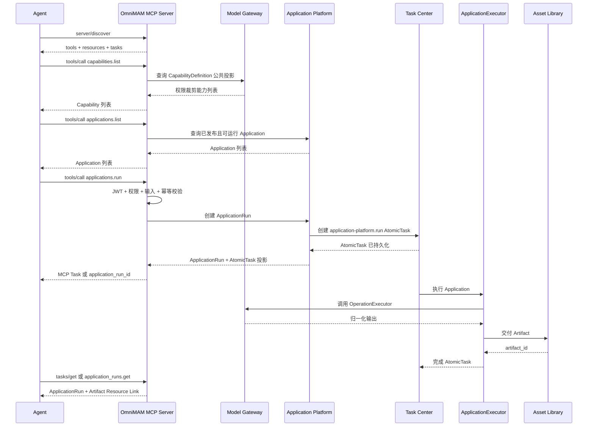
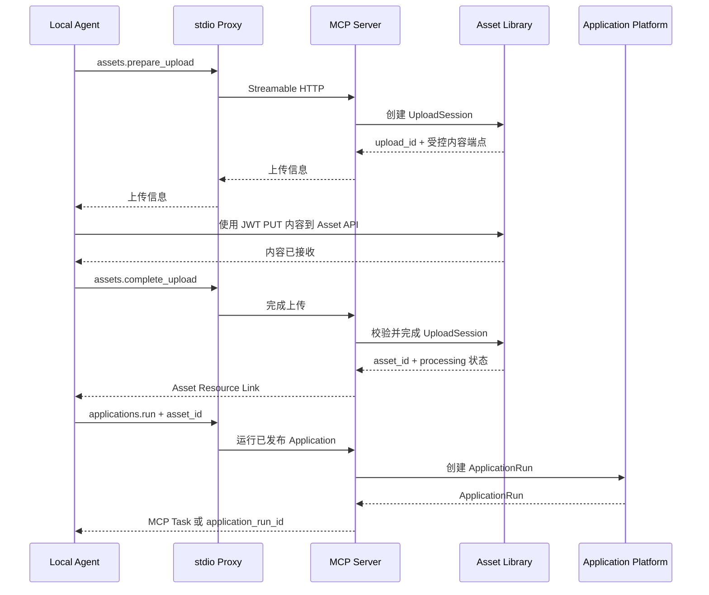

# OmniMAM MCP Server 功能设计

> 文档状态：Draft S1
> 版本：v1.0.0
> 日期：2026-08-01
> 协议基线：Model Context Protocol `2026-07-28`
> Release 状态：`spec-v1.9.2` released，可按实施门禁作为正式实现依据

---

## 0. 原型来源

- 原型路径：`00_product/domains/mcp/product-spec.md` 本次整理前的 S0 Draft。
- 原型目标：验证 OmniMAM 通过标准 MCP 协议向本地和远程 Agent 暴露应用、能力目录、素材与异步运行投影的可行性。
- 用户确认状态：已确认将当前 Draft 直接整理为 S1，并于 `spec-v1.9.2` 确认 Release。
- 沉淀范围：MCP `2026-07-28`、Streamable HTTP、stdio Proxy、固定 Tools、Resources、Tasks 扩展、Capability 只读发现、Application 查询与运行、ApplicationRun 查询与取消、Asset 查询与受控上传、JWT/RBAC、审计、限流和追踪。
- 未沉淀内容：直接 Capability 执行、泛化 Invocation、OAuth 2.1 授权服务器与外部 OAuth Subject、Personal Access Token、独立 MCP Scope/AccessGrant、交互式 `input_required`、`tasks/update`、MCP Prompts、MCP Apps、Sampling、动态 Tool、Provider/Engine 管理、任意 ComfyUI Workflow 提交、Canvas 编辑、直接 S3/MinIO 上传与生产代码结构。

S0 是本文件的整理输入，不是事实源。本次整理完成后，以当前 S1 的产品语义为准；精确协议 Schema、错误码、权限码、持久化和模块合同以 MCP S2 为准。S1/S2 均需用户 Release 后才能作为正式实现依据。

---

## 1. 文档目的

本文定义 OmniMAM 如何通过 MCP Server 向以下 Agent 提供平台能力：

* 运行在其他设备或平台上的外部 Agent。
* 运行在 OmniMAM 所在主机或局域网中的本地 Agent。
* 支持 MCP 的编码 Agent、通用 AI Agent 和自定义 Agent Runtime。

OmniMAM MCP Server 对外提供以下能力：

1. 查询当前主体可见的统一 CapabilityDefinition。
2. 查询并运行已发布且允许直接运行的 Application。
3. 查询和协作式取消 ApplicationRun。
4. 搜索、读取和上传素材。
5. 获取应用运行产生的 Artifact 和已登记 Asset。
6. 将 ApplicationRun 绑定的 AtomicTask 映射为 MCP Task。

MCP Server 只负责协议适配、访问控制、结果转换和任务映射，不负责模型执行、应用执行、任务调度、素材持久化或运行环境管理。

---

## 2. 设计范围

### 2.1 本版本包含

* MCP Streamable HTTP 接入。
* 本地 stdio Proxy 接入。
* `server/discover`。
* MCP Tools。
* MCP Resources。
* MCP Tasks 扩展中的 `tasks/get` 和 `tasks/cancel`。
* CapabilityDefinition 只读发现。
* 已发布 Application 查询与运行。
* ApplicationRun 状态查询与协作式取消。
* Asset 和 Artifact 查询。
* Asset Library 受控上传。
* Identity JWT Bearer Token、RBAC 和资源级访问控制。
* 审计、限流和调用追踪。

### 2.2 本版本不包含

* 通过 MCP 直接执行 Capability。
* 泛化 `Invocation` 或独立 `ModelInvocation`。
* 通过 MCP 管理 Provider、ProviderCapability、EngineInstance 或 Binding。
* 通过 MCP 提交任意 ComfyUI Workflow。
* 通过 MCP 管理 Docker、Kubernetes 或 Agent Runtime。
* 通过 MCP 编辑 Canvas。
* 通过 MCP 管理平台用户、角色和系统配置。
* 由 MCP Server 独立实现任务队列或保存生成文件。
* OAuth 2.1 授权服务器、外部 OAuth Subject 或 Personal Access Token。
* 独立 MCP Scope 或 `McpAccessGrant`。
* MCP Task `input_required` 和 `tasks/update`。
* MCP Prompts、MCP Apps UI 扩展和客户端 Sampling。
* 客户端直接上传 S3、MinIO 或其他 StorageBackend。

---

## 3. 核心设计原则

### 3.1 MCP 是访问层，不是执行层

完整应用运行链路为：

```text
External / Local Agent
        │
        │ MCP
        ▼
OmniMAM MCP Server
        │
        ├── Identity JWT 认证
        ├── Tool / Resource 发现
        ├── 参数与权限校验
        ├── MCP Task 映射
        ├── 协议结果转换
        └── 审计与限流
        │
        ▼
Application Platform
        │
        ├── 固定 ApplicationVersion
        ├── 创建 ApplicationRun
        └── 请求 application-platform.run AtomicTask
        │
        ▼
Task Center
        │
        ▼
ApplicationExecutor
        │
        ▼
Model Gateway
        │
        ▼
EngineAdapter / OperationExecutor / Provider
        │
        ▼
Asset Library
```

MCP Server 不直接调用 ComfyUI、模型 Provider、EngineAdapter、OperationExecutor 或 Worker，也不复制 ApplicationRun、AtomicTask、Artifact 或 Asset 的领域状态。

### 3.2 对外暴露稳定业务对象，不暴露内部执行结构

Agent 可以看到：

* CapabilityDefinition 的公共只读投影。
* Application 和 ApplicationVersion 的可运行公共投影。
* ApplicationRun。
* MCP Task。
* Artifact、Asset 和 Representation 的权限裁剪投影。

Agent 不能看到：

* ProviderCredential、ProviderCapability 完整配置。
* EngineInstance 鉴权信息或内部拓扑。
* Worker、TaskAttempt 或 Conductor 内部对象。
* ComfyUI 内部节点和任意 Workflow。
* Docker、Kubernetes Runtime。
* Blob 物理路径、StorageBackend 配置或内部对象键。

### 3.3 固定 MCP Tools，不为每个能力动态生成 Tool

CapabilityDefinition 通过以下固定 Tool 发现：

```text
omnimam.capabilities.list
omnimam.capabilities.get
```

CapabilityDefinition 数量、模型或 ProviderCapability 变化不会改变 Tool 注册表。Agent 需要执行能力时，必须选择封装该能力的已发布 Application，并使用：

```text
omnimam.applications.run
```

这样可以保证：

* Agent 使用稳定的 Application 输入输出契约。
* Provider、Engine、路由参数和凭证不泄漏为业务输入。
* 已发布 ApplicationVersion、ApplicationRun 快照和 Artifact 输出沿用现有领域事实。
* 新增 CapabilityDefinition 时不需要修改 MCP Tool 注册表。

---

## 4. MCP 协议基线

本设计以官方 MCP `2026-07-28` 为协议基线。该版本使用每请求协议元数据，服务器必须实现 `server/discover`；本版本不要求兼容基于 `initialize`、`notifications/initialized` 和连接 Session 的旧协议版本。

### 4.1 支持的传输

```text
远程或局域网 Agent：Streamable HTTP
本机 Agent：stdio MCP Proxy
```

Streamable HTTP 使用只接受 POST 的 MCP Endpoint。每个 JSON-RPC 请求使用独立 HTTP POST，服务器可以返回普通 JSON，也可以返回与该请求关联的 SSE 响应流。本版本不提供独立 GET SSE Endpoint，不创建 `Mcp-Session-Id`。

### 4.2 MCP Endpoint

```text
POST /mcp
```

Tool 调用示例元数据：

```http
Content-Type: application/json
Accept: application/json, text/event-stream
MCP-Protocol-Version: 2026-07-28
Mcp-Method: tools/call
Mcp-Name: omnimam.applications.run
Authorization: Bearer <identity-jwt>
```

`MCP-Protocol-Version`、`Mcp-Method` 和适用请求中的 `Mcp-Name` 必须与 JSON-RPC Body 一致；不一致时拒绝请求。每个 HTTP 请求都必须独立携带有效 JWT，不得从连接继承 Principal。

### 4.3 无协议 Session

MCP Server 不保存：

```text
MCP connection session
Mcp-Session-Id
connection-scoped principal
connection-scoped tool list
connection-scoped application context
```

跨请求关联使用显式 ID：

```text
application_id
application_version_id
application_run_id
atomic_task_id
mcp_task_id
asset_id
artifact_id
upload_id
```

这些 ID 不是授权凭证，每次访问都必须重新校验 JWT、RBAC、资源可见性和对象状态。

---

## 5. 部署架构

### 5.1 服务职责

```text
omnimam-server
├── MCP HTTP Endpoint
│   └── POST /mcp
├── MCP Protocol Adapter
│   ├── server/discover
│   ├── tools/list
│   ├── tools/call
│   ├── resources/list
│   ├── resources/templates/list
│   ├── resources/read
│   ├── tasks/get
│   └── tasks/cancel
├── MCP Access Control
├── MCP Tool Registry
├── MCP Resource Resolver
├── MCP Task Adapter
├── MCP Audit Recorder
└── Existing Domain Service Boundaries
```

MCP HTTP Endpoint 可以是 `omnimam-server` 内部模块，不要求拆成独立微服务。该结构仅表达产品职责边界，不规定生产代码目录或编程语言接口。

### 5.2 本地 stdio Proxy

仅支持 stdio 的本地 Agent 通过 `omnimam-mcp-proxy` 接入：

```text
Local Agent
    │ stdin/stdout JSON-RPC
    ▼
omnimam-mcp-proxy
    │ Streamable HTTP
    ▼
OmniMAM /mcp
```

Proxy 只负责接收 stdio 请求、读取安全凭证、转发 Streamable HTTP、转换响应和处理协议版本兼容。Proxy 不实现 Tool 业务逻辑、权限决策、任务状态或素材存储。

示例配置：

```json
{
  "mcpServers": {
    "omnimam": {
      "command": "omnimam-mcp-proxy",
      "args": ["--endpoint", "http://127.0.0.1:8080/mcp"],
      "env": {
        "OMNIMAM_MCP_TOKEN": "${OMNIMAM_MCP_TOKEN}"
      }
    }
  }
}
```

凭证只能来自环境变量、操作系统安全凭证存储或受保护配置，不得放入 Tool 参数、Tool Description、Agent Prompt 或日志。

---

## 6. MCP Server 能力声明

`server/discover` 返回：

```json
{
  "supportedVersions": ["2026-07-28"],
  "capabilities": {
    "tools": {},
    "resources": {},
    "extensions": {
      "io.modelcontextprotocol/tasks": {}
    }
  }
}
```

本版本不声明 `prompts`、`sampling`、`roots` 或 `logging`。

### 6.1 Tools

Tool 名称固定，因此不声明 `listChanged: true`。`tools/list` 的返回内容可以按当前请求的权限隐藏不可用 Tool，但不得依赖历史连接状态。

### 6.2 Resources

Resources 读取已知对象，不替代动态搜索。Asset 搜索必须使用 `omnimam.assets.search`。

```text
resources/read omnimam://capabilities/{capability_id}
resources/read omnimam://applications/{application_id}
resources/read omnimam://application-runs/{application_run_id}
resources/read omnimam://assets/{asset_id}
resources/read omnimam://artifacts/{artifact_id}
```

### 6.3 Tasks 扩展

ApplicationRun 通常异步执行，因此支持 `io.modelcontextprotocol/tasks`。客户端和服务器都声明支持后，`omnimam.applications.run` 才可以返回 `resultType: "task"`。

本版本只使用：

```text
tasks/get
tasks/cancel
```

当前 ApplicationRun/AtomicTask 没有需要 MCP 中途补充输入的产品状态，因此不声明 `input_required`，也不提供 `tasks/update`。

---

## 7. Tool 总览

| Tool | 用途 |
| --- | --- |
| `omnimam.capabilities.list` | 查询当前主体可见的 CapabilityDefinition |
| `omnimam.capabilities.get` | 查询能力公共定义和输入输出 Schema |
| `omnimam.applications.list` | 查询当前主体可运行的已发布 Application |
| `omnimam.applications.get` | 查询 Application、已发布版本和运行输入输出 |
| `omnimam.applications.run` | 创建 ApplicationRun |
| `omnimam.application_runs.get` | 查询 ApplicationRun 与 AtomicTask 投影 |
| `omnimam.application_runs.cancel` | 协作式取消 ApplicationRun 绑定的 AtomicTask |
| `omnimam.assets.search` | 搜索当前主体有权访问的 Asset |
| `omnimam.assets.get` | 查询 Asset、当前版本和 Representation |
| `omnimam.assets.prepare_upload` | 创建 Asset Library 上传会话 |
| `omnimam.assets.complete_upload` | 完成上传并获得 Asset 处理状态 |

Tool 名称使用点号分隔。输入输出逻辑字段和示例由本 S1 描述；精确 JSON Schema 2020-12 合同在后续 S2 中定义。

---

## 8. Capability Tools

### 8.1 `omnimam.capabilities.list`

查询当前主体有权发现的公共 CapabilityDefinition。

输入逻辑字段：

| 字段 | 必填 | 说明 |
| --- | ---: | --- |
| `domain` | 否 | `image`、`video`、`audio`、`text` 等能力领域 |
| `query` | 否 | 按能力 ID、名称或描述搜索 |
| `status` | 否 | 默认只返回当前可用能力 |
| `cursor` | 否 | 分页游标 |
| `limit` | 否 | 默认 50，最大 100 |

示例输出：

```json
{
  "items": [
    {
      "capability_id": "image.generate",
      "name": "Image Generation",
      "description": "Generate an image through a published Application.",
      "status": "available",
      "schema_uri": "omnimam://capabilities/image.generate",
      "supports_direct_invoke": false
    }
  ],
  "next_cursor": null
}
```

查询通过 Model Gateway 的受控只读能力边界获取 CapabilityDefinition，不读取其私有表或 ProviderCapability 文件。MCP 只返回公共能力语义，不返回 Provider、EngineInstance、Endpoint、Credential 或内部路由。

### 8.2 `omnimam.capabilities.get`

输入：

```json
{
  "capability_id": "video.image_to_video"
}
```

输出保留能力 ID、名称、描述、当前公共可用性、业务输入输出 Schema 以及关联 Application 的受控导航信息。能力 Schema 来自 Model Gateway 的 CapabilityDefinition 公共投影，不由 MCP Server 自行发明。

Capability 详情必须明确：

```text
supports_direct_invoke = false
```

Agent 若要执行该能力，应查询当前有权限、已发布且 `run_enabled=true` 的 Application。Capability 可用不等于任意 Application 当前可运行；每次 ApplicationRun 仍需执行应用、能力、实例、权限和输入的现时校验。

---

## 9. Application Tools

### 9.1 `omnimam.applications.list`

查询当前主体可以运行的已发布 Application。

```json
{
  "query": "poster",
  "cursor": null,
  "limit": 50
}
```

示例输出：

```json
{
  "items": [
    {
      "application_id": "app_product_poster",
      "name": "Product Poster Generator",
      "description": "Generate a product poster from a product image.",
      "published_version_id": "appver_01K2XYZ",
      "run_enabled": true,
      "schema_uri": "omnimam://applications/app_product_poster"
    }
  ],
  "next_cursor": null
}
```

只返回当前主体可见、存在已发布版本且 `run_enabled=true` 的 Application。ProviderCapability 或 Engine 暂时不可用时，列表可以返回权限裁剪的可用性摘要，但不得暴露底层配置。

### 9.2 `omnimam.applications.get`

Application 详情返回稳定 Application 身份、当前已发布版本、版本输入输出、运行限制和当前可运行性。示例：

```json
{
  "application_id": "app_product_poster",
  "name": "Product Poster Generator",
  "published_version": {
    "application_version_id": "appver_01K2XYZ",
    "version": 3
  },
  "run_enabled": true,
  "input_schema": {
    "type": "object",
    "properties": {
      "product_image": {"$ref": "#/$defs/assetReference"},
      "title": {"type": "string"}
    },
    "required": ["product_image"]
  },
  "output_schema": {
    "type": "object",
    "properties": {
      "artifacts": {"type": "array"}
    }
  }
}
```

输入输出语义来自已发布 ApplicationVersion，并继续受 RuntimeFormSchema 的权限、能力和当前运行时约束裁剪。

### 9.3 `omnimam.applications.run`

```json
{
  "application_id": "app_product_poster",
  "application_version_id": "appver_01K2XYZ",
  "input": {
    "product_image": {"asset_id": "asset_01K2IMAGE"},
    "title": "Summer Collection"
  },
  "idempotency_key": "agent-run-app-001",
  "metadata": {
    "agent_run_id": "agent_run_123"
  }
}
```

`application_version_id` 可以省略。省略时在创建 ApplicationRun 的事务边界解析当前 PublishedVersion，并将具体版本固定到 ApplicationRun；后续发布新版本不得改写历史运行。显式指定版本时，版本必须存在、属于该 Application、已经发布、仍允许运行且当前主体可访问。

MCP Server 在创建前必须验证：

1. JWT Principal 和 Application 可见性。
2. `run_enabled=true`。
3. ApplicationVersion 发布状态。
4. Asset 输入的所有权与读取权限。
5. 当前 RuntimeFormSchema 与输入约束。
6. Application Platform 返回的能力和运行时可用性。
7. 幂等键和配额。

内部协作：

```text
MCP applications.run
        │
        ▼
Application Platform 创建并固定 ApplicationRun
        │
        ▼
Task Center 创建 application-platform.run AtomicTask
        │
        ▼
ApplicationExecutor
        │
        ▼
Model Gateway OperationExecutor
```

MCP 不自行选择 Provider、EngineInstance、Worker 或 Runtime，也不复制 ApplicationRun 快照。

---

## 10. ApplicationRun Tools

### 10.1 状态投影

MCP 对外使用 ApplicationRun 身份，并附带其 AtomicTask 的权限裁剪状态投影：

```json
{
  "application_run_id": "apprun_01K2ABC",
  "application_id": "app_product_poster",
  "application_version_id": "appver_01K2XYZ",
  "status": "running",
  "progress": 42,
  "created_at": "2026-08-01T01:30:00Z",
  "started_at": "2026-08-01T01:30:03Z",
  "completed_at": null,
  "outputs": [],
  "error": null
}
```

MCP 不创建第二套 ApplicationRun 状态机。ApplicationRun 业务快照归 Application Platform，执行状态归 AtomicTask，Artifact 处理与登记状态归 Asset Library。

### 10.2 `omnimam.application_runs.get`

```json
{
  "application_run_id": "apprun_01K2ABC"
}
```

成功结果可以包含：

```json
{
  "application_run_id": "apprun_01K2ABC",
  "status": "succeeded",
  "progress": 100,
  "outputs": [
    {
      "artifact_id": "artifact_01K2OUT",
      "asset_id": "asset_01K2OUT",
      "media_type": "image/png",
      "uri": "omnimam://artifacts/artifact_01K2OUT"
    }
  ],
  "error": null
}
```

调用者必须对所属 Application 和 ApplicationRun 具备访问权限。仅知道 ID 不构成权限；无权访问与对象不存在不得泄露可区分信息。

### 10.3 `omnimam.application_runs.cancel`

```json
{
  "application_run_id": "apprun_01K2ABC",
  "reason": "The user no longer needs the result."
}
```

示例响应：

```json
{
  "application_run_id": "apprun_01K2ABC",
  "status": "cancel_requested",
  "accepted": true
}
```

取消是协作式操作。MCP 在 ApplicationRun 授权边界解析其 AtomicTask，并调用 Task Center 的受控取消能力。`CANCEL_REQUESTED` 不等于最终取消；Provider 已完成时运行仍可能成功。已终态运行不重复取消，响应应返回当前终态。

---

## 11. Asset Tools

### 11.1 `omnimam.assets.search`

搜索当前主体有权访问的 Asset：

```json
{
  "query": "a woman standing by the sea",
  "media_types": ["image"],
  "tags": ["portrait"],
  "sort": "created_at_desc",
  "cursor": null,
  "limit": 20
}
```

返回 Asset、当前 AssetVersion 和必要 Representation 的权限裁剪摘要。搜索不引入 `library_id`；素材范围沿用 Asset Library 的 owner、visibility、状态和授权事实。

### 11.2 `omnimam.assets.get`

```json
{
  "asset_id": "asset_01K2IMAGE",
  "include_representations": true
}
```

结果可以包含 Asset 基本信息、当前版本、标签、媒体元数据、Representation URI 和短期受控内容 URL。不得返回 Blob 物理路径、StorageBackend 配置或永久公开 URL。

### 11.3 `omnimam.assets.prepare_upload`

MCP JSON-RPC 不传输大型二进制。该 Tool 通过 Asset Library 创建上传会话：

```json
{
  "filename": "reference.png",
  "media_type": "image/png",
  "size": 4859032,
  "checksum": {
    "algorithm": "sha256",
    "value": "..."
  },
  "metadata": {
    "source": "local-agent"
  },
  "idempotency_key": "asset-upload-001"
}
```

示例输出：

```json
{
  "upload_id": "upload_01K2ABC",
  "method": "POST",
  "content_upload_url": "https://omnimam.example/api/v1/asset-uploads/upload_01K2ABC/content",
  "required_headers": {
    "Content-Type": "image/png"
  },
  "authorization_required": true,
  "expires_at": "2026-08-01T02:00:00Z"
}
```

`content_upload_url` 必须指向 OmniMAM Asset API 的受控上传边界，不得是 S3、MinIO 或其他 StorageBackend 直传地址。Agent 使用同一 Identity JWT 上传内容，但 Tool 结果不得回显 Token；Asset Library 负责会话、大小、Checksum、MIME 和所有权校验。

### 11.4 `omnimam.assets.complete_upload`

```json
{
  "upload_id": "upload_01K2ABC"
}
```

完成操作委托 Asset Library 验证会话和内容，并返回 Asset/AssetVersion 处理状态：

```json
{
  "asset_id": "asset_01K2IMAGE",
  "status": "processing",
  "uri": "omnimam://assets/asset_01K2IMAGE"
}
```

处理、扫描或 Representation 生成尚未完成时必须返回真实 `processing` 状态，不能因为上传完成而伪造 `ready`。重复 complete 必须沿用 Asset Library 幂等语义。

---

## 12. MCP Resources

### 12.1 URI 设计

```text
omnimam://capabilities/{capability_id}
omnimam://applications/{application_id}
omnimam://application-runs/{application_run_id}
omnimam://assets/{asset_id}
omnimam://assets/{asset_id}/representations/{representation}
omnimam://artifacts/{artifact_id}
```

### 12.2 Resource Templates

`resources/templates/list` 至少描述上述模板。示例：

```json
{
  "resourceTemplates": [
    {
      "uriTemplate": "omnimam://application-runs/{application_run_id}",
      "name": "OmniMAM Application Run",
      "description": "Read an authorized ApplicationRun projection.",
      "mimeType": "application/json"
    },
    {
      "uriTemplate": "omnimam://assets/{asset_id}",
      "name": "OmniMAM Asset",
      "description": "Read authorized Asset metadata.",
      "mimeType": "application/json"
    },
    {
      "uriTemplate": "omnimam://artifacts/{artifact_id}",
      "name": "OmniMAM Artifact",
      "description": "Read authorized Artifact metadata.",
      "mimeType": "application/json"
    }
  ]
}
```

### 12.3 `resources/list`

`resources/list` 不枚举完整 Capability、Application 或素材库，只返回少量固定或当前主体显式固定的资源。动态查询必须使用对应 Tool，避免把大量对象塞入 Agent 上下文或暴露未授权资源。

### 12.4 `resources/read`

每次读取都解析并校验 URI、重新执行 JWT/RBAC 和资源访问校验，并返回当前事实源的权限裁剪投影。缓存只允许私有短期缓存，不得使已撤销权限继续生效。

### 12.5 大型媒体

默认不以内嵌 Base64 返回完整图片、视频、音频或大型文档。返回 Asset/Representation 元数据、`omnimam://` URI 和最短可用期的受控内容 URL。小型缩略图是否内嵌由后续 S2 定义尺寸和 MIME 上限。

Tool Result 可以同时返回 `structuredContent`、简短 TextContent 和 `resource_link`。

---

## 13. MCP Tasks 与 Task Center 映射

### 13.1 设计原则

```text
MCP Task
    │
    ▼
McpTaskBinding
    │
    ▼
ApplicationRun
    │
    ▼
AtomicTask
```

`McpTaskBinding` 是 MCP 领域的逻辑映射，不是独立执行资源。ApplicationRun 必须先持久化并绑定 AtomicTask，MCP Server 才能返回 Task；不得先返回 `mcp_task_id` 再异步补建内部任务。

### 13.2 支持 Tasks 扩展的客户端

客户端和服务器同时声明 `io.modelcontextprotocol/tasks` 后，`omnimam.applications.run` 可以返回：

```json
{
  "resultType": "task",
  "task": {
    "taskId": "mcp_task_01K2ABC",
    "status": "working",
    "ttlMs": 86400000,
    "pollIntervalMs": 2000
  }
}
```

### 13.3 不支持 Tasks 扩展的客户端

返回普通 Tool Result：

```json
{
  "resultType": "complete",
  "content": [
    {
      "type": "text",
      "text": "ApplicationRun apprun_01K2ABC was queued."
    }
  ],
  "structuredContent": {
    "application_run_id": "apprun_01K2ABC",
    "status": "queued",
    "status_uri": "omnimam://application-runs/apprun_01K2ABC"
  },
  "isError": false
}
```

客户端后续使用 `omnimam.application_runs.get`。

### 13.4 状态映射

| AtomicTask 状态 | MCP Task 状态 | 说明 |
| --- | --- | --- |
| `PENDING`、`BLOCKED`、`READY`、`RETRYING`、`RUNNING` | `working` | 保留当前进度和等待/重试摘要 |
| `CANCEL_REQUESTED` | `working` | 附加取消已请求摘要，不能提前表示已取消 |
| `SUCCESS` | `completed` | 返回 ApplicationRun 和 Artifact 结果 |
| `FAILED`、`TIMEOUT`、`SKIPPED` | `failed` | 返回归一化错误和可重试提示 |
| `CANCELED` | `cancelled` | 只有最终状态才能映射为 cancelled |

### 13.5 `tasks/get`

通过 `mcp_task_id` 解析绑定，每次重新校验 ApplicationRun 权限，然后读取 ApplicationRun 和 AtomicTask 当前事实。完成结果返回 `application_run_id` 及 Artifact/Asset Resource Link。

### 13.6 `tasks/cancel`

```text
mcp_task_id
  → McpTaskBinding
  → application_run_id
  → atomic_task_id
  → Task Center 受控取消
```

取消遵循第 10.3 节协作语义。MCP Task TTL 到期只允许清理 MCP 映射，不得删除或改写 ApplicationRun、AtomicTask、Artifact 或 Asset。

---

## 14. 身份认证

### 14.1 Streamable HTTP

每个 Streamable HTTP 请求都必须携带 Identity 签发的有效 JWT Bearer Token。MCP Server 消费 Identity 提供的 Principal 和权限判定，不建立独立登录、用户、角色、Token 或 OAuth Provider。

远程连接必须使用 TLS。本地 HTTP 可以绑定 localhost，但仍必须认证；开发模式不得以连接来源替代用户身份。

### 14.2 stdio

stdio Proxy 从环境变量、操作系统安全凭证存储或受保护配置读取 JWT。禁止在 Tool 参数、Description、Prompt、命令行明文参数或日志中携带完整 Token。

### 14.3 延后能力

OAuth 2.1 Protected Resource Metadata、授权服务器发现、外部 OAuth Subject、Personal Access Token 和 Token Scope 不进入 v1。启用这些能力前必须先修改 Identity S1/S2，再同步 MCP 授权语义。

---

## 15. 权限模型

### 15.1 复用领域权限

MCP 不定义一套与 OmniMAM RBAC 并行的 Scope。每个 Tool 映射到对应领域既有权限和业务可见性：

| Tool 类别 | 授权事实源 |
| --- | --- |
| Capability 查询 | Model Gateway 公共目录读取权限 |
| Application 查询与运行 | Application Platform 可见性、`run_enabled` 和运行权限 |
| ApplicationRun 查询与取消 | Application Platform 所有权/可见性与 Task Center 取消权限 |
| Asset/Artifact 查询与上传 | Asset Library 所有权、状态与读取/写入权限 |

### 15.2 Tool List 权限过滤

`tools/list` 可以按当前请求的 JWT 权限隐藏不可执行 Tool。仅有素材读取权限的主体不应看到应用运行、运行取消或素材上传 Tool。Tool 可见不等于资源可访问，每次调用仍需执行对象级校验。

### 15.3 二次资源校验

每次调用至少校验：

1. Principal 是否具有操作权限。
2. Application、ApplicationRun、Asset 或 Artifact 是否对 Principal 可见。
3. Application 是否已发布且允许直接运行。
4. 输入 Asset 是否可读且状态可用于运行。
5. ApplicationRun 是否属于允许的用户上下文。
6. 操作是否符合资源状态。
7. 是否超过并发、额度或费用限制。

无权限与不存在的响应不得泄露对象是否真实存在。

---

## 16. MCP 逻辑对象

### 16.1 `McpTaskBinding`

`McpTaskBinding` 记录 `mcp_task_id` 到 `application_run_id` 的稳定映射，并携带 Principal、过期时间和创建时间。它不得复制 ApplicationRun 输入输出、AtomicTask 状态或 Artifact 内容。

绑定必须满足：

* 返回 MCP Task 前已经持久存在。
* 同一 Principal、ApplicationRun 和任务协商结果重复请求返回同一有效映射。
* TTL 到期不删除源领域对象。
* 每次访问重新校验 Principal 和 ApplicationRun 权限。

### 16.2 MCP 审计

每个协议请求形成安全审计上下文，至少关联 Principal、客户端信息、协议版本、传输、JSON-RPC method、Tool/Resource 名称、request ID、trace ID、ApplicationRun/MCP Task ID、结果、错误分类和耗时。

审计不保存 Access Token、Provider Credential、完整受控 URL Query、二进制内容或明确标记为敏感的输入。安全审计通过 Identity 的统一审计边界记录；MCP 不建立第二套用户身份事实。

### 16.3 不在 S1 固化的实现

本章定义逻辑职责，不规定 SQL 表、唯一索引、保留周期、编程语言类型或审计存储实现。精确合同属于后续 S2。

---

## 17. 幂等控制

以下创建型 Tool 必须支持幂等：

```text
omnimam.applications.run
omnimam.assets.prepare_upload
omnimam.assets.complete_upload
```

MCP Server 应将幂等键传递给事实拥有领域：

* ApplicationRun 由 Application Platform 保证同一请求不重复创建。
* UploadSession 和 complete 由 Asset Library 保证同一请求不重复创建 Asset 或 AssetVersion。
* MCP Task 映射复用已命中的 ApplicationRun，不创建第二个绑定。

同一 Principal、Tool、Key 和规范化请求返回已有结果；同一 Key 对应不同请求返回幂等冲突；未提供幂等键的创建调用视为新操作。Tool Description 必须提醒 Agent，未复用相同幂等键会创建新的运行或上传会话。

---

## 18. Tool 结果规范

所有 Tool 返回 `structuredContent`，并提供简短 TextContent 以兼容不能完整消费结构化结果的客户端。精确 `outputSchema` 由后续 S2 定义。

ApplicationRun 创建示例：

```json
{
  "resultType": "complete",
  "content": [
    {
      "type": "text",
      "text": "ApplicationRun apprun_01K2ABC was created."
    }
  ],
  "structuredContent": {
    "application_run_id": "apprun_01K2ABC",
    "status": "queued"
  },
  "isError": false
}
```

Artifact 结果：

```json
{
  "artifact_id": "artifact_01K2OUT",
  "asset_id": "asset_01K2OUT",
  "media_type": "image/png",
  "uri": "omnimam://artifacts/artifact_01K2OUT"
}
```

可以附加：

```json
{
  "type": "resource_link",
  "uri": "omnimam://assets/asset_01K2OUT",
  "name": "Generated image",
  "mimeType": "image/png"
}
```

Artifact 未登记为 Asset 时不得伪造 `asset_id` 或 Asset URI。

---

## 19. 错误处理

MCP 区分 JSON-RPC 协议错误和 Tool Execution Error。

协议错误包括未知 method/Tool、请求结构不符合 MCP Schema、协议版本不支持、必需 Header 缺失或 Header 与 Body 不一致。业务输入无效、权限不足、Application 不可运行、Asset 不可读、上传过期或下游暂时不可用属于 Tool Execution Error，并通过 `isError: true` 返回可供 Agent 修正的安全信息。

逻辑错误分类至少覆盖：

| 分类 | 是否可重试 | 说明 |
| --- | ---: | --- |
| `AUTHENTICATION_REQUIRED` | 否 | JWT 缺失、无效或已撤销 |
| `PERMISSION_DENIED` | 否 | 无领域权限或资源不可见 |
| `CAPABILITY_NOT_FOUND` | 否 | Capability 不存在或不可见 |
| `APPLICATION_NOT_FOUND` | 否 | Application 不存在或不可见 |
| `APPLICATION_NOT_RUNNABLE` | 视原因 | 未发布、禁用或当前运行时不可用 |
| `APPLICATION_VERSION_INVALID` | 否 | 指定版本不属于应用或不可运行 |
| `SCHEMA_VALIDATION_FAILED` | 否 | 输入不满足运行时表单或版本契约 |
| `APPLICATION_RUN_NOT_FOUND` | 否 | ApplicationRun 不存在或不可见 |
| `ASSET_NOT_FOUND` | 否 | Asset/Artifact 不存在或不可见 |
| `ASSET_NOT_READY` | 视状态 | 输入素材当前不可用于运行 |
| `RATE_LIMITED` | 是 | 超过速率限制 |
| `CONCURRENCY_LIMITED` | 是 | 超过并发限制 |
| `IDEMPOTENCY_CONFLICT` | 否 | 相同幂等键对应不同请求 |
| `UPLOAD_EXPIRED` | 否 | 上传会话已过期 |
| `INTERNAL_ERROR` | 是 | 未分类内部失败 |

这些名称是 S1 逻辑分类，不是正式错误码合同；S2 必须映射到现有领域错误且不得暴露 Provider、Engine、Worker 或存储内部信息。

---

## 20. 完整调用流程

### 20.1 Agent 发现能力并运行 Application



### 20.2 本地素材上传后运行应用



---

## 21. 安全要求

### 21.1 HTTP 安全

MCP Streamable HTTP Endpoint 必须校验 `Origin`、协议版本、请求大小和 Header；非法 Origin 返回 HTTP 403。本地直接启动默认只绑定 localhost，非本地连接使用 TLS，所有连接都要求 JWT。请求必须有超时并拒绝不支持的协议版本。

### 21.2 Resource 安全

Resource Resolver 必须校验 `omnimam://` URI、拒绝未知 Scheme 和路径穿越、每次重新授权、不信任对象 ID、不返回 Blob Path 或永久 URL，并对受控内容 URL 使用最短可用有效期。

### 21.3 Tool 安全

普通只读查询不要求中途确认。费用、高分辨率、受限制素材、覆盖或外部发布等需要交互确认的操作不进入 v1 的 MCP 执行范围；必须在 Application 运行前由已有产品策略完成授权或直接拒绝，不能伪造 `input_required`。

所有客户端字段都视为不可信输入。MCP 不接受 Provider、Engine、Worker、Runtime、存储路径、任意 URL 或凭证作为应用路由参数。

---

## 22. 限流与额度

限流可以按 Principal、客户端、源 IP、Tool、Application 和上传大小计算。至少支持 MCP 请求速率、Tool 调用速率、并发 ApplicationRun、每日运行次数、费用上限、单次上传大小和总存储额度。

创建 ApplicationRun 前的顺序为：

```text
JWT 认证
→ Tool 权限
→ Application/版本可见性
→ Asset 权限
→ RuntimeFormSchema 校验
→ 幂等检查
→ 配额与并发检查
→ 创建 ApplicationRun
→ 创建 AtomicTask
→ 创建或复用 MCP Task Binding
```

不得在已经创建 ApplicationRun/AtomicTask 后才以 MCP 自有额度失败，也不得因限流删除已创建的源领域资源。

---

## 23. 可观测性

每个 MCP 请求至少关联：

```text
request_id
trace_id
principal_id
client_info
protocol_version
transport
method
tool_name / resource_uri
application_run_id
mcp_task_id
```

追踪链路：

```text
Agent Trace
  → MCP Endpoint
  → MCP Tool / Resource Handler
  → Application Platform / Asset Library / Model Gateway
  → Task Center
  → ApplicationExecutor
  → OperationExecutor
  → Artifact Registration
```

读取并传播 `traceparent`、`tracestate` 和 `baggage`，但不得用客户端业务字段替代认证 Principal。指标至少覆盖请求量和耗时、Tool 错误、认证失败、限流、活跃 MCP Task、任务耗时与上传字节。

---

## 24. 配置语义

本版本需要以下可配置产品策略：

| 配置类别 | 产品语义 |
| --- | --- |
| 协议版本 | 只声明受支持的 MCP 版本，首期为 `2026-07-28` |
| HTTP | Endpoint、Origin、请求大小和超时 |
| JWT | Identity 验签与撤销检查，不提供 OAuth/PAT 开关 |
| Tools | 按 Capability、Application、Asset 和 ApplicationRun 类别启停 |
| Tasks | 是否启用、TTL 和建议轮询间隔 |
| Resources | 是否允许小型内嵌、内容尺寸和受控 URL 有效期 |
| Limits | 分页、上传、metadata、速率、并发和费用上限 |

本章不规定运行时配置文件、环境变量名称或默认数值；这些属于后续 S2/实现配置。安全配置不得允许绕过 JWT、RBAC 或源领域资源校验。

---

## 25. S2 合同状态

当前已建立并由 `spec-v1.9.2` Release 的 MCP S2：

* `openapi.yaml` 定义 `POST /mcp`、JSON-RPC、Header、SSE、11 个固定 Tool、6 类 Resource URI 和 MCP Tasks。
* `schema.sql` 只定义 `McpTaskBinding` 设计态持久化、TTL 和幂等约束。
* `errors.yaml`、`permissions.yaml` 定义 MCP 自有错误和协议权限，并保留目标领域错误/权限。
* `events.yaml` 显式声明 v1 无 MCP 领域事件；业务事件继续由源领域拥有。
* `module-contract.md` 定义 Identity、Model Gateway、Application Platform、Task Center 和 Asset Library 的受控协作边界。

上述 S2 与本 S1 已由 `spec-v1.9.2` Release。后续 S2 修订不得重新引入直接 Capability 执行、泛化 Invocation、OAuth/PAT、交互式 Task、独立任务队列、MCP 自有素材存储或底层执行结构。

---

## 26. 业务规则、用户故事与验收标准

### 26.1 业务规则

1. `BR-MCP-001`：MCP 是 Agent 协议访问层，不拥有模型执行、应用执行、任务调度或素材内容事实。
2. `BR-MCP-002`：v1 以 MCP `2026-07-28` 为协议基线，Streamable HTTP 每请求携带协议元数据，不创建协议 Session。
3. `BR-MCP-003`：远程和本地接入都必须使用 Identity JWT，每次请求重新认证和授权。
4. `BR-MCP-004`：Tool 名称固定，不按 CapabilityDefinition、Provider 或模型动态注册。
5. `BR-MCP-005`：CapabilityDefinition 仅提供公共只读发现，v1 不允许直接 Capability 执行。
6. `BR-MCP-006`：异步执行只允许当前主体可见、已发布且 `run_enabled=true` 的 Application。
7. `BR-MCP-007`：ApplicationRun 必须固定具体 ApplicationVersion，后续发布不得改写历史运行。
8. `BR-MCP-008`：MCP 不接受 Provider、Engine、Worker、Runtime、任意 Workflow 或存储路径作为路由输入。
9. `BR-MCP-009`：ApplicationRun、AtomicTask、Artifact 和 Asset 分别继续由原领域拥有，MCP 只保存必要映射。
10. `BR-MCP-010`：返回 MCP Task 前，ApplicationRun、AtomicTask 和 McpTaskBinding 必须已经持久化。
11. `BR-MCP-011`：不支持 Tasks 扩展的客户端必须获得 `application_run_id`，并可查询同一最终结果。
12. `BR-MCP-012`：MCP Task 状态必须由 AtomicTask 映射，不得创建第二套执行状态机。
13. `BR-MCP-013`：取消是协作式操作，`CANCEL_REQUESTED` 不得提前表示最终取消。
14. `BR-MCP-014`：Resource 读取每次重新授权，大型媒体默认返回 Resource Link 或短期受控 URL。
15. `BR-MCP-015`：素材上传必须复用 Asset Library UploadSession 和受控内容端点，不允许直接 StorageBackend 上传。
16. `BR-MCP-016`：Tool 列表按当前 JWT 权限过滤，但每次调用仍必须执行资源级二次校验。
17. `BR-MCP-017`：创建 ApplicationRun、UploadSession 和完成上传必须把幂等语义委托给事实拥有领域。
18. `BR-MCP-018`：所有请求必须携带可追踪审计上下文，且不得记录 Token、凭证、二进制或敏感输入。
19. `BR-MCP-019`：当前无对应事实的 `input_required`、`tasks/update`、OAuth/PAT 和独立 AccessGrant 不得由 S2 或实现自行启用。
20. `BR-MCP-020`：Tool/Resource 名称和逻辑字段经 S2 与 Release 固化后必须保持稳定；实现不得自行增加、重命名或扩展未发布能力。

### 26.2 用户故事

#### US-MCP-001 发现平台能力

作为受权 Agent，我希望发现 OmniMAM 的公共 CapabilityDefinition，以便理解平台能做什么而不接触 Provider 和 Engine 配置。

* `AC-MCP-001-01`：只返回当前主体有权发现的公共能力。
* `AC-MCP-001-02`：能力详情明确不支持直接执行，并能导航到可运行 Application。
* `AC-MCP-001-03`：新增 ProviderCapability 不改变 MCP Tool 名称。

#### US-MCP-002 查询并运行 Application

作为受权 Agent，我希望查询并运行已发布 Application，以稳定业务输入替代底层 Provider 参数。

* `AC-MCP-002-01`：列表只包含可见、已发布且 `run_enabled=true` 的 Application。
* `AC-MCP-002-02`：运行前完成版本、输入、Asset、权限和当前可运行性校验。
* `AC-MCP-002-03`：ApplicationRun 固定版本和输入快照，相同幂等请求不重复创建。

#### US-MCP-003 查询与取消运行

作为 Agent，我希望通过 ApplicationRun ID 查询进度、结果和错误，并在允许时请求取消。

* `AC-MCP-003-01`：查询返回 ApplicationRun、AtomicTask 和 Artifact 的权限裁剪投影。
* `AC-MCP-003-02`：仅知道 ID 不能越权读取或取消。
* `AC-MCP-003-03`：取消请求可被接受但不保证最终 `CANCELED`，终态不会被回退。

#### US-MCP-004 兼容 MCP Tasks

作为支持或不支持 Tasks 扩展的 MCP Client，我希望都能完成同一 ApplicationRun。

* `AC-MCP-004-01`：支持扩展的客户端在内部对象全部持久化后获得 MCP Task。
* `AC-MCP-004-02`：不支持扩展的客户端获得 `application_run_id` 和状态 URI。
* `AC-MCP-004-03`：两种客户端最终看到相同 ApplicationRun 和 Artifact 结果。

#### US-MCP-005 搜索与读取素材

作为受权 Agent，我希望搜索和读取可见 Asset/Artifact，并以 Resource Link 使用媒体。

* `AC-MCP-005-01`：搜索与读取遵循 Asset Library 所有权、状态和权限。
* `AC-MCP-005-02`：响应不暴露 Blob Path、StorageBackend 配置或永久公开 URL。
* `AC-MCP-005-03`：大型媒体默认不以内嵌 Base64 返回。

#### US-MCP-006 上传素材并用于应用

作为本地 Agent，我希望上传文件成为 Asset，再将其作为 Application 输入。

* `AC-MCP-006-01`：prepare 创建 Asset Library UploadSession，并返回 OmniMAM 受控内容端点。
* `AC-MCP-006-02`：上传和 complete 校验 JWT、所有权、大小、Checksum、MIME 和会话状态。
* `AC-MCP-006-03`：处理未完成时返回真实 processing，不能伪造 ready。

#### US-MCP-007 安全审计

作为管理员，我希望 MCP 调用遵循统一 Identity/RBAC 并可追踪，同时不泄漏敏感信息。

* `AC-MCP-007-01`：每个请求都有 Principal、request ID、trace ID、客户端和协议上下文。
* `AC-MCP-007-02`：Tool 发现与调用都按当前权限过滤并执行资源二次校验。
* `AC-MCP-007-03`：审计与日志不包含 Token、Provider Credential、受控 URL Query 或二进制。

---

## 27. 最终边界

OmniMAM MCP Server 的职责：

```text
MCP 协议适配
+ Identity JWT 消费
+ Tool 和 Resource 授权
+ ApplicationRun / MCP Task 映射
+ 输入输出和 Resource Link 转换
+ 审计、限流和追踪
```

不承担：

```text
Capability 直接执行
模型路由实现
任务调度实现
模型或应用执行
素材持久化
Provider / Engine / Runtime 管理
Identity 或 OAuth 授权服务器
```

最终调用边界：

```text
Agent
  → OmniMAM MCP Server
  → Application Platform / Asset Library / Model Gateway
  → Task Center
  → ApplicationExecutor / OperationExecutor
  → Provider
```

MCP Server 是 OmniMAM 面向 Agent 的标准访问入口，不是新的模型集成层、应用执行器、任务中心、素材库或身份系统。
