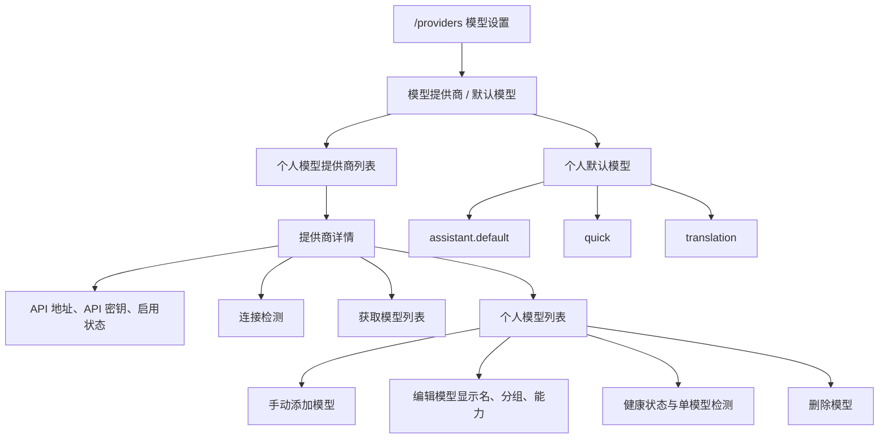
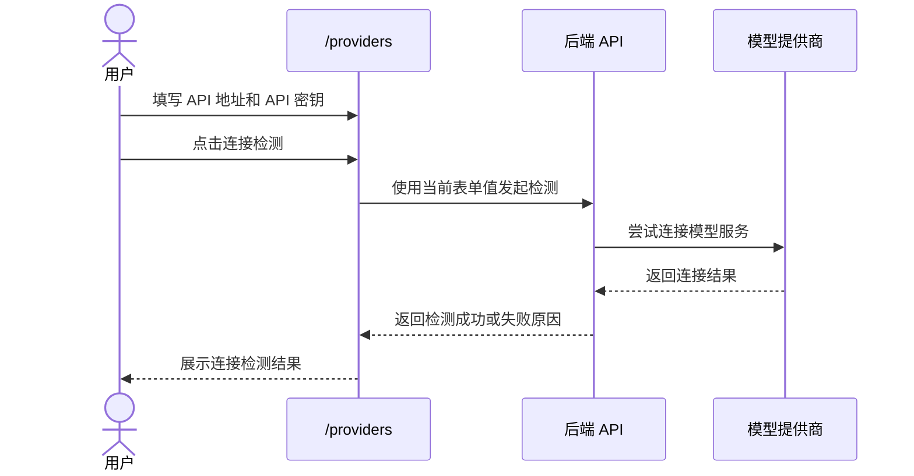
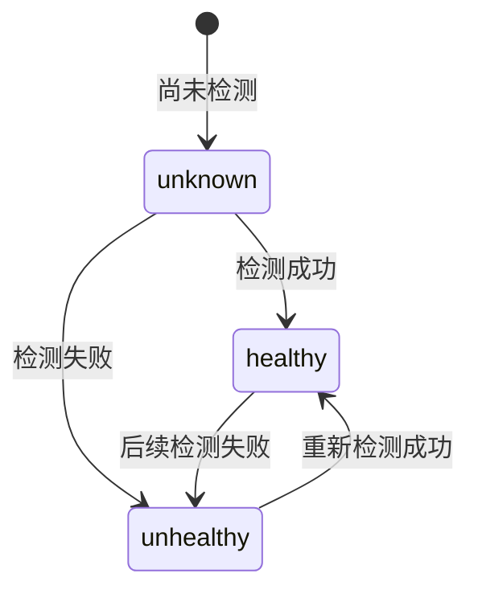
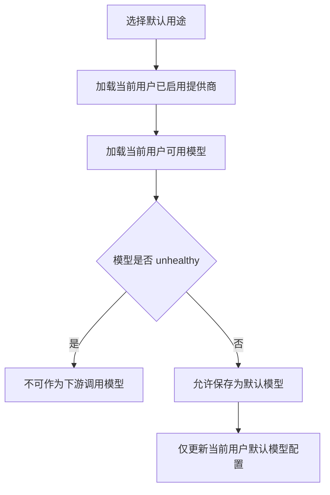
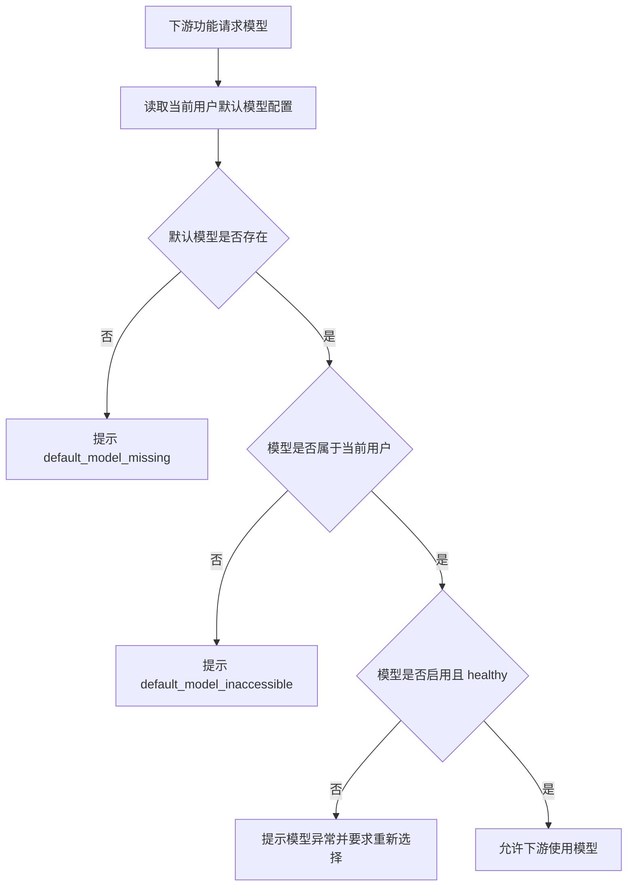

# 用户模型管理产品规格
> 本文档是 S1 产品事实源，用于定义 AI 聊天特性的产品语义、领域模型、业务规则、用户故事和端呈现策略。
>
> 本文档中的 Mermaid 图用于辅助理解复杂流程、状态变化、角色可见性和交互时序。图与文字描述应被视为同一事实集合；若存在不一致，应修正文档后再进入实现。

## 1. 功能说明

用户模型管理用于维护当前用户个人范围内的模型提供商、API 密钥引用、模型清单、模型能力标签、模型健康状态和默认用途模型。

本功能的核心事实是：模型配置属于当前用户个人范围，不是平台级共享能力。一个用户的提供商、模型、默认模型和密钥配置不得被其他用户读取、复用、修改或删除。

## 2. 核心数据模型

本文档中的数据模型是 S1 领域模型，仅表达产品语义和逻辑字段，不等同于 OpenAPI DTO、SQL schema 或后端 ORM。

### UserModelProvider（用户模型提供商）

| 字段           | 类型                | 必填 | 说明                                       |
| ------------ | ----------------- | -- | ---------------------------------------- |
| id           | string            | 是  | 当前用户范围内的提供商唯一标识                          |
| ownerUserId  | string            | 是  | 所属用户 ID                                  |
| name         | string            | 是  | 提供商名称；当前用户范围内唯一                          |
| providerType | string            | 是  | 提供商类型，例如 OpenAI-compatible、本地服务或其他模型服务类型 |
| apiBaseUrl   | string(uri)       | 是  | 模型服务 API 地址                              |
| authType     | string            | 是  | 认证方式                                     |
| apiKeyRef    | string            | 否  | API 密钥引用；不直接暴露明文                         |
| enabled      | boolean           | 是  | 当前提供商是否启用                                |
| remark       | string            | 否  | 用户个人备注                                   |
| extraConfig  | object            | 否  | 扩展配置                                     |
| createdAt    | string(date-time) | 是  | 创建时间                                     |
| updatedAt    | string(date-time) | 是  | 更新时间                                     |

### UserProviderModel（用户提供商模型）

| 字段                | 类型                | 必填 | 说明                                                 |
| ----------------- | ----------------- | -- | -------------------------------------------------- |
| id                | string            | 是  | 当前用户范围内的模型唯一标识                                     |
| ownerUserId       | string            | 是  | 所属用户 ID                                            |
| providerId        | string            | 是  | 所属用户模型提供商 ID                                       |
| model             | string            | 是  | 远端模型标识；同一当前用户提供商下唯一                                |
| displayName       | string            | 是  | 模型显示名称；同一当前用户提供商下唯一                                |
| group             | string            | 否  | 模型分组                                               |
| capabilities      | array of string   | 否  | 能力标签，例如 vision、web、reasoning、tool、rerank、embedding |
| supportsStreaming | boolean           | 是  | 是否支持流式输出                                           |
| healthStatus      | enum              | 是  | 模型健康状态：unknown、healthy、unhealthy                   |
| healthReason      | string            | 否  | 最近一次健康检测原因                                         |
| enabled           | boolean           | 是  | 模型是否启用                                             |
| lastCheckedAt     | string(date-time) | 否  | 最近一次检测时间                                           |
| createdAt         | string(date-time) | 是  | 创建时间                                               |
| updatedAt         | string(date-time) | 是  | 更新时间                                               |

### UserDefaultModelConfig（用户默认模型配置）

| 字段          | 类型                | 必填 | 说明                                       |
| ----------- | ----------------- | -- | ---------------------------------------- |
| ownerUserId | string            | 是  | 所属用户 ID                                  |
| usage       | enum              | 是  | 默认用途：assistant.default、quick、translation |
| providerId  | string            | 是  | 默认模型所属提供商 ID                             |
| modelId     | string            | 是  | 默认模型 ID                                  |
| updatedAt   | string(date-time) | 是  | 更新时间                                     |

### ModelHealthCheck（模型连接检测）

| 字段         | 类型                | 必填 | 说明                     |
| ---------- | ----------------- | -- | ---------------------- |
| targetType | enum              | 是  | 检测对象：provider、model    |
| providerId | string            | 是  | 被检测的提供商 ID             |
| modelId    | string            | 否  | 被检测的模型 ID              |
| status     | enum              | 是  | 检测结果：healthy、unhealthy |
| reason     | string            | 否  | 失败原因或状态说明              |
| checkedAt  | string(date-time) | 是  | 检测时间                   |

---

## 3. 业务规则

* **BR-USER-MODEL-01** 访问 `/providers` 依赖系统基础登录态。
* **BR-USER-MODEL-02** 模型提供商、模型清单、默认模型配置和 API 密钥引用均属于当前用户个人范围。
* **BR-USER-MODEL-03** 用户只能读取、创建、修改和删除自己的模型提供商、模型清单和默认模型配置。
* **BR-USER-MODEL-04** 一个用户的模型配置不得被其他用户读取、复用、修改或删除。
* **BR-USER-MODEL-05** 提供商名称在当前用户范围内不能重复；不同用户可以使用相同提供商名称。
* **BR-USER-MODEL-06** 提供商启用状态只影响当前用户自己的模型可用性。
* **BR-USER-MODEL-07** 删除提供商时，需要同时清理当前用户范围内该提供商下的模型和默认模型绑定。
* **BR-USER-MODEL-08** API 密钥可以在 UI 中显示或隐藏；连接检测可以使用当前表单输入值，不要求先保存。
* **BR-USER-MODEL-09** 连接检测失败时，需要给出明确错误，不应静默失败。
* **BR-USER-MODEL-10** 远端模型同步只向当前用户自己的提供商发起请求，并写入当前用户自己的模型清单。
* **BR-USER-MODEL-11** 用户可以手动添加模型，手动添加时模型标识不能为空。
* **BR-USER-MODEL-12** 模型显示名和模型标识在同一当前用户提供商下不能重复；不同用户之间不冲突。
* **BR-USER-MODEL-13** 能力标签用于下游功能筛选，至少包括 vision、web、reasoning、tool、rerank、embedding。
* **BR-USER-MODEL-14** 流式支持标记用于下游判断是否可以使用 stream。
* **BR-USER-MODEL-15** 模型健康状态包括 unknown、healthy、unhealthy。
* **BR-USER-MODEL-16** unknown 表示尚未检测；healthy 表示最近一次检测可连接；unhealthy 表示认证失败、超时、远端模型不存在或服务不可用。
* **BR-USER-MODEL-17** 页面需要用灰色、绿色、红色状态图标分别提示 unknown、healthy、unhealthy。
* **BR-USER-MODEL-18** unhealthy 模型必须展示异常原因。
* **BR-USER-MODEL-19** 单模型检测只检测该模型，不触发真实生成；检测完成后刷新该模型健康状态。
* **BR-USER-MODEL-20** 系统需要异步周期性检测当前用户模型连接健康状态，默认周期为 30 秒。
* **BR-USER-MODEL-21** 周期性检测是后台异步能力，不阻塞用户浏览模型列表。
* **BR-USER-MODEL-22** 删除模型时，需要清理当前用户范围内引用该模型的默认模型绑定。
* **BR-USER-MODEL-23** 默认用途包括 assistant.default、quick、translation。
* **BR-USER-MODEL-24** 默认模型候选只来自当前用户已启用提供商下的模型。
* **BR-USER-MODEL-25** 保存默认模型只影响当前用户。
* **BR-USER-MODEL-26** AI 聊天、翻译、快捷任务等功能读取模型时，只能读取当前用户自己的已启用模型和个人默认模型配置。
* **BR-USER-MODEL-27** unhealthy 模型不得被下游选中或调用。
* **BR-USER-MODEL-28** 未配置默认翻译模型时，下游翻译入口不得静默 fallback 到其他用户或平台模型。
* **BR-USER-MODEL-29** 默认模型如果变为 unhealthy，下游翻译或快捷任务必须提示模型异常，并要求用户修复或重新选择模型。
* **BR-USER-MODEL-30** canWrite=false 时，页面可展示当前用户已有配置，但禁用新增、保存、删除、同步和默认模型切换等写操作。
* **BR-USER-MODEL-31** 用户级模型管理不引入 platform.manage 或平台管理员共享语义。

---

## 4. 用户故事

### US-USER-MODEL-01 查看个人模型提供商

用户可以进入 `/providers` 查看自己的模型提供商列表，并按名称、类型或 API 地址搜索。

列表只展示当前用户自己的提供商。搜索也只作用于当前用户自己的提供商集合。

### US-USER-MODEL-02 添加模型提供商

用户可以添加模型提供商，填写名称、类型、API 地址、认证方式、API 密钥引用、启用状态和扩展配置。

添加提供商时，名称在当前用户范围内不能重复。

### US-USER-MODEL-03 编辑模型提供商

用户可以编辑自己的提供商名称、类型、API 地址、API 密钥、启用状态和备注。

提供商启用状态只影响当前用户自己的模型可用性。

### US-USER-MODEL-04 删除模型提供商

用户可以删除自己的模型提供商。

删除提供商时，需要同时清理当前用户范围内该提供商下的模型和默认模型绑定。

### US-USER-MODEL-05 提供商连接检测

用户可以在保存前使用当前表单中的 API 地址和 API 密钥执行连接检测。

连接检测失败时，页面需要展示明确错误。连接检测可以使用当前输入值，不要求先保存。

### US-USER-MODEL-06 同步远端模型清单

用户可以从远端模型服务同步自己的模型清单。

远端同步只向当前用户自己的提供商发起请求，并写入当前用户自己的模型清单。

### US-USER-MODEL-07 手动添加模型

用户可以手动添加模型。

手动添加时，模型标识不能为空。模型显示名和模型标识在同一当前用户提供商下不能重复。

### US-USER-MODEL-08 编辑模型信息

用户可以编辑自己的模型显示名、分组、能力标签和流式支持标记。

能力标签用于下游筛选，流式支持标记用于下游判断是否可使用 stream。

### US-USER-MODEL-09 查看模型健康状态

用户可以在模型列表中查看模型健康状态。

健康状态包括 unknown、healthy、unhealthy。页面使用灰色、绿色、红色状态图标提示。unhealthy 模型必须展示异常原因。

### US-USER-MODEL-10 检测单个模型

用户可以对单个模型立即发起连接检测。

单模型检测只检测该模型，不触发真实生成。检测完成后刷新该模型的健康状态和失败原因。

### US-USER-MODEL-11 删除模型

用户可以删除自己的模型。

删除模型时，需要清理当前用户范围内引用该模型的默认模型绑定。

### US-USER-MODEL-12 设置默认模型

用户可以为 assistant.default、quick、translation 设置自己的默认模型。

默认模型候选只来自当前用户已启用提供商下的模型。保存默认模型只影响当前用户。

### US-USER-MODEL-13 下游功能读取用户模型

AI 聊天、翻译、快捷任务等功能读取模型时，只能读取当前用户自己的已启用模型和个人默认模型配置。

不健康模型不得被下游选中或调用。未配置默认翻译模型时，下游翻译入口不得静默 fallback 到其他用户或平台模型。

### US-USER-MODEL-14 只读状态下查看模型配置

当 canWrite=false 时，用户可以查看当前用户已有配置，但新增、保存、删除、同步和默认模型切换等写操作需要被禁用。

---

## 6. 页面结构

---

## 7. 关键流程图

### 7.1 提供商连接检测

### 7.2 模型健康状态

### 7.3 默认模型选择

### 7.4 下游模型读取

---

## 8. 功能适配矩阵

| 功能                        | Web |微信小程序 | 移动 App | 浏览器插件 |
| ------------------------- | --- |-----------|---------|------------|
| 查看个人模型提供商列表               | ✅   | — | — | — |
| 搜索个人模型提供商                 | ✅   | — | — | — |
| 添加模型提供商                   | ✅  | — | — | — |
| 编辑模型提供商                   | ✅  | — | — | — |
| 删除模型提供商                   | ✅  | — | — | — |
| 提供商连接检测                   | ✅  | — | — | — |
| 同步远端模型清单                  | ✅  | — | — | — |
| 手动添加模型                    | ✅  | — | — | — |
| 编辑模型信息                    | ✅   | — | — | — |
| 查看模型健康状态                  | ✅   | — | — | — |
| 单模型立即检测                   | ✅ | — | — | — |
| 删除模型                      | ✅   | — | — | — |
| 设置 assistant.default 推荐模型 | ✅  | — | — | — |
| 设置 quick 快捷默认模型             | ✅  | — | — | — |
| 设置翻译默认模型       | ✅  | — | — | — |

---

## 11. 待确认问题

暂无。
