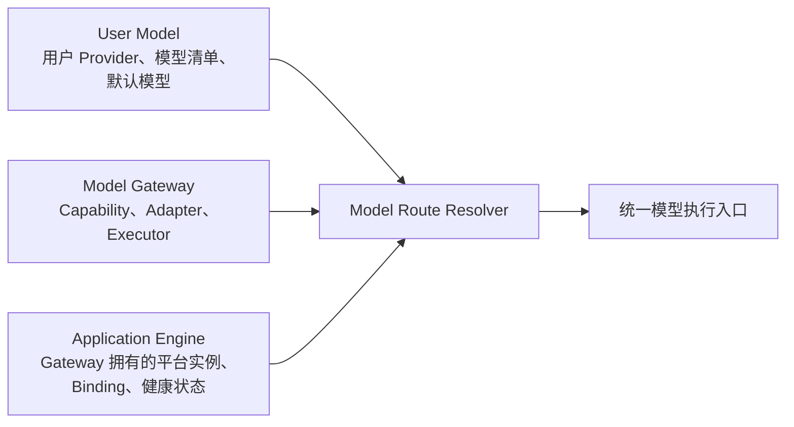
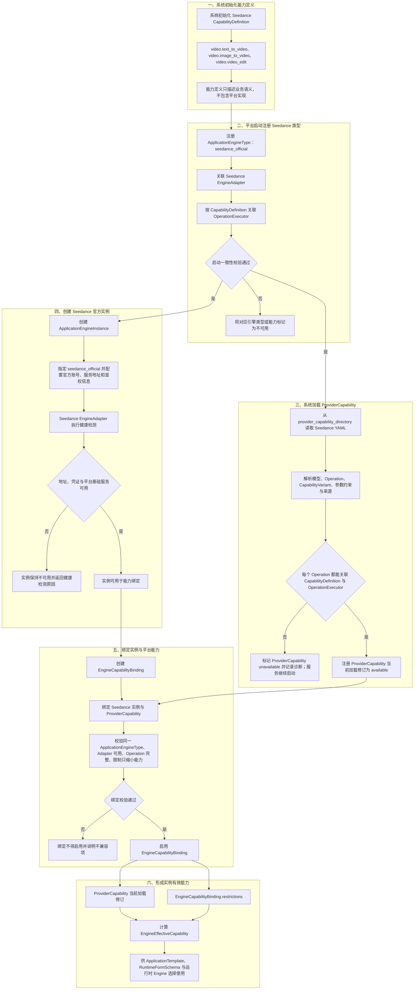

# OmniMAM Model Gateway、能力注册与执行引擎功能设计

> 文档状态：迁移草稿
>
> 本文从 `application-platform` 原样迁移 Gateway 核心产品事实，不改变既有术语、业务行为、BR/US/AC 编号或兼容标识。

## 1. 文档目的

本文定义 OmniMAM Model Gateway 的平台能力目录、执行引擎、适配器、操作执行器、健康检测与 ComfyUI 当前 `object_info` 产品语义。

本领域拥有：

* 能力定义 `CapabilityDefinition`
* 引擎提供商能力 `ProviderCapability`
* 引擎实例与能力绑定 `EngineCapabilityBinding`
* 引擎适配器 `EngineAdapter`
* 操作执行器 `OperationExecutor`
* 执行引擎类型 `ApplicationEngineType`
* 执行引擎实例 `ApplicationEngineInstance`
* Runtime Registry
* Engine 健康检测与 ComfyUI 当前 `object_info`
* 稳定 `providerType` 到 Adapter 的只读映射
* 用户 Provider 的连接测试、模型发现、模型探测与能力解析实现
* `PlatformEngineTarget`、`UserModelTarget` 的统一 Operation 执行入口

本领域与直接协作领域的最终职责如下：

| 能力 | 最终归属 |
| --- | --- |
| `ApplicationEngineInstance`、`EngineCapabilityBinding`、平台健康状态 | `modelgateway` |
| Provider Adapter、模型发现、模型探测、Operation 执行实现 | `modelgateway` |
| 用户 Provider、模型清单、默认模型、用户模型健康事实 | `user-model` |
| 用户模型 owner、启用状态、默认值和使用资格校验 | `user-model` |
| `ApplicationRun` 编排与执行快照 | `application-platform` |
| AI Chat `GenerationRun` 生命周期 | `ai-chatting` |



## 2. 领域边界

`modelgateway` 不拥有 `ApplicationExecutor`、ComfyUIWorkflow、ApplicationTemplate、Application、ApplicationVersion、RuntimeFormSchema、ApplicationRun、GenerationRun、Canvas、AtomicTask、Artifact 或 Asset。上述应用与运行对象继续由原领域维护，并通过稳定 ID、只读投影和受控模块边界消费本领域事实。

Gateway 不保存用户 Provider、用户模型、默认配置或用户模型健康事实，不读取 `user-model` 私有表，也不把用户 Provider 转换为 `ApplicationEngineInstance`。User Model 负责 owner、enabled、health、默认值和使用资格校验；Gateway 只接受受信任 User Model 签发的请求级执行上下文。

## 3. 迁移兼容原则

本次迁移保留 `AIAPP` 业务编号、`aiapp.*` 权限码、`ERR_AIAPP_*` 错误码、`aiapp_*` 设计态表名、现有 API 路径和调度 key。领域归属变化不得被解释为对象重命名、Wire Contract 变更或持久化迁移。

## 4. 核心领域对象

### 4.1 CapabilityDefinition
`CapabilityDefinition` 表示 OmniMAM 内部统一的业务能力分类。
它回答：
> 这个应用在业务上完成什么事情？

示例：

```yaml
id: image.text_to_image
name: 文生图

```

常见能力标识：

```text
video.text_to_video
video.image_to_video
video.video_edit
video.extend
video.interpolate

image.generate
image.edit
image.upscale
image.relight
image.change_camera_angle
image.remove_background
image.describe

text.generate
text.rewrite
text.translate
text.summarize

audio.text_to_speech
audio.speech_to_text
audio.voice_clone
```

主要用途:
* 应用分类；
* 应用市场筛选；
* 权限管理；
* 统计；
* 画布节点分类；
* 基础输入输出语义识别。

它由系统初始化数据提供。`CapabilityDefinition` 只描述能力定义，不包含任何实现细节。
`ApplicationEngineType` 会声明支持哪些 `CapabilityDefinition`，并关联对应的 `OperationExecutor`。

---

### 4.2 ApplicationEngineType

`ApplicationEngineType` 表示一类执行平台。比如Seedance、RunningHub、ComfyUI等。

支持EngineType：
```text
comfyui
runninghub
seedance_official
local_llm
openai_image
openai_compatible
runninghub
generic_sync_http
generic_async_http
```

ApplicationEngineType的结构通常为:
```
id: engine_type_volcengine_modelark
code: volcengine_modelark
name: 火山方舟 ModelArk
enabled: true
```

一个 `ApplicationEngineType` 通常对应一个 `EngineAdapter`，并关联多个该类型支持的 `OperationExecutor`。
`ApplicationEngineType` 是平台内置的类型定义。平台启用一种引擎类型前，必须明确：

1. 支持哪些 `ApplicationEngineType`；
2. 每种类型使用哪个 `EngineAdapter`；
3. 每种类型支持哪些 `OperationExecutor`；
4. 每种类型支持哪些鉴权和配置字段。

这些内置事实由只读 Runtime Registry 提供。Registry 至少登记：

* `CapabilityDefinition`；
* `ApplicationEngineType`；
* `EngineAdapter`；
* `OperationExecutor`；
* EngineType 支持的鉴权结构；
* EngineType、Adapter、CapabilityDefinition 和 OperationExecutor 的映射。

ProviderCapability 中引用的 `application_engine_type_id` 和 `capability_definition_id` 必须能在同一 Registry 中解析。当前内置范围至少包含 `comfyui`、`byteplus_modelark`、`deepseek_official`，以及 `video.text_to_video`、`video.image_to_video`、`video.video_edit`、`text.chat_completion` 等相应能力定义。Registry 与 ProviderCapability 都是只读启动事实，不由管理员通过 API 修改。

#### 4.2.1 注册 ApplicationEngineType

平台启动时应加载所有受支持的 `ApplicationEngineType`，并建立引擎类型、适配器和操作执行器之间的关联。

火山方舟类型的声明式注册示例：

```yaml
application_engine_type: volcengine_modelark
engine_adapter: volcengine_modelark
operation_executors:
  image.text_to_image: volcengine_image_generation
  video.text_to_video: volcengine_text_to_video
  video.image_to_video: volcengine_image_to_video
  video.video_edit: volcengine_video_edit
```

ComfyUI 类型的声明式注册示例：

```yaml
application_engine_type: comfyui
engine_adapter: comfyui
operation_executors:
  image.text_to_image: comfyui_workflow
  image.image_edit: comfyui_workflow
  image.upscale: comfyui_workflow
  video.text_to_video: comfyui_workflow
  video.image_to_video: comfyui_workflow
```
这里多个 ComfyUI CapabilityDefinition 可以复用同一个 Workflow OperationExecutor，因为它们最终都通过标准 ComfyUI Workflow 执行。

#### 4.2.2 一致性校验
平台加载引擎类型时检查：

* `ApplicationEngineType` 是否存在 `EngineAdapter`；
* `ProviderCapability` 中允许使用的 capability 是否存在对应的 `OperationExecutor`。

关联缺失时，平台应明确加载失败，或将对应引擎类型及能力标记为不可用。

例如：
engine_type = volcengine_modelark
capability = video.text_to_video
但平台未关联 `video.text_to_video` 对应的 `OperationExecutor`，则不能允许管理员启用相应 `ProviderCapability`。

---

### 4.3 ProviderCapability
`ProviderCapability` 表示引擎可绑定的平台能力，并通过 `revision` 标识其修订。
它回答：
> 某个 ApplicationEngineType / Provider 提供哪类能力事实，以及引擎如何绑定该事实。

例如 Seedance 用来描述 Seedance 官方平台提供的文生视频、图生视频、视频编辑能力，对应的模型列表为 Pro 和 Flash，并定义相应的参数约束。
如果有其他 Seedance 模型的代理平台或中转站，也应定义对应的 `ProviderCapability`。
ProviderCapability 具有三个相互独立的维度：

| 字段 | 取值 | 产品语义 |
| --- | --- | --- |
| `kind` | `catalog`、`engine_binding` | `catalog` 提供模型、Operation、Variant 与参数目录；`engine_binding` 只标识引擎基础运行时身份，不虚构模型目录。 |
| `origin` | `builtin`、`directory` | `builtin` 编译进服务并由加载器派生；`directory` 来自外部能力目录。外部文件不能声明或覆盖 `builtin`。 |
| `binding_policy` | `manual`、`required_immutable` | `manual` 由管理员维护绑定；`required_immutable` 由系统为匹配类型的全部实例维护且不可修改。 |

ComfyUI 使用 `engine_binding + builtin + required_immutable` 的 `comfyui-workflow-runtime`。它只标识 ComfyUI EngineInstance 的基础运行时身份；具体模板和运行能力仍来自 API Workflow、workflow contract、人工映射与目标实例当前 `object_info`，不得把该绑定专用能力当作 Provider 模型目录。

`ProviderCapability` 由系统在启动时从只读 YAML 文件加载。文件是平台能力的唯一事实源，不同步为数据库资源，也不提供导入、创建、更新、启用、删除或热加载 API。管理员可以查看能力与加载诊断，但不能通过管理端修改能力内容。运行、绑定和模板解析所使用的“当前有效能力”，均指只读注册表中状态为 `available` 的当前加载修订。

系统先加载编译进服务的 `builtin` 清单，再使用单一配置项 `provider_capability_directory` 加载 `directory` 清单，默认目录为 `./provider-capabilities`。目录加载器只读取第一层的 `.yaml` 或 `.yml` 普通文件，不递归扫描。目录中的文件修改后必须重启服务才会生效。

每个文件按原子单元加载。内置清单属于服务正确启动的强制契约，结构或语义校验失败必须阻止启动；目录清单的 YAML、Schema、模型、Operation、Variant、来源、`ApplicationEngineType`、`EngineAdapter` 或 `OperationExecutor` 任一校验失败时，只将对应能力标记为 `unavailable`。多个目录文件声明同一普通 ID 时所有冲突项均不可用；目录文件声明内置保留 ID 时只隔离目录文件，不能覆盖或使内置能力失效。目录缺失或不可读时服务继续启动且注册表为 `degraded`，内置能力仍然可用。

ProviderCapability 运行状态统一为：

```text
available    文件启用且全部校验通过
disabled     文件显式设置 enabled: false
unavailable  文件加载、一致性或执行能力校验失败
```

`availability`、失败原因、加载时间和来源文件路径属于运行态诊断，不得写回 YAML。

它描述：

* 当前支持哪些模型
* 当前支持哪些操作
* 每个模型支持哪些操作
* 每个有效组合支持哪些参数
* 参数范围
* 参数枚举
* 输入素材数量限制
* 输入素材类型
* 输出类型
* 模型生命周期
* 兼容的业务能力契约
* 能力信息来源说明

示例：

```yaml
id: seedance-official
name: Seedance 官方能力
application_engine_type_id: seedance_official
revision: 3
enabled: true
models:
  - id: pro
    provider_model_id: seedance-2-pro
    name: Pro
    enabled: true
  - id: flash
    provider_model_id: seedance-2-flash
    name: Flash
    enabled: true
operations:
  - id: text_to_video
    capability_definition_id: video.text_to_video
  - id: image_to_video
    capability_definition_id: video.image_to_video

variants:
  - operation: text_to_video
    model_id: pro
    constraints:
      resolution:
        enum: [720p, 1080p, 2k, 4k]
      duration:
        enum: [5, 10, 15, 20, 25]
  - operation: text_to_video
    model_id: flash
    constraints:
      resolution:
        enum: [720p, 1080p]
      duration:
        minimum: 5
        maximum: 15
```


加载 `ProviderCapability` 时，需要检测 `capability_definition` 对应的 `OperationExecutor` 是否存在。
如果不存在，应将该能力标记为不可用，并提示：“该 `CapabilityDefinition` 对应的 `OperationExecutor` 不存在。”
`ProviderCapability` 不能绕过平台已经具备的执行能力。

---

### 4.4 ApplicationEngineInstance

`ApplicationEngineInstance` 表示某个平台的真实账号和调用环境，例如“Seedance 官方平台测试账号”“RunningHub 平台生产环境账号”“ComfyUI-15.48”等。
`ApplicationEngineInstance` 需要指定 `ApplicationEngineType`。平台根据 `ApplicationEngineType` 选择对应的 `EngineAdapter`，并周期性进行健康检测。
健康检测只验证：
地址可访问；
凭证基本有效；
平台基础服务可以响应。

Task Center 在启动时以全局唯一 `system_key=application-platform.engine-health` 幂等确保一个 SYSTEM RECONCILE TaskSchedule，默认使用六段 cron `*/30 * * * * *` 和 `UTC`。巡检器按稳定 EngineInstance ID checkpoint 分批读取 `enabled=true` 实例；禁用实例保留最后一次健康事实。每轮不创建 Planner DAGTaskGroup 或健康 AtomicTask，默认最多并发 16、扫描 1000 项、单实例最多 4 秒、整轮最多 5 秒；上一轮未终态时记录 `SKIPPED_OVERLAP`。

管理员可暂停、恢复计划，并配置六段 cron、时区、并发 1..64、单轮上限 1..1000、单项超时 1..30 秒和整轮超时 1..300 秒；整轮超时不得小于单项超时。系统计划不能由用户创建或删除，配置更新立即同步到调度运行时，服务重启不得覆盖已保存值。

每次完成并成功保存的检测都必须更新 `last_health_check_at`。检测成功时状态为 `online` 并清空旧失败原因；网络失败、超时或上游不可用时状态为 `offline`；适配器缺失、空结果或非法协议结果时状态为 `degraded`。失败原因必须保存为不含凭证、请求 Header、签名、完整 URL 或未经处理上游载荷的安全摘要，并同时通过实例列表、实例详情和手动检测结果返回；摘要最多保留 512 个 UTF-8 字符。

多 API Server 副本按“到期实例筛选 + resource version 乐观锁”尽力去重。允许少量重复外部探测，但旧版本结果不得覆盖已经提交的新健康事实。只有健康状态发生变化且检测结果成功落库后，才发布健康状态变化事件；仅检测时间或失败原因变化不重复发布状态变化事件。

管理员可以通过 `EngineCapabilityBinding` 将 `ProviderCapability` 绑定到 `ApplicationEngineInstance`。

```yaml
id: comfyui-5090d-01
application_engine_type_id: comfyui
base_url: http://10.0.0.20:8188
auth_type: none # 验证方式支持 none、api_key、bearer_token、ak_sk
enabled: true # 是否激活
health_status: online # 健康状态
last_health_check_time: 2023-08-01T12:00:00Z # 最后健康检查时间
```

SaaS 示例：

```yaml
id: volcengine-seedance-prod
application_engine_type_id: volcengine_seedance
base_url: https://example.volces.com
auth_type: api_key
auth_config:
  api_key: 1234567890abcdef1234567890abcdef
status: online
enabled: true # 是否激活
health_status: online # 健康状态
last_health_check_time: 2023-08-01T12:00:00Z # 最后健康检查时间
region: cn-beijing # 区域
runtime:
    max_concurrency: 4
    request_timeout_seconds: 60 # 请求超时时间
    task_timeout_seconds: 1800 # 任务超时时间
```

ApplicationEngineInstance 保存：

* base URL
* 验证方式
* 网络配置
* 激活状态
* 健康状态
* 能力绑定

`auth_type` 与 `auth_config` 是严格匹配的联合配置：

* `none`：必须省略 `auth_config`；
* `api_key`：`auth_config` 只能包含必填的非空字符串 `api_key`；
* `bearer_token`：`auth_config` 只能包含必填的非空字符串 `bearer_token`；
* `ak_sk`：`auth_config` 只能包含必填的非空字符串 `access_key` 和 `secret_key`。

创建实例时必须按照所选 `auth_type` 提交对应配置。更新实例时，普通字段可以独立更新；一旦更新鉴权方式或凭证，必须同时提交 `auth_type` 与匹配的 `auth_config`，其中切换为 `none` 时只提交 `auth_type`。缺少必填凭证、提交未知字段、配置与类型不匹配，或选择 `ApplicationEngineType` 不支持的鉴权方式时，均视为鉴权配置无效。

原则：

> 连接到哪里由 ApplicationEngineInstance 决定。


### 4.5 EngineAdapter

`EngineAdapter` 负责某类具体平台的协议转换，只负责平台级能力。比如火山引擎、RunningHub、ComfyUI、Seedance等。
它描述平台级交互职责，不是管理员维护的业务能力数据。

它负责：
* 建立与外部平台的连接；
* 处理鉴权、令牌和签名；
* 处理平台公共请求信息和服务地址；
* 解析平台公共失败结果；
* 关联请求追踪信息；
* 处理文件上传公共流程；
* 执行平台级健康检测。

不负责：
* image.text_to_image
* video.image_to_video

产品语义上的输入和结果为：

```text
健康检测：ApplicationEngineInstance → 健康状态或不可用原因
素材上传：ApplicationEngineInstance + Asset → 外部平台素材引用或上传失败原因
平台交互：ApplicationEngineInstance + 标准化操作请求 → 外部平台响应或公共失败原因
```

`EngineAdapter` 可以固化外部平台协议中稳定的技术约定：

* 外部平台操作入口
* 外部平台调用方式
* 鉴权方式
* 请求字段名
* 响应字段名
* 上传流程
* 任务轮询流程
* 状态映射
* 失败类型映射

`EngineAdapter` 不得固化管理员需要持续维护的能力事实：

* 当前有哪些模型
* 某模型是否 active
* 最大分辨率
* 最大时长
* 某个模型支持哪些操作
* 某个模型是否已经下架

这些必须通过系统从目录加载的 `ProviderCapability` 提供。

---

### 4.6 OperationExecutor
`OperationExecutor` 定义：
> 一个具体业务能力操作在某个平台上的执行实现

例如 Seedance 提供文生视频能力时，`OperationExecutor` 需要表达该平台如何接收标准文生视频参数、如何提交任务、如何解释任务状态、如何取消任务以及如何提取输出。

`OperationExecutor` 负责：
* 操作参数校验；
* 将标准操作参数转换为外部平台请求；
* 同步或异步任务模式；
* 任务 ID 提取；
* 任务状态查询；
* 状态映射；
* 输出提取；
* 取消方式。

例如火山引擎支持 `image.text_to_image`、`video.image_to_video`、`audio.text_to_speech` 时，需要为这三项能力关联对应的 `OperationExecutor`：

```yaml
application_engine_type: volcengine_modelark
operations:
  image.text_to_image: image_generation
  video.image_to_video: video_generation
  audio.text_to_speech: speech_generation
```

每个 `OperationExecutor` 对外保持一致的产品语义：

```text
校验：标准操作参数 → 合法或失败原因
提交：有效标准操作参数 → 外部平台任务引用或提交失败原因
查询：外部平台任务引用 → 归一化任务状态
取消：外部平台任务引用 → 取消结果
提取：外部平台完成结果 → Artifact 集合或结果解析失败原因
```


### 4.7 EngineCapabilityBinding
`EngineCapabilityBinding` 将一个 `ApplicationEngineInstance` 绑定到一个 `ProviderCapability`。
用来表示：
> engine_volcengine_prod 使用 provider_capability_volcengine_ai 描述的能力。

例如：

```yaml
id: binding_volcengine_prod_ai
application_engine_instance_id: volcengine_account_a
provider_capability_id: provider_capability_volcengine_ai
enabled: true
```

同一个 `ProviderCapability` 可以绑定多个兼容的 `ApplicationEngineInstance`。

例如：

```text
Seedance 官方生产账号
Seedance 官方测试账号
Seedance 官方美国区域账号
```

`EngineCapabilityBinding` 可以进行进一步限制，但不得扩张能力。

例如 `ProviderCapability` 支持 4K，但某个账号暂时只允许 2K：

```yaml
restrictions:
  disabled_values:
    resolution:
      - 4k

  max_constraints:
    duration: 20
```

最终有效能力：

```text
EngineEffectiveCapability
=
ProviderCapability 当前加载修订
∩ EngineCapabilityBinding.restrictions
```

#### 4.7.1 绑定检验

创建绑定时平台检查：
`ApplicationEngineInstance` 是否存在。
`ProviderCapability` 是否存在。
两者是否属于相同 `ApplicationEngineType`。
对应 `EngineAdapter` 是否可用。
`ProviderCapability` 中每项 Operation 是否有 `OperationExecutor`。
限制是否只缩小能力。

任一条件不满足时，绑定不得启用，并向管理员说明不兼容项或缺失能力。

不允许通过 `EngineCapabilityBinding` 增加 `ProviderCapability` 中不存在的模型或参数。

#### 4.7.2 系统必需绑定

`binding_policy=required_immutable` 的能力不进入管理员绑定流程。系统为相同 `ApplicationEngineType` 的全部现有及新建实例维护唯一绑定，绑定固定启用且 restrictions 为空。新建实例与绑定必须同事务提交；服务启动时幂等补齐或更新既有绑定，多副本并发依靠唯一约束收敛。

管理员不能创建、修改、禁用或删除系统绑定。删除没有历史运行引用的 EngineInstance 时，系统绑定作为实例从属资源级联删除。`system_managed` 是根据当前 ProviderCapability `binding_policy` 派生的只读状态，不单独成为数据库事实。

ComfyUI 固定使用该策略，但此绑定不表示具体工作流支持哪些节点、模型或参数，也不改变 workflow contract 与当前 object_info 的运行校验职责。

#### 4.7.3 Seedance 能力注册与实例绑定完整流程

下图展示 Seedance 业务能力从系统初始化、平台启动注册、目录加载平台能力，到创建官方实例并形成有效能力的完整链路。`CapabilityDefinition` 定义业务语义，`OperationExecutor` 提供对应操作的执行能力，`ProviderCapability` 只有在文件与执行依赖全部校验通过时才可用。



引擎类型注册成功后，加载 `ProviderCapability` 与创建 `ApplicationEngineInstance` 可以独立进行，但启用绑定必须同时具备状态为 `available` 的加载修订和健康可用的实例。注册失败时不会通过配置补足执行能力；能力校验失败时只将对应能力标记为不可用，不阻止服务启动；健康检测失败时实例不可用于绑定；绑定校验失败时不能形成 `EngineEffectiveCapability`。

---

### 4.8 ProviderType 与 UserModelTarget

Runtime Registry 为 User Model 提供稳定 `providerType` 目录。每个 ProviderType 声明显示名称、认证类型、非敏感配置 Schema、是否支持模型发现和是否支持模型探测，并在 Gateway 内部映射到一个已注册 Adapter。ProviderType 的公共投影不得返回 `adapter_id`、`operation_executor_id` 或实现类名。

用户选择和保存的是 `providerType`，不是 Adapter。请求中的任意 Adapter ID、Executor ID、Provider 地址或凭证明文都不能成为 Gateway 的受信任执行目标。

Gateway 支持两类执行目标：

| 目标 | 来源 | 事实归属 | Gateway 输入 |
| --- | --- | --- | --- |
| `PlatformEngineTarget` | Application Platform | Gateway EngineInstance、Binding 和平台健康事实 | 稳定 Engine/Binding/能力 ID 与 revision |
| `UserModelTarget` | User Model | User Model 的用户 Provider、模型、健康与使用资格事实 | 受信任 `UserModelExecutionContext` |

`UserModelExecutionContext` 至少包含 owner、Provider/模型稳定 ID、远端模型标识、ProviderType、CapabilityDefinition ID、配置版本、不透明 `credentialHandle`、签发时间和过期时间。上下文不包含凭证明文；Gateway 只校验签发者、范围、有效期、必需版本和 Registry 映射，不查询 User Model 数据库。

### 4.9 Model Route Resolver

Model Route Resolver 将执行目标、CapabilityDefinition 和 Runtime Registry 合成为请求级 `ResolvedModelRoute`：

```text
source_scope: platform | user
provider_ref
model_ref
capability_definition_id
operation_id
executor_id
credential_handle
health_summary
capability_revision
config_version
```

`ResolvedModelRoute` 只在请求内存在，不建表、不提供 CRUD、不形成第三份模型事实。平台目标从 Engine/Binding 解析，用户目标从已校验的 UserModelExecutionContext 解析。

### 4.10 用户模型 Adapter 能力

Gateway 对 User Model 提供四个受控内部能力：

```text
TestProviderConnection
DiscoverProviderModels
ProbeProviderModel
ExecuteOperation
```

Adapter 负责 Provider 协议、base URL 处理、鉴权应用、Header、超时、连接测试、模型发现、模型探测和公共错误归一化；OperationExecutor 负责标准 Operation 输入校验、请求转换、执行、取消和结果归一化。User Model 不实现同类 HTTP 客户端。

用户模型的最终能力按以下交集派生：

```text
Adapter 支持能力
∩ ProviderCapability 或探测结果
∩ 用户启用范围
= 最终可执行能力
```

Gateway 返回派生 `capability_definition_ids`、`stream_supported`、`executable`、`unavailable_reason` 和 `capability_resolution_status`；User Model 将其作为只读投影返回。用户标签不得创建 Registry 未注册的 Operation。

---


## 5. ComfyUI 当前 object_info


每个类型为 `comfyui` 的 `ApplicationEngineInstance` 最多拥有一份当前 `object_info`。该目录是节点能力的唯一持久化事实，随 EngineInstance 删除而级联删除，不维护 checksum、历史版本、递增版本或独立状态机。工作流、兼容性校验、模板版本、试运行和 ApplicationRun 均不得保存 `object_info` 正文或 checksum。

Model Gateway 通过 `application-platform.comfyui-object-info-refresh` SYSTEM RECONCILE 计划每日刷新一次。默认计划使用六段 cron `0 0 3 * * *` 和 `UTC`，只扫描类型为 `comfyui`、`enabled=true` 且 `health_status=online` 的实例。停用、unknown、offline 或 degraded 实例直接跳过，不创建逐实例动作、TaskGroup 或 AtomicTask；轮次只保存 Task Center 允许的轻量扫描摘要。

管理员可以对符合相同资格条件的单个实例手动刷新。刷新成功时必须先完整获取并校验响应，再原子替换该实例当前目录；刷新失败时保留最后一次成功目录，不产生空目录或部分覆盖。定时刷新和手动刷新必须对同一 EngineInstance 串行化，较早请求的结果不得覆盖较新的成功结果。

当前目录使用 `refreshed_at` 计算新鲜度，不另存状态。目录不存在或距最近成功刷新超过 48 小时时视为不可用于解析、普通 Workflow 转换、校验、模板发布、RuntimeFormSchema 和运行；只读接口仍可返回最后一次成功目录并明确 `stale=true`，便于管理员诊断和手动恢复。实例未启用或不健康时，即使存在未过期目录，也不得用于需要实际执行能力的操作。

应用创建者可以在已有 `aiapp.engine_instance.read` 权限边界内读取可见 ComfyUI 实例的当前原始 `object_info`、ComfyUI 版本、刷新时间和派生 stale 标志，但不得读取鉴权配置、内部凭证或修改目录。原始目录响应必须支持标准 HTTP 内容压缩；工作流详情、校验历史、模板详情和运行详情不得重复内嵌同一正文。

---


## 6. 校验与失败隔离

### 6.1 ProviderCapability 注册校验

启动加载时逐文件校验：

* YAML 语法、`schema_version` 和完整字段 Schema 是否有效
* 文件是否位于配置目录第一层且为普通 `.yaml` / `.yml` 文件
* `id` 是否与其他文件重复
* 模型是否存在
* Operation 是否存在
* Variant 是否重复
* 参数约束是否合法
* 默认值是否合法
* 输出是否兼容 CapabilityDefinition
* `OperationExecutor` 是否支持对应的标准操作参数
* 是否提供来源、来源更新时间和人工核验日期

如果对应 `ApplicationEngineType`、`EngineAdapter` 或 `OperationExecutor` 缺失，`ProviderCapability` 标记为 `unavailable` 并向管理员列出缺失项；其他有效文件继续加载，服务继续启动。加载结果不写入数据库，服务运行期间不自动重新加载。

---

### 6.2 启动加载失败与运行隔离

ProviderCapability 加载失败属于能力级降级，不属于服务启动失败。加载器必须保留文件级结果，包括可解析的能力 ID、来源文件、稳定错误码、失败原因和加载时间。若 YAML 无法解析到能力 ID，则以来源文件作为诊断标识。

已存在的 `EngineCapabilityBinding` 不因能力加载失败而删除。能力为 `disabled` 或 `unavailable` 时，绑定不进入 `EngineEffectiveCapability`，RuntimeFormSchema 不暴露其模型和参数，运行提交在调用外部平台前失败。目录平台的 `ApplicationRun` 必须快照实际使用的 `provider_capability_id` 和 `provider_capability_revision`；ComfyUI 的 ApplicationRun 必须保存 `workflow_contract_revision`、实际 API Workflow、参数和输出映射执行快照，但不得保存 `object_info` 正文或 checksum。


## 7. 与 Application Platform 的协作

Application Platform 负责应用语义和 `ApplicationExecutor` 编排。它通过 Model Gateway 解析当前 ProviderCapability、EngineCapabilityBinding 和 EngineInstance 可用性，并调用对应 `OperationExecutor`；Model Gateway 返回归一化状态、失败和输出，Application Platform 继续负责 ApplicationRun 快照、AtomicTask 协作与 Artifact 受控交付。

ComfyUIWorkflow 的导入、解析、兼容性校验、模板转换和试运行仍归 Application Platform。相关流程通过稳定 `engine_instance_id` 读取本领域维护的 EngineInstance 与当前 `object_info`，不得直接复制或修改 Gateway 私有事实。

## 7.1 与 User Model 和 AI Chat 的协作

User Model 保存用户配置与健康事实，并通过稳定 ProviderType 调用 Gateway 的连接测试、模型发现和模型探测能力。Gateway 返回协议无关结果，不持久化这些用户事实，也不发布 `model_health_status_changed`。

AI Chat 继续拥有 GenerationRun 生命周期。每次生成前由 User Model 解析当前用户模型执行上下文，AI Chat 再调用 Gateway `ExecuteOperation`；AI Chat 保存模型 ID、CapabilityDefinition ID、配置版本和非敏感模型快照，Gateway 不创建或更新 GenerationRun。

## 8. 业务规则

1. `BR-AIAPP-130`：`kind=catalog` 的 ProviderCapability YAML 是 SaaS 平台模型、Operation、Variant 和参数约束的唯一能力事实源；`kind=engine_binding` 只表达引擎基础运行时身份，不得虚构模型目录。两类能力均不得同步为管理员可写数据库资源。
2. `BR-AIAPP-131`：系统先加载编译进服务的内置 ProviderCapability，再从 `provider_capability_directory` 指向的单一目录第一层加载 `.yaml`、`.yml` 普通文件；默认目录为 `./provider-capabilities`，不递归、不热加载。
3. `BR-AIAPP-132`：每个文件必须原子校验；任一结构或语义校验失败时整个能力不可用，不允许部分注册。
4. `BR-AIAPP-133`：目录清单的重复 ID 全部不可用；内置 ID 为保留 ID，目录清单不得覆盖，冲突只隔离目录文件。
5. `BR-AIAPP-134`：内置清单无效必须阻止启动；目录或目录文件加载失败不得阻止服务启动，目录级失败使注册表为 `degraded`，但不移除已加载的内置能力。
6. `BR-AIAPP-135`：ProviderCapability 状态只有 `available`、`disabled`、`unavailable`；只有 `available` 可以形成有效绑定、表单选项和运行能力。
7. `BR-AIAPP-136`：管理员只能读取 ProviderCapability 和加载诊断，不得通过 API 导入、创建、更新、启用、删除或重新加载能力。
8. `BR-AIAPP-137`：EngineCapabilityBinding 引用稳定能力 ID；manual 绑定创建、表单解析和运行提交必须重新验证当前注册表状态与修订，required_immutable 绑定由系统按当前内置 revision 自动维护。
10. `BR-AIAPP-139`：运行态 availability、失败原因、加载时间和来源文件不得写回 ProviderCapability YAML 或数据库。
11. `BR-AIAPP-140`：ApplicationEngineType 是系统内置类型；ApplicationEngineInstance 保存真实连接环境，名称必须全局唯一，创建或重命名为已有名称时必须拒绝。创建、更新和健康检测不得改变类型已注册的执行能力。实例的 auth_type 必须属于对应 ApplicationEngineType 支持的鉴权方式，auth_config 必须与 auth_type 严格匹配并拒绝缺失字段、未知字段或跨类型字段；none 必须省略 auth_config，鉴权更新必须成组提交 auth_type 与对应 auth_config。
12. `BR-AIAPP-141`：EngineCapabilityBinding 必须连接相同 ApplicationEngineType 的实例与能力；manual 绑定的 restrictions 只能缩小能力，required_immutable 绑定必须保持 enabled 且 restrictions 为空，不能由管理员创建、修改、禁用或删除。
22. `BR-AIAPP-151`：CapabilityDefinition、ApplicationEngineType、EngineAdapter、OperationExecutor 及映射由只读 Runtime Registry 提供，ProviderCapability 引用必须能在 Registry 中解析。
33. `BR-AIAPP-162`：应用创建者可只读发现允许用于普通 Workflow 转换、解析和校验的 EngineInstance 基础状态，但不得读取 auth_config 或获得实例管理能力；实例写操作仍仅限管理员。
34. `BR-AIAPP-163`：Task Center 必须以 `application-platform.engine-health` SYSTEM RECONCILE TaskSchedule 按默认 30 秒的六段 cron 巡检启用 EngineInstance，每轮不创建 Planner DAGTaskGroup 或健康 AtomicTask。默认最多并发 16、扫描 1000 项、单实例最多 4 秒、整轮最多 5 秒；重叠轮次记录 SKIPPED_OVERLAP。每次成功保存的检测均更新时间和安全失败摘要，resource version 防止旧结果覆盖；禁用实例不检测。管理员可暂停、恢复和编辑安全运行参数，服务重启不覆盖已保存配置。
40. `BR-AIAPP-169`：每个 ComfyUI EngineInstance 最多持有一份当前 object_info；该一对一目录随实例级联删除，不维护 checksum、历史、状态机或递增版本，任何 Workflow、Validation、TemplateVersion、WorkflowTestRun 或 ApplicationRun 均不得复制目录正文或 checksum。
41. `BR-AIAPP-170`：Model Gateway 必须以 `application-platform.comfyui-object-info-refresh` SYSTEM RECONCILE TaskSchedule 每日刷新当前目录，只扫描 enabled、online 的 ComfyUI 实例并跳过其他实例；手动刷新使用相同资格校验，成功原子替换，失败保留最后一次成功目录，同一实例刷新必须串行化。
46. `BR-AIAPP-175`：有 `aiapp.engine_instance.read` 权限的用户可以读取可见 ComfyUI 实例当前原始 object_info、版本和刷新时间；响应必须支持 HTTP 内容压缩，且工作流详情、校验历史、模板和运行响应不得重复内嵌目录正文。
59. `BR-AIAPP-188`：ProviderCapability 的 `kind`、`origin` 和 `binding_policy` 分别表达能力用途、加载来源和绑定策略，三者相互独立；`origin` 只能由加载器派生，外部目录清单不得声明为 builtin。
60. `BR-AIAPP-189`：系统必须提供 `comfyui-workflow-runtime` 内置绑定能力，并为全部现有与新建 comfyui EngineInstance 维护唯一 required_immutable 绑定。新建实例与绑定必须同事务提交；启动回填必须幂等且支持多副本收敛；系统绑定随内置 revision 更新并在实例删除时级联删除。
64. `BR-AIAPP-193`：ApplicationEngineType 的能力选项必须从 `operation_executors` key 派生，并按 key 字典序返回等长的 `zh-CN`、`en-US` 名称数组；客户端只能选择这些 key，不允许手工输入能力 ID。
65. `BR-AIAPP-195`：Runtime Registry 必须提供稳定 `provider_type -> adapter_id` 与 `capability_definition_id -> operation_executor_id` 映射；公共 ProviderType 投影不得暴露内部 Adapter 或 Executor ID。
66. `BR-AIAPP-196`：Gateway 必须统一实现 Provider 协议、鉴权应用、模型发现、模型探测、错误归一化和 Operation 执行；User Model 不得维护 Provider 专用 HTTP 客户端。
67. `BR-AIAPP-197`：执行目标分为 `PlatformEngineTarget` 和 `UserModelTarget`；用户 Provider 不得转换为 ApplicationEngineInstance，也不得创建 EngineCapabilityBinding。
68. `BR-AIAPP-198`：Gateway 不保存用户 Provider、用户模型、默认配置或用户模型健康事实，不读取 User Model 私有表，不发布用户模型健康状态事件。
69. `BR-AIAPP-199`：Gateway 只接受受信任 User Model 签发、未过期、范围匹配且携带配置版本的 UserModelExecutionContext；客户端提供的 Provider 地址、凭证、Adapter ID 或 Executor ID 必须拒绝。
70. `BR-AIAPP-200`：`ResolvedModelRoute` 仅为请求级派生结果，不建表、不提供独立 CRUD、不作为第三份模型事实。
71. `BR-AIAPP-201`：用户模型最终能力等于 Adapter 支持能力、ProviderCapability 或探测结果与用户启用范围的交集；用户标签不能创建未注册 Operation。
72. `BR-AIAPP-202`：`TestProviderConnection`、`DiscoverProviderModels` 和 `ProbeProviderModel` 返回协议无关结果与安全错误；未保存 Provider 测试不在 Gateway 或 User Model 创建持久事实。
73. `BR-AIAPP-203`：`ExecuteOperation` 必须根据目标类型解析 Adapter 和 OperationExecutor，并返回归一化输出、状态和错误；ApplicationRun 与 GenerationRun 生命周期继续由来源领域拥有。
74. `BR-AIAPP-204`：Gateway Registry 或 ProviderCapability 更新不得删除、重命名或改写 User Model 资源；能力失效只通过派生不可用结果影响执行资格。


## 9. 用户故事与验收标准

`US-AIAPP-039`：作为系统运维人员，我希望服务启动时自动加载内置和目录平台能力，使系统基础能力随服务交付、外部能力随受控文件更新而不依赖管理员导入。

* `AC-AIAPP-039-01`：两个目录 catalog 与一个内置 engine_binding 均可通过只读目录查询，且没有能力写接口。
* `AC-AIAPP-039-02`：单个文件无效、ID 重复或执行器缺失时，服务仍启动，相关能力不可用于绑定或运行。
* `AC-AIAPP-039-03`：目录缺失或不可读时注册表返回 `degraded`，目录能力为空但内置 ComfyUI 能力仍可用，管理员可查看目录级诊断。
* `AC-AIAPP-039-04`：修改文件后不自动生效，重启后才加载新 revision。
* `AC-AIAPP-039-05`：两个目录 catalog 引用的 EngineType、CapabilityDefinition、Adapter 和 Executor 均能解析；内置 ComfyUI engine_binding 必须解析到 comfyui EngineType 与 Adapter，否则服务拒绝启动。

`US-AIAPP-040`：作为管理员，我希望查看 ProviderCapability 的可用状态和文件级失败原因，以便定位平台能力为何不能绑定或运行。

* `AC-AIAPP-040-01`：普通读取接口返回能力状态但不暴露内部文件路径和完整诊断。
* `AC-AIAPP-040-02`：只有管理员可以读取文件级加载结果、稳定错误码和失败详情。
* `AC-AIAPP-040-03`：不可用能力的既有绑定保留但不参与有效能力计算，历史运行快照保持不变。

`US-AIAPP-041`：作为管理员，我希望维护 ApplicationEngineInstance、健康状态和 EngineCapabilityBinding，使有效实例只能使用兼容且当前可用的平台能力。

* `AC-AIAPP-041-01`：创建绑定时验证 EngineType 一致、ProviderCapability available、OperationExecutor 完整且 restrictions 只缩小能力。
* `AC-AIAPP-041-02`：实例健康失败或能力不可用后，绑定保留但不能成为运行候选。
* `AC-AIAPP-041-03`：创建或更新实例时，none 不接受 auth_config，api_key、bearer_token、ak_sk 分别只接受其规定的必填非空凭证字段；不匹配、缺失、额外字段、仅更新 auth_config 或 EngineType 不支持所选 auth_type 时均拒绝请求。
* `AC-AIAPP-041-04`：Task Center 启动时幂等创建唯一引擎健康 RECONCILE 计划，按默认 30 秒的六段 cron 扫描；禁用实例不检测，每轮不产生 Planner 或健康子任务。
* `AC-AIAPP-041-05`：成功检测清空旧失败原因；超时、连接失败、认证失败、上游不可用和适配器异常分别保存可理解的安全摘要，实例列表、详情和手动检测结果返回一致的检测时间与失败原因，且不泄露凭证或未经处理的上游载荷。
* `AC-AIAPP-041-06`：多个实例受配置并发和两级超时限制；多副本并发提交同一 resource version 时只有一个结果落库并在状态变化时发布事件，未完成分块下轮重试且服务退出会取消请求。
* `AC-AIAPP-041-07`：管理员可暂停、恢复和编辑引擎健康计划的 cron、时区、并发、单轮上限与超时；无法创建或删除系统计划，重启后修改值保留。
* `AC-AIAPP-041-08`：新建 comfyui EngineInstance 与 `comfyui-workflow-runtime` 系统绑定同事务成功或失败；绑定写入失败时不得留下实例。
* `AC-AIAPP-041-09`：启动时为既有 comfyui 实例幂等补齐或更新唯一系统绑定，多副本并发不产生重复；系统绑定不可创建、修改、禁用或删除，但删除无历史引用的实例会级联删除绑定。

`US-AIAPP-049`：作为管理员，我希望系统为每个健康 ComfyUI EngineInstance 维护唯一当前 object_info，并允许我查看和手动刷新，使所有工作流操作使用一致且可恢复的能力目录。

* `AC-AIAPP-049-01`：系统幂等创建唯一每日 object-info RECONCILE 计划，只扫描 enabled、online 的 ComfyUI 实例；跳过项不创建子任务或刷新记录。
* `AC-AIAPP-049-02`：成功刷新原子替换当前目录，失败保留最后成功内容；并发刷新不能让旧响应覆盖新响应，删除实例级联删除目录。
* `AC-AIAPP-049-03`：管理员可手动刷新符合资格的实例；类型错误、停用或非 online 时返回稳定业务错误且不修改现有目录。
* `AC-AIAPP-049-04`：有实例读取权限的用户可读取原始当前目录、ComfyUI 版本、refreshed_at 和 stale；支持 gzip 内容压缩，其他工作流与历史响应不重复携带目录正文。
* `AC-AIAPP-049-05`：目录缺失或超过 48 小时后，解析、普通 Workflow 转换、校验、模板发布、RuntimeFormSchema 和运行均在调用 ComfyUI 前失败；工作流导入不依赖目录，只读目录可继续返回最后成功内容并标记 stale。

`US-AIAPP-051`：作为 User Model，我希望通过稳定 ProviderType 使用 Gateway Adapter 完成连接测试、模型发现和模型探测，使用户模型管理不再维护 Provider 专用客户端。

* `AC-AIAPP-051-01`：ProviderType 只返回稳定类型、显示名称、认证类型、配置 Schema 和发现/探测支持标记，不返回 Adapter 或 Executor ID。
* `AC-AIAPP-051-02`：只有 Registry 中已注册且可用的 ProviderType 可以映射 Adapter；任意客户端 adapter_id 被拒绝。
* `AC-AIAPP-051-03`：未保存 Provider 测试不落库、不记录凭证明文，并只返回归一化安全错误。
* `AC-AIAPP-051-04`：发现和探测结果不覆盖 User Model 的显示名、分组、启用状态、特征标签或能力关闭范围。
* `AC-AIAPP-051-05`：Gateway 不查询 User Model 私有表，也不持久化用户 Provider、模型、默认配置或健康事实。

`US-AIAPP-052`：作为模型能力消费者，我希望 Gateway 通过统一执行入口运行平台 Engine 或已校验用户模型，使协议、鉴权和 Operation 实现保持单一事实源。

* `AC-AIAPP-052-01`：PlatformEngineTarget 继续按 EngineInstance、Binding、健康状态和能力 revision 解析，不改变 ApplicationRun 语义。
* `AC-AIAPP-052-02`：UserModelTarget 只接受 User Model 签发的上下文；跨用户、停用、不健康、能力不匹配或过期上下文在调用 Provider 前被拒绝。
* `AC-AIAPP-052-03`：ResolvedModelRoute 仅存在于请求内，不创建表、共享外键或独立资源 API。
* `AC-AIAPP-052-04`：AI Chat 通过 Gateway ExecuteOperation 执行，同时由 ai-chatting 保存 GenerationRun 及模型、能力和配置版本快照。
* `AC-AIAPP-052-05`：ProviderCapability 或 Registry 更新只改变派生执行资格，不改写 User Model 资源和历史运行快照。


## 10. 非目标

- 不维护 Application、ApplicationVersion、ApplicationTemplate、RuntimeFormSchema 或 ApplicationRun。
- 不维护 ComfyUIWorkflow、工作流校验历史、画布、任务或素材事实。
- 不提供 ProviderCapability 写入、导入、删除、启停或热加载能力。
- 不重命名既有产品对象、API、DTO、错误码、权限码、事件、表或调度 key。
- 不保存或查询 User Model 私有事实，不创建 UserModelProvider、UserProviderModel、UserDefaultModelConfig 或用户模型健康表。
- 不持久化 `ResolvedModelRoute`，不提供用户可选 Adapter/Executor ID。
- 不在本仓库维护正式实现代码、实际 migration 或运行时配置。
