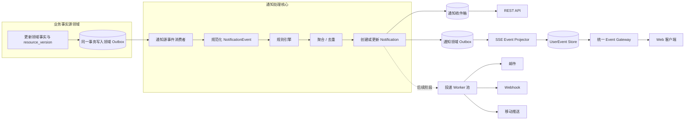
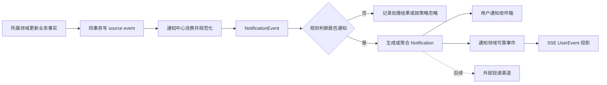
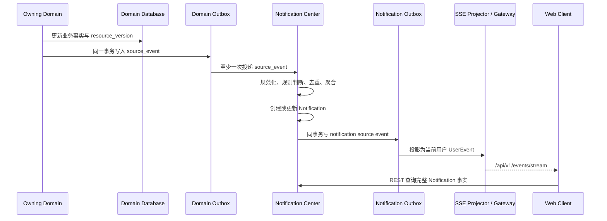
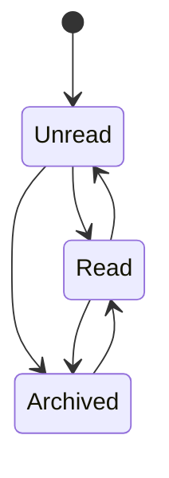

# OmniMAM 通知中心功能设计

```yaml
domain: notification-center
status: Released
updated_at: 2026-07-29
release_status: released
release: spec-v1.8.0
```

本文档是 notification-center 的 S1 产品语义事实源。对应 S2 位于 `01_contracts/domains/notification-center/`，并随 `spec-v1.8.0` release 作为正式实现依据。

## 1. 设计背景

OmniMAM 中存在大量后台异步任务，包括：

* 本地素材目录扫描。
* 素材入库与元数据提取。
* 缩略图、预览图、代理视频、波形图等 Asset Representation 生成。
* 素材智能分类、标签生成。
* 应用运行与制品生成。
* ComfyUI、SaaS 平台任务轮询。
* 文件迁移、校验、清理和修复。
* 周期性健康检测。
* 批量处理任务。
* 后续的 Agent 和画布运行任务。

这些后台结果分别由 Task Center、Asset Library、Application Platform、Workflow Canvas 等事实源领域维护。Task Center 负责 AtomicTask、TaskAttempt、TaskGroup 和 DAGTaskGroup 的执行事实，但不拥有 AssetVersion、ApplicationRun 或 CanvasRun 的最终业务状态。

用户通常需要进入各业务页面或任务中心，才能知道后台操作是否成功、失败，或者是否需要人工处理。

通知中心需要主动向用户展示重要结果，但不能把每一个后台任务状态变化都变成一条通知，否则周期任务会产生大量噪音。

---

## 2. 产品定位

通知中心不是第二个任务中心。

两者职责应明确分离：

| 模块   | 主要职责                        |
| ---- | --------------------------- |
| 任务中心 | 记录 AtomicTask、TaskAttempt、TaskGroup、DAGTaskGroup 的状态、进度、重试和执行历史 |
| 通知中心 | 告知用户发生了什么、是否需要关注，以及下一步可以做什么 |
| 操作审计 | 记录谁在什么时间执行了什么操作             |
| 系统日志 | 供开发和运维人员排查系统问题              |

通知中心展示的是经过规则筛选、聚合和用户化处理的事件。

例如：

```text
任务中心：
目录扫描任务 scan-run-123 执行完成
发现文件 12,486 个
新增 82 个
更新 17 个
失败 3 个
耗时 14 分 27 秒

通知中心：
素材扫描完成：新增 82 个素材，3 个文件处理失败
[查看新增素材] [处理失败文件]
```

通知中心不应要求用户理解 `TaskAttempt`、Worker、运行时任务或内部投影机制。通知可以关联 AtomicTask 供用户进一步排查，但不得把任务执行明细直接复制成通知内容。

---

## 3. 设计目标

通知中心需要满足以下目标：

1. 用户不进入任务中心也能知道重要后台任务结果。
2. 失败、部分失败和需要人工处理的情况不会被遗漏。
3. 大量周期任务不会形成通知轰炸。
4. 通知可以直接跳转到对应素材、应用运行、任务或配置页面。
5. 同一批任务能够聚合成一条用户可理解的通知。
6. 支持站内实时通知和未读状态。
7. 后续可以扩展邮件、Webhook 等外部通知渠道。
8. 通知生成失败不能影响所属领域业务事实或执行。
9. 通知数据不能成为任务状态的第二事实源。

---

## 4. 核心设计原则


### 4.1 所属领域事实是唯一事实源

通知中心不拥有被通知资源的业务状态。不同对象必须回到其所属领域读取最新事实：

| 对象 | 事实源 |
| --- | --- |
| AtomicTask、TaskAttempt、TaskGroup、DAGTaskGroup | task-center |
| Artifact、Asset、AssetVersion、AssetRepresentation | asset-library |
| ApplicationRun、ApplicationEngineInstance | application-platform |
| CanvasRun、CanvasNodeRun | workflow-canvas |
| ProviderModel 健康状态 | model-management |

通知记录只保存用于展示的信息和目标资源引用，例如：

```text
source_type = atomic_task
source_id   = atomic-task-123
```

用户点击通知后，再通过对应业务接口获取最新状态。

不能因为通知显示“执行失败”，就把通知记录当成 AtomicTask 当前状态。手动重试会创建新的 AtomicTask；旧通知只有在通过 `root_task_id`、所属业务资源或显式解决关联确认问题已经恢复后，才能标记为已解决。

AtomicTask 成功也不代表 Artifact、AssetVersion、ApplicationRun 或 CanvasRun 已达到各自成功状态。通知中心必须优先消费最接近用户业务结果的所属领域事件，不能从较低层任务终态猜测上层结果。

---

### 4.2 业务事件与通知分离

系统内部先产生业务事件，再根据通知规则决定是否生成通知。



例如 Asset Library 产生现行领域事件 `asset_version_processing_changed`：

```json
{
  "source_domain": "asset-library",
  "source_event_type": "asset_version_processing_changed",
  "source_event_id": "event-123",
  "aggregate_type": "asset_version",
  "aggregate_id": "asset-version-123",
  "aggregate_version": 8,
  "occurred_at": "2026-07-22T10:30:00Z",
  "payload": {
    "asset_id": "asset-123",
    "asset_version_id": "asset-version-123",
    "owner_user_id": "user-1",
    "status": "ready_with_warnings",
    "expected_count": 20,
    "completed_count": 17,
    "failed_count": 3
  }
}
```

通知中心将它规范化为 `notification_topic=asset.representation.batch_completed` 的候选事件，再由规则转换为：

```text
标题：素材预览生成完成
内容：已生成 17 个表现形式，3 个表现形式处理失败
级别：warning
操作：查看素材版本
```

### 4.3 三层事件语义

通知链路必须区分以下三类名称，禁止混用：

| 层级 | 作用 | 命名示例 | 所有者 |
| --- | --- | --- | --- |
| `source_event` | 表达所属领域已持久化的业务事实变化 | `atomic_task_status_changed`、`asset_version_processing_changed` | 对应业务领域 S2 |
| `notification_topic` | 作为通知规则、偏好和模板的稳定语义键 | `asset.scan.completed`、`application.run.failed` | notification-center S1/S2 |
| `UserEvent` | 向当前 Web 用户推送通知收件箱变化 | `notification.created`、`notification.updated` | notification-center 出站事件与 sse S1/S2 协作 |

一个 `source_event` 可以映射到多个通知主题，同一通知主题也可以兼容多个版本的源事件。通知主题不是对上游事件的重命名，不要求业务领域采用点分事件名。

`notification.created` 等 UserEvent 只提示通知收件箱发生变化，不承载完整通知事实，也不能被通知规则反向消费。

---

### 4.4 默认只通知有价值的结果

周期任务不能默认“每次成功都通知”。

推荐默认规则：

| 任务结果         | 默认行为            |
| ------------ | --------------- |
| 成功且没有变化      | 不通知             |
| 成功且产生了用户可见结果 | 生成普通通知，必要时聚合    |
| 部分成功         | 生成警告通知          |
| 最终失败         | 生成错误通知          |
| 自动重试中        | 默认不通知           |
| 重试后成功        | 一般不单独通知，更新原失败通知 |
| 需要用户输入或修复    | 生成“需要处理”通知      |
| 长时间运行        | 默认不通知，可配置超时提醒   |
| 系统级严重异常      | 向管理员发送高优先级通知    |

例如：

```text
目录扫描完成，没有发现新增或变化
```

默认不生成通知。

```text
目录扫描完成，发现 238 个新素材
```

生成一条普通通知。

```text
目录扫描完成，新增 238 个素材，其中 12 个无法解析
```

生成一条警告通知。

---

## 5. 通知分类

### 5.1 按业务领域分类

建议使用稳定的通知分类代码：

```text
system
task
asset
application
provider
storage
security
agent
canvas
```

Notification Center 第一阶段默认启用：

```text
system
task
asset
application
canvas
```

`provider`、`storage`、`security`、`agent` 随对应源事件和接收者契约就绪后启用。分类可提前稳定存在，未接入的分类返回空集合，不得伪造通知。

---

### 5.2 按严重程度分类

```text
info
success
warning
error
critical
```

建议语义：

| 级别       | 含义                |
| -------- | ----------------- |
| info     | 一般信息，不要求处理        |
| success  | 用户主动操作完成，或产生了明确结果 |
| warning  | 部分失败、资源不足或存在潜在问题  |
| error    | 当前操作最终失败          |
| critical | 系统服务不可用、存储异常等严重问题 |

不要把所有成功任务都标记成 `success` 通知。只有值得用户知道的成功结果才生成通知。

---

### 5.3 按处理要求分类

通知可以额外具有以下处理属性：

```text
informational
action_required
resolved
```

例如：

```text
Representation 生成失败：缺少 FFmpeg
```

这是 `action_required`。

管理员修复 FFmpeg 并重新执行成功后，可以将原通知更新为：

```text
Representation 生成问题已解决
```

处理状态变为 `resolved`，而不是额外产生多条相互矛盾的通知。它与通知是否已读、归档相互独立。

---

## 6. 通知来源

通知来源不能只限定为任务中心。

推荐支持以下来源。状态为“前瞻”的类型可以预留，但在所属领域未建立事实对象前不得由通知中心自行创建同名业务实体：

| source_type | 说明 | 状态 |
| --- | --- | --- |
| atomic_task | 单个 AtomicTask | 现行 |
| task_group | TaskGroup | 现行 |
| dag_task_group | DAGTaskGroup | 现行 |
| application_run | ApplicationRun | 现行 |
| artifact | Artifact | 现行 |
| asset | Asset | 现行 |
| asset_version | AssetVersion | 现行 |
| application_engine_instance | ApplicationEngineInstance | 现行 |
| provider_model | 用户 ProviderModel | 现行 |
| storage_backend | StorageBackend | 现行对象，通知事件待契约 |
| canvas_run | CanvasRun | 现行 |
| scan_run | 目录扫描运行 | 前瞻，所属领域待定义 |
| asset_batch | 素材批次 | 前瞻，所属领域待定义 |
| user_action | 用户操作形成的持久业务结果 | 前瞻 |
| agent_run | Agent 运行 | 前瞻 |
| system | 系统级事件 | 前瞻 |

一个通知可以关联一个主要来源，也可以在 `context` 中携带辅助资源引用。

例如：

```json
{
  "source_type": "scan_run",
  "source_id": "scan-run-123",
  "context": {
    "atomic_task_id": "atomic-task-123",
    "scan_root_id": "scan-root-1",
    "failed_asset_ids": [
      "asset-1",
      "asset-2"
    ]
  }
}
```

---

## 7. 核心数据模型

### 7.1 NotificationEvent

`NotificationEvent` 是通知中心消费一个可靠 `source_event` 后创建的规范化候选记录。业务模块只产生自己拥有的领域事件，不直接创建 NotificationEvent，也不写通知中心私有表。

它不是用户最终看到的通知。

```text
NotificationEvent
- id
- source_domain
- source_event_type
- source_event_id
- source_aggregate_type
- source_aggregate_id
- source_aggregate_version
- notification_topic
- source_type
- source_id
- recipient_basis
- actor_type
- actor_id
- occurred_at
- payload_snapshot
- processing_status
- deduplication_key
- created_at
```

主要用途：

* 解耦业务事实源领域和通知中心。
* 支持异步处理。
* 支持重复事件去重。
* 支持在相同规则版本和安全快照边界内重新执行通知规则。
* 支持故障恢复。

`recipient_basis` 保存源事件给出的 owner、initiator、project/namespace 或管理员范围依据；缺少可靠依据时进入失败处理，不能猜测接收者。

`payload_snapshot` 只能保存通知规则需要的最小非敏感事件快照，不保存大型日志、媒体正文、凭证、完整上游响应或任意 URL。severity、标题、内容、操作和聚合键由通知规则计算，不要求源领域承担通知呈现职责。

---

### 7.2 Notification

`Notification` 是用户最终看到的站内通知。

```text
Notification
- id
- recipient_user_id
- category
- notification_topic
- severity
- title
- content
- inbox_status
- attention_status
- source_type
- source_id
- navigation_target
- aggregate_key
- occurrence_count
- first_occurred_at
- last_occurred_at
- read_at
- archived_at
- resolved_at
- expires_at
- resource_version
- created_at
- updated_at
```

#### 收件箱状态与处理状态

收件箱状态 `inbox_status` 使用：

```text
unread
read
archived
```

处理状态 `attention_status` 使用：

```text
informational
action_required
resolved
```

进入 `resolved` 时写 `resolved_at`。是否已解决不能和是否已读混在一起。

因此一条通知可以是：

```text
已读，但尚未解决
```

---

### 7.3 NotificationDelivery

第一阶段只做站内通知时，可以暂时不实现复杂的 Delivery。

但为了后续邮件和 Webhook，建议预留：

```text
NotificationDelivery
- id
- notification_id
- channel
- status
- destination
- attempt_count
- last_error
- scheduled_at
- sent_at
- created_at
- updated_at
```

其中：

```text
channel:
- in_app
- email
- webhook
- mobile_push
```

第一阶段仅实现 `in_app`，可以直接视为 Notification 创建成功，不要求写 Delivery 表。`email`、`webhook` 和 `mobile_push` 均为后续阶段，渠道失败分别重试，不能阻塞或回滚其他渠道。

---

### 7.4 NotificationPreference

保存用户通知偏好：

```text
NotificationPreference
- id
- user_id
- category
- notification_topic
- in_app_enabled
- email_enabled
- webhook_enabled
- mobile_push_enabled
- minimum_severity
- digest_mode
- mute_until
- created_at
- updated_at
```

第一阶段不建议开放过度复杂的逐事件配置。

前端第一阶段可以先提供：

* 任务完成通知。
* 任务失败通知。
* 素材处理通知。
* 应用运行通知。
* 系统异常通知。
* 是否合并重复通知。
* 勿扰时间。

邮件、Webhook、移动推送、摘要和完整静默时段控制属于后续阶段；字段可以提前保留，但第一阶段不能展示为已经可用。严重系统异常和安全通知不允许完全关闭，至少保留站内投递。

---

## 8. 通知主题命名与接入状态

通知主题使用：

```text
领域.对象.结果
```

例如：

```text
task.atomic_task.succeeded
task.atomic_task.failed
task.atomic_task.timed_out
task.atomic_task.action_required
task.group.succeeded
task.group.failed
task.group.action_required

asset.scan.completed
asset.scan.partially_failed
asset.import.completed
asset.metadata.failed
asset.representation.completed
asset.representation.failed
asset.representation.batch_completed
asset.representation.batch_failed
asset.batch.completed

application.run.completed
application.run.failed
application.artifact.ready

application.engine_instance.unavailable
application.engine_instance.recovered
application.engine_instance.credential_expiring
model.provider_model.unavailable
model.provider_model.recovered
model.provider.credential_expiring

storage.backend.unavailable
storage.capacity.warning
storage.scan.completed

system.update.available
system.background_job.failed

canvas.run.succeeded
canvas.run.partially_succeeded
canvas.run.failed

agent.run.succeeded
agent.run.failed
agent.approval.requested
```

通知主题表达用户可理解的业务结果，不表达 UI 文案，也不复用已废弃的 `task.run.*`。ApplicationEngineInstance 与 ProviderModel 是不同事实对象，不使用含混的 `provider.health.*` 同时表示两者。

错误示例：

```text
show_red_notification
send_task_failed_message
```

### 8.1 接入状态定义

| 状态 | 含义 |
| --- | --- |
| 现行可接入 | 源事件已存在，且现行上游 S2 已将 notification-service 列为消费者；notification-center S2 可以启用对应 topic |
| 需补上游契约 | 源事件已存在，但消费者、接收者依据或必要 payload 尚不完整 |
| 前瞻规划 | 所属领域尚无正式事件或业务对象，保留通知主题但不得据此反向创造领域事实 |

### 8.2 依赖领域与通知主题矩阵

| 源领域 | source_event | notification_topic | 接收者依据 | 接入状态 |
| --- | --- | --- | --- | --- |
| task-center | `atomic_task_status_changed` | `task.atomic_task.succeeded/failed/timed_out/action_required` | `created_by`、owner scope | 现行可接入 |
| workflow-canvas | `canvas_run_status_changed` | `canvas.run.succeeded/partially_succeeded/failed` | `created_by`、project、namespace | 现行可接入 |
| task-center | `task_group_status_changed` | `task.group.succeeded/failed/action_required` | `created_by`、project、namespace | 需补 notification-service 消费关系；action_required 判定待契约 |
| asset-library | `asset_version_processing_changed` | `asset.representation.completed/failed/batch_completed/batch_failed` | `owner_user_id` | 需补 notification-service 消费关系和单项/批次映射 |
| asset-library | `artifact_processing_changed`、`artifact_registration_changed` | `application.artifact.ready` 及处理/登记失败主题 | `owner_user_id`、`application_run_id` | 需补 notification-service 消费关系 |
| application-platform | `application_run_projection_changed` | `application.run.completed/failed` | ApplicationRun 发起人 | 需补消费者和发起人/owner 载荷 |
| application-platform | `engine_instance_health_changed` | `application.engine_instance.unavailable/recovered` | `ADMIN`、`SUPER_ADMIN` | 需补消费者、前态和管理员范围契约 |
| model-management | `model_health_status_changed` | `model.provider_model.unavailable/recovered` | `ownerUserId` | 需补 notification-service 消费关系；现行 camelCase 载荷由源契约负责 |
| asset-library 或未来扫描领域 | 待定义扫描/导入业务结果事件 | `asset.scan.*`、`asset.import.*`、`asset.batch.*` | owner 或 initiator | 前瞻规划 |
| asset-library | 待定义 StorageBackend 状态与容量事件 | `storage.backend.unavailable`、`storage.capacity.warning`、`storage.scan.completed` | `ADMIN`、`SUPER_ADMIN` | 前瞻规划 |
| application-platform / model-management | 待定义凭证到期事件 | `application.engine_instance.credential_expiring`、`model.provider.credential_expiring` | owner 或管理员 | 前瞻规划 |
| identity / system | 待定义安全和系统公告事件 | `security.*`、`system.*` | 受影响用户或管理员 | 前瞻规划 |
| agent | 待 AgentRun 和审批模型确定 | `agent.*` | initiator、owner 或 approver | 前瞻规划 |

本轮 notification-center S2 已将上述状态固化为 `ACTIVE`、`CONTRACT_GAP` 和 `FUTURE`。上游契约变化时必须重新校验，但不得自动把缺口或前瞻主题升级为启用。

---

## 9. 周期任务通知策略

周期任务是通知中心设计的重点。

### 9.1 扫描任务

目录扫描及其正式业务结果事件尚属前瞻能力。以下策略作为未来 `asset.scan.*` 通知主题的产品要求保留，不表示 Asset Library 当前已经存在 ScanRun 或扫描事件契约。

#### 没有变化

```text
扫描成功
新增 0
更新 0
失败 0
```

处理方式：

```text
不通知
```

#### 有新素材

```text
新增 82
更新 17
失败 0
```

通知：

```text
素材扫描完成
发现 82 个新素材，更新了 17 个已有素材。
```

#### 部分失败

```text
新增 82
更新 17
失败 3
```

通知：

```text
素材扫描部分完成
新增 82 个素材，但有 3 个文件处理失败。
```

级别：

```text
warning
```

操作：

```text
查看失败文件
查看扫描结果
```

#### 完全失败

通知：

```text
素材扫描失败
无法访问目录 /data/assets，请检查目录挂载或访问权限。
```

级别：

```text
error
```

---

### 9.2 Representation 生成任务

Representation 通常数量很大，不能每个文件生成一条通知。

应按任务批次、扫描批次或时间窗口聚合。

错误方式：

```text
asset-1 缩略图生成成功
asset-2 缩略图生成成功
asset-3 缩略图生成成功
...
```

正确方式：

```text
素材预览生成完成
已为 1,284 个素材生成预览，18 个素材处理失败。
```

只有用户主动打开单个素材并触发 Representation 生成时，才可以显示单项通知或页面 Toast。

现行事实必须来自 `asset_version_processing_changed` 或 Artifact 相关事件。AtomicTask 成功不能直接生成“素材预览已就绪”通知。

---

### 9.3 健康检测任务

周期性健康检测成功且状态不变时不通知。

只有状态发生变化时通知：

```text
ApplicationEngineInstance: online -> offline | degraded
ApplicationEngineInstance: offline | degraded -> online
ProviderModel: healthy -> unhealthy
ProviderModel: unhealthy -> healthy
```

例如：

```text
ComfyUI 实例已不可用
连续 3 次健康检测失败，相关应用暂时无法运行。
```

恢复时更新或生成恢复通知：

```text
ComfyUI 实例已恢复
服务中断 12 分钟后恢复可用。
```

不要每隔一分钟生成一条“健康检测失败”通知。

ApplicationEngineInstance 与 ProviderModel 必须分别使用各自源事件和通知主题。恢复事件优先更新并解决同一来源的未解决通知；没有可靠前态或解决关联时，不得仅凭当前健康值猜测中断时长。

---

### 9.4 清理任务

存储清理和容量事件尚属前瞻能力。清理任务正常完成时，只有释放空间达到产品配置阈值才通知。

例如：

```text
存储清理完成
已清理 1,384 个临时文件，释放 86.4 GB 空间。
```

如果只释放了几十 KB，默认不通知。

---

## 10. 通知去重、聚合与解决关联

### 10.1 deduplication_key

用于防止同一个事件被重复消费。

例如：

```text
task-center:event-123:task.atomic_task.failed:user-1
```

去重键至少包含 `source_domain + source_event_id + notification_topic + recipient_user_id`。同一个源事件即使因为消息重试被处理多次，也只能为同一接收者和主题产生一次规则结果。

如果一个源事件合法映射到多个主题或多个接收者，各自使用不同去重键；不得只按业务资源 ID 去重而吞掉后续更高版本的真实状态变化。

---

### 10.2 aggregate_key

用于将多个不同事件合并为一条通知。

例如 Representation 失败：

```text
user-1:asset.representation.failed:asset-version-123:5_minutes:2026-07-22T10:30Z
```

聚合键至少包含接收者、通知主题、业务来源和聚合窗口。不同用户、不同业务来源或不同主题不得进入同一通知。

在五分钟聚合窗口内发生的失败可以合并：

```text
素材预览生成异常
过去 5 分钟有 38 个缩略图生成失败。
```

---

### 10.3 聚合窗口

建议支持：

```text
immediate
1_minute
5_minutes
1_hour
daily_digest
```

默认规则：

| 事件                | 聚合策略          |
| ----------------- | ------------- |
| 用户主动发起的单个应用运行     | 立即通知          |
| 批量素材导入            | 按批次聚合         |
| Representation 任务 | 5 分钟或任务组聚合    |
| 周期扫描              | 每次扫描形成最多一条通知  |
| EngineInstance 或 ProviderModel 健康异常 | 按具体资源的状态变化通知 |
| 存储容量告警            | 1 小时内合并       |
| 大量重复错误            | 首次立即通知，后续更新次数 |

---

### 10.4 通知风暴抑制

当同类异常持续发生时，不重复创建无限通知。

第一条：

```text
缩略图生成失败
有 1 个素材处理失败。
```

后续更新原通知：

```text
缩略图生成持续失败
过去 20 分钟共有 137 个素材处理失败。
```

字段变化：

```text
occurrence_count: 137
last_occurred_at: ...
```

严重程度可以随次数升级：

```text
1～9 次：warning
10～99 次：error
100 次以上：critical
```

具体升级规则由业务事件配置决定，不应在通知处理器中写死。

### 10.5 解决关联与手动重试

失败通知可以在后续业务事实确认问题恢复后更新为 `attention_status=resolved`。解决关联必须来自以下任一稳定关系：

* 同一业务资源和通知主题的更高 `source_aggregate_version`。
* 新旧 AtomicTask 共享的 `root_task_id`，并且所属业务资源一致。
* 所属领域事件显式提供的 `resolves_source_event_id` 或等价关联。

手动重试会创建新的 AtomicTask，不能因为新任务成功就按旧 AtomicTask ID 自动解决通知。自动 TaskAttempt 重试仍属于同一 AtomicTask，但只有 AtomicTask 或更高层业务资源已提交恢复事实后才可解决。

---

## 11. 通知规则

建议将通知规则作为后端代码中的预设规则，而不是第一阶段就设计完全动态的规则编辑器。

通知规则至少包含：

```text
- 匹配的 source_event 与 notification_topic
- 是否生成通知
- 通知接收者计算方式
- severity 计算方式
- title/content 模板
- 聚合策略
- 去重策略
- 默认操作
- 是否允许用户关闭
- 是否自动解决旧通知
```

示例：

```yaml
source_domain: asset-library
notification_topic: asset.scan.completed

notify_when:
  expression: payload.created_count > 0
    || payload.updated_count > 0
    || payload.failed_count > 0

severity:
  expression: payload.failed_count > 0 ? "warning" : "info"

aggregate:
  mode: per_source

recipient:
  type: owner

action:
  type: navigate
  target_type: scan_run
  target_id_from: source_id
  view: result
```

不建议让管理员在第一阶段直接编辑任意表达式。可以先由代码维护规则，数据库只保存开关和阈值配置。

---

## 12. 接收者计算

通知事件必须明确由谁接收。

推荐支持以下接收者策略：

```text
owner
initiator
administrators
specific_users
system_broadcast
```

接收者只能来自源事件明确携带的 owner、initiator、project/namespace scope、特定用户集合或受控只读投影。通知中心不得跨领域读取私有表猜测所有者，也不得因为某用户能收到通知就扩大其对目标资源的访问权。

### owner

业务资源的所有者。

例如用户配置的扫描目录产生的通知，发送给目录配置的创建者或负责人。

### initiator

主动发起操作的用户。

例如用户运行一个应用，则应用完成通知发送给发起人。

### administrators

系统级错误，例如：

* 存储后端不可用。
* 周期任务调度器停止。
* 全局 Provider 凭证失效。
* 后台队列大量积压。

这些通知只发送给满足对应通知权限的 `ADMIN`、`SUPER_ADMIN`。不能把所有具有普通资源读取权限的用户视为管理员，也不能在通知内容中暴露基础设施凭证、私网地址或未脱敏失败详情。

### system_broadcast

系统维护、版本升级等所有用户都需要知道的通知。

第一阶段可以生成每用户通知记录。广播通知和每用户阅读游标属于后续阶段；在该模型建立前，不得用一条共享 Notification 保存所有用户的可变已读状态。

---

## 13. 通知操作

每条通知最多提供一个主要导航目标和若干辅助提示。第一阶段通知中心只负责导航，不直接执行重试、修复、配置变更等高风险业务命令。

建议支持：

```text
navigate
```

`retry_task`、`open_asset`、`open_application_run`、`open_settings` 可以作为产品意图名称保留，但统一规范化为结构化导航目标；真正的重试或配置修改仍调用所属领域 API 并重新执行权限与状态校验。

示例：

```json
{
  "type": "navigate",
  "target_type": "atomic_task",
  "target_id": "atomic-task-123",
  "view": "detail",
  "params": {
    "tab": "errors"
  }
}
```

`navigation_target` 是通知事实中的稳定资源导航语义。服务端可以在读取响应中派生当前 Web 版本可用的 `action_path`，但它必须是同源白名单路径，不能接受源事件提供的任意 URL，也不能包含访问令牌或签名。客户端遇到未知 target type 时保留通知内容并隐藏操作，不得整条丢弃。

失败通知应尽量跳到问题处理页面，而不是统一跳到任务中心首页。

例如：

| 通知                | 推荐跳转          |
| ----------------- | ------------- |
| 扫描部分失败            | 扫描结果页的失败文件筛选  |
| ApplicationRun 失败 | 应用运行详情        |
| ApplicationEngineInstance 不可用 | EngineInstance 详情 |
| ProviderModel 不可用 | ProviderModel 详情 |
| 存储容量不足            | 存储后端详情        |
| 素材处理失败            | 失败素材列表        |

---

## 14. 与业务事实源领域的集成

Task Center、Asset Library、Application Platform、Workflow Canvas 等业务领域均不得直接写 Notification 或 NotificationEvent 表。每个领域只在自身事实事务内写自己的可靠源事件。

推荐流程：



业务事实更新和源事件写入必须使用事务 Outbox 或等价可靠机制。

例如：

```text
事务内：
1. AtomicTask 状态更新为 FAILED，resource_version 递增
2. 写入 atomic_task_status_changed OutboxEvent
3. 提交事务
```

这样可以避免：

```text
AtomicTask 已经失败，但可靠源事件没有保存
```

通知消费者故障不会影响所属领域提交事实。通知中心恢复后按源事件幂等重放；通知中心自己的 Notification 与通知 Outbox 同事务提交，避免收件箱已更新但 UserEvent 永久缺失。

---

## 15. 通知与 TaskGroup、DAGTaskGroup

很多后台操作会拆成大量子任务。

例如目录扫描：

```text
Scan Task
  ├── 文件发现任务
  ├── 元数据提取任务 × 500
  ├── Asset 创建任务 × 80
  ├── 缩略图生成任务 × 80
  └── 视频代理生成任务 × 20
```

通知中心不应监听每个子任务并直接通知用户。

TaskGroup/DAGTaskGroup 只拥有组合任务汇总事实。对于素材扫描、应用运行或画布运行等更高层业务结果，应由对应业务事实源在确认最终语义后产生领域事件，再映射为通知主题：

```text
asset.scan.completed
asset.scan.partially_failed
asset.scan.failed
```

子任务失败可以记录在任务中心，但只有以下情况才转换为用户通知：

1. 子任务失败导致整个业务操作失败。
2. 子任务失败形成部分失败结果。
3. 子任务需要用户单独处理。
4. 子任务属于严重系统异常。

因此：

```text
AtomicTask 终态事件 != 一定生成用户通知
```

---

## 16. 站内实时推送

当前通知场景主要是服务端向浏览器单向推送，因此复用 SSE 域的用户级事件流即可，不需要 WebSocket 或通知中心专属连接。

统一 SSE 地址：

```http
GET /api/v1/events/stream
```

通知中心不定义独立的 `/api/v1/notifications/stream`。Notification 创建或更新后，由通知领域可靠事件驱动 SSE projector 持久化当前用户的 UserEvent，再由 Event Gateway 推送。

事件类型：

```text
notification.created
notification.updated
notification.deleted
notification.unread_count_changed
```

示例：

```text
event: notification.created
id: 928384
data: {
  "event_id": 928384,
  "event_type": "notification.created",
  "event_version": 1,
  "occurred_at": "2026-07-22T10:30:01Z",
  "aggregate_type": "notification",
  "aggregate_id": "notification-123",
  "aggregate_version": 1,
  "payload": {
    "notification_id": "notification-123",
    "notification_topic": "asset.representation.batch_completed",
    "severity": "warning"
  }
}
```

SSE 只负责提示客户端刷新，完整通知事实仍然通过普通 REST API 获取。通知 UserEvent 的 source event、payload 和版本兼容策略由 notification-center S2 与 sse S2 协同定义。

通知的完整事实仍然通过普通 REST API 获取，避免依赖 SSE 消息作为唯一数据来源。

客户端重新连接后：

1. 使用 `Last-Event-ID` 尝试恢复。
2. 无法恢复时重新获取通知列表和未读数量。
3. SSE 消息可以重复，前端必须根据通知 ID 幂等更新。

---

## 17. 服务能力与目标接口

本章描述通知产品所需的目标服务能力；对应路径和 DTO 以 `01_contracts/domains/notification-center/openapi.yaml` 为正式 S2 契约。

### 17.1 获取通知列表

```http
GET /api/v1/notifications
```

查询参数：

```text
page_num (0 表示第一页)
page_size
keyword
inbox_status
category
severity
attention_status
created_after
created_before
sort_field
sort_order
```

响应：

```json
{
  "items": [
    {
      "id": "notification-123",
      "category": "asset",
      "notification_topic": "asset.representation.batch_completed",
      "severity": "warning",
      "title": "素材扫描部分完成",
      "content": "新增 82 个素材，3 个文件处理失败。",
      "inbox_status": "unread",
      "attention_status": "action_required",
      "source_type": "asset_version",
      "source_id": "asset-version-123",
      "navigation_target": {
        "type": "navigate",
        "target_type": "asset_version",
        "target_id": "asset-version-123",
        "view": "representations",
        "params": {"filter": "failed"}
      },
      "action_path": "/assets/asset-123/versions/asset-version-123?filter=failed",
      "occurrence_count": 1,
      "created_at": "2026-07-22T10:30:00Z"
    }
  ],
  "page_num": 0,
  "page_size": 20,
  "total": 1
}
```

---

### 17.2 获取未读数量

```http
GET /api/v1/notifications/unread-count
```

响应：

```json
{
  "unread_count": 7,
  "critical_count": 1,
  "action_required_count": 2
}
```

---

### 17.3 标记单条已读

```http
POST /api/v1/notifications/{notification_id}/read
```

---

### 17.4 批量已读

```http
POST /api/v1/notifications/read
```

请求：

```json
{
  "items": [
    {"id": "notification-1"},
    {"id": "notification-2"}
  ]
}
```

批量响应必须逐项表达成功或失败，不能只返回整体成功：

```json
{
  "total": 2,
  "success": 1,
  "fail": 1,
  "results": [
    {"id": "notification-1", "success": true},
    {"id": "notification-2", "success": false, "error": {"reason": "not_visible_or_not_found"}}
  ]
}
```

---

### 17.5 标记单条未读

```http
POST /api/v1/notifications/{notification_id}/unread
```

已归档通知必须先取消归档，不能通过标记未读隐式恢复到收件箱。

---

### 17.6 全部已读

```http
POST /api/v1/notifications/read-all
```

S2 固定支持可选分类范围：

```json
{
  "category": "asset"
}
```

---

### 17.7 归档通知

```http
POST /api/v1/notifications/{notification_id}/archive
```

归档不等于删除。

---

### 17.8 取消归档

```http
POST /api/v1/notifications/{notification_id}/unarchive
```

取消归档后恢复为 `read`，不会自动变为未读，也不改变 `attention_status`。

---

### 17.9 获取通知配置

```http
GET /api/v1/notification-preferences
```

---

### 17.10 更新通知配置

```http
PUT /api/v1/notification-preferences
```

---

## 18. 前端设计

### 18.1 顶部通知入口

在全局顶部栏提供铃铛入口。

显示内容：

```text
铃铛图标
未读数量徽标
严重异常标记
```

数量超过 99 时显示：

```text
99+
```

如果存在 `critical` 通知，可以增加明显的状态点，但不要让整个顶部栏持续闪烁。

---

### 18.2 通知下拉面板

点击铃铛后打开通知面板。

推荐结构：

```text
通知
[全部] [未读] [需要处理]

素材扫描部分完成
新增 82 个素材，3 个文件处理失败
2 分钟前
[查看失败文件]

应用运行完成
已生成 4 个视频制品
10 分钟前
[查看制品]

ComfyUI 实例不可用
连续 3 次健康检测失败
18 分钟前
[查看实例]

[查看全部通知]
```

下拉面板只展示最近 10～20 条，不承担完整通知管理。

---

### 18.3 通知中心页面

完整页面建议支持：

* 全部通知。
* 未读通知。
* 需要处理。
* 系统异常。
* 按业务分类筛选。
* 按时间筛选。
* 全部标记已读。
* 归档通知。
* 打开关联资源。

不建议提供复杂的通知搜索语法。普通关键词搜索和筛选足够。

---

### 18.4 通知卡片结构

每条通知包括：

```text
图标
标题
内容摘要
严重程度
业务分类
发生时间
未读状态
主要操作
聚合数量
```

示例：

```text
[警告图标] 素材扫描部分完成              未读
新增 82 个素材，3 个文件处理失败
素材 · 2 分钟前
[查看失败文件]
```

通知中不要直接展示长堆栈、内部错误码或完整日志。

可以展示简化原因：

```text
无法访问扫描目录，请检查目录是否已挂载。
```

详情页面再提供：

```text
错误码
AtomicTask / TaskAttempt
失败文件
执行日志
重试记录
```

---

### 18.5 Toast 与通知中心的关系

Toast 是即时反馈，通知中心是持久记录。

用户当前正在页面中并主动执行操作：

```text
应用已提交运行
```

可以只显示 Toast，不立即生成通知。

任务在后台完成后：

```text
应用运行完成，生成了 4 个视频
```

生成通知，并通过 SSE 显示轻量 Toast。

规则：

| 场景             | Toast |     通知中心 |
| -------------- | ----: | -------: |
| 用户点击后立即提交成功    |     是 |        否 |
| 后台任务完成         |    可选 |        是 |
| 表单校验失败         |     是 |        否 |
| 系统后台任务失败       |    可选 |        是 |
| 用户当前页面内可直接看到结果 |     是 | 可根据重要性决定 |
| 用户已经离开页面       |  无法保证 |        是 |

---

## 19. 通知生命周期

推荐生命周期：



另外独立维护：

```text
resolved_at
expires_at
```

通知在以下情况可以自动解决：

* ApplicationEngineInstance 或 ProviderModel 从不可用恢复。
* 存储容量回到安全范围。
* 失败 AtomicTask 的同一业务问题经稳定解决关联确认恢复。
* 用户完成了要求的配置。
* 失败文件已经重新处理成功。

自动解决通知时，可以通过 SSE 推送：

```text
notification.updated
```

前端将“需要处理”标记替换为“已解决”。

---

## 20. 通知保留策略

通知不能永久无限增长。

建议默认策略：

| 通知类型                 | 保留时间      |
| -------------------- | --------- |
| 普通已读通知               | 90 天      |
| 未读通知                 | 180 天     |
| 错误和严重通知              | 180～365 天 |
| 系统广播                 | 根据公告有效期   |
| 已归档通知                | 90 天后清理   |
| 规范化 NotificationEvent | 30～90 天   |

删除通知不会删除对应任务、应用运行或审计记录。

---

## 21. 权限和安全

1. 用户只能读取发送给自己的通知。
2. 管理员通知只发送给拥有相应系统权限的用户。
3. `navigation_target` 和派生的 `action_path` 只是跳转信息，不能绕过目标接口权限校验。
4. 通知内容不能包含 Provider 密钥、访问令牌或敏感请求参数。
5. 通知 payload 不应存储完整任务日志。
6. 系统广播不能默认包含内部基础设施信息。
7. SSE 连接必须使用现有登录认证和权限检查。

即使用户能够构造通知导航参数，目标资源接口仍然必须单独校验权限。通知中心只允许生成同源白名单路径，不接受源事件中的任意 URL。

---

## 22. 可靠性要求

### 22.1 至少一次投递

事件系统可以采用至少一次投递，但通知消费者必须幂等。

依赖：

```text
deduplication_key
```

---

### 22.2 通知失败不影响业务事实

通知生成或 SSE 推送失败时：

* 原业务事实不回滚。
* source event 消费失败进入通知消费重试或死信边界。
* Notification 已提交但 UserEvent 投影失败时，由 Notification Outbox 重试。
* 超过重试次数后进入死信记录。
* 管理员可以查看通知消费异常。

---

### 22.3 聚合并发安全

多个 Worker 可能同时处理相同 `aggregate_key`。

数据库更新需要使用：

* 唯一索引。
* 行锁。
* 原子计数更新。
* 乐观锁版本字段。

例如唯一约束可以包含：

```text
recipient_user_id
aggregate_key
aggregation_window
```

---

## 23. 第一阶段建议范围

第一阶段只实现站内通知，不要同时扩展邮件、短信和复杂规则编辑器。

### 第一阶段必须实现

1. NotificationEvent 和 Notification。
2. 源事件可靠消费与 Notification Outbox。
3. 通知规则处理 Worker。
4. 通知去重。
5. 基础聚合。
6. 未读、已读和归档。
7. 通知列表和未读数量接口。
8. 接入统一 SSE 用户事件流。
9. 顶部铃铛和通知中心页面。
10. 通知跳转业务详情。
11. 用户基础通知偏好。
12. `ADMIN`、`SUPER_ADMIN` 接收策略与不可关闭的严重站内通知；仅对已契约源事件启用。

### 第一阶段目标主题与接入状态

第一阶段只实现站内通知和统一 SSE 接入；主题清单可以先完整登记，但是否启用由第 8.2 节的源事件状态决定：

| notification_topic | 目标场景 | 状态 |
| --- | --- | --- |
| `task.atomic_task.failed`、`task.atomic_task.timed_out` | 单个执行事实最终失败或超时 | 现行可接入 |
| `task.group.action_required` | 组合任务需要用户处理 | 需补上游契约 |
| `canvas.run.succeeded`、`canvas.run.partially_succeeded`、`canvas.run.failed` | 画布运行结果 | 现行可接入 |
| `asset.representation.batch_completed`、`asset.representation.batch_failed` | Representation 批次结果 | 需补上游契约 |
| `application.run.completed`、`application.run.failed` | 应用运行结果 | 需补上游契约 |
| `application.artifact.ready` | 应用制品可用或登记完成 | 需补上游契约 |
| `application.engine_instance.unavailable`、`application.engine_instance.recovered` | EngineInstance 健康状态变化 | 需补上游契约 |
| `model.provider_model.unavailable`、`model.provider_model.recovered` | 用户 ProviderModel 健康状态变化 | 需补上游契约 |
| `asset.scan.completed`、`asset.scan.partially_failed`、`asset.scan.failed` | 目录扫描结果 | 前瞻规划 |
| `asset.import.completed`、`asset.import.partially_failed` | 素材导入结果 | 前瞻规划 |
| `storage.backend.unavailable`、`storage.capacity.warning` | 存储基础设施状态 | 前瞻规划 |

`provider.health.*` 作为含混别名不再新增；已有外部草案如引用它，必须在后续迁移中明确对应 `application.engine_instance.*` 或 `model.provider_model.*`，不得继续把两类健康事实合并。

---

## 24. 后续阶段

后续可以逐步增加：

1. 邮件通知。
2. Webhook 通知。
3. 每日或每周通知摘要。
4. 管理员通知规则配置。
5. 广播通知优化。
6. Agent 建议和 Agent 执行结果通知。
7. 画布节点等待用户输入通知。
8. 移动端推送。
9. 通知订阅和静默时段。
10. 跨设备已读状态同步。

---

## 25. 推荐的职责结构

通知中心推荐拆成以下职责单元。它们是产品边界，不是本 S1 对 Go 包、文件路径或进程部署的规定：

```text
notification/
├── domain/
│   ├── Notification 事实
│   ├── NotificationEvent 候选
│   ├── Preference 偏好
│   └── Rule 规则
├── application/
│   ├── 源事件消费
│   ├── 规则判断
│   ├── 去重聚合
│   ├── 通知收件箱服务
│   └── 偏好服务
├── infrastructure/
│   ├── 通知存储与 Outbox
│   ├── 源事件可靠消费
│   ├── SSE 协作事件
│   └── 后续渠道投递
└── interfaces/ REST 与偏好交互
```

所有业务领域只负责写入自己的可靠源事件；Notification Center 负责：

```text
Owning Domain Fact + Outbox
    ↓
Notification Center Source Consumer
    ↓
NotificationEvent → Rule + Deduplication + Aggregation
    ↓
Notification Inbox
    ↓
Notification Outbox → SSE UserEvent Projector → /api/v1/events/stream
```

---

## 26. 核心结论
### 26.1 业务结果优先
通知中心不应把所有 `AtomicTask` 状态变化直接生成通知。

正确方式是：

```text
所属领域业务结果
    ↓
可靠 source event
    ↓
判断是否对用户有价值
    ↓
进行去重、聚合和严重程度计算
    ↓
生成用户可理解、可以直接操作的通知
```

对于周期任务，默认策略应当是：

```text
无变化不通知
普通成功按批次通知
部分失败一定通知
最终失败一定通知
持续异常合并通知
恢复后更新或解决原通知
```

这样才能让通知中心真正解决“用户不知道后台发生了什么”的问题，而不是把任务中心的海量运行记录搬到另一个页面。

### 26.2 职责总结
#### 业务事实源领域（事件生产者）
只做一件事：在同一数据库事务内，将自身业务事实变化与源事件原子性写入。

它不关心通知规则、接收者、聚合或投递状态，也不写 Notification 表。

#### 领域 Outbox
存储可重放的 source event，事件事实归对应业务领域所有。

业务领域写入后即可返回，不阻塞用户请求。通知中心从各领域 Outbox 或等价可靠订阅边界消费。

#### NotificationEvent 候选收件箱
保存经过安全裁剪的源事件引用和快照，支持规则重放、故障恢复和去重，但不覆盖源领域事实。

#### 通知事件消费者（独立 Worker）
独立 Worker 持续消费各业务领域的可靠 source event，与 Task Center 执行 Worker、业务 API 进程和 SSE Event Gateway 保持职责隔离。

它负责：

* 将 source event 规范化为 NotificationEvent。
* 调用规则引擎，计算通知主题、接收者、严重程度和呈现模板。
* 执行 `deduplication_key` 去重与 `aggregate_key + aggregation_window` 聚合。
* 创建或更新最终 Notification，并与 Notification Outbox 原子提交。
* 对消费失败独立重试并进入可观测死信边界，不回滚业务事实。

独立 Worker 不读取业务领域私有表猜测状态或接收者，不执行 AtomicTask，不直接写 SSE 连接，也不承担 Email、Webhook 或移动推送的渠道投递。

#### 通知收件箱
存储用户可见的 Notification，提供 REST 能力用于查询、已读、归档和偏好管理。

#### 实时推送协作层
Notification Outbox 只向 sse projector 提供可靠通知变化；sse 负责 UserEvent 持久化、event_id、恢复和统一用户级连接。SSE Event Gateway 负责将已持久化的 UserEvent 推送到客户端。

推送内容仅为提示性摘要（如通知 ID、主题和严重程度），客户端随后通过 REST API 获取完整数据。通知中心不维护独立连接池，也不直接写 SSE 连接。

#### 多渠道投递（后续阶段）
当需要支持邮件、Webhook、移动推送等外部渠道时，会启动独立的投递消费者池。

每个渠道的消费者独立消费自己的投递队列，彼此并发执行，互不阻塞。

#### 为什么必须用独立 Worker 传递事件？
彻底解耦：业务事实源领域不需要引入通知规则、收件人或渠道投递依赖，升级、部署互不影响。

可靠性保障：业务事实写入和源事件发送是同一事务，不会出现“事实已成立但可靠事件没有保存”；通知中心失败不会回滚业务事实。

削峰与容错：大批量业务结果完成时，事件可能瞬间涌入。独立 Worker 可以控制消费速率，且处理失败不会影响原事实，可独立重试。

灵活扩展：新增通知规则、聚合策略或投递渠道，只需调整通知 Worker 或增加渠道 Worker，不会侵入业务领域事实代码。

#### 多渠道并发如何实现？
后续阶段中，Notification 生成后，会为每个渠道（如 email、webhook、mobile_push）创建一条 NotificationDelivery 记录，并投递到对应渠道的消息队列或待处理表。不同渠道的 Worker 可以：

使用独立的协程池并发处理。

互相无锁、无顺序依赖，邮件发送慢不会拖慢 Webhook 调用。

失败单独重试，不会因为一个渠道故障而丢弃其他渠道的投递。

邮件、Webhook 和移动推送 Worker 可以独立伸缩、并发执行；通知规则 Worker 不等待任何渠道完成。SSE 仍由统一 sse projector/gateway 管理，不在通知中心内另起 SSE Worker。

---

## 27. 一致性与验收场景

1. 同一 `source_event_id` 重复投递时，同一接收者和通知主题只产生一次规则结果；更高源聚合版本仍可更新通知。
2. 同一来源的旧版本事件晚到时，不得覆盖由更高 `source_aggregate_version` 形成的标题、处理状态或导航目标。
3. AssetVersion 进入 `ready_with_warnings` 时可以形成 warning 聚合通知；AtomicTask 先成功但 AssetVersion 尚未 ready 时不得提前通知素材已就绪。
4. 手动重试创建新 AtomicTask 后，只有 `root_task_id`、相同业务来源或显式解决事件确认恢复时，旧失败通知才变为 resolved。
5. 前瞻扫描事件表达新增、更新和失败均为 0 时不生成通知；部分失败形成 warning，最终失败形成 error。
6. EngineInstance 或 ProviderModel 健康状态未变化时不重复通知；不可用和恢复分别按具体资源关联同一未解决问题，持续异常只更新次数。
7. SSE 断线后使用 `Last-Event-ID` 重放；收到 `connection.resync_required` 时先通过通知列表和未读数 REST 能力完整重同步，再继续增量消费。
8. 接收者失去目标资源权限后仍只能读取符合通知保留策略的最小历史摘要；导航操作必须隐藏或由目标 API 拒绝，不得泄露资源当前详情。
9. 源事件缺少可靠接收者依据时进入可观测失败和重试/死信边界，不得默认广播给所有用户或管理员。
10. 客户端遇到未知前瞻通知主题、未知字段或未知导航目标时保留基础通知并忽略未知能力，不得导致整个通知列表失效。

---

## 28. 稳定业务规则与用户故事

### 28.1 业务规则

1. `BR-NOTIFY-001`：Notification 只保存用户可见摘要和资源引用，不得成为 AtomicTask、Artifact、AssetVersion、ApplicationRun、CanvasRun 或其他业务对象的第二事实源。
2. `BR-NOTIFY-002`：source event、notification topic 和 SSE UserEvent 是三个独立层级；点分 notification topic 不替代上游领域 S2 事件名。
3. `BR-NOTIFY-003`：默认只通知有用户价值的最终或阶段性业务结果；无变化成功、自动重试中和纯内部进度默认不生成持久通知。
4. `BR-NOTIFY-004`：NotificationEvent 是通知中心对可靠 source event 的最小安全规范化候选；业务领域不得直接写 NotificationEvent 或 Notification 表。
5. `BR-NOTIFY-005`：同一 `source_domain + source_event_id + notification_topic + recipient_user_id` 必须幂等，重复投递不得创建重复通知。
6. `BR-NOTIFY-006`：聚合键必须包含接收者、通知主题、业务来源和聚合窗口；不同用户、来源或主题不得聚合到同一 Notification。
7. `BR-NOTIFY-007`：同一来源只接受更高 `source_aggregate_version` 更新；旧版本和乱序事件不得回退内容、状态、计数或导航目标。
8. `BR-NOTIFY-008`：`inbox_status=unread|read|archived` 与 `attention_status=informational|action_required|resolved` 相互独立；归档、已读和解决不得互相隐式改写。
9. `BR-NOTIFY-009`：旧问题只能通过同一来源更高版本、共享 root task 与业务来源或显式解决事件标记 resolved；新 AtomicTask 成功不得按任务 ID 猜测解决关系。
10. `BR-NOTIFY-010`：接收者必须来自源事件的 owner、initiator、project/namespace scope、特定用户或受控只读投影；依据不足时进入重试/死信，不得猜测或默认广播。
11. `BR-NOTIFY-011`：管理员通知只发送给满足通知权限的 `ADMIN`、`SUPER_ADMIN`；严重系统和安全通知至少保留站内投递且不能完全关闭。
12. `BR-NOTIFY-012`：用户只能查询和修改自己的通知与偏好；通知存在性、其他接收者和管理员基础设施信息不得通过错误或筛选泄露。
13. `BR-NOTIFY-013`：navigation target 必须是结构化资源目标，派生 action path 只能使用同源白名单路由；目标接口仍独立鉴权，未知目标必须隐藏操作而保留通知。
14. `BR-NOTIFY-014`：第一阶段偏好支持按分类或通知主题控制站内开关、最低严重程度和重复合并；系统强制主题不得关闭。
15. `BR-NOTIFY-015`：第一阶段只实现站内 Notification；Email、Webhook、mobile push、摘要、完整静默时段和广播游标保留为未启用能力。
16. `BR-NOTIFY-016`：通知实时变化统一通过 `/api/v1/events/stream` 投影为当前用户 UserEvent；通知中心不得建立私有 SSE 连接或直接写连接。
17. `BR-NOTIFY-017`：Notification 与 Notification Outbox 必须原子提交；source event 消费和 UserEvent 投影失败均可独立重试，不回滚上游业务事实。
18. `BR-NOTIFY-018`：NotificationEvent、Notification 和已归档通知按第 20 章保留策略清理；清理通知不得删除源业务、任务、运行或审计事实。
19. `BR-NOTIFY-019`：事件快照、通知内容、日志和导航不得包含凭证、Token、签名、私网地址、任意 URL、大型正文、内部栈或用户无权读取的原始响应。
20. `BR-NOTIFY-020`：前瞻 notification topic 可以预登记，但在所属领域对象、源事件、接收者和 payload S2 就绪前必须保持禁用，通知中心不得反向发明领域事实。
21. `BR-NOTIFY-021`：通知规则由独立 Worker 消费 source event 并生成收件箱事实；它不执行 AtomicTask、不读跨域私表、不直接写 SSE，也不等待渠道投递。
22. `BR-NOTIFY-022`：通知列表分页从 0 开始并返回 `total + items`；批量已读每次最多 200 个唯一 ID，逐项独立返回成功或失败，单项失败不回滚其他项。
23. `BR-NOTIFY-023`：Toast 是非持久即时反馈，Notification 是持久收件箱事实；当前页面可见结果可以只显示 Toast，离开页面后的重要后台结果必须按规则进入通知中心。
24. `BR-NOTIFY-024`：未来每个外部渠道使用独立 NotificationDelivery 和 Worker 并分别重试；一个渠道失败不得阻塞站内通知或其他渠道。

### 28.2 用户故事与验收标准

#### US-NOTIFY-001 浏览通知收件箱

作为当前登录用户，我希望分页查看和筛选自己的通知、未读数和需要处理项，以便快速识别重要后台结果。

* `AC-NOTIFY-001-01`：列表从 `page_num=0` 开始，支持 inbox status、attention status、分类、严重程度、时间和排序筛选，并返回 `total + items`。
* `AC-NOTIFY-001-02`：用户不能查询其他接收者的通知；不存在与不可见使用相同业务错误边界。

#### US-NOTIFY-002 管理收件箱状态

作为通知接收者，我希望标记单条或批量已读、重新标记未读、全部已读、归档和取消归档，以保持收件箱可管理。

* `AC-NOTIFY-002-01`：批量已读最多 200 个唯一 ID 并逐项返回结果；单项失败不影响其他项。
* `AC-NOTIFY-002-02`：取消归档恢复为 read，标记未读不能隐式取消归档，所有操作保持 attention status 不变。

#### US-NOTIFY-003 配置基础通知偏好

作为当前登录用户，我希望按分类或通知主题设置站内开关、最低严重程度和重复合并，以减少噪音但不遗漏强制通知。

* `AC-NOTIFY-003-01`：偏好更新整体校验并幂等替换当前用户提交的条目，不允许修改其他用户配置。
* `AC-NOTIFY-003-02`：严重系统和安全主题拒绝关闭；未来渠道字段在首期不作为可写 API 暴露。

#### US-NOTIFY-004 实时接收与恢复通知

作为 Web 用户，我希望通知创建、更新、删除和未读数变化通过全局 SSE 到达，并在断线后恢复。

* `AC-NOTIFY-004-01`：Notification Outbox 由 SSE projector 映射为统一 UserEvent，不建立通知私有 SSE。
* `AC-NOTIFY-004-02`：收到 `connection.resync_required` 后，客户端重新查询通知列表和未读数，再恢复增量消费。

#### US-NOTIFY-005 安全导航到业务资源

作为通知接收者，我希望从通知进入相关任务、素材、应用、画布或配置页面，同时保持目标资源权限边界。

* `AC-NOTIFY-005-01`：服务端只返回受控 navigation target 和可选同源 action path，不接受源事件任意 URL。
* `AC-NOTIFY-005-02`：目标不存在、删除或不可见时保留最小历史通知，但隐藏导航或由目标 API 无差别拒绝。

#### US-NOTIFY-006 接收管理员告警

作为 `ADMIN` 或 `SUPER_ADMIN`，我希望接收已契约的严重系统、Engine、ProviderModel 或存储异常，以便及时处理。

* `AC-NOTIFY-006-01`：管理员接收者通过权限和角色范围解析，普通用户不能收到管理员基础设施通知。
* `AC-NOTIFY-006-02`：持续异常聚合更新原通知，恢复事件按稳定关联解决，不重复制造通知风暴。

#### US-NOTIFY-007 可靠处理与未来渠道扩展

作为平台维护者，我希望独立通知 Worker 能幂等、可恢复地处理事件，并让未来渠道独立扩展而不影响业务事实。

* `AC-NOTIFY-007-01`：重复、乱序、失败重试和死信处理不创建重复通知、不回退较新版本、不回滚源事实。
* `AC-NOTIFY-007-02`：Email、Webhook 和 mobile push 未启用时不产生成功假象；启用后各渠道独立投递和重试。
