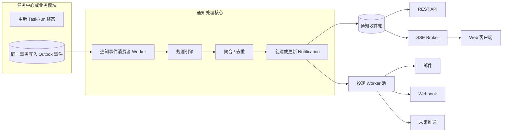
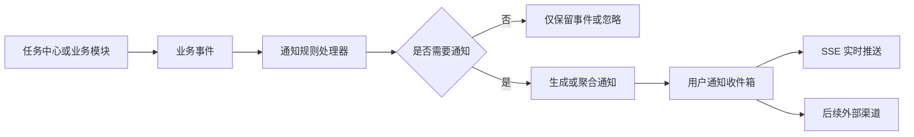
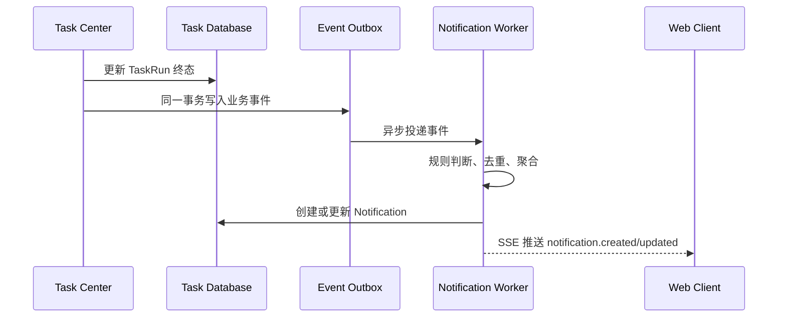
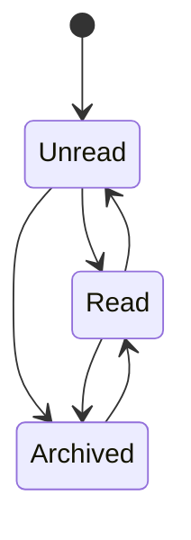

# OmniMAM 通知中心功能设计

## 1. 设计背景

OmniMAM 中存在大量后台异步任务，包括：

* 本地素材目录扫描。
* 素材入库与元数据提取。
* 缩略图、预览图、代理视频、波形图等 Asset Representation 生成。
* 素材智能分类、标签生成。
* 应用运行与制品生成。
* ComfyUI、SaaS 平台任务轮询。
* 文件迁移、校验、清理和修复。
* 周期性健康检测。
* 批量处理任务。
* 后续的 Agent 和画布运行任务。

这些任务主要由任务中心执行。用户只有进入任务中心才能知道任务是否成功、失败，或者是否需要人工处理。

通知中心需要主动向用户展示重要结果，但不能把每一个后台任务状态变化都变成一条通知，否则周期任务会产生大量噪音。

---

# 2. 产品定位

通知中心不是第二个任务中心。

两者职责应明确分离：

| 模块   | 主要职责                        |
| ---- | --------------------------- |
| 任务中心 | 记录任务执行过程、状态、进度、重试、日志和运行实例   |
| 通知中心 | 告知用户发生了什么、是否需要关注，以及下一步可以做什么 |
| 操作审计 | 记录谁在什么时间执行了什么操作             |
| 系统日志 | 供开发和运维人员排查系统问题              |

通知中心展示的是经过规则筛选、聚合和用户化处理的事件。

例如：

```text
任务中心：
目录扫描任务 scan-run-123 执行完成
发现文件 12,486 个
新增 82 个
更新 17 个
失败 3 个
耗时 14 分 27 秒

通知中心：
素材扫描完成：新增 82 个素材，3 个文件处理失败
[查看新增素材] [处理失败文件]
```

通知中心不应要求用户理解 `TaskRun`、`TaskAttempt`、Worker、ExecutionLease 等内部概念。

---

# 3. 设计目标

通知中心需要满足以下目标：

1. 用户不进入任务中心也能知道重要后台任务结果。
2. 失败、部分失败和需要人工处理的情况不会被遗漏。
3. 大量周期任务不会形成通知轰炸。
4. 通知可以直接跳转到对应素材、应用运行、任务或配置页面。
5. 同一批任务能够聚合成一条用户可理解的通知。
6. 支持站内实时通知和未读状态。
7. 后续可以扩展邮件、Webhook 等外部通知渠道。
8. 通知生成失败不能影响原任务执行。
9. 通知数据不能成为任务状态的第二事实源。

---

# 4. 核心设计原则


## 4.1 任务状态是事实源

任务中心的 `TaskRun` 仍然是任务执行状态的唯一事实源。

通知记录只保存用于展示的信息和目标资源引用，例如：

```text
source_type = task_run
source_id   = task-run-123
```

用户点击通知后，再通过对应业务接口获取最新状态。

不能因为通知显示“执行失败”，就把通知记录当成任务当前状态。任务可能已经被用户重试并成功。

---

## 4.2 业务事件与通知分离

系统内部先产生业务事件，再根据通知规则决定是否生成通知。



例如任务中心产生事件：

```json
{
  "event_type": "asset.scan.completed",
  "source_type": "task_run",
  "source_id": "task-run-123",
  "actor_type": "system",
  "owner_user_id": "user-1",
  "occurred_at": "2026-07-22T10:30:00Z",
  "payload": {
    "scan_root_id": "scan-root-1",
    "discovered_count": 12486,
    "created_count": 82,
    "updated_count": 17,
    "failed_count": 3
  }
}
```

通知规则将其转换为：

```text
标题：素材扫描完成
内容：新增 82 个素材，更新 17 个素材，3 个文件处理失败
级别：warning
操作：查看扫描结果
```

---

## 4.3 默认只通知有价值的结果

周期任务不能默认“每次成功都通知”。

推荐默认规则：

| 任务结果         | 默认行为            |
| ------------ | --------------- |
| 成功且没有变化      | 不通知             |
| 成功且产生了用户可见结果 | 生成普通通知，必要时聚合    |
| 部分成功         | 生成警告通知          |
| 最终失败         | 生成错误通知          |
| 自动重试中        | 默认不通知           |
| 重试后成功        | 一般不单独通知，更新原失败通知 |
| 需要用户输入或修复    | 生成“需要处理”通知      |
| 长时间运行        | 默认不通知，可配置超时提醒   |
| 系统级严重异常      | 向管理员发送高优先级通知    |

例如：

```text
目录扫描完成，没有发现新增或变化
```

默认不生成通知。

```text
目录扫描完成，发现 238 个新素材
```

生成一条普通通知。

```text
目录扫描完成，新增 238 个素材，其中 12 个无法解析
```

生成一条警告通知。

---

# 5. 通知分类

## 5.1 按业务领域分类

建议使用稳定的通知分类代码：

```text
system
task
asset
application
provider
storage
security
agent
canvas
```

第一阶段主要启用：

```text
system
task
asset
application
provider
storage
```

---

## 5.2 按严重程度分类

```text
info
success
warning
error
critical
```

建议语义：

| 级别       | 含义                |
| -------- | ----------------- |
| info     | 一般信息，不要求处理        |
| success  | 用户主动操作完成，或产生了明确结果 |
| warning  | 部分失败、资源不足或存在潜在问题  |
| error    | 当前操作最终失败          |
| critical | 系统服务不可用、存储异常等严重问题 |

不要把所有成功任务都标记成 `success` 通知。只有值得用户知道的成功结果才生成通知。

---

## 5.3 按处理要求分类

通知可以额外具有以下处理属性：

```text
informational
action_required
resolved
```

例如：

```text
Representation 生成失败：缺少 FFmpeg
```

这是 `action_required`。

管理员修复 FFmpeg 并重新执行成功后，可以将原通知更新为：

```text
Representation 生成问题已解决
```

状态变为 `resolved`，而不是额外产生多条相互矛盾的通知。

---

# 6. 通知来源

通知来源不能只限定为任务中心。

推荐支持以下来源：

| source_type       | 说明             |
| ----------------- | -------------- |
| task_run          | 单个任务运行         |
| task_group        | 一组关联任务         |
| application_run   | 应用运行           |
| asset             | 单个素材           |
| asset_batch       | 素材批次           |
| scan_run          | 目录扫描运行         |
| provider_instance | Provider 或引擎实例 |
| storage_backend   | 存储后端           |
| system            | 系统事件           |
| user_action       | 用户操作结果         |
| agent_run         | 后续 Agent 运行    |
| canvas_run        | 后续画布运行         |

一个通知可以关联一个主要来源，也可以在 `context` 中携带辅助资源引用。

例如：

```json
{
  "source_type": "scan_run",
  "source_id": "scan-run-123",
  "context": {
    "task_run_id": "task-run-123",
    "scan_root_id": "scan-root-1",
    "failed_asset_ids": [
      "asset-1",
      "asset-2"
    ]
  }
}
```

---

# 7. 核心数据模型

## 7.1 NotificationEvent

`NotificationEvent` 表示业务模块产生的原始通知候选事件。

它不是用户最终看到的通知。

```text
NotificationEvent
- id
- event_type
- source_type
- source_id
- owner_user_id
- actor_type
- actor_id
- severity
- occurred_at
- payload
- deduplication_key
- aggregate_key
- created_at
```

主要用途：

* 解耦任务中心和通知中心。
* 支持异步处理。
* 支持重复事件去重。
* 支持后续重新执行通知规则。
* 支持故障恢复。

`payload` 可以保存事件快照，但不应保存大量日志或完整任务输出。

---

## 7.2 Notification

`Notification` 是用户最终看到的站内通知。

```text
Notification
- id
- recipient_user_id
- category
- event_type
- severity
- title
- content
- status
- source_type
- source_id
- action_type
- action_url
- action_payload
- aggregate_key
- occurrence_count
- first_occurred_at
- last_occurred_at
- read_at
- archived_at
- resolved_at
- expires_at
- created_at
- updated_at
```

### status

建议使用：

```text
unread
read
archived
```

“是否已解决”不要和“是否已读”混在一起。

可以通过单独字段表达：

```text
resolved_at
```

因此一条通知可以是：

```text
已读，但尚未解决
```

---

## 7.3 NotificationDelivery

第一阶段只做站内通知时，可以暂时不实现复杂的 Delivery。

但为了后续邮件和 Webhook，建议预留：

```text
NotificationDelivery
- id
- notification_id
- channel
- status
- destination
- attempt_count
- last_error
- scheduled_at
- sent_at
- created_at
- updated_at
```

其中：

```text
channel:
- in_app
- email
- webhook
```

第一阶段 `in_app` 可以直接视为 Notification 创建成功，不需要写 Delivery 表。

---

## 7.4 NotificationPreference

保存用户通知偏好：

```text
NotificationPreference
- id
- user_id
- category
- event_type
- in_app_enabled
- email_enabled
- minimum_severity
- digest_mode
- mute_until
- created_at
- updated_at
```

第一阶段不建议开放过度复杂的逐事件配置。

前端可以先提供：

* 任务完成通知。
* 任务失败通知。
* 素材处理通知。
* 应用运行通知。
* 系统异常通知。
* 是否合并重复通知。
* 勿扰时间。

严重系统异常和安全通知不允许完全关闭。

---

# 8. 事件命名规范

事件类型使用：

```text
领域.对象.结果
```

例如：

```text
task.run.failed
task.run.completed
task.group.completed

asset.scan.completed
asset.scan.partially_failed
asset.import.completed
asset.metadata.failed
asset.representation.completed
asset.representation.failed
asset.batch.completed

application.run.completed
application.run.failed
application.artifact.ready

provider.health.unavailable
provider.health.recovered
provider.credential.expiring

storage.backend.unavailable
storage.capacity.warning
storage.scan.completed

system.update.available
system.background_job.failed
```

事件名表达业务事实，不要表达 UI 文案。

错误示例：

```text
show_red_notification
send_task_failed_message
```

---

# 9. 周期任务通知策略

周期任务是通知中心设计的重点。

## 9.1 扫描任务

### 没有变化

```text
扫描成功
新增 0
更新 0
失败 0
```

处理方式：

```text
不通知
```

### 有新素材

```text
新增 82
更新 17
失败 0
```

通知：

```text
素材扫描完成
发现 82 个新素材，更新了 17 个已有素材。
```

### 部分失败

```text
新增 82
更新 17
失败 3
```

通知：

```text
素材扫描部分完成
新增 82 个素材，但有 3 个文件处理失败。
```

级别：

```text
warning
```

操作：

```text
查看失败文件
查看扫描结果
```

### 完全失败

通知：

```text
素材扫描失败
无法访问目录 /data/assets，请检查目录挂载或访问权限。
```

级别：

```text
error
```

---

## 9.2 Representation 生成任务

Representation 通常数量很大，不能每个文件生成一条通知。

应按任务批次、扫描批次或时间窗口聚合。

错误方式：

```text
asset-1 缩略图生成成功
asset-2 缩略图生成成功
asset-3 缩略图生成成功
...
```

正确方式：

```text
素材预览生成完成
已为 1,284 个素材生成预览，18 个素材处理失败。
```

只有用户主动打开单个素材并触发 Representation 生成时，才可以显示单项通知或页面 Toast。

---

## 9.3 健康检测任务

周期性健康检测成功不通知。

只有状态发生变化时通知：

```text
available -> unavailable
unavailable -> available
```

例如：

```text
ComfyUI 实例已不可用
连续 3 次健康检测失败，相关应用暂时无法运行。
```

恢复时更新或生成恢复通知：

```text
ComfyUI 实例已恢复
服务中断 12 分钟后恢复可用。
```

不要每隔一分钟生成一条“健康检测失败”通知。

---

## 9.4 清理任务

清理任务正常完成时，只有释放空间达到一定阈值才通知。

例如：

```text
存储清理完成
已清理 1,384 个临时文件，释放 86.4 GB 空间。
```

如果只释放了几十 KB，默认不通知。

---

# 10. 通知去重与聚合

## 10.1 deduplication_key

用于防止同一个事件被重复消费。

例如：

```text
task-run-123:failed
```

同一个事件即使因为消息重试被处理多次，也只能生成一次通知。

---

## 10.2 aggregate_key

用于将多个不同事件合并为一条通知。

例如 Representation 失败：

```text
asset-representation:thumbnail:2026-07-22:user-1
```

在五分钟聚合窗口内发生的失败可以合并：

```text
素材预览生成异常
过去 5 分钟有 38 个缩略图生成失败。
```

---

## 10.3 聚合窗口

建议支持：

```text
immediate
1_minute
5_minutes
1_hour
daily_digest
```

默认规则：

| 事件                | 聚合策略          |
| ----------------- | ------------- |
| 用户主动发起的单个应用运行     | 立即通知          |
| 批量素材导入            | 按批次聚合         |
| Representation 任务 | 5 分钟或任务组聚合    |
| 周期扫描              | 每次扫描形成最多一条通知  |
| Provider 健康异常     | 按实例状态变化通知     |
| 存储容量告警            | 1 小时内合并       |
| 大量重复错误            | 首次立即通知，后续更新次数 |

---

## 10.4 通知风暴抑制

当同类异常持续发生时，不重复创建无限通知。

第一条：

```text
缩略图生成失败
有 1 个素材处理失败。
```

后续更新原通知：

```text
缩略图生成持续失败
过去 20 分钟共有 137 个素材处理失败。
```

字段变化：

```text
occurrence_count: 137
last_occurred_at: ...
```

严重程度可以随次数升级：

```text
1～9 次：warning
10～99 次：error
100 次以上：critical
```

具体升级规则由业务事件配置决定，不应在通知处理器中写死。

---

# 11. 通知规则

建议将通知规则作为后端代码中的预设规则，而不是第一阶段就设计完全动态的规则编辑器。

通知规则至少包含：

```text
- 匹配的 event_type
- 是否生成通知
- 通知接收者计算方式
- severity 计算方式
- title/content 模板
- 聚合策略
- 去重策略
- 默认操作
- 是否允许用户关闭
- 是否自动解决旧通知
```

示例：

```yaml
event_type: asset.scan.completed

notify_when:
  expression: payload.created_count > 0
    || payload.updated_count > 0
    || payload.failed_count > 0

severity:
  expression: payload.failed_count > 0 ? "warning" : "info"

aggregate:
  mode: per_source

recipient:
  type: owner

action:
  type: navigate
  url_template: /assets/scans/{source_id}
```

不建议让管理员在第一阶段直接编辑任意表达式。可以先由代码维护规则，数据库只保存开关和阈值配置。

---

# 12. 接收者计算

通知事件必须明确由谁接收。

推荐支持以下接收者策略：

```text
owner
initiator
administrators
specific_users
system_broadcast
```

## owner

业务资源的所有者。

例如用户配置的扫描目录产生的通知，发送给目录配置的创建者或负责人。

## initiator

主动发起操作的用户。

例如用户运行一个应用，则应用完成通知发送给发起人。

## administrators

系统级错误，例如：

* 存储后端不可用。
* 周期任务调度器停止。
* 全局 Provider 凭证失效。
* 后台队列大量积压。

这些通知发送给管理员。

## system_broadcast

系统维护、版本升级等所有用户都需要知道的通知。

第一阶段可以生成每用户通知记录，后续用户规模较大时再设计广播通知和用户阅读游标。

---

# 13. 通知操作

每条通知最多提供一个主要操作和若干辅助操作。

建议支持：

```text
navigate
retry_task
open_asset
open_application_run
open_settings
dismiss
```

第一阶段优先只实现 `navigate`，避免通知中心直接执行高风险业务操作。

示例：

```json
{
  "action_type": "navigate",
  "action_url": "/tasks/task-run-123"
}
```

失败通知应尽量跳到问题处理页面，而不是统一跳到任务中心首页。

例如：

| 通知                | 推荐跳转          |
| ----------------- | ------------- |
| 扫描部分失败            | 扫描结果页的失败文件筛选  |
| ApplicationRun 失败 | 应用运行详情        |
| Provider 不可用      | Provider 实例详情 |
| 存储容量不足            | 存储后端详情        |
| 素材处理失败            | 失败素材列表        |

---

# 14. 与任务中心的集成

任务中心不直接写 Notification 表。

推荐流程：



任务结束和事件写入必须使用事务 Outbox 模式。

例如：

```text
事务内：
1. TaskRun 状态更新为 failed
2. 写入 task.run.failed OutboxEvent
3. 提交事务
```

这样可以避免：

```text
任务已经失败，但通知事件因为服务崩溃没有产生
```

通知消费者故障不会影响任务中心提交终态。

---

# 15. 通知与 TaskGroup

很多后台操作会拆成大量子任务。

例如目录扫描：

```text
Scan Task
  ├── 文件发现任务
  ├── 元数据提取任务 × 500
  ├── Asset 创建任务 × 80
  ├── 缩略图生成任务 × 80
  └── 视频代理生成任务 × 20
```

通知中心不应监听每个子任务并直接通知用户。

应由 `TaskGroup` 或业务聚合任务产生最终业务事件：

```text
asset.scan.completed
asset.scan.partially_failed
asset.scan.failed
```

子任务失败可以记录在任务中心，但只有以下情况才转换为用户通知：

1. 子任务失败导致整个业务操作失败。
2. 子任务失败形成部分失败结果。
3. 子任务需要用户单独处理。
4. 子任务属于严重系统异常。

因此：

```text
TaskRun 终态事件 != 一定生成用户通知
```

---

# 16. 站内实时推送

当前通知场景主要是服务端向浏览器单向推送，因此使用 SSE 即可，不需要 WebSocket。

建议 SSE 地址：

```http
GET /api/v1/notifications/stream
```

事件类型：

```text
notification.created
notification.updated
notification.deleted
notification.unread_count_changed
```

示例：

```text
event: notification.created
id: notification-123
data: {
  "id": "notification-123",
  "severity": "warning",
  "title": "素材扫描部分完成",
  "content": "新增 82 个素材，3 个文件处理失败。",
  "action_url": "/assets/scans/scan-run-123"
}
```

SSE 只负责提示客户端刷新。

通知的完整事实仍然通过普通 REST API 获取，避免依赖 SSE 消息作为唯一数据来源。

客户端重新连接后：

1. 使用 `Last-Event-ID` 尝试恢复。
2. 无法恢复时重新获取通知列表和未读数量。
3. SSE 消息可以重复，前端必须根据通知 ID 幂等更新。

---

# 17. 后端接口

## 17.1 获取通知列表

```http
GET /api/v1/notifications
```

查询参数：

```text
page_num
page_size
status
category
severity
action_required
created_after
```

响应：

```json
{
  "items": [
    {
      "id": "notification-123",
      "category": "asset",
      "severity": "warning",
      "title": "素材扫描部分完成",
      "content": "新增 82 个素材，3 个文件处理失败。",
      "status": "unread",
      "source_type": "scan_run",
      "source_id": "scan-run-123",
      "action_type": "navigate",
      "action_url": "/assets/scans/scan-run-123?filter=failed",
      "occurrence_count": 1,
      "created_at": "2026-07-22T10:30:00Z"
    }
  ],
  "page_num": 1,
  "page_size": 20,
  "total": 1
}
```

---

## 17.2 获取未读数量

```http
GET /api/v1/notifications/unread-count
```

响应：

```json
{
  "unread_count": 7,
  "critical_count": 1,
  "action_required_count": 2
}
```

---

## 17.3 标记单条已读

```http
POST /api/v1/notifications/{notification_id}/read
```

---

## 17.4 批量已读

```http
POST /api/v1/notifications/read
```

请求：

```json
{
  "notification_ids": [
    "notification-1",
    "notification-2"
  ]
}
```

---

## 17.5 全部已读

```http
POST /api/v1/notifications/read-all
```

可以支持范围：

```json
{
  "category": "asset"
}
```

---

## 17.6 归档通知

```http
POST /api/v1/notifications/{notification_id}/archive
```

归档不等于删除。

---

## 17.7 获取通知配置

```http
GET /api/v1/notification-preferences
```

---

## 17.8 更新通知配置

```http
PUT /api/v1/notification-preferences
```

---

# 18. 前端设计

## 18.1 顶部通知入口

在全局顶部栏提供铃铛入口。

显示内容：

```text
铃铛图标
未读数量徽标
严重异常标记
```

数量超过 99 时显示：

```text
99+
```

如果存在 `critical` 通知，可以增加明显的状态点，但不要让整个顶部栏持续闪烁。

---

## 18.2 通知下拉面板

点击铃铛后打开通知面板。

推荐结构：

```text
通知
[全部] [未读] [需要处理]

素材扫描部分完成
新增 82 个素材，3 个文件处理失败
2 分钟前
[查看失败文件]

应用运行完成
已生成 4 个视频制品
10 分钟前
[查看制品]

ComfyUI 实例不可用
连续 3 次健康检测失败
18 分钟前
[查看实例]

[查看全部通知]
```

下拉面板只展示最近 10～20 条，不承担完整通知管理。

---

## 18.3 通知中心页面

完整页面建议支持：

* 全部通知。
* 未读通知。
* 需要处理。
* 系统异常。
* 按业务分类筛选。
* 按时间筛选。
* 全部标记已读。
* 归档通知。
* 打开关联资源。

不建议提供复杂的通知搜索语法。普通关键词搜索和筛选足够。

---

## 18.4 通知卡片结构

每条通知包括：

```text
图标
标题
内容摘要
严重程度
业务分类
发生时间
未读状态
主要操作
聚合数量
```

示例：

```text
[警告图标] 素材扫描部分完成              未读
新增 82 个素材，3 个文件处理失败
素材 · 2 分钟前
[查看失败文件]
```

通知中不要直接展示长堆栈、内部错误码或完整日志。

可以展示简化原因：

```text
无法访问扫描目录，请检查目录是否已挂载。
```

详情页面再提供：

```text
错误码
TaskRun
失败文件
执行日志
重试记录
```

---

## 18.5 Toast 与通知中心的关系

Toast 是即时反馈，通知中心是持久记录。

用户当前正在页面中并主动执行操作：

```text
应用已提交运行
```

可以只显示 Toast，不立即生成通知。

任务在后台完成后：

```text
应用运行完成，生成了 4 个视频
```

生成通知，并通过 SSE 显示轻量 Toast。

规则：

| 场景             | Toast |     通知中心 |
| -------------- | ----: | -------: |
| 用户点击后立即提交成功    |     是 |        否 |
| 后台任务完成         |    可选 |        是 |
| 表单校验失败         |     是 |        否 |
| 系统后台任务失败       |    可选 |        是 |
| 用户当前页面内可直接看到结果 |     是 | 可根据重要性决定 |
| 用户已经离开页面       |  无法保证 |        是 |

---

# 19. 通知生命周期

推荐生命周期：



另外独立维护：

```text
resolved_at
expires_at
```

通知在以下情况可以自动解决：

* Provider 从不可用恢复。
* 存储容量回到安全范围。
* 失败任务重试成功。
* 用户完成了要求的配置。
* 失败文件已经重新处理成功。

自动解决通知时，可以通过 SSE 推送：

```text
notification.updated
```

前端将“需要处理”标记替换为“已解决”。

---

# 20. 通知保留策略

通知不能永久无限增长。

建议默认策略：

| 通知类型                 | 保留时间      |
| -------------------- | --------- |
| 普通已读通知               | 90 天      |
| 未读通知                 | 180 天     |
| 错误和严重通知              | 180～365 天 |
| 系统广播                 | 根据公告有效期   |
| 已归档通知                | 90 天后清理   |
| 原始 NotificationEvent | 30～90 天   |

删除通知不会删除对应任务、应用运行或审计记录。

---

# 21. 权限和安全

1. 用户只能读取发送给自己的通知。
2. 管理员通知只发送给拥有相应系统权限的用户。
3. `action_url` 只是跳转信息，不能绕过目标接口权限校验。
4. 通知内容不能包含 Provider 密钥、访问令牌或敏感请求参数。
5. 通知 payload 不应存储完整任务日志。
6. 系统广播不能默认包含内部基础设施信息。
7. SSE 连接必须使用现有登录认证和权限检查。

即使用户能够构造通知 URL，目标资源接口仍然必须单独校验权限。

---

# 22. 可靠性要求

## 22.1 至少一次投递

事件系统可以采用至少一次投递，但通知消费者必须幂等。

依赖：

```text
deduplication_key
```

---

## 22.2 通知失败不影响任务

通知生成或 SSE 推送失败时：

* 原任务状态不回滚。
* 通知事件进入重试队列。
* 超过重试次数后进入死信记录。
* 管理员可以查看通知消费异常。

---

## 22.3 聚合并发安全

多个 Worker 可能同时处理相同 `aggregate_key`。

数据库更新需要使用：

* 唯一索引。
* 行锁。
* 原子计数更新。
* 乐观锁版本字段。

例如唯一约束可以包含：

```text
recipient_user_id
aggregate_key
aggregation_window
```

---

# 23. 第一阶段建议范围

第一阶段只实现站内通知，不要同时扩展邮件、短信和复杂规则编辑器。

## 第一阶段必须实现

1. NotificationEvent 和 Notification。
2. 事务 Outbox。
3. 通知规则处理 Worker。
4. 通知去重。
5. 基础聚合。
6. 未读、已读和归档。
7. 通知列表和未读数量接口。
8. SSE 实时推送。
9. 顶部铃铛和通知中心页面。
10. 通知跳转业务详情。
11. 用户基础通知偏好。
12. 管理员系统异常通知。

## 第一阶段接入事件

```text
asset.scan.completed
asset.scan.partially_failed
asset.scan.failed

asset.import.completed
asset.import.partially_failed

asset.representation.batch_completed
asset.representation.batch_failed

application.run.completed
application.run.failed
application.artifact.ready

provider.health.unavailable
provider.health.recovered

storage.backend.unavailable
storage.capacity.warning

task.group.action_required
```

---

# 24. 后续阶段

后续可以逐步增加：

1. 邮件通知。
2. Webhook 通知。
3. 每日或每周通知摘要。
4. 管理员通知规则配置。
5. 广播通知优化。
6. Agent 建议和 Agent 执行结果通知。
7. 画布节点等待用户输入通知。
8. 移动端推送。
9. 通知订阅和静默时段。
10. 跨设备已读状态同步。

---

# 25. 推荐的最终结构

通知中心推荐拆成以下后端模块：

```text
notification/
├── domain/
│   ├── notification.go
│   ├── notification_event.go
│   ├── preference.go
│   └── rule.go
├── application/
│   ├── event_consumer.go
│   ├── rule_engine.go
│   ├── aggregator.go
│   ├── notification_service.go
│   └── preference_service.go
├── infrastructure/
│   ├── repository.go
│   ├── outbox_consumer.go
│   ├── sse_broker.go
│   └── delivery_worker.go
└── interfaces/
    ├── notification_handler.go
    ├── preference_handler.go
    └── stream_handler.go
```

任务中心只负责写入业务事件：

```text
Task Center
    ↓
Outbox Event
    ↓
Notification Consumer
    ↓
Rule + Deduplication + Aggregation
    ↓
Notification Inbox
    ↓
REST API + SSE
```

---

# 26. 核心结论
## 26.1
通知中心不应简单监听所有 `TaskRun` 并生成通知。

正确方式是：

```text
任务执行结果
    ↓
转换成业务事件
    ↓
判断是否对用户有价值
    ↓
进行去重、聚合和严重程度计算
    ↓
生成用户可理解、可以直接操作的通知
```

对于周期任务，默认策略应当是：

```text
无变化不通知
普通成功按批次通知
部分失败一定通知
最终失败一定通知
持续异常合并通知
恢复后更新或解决原通知
```

这样才能让通知中心真正解决“用户不知道后台发生了什么”的问题，而不是把任务中心的海量运行记录搬到另一个页面。

## 26.2 总结
### 关键组件职责
#### 任务中心（生产者）
只做一件事：在同一数据库事务内，将业务操作结果（如扫描完成）与本事件消息原子性写入。

它不关心通知规则、收件人、聚合或投递状态。

#### Outbox 表
存储 NotificationEvent 业务事件。

任务中心写入后，即可返回，不阻塞用户请求。

支持事件重放、故障恢复，同时避免任务状态与通知状态的不一致。

#### 通知事件消费者（独立 Worker）
持续从 Outbox 拉取待处理事件。

这是一个专门的后台 Worker，与任务中心的执行进程完全分离。

它负责：

调用规则引擎，判断“是否通知”以及严重程度。

执行去重（deduplication_key）与聚合（aggregate_key + 时间窗口）。

生成或更新最终的 Notification 记录，写入收件箱。

#### 通知收件箱
存储用户可见的 Notification 实体，提供 REST API 用于查询、已读、归档等操作。

#### 实时推送层
SSE Broker 负责将新的或更新的通知事件推送到已连接的客户端。

推送内容仅为提示性摘要（如通知 ID 和标题），客户端随后通过 REST API 获取完整数据。

多渠道投递 Worker（后续阶段）
当需要支持邮件、Webhook 等外部渠道时，会启动独立的投递 Worker 池。

每个渠道的 Worker 独立消费自己的投递队列，彼此并发执行，互不阻塞。

### 为什么必须用独立 Worker 传递事件？
彻底解耦：任务中心完全不用引入通知模块的依赖，升级、部署互不影响。

可靠性保障：任务终态写入和事件发送是同一事务，不会出现“任务已失败但通知没发出”或“通知发了任务却回滚”的问题。

削峰与容错：大批量任务完成时，事件可能瞬间涌入。独立 Worker 可以控制消费速率，且处理失败不会影响原任务，可独立重试。

灵活扩展：新增通知规则、聚合策略或投递渠道，只需调整 Worker 或增加新的 Worker 类型，不会侵入任务代码。

### 多渠道并发是如何在 Worker 层面实现的？
后续阶段中，Notification 生成后，会为每个渠道（如 email、webhook）创建一条 NotificationDelivery 记录，并投递到对应渠道的消息队列或待处理表。不同渠道的 Worker 可以：

使用独立的协程池并发处理。

互相无锁、无顺序依赖，邮件发送慢不会拖慢 Webhook 调用。

失败单独重试，不会因为一个渠道故障而丢弃其他渠道的投递。

这种设计下，你完全可以为邮件启动 5 个 Worker，Webhook 启动 10 个 Worker，SSE 使用单 Worker 推送，真正做到按渠道独立伸缩、并发执行。