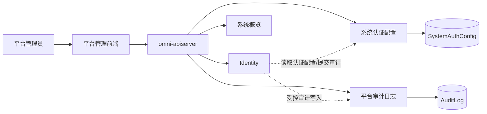
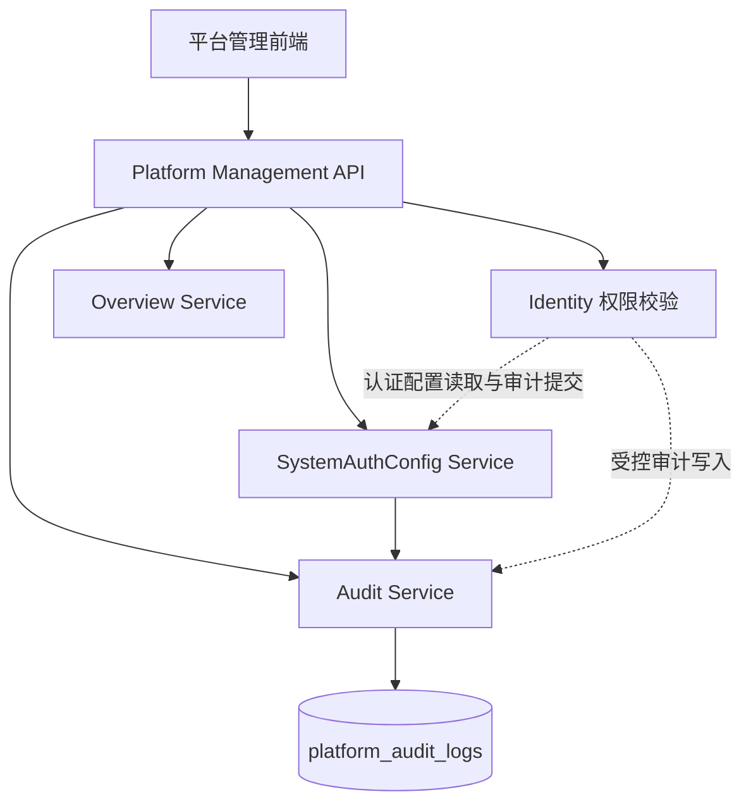

# OmniMAM 平台管理功能设计

> 文档状态：S1
> 文档版本：v1.1.0
> 修订日期：2026-08-03
> 当前范围：系统概览（基础信息与审计摘要）、系统认证配置、平台审计日志
> 后端归属：`omni-apiserver`
> 前端模块：平台管理（Platform Management）

---

## 1. 文档目的

本文档定义 OmniMAM 平台管理模块第一阶段的功能范围、模块职责、数据模型、接口设计及与现有模块的边界。

平台管理用于承载 OmniMAM 的系统级管理功能，当前阶段只实现以下三个子模块：

1. 系统概览
2. 系统认证配置
3. 审计日志

其他系统管理能力仅保留前端入口，不在当前阶段实现对应业务逻辑、数据模型和后端接口。

---

## 2. 模块定位

平台管理负责 OmniMAM 平台自身的只读系统信息、系统认证配置和管理操作审计。

本次迁移后，`SystemAuthConfig` 与 `AuditLog` 的事实源归平台管理。Identity 继续负责认证流程、密码校验、会话和授权计算，但通过受控模块接口读取生效的 `SystemAuthConfig`，并向平台管理提交脱敏审计记录。

平台管理不负责以下业务：

* 用户管理
* 角色管理
* 权限管理
* 登录认证流程和会话生命周期
* 登录会话管理
* 业务应用管理
* 模型管理
* 任务执行
* 素材管理
* 基础设施运行操作

其中用户、角色、权限和会话统一归 Identity 管理；认证策略配置和审计事实归平台管理。

平台管理通过 Identity 获取：

* 当前用户身份
* 当前用户权限
* 操作者信息
* 管理接口访问结果

Identity 通过平台管理获取：

* 当前生效的 `SystemAuthConfig`
* 脱敏审计写入能力

平台管理不重复维护 `User`、`Role`、`Permission`、`Policy` 等 IAM 对象。

---

## 3. 功能范围

### 3.1 当前实现范围

```text
平台管理
├── 系统概览
├── 系统认证配置
└── 审计日志
```

### 3.2 保留入口

以下模块当前仅保留前端导航和占位页面：

```text
平台管理
├── 基础设施       未实现
├── 服务与组件     未实现
├── 存储管理       未实现
└── 系统维护       未实现
```

保留入口不应产生以下实现：

* 不创建后端数据模型
* 不创建空业务接口
* 不展示模拟数据
* 不提供不可执行的操作按钮
* 不提前实现对应 Service
* 不直接调用 Docker、Kubernetes 或操作系统接口

---

## 4. 导航与路由

### 4.1 导航结构

```text
平台管理
├── 系统概览
├── 系统认证配置
├── 审计日志
├── 基础设施
├── 服务与组件
├── 存储管理
└── 系统维护
```

### 4.2 前端路由

```text
/platform/overview
/platform/auth-config
/platform/audit-logs

/platform/infrastructure
/platform/services
/platform/storage
/platform/maintenance
```

前三个路由进入实际功能页面。

后四个路由统一使用 `ComingSoonPage`，根据路由显示对应模块说明。

### 4.3 占位页面要求

占位页面至少显示：

* 模块名称
* 当前状态：尚未实现
* 后续负责的能力范围
* 返回平台概览的操作入口

示例：

```text
基础设施

该模块尚未实现。

后续用于管理 Runtime Provider、计算节点、
Docker Host、Kubernetes Cluster 和 Edge Node。
```

---

## 5. 总体架构

平台管理当前不拆分为独立微服务，作为 `omni-apiserver` 内部的一个管理域实现。



### 5.1 后端职责

`omni-apiserver` 中的平台管理域负责：

* 管理接口权限校验
* 只读平台信息提供
* 系统认证配置维护
* 受控审计写入与查询
* 审计事件写入
* 审计日志查询

### 5.2 IAM 职责

IAM 负责：

* 用户身份认证
* 用户管理
* 角色管理
* 权限管理
* Access Token 校验
* 管理接口访问控制
* 认证流程、会话、用户、RBAC 和服务账号事实
* 按平台管理提供的配置执行认证策略
* 向平台管理提交脱敏审计记录

---

## 6. 权限边界

平台管理不定义新的用户或角色模型。

平台管理接口使用 IAM 提供的权限标识进行访问控制。

第一阶段建议至少定义以下平台管理权限：

```text
platform.overview.read

platform.auth_config.read
platform.auth_config.manage

platform.audit.read
```

### 6.1 权限原则

* 系统概览仅需要只读权限。
* 系统认证配置读取与修改应使用不同权限。
* 审计日志默认只读。
* 高风险操作必须写入审计日志。
* 平台管理不自行判断用户角色，只判断 IAM 返回的权限结果。
* `ADMIN` 默认获得 `platform.overview.read`、`platform.auth_config.read`、`platform.audit.read`。
* `SUPER_ADMIN` 默认获得上述只读权限和 `platform.auth_config.manage`。
* Platform 的 `permissions.yaml` 中 `default_roles` 必须由 Identity 物化为内置角色的 `RolePermissionGrant`；仅登记权限码而未建立默认角色授权不能视为初始化完成。

---

# 7. 系统概览

## 7.1 功能定位

系统概览提供 OmniMAM 的只读平台基础信息和最近管理操作摘要。

系统概览不是完整的基础设施监控或可观测性系统。

当前阶段不引入 Prometheus、Grafana 或新的指标采集服务。

---

## 7.2 页面内容

当前阶段系统概览只包含以下区域：

```text
系统概览
├── 平台基本信息
└── 最近管理操作
```

---

## 7.3 平台基本信息

展示内容：

* 平台名称
* OmniMAM 版本
* 部署环境
* 部署模式
* 系统时区
* 系统启动时间
* 系统运行时长

示例：

```json
{
  "platform_name": "OmniMAM",
  "version": "1.0.0",
  "environment": "production",
  "deployment_mode": "standalone",
  "timezone": "Asia/Shanghai",
  "started_at": "2026-08-02T08:00:00+08:00",
  "uptime_seconds": 21600
}
```

`deployment_mode` 第一阶段可使用以下枚举：

```text
standalone
distributed
```

该字段只描述当前部署形态，不控制实际基础设施行为。

平台名称、时区、版本和部署信息在当前阶段均为只读运行时或部署元数据，不提供 Platform 在线配置入口。

---

## 7.4 下一阶段的跨域业务统计

以下统计从当前阶段系统概览移至下一阶段，不在当前 Platform S1 验收范围内：

* 素材数量，由 `asset-library` 提供。
* 应用数量，由 `application-platform` 提供。
* 模型数量，由 `model-management` 或 `modelgateway` 按明确事实口径提供。
* 任务数量和运行摘要，由 `task-center` 提供。
* 系统通知和未读数量，由 `notification-center` 提供。

下一阶段必须先定义权限裁剪、统计时间点、批量摘要接口、来源可用性和当前用户范围，Platform 不复制上述 domain 的统计事实。

---

## 7.5 任务运行摘要

任务运行摘要移至下一阶段。任务重试、取消、依赖、Worker 调度和 `TaskAttempt` 仍由 `task-center` 负责，Platform 当前不展示或操作任务状态。

---

## 7.6 系统通知摘要

系统通知摘要和未读数量移至下一阶段。通知事实、收件箱、已读状态和未读计数仍由 `notification-center` 负责，Platform 当前不读取其私有表。

---

## 7.7 最近管理操作

展示最近的平台管理审计事件：

* 系统认证配置修改

当前只筛选 `action=platform.auth_config.update`，默认按 `occurred_at DESC, id DESC` 展示最近 10 条。Identity 登录、Token 和权限等高频审计仍可在审计日志页面查询，但不进入第一阶段概览摘要。

数据直接来自审计日志，不维护独立事件表。

---

## 7.8 暂不实现的概览数据

第一阶段不展示：

* 主机 CPU 使用率
* 主机内存使用率
* GPU 使用率
* GPU 显存使用率
* Docker 容器状态
* Kubernetes Pod 状态
* Runtime 实例拓扑
* 节点网络状态
* 磁盘 IOPS
* 服务重启入口

这些能力后续分别归入基础设施和服务与组件模块。

---

## 7.9 接口设计

### 获取系统概览

```http
GET /api/v1/platform/overview
```

响应示例：

```json
{
  "platform": {
    "platform_name": "OmniMAM",
    "version": "1.0.0",
    "environment": "production",
    "deployment_mode": "standalone",
    "timezone": "Asia/Shanghai",
    "started_at": "2026-08-02T08:00:00+08:00",
    "uptime_seconds": 21600
  },
  "recent_audit_logs": []
}
```

跨域统计的部分可用响应和来源不可用标记属于下一阶段，不在当前接口契约中定义。

当前概览由平台运行时/部署元数据和平台审计模块组成：平台名称固定为 `OmniMAM`，最近管理操作取最近 10 条脱敏审计摘要。没有审计记录时返回空列表；运行元数据或审计读取边界不可用时返回稳定业务错误，不返回模拟数据或不完整的成功响应。

---

# 8. 系统认证配置

## 8.1 功能定位

系统认证配置用于维护 OmniMAM 的注册模式、密码策略、登录失败保护、在线窗口和 Token 生命周期。用户注册和认证执行仍由 Identity 负责。

```yaml
system_auth:
  registration_mode: ADMIN_APPROVAL
  allow_registration: false
  password_policy:
    min_length: 12
    max_length: 128
    require_uppercase: true
    require_lowercase: true
    require_digit: true
    require_special_character: false
    disallow_username: true
  login_failure_policy:
    max_failed_attempts: 5
    failure_window_seconds: 900
    lockout_duration_seconds: 900
  online_presence_window_seconds: 300
  access_token_lifetime: 900
  refresh_token_lifetime: 2592000
```

字段说明：

| 配置键                         | 类型      | 说明         |
| --------------------------- | ------- | ---------- |
| `system_auth.registration_mode` | ENUM | `OPEN` 或 `ADMIN_APPROVAL` |
| `system_auth.allow_registration` | BOOLEAN | 由 `registration_mode` 派生的兼容展示值；`OPEN` 时为 true |
| `system_auth.password_policy` | OBJECT | 密码长度、字符要求和用户名排除规则 |
| `system_auth.login_failure_policy` | OBJECT | 连续失败计数窗口、锁定阈值和锁定时长 |
| `system_auth.online_presence_window_seconds` | INTEGER | 在线状态判定窗口，单位为秒 |
| `system_auth.access_token_lifetime` | INTEGER | Access Token 生命周期，单位为秒 |
| `system_auth.refresh_token_lifetime` | INTEGER | Refresh Token 生命周期，单位为秒 |

用户注册和认证逻辑仍由 Identity 执行。

平台管理维护 `SystemAuthConfig`，Identity 通过受控内部接口读取当前生效配置。客户端不得直接向 Identity 提交认证配置，也不得把 `allow_registration` 作为 Identity 私有字段写入。

## 8.2 SystemAuthConfig 所有权与消费

`SystemAuthConfig` 是平台管理拥有的系统级配置对象，当前包含：

```text
registration_mode: OPEN | ADMIN_APPROVAL
allow_registration: 由 registration_mode 派生的只读兼容值
password_policy
password_hash_policy: ARGON2ID_V1（固定，不可通过管理接口切换）
login_failure_policy
online_presence_window_seconds: 默认 300
access_token_lifetime
refresh_token_lifetime
resource_version: 乐观并发版本
```

`password_policy` 当前固定包含：

```text
min_length: 8..64
max_length: 64..256，且不得小于 min_length
require_uppercase: boolean
require_lowercase: boolean
require_digit: boolean
require_special_character: boolean
disallow_username: boolean
```

`login_failure_policy` 当前固定包含：

```text
max_failed_attempts: 3..20
failure_window_seconds: 60..86400
lockout_duration_seconds: 60..86400
```

`online_presence_window_seconds` 取值为 `30..3600`；`access_token_lifetime` 取值为 `300..86400`；`refresh_token_lifetime` 取值为 `3600..31536000`，且必须大于 `access_token_lifetime`。上述生命周期字段的单位均为秒。

第一阶段使用单例配置 `id=default`。管理端完整替换配置时必须携带读取到的 `resource_version`；版本已变化时返回版本冲突且不覆盖新版本。成功更新后版本递增，配置、脱敏 AuditLog 和配置变更 Outbox 在平台管理边界内原子提交；任一步失败都不得改变当前生效版本。

平台管理负责读取、校验、版本化和审计配置变更。Identity 负责在注册、登录、改密、Token 签发和在线状态判定时读取同一份生效配置。`password_hash_policy` 固定返回当前 `ARGON2ID_V1` 基线，但不接受客户端写入。

Identity 不得复制 `SystemAuthConfig` 到自己的私有表，也不得缓存超过配置版本允许的时间。配置更新成功后通过可靠事件通知 Identity；事件延迟期间，认证入口以平台管理当前版本读取结果为准。

认证配置更新失败、配置缺失或校验不通过时，Identity 不得猜测默认值放行受保护操作；匿名注册按当前有效 `registration_mode` 判定。

---

# 9. 审计日志

## 9.1 功能定位

审计日志记录系统管理行为，用于追踪：

* 谁执行了操作
* 在什么时间执行
* 操作了什么资源
* 操作是否成功
* 操作前后发生了什么变化
* 操作来自哪个请求和客户端

审计日志不替代：

* 任务运行日志
* Application 执行日志
* Agent 会话日志
* 服务运行日志
* 调试日志
* 业务事件记录

---

## 9.2 当前记录范围

当前阶段至少记录以下操作：

### 系统认证配置

```text
platform.auth_config.update
```

### Identity 敏感操作

Identity 的以下敏感操作必须通过受控审计写入进入平台审计：

```text
注册提交、批准和拒绝
登录成功、登录失败和账号锁定
Token 刷新、Refresh Token 重用、单会话登出和全部设备登出
修改密码和初始密码重新生成
用户创建、启用、禁用和删除
角色分配、角色权限修改和用户组成员变化
资源共享、共享撤销、权限拒绝和跨 owner 授权操作
服务账号创建、启用、禁用、凭据轮换和凭据撤销
```

`action` 使用来源 domain 登记的稳定点分标识，例如 `iam.auth.login`、`iam.token.refresh`、`iam.service_account.credential_rotate`。Platform 校验来源服务主体与 `source_domain/source_module` 的登记关系，但不替代来源 domain 定义动作语义。

Identity 只提供脱敏来源上下文；AuditLog 的追加、存储、查询和可靠事件均由平台管理负责，平台管理不得回查 Identity 私有表补齐字段。敏感操作必须同步确认 AuditLog 已追加；来源可靠事件只可补偿非敏感诊断记录，不能替代 fail-closed 写入。

---

## 9.3 审计日志模型

设计态逻辑表名：

```text
platform_audit_logs
```

数据模型：

```json
{
  "id": "audit_01",
  "source_domain": "identity",
  "source_module": "authn",
  "principal_type": "USER",
  "principal_id": "user_01",
  "actor_user_id": null,
  "action": "iam.user.disable",
  "target_type": "user",
  "target_id": "user_02",
  "owner_user_id": "user_02",
  "result": "SUCCESS",
  "request_id": "req_01",
  "trace_id": "trace_01",
  "ip_address": "192.168.1.20",
  "user_agent": "Mozilla/5.0",
  "detail": {
    "before": {
      "status": "ACTIVE"
    },
    "after": {
      "status": "DISABLED"
    }
  },
  "occurred_at": "2026-08-02T13:59:59+08:00",
  "created_at": "2026-08-02T14:00:00+08:00"
}
```

---

## 9.4 字段说明

| 字段              | 类型        | 必填 | 说明             |
| --------------- | --------- | -: | -------------- |
| `id`            | VARCHAR   |  是 | 审计日志 ID        |
| `source_domain` | VARCHAR   |  是 | 产生审计上下文的 domain |
| `source_module` | VARCHAR   |  是 | 来源模块           |
| `principal_type` | VARCHAR   |  是 | USER、SERVICE_ACCOUNT 或 ANONYMOUS |
| `principal_id`  | VARCHAR   |  否 | 实际认证主体 ID     |
| `actor_user_id` | VARCHAR   |  否 | 受控委托用户 ID     |
| `action`        | VARCHAR   |  是 | 操作标识           |
| `target_type`   | VARCHAR   |  否 | 目标资源类型         |
| `target_id`     | VARCHAR   |  否 | 目标资源 ID         |
| `owner_user_id` | VARCHAR   |  否 | 目标资源所有者 ID     |
| `result`        | VARCHAR   |  是 | SUCCESS、FAILED 或 DENIED |
| `reason_code`   | VARCHAR   |  否 | 稳定原因码           |
| `request_id`    | VARCHAR   |  否 | 请求链路 ID        |
| `trace_id`      | VARCHAR   |  否 | Trace 链路 ID     |
| `ip_address`    | VARCHAR   |  否 | 客户端 IP         |
| `user_agent`    | TEXT      |  否 | 客户端 User-Agent |
| `detail`        | JSON      |  否 | 有界脱敏详情         |
| `idempotency_key` | VARCHAR | 是 | 来源操作幂等键       |
| `occurred_at`   | TIMESTAMP |  是 | 来源操作发生时间      |
| `created_at`    | TIMESTAMP |  是 | 平台接收并创建审计记录的时间 |

操作结果：

```text
SUCCESS
FAILED
DENIED
```

---

## 9.5 审计事件写入规则

* 管理操作成功时写入成功事件。
* 管理操作失败时，根据操作类型写入失败事件。
* 权限拒绝由来源 domain 通过平台审计边界记录。
* 审计写入是平台管理的追加操作，不得由客户端直接提交。
* 平台认证配置变更与其 AuditLog、Outbox 必须在平台管理边界内原子提交。
* 登录、密码、Token、授权、服务账号和跨 owner 操作必须在返回成功前确认 AuditLog 已追加；追加失败时不得留下可用会话、凭据或授权效果，来源 domain 必须回滚、撤销或补偿后返回稳定错误。
* 非敏感诊断事件可以通过可靠事件异步补偿，但不得伪造已写入的 AuditLog。
* 幂等键以 `source_domain + source_module + idempotency_key` 为作用域；同一作用域和相同内容重复提交返回原记录，不得重复追加；内容不同则返回稳定幂等冲突错误。
* 审计日志只能追加，不能通过业务接口修改。
* 第一阶段不提供审计日志删除接口。
* 后续数据归档应通过系统维护模块处理。

---

## 9.6 敏感字段脱敏

审计日志禁止记录：

* API Key 明文
* Secret 明文
* Password
* Authorization Header
* Cookie
* 完整 Access Token
* Refresh Token
* OAuth Client Secret
* 加密前的凭据内容
* 加密后的完整密文
* 系统主密钥
* 完整数据库连接字符串

允许展示的业务字段必须在来源 domain 白名单中；命中禁止字段时整条记录被拒绝，不得仅依赖字符串替换后继续保存。面向管理员展示的非敏感遮罩值可以统一为：

```json
{
  "api_key": "***",
  "password": "***",
  "client_secret": "***"
}
```

对于配置更新，只记录非敏感字段变化：

```json
{
  "before": {
    "registration_mode": "ADMIN_APPROVAL"
  },
  "after": {
    "registration_mode": "OPEN"
  }
}
```

不得记录密码、Token、Secret 或其他敏感值。`detail` 的 UTF-8 JSON 编码不得超过 16 KiB，嵌套深度不得超过 4 层；超限或包含禁止字段时返回审计记录无效错误。

---

## 9.7 审计上下文

来源 domain 提交的审计上下文分为四组：

```text
来源：source_domain、source_module、idempotency_key、occurred_at
主体：principal_type、principal_id、actor_user_id
目标与结果：action、target_type、target_id、owner_user_id、result、reason_code
链路与最小详情：request_id、trace_id、ip_address、user_agent、detail
```

Platform 根据已认证服务主体校验来源登记和委托链；调用方不能用请求字段伪造其他 domain 或主体。审计模块不回查来源私有表，也不推断业务变更内容；来源 domain 只提交完成审计所需的明确、最小、脱敏事实。`occurred_at` 最多允许比平台可信时间晚 5 分钟，`created_at` 始终由平台管理生成。

---

## 9.8 查询能力

审计日志支持以下查询条件：

* 开始时间
* 结束时间
* 来源 domain
* 来源模块
* Principal ID
* 操作类型
* 目标类型
* 目标 ID
* 操作结果
* Request ID
* 关键词

开始/结束时间默认筛选 `occurred_at`；`created_after/created_before` 可用于按平台接收时间诊断延迟。关键词只在 `action`、`reason_code`、`request_id`、`target_type` 和 `target_id` 等已索引非敏感字段中搜索，不扫描 `detail`。

默认排序：

```text
occurred_at DESC, id DESC
```

---

## 9.9 接口设计

### 查询审计日志

```http
GET /api/v1/platform/audit-logs
```

查询示例：

```http
GET /api/v1/platform/audit-logs?source_domain=identity&result=FAILED&page_num=0&page_size=20
```

### 获取审计日志详情

```http
GET /api/v1/platform/audit-logs/{id}
```

### 分页响应示例

```json
{
  "items": [
    {
      "id": "audit_01",
      "source_domain": "identity",
      "source_module": "authn",
      "principal_type": "USER",
      "principal_id": "user_01",
      "action": "iam.user.disable",
      "target_type": "user",
      "target_id": "user_02",
      "result": "SUCCESS",
      "request_id": "req_01",
      "ip_address": "192.168.1.20",
      "occurred_at": "2026-08-02T13:59:59+08:00",
      "created_at": "2026-08-02T14:00:00+08:00"
    }
  ],
  "total": 1
}
```

审计日志不提供：

```http
POST   /api/v1/platform/audit-logs
PUT    /api/v1/platform/audit-logs/{id}
DELETE /api/v1/platform/audit-logs/{id}
```

审计日志只能由内部模块写入。

---

# 10. 模块调用关系



---

# 11. 关键业务流程

## 11.1 SystemAuthConfig 管理

系统管理员通过 Platform API 读取或完整替换 `SystemAuthConfig`。Platform 在保存前校验 `resource_version`、注册模式、密码策略、登录失败保护、在线窗口和 Token 生命周期。校验通过后，配置新版本、脱敏 AuditLog 和配置变更 Outbox 原子提交；成功响应返回新版本。Identity 收到变更提示后重新读取完整配置，不从事件 payload 拼装部分策略。

# 12. 后端模块边界

当前平台管理作为 `omni-apiserver` 内部领域实现。

实现必须维持 `overview`、`auth-config` 和 `audit` 三个职责边界：Overview 只组合运行元数据与审计摘要；Auth Config 拥有配置校验和版本提交；Audit 拥有来源校验、脱敏、幂等追加、查询和 Outbox。具体代码目录、Handler、Service 和 Repository 组织由实现仓库决定，不属于 S1 产品事实。

---

# 13. 前端页面设计

## 13.1 系统概览

页面包含：

* 平台基本信息卡片
* 最近管理操作

跨 domain 统计卡片、任务摘要和通知摘要属于下一阶段，当前页面不展示占位数据或不可执行的跳转。

---

## 13.2 系统认证配置

页面展示当前配置版本和全部可写策略，`allow_registration` 与固定密码哈希基线只读。保存使用完整替换和当前 `resource_version`；版本冲突时保留用户输入，重新加载最新配置后由管理员决定是否再次提交，不得静默覆盖。

---

## 13.3 审计日志

审计日志页面包含：

* 查询条件区
* 审计日志列表
* 审计详情抽屉或详情页

列表显示：

* 时间
* 操作者
* 模块
* 操作
* 资源
* 结果
* Request ID

详情显示：

* 请求来源
* 资源信息
* 操作结果
* 脱敏后的变更内容
* 错误码
* 错误信息

---

# 14. 关键失败结果

* 无权读取概览、认证配置或审计记录时返回不泄露额外事实的稳定业务错误。
* 认证配置字段非法时返回配置无效；`resource_version` 过期时返回版本冲突且不覆盖当前配置。
* 审计记录不存在与当前主体不可见使用同一结果。
* 审计查询时间范围、排序或筛选条件非法时返回查询无效。
* 审计内容含禁止字段、超出大小/嵌套限制或来源身份不匹配时返回记录无效。
* 同一来源幂等键对应不同内容时返回幂等冲突；平台审计边界不可用时返回可重试错误。

---

# 15. 数据库表建议

当前阶段需要的核心表：

```text
platform_system_auth_configs
platform_audit_logs
platform_outbox_events
```

不需要为以下保留模块创建数据库表：

```text
infrastructure
services
storage_management
maintenance
```

---

# 16. 非功能要求

## 16.1 安全

* 所有平台管理接口必须经过 IAM 权限校验。
* Secret 不得出现在日志和审计记录中。
* 高风险操作必须写入审计日志。
* 审计查询结果必须根据管理权限控制。

## 16.2 可用性

* SystemAuthConfig 更新失败时不得改变当前生效版本。
* 敏感操作的 AuditLog 追加失败时必须 fail closed。

## 16.3 性能

* 审计日志查询必须分页。
* 审计表应针对时间、操作者、模块和资源建立索引。

## 16.4 可追踪性

* 所有管理接口应携带 `request_id`。
* 审计日志应记录 `request_id`。
* 下游模块调用应继续传递同一请求链路标识。

---

# 17. 第一阶段验收范围

## 17.1 系统概览

* 能展示平台基本信息。
* 能展示最近审计操作。

## 17.2 系统认证配置

* 能通过平台管理读取和完整替换 `SystemAuthConfig`。
* `allow_registration` 与 `registration_mode` 保持一致。
* 能校验密码策略、登录失败策略、在线窗口和 Token 生命周期。
* 使用 `resource_version` 阻止并发覆盖；配置、审计与 Outbox 任一提交失败都不改变当前生效版本。
* Identity 使用平台当前生效版本执行注册、登录、改密、Token 和在线状态策略。

## 17.3 审计日志

* 能记录认证、凭据、授权和服务主体等跨 domain 管理操作。
* 能记录 SUCCESS、FAILED 和 DENIED 结果。
* 能按条件分页查询。
* 能区分来源操作发生时间和平台记录创建时间，同一来源幂等重试不会重复追加。
* 审计日志中不存在明文 Secret、密码、完整 Token 或原始请求正文。
* 审计日志不提供修改和删除接口。

## 17.4 保留入口

* 基础设施、服务与组件、存储管理、系统维护入口可访问。
* 页面明确显示尚未实现。
* 不展示模拟状态或无效操作按钮。
* 后端不创建对应空业务实现。

---

# 18. 当前阶段明确不实现

当前阶段不实现：

* 系统概览中的素材、应用、模型、任务和通知统计
* 用户与权限管理
* 自定义角色和权限策略
* Runtime Provider 管理
* Docker Host 管理
* Kubernetes Cluster 管理
* Edge Node 管理
* 服务启停和重启
* CPU、内存和 GPU 监控
* 存储后端在线配置
* 数据备份与恢复
* 系统升级
* 审计日志归档和清理
* 复杂配置发布和回滚

---

# 19. 最终边界

平台管理当前负责：

```text
只读系统概览基础信息
SystemAuthConfig 管理
系统管理审计
```

Identity 负责：

```text
用户
角色
权限
认证流程
会话
读取生效认证配置
提交脱敏审计记录
```

其他业务模块负责：

```text
读取和执行各自事实域配置
引用各自事实域凭据
提供概览统计数据
产生各自领域事件，并通过平台审计边界提交需要审计的管理操作
```

未实现的系统管理能力只保留前端入口，不提前建设后端模型和执行能力。

---

# 20. 迁移后的 S2 追溯锚点

## 20.1 业务规则

| 编号 | 业务规则 |
| --- | --- |
| `BR-PLATFORM-001` | `SystemAuthConfig` 的事实、版本和管理接口归平台管理；Identity 只负责认证执行和策略消费。 |
| `BR-PLATFORM-002` | `allow_registration` 是 `registration_mode` 的兼容派生值；`OPEN` 为 true，`ADMIN_APPROVAL` 为 false，客户端不得绕过 `registration_mode` 修改派生语义。 |
| `BR-PLATFORM-003` | `SystemAuthConfig` 的密码哈希算法基线不可由管理接口切换或降低；密码策略、登录失败保护、在线窗口和 Token 生命周期必须使用结构化约束校验。 |
| `BR-PLATFORM-004` | `AuditLog` 的存储、追加、脱敏、查询和可靠事件归平台管理；任何 domain 不得直接写入平台审计表。 |
| `BR-PLATFORM-005` | 登录、密码、Token、授权、服务账号、跨 owner 和认证配置等敏感操作无法追加审计时必须 fail closed。 |
| `BR-PLATFORM-006` | AuditLog 只保存最小脱敏上下文，不保存密码、完整 Token、凭据、原始请求 payload 或大型业务正文。 |
| `BR-PLATFORM-007` | Identity 和其他 domain 通过受控内部审计写入接口提交记录；平台管理校验来源身份、发生时间和来源域幂等键，不读取其他 domain 私有表拼装审计事实。 |
| `BR-PLATFORM-008` | 系统概览当前只提供只读平台运行/部署元数据和最近 10 条脱敏审计摘要，不复制或聚合其他 domain 的业务统计事实。 |
| `BR-PLATFORM-009` | 系统概览的运行元数据或审计读取边界不可用时返回稳定错误；无记录使用空列表，不得返回模拟数据或伪造成功状态。 |

## 20.2 用户故事

| 编号 | 用户故事 |
| --- | --- |
| `US-PLATFORM-001` | 作为系统管理员，我可以查看和修改平台拥有的 `SystemAuthConfig`，并看到当前生效版本。 |
| `US-PLATFORM-002` | 作为 Identity，我可以读取平台管理提供的当前认证配置，并据此执行注册、登录、密码、在线状态和 Token 策略。 |
| `US-PLATFORM-003` | 作为系统管理员，我可以分页查询跨 domain 的脱敏平台审计记录。 |
| `US-PLATFORM-004` | 作为 Identity 或其他受控 domain，我可以提交带主体、操作者、目标和结果的脱敏审计记录。 |
| `US-PLATFORM-005` | 作为系统管理员，我可以读取只包含平台基础信息和最近审计摘要的系统概览。 |

## 20.3 验收标准

- 平台管理可以读取和完整替换 `SystemAuthConfig`；非法生命周期、策略或注册模式被拒绝，过期 `resource_version` 不会覆盖当前版本。
- `allow_registration` 与 `registration_mode` 的返回值一致，Identity 注册流程使用平台当前生效配置。
- Identity 不再拥有 `SystemAuthConfig` 或 `AuditLog` 表、API、权限码和查询事实。
- 平台审计查询支持按 domain、module、principal、action、target、request、result 和发生时间范围分页过滤。
- 审计记录追加失败时，Identity 的敏感操作不会成功返回。
- 同一来源幂等键的相同记录重试返回原记录，不同内容返回幂等冲突。
- 审计 API、事件和详情均不暴露密码、完整 Token、Secret 或原始请求正文。
- 系统概览只返回平台运行/部署元数据和最近 10 条脱敏审计摘要，不返回素材、应用、模型、任务或通知统计。
- 系统概览无审计记录时返回空列表；运行元数据或审计读取边界不可用时返回稳定错误，不返回模拟数据。
