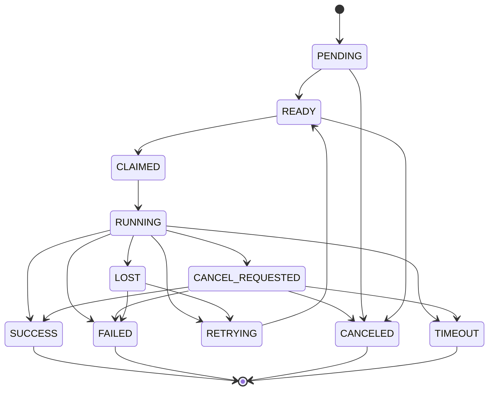
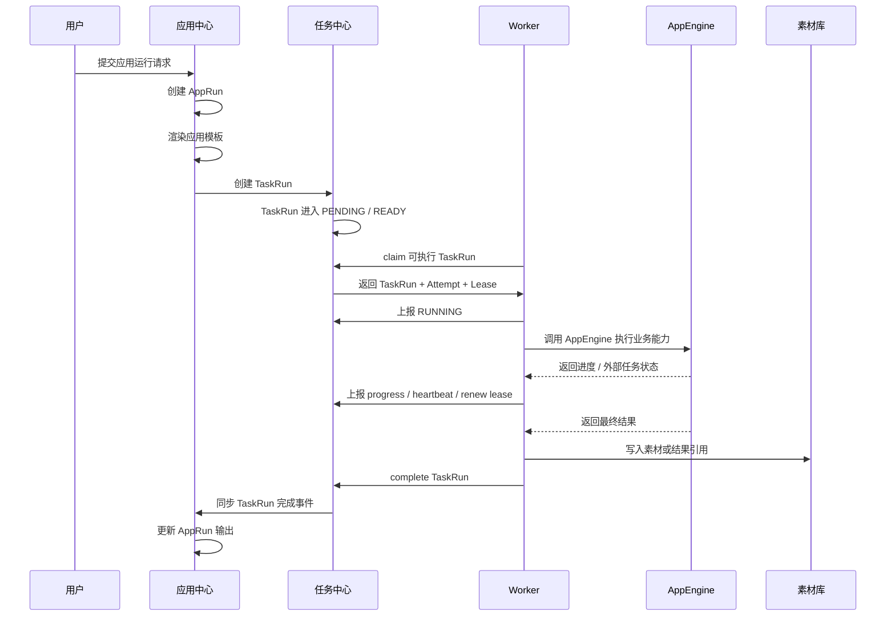
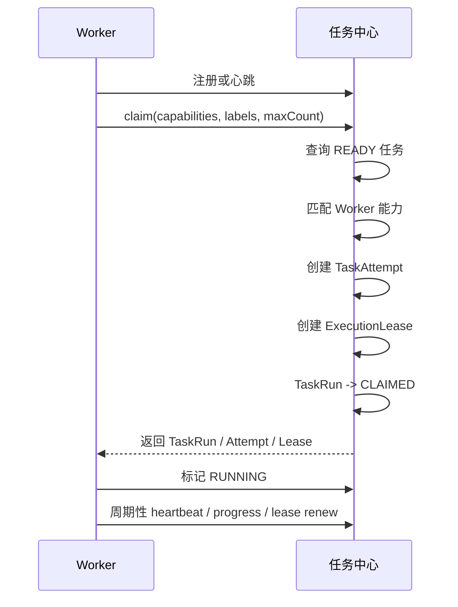
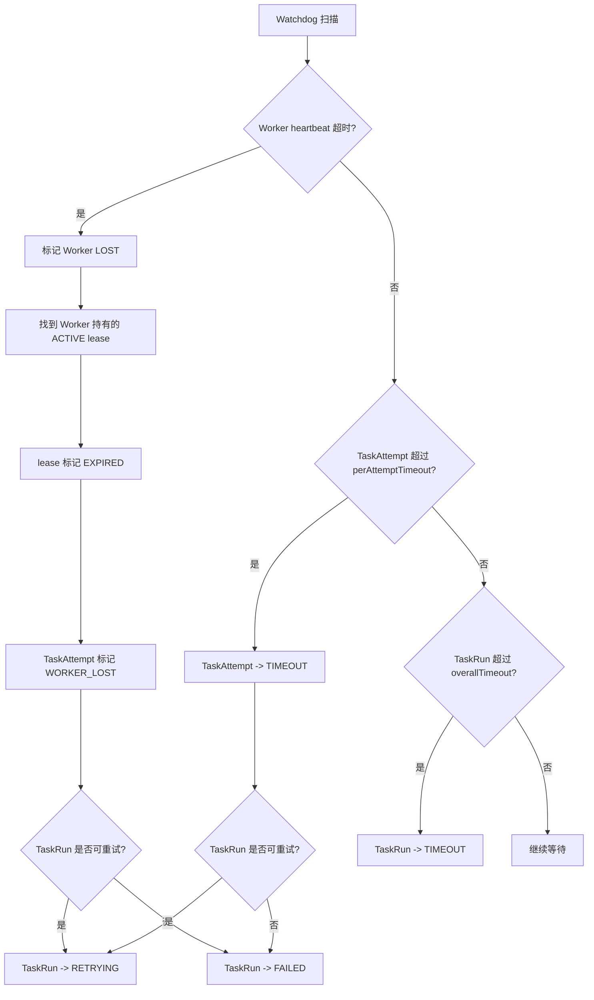
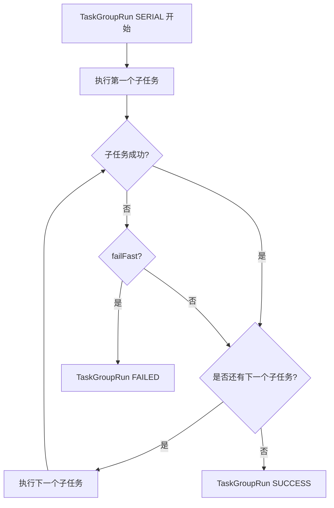
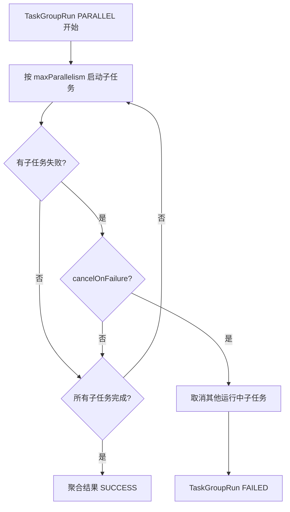
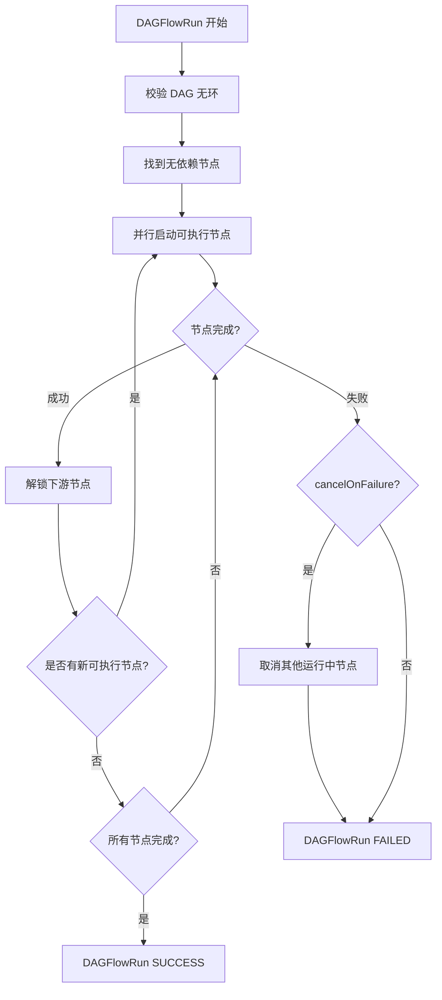

# 任务中心 S1 功能设计文档

## 1. 文档定位

本文档定义 OmniMAM 平台中“任务中心”的 S1 领域设计，用于描述异步任务执行与编排系统的业务目标、领域模型、核心流程、状态语义和业务规则。

本文档不直接定义数据库表结构、OpenAPI 细节、错误码区间或具体代码实现。后续 S2 阶段应基于本文档进一步生成 API、Schema、错误码、权限、模块契约和实现约束。

---

## 2. 背景与目标

OmniMAM 平台包含大量异步、长耗时、可组合的任务场景，例如：

* ComfyUI 工作流生图
* SaaS 生图服务调用
* LLM 写小说、生成文案、生成提示词
* TTS 长文本切片与并发合成
* 视频生成与视频后处理
* 图像分析、素材打标签、素材入库
* 无限画布节点编排执行
* 批量生成、串行处理、并行处理、DAG 依赖执行

这些任务具有以下共同特点：

* 执行耗时不可控
* 可能依赖 GPU、外部 SaaS、LLM 服务、ComfyUI 环境等外部能力
* 需要排队、重试、超时、取消、进度上报
* 需要记录每次执行失败的原因，方便排查
* 需要支持串行、并行、DAG 等不同编排方式
* 需要与应用中心、应用引擎、素材库、无限画布协同

因此，需要设计一个通用的任务中心，作为 OmniMAM 中异步执行与任务编排的底层能力。

---

## 3. 总体设计原则

### 3.1 底层对象稳定原则

任务中心的底层对象应保持简单、稳定、可组合。

底层核心对象包括：

* AtomicTask
* TaskGroup
* TaskRun
* TaskAttempt
* Worker
* ExecutionLease

其中 `TaskGroup` 只负责基础串行和并行组合，不强行承载所有复杂控制流。

当 `TaskGroup` 无法自然表达更复杂的依赖关系时，应创建更高阶的任务对象，例如 `DAGFlowTask`。

---

### 3.2 TaskGroup 简单化原则

`TaskGroup` 只支持两种类型：

```text
SERIAL
PARALLEL
```

其中：

* `SERIAL` 表示按顺序依次执行子任务。
* `PARALLEL` 表示并发执行多个子任务。
* `TaskGroup` 支持嵌套。
* `TaskGroup` 不直接表达任意 DAG。

如果需要表达如下结构：

```text
A → B
A → C
B + C → D
```

应使用 `DAGFlowTask`，而不是把复杂 DAG 强行塞进 `TaskGroup`。

---

### 3.3 定义与运行分离原则

任务定义和任务运行必须分离。

```text
Task Definition：描述要执行什么
TaskRun：描述某一次实际运行
TaskAttempt：描述某一次具体执行尝试
```

例如：

```text
AtomicTask
  ↓ 执行时创建
TaskRun
  ↓ 每次领取和执行创建
TaskAttempt
```

这样可以支持：

* 同一个任务定义多次运行
* 每次运行有独立状态
* 每次重试都有独立记录
* 每次失败都能追踪错误、Worker、日志和输入输出快照
* Worker 故障后可以恢复或重新调度

---

### 3.4 Worker 与 AppEngine 分层原则

任务中心中的 `Worker` 和应用中心中的 `AppEngine` 需要明确分工。

```text
Worker 负责任务中心侧的执行生命周期。
AppEngine 负责业务能力侧的具体执行逻辑。
```

也可以理解为：

```text
Worker 回答：谁领取任务、谁上报状态、谁推进任务生命周期？
AppEngine 回答：这个任务具体应该如何执行、调用什么能力、依赖什么运行环境？
```

Worker 不应直接承担复杂业务能力封装。Worker 领取 TaskRun 后，根据任务中的 `functionRef`、`appId`、`engineRef` 或执行上下文找到对应的 AppEngine，再由 AppEngine 完成具体执行。

---

### 3.5 协作式取消原则

任务取消不是强制杀死所有执行逻辑，而是由任务中心发出取消请求，Worker 和 AppEngine 协作响应。

对于 ComfyUI、SaaS API、LLM、GPU 长任务等外部执行场景，取消请求发出后，最终状态可能是：

```text
CANCELED
SUCCESS
FAILED
TIMEOUT
```

例如，任务中心发出取消请求时，外部任务可能已经完成。因此任务中心必须记录取消请求和最终状态，而不能假设取消一定立即成功。

---

### 3.6 故障可恢复原则

Worker 必须通过心跳、Lease 续约和进度上报证明自己仍在正常执行任务。

任务中心需要有内部 watchdog 扫描机制，定期检查：

* Worker 是否失联
* TaskRun 是否长时间 RUNNING 但无更新
* TaskAttempt 是否超过单次执行超时
* ExecutionLease 是否过期
* TaskRun 是否超过整体超时
* CANCEL_REQUESTED 是否长时间无响应

异常任务不应直接粗暴标记为业务失败，而应先判断异常类型，再根据重试策略决定是否重新调度或最终失败。

---

## 4. 系统边界

### 4.1 任务中心负责

任务中心负责异步任务的通用生命周期管理，包括：

* 创建任务运行实例
* 维护任务状态机
* 管理任务队列
* 管理 Worker 领取任务
* 管理 ExecutionLease
* 记录 TaskAttempt
* 处理重试
* 处理超时
* 处理取消
* 处理任务组编排
* 处理 DAGFlow 编排
* 记录状态历史
* 记录执行事件
* 提供任务查询与进度查询
* 支持故障扫描与恢复

---

### 4.2 任务中心不负责

任务中心不直接负责具体业务能力实现，例如：

* 不直接实现 ComfyUI 工作流执行细节
* 不直接实现 SaaS API 调用细节
* 不直接实现 LLM prompt 渲染和模型调用细节
* 不直接管理具体模型加载逻辑
* 不直接保存大型图片、视频、音频二进制内容
* 不直接承担应用表单、模板、应用发布等应用中心职责

这些能力应由应用中心、应用引擎、素材库或具体业务模块负责。

---

## 5. 与应用中心、应用引擎的关系

任务中心是底层异步执行系统，应用中心是用户可见的业务应用封装，应用引擎是具体执行能力和运行依赖的抽象。

### 5.1 应用中心

应用中心负责：

* App 定义
* AppVersion
* AppTemplate
* AppRun
* 用户输入表单
* 应用输出定义
* 应用可见性
* 应用发布
* 应用权限

例如：

```text
二次元头像生成器
小说章节生成器
商品图生成器
视频生成应用
TTS 配音应用
```

---

### 5.2 应用引擎

应用引擎负责描述和封装具体执行能力，例如：

* ComfyUI 引擎
* SaaS 生图引擎
* LLM 引擎
* TTS 引擎
* 视频生成引擎
* 本地模型推理引擎

AppEngine 关注：

* 能力在哪里
* 如何调用
* 支持什么输入输出
* 是否支持取消
* 是否支持进度查询
* 是否有并发限制
* 是否需要 API Key
* 是否依赖 GPU
* 是否可健康检查

---

### 5.3 Worker

Worker 是任务中心中的任务工作器，负责从任务中心领取 TaskRun，并按照任务中心协议维护该任务的执行生命周期。

Worker 负责：

* 注册自身能力
* 领取任务
* 获取 lease
* 定时 heartbeat
* 定时续约 lease
* 上报任务进度
* 响应取消请求
* 调用对应 AppEngine
* 写回成功结果
* 写回失败结果
* 记录外部任务 ID

Worker 本身不决定具体业务任务如何执行。具体执行逻辑由 AppEngine 决定。

---

### 5.4 推荐运行链路

```text
用户提交应用运行请求
  ↓
应用中心创建 AppRun
  ↓
应用中心渲染应用模板
  ↓
应用中心选择 AppEngine
  ↓
任务中心创建 TaskRun
  ↓
Worker 领取 TaskRun
  ↓
Worker 调用 AppEngine
  ↓
AppEngine 执行 ComfyUI / SaaS / LLM / TTS / 本地模型
  ↓
Worker 同步进度与结果
  ↓
任务中心更新 TaskRun 状态
  ↓
应用中心更新 AppRun 输出
```

简化表示：

```text
AppRun → TaskRun → Worker → AppEngine → Result
```

---

## 6. 用户故事

### 6.1 用户故事：运行一个应用（US-TASK-001）

作为业务用户，我希望在应用中心填写表单并提交运行请求，系统可以异步执行任务，并允许我查看运行进度和最终结果。

验收要点：

* 用户可以提交应用运行请求。
* 系统创建 AppRun 和 TaskRun。
* 用户可以查看任务状态。
* 用户可以查看任务进度。
* 任务完成后，用户可以查看输出结果。
* 任务失败后，用户可以查看失败原因。

---

### 6.2 用户故事：取消一个运行中的任务（US-TASK-002）

作为用户，我希望可以取消一个长时间运行的任务，避免继续消耗资源。

验收要点：

* 用户可以对运行中的 TaskRun 发起取消。
* TaskRun 进入取消请求状态。
* Worker 收到取消信号。
* AppEngine 尝试取消底层执行。
* 系统记录取消请求时间和最终状态。
* 如果取消前任务已经完成，系统允许最终状态为 SUCCESS。

---

### 6.3 用户故事：查看失败排查信息（US-TASK-003）

作为开发者或运维人员，我希望查看一个任务每次失败的详细记录，方便排查问题。

验收要点：

* TaskRun 记录最近一次错误摘要。
* TaskAttempt 记录每一次执行尝试。
* 每次失败都记录独立的错误信息。
* 失败信息包含失败类型、Worker、时间、日志引用、外部任务 ID。
* 重试不会覆盖历史失败记录。

---

### 6.4 用户故事：串行执行多个任务（US-TASK-004）

作为业务开发者，我希望将多个任务按顺序执行，例如先分析图片，再生成提示词，再调用生图应用。

验收要点：

* 可以创建 SERIAL TaskGroup。
* 子任务按顺序执行。
* 前一个子任务成功后才执行下一个。
* 任一子任务失败时，可以按策略决定是否中止。
* 串行组可以查询整体进度和每个子任务状态。

---

### 6.5 用户故事：并行执行多个任务（US-TASK-005）

作为业务开发者，我希望并行处理多个素材，提高处理效率。

验收要点：

* 可以创建 PARALLEL TaskGroup。
* 多个子任务可以并发执行。
* 可以限制组内最大并行数。
* 任一子任务失败时，可以按策略取消其他任务。
* 并行组可以聚合所有子任务结果。

---

### 6.6 用户故事：执行 DAG 编排（US-TASK-006）

作为无限画布用户，我希望将多个节点按依赖关系连接起来执行，而不是只能串行或并行。

验收要点：

* 可以创建 DAGFlowTask。
* DAGFlowTask 支持节点和边。
* 没有依赖的节点可以并行执行。
* 节点只有在依赖节点成功后才能执行。
* 任一节点失败时，可以按策略决定是否取消其他节点。
* 用户可以查看 DAG 中每个节点的运行状态。

---

### 6.7 用户故事：Worker 故障恢复（US-TASK-007）

作为系统运维人员，我希望 Worker 异常退出后，任务中心能识别故障并自动恢复或失败。

验收要点：

* Worker 定期上报 heartbeat。
* Worker 执行任务时定期续约 lease。
* 任务中心能识别 Worker 心跳超时。
* 任务中心能将对应 Attempt 标记为 WORKER_LOST。
* 如果任务允许重试，则 TaskRun 进入 RETRYING。
* 如果任务不可重试，则 TaskRun 进入 FAILED。

---

## 7. 核心领域模型

## 7.1 AtomicTask

AtomicTask 是最小不可再拆分的任务定义，表示一次异步函数调用模板。

AtomicTask 描述“要执行什么”，但不代表某一次实际运行。

### 核心字段

| 字段                   | 说明                                   |
| -------------------- | ------------------------------------ |
| taskId               | 原子任务定义 ID                            |
| name                 | 任务名称                                 |
| type                 | 固定为 ATOMIC                           |
| functionRef          | 函数引用，例如 `image.resize`、`app.execute` |
| defaultArguments     | 默认参数                                 |
| timeoutPolicy        | 默认超时策略                               |
| retryPolicy          | 默认重试策略                               |
| cancelPolicy         | 取消策略                                 |
| requiredCapabilities | 所需执行能力                               |
| tags                 | 标签                                   |
| projectId            | 所属项目                                 |
| namespace            | 命名空间                                 |
| createdBy            | 创建人                                  |
| createdAt            | 创建时间                                 |
| updatedAt            | 更新时间                                 |

---

## 7.2 TaskGroup

TaskGroup 是基础组合任务定义，可以包含 AtomicTask 或其他 TaskGroup。

TaskGroup 只支持 SERIAL 和 PARALLEL，不表达任意 DAG。

### 核心字段

| 字段             | 说明                |
| -------------- | ----------------- |
| groupId        | 任务组定义 ID          |
| name           | 任务组名称             |
| type           | SERIAL 或 PARALLEL |
| children       | 子任务引用列表           |
| strategyConfig | 组执行策略             |
| timeoutPolicy  | 组级超时策略            |
| retryPolicy    | 组级重试策略            |
| tags           | 标签                |
| projectId      | 所属项目              |
| namespace      | 命名空间              |
| createdBy      | 创建人               |
| createdAt      | 创建时间              |
| updatedAt      | 更新时间              |

### StrategyConfig

| 字段              | 说明                  |
| --------------- | ------------------- |
| failFast        | 串行组中子任务失败时是否立即中止    |
| cancelOnFailure | 并行组中任一任务失败时是否取消其他任务 |
| maxParallelism  | 并行组最大并发数            |
| resultPolicy    | 结果聚合策略              |

---

## 7.3 DAGFlowTask

DAGFlowTask 是高级任务编排对象，用于表达有向无环图依赖。

DAGFlowTask 不替代 TaskGroup，而是在 TaskGroup 无法表达复杂依赖时使用。

### 核心字段

| 字段             | 说明            |
| -------------- | ------------- |
| dagFlowId      | DAGFlow 定义 ID |
| name           | 名称            |
| type           | 固定为 DAG_FLOW  |
| nodes          | DAG 节点列表      |
| edges          | DAG 边列表       |
| inputMapping   | 初始输入映射        |
| outputMapping  | 最终输出映射        |
| strategyConfig | DAG 执行策略      |
| timeoutPolicy  | 整体超时策略        |
| retryPolicy    | DAG 级重试策略     |
| tags           | 标签            |
| projectId      | 所属项目          |
| namespace      | 命名空间          |
| createdBy      | 创建人           |
| createdAt      | 创建时间          |
| updatedAt      | 更新时间          |

### DAGNode

| 字段            | 说明                        |
| ------------- | ------------------------- |
| nodeId        | 节点 ID                     |
| name          | 节点名称                      |
| taskRef       | 引用 AtomicTask 或 TaskGroup |
| inputMapping  | 节点输入映射                    |
| outputMapping | 节点输出映射                    |
| timeoutPolicy | 节点级超时覆盖                   |
| retryPolicy   | 节点级重试覆盖                   |

### DAGEdge

| 字段          | 说明           |
| ----------- | ------------ |
| fromNodeId  | 上游节点         |
| toNodeId    | 下游节点         |
| condition   | 可选条件，第一版可不实现 |
| dataMapping | 输出到输入的数据映射   |

---

## 7.4 TaskRun

TaskRun 表示一次实际运行实例。

无论运行的是 AtomicTask、TaskGroup 还是 DAGFlowTask，都必须创建 TaskRun。

### 核心字段

| 字段             | 说明                         |
| -------------- | -------------------------- |
| runId          | 运行实例 ID                    |
| definitionType | ATOMIC、TASK_GROUP、DAG_FLOW |
| definitionId   | 对应定义 ID                    |
| parentRunId    | 父运行 ID                     |
| rootRunId      | 根运行 ID                     |
| status         | 当前运行状态                     |
| scheduleAt     | 计划开始时间                     |
| timeoutAt      | 整体超时截止时间                   |
| currentAttempt | 当前尝试次数                     |
| maxAttempts    | 最大尝试次数                     |
| progress       | 当前进度                       |
| input          | 本次运行输入                     |
| output         | 本次运行输出摘要                   |
| lastError      | 最近一次错误摘要                   |
| createdAt      | 创建时间                       |
| startedAt      | 首次开始时间                     |
| completedAt    | 完成时间                       |
| canceledAt     | 取消请求时间                     |
| createdBy      | 创建人                        |
| projectId      | 所属项目                       |
| namespace      | 命名空间                       |
| tags           | 标签                         |

### 说明

TaskRun 是前端和外部模块查询任务状态的主要对象。

对于复杂组合任务，可以通过 `rootRunId` 和 `parentRunId` 查询完整运行树。

---

## 7.5 TaskAttempt

TaskAttempt 表示某个 TaskRun 的一次具体执行尝试。

每次 Worker 领取并执行 TaskRun 时，都应创建新的 TaskAttempt。

### 核心字段

| 字段             | 说明         |
| -------------- | ---------- |
| attemptId      | 尝试 ID      |
| runId          | 所属 TaskRun |
| attemptNo      | 第几次尝试      |
| workerId       | 执行 Worker  |
| leaseId        | 本次执行 lease |
| status         | 尝试状态       |
| inputSnapshot  | 本次执行输入快照   |
| outputSnapshot | 本次执行输出快照   |
| error          | 本次失败错误     |
| startedAt      | 开始时间       |
| heartbeatAt    | 最近心跳时间     |
| progressAt     | 最近进度更新时间   |
| completedAt    | 完成时间       |
| durationMs     | 执行耗时       |
| retryable      | 是否可重试      |
| failureType    | 失败类型       |
| logsRef        | 日志引用       |
| externalJobId  | 外部任务 ID    |

### Attempt 状态

```text
CLAIMED
RUNNING
SUCCESS
FAILED
TIMEOUT
CANCELED
WORKER_LOST
LEASE_EXPIRED
STALLED
```

### 失败类型

```text
FUNCTION_ERROR
TIMEOUT
CANCELED
WORKER_LOST
LEASE_EXPIRED
EXTERNAL_EXECUTOR_ERROR
SYSTEM_ERROR
STALLED
```

---

## 7.6 Worker

Worker 是任务中心中的任务工作器，负责领取 TaskRun 并推进其执行生命周期。

Worker 不直接代表业务能力本身。业务能力由 AppEngine 描述。

### 核心字段

| 字段             | 说明           |
| -------------- | ------------ |
| workerId       | Worker ID    |
| workerType     | Worker 类型    |
| status         | Worker 状态    |
| capabilities   | Worker 可处理能力 |
| labels         | Worker 标签    |
| maxConcurrency | 最大并发数        |
| runningCount   | 当前运行任务数      |
| heartbeatAt    | 最近心跳时间       |
| registeredAt   | 注册时间         |
| lastSeenAt     | 最近可见时间       |

### Worker 状态

```text
ONLINE
BUSY
DRAINING
OFFLINE
LOST
DISABLED
```

---

## 7.7 ExecutionLease

ExecutionLease 表示 Worker 对某个 TaskRun 的临时执行权。

只有持有有效 lease 的 Worker 才能更新任务进度、完成结果或失败结果。

### 核心字段

| 字段         | 说明        |
| ---------- | --------- |
| leaseId    | Lease ID  |
| runId      | 任务运行 ID   |
| attemptId  | 当前尝试 ID   |
| workerId   | 持有 Worker |
| acquiredAt | 获取时间      |
| expireAt   | 过期时间      |
| renewedAt  | 最近续约时间    |
| status     | Lease 状态  |

### Lease 状态

```text
ACTIVE
RENEWED
EXPIRED
RELEASED
REVOKED
```

---

## 7.8 RetryPolicy

RetryPolicy 描述任务失败后的重试策略。

### 核心字段

| 字段                    | 说明                       |
| --------------------- | ------------------------ |
| maxRetries            | 最大重试次数，0 不重试，-1 无限重试     |
| retryDelay            | 初始重试间隔                   |
| backoffType           | FIXED、LINEAR、EXPONENTIAL |
| maxRetryDelay         | 最大重试间隔                   |
| retryableFailureTypes | 可重试失败类型                  |
| maxRetryDuration      | 最大重试总时长                  |

### 无限重试约束

当 `maxRetries = -1` 时，必须至少设置一种退出保护条件：

```text
overallTimeout
timeoutAt
maxRetryDuration
manualCancelRequired
```

不允许创建没有任何退出条件的无限重试任务。

---

## 7.9 TimeoutPolicy

TimeoutPolicy 描述任务超时策略。

### 超时类型

| 类型                | 说明             |
| ----------------- | -------------- |
| perAttemptTimeout | 单次执行尝试超时       |
| overallTimeout    | 整个 TaskRun 总超时 |

### 规则

* `perAttemptTimeout` 只影响当前 TaskAttempt。
* 单次执行超时后，如果仍可重试，TaskRun 进入 RETRYING。
* `overallTimeout` 命中后，TaskRun 直接进入 TIMEOUT。
* `overallTimeout` 优先级高于重试策略。

---

## 8. 状态模型

## 8.1 TaskRun 状态

```text
PENDING
READY
CLAIMED
RUNNING
RETRYING
CANCEL_REQUESTED
PAUSED
SUCCESS
FAILED
CANCELED
TIMEOUT
LOST
```

### 状态说明

| 状态               | 说明                     |
| ---------------- | ---------------------- |
| PENDING          | 已创建，等待调度条件满足           |
| READY            | 已满足调度条件，可被 Worker 领取   |
| CLAIMED          | 已被 Worker 领取，但尚未正式执行   |
| RUNNING          | 正在执行                   |
| RETRYING         | 上一次尝试失败，等待重试           |
| CANCEL_REQUESTED | 已请求取消，等待执行器响应          |
| PAUSED           | 暂停中，第一版可选              |
| SUCCESS          | 成功完成                   |
| FAILED           | 最终失败                   |
| CANCELED         | 已取消                    |
| TIMEOUT          | 整体超时                   |
| LOST             | Worker 丢失且无法恢复，或超过恢复策略 |

---

## 8.2 TaskRun 状态流转



---

## 9. 核心流程

## 9.1 应用运行到任务执行流程



---

## 9.2 Worker 领取任务流程



---

## 9.3 Worker 故障恢复流程



---

## 9.4 TaskGroup 串行执行流程



---

## 9.5 TaskGroup 并行执行流程



---

## 9.6 DAGFlowTask 执行流程



---

## 10. TaskGroup 重试语义

TaskGroup 失败后，组级重试必须明确重试模式。

### groupRetryMode

```text
FULL_RESTART
FAILED_ONLY
FROM_FAILED
```

### 说明

| 模式           | 说明           |
| ------------ | ------------ |
| FULL_RESTART | 整个组重新执行      |
| FAILED_ONLY  | 仅重试失败的子任务    |
| FROM_FAILED  | 串行组从失败节点继续执行 |

### 默认规则

* SERIAL 组默认使用 `FROM_FAILED`。
* PARALLEL 组默认使用 `FAILED_ONLY`。
* 使用 `FULL_RESTART` 时，业务必须保证幂等性，或接受重复执行。
* 子任务已成功的结果应记录并可复用。
* 组级重试必须保留历史 Attempt，不得覆盖失败记录。

---

## 11. Worker 与 AppEngine 协作规则

### 11.1 Worker 负责的事情

Worker 负责任务中心协议，包括：

* 从任务中心领取 TaskRun
* 获取 ExecutionLease
* 创建或绑定 TaskAttempt
* 标记任务开始运行
* 定时 heartbeat
* 定时续约 lease
* 上报 progress
* 接收 cancel 请求
* 调用 AppEngine
* 将 AppEngine 的执行结果写回任务中心
* 将 AppEngine 的错误写回 TaskAttempt
* 将外部任务 ID 写入 TaskAttempt

---

### 11.2 AppEngine 负责的事情

AppEngine 负责具体业务能力执行，包括：

* 渲染或接收业务参数
* 调用 ComfyUI API
* 调用 SaaS API
* 调用 LLM 服务
* 调用 TTS 服务
* 调用本地模型服务
* 查询底层执行进度
* 获取底层执行结果
* 执行底层取消逻辑
* 把底层错误转换为任务中心可识别的错误类型

---

### 11.3 Worker 与 AppEngine 的边界判断

```text
如果它描述“能力在哪里、怎么调用、支持什么”，它是 AppEngine。

如果它负责“领取任务、维护 lease、上报进度、写回结果”，它是 Worker。
```

示例：

| 对象                               | 归属        |
| -------------------------------- | --------- |
| ComfyUI API 服务地址                 | AppEngine |
| ComfyUI workflow 执行适配逻辑          | AppEngine |
| 领取 TaskRun 并调用 ComfyUI 引擎的进程     | Worker    |
| OpenAI API Key、endpoint、model 配置 | AppEngine |
| 调用 OpenAI 并同步结果的任务工作器            | Worker    |
| 本地 vLLM 服务                       | AppEngine |
| 领取小说生成任务并调用 vLLM 的工作器            | Worker    |

---

## 12. 故障扫描与 Watchdog

任务中心应包含内部 watchdog，用于周期性扫描异常运行状态。

watchdog 是任务中心内部维护逻辑，不是普通业务任务。

### 12.1 扫描目标

watchdog 需要扫描：

* Worker 长时间无 heartbeat
* TaskRun 长时间 RUNNING 但无 heartbeat
* TaskRun 长时间 RUNNING 但无 progress
* ExecutionLease 已过期
* TaskAttempt 超过 perAttemptTimeout
* TaskRun 超过 overallTimeout
* CANCEL_REQUESTED 长时间无响应

---

### 12.2 系统周期性调度

任务中心可以为系统内部维护任务周期性创建 TaskRun，例如 `asset.sha256_backfill`。

系统周期性调度负责：

* 按固定周期创建计划执行的 TaskRun。
* 使用 `scheduleAt` 表达计划开始时间。
* 维护 TaskRun 的领取、执行、重试、成功和失败状态。
* 将业务输入传递给对应业务模块或 AppEngine。

系统周期性调度不负责：

* 解释具体业务任务的执行逻辑。
* 直接读取或修改业务模块的数据。
* 直接计算素材 SHA256 checksum。

`asset.sha256_backfill` 的业务含义由素材库解释；任务中心只负责调度和执行生命周期。

---

### 12.3 异常处理规则

#### Worker 心跳超时

```text
Worker heartbeat 超时
  → Worker 标记 LOST
  → 找到该 Worker 持有的 ACTIVE lease
  → lease 标记 EXPIRED
  → TaskAttempt 标记 WORKER_LOST
  → 判断 TaskRun 是否可重试
      → 可重试：TaskRun -> RETRYING
      → 不可重试：TaskRun -> FAILED
```

#### Attempt 单次超时

```text
TaskAttempt 超过 perAttemptTimeout
  → TaskAttempt -> TIMEOUT
  → 判断 TaskRun 是否可重试
      → 可重试：TaskRun -> RETRYING
      → 不可重试：TaskRun -> FAILED
```

#### TaskRun 整体超时

```text
TaskRun 超过 overallTimeout
  → TaskRun -> TIMEOUT
  → 取消所有未完成子任务
  → 记录 timeout reason
```

#### RUNNING 长时间无进度

```text
Worker heartbeat 正常，但 TaskRun 长时间无 progress
  → TaskAttempt 标记 STALLED
  → 根据任务类型和策略决定：
      → 继续等待
      → 发出告警
      → 请求取消
      → 触发重试
```

---

## 13. 数据与结果存储原则

任务中心不应直接存储大型二进制内容。

### 13.1 参数存储

TaskRun 的 `input` 和 AtomicTask 的 `arguments` 只存小型结构化 JSON 参数。

大型输入应使用引用：

```text
assetId
fileId
storageUri
externalUrl
```

---

### 13.2 结果存储

TaskRun 的 `output` 只存结果摘要和引用。

图像、视频、音频、长文本、日志等应进入素材库、对象存储或专门日志系统。

示例：

```json
{
  "output": {
    "type": "image",
    "assetId": "asset_123",
    "storageUri": "s3://bucket/output/asset_123.png",
    "metadata": {
      "width": 1024,
      "height": 1024
    }
  }
}
```

---

### 13.3 失败记录

每次失败必须记录到 TaskAttempt。

TaskRun 只保留最近一次失败摘要，完整失败历史以 TaskAttempt 为准。

---

## 14. 事件与通知

任务中心在关键状态变化时产生事件。

### 事件类型

```text
task_run.created
task_run.ready
task_run.claimed
task_run.started
task_run.progress_updated
task_run.retrying
task_run.succeeded
task_run.failed
task_run.canceled
task_run.timeout
task_attempt.failed
worker.lost
lease.expired
dag_flow.completed
```

### 事件用途

事件可用于：

* 应用中心更新 AppRun 状态
* 前端实时刷新任务进度
* 审计日志记录
* 通知用户
* 触发下游流程
* 监控告警

第一版可以优先支持内部事件和查询接口，Webhook、消息队列、SSE、WebSocket 可后续扩展。

---

## 15. 权限与多租户

任务中心所有核心对象都必须支持项目和命名空间隔离。

核心对象包括：

* AtomicTask
* TaskGroup
* DAGFlowTask
* TaskRun
* TaskAttempt
* Worker
* AppEngine 关联引用
* 状态历史
* 审计日志

### 基础字段

```text
projectId
namespace
createdBy
ownerId
visibility
```

### 权限动作

任务中心至少需要支持以下权限动作：

```text
task:create
task:read
task:cancel
task:retry
task:delete
task:admin
worker:register
worker:manage
```

---

## 16. 运维与监控

### 16.1 健康检查

任务中心应提供健康检查能力，用于查看：

* 调度器状态
* Worker 在线数量
* Worker LOST 数量
* READY 队列长度
* RUNNING 任务数量
* RETRYING 任务数量
* lease 过期数量
* watchdog 状态

---

### 16.2 指标

任务中心应提供 Prometheus 风格指标，包括：

```text
task_run_total
task_run_success_total
task_run_failed_total
task_run_timeout_total
task_attempt_total
task_attempt_failed_total
worker_online_total
worker_lost_total
queue_ready_total
task_latency_seconds
task_duration_seconds
lease_expired_total
```

---

### 16.3 审计日志

需要记录以下操作：

* 任务创建
* 任务取消
* 任务重试
* 任务删除
* Worker 注册
* Worker 领取任务
* Worker 失联
* Lease 续约失败
* 状态变化
* 权限相关操作

---

## 17. 删除与保留策略

任务中心默认采用软删除。

### 规则

* 只有终态任务允许删除。
* 删除任务只标记 `deletedAt`。
* TaskAttempt、状态历史、审计日志默认不物理删除。
* 物理清理由 retention policy 统一处理。
* 对于素材输出，只删除任务引用，不直接删除素材本体。

终态包括：

```text
SUCCESS
FAILED
CANCELED
TIMEOUT
```

---

## 18. MVP 范围

### 18.1 第一版必须支持

```text
AtomicTask
TaskGroup: SERIAL / PARALLEL
DAGFlowTask: 基础 DAG，无条件分支
TaskRun
TaskAttempt
Worker register / heartbeat / claim
ExecutionLease
RetryPolicy
TimeoutPolicy
Cancel
Progress update
Watchdog 故障扫描
Task history
基础事件
与 AppRun / AppEngine 的运行链路
```

---

### 18.2 第一版暂缓支持

```text
PAUSE / RESUME
复杂条件 DAG
循环 DAG
Batch Window
复杂 CRON overlap
Webhook 订阅
复杂参数供应器 SPI
跨项目共享 Worker
复杂资源调度
自动拉起 GPU Worker
```

这些能力可以作为后续版本扩展。

---

## 19. 核心业务规则汇总

### 19.1 任务定义规则

1. BR-TASK-001：AtomicTask 只描述任务定义，不代表实际运行。
2. BR-TASK-002：TaskGroup 只支持 SERIAL 和 PARALLEL。
3. BR-TASK-003：DAGFlowTask 用于表达复杂 DAG 编排。
4. BR-TASK-004：TaskGroup 可以嵌套 TaskGroup。
5. BR-TASK-005：DAGFlowTask 的节点可以引用 AtomicTask 或 TaskGroup。
6. BR-TASK-006：DAGFlowTask 必须保证无环。

---

### 19.2 运行实例规则

1. BR-TASK-007：每次执行必须创建 TaskRun。
2. BR-TASK-008：每次 Worker 领取并执行必须创建 TaskAttempt。
3. BR-TASK-009：重试必须创建新的 TaskAttempt。
4. BR-TASK-010：TaskAttempt 历史不得被覆盖。
5. BR-TASK-011：TaskRun 只保存最近一次错误摘要。
6. BR-TASK-012：完整错误排查以 TaskAttempt 为准。

---

### 19.3 Worker 规则

1. BR-TASK-013：Worker 必须先注册或心跳后才能领取任务。
2. BR-TASK-014：Worker 只能领取与自身 capabilities 匹配的任务。
3. BR-TASK-015：Worker 领取任务后必须获得 ExecutionLease。
4. BR-TASK-016：只有持有有效 lease 的 Worker 可以更新任务状态。
5. BR-TASK-017：Worker 必须周期性 heartbeat。
6. BR-TASK-018：Worker 执行任务时必须周期性续约 lease。
7. BR-TASK-019：Worker 应周期性上报任务 progress。
8. BR-TASK-020：Worker 不决定具体业务执行逻辑，具体执行由 AppEngine 负责。

---

### 19.4 AppEngine 协作规则

1. BR-TASK-021：AppEngine 负责具体业务能力执行。
2. BR-TASK-022：Worker 负责调用 AppEngine 并同步状态。
3. BR-TASK-023：AppEngine 应尽量提供进度查询能力。
4. BR-TASK-024：AppEngine 如果支持取消，应向 Worker 暴露取消能力。
5. BR-TASK-025：AppEngine 返回的大型结果应写入素材库或对象存储。
6. BR-TASK-026：Worker 将结果引用写回 TaskRun。

---

### 19.5 Lease 规则

1. BR-TASK-027：同一个 TaskRun 同一时间只能有一个有效 lease。
2. BR-TASK-028：Lease 过期后，原 Worker 不允许继续提交成功结果。
3. BR-TASK-029：Lease 续约必须携带 workerId、attemptId 和 leaseId。
4. BR-TASK-030：Lease 过期后由 watchdog 回收。
5. BR-TASK-031：Lease 回收后是否重试由 RetryPolicy 决定。

---

### 19.6 重试规则

1. BR-TASK-032：单次失败是否可重试由 RetryPolicy 判断。
2. BR-TASK-033：`perAttemptTimeout` 触发后，如果可重试，TaskRun 进入 RETRYING。
3. BR-TASK-034：`overallTimeout` 触发后，TaskRun 直接进入 TIMEOUT。
4. BR-TASK-035：无限重试必须设置退出保护条件。
5. BR-TASK-036：重试不得覆盖旧 Attempt。

---

### 19.7 取消规则

1. BR-TASK-037：取消运行中任务时，TaskRun 先进入 CANCEL_REQUESTED。
2. BR-TASK-038：Worker 收到取消请求后，应调用 AppEngine 的取消能力。
3. BR-TASK-039：取消请求发出后，最终状态可能是 CANCELED、SUCCESS、FAILED 或 TIMEOUT。
4. BR-TASK-040：取消 TaskGroup 或 DAGFlowTask 时，应级联取消未完成子任务。
5. BR-TASK-041：已经进入终态的任务不可取消。

---

### 19.8 故障恢复规则

1. BR-TASK-042：Worker 心跳超时后标记为 LOST。
2. BR-TASK-043：Worker LOST 后，其持有的 lease 应标记为 EXPIRED。
3. BR-TASK-044：对应 TaskAttempt 应标记为 WORKER_LOST。
4. BR-TASK-045：如果 TaskRun 可重试，则进入 RETRYING。
5. BR-TASK-046：如果 TaskRun 不可重试，则进入 FAILED。
6. BR-TASK-047：Worker 正常但任务长时间无 progress，应标记为 STALLED 或触发告警。
7. STALLED 不等于 FAILED，应根据策略处理。

---

### 19.9 系统周期性调度规则

1. BR-TASK-048：任务中心可以为系统内部维护任务周期性创建 TaskRun。
2. BR-TASK-049：系统周期性调度应使用 TaskRun 的 `scheduleAt` 表达计划开始时间，并沿用现有 TaskRun 生命周期、重试和失败处理规则。
3. BR-TASK-050：任务中心不解释 `asset.sha256_backfill` 等业务任务的执行语义；具体扫描、计算和写回由所属业务 domain 负责。

---

### 19.10 结果存储规则

1. 任务中心不直接存储大型二进制结果。
2. 大型输入输出使用 assetId、fileId、storageUri 等引用。
3. 图像、视频、音频、长文本应进入素材库或对象存储。
4. 日志应使用 logsRef 引用。
5. TaskRun output 只保存摘要和引用。

---

## 20. 与后续 S2 的衔接要求

S2 阶段需要基于本文档进一步产出：

* 任务中心模块边界
* OpenAPI 设计
* 数据库 Schema
* 错误码定义
* 权限点定义
* 状态流转表
* Worker claim 并发一致性规则
* Lease 续约和过期规则
* TaskAttempt 错误结构
* AppRun 与 TaskRun 关联模型
* AppEngine 与 Worker 协议契约
* 审计日志结构
* 监控指标定义

所有后端 API 应遵守统一 API 前缀规则：

```text
/api/v1
```

---

## 21. 总结

任务中心的核心目标是构建一套稳定、可追踪、可恢复、可组合的异步任务底座。

最终抽象为：

```text
AtomicTask / TaskGroup / DAGFlowTask
  ↓
TaskRun
  ↓
TaskAttempt
  ↓
Worker claim + ExecutionLease
  ↓
Worker 调用 AppEngine
  ↓
AppEngine 执行业务能力
  ↓
Worker 写回状态和结果
```

其中：

* AtomicTask 是最小任务定义。
* TaskGroup 提供基础串行和并行组合。
* DAGFlowTask 提供复杂 DAG 编排。
* TaskRun 表示一次实际运行。
* TaskAttempt 记录每次执行尝试。
* Worker 负责任务中心执行协议。
* AppEngine 负责具体业务能力执行。
* Watchdog 负责故障扫描和恢复。
* 应用中心通过 AppRun 与任务中心打通用户可见的运行链路。

该设计能够支撑 OmniMAM 后续的应用执行、ComfyUI 工作流、生图任务、SaaS 服务调用、LLM 写作、TTS 分片并发、无限画布节点执行和复杂异步编排。
