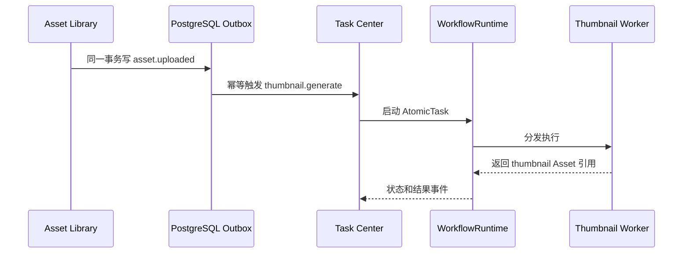
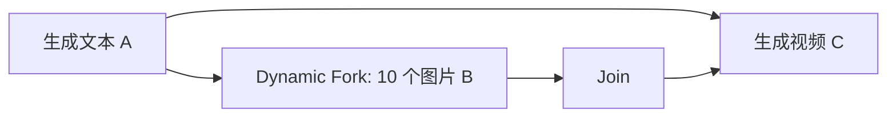

# 任务中心 S1 产品规格

## 1. 文档定位

本文档定义 OmniMAM 任务中心 `spec-v1.0.0` 的产品语义。任务中心向素材库、应用中心、无限画布和系统维护任务提供统一的异步执行、组合编排、周期调度、运行汇总和故障恢复能力。

本版本以 Conductor OSS 作为内部工作流运行时，但 Conductor 不是对外产品边界。用户、前端和其他领域只使用 Task Center API；任务中心负责权限、租户、幂等、业务资源、汇总查询与状态投影。

`spec-v0.9.3` 及更早版本中的 TaskDefinition、TaskRun、ExecutionLease、Worker claim 和自研 Dispatcher 语义从本版本起废弃，不得继续作为新实现依据。已 release 的 `BR-TASK-001..072` 和 `US-TASK-001..007` 仅保留历史追溯意义，不复用其编号表达新语义。

当前 S2 中保留的废弃错误码仍显式引用以下历史编号：`BR-TASK-001`、`BR-TASK-007`、`BR-TASK-013`、`BR-TASK-016`、`BR-TASK-037`、`BR-TASK-061`、`BR-TASK-068`、`US-TASK-001`、`US-TASK-002`、`US-TASK-004`、`US-TASK-005`、`US-TASK-007`。这些引用仅用于兼容审计，不允许实现旧执行路径。

---

## 2. 产品目标

任务中心必须覆盖以下场景：

1. 素材上传成功后可靠触发缩略图等派生任务。
2. 以轻量周期巡检并发检测应用中心 EngineInstance，只在需要异步修复时创建 AtomicTask。
3. 将 ComfyUI 生图拆为提交、轮询、下载制品等可恢复步骤。
4. 支持文本、图片、视频等多节点依赖和动态批量 fan-out/fan-in。
5. 支持无限画布用户发布任意合法无环工作流，并固定版本执行。
6. 查询 Schedule 的全部调度历史、Group/DAG 的全部子任务和 AtomicTask 的全部重试尝试。

任务中心不得重新实现队列、Worker lease、DAG 状态机、cron 触发器或运行历史存储。这些运行职责由已注册 WorkflowRuntime 承担。

---

## 3. 核心原则

### 3.1 AtomicTask 是唯一执行单元

`AtomicTask` 表示一次真实异步执行，不再区分 AtomicTask definition 与 TaskRun。

AtomicTask 同时包含：

```text
spec：functionRef、arguments、能力要求、超时、重试、取消和业务快照
status：当前状态、进度、当前尝试、结果摘要、最近错误和运行时绑定
```

Worker 只执行 AtomicTask。TaskGroup、DAGTaskGroup 和 TaskSchedule 不得作为 Worker 任务执行。

### 3.2 组合只包含 AtomicTask 模板

TaskGroup 和 DAGTaskGroup 只组合 AtomicTaskTemplate，不支持 Group 嵌套。每次创建组合资源都会形成新的 AtomicTask 子资源；再次运行组合必须创建新的组合资源。

### 3.3 运行历史不可覆盖

自动重试在同一个 AtomicTask 下创建新的 TaskAttempt。手动重试创建新的 AtomicTask，并通过 `retryOfTaskId` 和 `rootTaskId` 关联原任务。终态资源及历史 Attempt 不得被覆盖。

### 3.4 业务事实与运行事实分层

Task Center 是其他领域可见的业务事实源；WorkflowRuntime 是内部运行历史事实源。Task Center 通过运行时事件与周期对账维护单调递增的业务投影，其他领域不得直接读取 Conductor 状态。

### 3.5 大型内容只保存引用

任务输入输出只保存结构化参数、Artifact、Asset、日志或外部作业引用，不保存图片、视频、音频、PDF 和大文本正文。

### 3.6 周期调度区分作业历史与巡检状态

TaskSchedule 有两种互斥执行模式：

```text
MATERIALIZED：每轮创建 AtomicTask、TaskGroup 或 DAGTaskGroup，完整保留业务作业历史。
RECONCILE：每轮执行受控轻量巡检，不创建根 AtomicTask、TaskGroup 或 DAGTaskGroup，只保留单例状态与有限历史。
```

RECONCILE 可以在发现需要耗时、重试或产生外部副作用的修复时，按稳定幂等键请求 Task Center 创建已注册 functionRef 的 AtomicTask。查询、探测、比较、轻量投影更新和 outbox 事件属于巡检本身，不应为了保留每项检测历史而物化任务。

---

## 4. 核心领域对象

### 4.1 AtomicTask

AtomicTask 是最小执行资源。创建成功后立即进入运行生命周期。

| 字段 | 语义 |
| --- | --- |
| atomicTaskId | 业务任务 ID |
| functionRef | 已注册业务执行函数 |
| arguments | 本次不可变输入快照 |
| requiredCapabilities | Worker 路由能力 |
| retryPolicy | 自动重试策略 |
| timeoutPolicy | 单次与整体超时 |
| status | 当前业务状态 |
| progress | 0 到 1 的进度 |
| currentAttempt | 当前 Attempt 序号 |
| output | 结果摘要和引用 |
| lastError | 最近一次错误摘要 |
| retryOfTaskId | 手动重试来源 |
| rootTaskId | 手动重试链根任务 |
| ownerType / ownerId / childKey | Group、DAG 或 Schedule 归属 |
| runtimeExecutionId / runtimeTaskId | 内部运行时绑定 |
| projectId / namespace / createdBy | 访问边界 |

AtomicTask 状态：

```text
PENDING
BLOCKED
READY
RUNNING
RETRYING
CANCEL_REQUESTED
SUCCESS
FAILED
CANCELED
TIMEOUT
SKIPPED
```

其中 `BLOCKED` 表示等待组合依赖，`SKIPPED` 表示因上游失败、组合策略或 Schedule 重叠而未执行。

### 4.2 TaskAttempt

TaskAttempt 表示 AtomicTask 的一次自动执行尝试，记录 attemptNo、运行时 task ID、状态、输入输出快照、错误、外部任务 ID、日志引用和时间信息。

每次运行时重试都必须形成独立 Attempt。ComfyUI、SaaS 等外部异步任务必须保存 externalJobId；后续 Attempt 应优先恢复外部任务，不得直接重复提交。

### 4.3 TaskGroup

TaskGroup 是 AtomicTaskTemplate 的基础组合资源。

```text
SERIAL：按 sortOrder 依次执行。
PARALLEL：并行执行，并受 maxParallelism 限制。
```

TaskGroup 策略包括：

| 字段 | 默认值 | 语义 |
| --- | --- | --- |
| failFast | true | SERIAL 子任务失败后停止后续任务 |
| cancelOnFailure | false | PARALLEL 子任务失败后是否取消其他任务 |
| maxParallelism | 0 | 0 表示使用运行时或 Worker 全局限制 |

TaskGroup 必须汇总 `total/pending/blocked/running/success/failed/canceled/skipped`、等权平均进度和按 childKey 组织的结果。

### 4.4 DAGTaskGroup

DAGTaskGroup 表示 AtomicTaskTemplate 节点与有向边组成的无环图。每个节点只能引用一个已注册 functionRef；节点输入可以引用工作流输入和父节点输出。

没有未满足依赖的节点可以并行执行。任一父节点失败且没有容错策略时，下游节点进入 SKIPPED。V1 不支持循环、任意脚本或用户直接创建 HTTP/INLINE 运行时任务。

### 4.5 TaskSchedule

TaskSchedule 通过 `executionMode` 选择 MATERIALIZED 或 RECONCILE。MATERIALIZED 保存一个 AtomicTaskTemplate、TaskGroupTemplate 或 DAGTaskGroupTemplate，并通过 cron 或单次 `runAt` 创建新的目标资源。RECONCILE 必须使用 cron，保存后端已注册的 `reconcileRef`、受控配置、并发与超时上限，且不得保存 materialized target。

`managementMode=USER` 的计划由用户管理。`managementMode=SYSTEM` 的内置计划通过全局唯一 `systemKey` 识别；用户不能创建或删除，管理员可暂停、恢复并编辑 cron、时区、并发、单轮上限与超时等安全运行参数。系统启动只在 `systemKey` 不存在时创建默认计划，不覆盖管理员已保存的参数。

```text
cron：使用六段表达式和显式时区。
runAt：在指定 RFC3339 时间触发一次。
misfirePolicy：V1 固定 SKIP，不补发停机期间触发。
overlapPolicy：V1 固定 SKIP，新一轮与前一轮重叠时记录跳过。
```

Schedule 可以暂停、恢复和软删除。暂停只阻止未来触发，不取消已经启动的任务。

### 4.6 TaskScheduleExecution

每个计划时间必须生成一条 ScheduleExecution，状态为：

```text
TRIGGERED
RUNNING
SUCCESS
FAILED
CANCELED
SKIPPED_OVERLAP
TRIGGER_FAILED
```

ScheduleExecution 保存 scheduledAt、triggeredAt、executionMode、最终状态和跳过/失败原因。MATERIALIZED 轮次保存 targetType 和 targetId；RECONCILE 轮次的两者均为空，并保存 scanned、findings、actionsCreated、deferred、durationMs、checkpointAdvanced 和 cycleCompleted 的轻量摘要。`scheduleId + scheduledAt` 全局唯一。

### 4.7 ScheduleReconcileState

ScheduleReconcileState 是 RECONCILE TaskSchedule 的内部一对一运行投影，保存稳定 checkpoint、当前运行时执行 ID、最近开始/完成时间、最近摘要、连续失败和不因历史清理回退的累计统计。它不是普通用户资源，不能被独立创建、列表或删除；只通过所属计划的受权详情端点读取。

checkpoint 使用稳定资源 ID 游标。巡检按 `maxParallelism` 分块，只在整块完成后推进；未完成或超时的块在下轮重试。重试可以重复检测，但不能遗漏资源或重复创建修复任务。

### 4.8 WorkflowRuntime

WorkflowRuntime 是任务中心消费的可替换运行边界，负责：

- 注册不可变工作流定义；
- 启动、查询、取消和重试执行；
- 调度和分发 AtomicTask；
- 自动重试、超时、运行历史和故障恢复；
- cron schedule 和动态 Fork/Join；
- 产生状态变化事件。

首个正式实现为 Conductor OSS。运行时数据库、内部 UI 和原生 API 不对普通用户开放。

---

## 5. 核心流程

### 5.1 素材上传触发缩略图



幂等键固定为 `thumbnail:<assetId>:<profileVersion>`。

### 5.2 周期性并发健康检测

系统内置 `application-platform.engine-health` RECONCILE TaskSchedule，默认使用六段 `*/30 * * * * *` 与 `UTC`。巡检器按稳定 ID checkpoint 分批读取启用的 EngineInstance，默认最多并发 16、每轮最多 1000 项、单项最多 4 秒、整轮最多 5 秒。本轮不创建 Planner DAGTaskGroup 或健康 AtomicTask；上一轮未终态时记录 `SKIPPED_OVERLAP`。

巡检参数范围为 `maxParallelism=1..64`、`maxItemsPerRun=1..1000`、`perItemTimeoutSeconds=1..30`、`overallTimeoutSeconds=1..300`，且整轮超时不得小于单项超时。参数更新后立即同步到 WorkflowRuntime schedule，服务重启不得覆盖已保存值。

### 5.3 ComfyUI 生图

```text
comfyui.submit
  → comfyui.poll
  → comfyui.download_artifact
```

poll 使用运行时延迟回调，不长期占用 Worker。prompt ID 保存为 externalJobId，重试和进程恢复必须查询原作业。

WorkflowRuntime Worker handler 可以返回 `IN_PROGRESS` 和 `callbackAfterSeconds`。该结果表示当前 AtomicTask/Attempt 仍在运行，运行时必须在延迟后重新投递同一 runtime task，期间不占用 Worker 并保留小型输出投影。ComfyUI 工作流试运行使用 `comfyui.collect_preview` 代替持久化 Artifact 下载，只收集受控预览描述。

### 5.4 动态图片与视频 DAG



C 只有在 A 和所有 B 成功后执行。B 的数量来自运行时输入，不要求画布保存十个固定节点。

### 5.5 无限画布

CanvasVersion 发布时由 workflow-canvas 校验并编译为不可变 DAGTaskGroup/Workflow Definition。CanvasRun 固定定义版本；CanvasNodeRun 关联 AtomicTask。画布编辑只能生成新版本，不得改写正在运行或已完成的执行。

---

## 6. 查询与汇总

- AtomicTask 详情必须返回当前状态、进度、Attempt 汇总、最近错误和手动重试链。
- TaskGroup/DAGTaskGroup 详情必须返回子任务计数、整体进度、节点状态和聚合结果。
- TaskSchedule 详情必须返回总触发、运行、成功、失败、取消、重叠跳过数量，以及最近执行和下次触发时间。
- ScheduleExecution、Group 子任务和 Attempt 历史必须支持分页、状态和时间范围过滤。
- TaskSchedule 列表与详情必须返回可读的目标摘要；ScheduleExecution 历史必须返回实际目标摘要，使用户无需解析模板 JSON 或额外逐条查询即可识别本轮运行对象。
- 调度创建的 AtomicTask、TaskGroup 和 DAGTaskGroup 必须继承 TaskSchedule 的 project、namespace 与 createdBy，并在全局运行列表中返回来源计划与 ScheduleExecution 摘要。
- 触发失败或重叠跳过没有实际 targetId 时，ScheduleExecution 仍返回计划模板派生的目标摘要与失败或跳过原因，不得伪造目标资源。
- RECONCILE 计划返回后端注册的巡检器名称、轻量历史和当前巡检状态；不伪造 target 或暴露 checkpoint 原始 JSON。
- RECONCILE 历史保留所有非终态、最近 4 次成功、最近 4 次 `SKIPPED_OVERLAP`，以及最近 20 次且不超过 7 天的失败与 `TRIGGER_FAILED`。ScheduleReconcileState 累计统计不因清理回退，WorkflowRuntime 中终态 RECONCILE execution 默认保留 24 小时。
- 汇总事实以 Task Center 投影为准；运行时事件丢失时必须通过周期对账恢复。

---

## 7. 权限与安全

所有资源必须按 projectId、namespace、createdBy 和可见性隔离。普通用户只能访问授权资源；管理员可以跨项目排查，但不能绕过业务归属修改运行结果。

无限画布和 API 只能引用 Task Center 注册的 functionRef。禁止用户直接提交运行时 HTTP、INLINE、脚本、Worker 名称、认证信息或内部 Conductor 配置，避免 SSRF、远程代码执行和跨租户任务注入。

---

## 8. 业务规则

1. `BR-TASK-073`：AtomicTask 是唯一可由 Worker 执行的业务资源，不再创建 TaskRun。
2. `BR-TASK-074`：TaskGroup、DAGTaskGroup 和 TaskSchedule 不得被 Worker 直接执行。
3. `BR-TASK-075`：自动重试在同一 AtomicTask 下新增 TaskAttempt，历史不得覆盖。
4. `BR-TASK-076`：手动重试创建新 AtomicTask，并关联 retryOfTaskId 与 rootTaskId。
5. `BR-TASK-077`：外部异步任务重试必须优先使用 externalJobId 恢复。
6. `BR-TASK-078`：TaskGroup 只支持 SERIAL/PARALLEL，且子项只能是 AtomicTaskTemplate。
7. `BR-TASK-079`：SERIAL 默认 failFast，PARALLEL 必须遵守 maxParallelism。
8. `BR-TASK-080`：Group 进度按子任务等权平均，结果按稳定 childKey 聚合。
9. `BR-TASK-081`：DAGTaskGroup 节点只能是 AtomicTaskTemplate，保存前必须校验无环、引用完整和节点 key 唯一。
10. `BR-TASK-082`：依赖未满足的节点为 BLOCKED，上游失败导致不可执行的节点为 SKIPPED。
11. `BR-TASK-083`：TaskSchedule 目标只能是 AtomicTask、TaskGroup 或 DAGTaskGroup 模板。
12. `BR-TASK-084`：每个 Schedule 计划时间形成唯一 ScheduleExecution。
13. `BR-TASK-085`：V1 Schedule 不补发错过周期，且重叠触发必须记录 SKIPPED_OVERLAP。
14. `BR-TASK-086`：暂停 Schedule 不取消已启动执行；恢复后只处理未来周期。
15. `BR-TASK-087`：Task Center 是其他领域唯一可见任务事实源，运行时原生 API 不得成为业务依赖。
16. `BR-TASK-088`：运行时事件投影必须幂等，后台对账修复遗漏和乱序。
17. `BR-TASK-089`：输入输出只保存结构化摘要和引用，不保存大型内容。
18. `BR-TASK-090`：领域事件触发必须使用事务 outbox 或等价可靠投递机制。
19. `BR-TASK-091`：素材缩略图任务使用 assetId 与 profileVersion 形成幂等键。
20. `BR-TASK-092`：Engine 健康计划最多并发 16，单项 4 秒、整轮 5 秒，重叠轮次跳过。
21. `BR-TASK-093`：ComfyUI 提交、轮询、制品下载必须是独立 AtomicTask，轮询不得重复提交作业。
22. `BR-TASK-094`：动态批量节点必须使用运行时 fan-out/fan-in，并受最大子任务数限制。
23. `BR-TASK-095`：CanvasRun 固定不可变工作流版本，CanvasNodeRun 关联 AtomicTask。
24. `BR-TASK-096`：用户只能引用已注册 functionRef，不得创建任意运行时系统任务。
25. `BR-TASK-097`：默认单图最多 1000 节点、5000 条边，单次动态 Fork 最多 1000 子任务。
26. `BR-TASK-098`：取消 Group/DAG 必须级联未终态 AtomicTask，协作式取消仍允许底层已完成任务最终成功。
27. `BR-TASK-099`：再次运行 Group/DAG 必须创建新资源并保留 retryOfId 关联。
28. `BR-TASK-100`：运行时不可用不得回退到本地 Dispatcher，必须返回稳定业务错误并保留可恢复创建状态。
29. `BR-TASK-101`：Schedule 触发创建的目标资源必须继承 Schedule 的 projectId、namespace 和 createdBy；直接 AtomicTask 目标还必须使用 ownerType=TASK_SCHEDULE 与 ownerId 关联来源计划。
30. `BR-TASK-102`：TaskSchedule 和 ScheduleExecution 查询必须返回轻量目标摘要；摘要只包含标识、名称、状态、进度、functionRef、任务数量和业务资源引用，不包含大型输入输出正文。
31. `BR-TASK-103`：全局 AtomicTask、TaskGroup 和 DAGTaskGroup 列表必须返回可选来源计划摘要，使调度目标可从运行列表回到 TaskSchedule 与 ScheduleExecution。
32. `BR-TASK-104`：SKIPPED_OVERLAP、TRIGGER_FAILED 或目标已不可用时必须保留历史 type/id/reason，并使用计划模板摘要降级展示，不得猜测或伪造目标资源。
33. `BR-TASK-105`：WorkflowRuntime 必须支持 Worker 返回 IN_PROGRESS 与 callbackAfterSeconds；延迟期间不得占用 Worker，重复回调属于同一 runtime task 和 TaskAttempt。
34. `BR-TASK-106`：ComfyUI WorkflowTestRun 使用 comfyui.submit、comfyui.poll、comfyui.collect_preview 三个已注册 functionRef；其输入只能包含业务资源 ID和稳定映射，不能包含 URL、凭证或任意运行时任务。
35. `BR-TASK-107`：TaskSchedule 必须且只能选择 MATERIALIZED 或 RECONCILE；前者必须有 target 且无 reconcileSpec，后者必须有 reconcileSpec 且无 target。
36. `BR-TASK-108`：RECONCILE 只能引用后端 ReconcileRegistry 已注册 reconcileRef，不创建根 AtomicTask、TaskGroup 或 DAGTaskGroup。
37. `BR-TASK-109`：巡检器只负责查询、探测、状态比较、轻量投影和 outbox；耗时、可重试或有外部副作用的修复必须返回带稳定幂等键的已注册 AtomicTask 动作。
38. `BR-TASK-110`：RECONCILE checkpoint 按稳定游标和完整分块推进；重试可重复检测，但不得遗漏资源或重复创建修复任务。
39. `BR-TASK-111`：同一计划仅允许一个活动轮次，重叠必须记录 SKIPPED_OVERLAP，不得执行巡检或创建动作。
40. `BR-TASK-112`：SYSTEM 计划由唯一 systemKey 幂等创建，不得由用户创建或删除；管理员只能编辑明确允许的安全运行参数。
41. `BR-TASK-113`：ScheduleReconcileState 是计划内部一对一投影，累计统计不因历史清理回退，且不向普通资源 API 暴露 checkpoint 原始内容。
42. `BR-TASK-114`：RECONCILE ScheduleExecution 的 targetType 和 targetId 为空，必须保存执行模式和轻量摘要。
43. `BR-TASK-115`：RECONCILE 历史按成功 4、重叠 4、失败 20 且 7 天的默认策略幂等清理，所有非终态保留；运行时终态巡检执行默认保留 24 小时。
44. `BR-TASK-116`：WorkflowRuntime 为 RECONCILE 固定使用可复用 definition `task_center_reconcile_controller` 版本 1，并只删除超过保留期的终态 RECONCILE execution，不得触碰 MATERIALIZED execution。
45. `BR-TASK-117`：引擎健康系统计划固定使用 systemKey `application-platform.engine-health` 和同名 reconcileRef，默认六段 cron、UTC 时区、16 并发、1000 项、4 秒单项与 5 秒整轮超时，服务重启不覆盖管理员修改。
46. `BR-TASK-118`：巡检参数必须满足并发 1..64、单轮项数 1..1000、单项超时 1..30 秒、整轮超时 1..300 秒，且整轮超时不小于单项超时。
47. `BR-TASK-119`：RECONCILE 低基数指标只允许 reconcileRef、状态和 runtime backend 等有界 label，不得使用 scheduleId、engineId 或其他无界资源 ID。

---

## 9. 用户故事与验收

### US-TASK-008 独立任务与重试

作为业务模块，我希望创建 AtomicTask 并查询每次尝试，使异步任务可恢复且失败历史完整。

- `AC-TASK-008-01`：创建后立即进入运行生命周期，不创建 TaskRun。
- `AC-TASK-008-02`：自动重试形成多个 Attempt，手动重试形成新 AtomicTask。
- `AC-TASK-008-03`：Worker 重启后使用 externalJobId 恢复，不重复提交外部作业。

### US-TASK-009 串并行批量任务

作为业务开发者，我希望串行或并行执行多个 AtomicTask，并查看整体与单项结果。

- `AC-TASK-009-01`：SERIAL 严格按顺序释放任务。
- `AC-TASK-009-02`：PARALLEL 严格遵守 maxParallelism。
- `AC-TASK-009-03`：Group 返回完整状态计数、进度和 childKey 结果。

### US-TASK-010 DAG 与动态批量

作为画布用户，我希望执行多父依赖和动态批量任务，使复杂媒体生产可以可靠汇合。

- `AC-TASK-010-01`：非法环和悬空引用在发布前拒绝。
- `AC-TASK-010-02`：动态十图片并行执行，Join 后才释放视频节点。
- `AC-TASK-010-03`：上游失败时不可执行节点进入 SKIPPED。

### US-TASK-011 周期与定时任务

作为系统管理员，我希望管理周期或单次计划，并查看每次调度历史。

- `AC-TASK-011-01`：Schedule 支持 cron、runAt、暂停、恢复和软删除。
- `AC-TASK-011-02`：停机期间不补发，重叠周期记录 SKIPPED_OVERLAP。
- `AC-TASK-011-03`：详情返回历史汇总、最近执行和下次触发时间。
- `AC-TASK-011-04`：计划和执行历史直接返回可读目标摘要，成功触发的历史可以进入实际 AtomicTask、TaskGroup 或 DAGTaskGroup。
- `AC-TASK-011-05`：调度创建的目标继承计划归属，并在全局运行列表中标识来源计划；失败或跳过历史即使没有 targetId 也展示计划目标和 reason。

### US-TASK-012 素材事件触发

作为素材用户，我希望上传完成后自动生成缩略图，且重复事件不产生重复任务。

- `AC-TASK-012-01`：上传事务成功后才能投递事件。
- `AC-TASK-012-02`：相同 asset/profile 只创建一个 AtomicTask。

### US-TASK-013 应用引擎健康检测

作为管理员，我希望系统周期并发检测启用引擎，并按轮次汇总结果。

- `AC-TASK-013-01`：每轮只检测到期且启用实例。
- `AC-TASK-013-02`：并发和超时满足 BR-TASK-092，重叠轮次跳过。

### US-TASK-014 ComfyUI 可恢复生图

作为应用用户，我希望生图提交、轮询和制品下载可独立重试，并得到最终 Artifact。

- `AC-TASK-014-01`：三个步骤均有独立 AtomicTask 状态和错误。
- `AC-TASK-014-02`：轮询等待不长期占用 Worker，恢复不重复 submit。

### US-TASK-015 运行时故障恢复

作为运维人员，我希望运行时或 Worker 重启后任务继续执行，并通过 Task Center 获得一致状态。

- `AC-TASK-015-01`：运行时、Worker、API Server 或数据库重启不丢任务。
- `AC-TASK-015-02`：事件遗漏经对账恢复，旧投影不得覆盖新状态。

### US-TASK-016 ComfyUI 工作流试运行

作为工作流所有者，我希望提交、轮询和临时预览是可观察且可恢复的独立步骤。

- `AC-TASK-016-01`：poll 未完成时通过延迟回调释放 Worker，并持续投影 prompt ID、provider 状态和 queue position。
- `AC-TASK-016-02`：Worker 或 API 重启后优先恢复同一 prompt，不重复 submit。
- `AC-TASK-016-03`：Task Center DAG 详情可以查看三个节点和当前运行节点。

### US-TASK-017 周期巡检与按需修复

作为系统管理员，我希望周期性检测大量资源时只保留有限轻量历史，并且只在发现需要异步修复的问题时创建可追踪 AtomicTask。

- `AC-TASK-017-01`：RECONCILE 轮次不创建根 AtomicTask、TaskGroup 或 DAGTaskGroup，历史返回扫描、发现、动作、延后、耗时和周期完成摘要。
- `AC-TASK-017-02`：checkpoint 仅在完整分块成功后推进；超时重试不遗漏资源，稳定幂等键防止重复修复任务。
- `AC-TASK-017-03`：系统计划无法由用户创建或删除；管理员修改 cron、时区和安全运行参数后立即生效，服务重启不恢复默认值。
- `AC-TASK-017-04`：同计划重叠触发只记录 SKIPPED_OVERLAP；历史依策略幂等清理，累计统计不回退。
- `AC-TASK-017-05`：引擎健康巡检使用 `application-platform.engine-health`，不再创建 Planner 和健康 AtomicTask，状态变化仍通过 application-platform outbox 事件发布。

---

## 10. 非目标

V1 不支持循环图、用户脚本、任意 HTTP 节点、Group 嵌套、错过周期补发、Schedule 允许重叠、跨项目 Worker 共享、自动拉起 GPU Worker，也不把 Conductor UI 作为产品前端。
