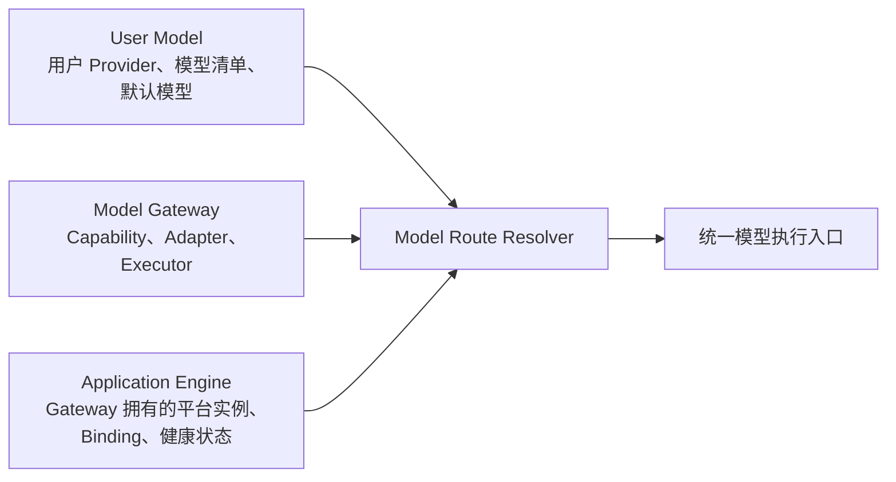
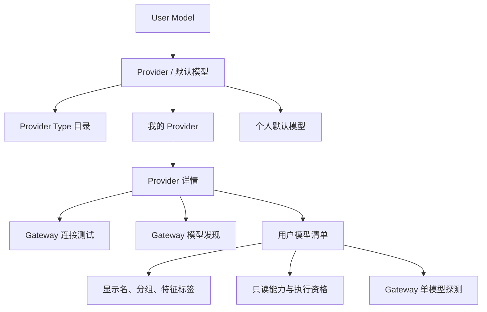
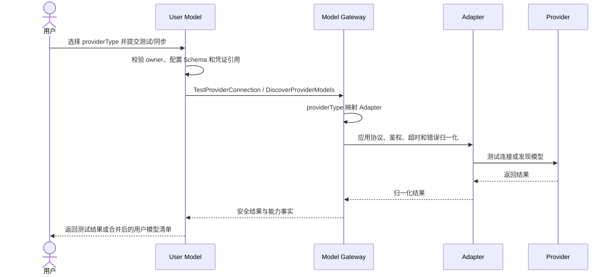
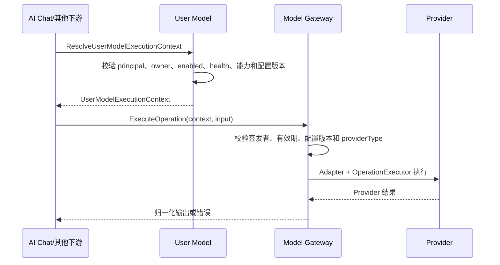

# User Model 产品规格

> 本文档是 `user-model` 的 S1 产品事实源，用于定义用户私有 Provider、模型清单、默认模型、健康事实、能力展示和执行资格解析。
>
> User Model 不实现 Provider 协议或模型推理；Provider Adapter、模型发现、探测、能力验证和 Operation 执行统一由 `modelgateway` 提供。

## 1. 功能说明

User Model 管理当前用户个人范围内的模型 Provider、凭证引用、模型清单、用户维护字段、默认用途模型和用户模型健康事实。

本领域的核心边界是：用户决定保存和启用哪个模型，但不能决定 Gateway 实际实现了哪些能力。用户添加 Provider 时选择稳定的 `providerType`；Model Gateway Runtime Registry 将 `providerType` 映射到内部 Adapter。客户端不得读取或提交内部 `adapter_id`、`operation_executor_id`、Provider 凭证明文或任意执行地址。

## 2. 职责与领域边界

| 能力 | 最终归属 |
| --- | --- |
| `ApplicationEngineInstance`、`EngineCapabilityBinding`、平台健康状态 | `modelgateway` |
| Provider Adapter、模型发现、模型探测、Operation 执行实现 | `modelgateway` |
| 用户 Provider、模型清单、默认模型、用户模型健康事实 | `user-model` |
| 用户模型 owner、启用状态、默认值和使用资格校验 | `user-model` |
| `ApplicationRun` 编排与执行快照 | `application-platform` |
| AI Chat `GenerationRun` 生命周期 | `ai-chatting` |



关键边界：

- `UserModelProvider` 不得转换为 `ApplicationEngineInstance`，也不得为每个用户 Provider 自动创建 EngineInstance。
- User Model 不维护 Provider 专用 HTTP 客户端、鉴权协议实现、模型发现实现、模型探测实现或推理实现。
- Gateway 不保存用户 Provider、用户模型、默认配置或用户模型健康事实，也不读取 User Model 私有表。
- `ResolvedModelRoute` 与 `UserModelExecutionContext` 都是请求级派生结果，不建表、不提供独立 CRUD。
- Application Engine 是 Gateway 拥有的平台级执行资源，不是用户模型配置的替代实体。

## 3. 核心数据模型

本文档中的数据模型只表达产品语义，不等同于 OpenAPI DTO、SQL Schema 或后端 ORM。

### 3.1 ProviderType（Provider 类型目录项）

`ProviderType` 是 Model Gateway Runtime Registry 对 User Model 暴露的稳定只读类型。

| 字段 | 类型 | 必填 | 说明 |
| --- | --- | --- | --- |
| id | string | 是 | 稳定 `providerType`，由用户选择并保存 |
| displayName | string | 是 | 面向用户的显示名称 |
| authenticationTypes | array of string | 是 | 支持的认证类型 |
| configurationSchema | object | 是 | 非敏感连接配置 Schema |
| supportsModelDiscovery | boolean | 是 | 是否支持远端模型发现 |
| supportsModelProbe | boolean | 是 | 是否支持单模型探测 |

`ProviderType` 不返回 Adapter ID、Executor ID、实现类名或内部注册表结构。

### 3.2 UserModelProvider（用户模型 Provider）

| 字段 | 类型 | 必填 | 说明 |
| --- | --- | --- | --- |
| id | string | 是 | 当前用户范围内的 Provider 稳定 ID |
| ownerUserId | string | 是 | 所属用户 ID |
| name | string | 是 | 当前用户范围内唯一的显示名称 |
| providerType | string | 是 | 必须引用当前 Gateway Registry 中可用的稳定 ProviderType |
| apiBaseUrl | string(uri) | 是 | 用户 Provider 地址；只由 User Model 持久化 |
| authType | string | 是 | 必须属于 ProviderType 支持的认证类型 |
| apiKeyRef | string | 否 | 受控凭证引用，不返回凭证明文 |
| enabled | boolean | 是 | 是否允许其模型进入使用资格校验 |
| remark | string | 否 | 用户个人备注 |
| extraConfig | object | 否 | 必须符合 ProviderType 配置 Schema 的非敏感扩展配置 |
| configVersion | integer | 是 | Provider 配置单调版本，用于拒绝过期执行上下文 |
| createdAt | string(date-time) | 是 | 创建时间 |
| updatedAt | string(date-time) | 是 | 更新时间 |

### 3.3 UserProviderModel（用户 Provider 模型）

| 字段 | 类型 | 必填 | 说明 |
| --- | --- | --- | --- |
| id | string | 是 | 当前用户范围内的模型稳定 ID |
| ownerUserId | string | 是 | 所属用户 ID |
| providerId | string | 是 | 所属 UserModelProvider ID |
| model | string | 是 | 远端模型标识；同一 Provider 下唯一 |
| displayName | string | 是 | 用户维护的显示名称；同一 Provider 下唯一 |
| group | string | 否 | 用户维护的模型分组 |
| featureLabels | array of string | 否 | 用户维护的展示与筛选标签，不参与扩张执行能力 |
| disabledCapabilityDefinitionIds | array of string | 否 | 用户从已验证能力中主动关闭的范围 |
| capabilityDefinitionIds | array of string | 是 | Gateway 派生的最终可执行能力，只读 |
| streamSupported | boolean | 是 | Gateway 根据 Adapter 与 Operation 派生，只读 |
| executable | boolean | 是 | 当前模型是否满足执行资格，只读 |
| unavailableReason | string | 否 | 不可执行原因的安全摘要，只读 |
| capabilityResolutionStatus | enum | 是 | `unknown`、`resolved`、`unavailable`、`stale`，只读 |
| healthStatus | enum | 是 | User Model 持久化的 `unknown`、`healthy`、`unhealthy` |
| healthReason | string | 否 | 最近一次探测的安全失败原因 |
| enabled | boolean | 是 | 用户是否启用该模型 |
| configVersion | integer | 是 | 模型配置单调版本 |
| lastCheckedAt | string(date-time) | 否 | 最近一次探测时间 |
| createdAt | string(date-time) | 是 | 创建时间 |
| updatedAt | string(date-time) | 是 | 更新时间 |

最终能力按以下交集派生：

```text
Adapter 支持能力
∩ ProviderCapability 或探测结果
∩ 用户启用范围
= 最终可执行能力
```

`featureLabels` 只用于展示和筛选。用户只能关闭 Gateway 已验证的能力，不能通过标签、请求字段或自定义配置创建 Gateway 未注册的 Operation。

### 3.4 UserDefaultModelConfig（用户默认模型配置）

| 字段 | 类型 | 必填 | 说明 |
| --- | --- | --- | --- |
| ownerUserId | string | 是 | 所属用户 ID |
| usage | enum | 是 | `assistant.default`、`quick`、`translation` |
| providerId | string | 是 | 默认模型所属 Provider ID |
| modelId | string | 是 | 默认模型 ID |
| updatedAt | string(date-time) | 是 | 更新时间 |

### 3.5 ModelHealthCheck（模型连接检测）

| 字段 | 类型 | 必填 | 说明 |
| --- | --- | --- | --- |
| targetType | enum | 是 | `provider` 或 `model` |
| providerId | string | 是 | 被检测 Provider ID |
| modelId | string | 否 | 被检测模型 ID |
| status | enum | 是 | `healthy` 或 `unhealthy` |
| reason | string | 否 | Gateway 归一化后的安全原因 |
| checkedAt | string(date-time) | 是 | 检测时间 |

Gateway 执行实际探测，User Model 持久化属于当前用户的检测结果和模型健康事实，并在状态变化时发布既有 `model_health_status_changed` 事件。Gateway 不发布重复用户模型健康事件。

### 3.6 UserModelExecutionContext（请求级执行上下文）

User Model 在 owner、enabled、health、能力和默认值校验通过后生成：

```text
UserModelExecutionContext
  owner_user_id
  provider_id
  model_id
  remote_model
  provider_type
  capability_definition_id
  config_version
  credential_handle
  issued_at
  expires_at
```

`credentialHandle` 是短期、不透明、受范围约束的凭证句柄，不包含凭证明文。Gateway 只接受由受信任 User Model 模块签发且版本未过期的上下文，不接受客户端直接构造 Provider 地址、凭证或 Adapter ID。

## 4. 业务规则

- **BR-USER-MODEL-01** 访问 User Model 页面和 API 依赖系统基础登录态。
- **BR-USER-MODEL-02** Provider、模型清单、默认配置、健康事实和凭证引用均属于当前用户个人范围。
- **BR-USER-MODEL-03** 用户只能读取、创建、修改和删除自己的 Provider、模型和默认配置。
- **BR-USER-MODEL-04** 一个用户的模型配置不得被其他用户读取、复用、修改、删除或用于签发执行上下文。
- **BR-USER-MODEL-05** Provider 名称在当前用户范围内唯一；不同用户可以使用相同名称。
- **BR-USER-MODEL-06** Provider 启用状态只影响当前用户自己的模型可用性。
- **BR-USER-MODEL-07** 删除 Provider 时清理当前用户范围内的模型和默认绑定，但不得删除任何 ApplicationEngineInstance。
- **BR-USER-MODEL-08** 未保存 Provider 测试可使用当前表单值，但不得写入 Provider、凭证、健康记录或执行路由事实。
- **BR-USER-MODEL-09** Provider 测试失败必须返回 Gateway 归一化的安全错误，不得泄露凭证、Header 或未经处理的上游响应。
- **BR-USER-MODEL-10** 模型同步只写入当前用户自己的模型清单，并委托 Gateway `DiscoverProviderModels` 完成远端发现。
- **BR-USER-MODEL-11** 用户可以手动添加模型，远端模型标识不能为空。
- **BR-USER-MODEL-12** 模型显示名和远端模型标识在同一当前用户 Provider 下不能重复。
- **BR-USER-MODEL-13** `featureLabels` 是用户可维护的展示和筛选标签，不是执行能力声明。
- **BR-USER-MODEL-14** `streamSupported`、`capabilityDefinitionIds`、`executable`、`unavailableReason` 和 `capabilityResolutionStatus` 由 Gateway 派生并只读返回。
- **BR-USER-MODEL-15** 模型健康状态包括 `unknown`、`healthy`、`unhealthy`。
- **BR-USER-MODEL-16** `unknown` 表示尚未获得有效探测结果；`unhealthy` 表示认证失败、超时、远端模型不存在、服务不可用或探测不兼容。
- **BR-USER-MODEL-17** 页面以明确状态图标展示健康状态，并为 `unhealthy` 展示安全原因。
- **BR-USER-MODEL-18** User Model 保存健康事实，但实际网络探测必须委托 Gateway Adapter。
- **BR-USER-MODEL-19** 单模型测试调用 Gateway `ProbeProviderModel`，不得触发面向用户的真实生成或创建 GenerationRun。
- **BR-USER-MODEL-20** 系统按默认 30 秒周期异步探测当前用户已启用模型；调度不阻塞列表读取，探测实现仍由 Gateway 提供。
- **BR-USER-MODEL-21** 旧探测结果不得覆盖较新配置版本或较新健康事实。
- **BR-USER-MODEL-22** 删除模型时清理当前用户范围内引用该模型的默认绑定。
- **BR-USER-MODEL-23** 默认用途包括 `assistant.default`、`quick`、`translation`。
- **BR-USER-MODEL-24** 默认候选必须属于当前用户，且 Provider 与模型均启用、模型健康、能力匹配并且 `executable=true`。
- **BR-USER-MODEL-25** 保存默认模型只影响当前用户，并在保存时重新执行使用资格校验。
- **BR-USER-MODEL-26** 下游只能读取当前用户权限裁剪后的模型投影或调用受控解析接口，不得读取 User Model 私有表。
- **BR-USER-MODEL-27** 停用 Provider、停用模型、`unhealthy`、能力不匹配或能力解析过期时不得生成执行上下文。
- **BR-USER-MODEL-28** 未配置默认用途模型时不得静默 fallback 到其他用户或平台模型。
- **BR-USER-MODEL-29** 默认模型失去执行资格时，下游必须提示修复或重新选择，不得继续使用旧配置执行。
- **BR-USER-MODEL-30** `canWrite=false` 时可查看已有配置，但必须禁用新增、保存、删除、同步、测试和默认模型切换等写操作。
- **BR-USER-MODEL-31** User Model 不引入平台管理员共享用户 Provider 的语义。
- **BR-USER-MODEL-32** 模型列表、同步结果、默认模型和 options 同时返回 `providerId` 与权限裁剪后的 `providerName`，客户端不得逐模型补查 Provider。
- **BR-USER-MODEL-33** `providerType` 必须来自 Gateway Runtime Registry；客户端不得提交任意 `adapter_id` 或 `operation_executor_id`。
- **BR-USER-MODEL-34** User Model 不维护 Provider 专用 HTTP 客户端；Provider 测试、模型发现、模型探测和 Operation 执行全部调用 Gateway 内部接口。
- **BR-USER-MODEL-35** 模型同步不得静默覆盖用户维护的 `displayName`、`group`、`enabled`、`featureLabels` 或能力关闭范围。
- **BR-USER-MODEL-36** ProviderCapability 或 Gateway Registry 更新不得删除、重命名或改写用户模型；能力不可用只影响派生执行资格。
- **BR-USER-MODEL-37** 用户只能关闭已验证能力，不能通过标签或配置扩张 Adapter 未实现的能力。
- **BR-USER-MODEL-38** `ResolveUserModelExecutionContext(principal, modelId, capabilityDefinitionId)` 必须校验 principal、owner、Provider/模型启用状态、健康状态、最终能力和配置版本。
- **BR-USER-MODEL-39** 执行上下文必须包含稳定 Provider/模型 ID、远端模型标识、ProviderType、能力、配置版本和不透明 credentialHandle，不包含凭证明文。
- **BR-USER-MODEL-40** Gateway 不读取 User Model 私有表；User Model 不把 Provider 地址、凭证明文或私有配置作为客户端可构造的 Gateway 请求字段。
- **BR-USER-MODEL-41** `ResolvedModelRoute` 仅是请求级派生结果，不建表、不缓存为第三份模型事实、不提供 CRUD。
- **BR-USER-MODEL-42** User Model API 将 Gateway Adapter 错误映射为既有 `ERR_MODEL_*`，不得使用 `ERR_AIAPP_ENGINE_*` 表达用户 Provider 错误。
- **BR-USER-MODEL-43** 用户模型健康状态变化继续由 User Model 持久化并发布 `model_health_status_changed`，Gateway 不发布重复事件。
- **BR-USER-MODEL-44** 正式 canonical API 统一使用 `/api/v1/user-model/`；旧 `/model-providers`、`/provider-models`、`/default-models` 和 `/model-options` 不保留别名、重定向或兼容期。
- **BR-USER-MODEL-45** User Model 与 Model Gateway 必须在同一发布批次切换 ProviderType、能力解析和 Gateway 调用契约。
- **BR-USER-MODEL-46** `UserModelProvider` 与 `ApplicationEngineInstance` 权限、生命周期、名称唯一性、Binding 和凭证规则保持独立。

## 5. 用户故事

### US-USER-MODEL-01 查看个人 Provider

用户可以查看和搜索自己的 Provider；列表不得出现其他用户数据。

### US-USER-MODEL-02 添加 Provider

用户从 Provider Type 目录选择稳定 `providerType`，填写名称、地址、认证、凭证引用和非敏感配置。用户不选择 Adapter。

### US-USER-MODEL-03 编辑 Provider

用户可以编辑自己的 Provider；配置变化必须递增配置版本并使旧执行上下文失效。

### US-USER-MODEL-04 删除 Provider

用户可以删除自己的 Provider及其用户模型和默认绑定；不得影响平台 Engine。

### US-USER-MODEL-05 Provider 连接测试

用户可以在保存前或保存后测试 Provider。User Model 委托 Gateway Adapter，未保存测试不落库且不泄露凭证。

### US-USER-MODEL-06 同步远端模型清单

用户可以调用 Gateway 模型发现同步清单。同步保留用户维护字段，只创建新模型或更新远端发现事实。

### US-USER-MODEL-07 手动添加模型

用户可以输入远端模型标识和显示信息；模型实际能力仍由 Gateway 验证。

### US-USER-MODEL-08 编辑模型信息

用户可以编辑显示名、分组、特征标签、启用状态，并从已验证能力中关闭不希望使用的能力。

### US-USER-MODEL-09 查看模型健康与能力

用户可以查看健康状态、只读能力、是否可执行及不可用原因，并区分展示标签与实际能力。

### US-USER-MODEL-10 测试单个模型

用户可以调用 Gateway Adapter 探测单个模型；探测不创建真实业务生成。

### US-USER-MODEL-11 删除模型

用户可以删除自己的模型并清理引用该模型的默认绑定。

### US-USER-MODEL-12 设置默认模型

用户可以为 `assistant.default`、`quick`、`translation` 保存满足当前用途能力和执行资格的默认模型。

### US-USER-MODEL-13 下游读取与执行用户模型

下游读取权限裁剪后的模型投影；执行前由 User Model 生成带配置版本的执行上下文，再由 Gateway 执行对应 Operation。

### US-USER-MODEL-14 只读状态查看配置

`canWrite=false` 时用户可以查看配置，但不能执行任何写操作。

### US-USER-MODEL-15 浏览 Provider Type 目录

用户可以查看稳定类型、显示名称、认证类型、配置 Schema 以及发现/探测支持情况；内部 Adapter 和 Executor ID 不可见。

## 6. 页面结构



## 7. 关键流程

### 7.1 Provider 测试与模型发现



### 7.2 执行上下文解析



## 8. 非目标

- 不将用户 Provider 转为平台 Engine。
- 不允许用户维护内部 Adapter、Executor 或实际能力事实。
- 不在本领域实现 Provider 协议、鉴权应用、发现、探测或推理客户端。
- 不新增共享表、跨域外键、`ResolvedModelRoute` 表或 Gateway 用户模型表。
- 不在本仓库维护正式实现代码、实际数据库 migration 或运行时配置。

## 9. 待确认问题

暂无。
