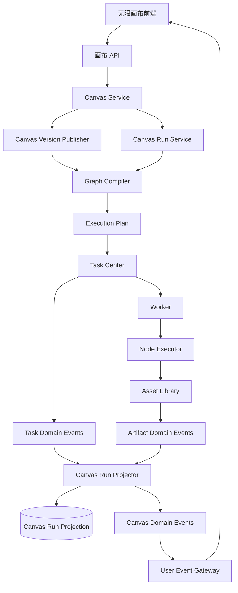
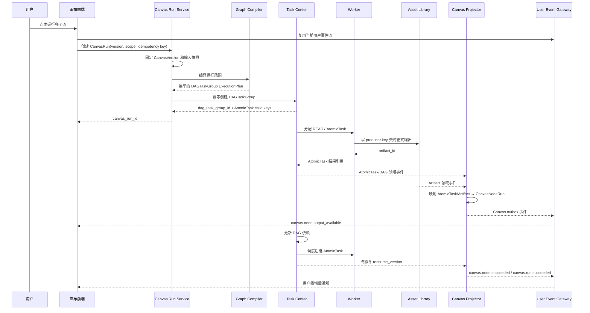

# 工作流画布 S1 产品规格

> 文档版本：`v1.1-draft`
> 更新日期：`2026-07-21`
> 状态：S1 草案，尚未 release

---

## 1. 文档目标

本文档是 `workflow-canvas` 领域的 S1 产品语义事实源，定义画布编辑、不可变版本、运行范围、任务编译、运行投影、制品引用和交互式控制节点。Task Center 拥有 AtomicTask、TaskAttempt、TaskGroup、DAGTaskGroup 及其执行状态；Asset Library 拥有 Artifact 及其内容和处理状态；SSE 领域拥有用户级实时连接和短期可重放事件投影。

画布草稿通过 revision 进行乐观并发保存；正式运行固定已发布且不可变的 CanvasVersion。任何后续编辑都不能改写历史 CanvasVersion、CanvasRun 或 CanvasNodeRun。

本文档定义一套支持以下能力的无限画布运行系统：

1. 在无限画布中创建、移动、配置和连接节点。
2. 使用有类型的输入输出端口建立数据依赖。
3. 支持运行单个节点、运行到指定节点、从指定节点运行、运行完整流。
4. 支持一个画布中存在多个独立流，并发提交到任务中心。
5. 支持 DAG 依赖，例如 A、B 并行执行，C 等待 A、B 完成。
6. 支持一个逻辑节点展开为多个并发任务。
7. 支持节点运行过程中持续产生图片、视频、音频等制品。
8. 支持通过 SSE 将节点进度和制品增量通知前端。
9. 支持 ComfyUI 类交互式控制节点，例如：

   * 3D Gaussian 视角控制；
   * 3D 光照控制；
   * 3D 假人姿态控制；
   * 摄像机和摄像机轨迹控制。
10. 复用已有任务中心，不在画布模块内重复实现调度系统。
11. 固定已发布 CanvasVersion、运行输入和复用来源，使任意运行结果都可追溯和重放。
12. 复用全局用户级 SSE 连接，不为画布或单次运行建立第二套实时通道。

---

## 2. 核心设计原则

### 2.1 画布与任务中心职责分离

画布负责描述用户的执行意图：

```text
有哪些节点
节点如何连接
本次运行哪些节点
节点之间有什么数据依赖
```

任务中心负责实际执行：

```text
任务入队
依赖调度
并发控制
Worker 分配
重试
取消
超时
TaskAttempt
```

系统关系：

```text
Canvas 草稿
    ↓ 发布并冻结
CanvasVersion
    ↓ 按本次范围编译
ExecutionPlan
    ↓ 展平并提交
DAGTaskGroup + AtomicTask
    ↓ 自动执行尝试
TaskAttempt / Worker
```

AtomicTask 是唯一由 Worker 执行的业务资源。TaskGroup 和 DAGTaskGroup 只组合 AtomicTaskTemplate，不允许 Group 嵌套；画布模块不实现第二套任务调度器，也不直接依赖 Conductor API、数据库或原生任务类型。

---

### 2.2 连线表示数据依赖，不表示自动运行

节点连接：

```text
生图 → 放大
```

只表示：

```text
放大节点的输入来自生图节点的输出
```

它不表示生图完成后一定自动执行放大。

实际执行范围由本次运行请求决定：

```text
只运行生图
运行到放大
从生图向下运行
运行完整流
```

---

### 2.3 节点与任务不是固定一对一关系

一个普通可执行节点通常对应一个 AtomicTask：

```text
CanvasNodeRun
    → AtomicTask
```

一个并发节点可以在所属 CanvasRun 的 DAGTaskGroup 内展开为多个 AtomicTask：

```text
CanvasNodeRun
    → AtomicTask #0
    → AtomicTask #1
    → AtomicTask #2
    → AtomicTask #3
```

一个复杂节点也可以展开为多个具有依赖关系的 AtomicTask：

```text
CanvasNodeRun
    → Prepare AtomicTask
    → Generate AtomicTask
    → Postprocess AtomicTask
```

这些任务全部展平到 CanvasRun 唯一的 DAGTaskGroup 中，通过稳定 child key 和节点绑定角色保留业务归属。因此系统必须支持：

```text
CanvasNodeRun 1 → N AtomicTask
```

---

### 2.4 编辑数据、运行数据和制品数据分离

需要分别管理：

```text
Canvas
画布节点、位置、连线和配置

CanvasRun
用户发起的一次画布运行

CanvasNodeRun
本次运行中某个画布节点的聚合运行状态

AtomicTask / TaskAttempt
任务中心中的执行事实和自动尝试历史

Artifact
Asset Library 保存的图片、视频、音频、模型或其他正式制品
```

不能把运行状态和大型制品直接写入画布 JSON。Canvas 只保存 Artifact ID、端口绑定、生产来源和必要的只读摘要，不复制 Artifact 内容、存储位置或处理状态事实。

---

### 2.5 结构化控制状态是交互式节点的事实源

对于姿态、视角、光照等交互节点，应保存：

```text
骨骼关节
摄像机参数
灯光参数
3D 场景引用
渲染参数
```

而不是只保存一张前端截图。

预览图片、OpenPose 图、Depth 图和 Normal 图均为结构化状态的派生结果。

---

## 3. 系统总体架构



主要模块：

| 模块                      | 责任                                    |
| ----------------------- | ------------------------------------- |
| Canvas Service | 保存 Canvas 草稿、revision、画布元数据和可见性 |
| Node Definition Registry | 管理受控节点定义、稳定端口、配置 schema 和执行绑定 |
| Canvas Version Publisher | 校验并发布不可变 CanvasVersion |
| Graph Validator | 校验节点、端口、类型、引用权限、依赖关系和规模 |
| Graph Compiler | 将 CanvasVersion 与本次运行范围编译为展平的执行计划 |
| Canvas Run Service | 幂等创建 CanvasRun，管理取消、重跑和结果视图 |
| Task Center | 创建和调度 DAGTaskGroup、AtomicTask 与 TaskAttempt |
| Asset Library | 保存 Artifact 正文、处理状态、预览和下载能力 |
| Canvas Run Projector | 将任务与制品事实投影为 CanvasRun、FlowRun 和 NodeRun 状态 |
| User Event Gateway | 通过用户级 SSE 连接推送 Canvas、任务和制品增量 |

Canvas 服务、Task Center、Asset Library 与 SSE 只能通过受控 API 和可靠领域事件协作，不得跨领域读取私有表。业务事实变化必须先持久化，再通过 outbox 或等价机制发布；事件投递失败不得回滚已经成立的业务事实。

---

## 4. 核心领域对象

## 4.1 NodeDefinition

`NodeDefinition` 描述一类节点的稳定、受控定义，至少包含稳定 type、版本、标题、分类、节点种类、输入输出端口、配置约束、控制状态约束、前端渲染能力和执行绑定。

节点定义只能由系统或受权管理员注册。普通用户在画布中选择已注册定义并填写配置，不能上传前端代码、脚本、Worker 名、HTTP 地址、凭证或任意运行时任务。已被 CanvasVersion 固定引用的定义版本不得原地改写；下线只阻止新引用，不破坏历史查看和已创建运行。

执行绑定分为三类：

```text
passive
DataNode 和 ViewerNode，不创建 AtomicTask

atomic
固定一个已注册 functionRef，或固定一个已发布 ApplicationVersion 并解析为受控 application.execute

expanded
由编译器展开为多个已注册 functionRef 的 AtomicTask 节点，编排节点本身不由 Worker 执行
```

示例：

```json
{
  "type": "image.upscale",
  "version": "1.0.0",
  "title": "图像放大",
  "category": "image",
  "nodeKind": "processor",
  "inputs": [
    {
      "key": "image",
      "direction": "input",
      "dataType": "image",
      "required": true,
      "cardinality": "single"
    }
  ],
  "outputs": [
    {
      "key": "image",
      "direction": "output",
      "dataType": "image",
      "cardinality": "single"
    }
  ],
  "configSchema": {
    "type": "object",
    "properties": {
      "scale": {
        "type": "integer",
        "enum": [2, 4],
        "default": 2
      }
    }
  },
  "executionBinding": {
    "mode": "atomic",
    "functionRef": "media.image.upscale",
    "bindingVersion": "1.0.0"
  }
}
```

NodeDefinition 中的 renderer 只能是前端已注册的受控渲染能力标识；无法识别或无权使用时，前端降级为通用配置视图，不执行定义携带的任意代码。

---

## 4.2 NodeInstance

`NodeInstance` 表示节点定义在某张画布上的实例。

逻辑内容包括：

```text
id
type + definitionVersion
position + optional size
config
optional controllerState
optional literalInputs
optional ui state
```

节点实例只保存：

```text
节点类型
节点定义版本
节点位置
实例配置
结构化控制状态
无连线时的字面量输入
必要的 UI 状态
```

不复制整份 `NodeDefinition`。

保存草稿时允许引用当前可用定义；发布时必须重新校验定义仍存在、调用方有权使用、执行绑定受控且输入输出 schema 与连线一致。CanvasVersion 保存足以稳定解释历史节点的定义摘要，不依赖定义当前展示名称。

---

## 4.3 PortDefinition

端口逻辑字段包括稳定 key、显示 label、方向、数据类型、是否必需、single/multiple 基数、是否允许字面量、默认值，以及 `data` 或 `control` 连接类型。

`data` 边同时表达执行依赖与值传递；`control` 边只表达先后依赖，不传递数据。首期所有执行边仍必须形成无环图。未进入运行范围的控制边不自动触发目标节点。

端口必须使用稳定的 `key`：

```json
{
  "key": "reference_image",
  "label": "参考图片"
}
```

连线不能引用显示名称。

---

## 4.4 Edge

Edge 包含稳定 ID、源节点与源端口、目标节点与目标端口、连接类型、multiple 输入顺序、启停状态和可选展示信息。

连线作为独立对象保存，不嵌入源节点或目标节点。

---

## 4.5 Canvas

Canvas 是可持续编辑的工作空间，保存名称、描述、所有者、project、namespace、可见性、当前草稿 revision、最新发布版本、节点、边、分组、显式流和视口状态。

保存草稿必须携带期望 revision。服务端 revision 已推进时拒绝覆盖并返回当前 revision，用户可以刷新、合并或另存。保存草稿不创建任务，也不修改任何已发布版本。

---

## 4.6 CanvasVersion

CanvasVersion 是发布时冻结的节点、边、端口绑定、NodeDefinition/ApplicationVersion/functionRef 引用、显式流、执行输入输出、内容摘要和编译摘要。发布必须原子完成权限、引用、类型、无环、运行能力和规模校验；任一步失败都不得形成部分可用版本。

发布时先把完整画布编译为规范化 DAGTaskGroup template，并以内容摘要形成不可变 workflow definition 名称和版本。Task Center/WorkflowRuntime 注册成功后才能保存 CanvasVersion；重复发布命中同一内容摘要时必须幂等复用定义，注册成功但 CanvasVersion 保存失败时允许后续用同一摘要恢复，不能生成漂移定义。

CanvasVersion 一经发布不可修改或删除。后续编辑只推进草稿 revision，后续发布形成更高版本。历史版本即使引用的节点定义后来下线，仍可查看；能否新建运行取决于相关执行能力和资源是否仍可用。

---

## 4.7 CanvasRun

表示用户一次点击运行产生的业务运行记录。

CanvasRun 固定 canvasId、canvasVersionId、输入快照、运行范围、运行策略、执行计划摘要、幂等键和唯一 dagTaskGroupId，并保存状态、进度、结果摘要、重跑来源和时间信息。

同一 project、namespace、用户和幂等键只能创建一个 CanvasRun；重复请求内容一致时返回原运行，内容不一致时拒绝。CanvasRun 必须先持久化固定版本、输入和请求摘要，再以稳定幂等键请求 Task Center 创建唯一 DAGTaskGroup；启动窗口失败时保留可恢复状态，不切换到本地执行。

CanvasRun 状态为 `PENDING`、`RUNNING`、`SUCCESS`、`PARTIAL_SUCCESS`、`FAILED`、`CANCELED` 或 `TIMEOUT`。`PARTIAL_SUCCESS` 是 Canvas 对多个独立流或允许部分成功节点的业务聚合，不改写 Task Center 子任务事实。

---

## 4.8 CanvasFlowRun

表示一次画布运行中的一个流。

CanvasFlowRun 保存 canvasRunId、flowId、固定名称、所含执行实例 key、状态、进度、结果摘要和时间信息。它是 Canvas 对唯一 DAGTaskGroup 中一组节点的业务投影，不是 Task Center 的 Group，也不拥有独立执行资源。

FlowRun 状态为 `PENDING`、`RUNNING`、`SUCCESS`、`PARTIAL_SUCCESS`、`FAILED`、`CANCELED` 或 `TIMEOUT`，并按其引用的执行实例聚合。FlowRun 终态不覆盖 NodeRun 的具体任务、错误和输出事实。

同一 NodeInstance 可以被多个显式流引用。若多个选中流对该节点解析出的执行指纹和依赖完全一致，当前 CanvasRun 内只执行一次并由多个 FlowRun 引用同一 CanvasNodeRun；任一运行输入、依赖来源或策略不同，则必须形成不同执行实例，不能错误合并。

---

## 4.9 CanvasNodeRun

表示一个画布节点在本次画布运行中的聚合状态。

CanvasNodeRun 表示一个节点执行实例在本次 CanvasRun 中的聚合状态，保存 nodeId、executionKey、关联 FlowRun、执行指纹、状态、进度、输出绑定、复用来源、关联 AtomicTask ID、Task Center resource version 和时间信息。

状态为 `PENDING`、`BLOCKED`、`READY`、`RUNNING`、`RETRYING`、`SUCCESS`、`PARTIAL_SUCCESS`、`FAILED`、`CANCELED`、`TIMEOUT`、`SKIPPED` 或 `REUSED`。其中：

```text
BLOCKED
依赖尚未满足，后续仍可能进入 READY

SKIPPED
因必需上游失败、运行范围或失败策略确定不再执行

REUSED
没有创建新的 AtomicTask，输出来自经过校验的历史 NodeRun
```

普通节点通常关联一个 AtomicTask；并发或复合节点可以关联多个 AtomicTask。DataNode、ViewerNode 和 REUSED 节点可以不关联 AtomicTask。投影只接受更高 resource version；漏事件或乱序必须能通过 Task Center 与 Asset Library 事实查询对账恢复。

---

## 4.10 ArtifactReference

Artifact 是 Asset Library 的领域对象，Canvas 不重复定义其状态机、正文、存储位置、预览或下载规则。Canvas 运行输出只保存受权 ArtifactReference：artifactId、逻辑 output key、生产 CanvasRun/CanvasNodeRun/AtomicTask、可选分片序号、稳定 producer key 和权限裁剪的一跳摘要。

大型结果只通过 Artifact/Asset 引用在节点之间传递。下游解析引用时必须验证当前运行主体仍有访问权限；Artifact 不存在、已删除、不可见或未达到端口要求的可用状态时，不能把旧摘要当作可用正文。

---

## 5. 节点分类

## 5.1 DataNode

提供数据，但通常不需要异步任务。

例如：

```text
文本输入
数字输入
布尔输入
制品选择
提示词模板
参数对象
```

---

## 5.2 ProcessorNode

处理已有输入。

例如：

```text
图像裁剪
图像放大
视频转码
音频降噪
文本分片
```

---

## 5.3 GeneratorNode

生成新的业务制品。

例如：

```text
图像生成
视频生成
音乐生成
语音生成
3D 模型生成
剧本生成
```

---

## 5.4 ControllerNode

提供交互式控制状态和控制制品。

例如：

```text
3D 姿态控制
Gaussian 视角控制
光照控制
摄像机控制
摄像机轨迹控制
```

---

## 5.5 OrchestratorNode

只影响编排，不直接执行具体业务。

例如：

```text
并发节点
条件分支
循环
集合映射
聚合节点
同步屏障
```

---

## 5.6 ViewerNode

用于预览和检查。

例如：

```text
图片预览
视频预览
3D 预览
元数据查看
波形查看
```

Viewer 节点可以完全不参与正式运行。

---

## 6. 数据类型系统

不能将所有输入输出都定义为 `image` 或 `json`。

推荐基础类型：

```text
string
number
integer
boolean
json
```

媒体类型：

```text
image
video
audio
text
model.3d
scene.3d
scene.gaussian
```

引用类型：

```text
artifact.ref
asset.ref
```

文件型输入统一使用 `artifact.ref` 或 `asset.ref`，不暴露本地文件路径或对象存储 key。Task Center 资源不作为普通数据端口类型；需要展示任务追溯时使用 CanvasNodeRun 的受控关联摘要。

控制类型：

```text
camera.pose
camera.intrinsics
camera.path

lighting.rig
lighting.environment

pose.skeleton
pose.keypoints

control.openpose
control.depth
control.normal
control.canny
control.segmentation
```

集合类型：

```text
collection<image>
collection<video>
collection<artifact.ref>
```

类型兼容关系示例：

```text
control.openpose
    → control.image
        → image
```

要求 `control.openpose` 的端口不能接受普通照片。

---

## 7. 连线规则

建立连线时应校验：

### 7.1 方向

只允许：

```text
output → input
```

禁止：

```text
input → input
output → output
```

### 7.2 类型兼容

```text
image → image             允许
control.openpose → image  允许
image → control.openpose  拒绝
image → video             拒绝
```

### 7.3 连接数量

`cardinality=single` 的输入端口只能有一条有效输入边。

重复连接时可以采用：

```text
replace
reject
ask
```

推荐默认使用 `replace`，并支持撤销。

### 7.4 多输入顺序

`cardinality=multiple` 时，边需要保存 `order`。

```text
image A ─┐
image B ─┼→ collection<image>
image C ─┘
```

### 7.5 环路

首期所有数据边和控制边共同组成的执行图都必须无环。下列显式循环节点属于第二阶段产品能力：

```text
LoopStart
Iterator
Condition
Accumulator
LoopEnd
```

即使使用显式循环节点，发布到 Task Center 的图也不能形成实际环边；未来实现必须把有界迭代编译为受控 Dynamic Fork/Join 或已注册复合执行能力，并明确最大迭代次数、累计输出和退出条件。首期遇到任何环都拒绝发布。

---

## 8. 输入值解析规则

节点输入值的优先级：

```text
当前运行中绑定的上游输出
    >
本次运行 runtime_inputs
    >
节点 literalInputs
    >
节点定义默认值
```

建立连线后，不需要删除原来的字面量输入。

字面量可以保留为非激活状态，断开连线后恢复。

解析完成后必须形成不可变运行输入快照。上游输出引用必须指向当前 CanvasRun 中明确绑定的 NodeRun 输出，或本次明确选择且通过复用校验的历史输出；不得在运行中重新读取节点的“全局最新输出”。缺少必需输入、类型不兼容、引用不可见或 Artifact 未达到端口要求时，在创建 Task Center 资源前拒绝运行并定位到具体节点和端口。

---

## 9. 流的定义

一个画布可以包含多个独立运行流。

流可以通过两种方式确定。

### 9.1 显式流

用户使用 FlowGroup 或 FlowOutput 明确定义一个流。

```text
Flow A
Flow B
Flow C
```

适合用户需要：

```text
单独运行
命名
排序
设置并发策略
设置失败策略
```

### 9.2 自动流

没有显式定义时，可以根据图结构识别：

```text
相互独立的弱连通执行子图
```

但正式产品更推荐显式流定义，因为自动识别在共享输入节点和跨流引用场景中容易产生歧义。

CanvasFlowDefinition 包含稳定 ID、名称、入口节点、输出节点和可选运行策略。发布时必须冻结显式流定义；自动识别的流也必须把识别结果保存到 CanvasVersion，避免同一版本在不同时间得到不同流边界。

共享 DataNode 可以被多个流引用。共享可执行节点是否只执行一次由第 4.8 节的执行实例去重规则决定，不能仅凭 nodeId 合并。流之间存在数据边或控制边时不再是独立流，必须进入同一依赖分量。

---

## 10. 运行范围

统一使用一次创建 CanvasRun 的产品操作，通过 scope 表达 `all`、`flows`、`only_nodes`、`until_nodes`、`from_nodes` 或 `selected_subgraph`。所有目标必须属于固定 CanvasVersion，重复 ID、空目标、不可见节点和不属于所选流的目标在编译前拒绝。

### 10.1 only_nodes

只执行目标节点。

上游输入必须来自：

```text
已有有效输出
本次 runtime_inputs
节点字面量
```

如果缺少上游输出，运行失败。

这里的“已有有效输出”必须通过第 11 节的复用校验，并在 CanvasRun 中保存复用来源。`only_nodes` 不会隐式执行未选择的上游。

### 10.2 until_nodes

执行目标节点以及目标节点所有必要上游。

不执行目标节点下游。

### 10.3 from_nodes

执行起始节点以及所有可到达的下游节点。

若某个下游节点还依赖范围外的必需父节点，编译器必须为该输入找到有效复用输出或本次 runtime input；否则在提交任务前拒绝运行。不能静默忽略范围外依赖。

### 10.4 all

执行本次选择范围内的完整流。

### 10.5 flows

执行指定的一个或多个显式流。多个流被编译到同一个 DAGTaskGroup 的多个依赖分量中；共享执行实例按执行指纹去重，FlowRun 分别聚合各自节点。

### 10.6 selected_subgraph

只执行用户明确选择的节点和选择范围内的边。每个必需输入都必须来自选择范围内的上游、本次 runtime input、字面量或有效复用输出。若选择破坏端口依赖、包含半条控制链或无法确定输出节点，预检失败并返回所有问题，不创建部分任务。

---

## 11. 结果复用策略

复用策略为 `rerun_all`、`reuse_valid_outputs` 或 `reuse_required`。

### 11.1 rerun_all

所有选中节点重新执行。

### 11.2 reuse_valid_outputs

存在有效匹配输出时复用，否则执行节点。

### 11.3 reuse_required

要求必须存在可复用输出；没有则拒绝运行。

适用于：

```text
只运行放大节点
只运行后处理节点
只运行视频合成节点
```

### 11.4 可复用资格

历史 NodeRun 只有同时满足以下条件才可复用：

1. 与当前节点的 execution fingerprint 完全一致。
2. 来源 NodeRun 为 `SUCCESS` 或 `REUSED`，且所有必需输出已形成稳定绑定。
3. 当前用户在相同 project、namespace 和资源授权边界内仍能读取来源运行及全部输入输出。
4. 必需 Artifact/Asset 引用仍存在、未删除、可见并达到端口声明的可用状态。
5. NodeDefinition 允许缓存，节点不具有必须重复发生的外部副作用，也未被用户强制重跑。
6. 来源未超过节点定义的复用期限，相关模型、ApplicationVersion、functionRef binding 和运行环境版本仍匹配。

符合条件的候选超过一个时，选择同一 CanvasVersion 中最近成功且输出完整的候选；选择结果、来源 CanvasRun/CanvasNodeRun 和输出引用必须写入本次运行快照。`reuse_required` 任一必需节点无候选时整体预检失败；`reuse_valid_outputs` 只对不满足条件的节点创建 AtomicTask。

REUSED NodeRun 不创建伪造的成功 AtomicTask。下游直接使用本次 NodeRun 明确绑定的历史 Artifact/结构化输出，历史资源后续删除不反向改写已完成运行，但再次运行时必须重新校验可用性。

---

## 12. 节点执行指纹

不能简单使用“节点最近一次输出”。

需要根据实际运行输入计算执行指纹：

```text
execution_fingerprint =
    node_type
  + node_definition_version
  + application_version_or_function_ref_binding
  + normalized_config
  + normalized_controller_state
  + resolved_input_hashes
  + runtime_environment_version
  + required_output_contract
```

以下变化会使输出失效：

```text
提示词变化
参考图变化
模型变化
分辨率变化
种子变化
上游制品变化
骨骼姿态变化
灯光变化
正式输出摄像机变化
执行器版本变化
ApplicationVersion 或 functionRef binding 变化
必需输出契约变化
```

以下变化不影响执行指纹：

```text
节点位置
节点大小
节点折叠状态
节点当前选中的属性页
3D 编辑器的纯观察视角
```

标准化必须稳定处理对象键顺序、数值表示、集合顺序和空值。Artifact/Asset 输入使用不可变版本、checksum 或等价内容标识，不使用短期 URL。凭证和敏感值不得明文进入指纹、运行摘要或事件；需要参与一致性判断时使用服务端受控版本标识或不可逆摘要。

---

## 13. 图编译流程

编译分为发布编译和运行裁剪两步：

```text
发布编译
完整草稿 → 校验 → 规范化完整 DAG template → 注册不可变 workflow definition → 保存 CanvasVersion

运行裁剪
CanvasVersion 已冻结模板 + scope + runtime inputs + reuse policy → 确定性 ExecutionPlan
```

运行裁剪只能读取 CanvasVersion 中冻结的定义、端口、绑定和编译信息，不重新采用 NodeDefinition 当前版本。`all` 可直接使用发布的完整定义；局部 scope 从完整模板确定性裁剪节点和边，并以 CanvasVersion 内容摘要、scope 摘要和执行绑定形成不可变派生定义标识，重复运行不得得到结构漂移的计划。

运行开始时，画布服务执行：

```text
固定 CanvasVersion 与运行输入
    ↓
根据 RunScope 选出目标节点
    ↓
根据策略补充依赖节点
    ↓
加载 NodeDefinition
    ↓
校验资源权限、端口和数据类型
    ↓
解析节点执行类型
    ↓
识别可复用节点
    ↓
为共享节点生成 execution key
    ↓
将复合节点、流和 fan-out 展平
    ↓
生成唯一 DAGTaskGroup ExecutionPlan
    ↓
以稳定幂等键提交 Task Center
```

编译失败必须返回按节点、端口或流定位的问题集合，不创建 CanvasRun 的任务绑定。CanvasRun 已持久化但 Task Center 暂时不可用时进入可恢复的创建状态，由同一幂等命令重试，不能生成第二个 DAGTaskGroup。

---

## 14. ExecutionPlan

ExecutionPlan 是 CanvasRun 的不可变编译结果摘要，至少包含 canvasVersionId、scope、输入摘要、复用决策、一个 DAGTaskGroup template、AtomicTask 节点、依赖边、稳定 child key、CanvasNodeRun/FlowRun 绑定、规模统计和内容摘要。

计划中只有 AtomicTaskTemplate 是可执行节点。DataNode、ViewerNode、流、并发节点、聚合节点和复合节点是 Canvas 语义，编译后要么不产生任务，要么展开为 DAGTaskGroup 内的 AtomicTask 节点。计划不得包含 TaskGroup 嵌套、DAG 子图节点、任意 task type、HTTP/INLINE、脚本、Worker 名或凭证。

---

## 15. 任务中心映射

## 15.1 五个流并发

用户一次选择五个流：

```text
Flow 1
Flow 2
Flow 3
Flow 4
Flow 5
```

编译为一个包含五个互不依赖分量的 DAGTaskGroup：

```text
CanvasRun
└── DAGTaskGroup
    ├── Flow 1 的 AtomicTask 节点
    ├── Flow 2 的 AtomicTask 节点
    ├── Flow 3 的 AtomicTask 节点
    ├── Flow 4 的 AtomicTask 节点
    └── Flow 5 的 AtomicTask 节点
```

示例：

```json
{
  "kind": "dag_task_group",
  "key": "canvas_run_root",
  "nodes": [
    {"key": "flow_1/generate", "functionRef": "media.generate"},
    {"key": "flow_2/generate", "functionRef": "media.generate"},
    {"key": "flow_3/generate", "functionRef": "media.generate"},
    {"key": "flow_4/generate", "functionRef": "media.generate"},
    {"key": "flow_5/generate", "functionRef": "media.generate"}
  ],
  "dependencies": []
}
```

五个分量都可被 Task Center 释放为 READY，但不承诺同时占用五个 Worker。首期不把 `max_parallel_flows` 解释为绕过 Task Center 的独立调度器；实际并发始终由 Task Center、配额和执行器能力共同限制：

实际并发数由任务中心综合决定：

```text
min(
  Task Center 组合与用户上限,
  用户配额,
  Worker 数量,
  GPU 资源,
  执行器限流,
  平台限流
)
```

---

## 15.2 A、B 并行，C 等待

导演流：

```text
生成剧本 A ─┐
            ├→ 生成视频 C
生成参考图 B ─┘
```

编译为：

```json
{
  "kind": "dag_task_group",
  "key": "director_flow",
  "nodes": [
    {
      "key": "script_a",
      "task": {
        "kind": "atomic",
        "functionRef": "media.script.generate"
      }
    },
    {
      "key": "reference_b",
      "task": {
        "kind": "atomic",
        "functionRef": "media.image.generate-reference"
      }
    },
    {
      "key": "video_c",
      "task": {
        "kind": "atomic",
        "functionRef": "media.video.generate"
      }
    }
  ],
  "dependencies": [
    {
      "from": "script_a",
      "to": "video_c"
    },
    {
      "from": "reference_b",
      "to": "video_c"
    }
  ]
}
```

初始状态：

```text
script_a     READY
reference_b  READY
video_c      BLOCKED
```

只有 A、B 都成功，C 才进入 `READY`。

C 使用本次运行中明确绑定的 A、B 输出，不能读取模糊的“最新输出”。

---

## 16. 并发节点

并发节点属于 `OrchestratorNode`。

它本身不执行生图，而是将下游逻辑节点展开为多个任务。

画布：

```text
[提示词]
    ↓
[并发：4]
    ↓
[生图]
```

编译结果：

```text
CanvasRun DAGTaskGroup
├── parallel_generate/0 AtomicTask
├── parallel_generate/1 AtomicTask
├── parallel_generate/2 AtomicTask
└── parallel_generate/3 AtomicTask
```

配置：

```json
{
  "count": 4,
  "max_parallel": 2,
  "failure_policy": "best_effort",
  "output_order": "input_index",
  "batch_strategy": "fan_out"
}
```

静态 count 可以在发布或运行预检时展平为 DAGTaskGroup 节点；由上游集合长度决定的动态 count 使用 Task Center 的受控 Dynamic Fork/Join，并且不得超过 CanvasVersion 声明和系统配置中的较小上限。

逻辑计划示例：

```json
{
  "kind": "dag_fragment",
  "ownerNodeKey": "parallel_generate",
  "max_parallel": 2,
  "failure_policy": "best_effort",
  "nodes": [
    {
      "kind": "atomic",
      "key": "generate_0",
      "functionRef": "media.image.generate",
      "inputs": {
        "batch_index": 0
      }
    },
    {
      "kind": "atomic",
      "key": "generate_1",
      "functionRef": "media.image.generate",
      "inputs": {
        "batch_index": 1
      }
    },
    {
      "kind": "atomic",
      "key": "generate_2",
      "functionRef": "media.image.generate",
      "inputs": {
        "batch_index": 2
      }
    },
    {
      "kind": "atomic",
      "key": "generate_3",
      "functionRef": "media.image.generate",
      "inputs": {
        "batch_index": 3
      }
    }
  ]
}
```

---

## 17. 并发失败策略

### 17.1 all_success

所有分片都成功，聚合节点才成功。任一必需分片失败后，依赖该完整集合的下游为 `SKIPPED`。这是首期在现行 Task Center 机制下支持的默认策略。

### 17.2 best_effort

保留成功结果，部分失败时状态为：

```text
PARTIAL_SUCCESS
```

只有当下游端口声明允许部分集合、成功输出不少于一项且失败项可明确标识时，部分结果才能继续传递。失败项和错误摘要必须保留，输出顺序仍按原 shard index 稳定排列。

### 17.3 min_success

至少成功指定数量。

```json
{
  "failure_policy": "min_success",
  "min_success": 3
}
```

低于阈值时聚合节点为 `FAILED`，达到阈值但存在失败分片时为 `PARTIAL_SUCCESS`。阈值不得大于声明 count，动态 fan-out 必须在展开后验证实际分片数。

生图场景推荐：

```text
best_effort
或
min_success
```

导演流中的必要输入推荐：

```text
all_success
```

`best_effort` 和 `min_success` 涉及失败父节点后的容错 Join。本文保留其完整产品语义，但在 Task Center 提供受控容错依赖能力并完成对应 S2 之前列为第二阶段，首期不得用普通 DAG 依赖伪装支持。

---

## 18. 原生批量和任务展开

支持两种批量方式。

### 18.1 executor_native

一个原子任务调用执行器原生批量接口：

```text
一个 AtomicTask
    → 一次请求生成四张图
```

### 18.2 fan_out

在 CanvasRun 的 DAGTaskGroup 中展开四个独立 AtomicTask：

```text
DAGTaskGroup dynamic/static fork
    → 四个 AtomicTask
```

`fan_out` 支持：

```text
分片独立观察
跨 Worker 调度
独立进度
```

分片级取消和手动重试属于第二阶段。自动重试在原 AtomicTask 下新增 TaskAttempt；用户手动重试分片必须创建新的 AtomicTask，并由新的 CanvasRun 或明确的新执行实例承接，不能重开已终态 AtomicTask 或覆盖原分片历史。

`executor_native` 适合：

```text
平台本身批量效率明显更高
单次调用成本更低
不需要分片级控制
```

---

## 19. 节点与任务绑定

Canvas 必须保存 NodeRun 与 Task Center 资源之间的逻辑映射：

```text
canvas_run_id
canvas_node_run_id
dag_task_group_id
atomic_task_id
task_child_key
binding_role
shard_index
task_resource_version
```

`binding_role`：

```text
primary
worker
dependency
join
```

`aggregate` 是 CanvasNodeRun 自身的聚合视图，不对应 Task Center Group 绑定，因此不保存伪造的 aggregate task ID。`primary` 表示普通节点的主要 AtomicTask；`worker` 表示 fan-out 分片；`dependency` 和 `join` 表示复合节点展平后的辅助任务。

并发生图示例：

```text
并发节点 → Generate #0 AtomicTask  role=worker shard_index=0
并发节点 → Generate #1 AtomicTask  role=worker shard_index=1
并发节点 → Generate #2 AtomicTask  role=worker shard_index=2
并发节点 → Generate #3 AtomicTask  role=worker shard_index=3
```

静态任务在 DAGTaskGroup 创建后按 owner 和稳定 child key 绑定。动态分片通过 DAG owner、父 child key 和 shard key 查询并投影；不能依赖逐条跨服务读取，也不能从 Worker 名或运行时内部 ID猜测画布节点。

---

## 20. 制品生成和保存流程

节点执行器产生文件后：

```text
执行器生成临时结果
    ↓
以稳定 producer key 交付 Asset Library
    ↓
Asset Library 接收内容并校验大小和 checksum
    ↓
幂等创建或更新 Artifact
    ↓
AtomicTask 输出保存 ArtifactReference
    ↓
各领域提交自身事实和 outbox
    ↓
发布 AtomicTask 与 Artifact 领域事件
```

必须遵循：

```text
先持久化
后通知
```

Artifact producer key 至少稳定包含 CanvasRun、CanvasNodeRun、逻辑 output key 和 shard key。同一 AtomicTask 的自动 TaskAttempt 重试必须复用 producer key，避免生成重复逻辑制品；手动重跑形成新的 CanvasRun 和新的 producer key。

各事实源使用事务 outbox：

```text
Asset Library 事务：Artifact + Artifact Outbox
Task Center 事务：AtomicTask output reference + Task Outbox
Workflow Canvas 事务：NodeRun output binding + Canvas Outbox
```

跨领域不要求一个分布式事务。重复事件和进程重启依靠 producer key、资源版本、稳定绑定和对账收敛；任一服务不得直接修改另一个领域的事实表。

---

## 21. 节点产生多个制品

一个节点可以逐步产生多个制品：

```text
视频
缩略图
首帧
深度图
元数据
```

每个制品准备完成后都可以立即发布事件。

不需要等待节点全部完成。

节点完成条件由必需输出定义：

```json
{
  "outputs": [
    {
      "key": "video",
      "required": true
    },
    {
      "key": "thumbnail",
      "required": false
    }
  ]
}
```

端口还必须声明正式输出的可用条件：

```text
required=true
对应结构化值已持久化，或 Artifact 已达到可供下游读取的 READY 状态

required=false
失败不阻止节点成功，但 NodeRun 和 CanvasRun 摘要保留 warning
```

AtomicTask 成功只表示任务执行事实。若必需 Artifact 仍在传输或处理，CanvasNodeRun 保持非成功状态并等待 Asset Library 事实；必需 Artifact 最终处理失败时 CanvasNodeRun 可以失败，但不得反向改写 AtomicTask 终态。不同聚合的事件不保证严格先后。

NodeDefinition 必须为正式输出声明最大就绪等待时间。AtomicTask 已成功但必需 Artifact 超过该时间仍不可用时，CanvasNodeRun 以稳定的输出未就绪原因失败，AtomicTask 保持 SUCCESS；Artifact 后续变为 READY 也不重开终态 NodeRun，但可在后续新 CanvasRun 中重新通过复用资格校验。

---

## 22. 任务事件和画布事件

Task Center 产生带 owner、关联 ID 和 resource version 的 AtomicTask/TaskAttempt/DAGTaskGroup 领域事件；Asset Library 独立产生 Artifact 生命周期事件。Canvas Run Projector 通过第 19 节的绑定把这些事实转换为 CanvasRun 和 CanvasNodeRun 投影。

任务事件示意：

```json
{
  "event_type": "atomic_task_status_changed",
  "atomic_task_id": "atomic_task_8391",
  "owner_type": "DAG_TASK_GROUP",
  "owner_id": "dag_canvas_run_01",
  "child_key": "parallel_generate/0",
  "resource_version": 7,
  "output": {"image": {"artifact_id": "artifact_image_01"}}
}
```

画布页面不能仅靠任务事件构建 NodeRun，因为一个节点可能对应多个 AtomicTask，Artifact 又属于独立聚合。需要经过：

需要经过：

```text
Task Event
    ↓
Canvas Run Projector
    ↓
Canvas Semantic Event
```

转换后：

```json
{
  "event_id": 10001,
  "event_type": "canvas.node.output_available",
  "event_version": 1,
  "occurred_at": "2026-07-21T10:30:12Z",
  "aggregate_type": "canvas_node_run",
  "aggregate_id": "canvas_node_run_a",
  "aggregate_version": 9,
  "canvas_run_id": "canvas_run_01",
  "atomic_task_id": "atomic_task_8391",
  "artifact_id": "artifact_image_a",
  "payload": {
    "node_id": "node_a",
    "port_key": "image",
    "shard_index": 0,
    "artifact": {
      "id": "artifact_image_a",
      "kind": "image",
      "status": "READY",
      "preview_ref": "protected-artifact-preview"
    }
  }
}
```

事件只携带权限裁剪的小型摘要和受保护引用，不携带正文、永久对象存储地址、凭证、私网地址或 Provider 原始响应。完整 NodeRun 和 Artifact 仍通过所属领域事实查询获得。

---

## 23. SSE 实时通知

Canvas 页面复用应用级、当前登录用户级的唯一 SSE 连接，不按 Canvas、CanvasRun 或节点建立独立连接。页面组件只注册事件处理器并按有权查看的 canvas_run_id、aggregate_type 和 aggregate_id 更新本地缓存；订阅过滤不能扩大权限。

Canvas 阶段使用与 SSE S1 一致的语义事件：

```text
canvas.run.created
canvas.run.started
canvas.run.progressed
canvas.run.succeeded
canvas.run.failed
canvas.run.cancelled

canvas.node.ready
canvas.node.queued
canvas.node.started
canvas.node.progressed
canvas.node.output_available
canvas.node.succeeded
canvas.node.failed
canvas.node.skipped
canvas.node.cancelled
```

首期不增加独立 CanvasFlowRun 事件。`canvas.run.progressed` 携带发生变化的权限裁剪 flow 摘要，完整 FlowRun 从 CanvasRun 事实查询；REUSED 节点通过 `canvas.node.succeeded` 的 `result_mode=reused` 表达。Artifact 自身的 `artifact.preview_ready`、`artifact.ready` 或失败事件仍由 Asset Library 发布，Canvas 不发布竞争性的 Artifact 生命周期事实。

---

## 24. 并发生图的增量通知

第一张生成完成：

```json
{
  "event_type": "canvas.node.output_available",
  "aggregate_type": "canvas_node_run",
  "aggregate_id": "canvas_node_run_parallel_generate",
  "aggregate_version": 12,
  "canvas_run_id": "canvas_run_01",
  "artifact_id": "artifact_image_0",
  "payload": {
    "node_id": "parallel_generate",
    "port_key": "images",
    "shard": {"index": 0, "total": 4},
    "artifact": {
      "id": "artifact_image_0",
      "kind": "image",
      "preview_ref": "protected-artifact-preview"
    }
  }
}
```

聚合进度：

```json
{
  "event_type": "canvas.node.progressed",
  "aggregate_type": "canvas_node_run",
  "aggregate_id": "canvas_node_run_parallel_generate",
  "aggregate_version": 13,
  "payload": {
    "node_id": "parallel_generate",
    "progress": {
      "completed": 2,
      "success": 2,
      "failed": 0,
      "running": 1,
      "total": 4
    }
  }
}
```

前端逐张更新：

```text
[图 0] [图 1] [生成中] [等待中]
```

---

## 25. SSE 断线恢复

实时事件不能作为唯一状态源。

每个事件使用统一 UserEvent 信封，至少包含：

```text
event_id
event_type
event_version
occurred_at
aggregate_type
aggregate_id
aggregate_version
payload
```

用户事件至少一次投递。`event_id` 在当前用户事件流中用于去重和 Last-Event-ID 恢复；`aggregate_version` 在同一 CanvasRun 或 CanvasNodeRun 内单调递增，用于拒绝乱序旧状态。Artifact 与 NodeRun 是不同聚合，不能比较二者版本或假设全局业务顺序。

推荐页面流程：

```text
应用级 SSE 客户端保持连接并暂存事件
    ↓
读取 CanvasRun、FlowRun、NodeRun 和已有输出完整快照
    ↓
应用快照之后收到且 aggregate_version 更高的事件
    ↓
持续增量更新
```

重连在用户事件保留期内使用 Last-Event-ID 重放。收到 `connection.resync_required`、事件字段不足、聚合版本出现不可解释缺口或事件超过保留期时，暂停应用相关增量，重新查询 Canvas 与 Asset Library 事实后再恢复。SSE 不可用时任务继续执行，当前页面降级为低频事实轮询。

---

## 26. 交互式控制节点总体设计

交互式控制节点定义为：

```text
ControllerNode
= ControllerState
+ FrontendEditor
+ PreviewRenderer
+ RuntimeExecutor
+ SemanticOutputs
+ ArtifactOutputs
```

节点内部：

```text
NodeInstance
├── controllerState
├── renderConfig
├── ui
└── outputs
```

### ControllerState

决定正式输出的结构化状态。

ControllerState 必须带 schema version，并按 NodeDefinition 的 controller schema 校验数值范围、坐标系、引用资源、关键帧数量和总体大小。场景、模型、HDR、姿态预设等外部内容只能使用调用方可见的 Asset/Artifact 引用，不能保存任意 URL、文件路径或内嵌大型二进制。

### FrontendEditor

提供拖拽、旋转和参数编辑。

### PreviewRenderer

浏览器本地实时预览。

### RuntimeExecutor

运行时生成正式控制图或控制数据。

---

## 27. 交互式节点前后端职责

### 前端负责

```text
Three.js/WebGL 交互
3D 模型预览
拖动关节
旋转摄像机
调整灯光
本地低质量实时渲染
撤销重做
防抖保存 ControllerState
```

### 后端负责

```text
保存 ControllerState
校验 ControllerState
计算执行指纹
创建正式控制图任务
生成和保存 Artifact
将输出传递给下游节点
```

拖动过程不能每帧请求后端。

推荐：

```text
pointermove：
只更新前端内存

pointerup：
写入画布本地状态

500～1000ms 无操作：
自动保存
```

自动保存沿用 Canvas 草稿 revision 的乐观并发。保存冲突时不得静默覆盖另一标签页或另一用户的更新；前端保留本地未提交状态并提示刷新、合并或另存。

---

## 28. 编辑预览与正式输出

### 28.1 编辑预览

```text
低分辨率
前端本地渲染
不进入制品系统
不直接作为正式下游输入
```

### 28.2 正式输出

```text
固定分辨率
固定渲染器版本
生成 Artifact
参与执行指纹
进入任务中心
可复用和可追踪
```

节点界面应同时区分：

```text
实时编辑预览
上一次正式运行输出
```

---

## 29. 3D 姿态控制节点

节点类型：

```text
pose.controller
```

输入：

```text
pose_preset
character_reference
skeleton_definition
```

结构化状态：

```json
{
  "skeletonSchema": "human_24",
  "coordinateSystem": {
    "handedness": "right",
    "upAxis": "Y",
    "unit": "meter"
  },
  "bodyShape": {
    "height": 1.72,
    "shoulderWidth": 0.42,
    "hipWidth": 0.34
  },
  "rootTransform": {
    "position": [0, 0, 0],
    "rotation": [0, 15, 0],
    "scale": [1, 1, 1]
  },
  "joints": {
    "left_shoulder": {
      "rotation": [-12, 8, 32]
    },
    "left_elbow": {
      "rotation": [0, 0, 74]
    }
  },
  "outputCamera": {
    "position": [0, 1.4, 4.2],
    "target": [0, 1.1, 0],
    "focalLength": 50,
    "projection": "perspective"
  }
}
```

输出：

```text
pose.skeleton
pose.keypoints
control.openpose
control.depth
control.normal
image.preview
```

应同时输出结构化骨骼和控制图，不能只输出 OpenPose PNG。

---

## 30. 骨骼兼容

需要明确骨骼 Schema：

```text
COCO 17
OpenPose 18
OpenPose Body 25
Human 24
SMPL
SMPL-X
自定义骨骼
```

不能用数组下标表示语义关节。

必须保存：

```text
joint semantic name
joint hierarchy
coordinate system
skeleton schema
```

适配器负责：

```text
Human 24 → OpenPose 18
SMPL-X → ControlNet Pose
右手坐标 → 目标节点坐标
```

转换规则不能散落在前端组件中。

---

## 31. 光照控制节点

节点类型：

```text
lighting.controller
```

结构化状态：

```json
{
  "subject": {
    "model": "head_standard_v1",
    "rotation": [0, 0, 0]
  },
  "lights": [
    {
      "id": "key",
      "type": "area",
      "position": [2.4, 3.1, 1.8],
      "rotation": [-35, 42, 0],
      "intensity": 1.2,
      "temperature": 4800,
      "size": 1.5
    },
    {
      "id": "fill",
      "type": "area",
      "position": [-2, 1.5, 2],
      "intensity": 0.35,
      "temperature": 6500
    }
  ],
  "environment": {
    "artifactId": "artifact_hdr_01",
    "rotation": 35,
    "intensity": 0.4
  },
  "outputCamera": {
    "position": [0, 1.3, 4],
    "target": [0, 1.2, 0]
  }
}
```

输出：

```text
lighting.rig
lighting.environment
image.lighting_reference
control.normal
control.depth
control.shadow
```

下游执行器可以根据自身能力选择：

```text
结构化 LightingRig
或
渲染后的光照参考图
```

---

## 32. Gaussian 视角控制节点

节点类型：

```text
gaussian.view.controller
```

输入：

```text
scene.gaussian
camera.pose（可选）
```

状态：

```json
{
  "camera": {
    "position": [1.8, 1.2, 3.5],
    "target": [0, 1.1, 0],
    "up": [0, 1, 0],
    "focalLength": 55,
    "near": 0.01,
    "far": 100
  },
  "render": {
    "width": 1024,
    "height": 1024,
    "background": "transparent"
  }
}
```

输出：

```text
camera.pose
camera.intrinsics
image.rendered_view
control.depth
control.normal
control.visibility
```

对于较大的 Gaussian 场景，应支持执行器级缓存：

```text
scene_hash → loaded GPU scene
```

多个视角节点使用相同场景时，避免重复完整加载。

---

## 33. 摄像机轨迹节点

节点类型：

```text
camera.path.controller
```

状态：

```json
{
  "keyframes": [
    {
      "time": 0,
      "position": [0, 1.5, 5],
      "target": [0, 1.2, 0],
      "focalLength": 50
    },
    {
      "time": 3,
      "position": [2, 1.7, 3],
      "target": [0, 1.2, 0],
      "focalLength": 55
    }
  ],
  "interpolation": "bezier"
}
```

输出：

```text
camera.path
camera.keyframes
video.preview
camera.conditioning
```

---

## 34. 交互式节点运行方式

支持三种正式输出方式。

### 34.1 前端生成

前端渲染并上传 Artifact。

适用于：

```text
简单 Pose 图
轻量控制图
低风险工具
```

缺点是浏览器和 GPU 可能产生差异。

前端生成只允许 NodeDefinition 明确声明的低风险、确定性较弱输出。正式结果必须通过 Asset Library 的受控上传、内容校验和 owner 绑定形成 Artifact，并记录 controller state、renderer version 和上传者来源；不能把 data URL、本地 object URL 或浏览器缓存地址作为正式下游输入。此模式不创建伪造 AtomicTask，CanvasNodeRun 记录 `client_generated` 结果模式。

### 34.2 后端统一渲染

前端只提交 ControllerState。

任务中心通过已注册 functionRef 创建 AtomicTask，例如：

```text
canvas.render.pose-control
canvas.render.lighting-control
canvas.render.gaussian-view
```

优点：

```text
稳定
可复现
可缓存
便于审计
```

正式生产环境推荐此方式。

### 34.3 执行器内部生成

将 ControllerState 转换为特定执行器参数，例如 ComfyUI 工作流参数。

```text
ControllerState
    ↓ RuntimeAdapter
ComfyUI API Workflow
    ↓
ComfyUI 自定义节点
```

画布节点定义不直接绑定某一个自定义节点名称，而是绑定抽象执行器：

```text
pose_control_renderer
lighting_control_renderer
gaussian_view_renderer
```

具体执行器适配器再映射到目标平台。

抽象执行器最终必须解析为已注册 functionRef 或已发布 ApplicationVersion。适配器拥有对 ComfyUI API Workflow、模型节点和 Provider 凭证的映射，CanvasVersion 只保存稳定业务引用和非敏感参数；用户不能注入 ComfyUI endpoint、自定义节点名、凭证或任意 workflow JSON。

---

## 35. 交互控制节点接入 DAG

示例：

```text
[姿态控制] ─────────┐
                    │
[视角控制] ─────────┼→ [人物生图]
                    │
[光照控制] ─────────┘
```

任务编译：

```text
Render Pose ─────────┐
                     │
Render Camera View ──┼→ Generate Character
                     │
Render Lighting ─────┘
```

三个控制任务可并行。

人物生图任务等待全部必要控制输出完成。

---

## 36. 运行状态聚合

### 36.1 CanvasRun

```text
尚未成功绑定 DAGTaskGroup
    → PENDING

任一 FlowRun 或 NodeRun 非终态
    → RUNNING

全部流成功
    → SUCCESS

部分流成功，失败策略允许继续
    → PARTIAL_SUCCESS

没有成功流，或任一关键流失败且 fail_fast
    → FAILED

用户取消且不存在需要保留为成功的独立流
    → CANCELED

任务中心整体超时且未形成可接受结果
    → TIMEOUT
```

CanvasRun 聚合不能覆盖 FlowRun/NodeRun 的具体错误，也不能把 Task Center 的失败 AtomicTask 改写为成功。`PARTIAL_SUCCESS` 必须在摘要中给出成功、失败、取消和跳过的流/节点数量及 warning，不允许只展示一个模糊终态。

### 36.2 CanvasNodeRun

普通节点：

```text
AtomicTask SUCCESS
+ 所有必需结构化输出已持久化
+ 所有必需 Artifact 已 READY
    → NodeRun SUCCESS

符合复用资格且未创建 AtomicTask
    → NodeRun REUSED
```

并发节点：

```text
全部分片成功
    → SUCCESS

部分成功且 best_effort
    → PARTIAL_SUCCESS

成功数低于 min_success
    → FAILED
```

TaskAttempt 只影响当前 AtomicTask 的尝试历史，不直接成为 NodeRun。NodeRun、AtomicTask 和 Artifact 使用各自 resource/aggregate version 幂等投影；NodeRun 终态后收到更旧的任务进度或 Artifact 事件必须忽略。

### 36.3 依赖失败

C 因为 A 失败而没有执行：

```text
C = SKIPPED
reason = DEPENDENCY_FAILED
```

`BLOCKED` 只表示依赖尚未满足且仍可能继续；依赖已经失败、策略确定不执行时必须转为 `SKIPPED`，不能继续停留在 BLOCKED，也不能标记为普通执行失败。

---

## 37. 取消语义

### 37.1 取消整个画布运行

用户取消 CanvasRun 时：

```text
找到唯一 dag_task_group_id
    ↓
请求 Task Center 取消 DAGTaskGroup
    ↓
Task Center 级联取消未终态 AtomicTask
    ↓
Worker 协作式停止可取消的外部执行
    ↓
Canvas Projector 按最终任务事实收敛状态
```

取消命令必须幂等。已终态运行重复取消返回当前事实；取消请求与任务自然完成并发时，已经成功完成的 AtomicTask 可以保持 SUCCESS，不得为了满足取消请求覆盖历史。CanvasRun 最终状态由各流结果和取消范围聚合。

### 37.2 取消某个流

流级取消只作用于该 FlowRun 独占且仍未终态的 AtomicTask，其他独立流继续运行。被多个活动流共享的 AtomicTask 仍继续执行，目标 FlowRun 只停止其后续独占节点；不得为了取消一个流破坏其他流所需的共享输出。

系统必须在执行计划中预先保存流到 execution key 的引用集合，取消时按固定计划计算范围，不能根据当前 UI 选择临时猜测。流取消完成后，独占未执行节点为 `CANCELED` 或 `SKIPPED`，CanvasRun 根据其他流继续聚合。

### 37.3 取消某个并发分片

分片级取消只适用于 fan-out 后拥有独立 AtomicTask 的分片，不适用于 executor_native batch。取消后如何聚合由 all_success、best_effort 或 min_success 决定。由于 best_effort/min_success 依赖第二阶段容错 Join，首期不提供分片级取消操作。

---

## 38. 重试语义

用户可表达以下重跑意图：

```text
retry_failed
retry_node
retry_from_node
retry_flow
rerun_all
```

导演流：

```text
A failed
B success
C skipped
```

用户重试 A：

```text
A 在新的 CanvasRun 中创建新 AtomicTask
B 复用原成功结果
C 在新 DAGTaskGroup 中等待新 A
```

A 成功后，C 自动转为 `READY`。

自动重试与用户重跑必须严格区分：

```text
自动重试
同一 AtomicTask 下新增 TaskAttempt，复用 external job 和 Artifact producer key

用户手动重跑
创建新的 CanvasRun、DAGTaskGroup 和 AtomicTask，并保存 retryOfCanvasRunId
```

`retry_failed` 选择原运行中失败节点及由其导致 SKIPPED 的下游，成功节点按复用规则绑定；`retry_node` 只选择目标节点并要求其他必需输入可复用；`retry_from_node` 选择目标及可达下游；`retry_flow` 选择目标流；`rerun_all` 使用相同 CanvasVersion 和输入快照重新运行全部范围。

重跑默认固定原 CanvasVersion 和原运行输入。用户要采用新画布配置或新输入时，必须创建普通新运行而不是伪装成重试。任何重跑都不能重开、覆盖或改变原 CanvasRun、AtomicTask、TaskAttempt、NodeRun 和 Artifact 历史。

单分片手动重跑属于第二阶段：它创建新的 CanvasRun 执行实例和 AtomicTask，复用其他成功分片，并重新执行受影响的 Join/下游；不能在原 DAG 中插入新任务或把原失败分片改成成功。

---

## 39. 主要产品操作与查询

## 39.1 画布

用户可以创建 Canvas、读取画布、按期望 revision 保存草稿、软删除画布、查看草稿 revision，以及发布和查看不可变 CanvasVersion。删除 Canvas 不得删除已发布版本、历史运行、任务或已被其他业务引用的 Artifact。

保存草稿必须包含乐观锁：

```json
{
  "expected_draft_revision": 18,
  "graph": {}
}
```

冲突：

```json
{
  "reason": "CANVAS_DRAFT_REVISION_CONFLICT",
  "current_revision": 19
}
```

---

## 39.2 节点定义

用户可以按分类、能力和可用性浏览自己有权使用的 NodeDefinition，并查看具体版本的端口、配置、控制状态、执行模式和弃用信息。默认目录不返回无权引用的 ApplicationVersion/functionRef，也不暴露内部 handler、Worker、Provider endpoint 或凭证。

---

## 39.3 图校验

用户可以在发布前校验当前草稿，也可以在创建运行前校验固定 CanvasVersion、scope、runtime inputs 和复用策略。校验一次返回全部可定位问题；校验成功只是当时的预检结果，真正发布或运行仍需在事务边界重新验证权限和引用。

返回：

```json
{
  "valid": false,
  "errors": [
    {
      "code": "REQUIRED_INPUT_MISSING",
      "node_id": "video_c",
      "port_key": "script",
      "message": "缺少必填输入 script"
    }
  ]
}
```

---

## 39.4 创建运行

创建运行的产品输入示例：

```json
{
  "canvas_version_id": "canvas_version_19",
  "idempotency_key": "user-action-01",
  "scope": {
    "mode": "flows",
    "flow_ids": [
      "flow_a",
      "director_flow"
    ]
  },
  "run_policy": {
    "failure_policy": "continue_independent_flows",
    "reuse_policy": "reuse_valid_outputs"
  },
  "runtime_inputs": {}
}
```

创建成功立即返回 CanvasRun 与 FlowRun 初始摘要；Task Center 暂时不可用时返回可恢复的 PENDING/创建失败事实，而不是偷偷本地执行。示例：

```json
{
  "canvas_run_id": "canvas_run_1001",
  "status": "PENDING",
  "flow_runs": [
    {
      "flow_id": "flow_a",
      "status": "PENDING"
    },
    {
      "flow_id": "director_flow",
      "status": "PENDING"
    }
  ]
}
```

---

## 39.5 查询运行

CanvasRun 列表和详情必须返回固定 Canvas/CanvasVersion、重跑来源、DAGTaskGroup 的权限裁剪一跳摘要，以及状态、进度、流计数、节点计数、warning 和结果摘要。完整运行快照包含分页或分组的 FlowRun、NodeRun 和输出绑定；NodeRun 返回关联 AtomicTask 摘要，但不要求客户端逐 ID 查询任务。

所有查询应用 project、namespace、createdBy 和可见性边界。关联资源已删除或不可见时保留原始 ID，省略摘要，不使父运行查询失败，也不泄露目标详情。

---

## 39.6 事件

Canvas 页面使用第 23～25 节定义的用户级 SSE，不提供 CanvasRun 私有连接。事实查询和事件历史查询职责分离；事件过期或不可恢复时重新读取本节运行快照。

---

## 39.7 取消和重试

用户可以取消整个运行；在产品阶段允许时也可取消独立流。重跑操作必须明确 retry_failed、retry_node、retry_from_node、retry_flow 或 rerun_all，并返回新 CanvasRun。服务端必须验证调用方仍有权运行固定 CanvasVersion 和引用资源。

---

## 39.8 制品

Artifact 详情、内容、预览、下载、登记和删除均使用 Asset Library 产品能力。Canvas 只提供从 NodeRun 输出导航到 Artifact 的受权引用。事件和运行响应不得暴露永久对象存储地址。

---

## 40. 数据职责与历史保留

Workflow Canvas 拥有以下逻辑事实：

```text
Canvas 元数据、草稿图和 draft revision
不可变 CanvasVersion、内容摘要和编译摘要
CanvasRun、固定输入、scope、策略、幂等键和重跑关系
CanvasFlowRun 与 CanvasNodeRun 业务投影
NodeRun 到 DAGTaskGroup/AtomicTask 的稳定绑定
NodeRun 输出端口到 Artifact/Asset 的引用绑定
Canvas 领域 outbox 和投影对账游标
```

Workflow Canvas 不拥有：

```text
AtomicTask、TaskAttempt、TaskGroup、DAGTaskGroup 事实
Worker、Lease、Conductor execution 或运行时内部历史
Artifact 正文、存储位置、处理状态、预览和下载规则
用户级 SSE 连接、UserEvent 历史和恢复游标
ApplicationVersion、Provider 凭证或 functionRef handler 实现
```

CanvasVersion、CanvasRun、FlowRun、NodeRun 和手动重跑历史不得被后续编辑或重试覆盖。软删除 Canvas 只影响未来发现和新建操作；历史运行仍按审计、引用和数据保留规则可追溯。运行投影可以从 Task Center 与 Asset Library 对账重建，但用户输入快照、复用来源和业务绑定不能依赖临时事件重新猜测。

---

## 41. 前端状态模型

前端按资源 ID 分开维护 CanvasRun、FlowRun、NodeRun、AtomicTask 和 Artifact 缓存，不把不同聚合压成一个可互相覆盖的状态对象。Canvas 运行视图至少保存：

```text
runId + CanvasRun aggregate version
按 flowId 组织的 FlowRun 摘要
按 executionKey 组织的 NodeRun 摘要
每个 NodeRun 的 status、progress、warning 和 error
按 portKey + shardKey 组织的 ArtifactReference
每个相关聚合已处理的最高 aggregate version
当前用户事件流已处理的最后 event_id
```

处理事件时必须幂等：

```text
event_id 已处理
    → 忽略重复事件

aggregate_version 不高于本地同聚合版本
    → 忽略旧事件

canvas.node.output_available
    → 按 node_run_id + port_key + shard_key 更新同一输出槽位
    → 相同 artifact_id 不创建重复卡片

Artifact 事件
    → 只更新 Artifact 聚合，不直接推断 NodeRun 或 AtomicTask 终态
```

页面首次加载、事件字段不足、无法恢复或本地版本出现缺口时，以事实查询替换相关聚合缓存，再继续处理更高版本事件。未知事件、未知字段或单条解析失败只记录诊断，不能关闭全局 SSE 连接。

---

## 42. 节点界面建议

普通节点：

```text
┌─────────────────────────────┐
│ 图标  节点名称        状态   │
├─────────────────────────────┤
│ ○ 输入端口                   │
│                             │
│ 常用参数                     │
│                             │
│ 输出预览                     │
│                    输出端口 ○ │
├─────────────────────────────┤
│ 进度  耗时  运行  更多       │
└─────────────────────────────┘
```

交互式控制节点：

```text
┌─────────────────────────────┐
│ 姿态控制              已配置 │
├─────────────────────────────┤
│      3D 姿态缩略预览         │
│                             │
│ 骨骼：Human 24              │
│ 相机：正面 50mm             │
│ 输出：Pose / Depth          │
├─────────────────────────────┤
│ 编辑姿态  生成控制图         │
└─────────────────────────────┘
```

大型编辑器通过：

```text
侧边面板
全屏模式
画布浮层
```

打开，不应完整塞进小型节点卡片。

---

## 43. 前端运行操作

节点菜单：

```text
运行此节点
运行到此节点
从此节点运行
重新运行
强制重新运行
```

流菜单：

```text
运行此流
运行此流并复用有效结果
全部重新运行
取消此流
```

画布菜单：

```text
运行所有流
运行选中流
运行失效节点
全部重新运行
取消所有运行
```

所有“重新运行”“强制重新运行”和“运行失效节点”都会创建新 CanvasRun。界面必须明确显示固定 CanvasVersion、运行范围、是否允许复用和重跑来源；不能让用户误以为原历史运行被重新打开。

---

## 44. 首期实现范围

第一阶段建议实现：

1. Canvas 草稿、draft revision、乐观锁和不可变 CanvasVersion 发布。
2. 受控 NodeDefinition、稳定端口、ApplicationVersion/functionRef 绑定和数据类型校验。
3. 任意无环图校验、规模限制和展平到唯一 DAGTaskGroup。
4. `all`、`flows`、`only_nodes`、`until_nodes` 和 `from_nodes` 运行范围。
5. CanvasRun、CanvasFlowRun、CanvasNodeRun、幂等创建和任务创建恢复。
6. 一个 CanvasNodeRun 映射一个或多个 AtomicTask，静态 fan-out 使用稳定 shard key。
7. `rerun_all`、`reuse_valid_outputs`、`reuse_required` 和执行指纹。
8. 首期并发失败策略使用 `all_success`。
9. Asset Library ArtifactReference、必需/可选输出和渐进输出绑定。
10. `canvas.node.output_available` 及 CanvasRun/NodeRun 用户级 SSE 事件。
11. 全局 SSE 复用、事实快照、Last-Event-ID、aggregate version、重同步和轮询降级。
12. 整个 CanvasRun 取消；手动重跑创建新 CanvasRun。
13. 基础姿态控制节点、结构化 ControllerState 和 schema version。
14. 前端预览与后端正式渲染分离。
15. project、namespace、createdBy、可见性、配额和受控执行安全校验。

暂不实现：

```text
任意隐式循环
selected_subgraph 任意局部子图
复杂条件表达式
best_effort 和 min_success 容错 Join
分片级取消和手动重跑
多人实时协作
跨画布依赖
任意自定义脚本节点
完整时间轴系统
复杂 3D 场景编辑器
```

---

## 45. 第二阶段扩展

1. 条件节点和分支合并节点。
2. 循环和集合映射。
3. 摄像机轨迹控制。
4. Gaussian 场景会话缓存。
5. 光照控制节点。
6. 多姿态关键帧。
7. 流级与分片级取消和手动重跑。
8. Executor Native Batch。
9. 跨画布受控缓存索引；首期显式历史结果复用继续保留。
10. 子图和复合节点。
11. 流模板。
12. 多人协作和增量同步。
13. `best_effort`、`min_success` 和容错 Join。
14. `selected_subgraph` 自由子图运行。

---

## 46. 关键不变量

系统必须保证：

1. 连线引用稳定端口 Key，不引用显示名称。
2. 画布运行固定使用一个不可变 CanvasVersion 和输入快照。
3. 运行过程中不能重新读取最新画布配置。
4. 下游节点使用当前 CanvasRun 明确绑定的上游输出。
5. 不能模糊读取某个节点的“全局最新输出”。
6. Task Center 是 AtomicTask、TaskAttempt 和 DAGTaskGroup 的执行状态事实源。
7. CanvasNodeRun 是面向画布的状态投影。
8. Artifact 由 Asset Library 拥有，达到端口要求的可用状态后才能发布 NodeRun 输出可用事件。
9. Canvas 复用全局用户级 SSE；事件按 event_id 和 aggregate_version 幂等并支持断线恢复。
10. 交互式节点保存结构化控制状态，不只保存截图。
11. 前端预览和正式运行输出必须分离。
12. 节点和任务不能假设一对一。
13. 等待依赖为 `BLOCKED`；依赖失败后确定不执行为 `SKIPPED`。
14. 节点位置和 UI 状态不能参与执行指纹。
15. 所有大型输出通过 Artifact 引用传递。
16. AtomicTask 是唯一 Worker 执行单元，画布执行计划不得包含 Group 嵌套或任意运行时任务。
17. 自动重试新增 TaskAttempt，用户手动重跑新增 CanvasRun、DAGTaskGroup 和 AtomicTask。
18. REUSED NodeRun 不创建伪造任务，必须保存来源运行和输出绑定。
19. 不同聚合事件不保证严格顺序，AtomicTask 成功不得被推断为 Artifact ready。
20. 所有节点引用、输出引用、取消、重跑和查询都必须遵守 project、namespace、createdBy 和资源可见性。

---

## 47. 最终运行链路



---

## 48. 结论

整套系统采用以下分层：

```text
Canvas + draft revision
描述用户编辑的节点、连线和流

CanvasVersion
冻结发布图、引用和编译摘要

CanvasRun
表示用户的一次运行意图

ExecutionPlan
将画布语义编译为任务结构

Task Center
负责并发、依赖、Worker、重试和取消

Artifact
由 Asset Library 保存节点执行产生的正式制品

Canvas Run Projector
将任务事件投影为节点和流状态

User Event Gateway
通过用户级 SSE 将状态和制品增量通知前端
```

交互式 3D 控制节点采用：

```text
结构化 ControllerState
+ 前端实时预览
+ 后端或执行器正式渲染
+ 语义输出
+ Artifact 输出
```

最终能够统一支持：

```text
一个画布并发运行多个流
A、B 并行且 C 等待汇合
单节点展开为多个并发任务
节点局部运行和完整链路运行
已有结果复用
节点持续产生多个制品
制品生成后立即通知前端
3D 姿态、视角和光照控制
任务级取消、重试和依赖恢复
```

---

## 49. 业务规则与用户故事

### 49.1 业务规则

1. `BR-WORKFLOW-001`：Canvas 草稿可编辑并使用 draft revision 乐观并发；CanvasVersion 发布后不可变。
2. `BR-WORKFLOW-002`：发布必须原子校验节点、边、端口、引用权限、输入映射、无环和规模限制，并在保存 CanvasVersion 前幂等注册内容寻址的不可变 workflow definition；失败不得形成部分版本。
3. `BR-WORKFLOW-003`：CanvasVersion 的任务执行绑定只允许 APPLICATION、FUNCTION 和 DYNAMIC_FORK；Data、Viewer 和编排节点要么不执行，要么编译为上述受控绑定，不成为新的运行时任务类型。
4. `BR-WORKFLOW-004`：APPLICATION 固定引用已发布 ApplicationVersion；FUNCTION 和 DYNAMIC_FORK 只能引用已注册且允许画布使用的 functionRef。
5. `BR-WORKFLOW-005`：禁止用户提交任意 HTTP、INLINE、脚本、Worker 名、运行时 task type、凭证、私网地址或内部 Conductor 配置。
6. `BR-WORKFLOW-006`：CanvasRun 必须固定一个不可变 CanvasVersion、输入快照、scope、运行策略和请求摘要。
7. `BR-WORKFLOW-007`：每个 CanvasRun 只关联一个 DAGTaskGroup，同一幂等键不得重复启动；多流和复合节点必须展平到该 DAGTaskGroup。
8. `BR-WORKFLOW-008`：每个静态普通 CanvasNodeRun 关联一个 AtomicTask；fan-out、复合节点可关联多个 AtomicTask，Data、Viewer 和 REUSED NodeRun 可以无任务；状态以所属事实源的更高版本投影为准。
9. `BR-WORKFLOW-009`：多父节点全部满足后才可执行；等待依赖为 BLOCKED，必需上游失败后确定不执行为 SKIPPED。
10. `BR-WORKFLOW-010`：Dynamic Fork 必须配置不超过 1000 的最大展开数，并等待声明策略要求的动态子任务汇合。
11. `BR-WORKFLOW-011`：默认单版本最多 1000 节点和 5000 条边，服务可以配置更低限制但不得静默提高全局上限。
12. `BR-WORKFLOW-012`：编辑已发布或已运行画布只产生新草稿和新 CanvasVersion，不改变历史 CanvasVersion、CanvasRun、FlowRun 或 NodeRun。
13. `BR-WORKFLOW-013`：取消通过 Task Center 执行；用户手动重跑必须创建新 CanvasRun 和 DAGTaskGroup，并保留 retryOfCanvasRunId。
14. `BR-WORKFLOW-014`：CanvasRun/NodeRun 投影只接受更高 task resource version 或 Artifact aggregate version，遗漏与乱序事件必须可通过事实查询和对账恢复。
15. `BR-WORKFLOW-015`：大型媒体结果只保存 Artifact/Asset 引用，不在 Canvas、Task Center 输出或 SSE 事件中保存正文。
16. `BR-WORKFLOW-016`：CanvasVersion、CanvasRun 和 CanvasNodeRun 响应保留 Canvas、固定版本、重跑来源、DAGTaskGroup 与 AtomicTask ID，并返回权限裁剪的一跳可读摘要；列表不得逐行跨服务补查。
17. `BR-WORKFLOW-017`：NodeDefinition 只能由系统或受权管理员注册并版本化；历史引用版本不得原地改写，renderer 和 execution binding 只能使用已注册能力。
18. `BR-WORKFLOW-018`：TaskGroup/DAGTaskGroup 不得嵌套；流、并发节点、复合节点和编排节点必须编译为唯一 DAGTaskGroup 内的 AtomicTask 节点和依赖边。
19. `BR-WORKFLOW-019`：运行 scope 必须在创建任务前完成输入闭包校验；范围外必需输入只能来自明确 runtime input、字面量或通过复用校验的历史输出。
20. `BR-WORKFLOW-020`：多个流共享节点时，只有 execution fingerprint、依赖来源和策略完全一致才可在同一 CanvasRun 内共享执行实例，否则必须分别执行。
21. `BR-WORKFLOW-021`：结果复用必须同时验证执行指纹、来源终态、必需输出完整性、Artifact 可用性、当前访问权限、复用期限和节点副作用策略，并保存来源运行与输出绑定。
22. `BR-WORKFLOW-022`：Artifact 事实、内容、状态、预览和下载归 Asset Library；Canvas 只拥有输出端口、producer context 和 ArtifactReference 绑定。
23. `BR-WORKFLOW-023`：AtomicTask 成功不自动等于 NodeRun 输出可用；所有必需结构化输出持久化且必需 Artifact READY 后 NodeRun 才可成功，可选输出失败只形成 warning。
24. `BR-WORKFLOW-024`：Canvas 页面复用当前登录用户的全局 SSE 连接，不得按 Canvas、CanvasRun、FlowRun 或节点建立独立 SSE。
25. `BR-WORKFLOW-025`：Canvas 用户事件使用统一 UserEvent 信封、至少一次投递、event_id 去重和 aggregate_version 终态保护；不同聚合之间不保证严格顺序。
26. `BR-WORKFLOW-026`：CanvasFlowRun 是唯一 DAGTaskGroup 中一组执行实例的业务投影，不是 Task Center Group；流级取消不得取消其他活动流仍需要的共享 AtomicTask。
27. `BR-WORKFLOW-027`：自动重试在同一 AtomicTask 下新增 TaskAttempt；任何用户手动 retry_failed、retry_node、retry_from_node、retry_flow 或 rerun_all 都创建新 CanvasRun。
28. `BR-WORKFLOW-028`：首期并发失败策略只支持 all_success；best_effort 和 min_success 必须在 Task Center 提供受控容错 Join 后才能启用。
29. `BR-WORKFLOW-029`：交互式节点必须保存带 schema version 的结构化 ControllerState，明确坐标系、资源引用和大小限制，不得只保存截图。
30. `BR-WORKFLOW-030`：编辑预览不是正式输出；正式输出必须经受控 renderer/functionRef 或 Asset Library 上传校验形成可追踪 Artifact。
31. `BR-WORKFLOW-031`：Canvas、版本、节点引用、输入输出、查询、取消和重跑都必须遵守 project、namespace、createdBy、可见性和配额边界。
32. `BR-WORKFLOW-032`：CanvasRun 任务创建使用稳定幂等键；Task Center 暂时不可用时保留可恢复创建状态，不得回退到本地调度或创建第二个 DAGTaskGroup。
33. `BR-WORKFLOW-033`：输入解析优先级固定为当前运行绑定的上游输出、runtime inputs、节点字面量和定义默认值；运行中不得重新读取可变“最新输出”。
34. `BR-WORKFLOW-034`：CanvasVersion、CanvasRun、Task/Attempt 和 Artifact 历史各由所属领域保留，编辑、重试、事件重放和对账不得覆盖已成立历史。

### 49.2 用户故事与验收

#### US-WORKFLOW-001 编辑和发布任意 DAG

作为画布用户，我希望自由连接合法节点并发布稳定版本。

- `AC-WORKFLOW-001-01`：多父节点、同层并行、稳定端口映射和多个独立流可以通过发布校验。
- `AC-WORKFLOW-001-02`：环、悬空引用、非法 functionRef、不可见 ApplicationVersion、类型冲突和超限图在发布前一次性返回可定位问题。
- `AC-WORKFLOW-001-03`：发布后继续编辑只推进草稿 revision，不改变已发布 CanvasVersion。
- `AC-WORKFLOW-001-04`：同一内容摘要重复发布复用同一不可变定义，注册或保存中断可恢复且不会形成漂移版本。

#### US-WORKFLOW-002 运行固定版本

作为画布用户，我希望运行固定版本并查看每个节点状态和结果。

- `AC-WORKFLOW-002-01`：CanvasRun 固定 CanvasVersion、输入、scope、幂等键和唯一 DAGTaskGroup。
- `AC-WORKFLOW-002-02`：普通、fan-out 和复合 NodeRun 均可追溯到对应 AtomicTask、TaskAttempt 和输出 Artifact。
- `AC-WORKFLOW-002-03`：取消级联未终态任务，用户重跑创建新 CanvasRun 且原历史不变。

#### US-WORKFLOW-003 动态批量媒体流

作为媒体创作者，我希望根据输入动态并发生成多张图片，并在满足汇合策略后生成后续媒体。

- `AC-WORKFLOW-003-01`：动态节点按运行输入展开，稳定标识每个 shard，且不超过声明和系统上限。
- `AC-WORKFLOW-003-02`：首期 all_success 下游等待全部必需分片成功；任一失败时下游为 SKIPPED。
- `AC-WORKFLOW-003-03`：每个分片拥有独立 AtomicTask、进度、错误和 ArtifactReference，自动重试不制造重复逻辑制品。

#### US-WORKFLOW-004 故障恢复和历史一致性

作为用户，我希望服务重启或实时连接中断后仍能查看准确运行历史。

- `AC-WORKFLOW-004-01`：重复运行请求不产生重复 DAGTaskGroup，任务创建中断可用同一幂等命令恢复。
- `AC-WORKFLOW-004-02`：重复或乱序事件不回退 NodeRun/CanvasRun，遗漏事件可以通过 Task Center 与 Asset Library 对账恢复。
- `AC-WORKFLOW-004-03`：SSE 游标不可恢复时重查完整事实，任务执行不受实时连接故障影响。

#### US-WORKFLOW-005 局部运行和结果复用

作为画布用户，我希望只运行节点、上游链、下游链或指定流，并安全复用仍然有效的历史结果。

- `AC-WORKFLOW-005-01`：all、flows、only_nodes、until_nodes 和 from_nodes 都在提交任务前验证输入闭包。
- `AC-WORKFLOW-005-02`：复用候选必须匹配执行指纹、权限和输出可用性，REUSED NodeRun 保存来源且不创建伪造 AtomicTask。
- `AC-WORKFLOW-005-03`：多个流共享相同执行实例时只执行一次，输入或依赖不同则不错误合并。

#### US-WORKFLOW-006 渐进查看节点制品

作为画布用户，我希望长任务产生一个制品后即可查看，不必等待节点所有输出完成。

- `AC-WORKFLOW-006-01`：每个 ready 输出按 port key、shard key 和 artifact ID 幂等加入对应 NodeRun。
- `AC-WORKFLOW-006-02`：必需输出未 ready 时 NodeRun 不提前成功；可选输出失败显示 warning，不改写 AtomicTask 终态。
- `AC-WORKFLOW-006-03`：Canvas、AtomicTask 与 Artifact 事件乱序时，页面分别按聚合版本收敛，不从任务成功推断制品 ready。

#### US-WORKFLOW-007 编辑交互式控制节点

作为媒体创作者，我希望用姿态、视角和光照编辑器产生可复现的正式控制输出。

- `AC-WORKFLOW-007-01`：ControllerState 保存 schema version、坐标系、语义关节/灯光/摄像机参数和受权资源引用。
- `AC-WORKFLOW-007-02`：拖动只更新本地预览，保存使用草稿 revision，冲突不静默覆盖。
- `AC-WORKFLOW-007-03`：正式输出记录 renderer/functionRef 版本并形成 Asset Library Artifact，预览地址不能作为下游正式输入。

#### US-WORKFLOW-008 取消和重跑范围

作为用户，我希望停止不再需要的运行并从失败位置重新开始，同时保留原历史。

- `AC-WORKFLOW-008-01`：取消 CanvasRun 幂等调用 DAGTaskGroup 取消，协作式取消不会覆盖已经成功的 AtomicTask。
- `AC-WORKFLOW-008-02`：retry_failed、retry_node、retry_from_node、retry_flow 和 rerun_all 返回新 CanvasRun，并默认固定原版本和输入。
- `AC-WORKFLOW-008-03`：自动 TaskAttempt、用户手动重跑和第二阶段分片重跑在历史中可明确区分。

#### US-WORKFLOW-009 安全使用节点能力

作为项目用户，我希望只能看见和运行自己有权使用的节点、应用、任务函数和制品。

- `AC-WORKFLOW-009-01`：草稿保存、发布和运行均校验 project、namespace、createdBy 和资源可见性。
- `AC-WORKFLOW-009-02`：用户无法通过节点配置提交任意 HTTP、脚本、Worker、凭证或内部运行时配置。
- `AC-WORKFLOW-009-03`：关联资源不可见或已删除时保留原始 ID、隐藏摘要，且不泄露资源详情。
