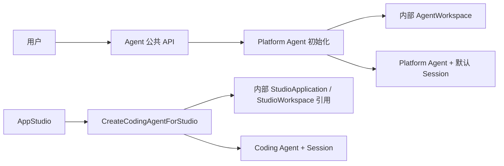
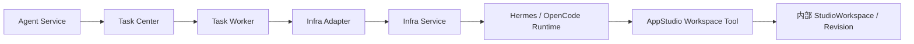

# Agent 领域架构参考

## 1. 边界定位

Agent 拥有 Agent、Session、Invocation、Message、Memory、内部 Workspace 绑定和 AgentRuntime 业务事实。公共 Agent 管理只面向 Platform Agent；Coding Agent 是 AppStudio 的内部协作对象，不通过用户侧 Agent 页面创建或管理。

Workspace 是后端持久化和运行绑定事实，不是公共资源：创建请求、公共 DTO、页面、通知和 SSE 均不包含 Workspace 类型、ID 或 Binding 状态。

## 2. 创建链路

Platform Agent 初始化必须原子创建 AgentWorkspace、Agent、默认 Session 和固定 Binding；Workspace 初始化失败时整体失败。Coding Agent 只能通过内部模块语义创建，且必须在成功返回前固定绑定 AppStudio 提供的稳定引用。

## 3. 运行与源码访问

AgentRuntime 的创建、恢复、停止和销毁都通过 Task Center 与 Infrastructure 执行。Platform Agent 可以按授权挂载内部 AgentWorkspace；Coding Agent 不直接挂载 StudioWorkspace，只能使用绑定 Principal、Agent、Session、Invocation、动作和有效期的短期 Tool 授权提交带 `base_revision` 的 ChangeSet。

## 4. 状态与所有权

- Agent、Session、Invocation、Memory、AgentWorkspace 和 AgentRuntime 归 agent。
- StudioWorkspace、Revision、ChangeSet、Snapshot、Build 和 Release 归 appstudio。
- AtomicTask、Attempt、重试、取消和调度归 task-center。
- InfraRuntime、Endpoint、容器和 Provider 对账归 infrastructure。
- Agent 删除、挂起或 Runtime 重建不得改写 AppStudio 源码或发布事实。

## 5. 当前范围

当前 S1/S2 为未 Release 草稿。用户侧只支持 Platform Agent；Coding Agent 仅供 AppStudio 内部创建。Workspace 公共 API、选择器和导航不在当前范围，内部表、字段和固定绑定约束继续保留。
