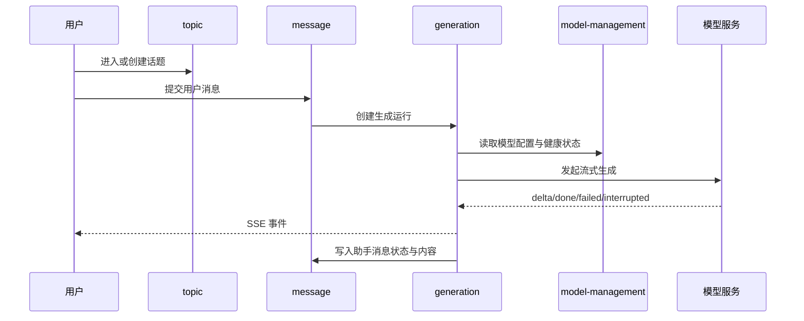

# AI 聊天领域架构参考

## 1. 事实源

- S1：`00_product/domains/ai-chatting/product-spec.md`
- S2：`01_contracts/domains/ai-chatting/`

本文档只提炼架构参考。助手、话题、消息、生成运行、快捷短语、翻译等业务语义以 S1 为准；API、schema、错误码、事件和模块边界以 S2 为准。

## 2. 模块划分

| 模块 | 架构职责 | 主要资源 |
| --- | --- | --- |
| `topic` | 维护用户话题、标题、置顶、分支来源和最后活跃时间 | `ai_chat_topics` |
| `message` | 维护用户消息、助手消息、父子关系、版本与附件输入 | `ai_chat_messages` |
| `generation` | 管理生成运行、停止、重生成、翻译生成和 SSE 输出 | `ai_chat_generation_runs` |
| `assistant` | 管理助手配置、系统助手保护和建议模型引用 | `ai_chat_assistants` |
| `quick-phrase` | 管理全局或助手范围的快捷短语 | `ai_chat_quick_phrases` |
| `translation` | 管理消息翻译结果与翻译模型快照 | `ai_chat_message_translations` |

## 3. 外部依赖

- 依赖 `model-management` 提供当前用户可用模型、默认模型和健康状态。
- 依赖 `identity` 提供当前用户身份与资源隔离语义；当前 S2 `permissions.yaml` 为空，权限码待后续补齐。
- 图片附件输入按 S1 描述不作为独立持久素材事实源；如需沉淀为用户素材，应通过 `asset-library` 的素材契约扩展。

## 4. 核心链路

## 5. 状态与一致性

- `Message.status` 与 `GenerationRun.status` 均使用 `queued`、`generating`、`done`、`interrupted`、`failed` 表达生成生命周期。
- 同一话题内并发生成受 S1/S2 约束，应避免出现多个未终态生成互相覆盖上下文。
- 重生成和编辑后重生成应保留消息版本与父子关系，便于历史继续和分支。
- 翻译生成使用独立的 `translation` 资源，不应改写原消息内容。

## 6. API 面

S2 OpenAPI 将能力拆为：

- `/api/v1/ai-chat/topics`
- `/api/v1/ai-chat/topics/{topic_id}/messages`
- `/api/v1/ai-chat/messages/{message_id}/regenerate`
- `/api/v1/ai-chat/messages/{message_id}/edit-regenerate`
- `/api/v1/ai-chat/generations/{generation_id}/events`
- `/api/v1/ai-chat/generations/{generation_id}/stop`
- `/api/v1/ai-chat/assistants`
- `/api/v1/ai-chat/quick-phrases`
- `/api/v1/ai-chat/translations`

## 7. 架构风险

- 模型引用必须保持只读投影，不得在聊天领域复制模型配置事实源。
- SSE 连接断开时，服务端生成运行状态仍需按 S2 事件和 schema 可追踪。
- 系统助手保护、快捷短语作用域和资源归属需要在 `identity` S2 补齐后进一步收敛权限码。
