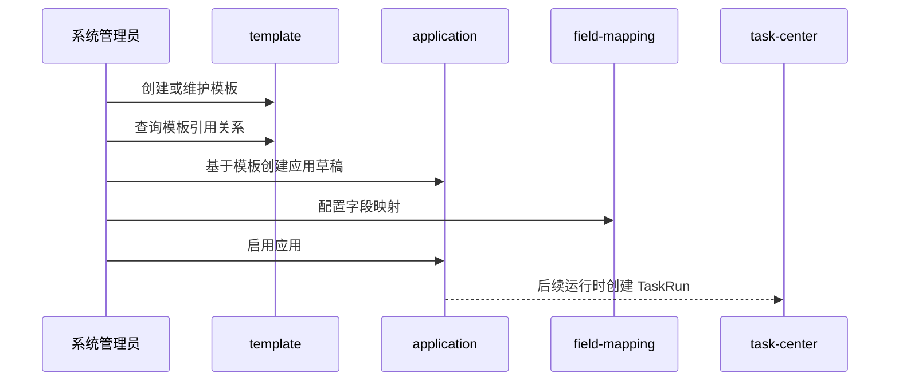

# AI 应用平台领域架构参考

## 1. 事实源

- S1：`00_product/domains/application-platform/product-spec.md`
- S2：`01_contracts/domains/application-platform/`

本文档只描述第一阶段应用平台架构参考：模板管理、应用管理和字段映射。执行、任务、订单、审核上架、公共应用市场、引擎编排等不属于当前阶段。

## 2. 模块划分

| 模块 | 架构职责 | 主要资源 |
| --- | --- | --- |
| `template` | 管理 ComfyUI 工作流模板与 SaaS API 模板、原始配置和引用关系 | `aiapp_app_templates` |
| `application` | 基于模板创建应用草稿、启用、归档和维护应用配置 | `aiapp_applications` |
| `field-mapping` | 维护模板字段与应用入参之间的映射关系 | `aiapp_field_mappings` |
| `access` | 按当前用户身份和资源归属限制可见与可操作资源 | 访问控制聚合 |

## 3. 外部依赖

- 依赖 `identity` 提供当前用户身份和系统管理员/普通用户等权限语义。
- 后续应用运行应通过 `task-center` 创建和追踪任务，不由本领域直接执行。
- 若模板或应用引用用户素材，应通过 `asset-library` 的素材资源 ID 建立关系。

## 4. 核心链路

## 5. 状态与一致性

- 模板类型为 `comfyui` 或 `saas_api`，状态为 `active` 或 `archived`。
- 应用状态为 `draft`、`active`、`archived`。
- 应用从模板派生后需要保存模板引用和模板版本信息，用于引用关系查询与兼容性预警。
- 字段映射整体保存时应保持同一应用下字段集合一致，避免局部保存造成运行参数不完整。

## 6. API 面

S2 OpenAPI 将能力拆为：

- `/api/v1/app-templates`
- `/api/v1/app-templates/{template_id}`
- `/api/v1/app-templates/{template_id}/references`
- `/api/v1/applications`
- `/api/v1/applications/{application_id}`
- `/api/v1/applications/{application_id}/activate`
- `/api/v1/applications/{application_id}/field-mappings`

## 7. 架构风险

- 模板修改可能影响已创建应用，需要以引用关系和兼容性预警保护用户。
- 应用平台不得重新引入已归档到非目标范围的执行、订单、审核、市场和引擎编排能力。
- 与 `task-center` 的运行接口目前只作为架构协作方向，具体执行契约需以 S1/S2 后续补充为准。
