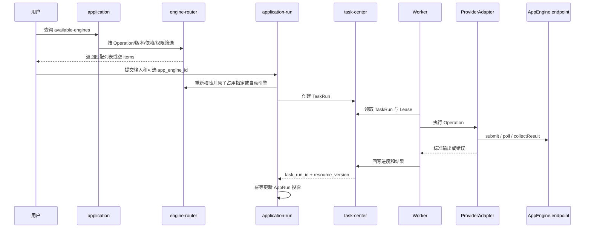

# AI 应用平台领域架构参考

## 1. 事实源

- S1：`00_product/domains/application-platform/product-spec.md`
- S2：`01_contracts/domains/application-platform/`

第一阶段覆盖 Adapter/Operation 目录、工作流模板、统一输入输出端口、应用、AppEngine、真实测试、用户指定或自动路由、AppRun 和 TaskRun 协作。

## 2. 模块划分

| 模块 | 架构职责 | 主要资源 |
| --- | --- | --- |
| adapter-catalog | 只读暴露代码注册的 ProviderAdapter/Operation Manifest | 无用户可写表 |
| template | 解析 ComfyUI/SaaS 工作流为 CapabilityGraph | aiapp_app_templates |
| application | 管理应用、固化参数和输入输出映射 | aiapp_applications、aiapp_input_mappings、aiapp_output_mappings |
| app-engine | 管理运行实例、明文认证、能力、健康和并发 | aiapp_app_engines |
| engine-router | 查询、校验、占用和释放匹配引擎 | aiapp_app_engines |
| application-run | 创建 AppRun/TaskRun，维护 TaskRun 只读投影 | aiapp_application_runs |
| access | 区分资源管理权、引擎使用权和运行可见性 | 访问控制聚合 |

## 3. 类型边界

```text
ProviderAdapter：怎么调用平台
ProviderOperation：平台提供什么版本化输入输出能力
AppTemplate：工作流结构和端口是什么
Application：向用户开放什么、固化什么、输出什么
AppEngine：在哪里调用、使用什么认证、当前能否承载运行
Worker：谁领取任务、维护 Lease、重试并回写结果
```

ProviderAdapter 是受控代码扩展点，不允许用户上传。AppEngine 不实现调用方法。

## 4. ComfyUI 与 SaaS

- ComfyUI 保留完整多节点工作流，解析输入、输出、节点和模型依赖；未知自定义节点可保留但端口必须标记 unresolved。
- direct SaaS Operation 映射为单操作节点并直接创建应用。
- SaaS workflow 生成 AppTemplate，再按端口选择转换应用。
- Seedance 2.0 提供 text-to-video、image-to-video、reference-to-video 异步 Operation。
- GPT Image 2 提供 generate 和 edit Operation，输出类型为 image。

## 5. 引擎发现与执行



可用引擎查询只返回当前用户有使用权、active、healthy、Operation/版本/依赖匹配且有容量的引擎，不返回 auth_config。空列表是成功结果。指定引擎不可用时不回退；未指定时按 priority、负载和稳定 ID 自动选择。

## 6. 状态与结果

- TaskRun 是执行状态唯一事实源。
- AppRun 保存输入、渲染参数、输出映射、requested/resolved engine 和 Operation 快照。
- AppRun 只接受更高 task_resource_version 的状态、进度、结果和失败摘要投影。
- 测试和正式运行共用同一链路，仅通过 run_mode 区分。
- 异步 Adapter 将 external_job_id 写入 TaskAttempt，重试优先恢复已有任务。
- image、video、audio 和 file 只保存 asset_id、storage_uri 或 external_url。

## 7. API 面

主要新增接口：

```text
GET  /api/v1/provider-adapters
GET  /api/v1/provider-adapters/{adapter_key}/operations
GET  /api/v1/app-templates/{template_id}/capability-graph
PUT  /api/v1/applications/{application_id}/input-mappings
PUT  /api/v1/applications/{application_id}/output-mappings
GET  /api/v1/applications/{application_id}/available-engines
POST /api/v1/applications/{application_id}/test-runs
POST /api/v1/applications/{application_id}/runs
```

## 8. 已知风险

- 当前阶段继续明文保存和回显 AppEngine 认证配置，独立 Secret Vault 已归档到后续阶段。
- 引擎列表是即时快照，提交时必须重新校验并原子占用。
- 第三方平台不支持幂等键时仍存在重复提交风险，必须通过 external_job_id 恢复降低风险。
