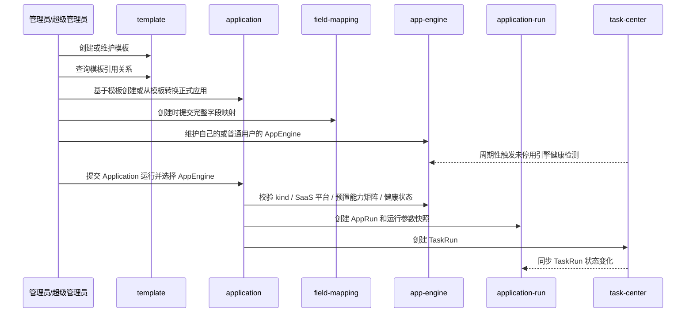

# AI 应用平台领域架构参考

## 1. 事实源

- S1：`00_product/domains/application-platform/product-spec.md`
- S2：`01_contracts/domains/application-platform/`

本文档只描述第一阶段应用平台架构参考：模板管理、应用管理、字段映射、用户级 AppEngine 基础管理和 Application 异步运行提交。订单、审核上架、公共应用市场、引擎供给编排等不属于当前阶段。公共应用仅作为权限范围说明，不展示业务入口。

## 2. 模块划分

| 模块 | 架构职责 | 主要资源 |
| --- | --- | --- |
| `template` | 管理 ComfyUI 工作流模板与 SaaS API 模板、原始配置、解析变量、模板转换应用入口和引用关系 | `aiapp_app_templates` |
| `application` | 基于模板创建正式应用、维护应用配置、承接模板转换应用、创建 AppRun 并委托 task-center 创建 TaskRun | `aiapp_applications`、`aiapp_application_runs` |
| `field-mapping` | 维护模板字段与应用入参之间的映射关系 | `aiapp_field_mappings` |
| `app-engine` | 管理用户自维护 AppEngine、SaaS 平台类型、endpoint、custom_http 配置、明文认证配置、健康状态和删除保护，并提供只读平台元数据 | `aiapp_app_engines` |
| `application-run` | 查询 AppRun、同步 TaskRun 状态、展示输出摘要和失败原因 | `aiapp_application_runs` |
| `access` | 按当前用户身份和资源归属限制可见与可操作资源 | 访问控制聚合 |

## 3. 外部依赖

- 依赖 `identity` 提供当前用户身份、普通用户、管理员和超级管理员权限语义。
- 依赖 `task-center` 周期性触发未停用 AppEngine 健康检测；应用平台负责连接平台、携带明文凭证、解释 custom_http 配置、按平台预置策略判断健康状态并写回。应用平台也支持直接使用 endpoint、认证配置和 custom_http 配置进行不持久化的临时健康检测。
- Application 运行通过 `task-center` 创建和追踪 TaskRun，不由本领域直接推进 TaskRun 状态机、Worker 领取、Lease、重试或取消。
- 若模板或应用引用用户素材，应通过 `asset-library` 的素材资源 ID 建立关系。

## 4. 核心链路

## 5. 状态与一致性

- 模板类型 `kind` 为 `comfyui` 或 `saas_api`，模板不维护生命周期状态。
- `kind=saas_api` 的模板保存 SaaS 平台类型、能力类型、请求模板、参数 schema 和结果提取配置；模板不保存平台操作标识或操作契约。
- 应用不维护状态字段；创建成功即为正式应用，删除后不保留历史查看。
- 应用从模板派生后需要保存模板引用，用于引用关系查询。
- 未被 AppRun 引用的 Application 可以删除；已被 AppRun 引用的 Application 不能物理删除，避免运行历史断链。
- SaaS API Application 从模板继承 SaaS 平台类型和能力类型，并可以保存固化参数。
- Application 与 AppEngine 独立管理，创建或更新 Application 不保存 AppEngine 绑定关系；运行时选择的 AppEngine 只绑定到本次 AppRun。
- AppEngine 属于创建用户；管理员或超级管理员跨用户修改 AppEngine 时，不改变 AppEngine 归属。
- AppEngine 明文认证配置由应用平台保存和返回，前端仅做可见/不可见展示控制。
- SaaS 平台官方默认 endpoint 和能力矩阵由系统预置并只读提供；选择平台时自动填充默认 endpoint，但允许用户修改。
- `engine_type=saas_api` 的 AppEngine 必须保存 SaaS 平台类型；只有 `custom_http` 平台保存 custom_http 配置，非 `custom_http` 平台不保存用户自定义健康检测配置。
- 使用 `app_engine_id` 的健康检测会写回已保存 AppEngine 的健康状态；使用 endpoint、认证方式和 custom_http 配置的临时检测只返回检测结果，不创建或更新 AppEngine。
- 未被 AppRun 引用的 AppEngine 可以删除；已被 AppRun 引用的 AppEngine 只能停用，不能物理删除。
- 运行 Application 时必须选择当前用户可访问、active、healthy、kind 匹配的 AppEngine；SaaS API 运行还必须匹配 SaaS 平台类型，并由平台预置能力矩阵支持能力类型。
- AppRun 保存输入快照、渲染参数快照、TaskRun ID、状态、输出摘要和失败原因。
- 第一阶段 application-platform 不提供 AppRun 取消或重试入口；取消和重试仍由 task-center 的 TaskRun 能力表达。
- 创建应用时必须提交用户已选择可填字段的完整映射；字段映射整体保存时应保持同一应用下字段集合一致，避免局部保存造成运行参数不完整。
- 管理员或超级管理员跨用户修改应用时，不改变应用归属。
- 每个用户创建的资源属于创建者自己，不支持代其他用户创建资源。

## 6. API 面

S2 OpenAPI 将能力拆为：

- `/api/v1/app-templates`
- `/api/v1/app-templates/{template_id}`
- `/api/v1/app-templates/{template_id}/references`
- `/api/v1/app-templates/{template_id}/convert-to-application`
- `/api/v1/applications`
- `/api/v1/applications/{application_id}`
- `/api/v1/applications/{application_id}/runs`
- `/api/v1/application-runs`
- `/api/v1/application-runs/{run_id}`
- `/api/v1/applications/{application_id}/field-mappings`
- `/api/v1/saas-platforms`
- `/api/v1/app-engines`
- `/api/v1/app-engines/{app_engine_id}`
- `/api/v1/app-engines/health-check`
- `/api/v1/app-engines/{app_engine_id}/health-check`

## 7. 架构风险

- 模板内容创建后不可修改，需要以模板引用关系和只读解析变量保护已创建应用。
- 应用平台不得重新引入已归档到非目标范围的订单、审核、市场、EngineClass、EngineClaim、EngineProvision 和引擎供给编排能力。
- AppRun 与 TaskRun 状态同步需要避免双写冲突；TaskRun 生命周期事实以 task-center 为准，AppRun 用户可见状态以 application-platform 的同步记录为准。
- Application、AppTemplate 和 AppEngine 的删除保护需要同时考虑 AppRun 历史引用，避免用户可见运行记录断链。
