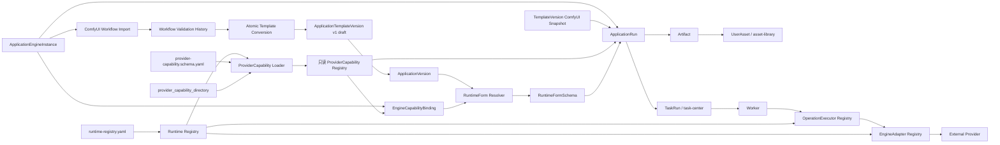
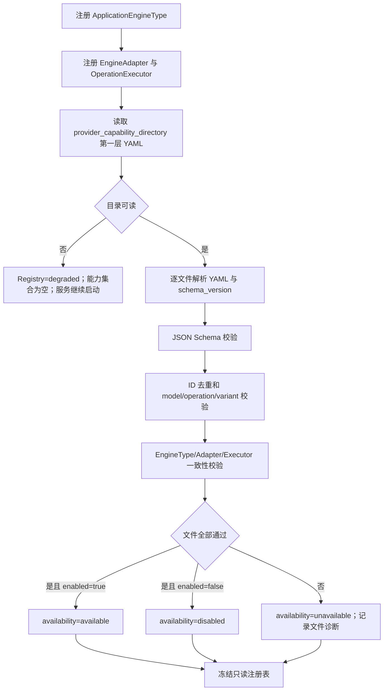
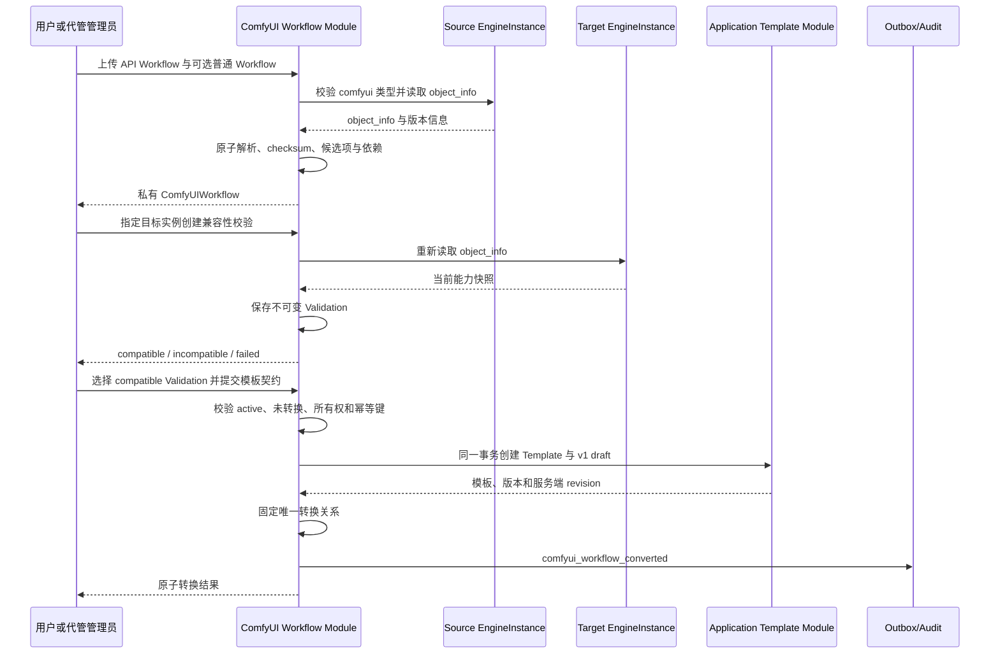
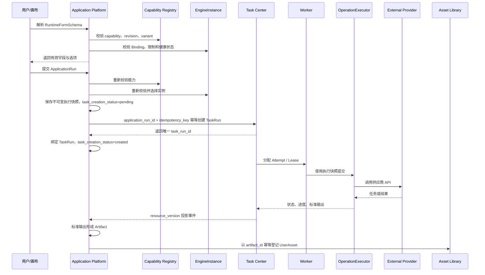

# AI 应用平台领域架构参考

本文是 application-platform v0.9.0-draft 的架构参考。产品语义以 S1 为准，实现接口与数据结构以 S2 为准。

## 1. 架构目标

- 将 ApplicationEngineType、EngineAdapter、OperationExecutor 与易变的平台能力清单分离。
- 以启动目录中的 YAML 作为 ProviderCapability 唯一事实源，不创建数据库副本。
- 任何单个能力文件失败只导致能力级降级，不阻止应用平台服务启动。
- ProviderCapability 与 ComfyUI workflow 使用联合能力来源，ApplicationVersion、ApplicationRun 和 TaskRun 协作均使用可审计的 revision 与执行快照。
- 将用户私有 ComfyUI 工作流的导入、解析、实例校验和一次性模板转换与 ApplicationTemplate 后续版本演进分离。

## 2. 模块关系



## 3. 启动注册顺序



加载按文件原子执行。文件名排序只保证诊断稳定，不赋予覆盖优先级。重复 ID 的所有文件均不可用。运行中不监听目录；更新文件后必须重启。

## 4. ProviderCapability 边界

ProviderCapability 描述：

- 平台、来源和人工核验日期；
- 模型 ID、供应商模型 ID、生命周期和限制；
- Operation 与 CapabilityDefinition 关系；
- Model × Operation 的有效 Variant；
- 输入输出 JSON Schema、必填项、枚举、范围和跨字段约束。

ProviderCapability 不描述：

- 可执行代码或类名；
- API Key 等实例凭证；
- 管理员可写状态；
- 运行态 availability、失败原因、加载时间或来源文件路径；
- TaskRun、Lease、Attempt 或重试策略事实。

`seedance.yaml` 使用 ByteDance Seed 定义模型能力、BytePlus ModelArk 定义可执行 API 参数；`deepseek.yaml` 只覆盖官方稳定 OpenAI-compatible Chat Completions。

## 5. EngineAdapter 与 OperationExecutor

EngineAdapter 负责平台级公共协议：

- base URL、鉴权和公共 Header；
- 网络、上传和平台级健康检测；
- 公共错误、追踪 ID 和状态映射。

OperationExecutor 负责具体 Operation：

- 标准输入与 ProviderCapability Variant 的双重校验；
- 供应商请求转换；
- 同步或异步提交、查询、取消和恢复；
- 输出提取、Artifact 生成和供应商错误归一化。

YAML 只能声明已注册的 Operation，不能补足缺失的执行器。

## 6. 数据归属

| 对象 | 事实源 | 是否持久化 |
| --- | --- | --- |
| CapabilityDefinition / ApplicationEngineType / Adapter / Executor | `runtime-registry.yaml` 只读契约与运行时注册表 | 否 |
| ProviderCapability | 启动目录 YAML 与进程内只读注册表 | 否 |
| ProviderCapabilityLoadResult | 当前进程加载诊断 | 否 |
| ApplicationEngineInstance | application-platform 数据库 | 是 |
| EngineCapabilityBinding | application-platform 数据库 | 是 |
| ComfyUIWorkflow | application-platform 数据库中的用户私有非版本化导入资源 | 是 |
| ComfyUIWorkflowValidation | application-platform 数据库中的不可变实例校验快照 | 是 |
| ApplicationTemplateVersion | application-platform 数据库 | 是 |
| ApplicationVersion | application-platform 数据库 | 是 |
| RuntimeFormSchema | 请求时计算结果 | 否 |
| ApplicationRun | application-platform 数据库 | 是 |
| Artifact | application-platform 数据库 | 是 |
| UserAsset / Artifact 登记映射 | asset-library 数据库 | 是 |
| TaskRun / Attempt / Lease | task-center | 是 |

Binding 中的 ProviderCapability ID 没有数据库外键，创建、解析和运行时通过注册表校验。ApplicationRun 按能力来源保存 ProviderCapability 或 ComfyUI workflow revision 快照，不随重启后的能力变化。

ComfyUIWorkflow 不维护版本树。每次导入生成新资源并保存来源实例 `object_info`；每次兼容性校验保存目标实例独立快照。一次性转换将执行事实深拷贝到首个 draft ApplicationTemplateVersion，之后模板版本与源工作流生命周期解耦。

## 7. ComfyUI 工作流导入与转换时序



转换后的重新校验只追加诊断记录，不进入 TemplateVersion 更新路径。模板后续变化必须显式创建新版本。

## 8. 有效能力计算

```text
RuntimeApplicationCapability
= (available ProviderCapability 当前加载修订 ∩ EngineCapabilityBinding.restrictions)
  或 (ComfyUI workflow contract ∩ 模板 Engine 约束)
∩ ApplicationTemplateVersion 约束
∩ ApplicationVersion 参数策略
∩ EngineInstance 当前健康与激活状态
∩ 用户权限
```

任一来源不可用时不得静默切换模型、扩张参数或修改历史版本。RuntimeFormSchema 只暴露最终交集。

## 9. 运行时序



## 10. 失败隔离

- 目录不可读：注册表 `degraded`，服务继续启动，所有 ProviderCapability 不可执行。
- 单文件失败：只隔离该文件；其他能力正常注册。
- 重复 ID：所有冲突文件不可用，不按顺序覆盖。
- Adapter/Executor 缺失：对应能力不可用，不能由 YAML 补足。
- 运行时供应商拒绝：运行失败并创建 `CapabilityCorrectionRequired`，系统不自动改文件。
- 能力重启后变化：既有 Binding 保留但可能失效；历史 ApplicationRun 快照保持不变。
- ComfyUI 导入失败：不创建工作流；其他工作流与模板不受影响。
- 实例复检失败：追加 failed 或 incompatible 校验，不覆盖旧结果，不修改模板快照。
- 转换失败：模板、首版模板版本和工作流转换标记全部回滚；相同幂等键可安全重试。

## 11. 安全与可见性

- 普通能力目录不暴露磁盘路径、完整加载失败详情或 Engine 凭证。
- 文件级加载诊断仅管理员可见。
- ProviderCapability 无任何写 API 或重新加载 API。
- AppEngine 认证配置仍按当前 S1/S2 权限边界管理；ProviderCapability 文件不得包含凭证。
- 应用创建者只能发现 EngineInstance 的标识、名称、类型、启用和健康状态；base URL、auth_config、凭证和实例写操作仍由管理员权限保护。
- Application 默认 private，只有管理员可设置 global；运行、画布、复制与预设开关独立校验。
- ComfyUIWorkflow 始终为 owner 私有资源，不存在 global 或跨用户共享；管理员代管记录 actor 与 owner。
- 管理员跨所有者读取或操作必须写入 identity 安全审计，至少记录 action、actor、owner、workflow、结果和时间。
- 导入时的 object_info 只能由服务端从 EngineInstance 读取，客户端不能注入；工作流 API 不返回 Engine 凭证。
- workflow-canvas 仍无正式 S1/S2；application-platform S1 第 10～14 章仅保留 deferred 设计，不属于当前实现范围。
