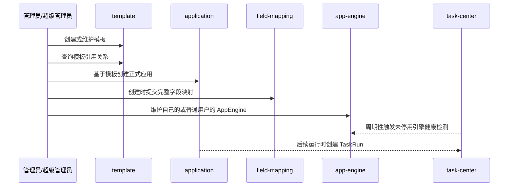

# AI 应用平台领域架构参考

## 1. 事实源

- S1：`00_product/domains/application-platform/product-spec.md`
- S2：`01_contracts/domains/application-platform/`

本文档只描述第一阶段应用平台架构参考：模板管理、应用管理、字段映射和用户级 AppEngine 基础管理。执行、任务、订单、审核上架、公共应用市场、引擎供给编排等不属于当前阶段。公共应用仅作为权限范围说明，不展示业务入口。

## 2. 模块划分

| 模块 | 架构职责 | 主要资源 |
| --- | --- | --- |
| `template` | 管理 ComfyUI 工作流模板与 SaaS API 模板、原始配置和引用关系 | `aiapp_app_templates` |
| `application` | 基于模板创建正式应用、维护应用配置和删除应用 | `aiapp_applications` |
| `field-mapping` | 维护模板字段与应用入参之间的映射关系 | `aiapp_field_mappings` |
| `app-engine` | 管理用户自维护 AppEngine、明文认证配置和健康状态 | `aiapp_app_engines` |
| `access` | 按当前用户身份和资源归属限制可见与可操作资源 | 访问控制聚合 |

## 3. 外部依赖

- 依赖 `identity` 提供当前用户身份、普通用户、管理员和超级管理员权限语义。
- 依赖 `task-center` 周期性触发未停用 AppEngine 健康检测；应用平台负责连接平台、携带明文凭证、判断健康状态并写回。
- 后续应用运行应通过 `task-center` 创建和追踪任务，不由本领域直接执行。
- 若模板或应用引用用户素材，应通过 `asset-library` 的素材资源 ID 建立关系。

## 4. 核心链路

## 5. 状态与一致性

- 模板类型为 `comfyui` 或 `saas_api`，模板不维护生命周期状态。
- 应用不维护状态字段；创建成功即为正式应用，删除后不保留历史查看。
- 应用从模板派生后需要保存模板引用，用于引用关系查询。
- Application 与 AppEngine 独立管理，创建或更新 Application 不保存 AppEngine 绑定关系。
- AppEngine 属于创建用户；管理员或超级管理员跨用户修改 AppEngine 时，不改变 AppEngine 归属。
- AppEngine 明文认证配置由应用平台保存和返回，前端仅做可见/不可见展示控制。
- 创建应用时必须提交用户已选择可填字段的完整映射；字段映射整体保存时应保持同一应用下字段集合一致，避免局部保存造成运行参数不完整。
- 管理员或超级管理员跨用户修改应用时，不改变应用归属。
- 每个用户创建的资源属于创建者自己，不支持代其他用户创建资源。

## 6. API 面

S2 OpenAPI 将能力拆为：

- `/api/v1/app-templates`
- `/api/v1/app-templates/{template_id}`
- `/api/v1/app-templates/{template_id}/references`
- `/api/v1/applications`
- `/api/v1/applications/{application_id}`
- `/api/v1/applications/{application_id}/field-mappings`
- `/api/v1/app-engines`
- `/api/v1/app-engines/{app_engine_id}`
- `/api/v1/app-engines/{app_engine_id}/health-check`

## 7. 架构风险

- 模板内容创建后不可修改，需要以模板引用关系和只读解析变量保护已创建应用。
- 应用平台不得重新引入已归档到非目标范围的执行、订单、审核、市场、EngineClass、EngineClaim、EngineProvision 和引擎供给编排能力。
- 与 `task-center` 的运行接口目前只作为架构协作方向，具体执行契约需以 S1/S2 后续补充为准。
