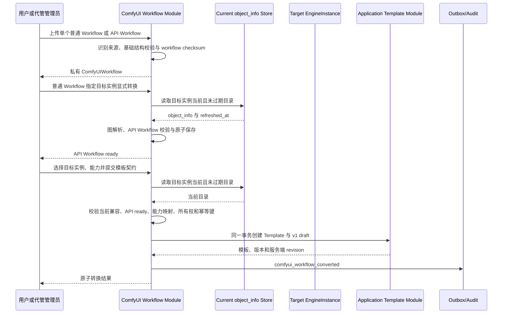
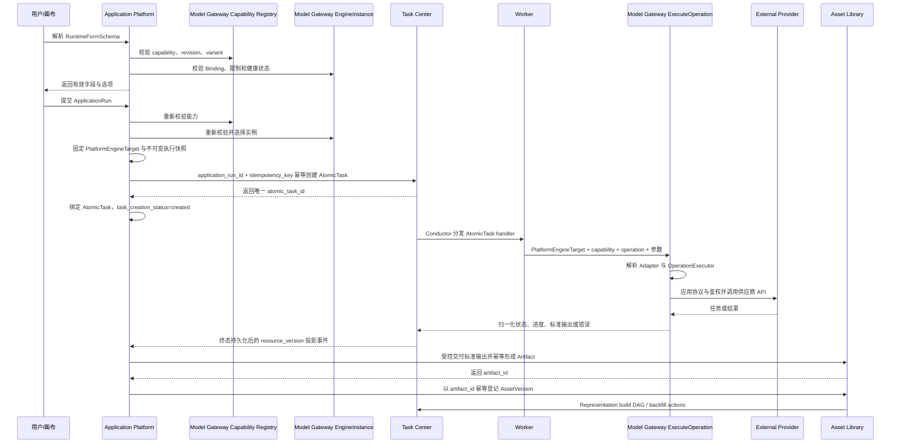

# AI 应用平台领域架构参考

本文是 application-platform v1.3.0 的架构参考。产品语义以 S1 为准，实现接口与数据结构以 S2 为准。

Canvas Application 节点复用 Workflow Canvas 已创建的 DAG AtomicTask。`application-platform.run` Worker 先取得 Conductor 已解析参数，再调用 Application Platform 幂等固化 ApplicationRun，并经 Task Center 绑定同一任务；只有绑定双方都可读后才进入 Provider。发布事件负责节点目录登记，实时可用性仍由受控查询边界判定。Artifact 引用 outbox 驱动 Canvas 输出槽位单调投影。

## 1. 架构目标

- 保持 Application、Template、RuntimeFormSchema 与 ApplicationRun 的稳定应用语义。
- 通过 `modelgateway` 解析 ProviderCapability、EngineCapabilityBinding、EngineInstance 与当前 object_info，并形成 `PlatformEngineTarget`。
- ApplicationExecutor 继续编排应用执行、AtomicTask 协作和 Artifact 交付，通过 Gateway `ExecuteOperation` 执行，不复制 Gateway 私有事实或 Provider 专用客户端。
- ComfyUI 工作流导入、解析、兼容性校验和模板转换继续由本领域维护。

## 2. Model Gateway 依赖

`CapabilityDefinition`、`ApplicationEngineType`、`ProviderCapability`、`ApplicationEngineInstance`、`EngineCapabilityBinding`、`EngineAdapter`、`OperationExecutor`、Runtime Registry、健康检测和当前 object_info 的架构归 `02_architecture/domains/modelgateway.md`。

Application Platform 只通过稳定 ID、权限裁剪摘要和受控模块接口读取当前能力与执行状态。ApplicationRun 中的 ProviderCapability、EngineInstance、Binding、`PlatformEngineTarget` 与能力 revision 是创建时的不可变非敏感快照，不构成 Gateway 当前事实副本。Application Platform 不使用 `UserModelTarget`。

## 7. ComfyUI 工作流导入与转换时序


```mermaid
sequenceDiagram
    participant User as 用户或代管管理员
    participant Workflow as ComfyUI Workflow Module
    participant Catalog as Current object_info Store
    participant Target as Target EngineInstance
    participant Template as Application Template Module
    participant Outbox as Outbox/Audit

    User->>Workflow: 上传单个普通 Workflow 或 API Workflow
    Workflow->>Workflow: 识别来源、基础结构校验与 workflow checksum
    Workflow-->>User: 私有 ComfyUIWorkflow

    User->>Workflow: 普通 Workflow 指定目标实例显式转换
    Workflow->>Catalog: 读取目标实例当前且未过期目录
    Catalog-->>Workflow: object_info 与 refreshed_at
    Workflow->>Workflow: 图解析、API Workflow 校验与原子保存
    Workflow-->>User: API Workflow ready

    User->>Workflow: 选择目标实例、能力并提交模板契约
    Workflow->>Catalog: 读取目标实例当前且未过期目录
    Catalog-->>Workflow: 当前目录
    Workflow->>Workflow: 校验当前兼容、API ready、能力映射、所有权和幂等键
    Workflow->>Template: 同一事务创建 Template 与 v1 draft
    Template-->>Workflow: 模板、版本和服务端 revision
    Workflow->>Outbox: comfyui_workflow_converted
    Workflow-->>User: 原子转换结果
```

独立兼容性校验仍只追加诊断记录，不进入 TemplateVersion 更新路径。相同工作流可以再次创建另一套 Template 与 v1 draft；模板后续变化必须显式创建新版本，目录刷新只改变实时兼容性，不改写任何模板版本。

## 8. 有效能力计算

```text
RuntimeApplicationCapability
= (available ProviderCapability 当前加载修订 ∩ EngineCapabilityBinding.restrictions)
  或 (ComfyUI workflow contract ∩ 模板 Engine 约束)
∩ ApplicationTemplateVersion 约束
∩ ApplicationVersion 参数策略
∩ EngineInstance 当前健康与激活状态
∩ 用户权限
```

任一来源不可用时不得静默切换模型、扩张参数或修改历史版本。RuntimeFormSchema 只暴露最终交集。

## 9. 运行时序


```mermaid
sequenceDiagram
    participant User as 用户/画布
    participant App as Application Platform
    participant Registry as Model Gateway Capability Registry
    participant Engine as Model Gateway EngineInstance
    participant Task as Task Center
    participant Worker as Worker
    participant Gateway as Model Gateway ExecuteOperation
    participant Provider as External Provider
    participant Asset as Asset Library

    User->>App: 解析 RuntimeFormSchema
    App->>Registry: 校验 capability、revision、variant
    App->>Engine: 校验 Binding、限制和健康状态
    App-->>User: 返回有效字段与选项
    User->>App: 提交 ApplicationRun
    App->>Registry: 重新校验能力
    App->>Engine: 重新校验并选择实例
    App->>App: 固定 PlatformEngineTarget 与不可变执行快照
    App->>Task: application_run_id + idempotency_key 幂等创建 AtomicTask
    Task-->>App: 返回唯一 atomic_task_id
    App->>App: 绑定 AtomicTask，task_creation_status=created
    Task->>Worker: Conductor 分发 AtomicTask handler
    Worker->>Gateway: PlatformEngineTarget + capability + operation + 参数
    Gateway->>Gateway: 解析 Adapter 与 OperationExecutor
    Gateway->>Provider: 应用协议与鉴权并调用供应商 API
    Provider-->>Gateway: 任务或结果
    Gateway-->>Task: 归一化状态、进度、标准输出或错误
    Task-->>App: 终态持久化后的 resource_version 投影事件
    App->>Asset: 受控交付标准输出并幂等形成 Artifact
    Asset-->>App: 返回 artifact_id
    App->>Asset: 以 artifact_id 幂等登记 AssetVersion
    Asset->>Task: Representation build DAG / backfill actions
```

Artifact 处理事实以 asset-library 为准，状态为 `created/transferring/processing/ready/failed/deleted`；预览就绪是独立事实。ApplicationPlatform 只保存 Artifact 引用和只读版本投影，不发布竞争性的 Artifact 生命周期事件。

终态投影只接受大于当前 `task_resource_version` 的 AtomicTask 版本；同版本重放必须幂等，旧版本不得回退状态或输出。Artifact 引用以运行、输出 key 和序号稳定去重，投影失败可重试但不得改写 AtomicTask 事实。

## 10. 失败隔离

Model Gateway 将目录、Registry、Adapter、Executor、Engine 或 Binding 不可用结果通过 `ExecuteOperation` 的稳定错误和受控模块边界返回。本领域不得绕过失败、补造执行能力、改用 `UserModelTarget` 或静默切换模型；历史 ApplicationRun 快照保持不变。
- ComfyUI 导入失败：不创建工作流；其他工作流与模板不受影响。
- 实例复检失败：追加 failed 或 incompatible 校验，不覆盖旧结果，不修改模板快照。
- 转换失败：模板与首版模板版本全部回滚；相同幂等键可安全重试，不同幂等键可从同一工作流创建其他模板。

## 10.1 Model Gateway 运行事实消费

EngineInstance 健康检测与 ComfyUI object_info 刷新由 Model Gateway 使用既有 system_key 执行。本领域在工作流解析、校验、模板发布、RuntimeFormSchema 和运行前通过 Gateway 重新读取当前事实，并继续拒绝 stale 或不可执行实例。

## 11. 安全与可见性

- Gateway 能力目录、加载诊断、Engine 凭证和 object_info 按 Model Gateway 权限边界返回；本领域不得扩大其可见性或缓存敏感字段。
- Application 默认 private，只有管理员可设置 global；运行、画布、复制与预设开关独立校验。
- ComfyUIWorkflow 始终为 owner 私有资源，不存在 global 或跨用户共享；管理员代管记录 actor 与 owner。
- 管理员跨所有者读取或操作必须写入 identity 安全审计，至少记录 action、actor、owner、workflow、结果和时间。
- object_info 只能由服务端刷新到 EngineInstance 当前目录，客户端不能注入；工作流、校验、模板和运行 API 不重复内嵌目录正文，所有 API 均不返回 Engine 凭证。
- workflow-canvas 拥有 Canvas、不可变版本、DAG 编译和运行视图；application-platform 只提供已发布 ApplicationVersion、ApplicationRun 和 Artifact 引用协作。
