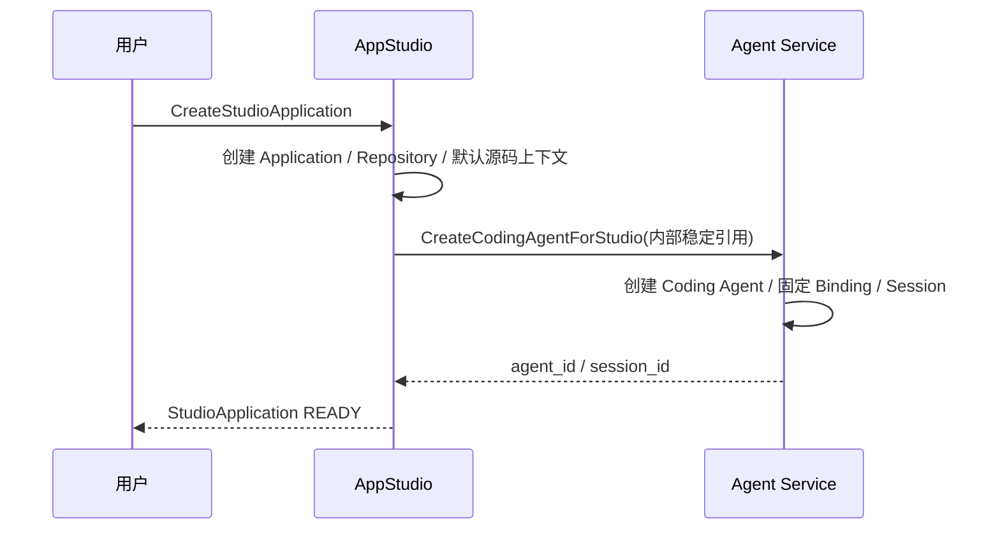
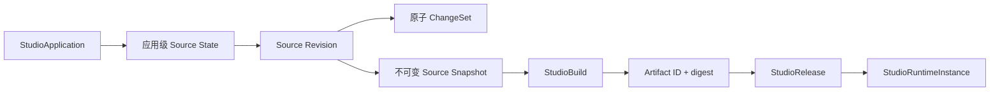
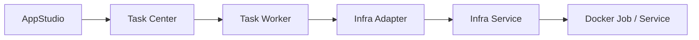

# AppStudio 领域架构参考

## 1. 边界定位

AppStudio 拥有 StudioApplication 从源码编辑、Revision、不可变 Snapshot、Build、Release 到 StudioRuntimeInstance 的完整业务链路。用户只感知应用、源码和 Revision；唯一默认 StudioWorkspace 是后端 canonical 编辑上下文，不构成公共资源或导航层。

## 2. 应用初始化

`CreateStudioApplication` 不接收 Workspace 输入。Coding Agent 创建失败时应用进入 `ERROR`，已创建的 Repository 和源码事实保留；相同幂等请求可以重试，且不得形成未固定绑定的 Coding Agent。

## 3. 源码谱系

公共 Source、文件、搜索、ChangeSet、恢复、Snapshot 和 Preview 接口均通过 `studio_application_id` 寻址。公共 DTO 使用 `source_revision`，不返回 `workspace_id` 或 `workspace_revision`。内部 Schema 继续保留默认 Workspace、Revision 和固定引用，以维持原子写入、审计和运行安全约束。

## 4. 执行链路

Preview、Build、发布、升级和回滚统一通过：

Preview 只读使用启动时固定的应用源码 Revision；Build 只读使用 `READY` 的 StudioSourceSnapshot；Production 只读使用固定 Artifact digest。Production 请求携带内部 Workspace、Revision 或 Snapshot 挂载时必须拒绝。

## 5. 跨域所有权

- Coding Agent、Session、Invocation 和 AgentRuntime 归 agent。
- AtomicTask、Attempt、重试、取消和任务合同归 task-center。
- Artifact 内容、处理和 READY 状态归 asset-library；AppStudio 只保存 ID 和 digest 快照。
- InfraRuntime、Endpoint、容器和 Provider 对账归 infrastructure。
- Notification 和 UserEvent 只能投影应用、源码、Revision、Build、Release 和 Runtime 语义，不得携带内部 Workspace 字段。

## 6. 当前范围

当前 S1/S2 为未 Release 草稿。一个 StudioApplication 只有一个由后端管理的默认编辑上下文；多 Workspace、Workspace 页面、选择器和公共 Workspace API 均不在当前范围。内部 Workspace 表和字段不删除、不重命名，也不创建 migration。
