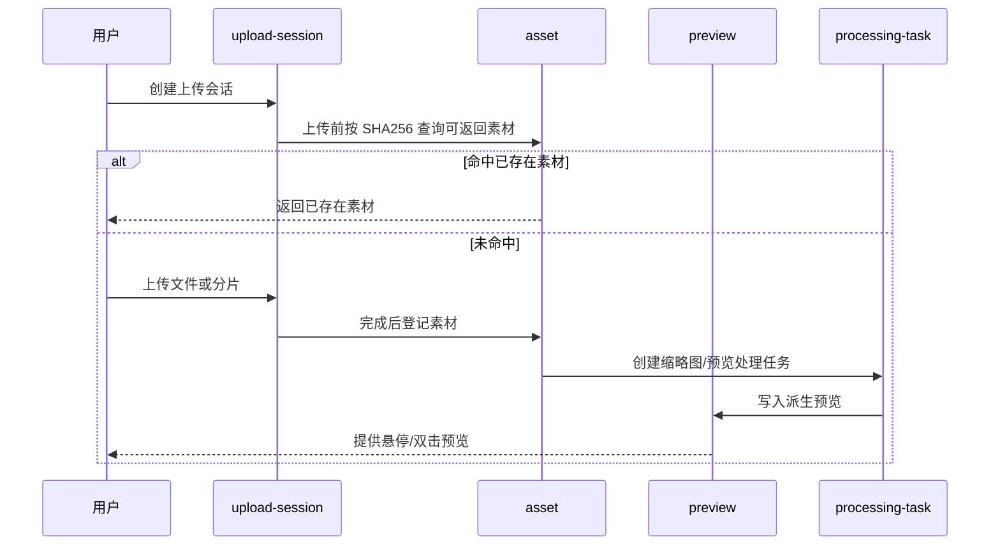
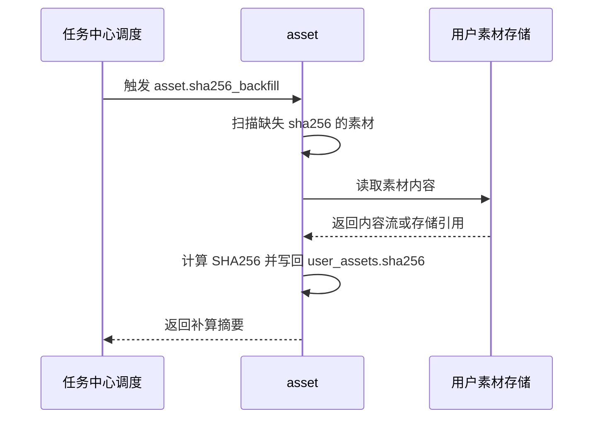
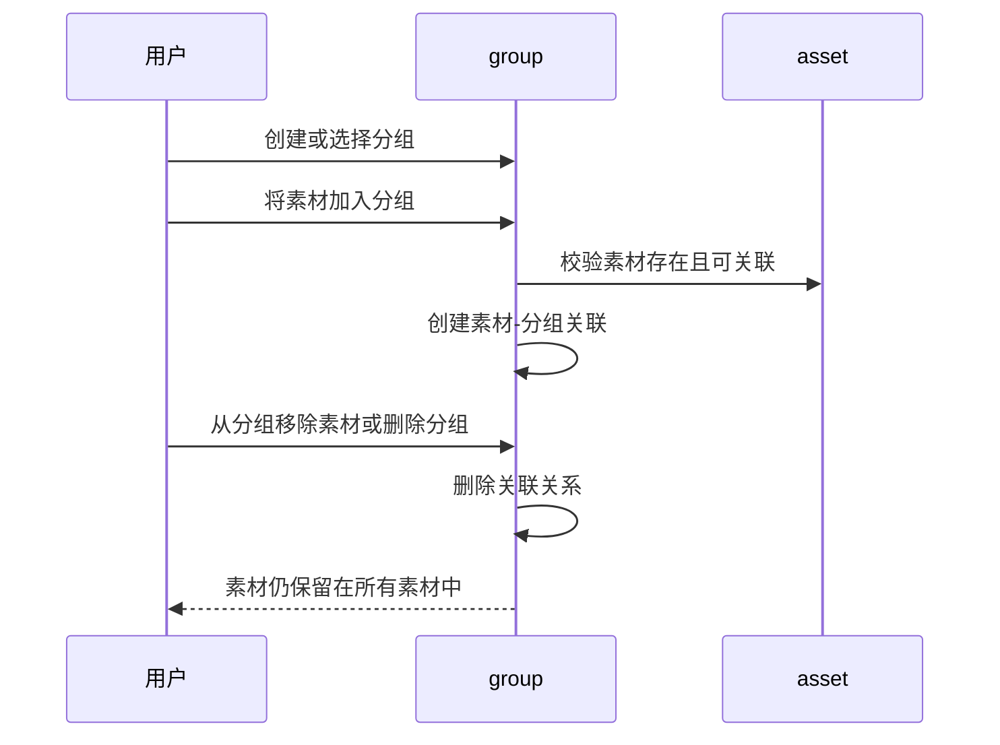
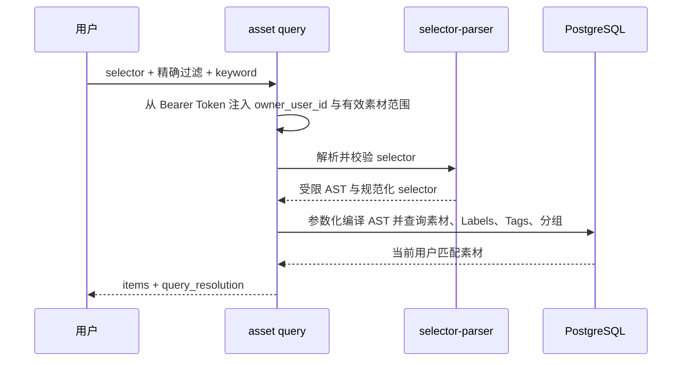
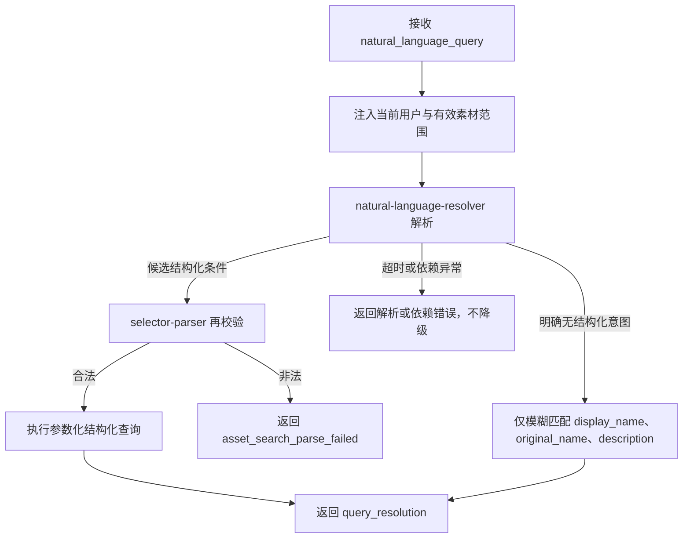
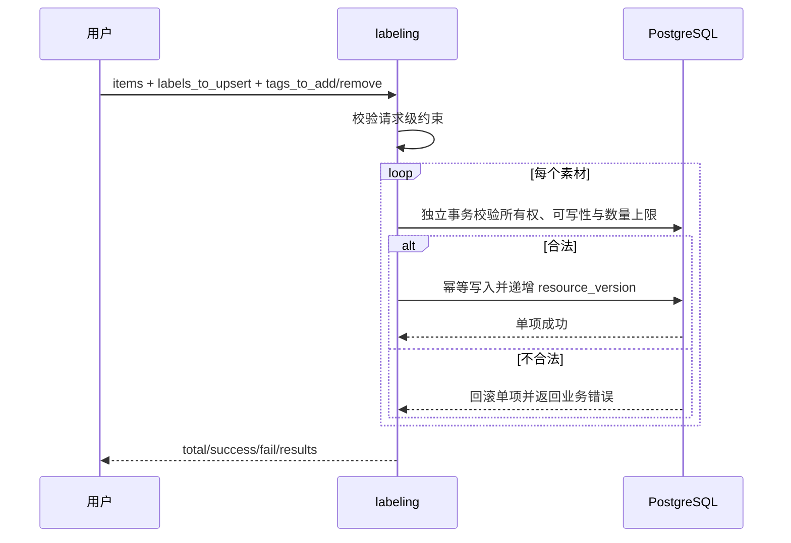

# 用户素材管理领域架构参考

## 1. 事实源

- S1：`00_product/domains/asset-library/product-spec.md`
- S2：`01_contracts/domains/asset-library/`

当前 S2 已包含标签查询、批量打标与 Application Artifact 登记 OpenAPI、错误码、权限码、事件、设计态 `schema.sql` 和 `module-contract.md`。

## 2. 模块划分

| 模块 | 架构职责 | 主要资源 |
| --- | --- | --- |
| `asset` | 维护用户素材基础信息、媒体类型、来源、存储引用、归属和轻量引用摘要 | `user_assets` |
| `labeling` | 维护 Labels/Tags、来源、约束和批量写入 | `user_asset_labels`、`user_asset_tags` |
| `selector-parser` | 将统一选择器转换为受限 AST，不拼接 SQL | 无持久化资源 |
| `natural-language-resolver` | 将自然语言转换为候选结构化条件或明确的无结构化意图 | 无持久化资源 |
| `upload-session` | 管理普通上传、分片上传、取消和上传会话状态 | `user_asset_upload_sessions` |
| `group` | 管理用户素材分组、分组排序和素材-分组关联 | `user_asset_groups`、`user_asset_group_memberships` |
| `preview` | 维护缩略图、预览派生物和预览失败信息 | `user_asset_previews` |
| `processing-task` | 表达上传后异步处理任务，如缩略图、预览派生物和 SHA256 补算 | `user_asset_processing_tasks` |
| `canvas-output` | 登记画布输出资产包与关联素材 | `canvas_asset_outputs` |
| `artifact-registration` | 校验 ApplicationRun Artifact 并幂等登记 UserAsset | `artifact_asset_registrations`、`user_assets` |

## 3. 外部依赖

- 依赖 `identity` 提供当前用户身份、资源隔离和只读状态。
- 被 `ai-chatting`、`application-platform` 和后续 `workflow-canvas` 引用，用于素材选择、生成产物登记和下载。
- 若异步处理需要统一调度，可按 S2 最小模块契约与 `task-center` 协作。
- SHA256 缺失补算由任务中心周期性调度 AtomicTask，素材库负责实际扫描、读取内容、计算 checksum 和写回。
- 三视图模式属于前端本地呈现偏好，不进入服务端 S2；素材分组是用户范围内的逻辑关联，不是存储目录。
- 画布等外部模块可以通过回调或等价协作方式维护素材的轻量引用摘要，用于前端提示。
- 自然语言解析可依赖独立模型或索引服务，但输出必须再次通过 `selector-parser` 校验；依赖异常不得触发关键词降级。
- application-platform 拥有 Artifact 和登记失败状态；asset-library 只拥有成功登记映射与 UserAsset，不改写 AtomicTask 终态。

## 4. 核心链路

## 4.1 SHA256 补算链路

## 4.2 分组管理链路

## 4.3 标签选择器查询链路

## 4.4 自然语言搜索降级链路

## 4.5 批量打标链路

## 5. 状态与一致性

- 上传会话状态为 `initialized`、`uploading`、`completed`、`cancelled`、`failed`。
- 素材预览与缩略图状态为 `none`、`pending`、`ready`、`failed`。
- 处理任务状态为 `pending`、`processing`、`completed`、`failed`。
- `user_assets` 是素材事实源；预览和处理任务失败不应导致素材基础记录丢失。
- Artifact 登记以 artifact_id 幂等；首次成功创建 `application_output` UserAsset，重复请求返回同一素材，非法请求不创建空素材。
- `sha256_backfill` 失败不应影响素材可见性，应通过处理任务状态或结果摘要表达失败。
- `user_asset_groups` 与 `user_asset_group_memberships` 只表达逻辑分组；删除分组或关联不应删除 `user_assets`。
- 同一素材可关联多个分组，同一素材在同一分组内只保留一条有效关联。
- `reference_count` 和 `reference_sources_json` 是轻量展示摘要，允许由引用方最终一致维护，不替代引用方自己的事实源。
- `user_asset_labels` 与 `user_asset_tags` 是标签事实源；Label key 和 Tag 使用区分大小写的唯一性，软删除记录不占用有效唯一约束。
- 选择器 AST 只能编译为参数化查询，且必须与 `owner_user_id`、`deleted_at IS NULL` 基础范围合取。
- 批量打标按素材独立提交；单项失败不会回滚其他素材，单项成功递增素材 `resource_version`。
- 画布输出资产通过 `canvas_asset_outputs` 建立输出包与素材集合之间的关系。

## 6. API 与事件缺口

当前 S2 缺少以下契约：

- 上传、停止上传、预览、下载、重命名、删除和完整分组管理的 OpenAPI。
- 上传失败、处理失败、内容访问拒绝等非标签场景错误码。
- 只读状态、素材管理与画布输出相关权限码。
- 上传完成、预览生成完成、处理失败、画布输出登记等事件。
- 非标签模块的完整边界、跨域调用规则和分组操作接口。

## 7. 架构风险

- 大文件上传与分片上传需要在 S2 中明确幂等、续传、取消和清理策略。
- 存储引用与实际文件生命周期需要独立治理，不能只依赖素材表删除。
- 旧标签 JSON 切换到规范化标签表需要实现侧回填和异常报告；本仓库不维护实际 migration。
- 大规模模糊搜索需要评估 PostgreSQL `pg_trgm` 或独立索引服务，但任何替代实现都必须保持字段白名单、用户隔离和降级规则。
