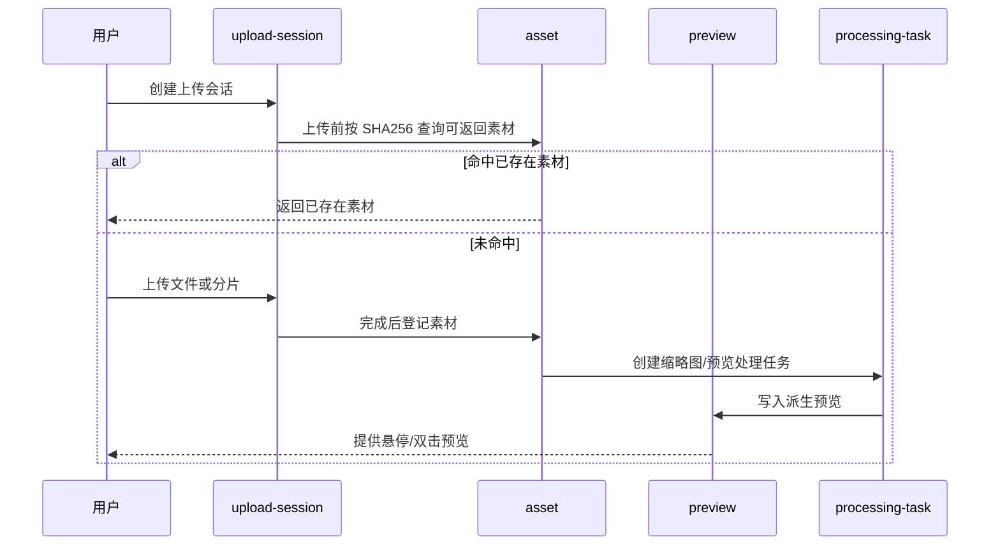
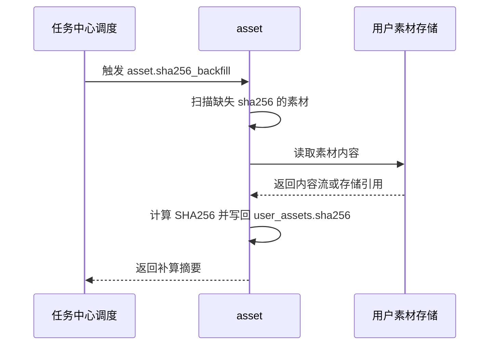
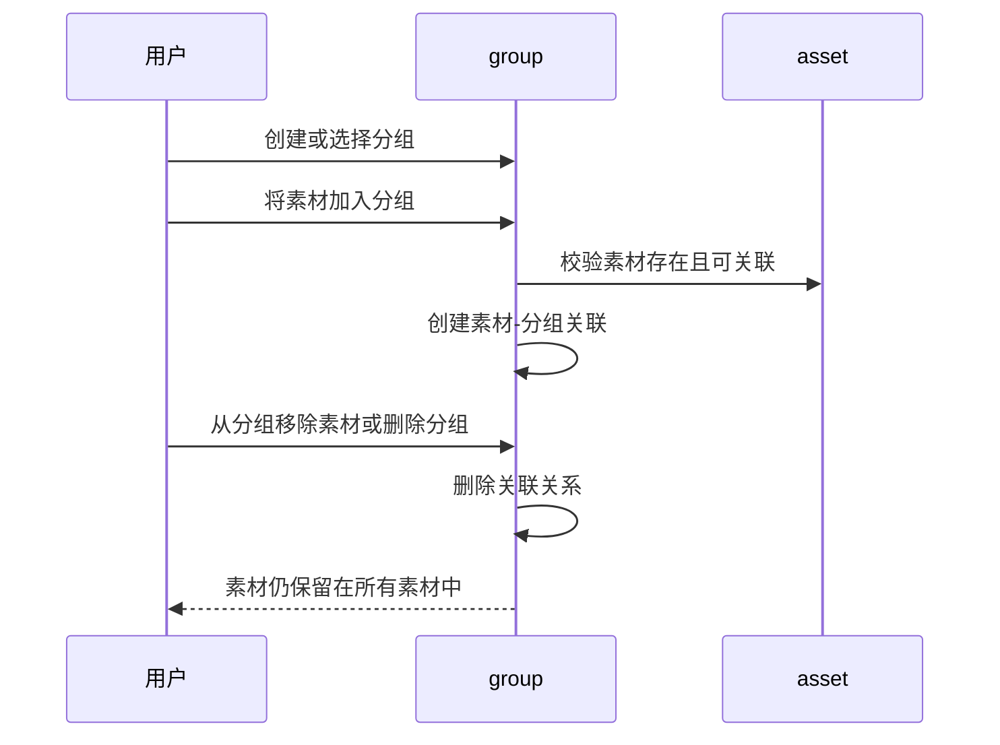

# 用户素材管理领域架构参考

## 1. 事实源

- S1：`00_product/domains/asset-library/product-spec.md`
- S2：`01_contracts/domains/asset-library/`

当前 S2 已包含设计态 `schema.sql` 和最小 `module-contract.md`；OpenAPI、错误码、权限码和事件仍为空。本文档只能基于 S1 与现有 S2 提炼架构，不补写未定义契约。

## 2. 模块划分

| 模块 | 架构职责 | 主要资源 |
| --- | --- | --- |
| `asset` | 维护用户素材基础信息、媒体类型、来源、存储引用、归属和轻量引用摘要 | `user_assets` |
| `upload-session` | 管理普通上传、分片上传、取消和上传会话状态 | `user_asset_upload_sessions` |
| `group` | 管理用户素材分组、分组排序和素材-分组关联 | `user_asset_groups`、`user_asset_group_memberships` |
| `preview` | 维护缩略图、预览派生物和预览失败信息 | `user_asset_previews` |
| `processing-task` | 表达上传后异步处理任务，如缩略图、预览派生物和 SHA256 补算 | `user_asset_processing_tasks` |
| `canvas-output` | 登记画布输出资产包与关联素材 | `canvas_asset_outputs` |

## 3. 外部依赖

- 依赖 `identity` 提供当前用户身份、资源隔离和只读状态。
- 被 `ai-chatting`、`application-platform` 和后续 `workflow-canvas` 引用，用于素材选择、生成产物登记和下载。
- 若异步处理需要统一调度，可按 S2 最小模块契约与 `task-center` 协作。
- SHA256 缺失补算由任务中心周期性调度 TaskRun，素材库负责实际扫描、读取内容、计算 checksum 和写回。
- 三视图模式属于前端本地呈现偏好，不进入服务端 S2；素材分组是用户范围内的逻辑关联，不是存储目录。
- 画布等外部模块可以通过回调或等价协作方式维护素材的轻量引用摘要，用于前端提示。

## 4. 核心链路

## 4.1 SHA256 补算链路

## 4.2 分组管理链路

## 5. 状态与一致性

- 上传会话状态为 `initialized`、`uploading`、`completed`、`cancelled`、`failed`。
- 素材预览与缩略图状态为 `none`、`pending`、`ready`、`failed`。
- 处理任务状态为 `pending`、`processing`、`completed`、`failed`。
- `user_assets` 是素材事实源；预览和处理任务失败不应导致素材基础记录丢失。
- `sha256_backfill` 失败不应影响素材可见性，应通过处理任务状态或结果摘要表达失败。
- `user_asset_groups` 与 `user_asset_group_memberships` 只表达逻辑分组；删除分组或关联不应删除 `user_assets`。
- 同一素材可关联多个分组，同一素材在同一分组内只保留一条有效关联。
- `reference_count` 和 `reference_sources_json` 是轻量展示摘要，允许由引用方最终一致维护，不替代引用方自己的事实源。
- 画布输出资产通过 `canvas_asset_outputs` 建立输出包与素材集合之间的关系。

## 6. API 与事件缺口

当前 S2 缺少以下契约：

- 素材列表、上传、停止上传、预览、下载、重命名、删除的 OpenAPI。
- 上传失败、处理失败、访问拒绝等错误码。
- 只读状态、素材管理与画布输出相关权限码。
- 上传完成、预览生成完成、处理失败、画布输出登记等事件。
- 完整模块边界、跨域调用规则和分组操作接口。

## 7. 架构风险

- 大文件上传与分片上传需要在 S2 中明确幂等、续传、取消和清理策略。
- 存储引用与实际文件生命周期需要独立治理，不能只依赖素材表删除。
- 自然语言搜索如果引入向量或索引服务，应先补 S1/S2，不应直接落入架构实现。
