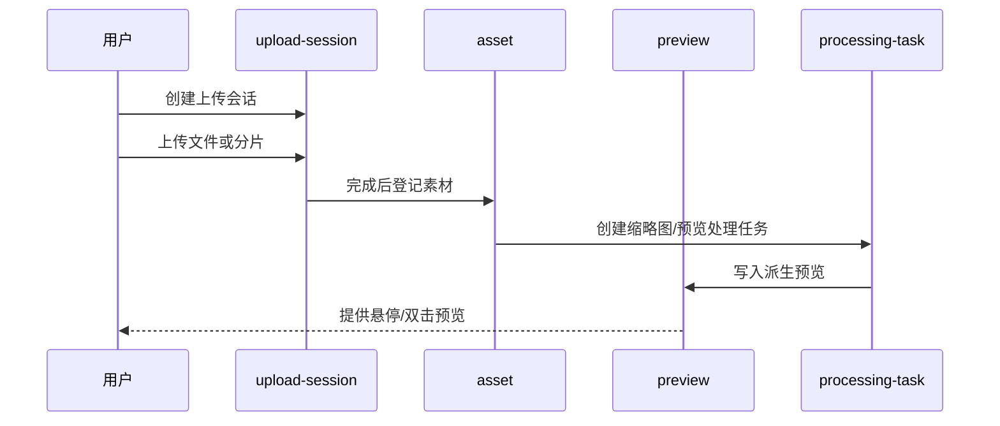

# 用户素材管理领域架构参考

## 1. 事实源

- S1：`00_product/domains/asset-library/product-spec.md`
- S2：`01_contracts/domains/asset-library/`

当前 S2 仅 `schema.sql` 有内容，OpenAPI、错误码、权限码、事件和模块契约仍为空。本文档只能基于 S1 与现有设计态 schema 提炼架构，不补写未定义契约。

## 2. 模块划分

| 模块 | 架构职责 | 主要资源 |
| --- | --- | --- |
| `asset` | 维护用户素材基础信息、媒体类型、来源、存储引用和归属 | `user_assets` |
| `upload-session` | 管理普通上传、分片上传、取消和上传会话状态 | `user_asset_upload_sessions` |
| `preview` | 维护缩略图、预览派生物和预览失败信息 | `user_asset_previews` |
| `processing-task` | 表达上传后异步处理任务，如缩略图和预览派生物 | `user_asset_processing_tasks` |
| `canvas-output` | 登记画布输出资产包与关联素材 | `canvas_asset_outputs` |

## 3. 外部依赖

- 依赖 `identity` 提供当前用户身份、资源隔离和只读状态。
- 被 `ai-chatting`、`application-platform` 和后续 `workflow-canvas` 引用，用于素材选择、生成产物登记和下载。
- 若异步处理需要统一调度，可与 `task-center` 协作，但当前 S2 尚未定义该跨域契约。

## 4. 核心链路

## 5. 状态与一致性

- 上传会话状态为 `initialized`、`uploading`、`completed`、`cancelled`、`failed`。
- 素材预览与缩略图状态为 `none`、`pending`、`ready`、`failed`。
- 处理任务状态为 `pending`、`processing`、`completed`、`failed`。
- `user_assets` 是素材事实源；预览和处理任务失败不应导致素材基础记录丢失。
- 画布输出资产通过 `canvas_asset_outputs` 建立输出包与素材集合之间的关系。

## 6. API 与事件缺口

当前 S2 缺少以下契约：

- 素材列表、上传、停止上传、预览、下载、重命名、删除的 OpenAPI。
- 上传失败、处理失败、访问拒绝等错误码。
- 只读状态、素材管理与画布输出相关权限码。
- 上传完成、预览生成完成、处理失败、画布输出登记等事件。
- 模块边界与跨域调用规则。

## 7. 架构风险

- 大文件上传与分片上传需要在 S2 中明确幂等、续传、取消和清理策略。
- 存储引用与实际文件生命周期需要独立治理，不能只依赖素材表删除。
- 自然语言搜索如果引入向量或索引服务，应先补 S1/S2，不应直接落入架构实现。
