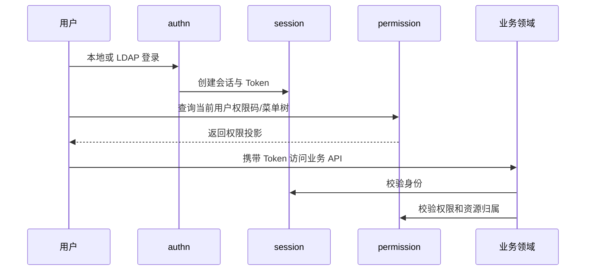

# 统一身份认证与访问控制领域架构参考

## 1. 事实源

- S1：`00_product/domains/identity/product-spec.md`
- S2：当前尚未提供 `01_contracts/domains/identity/`

本文档只能基于 S1 提炼架构参考。API、schema、错误码、权限码、事件和模块边界仍需后续 S2 补齐。

## 2. 模块划分

| 模块 | 架构职责 |
| --- | --- |
| `authn` | 本地登录、LDAP 登录、Token 刷新、局部登出、全局单点登录/注销 |
| `session` | 认证中心会话、Token 凭据、失效与续期 |
| `user` | 用户注册、用户管理、个人资料、密码修改、首次登录引导 |
| `group` | 用户组与用户组成员关系 |
| `role` | 角色、角色继承、互斥角色、内置角色层级 |
| `permission` | 权限资源、角色权限授权、当前用户权限码、菜单树 |
| `config` | 系统级认证配置、LDAP 配置、预留 OAuth Provider 配置 |
| `audit` | 登录、权限、管理操作与异常行为审计 |

## 3. 横向职责

- 为所有业务领域提供当前用户身份、认证状态和资源访问边界。
- 为前端提供动态权限码与菜单树，但前端权限只用于呈现，后端仍需独立鉴权。
- 为管理后台提供用户、组、角色、权限资源和 LDAP 配置管理。
- 为审计提供可查询的安全事件记录。

## 4. 核心链路

## 5. 当前阶段边界

- 当前阶段不支持邮箱验证、MFA、可信设备、OAuth2/OIDC 登录和 OAuth Provider 管理。
- 首次启动默认创建 `admin` 初始管理员，首次登录必须修改密码和邮箱。
- 用户名全局唯一且不可修改。
- LOCAL 用户可修改当前密码，修改后需要强制重新登录。
- 前后端权限解耦，前端动态权限不替代后端鉴权。

## 6. S2 待补齐

- 认证、用户、角色、权限、配置和审计 OpenAPI。
- 用户、角色、权限资源、授权、会话、Token、LDAP 配置和审计设计态 schema。
- 认证失败、权限拒绝、Token 失效、角色冲突等错误码。
- 权限码、菜单资源和角色授权契约。
- 登录、登出、权限变更、用户禁用、密码修改、审计记录等事件。
