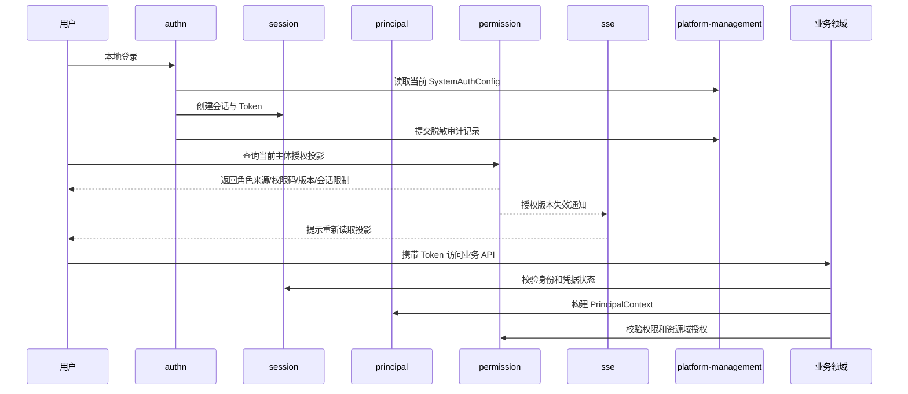

# 统一身份认证与访问控制领域架构参考

## 1. 事实源

- S1：`00_product/domains/identity/product-spec.md`
- S2：`01_contracts/domains/identity/`

本文档只能基于 S1/S2 提炼架构参考。具体 API、schema、错误码、权限码、事件和模块边界以 Identity S2 为准；本版本仍未 Release。

## 2. 模块划分

| 模块 | 架构职责 |
| --- | --- |
| `authn` | 本地登录、Argon2id 密码校验、Token 刷新、局部登出、全局注销 |
| `session` | 认证中心会话、Token 凭据、失效、续期与在线心跳 |
| `user` | 用户注册、用户管理、个人资料、密码修改、首次登录引导 |
| `registration-review` | RegistrationApplication、批准、拒绝和重新申请历史 |
| `user-lifecycle` | 跨 domain 用户删除依赖聚合、短期检查快照和删除重验 |
| `group` | 用户组与用户组成员关系 |
| `role` | 角色、直接/用户组授权、内置角色层级 |
| `permission` | 权限资源、角色权限授权、版本化当前主体授权投影和请求级权限结果 |
| `directory` | 资源共享场景的用户/组最小摘要，不返回角色或在线状态 |
| `service-account` | 服务主体、直接角色、owner 投影、一次性凭据、轮换与撤销 |
| `principal` | 用户/服务主体、凭据状态、可选委托用户和 PrincipalContext |
| `config-consumer` | 消费 platform-management 的系统级认证配置和密码/登录保护策略 |
| `audit-client` | 向 platform-management 提交脱敏审计上下文并处理审计边界 |

## 3. 横向职责

- 为所有业务领域提供当前用户或服务主体、认证状态和授权结果；资源 owner、visibility、project、namespace 和资源状态仍由目标 domain 定义。
- 为前端提供带 `authorizationVersion`、有效角色来源、权限码和会话限制的动态授权投影，但前端投影只用于呈现，后端仍需独立鉴权。
- 为管理后台提供用户、组、角色、权限资源和服务主体管理。
- 为平台审计提供主体、目标、结果和原因等脱敏审计上下文。
- 密码只以 Argon2id PHC 哈希保存；用户在线状态按有效会话的最近活动时间派生，默认窗口为 300 秒。

## 4. 核心链路

```mermaid
sequenceDiagram
  participant User as 用户
  participant Auth as authn
  participant Session as session
  participant Principal as principal
  participant Perm as permission
  participant SSE as sse
  participant Platform as platform-management
  participant Domain as 业务领域

  User->>Auth: 本地登录
  Auth->>Platform: 读取当前 SystemAuthConfig
  Auth->>Session: 创建会话与 Token
  Auth->>Platform: 提交脱敏审计记录
  User->>Perm: 查询当前主体授权投影
  Perm-->>User: 返回角色来源/权限码/版本/会话限制
  Perm-->>SSE: 授权版本失效通知
  SSE-->>User: 提示重新读取投影
  User->>Domain: 携带 Token 访问业务 API
  Domain->>Session: 校验身份和凭据状态
  Domain->>Principal: 构建 PrincipalContext
  Domain->>Perm: 校验权限和资源域授权
```

## 5. 当前阶段边界

- 当前阶段不支持邮箱验证、MFA、可信设备、LDAP/SSO、OAuth2/OIDC 登录、OAuth Provider 和 PAT。
- 首次启动默认创建 `admin` 初始管理员，首次登录必须修改密码和邮箱。
- 用户名全局唯一且不可修改。
- LOCAL 用户可修改当前密码，修改后需要强制重新登录。
- 当前会话通过 `/api/v1/iam/auth/presence/heartbeat` 更新在线活动时间；心跳不延长会话或 Token 生命周期。
- 前后端权限解耦，前端动态权限不替代后端鉴权。
- ADMIN_APPROVAL 注册使用不可变 RegistrationApplication；批准前不创建角色、会话或 Token。
- 用户删除通过各 domain 的受控依赖摘要聚合，任何来源不可用时 fail closed；资源转移仍由目标 domain 完成。
- ServiceAccount 只使用直接角色，owner 不可用时拒绝凭据交换，Secret 仅在创建或轮换时展示一次。
- 系统认证配置和审计查询页面属于 platform-management；Identity 只消费配置和提交脱敏审计上下文。

## 6. S2 合同入口

- `01_contracts/domains/identity/openapi.yaml`：认证、用户、RBAC、资源授权、服务主体和 PrincipalContext API。
- `01_contracts/domains/identity/schema.sql`：用户、角色、权限、授权、会话、Token、服务主体和 Outbox 设计态 schema。
- `01_contracts/domains/identity/errors.yaml`：认证失败、权限拒绝、Token 失效、资源授权和服务主体错误码。
- `01_contracts/domains/identity/permissions.yaml`：Identity 权限码与后端校验边界。
- `01_contracts/domains/identity/events.yaml`：用户、会话、授权、资源共享和服务主体可靠事件，供 platform-audit 消费。
- `01_contracts/domains/identity/module-contract.md`：PrincipalContext、跨 domain 协作、平台配置消费、审计写入、查询预算和安全一致性。
