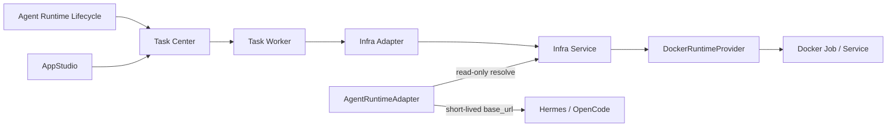

# Infrastructure 领域架构参考

## 1. 运行边界

Infrastructure 是 Docker 运行层，不是业务状态中心。Runtime 创建、停止、删除和其他生命周期写操作统一经过 Task Center；AgentRuntimeAdapter 只有在完成 Agent、Session、Invocation 与 Runtime Binding 校验后，才能使用 Agent 工作负载身份调用只读 Endpoint resolve：



Agent、AppStudio 及其内部 StudioDeploymentProvider 的 Runtime 生命周期写操作只能创建或更新 Task Center 任务。Task Worker 使用 Task Center 服务身份调用 Infra Adapter；Infra Service 内部才拥有 Docker Provider 和 Docker Engine 访问权限。只读 resolve 不改变 Runtime 或 Endpoint 状态，返回地址只供当次 AgentRuntimeAdapter 同步调用使用，不得持久化到 Agent、Task、事件或日志。

## 2. 组件职责

| 组件 | 职责 | 不拥有 |
| --- | --- | --- |
| Task Center | AtomicTask、Attempt、重试、取消、超时、状态和结果投影 | Docker 状态、Agent/AppStudio 业务状态 |
| Task Worker | 消费已注册 `functionRef`，执行 Attempt，流式交付声明输出并回写小型结果 | 业务聚合、Artifact ready 事实、Docker Socket、Provider 私有 API |
| Infra Adapter | 校验并转换业务授权引用，映射 Job/Service、输出声明、幂等、取消和恢复 | 用户命令、宿主机路径、业务数据库 |
| AgentRuntimeAdapter | 校验 Agent 业务绑定后解析 READY Endpoint 并同步调用 Hermes/OpenCode | Runtime 生命周期写入、Endpoint 地址持久化、Docker 私有实现 |
| Infra Service | Runtime、Endpoint、RuntimeOutput、staging、挂载、资源、Secret 注入、日志和 Docker 对账 | Agent、StudioWorkspace、Artifact 业务事实 |
| DockerRuntimeProvider | 第一阶段创建和管理单机 Docker Job/Service，发布命名端口并收集声明输出实际字节 | Task Center、来源领域或 Artifact 状态 |

## 3. 挂载策略

```text
Platform Agent -> AgentWorkspace（按 Agent 授权挂载）
Coding Agent   -> AppStudio Workspace Tool（不挂载 StudioWorkspace）
Preview        -> 应用启动时固定的源码 Revision（内部解析默认 StudioWorkspace）
Build          -> 固定 StudioSourceSnapshot（只读）
Production     -> 固定 Artifact digest（只读）
```

Task Worker 只能使用来源领域生成的 `source_ref`，Infra 不解析业务私有表和宿主机路径。用户和公共 API 不传递 Workspace ID；AppStudio 在后端把应用级源码 Revision 解析为受控 `source_ref`。Production 请求即使携带内部 Workspace、Revision 或 Snapshot，也必须拒绝；它只能使用固定 Artifact。

Docker Job 只能从 RuntimeProfile 约束的受控输出根收集已声明普通文件，拒绝目录、符号链接逃逸和根目录外路径。Provider 读取实际字节、计算 `size_bytes` 与 `sha256:<64 hex>`、复制到 Infra staging 后，RuntimeOutput 才能进入 `COLLECTED`，并只暴露非 bearer 的 `infra-output://<output_id>`。

Task Worker 使用 Task Center 服务身份从 Infra 流式读取实际字节，校验 descriptor、HTTP 响应和实际流的大小与 SHA-256，再按来源任务 producer context调用 Asset Library `create -> content upload -> complete`。Artifact 内容完成且 digest 一致后，Task Worker 幂等调用 Infra `attach-artifact`；Infra 不创建 Artifact ready 事实，也不把 Job 成功提升为 Build 成功。

## 4. Endpoint 发布与解析

RuntimeProfile Revision 定义命名 Endpoint 的协议和容器端口，上层不得提交任意端口。Docker Service 只把这些命名端口动态发布到平台内部接口；端口映射建立且健康检查通过后，Endpoint 才能进入 `READY`。

普通 Endpoint 摘要只返回 `endpoint_ref` 等非敏感事实，不返回 Host Port、私网地址或 `base_url`。只读 resolve 从调用方工作负载身份识别 Agent 或必要的 Task Center 服务，校验 Endpoint/Runtime 健康、owner 匹配且未撤销后，返回带有效期的短时内部 `base_url`；请求体中的服务身份声明不能替代工作负载身份。

## 5. 状态与恢复

`InfraRuntime` 记录 `requestingService=task-center`、`ownerDomain`、`ownerReference` 和 `requestUserId`。`ownerDomain` 只用于稳定关联，不授权 Infra 修改来源领域业务状态。

Task Worker/Infra Adapter 必须使用 AtomicTask 幂等键和已有 `infra_runtime_id` 恢复取消、超时、重试及进程重启，避免重复创建 Docker Job/Service。Infra 原始日志、凭证、容器 ID、Host Port、宿主机路径和 Provider 响应不得进入普通任务结果。

相同 `requestingService + requestId` 只有请求摘要一致时才能重放原结果；摘要不同返回冲突，原失败重试使用新的 requestId。`USER_ACCESSIBLE` Endpoint 必须校验 owner 和当前授权，不能因 Host Port 已分配而成为公开入口。

## 6. 第一阶段范围

当前仅实现单机 Docker、Job/Service、基础资源匹配、受控挂载、Endpoint、Secret 注入和运行状态对账。Kubernetes、Edge、Local Process、多节点调度、自动扩缩容和跨 Provider 兼容属于下一版本规划，不得从当前草稿推导实现契约。
