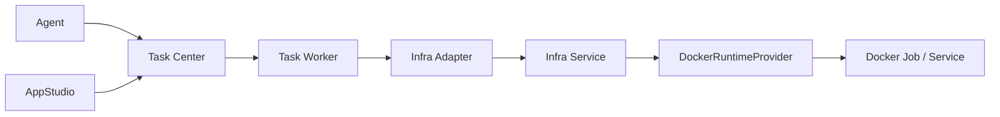

# Infrastructure 领域架构参考

## 1. 运行边界

Infrastructure 是 Docker 运行层，不是业务状态中心。统一调用链为：



Agent、AppStudio 和 Deploy Service 只能创建或更新 Task Center 任务。Task Worker 使用 Task Center 服务身份调用 Infra Adapter；Infra Service 内部才拥有 Docker Provider 和 Docker Engine 访问权限。

## 2. 组件职责

| 组件 | 职责 | 不拥有 |
| --- | --- | --- |
| Task Center | AtomicTask、Attempt、重试、取消、超时、状态和结果投影 | Docker 状态、Agent/AppStudio 业务状态 |
| Task Worker | 消费已注册 `functionRef`，执行 Attempt 并回写小型结果 | 业务聚合、Docker Socket、Provider 私有 API |
| Infra Adapter | 校验并转换业务授权引用，映射 Job/Service、幂等、取消和恢复 | 用户命令、宿主机路径、业务数据库 |
| Infra Service | Runtime、Endpoint、挂载、资源、Secret 注入、日志和 Docker 对账 | Agent、StudioWorkspace、Artifact 业务事实 |
| DockerRuntimeProvider | 第一阶段创建和管理单机 Docker Job/Service | Task Center 或来源领域状态 |

## 3. 挂载策略

```text
AgentRuntime   -> AgentWorkspace（按 Agent 授权）
Coding Agent   -> StudioWorkspace（仅 AppStudio 受控授权）
Preview        -> 当前 Workspace Revision
Build          -> 固定 Workspace Snapshot（只读）
Production     -> 固定 Artifact digest（只读）
```

Task Worker 只能使用来源领域生成的 `source_ref`，Infra 不解析业务私有表和宿主机路径。Production 请求即使携带 Workspace、Revision 或 Snapshot，也必须拒绝；它只能使用固定 Artifact。

## 4. 状态与恢复

`InfraRuntime` 记录 `requestingService=task-center`、`ownerDomain`、`ownerReference` 和 `requestUserId`。`ownerDomain` 只用于稳定关联，不授权 Infra 修改来源领域业务状态。

Task Worker/Infra Adapter 必须使用 AtomicTask 幂等键和已有 `infra_runtime_id` 恢复取消、超时、重试及进程重启，避免重复创建 Docker Job/Service。Infra 原始日志、凭证、容器 ID、Host Port、宿主机路径和 Provider 响应不得进入普通任务结果。

## 5. 第一阶段范围

当前仅实现单机 Docker、Job/Service、基础资源匹配、受控挂载、Endpoint、Secret 注入和运行状态对账。Kubernetes、Edge、Local Process、多节点调度、自动扩缩容和跨 Provider 兼容属于下一版本规划，不得从当前草稿推导实现契约。
